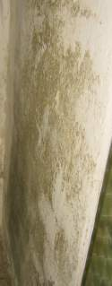

[🠔 Zur Übersicht: Schimmel im Haus](7schim.md)  
# Schimmel an der Wand - Ursache und Beseitigung 4
**Wie Sie durch Kondensatanfall in kühlen Räumen und durch falschen Mörtel sicher Feuchteprobleme und Schimmelbefall bekommen.**  
_von Konrad Fischer_

## Schimmelpilzbefall durch und trotz Dämmung

## Wie Sie durch Kondensatanfall in kühlen Räumen und 

durch falschen Mörtel sicher Feuchteprobleme und Schimmelbefall bekommen

## Schimmel an der Wand - Ursache und Beseitigung 4 [10]

## Fallgruppe Schimmelbefall als Folge nasser Bauteilflächen

Hier geht es zunächst wieder um Kondensat auf kühlen Bauteilen. Da Kellerwände oder unbeheizte Flure gerade gegenüber der feuchtwarmen Sommerluft besonders kühl sind, nehmen sie bei sommerlicher Lüftung geradezu extreme Kondensatmengen auf. 

 
_Zerschimmeltes Mespelbrunn-Puzzle auf kondensatbelasteter freistehender Massivwand eines Lagerraumes. Es ist eben nicht aufsteigende Feuchte, die in unbeheizten Räumen Schimmel und Hausschwamm heranwachsen läßt._

+ 
 
_So beschimmelt und feucht sehen Wand- und Deckenflächen, Farbanstrich mit organischem Bindemittel, in ungeheizten Räumen nach einigen Jahren aus, weil feuchtwarme Außenluft in das Bauwerk immer einströmen kann, dort kondensiert und dann guten Nährboden für Schimmelbefall liefert._

 
_Gibt es neben der Feuchte auch noch Zement+Gips, bzw. C3A+CaSO4, kommt es zur Treibmineralbildung (Ettringit) mit ca. dreifacher Volumenvergrößerung, die dann die Putzhaut (und auch Fliesen) absprengt. Zusätzlich zum krassen Schwarzschimmelbefall._

Lüftung sollte dort also nur erfolgen, wenn die Außenluft deutlich kühler als die Oberfläche der Wände ist. Dies ist in Eingangsbereichen wie in allen ungeheizten Räumen mit Außenluftverbindung natürlich unmöglich. Hier sind feuchtestabile und gut kapillartrocknende Luftkalkputze und Kalktünchen vorteilhaft.

 
_Schwarzschimmelflächen in einem Lagerraum auf einer dispersionsgestrichenen Zementputzfläche auf der Außenseite eines Kühlraums. Die unweigerlich vorzugsweise dort einkondensierende Feuchte wird durch die Kapillartrocknungsblockade aller Dispersionsanstriche (auch "Mineralfarben" als Dispersions-Silikatfarben gehören dazu) und die 10fach erhöhte Wasserrückhaltung von Zementmörteln im Unterschied zu Luftkalkputzen zurückgehalten, der Untergrund feuchtet auf, säuft ab und bietet ideale Bedingungen als Substrat für mikrobiellen Befall._

Die " guten" Dampfdiffusionswerte mancher Synthetikfarben sind leider ohne jeden Belang. Sie blockieren nämlich die kapillare Austrocknung der flüssig vorliegenden Bauteilfeuchte aus den Poren. Wichtig: Der Feuchtetransport in Bauteilen erfolgt 1000fach mehr flüssig als dampfförmig. Die von falscher bzw. unwissender bzw. manipulierter bzw. bestochener Bauphysik vielbeschworene Dampfdiffusion spielt also baupraktisch keine Rolle. 

 
_Unter dem Bodenbelag des luftdurchspülten Gewölbekellers aktiver Hausschwamm. Es sieht aber zunächst nur nach Dreck oder dem Mieter ausgelaufene Farbe aus. Einfache (und preisgünstige) Methoden können hier Abhilfe schaffen, auch wenn mancher "Experte" erst mal vom Hausabbruch, mindestens jedoch von Vollvergiftung schwafelt. Schwammbefallene Teile - und nur diese! - rausschneiden und ausbauen, Konstruktion durch ergänzende Reparatur wieder in Orndung bringen, das haus trocken halten (Holzfeuchte < 15%, Raumluftfeuchte < 65%), das sollte genügen. Dafür am besten ausreichend [permanente Frischluftzufuhr durch Fensterfugen ohne Dichtlippe](23bausto.md) und [Temperierung der Gebäudehüllfläche durch Strahlungsheizung](7temper.md)._

Die zweite Feuchtequelle kommt aus der Baugrube. Dabei handelt es sich meist nicht um [sogenannte "aufsteigende" Feuchte](2aufstfe.md). Diese ist im üblichen Mauerwerk geradezu unmöglich: es gibt nämlich keinen Kapillartransport zwischen kleinporigen Mauersteinen und grobporigem Mörtel. Nachträgliche Horizontalisolierungen und Injektagen sind also nicht zielführend, sondern schädigen den Geldbeutel und das Mauerwerk. 

 
_Die besonders sommers blühende Veralgung und die abbröselnde Farbe sind keine Folge["aufsteigender Feuchte"](2aufstfe.md), Teuermaßnahmen wie eine nachträgliche Horizontalisolierung oder Sanierputz helfen hier nichts. 

Insbesonders Sanierputze sind bei Schimmelpilzbefall geradezu pures Wandgift: Sie können dank wasserabweisender Ausrüstung kein Kondensat puffern, sondern reichen die Feuchte an der Oberfläche an, die ja genau wegen der Wasserabweisung / Hydrophobie immer mit kunstharzhaltigen und deswegen als hervorragende Nahrungsmittel / Substrate für Schimmelpile einzustufenden Anstrichsystemen zu beschichten sind._

Die wahre Feuchteursache ist meistens eine wasserdichte Baugrube, wasserdurchlässig verfüllt, vielleicht verstärkt durch setzungsbedingt undichte Abwasserrohre. Bei ausgiebigen Regenfällen füllt das Wasser die Grube und überwindet die gegebene Bauwerksabdichtung dank hohem Staudruck von der Seite, aber auch von der Bodenplatte her als drückende Feuchte. Eine fehlerhafte Drainage kann zusätzlich Stauwasser heranführen. 

Am besten wäre hier eine lagenweise Abdichtung der Baugrube mit wasserdichtem Deponieton von unten her. Ob eine nur oberseitige deckelartige Abdichtung mit Deponieton für Garten- und Landschaftsbau hilft, künftiges Absaufen der Baugrube zu verhindern oder auf ein unschädliches Maß zu beschränken, muß vor Ort entschieden werden. Als verhältnismäßig einfache Methode ist dies auch in Selbsthilfe vorstellbar. Undichte Grundleitungen können durch Videobefahrung kostengünstig geortet werden und sind dann im erforderlichen Umfang zu reparieren.

Falls aber die durchfeuchtete Wand auch schadsalzbelastet ist - meist Nitrate wie das Calciumnitrat / Kalzium-Nitrat / Ca(NO3)2, der sogenannte "Mauersalpeter" oder Kalksalpeter als Produkt von Kalk aus dem Baustoff und Ammoniumnitrat (NH4NO3) aus Fäkalien oder Düngemitteln oder auch Kochsalz NaCL (Streusalz, Pökelsalz - Mischung aus Kochsalz und Natriumnitrit, Sauerkrautlake, Heringslake) sind hier die am häufigsten anzutreffen Schadsalze - sind die Voraussetzungen für Schimmelpilzwachstum / Schimmelpilzbewuchs nicht gegeben. 

 
_Kein Schimmelpilzwachstum auf schadsalzbelasteten durchnässten Wänden!_

Warum? Zunächst hat das Wachstum von Schimmelpilz auf Oberflächen bzw. in Stoffen als Voraussetzung, daß dort eine organische Nährsubstanz (Substrat) vorhanden ist, dann braucht es ein leicht saures Milieu und gewisse sonstige Voraussetzungen an Feuchtegehalt und Temperatur. Auf einer salzbefrachteten Wandoberfläche fehlt es nun genau am organischen Subtrat und dem Säuregehalt. Und wie jede gute Hausfrau weiß (nicht jeder Schimmelpilzbeseitigungsexperte wird es als "guter" Geschäftsmann dem leichtgläubigen Kunden verraten), sind Nitrate und Kochsalz als Konservierungsmittel eine sichere Sache, um auf organischen Materialien den bakteriellen Angriff von Mikroorganismen und eben auch das Pilzwachstum zu verhindern. 

Im Falle schadsalzbelasteter Wände geht es um die [Beseitigung der Feuchtequellen und der Salzbelastung](2aufstfe.md), bei der auch viele Fehler gemacht werden können, jedoch nicht um die Schimmelpilzbekämpfung. 

Aus gesundheitlicher Sicht geht also von schadsalzbelasteten und deswegen (Hygroskopie der Salze) feuchten Wänden keine Schimmelpilzgefahr aus. Und die angebliche Feuchtemessung mit elektrisch arbeitenden Gerätchen (Widerstandsmeßgerät), beliebtes Spielzeug der Sachverständigen, mißt mit seinen Digits bzw. Prozentangaben auf salzbelasteten Wänden keinesfalls den Feuchtegehalt in Volumenprozent oder Masseprozent, sondern lediglich die elektrische Leitfähigkeit zwischen den beiden Elektroden des Gerätes, die ganz wesentlich auch von der Ionenwanderung der im Baustoff eingelagerten und in mehr oder weniger Wasser gelösten Salze abhängt.

[Hier weiter: 11](7sch11.md)
