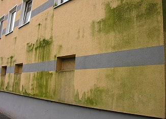
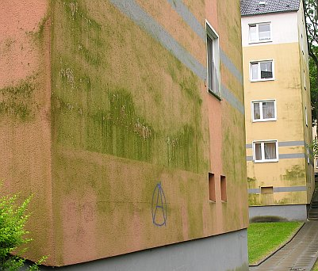
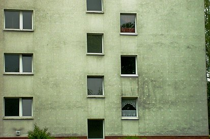
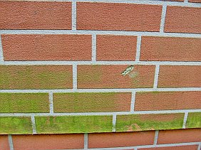

[🠔 Zur Übersicht: Schimmel im Haus](7schim.md)  
# Hausisolierung: Schimmel, Algen & gedämmte Dübel/Dämmdübel
**Die Wärmedämmfassade / Fassadenisolierung / Fassadendämmung: Algenbefall & Stockflecken durch Wämrdämmung? - Ein ungeschminkter Ratgeber**  
_von Konrad Fischer_

Schimmelpilzbefall durch und trotz Dämmung 11

### Die Wärmedämmfassade / Fassadenisolierung / Fassadendämmung: Algenbefall & Stockflecken durch Wämrdämmung? - Ein ungeschminkter Ratgeber

## Schimmel an der Wand - Ursache und Beseitigung 5 [11]

## Fallgruppe Schimmel und Algen auf der Fassade

Ungünstige Bewitterungsverhältnisse und schadensträchtige Bauweisen wie Wärmedämmsysteme sind die Voraussetzung für schwarz, grün und braun befallene Fassaden. Ein wasserrückhaltender und trocknungsblockierender synthetisch "vergüteter" Anstrich oder gar Kunstharzputz bietet meist die Voraussetzung für den Befall. Hier kann dampfförmiges Luftkondensat und durch das versprödete Rißnetz in der Beschichtung auch Regen eindringen und den Untergrund auffeuchten. Die kapillardichte Beschichtung blockiert dann die Trocknung. 

Aktuelle Fallbeispiele von Schimmel und Algen auf Hausisolierungen / Fassadendämmung: 
   

Obendrein bietet ein synthetischer Anstrich geradezu perfekte Besiedelungsbedingungen für Algen und Pilze. Deswegen werden solche Anstriche mit Algiziden bzw. Fungiziden vergiftet. Helfen kann das nur kurz, die Gifte sind ja wasserlöslich und werden durch Beregnung ausgespült. 

Bei bauphysikalisch empfohlenen [Dämmfassaden ohne ausreichende Speicherfähigkeit](213baust.md), egal ob aus geporten Steinen, Schäumen oder Gespinsten kommt noch erschwerend hinzu, daß sie am Abend sehr schnell unterkühlen. Die dann ebenfalls abkühlende Luft kondensiert dann in die kalten Fassaden ein und liefert die Wachstumsvoraussetzungen für Schimmel und Algen. Wobei die etwas besser speicherfähigen Dübelteller tendenziell etwas trockener bleiben und deswegen etwas weniger befallen werden. Das mag die Industrie offenbar gar nicht. Sie hat dagegen schnell "Abhilfe" gefunden und bietet nun einzeln gedämmte Dübel mit "Luftpolster über dem metallischen Anker" an, neuerdings auch die Wärmedämm-Fassadenheizung, also das Aufheizen der tauwassergefährdeten Dämmfassaden durch eingebettete Elektroheizung oder Warmwasser-Heizungsrohre ... In den USA wurden die hierzulande üblichen WDVS-Systeme (Verputzte Dämmschicht, auf Altfassade geklebt und/oder gedübelt, sog. Wärmedämmverbundsystem/Vollwärmeschutz-Fassade) auf Holzfassaden übrigens schon ab 1996 staatlich und durch die Bauordnungen verboten. Grund: Über 90 Prozent der gedämmten Häuser hatten gravierende Feuchteschäden, Hausschwammbefall, schwerste Erkrankungend er Bewohner. In Deutschland werden diese schadensgeneigten Dämmsysteme dagegen staatlich vorgeschrieben und damit auf die Wand der ahnungslosen Bevölkerung gezwungen. Info: [US-Verbot der WDVS-Fassaden](2133bau.md)

Nun kann man befallene Fassaden als Dauerbaustelle pflegen, also immer wieder reinigen, Risse reparieren, neu beschichten mit vergifteten Anstrichen. Dazu raten viele, die ein armer Bauherr als ausgewiesene Fachleute präsentiert bekommt und die immer wieder "noch besser", "heute bauphysikalisch optimiert", "die perfekte Lösung" und dergleichen Wunder bis zu "selbstreinigenden Kunstharz-Fassadenanstrichen" verheißen. Die klassische Fassadenreparatur mit befallshindernden Kalkprodukten, ausreichendem Witterungsschutz und - wenn es wirklich sein muß - gut trocknungsfähigen hinterlüfteten Verschalungen bietet dazu eine sinnvolle Alternative. 

 
"Algenbefund auf der WDVS-Fassade" aus "[Forschung] Wärmedämmung; Zur EnEV: 1. Grünes Hinweisschild + 2. Schotten dicht" 
in: [Bautenschutz+Bausanierung, Zeitschrift für Bauinstandhaltung und Denkmalpflege](http://www.bautenschutz-bausanierung.de), Januar 2002, S. 44, Bildautor: Hochschule Wismar, Bildbearbeitung K.F.
