[🠔 Zur Übersicht: Altbau Restaurierung](20bausto.md)  
# Schimmelpilzbefall durch und trotz Dämmung und Dichtung
**Wie bekämpfen, wie vermeiden? Was wirklich hilft.**  
_von Konrad Fischer_

## Schimmelpilzbefall durch und trotz Dämmung und Dichtung 
Wie bekämpfen, wie vermeiden? Was wirklich hilft.

> [!abstract]+ Kapitelübersicht: Schimmel im Haus  
> 1. **Schimmelpilzbefall durch und trotz Dämmung und Dichtung**
> 2. [Fogginginfo](7sch02.md)
> 3. [Das Schimmelgeschäft der selbsternannten Schimmeljäger, Schimmelsachverständigen und Schimmelexperten](7sch03.md)
> 4. [Schimmelsachverstand/Schimmel-Sachverständige & Schwachverstand, Schimmelgutachter und Schlechtachter [4]](7sch04.md)
> 5. [Schimmelpilzbefall durch und trotz Dämmung](7sch05.md)
> 6. [Schimmelpilz und Medizin](7sch06.md)
> 7. [Die Schimmelpest 7: Weisser, brauner, schwarzer, grüner, roter Schimmel an der Wand - Sanierung - Leitfaden 1](7sch07.md)
> 8. [Schimmel an der Wand - Ursache und Beseitigung 2](7sch08.md)
> 9. [Schimmelpilzbefall durch und trotz Dämmung](7sch09.md)
> 10. [Schimmel an der Wand - Ursache und Beseitigung 4](7sch10.md)
> 11. [Hausisolierung: Schimmel, Algen & gedämmte Dübel/Dämmdübel](7sch11.md)
> 12. [Schimmel an der Wand - Ursache und Beseitigung 6](7sch12.md)

🇬🇧**[English version - Mold attack - What to do? - Get rid with spreading mold](7mold.md)** 

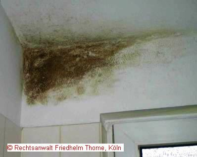 DIMaGB.de - K. Fischer: [Schimmel und Algen an der Wand](http://www.dimagb.de/info/bauneu/schiml1.html#sadw#sadw) und auch in baumarkt.de: [Schimmel an Wand, Fassade und im Keller](http://www.baumarkt.de/b_markt/fr_info/schimmel.htm) 
baumarkt.de - K. Fischer: **[Energiesparen ohne Schimmel](http://www.baumarkt.de/b_markt/fr_info/energiesparen.htm)**

## Herzlich Willkommen!

Was suchen Sie hier? Haben Sie oder Ihre Lieben (Mieter?) Schimmelprobleme? 

Schwarzer, roter, grüner, gelber oder auch brauner Schimmel? Wo denn, bitteschön? Na klar, vielleicht an Ihren Wänden und Decke hier und da, im Schlafzimmer hinter dem Bett, am Sockel und in den Fensterecken bzw. der Innenlaibung, im Bad im Decken-Ixel, in der Dusche oder im Kinderzimmer an der Sockelleiste, an den Decken und Wänden und an den Silikonfugen und hinter den Fliesen und hinter den Tapeten, auf den Fliesenfugen des Badezimmers, an der Abdeckleiste oder hinter den Wandschränken in der Küche, am Speisekammerfenster, am Keller-Fußboden, am Fensterrahmen und am Dachfenster neben und in der Dämmung? Auf dem Fensterkitt der Fenster, hinter und unter den Sitzmöbeln, der Schrankwand oder auch im Kleiderschrank? 

Gerne alljährlich wiederkehrend zum Beginn der Heizsaison im Herbst? Und immer wieder ist das böse Haus schuld? Baufeuchte? Fehlende Dämmung? Oder gruselige Löcher im Dach, den Regenrinnen, der Wasserleitung, dem Heizungsrohr oder sonstwo, damit das Tropfwasser die schlecht beheizte und nie gelüftete Bude schwitzen und aufschwemmen läßt. Und niemals ist ein Mieter schuld? Ach ja? 

Schimmelpilzbefall in Gewerberäumen bzw. Produktionsräumen? In der Backstube, dem Backwaren-Zwischenlager, den sonstigen Feuchtraum-Bereichen der Bäckerei, in der Käserei und im Käselager der Molkerei, hinter den Wurststapeln der Fleischerei / Metzgerei, in Gastronomie-Großküchen, in allen sonstigen Betriebsräumen in Gaststätten, Wirtshäusern, Lebensmittelbetrieben usw., die betriebsbedingt unabwendbar (?) erhöhter Luftfeuchte ausgesetzt sind? Die Gewerbeaufsicht / die Lebensmittelkontrolle droht mit Betriebsstillegung und Zwangsschließung wegen gravierender Hygienemängel? Bußgelder der Lebensmittelüberwachung, Insolvenzgefahr durch nicht beherrschbaren Pilzbefall, der auch nach Beseitigung fast unverzüglich wieder aufflammt und bei den turnusmäßgen Stichproben der Lebensmittelkontrolleure dann schnell wieder entdeckt wird? 

Und jetzt wollen Sie wissen, wie Sie den Schimmel sicher und ohne größere Umstände und vor allem ohne tausendseitiges Expertengedöns auf wehrlosem Papier rund um die vielfältigen Spezies irgendwelcher Schimmelarten und feinsäuberlich im Hunderttausender- oder Millionenbereich ausgezählter KBE (Kolonie bildende Einheiten) - was auf die notwendigen Maßnahmen zur Reinigung und Vorbeugung / Verhinderung ja so gut wie keinen wesentlichen Einfluß hat - auf immer und ewig beseitigen können, die befallenen Bauteile kostengünstig aber todsicher sanieren und/oder wer schon alles mit welchen Tricks darauf wartet, arme, vielleicht auch allzureiche oder gar schon kranke Schimmelopfer wie Sie mit den bösesten Tricks an der ausgebrochenen Verzweiflung zu packen und dann mit Weißkragen- oder typischen Blaumanntricks hereinzulegen? Hunderttausende Handwerker und zigtausende Experten warten schon genau auf Sie, um Sie mit fantastisch ungeeigneten Maßnahmen voller Gift und Blödsinn zum Dauerkunden zu machen ... 

Beispielsweise durch übelst vergiftete Antischimmelmittel? Durch unwirksamsten, ja geradezu schimmelförderndsten Baupfusch wie durch neue Wärmeschutzfenster, durch selber schimmelpilzgefährdete Dämmung/Wärmedämmung als WDVS-Fassadenisolierung oder gar Innendämmung oder [Dachisolierung](21316bau.md), die dann selbst schnell verpilzt - anstelle simpler und hundertprozentig schimmeltodsicherer Maßnahmen? Vielleicht im Do-It-Yourself gleich selbst zu erledigen? Uninteressant? Keine Zeit zum Nachdenken? Nur Knopfdruck-Radikalkur gewünscht, egal, was dabei am Ende rauskommt? Dann Tschüß und ab! Oder vielleicht doch nicht? 

Allerdings: Null Chance gegen den Schimmel gibt es, wenn der heizvergeizte Nutzer steif und fest daran festhält, daß das Haus selber dran schuld ist, daß seine eigene Feuchteproduktion in Dusche und Bad, Küche und Wohnzimmer, Schlafzimmer, Kinderzimmer und Wäschetrockenraum in bösen Schimmelbefall an Wand, Fenster-Lippendichtungen, feuchte Raumecken und Kondenswasser in Sturzbächen an den Isolierfenstern führt. Und deswegen in seiner verbiesterten Schuldzuweisung an das böse Haus alles vermeidet, um durch korrektes Heizen, Lüften und Trocknen dem Schimmelpilzbefall den Garaus zu machen. Schlaumeierweise dann - wie so oft bis fast immer - ausgerechnet vor dem angekündigten Besuch des Schimmelexperten bzw. Schimmelgutachters bzw. Schimmelpilz-Sachverständigen das erste mal im Leben die Wohnung dolle durchheizt und im Schlafzimmer die Fenster auf Durchzug öffnet. Wie blöde solche Betrüger sind, zeigt sich daran, daß sie tatsächlich glauben, ein echter Experte sieht das nicht voraus und hätte keinerlei Ahnung von der perversen Psychologie von heizgeizerkrankten Sparfüchsen und Sparfüchsinnen und keine Hilfsmittel und Möglichkeiten, solche Betrügereien beweiskräftig und sofort zu entlarven. Ha, ha! Wofür hat man denn sein elektrisches Widerstandsmeßgerät - vulgo Feuchtemeßgerät, sein Temperatur- und Luftfeuchtemeßgerät und vor allem seine Wärmebildkamera / IR-Kamera dabei? Eben. 

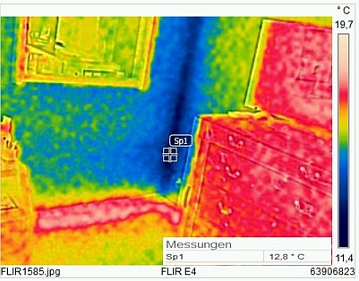 
Ein Bild mit der Wärmebildkamera / Infrarotkamera auf ein typisches Schimmeleck im Schlafzimmer. Kurz vor Termin wurde die Heizung gestartet, die Rohre unter der Sockelverkleidung glühen schon auf 19 °C, die Wandoberflächen sind knapp über 15, der Boden knapp über 14 Grad, die nasse Ecke, in die die Heizluft nicht richtig reinkommt, 12-13 °C kalt. Hier ist das Aufnässen aus abgeschwitzter, gekeuchter und geschnarchter Atemluftfeuchte, angereichert mit Überschlag von nicht ausreichend abgelüfteter Duschfeuchte mit zwangsweise nachfolgendem Schimmelpilzbefall vorprogrammiert. 

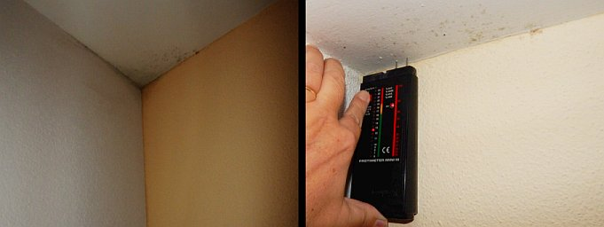 
So feucht wird es im Schimmelpilzbefall in der von der Heizluft ausgesparten Wand-Decken-Ixel-Ecke, wenn nie richtig geheizt und gelüftet wurde. 

Hier ein weiteres Beispiel aus meinen die Schimmelpest betreffenden Beratungsanfragen, das die Problemlage im Wohnungsbereich recht typisch zeigt (Mail vom 23.02.2009) und vielleicht auch auf Ihren Schimmel mehr oder weniger zutreffen könnte: 

_"Mein Sohn wohnt seit ca zwei Jahren in E... in einer Mietwohnung von ca. 1970 mit ca 120 qm im Parterre. Das Haus wurde vor zwei Jahren komplett mit acht cm Styropor außen isoliert, außerdem wurden neue Kunststofffenster eingesetzt. Das Haus ist komplett unterkellert, allerdings finden sich im straßenseitigen Anteil des Hauses zwei große Keller-Garagen, die etwa ein Drittel der Kellerflächen einnehmen, nach oben nicht isoliert sind und mit einfachen Blechtoren verschlossen sind. Vor allem an kalten Wintertagen kommt es zu einem gravierenden Anstieg der Raumfeuchte auf über 70%, alle Fenster beschlagen massiv, vor allem an den Außenwänden läuft Wasser herunter, Pfützen am Boden vor den Wänden und auf den Fensterbänken müssen täglich aufgewischt werden. Vorwiegend im Schlafzimmer, welches sich oberhalb der Garage befindet, entwickelte sich hinter den Betten im Bereich der Außenwand ein massiver Schimmelpilzbefall. Zweimal tägliche mehrminütige Stossbelüftung in allen Räumen führt nur zu einem kurzzeitigen Abfall der Raumfeuchte. Wie soll man das Problem, das sicherlich in Kürze zu gesundheitlichen Schäden führt, lösen?"_ 

Nun, bestimmt nicht durch eine noch dickere Außendämmung oder Innendämmung oder noch bessere Wärmeschutzfenster oder viermal tägliche Stoßbelüftung, die genau die schimmelkritischen Bauteile nicht vom eingespeicherten Schwitzwasser befreit - dazu bräuchte es - Überraschung!!! - WÄRME! - sondern eiskalt weiter abkühlt, damit sie nach der erkältenden Zuglüftung der Raumluft noch wesentlich mehr Überschußfeuchte entziehen - oder die typische Handwerksmeister-Behandlung mit grusel-gifthaltigen Schimmelblockern aus den Hexenküchen der Bauchemie. Ein typisches Schimmelpfusch-Beispiel gefällig? 

Die Kalziumsilikatplatten / Calciumsilikatplatten / Kalziumsilikat-Platten / Calciumsilikat-Platten / Kalzium-Silikat-Platte / Calcium-Silikat-Platte / Calcium-Silikatplatte / Calzium-Silikat-Platte / Kalzium-Silikatplatte / Kalcium-Silicat-Platte / Wohnklima-Platten / CaSi-Platte / KaSi-Platten / CalSi-Platte / KalSi-Platten und wie sie sonst noch im Handel bezeichnet werden mögen, nicht nur als Innendämmung aus energetischen Gründen zur hochpreisigen Geheimwaffe hochgejubelt und mit allerlei netten Eigenschaftsmerkmalen dem ahnungslosen Kunden überzeugend dargeboten werden - nein, auch als Heilmittel gegen feuchte Wände, wenn es muffelt und bei Schimmelbefall soll die Kalksandplatte wahre Wunder bewirken. Na freilich mag damit eine zunächst trockenere Wandoberfläche hergestellt werden. OK, die Verdunstungseigenschaften des CS-Platte / KS-Platte für sich genommen mag schon gut sein. Doch wie sieht es aus, wenn das Zeugs mit kunstharzhaltigen Pampen beschmiert wird, die zwar als diffusionsoffen angepriesen werden, jedoch die 1000-fach wirkungsvollere Kapillarentfeuchtung feuchter Untergründe nahezu komplett unterbinden? Und wegen Raumabdichtung dank Blower-door-Test BDT, hermetisch lippendichter Isolierfenster und Abdichtfolien / Dampfsperren sowie Dämmung in den hochwärmegedämmten Neubauten (Passivhaus, Niedrigenergiehaus) und nachträglich verdämmten Altbauten im Fall unzureichender stetiger Trockenluftzufuhr / Raumlüftung extreme Luftfeuchte nach wie vor Kondensat in die Raumoberflächen einspeist? 

Hier eine Antwort, die die Kalziumsilikatplatte selbst geliefert hat ([Bild: Flickr-Album von Edi Bromm](http://www.flickr.com/photos/11672694@N08/sets/72157601498882984/)):  Die Wandflächen wurden nach Schimmelbefall mit Kalziumsilikatplatten verkleidet - und prompt wächst der Schimmelpilzbefall eben darauf. 

Und wie sieht es mit der den Schimmelgeplagten leider immer wieder angepriesenen Außendämmungen bzw. Fassadendämmung durch ein Wärmedämmverbundsystem WDVS aus? Wissen Sie, was Ihnen dann blüht? Beispielsweise sowas? 

 .  . 

Sehen Sie, genau deswegen sind Sie herzlich willkommen auf dieser Infoseite über die Pest unserer Zeit (nein, nicht der [Klimaschwindel](7klima.md) und unsere [korrupten Politlügner](7argus.md), wie Sie vielleicht denken), sondern der Schimmelbefall in etwa der Hälfte unserer Wohnungen und der damit verbundenen Abzocke. Mit stetig wuchernd wachsend steigender Tendenz. 

 Interview Klimaschutz, Energiesparen, Schimmelpest + Schimmelwucher: 
 

 
_Sogar das Fraunhofer-Institut für Bauphysik bemüht sich bisher vergeblich, den Dämmschwindel aufzudecken: Alle nicht speicherfähigen Dämmfassaden saufen tauwasserbedingt auch nach seinen Untersuchungen aus bauphysikalisch unabwendbaren Gründen ab und leiden deswegen unter Nässe, Frost und Algen. In der berühmt-berüchtigten Geheimstudie - (ich konnte sie mir aus dem Ausland besorgen) widerlegten die Fraunhofer-Messungen auch den wohl ekelhaftesten Schimmelscherzpertenbetrug, wonach Außendämmung zu einer schimmelbefallsvermeidenden Erhöhung der Wandtemperatur an der Innenseite führen würde, ich zitiere aus _"Effektiver Wärmeschutz von Ziegelaußenwandkonstruktionen, 3. Untersuchungsabschnitt EB-8/1985"_ , Blatt 8, letzter Absatz: 

_"dem Innenraum (wird) zu keinem Zeitpunkt über die nichttransparente Wandfläche Wärme zugeführt."_ 

Und Energieersparnis? Nullinger - wg. nasser Dämmschicht und geblockter Solareinstrahlung - im krassen Gegensatz zu klassischen, jahraus und - ein trockeneren solarspeicherfähigen Massivfassaden. 

Sinnvoll Energiesparen durch Wärmedämmung? Ein Schnulli der Dämmfans, den Ihnen auch zertifizierte Energieberater, treuhänderisch verpflichtete Planer und sonstige Schimmelexperten / Sachverständige - als Erfüllungsgehilfen der Dämmproduzenten? - aufschwätzen und Sie so zum Gesetzesbrecher machen. Die Wärmedämmung verstößt nämlich meistens gegen das Wirtschaftlichkeitsgebot des § 5 Energieeinsparungsgesetz EnEG. Warum nicht einfach Wiedergutmachung und Schadensersatz erforden, wenn Sie bemerken, daß Ihre Dämminvestition sich nicht innerhalb 10 Jahren Amortisationszeit rechnet? Ein guter Rechtsanwalt hilft da weiter! 

Und diese Download-Info: **[Unwirtschaftliche Energiesparplanung - Die Planer-Haftungsfalle!](../medien/wia.pdf)**_ 

  
  
[Teil 2](http://www.youtube.com/watch?v=Y1NSxAW15Cc) [Teil 3](http://www.youtube.com/watch?v=RAT7VzBo8k0) [Teil 4](http://www.youtube.com/watch?v=6TBII25iVQk) [Teil 5](http://www.youtube.com/watch?v=Kb0C4KiZvVA) 

 Hier wollen wir uns fragen, wie kommt es zu der Schimmelpest, wer ist schuld, wer hat recht, und vor allem - was kann man dagegen tun, wie bekommt man den Schimmel und die Feuchte wieder weg und vermeidet den - immer drohenden - künftigen Schimmelpilzbefall mit Stachybotrys chartarum, Aspergillus niger / fumigatus / versikolor / Chaetomium und wie sie sonst alle heißen, unsere schwarzgrünrotgelben Schimmelchen? Genau - Sie denken mit: SchwarzGrünRotGelb ist mit dran schuld. Doch sehen Sie erst mal weiter, dann gehen Ihnen nicht nur politisch die beschimmelten Glotzerchen auf ... - und studieren Sie mal diese Fallbeschreibung, die viel Stoff zum Nachdenken bietet: [Sanierung der Wärmedämmung in den Außenwänden eines Fertighauses](http://www.bau.de/forum/werhat/2070.htm) 

Und lesen Sie auch mal hier: _[DIE WELT am 08.02.2008: "Rückkehr der Schimmelpilze in Deutschland](http://www.welt.de/wirtschaft/article1647581/Rueckkehr_der_Schimmelpilze_in_Deutschland.html) - Dieser Pilz kann lebensbedrohlich sein – und er ist auf dem Vormarsch in Deutschland. Bundesweit sind schon mehr als drei Millionen Wohnungen vom Schimmel betroffen." ... "Ursache (des krankmachenden Schimmelpilzbefalls) ist die starke Dämmung der Außenwände ... "Befall gibt es heute vor allem in Neubauten und sanierten Altbauten" ... Je öfter aber Eigenheimbesitzer (wg. unabdingbarer Ablüftung der viel zu hohen Raumluftfeuchte) ihre Fenster aufreißen, um Schimmelbildeung in ihren Häusern zu vermeiden, desto stärker steigt der Heizenergiebedarf. ... Frage, ob die Energieeinsparverordnung ökonomisch überhaupt sinnvoll ist. ... Durch die hohen Dämmauflagen ... sind die Kosten für Eigenheime ... um 10 000 bis 20 000 Euro gestiegen ... Neubaugeschäft weitgehend zum Erliegen gekommen."_ 

Und in der Printversion, ebenfalls vom 8. Februar, ist zusätzlich zu lesen: 

_"Das Comeback der Schimmelpilze - Drei Millionen Wohnungen und Häuser betroffen - Ursache ist die starke Dämmung der Außenwände. ... Sie sind winzig, aber höchst gefährlich: Vom Bronchialasthma bis hin zur mitunter tödlich verlaufenden Infektionskrankheit Mykose reichen die Schäden, die Schimmelpilze am menschlichen Körper anrichten können. Das schlimmste dabei: Die kleinen Sporenwesen sind rapide auf dem Vormarsch. "Befall gibt es heute vor allem in Neubauten und sanierten Altbauten" ... mehr als drei Millionen Wohnungen und Häuser sichtbar vom Schimmel befallen ... Dunkelziffer nicht erkannter Infektionen weit höher eingeschätzt. ... Hauptursache für die neue Schimmelinvasion (ist die) im Februar 2002 in Kraft getretene Energieeinsparverordnung (EnEV). Darin hat die Bundesregierung festgelegt, dass die Außenbauteile von Neubauten und sanierten Altbauten luftdicht ausgeführt werden müssen, damit möglichst wenig Wärme entweicht. "Dadurch bleibt aber auch die Feuchtigkeit in den Räumen gefangen und läßt die Schimmelsporen sprießen" ... Umweltbundesamt in einer Studie über die Konsequenzen aus den EnEV-Vorgaben: "Erhöhte Konzentrationen flüchtiger organischer Verbindungen und Schimmelpilzwachstum auf feuchten Wänden können die Folge sein und dadurch gesundheitliche Folgen mit sich bringen." Vor einführung der Energieeinsparverordnung hatten ökologisch orientierte Architekten und Politiker von SPD und Grünen argumentiert, eine stärkere Wärmedämmung werde verhindern, dass Feuchtigkeit an den Innenwänden kondensiert und eine Schimmelbildung damit unmöglich machen. " Die Praxis beweist in vielen Fällen das Gegenteil" heißt es nun in einem weiteren,["Dicke Luft in luftdichten Gebäuden"](http://www.umweltbundesamt.de/gesundheit/innenraumhygiene/dicke-luft.htm) betitelten Papier des Umweltbundesamtes. "Es kann in solchen Häusern durch falsche Lüftungszeiten sogar im Sommer Schimmel geben." _ 

Und die Frankfurter Neue Presse meldet am 6. April 08: _"[Schimmel in Wohnungen wird zur Massenplage](http://www.rhein-main.net/sixcms/list.php?page=fnp2_news_article&sv%5Bid%5D=4440711). Schimmel in der Wohnung wird zu einem immer größeren Problem. Verdächtige Flecken, Fädchen an Wänden und Decken, muffiger Geruch: Immer mehr Bürger werden der Gesundheitsgefahr in den eigenen vier Wänden nicht mehr Herr. ... Feuchtigkeitsprobleme sind meist hausgemacht, durch falsches Heizen oder Lüften und immer öfter auch als fatale Folge energetischer Gebäudesanierung. ...Jedes zweite Haus ist ... mittlerweile vom Schimmelpilz befallen. Neu- wie Altbauten, auch Gebäude, die jahrzehntelang schimmelfrei waren. Viele Bewohner merken nichts, weil manche Pilzarten unsichtbar wuchern. Schimmel sei weiter verbreitet als Schädlingsbefall durch Kakerlaken, Ameisen oder Silberfische ..."_ 

[ 
© Götz-Wiedenroth-Karikatur](http://gwiedenroth.googlepages.com/): Klima-Kamikaze (durch Energiepass-Weltklasse): 
"Ich habe mich zur CO2-Einsparung für Maximaldämmung entschieden - Für die Schimmelpilze in dieser Wohnung hat sich das Klima schon total verbessert!"

Aha, offenbar wacht die Presse langsam, aber sicher auf. Wann ist es wohl endlich vorbei mit der Öko-Lobhudelei? Wenn die Wohnbevölkerung durch Ökopolitik vollständig ausgerottet ist? Mit der ultmativen "Endlösung" durch Verrecken und Vergasung im eigenen Mief? Ist dann die Mutter Erde namens Öko-Göttin Gaia (James Lovelock) geheilt vom Befall durch den Parasiten Mensch? Hier mal ein paar typische Befallsbeispiele in verdämmten Altbauten: 

_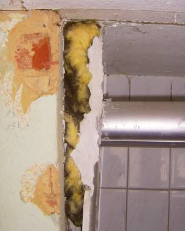 
Schimmel im Bad I - Hinter der Wandverkleidung wurde mit Mineralfaserdämmung / Mineralwolle "gedämmt". 
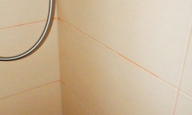 
Schimmel im Bad Ia - Rotschimmelbefall auf und in der Fliesenfuge. Der Fliesenleger - ein wahrer Experte, was die Schimmelpilzzucht betrifft - hat einen "vergüteten" synthetikhaltigen Plastefugmörtel eingesetzt. Mmmmh! Das schmeckt dem Rot- und auch dem Schwarzschimmel wirklich vortrefflich! Organische Chemie im früher nur zementären Fertigmörtel - ein besseres Schimmelpilzsubstrat als Ernährungsgrundlage mit hohem Feuchterückhalteeffekt gibt es kaum. Solche Spezialhandwerker ernähren ganze Expertenbataillone. Abreinigen? Mit giftigsten Giftstoffen, Mann gönnt Frau ja nix. 

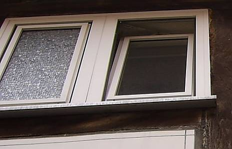 
Isolierfenster mit Gummilippen-Dichtung - das schmucke linke Plastikfenster aus der alchymischen Hexenküche der Kunststoff-Industrie belichtet das Fachwerk-Bad - hielten das feuchtschwitzige Stübli angenehm dicht. Was passierte? Klaro - Schwarzschimmelbefall! Genauso wie in allzuvielen Dachdämmungen und Zwischensparrendämmungen. Sie brauchen nur nachzusehen, es geht schnell! 

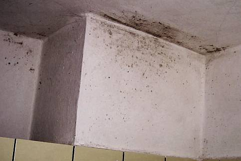 
Schimmel im Bad II - Schwarz-Schimmelpilzbefall über der Dusche. Erst mal mit Heizlüfterli das unterkühlte Bädli schön warmgeheizt, dann feste warmgeduscht und abgedunstet - natürlich bei dichtem Fenster! Und dann gewundert, was da so schwarz auf der zellulosehaltigen "Kalk"-Farbe" erst sprenkelt und dann - dank der idealen holzigen Bio-Nährgrundlage - immer dichter wuchert: Da wiehert der Schwarzschimmel. Und zwar immer wieder, denn diese Flächen wurden mehrmals schon gereinigt und immer wieder mit Schimmelzucht-Zellulose-Öko-Kalkpampe nachgestrichen. Pfui Deibi! 

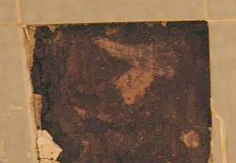 
Schimmel im Bad III - Schwarzschimmel-Befall hinter Fliesen. Das vollverflieste Badezimmer, bei dem hermetischen Fenster alles abdichten und die dispersionsgestrichene Decke keinerlei Feuchtepuffer-Funktion haben kann. 

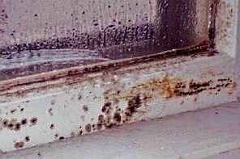 
Schimmel am Isolierfenster, an Fensterrahmen und der Silikonfuge. Das logische Ergebnis lippendichter Schreinerkunst der Neuzeit. Was soll da wohl Stoßlüftung noch nützen, wenn erst mal die Luftfeuchte da ist? 

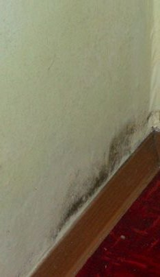 
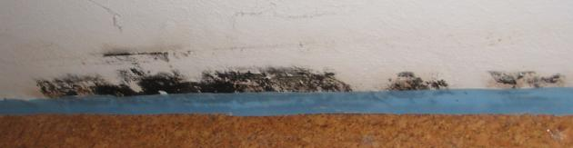 
Schimmelpilz im Schlafzimmer und Wohnzimmer am Wandsockel - Gummilippendichte Fenster, Heizen mit Konvektor im Nachtabsenkbetrieb - das geht nicht ohne Schimmelpilzbefall! 
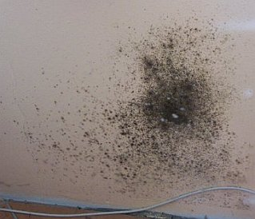 . 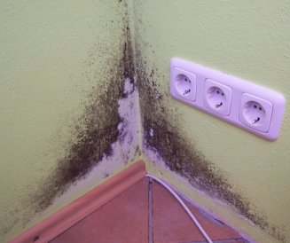 
Schimmelpilz im Elternschlafzimmer - Isolierfenster mit Dichtlippe, Nachtabsenkung, trocknungsblockierende und feuchteanreichende Dispersionsfarbe - auf feuchteziehend-salzbelasteter Wand! 
Diagnose der anbietenden Baufirmen / Experten: Aufsteigende Feuchte, mangelnde Fassadendämmung ... 

 
Schimmelbefallener Leichtlehm - die ökologische und baubiologische Innendämmung / Innenisolierung (Schon gewußt? Lehm / Ton ist ein prima Dichtungsmittel wie Bitumen, allerdings mit gigantischer Wasserrückhaltung und eesig langer Austrocknungszeit - Detailaufklärung: [Das Märchen vom feuchteausgleichenden Lehmputz/Lehmbau](29bau10.md)) 

 
Schwarzer Schimmelpilzbefall in der Dachdämmung aus Mineralwolle 

 
Schwarzschimmel in der Mineralwolle / Steinwolle / Dachisolierung und Holzauffeuchtung am typischen Problempunkt: Dem Dachfenster 

 
Schimmelbefall in der Mineralwolldämmung auch hinter der Alukaschierung - an jeder Ritze und Fuge 

 
Schimmelpilz in der Dachdämmung am nur schwerlich abzudichtenden Flächenübergang am First 

 
Befall mit Schwarzschimmel selbstverständlich auch in der Deckendämmung über dem geheizten obersten Geschoß / verschimmelte Geschoßdecken-Dämmung I 

 
Von unten betrachtet sieht das dann so aus: 
Schimmelpilz in der Mineralwolle / Glaswolldämmung der Dachgeschoß-Decke zum ungeheizten Dachboden II 

 
Schwarzschimmelbefall und angeschimmelte Spinnweben in der Deckendämmung zum Spitzboden III 

 
Verschimmelte Deckendämmung/Mineralwolledämmung IV - angereichert mit schimmelpilzbefallenem Wespennest! 

 
Schimmelpest hinter einer nur punktförmigen Verletzung der alukaschierten Mineralwolldämmung / Dämmwolle in der Dachdämmung darüber 

 
Schwarzschimmelpilz auf Weichholzfaserplatte als Dachdämmung / Innenisolierung 

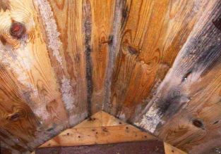 
Schimmelpilz auf der Raumseite der durchnäßten Dachschalung - aber Blower-Door-Test gut bestanden! 

 
Nasse Fassadendämmung - Schwarzschimmelpilzbefall auf der anderen Seite: die Innenwand der Fassadeninnenseite im Wohnzimmer hinter der Couch / dem Sofa 

(Weitere Beispiele und Erläuterung in folgenden Kapiteln, den Schimmelpilzbefall auf Polystyrol, in der Zellulosedämmung, in der Schafwolldämmung und Hanfdämmung usw. können Sie sich jetzt selber denken ...) 

   
Und mal kein Schimmelpilz, sondern ein typischer Hausschwammbefall (Bilder: Matthias Stenger) 
1. Ein ungenutzter Kamin, in den es regnet. 
2. Im Kamin eine Verstopfung auf Bodenebene des Erdgeschoßes, hier sammelt sich die eingeregnete Feuchte und durchnäßt die angrenzenden Bauteile. Die Holzbauteile des Fußbodens im Erdgeschoß werden naß, dort siedelt sich aus den überall herumschwirrenden Hausschwammsporen der echte Hausschwamm - Serpula lacrymans - an. Im Kamin bildet sich sein dickes, polsterfömiges Luftmyzel, saugt die Baufeuchte auf und transportiert sie mittels seiner Strangmyzele in die benachbarten Holzkonstruktion. 
3. Aus dem Fußboden wachsen die Fruchtkörper des echten Hausschwammes hervor. Ein neuer Holzfußboden / Dielenboden! 
Frage: Muß nun aus dem Fußboden gemaß Holzschutz-DIN Norm 68800 Teil 4 unheimlich viel weggeschnitten werden, das angrenzende Mauerwerk erst abgeflammt und dann mit dem restlichen Haus vergiftet werden, und, und, und, oder, oder, oder, oder?

_

Der ultimative Beleg für kriminelles Handeln? Erst gegen alle Widerstände und Einsprüche die sog. ENergieEinsparVerordnung EnEV durchzwingen, mit der [nirgends Energie gespart](7fehrtab.md) werden kann, sondern alle Pottdicht-Buden, Naßräume (Küche, Waschküche, Waschraum, Bad, Badezimmer, Dusche, Duschraum) und Schlafzimmer / Schlafräume vom Schimmelpilz und Schwamm befallen werden und [asthmatische Schimmelopfer](7intiv.md) produzieren, und nun das: 

SZ 16.01.2004**[von KF rot ergänzt]** : 

**_"Hilfe vom Bauministerium_**

_Das Bundesbauministerium will 2004 nutzerunabhängigen Wohnungslüftungssystemen mit ... Öffentlichkeitskampagne Rückendeckung geben. ... Das Ministerium reagiert damit auf die neuen hygienischen und gesundheitlichen Herausforderungen, welche die in Deutschland_**[KF: vom Bundesbauministerium und seinen industriellen Helferhelfern ersonnenen]**_vorgeschriebene Niedrigenergiebauweise mit sich bringt. Ein nach dem heutigen Stand der Technik_**[KF: bundesbauhehördlich und von allen etablierten Parteien administrativ erzwungenermaßen gegen den allgemeinen anerkannten Stand der Technik gem. BGB verstoßend]**_gedämmtes und luftdicht gebautes Haus verhindert neben ... Wärmeaustausch auch ... Luftwechsel. So sammelt sich schnell verbrauchte Luft. Wollen die Bewohner nicht im Mief sitzen_**[KF: und am im wahrsten Sinne des Wortes Amts-Schimmel verrecken]**_, ... zwei Alternativen. Alle vier Stunden ... Fenster aufreißen und ... mühsam erwirtschafteten Energiegewinn wieder herauslüften oder auf_**[KF: teure, energieverschleudernde und gesundheitsgefährdende künstlich-maschinelle]**_Lüftungstechnik setzen. ... p.h."_

Wie lange lassen wir uns wohl noch von "unserer" Administration" in die Irre führen? Auf die Streitrösser gegen den Amts-Schimmel, den Schwarzschimmel, den [Ökoterrorismus](7argus.md) und die staatlich verordnete [Ökofolter](213baust.md) der Bevölkerung! Feuchte und Schimmelpilzbefall in Wohnungen ist nicht gottgewollt, sondern hat weltliche Ursachen. Und wer ist der Fürst dieser Welt? Eben. 

Ein typischer Forumsthread von Schimmelopfern, Praktikern und Scharlatanen im Haustechnikforum (auch mit einigen lobenden und - von berufener Seite - vielen bösen Worten über diese Seiten) hier: [Schimmelflecken seit Einbau neuer Fenster](http://www.haustechnikdialog.de/forum.asp?thema=25240) 

Und hier: [www.homecheckamerica.net/moldphotos](http://www.homecheckamerica.net/moldphotos) können Sie sich ansehen, wie die Leichtdichtbauweise der USA, die wir auch in unseren mcdonaldisierten Landen von der Bauchemie/Bauphysik und ihren Freunden aufgezwungen bekommen, gigantisch vor sich hinschimmelt. 70 Prozent der Amibuden sind übrigens verschimmelt. Man gönnt sich ja sonst nix ... 

DIE WELT 27.5.03: 

**_"Energie gespart, dafür Pilzsporen in der Lunge_** 
_Schimmel in isolierten Wohnungen verursacht zunehmend Allergien - Staub und Biomüll als Pilzdeponie_

_Von Ulla Bettge_

_**Stuttgart** - Zu einer schönen Altbauwohnung mit hohen Räumen gehören die passenden alten Fenster mit Charakter: Doch ... irgendwann (fällt) doch die Entscheidung: Neue, dichte Fenster müssen her. ... Der "Zwangsluftaustausch" ist (dann) blockiert - und Wärme und Feuchtigkeit liebende Schimmelpilzarten haben ideale Lebensbedingungen._ 
_Das gilt ganz besonders für Niedrigenergiehäuser, die ... mit Kunststoff wie Styropor und Mineralwolle gepolstert werden. ... Einer Studie der Friedrich-Schiller-Universität Jena zufolge haben mehr als 15 Millionen Bundesbürger - das entspricht etwa sieben Millionen Wohnungen - ein Schimmelpilzproblem in Wänden wie etwa Schwämme, die bei satten 85 bis 95 Prozent Luftfeuchtigkeit prächtig gedeihen. Tendenz steigend. ..._ 
_Schimmel und feuchte Wände gab es schon immer. Während aber frühere Baumaterialien wie Ton, Lehm und Holz wasser- und luftdurchlässig waren, dichten Neubauten der letzten Jahrzehnte mit Beton und Polystyrol Innenräume hermetisch ab. Dispersionsfarben und Tapeten mit hohem Kunststoffanteil tun ein Übriges und schaffen eine Dampfsperre, die zu Feuchtigkeit zwischen Putz und Beschichtung führt._ 
_Zentralheizungen ... begünstigen ebenfalls hohe Konzentrationen von Raumfeuchte in Wohnungen, in denen der Wasserverbrauch im Vergleich zu den sechziger Jahren mit Toiletten, Dusche, Bad, Waschmaschine, Trockner um ein Vielfaches gestiegen ist. ..._ 
_Dagegen hilft nur Frischluft und Durchzug. ..._ 
_In dicker ... Feuchtluft verteilen sich die krank machenden Keime überall - auch raum- und stockwerkübergreifend - und docken auch an Hausstaubpartikel an, mit denen sie durch die Atemluft wirbeln. ..._ 
_Sporen werden über die Atemluft aufgenommen und gelangen dank ihrer nur mikroskopisch wahrnehmbaren Größe bis in die unteren Atemwege, so dass bei immungeschwächten Personen auch innere Organe Pilzerkrankungen erleiden können. 100 000 bisher bekannte Pilzarten und Hausstaubmilben sind die wichtigsten Lieferanten von Allergenen der Innenraumluft. Allergiker reagieren auf die "Luftverschmutzung" mit Schnupfen, Niesreiz, Atemnot, Husten bis hin zu schwerem Bronchialasthma._ 
_Neu für bestimmte allergische Erkrankungen ist eine Allergie-Impfung, die Betroffene dauerhaft heilen kann. ..."_

Aha, jetzt kennen wir den Auftraggeber dieses nur teils 

(Lehm und Ton sind nicht wirklich wasserdurchlässig, man verwendet sowas zur Teichdichtung, auch Holzschindeln legt man aufs Dach als Regenschutz und auch verputzte Wände sind nicht wirklich luftdurchlässig und auch als Fassadenbeschichtung eher dicht! Gemeint ist wahrscheinlich die Sorptionsfähigkeit dieser Baustoffe, die an ihren Oberflächen etwas Feuchte anlagern können und so verhindern, daß sich bei überhöhter Luftfeuchte schimmelpilzriskante Überfeuchten abkondensieren. Diese Sorptionseigenschaft ist aber für die genannten Baustoffe durchaus unterschiedlich zu bewerten, gerade Lehmoberflächen bieten einer Beschimmelung bei etwas überhöhter Luftfeuchte und Biofarbanstrich allerbeste Voraussetzungen ...) 

fachtechnisch richtig fundierten Angstmachertextes, befremdlich an die Psycho-Werbung von Umwelt-, Wohnklima-, Wohngift- und Schimmelambulanzen gemahnend: 

Der Impfprofiteur. 

Wie einfach sich doch unsere käuflichen Medien wie die Politik durchschauen lassen. Und warum verschweigt "man/frau", was wirklich hilft gegen all die grausamen Krankheitserscheinungen vom asthmatischen Keuchen über seltsame Hautkrankheiten bis zu Organstörungen und giftig verändertem Blutbild, die beispielsweise der Aspergillus niger (Schwarzschimmel), alle anderen giftigen Schimmel und tödliches Raumklima in immer breiteren Betroffenenkreisen mit sich bringen? 

Vielleicht Verzicht auf die Wohltaten des arglosen Handwerkes, Baumarkts, Planers, Fertighausproduzenten und Baustoffherstellers wie Betonitis, Kunststoffbeschichtungen, Isolierglas-Dichtungslippenfensters, Dämmstoff- und Dichtstoff-Müll wie verrottende WDVS / Wärmedämmverbundsysteme und muffige Innendämmung, Zwangsbelüftung und Konvektionsheizung! Dafür besser Bauen z. B. mit [Holz und Vollziegel](29bau09.md), Oberflächen aus [alkalisch desinfizierenden, schimmelabweisenden feuchtepuffernden Kalkmörtel und -tünchen](26bausto.md), [oberflächenkondensat- und staubluftverwirbelungsverhindernder Strahlungsheizung](7temper.md). Viel mehr braucht es doch nicht. Ach so, fast vergessen: Die [alten Fenster werden vielleicht kostengünstig repariert](23bausto.md) und bleiben drin ([Fenster erneuern oder instandsetzen? Details](11fet.md)). Neue nur nach alter Väter Sitte, ohne Isoglas, ohne extreme Gummilippenabdichtung/Fensterdichtung. Schon sind wir wieder gesund. Und kost viel weniger. Vor allem, wenn es einen erfolgsbezogen minimierten [Stufenplan](2berat.md#stufenplan) gibt, der von kleinen Hilfsmaßnahmen bis zur bautechnischen Großtat voranschreitet. Und spart natürlich Energie. Ätsch, du raffinierter Pharma-Kunststoff-Beton-Heiz-Lüft-Riese! 

Am 14.2.2006 überrascht dann eine Meldung der Neuen Presse Coburg wie folgt:

"KINDER IMMUNISIEREN 
**Immer mehr Allergiker**

MÜNCHEN _- Allergien haben sich nach Angaben des Bayerischen Gesundheitsministeriums zur Volkskrankheit Nr. 1 entwickelt. Ein Viertel der deutschen Bevölkerung sei allergiekrank. Die Hälfte der rund 20 Millionen betroffenen Menschen habe eine Pollenallergie. ..."_ Und die hier angeführte Heidrun Behrendt, Leiterin des Münchener Zentrums für Allergie und Umwelt, macht gleich den Schuldigen aus: Die [_"Klimaerwärmung"_](7thuene1.md) sorge eben für _"längeren Pollenflug"_. Dagegen hilft natürlich nur feste [Isolieren und Wärmedämmen](213baust.md), das wissen alle, auch wenns erfahrungsgemäß noch so [wenig energiespart](7fehrtab.md). Obwohl der ebenfalls zitierte Direktor der Münchener Klinik für Dermatologie und Allergologie wenigstens für Babys fordert, _"sie von schimmelbefallenen Räumen fernzuhalten"_. Das dürfte dann bald nur noch in [hüllflächentemperierten](7temper.md) Freilichtmuseumsbauten oder im Nordpoliglu möglich sein, wenn doch bald alle deutschen Hausbesitzer dank des [staatlichen Ökoterrors](7wsvoant.md) (in der Schweiz als [Energiefaschismus](7enfasch.md) gebrandmarkt) und dem Energiepaßdruck endlich energetisch nach- und um- und aufgerüstet haben und die Wärmedämmindustriechemie weiter sich heftig überschlagende Umsatzrekorde feiern darf, erst für Dämmstoffe, dann für ihre Pharmaprodukte ...

Ob man im Hinblick auf gegebenen Schimmelbefall - allein ca. 200 Arten kommen bevorzugt in Wohnräumen vor, einige geben Gift an die Raumluft ab - die befallenen Teile wie entfernen soll, ob es Sofortmaßnahmen oder besondere Arbeitsschutzmaßnahmen bis zur Vollmaske mit Gebläseunterstützung, P3-Filter und Schutzanzug braucht, um die gesundheitlichen Beeinträchtigungen (Husten, Nießreiz, Schnupfen, Asthma, Bronchienerkrankung, Magen-Darm-Erkrankung, Gedächtnisstörung, Sprachstörung, Immunstörung, Allergieschock, ...) der Bewohner und Sanierer (Schimmelaufnahme durch Atemwege und Magen-Darm-Trakt) als typische Reaktion auf die Wohngifte einzuschränken bzw. abzustellen, ob mobile Luftfiltergeräte installiert werden sollten, ob gar der Auszug bis zur Sanierung anzuraten ist, inwieweit die umweltbundesamtlichen Befallskategorien, gar die Biostoffverordnung mit Gefährdungsanalyse betr. Risikogruppen und Arbeitsschutz eine für die Sanierung maßgebende Rolle spielen, muß natürlich abhängig vom Einzelfall sachgerecht entschieden werden. 

Schimmelbeseitigungs-Normen gibt es dafür freilich nicht, sondern nur Sachverstand, der natürlich auch die Kenntnis der einschlägigen arbeitsschutzrechtlichen Regelwerke (Techn. Regeln für Biologische Arbeitsstoffe TRBA, Techn. Regeln für Gefahrstoffe TRGS u.a.) voraussetzt, die bei entsprechenden Fallkriterien greifen. Wer zu Fassadendämmaktionen als Antischimmeläggtschn rät, hat ihn vielleicht nicht im ausreichenden Maße. Auch wenn man sich Schimmelpapst, Schimmelexperte oder gar Schimmeljäger / Wohngiftjäger nennt bzw. anpreist und mit Schimmelspürhund (Schimmelspürhund-Service, Schimmelpilzhund, Schimmelhund-Dienst, Schimmelwauwau oder Pilztöle) bewaffnet seinem Gewerbe nachgeht. 

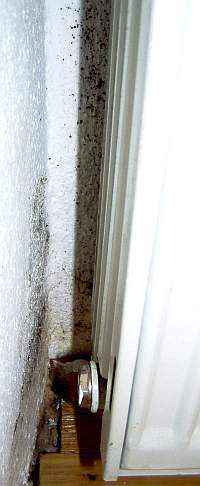 
_Selbst neben und hinter Heizkörpern kann es Schimmelpilzwachstum geben - wenn die Feuchte dank pottdichten Isolierfenstern und Heizung mit Konvektorheizkörpern / Konvektoren im Nachtabsenkbetrieb für stetige Feuchtezufuhr sorgt und die Dispersions-Wandfarbe auf der Rauhfasertapete beste Nährstoffgrundlagen bietet. (Bildquelle: Beratungskunde) 

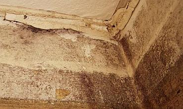 
So sieht es dann unter der Tapete aus - der organische Tapetenkleister ist ebenso wie trocknungsblockierende Wirkung der "diffusionsoffenen", aber kapillardichten Dispersionswandfarbe (Marke Gebirgsweiß oder so) und die feuchtluftherumwirbelnde Konvektionsheizung Voraussetzung für die Schimmelpilzzucht in den heiztechnisch unterversorgten Raumecken und -kanten unter der Tapezierung. Gesund ist das nicht - und doch fast überall in unseren Wohnungen so vorzufinden. Dank Ahnungslosigkeit der Bewohner und teils interessensgesteuertes Unverständnis der herbeigerufenen Schimmelexperten der braven Handwerkerschaft und noch bräveren Industrie für die wahren Voraussetzungen für den Schimmelpilzbefall, dessen Beseitigung meist mit einfachsten "Bordmitteln" sowie dessen dauerhafte Vermeidung. Tipp: Mit Giftmittelchen (Schimmel-Ex) bzw. natursauren Naturheilfungiziden, Dämmstoffen und saugfähigeren Oberflächen ist dem Problem nicht beizukommen. (Bildquelle: Beratungskunde) 

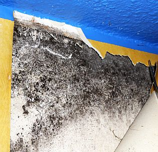 
Schimmel-Befall unter der dispersionsbeschichteten Tapete - Isofenster und Nachtabsenkung sind die Garantie für sowas. Bildquelle: Beratungskunde Marco Hoffmann-Weick 

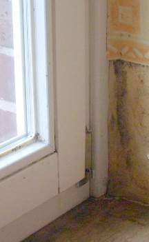 
Schimmel-Befall in der Fensterleibung neben und auf dem Fensterbrett unter dem Isolierglasfenster - Mit gummilippendichten Fenstern ist eben die Raumfeuchte nicht ausreichend im Griff zu halten. 

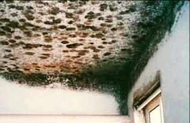 
So kann es aussehen, wenn die Energiesparerei in pottdichten Isolierbuden auf die Spitze getrieben wird - Extrem-Schimmelbefall an Wand und Decke im Nebenraum einer Schwimmhalle. Schön, wie sich hier der Warmluftstrom abzeichnet. Mit Wärmebrücke hat das aber nix zu tun. 

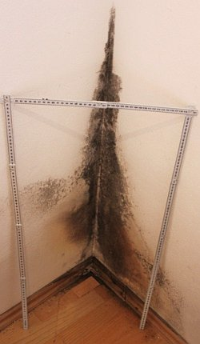 
Schimmel in der Raumecke an Boden und Wänden in einem überfeuchten Wohnraum mit lippendichten Isolierfenstern und konsequenter Tag- (während Arbeit) und Nachtabsenkung (während Schlafzeit) der Heizung im Stop-and-Go-Betrieb - Fall 1 (Bildquelle: Mieter) 

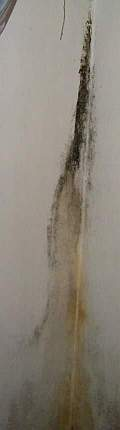 
So zeigt sich der Pilz dann im Fall 2 an der Wandkante / Raumkante ... 

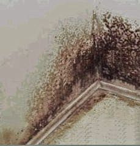 
... so der Schimmelpilzbefall am Wand-Boden-Sockelbereich ... 

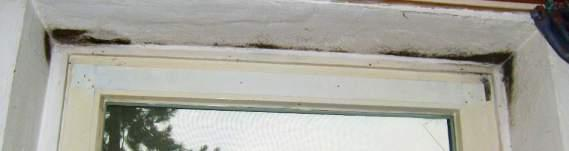 
... und so am Isolierfenster darüber. Ob auch hier wirklich genug gelüftet und geheizt wird, wie der Mieter 2 das behauptet? Und die Durchführen aberwitzig teurer Gegenmaßnahmen fordert, wie bessere Wärmedämmung, vielleicht auch Kalziumsilikatplattenverkleidung oder gleich eine Wandheizung, die der kluge Bauherr sich besser schenken sollte, da sie entweder total überzogen sind oder gleich nix nützen, wenn nicht sogar alles verschlimmbessern. Vermieter Vorsicht! Mit dermaßen verschimmelten Mietern dürfen Sie rechnen, wenn Sie die EnEV einhalten und dem so lieben und teuren Rat der Blowerdooristen und Fensterdichter folgen._

Es kommt nämlich letztlich überhaupt nicht darauf an, irgendwelche Schimmelsorten hinter Tapeten, Dämmstoffen und im ewig nassen Bodenaufbau über nässespeichernden Fußbodenaufbauten aus Betonplatten, Zementestrich und Dämmbelägen zu orten und in Latein und Deutsch zu benamsen, sondern: Schimmel zu vermeiden und effektiv zu bekämpfen. 

Das geht keinesfalls sinnvoll nach der Schimmeljäger- und Schwachverständigen-Methode durch mehr Stoßlüften (praktisch unmöglich). Auch nicht durch Zwangslüftung-Einbau (an den gegenüber Raumluft kälteren und [kaum zu reinigenden Leitungswandungen](23bau02.md) setzt sich zwangsläufig Kondensat und Staub, im Filterfall schlimmster Feinstaub! ab, bestes Substrat für die immer folgende Verkeimung und den Schimmelpilzbewuchs mit ausgerechnet den lebensgefährlichsten Sortierungen, die dann bei abgeschaltetem Lüftungsgebläse in heimtückischster Manier die Raumluft bevölkern, verseuchen und verpesten. Dabei drohen - wie Schweden gezeigt hat - tödliche Allergieschocks.) Absolut sinnlos ist ebenfalls die Forderung nach Wärmedämmung auf der Außenwand ([dämmt gar nicht](2139bau.md), senkt aber durch Verschattung die Solarwärmeaufnahme der Außenwand und damit - in völliger Verkennung der Wärmeströme in Wänden - deren Temperatur, gegen die geheizt werden muß!). 

Was es tatsächlich braucht: Erstmal Vorbeugen durch besseres Konstruieren und Bauen nach alter Väter Sitte (betreffend Baustoffwahl und Konstruktionsausbildung) und im Schimmelbefall-Fall einfachste Maßnahmen (in den folgenden Kapiteln erklärt), die sofort helfen und den Mieter nicht in aussichtslose oder sinnlose Kämpfe mit dem Vermieter / Hausbesitzer / Hauseigentümer stürzen. 

Schon schlimm all diese Streiterei um die schimmelpilzbedingte Mietminderung: 

Während der arme / geizige Mieter Heizkosten spart ohne Ende - und deswegen seine teuer erhitzte Raumluft am liebsten in seinem Büdli einsperrt, bis er nahezu am Mief verreckt ist und bei jedem Verlassen des Raumes flugs die Heizung runterdreht, im Falle von vermieterseits eingebauten Schutzmaßnahmen mittels hygrostatgesteuerter Entlüftungen in Küche und Bad diese außerkraftsetzt und erst bei Raumüberflutung bereit ist, den Strom für das Ventilatorgeröchel zu spendieren, würde er im Mietminderungs-Befragungsfall selbstverständlichst als passionierter Dauerlüfter und Extremheizer posieren. Solch' eigenwilligen Interpretationen der Wahrheit kann der Vermieter selbstverständlich auf die Schliche kommen - er muß halt die Raumluftfeuchte und Raumtemperatur der Mietwohnung einige Zeit mit einem Datenlogger messen und aufzeichnen ... 

En neueres Urteil des Landgerichts Dessau vom 1. August 2008, AZ: 1 S 199/06, macht dem Vermieter Mut beim Kampf gegen seine verpilzten Mietmuffis: 

Demnach wären an seine Beweisführung zur Schuldabwehr keine überzogenen Ansprüche zu stellen. Es genüge als Beweis, wenn ansonsten eine absolute Gewißheit zur Schadensursache nicht hergestellt werden kann, wenn _"eine überwiegende Wahrscheinlichkeit aufgrund sachverständiger Feststellungen gegen das Vorliegen von Baumängeln spricht."_ 

So gut, so schön. Doch die Crux liegt nun darin, daß die - selbst wenn öffentlich bestellt und vereidigt - schwachverständigen Schlechtachter leider dem dämmstoffmaximierenden Irrtum huldigen, daß es an fehlender Wärmedämmung an der Fassade läge, wenn es an den Innenwänden schimmele. Und entsprechend Dämmpakete (die evtl. ihrerseits wieder Weihnachtsbesuch-Freßpakete beim Vertreterbesuch auslösen ...) als Schimmelblocker fordern und dem Vermieter die Schuld am Schimmelpilzbefall geben. 

Dabei wäre es doch so einfach: 

Schimmelpilz braucht als erste Voraussetzung Feuchte. Wenn der Vermieter diese von ihm selbst täglich mit zig Litern Wasseräquivalent produzierte Raumluftfeuchte nicht rausheizt und weglüftet, muß es eben schimmeln. Und wenn er diesbezüglich alles richtig machte, würd es auch niemals schimmeln, auch nicht in der lumpigsten Nachkriegsruine oder modernsten Passivhausbude. Doch so ... 

Aber ganz ohne Schuld ist auch der brävste Hausbesitzer / Vermieter nicht. Gar nicht mal so selten ließ er zum Kassemachen dank Modernisierungs-Umlage im Mietrecht die teuflisch dichten Isolierfenster mit Lippendichtung einbauen, die ihm sein Profischwindler "Schreinermeister X" oder "Fensterproduzent Y" so wärmstens empfehlen konnte - statt die guten alten Fenster nur mal bißchen auf eigene Kosten aufarbeiten zu lassen. Traurig natürlich all die Fälle, bei denen nicht die perfide Modernisierungsumlage an den lippendichten Isofenstern schuld war, sondern fehlgeleitetes und von Planern/Handwerkern/Industrie profimäßig mißbrauchtes Qualitätsstreben des Auftraggebers. Und so wird im Schimmelfall trefflich gestritten. Meist zwischen Mieter und Vermieter. 

Riesige Horden von Schimmelschwachverständigen und Rechtsverdrehern werden dadurch reich, nicht zu vergessen all die Doktoren in den Untersuchungsinstituten / Schimmellabors, die sich ihre Zeit auf Kosten der Schimmelgeplagten damit vertreiben, die im Ergebnis unwichtigsten Analysen und Schimmelpilzbestimmungen durchzuführen. Denn was nutzt es irgendjemand, wenn er weiß, welche Schimmel in welchem Umfang in der Wohnung herumwiehern, wenn es doch nur um besseres Lüften, Heizen und Bauen geht? Doch der Rechtsweg ist auch im Schimmelprozeß / Schimmelpilzprozeß ein hochbeliebtes Betätigungsfeld für allerlei Schimmelreiter und vor allem lang, teuer und unsicher - vor einem Urteil ist man oft schon vermodert - und die Gesundheit geht doch vor! Wenigstens bei unseren Kinderlein. 

Schwere Massivbauteile (Beton, Mörtelfugen, ...), die sich durch Beschwärzung und Schimmelbefall von weniger massiven Bauteilen (Porenziegel, Innendämmung, ...) an der Innenwand abzeichnen, sind nicht direkt eine Folge schlechterer Wärmedämmung. Die größerer Kondensatmenge lagert sich nur deswegen so an, weil diese Massivbauteile im ungenügenden Heizungsfall (Konvektionsheizung, Fußbodenheizung, Nachtabsenkung, ...) dank ihrer höheren Speichermasse weniger schnell warm werden und damit im leider oft einhergehenden ungenügenden Lüftungsfall eben kühler sind und somit mehr Kondensat abbekommen müssen. Dagegen hilft keine Außendämmung! Was in den verschiedenen Einzefällen wirklich hilft, finden Sie weiter im Text. Lesen Sie - aber nur und ausschließlich bei Interesse! - dazu auch weiteres Hintergrundwissen und noch mehr Aufklärung in ["Richtig und falsch Heizen"](7temper.md) und den weiteren Fachinfos dieser Webseite rund um den gräßlichen Schwindel mit all den [raffiniert getürkten Thermographieaufnahmen](7wdvs06.md) und [falsches Bauen, Dämmen und Dichten](2baustof.md). Auch für den Fachmann vom Umwelt-Ingenieur über den Schimmelpilz-Sachverständigen bis zum Energieberater interessant, um weitere bewußte oder unbewußte Betrugshandlungen an den leichtgläubigen Kunden zu vermeiden.

Was Schimmel - oft im Verbund mit einem hochgiftigen Schadstoff-Cocktail aus den krankmachenden, reizenden und ausgasenden genormten Industrie- und Baumarkt-Baustoffen, in dichtgedämmten Buden vermag, belegt dieses Ergebnis der Medizinforschung an schimmelgeschädigten Patienten. Diese häufig - leider oft ohne Quellenangabe - in Auszügen publizierte Studie im Auftrag des Umweltausschusses der Kassenärztlichen Vereinigung Schleswig-Holstein (KVSH) wertete 330 Dokumentationsbögen von Auftraggebern der Ambulanz für Gesundheit und Umwelt (AGU, Lübeck) aus dem Jahr 1996 aus, bei denen Verdacht auf eine mikrobielle Kontamination durch Schimmelpilze und/oder Bakterien von Innenräumen vorlag. Einbezogen wurden die Krankheitssymptome, der Schimmelpilzspürhundeinsatz, mikrobielles Wachstum an Materialproben und Messungen von acht MVOC (Microbial Volatile Organic Compounds), also mikrobielle/bakterielle Schwebstoffe in der Raumluft.

Aus den Angaben von 233 schimmelpilzbelasteten Personen ergaben sich als Krankheitssymptome bzw. Gesundheitsstörungen:

Atemwegserkrankungen 79% 
Infektanfälligkeit 52% 
Allergien 41% 
Müdigkeit, Antriebsstörungen 40% 
Kopfschmerzen 33% 
Hautaffektionen 26% 
Augenreizungen 24% 
Konzentrationsstörungen 23% 
Schmerzen (Muskeln, Gelenke) 16% 

Zitat: _"Hinsichtlich der Gesundheitsstörungen sind u.a. die Pilzsporen, aber auch Toxine, die an den Sporen oder an abgestorbenen Sporen haften, von Bedeutung. [...] Kinder sind diesbezüglich als Risikogruppe anzusehen, da sie vermutlich besonders empfindlich auf eine Schimmelpilz-Kontamination von Innenräumen reagieren."_ Alles publiziert in _"Schriftenreihe des Institutes für Toxikologie, Zeitschrift für Umweltmedizin, Schriftenreihe des Institutes für Medizinische Mikrobiologie und Hygiene der Medizinischen Universität zu Lübeck, 3. Auflage der Umweltfibel"_ - natürlich ohne irgendeine Auswirkung auf die Umtriebe der gewissenlosen Dämm- und Dichtprofiteure. Details: [www.uni-kiel.de/toxikologie/projekte/pr1899.html](http://www.uni-kiel.de/toxikologie/projekte/pr1899.html). 2006 heißt es dann zur Ursachenforschung für die rasante Zunahme der Allergieerkrankungen in einem Interview der Oldenburgischen Volkszeitung am 23.6. mit Erhard Hölzle, dem Leiter der Oldenburgischen Hautklinik, unter dem Titel: _"Energiesparhäuser fördern Allergien"_ : _"... die weite Verbreitung von Wärmedämmungen zum Energiesparen. Die Feuchtigkeit in den Innenräumen nimmt [dadurch] stark zu, was vor allem die Hausstaubmilben zu schätzen wissen."_ Auch Schaben / Küchenschaben, Kakerlaken, Silberfischchen, Messingkäfer, Hausschwamm, Holzwurm und was es da alles weiter noch geben mag an hydrophilen / feuchteliebenden, aber meist sehr ungeliebten Mitbewohnern. Natürlich muffelt dann bald die ganze Wohnung, vom Teppichboden bis zu den Tapeten, ein sicherer Hiweis auf Schimmel und überhöhte Feuchte, und zwar an allen guten Substraten (Nährboden) für den Befall: Synthetische und organische Materialien an Möbeln und Raumoberflächen, unter den Belägen an Fußboden und Wand, nicht zu vergessen die Kleider im Schrank.

Pfui Deibi! Welch perfider - Energiesparen als Köder!!! - Anschlag der industriegesteuerten Politik und Administration auf unser aller Volksgesundheit, gegen die der tumbe Steuerzahler ebenso wie der Fachmann machtlos ist, und während der Michel nicht nur mit seinem Steuergroschen, sondern auch mit seinem und seiner Familie Wohlbefinden und Leben die Zeche dafür zahlt, daß er und seine Lieben mit jeder EnEV-Novelle dem Sarg noch näher gebracht wird, sucht der praktisch veranlagte Fachmann noch den finanziellen Vorteil in dieser Schweinerei, empfiehlt/plant/verkauft/baut lebensgefährliche Dämmung und Dichtkonstruktionen als "Energiesparwunder" und investiert das Blutgeld am Ende noch in die blödsinnigsten, aber hochlukrativen "Alternativenergien". Wie es eben "unsere" Volksvertreter vormachen, die diese Ökobereicherungs-Gesetze wohl zum vorwiegend eigenen Wohl vom Kuvert über wohlgefüllte Köfferchen bis zur massiven Karriereförderung durchpeitschen.

 [Hier gehts weiter: Wo der Schimmel herkommt, wie man ihn ganz sicher behält, und wie man ihn wieder wegbekommt. Zum Wiehern!: Kapitel 2 - Fogging ...](7sch02.md) 

Worum es hier geht: Schimmel, Schimmelbefall, Schimmelpilz, Schimmelpilzbefall, Lüften, Stockflecken, Schimmelbekämpfung, Aspergillus niger, Schwarzschimmel, Hausschwamm, Porenschwamm, Kellerschwamm, Anobien, Nagekäfer, Holzbock, Hausbock, Feuchte, Holzschädling, Vollwärmeschutz, Wärmedämmung, Energiesparen und Bauschaden
