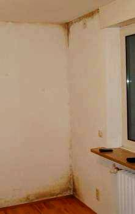

[🠔 Zur Übersicht: Slavisk](slavisk.md)  
# Плесень не смотря на и благодаря теплоизоляции
**В данной статье рассматриваются причины возникновения плесени в жилых помещениях и методы ее устранения, акцентируя внимание на ошибочных строительных методах и неправильном проветривании.**  
_von Konrad Fischer • aktualisiert 17.01.2010_

 Плесень не смотря на и благодаря теплоизоляции 

**(обновление 17.01.10)**

 Небольшая статья, которая то и дело находит внимание в специальных журналах (кроме прочего "Der Vermieter - Хозяин квартиры, сдающий в наём"). Надеюсь, она и здесь принесет пользу читателю. 

**Плесень в доме - причины и устранение**

Тема "Плесень" стала сегодня актуальной как никогда. В большинстве случаев речь идет об ошибочных строительных методах, базирующихся на неверной теории строительно-физических расчетов, неправильном проветривании и недостаточном отоплении. Наиболее часто встречающиеся случаи будут здесь рассмотрены. 

Наперед: поражение плесенью - это не только конструктивный недостаток. Часто она соседствует с заражающими бактериями и способна сама выделять ядовитые вещества. С ней связана значительная опасность для здоровья человека. Поэтому следующие рекомендации не следует понимать как однозначные решения, а должны при необходимости дополняться медицинской и микологичной компетентностью. 

Экспертиза поражения плесенью 

Если требуются подробные исследования об объеме и виде поражения, для предъявления доказательств или оценки вреда здоровью и гигиенического риска, обращайтесь за консультацией только к независимым ( = нейтральным к проведению каких-либо строительных мероприятий) экспертам. Если только услышите что-нибудь о "недостаточной теплоизоляции" – пожелайте такому консультанту как можно меньше жертв-клиентов и гоните его со двора, поверьте моему опыту, он Вам с этой проблемой помочь не сможет. 

Случай 1: Влажность и плесень в жилых помещениях 

Большей частью речь идет о плесени в малоотапливаемых спальнях и других помещениях с низкими температурами. Нужно ли применять внутреннюю и соответственно внешнюю изоляцию, чтобы повысить поверхностную температуру стен и избежать "ледяных стен"? В таких случаях ошибочная строительная физика снова и снова советует и даже требует затратоемких строительных мероприятий, предрасположенных (и нередко ведущих) к последующим убыткам. 

 

Все это не дает никакого толку. Плесень нуждается во влажности. Она возникает (не считая крайних случаев: из-за строительной влажности, поврежденных водопроводов, неплотных крыш или насквозь промокшего старого камина) из-за повышенной влажности воздуха в помещениях. Семья, состоящая из 4-человек, отдает в воздух помещения ежедневно между 7-15 литров воды. И против этого не поможет даже часто воспеваемое строительными физиками "короткое проветривание нараспашку". 

Если воздух слишком влажен, он передает воду в стены, которая накапливается в порах стройматериалов. Чтобы она испарилась, должна расходоваться энергия. 

Короткое проветривание нараспашку, а так же постоянно приоткрытые сверху окна, не поставляют никакой энергии. Напротив: наружные стены охлаждаются еще сильней, способность отложения воды возрастает еще больше. При этом конденсат откладывается именно там, где циркуляция (подогреваемого стандартным отоплением) воздуха не достаточна – в переходах стена-потолок, в углах помещений, в зонах плинтусов, в близкой к окну области холодного воздушного течения при этом лишь изредка - например, через 10 минут после принятия душа - приоткрываемых окон, а так же за мебелью. 
Эти не достаточно снабжаемые теплом области (по техническим причинам течения воздуха) неверно именуются строительными физиками как т.н. "мостики холода", и назначаются абсолютно бессмысленные меры по их утеплению. Несколько примеров из случаев, в которых я был задействован как консультант, могут подтвердить это:

 
Плесень в ванной 1: облицованные плиткой стены не способны принимать и затем снова отдавать, кратковременно появляющуюся, повышенную концентрацию воздушной влажности. Это является причиной повышенной влажности на остальных поверхностях стен, особенно в области окна, где при кратковременном проветривании поверхности дополнительно переохлаждаются. Причем налет выглядит соответственно открыванию окон: сверху более обширно, а к низу виден его спад. Это выглядело бы иначе, если бы это был действительно "мостик холода". 

 
Плесень в ванной 2: кислые дисперсные краски (в противоположность щелочным известковым краскам) предлагают плесени хорошую питательную среду в прохладной области окна. Короткое проветривание ("залповое" или "сквозное проветривание") после принятия душа не может устранить всю лишнюю влагу из воздуха, она собирается до и после этого в переохлажденном углу стен и перекрытий (левая стена - это внутренняя стена!). 

 
Плесень на переходах стена-пол и стена-потолок – абсолютно герметичная, паронепропускаемая конструкция немецких окон Isofenster; неправильный обмен воздуха благодаря (по прежнему любимому даже среди высокого о себе мнения крестьян) конвекционному отоплению, ночному понижению температуры ( как же, жилец же экономист! ) и недостаточный приток теплоэнергии от внутри лежащих источников тепла. Все это способствует переохлаждению проблемных областей наружных стен. Повышенное накопление влаги и плесень - логическое следствие этого. Под лозунгом: дети-астматики с кожными заболеваниями кашляют громче. 

Коротко и ясно: применение какого-либо вида т.н. теплоизоляции – это выброшенные на ветер деньги. Одностороннее повышение температуры "пробивает" насквозь обычные виды теплоизоляций и "изолирующие" материалы как пуля бумагу. Это подтверждают как сопоставление затрат на отопление (одинаковых домов "без" и "с" дополнительной теплоизоляцией домов), а так же результаты так называемого [Лихтэнфельзкого эксперимента ( Lichtenfelser Experiment)](2139bau.md#lichtenfelser experiment)

- одностороннее повышение температуры "пробивает" насквозь обычные виды теплоизоляций и "изолирующие" материалы как пуля бумагу. Только способные к накоплению массивные стройматериалы (например дерево или кирпич) могут действительно тормозить отдачу тепла. 

Что делать? Два простых мероприятия могут помочь: 

Во-первых, отсутствие абсолютной герметичности окон (достаточная проницаемость стыков). Окна с резиновыми уплотнителями являются регулярными виновниками проблем с плесенью. Помощь оказывается самым простым образом - удаление уплотнителя у верхней части оконной рамы. Но не боковые уплотнители – это может послужить проникновению дождя! И необязательно у каждого окна, а постепенно, до тех пор, пока не добьетесь успеха. 

Итак: незначительная, но постоянная вентиляция в стыках окна обменивает влажный воздух помещения на сухой наружный воздух. Кратковременное проветривание нараспашку после душа конечно очень разумно, тем не менее, не всегда поможет надежно избегать конденсата в наружной стене. 

Старые окна, не имеющие резинового уплотнителя (что сегодня, к сожалению, становится почти нормальным явлением при замене окон) были превосходны с точки зрения обмена воздуха и избавляли помещения от лишней влаги, плесени и других грибков, конденсируя ее на стекле. Тем не менее настаивают на герметичных окнах, и тут же требуется искусственная вентиляция. Но и она может также быть инкубатором для плесени и других бактерий в помещении, так как быстро забиваются фильтры и размножаются бактерии в мокрой и слизистой оттяжке вентиляции или кондиционера. 

 С другой стороны помогает достаточное снабжение теплом страдающих от плесени стен посредством [теплоизлучающего отопления (темперирование стен)](7tempr.md). Обыкновенное отопление (на принципе конвекции, т.е. обмене теплого воздуха) греет преимущественно воздух помещения и оставляют наружные стены, находящиеся под угрозой конденсата, переохлажденными. При этом именно воздушный поток такого отопления заботится о постоянном эффекте сквозняка - а не по ошибке подозр еваемые традиционные окна! 
В противоположность старому, печному отоплению, центральное отопление не может устранять использованный, влажный воздух через дымовую трубу и добавлять свежий сухой воздух через негерметичные окна. Следствие – [конденсат на стенах](23bau03.md) и плесень. 

Простое дополнительное прокладывание немногих метров отопительных труб к уже имеющимся, может решить эту проблему. В виде открытой пары (не изолировать!) туда-обратно с постоянной циркуляцией теплой (или горячей) воды в нижней области наружных стен. Отопление тепловым излучением нагревает преимущественно конструктивный элемент (стену), а не воздух. Кроме того системы воздушного отопления очень рискованны с гигиенической точки зрения: они портят и загрязняют наш самый важный продукт - воздух. Поэтому [(темперирование стен)](7tempr.md) как система отопления разумна не только по причинам защиты от плесени. 

Случай 2: Поражение плесенью вследствие мокрых стен подвалов и подвальных помещений 

Здесь в первую очередь снова играет роль конденсат на прохладных конструктивных элементах. Так как стены подвалов или не протопленных прихожих прохладны (особенно по сравнению с влажным и теплым летним воздухом), они принимают при вентиляции (особенно летом) прямо-таки огромное количество влаги. Вентиляция там должна проводиться только, если наружный воздух является значительно прохладнее, чем температура поверхности стен. В прихожей это не всегда невозможно. Здесь выгодно использовать стабильные против влажности и хорошо сохнущие пористые штукатурки из воздушной извести в комбинации с известковой покраской. 

Синтетические краски с "хорошими" значениями диффузии пара (паропроницания) не приносят, к сожалению, никакого толку. 
Они препятствуют, капиллярному высыханию влаги в свободном состоянии (в виде воды), находящейся в порах конструктивных элементов. Важно: транспорт влаги в строительных элементах происходит в 1000 раз больше в свободном, чем в парообразном состоянии. "Диффузия пара" неверной строительной физики не играет в строительной практике никакой роли. 

Второй источник - влага из-под земли. При этом речь идет в большинстве случаев не о так называемой ["поднимающейся" влаге](2aufstr.md). В обыкновенной кладке она просто невозможна: так как капиллярного транспорта из малопористого кирпича в крупнопористый строительный раствор не бывает! Дополнительные горизонтальные изоляции стен и инъекции различной химией, не способствуют решению проблемы, а только вредят кошельку и кладке. 

Настоящая причина влажности в большинстве случаев это негерметичность строительных котлованов и неисправные канализационные трубы, часто обусловленные сильным оседанием грунта. При сильных дождях вода наполняет яму и преодолевает уплотнение сооружения, благодаря накапливаемому высокому боковому давлению, а также "давящей" водой со стороны фундаментного перекрытия. Дефектный дренаж может дополнительно служить причиной скопления и подхода воды. 

Лучше всего в этих случаях уплотнение котлована слоями особых водонепроницаемых глин, снизу вверх. Сможет ли уплотнение только верхнего слоя, для садоводства или моделирования ландшафта, предотвратить позже полное заливание котлована или хотя бы ограничить до безопасной степени, должно решаться на месте. Этот метод относительно прост и может быть выполнен своими силами. Не исправные теплотрассы или водопровод должны быть выявлены и устранены. 

Случай 3: Плесень и водоросли на фасаде 

Неблагоприятные погодные условия и неправильные строительные методы (как например теплоизолирующие пакеты) - являются предпосылками для поражения фасадов черным, зеленым и коричневым цветом налетов. Водоотталкивающие и блокирующие испарение влажности, синтетически "улучшенные" краски или даже штукатурка с добавлением синтетической смолы предлагают в большинстве случаев отличные условия для поражения. Проникающий парообразный воздушный конденсат и тем более дождь может проникнуть через сеть мелких трещин и увлажнять поверхность покрытия. Капиллярно-непроницаемые покрытия блокируют последующее высыхание. 

Сверх того, синтетическая окраска предлагает прямо-таки превосходные условия для озеленения водорослями и грибками. Поэтому такие краски наделяют альгицидными и фунгицидными ядами. Это помогает только ненадолго, яды растворимы в воде и вымываются дождем. 

У рекомендованных ["утепляющих" пакетов, не имеющих достаточной способности накопления тепла](213baust.md) (безразлично из чего они изготовлены - из пенобетона, пенопласта или войлочных материалов), добавляется еще тот факт, что они в вечернее время суток быстро охлаждаются. Также охлаждаемый воздух конденсирует затем на холодном фасаде и поставляет влагу для разрастания плесени и водорослей. Причем закрепители "утепляющих" пакетов (лучше накапливающие тепло) остаются несколько суше и поражаются поэтому намного меньше. Очевидно, это вовсе не понравилось индустрии, и она быстро нашла "решение" – теперь предлагается специально изолирующий дюбель с "воздушной подушкой" на металлическом анкерном соединении... 

Теперь можно заботиться о постоянном клиенте - снова и снова чистить фасады, ремонтировать трещины, заново покрывать отравленными ядами красками. Для этого советуются другими представителями (которые рекомендуются бедному заказчику как специалисты) оптимизировать снова и снова, "еще лучше", "по улучшенным стандартам сегодняшней строительной физики", предвещают "превосходное решение", вплоть до чуда "самоочищающихся красок фасадов" из синтетической смолы. Традиционный ремонт фасадов, с препятствующими поражению, известковыми продуктами, достаточной защитой от непогоды и если это действительно необходимо, способными к быстрому высыханию за счет циркуляции воздуха, обшивками представляют собой более благоразумную альтернативу. 

 
Результат обследования: водоросли на фасаде из ТЭП (теплоизоляционные пакеты) из статьи "Исследования теплоизоляции; к законодательному распоряжению об экономии энергии": 1. Зеленый предупредительный знак, 2. абсолютная герметичность" в журнале для строительно-технического обслуживания и охраны исторических памятников ["Bautenschutz+Bausanierung"](http://www.bautenschutz-bausanierung.de/), январь 2002, стр. 44, иллюстр.: институт Висмара, обработка K.F. 

Ремонт и удаление поражений 

Ремонтные работы зависят от степени поражения: удаление и очистка, новая покраска подвергшихся налету поверхностей, вплоть до полной замены пораженных элементов. Возможно потребуется проведение мероприятий по охране труда и контроля эффективности действий. Конечно, без устранения причин поражения нельзя добиться и долгосрочного успеха. 

Следует также обращать внимание на содержание питательных веществ, которые предлагает поверхность стройматериалов в виде субстрата. Здесь открывается большие возможности для образования благоприятной питательной среды: бумажные обои, целлюлоза или содержащий синтетику клей, шпаклевка для заделки стыков, штукатурки и покрытия. Поэтому в этих случаях должны по возможности применяться известковые краски, обладающие щелочными свойствами и противостоящие грибным культурам. Также продукты со связующими синтетическими смолами, закупоривающие деревянные конструкции, охотно покрываются плесенью, в то время как не подвергавшаяся обработке древесина, как правило, хорошо справляется с возникающей воздушной влажностью, а не концентрирует ее на поверхности, содействуя поражению. 

Для очистки заплесневевших поверхностей лучше использовать простой спирт (осторожно: легко воспламеняем!). Спирт отлично дегидрирует (освобождает от воды), это убивает налеты плесени не только на поверхности, но и в глубине. Прочие ядовитые средства или уксусная кислота не рекомендуется. Плесневые грибки любят несколько кислую среду, которую содержат именно дисперсные краски. Высокая щелочность от чисто-известковых продуктов защищает от новых поражений - без вредных для здоровья ядовитых дополнений (фунгицид/альгицид). 

Конечно, здесь не могут окончательно обсуждаться все случаи строительной практики. Поэтому ["Информация к постройкам старины и охране памятников архитектуры"](rossija.md) предлагают сведения на более 1500 печатных страницах со специальными текстами для дальнейшего углубления. Вы не должны также отказываться от помощи квалифицированных медиков, микологов, архитекторов и ремесленников для решения подобных проблем. Приведенные здесь сведения служат лишь помощью. И одно остается ясным: речь идет о Вашем здоровье и Ваших деньгах - будь то пострадавший съемщик или измученный домовладелец, сдающий жилье в наем. Следите за и тем и другим внимательно! 

Конрад Фишер (Konrad Fischer), Архитектор, Hochstadt/Main 
Перевод: [Dipl.Ing. Andreas Laukart](http://www.arwela.info/ruweb/startru.htm)
