[🠔 Zur Übersicht: Heizen](7temper.md)  
# Warum und wie lange gibt es schon die Temperierung der Gebäude-Hüllflächen?
**Die technische Umwälzung der Moderne hat die Heiztechnik verändert. Früher strahlungsintensive Technik erwärmte schadensarm und gesund; das 19. Jahrhundert brachte lufterhitzende Konvektionsheizungen.**  
_von Konrad Fischer_

## Die Temperierung der Gebäude-Hüllflächen 2

Bauten-, Inventar-, Exponat-, Instrumenten- und Gesundheitsschutz durch richtiges Heizen, Hüllflächentemperierung bzw. Bauteiltemperierung 

Die technische Umwälzung der Moderne hat auch in der Heiztechnik ihre Spuren hinterlassen. Während früher grundsätzlich strahlungsintensive Heiztechnik mit geringem Energieeinsatz Bauwerk und Mensch vernünftig, schadensarm und gesund erwärmte, brachte das 19. Jahrhundert entscheidende Änderungen: mehr und mehr entwickelte sich die Heiztechnik zur lufterhitzenden und luftbewegenden Konvektionsheizung. Die herkömmliche Erwärmung des Hauses und seiner Bewohner in der kühlen Jahreszeit machte sich das von der Sonnenstrahlung abgeleitete Erfahrungswissen technisch zunutze. Dabei waren wohl die Kenntnisse rund um das Kochen und Backen ausschlaggebend. Die langfristig wärmespeichernden und wärmeabstrahlenden Steine des Lagerfeuers dürften die Aha-Einsicht ausgelöst haben, die zum Backofen und folgerichtig zur Strahlungsheizung geführt haben. Natürlich gehörte auch die Ersterfahrung am Lagerfeuer dazu: vorne schwitzen, hinten - im Strahlungsschatten - frieren. 

Ein Versuch im John B. [Pierce Laboratory, USA](http://www.jbpierce.org/), verdeutlichte das Ziel vernünftiger Heiztechnik:

Personen in einem Raum mit 50oC warmer Luft und gekühlten Wänden froren jämmerlich, während sie bei 10oC und erhitzten Wänden ins unangenehme Schwitzen gerieten (Quelle: Techn. Info "Strahlungsenergie - die Ur-Energie, neu entdeckt, [TT Technotherm GmbH, Nürnberg](http://www.technotherm.com)).

Es kommt also nicht darauf an, das Lebensmittel Luft als staubiges Heizmedium zu vergewaltigen, sondern auf die Strahlungsqualität der Umgebung. Das haben unsere postindustriellen Vorfahren mangels "Ingenieurwissenschaft", "Bauphysik", mißbrauchter Naturliebe und DIN-gerechtem Schwachverstand dann auch logischerweise herausgefunden:

Im historischen Massivbau gibt es die Temperierung der Raumhülle mittels einfacher oder raffinierter Heiztechniken sozusagen seit der Antike bis in die Neuzeit. Die Baumeister der römischen Thermen und Kloster- bzw. Burgenbauten mit ihrem unter dem Fußboden geführten Heizsystem, der sog. Hypokaustenheizung, und der über Heißdampf (keine Rauchspuren) erfolgten Wärmeverteilung in die teils mit Hohlziegeln (lat. Tubuli) errichteten Wand verstanden die Heizungsprobleme, das Energiesparen und die Substanzschonung im Massivbau nicht nur mittels Wahl einer gegenüber Feuchte- und Temperaturschwankung extrem dämpfungsfähigen und störungstoleranten Baukonstruktion durchaus zutreffend: sie erwärmten - wenn überhaupt - die Raumhülle, nicht die Raumluft. 

Der Schweizer Baufachmann [Paul Bossert](http://www.energieforum.net) schreibt dazu: 

_"Der griechische Begriff Hypokauston wird in Latein mit Vaporarium übersetzt. Das bedeutet, dass ein Tubuli weder ein Lüftungsziegel noch eine Abgasführung war. Ausserdem waren die Tubuli oben vermauert bzw. geschlossen._

_Vapore weist auch nicht auf Rauchgase und Heissluft hin, sondern auf Dampf bzw. Dunst, dessen Kondensat nach der Wärmeabgabe via Kondensatrücklauf auf dem gemauerten Hypokausten-Unterboden zum Praefurnium zurückgeführt wurde. Die Römer hatten also eine Kondensationsheizung. Warum auch nicht, sie waren ja nicht so blöd wie wir!"_

Offenbar vertrug die römische Bauweise diese Dampfheizung - sie hatten ja auch noch keine schimmelfördernden Kunstharzanstriche und -putze, geschweige denn WDVS. Jedenfalls wurden die Wände durch die sich anlagernde Kondenswärme warm. Folge: 

Strahlungswärme statt schmutz- und feuchtebelastender Warmluftströmung, warme, trockene und schimmelfreie Wände und Einrichtungsgegenstände (Mobiliar/Inventar/Exponate) gegenüber der systematisch kühleren Raumluft. So wird es erklärbar, daß wir in historischen Räumen bis zur Einführung luftbeheizender Systeme sehr langfristige Instandhaltungsintervalle von Raumschale und Inventar über zig Jahre haben, während danach alle paar Jährchen intensivste Maßnahmen gegen Schimmel, Pilz, Schwamm, Flächen- und Detailverschmutzung, Malschicht und Putzablösung, Untergrundverrottung, Salzdruckmobilisation im Dauerwechsel von Lösung und Kristallisation, Rißbildung, Instrumentverstimmung, Flächen- und Bauteilkorrosion an Malflächen und Metallbauteilen usw. nötig sind. Als Dauerbrenner intelligentester Haustechnik, Planungs- und Handwerksleistung. Eben nach dem Motto: Alle Jahre wieder. Wie schön, daß öffentliche aber auch die privaten Bauherrn heutzutage so unerschöpflich anschwellende Geldvorräte horten, denen ein rapider Schwund durch derartige Bauschlauheiten geradezu guttut. Frei nach dem Motto: Gesundschrumpfen. Und schauen wir nach den Schrumpfmitteln, stellen wir fest: Blutegel und Piranhas sind sehr wohlfeil zu haben. Und darauf scheint es anzukommen. Koste es dann später, was es wolle.

Dabei war das echte Kosten- und Energiesparen früher entscheidend: 

Trockene Räume lassen sich mit Strahlungstechnik am wirtschaftlichsten heizen. Dazu bedarf es freilich keiner Betonkernaktivierung, Bauteilaktivierung oder sonstige im Kern der Mauer herumalbernde Wandflächenheizung mit innenliegenden Heizrohren oder Heizregistern. Deren Überdeckung schirmt die Wärmestrahlung zum Raum ab und "verschattet" die Abstrahlleistung auf Kosten der Ästhetik. Von den erhöhten Baukosten durch Versteckspiel und Mehrbedarf an wärmeabgebenden Leitungen bzw. sonstigen Abstrahlsystemen mal ganz abgesehen. Auch der fröstelnde Mensch im kalten Bett erhält mit einer energiestrahlenden Wärmflasche die billigste Form einer wohligen Nachtruhe, die er ja nicht unter dem Bett versteckt.

Eine erhöhte Verschmutzung an kühlen Raumschalen durch warmfeucht verstaubte Heizluft war in strahlungsbeheizten Bauwerken früher - abgesehen von sakralem Kerzen- und profanem Kienruß sowie Küchenrauch - nicht das Problem wie heute. Nur so konnten jahrhundertealte Wand- und Deckenmalereien bis in unsere Zeit erhalten bleiben. Und deren Freilegung zeigt immer wieder: Stil- bzw. Nutzungswechsel, nicht Verschmutzung, gaben oft den Ausschlag für die Neufassung. Renovierungsperioden über 30-50 Jahre waren da keine Seltenheit. Heute sind falsch beheizte Räume alle paar Jahre reif für den Tüncher und dauernd klimabedingt zu stimmende und wartende Kirchenorgeln mit exzessiver Holzbewurmungs- und Verschimmelungstendenz eine tiefe Geldgrube für den notleidenden Orgelbau, Holzschutzbetrieb und eben auch das Gesundheitssystem.

---

**Als Beispiel zur Einführung in die Problemlage: Die Sauerei mit der Kirchenheizung**

Dazu ein informativer Link, der aber die Abhilfe mittels Temperiertechnik überhaupt nicht zu kennen scheint: 
[Kirchenheizung - Wie entstehen die Schäden an der Raumhülle, dem Inventar und den Orgeln?](http://www.eurac.edu/Org/AlpineEnvironment/ChurchHeating/damages_de.htm)

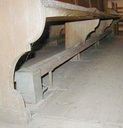 
Eine superheiße Kirchenbankheizung (Bauart egal) macht ebenso wie die Heizluftkanonadenlösung Marke Bullermann oder kalorienreiches Unterflur-Luftbombardement mittels Heizluftverströme den verfrorenen Arsch des akademischen Konzertbesuchers (ich und meine Frau gehören dazu!) und (+ Kerzenschein) das verrußte/erkältete Herz des scheinheiligen und dennoch nach etwas seelischer Labung dürstenden Weihnachtskirchgängers (sind wir das nicht alle?) zwar ganz sicher oberflächlich warm, garantiert aber auch das verdreckteste und beschissenste Kirchenraumklima aller Zeiten: Heiße schwitzatemfeuchte Heizdreckluft steigt auf, trifft das unterkühlte Inventar und vereiste Bauteile bis zur Deckenbalkenschwelle, kondensiert dort hektoliterweise und erfreut den Nachwuchs aller Holzschädlinge sowie der Restauratoren, Giftmischer und -verspritzer sowie Kirchenmaler und sonstiger Experten seit modernsten Zeiten.

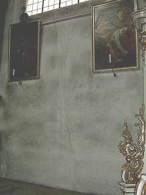 Nur wenige Jahre nach der großen Jahrhundert-Kirchenrenovierung unter der so fachlich einwandfreien Leitung (vielleicht gar freundlichst gesponserte Anleitung durch allseits bekannte Technikproduzenten?) der bewährten Bauexperten im Kirch- und Staatsbauamt, in den Ingenieur- und Architektenbüros und den Heizungs- und Lüftungsfirmen. Fast so schmoddelig wie zuhaus unterm Soffa. Das drängt jedes Spenderherz zum neuerlichen Klingelbeuteleinwurf, oder? 

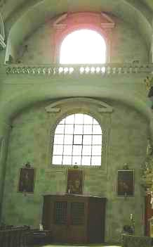 Die regelmäßige Fleckstruktur dürfte durch mauerverbandsbedingt fettere Zementputzpflatschen mit höherer Wasserrückhaltung und Trocknungsblockade zu verdanken sein. Oder ein gewolltes Abzählmuster für langweilige Messen?

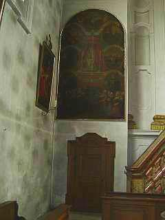 An allen Kirchenwänden schachbrettmäßig anzutreffen.

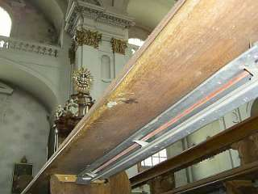 
Nur Heizluftkonvektion bringt solch heimelige Raumstimmung hin.

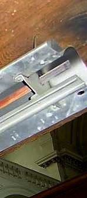Die Dreckschleuder entlarvt: Verschwelte Staubrußflächen am Heizluftaustritt. 
Auch bei Kirchenheizungen gilt: Der Gottseibeiuns sitzt im Detail.

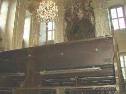 
Und zuckt auch vor den Ikonen des Barocks nit zruck:

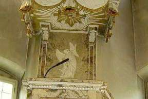 Die Kanzel vor danteskem Höllendreck

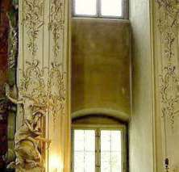 
Neben dem Altar - beachte die weiß gebliebene Wand-Pfeiler-Kante. Kältebrücke? Wärmebrücke? Nein - vom Heizluftstrom nie erreicht!

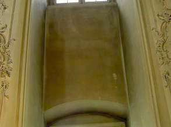 
Im Detail

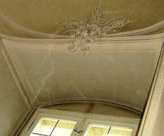+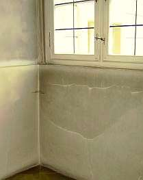 
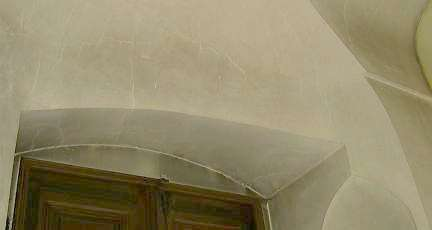 
Auch ein Putzrisse und Stuckprofile weisen den Dreckluftstrom im Leebereich ab. Dafür wird die ungeschützte Fläche um so grausamer verschmutzt. Oder ist es gar gewollte Architekturfassung durch Heizluftgrauschleier - Grisaille genannt?

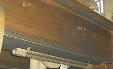 
Grau ist alle Theorie - kohlrabenschwarz die Luftheizpraxis - auch mit Glühdraht. 

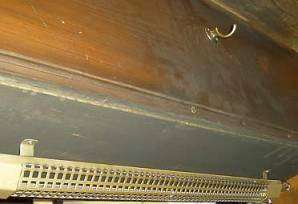 
Im Detail.

Es ist keine Fassung an der Unterseite der Kirchengestühl-Sitzbank, des Buchbrettes und an der Rückseite, es ist die vor Experten und Laien offenbar gleichermaßen gut versteckte Sauerei, die ein falsches Heizsystem schon an der Quelle entlarvt. 

Stellen wir uns nun mal die Bronchienverschmutzung der restlichen Kirchenbesucher durch Heizluft vor. Das astmatische Husten der Kirchenkonzertbesucher - das berühmte Pausenhust- und schniefkonzert - wird auch gespeist von verseuchtem Raumheizklima. Nu, lieber erstunken als erfroren!, hieß es in der ausgebombten Kriegsgeneration.

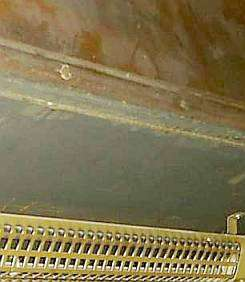 
Wer genau hinguckt, ahnt nicht nur, sondern sieht die verräterischen Spuren des luftverpestenden Heizdrecks. Der Feinstaub am Stachus ist dagegen ein Luftkurort. Nur eine Luftheizung bringt noch mehr Pestilenz in die Atemwege. Jeder hat sie, notfalls auch zuhause.

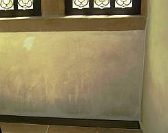Eine echte Luftheizung mit Unterbodenauslaßschacht und auslaßnaher Wandbedreckung. Diesmal kein Sakral- sondern ein Profanobjekt mit gehobenem Denkmalcharakter.

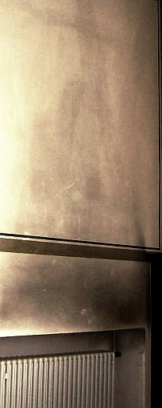Doch auch ein ganz normaler Konvektor - egal ob als Rippenheizkörper oder in Schachtbauweise bzw. als Plattenheizkörper schafft es locker, ganze Kirchenwände einzusauen. Hauptsache, stoßweiser Betrieb und dadurch immer wieder Auskühlung der Außenhülle. Sie kann dann immer wieder mit ihren gegenüber Raumluft kühleren Flächen als Kondensator die Überschußfeuchte an sich binden. Daran klebt dann Staub und Ruß besonders gut fest. Hinzu kommt immer eine mangelhafte Abfuhr bzw. Ablüftung der Luftfeuchte, die nicht nur vom verdunsteten Weihwasser und Wischwasser, vom herrlichen Blumenschmuck und hereingeschleiftem Schnee und Regen, sondern ganz wesentlich auch von den Kirchennutzern selbst über das Atmen und Schwitzen in die Raumluft abgegeben wird.

Nur ein offenes Dach kann mehr befeuchten, nur ein Hochwasser mehr verdrecken als solche Heizmethoden. Mose teilte das Wasser, das falsche Heizen teilt es dann wieder aus. Gottseidank. Und im heißen Sommer spülen dann die Kondensationshektoliter bei jedem Warmluftstrom in den kalten Sockel, bis die Tropfen glitzern.

Weiter zu **[Kapitel 3 - Orgeln usw.](7temp03.md)**
