[🠔 Zur Übersicht: Heizen](7temper.md)  
# Richtig oder falsch Heizen in der Kirche - Orgeln, Holz, Feuchte, Kondensat und Kirchenheizung
**Einblick in die Problematik des Kirchenraums: Staubverschmutzung und Feuchtigkeit hinter der Orgel an der Giebelwand der Orgelempore führen zu Schäden an der Kirchenorgel.**  
_von Konrad Fischer_

## Die Temperierung der Gebäude-Hüllflächen 3

## 3 - Richtig oder falsch Heizen in der Kirche -
Orgeln, Holz, Feuchte, Kondensat und Kirchenheizung

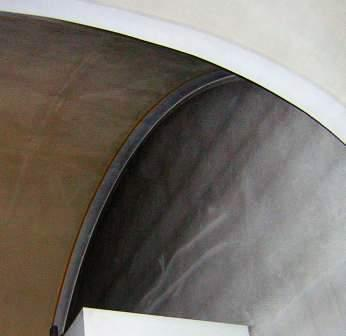 
Wenn es so staubverschmutzt aussieht hinter der Orgel an der Giebelwand der Orgelempore - man sieht sogar die Fugen des Leichtmauerwerks aus porosierten "Ziegeln" sich naßdunkel abzeichnen, wie mag es da nur der Königin der Instrumente - der Kirchenorgel - ergehen? 

Hier ein weiterer Einblick in die Problematik des Kirchenraums (aus meiner Praxis, frei nach Vielschelm Pfusch):

 
Von dem Kirchturm bimmelts so bang, 
im Orgelinnern schimmelts schon lang

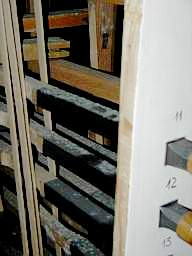 
Weißer Schimmel soll nicht sein, 
schwarzer wäre auch nicht fein

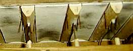 
Denn der wächst auf Ziegenhaut

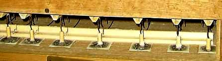 
überall, wohin mer schaut.

Macht nix, sagt manch schlauer Mann, 
weil man so mehr restaurieren und stimmen kann? 
Ist's wirklich und warum gottbefohlen, 
daß Raumklimakatastrophen drohen? 
Und ist's ehrlich allerbest, 
weil Überfeuchte lang schon näßt?

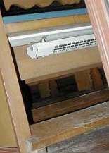 
Schaun mer nach dem Heizsystem, 
sitzt mer warm und schwitzt bequem

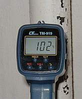 
Oder Heizdampf pfeift im Rohr 
lauter als der Kirchenchor

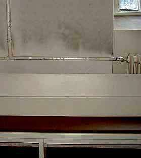 
Heißer Schwelstaub an der Wand 
ist bekannt im ganzen Land

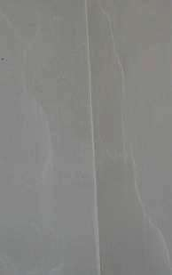 
Weiße Schatten ohne Ruß, 
weil der Dreck nach oben muß

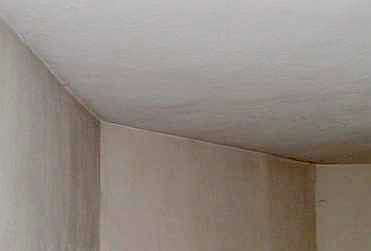 
Weiße Kanten, darum graus - 
Heißluftstrom spart's Ixel aus 
Hierzu lehrt die Baupfuisick, kalte Kant wär Wärmebrück!

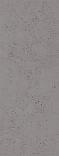 
Auf den Wänden punktgenau, 
wächst etwas - schwarzweißgrünblau

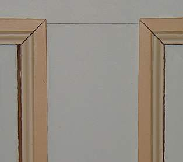 
Und die Holzvertäflung schrumpft, 
weil zu wenig eingesumpft?

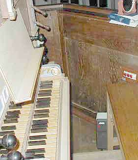 
Heizluft konvektiert im Raum, 
der Orgeltreter merkt es kaum

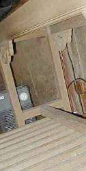 
Darum heizt auch er sich ein, 
ein Gebläse schafft das fein

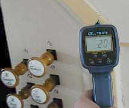.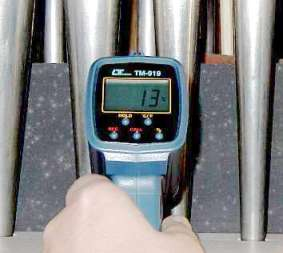 
In der Raumluft 20 Grad, 
nur 13 im Gehäuse - schad! 
Jedoch für den Schimmel nicht, 
weils ihm an Kondens nie gebricht. 
Zappenduster ists da drin 
die lichte Sonn´ wärmt da nie hin.

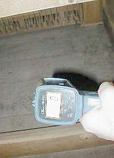 
Oder Luft mit 5 - und andersrum: 
Die Orgel im Frostdelirium!

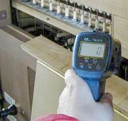 
Überm Notenpult: jeder Stoß aus der Nas, 
macht gewiß die erkältete Orgel naß. 
Doch umgekehrt - das ist schon dumm, 
bringen Sporen den Organisten um.

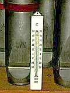 
Die Messenluft oft warm und schwül, 
das dunkle Orgelwerk mehr kühl - 
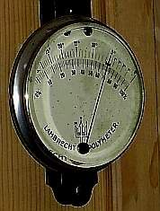 
Feuchthauch das Musikholz verquollen, 
gern greift der Orgler in die Vollen - 
sein riesig Pfeifenladenwerk 
piepst nur erbärmlich wie ein Zwerg. 
Gemeinde wundert sich und zuckt, 
weil Instrumentenkönig spuckt.

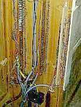 
Elektropneumatik-Kontakte 
fallen aus, weil Rost sie plagte. 
Kondensbrüh der Stoßgebeter 
dehnt und bricht das Taschenleder. 
Ach der Ziegenbalg - Meck, meck! 
Quietscht und klingt nach Kötteldreck.

Der Orgler weint - Ach!, was vermißt er? 
Nicht eins, nicht zwei, nein 10 Register. 
Anstatt der klangsatten Bachschen Töne 
winselt und heult erbärmlich Gestöhne.

Und die Moral von der Geschicht - 
zerheizt die Kirchenluft mir nicht! 
Denn in alle kalten Teile 
wächst nasser Schimmel nach ner Weile, 
der dann seine Gifte pufft 
immer in des Raumes Luft.

Steinmeyer, Ladegast, Silbermann - 
Luftnässe macht all ihre Werke lahm. 
Das freut den Restaurator sehr, 
doch der Gemeinde machts Beschwer. 
Und kurz nur nach der Reparatur, 
beginnt von neuem die ganze Tour. 
Was dagegen zu machen ist, 
liest [hier](7temp13.md) der Heide + der Christ. + + +

---

**Themenlinks Orgel:**

Orgelsachverständiger und -retter Oberkonservator a.D. Dr. Sixtus Lampl, Orgelzentrum Altes Schloß Valley (mit dem ich 9 Monate als Volontär am Bayer. Landesamt für Denkmalpflege viele Probleme bei der Erhaltung historischer Orgeln hautnah kennen lernen durfte):

[lampl-orgelzentrum.com/](http://lampl-orgelzentrum.com/) 
[www.heimat-now.de/hpf_abc_orgel.htm](http://www.heimat-now.de/hpf_abc_orgel.htm) 
[www.echo-online.de/kultur/template_detail.php3?id=343690](http://www.echo-online.de/kultur/template_detail.php3?id=343690)

Feuchteschäden und Schimmelbefall allerorten und gottgewollt? (Beispiele mit nicht immer zutreffender Schadensanalyse):

[Orgel der Evangelisch-reformierten Kirche in Gruiten (Haan) von Schimmel befallen - Folge des falschen Heizens](http://www.rp-online.de/public/article/hilden/551220/Orgel-von-Schimmel-befallen.html) 
[www.martin-kondziella.de/Zustand/zustand.html](http://www.martin-kondziella.de/Zustand/zustand.html) 
[www.berlinonline.de/berliner-zeitung/ archiv/.bin/dump.fcgi/2000/0731/lokales/0024/](http://www.berlinonline.de/berliner-zeitung/ archiv/.bin/dump.fcgi/2000/0731/lokales/0024/) 
[www.safer-world.org/d/lit/schmelz.htm](http://www.safer-world.org/d/lit/schmelz.htm) 
[http://www.tagesspiegel.de/kultur/archiv/07.04.2005/1745269.asp Dresdner Frauenkirche schimmelt schon vor der Einweihung](http://www.tagesspiegel.de/kultur/archiv/07.04.2005/1745269.asp) (Leider und vorhersehbarer Weise auch danach - da mit superteurem Luftheizungssystem kaputtgeheizt!) 
[www.mdr.de/unterwegs/thueringen/1085538.html](http://www.mdr.de/unterwegs/thueringen/1085538.html) 
[www.denkmal.schleswig-holstein.de/texte/JB-02-03.rtf ](http://www.denkmal.schleswig-holstein.de/texte/JB-02-03.rtf) 
[home.tiscalinet.de/ekspsoll/Archiv/kirchspiel/KiOrgel.htm](http://home.tiscalinet.de/ekspsoll/Archiv/kirchspiel/KiOrgel.htm) 
[Schnitger Organ of Porto, PORTUGAL SÃO Salvador de Moreira Monastery](http://www.arpschnitger.nl/smoreira2.html) 
[www.eurac.edu/Press/Academia/20/art_10.htm](http://www.eurac.edu/Press/Academia/20/art_10.htm) 
[www.eurac.edu/websites/eurac/academia/20/academia20.pdf ](http://www.eurac.edu/websites/eurac/academia/20/academia20.pdf) 
[www.bmbwk.gv.at/medienpool/ 5993/5993_Bundesdenkmalamt.pdf](http://www.bmbwk.gv.at/medienpool/5993/5993_Bundesdenkmalamt.pdf) 
[www.oberpfalznetz.de/zeitung/537468-129,1,0.html](http://www.oberpfalznetz.de/zeitung/537468-129,1,0.html) 
[www.walcker.com/gewalcker.de/PDF/Remerschen_Doku.pdf ](http://www.walcker.com/gewalcker.de/PDF/Remerschen_Doku.pdf) 
[www.nibelungen-kurier.de/neu/_main/ main.php3?news=archiv/19-10-2003_1065790960.nkn](http://www.nibelungen-kurier.de/neu/_main/main.php3?news=archiv/19-10-2003_1065790960.nkn) 
[www.fvv-am-scheibenberg.de/Scheibenberg/ Aktuelles/nachrichten/start?nachricht=6471](http://www.fvv-am-scheibenberg.de/Scheibenberg/Aktuelles/nachrichten/start?nachricht=6471) 
[www.foer-di.de/200112/duetdat.htm](http://www.foer-di.de/200112/duetdat.htm) 
[www.kirche-chemnitz.de/news.php?show=40&beitrag=858](http://www.kirche-chemnitz.de/news.php?show=40&beitrag=858) 
[www.trinitatis-reichenbach.de/ Kirchenmusik/kirchenmusik.html](http://www.trinitatis-reichenbach.de/Kirchenmusik/kirchenmusik.html) 
[www.elkth-hbn.de/Apostelkirche_Hildburghausen.htm](http://www.elkth-hbn.de/Apostelkirche_Hildburghausen.htm) 
[www.st-gereon-merheim.de/ berichte/2003/pfarrarchiv_01.php](http://www.st-gereon-merheim.de/berichte/2003/pfarrarchiv_01.php) 
[kulturportal.maerkischeallgemeine.de/ cms/beitrag/10322115/71739/](http://kulturportal.maerkischeallgemeine.de/cms/beitrag/10322115/71739/) 
[www.schwalbennestorgel.de/archiv/ak000131.htm](http://www.schwalbennestorgel.de/archiv/ak000131.htm) 
[Interessengemeinschaft Orgel und Kirchenmusik Schiltach e.V.](http://www.ev-kirche-schiltach.de/ceasy/modules/cms/main.php5?cPageId=90) 
[www.fuusgaard.dk/Sdr._Nissum_Kirke.htm](http://www.fuusgaard.dk/Sdr_Nissum_kirke.htm) 
[www.goart.gu.se/gioa/w-12.htm](http://www.goart.gu.se/gioa/w-12.htm) 
[www.viborg.stift.dk/vejledning7.htm](http://www.viborg.stift.dk/vejledning7.htm)

---

Im Jahre 2006 berichtet die Neue Presse Coburg aus B. zunächst sehr ausführlich von einer kompletten und zigtausende EUR teuren Gesamtrestaurierung der berühmten Malereien an Decke und Emporen mit biblischen Motiven aus der barocken Umbauphase der 1680 aufgestockten Kirche von 1370. Erst als sie nahezu abgeschlossen ist, entdeckt die Restauratorin schwammzerstörte Balken und sonstige Holzteile in wesentlichen Teilen des tragenden Gebälks und Dachstuhles. Das Szenario beginnt: Aus Bericht am 16.11.2006: _"Hausschwamm im Gebälk - Kirche muss geschlossen werden. Evangelische Christen in B. müssen Weihnachten auf dem Dorfplatz feiern."_ Das wird freilich nicht die einzige Unanehmlichkeit für die Kirchengemeinde bleiben. Die "unterwegs" enteckten Schäden - nach der aufwendigen Raumschalenrestaurierung - lassen die Kostenlawine anrollen. Die eben erst restaurierten Kunstwerke müssen nun teilweise ausgebaut werden, um den Schadensumfang aufzudecken und die Schäden an der tragenden Substanz erst mal zu beseitigen. Ob es zur Vollvergiftung durch grausigste krebserregende Holzschutzgifte kommen wird? Ungeeignetste aber lukrativeste Antifeuchtemittelchen wie feuchtesperrender und treibmineralverursachender [Sanierputz](2sanipuz.md), fundamentbewässernde Drainage, energieverschwendende Unterputzheizleitungen und allerlei sonstiger Blödsinn gegen die [gar niemals aufsteigende Feuchte](2aufstfe.md) durch irrtumsbeladene Bauphysiker und geschenkbeladene Sanierberater/Pharmavertreter der Chemoindustrie via hörigem Planer (erkennbar an [nicht gegebener Produktneutralität](10hoai22.md#ausschreibungsschwindel): "Produkt XY oder gleichwertig" als Pseudo-Neutralitäts-Tarnfloskel im Ausschreibungstext) in den altehrwürdigen Bau gepreßt werden? Ob vielleicht auch Kondensatfang-Folien und auffeuchtungsriskante Leichtbau-"Dämmstoffe" in das Dach hineinbugsiert werden? Ob eine sorgfältige Voruntersuchung und Bestandsaufnahme eine kostensichere Maßnahmenausschreibung nach Einheitspreisen garantieren wird oder die Baukosten und Planungshonorare durch Regiestundenvergabe nach oben explodieren dürfen? Sie dürfen raten! Und ob die Schadensursachen beseitigt werden? Wir bleiben dran. 

Ist das typisch? Umfangreiche Maßnahmen werden fachleute- und bauherrenseits beauftragt, ohne die Voraussetzungen für solche Maßnahmen zu berücksichtigen: Eine Voruntersuchung der zu restaurierenden Substanz, die diesen Namen auch verdienen würde. Eben bis in die Tiefe. Besonders tragisch: Da meistens das Dach ausreichend dicht ist und die wahren Ursachen der Schäden an den abplatzenden und vor sich hin korrodierenden Malschichten auf den Holzgründen und die Vermorschung der raumnahen tragenden Holzkonstruktionen nicht erkannt sind, könnte es bald wieder vergeblich gewesen sein, was ungeheurer Restauratorenfleiß zusammenbrachte. Wird bald alles wieder hinüber sein, was die spendenfreudige Gemeinde in die Sanierung investiert? Durch die mit Fleiß sonntäglich erwärmten Gemeindehintern? Oha??? Hier des Rätsels Lösung: Die einst eingebaute Kirchenbankheizung im temporären Betrieb. Sie treibt die Holzuntergründe auseinander und zusammen, sie näßt durch sonntägliche Kondensationsauffeuchtung die ausgekühlten Balkenwerke bis zur endgültigen Vermorschung auf. Aber diese Erkenntnis ist oft denkbar unbeliebt. Auf jeden Fall bei den Restauratoren, die sonst - bei [Gefahrenabwehr durch simpelste Temperiertechnik](7temp17.md) - mit Warmwasser-Zentralheizung oder der oft wesentlichen günstigeren Elektro-Direktheizung (el. Inrarotheizung, IR-Strahlungsheizung, elektrische Heizkabel-Temperierung, IR-Heizplatten-Temperierung, Infrarotwärme-/Wärmewellen-Strahlplatten-Heizung ohne jegliche Transportverluste, Kesselverluste, Kaminverluste und unübertreffbar bei den Installationskosten) um ihre Daueraufträge gebracht würden.

Weiter **[4 - Strahlungsgeschichtliches](7temp04.md)**
