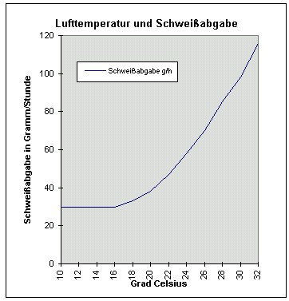

[🠔 Zur Übersicht: Heizen](7temper.md)  
# Wie funktioniert Temperierung? Wirkprinzip Wärmestrahlung, Trocknungseffekt, Wärmeverlust: Konvektion kontra Strahlung
**Um einen Raum zu temperieren, egal ob für den dauernden Aufenthalt von Menschen oder als Museumsdepot, wird die Raumhülle als Wärmeverlustfläche erwärmt.**  
_von Konrad Fischer_

## Die Temperierung der Gebäude-Hüllflächen 6

## Wie "funktioniert" Temperierung?

Um einen Raum zu temperieren, egal ob für den dauernden Aufenthalt von Menschen oder als Museumsdepot, wird die Raumhülle als Wärmeverlustfläche erwärmt. Dies gilt im hier benutzten und vereinfachten Modell für ein beispielsweise würfelförmiges Einraumgebäude, dessen sechs Hüllflächen gegenüber der Raumlufttemperatur an kühlere Außenzonen angrenzen und an diese auskühlen. 

Die auf eine Oberflächentemperatur von z.B. 20 °C erwärmten Außenwände versorgen dann den Innenraum und die darin befindlichen Gegenstände wie Möbel und Personen mit Strahlungswärme. Bei einer Raumlufttemperatur von 20 °C wäre der Strahlungsanteil der zwanziggrädig temperierten Wand 100 Prozent, Konvektion, die logischerweise eine Übertemperatur des Heizelements gegenüber der erst dann erwärmbaren Raumluft voraussetzt, wäre dann bei 0 Prozent. Ein Idealzustand aus Sicht des Strahlungsheizers, der aber recht eigentlich nur außerhalb der Heizperiode - also im Sommer natürlicherweise anzutreffen ist. Oder wir heizen mit Flächenheizung (teuer!) unsere Hüllflächen genau auf diese 20 Grad. Die Moleküle der Wand schwingen dann gleich schnell wie die Luftmoleküle, letztere können dann nicht beschleunigt werden und expandieren das Gasgemisch nicht, kein expandiertes Luftgasgemisch wird dann leichter, kein Luftgasgemisch kann dann konvektiv nach oben steigen: Die Raumluft bleibt in Ruhe, der Staub am Boden. Sparsamer ist freilich eher flächenreduzierte Heizerei des Raumes - mit dann selbstverständlich konvektionsfördernder Übertemperatur. Und diese darf bei großen Heizflächen kleiner und muß bei kleinen Heizflächen größer sein. Sonst frieren wir. 

Noch ein lustiges, aber wichtiges Detail, über das aber kaum jemand nachdenkt, der sich ums Energiesparen und energiesparende Heizen Gedanken macht: Wenn wir nun winters einen kühlen Raum aufheizen, egal mit welchem Luft- oder Strahlungsheizsystem - welcher Raum wird nun schneller so warm werden, daß wir es uns darin wohlfühlen - ein Raum mit extrem leitfähiger, schwerer Stahlbetonhülle oder einer Hülle aus leichter Pappe? Ein Raum mit schweren Gußeisenmöbeln, barockfettem Schnitzwerk Marke Gelsenkirchen bis Bottrop und dicken Glastischplatten und Stahlschränken, gefüllt mit Gold, Silber und Omas Bestecksammlung oder einer mit leichterem, gleichwohl robust-stabilem und stylischem Mobiliar - denken wir als architekturbegeisterte Wohnmenschen der Moderne nur mal an Sitzgarnituren wie die [Baidani Rattan Möbel](https://www.baidani.de/8-rattan-komplettsets) - oder gleich an [Papiermöbel](http://www.livingathome.de/wohnen-selbermachen/wohnideen/4241-rtkl-moebel-aus-papier-und-pappe)? Welches Material wird länger brauchen, um die Wunschzimmertemperatur zu erreichen? Na? Fassen Sie doch mal an Ihre Holztischplatte und dann an die Tischfüße aus Stahl. Schnackelts? Dann haben Sie die Energiesparwirkung von dünnen Deckenverkleidungen und Rohrmattenputz, von Bespannungen auf Spannrahmen an Decke und Wand verstanden. Und wie idiotisch die moderne Sichtbetonits in der Innenarchitektur aus Energiesparsicht ist. 

Zurück zur [Konvektion](http://www.chemie.de/lexikon/Konvektion.html) (von lateinisch convectum 'mitgetragen'). Die kühleren Raumluftmoleküle werden im Kontakt mit einem wärmeren Körper an diesem durch dessen Stoßkräfte beschleunigt und damit erwärmt. In der Folge expandiert die erwärmte Luft mit ihren stark um sich boxenden Gasteilchen, die Gasmoleküle verteilen sich dann mit weniger Dichte (Masse pro Volumen) auf ein größeres Volumen, die erwärmte Luft wird dadurch leichter und steigt nach oben. Sie kühlt sich dann in Folge ab und fällt wieder nach unten, sie "konvektiert". Und logisch, je heißer die Heizfläche, umso doller deren Konvektionswirkung. Auf deutsch: Eine 90 Grad heiße Heizfläche hat einen wesentlich höheren Konvektionsanteil und wesentlich geringeren Wärmestrahlungsanteil, als ein 50 Grad warmer Heizkörper gleicher Dimension. Ob das allen Wärmestrahlfreunden und Infrarotexperten klar ist? Selber nachdenken! 

Die von einer übertemperierten Heizfläche angestrahlten Körper (Wände, Decke, Boden, Möbel, Nutzer) strahlen (reemittieren) ihrerseits die absorbierte Wärmestrahlung in alle Richtungen in den Raum. Sie leiten aber auch die aufgenommene Wärme mittels mechanischem Stoß weiter in das jeweils angrenzende Material weiter - mittels Wärmeleitung. Wenn nun das Hüllflächenmaterial wenig Wärme leitet, erwärmt es selbst durch recht wenig Energieaufnahme. Ist es stark leitfähig und bietet dolle Speichermasse, braucht es entsetzlich viel Energiezufuhr, bis eine solche stark leit- und speicherfähige Raumhülle selber warm wird. 

Ein von der Oberflächenbeschaffenheit abhängiger Teil der ankommenden Wärmestrahlung wird auch sofort wieder reflektiert, also zurückgestrahlt, ohne vorher absobiert zu werden. Damit sorgt der Strahlungsausgleich für ein allseits temperiertes Raumklima. Denken Sie vergleichsweise mal an Ihre Glühbirne (pardon, natürlich muß das in heutigen, ökologisch korrigierten Zeiten "Energiesparlampe" heißen, sei's drum) über dem Eßtisch. Wenn sie bei dunkelster Nacht angeknipst wird, können Sie auch unter dem Tisch die Essensreste suchen - und finden. Bei der Energiesparlampe dauert das freilich etwas länger, dafür wird freilich gaaaanz dolle die Umwelt gerettet ;-)

Das Ziel des Temperierens mit vorzugsweise Strahlungswärme ist einmal die aus Komfortgründen erforderliche Erwärmung des Raumes. Andererseits erwärmt die infrarote Wärmestrahlung die abkühlenden Außenwände auf eine Temperatur, die idealerweise über der Temperatur der Raumluft liegt. Und das verhindert das oft schädliche Einwandern von Kondensat aus überhöhter Raumluftfeuchte in die Außenbauteile und damit auch die der Feuchteaufnahme üblicherweise nachfolgenden Schäden wie Verschmutzung, Beschimmelung, Insekten- und Schwammbefall der Holzbauteile und schädigenden Dimensionsänderungen (hygrisches Quellen) der Raumausstattung und Oberflächenverkleidungen bzw. -beschichtungen.

Erreicht wird dieses Ziel durch den gekonnten Einsatz von Wärmestrahlung im Heizsystem. Die Wärmestrahlung durchstrahlt dabei ausgehend von der Strahlungsquelle (Strahler z.B. Heizleiste, Heizkabeltrasse, WW-Rohre, Heizkörper, Heizgläser, Marmorplatte / Marmorheizung / Karbonfaserplattenheizung bzw. Elektrodirektheizung / Elektroheizung / Elektroheizfläche/ elektrisch beheizte sonstige (z.B. metallische) Heizflächen Wärmewellenheizung ...) die Luft ohne Energieverlust und Lufterwärmung. Doch bitte nicht vergessen - die Strahlungsquelle hat ja meist Übertemperatur und damit immer auch einen - abhängig von der Temperatur! - mehr oder weniger hohen Konvektionsanteil. Der darf also nicht übersehen werden und muß durch geeignetes Heizregime und geeignete Anordnung der Heizquelle quasi gebändigt werden. Und daran hapert's doch recht oft, oder?

Erst bei Auftreffen auf Bauteile/Materie wird die Strahlung dort absorbiert/reflektiert/reemittiert. Indirekt wird dann die Raumluft durch laminare Wärmeübergabe der erwärmten Bauteilflächen (schnellere Molekularbewegung) an die direkt anliegende kühlere Luftschicht (langsamere Molekularbewegung) ebenfalls erwärmt. Und natürlich, natürlich - auch heiße Luft erwärmt die Stoffmoleküle, an denen sie auftrifft. Selbst wenn sie voller Staub beladen ist.

Im Ergebnis einer strahöungsoptimierten Wärmeübertragung bleibt die Luft systematisch kühler als die Baukörper, was - wie schon erwähnt - einerseits das Kondensat an den Bauteilen sicher verhindert und andererseits heizungsbedingte konvektive Luftbewegung mit Staub- und Feuchtetransport stark einschränkt. Eine Strahlungsheizung wird also idealerweise eine etwas kühlere Raumluft erzeugen - und an diese - soweit über der Raumlufttemperatur abstrahlend - auch einen gewissen Konvektionsanteil abgeben. 

Das bedeutet - nur zur nochmaligen Einbleuung in Hohlköppe (Redundanz), daß es eine "reine", will sagen hundertprozentige Strahlungsheizung nur geben kann, wenn der Wärmestrahler genau der Temperatur der Raumluft entspricht, denn dann ist der Konvektionsanteil gleich Null. Ansonsten ist, abhängig von der Übertemperatur zur umgebenden Luft, immer auch ein Konvektionsanteil vorhanden. Und je heißer der abstrahlende Körper ist - Hellstrahler - mit sichtbarer offener Verbrennung des Gas-Luft-Gemisches sind an ihren Oberflächen ca. 950 °C heiß, Dunkelstrahler immer noch um die 300 bis 650 °C (Strahlungsanteil ca. 45-55%), Heizsonnen sind über 300 ° C heiß, Marmorplatten und andere moderne Elektrodirektheizplatten meist um die 90-120 °C, warmwasserbetriebene Heizkörper und Heizrohre abhängig von der am Kessel gewählten Vorlauftemperatur so um die 40 bis 55 °C warm/heiß - umso mehr konvektiven Luftauftrieb kann eine Heizfläche auslösen. Insofern ist es eigentlich falsch, von reinen Strahlungsheizungen oder Konvektionsheizungen zu sprechen, da normalerweise jeder erwärmte Konvektor entsprechend seiner Temperatur auch strahlt (!!!) und jeder Strahler bei einer über der umgebenden Luft liegenden Temperatur (die "Übertemperatur") auch Konvektion erzeugt. 

Nach dem Stefan-Boltzmann-Gesetz (nach den Physikern Josef Stefan und Ludwig Boltzmann) ist die Strahlungsleistung abhängig von der vierten Potenz der Temperatur, deswegen strahlen wärmere Flächen wesentlich intensiver, als kühlere. Wobei die Strahlungsintensität selbstverständlich mit der Entfernung von der Strahlungsquelle abnimmt.

Da die Strahlung von der Strahlungsquelle aber quasi verlustfrei in den Raum abgegeben wird, ist es für die Außenwände kein extremer Nachteil, wenn sich die Strahlungsquelle von der Wand entfernt befindet. Man könnte sich als Analogon auch eine Lichtquelle (z.B. Neonlampe) vorstellen. Das Licht bzw. die Lichtstrahlen/Lichtstrahlung durchdringt das Zimmer, ohne in der Luft sichtbar zu sein. Erst beim Auftreffen auf einen Körper wird dieser von der Lichtquelle hell erleuchtet, je nach Abstand von der Lichtquelle freilich mehr oder weniger hell. Nur wenn wir Rauch oder Wasserdampf in den belichteten Raum blasen, werden dessen Partikel hell und zeigen die Wirkung der Lichtstrahlen in der Raumluft.

**Die Neon-Analogie**

Das Analogon mit einer Neonröhre können wir noch weiter ausbauen:

Licht und Wärmestrahlung befinden sich im benachbarten Wellenlängenspektrum, beide Strahlungen sind elektromagnetische Wellen und pflanzen sich mit Lichtgeschwindigkeit fort. Sie durchdringen beide unsichtbar und nahezu ohne Energieverlust die Luft, erst wenn Sie auf Materie/Stoff treffen, wird Licht "sichtbar" und Wärmestrahlung an Temperaturerhöhung "spürbar". Geht es nun bei Wärmestrahlung darum, es "warm" zu bekommen, soll Licht den Raum "erhellen".

Wir montieren nun einen Meter Neonröhre - es könnten natürlich auch Leuchtkörper von Müller, Meier oder Fischer sein - an die Zimmerdecke. Ein Knipser - und der ganze Raum wird hell. Überall können wir auch unser kleingedrucktes gut lesen. Selbst hinter Möbeln und anderen verschatteten Bereichen - dank Reflexion der Lichtwellen ( wer es genauer wissen will: [Info Lichtstrahlung/Wärmestrahlung](7temp21.md)) bis unter das Bett. So funktioniert im Prinzip auch die offen vor die Wandfläche montierte Temperierung aus Strahlkörperflächen und -leitungen. Sie erreicht bzw. bestrahlt direkt oder über "Umwege" nahezu alle Bereiche der Raumhülle und erwärmt sie als elektromagnetische Strahlung mit geringstem baulichen Aufwand und Energieverbrauch in Lichtgeschwindigkeit und quasi Echtzeit. Erst indirekt auf Umwegen wird es auch im oberflächennahen Querschnitt der Raumhüllenkonstruktionen oder auch drinnen im Sofapolster etwas wärmer, was uns als Nutzer freilich egal sein kann: 

Die direkt spürbare Temperatur der Oberflächen zählt ja für uns. Je weniger Heizenergie in die Innereien der Bauteile und Möbel "verschwindet", umso besser. Der Massivbau nimmt die Wärmeenergie wie das Licht an der dichten Oberfläche auf und spendet einen Großteil der auftreffenden Energie dem Raum und seinen Bewohnern zurück (und ja , eine Innendämmung wäre schon sinnvoll, denn dann erwärmt die Raumhülle mangels zu erwärmender Masse schneller - jedoch dann plagt uns das Tauwasser in der dann tiefer drin unterkühlten Bauteilzone). Die Strahlungsfunktionen heißen überigens Absorption, (Re-)Emission und Reflexion. Danke! Uns kommt es ja genau auf die direkte Wärmeanstrahlung von den Oberflächen her an. Kuschelig und wohlig und gemütlich!

Nun kommt der bebrillte Ästhet daher und will keine Neonlampe an der Decke sehen - es wäre allzu funktionalistische Bahnhofshallenatmosphäre, sagt er. Gut - wir kaufen halt 10 Meter Neonröhre und montieren sie als indirekte Beleuchtung hinter einer Blende in der Wand-Decken-Ecke. Kostet 10 mal mehr an Baukosten nur für die Lampen, dazu die Kosten der Blende, und dann 10fach höherer Energieverbrauch für die gleiche Luxzahl, die nun vorwiegend von der Decke schimmert. Hinter der Blende ist auch schlecht putzen. Und ist es etwa schöneres Licht, was nun den Raum beleuchtet? Ich weiß es nicht. Der Vergleich mit den Fußbodenheizleisten und ihrer indirekten Erwärmung der Außenwandflächen ist hier einigermaßen passend.

Der schwarzglattgelackte Perfektionist will nun gar keine Lampen mehr sehen, die Putzfrau gar kein Lichtsystem verstauben sehen. Folglich montieren wir 100 Meter Neonröhren unter Wandputz, bis die Oberfläche schimmert und leuchtet. Jede Röhre zeichnet sich nun verschwommen leuchtend hinter dem Putz ab. Schööön. Kostet 100 mal mehr Lampe, 100 mal mehr Lichtstrom, dazu das Risiko, daß tagsüber einer mal einen Nagel in die unbeleuchtete Wand haut. Gibt das nun bessere Beleuchtung als die nackte Lampe an der Decke? Können wir noch bequem im Gesangbuch lesen? Auch das weiß ich nicht. Aber dieser Perfektionswunsch ist Hintergrund aller in der Wand und im Fußboden versteckt im Schatten geführten Heizleitungen, Hypokaustensysteme usw. 

Doch jetzt das große Aber: Was wir hier nie dürfen, um uns gequälte Fratzen zu sparen: Nach den Energiekosten für die fabelhafte, die Raumatmosphäre so genial verbessernde Wandheizung zu fragen, Öl, Gas und Holzster zusammenrechnen und auf kWh/qm geheizten Wohnraum umrechnen. Dazu dann die irre Kosten für die im alten Gammelbau namens Bauernhaus, Fachwerkhaus oder Büdli kilometerweise draufgepampte Pframpfschicht aus ach so bioökologoschem Leichtlehm / Dämmlehm / Wärmedämmlehm aus natürlichem Anbau und wintermondgeschlägerter Holz- und Strohspreißelei, expandiertem Kork und dergleichen. Deren Eigennässe mindestens drei Winter erst mal rausgeheizt werden muß, wenn die Lehminnenschale aus vollbiologischem "natürlichem" Baulehm" (gibt es unnatürlichen Lehm, ist Lehm ein verkacktes Endprodukt aus biologischer Ausscheidung, vielleicht mit Kuhdung oder gar Kameldung aus biologisch-dynamischer Vegan-Fütterung?) mit Fichten-Tannen-Holzhackschnitzel oder Blähtongranulat Marke Lehmdreck nicht vorher die sommerlich ungeheizte Wand verschimmeln läßt. Natürlich empfohlen vom ultimativen Architekten, Energieberater, Lehmfachmann, Bauernhaus-Experten und Restaurator, der freilich alles andere ist, als befangen und bestimmt kein Centchen an der Lehmpampe plus drin verschlämmte Heizrohre verdient, die der ahnungslose Bausimpel seiner Außenwand, die nie sowas besaß, da sie es auch nicht brauchte und bezüglich Wandstärke das ultimative Erfahrungswissen seit grauer Väter Vorzeit in sich barg, wie sich Solarspeicherung und winterlicher Heizaufwand standortgerecht ideal so ergänzen, daß mit geringstem Energieaufwand ein warmes Zimmer und eine trockene, dauerhaft haltbare, sommers wie winters gleichermaßen schnell trocknende und schimmelfreie Wand gegeben sind. Aber nein, es kommt eben nur auf das mondholzgeschlägerte und mercurioalgeschwängerte Druidenwissen des urkeltisch-anthroposphisch-teosophischen Permakultur-Gurus Müllermeierschulze an, wenn es um geistkörperseeleheilendes Bauen geht. 

Plus Einfachfenster mit Fensterladen - die Idealkonstruktion betreffend kostenloser Nutzung des diffusen und direkten Sonnenlichts am Tage und perfekte Verringerung der Wärmeverluste dank Fensterladen nachts. Doch nein, die so freundlich daherschwätzenden Herren und Damen Baubiologen und Planer wissen alles besser, vernichten die billig herzurichtenen historischen Fenster (waren angeblich keinen Schuß Pulver mehr wert), bringen dafür lippendichte Dreischeibenmonster in das zu vergewaltigende Häusle und verstecken die warmen Rohre hinter kaltem Lehmpamp, garniert mit wunderlichen Erklärungen, wie dolle das alles funktioniere, und wie das die heizaufwandschluckende Speichervermögen auf der Innenseite (!) des armen Wändchens jedes In-die-Hände-Spucken und Kasselehrens des vergeizten Bausimpels rechtfertigt. Der dann noch in der einschlägigen Fachliteratur mit seinem Auf-den-Leichtlehm-Leim-Gegangensein herumstölzelt, nicht ohne das Über-Alles-Im-Himmel-Preisen der glückseligmachenden Wandheizungs-Wohnatmosphäre zu vergessen. 

Die üblichen Heizkosten für die im Lehmsschwartenspeck versenkten Wandheizungssystem? 

Ausweislich der mir zugänglich gemachten Daten von glücklichen Wandheizungsbesitzern können diese 30 Liter Heizöläquivalent je Quadratmeter leicht übersteigen. Und obwohl es dank Absaugens der Wärme im Lehmpamp nie wirklich wohlig warm wird, behilft sich der gelackmeierte Wandheizungsdepp mit Tiraden der gefühlt besseren Wohnatmosphäre. Und heizt seine im Zuge der "beratenen" Renovierung vielen Lehmkubikmeter zusätzlich zum Restbestand seines vorher sparsam aufheizbaren Häusels mit. Wer ko, der ko. Von der Vorlauftemperatur der Wandheizung werden - genau wie bei der Fußbodenheizung - ja nur stark gedämpfte Bruchteile flächenwirksam, erhebliche Mengen setzen die benachbarten Moleküle von Lehm, Stein, Holz und Mörtel in Bewegung und lehren sie das Tanzen (Wärme ist Bewegung! Je mehr ich bewegen muß, umso mehr Heizenergie brauche ich dafür!) und dabei das Heizgeld zertreten. Das nutzt der Raumwärme nur bedingt bis fast gar nicht, das System ist sehr "träge" - ein Zeichen für die Effizienznachteile und nicht gegebene Sparsamkeit aller in Putz, Mörtel und Lehm eingelassenen Heizrohrsystem. Kein Bauer wäre früher so dumm gewesen, seinen Kotten dermaßen aufwendig hinzurichten, die Nachfolgebewohner seines Energiesparwunder jedoch schon. Dafür sieht es top nach Kuschel, Romanze oder Bauhaus aus, zugegeben. 

Soviel zu den Bauartunterschieden und den Lehmfanatismus, der heutzutage geradezu zum Standard des Geldvernichtens am Altbau - egal ob Bauernhaus, Bürgerhaus, Armenhaus oder Schloß, Kloster oder Burg - gehört. Die Frage nach der Sinnhaftigkeit früherer Wandstärken, die im Fachwerk und Holzbau die energiesparoptimalen 13-15 cm praktisch nie überschritten, nach der Wertigkeit der historischen Wandfassungen bzw. Malereien, die auch die Innenseiten der Außenwände schmückten, darf man dieser Interessengemeinschaft (am Lehmbaugewinn) von Altbauexperten freilich nie stellen, denn sonst beißen sie einem vor und noch mehr im Bauernhaus in die Hand. Unabhängiger und selbst durchdachter Bauphysikverstand, gar kritisches Erfahrungswissen (außer häufigem Reinlegen des leicht(lehm)gläubigen Kundschaft der Altbaubesitzer, Hauserwerber usw.) gleich Null, Normengläubigkeit dafür unendlich. Eine [kostengünstige Bausanierung](11erhins.md) geht freilich anders.

**Das Wirkprinzip der Wärmestrahlung**

Das Wirkprinzip des Wärmestrahlers wird in der nachfolgenden Grafik sinngemäß - aber stark vereinfacht dargestellt. Die Grafik zeigt eine auf Übertemperatur gegenüber der Raumluft erwärmte Strahlplatte - das könnte ein warmwasserversorgter "schmaler" Flachheizkörper oder eine elektrisch betriebene Heizplatte sein - an der Außenwand und die dann dank Strahlungsausgleich allseits "zurück" strahlenden Raumoberflächen, bei Hüllflächentemperierung mittels Sockelheizleitung wirkt entsprechend das heiße Rohr und die davon erwärmte Sockelzone, bei Unterputzrohrführung die umgebende Wandfläche als "Quelle" der Wärmestrahlung. Was hier nicht gezeigt wird, ist die an der übertemperierten Wärmequelle aufsteigende erhitzte Luft, also die mit jeder übertemperierten Heizfläche ebenfalls verbundene Heizluftkonvektion.

 
_Wirkung der Wärmestrahlung einer Hüllflächentemperierung 
Bildquelle: raum&zeit 25. Jg. Nr. 144, 11/12.2006 nach Angaben von Konrad Fischer_

Durch das Strahlungsprinzip, das selbstverständlich nicht nur für Elektroplattenheizung _(um Mißverständnisse zu vermeiden: Ich benutze die Grafik, um das Prinzip zu zeigen!)_ , sondern für alle hinsichtlich Wärmestrahlungsabgabe optimierten Heizsystem und Heizkörper gilt, wird der Energieverbrauch grundsätzlich günstig beeinflußt - bei beherrschtem Konvektionseffekt (!!!) - ohne korrespondierende Gesundheits- und Feuchteschäden, da:

 * mit wesentlich geringerem heiztechnischen Mißbrauch des Lebensmittels Atemluft als staub- und keimbefrachteter Energieträger - wie bei allen konvektionslastigen Heizmethoden über 45 Grad Oberflächentemperatur und allen Luftheizsystemen - die Raumschale und die Lunge sauberer bleiben;
 * mit geringerem Kondensatanfall in der gegenüber Heizluft kühleren Außenwand die Bauteilkorrosion gemindert wird und dem Schimmelbefall mit seinen Folgeschäden auch als Gesundheitsrisiko für allergieempfindliche bzw. asthmagefährdete ständige und gelegentliche Raumnutzer mehr vorgebeugt wird. Natürlich muß die stetige thermische Versorgung der Boden-Wand-Decken-Ecken dafür sichergestellt werden, sonst fällt dort trotzdem Kondensat an, es wird naß, verschmutzt, veralgt und schimmelt - typisch für dank Nachtabsenkung abgekühlte Außenwände und innenliegende bzw. "verschattete" punktuelle Strahlungsquellen.
 * eine vorzugsweise Strahlungsheizung mit geringeren Raulufttemperaturen als ein vorzugsweise heizluftkonvektierendes System das behagliche Raumklima liefert;
 * durch Beschränkung der konvektionsintensiven Raumluftwalze die - bei Verzicht auf nächtlichen Ladenverschluß - unangenehmen Abkühleffekte an Fensterflächen weniger heizungsintensiv abgemildert werden müssen;
 * die geringere Raumtemperatur mit geringerem Luftdruck gegenüber Außenluft keine Lüftungswärme mehr sinnlos vergeudet;
 * die geringere Raumtemperatur den Körper zu weniger kühlungsbedingten Schweißabgabe zur Aufrechterhaltung der Körperkerntemperatur nötigt, die "gesparte" Kühlenergie steht dann dem Immunsystem zur Verfügung, die krankmachende Grippewelle als Folge der überhöhten Lufttemperatur zu Beginn der Heizperiode kann entfallen - die Grafik verdeutlicht die schädliche Wirkung einer überhitzten Heizluft auf die Kühlfunktionen des menschlichen Körpers; 

 
Grafik: Konrad Fischer

 * die ständigen Regelungsverluste zur Aufrechterhaltung einer erträglichen Raumlufttemperatur und Luftfeuchte bei lüftungsbedingter Temperatur- und Feuchteschwankung weniger werden;
 * der geringere Wärme- und Klimatisierungsbedarf für untergeordnete Bereiche (z.B. Museumsdepot, Orgelgehäuse als eigenständige Schutzbereiche) auch geringer bemessene Anlagen- und Regeltechnik zuläßt;
 * auch im Großraum (Halle, Kirche, Saal) Temperier-Minimaltechnik und Minimalverbrauch den üblicherweise schadensträchtigen und teuren Betrieb von Warm- bzw. Umluftheizungen bzw. Hochtemperatur-Bankheizungen ersetzt;
 * hohe Aufenthaltsräume durch Sockeltemperierung genau dort die Wärme hinliefern, wo sie vom Benutzer gebraucht wird: in der Aufenthaltszone - und weniger als aufgestiegene Warmluft inkl. staubverkrustete, überfeuchtete und verrottungsgefährdete Verschmutzungszonen an der Decke;

**Der Trocknungseffekt**

Die Hüllflächentemperierung trocknet erst mal die Mauerfeuchte im Wirkungsbereich der Wärmequelle (Rohrleitung, Heizkabel, mit Heizkabeltechnik nachgerüstete alte Kachelöfen, Strahlplatte ...) aus. Bei erstmaliger Inbetriebnahme ist also damit zu rechnen, daß ein gewisser Teil des Energieverbrauchs für die Bauwerkstrocknung benötigt wird. Ist dieser von der vorliegenden Bauteilfeuchte zeitabhängige Prozeß nach einiger Zeit abgeschlossen, sinkt folglich der Energieverbrauch - wenn nicht bauart- bzw. objektbedingte Gründe als Effizienzbremsen vorliegen. Man kann ja auch bei Temperieranlagen "alles falsch" machen. Jahresenergieverbräuche von um die 200 bis weit über 300 kWh/qm bzw 60 bis über 80 kWh/cbm deuten darauf hin.

Hier ist dann nicht die gängige Erklärung "Feuchteaustrocknung" maßgebend, sondern in aller Regel die Bauart und ungünstige Wärmeverteilung bei eingeschlitzten und überputzten Temperierleitungen, die dann nicht gerade selten auch ungenügend erwärmte Räume bedingen. Welcher Sinn soll auch darin liegen, Massivmauern durch sozusagen mechanisch übertragene Wärmeenergie im Inneren "auf Bewegung" zu bringen anstelle die Wärmeenergie direkt dem Raum und seinen Bauteiloberflächen zur Verfügung zu stellen? Von den massiven und teuren Eingriffen zur Leitungseinschlitzung mal ganz abgesehen.

Die falsche Theorie eines Kampfes gegen ["aufsteigende Feuchte"](2aufstfe.md) mittels "thermischer Trockenlegung" hilft da nicht weiter. Wärmestrahlung muß möglichst "unverschattet" im Raum bereitgestellt werden - man beleuchtet ja auch nicht mittels hunderter Neonröhren unter dann milde schimmerndem Putz den Raum, in dem man lesen will. Auch Wärmestrahlung gehorcht ja wie Licht den unverrückbaren Gesetzen der Strahlungsphysik.

**Der "Wärmeverlust" - Konvektion kontra Strahlung**

Hier rechnet die heute auf maximale Heizkessel- und Dämmstoffauslegung ausgelegte "offiziöse" Bauphysik dank abstruser Vereinfachungen und Hypothesen grottig herum. Die gigantische Abweichung der meisten (vgl. "Cambridge-Studie", Sunnika-Blank, Galvin) U-Wert-basierten Energiebedarfsberechnungen vom realen Heizenergieverbrauch wird zwar mit allerlei wohlfeilen Ausreden wie "Nutzerverhalten" bemäntelt, ist aber eigentlich ein schlagender Beweis gegen die Rechenansätze bzw. widerlegt das sinnlose Unterfangen, einem Energieverbrauch in realen "instationären" Verhältnissen - also mit ständig und äußerst unterschiedlich schwankenden Aufheiz- und Auskühlvorgängen in, an, unter, auf und zwischen der Bausubstanz des Hauses mit "stationären" Modellen beizukommen, die gerade mal für ein im ewigen Beharrungszustand Tag und Nacht entfremdetem Laborprüfstand zutreffen mögen. Zugegebenermaßen. Wenn der Versuchsaufbau gerade mal paßt.

Link: [U-Wert-Narretei](2139bau.md)

Mit dem Meßmodell werden nun im Auftrag letztlich der Fertighausindustrie die Leichtbaustoffe krass bevorteilt. Sie können dank ihrere geringen Dichte nämlich dem von außen anstehenden erwärmten Medium Luft nur wenig Wärme mittels Kontakt entnehmen und nur wenig Solarenergie tagsüber einspeichern. 

So sieht eine Leichtbau-WDVS-Fassade dank nächtlicher Abkühlung unter Lufttemperatur und damit verbundener Kondensateinspeicherung inkl. Veralgung schnell aus (schon lustig, wie die besser speicherfähigen Kunststoffdübel dann auch weniger veralgen):

 
(**Abbildung** "Algenbefund auf der WDVS-Fassade" aus "[Forschung] Wärmedämmung; Zur EnEV: 1. Grünes Hinweisschild + 2. Schotten dicht" in: _[Bautenschutz+Bausanierung, Zeitschrift für Bauinstandhaltung und Denkmalpflege](http://www.bautenschutz-bausanierung.de)_ , Januar 2002, S. 44, Bildautor: Hochschule Wismar, Bildbearbeitung K.F.)

Andererseits flutscht dann die aufgenommene Wärme durch ein leichtes Bauteil schnell hindurch, während ein massives Bauteil die aufgenommene Wärme lange festhält, eben einspeichert. Und bei einem warmen Bauteil sieht es entsprechend andersherum aus: Nur ein Bruchteil der eingespeicherten Wärmeenergie kann ein erwärmt schwingendes Baustoffmolekül demnach an die Außenluftmoleküle abgeben:

Erstens, da nur 1/6 der Schwingungsenergie tatsächlich "nach außen" abgegeben wird und dort zweitens relativ selten ein Molekül trifft - dank der vergleichsweise geringen Moleküldichte der Luft. 

Dieser "kontaktabhängige" Energietransport ist in diesem Fall also gering und kann hilfsweise als "Wärmeleitung" beschrieben werden. Deswegen entnimmt ein schütterer "Dämmstoff" mangels Moleküldichte der warmen Hand wenig Wärme, ein dicht gepackter Stahl aber viel - gespürt als Abkühlung. Und genau so funktioniert eine Thermoskanne: Ihre dünne Glaswandung entnimmt der warmen Flüssigkeit nur wenig Wärme, die Quecksilbervespiegelung reflektiert die Wärmestrahlen und die Dicke der - ohnehin fats 100% vakuumisierten Luftschicht spielt für die Abkühlungsgeschwindigkeit nahezu keine Rolle. [Weitere Details Thermoskanne / Thermosflasche](2139bau.md#thermoskanne) Insofern ist es natürlich der Gipfel der Energieverschwendung, auf Strahlungsheizung angelegte Systeme wie bei der Betonkernaktivierung / Betonkerntemperierung / Bauteilaktivierung / Bauteiltemperierung in Wände einzuputzen. Das heißt dann Bauteiltemperierung. 

Die Energie, da solche eingemörtelten Systeme verbrauchen bzw. vergurken, um erst mal die rohrberührende träge Wand in thermische Bewegung (Brownsche Molekularbewegung) zu versetzen, kann man sich eigentlich sparen. Sie wird dem Raum nur sehr indirekt zur Verfügung gestellt und verpufft größtenteils im Wandquerschnitt, der die Wärme = Bewegung der Moleküle dämpft und schluckt. Es wäre wohl genug, nur die oberste Zone der Wandoberfläche in thermisch erhöhten, abstrahlungsaktiv warmen Zustand zu versetzen und diese möglichst wenig bis gar nicht zu verschatten bzw. zu dämpfen und blockieren. Das gewährleisten eben nur nackerte Vorwand-Systeme und das sollte der Bauherr wissen, wenn er und seine Baufrau die unsichtbare und technisch/wirtschaftlich ineffiziente Versteckung des Heizsystems unter Putz fordern.

Ja, so wird nun Wärme "transportiert" - mit Wärmeleitung, Konvektion (Transport erwärmter Gase) und Strahlung (Welle/Teilchen-Bewegung in Lichtgeschwindigkeit). Im Baustoff ist natürlich die Konvektion als Wärmetransport untergeordnet, man könnte allenfalls noch mit herrlich komplizierten Rechenmodellen den Kapillartransport des wärmehaltigen Porenwassers betrachten, was in der Sache aber wohl kaum was bringt. Gute Baustoffe sollen eben trocken sein, obwohl die Baufuzzis lieber [Feuchtefallen ](29bau09.md)verbauen. Traurig, aber wahr. **[Hier weiter ...](7temp07.md)**
