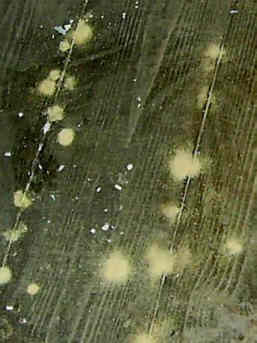
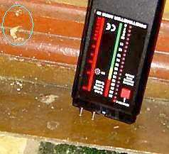
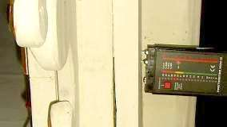

[🠔 Zur Übersicht: Heizen](7temper.md)  
# Temperieren im Großraum - Kirche, Saal und Halle
**Klimastabilisierung, Energiesparen, Objekt- und Feuchteschutz: Temperieren im Großraum - Kirche, Saal und Halle.**  
_von Konrad Fischer_

## Die Temperierung der Gebäude-Hüllflächen 13

## Temperieren im Großraum - Kirche, Saal und Halle

Auch in großen Räumen und Hallen bietet die Temperierung der Hüllflächen Vorteile. Gerade in verschmutzungsgefährdeten Kirchen, Sälen und Museen schont eine richtig eingesetzte Hüllflächentemperierung den Bestand mit geringen Baueingriffen und Betriebskosten. Vorteil der Temperierung in bautechnischer Hinsicht: Die Temperierung mindert die Kosten für [Trockenlegung](2aufstfe.md), für ständige Erneuerung der Raumschale (oft mit [Schwindelputz/Sanierputz](2sanipuz.md)), für Dauerreparatur der Sockelzone, für Heilung der an wertvollen Ausstattungsstücken entstandenen Heizschäden bis zum Schädlingsbefall im systematisch überfeuchten Holzinventar. Nur ein temperiertes Bauwerk ist gegen den Dauerstress aus jahreszeitlich und durch Besucher verursachte Feuchte- und Temperaturschwankung sicher geschützt.

Historische Kirchenbauten mußten als Low-tech-Bauten ohne Heizung auskommen. Das nutzungsbedingte Kondensat konnte bis zu einem gewissen Grad unschädlich an den Einfachgläsern als Sollkondensator abgefangen werden. Jedoch nur so lange, wie diese kälter als die Raumschale der sakralen Halle waren. Und dies war ja nicht immer der Fall: im Frühjahr erwärmte die Sonne die Scheiben, die feuchtwarme Frühlings- und Sommerluft hielt Einzug - und durchfeuchtete die kalt verbliebende Raumschale. 

Die Komfort-Modernisierungen der jüngeren Baugeschichte wurden leider ohne Berücksichtigung der Raumklimaverhältnisse dank unerschöpflicher Finanzmittel "gegen das Bauwerk" durchgezogen und haben eine Kettenreaktion von Bauschäden nachgezogen: Erst kam die Ofen-, dann die Bankheizung mit Lufterhitzung. Das [Kondensat konnte immer noch am Einfachfenster abkondensieren](23bau06.md). Die unangenehmen Zugerscheinungen des lufterhitzenden Heizsystems wurden dann aber Fensterproblem mißgedeutet - teure [Doppelfenster/Isoscheiben](23bau03.md) hielten Einzug in den Kirchenbau.

Folge: Nun kondensierte die aufgefeuchtete Raumluft (Feuchtequelle: Gottesdienstbesucher) noch weitaus mehr in unterkühlte Inventar-, Orgel-, Wand- und Deckenbereiche als sonst. Das gab verstärkt Verstaubung, Schmutzkruste, Schimmel, Hausschwamm- und Holzwurmbefall. Allfällige Renovierungsintervalle nicht 50 Jahre wie zur Low-Tech-Zeit, nein: alle paar Jahre wird man heutzutage der heizstaubvergrauten und versauten Raumschale überdrüssig.

 
Diese Kirche war vor wenigen Jahren fastweiß gestrichen. Der verfluchte Binderanteil der Farbe (Dispersionssilikat/Mineralfarbe? Kalk+Plastikschuß? Alpenweißdispersion?) - dem arglosen Baukeksperten immer gerne untergejubelt - gibt der Maximal-Verdreckung natürlich seinen besonderen Segen und fängt die Feinst- und Gröbststaubpartikel bevorzugt aus dem Pesthauch der lufterhitzenden Verschwelungs-Heizung.

Ein Bravo den bauphysikalischen Großmeistern, die als Baubeamte, Kirchenbaumeister, Heizungstechniker, Gemeindevorstände, Pfaffen, Pfarrer und Pastoren wirklich nichts ausließen, um dem Kirchenbau, seiner Ausstattung und seinen Nutzern - wozu auch der Organist gehört - maximal zu schaden. Und alles im Brustton der Überzeugung, es doch so gut zu meinen. Die Denkmalpflege als Mahnbehörde konnte das Schlimmste auch nicht verhindern, ihr Ruf nach zurückhaltender oder unterbleibender Heizung verhallte ungehört und war auch nicht besonders überzeugend. Einmal, da ja genug Geld da war um endlich dolle zu heizen, zum anderen, da ja auch unterbleibende Heizung (s. o.) nicht gerade die konservatorisch überzeugende Lösung bot. So sind gerade vor einigen Jahren (2006) Fälle von Kirchenbeheizungen in Baden-Württemberg bekannt geworden, bei denen das brutale Heizen bzw. das Aufheizen für Kirchenkonzerte zu unfaßbaren und millionenschweren Schäden an der Ausstattung führten.

+ 
+ 
So sieht es nach einigen Jahren in unbeheizten Räumen mit natürlichem Außenluftzustrom aus: 
Schimmel und Feuchte an Decke und Wand, Holzwurm im Bodenbelag und sonstigen Holzbauteilen. 
Luftfeuchte > 75%, Holzfeuchte > 20%.

 
Im nur manchmal luftaufgeheizten Kirchenraum: Holzfeuchte in der Bodenzone ca. 30 %. 
Im Ei : Oben Flugloch, unten Fraßmehl des gefleckten (bunten) Nagekäfers, der hier in schwammbefallener Eiche sehr günstige Lebensbedingungen vorfindet.

An Altarbrett ca. 20 %. Das genügt freilich zur Entwicklung von Holzwurmbefall (Anobium punctatum).

---

Nochmals kopfnußartig zur Erinnerung, was Feuchte im falsch oder gar nicht geheizten Bau dolles für die Erhaltung der teils über alles geschätzten Artenvielfalt leistet und nährt, was da kreucht und fleucht: 

Aus einer Pressemitteilung der Bayerischen Schlösserverwaltung (2/08): 

_Die Bayerische Schlösserverwaltung kämpft derzeit im Schloss Linderhof gegen Insekten. Die Larven des Museums- und Speckkäfers sowie Motten haben sich in wertvollen Wollteppichen und kostbaren Polstermöbeln eingenistet. Zudem fressen sie Löcher in die Teppiche. Aufgrund des sehr milden Winters konnten sich die gefräßigen Schädlinge offenbar stark vermehren._ 

Was mag nun die eigentliche Ursache sein für den fürchterlichen Insektenbefall? Na klar, das Schloß Linderhof wird wie viele anderen vergleichbaren wertvollen Museumsobjekte im Winter nicht beheizt. Das bringt Kondensatfeuchte ohne Ende in die klammen Bauteile und Exponate, selbstverfreilicht auch in Tapeten, Möbelstoffe und sonstige Textilien. Und damit leigen die allerbesten Voraussetzungen nicht für den Insektenbefall, sondern auch für den Befall mit zerstörerischen Pilzen wie Hausschwamm und Schimmel. Abhilfe kann hier keineswegs eine Bekämpfung des Befalls alleine durch die gängigen Methoden wie Vergiftung und Erhitzung bringen, sondern eine dauerhafte Senkung der Feuchteaufnahme durch Hüllflächentemperierung. Sonst geht alle bald wieder von vorne los. 

---

Eine sinnvoll angeordnete Temperierungsanlage als sinnvolle Technikalternative zur Erhöhung des Nutzungskomforts bestrahlt vorwiegend die wärmebedürftigen Zonen, in denen sich die (winterbekleideten) Menschen/Besucher aufhalten. Das Bauwerk und sein Inventar wird dabei nicht geschädigt, sondern konservierend vor Unheil geschützt. Und selbstverständlich muß in wertvollem Umfeld eine entsprechende substanzschonende Regelung die Heizung verpflichten, materialverträgliche Klimata einzuhalten. Mit elektrischer Temperierungstechnik gelingt das in Echtzeit - vielerlei Regelgrößen, -grenzwertgeber und -möglichkeiten (z.B. Außen- und Innenlufttemperatur, Oberflächentemperatur und -feuchte von Raumhülle und Exponat, Heizkabelhöchsttemperatur). Und Kontrollmöglichkeit ebenfalls in Echtzeit von außen - durch Meldung der Regelgrößen an eine Leitstelle über Telefonnetz.

Ganz im Sinne der modernen [technischen Kybernetik](http://de.wikipedia.org/wiki/Kybernetik) können Regelsysteme und Steuerungen für den Betrieb von Heizungen im empfindlichen Umfeld entwickelt werden, die beispielsweise unerwünschte oder kritische Materialveränderungen betr. Trocknung und Feuchte, Temperaturveränderungen (Aufheizung, Abkühlung) als Eingangsgrößen und konservatorische Grenzwerte nutzen. Der Fantasie und dem Materialverständnis des findigen Planers betreffend Korrosion historischer Kunstwerke und Ausstattungsbestandteile sind da nur wenig Grenzen gesetzt. Daß gleichzeitig auch die Belange und Bedürfnisse der Nutzer der konservierend temperierten Räume angemessen Eingang in den Steuerkreislauf finden müssen, ist mehr als selbstverständlich. Und freilich wird es hier und da auch etwas Kompromißbereitschaft von allen Seiten geben müssen und auch geben, so jedenfalls nach unserer Erfahrung. Da ist inzwischen die moderne Technik und das aufgeklärt-demokratische Verständnis doch ein Segen. Das peinliche und fluchwürdige Übel der Diktatur, sei es seitens Nutzer oder pöhser Denkmalbehörde, kann dadurch zwar bestimmt nicht ganz ausgerottet, aber vielleicht doch etwas gemäßigt und gemildert werden ... ;-)

Hinter einer Verkleidung kann das Heizkabel dann fast "unsichtbar" gemacht werden, ohne in die Substanz verletzend eingeschlitzt zu werden. Dabei muß der warme Heizdraht im Falle empfindlicher Bauteile nicht direkt auf der Substanz anliegen, sondern kann "freischwebend" davor eingebaut werden - im unempfindlichen Umfeld aber auch zur Erhöhung der Wärmeabgabe eingebettet in einen umhüllenden wärmeleitfähigen Mörtel. Alles eine Frage der Detailkunst - und möglichst reversibel und ohne Eingriff in die Substanz. 

Bestimmte Objekte wie z.B. bauart- und einbaubedingt dunkel und kälter stehende, deswegen besonders auffeuchtungsfährdete Kunstwerke und Instrumententeile wie Orgelgehäuseflächen, wandmontierte Holztafeln, Gestühle, Kanzelkörbe usw. lassen sich "elektrisch" besonders raffiniert lokal thermisch konservierend schützen. So können spezielle Schutzziele für sich erreicht werden. Das kostet dann natürlich weniger als eine Großraumtemperierung, die den ganzen Raum und alle Bauteile erfaßt - zum Beispiel mit den ganzen Raum erfassenden Deckenstrahlplatten oder üblichen Luftheizungssystemen. Da auch bei sogenannten Strahlplatten oder IR-Heizungen durch die dort nicht abschaltbaren Übertemperaturen Konvektion entstehen muß, ist deren Wirkung sachgerecht zu beurteilen und bei Bedarf zu begrenzen. Dafür gibt es dann je nach Heizsystem unterschiedliche Alternativen.

Die Strahlungswärme der Temperieranlage erwärmt als elektromagnetische Welle nur die angestrahlten Körper und wird schon von einfachem Fensterglas (s. nebenstehende Grafik von Prof. Dr.-Ing. habil Claus Meier) nicht durchgelassen, sondern an der inneren und äußeren Glaskante (Phasenübergang) je nach Auftreffwinkel der Wämestrahlung mehr oder weniger reflektiert oder absorbiert - mit anschließender Emission auch zurück in den Raum. Wobei das klappladenangereicherte [Einfachfenster](23bausto.md) mit seinem erhöhten Solardurchlaßgrad, seinem guten Fugendurchlaßgrad, seiner Nachtabstrahlung verhindernden Schutzebene und seiner Sollkondensatfunktion obendrein für erhöhten Solarenergiegewinn und dauerhaft reduzierte Raumluftfeuchte eigentlich die perfekte - und preisgünstige Energiesparkonstruktion bietet. Gell, da glotzte! Vor allem, wenn eine Strahlungsheizung ohne Raumluftkonvektion den Wärmeübergang zwischen Luft und Glas auf das marginalste und unspürbarste vermindert - ins Extrem zu steigern noch durch Fensterladen oder Rollo gegenüber kalt anströmender Winterluft. Der schönste Überlegenheits- und Wirkungsbeweis für das klappladenbewehrte Winterfenster wurde übrigens erst 2012 im Südtiroler [Climacubes-Projekt](7fehrtab.md#cubes) erbracht.

Was das alles bedeutet? Da der Abfluß von Wärmeenergie aus der aufgeheizten Luft nur stattfindet, wenn diese an kühlen Flächen entlangstreicht, und genau diese Konvektion bei strahlungsintensiv ausgelegter Hüllflächentemperierung nur eingeschränkt stattfindet, sind preisgünstige Einfachfenster mit dem vergleichsweise allerhöchsten Lichtdurchlaß je lichte Fensteröffnung im Mauerwerk die energietechnisch geeignetste Variante für strahlungsbeheizte Räume.

[Mit Einfachfenster Energiesparen? Kontroverse Diskussion im Fachwerkforum](http://community.fachwerk.de/index.cfm/ly/1/0/forum/a/showForum/18491$.cfm) 

Durch Strahlungsausgleich - in Lichtgeschwindigkeit - werden bei einer Strahlungsheizung die Raumflächen rundum temperiert. Das spart auch und besonders im Großraum Energiekosten, die bei Konvektionsheizungen nach oben verpuffen bzw. mit der Warmluft nach außen pfeifen. Die vermehrt wärmestrahlenden und - soweit flächen- und/oder temperaturreduziert - verringert konvektionserzeugenden Heizleitungen der Temperierung von Großräumen sind ja nur in der Sockelzone, ggf. zusätzlich als Gestühls- und Stützenumfahrung mit "Ausschwüngen" in die Bodenfläche und auf Brüstungs- sowie Emporenebene angeordnet, fallweise ergänzt durch Bankkissenheizung oder unter der Sitzbank geführten temperaturreduzierten Heizflächen. Ohne Wärme geht es freilich nicht und Temperierung ohne Konvektion auch nicht. Soviel zum besseren Verständnis.

ARD Ratgeber Bauen & Wohnen - 8.5.04: **[Fensteraustausch](http://web.archive.org/web/20040622224645/http://www.wdr.de/tv/ardbauen/archiv/040508_3.phtml)** - Siehe hierzu Fachbuchreihe **["Fenster im Baudenkmal"](8buch06.md#leckerbissen)** mit Beiträgen von Konrad Fischer zur Erhaltungsproblematik, Bestandsaufnahme und Ausschreibung von Fensterreparaturen sowie Claus Meier zur kontroversen Fenster-Bauphysik 
 

Die lokale Deckung des Wärmebedarfs mit geschickt und bestandsschonend angeordneten Strahlungselementen (Warmwasserleitung, Heizkabel und -gläser, warmwasser- oder elektroversorgte Strahlplatten, offenes Vorwand- oder verdecktes Unterputz/-boden-System) ist dabei wahrscheinlich zumindest auf längere Sicht wirtschaftlicher, als die Totalbeheizung der Raumluft mit allen schädigenden Folgen für die Raumschale und die Bauherrnkasse. Sowohl was die Betriebskosten wie auch die Instandhaltungsintervalle betrifft.

Um den funktional- und bauphysikalisch gegebenen Anlagenbedarf richtig einzuschätzen, sind vorhergehende Klimamessungen im Raum, gegebenenfalls unter Messung auch der Materialfeuchte im hölzernen Inventar und des Außenklimas immer eine wichtige Hilfe, wenn nicht sogar Voraussetzung. Ins Blaue hinein kann man auch bei Großbauten nicht vernünftig planen.

 
_So kann eine im Altbau nachinstallierte offene Rohrführung 
mit ergänzender Standard-Strahlplatte im Wohnbereich aussehen. 
Das trägt nicht allzu dicke auf._

Soweit raumklimatisch gefährdete Einzelbauteile wie Kunstwerke oder kirchenmusikalische Elemente wie Orgel oder "weihnachtliche" Orchesterstandorte raumklimatisch "bevorzugt" werden müssen, kann das durch entsprechend zielgenaue Zusatzversorgung der betroffenen Raumbereiche mittels geeigneter, d.h. das temperierte Teil keinesfalls gefährdender und gut steuerbarer - Wärmeversorgungstechnik mittels ein paar sinnvoll in der Gehäusestruktur integrierter Heizkabel erfolgen. Fallweise auch in reversibler Verlegetechnik aufgeclipst und mit geringstem Kostenaufwand. Dafür muß dann weder die ganzen Heizluft klimatisierungstechnisch "behandelt" (wohin mit den Riesen-Klima-Aggregaten, wer zahlt die im Dauerklimastress davonlaufenden Betriebskosten?), noch im archäologisch brisanten Kirchenboden eingegriffen werden. 

Als Referenzwerte für den sicheren Betrieb - ohne jedes Risiko für das Instrument - sollte die Lufttemperatur und -feuchte mit Materialtemperatur und -feuchte genutzt werden. Denn was nützt der schönste Klimawert, wenn das Schutzobjekt dabei in die Knie geht und trocken zerspreißelt? Die Meßtechnik dafür ist da, die Regeltechnik auch. Alles muß halt nach den Maßstäben einer konservatorischen Zielstellung, die auch die Objektfassung mit berücksichtigen muß, aufeinander abgestimmt und entsprechend geplant werden. Klar, daß dann erst ein Probebetrieb und seine Auswertung für die Justierung der objektbezogenen Feinregelung erfolgen muß. Der Mesner alleine wird das voraussichtlich nicht wuppen und ob es mit dem Hauselektriker schon getan ist, muß hier offen bleiben.

Die thermische Stabilität, die eine auf geringem Niveau dauerbetriebene Temperierung grundsätzlich liefert, verlängert auch die Wartungs- und Nachstimmintervalle der Kirchenorgel. Da meine Mutter Organistin (Ahrensschülerin) war, ich in meinem Volontariat am Bayer. Landesamt für Denkmalpflege 9 Monate zusammen mit dem Orgelreferenten [Dr. Sixtus Lampl](http://www.lampl-orgelzentrum.de/) auch alle Kirchenorgeltermine wahrnahm und selber als [Chorist und Cellist](1refernz.md) kirchenmusikalisch aktiv bin, ist mir Kirchenmusik und eine gute Instrumentbehandlung ohnehin "Herzenssache".

Die "zurückhaltende" Temperiertechnik kann die Raumluft nicht in Schwung versetzen. Deswegen wird die den stillsitzenden/-stehenden Menschen körpernah wärmende Lufthülle (aus Eigenstrahlung) nicht durch Luftzug abgezogen. Der objektive Wärmebedarf bleibt so geringer als bei zugigen Luftheizungen. Mit Kirchenraumtemperaturen von 6 Grad bei außen minus 20 Grad liefert so die Strahlungsheizung ein subjektiv besseres Behaglichkeitsgefühl als bei 8 Grad mit zugiger Luftheizung. Das gilt ja sinngemäß auch für die Verhältnisse im Wohnraum. Daß damit zumindest im Museum auch das Ende der aufwendigen Klimaanlagen, die ja nur auf Luftbehandlung beruhen, eingeläutet wird, ist schon als Trend erkennbar. Die Kirchen werden wohl zwangsläufig folgen. 

Wenn die Heizungsbauer verpflichtet wären, im Sinne der Produkthaftung auf die üblen Folgen ihrer Raumluftschleudern für die Kirchengemeinde hinzuweisen, gäbe es schon lange nur noch Kirchenraumtemperierungen. Wer freut sich schon, wenn alle paar Jahre der frisch herausgemalerte Kirchenraum in gräulichster, schwarz- und grünverschimmelter Pracht zeigt, wie lufterhitzende Heizungen als teure Raumschalenverschmutzer funktionieren. Die kühlsten Flächen werden dabei selbstverständlich als Hauptbedreckungsflächen genutzt:

Natürlich wird das dann auf das bisserl Kerzenflackern geschoben. Und der gutgläubige Priester / Pfarrer / Pastor / Mesner / Kirchenvorstand / Pfarrgemeinderat glaubt das am Ende noch. Was weiß man schon von den Marketingtricks der Heizungsbranche im Kirchbauamt?

Ein trauriges und durch die Tageszeitungen behandeltes Beispiel belegt die Problematik: An der vor nachwendezeitlich neueröffneten Dresdner Sempergalerie wurden die an der Außenwand gehängten Rembrandts durch Kondensat durchnässt und geschädigt. Aufwändigste Klimatechnik der "Wessi-Spezialisten" kam hier zum Einsatz - mit buchstäblich vernichtendem Ergebnis. Dabei hätte doch der gesunde Menschenverstand genügt, um zu wissen, daß warme Luft an kühlen Flächen kondensiert. Rechentheorien versagen vor der Wirklichkeit. Die theorielastigen "Bauexperten" fallen auf ihre eigenen Theorien natürlich am liebsten rein. Noch ein Beispiel: 

[Dresdner Frauenkirche schimmelt schon vor der Eröffnung.](http://www.tagesspiegel.de/kultur/frauenkirche-schimmelt-schon-vor-der-eroeffnung/598590.html) Daß es nun auch kräftig in der Frauenkirche in Dresden schimmelt, ist ebenfalls der dortigen Heiz- und Klimatechnik zu verdanken. Im trauten Verbund übrigens mit ordentlich Wärmedämmung, die das schöne Original nie kannte, die aber in der DDR-REKO unendlich Wasser reinfrißt und so den Schimmelpilzbefall auch dauerhaft absichert. Und dann 2010: [Türme der Frauenkirche werden saniert.](http://www.sz-online.de/nachrichten/artikel.asp?id=2551575) So kommt es dann zur ersten Sanierung der nassen Schimmelecken an zwei der vier Türme. Man will sie temperieren. Summa summarum 90.000 EUR. Man gönnt sich ja sonst nix. 

Wer wie so oft den Heiz- und Klimaexperten-Umweg über die Luft geht, bekommt zwar teure Technik und teure Betriebskosten und teure Instandhaltungs- und Instandsetzungskosten - durchaus schön für viele Beteiligte. Weniger schön aber für das Bauwerk - das dann schimmelt und viele weitere Korrosionsprobleme durch überhöhte Temperaturschwankungen und Feuchteschwankungen (Luft- und Materialfeuchte) bekommt, und auch für den finanzierenden Bauherren. Bei Kirchen ist das aber schon immer egal, da entscheiden - mit Lästermaul gelästert - die "hohen Herren", oder?

Und im Winter 2005/06 verweisen eine Unmenge eingestürzter Hallendächer auch auf dort vorliegende Konstruktionsauffeuchtung dank Kondensat an den gegenüber feuchter Raumluft unterkühlten Dachbereichen, die zu Schimmel, Vermorschung, Verrostung und Tragfähigkeitsminderung der aufgefeuchteten Holzträger, mikrobieller und hygrothermomechanischer Abbau der Leime in Leimbindern sowie unvermutete Lastzunahme durch Dämmstoffauffeuchtung führen. Lufterhitzende Heizsysteme und ungenügende Ablüftung dramatisieren diese riskante Bauteilbenässung. 

[Link Schadensbeispiele](212bau2.md)

Zumindest diese feuchtebedingten Probleme können durch eine Bauteilbegleittemperierung behoben werden, die mit wenig Aufwand zur Kondensatfreiheit der temperierierten Konstruktionen führt. Dafür sind vielerlei technische Systeme denkbar, die auf den Einzelfall nach technischen und wirtschaftlichen Gesichtspunkten abzustimmen sind.

Hier weiter: **[14 - Temperierung und Hygiene](7temp14.md)**
