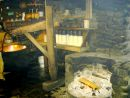

## Die Temperierung der Gebäude-Hüllflächen 15

[Temperierung Start](7temper.md) - Kapitel [1 - Referenzschreiben eines Lesers zum Temperiereffekt](7temp01.md) [2 - Seit wann gibt es Temperierung? / Die Sauerei mit der Kirchenheizung](7temp02.md) [3 - Richtig oder falsch Heizen in der Kirche - Orgeln und Heizung](7temp03.md) [4 - Strahlungsgeschichtliches](7temp04.md) [5 - Der Umschwung pro Temperierung](7temp05.md) [6 - Wie funktioniert Temperierung? / Wirkprinzip Wärmestrahlung / Trocknungseffekt / Wärmeverlust: Konvektion kontra Strahlung](7temp06.md) [7 - Sachverständigengutachten über die Mängel der Temperieranlage (Auszug) / Gesetzgeber zur Anwendung EnEV bei Strahlungsheizung - Auslegungsfragen](7temp07.md) [8 - Energieverluste? Zur Dämmung temperierter Wände / Neon-Analogon](7temp08.md) [9 - Feuchte und Temperatur an der Wand](7temp09.md) [10 - Schwedenofen, Kachelofen, Lüftungsanlage + Klimaanlage - Vorhof zur Hölle?](7temp10.md) [11 - Temperiererfolg gegen feuchte Wände und nasse Mauern / Trockenlegung](7temp11.md) [12 - Großraum, Schloß, Kirche, Saal: Übliche Fehleinschätzungen und Kaputtsanierung](7temp12.md) [13 - Temperieren im Großraum - Kirche, Saal und Halle](7temp13.md) [14 - Temperierung und Hygiene](7temp14.md) **15 - Bauteilkorrosion als Folge des Warmluftstroms - Wartungsintervalle und Heiztechnik** [16 - Temperierung mittels Rohr oder Kleinkonvektor/Sockelleiste/Heizleiste/Fußleistenheizung](7temp16.md) [17 - Projektbeispiele / Schloß Veitshöchheim](7temp17.md) [18 - Einbau von Temperieranlagen - Technische Hinweise](7temp18.md) [19 - Konfiguration und Bemessung der Temperieranlage](7temp19.md) [20 - Strahlungsheizung und Fensterkonstruktion](7temp20.md) [21 - Prof. Dr. Claus Meier: Glas und die elektromagnetische Strahlung / Die Tragödie der Strahlung in der Heiztechnik - Humane Strahlungswärme ](7temp21.md) [22 - VDI-Richtlinien, DIN-Norm und falsche Prüfberichte](7temp22.md) [23 - Energieerzeugung und Wirtschaftlichkeit - Probleme der Ökoenergieen](7temp23.md) [24 - Erhaltung und/oder Umbau bestehender Heizsysteme / EnEV-Befreiung gem. § 25, Nachtabsenkung, Glas+Strahlung, Brennwert-Technik](7temp24.md) 
[25 - Bauwerkstrocknung nach Überschwemmungs- und sonstigen Durchfeuchtungsschäden / Weitere Informationen](7temp25.md) 

## Bauteilkorrosion als Folge des Warmluftstroms - Wartungsintervalle und Heiztechnik

Natürlich erzeugen moderne Lufterhitzungssysteme nicht mehr die fantastischen Dreckluftströme der Vorgängergeneration. Aber auch die beste Filtertechnik und dezentrale Verteilung der Auslaßöffnungen können nicht verhindern, daß Bodenstaub und Kerzenruß (Kirche) dennoch nach oben und an die systematisch unterkühlten Raumhüllen und Kunstobjekte/Inventar steigen. Resultat: Die konservatorisch gefürchteten Kleinklimaschwankungen, Kondensationsdurchfeuchtung, Salzaktivierung, Verschmutzung und Oberflächenbesiedelung durch Mikroorganismen. 

Was nützt es, die bei Luftheizung bisher üblichen kurzfristigen Sanierungsintervalle der Raumschalen durch Filter und Luftstromverlangsamung um einige Jahre nach hinten zu verlagern, wenn die heiztechnische Ursache der Bestandsschädigung, also feucht-warm-verschmutzende Heizluftkonvektion über ausgekühlte Wandflächen nicht aufgegeben wird? Freilich können auch fehlbetriebene, also in der Art von Luftheizungen temporär "hochgefahrene" Sockelleistenheizungen eine unterkühlte Raumschale verschmutzen. 

Luftheiztechnik ist aufwendig und teuer. Das nützt vielen Planungsbeteiligten. Mit Denkmalpflege und Wirtschaftlichkeit hat das aber jedenfalls gar nichts zu tun. Und auch nicht mit Betriebssicherheit, da das gewünschte Ziel - angenehm temperierte Großräume auch in der Heizperiode - selbstverständlich auch mit der Hüllflächentemperierung erreicht werden kann. Für ihre Verbreitung gegen die "Lüfter" sorgt schon die bedeutenden Kostenvorteile der Hüllflächentemperierung bei der Erstinvestition. Und die damit verbundene Verlängerung der notwendingen Instandsetzungszyklen der Raumschale.

Im Klartext: Eine sollgemäß dauerbetriebene Hüllflächentemperierung (Heizleistensystemen mit einer Vorlauftemperatur am Rohr/Kleinkonvektor über 45 Grad erzeugen allerdings auch Verschmutzungsschleier an der heizluftbeaufschlagten Außenwand) verlangsamt die witterungs- und klimabedingte Bauteilkorrosion und Verdreckung der Raumschale. Sie schützt also nicht nur Objekte/Exponate im temperierten Innenraum durch Reduzierung/Dämpfung von Kleinklimaschwankungen und abgepufferte Anpassung des Innenklimas an das wechselnde Außenklima. Übliche Klimaanlagen, die mit höchstem Energie- und Regelungseinsatz eine gleichbleibende Luftfeuchte und -temperatur erzwingen wollen, führen dabei Wandflächenkondensation, Schimmel- und Keimbelastung ebenso wie Staubbelastung des Innenraums infolge ständig umgewälzter Raumluft als Nebenwirkung herbei. 

Das entfällt bei der konvektionsminimierten Temperierung aufgrund ihres entgegengesetzten Wirkungsprinzips: sie läßt Temperatur und Feuchte in kontrollierbaren und unschädlichen Grenzen "gleiten". Sie schützt obendrein das ganze Bauwerk von innen _und_ außen, da dramatische Temperatur- und Feuchtebelastungen bei temperierten Fassaden vermieden werden. Gut für die Bauherrnkasse, nicht so gut für die Baubranche.

## Thermische Bauteilaktivierung gegen Schimmelpilzbefall und Veralgung

Gegen die Schimmelpilzbefall und Veralgung unterkühlter, dauerfeuchter Bauteilbereiche wie die jede Nacht den Taupunkt viele Stunden unterschreitenden "Dämm"-Fassaden außen wurde inzwischen - ein Patent der Ewald Dörken AG - die [Beheizung mittels eingelassener elektrischer Heizmatten oder geheizter Warmwasserrohre](http://www.patent-de.com/20110203/DE102009035656A1.html) als ultimativer Nothelfer patentiert. Auch innen hilft gegen Schimmel und Aufnässung von Bauteilen wie Wände, Fußböden und Decken nicht die Heizung mittels Lufterhitzung, sondern deren Bauteiltemperierung (Thermische Bauteilaktivierung, Betonkernaktivierung) mittels Strahlungsheizung/Wärmewellenheizung/Beheizung. 

Jeder kennt den schnell fortschreitenden Verfall in leerstehenden Häusern. Grund: Kondensatfeuchte- und starke Klimabelastung. Dabei beginnt die objektstressende Kapillarkondensation in gegenüber warmer Feuchtluft kühleren Kapillarwandungen weit unter den allgemein als schädlich gehaltenen Luftfeuchtegehalten > 80%. Grund: die Problematik der Wasserstoffbrücken. Die freien und positiv geladenen Wasserstoffatome der in der Luft enthaltenen H2O-Moleküle docken ja schon bei Luftfeuchten um die 60% an die negativ geladenen Sauerstoffmoleküle der hydrophilen Kapillaroberflächen an, nur erhöhte Materialtemperatur und die dann schneller schwingenden Stoffmoleküle könnten diesen Andockvorgang verhindern.

Die Erfahrung in bauphysikalisch vergleichbaren unbeheizten Bauwerken in Freilichtmuseen bzw. nur sporadisch erhitzten Sakral- und Veranstaltungsgebäuden lehrt: Nur ausreichende Temperierung verhindert die klimabedingte Bauzerstörung innen und außen. Gerade für wertvoll ausgestattete bzw. reich mit Verkleidungen, Tapeterie, Teppichen, Möbeln, Gerät und Textil dekorierte Räume und Fassaden kann dann - ganz im Unterschied zu üblicher Heiz- und Klimatechnik - der sonst kurz- bis mittelfristig erforderliche konservatorische/restauratorische Bauunterhalt verringert und auf weite Zeiträume gestreckt werden. In vielen Museen allerdings bekommt man den eindruck, daß die Exponatbedingungen zwischen zerstörerischer Heizung und Klimanalage oder Nichtheizung geradezu darauf angelegt sind, ein Maximum an klimabedingten Zerstörungsprozessen in Gang zu setzen. Einige Bilder von Museumsdächern mit Holzschindel- bzw. Reetdeckung können das Problem schlaglichtartig erhellen - sie vermissen ihre historisch gegebene Heißdurchrauchung und kompostieren schnell vor sich hin:

. .. 
Die Durchrauchung des Dachs ließ sich nicht nur für die Baukonservierung nutzen, sondern lieferte auch Gaumenfreuden: . 
So fängt alles an: Und so gehts weiter: 

. . .

Der heiße Rauch konservierte einst im Vordachbereich, die Obergeschoßstübchen und den Dachraum . und kam aus der Tag und Nacht unter Feuer gehaltenen Ofenstelle der Erdgeschoßküche. .

Die Temperierung im Dauerbetrieb ist also ein wichtiger wirtschaftlicher Faktor der Bauwerkserhaltung, des Exponatschutzes und der Denkmalpflege. Schon mit geringem Energieeinsatz kann damit auch aus ökologischer Sicht der Ressourcenverschwendung von Baustoff, Exponat, Energie und Arbeitskraft entgegengetreten werden. Die Diskussion über die Öko-Energiebilanz mit dem Ziel, Solarenergie als Energieträger für Temperierungen einzusetzen, wird hier nicht geführt. Wirtschaftlich ist so etwas im Regelfall nie, von Bauwerken auf unerschlossenen Alpengipfeln o.ä. "Insellage" mal abgesehen.

Die wirkliche Aufklärung zum Solarkollektor und den Schwindelargumenten der Hersteller und Monteure finden Sie (noch) hier (Gerichtsverfahren im Gange, "Psychogutachten" angedroht): [solarkritik.de](http://www.solarresearch.org/)

Zur Fotovoltaik-und Ökoenergie-Kritik: [www.ib-rauch.de/Gutacht/energie.html](http://www.ib-rauch.de/Gutacht/energie.html) 

und noch ne Seite: [Solar-Nonsens](http://www.oeko-energie.de/solar-nonsens/index.php) - eine bunte Marketing-Mischung von sehr richtig und grottenfalsch 

Weiter:**[16 - Temperierung mittels Rohr oder Kleinkonvektor / Sockelleiste / Heizleiste / Fußleistenheizung](7temp16.md)**
