[🠔 Zur Übersicht: Heizen](7temper.md)  
# Hüllflächentemperierung 17 - Projekt-Beispiele + Schloß Veitshöchheim
**Diese Seite präsentiert Projektbeispiele zur Hüllflächentemperierung und Klimastabilisierung durch Bauteiltemperierung / Strahlungsheizung, inklusive Dokumentation zum Schloß Veitshöchheim. Finden Sie Anregungen für Energiesparfragen.**  
_von Konrad Fischer_

Herzlich willkommen auf dieser Seite rund um die Erfahrung mit der Hüllflächentemperierung! Hier finden Sie vielleicht weitere Anregungen und Denkanstöße für Ihre Energiesparfragen. 

Für die Frage nach offener oder geschlitzter Rohrführung ist auch nach den Erfahrungen an den von mir geplanten Temperiersystemen seit den 80er Jahren (Auszug Projektliste s.u.) klar geworden, daß die im Einklang mit gestalterischen Wünschen geschlitzten Unterputz-Systeme auch etwas mehr Energie verbrauchen können.

Beispiele: Eggenbach Lkr. Lichtenfels, [Fachwerkhaus Nr. 2/3](http://www.maier-ferienhaus.de/) (Haustechnik mit Hüllflächentemperierung 1990) 
Burgkeller im Palas der Burg Burgthann ([Burgthann (Roads to Ruins)](http://www.roadstoruins.com/burgthann.html)<>[Burgthann (Burgverein)](http://www.burgverein-burgthann.de/)), 
[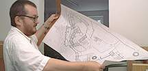](http://www.schloss-neuenburg.de/)Galerieflügel, Doppelkapelle-Vorraum und Remisenrestaurant von Schloß Neuenburg ob Freyburg/Unstrut ([Die Neuenburg in Roads to Ruins _(Foto von Ed Kane 2000: Konrad Fischer mit dem Nutzungsentwurf der Neuenburg)_](http://www.schloss-neuenburg.de/)<>Neuenburg [off. Seite](http://www.schloss-neuenburg.de/)<>[ Neuenburg (DBV)](http://www.burgenperlen.de/Perlen/Sachsen_Anhalt/neuenburg.htm)<>) 
Kirche Obristfeld, 
[Die ehem. Synagoge in Odenbach, RLP,](http://www.politische-bildung-rlp.de/256.html) - Temperierung mit konservatorischer Zielstellung 2001, die [Kilianskirche in Waldbach](http://www.via-modular.de/referenzen/index.php?id=31) (konservatorische Temperierung und Kirchenheizung mit elektrischen und warmwasserführenden Heizsystemen, 2006-07), ca. 25 Wohnungs-, Mietshaus und Einfamilienwohnhaustemperierungen für Gebäude aus unterschiedlichen Epochen bis heute in Bayern, Baden-Württemberg, Berlin, Brandenburg, Hamburg, Hessen, Niedersachsen, Nordrhein-Westfalen, Rheinland-Pfalz, Sachsen, Sachsen-Anhalt, Schleswig-Holstein und Thüringen. 
[Fürstbischöfliches Schloß Veitshöchheim](http://www.schloesser.bayern.de/deutsch/schloss/objekte/veitsho.htm) (Einbau einer im EG wasser-, im OG elektroversorgten Hüllflächentemperierung mit konservatorischer Zielstellung, Planung und Ausführung 2001-04, Jahreswärmeverbrauch für geregelte konservierende Temperierung im ersten Betriebshjahr ca. 10 kWh/cbm bzw. 50 kWh/qm im warmwasserversorgten, teils mit wandschlitzgeführten Temperierleitungen im EG - der dafür mittels den [Meierschen Ueff-Werten](7keff.md) und weiteren absenkenden Korrekturfaktoren berechnete Wärmebedarf, führte dabei zu einer wirtschaftlichen Bemessung der Heizzentrale. Daß man für HOAI-gerechtes Planungshonorar sogar bei der Planung technischer Ausrüstung HOAI-gerechte Planung bis ins allerletzte substanzschonende Detail erhalten könnte, dürfen Sie dem u.a. Abschlußbericht entnehmen.). [Luftansicht Schloß Veitshöchheim](http://wikimapia.org/13303/) - wikimapia.org, [Schloß Veitshöchheim](http://www.schloesser.bayern.de/deutsch/aktuell/aktuell/veitsh.htm) - Abschlußbericht der Schlösserverwaltung

Aus dem vorläufigen Abschlußbericht - Zusammenfassung (akt. Version 10/07):

Vortragsreader 
(aktualisiert) für: 

Technische Gebäudeausrüstung im Baudenkmal 
Tagung des Beirats für Denkmalerhaltung der Deutschen Burgenvereinigung e.V. 
Würzburg, Festung Marienberg, 31.01. - 01.02.2004 

Studientag für Konservierung und Restaurierung 
**Denkmalpflege und Denkmalnutzung** 
**Das Baudenkmal und seine Ausstattung im Spannungsfeld zwischen Konservierung und Nutzung** 
Weiterbildungszentrum der FH Erfurt, 25.06.2004 

**Raumschale und Technik im Baudenkmal** 
Jahrestagung des Facharbeitskreises Schlösser und Gärten in Deutschland 
Bayreuth, Neues Schloß, 02.-04.04.2006 ([Link zur Kurzfassung der sonstigen Vorträge](6sv.md#bt)) 

Konrad Fischer 

Die konservatorische Temperierung 

Grundlagen, Planung, Ausführung und Betrieb am Beispiel von Schloß Veitshöchheim bei Würzburg 

**Zusammenfassung** 

Die oft kurzfristigen Schwankungen der Luftfeuchte und Raumtemperatur in unbeheizten oder falsch geheizten Gebäuden belasten die Bausubstanz und das Inventar. In Museen, Schlössern oder Kirchen erhöhen größere Besuchergruppen die Luftfeuchte. Eine stetige Hüllflächentemperierung kann die kurzfristigen Klimaänderungen dämpfen und damit als konservatorische Maßnahme den Alterungsprozess der Bausubstanz sowie an den Materialoberflächen verlangsamen. Diese präventive Konservierung, bei der die optimierten Aufbewahrungsbedingungen für das Inventar und die Exponate die restauratorischen Eingriffe entweder gar nicht erst notwendig machten oder die erforderlichen Restaurierungszyklen zumindest auf möglichst große zeitliche Abstände strecken, verlängert auch die Instandhaltungsintervalle des Bauwerks. Der Beitrag erläutert die Planungsgrundlagen und Ausführungsdetails am Beispiel des museal genutzten Gartenschlosses Veitshöchheim. 

**Das Bauwerk** 

Das [Schloß Veitshöchheim](http://www.schloesser.bayern.de/deutsch/schloss/objekte/veitsho.htm) wurde 1680 bis 1682 als "Sommer- und Lusthaus" des Würzburger Fürstbischofs Peter Philipp von Dernbach nach Plänen des Werkmeisters Heinrich Zimmer erbaut. Unter Fürstbischof Carl Philipp von Greiffenclau fügte Balthasar Neumann 1753 die seitlichen Pavillonbauten an und gab dem Dach und Treppenhaus seine heutige Gestalt. 

Der etwa 55 Meter lange und im Mittel zwölf Meter breite Baukörper mit zwei Vollgeschossen hat Geschoßhöhen von ungefähr fünf Metern. Das Dachgeschoß ist nicht ausgebaut. Die Fassaden mit bis zu 70 Zentimeter starken Außenwänden bestehen aus verputztem Natursteinmauerwerk und vorwiegend Kreuzstockfenster mit Einfachverglasung. 

Fürstbischof Adam Friedrich von Seinsheim ließ 1760 den Rokokogarten mit Seen, Wasserspielen und über 200 Sandsteinskulpturen des Hofbildhauers Ferdinand Tietz anlegen. 

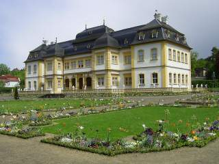 
Gartenschloß Veitshöchheim, Schloßfassade von Westen 

 
Fassade von Osten

Stuckaturen von Antonio Bossi und die um 1810 eingerichteten Räume des Großherzogs Ferdinand von Toskana mit seltenen Papiertapeten prägen die hochwertige Raumausstattung.

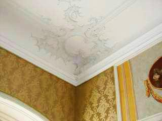 
Stuckverzierung im OG

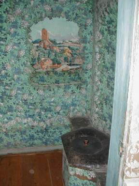 
Papiertapete im herzoglichen Abort, ... 

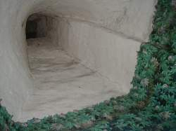 
... darüber ein Entlüftungsschacht.

Das museal genutzte Schloß ist im Winter für den Besucherverkehr geschlossen.

**Bauschäden vor der Restaurierung als Auslöser der Hüllflächentemperierung**

Die witterungs- und nutzungsbedingten Feuchte- und Temperaturschwankungen beschädigten sowohl die massive Baukonstruktion als auch die hochwertige mobile und wandfeste Ausstattung. Die Klimamessungen im ungeheizten Bauwerk vor dem Projektstart belegten im März etwa 13 Grad höhere Außentemperaturen und damit eine erhebliche Kondensationsgefahr von feuchter Warmluft als lokaler Tauwasserniederschlag an den ausgekühlten Bauteilen und dem Inventar. Die stetigen instationären Klimawechsel, bei denen die Raumluft teils wärmer und feuchter als die Raumoberflächen ist, nach der Sommerperiode dann kälter und trockener, verursachen hygrothermische Wechselbeanspruchungen der Oberflächenschichten. Langfristig enstehen so Oberflächenrisse und Malschichtablösungen. Außerdem können dadurch in den Baumaterialien eingelagerte mobile bzw. leicht lösbare Salze ausblühen und den Malgrund und die Farbschichten dabei beschädigen. Deswegen veranlaßten das staatl. Hochbauamt Würzburg und die Bayerische Schlösserverwaltung den Einbau und Betrieb einer klimastabilisierenden Hüllflächentemperierung (Bauteiltemperierung) als konservatorische Gegenmaßnahme. Sie wurde im Zusammenhang mit der ohnehin anstehenden Restaurierung der Raumschalen und einigen nutzungsbedingten Umbauten von 2001 (Planungsstart) bis 2006 (Einweihung) verwirklicht.

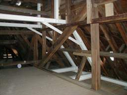 
Schon einige Jahre vor dem Maßnahmenbeginn wurden im Dachgeschoß die kondensatbedingten Vermorschungsschäden am Gebälkauflager beseitigt und eine statische Ertüchtigung aus Stahlträgersystemen eingebaut.

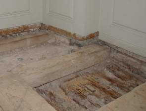 
Auch unter den Holzdielen und dem Tafelparkett im Obergeschoß vermorschte die Holzdeckenkonstruktion durch Kondensatauffeuchtung und folgenden Pilzbefall. In den kritischen Eckbereichen im Obergeschoß waren die wertvollen Papiertapeten mit Schimmel befallen - ebenfalls durch eine dauerhaft überhöhte Kondensataufnahme.

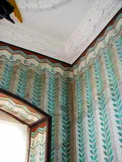 
Tapete mit [Schimmelbefall](7schim.md)

**Zur Fensterfrage** 

Bei kalten Außentemperaturen kondensierte an den [Einfachfenstern](23bausto.md) die überschüssige Raumluftfeuchte ab. Dies verminderte noch größere Durchfeuchtungsschäden in kritischen Klimasituationen. 

Die Sollkondensation an den Gläsern der "undichten" Einfachfenstern und deren ausreichende Fugendurchlässigkeit vermindern in der Heizperiode den Feuchtegehalt der Raumluft. Damit kann sie mit weniger Energie aufgeheizt werden. Wärmetechnisch bieten "normal" schließende Einfachfenster und der damit verbundene Luftaustausch vor allem bei strahlungsintensivem Heizbetrieb also keine Nachteile. 

Die Wärmestrahlung (Infrarot-Bereich: Wellenlänge > 2,7 µm) kann übrigens das Fensterglas ebenso wie das UV-Licht (< 0,3 µm) nicht durchdringen. 

Der maßgebliche Teil des Wärmetransports durch die Außenhülle ist von der Wärmestrahlung und nicht der Wärmeleitfähigkeit und dem U-Wert abhängig. 

Ein einfaches Beispiel mag das veranschaulichen: 

In einem Raum mit 20 m² und 2,50 m Höhe stehen in der Heizperiode die an der kalten Fassadenseite abkühlenden Energiemengen aus 50 m³ Heizluft mit 62,5 kg Gewicht einer IR-Wärmeabstrahlung der erwärmten Oberflächen von Innenwänden, Decke und Fußboden mit über 10 Tonnen speicherfähiger Baumasse gegenüber. Insofern ist das Verhalten der Fassadenbaustoffe gegenüber der Wärmestrahlung der entscheidende Faktor. 

Schwere Massivbauteile können der Durchstrahlung mit elektromagnetischen Wellen selbstverständlich wesentlich mehr Widerstand leisten, als leichte Materialien wie übliche "Dämmstoffe". Deswegen ist Mauerwerk, Holz oder eben Fensterglas jedem schütteren und leicht durchstrahlbaren Baustoff himmelweit überlegen. Außerdem filtert jede zusätzliche Fensterscheibe mehr kostenlose Energie aus dem Tageslicht und verringert damit den heizkostensparenden Energiegewinn des Bauwerksinneren durch eindringende Solarstrahlung. 

Fazit: Im Gegensatz zu den üblichen Annahmen sind die Einfachfenster trotz ihrer Undichtheit auch im Schloß Veitshöchheim echte Energiesparkonstruktionen. Sie wurden restauriert und im Bestand erhalten. 

Gleichwohl erhielten sie in den Museumsbereichen lichtfilternde Innenvorhänge aus konservatorischem Grund. Viele historischen Materialoberflächen sind ja lichtempfindlich: Pigmente bleichen aus, Textilien und Leder werden brüchig, organische Bindemittel korrodieren, Temperaturspannungen und wärmebedingt lokale Austrocknung beanspruchen alle Materialien. Die Lichtenergie ist im musealen Umfeld ein durchaus ernstzunehmender Schadensfaktor. Deswegen ist der Lichtschutz dem Energiesparen übergeordnet. 

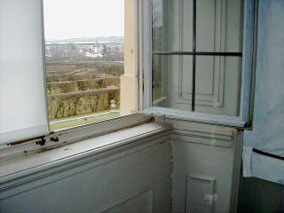 
Die originalen Kreuzstockfenster

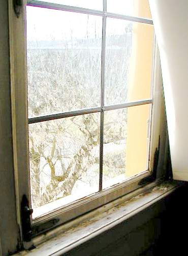 
Die kondensatgeschädigte Fensterkonstruktion

 
Durchlässigkeit von Fensterglas für Wellenlängenspektren: Licht geht durch, UV- und IR-Wärmestrahlung nicht (Grafik: Prof. Dr.-Ing. habil. Claus Meier) 

**Die konservatorische Zielstellung der Hüllflächentemperierung** 

Neben den „normal“ zu beheizenden Gebäudebereichen wie Kastellanswohnung, Büro, Kasse und Besuchertoiletten waren die musealen Schau- und Nebenbereiche lediglich nach konservatorischen Gesichtspunkten zu temperieren. Die bisher gegebene Belastung des Bestands durch Kondensataufnahme und Temperaturwechsel sollte vermindert werden. 

Damit kam eine Klimatisierung im museumsüblichen Umfang mit aufwendiger Luftbehandlung und Anlagentechnik nicht in Frage. Sie hätte zwar definierte Luftzustände erreichen können, jedoch - und das zeigen die vielen Schäden durch Heizung und Klimatisierung - die damit verbundenen extremen Temperatur- und Feuchteschwankungen im Nahbereich der Bausubstanz und des Inventars nur ungenügend behindern können. 

Deswegen wurde ein langsam gleitendes und begrenztes Nachführen der Raumluftfeuchte und -temperatur an die äußeren Witterungsverhältnisse angestrebt. Die raumseitigen Oberflächen der Bauteile und des Inventars werden dadurch weniger belastet, ihr damit einhergehender Alterungsprozeß wesentlich verlangsamt. 

Mit einer stetig betriebenen Hüllflächentemperierung läßt sich diese substanzschonende Zielstellung erreichen. In den musealen Räumen hält die speicherprogrammierbare Steuerung der Temperieranlage die Innentemperatur auf mindestens 6 K (Kelvin) über der Außenlufttemperatur. 

Nach oben wird die Raumtemperatur auf maximal 20 °C begrenzt, nach unten auf mindestens 6 °C. Schon dieser "Sparbetrieb" mit Einschaltung ab 5 Kelvin Differenz der Raumtemperatur zur Außentemperatur und Abschaltung bei 7 Kelvin Differenz kann die zerstörerischen Feuchte- und Temperaturwechsel im wertvollen Bau- und Ausstattungsbestand entscheidend verringern. Die Raumklimasituation des Bauwerks folgt damit im Jahresablauf dem Außenklima gleitend und stark gedämpft. Ohne die vorher festzustellenden Extrema und bei wesentlich höherer Klimakonstanz im Rahmen der konservatorisch zuträglichen Grenzwerte sind die Bedingungen für alle empfindlichen Exponate, Ausstattungsstücke und der Bausubstanz selbst wesentlich verbessert. Und das alles ohne die konservatorische Probleme einer substanzzerstörend und teuer einzubauenden sowie zu betreibenden Klimaanlage wie etwa Staubumwälzung, Ionisation von Staubteilchen, Staubfahnen an Bauteilen, Bildung von Wasserdampfclustern, Kapillarkondensation an kalten Bauteilen, Kurzzeitregelschwankungen und weitere. 

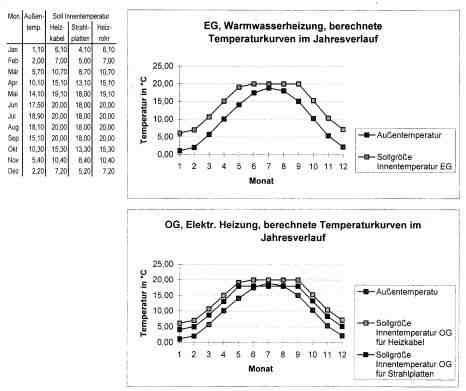 
Regelkurven für die nach unten und oben temperaturbegrenzte Hüllflächentemperierung im Erd- und Obergeschoß

Das vielfach geforderte "Ideal-Museumsklima" mit relativer Luftfeuchte von 45-55%, eine willkürliche Festlegung ohne ausreichende Begründung, ist für die Steuerung und Auslegung einer Hüllflächentemperierung nicht maßgeblich. Entscheidend waren die Oberflächentemperatur und die davon abhängige Feuchteaufnahme des Objektmaterials. Schon ein geringer Luftfeuchtegehalt verursacht bei entsprechender Abkühlung an der Materialoberfläche bedeutende und materialschädigende Kondensataufnahme. Das kann gerade bei "klassisch" klimatisierten Museen immer wieder beobachtet werden. 

Diesem Zusammenhang an der Materialoberfläche selbst - dem eigentlichen Schutzobjekt im konservatorischen Sinn! - widmet die Hüllflächentemperierung im Unterschied zu üblichen Strategien der luftgestützten "Raumklimatisierung" höchsten Vorrang: 

Die Wärmestrahlung als elektromagnetische Welle im Infrarot-Bereich durchdringt in Lichtgeschwindigkeit die Raumluft, ohne sie zu erwärmen. Nur die bestrahlten "Körper" werden warm. Analog sind Lichtstrahlen in der Luft unsichtbar. Sie "erleuchten“ reflexive und erwärmen absorptionsfähige Materialoberflächen. Damit ist ein wärmebestrahlter Körper systematisch wärmer, als die von ihm erst indirekt erwärmten Luftmoleküle im Kontaktbereich. Folglich bleibt die Raumluft in einem strahlungserwärmten Raum systematisch kühler als dessen Raumhülle und Inventar. Damit sinkt auch der Luftdruckunterschied zur Außenluft, ebenso der Lüftungswärmeverlust und der davon abhängige Heizenergieverbrauch. 

Klimaanlagen und sonstige Luftheizsysteme erreichen - verstärkt mit der üblichen Nachtabsenkung des Heizbetriebs - genau das Gegenteil: Bei ihnen ist die Luft immer wärmer, als die erst über Warmluftkontakt erwärmte Raumhülle und das Inventar. Die Feuchte aus der Luft kann aber nur an kälteren, nicht an wärmeren Körpern kondensieren. Insofern sind alle gebläseabhängigen Luftheizsysteme und die ebenfalls über erhitzte Luft arbeitenden Konvektionsheizungen (Konvektorheizung, Fußbodenleisten mit Kleinkonvektoren, Unterflur-Radiatoren, ...) nicht nur dreckige Staubschleudern, sondern auch schimmelpilzfördernde Befeuchter mit sinnlos verschwenderischem Energieverbrauch. 

Die gleichmäßig wärmestrahlende Hüllflächentemperierung bietet für Museen, historisch wertvoll ausgestattete Räume sowie feuchteempfindliche Baukonstruktionen und Inventare deswegen unschlagbare Vorteile. Doch auch wirtschaftlich gesehen sind Temperieranlagen wegen ihres geringeren Technikaufwands und der sparsamen Betriebsweise wesentlich günstiger als "normale" Heizungen und Klimaanlagen. Selbstverständlich gelten diese Vorteile bei der Heiztechnik, den Anlagen- und den Betriebskosten auch für alle "normalen" Gewerbe- und Wohngebäude. 

**Die Energiesparfrage und die Bemessung der Temperieranlage** 

Oft wird versucht, mit U-Wert-optimierten Dämmstoffen den Energieverbrauch auch an massiven Altbauten zu senken. Meistens sind derartige Energiesparmaßnahmen unter dem Titel „energieeffiziente Sanierung“ mit einer tatsächlich energiesparenden Heizungsmodernisierung, vielleicht auch einer hermetischen Gebäudeabdichtung vergesellschaftet. Deswegen fällt in der Praxis kaum auf, daß der Einbau von Dämmstoffen selbst gar keine Energieersparnis mit sich bringt. 

Auch der üblicherweise intermittierende Heizbetrieb mit Nachtabsenkung kann leider keinerlei Energie sparen: die nächtlich verlorene Wärme muß ja jeden Morgen wieder höchst aufwendig und mit hohem Konvektionsanteil und Lüftungswärmeverlust nachgeliefert werden. 

Dabei sind Abkühl- und Aufheizvorgänge im Quadrat ansteigende Potenzfunktionen - im Gegensatz zum stetigen Heizbetrieb. Obwohl zumindest jeder Autofahrer weiß, wie im Gegensatz zu einer gleichmäßigen Fahrgeschwindigkeit die hektische Stop-and-Go-Fahrweise Sprit frißt und Bremsbeläge, Kupplung usw. verschleißt, ist das beim Heizungsbetrieb offenbar vollständig unbekannt. 

Die nachfolgenden Beispiele belegen unsere alternative Herangehensweise bei der technischen Bemessung der Temperieranlage (Anlagenauslegung) durch in der Praxis gewonnene Forschungsergebnisse: 

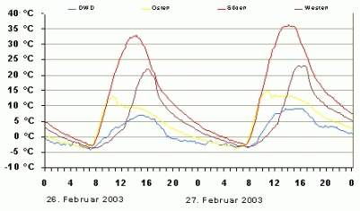 
Eine Freilandmessung der Abt. Bauforschung der Bundesforschungsanstalt für Landwirtschaft FAL in Braunschweig erwies, daß Massivbauteile (hier eine nur 11,5 cm dicke Vorsatzschale aus Ziegel) wesentlich höhere Temperaturen erreichen, als es die Normwärmebedarfsberechnung mit der Lufttemperatur (blaue Kurve) vorsieht. 

Dickere Massivwände können diese Solarenergie einspeichern, im Unterschied zu speicherlosen Wärmedämmsystemen in die Nacht hinüber retten und damit den Wärmebedarf der Raumheizung absenken. Die Normberechnung berücksichtigt das nicht. 

 
Daß die Dämmeigenschaften von Baustoffen den genormten U-Werten vollständig widersprechen, zeigt unser "Lichtenfelser Experiment". Dabei werden 4 cm starke Baustoffplatten 10 Minuten mit Rotlicht bestrahlt. 

Gemessen werden die Temperaturerhöhungen an der strahlungsabgewandten Seite nach zehn Minuten. Geradezu abenteuerlich "schlechte" U-Werte liefern folglich die besten "Dämm"-Werte. Die überraschend guten Werte der relativ leichten Holzwerkstoffe sind auf die abkühlende und energieabführende Wirkung der verdunstenden Materialfeuchte zurückzuführen. 

 
Schon 1983 hat das Fraunhofer Institut Holzkirchen bei [Vergleichsmessungen unterschiedlicher Wandkonstruktionen](7fehrtab.md) herausgefunden (vgl. Grafik und Linkinfo), daß der geringste Energieverbrauch "schlechte" k- bzw. U-Werte, und 1985 Außendämmung geradezu voraussetzt.

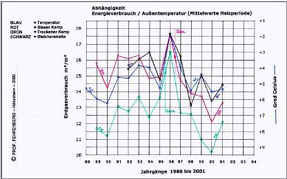 
Gedämmte Bauten verbrauchen keineswegs weniger Wärmeenergie. Das belegen die Vergleichsuntersuchungen von Prof. Fehrenberg, FH Hildesheim, an gedämmten und ungedämmten Großbauten in Hannover. Die Grafik belegt, daß der Energieverbrauch nur von der mittleren Wintertemperatur (dunkelblaue Kurve, nach oben abnehmende Temperaturen) beeinflußt wird, nicht durch Fassadendämmung mit "Wärmedämmverbundsystem" (Strich "San.").

Nicht nur bei der Betriebsweise, auch bei der rechnerischen Bemessung der Temperieranlage weicht unsere Vorgehensweise in wesentlichen Punkten vom Normverfahren ab. Einmal erfolgte unsere Wärmebedarfsberechnung nach der lokalen Jahrestemperaturkurve (im Unterschied zu den für ganz Deutschland ohne Berücksichtigung klimatischer Unterschiede "gültigen" Gradtagszahlen der DIN 4108). Zum anderen setzten wir für die Wärmedurchgangskoeffizienten nicht die genormten U-Werte an. Sie bevorzugen im Gegensatz zu den energetischen Realitäten – siehe obige Beispiele - die speicherlosen und deswegen gar nicht dämmfähigen Leichtbaustoffe. Für das tatsächliche Verhalten massiver Bauwerke im energetischen Sinn liefern solche U-Werte keine Anhaltspunkte. 

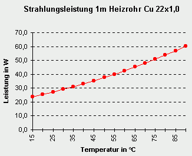. 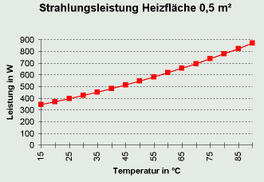 
Im Widerspruch zu den Ansätzen der DIN 4701 Teil 3 sowie DIN EN 442 liefert ein Strahlkörper bei 20 °C nicht eine Leistung von 0 Watt (mangels Übertemperatur gegenüber einer gleichwarmen Raumhülle), sondern viel höhere Leistungswerte durch Wärmestrahlung. Die Effizienz einer mit Strahlungskörpern betriebenen Hüllflächentemperierung läßt sich mit Normvorgaben folglich nicht erfassen.

Auch in früheren Temperierprojekten hatte sich das Abweichen von den Industrienormen schon bewährt. Wir entschieden uns deshalb nicht für Berechnung mit Norm-U-Werten, sondern für die U-effektiv-Rechenwerte (Ueff) nach Prof. Dr.-Ing. habil. Claus Meier. Im Ergebnis berücksichtigten wir damit die energetisch wirksame Solarabsorption der in Veitshöchheim im Jahresverlauf anzutreffenden mittleren Solarstrahlung und die Wärmespeicherfähigkeit des massiv gebauten Bestands. Außerdem setzten wir einen temperierbedingt reduzierten Lüftungswärmeverlust an. 

Die Ausgangswerte der Wärmedurchgangskoeffizienten für die historischen Konstruktionsaufbauten entnahmen wir der Technischen Norm Gütevorschriften und Lieferbedingungen TGL 35424/02, da die neubauorientierte DIN 4108 dafür keine Werte liefert. Die alternative Berechnung verbessert den U-Wert einer Wand auf der Nordseite von 1,14 auf einen Ueff-Wert von 0,54, auf Ost- und Westseite von 1,14 auf 0,20 und auf der Südseite von 1,14 auf - (minus!) 0,12 W/m²K. Dank dieser „Strahlungsphysik“ - im bewußten Widerspruch zur industrieseitig übermäßig gesteuerten „Bauphysik“ – konnten wir die Wärmeerzeugung und –verteilung der Temperieranlage wesentlich kleiner und kostengünstiger auslegen.

Dabei reizten wir die sich aus der Strahlungsphysik nach Kirchhoff, Boltzmann und Planck sowie die aus der Praxis abzuleitenden Reduzierungsmöglichkeiten nicht mutwillig aus, um noch ausreichend Sicherheitsreserven zu behalten. Bei dem Ansatz der U-Werte für die Einfachfenster hielten wir uns noch an die DIN-U-Werte, deren erhöhter Solareintrag wurde nicht angesetzt. Auch beim Ansatz des Lüftungswärmebedarfs reduzierten wir nur etwas in Richtung Realität. Diese Sicherheitsfaktoren ließen es dann in einigen Räumen auch zu, die sich rechnerisch ergebenden geringen Unterschreitungen des Wärmeangebots hinzunehmen. Auf kostenintensive und gestalterisch teils störende Heizflächenergänzung konnte so verzichtet werden.

**Die Wärmeerzeugung und -verteilung**

Der gegebene Wärmebedarf konnte durch ein kleines Blockheizkraftwerk (12,5 kW) mit Pufferspeicher im Gewölbekeller gedeckt werden. Spitzenlasten versorgt zusätzlich der schon im Bestand für die Kastellanswohnung vorhandene Gas-Brennwertkessel (24 kW).

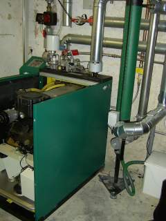 
Das Blockheizkraftwerk im Kellergewölbe erzeugt den Strom für die Elektrotemperierung im Winterhalbjahr und den Museumsbedarf im Sommer sowie das Warmwasser für die Temperierung im Erdgeschoß.

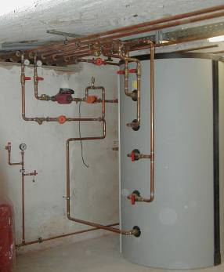 
Pufferspeicher des Blockheizkraftwerks im Kellergewölbe

Die Warmwassererzeugung versorgt die in untergeordneten Räumen offen, im Besucherbereich und höherwertig gestalteten Räumen eingeputzt, im Kassenbereich im Fußboden verlegte Sockelrohr-Kreisläufe im EG sowie die Deckenkreisläufe und die Kastellanswohnung. Für Räume mit erhöhten Temperaturanforderungen (Büro, Kasse, Toilettenanlagen) sind zusätzliche Flachheizkörper Typ 10 als Strahlplatten an den Temperierleitungen angedockt. Die Kastellanswohnung behielt ihre schon vorhandenen Konvektoren. 

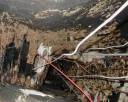 
Die Versorgungsleitungen durch die Geschosse konnten durch vorhandene Kamine und Schächte "gefädelt" werden.

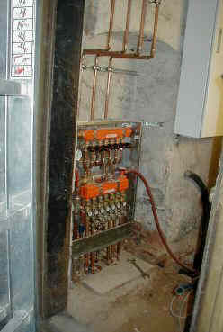 
Bestandsschonende Anordnung der Warmwasser-Geschoßverteilung in einer untergeordneten Raumnische

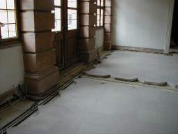 
Im Eingangsbereich des Erdgeschoßes mußte der Boden aufgenommen werden. Dies ermöglichte die verdeckte Verlegung der Temperierleitungen im Sinne einer Fußbdenheizung.

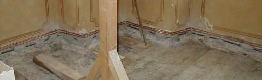 
In hochwertigen Räumen bestand die Schlösserverwaltung auf Unterputzverlegung, die damit zwangsläufig gegebenen Baueingriffe, Kostensteigerungen und Wirkungsverluste bei der Abstrahlleistung wurden aus gestalterischen Gründen hingenommen.

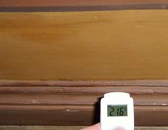 
Die Abstrahlleistung des verputzten Sockelkreislaufes kann mit einem IR-Thermometer gemessen werden.

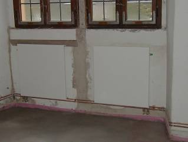 
Die offen verlegte Sockeltemperierung im Bau, für erhöhten Wärmebedarf ergänzt mit Strahlplatten ...

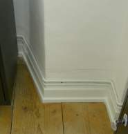 
... und nach Maßnahmenabschluß

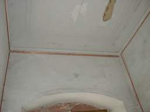 
Die Deckenkreisläufe im Bau ...

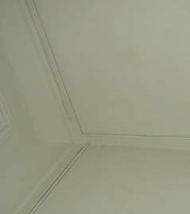 
... und nach Fertigstellung

Die Außenflächen der Prunkräume im OG werden zur Sicherheit gegen Wasserhavarie nur elektrisch mit hinter der Fußbodenleiste und auf dem Deckenstuckgesims schonend verlegten Heizkabeln geringer Leistungsabgabe (20 W/m) erwärmt.

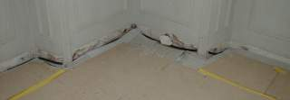 
Die Kabeltrasse am Fußboden ...

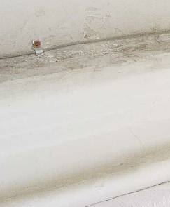 
... und das kaum sichtbare Heizkabel auf dem Stuckgesims 

Dazu kommen im besucherfreien Winter mobile Marmorplattenstrahler verschiedener Größe mit einer bedarfsgesteuerten Leistungsabgabe von 400 - 1500 W. Sie werden in Raummitte angeordnet und bestrahlen von dort die Raumschale. Es gibt sie in verschiedenen Bauarten (rückseitig gefräste und eingemörtelte Heizkabelführung, aufgeklebte Heizplatinen, trocken montierte Heizplatten und Heizmatten, Karbonfaserbeschichtung, Heizgläser mit leitender Metalloxidbeschichtung, ...) unterschiedlicher Qualität, Wartungsfreundlichkeit und Dauerstabilität. Das mobile Fahrgestell in unterschiedlichen Ausführungen und Berücksichtigung der optimalen Lastverteilung auf den empfindlichen Parkettböden wurde von einem Metallbaubetrieb nach unserer Planzeichnung extra in Sonderbauweise angefertigt und gehörte damals nicht zum Lieferprogramm der Marmorplattenhersteller. Da die Marmorplatten nur im besucherfreien Zeitraum im Betrieb sind, haben wir dabei auf kostentreibenden Design-Schnickschnack bewußt verzichtet.

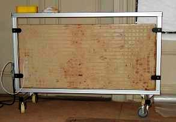 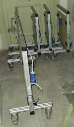 
Die Elektrostrahlplatten im Ersteinsatz als Baustellenheizung und im Sommerhalbjahr im Depot.

Die Nutzung der Elektroenergie des Blockheizkraftwerkes erfolgt im Bauwerk auch für die Elektrotemperierung, temporäre Überschüsse werden gem. Kraft-Wärme-Kopplungs-Gesetz (KWK-Gesetz) ins Netz eingespeist. 

Die Steuerung der Temperieranlage 

Die Steuerung der Heiztechnik und das Monitoring der Raumklimawerte wurde verhältnismäßig aufwendig vorgesehen, da der Pilotcharakter des Projekts dies bauherrnseits erforderte. Zur Kontrolle des Energieverbrauchs der Heizungskomponenten dienen Wärmemengen- und Stromzähler, die den Verbrauch jedes Kreislaufs einzeln auswerten. 

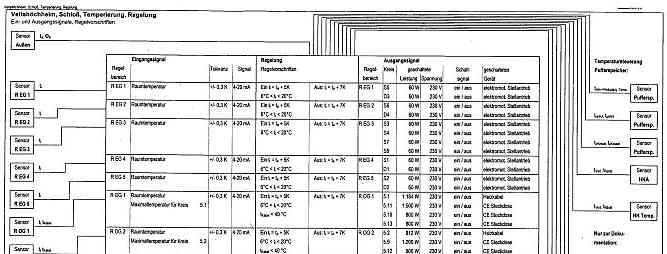

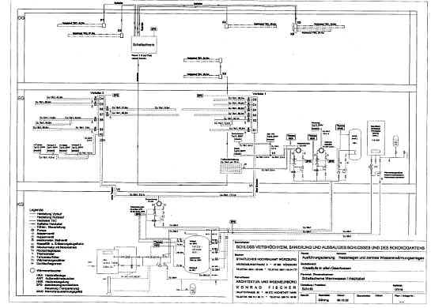 
Auszüge aus dem System- und Regelschema der Temperieranlage

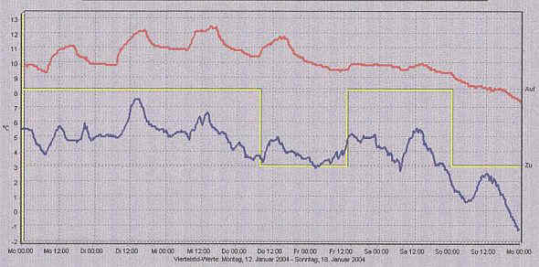 
Außentemperatur und Innentemperatur eines Bereichs vom 12. bis 18. Januar 2004. Die Regelung funktioniert zeitnah und dämpft die Temperaturspitzen. Das Einspeichern der Wärmestrahlung im Massivbau verhindert auch das Bauteilkondensat bei überraschender Warmluftzufuhr von Außen oder nutzungsbedingte Feuchteerhöhung z.B. bei Besichtigung durch regennasse Besuchergruppen oder der Raumpflege mit abtrocknendem Wischwasser. Der thermostabile Massespeicher des Baukörpers kompensiert damit zusammen mit dem Temperiersystem die externen und nutzungsbedingten Klimarisiken für die Bausubstanz und das Inventar. Die Innentemperatur entspricht dem Regelungsziel. (Rot - Temperierungsgesteuerte Raumtemperatur; Blau: Außenlufttemperatur)

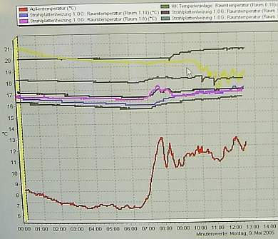

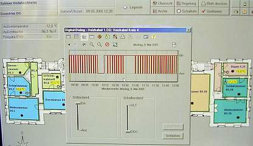 
Der Kastellan kontrolliert das Gesamtsystem vom Arbeitsplatz. Die Bildschirmkurven zeigen Außentemperatur und Innentemperaturen der verschiedenen Bereiche sowie die Taktung der Elektrotemperierung.

Der Energieverbrauch 

Der durchschnittliche Jahres-Heizenergieverbrauch aller temperierten Flächen nach drei Betriebsjahren liegt bei 44,5 kW/qm und 9,1 kW/cbm (Heizöläqivalente: 4,45 Liter/qm und 0,91 Liter/cbm. Die lage- und bauartbedingt unterschiedlich verwertbare Solareinstrahlung, der Anteil an Unterputzrohrleitungen und die Einbeziehung der etwas wärmeren Besuchertoiletten führen in den Geschossen zu etwas unterschiedlichen Verbrauchsmengen. 

Jahresverbrauch:

EG kWh/a Warmwasser OG kWh/a Elektrisch EG+OG kWh/a 
Verbrauch 04 30.796 17.035 47.831 
Verbrauch 05 30.916 20.645 51.561 
Verbrauch 06 28.455 18.719 47.174 

Das tatsächliche Temperaturniveau lag ausweislich des Temperaturmonitorings selbst bei niedrigsten Außentemperaturen bei ca. 7 bis 10 °C. Dies belegt das ideale Zusammenspiel von Massivbaukonstruktion und Temperiertechnik. Der zusätzliche Gas-Brennwertkessel für Lastspitzen mußte zum Verbrauch nur knapp 4 Prozent beisteuern. 

Damit zeigt das Beispiel Veitshöchheim, daß die Beheizung im Sinne der Hüllflächentemperierung durchaus auch zu einer Energieeinsparung in Burgen, Schlössern und anderen historischen Großbauten genutzt werden kann. In vielen Baudenkmälern sind ja die üblichen - technisch nachteiligen und wirtschaftlich zweifelhaften - Energiesparmaßnahmen wie der Einbau von Wärmedämmung an der Fassade oder Innenwand sowie der Austausch der historischen Fenster gegen Isolierfenster schon aus denkmalpflegerischen Gründen ausgeschlossen. Damit bleiben energiesparende Maßnahmen auf das Heizungssystem beschränkt - und können dort auch besonders erfolgreich sein. 

**Der Planungsaufwand** 

Im hochwertigen Baubestand ist das rechtzeitige Erkennen der Einbau- und Trassenkonflikte sowie eine darauf aufbauende Detailplanung und Leistungsbeschreibung besonders wichtig. Dazu braucht es neben einer zutreffenden Bestandsaufnahme entsprechende Sorgfalt bei der Planung. Nicht immer wird hier abgeliefert, was die bestandsgerechten Regelungen und Extras der Leistungen gemäß HOAI (Honorarordnung für Architekten und Ingenieure) vorsehen. Wobei die nicht unübliche Unterhonorierung dann Mißerfolge auf dem Schlachtfeld Altbausanierung geradezu vorprogrammiert. 

Unsere Erfahrung in der Baudenkmalpflege und ein fairer Planungsvertrag haben die ingenieurtechnischen Anforderungen auch bei diesem Projekt wesentlich "zum Guten" beeinflußt. Nur ein "verschärfter" Aufwand kann ja ungewollte Substanzverluste, Kostenexplosionen und Terminkatastrophen vermeiden helfen. 

1 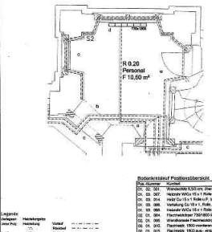 
2 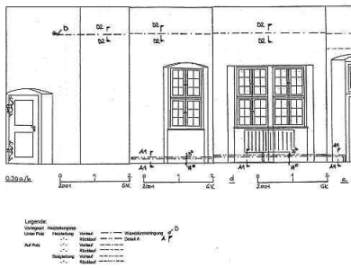 
3 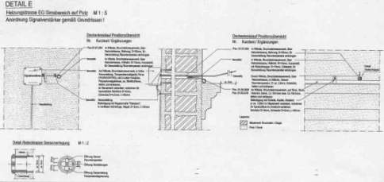 
4 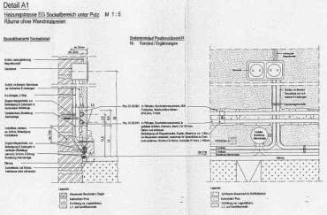 
Auszüge aus den Ausführungsplänen - von oben: 1. Raumgrundriß, 2. Wandabwicklung mit Leitungstrassen, 3. Detail Heizkabelverlegung, 4. Leitungsverlegung Elektro und Warmwasser

**Exkurs: Die Fassadenschäden**

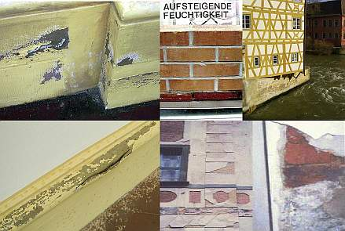 
Die außen am Schloßsockel auftretenden Schäden (Bilder links oben und unten) sind selbstverständlich kein Resultat einer "[Aufsteigenden Feuchte](2aufstfe.md)". Der unendliche Kapillarwiderstand zwischen dem Feinporensystem des Mauersteins und dem Grobporensystem des Mauermörtels verhindert den Kapillartransport. 

Auch der langzeitgewässerte Mauerkörper in einer Wanne (Mitte oben) zeigt das in hinreichender Deutlichkeit. Am Bamberger historischen Rathaus (Rechts oben) liegt der Feuchtehorizont deswegen nur im Bereich des anströmenden Flußwassers. 

Viel eher bewirken bauphysikalisch untaugliche [Silikatanstriche](22bausto.md) und [Festigungsmittel](29bau04.md) das Abspringen der überfestigten und kapillardicht versiegelten Oberflächenkrusten, die am Kloster Waldsassen (Mitte unten) alle originalen Barockputze zerstörten. 

Auch sogenannte [Sanierputze](2sanipuz.md) (rechts unten) bewirken keine Entfeuchtung der mit hygroskopischen Salzen befrachteten Sockelbereiche, sondern blockieren die Kapillartrocknung und platzen wegen überhöhter Feuchterückhaltung und Treibmineralbildung zwischen zementärem Bindemittel und Sulfatfrachten im Untergrund schollenartig ab. 

Die hin und wieder geäußerte Hoffnung, daß eine Hüllflächentemperierung neben der Kondensatvermeidung auch "[aufsteigende Feuchte](2aufstfe.md)" bekämpfen könne, ist folglich ebenfalls eine bauphysikalische Utopie, genauso wie durch die weitverbreiteten "Trockenlegungsmethoden" durch "Horizontalisolierung" mittels Mauersäge, eingerammten Edelstahlblechen und Bohrlochinjektage.

**Fazit** 

Insgesamt belegt die Hüllflächentemperierung im Schloß Veitshöchheim die positive Wirkung der Wärmestrahlungs-Temperiertechnik im speicherfähigen Massivbau aus konservatorischer und energetischer Sicht. Bei im Vergleich zu High-Tech-Klimaanlagen mit allen Luftbehandlungs-Raffinessements doch wesentlich geringeren Investitions- und Betriebskosten sowie trotz einiger Unterputz- und Unterbodentrassierungen deutlich erhöhten Substanzschonung. 

Weitere Einsparungsmöglichkeiten liegen in dem pilotcharakterbedingten erhöhten Aufwand für die Heizanlage und Steuerung sowie einem Verzicht auf verdeckte Leitungsführung, der wohl auch die Betriebskosten noch weiter vermindern könnte. Die Baukosten (Stand 2005): Heizanlage Warmwasser mit Blockheizkraftwerk: 70.000 EUR, Elektrotemperierung: 35.000 EUR, Steuerung: 50.000 EUR. 

**Dank** 

Ich danke der Bayerischen Schlösserverwaltung und dem Staatlichen Hochbauamt Würzburg für das erwiesene Vertrauen in unsere von (fast) allen Normen abweichende Planung und die faire Vertragsgestaltung, sowie meinem Mitarbeiter Dipl.-Ing. Peter Göhring für sein Engagement bei der Entwicklung und Durchführung substanzschonender Haustechnik. 

Hochstadt am Main, 2.8.2006 / akt. 17.04.2008

---

[Aus dem Restaurierungsbericht ](http://www.schloesser.bayern.de/deutsch/aktuell/aktuell/veitsh.htm)der Bayer. Schlösserverwaltung, BD Peter Seibert:

"... Das Schloss war bisher nicht beheizt. Dadurch trat in den Wintermonaten im Bereich der Fenster, Fensterlaibungen und Außenwände an den Innenseiten Kondensationsfeuchte auf, die zu Schäden an den Fensterbrüstungen und den Papiertapeten führte. Durch eine ausgeklügelte Temperierung im Winterhalbjahr wird das nun zuverlässig verhindert. Unter dem nicht mehr originalen Natursteinboden des Vestibüls wurde eine Fußbodenheizung verlegt. In den übrigen Räumen des Erdgeschosses wurden im Sockelbereich und Gesimsbereich unter Putz verlegte Warmwasser-Heizleitungen installiert. Im Obergeschoss werden die Außenwandflächen mittels elektrischer Heizdrähte auf den Gesimsen und durch mobile Marmorplatten-Elektroheizkörper erwärmt.

Elektrischer Strom und Heizwärme werden durch ein kleines gasbetriebenes Blockheizkraftwerk im Keller erzeugt. Mittels Kraft-Wärme Kopplung wird hierbei ein sehr hoher Wirkungsgrad in der Energieausnutzung von 85 Prozent erreicht! ..." 

U.a. auch dazu eine [Forumsdiskussion im Haustechnikdialog](http://www.haustechnikdialog.de/forum.asp?thema=9442)

Paßt auch dazu: PDF-Fachartikel: "_[Analysing indoor Climate in Building Heritage in Slovenia](http://www.arcchip.cz/w07/w07_sijanec_zavrl.pdf)_ " von Marjana Šijanec Zavrl, ZRMK, Technological Building and Civil Enginering Institute, Ljubljana, Slovenia. Es wird berichtet, wie andernorts die gigantischen Kondensationseffekte an historischen Schloß- und Kirchen-Innenwänden als Folge von Sommerluft und Konzertnutzung meßtechnisch erfaßt und belegt werden. Ebenso gibt es meßtechnische Nachweise zum konservatorischen Effekt (ohne Energieverbrauchsbetrachtung - warum wohl?) von danach installierter Wandtemperierung, wenn auch leider wieder mal unter Putz und Inkaufnahme der Substanz- und Wirkungsverluste. Ein durchaus lesenswerter Fachartikel, for all, which yet a little bit Schoolenglish understanden can ;-)

Scheune und Pferdestall im [Hennebergischen Museum Kloster Veßra](http://www.museumklostervessra.de), Temperierung mit konservatorischer Zielstellung, 
Gustav-Adolf-Museum im [Geleitshaus Weißenfels](http://www.weissenfels.de/wsf_museum/bas_geleitshaus.html) Temperierung Museum, Gaststätte, Wohnung, Seminarbereich, 
[Zeyern, Anwesen Kaiser](http://www.zeyern.de/Baudenkmal/haeuserfahrt.html), ein verschiefertes Wohnhaus in Blockbau- und Fachwerkkonstruktion, Temperierung für Wohnzwecke, u.a. Neubauten)

Hier folgen einige typische Schadensbilder in wertvollen Baudenkmälern, die leider (noch) nicht temperiert werden. Eine durchaus bedenkenswerte Materialsammlung aus meinen Beratungsprojekten: 

1. Ein Rokoko-Gartenschloß / Lustschloß im Rheinland 

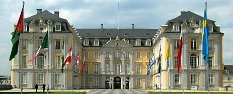 
Das Bauwerk 

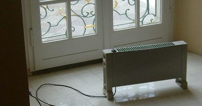 
Die Prunkräume und Treppenhäuser werden im Winterhalbjahr mit mobilen lufterhitzenden elektrischen Schacht-Konvektoren/Konvektor-Heizkörpern beheizt 

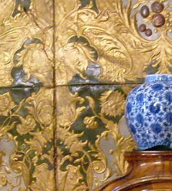 
Der Prunkraum mit vergoldeter geprägter Ledertapete, Intarsienmöbeln und chinoiser Ausstattung wird durch seine Lage nahe des Haupt-Besuchereingangs von besonders viel einströmender Außenluft durchspült / beaufschlagt. Das bedeutet im Sommerhalbjahr mit hoher Luftfeuchte besonders viel Kondensatbelastung und im Winter mit extrem trockener Luft eine verstärkte Austrocknung der Raumausstattung. 

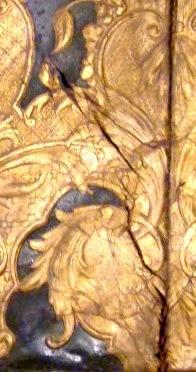 
Folge: Die Ledertapete wird brüchig und zeigt Risse, die Nähte reißen auf, das Leder wirft sich und wird wellig. 

 
Ein paar Räume weiter: Die Wandbekleidungen aus bemalten Holztafeln (gefaßte Holz-Vertäfelung / Lambris / Lamberien) reißen auf und bekommen klaffende Fugen. Die Malschichten lösen sich vom Untergrund / Kreidegrund und stehen vorwiegend über den besonders beanspruchten Leimfugen hohl. 

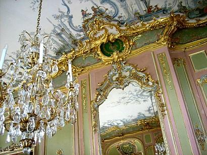 
Ein Spiegelsaal mit Kristall-Leuchtern / -Lüstern, vergoldetem Schnitzwerk, zartem Stuck und chinoiser Deckenbemalung 

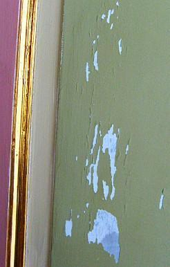. 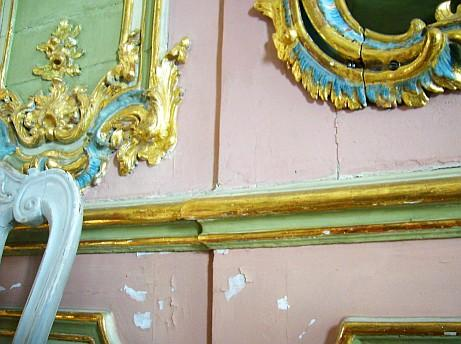. 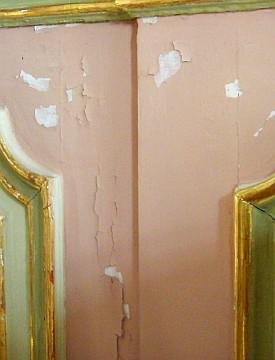 
Abplatzende Fassungen / Malschicht-Schäden / Ablösungen auf der bemalten Boiserie / Holzvertäfelung / gefaßten Lambris 

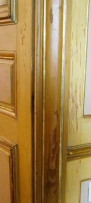 
Absplitternde historische Fassungen von der Türbekleidung 

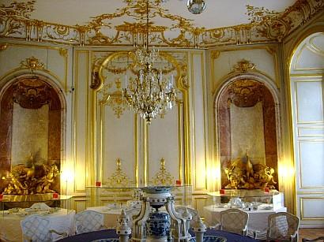 
Das prunkvolle Eßzimmer mit vergoldetem Schnitzwerk / Schnitzereien und Deckenstuckaturen / Decken-Stuck und Porzellangeschirr / Porzellan-Tafelaufsatz 

 
Die lufthinterspülte gefaßte / bemalte und ölvergoldete Wandvertäfelung ist gerissen und verformt. 

.  
Teile der vergoldeten Wandvertäfelung reißen auf. 

 
Große Teile der mit Raumluftkondensat besonders beanspruchten Deckenbalkenauflager sind vermorscht und wurden nach Entfernng der nicht mehr tragfähigen Teile mit Hilfskonstruktionen / Stahl-/Holzbeilaschungen abgefangen / instandgesetzt.

Angedacht / In Planung: Verbesserung der raumklimatischen Verhältnisse und Dämpfung / Verringerung der feuchte- und temperaturbedingten Belastungen von Bauteilen, wandfester Ausstattung und mobiler Dekoration durch Installation einer gestalterisch zurückhaltenden Hüllflächentemperierung sowie weiterer betriebstechnischer Verbesserungen. Als erster Schritt soll eine Testphase in besonders betroffenen Räumen durchgeführt werden, deren Auswertung die Grundlagen für die objektgerechte weitere Anlagenauslegung liefert. 

2. Eine im Kern mittelalterliche Dorfkirche in Oberbayern 

 
Das Bauwerk - eine Chorturmkirche. Am Besichtigungstag herrschten außen bis zu 32 °C Lufttemperatur und innen 17 bis 20 °C. Ideale Bedingung für eine gründliche Auffeuchtung des Bauwerksinneren dank des Luftzugs zwischen dem tagsüber geöffneten Turmeingang und dem am anderen Ende der Kirche gelegenen Eingang ins Kirchenschiff. 

 
Kondensatauffeuchtung / Malschichtablösung am Sockel im Altarraum / Chorraum 

 
An der Schnitzfigur des Hauptaltars im Chorraum: Umfangreiche Abplatzungen der Öl-Vergoldung / Malschichten auf Kreidegrund 

 
Algenbildung / Grünalgen / Veralgung am Sockel neben dem Seitenaltar 

 
Algenbildung / Grünalgen / Veralgung an Sockelzone - Detail. Ein umfangreiches Gutachten eines Bautestinstitutes ergibt nahezu keine Schimmelbelastung, geht aber auf die umfangreiche Algenbildung mit keinem (!) Wort ein. 

 
Die Messung mit dem elektrischen Widerstandsmeßgerät ergibt vollen Ausschlag - die begleitende Materialfeuchtemessung mit der Dörrmethode ergibt Werte nahe der Material-Sättigung. Schon wunderlich, was reines Kondensat zu leisten imstande ist ... 

 
Brutaler Grünalgenbefall auch am Hintereingang im Kirchenschiff. Hier kommen naturgemäß besonders feuchtebeladene Luftströme an, die an der im Eingangsbereich verstärkt ausgekühlten Wandfläche bevorzugt abkondensieren. System: Wandoberfläche patschnaß durch Kondensat-Auffeuchtung. Dabei speichert das massive Bauwerk mangels Wintertemperierung besonders lange die Kälte und ist deshalb bis weit in den Sommer besonders anfällig für Kondensateinwanderung aus einströmender warmfeuchter Außenluft. 

 
Barocke Schnitzfigur - Madonna / Maria mit Jesukind mit umfangreich aufgerissenen, losen und abgehobener (Backe links) Malschichten, Ölvergoldung, und Lüsterfassung / Lüstrierung auf Kreidegrund. 

 
Aufgefeuchteter Figurensockel aus marmoriertem Holz mit Anobienbefall / Holzwurmbefall - Zeichen für länger anhaltende Holzfeuchte über ca. 20 Prozent. 

 
Das Schadensbild an Ölgemälde des Kreuzwegs: Craquelée / aufgerissene Malschicht auf der Leinwand. Wo die Leinwand auf dem Spannrahmen aufliegt und deswegen von hinten keine Feuchtluft anströmen kann, ist das Schadensbild / die Rißbildung deutlich reduziert.

Die Lösung der extremen Klimabelastung zur Vermeidung der Dauerschädigung des Kirchenraums und seiner wertvollen Ausstattung mit empfindlichen Kunstwerken: Winterliche Hüllflächentemperierung des Kirchenraums, Einschränkung der sommerlichen Luftdurchspülung. 

3. Auf Studienreise entdeckt: Das Kinaslott / Chinaschloß in Drottningholm 

 
Das Kinaslott / chinesische Schlößchen ließ der 1743 vom Reichstag zum König gewählte [Adolf Friedrich (schwedisch Fredrik) von Holstein-Gottorp (1710-1771)](http://www.historiesajten.se/visainfo.asp?id=171) nach Plänen von Carl Fredrik Adelcrantz errichten, von Jean Eric Rehn einrichten und wohl von Johan Pasch ausmalen. 1753 schenkte der König das Schlößchen seiner Frau Luise (schwedisch: Lovisa) Ulrike von Preußen (1720-1782), Schwester von Friedrich dem II. und der Bayreuther Markgräfin Wilhelmine, zum Geburtstag. Das Vorbild für den Bau bildete wohl Schloß Rheinsberg, wo Friedrich II. 1747 einen chinesischen Pavillon errichten ließ. 

Das China-Schloß wurde innen von 1959 bis 1968 innen in den 90ern zuletzt unter Verwendung allerlei Modernitäten in zeittypischer Weise außen und in der Haustechnik restauriert (Abschluß 1996). Seitdem wird das Gebäude während der Schließung im Winter durch mobile heizlufterzeugende Elektrokonvektoren beheizt. Selbstverständlich - siehe auch obiges Foto vom 8. August 2008 - bleiben gewisse Fenster während der Besuchszeiten geöffnet. Warmfeuchte Luft durchströmt dann das unterkühlte empfindliche Bauwerk und seine wertvollen Oberflächen, kondensiert in die mehr oder weniger stabilen Baustoffe, Textilien, Lederoberflächen und Malschichten ein und sorgt für andauernden Temperatur- und Feuchtestreß mit entsprechenden Folgeschäden. 

 
Malschichtschäden auch außen an der Fassade. Die Dispersionssilikatfarbe der 80er-Jahre-Restaurierung (am Markt heuchlerisch als "Mineralfarbe/Mineralfärg" angepriesen) auf krustenbildendem und rißempfindlichem zementärem Mörtel blockiert die Trocknung und craqueliert. Bei Beregnung staut sich die kapillar eindringende Feuchte hinter den Malschichtinseln. Kommt Frost dazu, wird die Malschicht abgehoben und der Untergrund verliert seinen Zusammenhalt. [Weitere kritische Info zum Farbproblem.](22bausto.md) 

 
Detail: Malschichtschäden an kunstharzdispersions- / kunstharzhaltigem Farbanstrich 

 
Im Inneren: Die chinoisen Malereien auf den Leinwand-Tapeterien reißen in Folge der Feuchtebeanspruchung auf. Die Malschicht craqueliert. Der Lichtschutz durch Innenvorhänge kann die ständig zunehmende Oberflächenzerstörung nur sehr bedingt bis gar nicht verhindern. 

 
Detail: Craquelée / Malschichtschäden / Rißbildung auf Leinwandfassung 

.  
Malschichtschäden auf Boiserie und Kreidegrund-Ablösung im grünen Kabinett 

 
Umfangreiche Anstrichablösung an Fensterbrett im grünen Kabinett 

 
Korrodierte Leder-Sitzbespannung im grünen Kabinett 

.  
Malschichtschäden auf Tür und Kreidegrund-Ablösung im gelben Durchgangszimmer 

 
Geschädigte Malschichten / Oberflächen-Fassungen im Porzellankabinett 

.  
Im roten Kabinett - wie das gelbe nach Stichen von William Chambers' "Design of Chinese Buildings", London 1757, gestaltet, ebenfalls gravierende Malschichtablösungen 

 
Schäden und Verluste in der Malschicht auf Boiserie und Putz auch im Blauen Kabinett 

Video clip Kina Slott Drottningholm

Was hier helfen könnte, wäre eine Hüllflächentemperierung. Ob sich derartige Konservierungstechnik freilich in Schweden unter den Randbedingungen eines Schloßarchitekten, der Staatlichen Schlösserverwaltung (Statliga Fastighetsförvaltning) und des Denkmalamts (Riksantikvarieämbetet) sowie der teils sehr wunderlichen Restaurierungstraditionen und Einflußnahmen der bauchemisch verseuchten "Sanierungsindustrie" sowie luftfixierten Haus- und Klimatechnik für Museen verwirklichen läßt, muß die Zukunft zeigen ... 

Info: [Kina slott (SFV)](http://www.sfv.se/cms/sfv/vara_fastigheter/sverige/ab_stockholms_lan/slott/Kina_slott.html) 
[Kina slott (De kungliga slotten)](http://www.royalcourt.se/dekungligaslotten/kinaslott.4.19ae4931022afdcff3800013006.html) 
[Kina slott (Nina Ringbom: Historiesajten)](http://www.historiesajten.se/slottdetalj.asp?id=61) 
[Chinese Pavilion at Drottningholm (Wikipedia)](http://sv.wikipedia.org/wiki/Kina_slott) 

So sieht beispielsweise die aktuelle Heiztechnik durch schicke Heizkonvektoren im berühmten und modernen [Museum des Vasa-Schiffes / Vasa Museum](http://www.vasamuseet.se/) in Stockholm aus: 
 
Das Gewöll zwischen den Heizlamellen ist staubiger Dreck aus Flusen und sonstwas. Im Heizbetrieb (Aufnahme im August 2008) wird derlei Schweinerei durch den Raum gepustet. 

Weiter: **[18 - Einbau von Temperieranlagen - Technische Hinweise](7temp18.md)**
