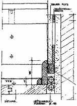
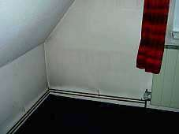
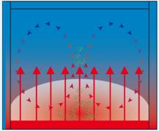
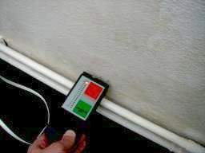
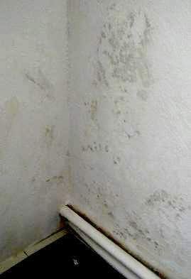
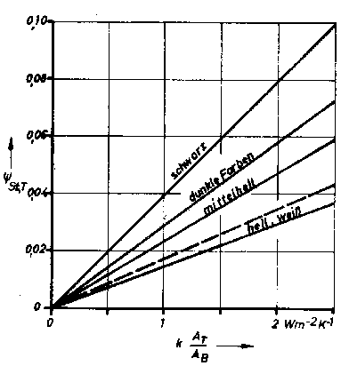
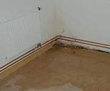
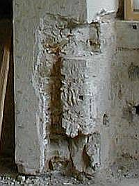
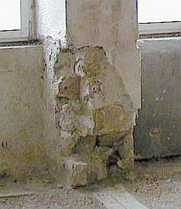
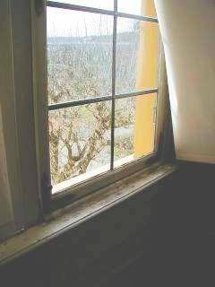

[🠔 Zur Übersicht: Slavisk](slavisk.md)  
# Темперирование наружных стен зданий
**Защита строений и здоровья путем правильного отопления,Темперирование стен зданий**  
_von Konrad Fischer • aktualisiert 04.03.2009_

[Konrad Fischer](1refernz.md) 
Темперирование наружных стен зданий 

 Защита строений и здоровья путем правильного отопления,Темперирование ст ен зданий 
(**обновлено 4.03.09**) 

(более подробно в немецкой версии этой страници) 

****Новинка:**** в строительном маркете baumarkt.de - K. Fischer: **[экономия энергии и отсутствие плесени](http://www.baumarkt.de/b_markt/fr_info/energiesparen.htm)** канд. наук 

Ulrich Berner, Ганноверский геоцентр, **[(самые распространенне обманы о "защите" атмосферы)](7thuene1.md)** 

(Buderus-/IWO-форум: Отопление жидким топливом в будущем, 16.02.08, Монастырь Банц) 

**[Вопросы и ответы по проблемам строения](2frag.md)** , в том числе к 
темперированию стен

 **[Письма читателей к Конраду Фишеру (Konrad Fischer)](7lesbrif.md)** качественное строительство, экономия энергии, мошенничество с окнами, экологические вопросы**[ 
Экономия энергии с неожиданностями в вопросах экологии, строительной физике,](7wsvoant.md)[экономии энергии и домашней технике](7wsvoant.md)**[вторая сторона медали теплоизоляции](213baust.md#lichtenfelser experiment) Лихтенфельский эксперимент**** 
de - журнал по электротехнике зданий 1-2/02, **[K. Fischer: Темперирование зданий и тепловое излучение](http://web.archive.org/web/20020420164747/http://www.pflaum.de/de.dir/de/archiv/2002/01-02/a_de-geb02.html) ** ****Новинка :**********[Памятники архитектуры - использование и содержание](8buch.md#nue)**

С актуальными статьями и примеры проектов с использованием отопления на принципе теплового излучения и темперирования стен. 

Свободное издание Немецкого Бургэнферайнигунг **[Deutschen Burgenvereinigung e.V.](http://www.deutsche-burgen.org/)** ,

под редакцией Конрада Фишера (Konrad Fischer) 

---

**_"Еще должен прийти век разъяснения : время без опекунов и опекаемых, радикальное просвещение, в котором наука и разум не укутаны мраком. [...], 
религия же это факультет обремененный недостатком познания, а значит незавершенного разъяснения. 
Необходимость наверстать упущенное в просвещении всюду больше, чем мы себе можем представить." 
Рудольф Борен "Верное и Истинное могло бы легче покорять мир, если бы тем, что не способны помочь этому, не удавалось их усердное стремление не допустить этого." 
(Артур Шопенхауэр, в: "Мир как воля и представление"_ 
Фридрих Шиллер (Friedrich Schiller): _[Der Brotgelehrte (Ремесленник науки)](2000.md) _- отражает действительную картину сегодняшней науки**

---

Кто задумается о, со всех сторон заклинаемой, экономии энергии, быстро придет к выводу, что затапливаемая водой теплоизоляция, вспененные извращением стройматериалы, нуждающиеся в головокружительных субсидиях "новые" источники энергии от ветра и солнца, потребляющие больше энергии, чем они производят - не могут экономить отопительную энергию. Но её можно экономить отопительной техникой. Сравнение и критический анализ самых ходовых систем показывает: 

 * "Альтернативные высокие технологии" солнечные батареи для производства тока, коллекторы, нагревающие воду для отопления, ветряки, регенерация тепла - поставляет самые бесхозяйственные результаты, профессионально используя созданную средствами массовой информации эко-иллюзию.
 * Отопление, основанное на обмене теплого воздуха (обычноые современные батареи), напрасно сжигает энергию, выходя через окна, двери, щели.
 * Отопление, основанное на нагреве воздуха помещений, неминуемо приводит к постоянному возникновению конденсата и сырости, образующегося на наружных стенах, всегда имеющих более низкую температуру, чем внутренние стены и инвентарь.
 * Лишь отопление на принципе теплового излучения позволяет действительно экономить энергию.

В чем причина? Читайте дальше: 

**Темперирование наружных стен зданий**

**подплинтусное темперирование Детальный разрез и вид спереди ([Замок Нойенбург <Schloss Neuenburg>](http://www.schloss-neuenburg.de/), Jagdzimmer mit Lamberie)** 
трубки исчезают за плинтусом, а отдаваемое ими тепло переходит в нижнюю часть стены и является отопителем с теплом излучения. (Разработка и воплощение: бюро К. Фишера: 
[Architektur- und Ingenieurbuero Konrad Fischer, Hochstadt a. Main](1refernz.md))

**Почему и как долго существует темперирование стен зданий?**

Технический переворот современности не обошел стороной и отопительную технику. Раньше использовалось отопление, принципиально основанное на интенсивном излучении согревающим (с незначительным расходом энергии, благоразумно, безвредно и даже полезно для здоровья) людей и помещения, 19 век привел решающие изменения: отопительная техника развивалась все больше и больше в сторону нагревания и перемещения воздуха. Для нагревания дома и его жителей в прохладное время года, использовался опыт и знания, добытые в процессе познания солнечного излучения. При этом знания по приготовлению пищи имели, пожалуй, решающее значение. На длительное время аккумулирующие и излучающие тепло камни у костра послужили подсказкой, которая привела к изготовлению печей для приготовления пищи, а затем к их использованию для отопления помещений. Конечно к первым познаниям у костра относится и опыт, что непосредственно перед ним - потеют, а позади, в "тени" его излучения - мерзнут. 

 

Опыт, проведенный Джоном Б. из [Pierce Laboratory, USA](http://www.jbpierce.org/), поясняет цель благоразумной отопительной техники: 

Люди, находящиеся в помещении с температурой воздуха +50oC , но специально охлажденными стенами - мерзли, зато при 10oC и накаленных стенах начинали потеть (Источники: Техн. информация "Энергия излучения - первичная энергия, открытая заново", TT Technotherm GmbH, Нюрнберг). 

То есть важно не насиловать пылью воздух, являющийся источником жизни, а использовать полезные качества теплового излучения. Вот что узнали наши пост-промышленные предки: 

В историческом массивном здании всегда имеется темперирование (нагревание поверхности) внешней оболочки помещений посредством простых или очень умно продуманных конструкций для отопления, так сказать, со времен античности и вплоть до современности. Архитекторы известных бань Древнего Рима, а так же мастера старых монастырей и крепостей, с их проведенной под полом отопительной системой, и нагретом водяном паре (никаких следов дыма) транспортирующего тепло и распределяющим его в стены с частично с пустотелыми кирпичами (lat. Tubuli), умели обходится с проблемами отопления, экономией энергии и бережным обращением с массивными постройками не только посредством выбора конструкции против колебаний влажности и температуры: они нагревали - если это вообще было необходимым - оболочку, а не воздух помещения. Древние Римляне использовали отопление, основанное на принципе конденсации водяного пара, и они ведь были не глупы! Похоже их здания без проблем переносили паровое отопление и также не имели никаких проблем с содействующими плесени красками и штукатурками, не говоря уже о так называемой современной "теплоизоляции". Во всяком случае, их стены накапливали тепло и были теплы. То есть: 

- тепловое излучение вместо создающего грязь и влагу течения теплого воздуха; 
- теплые, сухие и свободные от плесени стены и предметы обстановки (по сравнению с постоянно более прохладным воздухом помещения). 

Это объясняет, что в исторические помещения до внедрения отапливающих воздух систем, имели более долгосрочные (на протяжении десятилетий) интервалы технического обслуживания внешних оболочек помещений и инвентаря, в то время как сегодня, всего несколько годов после ремонта, становятся необходимыми самые интенсивные мероприятия против плесени, грибка, загрязнения поверхностей и отдельных строительных конструкций, облупливания краски и отслоения штукатурки, подпольного гниения, мобилизации солевого давления от постоянного изменения агрегатного состояния, образования трещин, коррозии поверхностей конструктивных элементов в местах покраски металлических элементов и т.д. 
Под девизом: из года в год заново. Как прекрасно, что общественный, а также и частный заказчик застройки сегодня накопил такие неистощимые денежные запасы, которым быстрая потеря денег таким образом прямо-таки идет на пользу. Оздоровительный сброс балласта! Главное дешево сейчас и сегодня, а что будет потом - до лампочки. 

А раньше было все наоборот, действительная цена и общие сбережения стояли на переднем плане: сухие помещения можно наиболее экономически обогревать методом теплового излучения. Так же как и дрожащий от холода человек в холодной кровати получает простую форму приятного ночного покоя от теплой грелки. 

Повышенное загрязнение на наружных стенах помещений благодаря тепло-влажному, запыленному воздуху было раньше не такой проблемой как сегодня (не принимая в счет сажу от свеч и смолистой древесины, а также кухонный дым), это благодаря отоплению тепловым излучением. Только таким образом могла сохраняться многовековая настенная живопись вплоть до нашего времени. 
При их реставрации можно вновь и вновь заметить, что скорее стилевые изменения либо же использования самих помещений для других целей (а не следствия загрязнений) служили причиной их вариаций. Периоды обновлений каждые 30-50 лет не были редкостью. Неправильное отопление сегодня является одной из главных причин для обновления покраски и радует маляров-раскрасчиков. А так же приносит значительный ущерб, как здоровью человека, так и деревянным конструкциям. 

Позже в качестве стационарных нагревателей теплового излучения служили изразцовые печи и открытые камины, которые излучали тепловую энергию внутрь помещения. Благодаря уравновешанному излучениию между стенами они создавали в помещениях приятный климат. И это при незначительной потере энергии, так как воздух помещения едва или же только вторично нагревался и тепловая энергия "держалась" в стенах, поверхностях массивной печи и окружающих предметах, способных к долгому накоплению. Кроме того, подогревающийся "столб" печей и каминов заботился об оптимальном использовании тепла угарных газов.

Тепловое излучение является естественным для человека также физиологически. Человеческое тело способно принимать 99% влияющего на него теплового излучения через кожу. С первоначальных времен он подвергался солнечному излучению, строение его тела настроено на это. Однако как только дело доходит, до влажных и теплых воздушных течений, состояние его здоровья внезапно ухудшается: Кто еще ничего не слышал о болях от фена или об угрожающих эпидемиях тропиков? Наше современное отопление с радиаторами и конвекторами, нагревающими в первую очередь воздух, способствует созданию "тропиков" в герметичных помещениях: более 1/3 всего немецкого населения страдают аллергическими заболеваниями, 8000-10000 смертельных случаев в год делают нас вицечемпионами Европы (опережает только влажная Ирландия). Однако, благодаря усилиям производителей теплоизоляционных материалов, отопления и вентиляции и их сообщников со стороны политики и находящихся на государственной службе чиновников мы скоро превзойдем и Ирландию. Промокающая теплоизоляция, плотно закупоренные и покрывающиеся плесенью помещения, накапливающие влагу и плесень вентиляционные установки и кондиционеры, а так же отопительные системы, поднимающие и разносящие пыль и микробов, хорошо служат этой цели. Растущее число астматических заболевший среди сотрудников музеев, служителей церквей и других хорошо посещаемых учреждений, а так же их посетителей, становятся все более важной темой. **Отмена практики с помощью теории**

В 1885 году профессор Герман Ричель вводит на основанной им кафедре "отопления и вентиляции" при Техническом Университете Берлина новый способ отопления. Он "изобрел" ребровый обогреватель, нагревающий воздух и вывел его расчетные данные. Паровой двигатель входит в историю строительной техники в качестве парового отопления. С тех пор это вторжение "современной" техники в практический контекст опыта совершило переворот в надежном с энергетической и гигиенической точки зрения теплоизлучающем отоплении. Произошел постепенный переход к растрачивающему энергию и вредному для здоровья (на принципе обмена воздуха) конвекционному отоплению. Теперь свистит перегретый воздух из зданий, теперь тянет со всех углов из-за принудительного обмена воздуха, теперь поверхности стен становятся серыми от циркулирующей в воздухе пыли и дорого натопленный воздух в больших малых помещениях накапливался под потолком, не передавая напрямую свое тепло. Все имеющиеся попытки и предложения усовершенствовать принцип отопления тепловым излучением с технической точки зрения, ограничивались единичными примерами. Результат ошибочного развития инженерной науки: сверхвысокая мощность отопительных установок, выгодные только для плановика, инженера и поставщика. Следующая иллюстрация показывает избранный принцип в виде комнатного тайфуна: 

**_Так было до сих пор:_**

сегодня общепринятое отопление

**_(на обмене теплого воздуха)_**

_Воздух в помещениях подогревается и поднимается наверх._

_Течение воздуха поднимает пыль, микроорганизмы и бактерии._

_Нижняя часть помещения остается холодной._

_Эта иллюстрация показывает так же наглядно последовательность такого отопления._

_Подобное распределение теплого воздушного течения, оставляет свободные углы с более низкими там температурами. Это приводит к образованию конденсата, налетам плесени и других поражающих бактерий. Несмотря на абсолютно неверное изображение в местах перехода наружных стен, здесь почти верно отображено недостаточный обогрев свободных от циркуляции углов._

_Отложение грязи связанного с ночным понижением температуры отопления._

_На (остывших за ночь) стенах быстро оседает пыль от сильно перегреваемых (утром) труб отопления._

Похожим образом работает панельное отопление пола, а так же родное с ней отопление с ограниченной циркуляцией воздуха для помещений большой квадратуры. Оно правда не производит постоянной циркуляции пыли, побуждает однако, медленно нагреваемый на полу слой воздуха к порывистым движениям наверх. Поднимающийся, нагретый слой воздуха производит опять-таки повышенное загрязнение и увлажнение конденсатом прохладных стен, типичных для этой системы отопления. Кроме того в больших помещениях на (в основном не сразу бросающимся в глаза) переохлажденных потолках, на подверженных особой опасности (из-за деревянных соединений конструкций) переходах стен и потолков, на различном инвентаре помещения, фресках и прочем художественном оформлении, планках штукатурки и т.д. 

_Принцип действия панельного отопления под полом_

Достижения панельного отопления низких температур в полу должны также рассматриваться скептически. Кроме того, что оно не нагревает все тело, а лишь ступни ног (в отличие от солнца), оно препятствует естественной и физиологически необходимой для охлаждения тела теплоотдаче, а так же служит образованию показанных сверху завихрений тепла и пыли в помещении. То, что панельное отопление в полу сильно инертно, говорит и о его другой проблеме: первоначально оно передает энергию множеству „тяжелых“ молекул пола (ускоряет их молекулярное движение по закону Брауна), пока они наконец достигнут поверхности пола и смогут передавать тепловое излучение помещению и человеку. Это огромное и бессмысленное уничтожение энергии! Разве что для использования теплого держателя полотенца в ванной комнате, который быстро и напрямую отдает свое тепло, можно позволить себе эту "роскошь" нескольких квадратов теплой плитки.

_Здесь не поможет и снабжение теплом: стена после "ремонта" остается мокрой._

_Известковое покрытие с добавками метил-целлюлозы на историческом покрытии не принесет успеха. Необдуманные рекомендации изготовителей не сдерживают своих обещаний на влажных поверхностях. Они покрывается плесенью, несмотря на темперирование и органическое "улучшение" известковой краски. Нужно немного более подробно этим заняться, чтобы добраться до сути дела, прежде чем доверять бесплатным советам производителей или сочинениям экспертов._

**Переворот мнений**

В конце 70ых годов возникло логичное движение против извращений отопительной техники. Инженер Альфред Айзеншинк, специализирующийся на отопительной технике (автор бестселлера: "Falsch geheizt ist halb gestorben - Неправильно топишь в гроб загонишь"), поставил масштаб развитием его sancal-отопления с помощью маленьких конвекторов за плинтусами пола. Они снабжали поверхности стен теплом, которое излучалось оттуда внутрь помещения. 

Инженер и архитектор Асманн перенял существенные идеи Айзеншинка, усложнил и сделал несколько дороже эту отопительную систему, включая убывающую эффективность: также посредством снабжения горячей водой маленьких конвекторов, но теперь, с приставленной контактной оболочкой (что требует дополнительного обхода тепловой энергии). Зато в оптике гипскартона, и в соответствии с псевдо-эстетикой архитекторов. 

Реставратор Хэннинг Гроссешмидт (из отдела частных музеев при Баварском Национальном музее, теперь в Баварском земельном ведомстве по охране исторических памятников архитектуры), ввел темперирование как инертное теплоизлучающее отопление, согласно конструктивному обогреву в области музеев. Ее основной задачей, наряду с "тепловым осушением", была стабилизация климата и длительная защита экспонатов при круглогодной эксплуатации.

**К теме: ночное понижение температуры**

Бессмысленное энерго-растрачивающее понижение рабочей температуры отопления в ночной период, является в лучшем случае коварным маркетинг-трюком компаний сбыта энергии. Именно в особо холодное время, когда здание остывает намного быстрее, оно обогревается меньше! Дополнительные затраты на возмещение потерянного тепла в дневное время суток, не бросается особо в глаза, благодаря автоматическому регулированию. Это не может случиться (лишь в крайних случаях) при отоплении на основе теплового излучения наружных стен здания. 

К сожалению, на практике темперирования стен приходится наблюдать, также неисправимые души привратников, которые хотят топить против принципа отопления теплоизлучением, как конвекционным. Все это дело привычки, часто сочетаемой с упорной неисправимостью. Они снижают рабочие температуры отопления по "причинам экономии энергии" также в самые холодные зимние периоды, да еще и ночью, хотя именно тогда поверхности должны максимально снабжаться теплом. 

Результат: здание остывает ночью, когда и без того холодно. Затем на следующий день отопительная техника, которая легко поддерживала и нагревала бы для дневного пользования это здание, не может с необходимой скоростью нагреть холодную оболочку (прямо пожирающую тепло) и переохлажденный воздух помещения. Жильцов колотит, и они предявляют жалобы. Привратник материт отопление. Одновременно возрастает потребление энергии из-за неравномерной эксплуатации (думай о любимой машине, которую ты одолжил своей ... : газ до пола + тормоза на всю + газ до пола... Как быстро надо опять на заправку? А как долго ты на ней проездишь? скоро вопросы запретят из-за дискриминации). 

До сих пор темперирование зданий осуществляется преимущественно в старых исторических объектах, стоящих под охраной памятников архитектуры, музеях и церковных помещениях. Во времена недостатка финансов на счетах церкви и культуры, давно разоренных "дешевыми" плановиками, завышавшими цены строительства, включая издержки на исправления последствий их же ошибок, в этом поистине, нет никакого чуда. Но, не смотря на это, все больше новостроек используют эту экономически, технически и гигиенически превосходящую технику. 

Для многих строительных конструкций (от простых спартанских, до добротных высококачественных особняков) возможны индивидуальные решения с их оптимальным использованием. В кругу коллег идет частично надрегиональный обмен опытом, чтобы перейти от многообещающей перспективы этой поначалу экспериментальной техники к функционально развитому уровню. 

Не стоит умалчивать: "темперирование" прошло через значительное техническое развитие. Имелись поражения, нелегкие разбирательства и конструктивные дополнения, для достижения необходимых комнатных температур - особенно при решениях "в обход" со скрытым прокладыванием труб. Более дорогой вариант - темперирование со скрытыми трубами - остается определенно для исключительных ситуаций. Часто устраивает простой вариант "открытых труб". Несколько дороже и "массивнее" (обусловлено конструкцией) - также решение "в обход" - предлагаются маленькие конвекторы, скрытые за щиток т.н. отопительных планок. У них нагревается только маленький конвектор от обогреваемой трубы. Конвектор нагревает воздух, который в свою очередь нагревает прилегающую стену. Она излучает, в конечном счете, тепло в помещение. То, что придумано отопительной индустрией в дорогих разработках по отоплению теплоизлучением (настенное панельное отопление, отопление встроенное в пол или потолок, текстильные полотна с вшитыми кабелями, нагревающие бетоноконструкции, и т.д.), конечно замечательно и в скрытом варианте цаца для сверхчувствительных эстетов, но не обязательно оптимально для кошелька, для сохранения исторических стен и для эффективности. Новые выражения ("термо-активные поверхности", "тепловая активизация конструктивного элемента") звучат заманчиво и поддерживают маркетинг в убыток кошельку заказчика. 

Как всегда конструктивный опыт накапливается из первых неудач и разочарований, а не из арифметических расчетов. На пути к решению имеются возможности как для экономного заказчика с определенной долей риска, так и для того, кто хочет иметь 100%-ую гарантию. ВАЖНО: откровенное обсуждение возможностей с заказчиком с самого начала, без преувеличенных обещаний. Для начинающего в этой области это не всегда так легко. И об одном заказчик должен помнить: Если инженер по отопительной технике советует дорогую и технически невыгодную систему, то на это могут иметься 3 - иногда скомбинированные между собой - причины: 

1. Дорогая техника приносит больший гонорар. 
2. Дорогая техника продается (поддерживаемая гратификацией) за счет "бесплатного" для плановика планирования самого производителя (за спиной заказчика). Это значит, планирование, за которое инженер кассирует у заказчика застройки, выполняется производителем с заранее подготовленным для публикации описанием условий проведения работ, что уменьшает конкуренцию и вредит в конечном итоге заказчику. 
3. Инертность планирования инженера - он постоянно реализует клиентам одни и те же услуги с устаревшей и дорогой техникой - время от времени незначительно модернизируя ее. 

Совет: проверьте проекты-рекомендации Вашего плановика вплоть до описания условий о проведении работ. И в случае чего, спросите, что значат (принципиально запрещенные) наименования конкретных продуктов или производителей для других, конкурентоспособных строительных продуктов и строительных систем. В этом и отражается, все вышесказанное убожество. 

То, что имеются даже мастера-сантехники, которые полагаюстя на практические факты и постепенно прощаются с неправильной теорией привычного отопления, показывает этот любезный отклик в гостевой книге посетителей: 

Уважаемый господин Фишер, 

сердечное спасибо за многочисленные факты на Ваших страницах! 
Оживленный содержанием о преобладающей практике "утепления" у нас в Германии, я провел простой эксперимент: 

Объекты: 

2 параллельно стоящих дома с расстоянием друг от друга примерно 15 м. 
Один: с 1912 года, кирпич/фахверк. 
Другой дом сборных элементов с 1996 года. Утепленная стена тонкостенной конструкции. 
Рассмотрение, направленных на юго-запад, наружных стен сегодня вечером около 19.30 ч., ясное небо. Температуры внутренних помещений обоих домов 22°C. 
Наружная температура воздуха: 0°C 
Температура поверхности стены кирпича:-1°C 
Температура поверхности стены тонкостенной конструкции:-6°C 

Эти данные побуждают заинтересованного специалиста к размышлению и переосмыслению прежних представлений. Действительно, незначительный по сравнению со стеной кирпича, тепловой потенциал стены тонкостенной конструкции был быстро исчерпан. Хоть и измеренные в полдень температуры составляли +5°C стены кирпича и целых + 18°C на стене тонкостенной конструкции. 

Другой эффект я испытываю ежедневно сидя за письменным столом. Несмотря на панельное отопление в полу - зимой всегда мерзнут ноги. И это в хорошо утепленном доме! Легкое, едва ощутимое движение воздуха понизу, которое возникает при разности температур наружных стен и теплого воздуха помещения, заботится об этой маленькой, но постоянной неприятности. Не помогают и зоны, где проложены двойные трубы отопления. На Ваших страницах так же понятно описаны как для дилетанта, так и для специалиста принципы темперирования наружных стен. 

Как мастер отопительных систем я рекомендую сегодня моим клиентам отопительную технику темперирования наружных стен. Сухие стены, приятный климат помещения и довольные клиенты подтверждают эти теории. 

Большой привет! 
Аксель Фишер, 
Мастер отопительных систем, 

г. Дахриден, 
01.02.2005 

**Принцип темперирования внешних стен**

Темперирование помещений, безразлично для длительного ли пребывания людей или для музейного хранения, происходит на принципе энергоснабжения, утрачивающих тепло, поверхностей здания. Нагретые наружные стены снабжают внутреннее пространство теплоизлучением. Подверженные тепловому излучению тела (стены, потолки, полы, мебель, пользователь) излучают со своей стороны тепловое излучение во все стороны. Этим добивается со всех сторон равномерно отрегулированный температурный климат помещения. 

Принцип действия теплового излучения поясняется в следующей схеме (она показывает электрически нагретую, мраморную плиту на наружной стене, которая благодаря уравновешиванию теплоизлучения и отражению во все стороны поверхностей помещения. При темперировании наружных стен с помощью отопительных труб, проложенных в области цоколя или под штукатуркой, непосредственно нагревающих поверхность стены, они действует как аналогичные "источники" теплового излучения): 

Принцип излучения, действует само собой разумеется не только с отоплением мраморными плитами (во избежание недоразумений: я использую схемы и графики, только для демонстрации принципа!), но и имеет значение для всех видов отопления методом теплоизлучения. Он благоприятно влияет на потребление энергии, не вреден для здоровья (скорее наоборот) и помагает избегать нанесение ущерба от влаги, так как:

* отсутствует злоупотребительное нагревание жизненно важного продукта - воздуха для дыхания, в качестве носителя пыли и бактерий (при конвекционном и радиаторном отоплении). Помещения и легкие остаются чистыми;
* предотвращается образование конденсата в наружных стенах. Уменьшается коррозия конструктивных элементов. Отпадает поражение плесенью с ее косвенным ущербом и риском для здоровья - чувствительных к аллергии и находящихся под угрозой астмы постоянных и временных пользователей этих помещений. Конечно, для этого должно обеспечиваться непрерывное снабжение теплом стена-пол-потолок-углы, иначе конденсат все же образуется там: это загрязняет и делает сырыми поверхности, покрывается плесенью и грибком - типично для ночного понижения температуры;
* отопительная энергия напрямую и непосредственно откладывается в способной к ее накоплению, массе сооружения;
* отопление теплоизлучением создает чувство уюта и комфорта при более низкой температуре помещений, чем при системе отопления, нагревающей воздух;
* за счет отсутствия постоянного обмена воздуха, в помещениях уменьшается неприятный эффект интенсивного охлаждения поверхностей окон;
* более низкая комнатная температура с меньшим, по сравнению с наружным воздухом, атмосферным давлением не расточает бессмысленно тепло при вентиляции;
* отпадают дополнительные затраты на регулирование и поддержание приемлемой температуры и влажности воздуха при их колебаниях, обусловленных вентиляцией;
* меньшая потребность тепла и меньшее кондиционирование воздуха допускает также применение менее дорогостоящей техники для автоматического регулирования второстепенных областей в здании (например хранилищ музеев, особо ценных экспонатов, габаритных музыкальных инструментов);
* также в больших помещениях (спортзал, церковь, концертный зал и т.п.) простейшая техника темперирования с минимальными затратами успешно заменяет, как правило, склонное к неполадкам, дорогое в приобретении и эксплуатации воздушное отопление, накопители и нагнетатели теплого воздуха, встроенные в скамейки обогреватели и пр.;
* в высоких помещениях, благодаря методу темперирования, тепло поставляется именно туда, где в нем нуждается пользователь: в зоне пребывания, а не в виде поднимающегося к потолку теплого воздуха, со всеми вытекающими отсюда последствиями (покрытые пылью и грязью, сыреющие и находящиеся под угрозой прогнивания потолки).
Отопление темперированием стен, высушивает сначала стенную влажность в области его действия, то есть источника тепла (трубопровод, отопительный кабель, мини-конвектор, дополнительно оснащенные отопительной техникой с помощью электрокабеля старые изразцовые печи, теплоизлучающие плиты и т.д.). При первом вводе в эксплуатацию нужно рассчитывать с тем, что определенная часть потребленной энергии требуется для высушивания сооружения. Если этот процесс по прошествии некоторого времени (в зависимости от имеющейся в конструкции влажности) завершен, потребление энергии снижается. Если нет - существуют причины, обусловленные видом конструкции или объекта, тормозящие эффективность. И с темперированием можно сделать все "шиворот на выворот". Об этом говорят годовые потребления энергии около 200 до 300 kWh/квадратный метр или 60 до 80 kWh/cbm. 

В этом случае важную роль играет не просто "избавление от влаги", а как правило, выбранная конструкция и неправильное распределение тепла со скрытыми или замурованными под штукатурку теплопроводными трубами, которые затем недостаточно снабжают помещения теплом. Какой смысл должен быть в том, чтобы, так сказать, механически передаваемую, тепловую энергию затрачивать на "передвижение" внутри массивных стен, вместо того, чтобы передаяать ее непосредственно помещению и поверхностям конструктивных элементов? Не принимается в счет дорогостоящее врезание и замуровывание теплопровода. 

Ошибочная теория борьбы против ["поднимающейся влаги"](2aufstr.md) посредством "теплового осушения" там не поможет. Тепловое излучение должно передаваться помещению по возможности "не затененно" - не освещается же сотней неоновых ламп, из под слегка просвечивающейся штукатурки, помещение, в котором хотят читать. Тепловое излучение, как и свет, подчиняется непреклонным законам физики. 

При сравнении потерянного тепла помещения, через наружную стену в более прохладную среду, преобладает энергоотдача излучением (более 90%). Нужно учитывать излучение массивных и нагретых поверхностей помещения (стены, потолок, пол) в отношении к той сравнительно крохотной энергии, которую отдают нагретые молекулы воздуха помещения в наружную стену - при учете также солнечной энергии. 

Здесь считается сегодня с помощью неверных, направленных на максимальное использование отопительного котла и изоляционного материала, благодаря запутанным упрощениям "официозной" строительной физики, основанной на ошибочных истолкованиях и прямо-таки идиотских гипотезах. Коэффициент теплопроводимости (k-Wert в Германии, R-valuе в США) показывает, на основе его нормированного метода вычисления, в конечном счете, только то, как быстро теплый воздух передает тепло в тот или иной строительный материал (в стационарных и бессолнечных условиях!). А не то, как быстро определенное количество тепла, в виде так важного в этом случае теплового излучения, проходит через конструктивный элемент в реальных условиях. 

Ссылка: [сумасбродство вокруг коэффициента теплопроводимости](213baust.md#u-narretei) 
Таким образом, искусственно создается огромное преимущество для теплоизоляционных материалов. Они могут, благодаря их незначительной плотности, принимать малое количество тепла от нагретого воздуха, но не способны накапливать, например, солнечную энергию в течении дня, чтобы использовать ее прохладной ночью. 

_Так выглядит теплоизоляционная конструкция со временем, благодаря постоянному ночному охлаждению воздуха и вместе с этим связанным образованием конденсата, с последующим "озеленением" водорослями (забавно, как более способные к накоплению тепла, анкерные соединения, противостоят зеленому налету):_

 
"Результат обследования: водоросли на фасаде из теплоизоляционных пакетов" из статьи "исследования теплоизоляции; к законодательному распоряжению о экономии энергии: 1. Зеленый предупредительный указатель, 2. наглухо закрыть" в журнале для строительно-технического обслуживания и охраны исторических памятников ["Bautenschutz+Bausanierung"](http://www.bautenschutz-bausanierung.de/), январь 2002, стр. 44, иллюстр.: институт Висмара, обработка K.F. 
С другой стороны, накопляемое тепло быстро прходит сквозь легкий материал, в то время как массивная конструкция еще долго держит накопленное тепло. В уже нагретом массивном материале, все выглядит иначе: только малая доля накопленной тепловой энергии может переходить от приведенных в движение молекул стройматериала к молекулам наружного воздуха: 

во-первых, так как только 1/6 энергии движения в самом деле передается "наружу"; 
во-вторых, относительно редко они встречают молекулы воздуха - благодаря сравнительно малой молекулярной плотности воздуха.

Этот "зависимый от контакта" энерго-транспорт незначителен и может описываться в этом случае как "переход тепла". Поэтому "теплоизоляционный материал" с отсутствием большой плотности молекул, забирает мало тепла от теплой руки, а намного плотная сталь - много (воспринимаемо как охлаждение). И точно таким же образом функционирует термос: его тонкая стеклянная стенка, изымает лишь небольшое количество тепла у теплой жидкости, благодаря зазеркаленной поверхности, отражающей тепловые лучи. Толщина слоя воздуха не играет для скорости охлаждения почти никакой роли. Так что заложенные в стены системы отопления, базирующиеся на принципе теплового излучения, это апогей пустой затраты энергии. Называемое так же темперированием строительных элементов. 

Энергия таких замурованных систем расходуется или точнее расточается, на внутреннее нагревание стен, переводя тепловую энергию сначала в кинетическую (молекулярное движение Брауна). Она передается только косвенно помещению и сгорает большей частью внутри стены. Было бы собственно достаточно, приводить только верхнюю поверхность стены в термически повышенное, способствующее излучению, теплое состояние. А это обеспечивают только настенные системы. Это должен бы знать заказчик и его женушка, требующие скрытую под штукатуркой и технически/экономически неэффективную отопительную систему. 

Иначе не имеется практически никакой передачи тепла, кроме конвекции (транспорт нагретых газов) и излучения (излучение волна/частиц со скоростью света). Конвекция в стройматериалах, как передача тепла отпадает, в крайнем случае, можно было бы рассматривать капиллярный транспорт воды, содержащей тепло, что, пожалуй, на деле едва что-то изменит. Хорошие стройматериалы должны быть сухими, хотя "спецы" охотно выставляют [влажные ловушки](29bausto.md#feuchtegehalt). Печально, но факт. 

---

Очевидность истины касательно коэффициента теплопроводимости в строительстве видна также в этом графике - из книги 26760/07 TGL - "Heizlast von Bauwerken - Нагрузка отопления в сооружениях ": 

На оси X показывается коэффициент теплопроводимости (k) от 0 до 2,5. На оси Y поглощение излучения (фи). Чем хуже (выше) коэффициент теплопроводимости, тем лучше поглощается солнечное излучение материалом конструктивного элемента, в независимости от цвета покраски поверхностей. Логично, что с бесплатным "притоком" теплой энергии и сухим состоянием массивных материалов, связана их независимость от направленных на оптимальность коэффициента теплопроводимости и заставляющих "потеть" поверхности, теплоизолирующих материалов. 

Поэтому со спокойной совестью можно отказываться от технически вредной и в результате бесхозяйственной внешней и внутренней изоляции. Без изоляции "добывание" солнечного излучения достигается свободно и без потерь. Оно проникает в принципиально влажные зоны внешних стен, сохнет, избегает мокроты и образование грибковых культур (думай о пораженных повсюду поверхностях теплоизоляционных пакетов) и уменьшает излишнее отопление изнутри. Массивная стена является двусторонне нагруженным коллектором излучения, который превосходно "регулирует" бесплатные ресурсы солнечный энергии, а так же с незначительной затратой, обогреваемую со стороны помещения, энергию. 

Также, рекомендованная фанатами коэффициента теплопроводимости, изоляция темперированных трасс напротив наружной стены не требуется. Убытки посредством утечки тепла наружу незначительны вследствии практически преобладающего перехода тепла в виде излучения - смотри выше. "Энергетическое" влияние конвекционного отопления - и "убытки" от отопления дома темперированием, переоцениваются здесь драматично. Почему? Это разговор другой темы.

**Влажность и температура на стене**

Нагретая темперированием массивная стена обеспечивает стабилизацию климата помещения от постоянных колебаний температур и термических / гигиенических перегрузок (трещин, загрязнения, увлажнения от солевых коррозий, поражений плесенью, нанесения вреда здоровью!) стенной конструкции в течении года. На прохладных же поверхностях могут откладываться большое количество воды из влажного и теплого воздуха окружающей среды. Энергоподача в области цоколя от темперирования уменьшает (или предотвращает совсем) влажность сооружения из конденсации (накопление воздушной влажности в прохладных поверхностях) и гигроскопии (накопление влаги, обусловленное солевыми отложениями), которая часто злоупотребляется как ["капиллярно-поднимающаяся влажность"](2aufstr.md). 

Совершенно ошибочным является предложение, что и без темперирования сооружение может хорошо сохранятся. Так как в течение года конденсат (накапливающийся на поверхностях конструктивных элементов: стен, полов, потолков, но также в предметах обстановки, музейных экспонатах, инвентаре, мебели и т.д.) и постоянно меняющаяся температура и влажность подвергают здание огромному стрессу. В наших ценно обставленных неотопляемых церковных помещениях, замках, дворцах и музеях можно прямо-таки видеть, как они прямо на глазах стареют, коррозируют и терпят убытки. 

Конвекционные системы с нагретым воздухом является вредными не только для оболочек зданий и пользователей помещений, но и наносят непоправимый ущерб восприимчивым предметы обстановки и ценно оформленным декорациям. Эта проблема наиболее часто встречается в музейных или во временно используемых исторических зданиях. 

Это, как правило, незаметно протекающее, разрушительное старение материалов может замедляться только смягчением климатических условий. Обычный метод обмена воздуха с помощью кондиционера не подходит для этих целей, что подтверждают обширные исследования со стороны музеев. 

Именно поэтому, отопление темперированием наружных стен переживает эпоху Возрождения среди музеев (справки и консультации у Неправительственных музеев Баварии). Только отопление теплоизлучением может продолжительно уменьшить вредные влияния из-за недостаточного теплового снабжения строений, а так же в следствии изменения климата (связанных как с погодными условиями, так и специфическим использованием помещений). 

Таким образом разрушается сооружение и его обстановка, так как они остаются совсем нетопленными, либо так как используются отопительные системы, не указывая на их недостатки. При этом скептическому заказчику нередко внушается, что сегодняшняя техника, устроенного на обмене воздуха отопления, как бы усовершенствовалась и избавилась от начальных недостатков. Страстно повествуется о нагревании с мало-интенсивным течением воздуха. Умалчивается однако, основная проблема: перегрузка тепло-влажным воздухом на поверхностях холодных конструктивных элементов остается. Помните: нагретый воздух загрязняет, увлажняет и разрушает. Безразлично как быстро или медленно он циркулирует. Конечно, имеется линейная зависимость показаний температуры и скорости течения. Однако основная проблема остается. Все более часто становящийся ритм повторных ремонтов - это наруку для "бизнеса" строительства и реставрации. 

Занятно так же, что "влажные" убытки от конденсата (неисправных трасс, грунтовых вод, насыщенных солями и притягивающих воду поверхностей) объясняются "поднимающейся" влагой и предлагается мероприятия прогрессивного строительного безумия: вредные изоляции, бесполезные осушения, замен наличной штукатурки на т.н. "[санирные (=оздоровляющие)](2sanipuz.md)" штукатурки, водоотталкивающими, цементосодержащими, а соответственно солеобразующими штукатурками и, промокающие цоколь фундаментов, дренажи. Конечно, все вздор, но вылетает в копеечку. Это особенно наруку "дешевым" плановикам, проконсультированных производителями таких "стандартов", которые затем выдают себя за экспертов и экономят на планировании архитектора.

Ссылка на полезную статью о ["Поднимающейся влаге" ](2aufstr.md)(на русском). 
Конденсат восходящего тепло-влажного воздуха помещения или нагруженного влажностью наружного воздуха ведет к гниению деревянных опор в "прохладной" области стропил у потолков с накатом. Однако, часто эти повреждения опор в области водосточного желоба ошибочно приписываются проникающему дождю. Соответствующий приток тепла с помощью темперирования стен может эффективно препятствовать этому эффекту охлаждения. Конечно, можно травить древесину и пораженную мицелием кладку, согласно нормам и мнению "экспертов" широким взмахом топора "обновлять" имеющуюся конструкцию с массивными накладками. Прекрасна также время от времени "обработка" ядом, газом или повышением температуры подвергшийся нападению вредителями инвентарь и экспонаты смоченных конденсатом комнотушек. Если бы здесь применить директивы по защите мест работы 
касательно загрязнений воздуха в помещениях со спорами, распылениями и ядами, то многие музеи, замки, исторические дворци и церкви были бы закрыты, вероятно, чаще чем обычно. Одна только типичная для старых домов плесень дает о себе знать. 

Коанда-эффект описывает подъемную силу теплого (от "горячей" поверхности стен в области проложенных труб отопления) воздуха - в противоположность к охватывающей все помещение циркуляции теплого воздуха конвекционным отоплением (комнатный тайфун) - по всей стене начиная от проложенных труб отопления. Коанда-эффект можно продемонстрировать, например с помощью дыма. Предпосылкой для его возникновения является по возможности давольно близко к поверхности проведенная система труб и достаточная рабочая температура. При блокаде тепла из-за слишком глубокого вмонтирования труб в стену или накрытием деревянным плинтусом не могут достигаются необходимые температуры на поверхности (более 45 °C). Также вплотную к стене поставленная или встроенная мебель, которая прерывает теплое течение, но и сокращает вместе с тем и коэффициент действия. Для висящих на темперированой стене картинах или объектах хорошо показали себя смонтированные с обратной стороны держатели расстояния (из пробкового дерева).

Разнообразные связи действия темперирования умалчиваются сторонниками устоявшихся систем в большинстве случаев, вероятно, также как реакция на слишком яростные заклинания этой экспериментальной техники. К введенным на рынок "исследованиям" нужно тоже относиться с осторожностью. Так же вполне понятны усилия индустрии, запрыгнуть на отъехавший поезд темперированного отопления, с помощью тепловых плит для потолков (они переносят существенные отрицательные качества панельного отопления в полу на потолок, тепло исходит от слишком далекого расстояния, где в нем само больше нуждаются), панельного отопления пола или прочих настенных систем отопления (полые камни с дорогими отопительными планками или системой труб под штукатурку, греющих "в обход" и неудобных в обслуживании). Все промышленные продукты этого сектора отличаются тем, что они дороги и чрезвычайно ограничены в эффективности по отношению к также досягаемому с минимальными затратами результату. Это касается как размеров энерго-производителя, так и отдающих тепло систем. В общем хорошо для всех, кроме заказчика. 

То, что специалист по отоплению охотно рекомендует дорогостоящую и подпертую нормами технику, лежит в структуре образования и порядка его гонорара. Почему он должен довольствоваться минимальным гонораром (решение темперированием), если он может изымать больше чем 10-кратное с более дорогим воздушным отоплением, обычной кондиционерной техникой, а теперь также чрезмерно громоздким отоплением индустрийного теплоизлучения. При этом он может в случае чего еще свободно ссылаться на германский промышленный стандарт? В большинстве случаев хватает уже задумчиво нахмуренного лба, чтобы дезориентировать заказчика. Также архитектор выступает лишь изредка как скептик норм. И его гонорар растет с планированием дорогого оборудования. 

Если, наконец, поймут, что комнатная температура - это самый эффективный и самый простой инструмент, чтобы управлять климатом помещения, то дорогая кондиционерная техника скоро отыграет свою роль в музеях. Только понижением температуры воздуха помещения в период зимней эксплуатации примерно с 21°C на примерно 15-18°C достигают уже значительного снижения высыхания экспоната и вместе с тем его повреждения. Без дорогого и опасного увлажнения воздуха, при 21°C, можно было бы избегать с ним связанной относительной влажности воздуха примерно 25%. Таким образом, с помощью темперирования внешней оболочки здания, сокращенная температура воздуха может гарантировать без потери комфорта лучшее использование помещения - это при безвредный для экспоната относительной влажности воздуха 40%. Уже с 1923 существуют данные экспериментов Фрица Якобсона зимой в нежилом замке Gripsholm. Он устанавливал, что с темперированием излучением, уже при температуре воздуха 5-7°C, которой он добивался с помощью электрического напряжения 3-4W/кв.м, устроенного в исторических изразцовых печах, можно было достичь абсолютно удовлетворительную для консервирования отн. влажность воздуха 60% . Это почти не стоило энергии и принесло значительный успех по сравнению с почти 100% отн. влажностью в не регулируемом температурном состоянии.

То, что связи и зависимости в строительстве охотно подкрепляются сложной и таинственной наукой с табличной нумерологией и мудреными графиками, понятно. Кто же иначе должен оплачивать все измерения климата и "экспертизы", если проблемы расхода энергии и повышенной влажности можно просто решить в один прием с помощью темперирования? При этом открыто проведенный трубопровод отопления у внешних стен здания, также хорошо подходит для самодельщиков и мастеров на все руки. Тот, кто владеет горячей пайкой, может по меньшей мере сам проложить необходимую сеть трубопровода. 
Темперирование стен не нуждается также ни в каких, закутанных в дорогие и неэффективные материалы-паразиты, домах. Хватает надежной массивной постройки (фахверк и полностью деревянная постройка так же относятся к ней), которая "управляет" солнечным излучением и излучением темперирования лучше всего. Сумбурные теории "теплоотдачи" здесь не причем. Иначе мы могли бы также "отеплять" радиоактивные лучи с подобными свитерами. 

Экономное и бережное отношение к наличным постройкам является основным девизом темперирования стен. Именно поэтому, лица ответственные за содержание и использование какого-либо вида предприятия, исторических зданий, а так же частных домов переходят все больше и больше к техническому оснащению отоплением темперирования. И не только в Германии. 

**Темперирование против мокрых стен**

Системы темперирования - нагреваемые горячей водой или электрически - становятся все больше и больше стандартом для консервирования и сохранения археологических раскопок и в закрытых помещениях для презентации, в церквях и в музея на открытом воздухе. Проблема влажности может быть решена с сравнительно небольшими издержками. 

Оно также имеет значение в расширении и застройке мансардных, санитарных (ванная комната, душевые, кухня и др.) и жилых подвальных помещениях. До какой степени ужастно могут выглядеть такие помещения известно каждому: 

 Под настилом пола подвала активный домовый гриб. На первый взгляд это выглядит просто как грязь или пролитая съемщиком краска. С помощью простых и недорогих мероприятий здесь можно навести порядок, не смотря на то что "эксперты" болтают про снос или полное отравление дома химией. 

 Водоросли у окна - они цветут в летнее время прекраснее всего - не являются, как и отлупливающаяся краска, последствием "восходящей влажности" - даже если некоторый слабоумный в это верит. Этой стене не нужна дополнительная горизонтальная изоляция или санирная штукатурка. Более простые методы находятся в распоряжении. К ним относиться также скромное темперирование стен, с незначительной рабочей температурой - подключенной к имеющемуся отоплению (возможно, как дополнительное мероприятие). 

Темперирование интенсивным излучением искореняет неприятные и сопутствующие влажности явления в корне. 

_Пораженная штукатурка на исторической стене старого здания, служащего складом с сильным образованием конденсата на нагруженной стене. Это не[поднимающая влага](2aufstr.md), которая позволяет прорастать [плесени и домовому грибу](7schimr.md) на древесине, бумаге, текстильных покрытиях, коже и других органических, обогащенных влажностью, поверхностях субстрата в не отапливаемых помещениях._

В помещениях и комнатах с обильной исторической декорацией (рококо) с инкрустированым паркетом находящиеся под угрозой ущерба сыростью могут быть рациональны электрически снабжаемые системы излучения. 

Тепловые обогреватели с относительно небольшой температурой поверхностей предотврощают загрязнения пылью (которое встречается также при особо горячих и близких к полу отопительных системах). Они экономно поставляют (при низких рабочих температурах) их энергию в помещение, в то время когда конвекционные системы нуждаются в высоких рабочих температурах. Также применение переносных обогревателей может оказаться рациональным, например, при временном пользовании и в закрытых на зиму музеях с принципиально сухим климатом. Применение легко прокладываемых отопительных кабелей является особенно рафинированным решением для локального темперирования отдельных объектов, находящихся под угрозой плесени и конденсата. 

**Темперирование в больших помещениях (церковь, зал и т.п.)**

Отопление методами темперирования предлагает свои преимущества также в больших помещениях . Именно в церквях, музеях, выставочных и спортивных залах правильно выполненное темперирование позволяет бережно обходиться с наличными постройками, с минимальным вмешательством в историческую материю и сравнительно небольшими затратами в содержании. Преимущество темперирования со строительной точки зрения: оно уменьшает издержки на осушения, постоянное обновление фасадов и поверхностей помещений, на постоянный ремонт зоны цоколя, для реставрации ценных экспонатов и пораженного вредителями деревянного инвентаря возникающих в периодически влажных условиях. Только сооружения с оптимальным регулированием температуры, надежно защищены от постоянного стресса колебаний влажности и температуры, вызванных сезонными условиями и посетителями. 

Рационально установленное отопление темперированием это разумная альтернатива применяемой технике для повышения комфорта. Оно облучает преимущественно нуждающиеся в тепле зоны, в которых находятся (по-зимнему одетые) посетители, не вредя при этом сооружению и инвентарю, а защищая и консервируя его от разрушений. 

Тепловое излучение темперированного отопления нагревает (в виде электромагнитной волны) только тела, подвергаемые излучению, и не пропускается уже простым оконным стеклом (см. ниже), а отражается (или поглощается в зависимости от угла падения) на внутренней и внешней поверхности стекла - с последующей эмиссией назад в помещение. Причем простое окно с его пропускной способностью солнечного (видимого света), его оптимальной для обмена воздуха негерметичностью и его способностью "собирать" излишнюю влагу в виде конденсата предлагает, собственно, превосходную - и недорогую конструкцию для сбережения энергии с помощью повышенного использования солнечной энергии и длительного понижения влажности воздуха в помещении. Вот те на - не ожидали?! Особенно если отопление теплоизлучением проходит без конвекции воздуха и значительно сокращает этим потери тепла от стекла в воздух. 

Что это означает? Так как утечка тепловой энергии из нагретого воздуха состоится только, если он проходит мимо прохладных поверхностей (а именно эта конвекция отсутствует или сведена до минимума при темперировании), простые и недорогие окна являются с энерго-технической точки зрения оптимальным вариантом для отапливаемых темперированием помещений. 

Поверхности помещения при отоплении темперированием (теплоизлучение со скоростью света) нагреваются уравновешено во всем помещении. Это также экономит (особенно в большом помещении) энергию, которая обычно быстро улетучивается наверх или выходит с теплым потоком воздуха наружу. Правильно рассчитанное и расположенное отопление темперированием является экономичным решением не только со стороны расхода на производство и установку отопительной техники, но также и в его дальнейшем техническом обслуживании. 

_Так может выглядеть отопление с открыто проведенными трубами и дополнительной теплоизлучающей батареей в старом доме._

"Сдержанная" техника темперирования зданий не приводит воздух помещения в движение. Поэтому тепло спокойно сидящего или стоящего человека, получаемое от прилегающей оболочки воздуха (нагреваемой в том числе собственным телом), не отнимается сквозняком. Объективная потребность тепла, таким образом, является менее значительной, чем при воздушном отоплении. В церковном помещении с температурой +6 °C при наружной -20 °C отопление теплоизлучением предоставляет субъективно более приятный климат, чем при +8 °C с воздушным (конвекционным) отоплением. Это действует соответственно и в жилых помещениях. По крайней мере, в музеях наблюдается тенденция перехода к темперированию и отказа от дорогостоящих кондиционеров, которые основываются только на воздушном обращении. 

Проблематичность подтверждает печальный пример из газетной статьи: В недавно вновь открытой Дрезденской Земпер галерее были выставлены (в том числе помещенные на наружных стенах) картины знаменитого Рембрандта, которые вскоре понесли ущерб от собирающегося конденсата. Не помогла и самая шикарная техника западногерманских кондиционеров. При этом хватило бы просто немного здравого ума, чтобы знать, что конденсат теплого воздуха откладывается на прохладных поверхностях. Арифметические теории "экспертов" потерпели провал.

**Темперирование и гигиена**

То, что кондиционеры, вентиляционные устройства и установки для регенерации тепла являются зачастую виновниками развода бактерий и возбудителей болезней, известно, похоже, только медицине. Поэтому со стороны производителя усердно предлагаются на продажу различные системы фильтров. Не говоря о стоимости их дорогого обслуживания. И таким образом наносимый сооружениям и их пользователям ущерб остается побочным явлением веры в существующие нормы. Главное что можно что-нибудь продавать. А для этого имеются содействующие продаже методы. То что судья констатировал в коррупционном процессе, говорит за себя: электромонтер в его многолетней практике не получал не одного договора без взятки, так же и от баварского сенатора Цаузингер. 

С темперированием стен отпадает также все проблемы вокруг бюллетенящей "климатизирующей" техники. Превышение влажности и благоприятные температуры в подобных помещениях и строительных элементах, служащие причиной особой загрязненности, а также клещей, тараканов, мокриц, плесени и домового гриба, ну и заселение вентиляционных установок бактериями и прочими микроорганизмами не являются темой для преимущественной техники темперирования. Особенно в области защиты древесины и в восприимчивых к влажности зонах можно успешно бороться и долговременно предотвращать поражения насекомыми и грибками с помощью целенаправленного темперирования. Заметь: Где тепло и сухо - никаких поражений не будет. Органический белок не выживает при температурах свыше 35 °C - это портит настроение насекомым, плесени и губкам. И отопление темперированием можно легче чистить и приводить в порядок. Так как воздух остается систематически прохладным и менее загрязненным, необходимость преувеличенного и расходующего энергию проветривания понижается. При температурном регулировании в зависимости от наружного воздуха внутренний воздух музеев также не нуждается в зимнем увлажнении. Но и здесь бывают исключения из правил (например, определенное требование влажности для восприимчивых музыкальных инструментов) - недорогие мобильные увлажнители воздуха могут обеспечить необходимый в единичных случаях влажный уровень без угрозы оболочки помещения. Однако, к сожалению, они не работают бесшумно и производят сами тепло - проблема, на которую должно обращаться внимание. Отопление тепловым излучением бережет также здоровье человека, избегая негативных действий конвекционного отопления: около 100 кв. метров поверхности легких не может достаточно охлаждать тело, благодаря перегретому воздуху. Следствие: вредный для здоровья стресс (выделение пота, повышенная частота сердца, перегрузка иммунной системы...). К этому прибавляется повышенное загрязнение воздуха, благодаря постоянной циркуляции отопительного воздуха. Этим ножно лучше объяснить ежегодние волны гриппа в начале отопительного сезона. 

**Коррозия конструктивных элементов как следствие теплого течения воздуха. Интервалы обслуживания и отопительная техника.**

Конечно, современные нагреватели и отопители воздуха не производят больше таких пыльных воздушных течений как поколение их предшественников. Но также и лучшая техника фильтрования и децентральное распределение проходных каналов не могут предотвратить, чтобы пыль с пола и сажа свеч (в церквях), тем не менее, не поднимались к систематически переохлажденным строительным элементам помещения, экспонатам и инвентарью. Результат: вызывающие страх реставраторов изменение микроклимата, увлажнение конденсацией, активизация солей, загрязнение и заселение поверхностей микроорганизмами. 

Что даст сокращение интервалов ремонта внутренних стен и потолков "усовершенствованием" новыми системами фильтров и замедление потока воздуха при воздушном отоплении, если не отказаться от технической причины повреждения постройки - тепловлажного обмена загрязненного пылью воздуха? Конечно, к загрязнениям могут также привести и не правильно эксплуатируемое (не постоянно, но на всю мощность используемое) отопление в области цоколя. 

Техника воздушного отопления дорога и сложна. Это выгодно многим участникам планирования. С охраной исторических памятников или экономичностью это не имеет ничего общего. Темперирование стен зданий гарантирует приятный температурный режим и уже при первой инвестиции имеет значительные преимущества по сравнению с "циклонным" отоплением. К тому добавляется продление цикла косметического ремонта помещения, связанного с усиленной загрязненностью. 

**Вывод** : при правильной эксплуатации, темперирование стен замедляет обусловленную погодой и климатом коррозию конструктивных элементов и излишнее загрязнение помещений. Таким образом оно защищает не только объекты и экспонаты в температурно регулируемом помещении за счет сокращения (уменьшения) колебаний микроклимата и способностью реагировать на изменения внешнего климата. Обычные кондиционеры, которые должны принудительно установить постоянную температуру и влажность воздуха (с большой затратой энергии!), вызывают конденсацию на поверхностях стен, появление плесени и других микороорганизов, излишней запыленности помещений вследствии постоянного "переварота" воздуха, как побочные действия. 

Это отпадает при темперировании на основе ее противоположного принципа действия: она позволяет температуре и влажности оставаться в контролируемых и безвредных рамках. Она защищает сверх того все сооружение как изнутри, так и снаружи, при этом избегаются драматические перегрузки температур и влажности на темперируемых фасадах. Хорошо для кассы заказчика, не так хорошо для строительной отрасли. 

Против угрозы заплеснивения и засоления переохлажденных, постоянно влажных областей конструктивных элементов, поможет не нагревание воздуха, а их самих посредством теплоизлучения. 

Именно для дорого оснащенных или декорированных помещений и фасадов могут быть увеличены интервалы необходимых для консервации и реставрации работ. Темперирование является важным экономическим фактором для сохранения архитектурных сооружений и охраны исторических памятников. 

**Темперирование посредством трубок или мини-конвектора / планки цоколя**

Темперирование посредством проложенных трубок, в отличии от отопления планками цоколя или мини-конвекторами, передает тепловое излучение почти напрямую и при любой рабочей температуре. В то время как мини-конвекторы требуют большего регулирования связанного с повышенной конвекцией воздуха (начиная с 45 °C), создают шум (легкое потрескивание), способствуют повышенному загрязнению цоколя от сожженных частиц пыли. Проблемы в системах основанных на отопительных трубках менее драматичны. В особо горячем режиме, используемые трубки также находится под угрозой прилипания "спекшихся" частиц пыли. Простое решение проблемы: вовремя мыть пол и убирать другие загрязнения в помещениях. Принцип действия открытых труб темперирования, для жилищного комфорта около 20 °C комнатной температуры дополняется теплоизлучающими батареями с минимальной конвекцией или другими дополнительными мероприятиями для повышения эффективности. 

**Методы укладки (монтажа) и затраты на планирование**

Сложные и только косвенно нагреваемые поверхности стены и пола первого поколения доставляли не только экономические проблемы. Что происходило с достопримечательными и достойными сохранения историческими покрытиями пола и стен? Что можно предпринять с маленьким бюджетом? Здесь нужны специально разработанные решения. 

Темперирование было технически усовершенствовано и упростилось до отопления только трубками. При этом монтаж трубок происходит открыто или заштукатуренно в разрез кладки, иногда также с проведенными в полу дополнительными трубками отопления, частично с проведением обратной линии на уровне подоконника, с обходом вокруг оконной коробки, при необходимости с самого начала или впоследствии дополненого плоскими теплоизлучающими батареями. Здесь индустрия и конструктивная сноровка инженера предлагает много вариантов, которым, однако, в выборе систем часто препятствуют прямо-таки умопомрачающие методы расчета по сучествующим "нормам" и "стандартам". 

Укладка под штукатурку допустима и предлагает более скромное для оформления помещений решение, уменьшает в зависимости от поверхности стены необходимую рабочую температуру, не требует ухода и уменьшает риск загрязнения стен в особо горячем режиме, но имеет также как технические, так и экономические недостатки, которые нужно принимать во внимание:

 * Прорезание стен искажает историческое состояние здания и повышает угрозу загрязнения во время строительных работ;
 * Прорезание стен и последующее закрытие раствором дороже открытой укладки;
 * Неправильно замурованые трубки или применение непригодных строительных растворов могут привести к температурным расширениям, которые, вероятно, приведут (сравни: [Температура расширения стройматериалов](29bausto.md#temperaturdehnung)) к образованию трещин и к вскрытию проложенной трассы;
 * Пункты пересечения с электропроводкой (как правило, также прокладываемые под штукатуркой) требуют самого тщательного планирования и ведут в большинстве случаев к дополнительному углублению или расширению разрезов;
 * При темперировании важно, не поперечное нагревание стены, а повышение температуры стенной поверхности. Проложенные под штукатурку теплоснабжающие трубки, "откачивают", обусловленную теплопроводностью прямого контакта (сравни выше), энергию в кладку, которая там собственно не нужна. Энергетически эффективней является открытое прокладывание трубок, излучающее действие которого, в зависимости от поверхностной температуры трубок, было бы значительно понижено под штукатуркой. Скрытие под штукатуркой снижает действие темперирования, повышает расходы строительства и не редко потребляет в 3 раза больше энергии, чем неоштукатуренное, открыто проложенное отопление;
 * При черезчур глубоком врезании или недостаточном расчете, неизбежно следует недостаточное нагревание помещений, при одновременно повышенном расходе энергии. Речь идет о тепле излучения трубок, которое радикально уменьшается из-за поглощения тепла покрытой штукатуркой, но также и кладкой. Здесь открываются возможности регресса, которые угрожают экономическому существованию плановика (из-за грубого нарушения "норм"), а также и заказчику, возмущенному несоразмерным перерасходом энергии. Только с помощью квалифицированной консультации и стратегически верно составленными договорами можно избежать существующего здесь риска;
 * Скрытое проведение трубок повышает инертность и потребление энергии отопительной установки из-за прямого нагрева стен и требует в единичных случаях повышенного начального нагрева, увеличения мощности и др. дополнительные меры, для того чтобы лучше реагировать на краткосрочные колебания наружной температуры;
 * Скрытое проведение трубок находится под угрозой аварии при сверлении (или вбивании гвоздей) и могут таким образом ограничивать свободные для оформления места. На долгий срок не советуется применение скрытых в стене трубок, так как их обслуживание и обновление связано с большим конструктивным разрушением. Тот, кто строит только на несколько лет и соответственно только для себя, того это однако не интересует, по крайней мере до тех пор пока он использует системный план местоположения проложенных трубок прежде чем забить в стену гвоздь...
 * Авария, конструктивные дополнения для повышенного или измененного режима и техническое обслуживание связаны с большими трудностями и затратами.

 
_Эта авария в моем помещении подвала (неплотность шва пайки выявилась только при пуске горячей воды) была быстро найдена благодаря открытой прокладки трубок (еще неокрашенных) и почти так же быстро устранена._
 * Слишком много трубок это дорого, дополнительная толщина штукатурки тоже. К тому же проблемы с прокладкой рядом с оконными и дверными проемами, в нишах и на выступах;
 * Качество планирования: здесь Вы должны обращать внимание (особенно при более обширных мероприятиях) на то, чтобы Ваш инженер по отоплению выбирал не только оптимальный метод расчета, выбор трассы и метод монтажа, ведущие (для Вас!) к самому экономичному результату. Почти так же важно – если затем все выполняется (нередко) простаками-сантехниками - соблюдение один к одному (до последней мелочи) всех подробностей планирования в соответствии с чертежами и подробным (с учетом всех важных для расчета стоимости) [описанием проводимых работ](9pbs.md). Лучше избегайте дополнительных счетов возникающих в последствии от халатных и настроенных на максимально возможные расходы плановиков работающих под девизом "сойдет и без подробного планирования, по готовым ("бесплатным" = за полученный заказ) чертежам из компьютера (от производителя котлов отопления и т.п.)". Каждый руководящий строительством архитектор и опытный заказчик застройки должен был ощутить уже на собственной шкуре (и кошельке), какие [катастрофические последствия](10ht.md) могут быть с этим связанны.

+ 
_Так прекрасно выглядят прокладываемые под штукатуркой отопительные трассы в здании стиля барок, если плановик с опытом работы с историческими зданиями позволяет надежному сантехнику делать свое дело "как всегда". Или же, как в большинстве случаев совсем без плановика, а только с усердием "профессионала". И это на глазах с проектным содействием государственной охраны исторических памятников - само собой разумеется!_

Это также послужило одним из важных мотивов, что я как архитектор сам интегрировал в моем офисе планирование сантехники (вода, отопление, вентиляция, а также расчет несущих конструкций). С тех пор как я сам (и частично с коллегами) несу ответственность в этих областях техники за порученные проекты, я сплю спокойнее. Эти услуги конечно имеют свою цену, но затем и должное действие. Обдумайте достаточно критически при предоставлении поручения Вашему плановику. И проверьте его рекомендации вплоть до описания производимых работ и системных чертежей. С стандартными "системными чертежами", которые не имеют с поздней ситуацией ничего общего, Вы не должны довольствоваться.

**Новинка:** ссылка к теме: [Планирование домашней техники - схематичный обзор проблем](11erhins.md)

При этом мы стремимся к минимальным и целесообразным установкам, которые по производственному опыту и из-за открытой конструкции, могут легко дополняться по мере надобности дополнительными элементами. Дальнейшие консультации к конструкции и экономии расходов - [здесь (связанно с возмещением гонорара)](2berat.md). 

Проведенные над плинтусом трубки темперированного отопления это приемлемое решение с самым незначительным вмешательством и расходом не только со взгляда охраны памятников архитектуры, но и в прочем строительстве (для новостроек и реконструкции наличных построек). И без того зоны цоколя в исторических помещениях большей частью повреждены, так что прокладка там трубок отопления (также под [штукатуркой, переносящей соответствующие температуры и влажность](2kalk.md)) не приносит никаких драматических убытков исторически ценному фонду. А если открытые медные трубки покрываются для повышения интенсивности теплоизлучения в цвет цоколя [льняной масленой краской](2oel.md) - какому большому духу это помешает? 

В вопросе об открытой или скрытой прокладке труб, опыт планированных мной с 80ых годов темперированных систем отопления (смотри выдержку приведенных ниже объектов) показывает, что выбор скрытого варианта (по причинам эстетического оформления) может быть связан с большим расходом энергии. 

(например Эггенбах, Фахвек номер 2/3 (Eggenbach Lkr. Lichtenfels, Fachwerkhaus Nr. 2/3) (Санитарное оборудование и отопление темперированием, 1990); 
Подвал крепости Бург-Бургтан (Burg Burgthann) ([Burgthann (Roads to Ruins)](http://www.roadstoruins.com/burgthann.html)<>[Burgthann (Burgverein)](http://www.burgverein-burgthann.de/), 
Галерея, двойная капелла, ресторанное помещение в бывшем ремизе (каретный сарай) в Дворце Нойенбург (Schloss Neuenburg ob Freyburg/Unstrut) ([Die Neuenburg in Roads to Ruins _(Фото: Конрад Фишер с проектным концептом Дворца Нойенбург)_](http://www.schloss-neuenburg.de/)<>официальный [сайт Дворца Нойенбург](http://www.schloss-neuenburg.de/) а также [ Neuenburg (DBV)](http://www.deutsche-burgen.org/Perlen/Sachsen_Anhalt/neuenburg.htm) 
Церковь Обристфельд (Kirche Obristfeld); 
[Бывшая синагога в г. Оденбах, Die ehem. Synagoge in Odenbach, RLP,](http://www.politische-bildung-rlp.de/schwerp/s_g_ged_odenbach.htm) - темперирование с консервацией, 2001; 
[Дворец архиепископа и курфюрста Файтсхёххайм](http://de.wikipedia.org/wiki/Schloss_Veitshöchheim) (Fuerstbischoefliches Schloss Veitshoechheim), установка гидро- и электротемперирования с целью консервации, проектирование и разработка 2001-2004, годовой расход энергии в первый год эксплуатации около 10 kWh/cbm или соответственно 50 kWh/qm(высота стен 5 м) с гидротемперированием (частично под штукатуркой), рассчитанных [методом профессора Майера](7keff.md), привели к понижению расхода энергии и значительной (ниже, чем этого требуют нормы) экономии средств благодаря оптимизации системы и центрального котла отопления. 

То, что за соответствующий гонорар планирования по HOAI (Предписание о гонораре архитекторов и инженеров в Германии) можно получить соответствующее до самой последней детали и бережно относящееся к историческому фонду проектирование технического оборудования, видно кроме всего прочего в заключительном отчете о Дворце архиепископа и курфюрста Файтсхёххайм (Fьrstbischцfliches Schloss Veitshцchheim) - на официальном сайте музеи Баварии [www.museen.bayern.de](http://www.museen.bayern.de/)

Из заключительного отчета - подведение итогов:

Семинар для консервирования и реставрации, 
Охрана и использование исторических памятников архитектуры , 
Памятник архитектуры - его оборудование в напряженной ситуации 
между консервированием и использованием, 
Центр переподготовки Высшей Школы г. Эрфурт, 25.06.2004 [AKTUELL 2006](7temp17.md)

Архитектор Конрад Фишер 
Консерваторское темперирование: 
Основы, планирование, исполнение и использование на примере Дворца Феитсхёххеим (Schloss Veitshoechheim) 

Замок Veitshoechheim был возведен Генрихом Циммером (возможно по проекту от Антонио Петрини ) в период от 1680 до 1682 в качестве летней резиденции Вюрцбургского архиепископа Петера Филиппа фон Дернбах. В 1749-53годах под правлением Карла Филиппа фон Грайффенклау он был расширен по планам Балтазара Нойманна с поперечными строениями по обе стороны. Длина примерно 55 м и шириной примерно 12 м здание имеет два полных этажа (высота этажа примерно 5 м). Мансарда не используется как жилое помещение. Фасады с толщиной наружных стен до 0,70 м состоят из оштукатуренной кладки из природного камня и больших окон с простым оконным стеклом. Антонио Босси создал в 1752-53 году богатые штукатурные работы на потолках и стенах в верхнем этаже. 

 
Фасад Дворца Файтсхёххеим (Schloss Veitshoechheim) 

 
Лепные украшения в верхнем этаже 

Дворец используется только сезонно и закрыт для посетителей в зимнее время года. 

Как показали измерения, перепады влажности и температур в течении года связанные с использованием и погодными условиями (особенно образование конденсата в весеннее время года), нанесли значительный ущерб массивной строительной конструкции и высококачественному интерьеру. Сравнительные измерения температуры воздуха в марте 2001 подтверждали до 13 градусов более высокие наружные температуры, надежную предпосылку для образования конденсата в переохлажденных внутренних областях. Это побудило государственное учреждение по строительству г. Вюрцбурга и Баварское управление Дворцов в связи с реставрацией фасадов и реконструкцией обусловленной использованием к проведению консерваторских контрмер в виде стабилизации климата темперированием внешних стен. 

 
Обои пораженные плесенью 

 
Простое окно с повреждениями у подоконника, обусловленными образованием конденсата 

При этом поставленные для консервации цели темперирования были надежное устранение конденсата и значительное сокращение климатических перегрузок поверхностей помещений с медленно скользящими изменениями температуры и влажности в разумном техническом объеме. Внутренняя температура поддерживается с помощью программируемого регулирования на 6 градусов Кельвина выше наружной температуры с ограничением при +6 и +20 °C. 

 
Заданные температурные кривые темперированного отопления и наружной температуры 

Этого бережливого нагревания хватает, чтобы противодействовать приему конденсата в стены здания и ценного интерьера. Вместе с тем значительно сокращаются коррозия конструкций, вызванная стрессовыми перепадами температуры и влажности. 

 
Выдержка из схемы действия системы: ввод - регулирование - вывод 

 
Результаты измерений регулирования в период 12.1.04-18.1.04: температура помещения соответствуют цели регулирования. (Красный цвет: температура регулируемого помещения; синий цвет: температура наружного воздуха) 

Наши расчеты требуемой теплоэнергии по формулам профессора Клауса Майера (Нюрнберг), учитывает в отличие от DIN 4108 (германский промышленный стандарт 4108) способность материалов поглощать и накоплять солнечную энергию, а также сокращение расхода тепла при вентиляции, благодаря условиям темперирования. Это намного лучше соответствует фактическим условиям строительной конструкции и отопительной техники, чем при чисто стационарных условиях (устойчивое состояние) предполагаемых расчетов по нормам и ведет к технически и экономически оптимизированному планированию. 

Исходные значения коэффициентов прохода тепла для исторических конструктивных материалов изымались техническим нормам качества и условия поставки 35424/02 TGL, так как германский промышленный стандарт 4108 не предлагает эти значения. Альтернативный расчет улучшает по сравнению с нормированным методом, основанным на термодинамике и лабораторных условиях, дает в итоге все-таки сбережение 26 % энергии в год. 

При этом мы учитываем так же влияние теплового излучения (в отличии расчетов по действующим нормам) по формуле Больцманна. Она поставляет в зависимости от "накопительных" свойств и размеров материалов, различные значения теплового излучения, которые затем наряду с другими арифметическими переменными и константами определяют потребность энергии, с учетом определенной температуры поверхностей. По формуле Штефана Больцманна получается, к примеру, что для трубы диаметром 22 мм и теплоизлучающей плиты размером 0,5 кв. м следующее значения теплового излучения (зависящие от рабочей температуры отопления), с которыми теплоизлучающая поверхность "корреспондирует" с окружающими ее конструктивными элементами: 

. 

Значительно сокращенное потребление энергии покрывается во Дворце Файтсхёххайм (Schloss Veitshoehheim) по существу маленькой теплостанцией (12,5 кВт) с накопителем в подвале здания. При экстремальных условиях дополнительно подключается уже имеющийся (используемый для отопления квартиры кастеляна) газовый котел отопления (24 кВт). 

 
Поэтажная схема системы темперирования 

При внесении значений теплопроводности для простых окон мы придержались на всякий случай значений DIN-а (не принимая во внимание пропускную способность солнечной энергии). Этот фактор в последствии допускал "выравнивание" незначительных отклонений в расчетах отдачи тепла в некоторых помещениях, что позволило отказываться от затратоемких и частично мешающих оформлению дополнительных отопительных поверхностей. 

 
Накопитель блочной теплостанции в подвале 

Циркуляция горячей воды снабжает систему отопления стен, пола и потолка: в открытом виде во второстепенных помещениях, закрытых от прямого взгляда лепнинах карнизов (333 метра трубок); в скрытом виде для много посещаемых выставочных залов (104 метра трубок); в полу фойе и областях подвода, а также квартира кастеляна на первом этаже (328 метр трубы). 

 
Бережное отношение к исторической материи: главный распределитель горячей воды встроен в наличной нише помещения 

Для помещений с повышенными требованиями тепла (офис, касса, туалеты) были установлены дополнительные источники излучения тепла (плоские обoгреватели). 

 
Фрагмент горизонтальной проекции с трассой отопления 

 
Фрагмент развертки стен и системы отопления 

 
Фрагмент детального чертежа: прокладка и пересечение трасс отопление/электропроводка 

 
Открытая проводка над плинтусом с дополнительным плоским нагревателем. 

 
Скрытно проложенные трассы в процессе стройки (с еще не заштукатуренными разрезами трасс). 

Наружные поверхности великолепно украшенных залов на втором этаже нагреваются для обеспечения безопасности против водной аварии с помощью незаметно проложенного (на карнизе лепнины) специального электрического кабеля с небольшим потреблением энергии (20 Вт/м). Вместе с тем защищается критическая область деревянной опоры конструкции кровли от отложений влаги в виде конденсата. 

 
Фрагмент детального чертежа: прокладка нагревательного кабеля с расположением датчика температуры 

По данному на сегодняшний день опыту эксплуатации температура кабеля (на данный момент не закрытого раствором) остается, значительно ниже максимально допускаемой температуры (40 °C, важно с консерваторской точки зрения). В конечном состоянии после скрытия кабеля под известковым раствором, она станет еще меньше. 

 
Отопительный кабель на карнизе лепнины (еще не скрытый известковым раствором) 

В зимний (свободный от посетителей) период используются мобильные облучатели из мраморных плит с регулируемой отдачей мощности от 400 - 1 500 Ватт. Они располагаются в середине помещения и облучают оттуда оболочку помещения. Сначала запланированное использование электроэнергии от собственной блочной теплостанции, было отвержено из-за слишком высоких перепадов напряжения. Производимая электроэнергия поэтому продается сначала в общую сеть, а затем закупается в нужных количествах. 

 
Мобильный облучатель мраморных плит для темперирования второго этажа в зимнее время года (вид сзади) 

По причинам пожарной безопасности все цепи служащие снабжению электроэнергией имеют отдельные предохранители. Для контроля расхода энергии отопительных компонентов установлены счетчики как для электричества, так и для расхода тепла от отопления. Если мы рассматриваем только расход энергии по унифицированным требованиям к отоплению горячим водоснабжением на первом этаже, мы имеем следующие значения после первых 12 месяцев эксплуатации: 

Потребность в энергии по нашему альтернативному расчету тепла составляет 63.743,65 kWh в год и экономит при этом (по сравнению с предписываемыми нормами расчета 85.995,55 kWh в год), около 26 %. 

Годовое потребление энергии в рассмотренный период 2003-2004 составляло для отопления темперированием на первом этаже лишь 34. 535 kWh в год. Это соответствует 14,21 kWh/м3 (требование жидкого топлива: примерно 1,4 l/m3), в пересчете на площадь 71,06 kWh/qm (требование жидкого топлива: примерно 7,1 l/qm при 5 м высоты этажа!). Это составляет 60% отклонение от расчетов по действующим нормам (17,7 l/qm). Дополнительный котел отопления, служащий для удовлетворения повышенных требований в потреблении тепла, дополняет общий расход с менее чем 4 %. 

При расчете были учтены (улучшенные профессором Клаусом Майером) значения для [эффективной теплопроводности окон U-eff](7keff.md), повышенное тепловое излучение по формуле Штефана Болцманна, а также дальнейшее приближение значений упраздненных убытков тепла от вентиляции (вентиляция проводиться посредством имеющихся зазоров в однорамных окнах). Наши расчеты лежали очень близко к фактическим данным расхода энергии и подтвердили как теоретически, так и на практике идеальную совместимость массивной постройки и отопления темперированием. Так как примерно 60 % темперированных трасс были проведены (по эстетическим требованиям заказчика) под штукатуркой, границы энерго-эффективности еще далеко не достигнуты. 

Мы отказались от дополнительного использования теплоизоляционных материалов (требуемой Указом по экономии энергии), так как по проведенному нами эксперименту [(Lichtenfelser Experiment)](2139bau.md) и по данным [многолетнего сравнения расхода однотипных утепленных и не утепленных домов](7fehrtab.md) (профессор Йенс Ференберг, г. Хильдесхайм), это не приносит благоразумной экономии энергии. 

 
[Лихтенфельзкий эксперимент (Lichtenfelser Experiment)](2139bau.md): Облучение стройматериалов (исходная толщина 4 см) с различными и одинаковыми коэффициентами теплопроводности инфракрасной лампой (150 Вт). Изменение температур обратной стороны материалов после 10 минут облучения (упрощенное изображение). 

Задокументированное по июнь 2004 (письменное заключение) потребление энергии, правда, еще благоприятнее на втором этаже, чем на первом этаже, но на данный момент не может быть окончательно оценено, так как реставрационные работы на первом этаже еще продолжаются и отопление не работает в нормальном состоянии. Оценка климатических данных отдельных помещений будет проведена после окончания всех строительных и реставрационных работ. 

Проведение проекта с первоначально намеченным бюджетом стало возможным благодаря открытому конкурсу по проведению работ и подробного описания требуемых работ по нашей [компонентной системе составления перечня проводимых работ](9pbs.md). В целом этот крупный проект (инвестиционные издержки на отопительную установку горячей водой включая блочную теплоэлектростанцию и монтаж установки для выхлопных газов в наличествующей дымовой трубе: примерно 67.000 евро, на электротемперирование: примерно 31.000 евро, устройство управления и регулирования (повышенные расходы в связи с новаторской работой и дополнительных требований по сопровождающей документации (возможность управления / анализа системы с помощью ЭВМ и интернета)): примерно 42.000 евро) показал положительное действие техники темперирования в массивной постройке с консерваторской и энергетической точки зрения. 

Хохштадт на Майне (Hochstadt a. Main), 17.9.2004 

Также к этой теме статья в PDF-формате: " [Analysing indoor Climate in Building Heritage in Slovenia](http://www.arcchip.cz/w07/w07_sijanec_zavrl.pdf) " написанная Марьяной Шиянек Заврл, ZRMK, Technological Building and Civil Enginering Institute, г. Любляна, Словакия. Там рассказывается, о гигантских эффектах конденсации в исторических внутренних стенах замка и церкви, которые регистрируются как следствие летнего воздуха и концертного пользования. Так же, пожалуй, имеются измерительные технические доказательства к консерваторскому эффекту (но без рассмотрения потребления энергии - а почему же?) от установленного темперирования стен, к сожалению, снова под штукатуркой с учетом вторжения в субстанцию и снижения эффективности. Совершенно заслуживающая внимания статья, фор all, which yet a little бит Schoolenglish understandoвать can;-) Амбар и конюшня в музее монастыря Фессра [Hennebergischen Museum Kloster Vessra](http://www.thueringen.de/museen/Museen/ves_vk.html), (новая: [www.museumklostervessra.de](http://www.museumklostervessra.de/)) темперирование с консерваторской целью, 
Музей Адольфа Густава в Гельайтсхаус Вайсенфельс [Geleitshaus Weissenfels](http://www.weissenfels.de/museum/bas_geleitshaus.html) , темперирование музея, ресторан, квартира, семинарный зал, 
Цайерн - земельный участок кайзера, [Zeyern, Anwesen Kaiser](http://www.zeyern.de/Baudenkmal/haeuserfahrt.html), жилой дом в конструкции сруба и фахверка, темперирование для жилых целей 
и прочие проекты новостроек. 

Как при музейном использовании, так и в жилом и общественном пользовании стало ясно, на что следует особенно обращать внимание:

 * Иногда принимающиеся в расчет области трасс у плинтуса пола уже нарушены, здесь должно проводиться целенаправленное исследование их состояния. При этом должно уделяться особое внимание живописи цоколя, каменных обрамлений дверей и окон.
 * Малозатратным, с минимальным вмешательством в историческую материю и с избежанием дополнительных нагрузок в швах пайки (за счет ограничения движения при перемене температур) является открытое прокладывание трубок. Оно достигает после покраски более 80%-ного повышения теплоотдачи медных труб. Переход тепловой энергии на позади лежащую стену значительно выше, чем при прямом контакте замурованных труб.
 * Эстетически более услужлива и лучше подходит для самостоятельного застройщика закрытая прокладка трасс. Она создает меньшие температуры

поверхностей в районе трубопровода и вместе с тем меньшее запыление прилежащей стены, так как конвекция и сопровождающий ее Коанда-эффект будут значительно снижены или исключены вовсе. Хотя температуры поверхностей помещения при заштукатуренной прокладке ниже, чем при открытой прокладке, зато доля нагретой до 40 °C теплоизлучающей поверхности стены увеличивается до 10 см (средняя рабочая температура примерно 60 °C). Это составляет отдачу мощности примерно 100W / м. Интересными являются также возможности отопления электрическим кабелем или "мраморными нагревательными плитами". 
 * Осторожно перед слишком глубоко проложенными трассами. Передача тепла во внутрь помещения может быть ограничена за счет его поглощения. Внутренняя поверхность стены не будет достаточно нагреваться, не смотря на большой расход энергии.
 * Естественно медная труба - это подходящий материал. В противоположность пластмассовым трубам он не склонен к загрязнению илом, обусловленному диффузией. Процесс старения достаточно обозреваем.
 * Не исключено нарушение течения в трубах из-за различных загрязнений. Они возникают во время прокладки из-за строительной грязи или остатков пайки. Еще некоторое время после ввода в эксплуатацию нужно считаться с соответствующим обслуживанием фильтра в циркуляции отопления, определением местоположения нарушений (в таких проблемных местах как например соединения теплоизлучающих батарей или термостатов, а также заменой загрязненных регуляторов течения.
 * Нагрузки растяжения швов трубок (как правило, выполненные холодной пайкой) нельзя полностью избегать. Поэтому для уменьшения длительных нагрузок рекомендуется применение "мягких" [воздушных известковых строительных растворов](26bausto.md#6.+reine+luftkalkmã¶rtel+fã¼r+mauerwerk,+innen-+und) при оштукатуренном способе прокладки труб. При проведении трасс через стены, может быть правильным одно из следующих решений: бурение, сухая, набитая или замурованная соответствующими материалами прокладка и закрытие декоротивными накладками.
 * Утечка воды являются типичным недостатком водоносных систем. Рекомендуется проверка трасс отопления в особо восприимчивых / закрытых областях:
 * 1. Проверка под давлением воздуха (около 10bar).
 * 2. Проверка горячей водой (при максимальной рабочей температуре), для устранения утечек обусловленных расширением.
 * 3. Проверка холодной водой для определения малых утечек, которые могли испаряться при проверке горячей водой.

Обещаниям прессованных соединений трубок относительно продолжительной стабильности нужно относиться критически. Достаточного опыта для высокоценных памятников еще не существует - и здесь встречаются ошибки обработки и длительная нагрузка на материал. Страховые агенты сообщают о невероятных происшествиях и связанных с ними убытках. Низкотемпературная пайка рекомендовала себя на практике. 
Под не отопляемым полом нужно учитывать "тепловую линзу Клопфера", для подходящего распределения мощности. Она образуется при не отапливаемом и прилегающем к грунту полом (без подвала), с убывающим профилем тепла в направлении угла наружной стены. Теплоизоляционные пакеты под таким полом бессмысленны, более важно повышение температуры в области угла наружной стены. Кроме того, теплое чувство в ногах возникает не из-за теплоизоляции под полом, а из-за теплопроводности настила пола. Только его коэффициент теплопроводности (k-Wert / U-Wert) имеют значение, и [ничего другого](2139bau.md)! Так же изоляция стен, препятствующая теплопроводности не обязательна, так как: 

 * только достаточная толстая, поглощающая излучение, массивная стена, может препятствовать утрате теплового излучения наружу и
 * при отдаче тепла речь идет в первую очередь о тепловом излучении, а не о теплопроводности.

**Конфигурация и расчет отопления темперированием**

С опытом различных проектов, вырученных из практики значений, применяемых формул, с учетом краевых и конструктивных условий стал возможным надежный расчет требуемого количества тепла и оптимальная конфигурация отопительной системы. При этом должна приниматься во внимание способность накопления тепла строительной конструкцией, а так же извлечение пользы от внешнего и внутреннего излучения с учетом фактических условий стен, кровли и окон. Преимущество отопления теплоизлучением для радикального сокращения потерь энергии через окна нужно применять к основе расчета. И не мешало бы знать нормы (TGL) старой, доброй ГДР, в которых в отличие от DIN (германского промышленного стандарта) существовали таблицы со значениями плотности теплоизлучения. 

Специальный учет возможных - и на самом деле технически необходимых - изменений в методах расчета ведет к реальным результатам требуемой теплоэнергии. Как следствие этого - лучшие технические и экономические результаты при выборе производителя энергии и прочего оборудования. Даже электрически обогреваемые внутренние стекла с почти невидимым слоем металлоксида в качестве проводника тепла в окнах с двойными рамами могут использоваться, чтобы покрыть или дополнить потребность в тепле. Желаемое нормой "переоснащение" за счет кошелька заказчика быть не должно. Требуйте от Вашего инженера, использовать методы расчета для определения требуемых размеров и мощности отопления с учетом теплоизлучения. 

В старом доме обращение с наличным составом также играет важную роль. В зависимости от того, какую из имеющейся техники я перенимаю, как благоразумно использую преимущества старой массивной постройки, я могу экономить расходы при модернизации. Даже если старая техника составляет часть гонорара. Так может выглядеть один из концептов экономически выгодного для заказчика (кстати обязанность инженера!) использования (особенно в больших и непостоянно используемых объектах) наличной и дополнительно оснащенной техники: 

1. Обеспечение главной потребности тепла за счет нового отопления тепловым излучением с соответствующей объекту конструкцией. 

2. Обеспечение дополнительной потребности (например, в период сильных морозов) с использованием имеющегося и соответственно требованию, технически приспособленного отопления. 

Темперирование может (соответственно расположено и при необходимости скомбинировано с наличествующими системами) - покрыть любое требование тепла. 

Однако, нужно остерегаться оптимистичных представлений срабатывающих всюду и всегда, неограниченных преимуществ в любой строительной и энергетической области. Слишком сложны и различны влияния различных видов техники и конструктивных условий особенно в исторических постройках. 

В 1999-2000 году в доме моих родителей (построен в 1962 году, три этажа, 36,5 см глиняный кирпич с щелевидными вертикальными пустотами, с большим количеством окон, верхний этаж: 4 см теплоизоляция ([абсолютно бесполезна!](213baust.md)) и 1 см гипсокартонные листы) было установлено темперированное отопление. В первые два года расход энергии (вместе с использованием горячей воды в ванной и душевых) снизился с 18,5 до 14,5 литров топлива на 1 кв.м. И это без каких либо мероприятий дополнительного утепления! 
Одной из причин введения нового "Указа о экономии энергии" является, по словам профессора (и члена Бундэстага) Вайцэкера, средний расход старых домов до 200 литров на 1 кв.м. О чем это говорит? 

После 6 недель работы темперированного отопления было достигнуто следующее состояние: температура поверхностей помещений (стены, пол, потолок) около 22-23 °C, внутренняя поверхность окон около 20-21 °C, рабочая температура около 60 °C, обратная температура отопления около 42 °C, температура воздуха на улице -10 °C, температура воздуха в помещении 16-17 °C, относительная влажность 50% и уютное чувство (даже у моей жены, которая более чувствительна к холоду). Ежедневные измерения подтверждают эту тенденцию. 

Послание: отопление темперированием в самом деле функционирует - что очень успокаивает меня как плановика. К тому же без того, что мерзлячка жена и дети жалуются на недостаток комфорта и уюта (дополнение от 12/2002: вершиной комфорта послужило дополнение нашей жилой прихожей "Айзеншинковской" печью (Eisenschink-Holzofen). Теперь можно отключать плоскую теплоизлучающую батарею, и печь собственный хлеб). Уже при нескольких градусов выше 0 °C и прямом солнечном свете, могут отключаться дополнительные теплоизлучающие батареи. Хватает двух тонких трубок в области плинтуса. 

Для того, кто охотно хотел бы увидеть подобное - смотри помещенные выше изображения. В предпочитаемой мной простой конструкции, похожее на нормальное отопление, только вместо обычных батарей - плоские теплоизлучающие батареи, трубопровод из покрашенных медных труб, размеры, количество и диаметр труб - согласно расчетам, укладка трубок - непосредственно над плинтусом, в открытом виде, крепление с помощью двойного хомута. 

Так как фактическое потребление энергии сильно зависит от использования воды, индивидуального поведения пользователя, геометрии и положения здания, а также строительного метода, не должны делаться однозначные выводы или поспешные прогнозы. были встречаться здесь, однако - как при стандартизованной инвестиционной технике также обыкновенно - никаких предъявляемых иск предсказаний. Это касается, впрочем, и для других строительных методов. Нехватка мощности встречается и при темперированном отоплении. Это причина применения "упрощенного" выполнения для достижения более высокой экономичности, слишком глубоко под штукатурку проложенные трубы, или преувеличенное ожидание эффекта. Этим причинам можно противостоять дополнительно проложенными трассами (напр. 1 м от пола) и плоскими теплоизлучающими батареями, открытая прокладка трубок, увеличение диаметра трубок, дополнительное снабжение внутренних стен, по потребности даже применение отдельных радиаторов для влияния на мешающие прямому излучению факторов. Повышение рабочей температуры может послужить компенсации тепла. 

Как всегда инженерно-технический опыт должен дополнять теоретически возможные, но практически не достаточные методы расчета. Это показывают не только опыт и результаты работы моего проектно-конструкторского бюро, но и у других коллег, которые с давних пор занимаются этой техникой. Центральной фигурой в технике темперированного отопления является по-прежнему Хэннинг Гроссешмидт в Баварском ведомстве по охране исторических памятников архитектуры. Его знания, касающиеся темперирования, его статьи, исследования и анализ литературы, его способность заставить собеседника задуматься, способность воодушевления и обоснованная критика сегодняшней строительной физики распространяются среди инженеров и пользователей и способствуют дальнейшему прогрессу.

**Отопление излучением и конструкция окна**

То, что при отоплении излучением самые "простые" окна уже являются достаточными, чтобы почти полностью отражать тепло излучения назад в помещение, является фундаментальным знанием физики. Сильно рекламируемый разврат газонаполненых окон, дорогих конструкций рам (3.., 4.., 5... камер! кто больше?) и стекол являются при темперировании абсолютно излишними! 

Профессор Клаус Майер пишет об этом в своей книге: 

" Техника излучения 

Имеются 3 вида передачи энергии: теплопроводность, тепловым течением (конвекция) и тепловым излучением. 

Об излучении нужно читать у Чизилски [Cziesielski, E.; Daniels, K.; Trьmper, H.: _Ruhrgas Handbuch - Haustechnische Planung_. Hrsg. Ruhrgas AG, Karl Krдmer Verlag Stuttgart 1985]: 

" Транспорт тепла излучением принципиально отличается от процессов теплопроводности или конвекции. Различие состоит в том, что транспорт энергии излучением не привязан к среде, и следовательно ее температуре, через которую он происходит. 

Этот феномен может наглядно сравнить с солнечным излучением, походящим на Землю через космическое пространство с температурой около 3 °K (-270 °C). Следовательно, температура "облучателя" является существенной величиной, которая влияет на отдаваемый поток энергии при тепловом излучении."

Дальше там говорится: "Важен факт, что газы как _O 2, N2, H2_, сухой воздух и благородные газы являются практически диатермными (пропускающие тепловые лучи). Таким образом, можно подвести итог, что не считая нескольких исключений, двухатомные газы не излучают энергию". 
Это значит: В отопительной технике электромагнитное излучение (квантовая механика) и конвекция (термодинамика) должны строго разделяться [ср. Meier, C.: _Humane Wаеrme. Strahlungswаеrme als energiesparende Heiztechnik_. bausubstanz 1999, H. 3, стр. 40]. 

Электрический ток, свет, рентгеновские лучи, а также тепловое излучение в виде обогревателя с физической точки зрения принципиально отличаются от теплопроводности или конвекции. Законы для описания электромагнитного излучения являются составной частью квантовой механики. 

Закон излучения Планка и из него выведенный закон Штефана и Больцманна требуют для определения энергии излучения абсолютную температуру, в то время как термодинамика (теплопроводность и конвекция) расчитывается на основе разницы температур. В этом отношении теплопроводность и конвекция не могут смешиваться при расчете с тепловым излучением. Однако, это происходит всюду в нормы отопительной техники и также в DIN (германский промышленный стандарт) и нормах и распоряжениях VDI (Союза немецких инженеров). 

Таким образом, не имеется "общей" основы при расчете требуемой энергии и это ведет к не верным результатам.Отопление излучением на основе таких расчетов ставится в невыгодное положение, а энергетическое значение конструктивного темперирования (или темперирования наружных стен) не распознается. 

Для подробностей: 
Claus Meier: Bauphysik des historischen Fensters, Praxis-Ratgeber zur Denkmalpflege Nr. 9, Januar 2002, Informationsschriften der Deutschen Burgenvereinigung e.V. (с исправленными значениями коэффициентов теплопроводности (k-Werten) для старых и новых окон!), за оплату почтовыми марками можно получить у [Geschaeftsstelle der Deutschen Burgenvereinigung, ](http://www.deutsche-burgen.org/)Marksburg - 56338 Braubach. **Стекло и электромагнитное излучение**

 
_Проницаемость оконного стекла для излучения определенной длины волны_ 
_(Графика: профессор, доктор инж. наук Клаус Майер)_

"Закон природы электромагнитного излучения свидетельствует, что тепловое излучение обогревателей [в важной области длин волн свыше 2,7 микрон] нормальное оконное стекло не проницает. (...) 

Это значит: 
Отношение к коэффициенту теплопроводности (k-Wert в Германии, R-valuе в США) должно быть переосмыслено также для окон. 

Двойные и тройные стекла, "начинки" благородными газами и металлические покрытия для "сокращения убытков трансмиссии тепла" (термодинамика) вообще не нужны, если отоплению здания используется отопление излучением (квантовая механика), так как энергия (огонь камина, изразцовая печь, темперированная стена, теплоизлучающие батареи) остается в помещении. 

Кроме того, при отоплении излучением температура воздуха помещения может быть существенно снижена - следовательно сильно увеличена экономия энергии [ср. Meier, C.: [Практическое руководство к охране исторических памятников номер 7, за январь 1999. Старый дом и защита тепла - 13 вопросов и ответов.](6prwsch.md) Информационные тексты [Deutschen Burgenvereinigung e.V. Marksburg - 56338 Braubach](http://www.deutsche-burgen.org/)]. 

Сосредоточенность на "уменьшении" значения коэффициента теплопроводности окон является в этом отношении ... односторонним образом действия и относится только к конвекционному виду отопления. 

При отоплении излучением действуют другие физические законы. Из принципиальных физиологических и экологических соображений нужно отдать предпочтение отоплению на принципе излучения. Ограничиваться на исключительно конвекционном отоплении в сегодняшней отопительной технике просто безответственно.

---

Все эти экономически-технические и гигиенические преимущества отопления теплоизлучением нужно учитывать при практическом анализе эффективности ("затрата - польза"). В подробностях он приводит следующее: 

---

**Трагедия теплоизлучения**

"Отопительная техника не может физически правильно определять излучение. Она упорно настаивает на существующей методике классического учения о теплоте для обыкновенного (конвекционного) отопления и пытается подгонять к нему теплоизлучение. Теплоизлучение же является электромагнитной волной и поэтому не может приравниваться к теплопроводности и конвекции. Этим совершается большая методическая ошибка. Тем не менее, этот общий недостаток систематически пытаются скрыть: это обосновывается при помощи документов." 

Это по словам профессора, доктора инж. наук Клауса Майера. 
Дальнейшая информация в [немецкой версии](7temper.md) этой страницы. **Дополнительное оснащение старого отопления.**

В наличных постройках с обычным центральным отоплением оно вовсе не все должно выкидываться, чтобы пользоваться удобствами и преимуществами темперирования. Радикальное обновление и уничтожение финансов остается приоритетом неверных заказчику плановиков. При обычном выполнении трубопроводная сеть и отопительные котлы имеют довольно-таки долгое время пользования, так как вода в отопительных системах является малокоррозионной средой. Существующее центральное отопление может с помощью относительно небольших затрат переоборудоваться в систему темперирования. Пара дополнительных линий отопления проложенных непосредственно на стены, для лучшего темперирования наружных стен, небольшая переделка используемых для дополнительного нагрева батарей - вот и готово темперированное отопление. При этом старые чугунные батареи с высокой степенью излучения особенно выгодны, а у новых батарей (радиаторы и конвекторы) можно легко увеличить их излучающую способность. Жаль только, что объем работы для отопительных инженеров при этом радикально уменьшается. 

**Отопительный метод и действие излучения**

Профессор, доктора инж. наук Клаус Майер так высказывается к вопросу правильного отопительного метода и квалифицированной оценке действия излучения (выписка из письменной консультации): 

"...И теперь к физике излучения: бесспорным было и остается, что коротковолновое солнечное излучение (примерно от 0,3 до 2,5 мкм) проходит через окна. При рассмотрении вопроса "о накоплении энергии" обращается внимание только на это – а где же остается проникшее через окно тепло? 

В этом случае, здесь идет речь о длинноволновом излучении (тепловое излучение), которое лежит, например при температурах поверхностей от 20 до 30°C между 3 и 40 мкм. И теперь читаем в книге "Руководство по планированию домашней технике" (авторы: Cziesielski, E.; Daniels, K.; Trьmper, H.) на странице 41 текст, который отбросит дальнейшую дискуссию о коэффициентах теплопроводности (k-Wert, R-value) окон: 

_"Важным является факт, что стекло практически полностью непроницаемо для длин волн ниже 0,3 мкм и выше 2,7 мкм._ Ультрафиолетовое излучение не входит (отсутствие загара за оконным стеклом), а длинноволновое инфракрасное (тепловое излучение) не выходит через окно помещения. 
_Окна создают "парниковый эффект": Если солнечное излучение проникает в помещение и поглощается различными поверхностями помещения, переходя в тепловое излучение, оно не может выходить наружу."_ Изображение 2.3-13 на стр. 41 показывает графически характеристику электромагнитного излучения. Это высказывание, которое сделал не я, требует переориентации. Постыдным является то, что "официальная строительная физика" не берет этого вообще на заметку, однако за большие деньги сертифицирует "окна с уменьшенной теплопроводностью" (институт доктора Файста). 

Если они утверждают, что основная часть дополнительных расходов [для "пассивного дома"] в размере 30.000 ДМ являются окна, то это отличный пример того, как покупатель двойных и тройных стекол с начинками благородных газов и спецпокрытиях в значительной степени обводится вокруг пальца. Отопление теплоизлучением в сочетании с нормальным стеклом - это единственный рекомендуемый конструктивный вариант, для экономии энергии и расходов. Но полная информация еще никогда не была целью зависимой от индустрии "официальной строительной физики". 

В этой связи следует упомянуть "воздушное отопление". Не ясно, почему именно воздух, в котором человек нуждается для выдыхания, используется теперь также для "транспорта" тепла, тем более что ощущение температуры складывается из температуры воздуха и температуры поверхностей, окружающих помещение. 

**Решающее преимущество отопления теплоизлучением (которое не нагревает воздух) является:**

более низкие температуры воздуха, более высокие температуры поверхностей. При необходимом для гигиены проветривании, обменивается воздух, обладающий меньшим запасом энергии то есть экономится энергия. Так же избегается образование конденсата. **Решающим недостатком воздушного отопления является:** более высокие температуры воздуха, более низкие температуры поверхностей. При обмене богатого энергией воздуха - теряется много энергии. Конденсат, который может вести к образованию плесневого грибка, может возникнуть только при воздушном отоплении. Воздушное отопление является также быстрым отоплением, в котором нуждаются, чтобы уметь реагировать на быстрые температурные колебания. Расходы на техническое регулирование, тоже должны сначала пройти долговременный тест." 

Больше всего солнечного света (= бесплатная солнечная энергия) проходит, конечно, через тонкое оконное стекло. Хуже через двойное и еще хуже через тройное стекло, или тем более через специально покрытые стекла - обязательная составная часть враждебной человеку архитектуре из стекла и стали. 

**Из всегда актуального случая: высушивание сооружения после убытков наводнения и прочих убытков увлажнения**

Если сооружение было затоплено наводнением или залито после аварии водопровода, применяется сначала воздушный метод высушивания, который избавляет помещение от излишней влажности воздуха путем конденсации. Но он имеет свои границы при дальнейшем притоке теплого влажного воздуха (например летом) и только косвенно действует на влажность в конструктивных элементах. Поэтому после мнимого осушения угрожает поражение плесенью на по-прежнему пропитанных стенах, полах и потолках. И это до тех пор, пока они достаточно глубоко и основательно не будут высушены. Особенно неприятно, если это касается не пострадавшие или свежо отремонтированные поверхности. 

Поэтому для предназначенных конструкций пола и стен техника предлагает сушилки горячим воздухом, которые осуществляют эффективное высушивание также внутри конструкций. Это пригодно, тем не менее, только для конструкций с доступными слоями и естественной вентиляцией. 

В качестве длительно эффективного мероприятия является вышеописанное темперирование наружных поверхностей сооружений. Она уже часто показала свою пригодность в подобных случаях (например, хранилище соли в Регенсбурге). Если требуется только интенсивное высушивание, можно обходиться мобильными установками на газовой основе. В более тяжелых случаях можно использовать (в зависимости от условий наличной отопительной системы) электрические мраморные обогреватели (существующие также в мобильном варианте) или снабженные горячей водой отопительные линии. Соответствующие "За" и "Против" описываются выше.

**В заключение и дальнейшая информация**

Опытным сторонником темперирования является также Манфред Хооф из Миндена. Читайте далее на его сайте, о его опыте с темперированием: [...О темперировании по "Grosseschmidt"](http://www.manfred-hoof.de/)

Информация коллег о темперировании: 

[Eura-Ingenieure.de](http://www.eura-ingenieure.de/index.html) 
[Bellmer домашний анализ](http://www.hausanalyse.de/)

Альфред Айзеншинкс [sancal.de](http://www.sancal.de/) показывает также производимое им отопление плинтусов, которого работает также на принципе снабжения внешних поверхностей здания теплом и относится таким образом к отоплению теплоизлучением. 

Обсуждения и дискуссии: 

[Plaudereien aus dem Nдhkдstchen eines eh. Heizkesselherstellers](http://www.haustechnikdialog.de/forum.asp?fid=6287) 
[BAU.DE Heizleisten / Sockelheizleisten > 1: Erfahrung Sockelheizleisten](http://www.bau.de/forum/heizleisten/1.htm)

Технически хорошо подобранная информация к отопительной технике: 
[Energiesparen durch den richtigen Heizbetrieb! www.heizungsbetrieb.de](http://www.heizungsbetrieb.de/) 
**[Konrad Fischer: The Room Envelope Heating System - English Version](heating.md)** 
[Vollbrennwerttechnik fuer Oel und Gas](http://www.vollbrennwerttechnik.de/) 
[Haustechnikdialog - Brennwert - Das Forum](http://www.haustechnikdialog.de/forum.asp?id=436)

[Основы планирования воздушно-технических систем и отопления](http://www-user.tu-chemnitz.de/~tlo/ufa/speziell/hlk/ziel.htm) (обширно, но нужно пользоваться с осторожностью) 

Сведения о международном проекте к технике климатизации - исследовательский проект EUREKA-EU-PREVENT 1995-98 - внутренний климат в замках и музеях, основные вопросы "естественная вентиляция" и "темперирование в сравнении с обычной отопительной техникой" на [домашней странице Восточно-немецкой галереи Регенсбурга](http://www.mog-regensburg.de/home/projekt_klima.htm). 

Новинка: [Климат зданий в музеях (Climate in Museums) - материал преподаваемый в Венском университете Прикладного искусства (Dipl.-Rest. C. Waller) - так же частично противоречивая коллекция информации и фактов](http://www.cwaller.de/klimaim.htm)

[Отраслевой семинар по теме "Техника здания и отопление темперированием"](12akt.md#31.1)

**Новинка** : [Планирование домашней техники в наличных постройках - Схематический обзор положения проблемы](11erh17.md)
