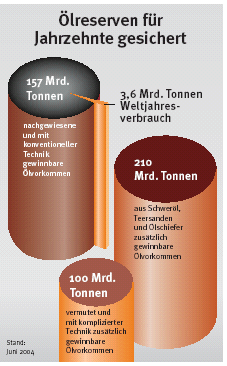

[🠔 Zur Übersicht: Medienmanipulation 1](7thu03.md)  
# Ökoterrorismus - Energie ohne Ende?
**Eine kritische Auseinandersetzung mit der Annahme, dass Ölreserven bald erschöpft seien. Erklärt die statistische Berechnung der 'Ölreichweite' und argumentiert gegen die These vom bevorstehenden Ende des Erdölzeitalters.**  
_von Konrad Fischer_

Aus dem [Brennstoffspiegel ](http://www.brennstoffspiegel.de/)8/04: 

"Woher kommt die weit verbreitete Annahme, in 48 Jahren sei kein Öl mehr vorhanden? Ausschlaggebend für dieses Missverständnis, so (Esso-Sprecher) Schult-Bornemann, sei das Wort "Ölreichweite", bei dem man gleich an Tankreichweite denkt, an ein festes Tankvolumen, das man durch den Verbrauch seines Autos teilen kann und weiß, wie weit man mit einer Tankfüllung kommt. Eine solche Übertragung der Vorstellung des Autotanks auf die Öl- oder Gasreserven sei jedoch falsch. "Es handelt sich bei der Ölreichweite um eine ganz spezielle Stichtagsbetrachtung, der eine statische und keine dynamische Betrachtung zugrunde liegt." Sie berücksichtigt keinerlei technischen Fortschritt und ist daher äußerst prognosefeindlich.

Bei dieser Stichtagsbetrachtung werden am Ende eines Jahres die sicher bestätigten Reserven durch den Verbrauch dieses Jahres geteilt. Für das Jahr 2003 lautet die Rechnung also 172 Mrd. t geteilt durch die 3.609 Mio. t. Daraus ergibt sich die Zahl 47,6.

Seit Jahrzehnten sind die sicher bestätigten Ölreserven ständig gestiegen. Im Jahr 1940 betrugen sie sechs Mrd. t und ihre Reichweite 21 Jahre. 1960 - 21 Jahre später - waren die sicher bestätigten Reserven auf das fünffache, nämlich 41 Mrd. t.gestiegen, und die Reichweite hatte sich auf 38 Jahre verlängert, obwohl der jährliche Verbrauch erheblich zugenommen hatte. Heute entsprechen die sicher bestätigten Reserven trotz weiterer Verbrauchs-Steigerung mit 172 Mrd. t rund 48 Jahre. Die Reichweitendefinition wurde von den US-Banken entwickelt, die nur einen Kredit an Ölfördergesellschaften gaben, wenn diese drei Voraussetzungen erfüllten. (Kasten) Das war ein verhältnismäßig sicheres Geschäft. Waren die Ölmengen bereits durch Bohrungen bestätigt, brauchte man nur noch die Zuflussrate mit dem aktuellen Ölpreis zu multiplizieren, um eine einigermaßen sichere Abschätzung für das zukünftige Geschäft zu machen. 1978 ist diese Definition von der amerikanischen Börsenaufsicht, der SEC, aufgenommen worden, um die Anleger zu schützen.

Fazit von Schult-Bornemann: "So ist es eine sichere Voraussage, dass weder wir, unsere Enkel, noch deren Enkel das Ende des Öls erleben werden. Vielmehr wird das Ölzeitalter nicht aus Mangel an Öl zu Ende gehen, genauso wie die Steinzeit nicht aus Mangel an Steinen zu Ende ging, sondern weil es andere Formen der Energiebereitstellung geben wird." 

 KASTEN 

Wissensecke: **Sicher bestätigte Reserven**

Der Begriff gilt für Öl, Gas, Kohle, Uran und viele andere Rohstoffe.

Zu den sicher bestätigten Reserven zählen nach SEC-Definiton in verkürzter Form nur die Mengen, die unter heutigen wirtschaftlichen und technischen Bedingungen mit "vernünftiger Sicherheit" gewonnen werden können.

Das heißt: 
- durch Bohrungen bestätigt, 
- mit heutiger Technik förderbar 
- bei heutigen Preisen wirtschaftlich gewinnbar sind. 

Schon eine oberflächliche Betrachtung dieser sehr einschränkenden Definitionskriterien zeigt, dass man damit nur einen kleinen Teil der tatsächlich vorhandenen Reserven erfasst, die um ein Vielfaches größer sind als die sicher bestätigten Reserven.

Quelle: ExxonMobil Central Europ 

- Ende des Zitats, an dem man die Besorgtheit um den angegriffenen Geisteszustand unserer Ökopolitiker gut nachvollziehen kann. Danke, Herr Schult-Bornemann.

Und hier noch obendrauf die aktuelle Reichweitengrafik von [IWO Austria](http://www.iwo-austria.at/):

---

Und was wirklich alle wissen: 

Verantwortungs-Reichweite Politiker 
- seit eh und jeh: Net länger, als wie die eigene Nas kurz und die Hosentasch tief ist (Anonymus)

und die Abzock-Reichweite? Bitte selbst beantworten.

[weiter ...](7thu10.md)
