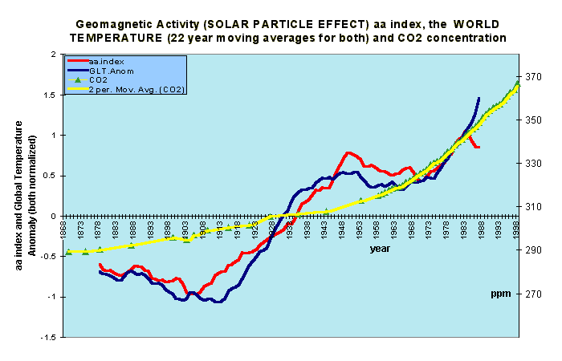

[🠔 Zur Übersicht: Klima](7thuene1.md)  
# Vergebliche Liebesmüh besorgter Bürger aus dem Ökowiderstand 1
**Ein offener Brief an den UNO- Generalsekretär bezeichnet die Bemühungen den globalen Klimawandel zu verhindern als sinnlos und Verschwendung von Ressourcen, die für die Lösung der tatsächlichen und dringenden Probleme der Menschheit besser genutzt werden könnten.**  
_von Konrad Fischer • aktualisiert 25.11.2008_

## KLIMAFAKTEN UND KLIMALÜGEN 11

## Zum Ökoterrorismus durch Energiesparzwang und Klimaschutzerpressung

(aktualisiert 25.11.08) 

> [!abstract]+ Kapitelübersicht: Ökowiderstand 1  
> 1. **Vergebliche Liebesmüh besorgter Bürger aus dem Ökowiderstand 1**
> 2. [12 Ökoterrorismus - Vergebliche Liebesmüh besorgter Bürger aus dem Ökowiderstand 2](7thu12.md)
> 3. [13 Ökoterrorismus - Vergebliche Liebesmüh besorgter Bürger aus dem Ökowiderstand 3](7thu13.md)
> 4. [14 Ökoterrorismus - Vergebliche Liebesmüh besorgter Bürger aus dem Ökowiderstand 4](7thu14.md)
> 5. [15 Ökoterrorismus - Vergebliche Liebesmüh besorgter Bürger aus dem Ökowiderstand 5](7thu15.md)
> 6. [16 Ökoterrorismus - Vergebliche Liebesmüh besorgter Bürger aus dem Ökowiderstand 6](7thu16.md)
> 7. [17 Ökoterrorismus - Vergebliche Liebesmüh besorgter Bürger aus dem Ökowiderstand 7](7thu17.md)
> 8. [18 Ökoterrorismus - Vergebliche Liebesmüh besorgter Bürger aus dem Widerstand gegen die totale Machtergreifung der Ökofaschisten 8](7thu18.md)
> 9. [19 Ökoterrorismus - Vergebliche Liebesmüh besorgter Bürger aus dem Ökowiderstand 9](7thu19.md)
> 10. [20 Ökoterrorismus - Vergebliche Liebesmüh besorgter Bürger aus dem Ökowiderstand 10](7thu20.md)
> 11. [21 Ökoterrorismus - Vergebliche Liebesmüh besorgter Bürger aus dem Ökowiderstand 11](7thu21.md)
> 12. [22 Ökoterrorismus - Vergebliche Liebesmüh besorgter Bürger aus dem Ökowiderstand 12](7thu22.md)
> 13. [23 Ökoterrorismus - Vergebliche Liebesmüh besorgter Bürger aus dem Ökowiderstand 13](7thu23.md)
> 14. [Ökoterrorismus - Vergebliche Liebesmüh besorgter Bürger aus dem Ökowiderstand 14](7thu24.md)
> 15. [25 Ökoterrorismus - Vergebliche Liebesmüh besorgter Bürger aus dem Ökowiderstand 15](7thu25.md)
> 16. [26 Ökoterrorismus - Vergebliche Liebesmüh besorgter Bürger aus dem Ökowiderstand 16](7thu26.md)
> 17. [Ökoterrorismus 27 - Vergebliche Liebesmüh besorgter Bürger aus dem Ökowiderstand 17 - Silvan Bätzner und Christian Bartsch gegen den Klimaschutzschwindel](7thu27.md)
> 18. [28 Ecoterrorism - The Eco-Resistance 18](7thu28.md)
> 19. [29 Ökoterrorismus - Vergebliche Liebesmüh besorgter Bürger aus dem Ökowiderstand 19](7thu29.md)
> 20. [30 Ökoterrorismus - Vergebliche Liebesmüh besorgter Bürger aus dem Ökowiderstand 20](7thu30.md)
> 21. [31 Ökoterrorismus - Vergebliche Liebesmüh besorgter Bürger aus dem Ökowiderstand 21](7thu31.md)
> 22. [32 Ökoterrorismus - Freche Leserbriefe aus dem Ökowiderstand gegen die Klimalügen 22](7thu32.md)
> 23. [33 Ökoterrorismus - Vergebliche Liebesmüh besorgter Bürger aus dem Ökowiderstand 23](7thu33.md)
> 24. [34 Ökoterrorismus - Vergebliche Liebesmüh besorgter Bürger aus dem Ökowiderstand 24](7thu34.md)
> 25. [Besorgte Bürger aus dem in- und ausländischen Ökowiderstand 25](7thu35.md)
> 26. [36 Ökoterrorismus - Vergebliche Liebesmüh besorgter Bürger aus dem Ökowiderstand 26](7thu36.md)
> 27. [37 Ökoterrorismus - Vergebliche Liebesmüh besorgter Bürger aus dem Ökowiderstand 27](7thu37.md)
> 28. [38 Ökoterrorismus - Vergebliche Liebesmüh besorgter Bürger aus dem Ökowiderstand 28](7thu38.md)
> 29. [39 Ökoterrorismus - Vergebliche Liebesmüh besorgter Bürger aus dem Ökowiderstand 29](7thu39.md)

---

11 Ökoterrorismus - Vergebliche Liebesmüh besorgter Bürger aus dem Ökowiderstand 1

### _Mit der Bitte um Beachtung: Nachrichtenredakteure, Reporter der Politik, Wissenschaft und Umwelt_

### Veröffentlichung für die Medien

### Grundsätze der Bali Klimakonferenz durch führende Experten missbilligt

#### [UNO Klimakonferenz über den Klimawandel beruht auf fehlerhafter Wissenschaft und Ökonomie](http://www.nrsp.com/releases/release-07.12.14-german.html) 

**_Bali, Indonesien und Ottawa, 14. Dezember 2007_** – Ein [offener Brief](http://www.nrsp.com/articles/07.12.13-open letter-german.html) an den UNO- Generalsekretär bezeichnet die Bemühungen den globalen Klimawandel zu verhindern als sinnlos und Verschwendung von Ressourcen, die für die Lösung der tatsächlichen und dringenden Probleme der Menschheit besser genutzt werden könnten.

[Unterstützt durch mehr als XX unabhängige Wissenschaftler, Ingenieure und Wirtschaftswissenschaftler](http://www.nrsp.com/articles/07.12.13-open letter signatories-independent experts.html), die auf dem Gebiet des Klimawandels arbeiten, ruft der offene Brief die führenden Staatsmänner der Welt auf, das Ziel den Klimawandel zu stoppen aufzugeben und statt dessen sich darauf zu konzentrieren, den Nationen behilflich zu sein, durch Förderung eines umweltverträglichen wirtschaftlichen Wachstums die natürlichen Veränderungen auffangen zu können.

Zu den Unterzeichnern des Briefs gehören viele hervorragende, kompetente Personen, die in nationalen und internationalen Gremien der Wissenschaft, Politik und Universitäten führende Positionen einnehmen und als Mitglieder in renommierte Wissenschaftsakademien gewählt wurden oder angesehene wissenschaftliche Auszeichnungen errungen haben.

Diese Unterstützer stellen mit Nachdruck fest, dass die Berichte des Intergovernmental Panel on Climate Change (IPCC) der UNO eine „unzureichende“ Grundlage für politische Entscheidungen darstellen, welche den zukünftigen Wohlstand deutlich vermindern werden. Die IPCC- Berichte repräsentieren nicht die neuesten begutachteten Forschungsergebnisse der Klimawissenschaft. Diese Entdeckungen lassen erhebliche Zweifel an der immer unwahrscheinlicheren Hypothese aufkommen, dass durch Menschen emittiertes Kohlenstoffdioxid (CO2) eine signifikante Auswirkung auf das globale Klima hat.

Die Verfasser des offenen Briefes gehen detailliert auf einige der gravierenden wissenschaftlichen Fehlinterpretationen in der Zusammenfassung für Politiker des IPCC ein, machen auf einige überholte Schlussfolgerungen des IPCC aufmerksam und stellen fest, dass Schlussfolgerungen aus ausgewogenen ökonomischen Analysen keine Maßnahmen unterstützen, den Energieverbrauch einzuschränken, mit dem Ziel, die CO2-Emissionen zu senken. Da der Versuch die CO2-Emissionen drastisch zu vermindern die Entwicklung verlangsamen wird, verdeutlichen die Unterzeichner weiterhin, dass der gegenwärtige Ansatz der UNO die CO2-Emissionen zu drosseln die Belastungen der Menschheit durch den künftigen Klimawandel eher vergrößern wird als sie zu mildern. 

Für mehr Informationen oder zur Absprache von Interviews mit einem der Unterzeichner des offenen Briefes nehmen Sie bitte Kontakt auf:

**In Bali, Indonesien mit:**

**Bryan Leyland** MSc, FIEE, FIMechE, FIPENZ, MRSNZ 
Inna Putri Bali Hotel ph: 361.771.020 Room 4011 
**Phone:** +64.21.978.996 
**Email:** [bryanleyland@mac.com](mailto:bryanleyland@mac.com)

or

**Christopher Viscount Monckton** 
Jamahal Resort ph: 361.704.394 
**Phone:** +44.7980.634784 
**Email:** [Monckton@mail.com](mailto:Monckton@mail.com) 

**In Canada:**

**Tom Harris** , B. Eng., M. Eng. 
Executive Director, NRSP 
P.O. Box 23013 
Ottawa, Ontario K2A 4E2 
**Phone:** 613-234-4487 
**e-mail:** [tom.harris@nrsp.com](mailto:tom.harris@nrsp.com)

Web: <http://www.nrsp.com/people-tom-harris.html>

or

**Timothy F. Ball** , PhD 
Chairman, NRSP 
**Phone:** 250-380-7784 
Fax: 250-380-7776 
**e-mail:** [timothyball@shaw.ca](mailto:timothyball@shaw.ca)

Web: <http://www.nrsp.com/people-timothy-ball.html> 

**In Australia:**

**Bob Carter** , PhD 
Marine Geophysical Laboratory, James Cook University, Townsville 
**Phone:** +61-(0)419-701-139 
**Email:** [bob.carter@jcu.edu.au](mailto:bob.carter@jcu.edu.au) 

---

Als besorgter Bürger nehme auch ich natürlich meine Bürgerpflicht sehr ernst, unsere Volksvertreter und Machthaber auf deren Irrtümer und verbrecherischen Klimaschwindel hinzuweisen. Beispiel:

---

Architektur-&Ing.büro Konrad Fischer Hauptstr.50 D-96272 Hochstadt/Main 
Altbau & Denkmalpflege Informationen: [http://www.konrad-fischer-info.de](index.md) 
Mail am 15.12.03 12:00 an: 

Minister Hans-Heinrich Sander 
Umweltministerium Niedersachsen 
Hans-Heinrich.Sander@mu.niedersachsen.de 

Sehr geehrter Herr Minister, 

der Hannoverschen Wirtschaftszeitung, Januar 2004, S. 12, entnehme ich Ihre Unterstützung der "Initiative Energetische Gebäudemodernisierung", ganz im Sinne des jüngsten Langeschen Klimakatastrophismus in der HAZ. 

Als Altbau-Architekt, Tagungsreferent auch an der Niedersächsischen Architektenkammer und in Bayern zugel. EnEV-Sachverständiger gem § 2 ZVEnEV darf ich Ihnen zu diesem Geschäft mit der Angst folgende Information zukommen lassen:

1. Die in der EnEV vorgesehenen Maßnahmen an Gebäuden sind technisch nicht geeignet, Energie zu sparen. Praxisergebnisse belegen, daß durch Dämmen und Dichten keine Energie gespart, sondern geradezu verschleudert wird. Die [bekanntesten Belege dafür hier](7fehrtab.md).

Alles seit langem publiziert u.a. in Nationalkomitee Denkmalschutz: ["Energieeinsparung an Baudenkmälern" - Tagungsband der Fachtagung 02 im Haus der Geschichte, Bonn](8buch.md#baudenk), und Verband der Bausachverständigen Norddeutschlands: ["VBN- Info Sonderheft: Topthema Wärme Energie"](8buch.md#vbn-info) - Tagungsband einer Sachverständigen-Tagung am 14.12.02 im Kongreßzentrum Hannover. 

Skandalös zumindestens für uns Tierfreunde auch die zigtausend toten Tiere, die in niedersächsischen - normgerecht fehlkonstruierten - Leichtbau-Ställen in sommerlichen Hitzewellen verreckten (Oldenburger Land, Ihr dortiges Veterinäramt weiß Bescheid). Den ebenso begründeten mangelhaften Fleischzuwachs und die reduzierte Milchleistung im Winter könnte man ja angesichts der Fleischberge und Milchseen noch hinnehmen. 

Die HAZ aber verhöhnt die menschlichen Hitzeopfer in brütend heißen Wohnbaracken als "Klimawandelopfer" (12.12.03) sogar auf Seite 1. Medien heute. Wobei im vergangenen Sommer die Klimagerätehersteller den Bedarf in diesen sog. Passiv- und Niedrigenergiehäusern kaum decken konnten. Das spart also Energie, wenn überall die Klimatruhen brummen! 

Schauen Sie sich mal Ihre gefloppte Expo-Energiesparsiedlung Hannover an und fragen Sie dort nach dem tatsächlichen Energiebedarf in den Vorzeige-Brut-Kästen (Sommer) bzw. -Kühltruhen (Winter). 

Die von Stoiber zur Eröffnung umjubelte Glasbude "[Staatl. Umweltschutzamt Augsburg](7wsvoant.md#aecht baierischer grusel)" mußte nach einem durchgefrorenen Winter (die armen Umweltbeamten!) sogar die wg. erlogener Energieeinsparung unterdimensionierte Rapsölheizung rausreißen und sich an die städtische Fernheizung anschließen. Der Graben dazu war fast ein Kilometer lang, da hat Augsburg und unser oberster Rechnungshof aber gelacht! Schon der extreme Schimmelbefall im neuen Bundesumweltamt war eine solche Humorattacke. Seitdem gibt deren Chef Schimmelleitfäden heraus.

2. Die auch von der "Initiative Energetische Gebäudemodernisierung" geforderte blowerdoorgestützte Gebäudeabdichtung erzeugt in der Praxis feuchte und schimmelige Wohnungen. Inzwischen sind ca. 50 % des deutschen Wohnungsbestandes schimmelverseucht und Deutschland Weltmeister bei der Sterblichkeit asthmatischer Kinder. [Prof. Martin Schata publiziert seit langem gegen diesen Skandal](enev.md) - leider ohne Ergebnis. Die Politik will es offenbar so - auch Ihre?

3. Sogar der Austausch "veralteter" Heizungen ist ein völlig unsinniges Unterfangen. Es wird nämlich nicht auf deren Abgaswerte geschaut, sondern nur auf das Baujahr. Viele "alte" Heizungen liefern geradezu perfekte Abgaswerte - und müssen dennoch ausgetauscht werden. Das soll Energie sparen? Skandalös!

Fazit: Die von der "Initiative Energetische Gebäudemodernisierung" propagierten Maßnahmen sind samt und sonders ein Anschlag interessierter Kreise auf unsere Volkswirtschaft und -gesundheit. Für die Umwelt bringt das gar nichts. Die Wohnungswirtschaft zerstört damit ihren Bestand und vergeudet die ohnehin viel zu knappen Investitionsmittel. Oft müssen die unausweichlich [veralgten nassen Dämmfassaden](213baust.md) schon nach Jahresfrist heruntergerissen werden (Neue Messe München, Bundeswehrhochschule Neuherberg usw. usf.), man diskutiert branchenintern nach der wirksamsten Vegiftungszutat (Euphemismus: Fungizid, Algizid) für Dämmfassaden.

Allein der hierfür gebetsmühlenartig bemühte "Klimaschutz" zeigt, daß es nur um den größtanzunehmenden Blödsinn gehen kann: "Klima" ist nämlich nur eine statistische Größe über die Wetterereignisse der letzten Jahrzehnte. Das Globalklima als Leipziger Allerlei aus ein bißchen Tropen, etwas Südpol und DWD-Station Hannover. Das will vom Minister Sander geschützt werden? Als Mensch auf das Wetter Einfluß zu nehmen - da können wir gleich den multikulturellsten Medizinmann aus dem finstersten Busch bemühen. Der integriert sich bestimmt auch bei Ihnen um die Ecke gerade in unsere postindustrielle Ökokultur, wenn er nicht gerade Schlafmohnprodukte aus kontrolliertem Anbau (an Pisaopfer und ehemalige Zentralräte? ;-)) verhökert. Ist hirnverspottender Schamanismus die aktuelle Politik, auch unsere Umweltpolitik im Heilschlaf weggenippelt?

Für "Klimaschutz" den Popanz CO2-Minimierung (vgl. anliegende Spiegel-Grafik und meinen [Bericht von der Klimatagung Banz](7thu55.md) mit Ihrem Klimawissenschaftler Dr. Berner) zu bemühen, zeigt, daß man in der Regierung Niedersachsens die wissenschaftlich bestens abgstützten Forschungsergebnisse des eigenen (!) staatl. Geozentrums Hannover nicht kennt: 

Demnach ist CO2 ein Pflanzennährstoff und kein Klimakillergas (vgl.: Berner, Streif: "[Klimafakten](8buch22.md)", bald in 4. Auflage!). Der atmosphärische CO2-Gehalt folgt der Erwärmung und ist nicht deren Ursache! Wenn Sie zwischendurch mal Mineralwasser (geht auch bei Champagner und Prosecco) trinken würden, könnten Sie das im Selbstversuch auch herauskriegen und müßten nicht auf Klimascharlatane hören.

Ein Landwirtschafts- und Umweltminister sollte das alles freilich wissen, sonst wird er zumindest von allen seriösen Fachleuten ausgelacht. Es wäre interessant zu erfahren, welche Simpel in Ihrem Hause für derartige Informationsdefizite zuständig sind? Man fragt sich inzwischen, ob Sie vielleicht absichtsvoll hinters Licht geführt werden sollen? Heutzutage scheint ja alles möglich.

Bitte haken Sie nach. Lassen Sie sich solchen wissenschaftlichen, umwelt- und wirtschaftspolitischen Widersinn nicht weiter gefallen und helfen Sie den niedersächsischen Mietern, Nutztieren und Steuerzahlern, nicht den bau- und umweltpolitischen Scharlatanen, die unsere Naturliebe für ihren Schwindel mißbrauchen! 

Auch Ihre von der Massentierhaltung auf Stromfarmertum zuungunsten der Stromkunden umsattelnden Landwirte werden noch erfahren, wie sie politisch hinters Licht geführt wurden: wenn der Ökostromzwang wieder abgeschafft werden muß, weil ihn sich die Abgezockten nicht mehr gefallen lassen. Und die verhießenen Erträge sich wie bei Ihrer Vorzeige-Biogasanlage Wietzendorf in Luft auflösen und Genossenschaftskapital millionenschwer nachgeschossen werden muß. In Oberfranken hieß es jüngst: "Windpark Himmelreich fährt zur Hölle". Dank Insolvenz und mangels Wind. Da hat unser Umweltminister Schnappauf aber blöd geguckt. Bald auch sie?

Daß ausgerechnet die Energiemonopolisten das EEG dazu mißbrauchen, möglichst viel unsteten "Ökostrom" in ihr Netz zu pressen und damit den Basistrombedarf reduzieren um möglichst viel teuren, dem Wettbewerb nicht zugänglichen Regelstrom zu verkaufen, dürfte Ihnen ja bekannt sein. 

Die Liberalisierungsbemühungen zugunsten der Verbraucher werden damit in gemeinster Weise torpediert! Und dann bemühen die EVUs die selbst organisierte Ökostromeinzwängung für Preiserhöhungsrunden! Auch hier sollte man sich gerade als Umweltminister fragen, ob diese schäbigen Marketingtricks der Atomindustrie mit angeblicher "Ökoenergieförderung", in Wahrheit grob fahrlässiger Umweltzerstörung bis ins letzte Naturschutzgebiet hinein (Offshore-WKA im Wattenmeer, bei uns der fränkische Jura, die Haßberge, der Frankenwald und das Fichtelgebirge!!), weiter politisch gestützt werden sollten? Was, wenn das der hintergangene Wähler herausbekommt?

All das erinnert leider an die Abgründe bayerischer Umweltpolitik Schnappaufscher Prägung. Wir vergeuden unsere staatlichen Tafelsilbereinnahmen für Ökowahn. Wohin soll das alles führen, wem werden hier außer den Industrie-Monopolen die Taschen gefüllt? Wieviele Kaminfeuerrunden mußten die dafür investieren?

Mit besorgtem Gruß

Dipl.-Ing. Univ. Konrad Fischer Architekt BYAK 
Mitglied im Bund Naturschutz seit 1979

Verteiler: Energiefachleute und Medien (Schilder@fdp.de, giersch@fdp-bundestag.de, haz@madsack.de, Felmberg@hawezet.de, staffelstein@obermain.de, friedrich.merz@cdu.de, buero@axel-e-fischer.de, angela.merkel@cdu.de, christian.wulff@stk.niedersachsen.de, r.koch@ltg.hessen.de, schulze@cdu-niedersachsen.de, peter.gauweiler@bundestag.de, thomas.goppel@csu-landsberg.de, karl-theodor.guttenberg@bundestag.de, michael.glos@bundestag.de, G.Gerlich@tu-bs.de, Jens-Peter.Fehrenberg@fh-hildesheim.de, h.streif@bgr.de, ulrich.berner@bgr.de, Wolfgang.Thuene@muf.rlp.de, wolfgang.mauersberg@haz.de, dieterkraemer@t-online.de, Ufer-L@t-online.de, egbeck@t-online.de, hanna.thiele@web.de, hd@dmd-sc.de, j.schmidt-winsen@t-online.de, owildgruber@surfeu.de, helmut.alt@rwe.com, Uloebert2@aol.com, FSWEMedien@aol.com, Wilfried.Heck@freenet.de, neuhoefer@gdw.de, volker.friedrich@np-coburg.de, bayern@rnt.tmt.de)

Nachtrag - eine Grafik des Klimaforschers Piers Corbyn, GB ([www.weatheraction.com](http://www.weatheraction.com)) zur solarinduzierten und CO2-unabhängigen Temperaturentwicklung auf der Erde - Bestätigung der Spiegelgrafik:

Soweit die Mail. Resonanz? Keine. Offenbar weiß Minister Sander, der inzwischen allen Ernstes geförderten Windkraftbau in allen deutschen Naturschutzgebieten zu Wasser und zu Land fordert, wem er wirklich dient. Er liest nämlich ein Hamburger Blatt - 

DER SPIEGEL 44/1991 (!!!), Titelstory:

Titelblatt: 

_**"Mit Atomstrom aus der Klimakatastrophe? 
**Die 
Kernkraft-Lüge"_

und dann S. 50 ff:

**_""Phönix aus der Asche"_**

_Noch sind der Beinahe-Gau von Harrisburg und die Katastrophe von Tschernobyl nicht vergessen. Dennoch glauben die Reaktorhersteller und Stromlieferanten an einen "atomaren Frühling". Mit neuen Kernkraftwerken - so ihre These - könne der Treibhauseffekt, die Klimakatastrophe für den Planeten, verhindert oder eingedämmt werden."_

Lapidar, wie es ihnen die Werbetexter zurechtgestanzt haben, kümmern sich Deutschlands Stromlieferanten um das Wohl der Menschheit:.

_""Auf der Erde wird es immer wärmer", heißt es in einer Anzeige der deutschen Energieerzeuger. "Die Wüsten breiten sich aus, Eisberge schmelzen, der Meeresspiegel steigt." "Handeln" heiße das Gebot der Stunde, "damit die Erde nicht zum Treibhaus wird". Und dann verraten Badenwerk und Bayernwerk, PreussenElektra und RWE, wie das gehen soll: "Kernkraft produziert kein CO2." [...]"_

Und dann geht es spiegelmäßig zur Sache: die Motive, die handelnden Scharlatane der Wissenschaft, die Profis der Kernkraftbetreiber - alle Namen, alles, alles. Die Krönung der atommanipulierten Klima-Spökenkiekerei:

_"[...] Doch vor allem anderen zielt die "Neubewertung" der Kernenergie nunmehr auf das Schreckgespenst der drohenden Klimakatastrophe: wenn es für das Wohlergehen des Planeten Erde nötig sei, den Kohlendioxid (CO ²)-Gehalt in der Atmosphäre zu senken, dann gehe das keinesfalls ohne Zuhilfenahme der Kernenergie [...]."_

Wieviel wohldotierte Kaminfeuerrunden haben die Führer der Grünen, der einfaltsgepinselten Naturromantiker, die ganze Pest der Ökos wohl verinnerlicht, um dem tumben Volk die Atom-Klima-Rettung und den (immer vergeblichen!) Kampf gegen das völlig ungefährliche CO2 als echten Klimaschutz zu verkaufen? Dolles Marketing der "Werbetexter" oder gaaanz viele strahlende Märker/Euros, eben business as usual? Klar, daß mit so viel Geld auch eine parteiübergreifende Weltrettungsgemeinschaft jede Bürgerkritik abklatscht.

Ja ÖKOs, wie kann man nur ausgerechnet darauf reinfallen, was sich unsere Atomlobby im Hinter- und Oberstübchen ausgebrütet hat? Diesmal jedoch als langsame Brüter, oder wa?

Ob ein Machthaber immer mit Machtmißbrauch verheiratet sein muß? Oder darf diese Meldung uns eines Gegenteils belehren?

Aus Cellesche Zeitung 26.02.2004:

**_"Niedersächsischer Umweltminister gegen Windräder 
Hans-Heinrich Sander: "Trittin verdummt die Menschen"_**

_Der niedersächsische Umweltminister Hans-Heinrich Sander (FDP) plädierte in Hermannsburg/Kreis Celle, am Rande eines aus elf Anlagen bestehenden Windparks, für eine "wirtschaftliche Energiegewinnung", die aber "im Binnenland mit Windrädern" nicht zu erreichen sei._

_Das Argument, damit würden Arbeitsplätze geschaffen, wies Sander zurück. Das Gegenteil sei richtig. Er stellte lapidar fest: "Windenergie vernichtet Arbeitsplätze." Landschaftsästhetisch seien die rund 150 Meter hohen Windräder ohnehin inakzeptabel._

_Viele Politiker hätten sich nicht an Fakten orientiert, sondern aus einer bestimmten Ideologie heraus gehandelt. Wörtlich: "Trittin verdummt die Menschen mit seinen Aussagen zur Windenergie." "_

Auch eine aktuelle Studie (6/04) des RWI belegt den brutalen Irrsinn der Ökoenergie unmißverständlich: [Ausbau Erneuerbarer Energien kostet Arbeitsplätze](http://www.haustechnikdialog.de/artikel.asp?id=4148)

[weiter ...](7thu12.md)
