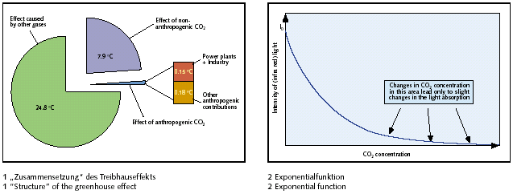

[🠔 Zur Übersicht: Ökowiderstand 1](7thu11.md)  
# 28 Ecoterrorism - The Eco-Resistance 18
**Editorial in ZKG INTERNATIONAL No. 7-2004. This article discusses the aim to achieve an atmospheric temperature reduction of 0.02 °C through CO2 discussions, questioning the effectiveness of such measures.**  
_von Silvan Baetzner_

28 Ecoterrorism - The Eco-Resistance 18

Editorial in ZKG INTERNATIONAL No. 7-2004 (Volume 57)

_"Dear Readers,_

_I wonder if you know that in present-day discussions on CO2, the aim is to achieve an atmospheric temperature reduction of 0.02 °C. You don't believe me? Then let's check the values together:_

_The total greenhouse effect, i.e. the temperature increase caused by the gases in the atmosphere relevant to the climate, is supposed to be 33 °C. It is assumed that CO2 contributes approximately 20 to 25 % to the greenhouse effect. The anthropogenic or "man-made" contribution to global CO2 emissions is approximately 3 up to 4 % (Fig. 1)._

_The true aim of the Kyoto-Protocol and the trade with "pollution rights" is a reduction of CO2-emissions. Let us assume optimistically that the requirement of 5 % (based on 1990) laid down in Kyoto for worldwide reduction of anthropogenic CO2 emissions is achieved. This would mean that the total global CO2-emissions would be reduced by 0.2 % and thus mathematically the greenhouse effect would be reduced by at the most 0.05 %, i.e. less than 0.02 °C._

_The contribution of power plants (in particular those fired with fossil fuel) to the anthropogenic CO2-emissions should be 25 %, that of industry 20 %. It follows that mathematically both contribute a total amount of 0.15 °C to the greenhouse effect._

_Now the objection could be raised that with these calculations a simplistic linear dependence is implied. The decrease in (infra red) light intensity as a result of absorption however is described as being due to an exponential function with negative exponent. This type of function approaches asymptotically the limiting value zero and does not change much with higher values (Fig. 2). Scientific investigations indicate that the absorbing effect of CO2 lies in an area, in which even distinct changes in the CO2 concentrations hardly have any effect on the infra red absorption. In plain English this means: consequently, neither a reduction nor an increase in CO2-concentrations will have a decisive impact on the greenhouse effect. The value of 0.02 °C temperature reduction calculated above due to "climate protection" is therefore much too optimistic._

_In a well-known daily newspaper, a short time ago it could be read that "To a large extent there is scientific agreement that measures for the reduction of carbon dioxide emissions must be taken against the threat of climate change". However, on researching into the literature, numerous contradictory scientific publications and many different calculation models can be found on the subject of world climate. There seems to be no sign of agreement on this topic. Common sense alone awakens justifiable doubts regarding the statements of those climate researchers, who prophesy the man-made climate collapse within a fairly short time, whilst in the same breath requesting financial support for their therefore extremely necessary research projects. There are also climate researchers such as Professor Tom Wigley, member of the "Intergovernmental Panel on Climate Change" IPCC, who has calculated a global temperature reduction of 0.07°C by the year 2050 for the case that the requirements given in the Kyoto Protocol should be achieved. The corresponds approximately to the order of magnitude of the values calculated by myself and lies under the"global" detection limit._

_The problem which industry has is that none of these arguments ever got a hearing from politicians. The train left the station a long time ago, the emissions trading is already a closed book. Now, the only thing to do is to at least influence the political decisions on the details, here in particular the national allocation plans, so that increased costs and loss of competitive strength are kept to an absolute minimum. However, through the allocation of "pollution rights", it will hardly be possible to prevent the "cementing" of present market relationships. In particular for the German cement industry, this has a grotesque and ironic aspect: On the one hand, there are still cartel charges to be dealt with and on the other hand the emissions trade will not result in anything other than classic cartel practice: Anyone who wishes to be better than the competition and to sell more (and therefore to produce more) will be punished. In future, this way of proceeding will make all cartel investigations superfluous, then based on the state regularization, forbidden agreements will in any case no longer be necessary._

_Sincerely yours 
Silvan Baetzner 
Editor-in-Chief"_

__
