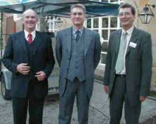
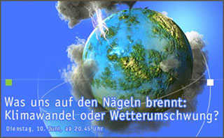
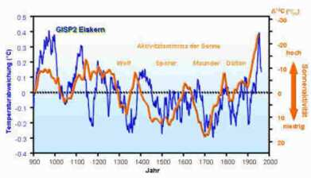

[🠔 Zur Übersicht: Klima](7thuene1.md)  
# 55 Dr.Ulrich Berner Bundesanstalt für Rohstoffe, BfR, Institut für Geowissenschaften: Wer ist schuld am Klimawandel? Gibt es eine menschengemachte Globale Erwärmung?
**Das Treibhaus Erde schwitzt im Hitzestau, Gletscher und Polkappen schmelzen, Elbehochwasser, der Kölner Dom versinkt im Meer, Rollenski im Fichtelgebirge, Kohlendioxidvergiftung der Erdpopulation - und an allem ist der Mensch schuld**  
_von Dr. Ulrich Berner • aktualisiert 28.10.2003_

## KLIMAFAKTEN UND KLIMALÜGEN 55

## Dr. Ulrich Berner, BGR Hannover:
Die wahren Klimafakten zum Treibhauseffekt und der Klimageschichte

### Alle Behauptungen der Bundesregierung und aller Parteien des Deutschen Bundestags zum Klimawandel und Klimaschutz - verbrecherischer Lug und Trug auf dem Weg in die ökofaschistische Klimadiktatur?

**Inhalt**

> [!abstract]+ Kapitelübersicht: Klimawandel 1  
> 1. **55 Dr.Ulrich Berner Bundesanstalt für Rohstoffe, BfR, Institut für Geowissenschaften: Wer ist schuld am Klimawandel? Gibt es eine menschengemachte Globale Erwärmung?**
> 2. [56 Ökoterrorismus - Wer ist schuld am Klimawandel? 2](7thu56.md)
> 3. [57 Ökoterrorismus - Wer ist schuld am Klimawandel? 3](7thu57.md)
> 4. [Ökoterrorismus: Klimaforscher im Zwielicht - Zum Beispiel: Der Bayreuther Klimaforscher Thomas Foken](7thu58.md)
> 5. [59 Ökoterrorismus - Wer ist schuld am Klimawandel? 5](7thu59.md)
> 6. [60 Ökoterrorismus - CO2-Emissions-Zertifikathandelsterror 1](7thu60.md)
> 7. [61 CO2-Emissions-Zertifikathandelsterror 2](7thu61.md)
> 8. [62 Ökoterrorismus - CO2-Emissions-Zertifikathandelsterror 3 - Die INFAS/FAQ-Bundestagsumfrage](7thu62.md)

**55 Ökoterrorismus - Wer ist schuld am Klimawandel? 1 

Wer ist schuld am Klimawandel? 
** Buderus/IWO-Tagung "Die Ölheizung der Zukunft" am 28.10.2003 in der Hanns-Seidel-Tagungsstätte Kloster Banz 

**Das Treibhaus Erde schwitzt im Hitzestau, Gletscher und Polkappen schmelzen, Elbehochwasser, der Kölner Dom versinkt im Meer, Rollenski im Fichtelgebirge, Kohlendioxidvergiftung der Erdpopulation - und an allem ist der Mensch schuld: Er verheizt zu viel Erdöl, fährt Auto, jettet in warme Länder und erzeugt dabei das Klimakillergas Kohlendioxid - CO2. Dichtes Dämmen der Neubauten, des Gebäudebestands, am besten auch der Baudenkmäler, ist als Beitrag der Hausbesitzer erforderlich, um an der Klimarettung mitzuwirken. Doch stimmt das wirklich? Zu diesem Thema hatten der Kulmbacher Heizungsbauer Buderus und das Hamburger Institut für wirtschaftliche Ölheizung IWO in den Kutschersaal von Kloster Banz eingeladen. Es sprach Klima-Experte Dr. Ulrich Berner vom staatlichen Geozentrum Hannover.**

Erdöl fristet derzeit gegenüber den angeblich sauberen "Ökoenergien" geradezu ein Schattendasein. Verunsicherte Hausbesitzer und auch manche der über 120 aus Franken und Thüringen angereisten Baufachleute - Architekten und Ingenieure, Heizungsbauer und Kaminkehrermeister,Fachschullehrer, Denkmalpfleger, Baubeamte aus Städten und Bezirksregierungen - fragen sich, ob man überhaupt noch mit Öl heizen soll? Hier war Aufklärung dringend geboten. Zum Beginn der Veranstaltung informierten Buderus und IWO deshalb zu Brenn- und Heizwert, zur Schadstofffracht im Abgas und Wirtschaftlichkeit im Vergleich, über [energiesparende Heiztechnik](7temper.md) als Alternative zur [energievergeudenden Dämmung](213baust.md), über umweltfreundliche Ölsorten bis zum schwefelarmen Premiumöl. Fazit: Die Ölheizung kann im Wettbewerb mithalten, sie ist und bleibt auch zukünftig eine glaubwürdige und vor allem sehr wirtschaftliche Alternative. Ein nur Wasserdampf abpustender Ölheizkessel im Klosterhof konnte das auch praktisch vorführen - nahezu geräuschlos. Dass der Gesetzgeber neuerdings den Austausch älterer Heizkessel trotz bester Verbrauchs- und Abgaswerte forderte, löste allerdings Erstaunen aus. Gut, dass Buderus über Ausnahmeregelungen berichten konnte, die ja auch [für die unwirtschaftliche Dämmverpackung](11form.md#enevantrag) unserer Häuser bestehen.

 
_Vor dem abgasarmen Ölheizkessel (v.l.): Dipl.-Ing. Franz Brandner, IWO, Dr. Ulrich Berner, Geozentrum, Dipl.-Ing. (FH) Alois Denninger, Buderus (Foto: Fischer)_

Klimafakten statt Klimalügen

Der Klimawissenschaftler Dr. Ulrich Berner, international bekannt als Mitherausgeber und Autor der bald in vierter Auflage erscheinenden "[Klimafakten](8buch22.md#klimafakten)", startete seinen Vortrag als "Kontrastprogramm zum normalen Medienangebot". Das war nicht zu viel versprochen! Die Geoarchive der Meeresböden, Eis- und Erdschichten liefern in Verbindung mit tierischen und pflanzlichen Ablagerungen die jahresgenaue Rekonstruktion des Erdklimas teils über 500 Millionen Jahre zurück. Das Geozentrum Hannover, eine Bundesbehörde, wertet das in wissenschaftlicher Fleißarbeit aus, um die künftige Versorgungssicherheit mit Rohstoffen, aber auch die globale Klima-Entwicklung sachgerecht zu beurteilen. 

Was die exakte Schichtenanalyse hier herausgefunden hat, klang manchen Zuhörern geradezu abenteuerlich: Schon immer fährt das Klima "Achterbahn", wechseln Eis- mit Heißzeiten. Wir befinden uns momentan in der Warmphase einer Eiszeit, wobei in Eiszeiten die Polkappen vereist sind, in Heißzeiten eben nicht. So waren in den zurückliegenden 10.000 Jahren die Alpengipfel öfters gletscherfrei, der Weinbau florierte auch in Norwegen und Grönland. 

Ausgerechnet die wärmsten Erdperioden wiesen dabei die niedrigsten CO2-Werte auf. Dabeifolgte der CO2-Gehalt der Atmosphäre immer deren Erwärmung und konnte sie dadurch eben nicht verursachen. Auch heute bietet das Kohlendioxid mit nur 0,03 Prozentanteil an der Atmosphäre keinen Anlaß zur Besorgnis: die Temperaturentwicklung ist davon unabhängig (Grafik 1); viel eher wirken Wolken als wärmende Decke über dem Erdboden. Menschliche Aktivitäten liefern ohnehin nur 1,2 Prozent zum natürlichen CO2-Ausstoß, und das überwiegend von den Brandrodungsregionen der Tropen, nicht aus der modernen Industriegesellschaft Mitteleuropas. 

Das menschengemachte Treibhaus ist also eine wissenschaftlich nicht belegbare Fiktion. Die Sonne verursachte das mittelalterliche Klimaoptimum von 900 bis 1100 und die kleine Eiszeit ab 1350 bis 1850 - der Mensch mußte sich anpassen. Dabei wird es bleiben. 

Damit stimmt Dr. Ulrich Berner überein mit dem früheren ZDF-Meteorologen und Teilnehmer des arte-Klimawahn-Themenabends am 10. Juni 2003, Dr. Wolfgang Thüne, Ministerialrat im Mainzer Umweltministerium. 

 
_(Grafik: arte, von_[Sonnenseite-TV-TIPP: "Klimawandel oder Wetterumschwung?"](http://www.sonnenseite.com/fp/archiv/Akt-News/3438.php) _) 
_[arte Themenabend: Klimawandel?](http://www.zdf.de/ZDFde/einzelsendung/0,1970,2142574,00.html) 
[arte Themenabend Klimawandel? Kurze Inhaltsangabe](http://www.lls-nds.de/Klimapolitik.pdf) (pdf) 
[arte Themenabend Klimawandel? - Übersicht](http://www.zdf.de/ZDFde/programmuebersicht/0,2060,03_06_10-3-6,00.html) 
[Neue OZ online zu arte Themenabend: ,,Manipulation auf allen Seiten"](http://www.neue-oz.de/_archiv/noz_print/medien/2003/06/klima.html)

Dr. Berners Moderation wurde dann zwei Tage vor dem Sendetermin überraschend herausgeschnitten ...

 
_Klimafakten 900 n. Chr. bis heute: Kohlendioxid (orange) und Temperaturkurven (grün+violett) verlaufen unabhängig voneinander 
(Quelle: Geozentrum, Bildbearbeitung Fischer)_

Die Sonne als Klimamotor

Was treibt das ständig schwankende Globalklima nun wirklich an? Es ist die Sonne! Ihre heißen Gasausbrüche regeln die kosmische Strahlung und damit die Bildung von Kohlenstoff-Isotopen (C 14) im Geoarchiv der Erde. Deshalb kann die Solaraktivität mit der Temperaturentwicklung über lange Zeiträume verglichen werden. Und siehe da: Die Solaraktivität steht in eindeutiger Verbindung mit der Globaltemperatur (Grafik 2). Nimmt man noch die Vulkanausbrüche hinzu, gelingt die Korrespondenz nahezu 1:1. 

Im Klartext: Der Mensch beeinflußte das Globalklima nie, und dabei wird es bleiben. 

 
_Klimafakten 900 n. Chr. bis heute: Die Sonnenaktivität (orange) beeinflußt die Temperaturkurve (blau) 
(Quelle: Geozentrum, Bildbearbeitung Fischer)_

Dank der [Versorgungssicherheit mit herkömmlicher Energie](8buch22.md#gold) - allein die derzeit erschlossenen, leicht und preisgünstig erreichbaren Quellen reichen über mehrere Jahrhunderte - darf er also auch künftig Öl verbrauchen. Natürlich mit Augenmaß und möglichst energiesparend, das gebietet schon das allgemein und auch für Dr. Berner verbindliche Gebot der Nachhaltigkeit. 

Und Kioto/Kyoto?

"Was sollen nun die im Kiotoprotokoll/Kyotoprotokoll vorgesehenen Klimaschutzmaßnahmen?" fragte ein verblüffter Teilnehmer. Ihre Nutzlosigkeit bewies der Referent an einigen Beispielsimulationen. Bleibt ihre Wirkung als Bürgerabzocke und Standortschädigung. Der Bundesbeamte Dr. Ulrich Berner nimmt natürlich an, daß die Politik auch das nicht weiß. Alles nur falsche Wissenschaftsgläubigkeit? Der als TV-Treibhauskassandra bekannte Klimawissenschaftler Mojib Latif wurde im staatlichen Beratergremium jüngst gegen Dr. Berner ausgetauscht. 

Clements Forderung nach Rücknahme der Ökovergünstigungen für Sonne und Wind scheint also gut begründet zu sein. Wird es auch die teuren Biomasseheizungen treffen? 

Reicher Beifall des übervollen Saales belohnte die Ausführungen des Referenten, aber auch die Organisatoren Buderus und IWO. Mehr Fakten und Aufklärung zum Klimaschutz waren hierzulande noch nicht geboten - gut, daß diese Veranstaltung durch ganz Bayern touren darf. Und unsere Baudenkmale? Die lassen wir betreffend Klimaschutz am besten in Ruhe: sie schützen uns und das Klima nämlich besser als jede neue Pappendeckelbude.

Weitere Infos: [www.iwo.de](http://www.iwo.de) [www.bgr.de](http://www.bgr.de) [www.heiztechnik-buderus.de](http://www.heiztechnik-buderus.de) 
Vortrag Dr. Ulrich Berner - auf Anfrage bei [IWO](http://www.iwo.de) 
Ulrich Berner, Hansjörg Streif: ["Klimafakten, Der Rückblick - ein Schlüssel für die Zukunft"](8buch22.md#klimafakten), (Neuauflage 2004) 
Wolfgang Thüne: ["Freispruch für CO2, Wie ein Molekül die Phantasien von Experten gleichschaltet"](8buch22.md#thã¼ne+co2), edition steinherz, Wiesbaden

_Text und Foto: Konrad Fischer 
Grafiken: Geozentrum Hannover_

**Veröffentlicht: 
**3.11.03: [Fränkischer Tag](http://www.fraenkischer-tag.de) S. 16, getitelt: _"[Wer ist am Klimawandel schuld? Experte Dr. Ulrich Berner in Banz - Sonne für globale Schwankungen verantwortlich](http://mitglied.lycos.de/WilfriedHeck/16112003.htm)" 
_4.11.03: [Obermain-Tagblatt](http://www.obermain.de), S. 12, getitelt: _""Schon immer fährt das Klima Achterbahn", Klimaexperte Dr. Ulrich Berner vom Geozentrum Hannover bezweifelt Auswirkung von Kohlendioxid auf Temperaturen" 
_1/04: Sanitär+Heizungstechnik, Krammer Verlag Düsseldorf AG, S. 30-31, getitelt: _"Wer ist schuld am Klimawandel? Falsche Wissenschaftsgläubigkeit oder Realität?"_ 
2/04: Brennstoffspiegel + Mineralölrundschau, Ceto-Verlag Leipzig, getitelt: _["Wer ist schuld am Klimawandel? Aufklärung ist dringend erforderlich"](http://www.brennstoffspiegel.de/normal/index.php?area=articles&ident=mag&id=48&PHPSESSID=d8bfe7b28ab8f05bf0d09b512eec68e1)_

Der besondere Witz erfolgte jedoch [hierauf, lesen Sie weiter ...](7thu56.md)
