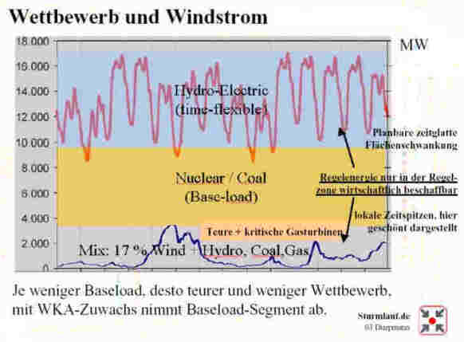
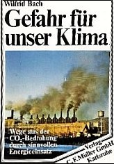
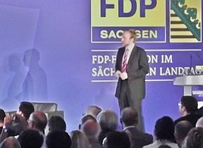

[🠔 Zur Übersicht: Klimaschutz-Quiz](7thu63.md)  
# 67 Ökoterrorismus - Pro und Kontra Kernenergie / Atomkraft 2
**Zum Ökoterrorismus durch Energiesparzwang und Klimaschutzerpressung**  
_von Konrad Fischer_

## KLIMAFAKTEN UND KLIMALÜGEN 48

## Zum Ökoterrorismus durch Energiesparzwang und Klimaschutzerpressung

**Inhalt**

## 67 Ökoterrorismus - Pro und Kontra Kernenergie / Atomkraft 2

Last, but not List (IRONIEMODUS ON): Daß der CO2-Betrug ein lang eingefädeltes Spiel bestimmter - vor allem auch Monopolisten und Großbank-Interessenten ist und die Perfidie eines Tetzel, Fegfeuerjahre von Toten an deren Nachkommen zu verkaufen, weit übertrifft, braucht hier nicht weiter ausgeführt werden. Daß die Energiekriminellen auch die ganze Politik unserer Schutzgelderpresserrepublik durchseuchen, ihre Parteitage inkl. der Parteisoldaten finanzieren, uns alle in Schuldknechtschaft stürzen und auf dem Gipfel des Vulkans, in den sie uns bei Brot und Spiele unter Inkaufnahme immer größer werdenden Unterschiede zwischen Arm und Reich in seidenen Fräcken und brilliantbesetzten Roben ihren Hexensabbat feiern, ist auch allgemein bekannt. Ein Drecksacksystem der über Leichen gehenden ehrlosen Volksverräter hält sich mit Hilfe der Medien und der immer mehr aufgerüsteten Polizei und der diversen Staatssicherheitsdienste am Leben und greift zu immer krasseren Mitteln, um den wehrlosen Bürger einzuschüchtern und notfalls kirre zu machen. 

Logische Folge dieses Schweinemonopolkapitalismus': 

Strompreiserhöhungen der Monopolisten ohne Gnade und Ende (Und da die Energie wie alles, was uns erhält, in einer gottesgleichen Hand ist, darf es auch nicht verwundern, wenn unser vielbeweibter Altbundeskanzler nach seinem "Ausstieg" als "Volksvertreter" stante pede zum Energievertreter der Fraktion Gas mutierte - das hat ja auch schon der einstige Atomgegner und SPD-Muffel Björn Engholm so schön zur Atomfraktion vorgemacht und der ehemalige Politschläger, Schlampenheld, USrael-Anwanzer und Grünspecht Joschka Fischer ist ihm dabei als RWE-Berater 2009 gefolgt. So machen es die ganz klugen "Volksvertreter" und "Spitzenpolitiker", denen unübertreffbare Treulosigkeit gepaart mit geradezu krankhaftem Geschäftssinn unter ihresgleichen und nachgerade beim deutschen Michel zur Ehre gereicht. Was wartet wohl auf uns Angela? 

Und gleichzeitig schlägt eine durchgemurkelte Energiewende ihre blutige Energiewunde durch das Land und den atomtraumatisierten Landeiern wird die Heimat mit CO2-Klimaschutz-induzierten Windrädern und Solarwüsten und Biogasscheißereien zugekackt. Wobei absehbar ist, wie unsere reichgewordene Wohlstandsgesellschaft dabei vor die Hunde geht, bis all' unser Nachwuchs wieder mal nach Übersee oder Rußland oder auch Asien auswandern muß, um außerhalb des bankrott implodierenden US-Europas der Ökofürstenhöfe überleben und eine neue Zukunft aufbauen zu können. Ihr werdet es erleben! Und deswegen tun hier wenigstens zum Abschied noch ein paar deftige und aus der Not geborene Wörtchen durchaus gut! Wenn nicht - tschüß! 

Hier biete ich den wenigen nachdenklich gebliebenen Restdeutschen etwas öffentlich zugängliches Hintergrund-Material zum Überlegen an, das viele vielleicht sogar etwas überraschen kann und wird. Und dann? Weiter gegen die Windrädlein vor, über, neben und hinter dem eigenen Gartenzwerglein anstinken? Oder rein in die einzige Bürgerbewegung auf nationaler Ebene, die nicht nur nach den Ästen der Ökoeiche springt, und sich wundert, daß nach dem Abreißen eines Astes gleich sieben neue heraussprießen, sondern an deren Wurzeln nagt: die [Nationale Anti-EEG-Bewegung NAEB e.V.](http://www.naeb.info), frei nach dem alten Motto von Ewigkeitswert: "Nur gemeinsam sind wir stark"? Wie auch immer, machen Sie sich schlau, klären Sie Ihre heißgeliebten Vorurteile auf und lassen sich nicht mehr von jedem Deppen mit ihren falschen Ängsten regieren. Es warten nämlich keine sieben Negermörder und fünfzig abgrundtiefe Löcher in Ihrem dunklen Keller, sondern ein Kasten Kellerbier und das Eingemachte seit Omas Zeiten, Gott hab sie selig, machen Sie endlich das Licht an! 

Diese Grafik unter der Berücksichtigung der Energie-Situation bis 2001 von [Heinrich Duepmann, www.sturmlauf.de](http://www.sturmlauf.de), (jetzt [NAEB](http://www.naeb.info) erläutert, wie die brutale Netzpreistreiberei abgesichert wird:

 
_Erläuterung: Regelstrom (blau) für den zeitlich schwankenden verbrauchsabhängigen Bedarf kostet 3,5-4,5 Cent je kWh, Basistrom für den Dauerbedarf (gelb) 2,5 Ct. Die Beschaffung des teuer zu produzierenden Regelstroms von außerhalb des Netzbereichs ist nicht sinnvoll, da die Netzdurchleitungsgebühr des Netzbetreibers (Eon, RWE, EnBW, Vattenfall haben hier Deutschland unter sich monopolartig aufgeteilt) den möglichen Gewinn auffrißt._

_Nur im Basisstrombereich, der nun durch vermehrte unstetige Ökostromzwangseinspeisung (Wind und Sonne liefern Energie, wie eben der Wind weht weht und die Sonne scheint) im grauen Bereich von unten her immer weiter verkürzt wird, hat der Wettbewerber von außerhalb eine Marktchance. Ökostrom kappt also den Markt für Wettbewerber._

_Folge: Die Netzbetreiber aus den Kreisen der Atommafia beherrschen auch künftig unangefochten ihren Markt von der Produktion im eigenen Netzbereich bis zum Endkunden, die Preisgestaltung muß immer weniger Wettbewerb fürchten, den Strompreiserhöhungen und der erpresserischen Energieabzocke wird keine Grenze mehr gesetzt. Stamokap und Ökommunismus pur - prüfen Sie Ihre Stromrechnung! Und zur Tarnung fordert/fördert "man" nun die Grundlastfähigkeit der Ökoenergie: Mehr Biomasseverstromung, Wind- und Solarenergiespeicherung in Druckspeicher (Wasser im Stausee, Druckluft in Salzstockkavernen, Wasserstoffumwandlung, Bla, bla, bla ...). Es gibt inzwischen keine Grenze und keinen Gipfel mehr der subventionierten Unwirtschaftlichkeit - zu gut ist das Ökogeschäft angerollt, zu viele Taschen müssen gestopft werden._

So mißbrauchen die Strommultis - seit gemeinsamer Durchsetzung von EEG/WSVO-EnEV mit Hilfe ihrer klammheimlich eingekauften und mit teuer Geld "ohne Gegenleistung" (Ha, ha!) ausgehaltenen willigen Politschwindler im Verbund mit den Ölprinzen (BP und Shell wollen sich ja übertreffen im Bau riesiger Solarfabriken) - den Öko zur Verteidigung ihrer Marktposition gegen den billigen Wettbewerb (Tschech-, Franzmannstrom). Deswegen bauen und fördern sie Ökoenergieerzeuger und heucheln damit Welterlösung vom Klimagau. Die Stromlinge installieren also den Ökodruck und suchen sich öffentlichkeitswirkame Absahner ins Boot, die das mit verteidigen (Politiker, die nach Mehrheitsmeinung der Bürger mangels Herz sowohl an Käuflichkeit für die schwachsinnigsten Ziele wie auch mangels Bildung an Dummheit und Steuerbarkeit geradezu unübertroffen erscheinen und reiche Öko-Finanzabzocker). Natürlich auf Kosten der Bürger und der Umwelt. Und warum die ganze Wirtschaft da wehrlos mitmacht? Nein, nicht wie Sie denken, weil die von der Ökostromabzocke ausgenommen werden. Sondern weil die Angela denen schon vor zig Jahren in einer Geheimabmachung die volle Kostenneutralität und das ungebremste Ökokassemachen versprochen hat! So fies können die wahren Hintergründe des Ökos sein. Wobei man die Monopolisten fast bedauern sollte ob ihrer so durchsichtig kriminellen und oberdoofen Helfershelfer. Gebrauchtwagen könnte man so wahrlich nicht verkaufen. Um den Gegenwind aus der Bevölkerung zu dämpfen, hat "man" sich nun was ganz Schlaues ausgedacht:

Die Bauernschaft bildet - seit Jahren in hohen Gremien perfekt ausgeheckt - eine zusätzliche Deckung für den Ökobetrug, und alle - da moralisch im Großen und Ganzen inzwischen unter aller Sau - machen mit, gestützt von allen Parteien (CDU/FDP/SPD/GRÜNE/Linke). Sie bauen hektargroße schwermetallhaltige PV-Anlagen, Windspargelfelder, Biomassengas mit zukünftig Zwangseinspeisung ins Gasnetz, Holzhackschnitzel anstelle Schweineschnitzel, Brotgetreide zu Stromgetreide, mag doch die monokulturierte Ökosteppe gänzlich verwüsten und der Rest der Welt weiter verhungern. Raffiniert ausgedacht, amtlich gefördert und organisiert durch unsere ökommunistisch gleichgeschalteten Machthaber - stützt unseren Reichsnährstand und die die Banken, ohne die das Spiel ja nie zum Laufen gehen würde! Die Maulen-und-Klauen(!)seuche der Ökomafia hat ihre Inkubationszeit überwunden, sie bricht nun voll aus. Da war einem selbst BSE, Hühner- und Schweinegrippe noch lieber. Und die schon bisher dick subventionierten Massentierhalter steigen künftig um auf den Energiekunden. Werden wir also zum Mastvieh für Ökozecken? Selbst nutzt man Bauerndiesel im dicken Benz und Landrover, demnächst nur noch Energiefarmer-Kerosin im Privatjet? Wenn nur die Flugzeit wäre, um die anfälligen Ökoenergie-Anlagen mal allein zu lassen. Anders als Schweine brauchen die nämlich Rund-um-die-Uhr-Präsenz von Mo. bis So., so hört man es aus dem Schilfgras flüstern. Wir denken an die verklemmte Schnitzel- und Pellets-Förderschnecke. In der 24-Stunden-Service-Schicht braucht es schon gut ausgebildete Greencardler mindestens aus Indien, mit Anatoli-Ali ist da wenig geholfen.

Der Mißbrauch der Naturliebe durch den Ökoprediger, Solarpropheten und Dr. Franz Alt und die pseudogrüne Ökoapokalyptik anderer Heilsapostel in Politik und durchgeknalltem Journalismus bedienen also einen entarteten Autarkismus, dessen braungrüne Wurzeln im Nazismus auch an seiner primitivgefährlichen Heilsideologie, den Durchhalteparolen und dem Vernichtungswillen gegenüber Andersdenkenden deutlich werden. Wieder mal eine perfide Strategie, die im Grunde nur den Interessen der eigentlichen Profiteure der sogenannten Ökopolitik - recte Ökotyrannei - dient - den Banken und den Energiemonopolisten (das sind die Atomkraftwerkbetreiber, sie dürfen dank ROTGRÜN ihren Strahlemüll nun überall im Lande billigst herumlagern - vgl. obige Lindner Meldungen - anstelle ihn mit der [industriell ausgereiften Neutronenbeschuß-Transmutationstechnik](7boet2.md) auf ungefährliche Kleinstmengen herunterzubeamen - und die Leistung der schrottreifen Atommühlen erweitern, anstelle sie auf modernste und kernschmelzensichere Funktionsweise (HTR, Fusion) umzurüsten, Trittin und seine Truppe sind dafür ihre sichersten Polithelfershelfer) und der Chemie (Nachfolger der in Auschwitz von der jüdischen Arbeitskraft Profit ziehenden IG Farben, nach Bernt Engelmanns Recherchen Förderer der Parteikarrieren so mancher christsozialen und -demokratischen bundesrepublikanischen Chefverkohler im stark kohlehaltigen Dunstkreis von Kohl und Strauß).

Hintergrundinfo: 
[EF: Energiekonzept: Merkels Meisterwerk an Destruktion](http://ef-magazin.de/2010/09/08/2520-energiekonzept-merkels-meisterwerk-an-destruktion) 
[Energiewende 1990 von Merkel und Wirtschaft beschlossen (Forumsbeitrag Hanna Thiele)](http://www.novo-argumente.com/magazin.php/novo_notizen/artikel/0001138) 
[FAZ: Transmutation - Die zauberhafte Entschärfung des Atommülls](http://www.faz.net/aktuell/wissen/physik-chemie/transmutation-die-zauberhafte-entschaerfung-des-atommuells-1655406.html) 
[Atomhysterie - Was ist mit den Deutschen los? Interview mit dem Physiker und Physikphilosophen Prof. Wade Allison](http://www.eike-klima-energie.eu/news-cache/was-ist-mit-den-deutschen-los-interview-mit-dem-physiker-und-physikphilosophen-prof-wade-allison/) 
[Radiation and Reason](http://www.radiationandreason.com/) - The Impact Of Science On A Culture Of Fear - Wade Allison, Professor of Physics at the University of Oxford 

Und die "deutsche" Industrie haben die Ökoideologen auch mit ihrer egoistischen Freßgier hereingelegt und für das wüste CO2-Zertifikatsspiel gewonnen, daß man nun fast ohne Murren über sich hereinbrechen läßt. Man mußte ihnen nur vorschwindeln, wegen getätigter Ökoinvestitionen besonders viel Verkaufszertifikate geschenkt zu bekommen, die sie dann den dummen Ausländern verscherbeln dürften. Das haben die tatsächlich geglaubt! Und halten still bei der Markteinführung aus dem Nichts für ein Lachgas, für das die Bürger dann plötzlich zahlen dürfen. Mächtig gewaltig.

Namentlich bekannt ist übrigens ein atomnaher Physik- und Atom-Professor, der sich im eingeweihten Kreis noch jetzt damit brüstet, den GRÜNEN das CO2 schon in den 70ern "ins Hirn geschissen" zu haben. Wieso? Weil wohl nur mit der kohlendioxidinduzierten Klimakatastrophe eine Klimapanik ausgelöst werden kann, die das tschernobylisierte Volk zurück in den Atomstaat treiben soll, klaro? 

Einen hübschen Beleg der atomar fundierten Klimahysterie und des Treibhausschwindel liefert Ulrich Waas, als Diplomphysiker, dann Dr. rer. nat., ein maßgeblicher Propagandist im atomaren Komplex, u.a. seit 1975 bei der Kraftwerk Union AG KWU in Erlangen, dann Framatome ANP GmbH und AREVA NP GmbH, in seinem schon 1978 erschienenen und dann bis in die späten 80er immer wieder neu aufgelegten Pamphlet "Kernenergie - ein Votum für Vernunft". Klar, wer so titelt, will Vernunftgründe vorgaukeln, wo besser Vorsicht angebracht wäre. 

Die rhetorische Technik dafür? Gröbstmögliche Werbelügen wie die angeblich bald ausgehenden Ressourcen und allerlei sonstigen "Nachteile" der mit der Atomkraft / Kernenergie konkurrierenden Energiequellen und extrem Dubioses aus datenmanipulierend betrügerischen Simulationsküchen in offenbare Wahrheiten nach dem Motto "die Erde ist keine Scheibe" verpackt, um sie in feiner Gesellschaft" annehmbarer erscheinen zu lassen. Alles in angeblicher Wissenschaftlichkeit verpackt und mittels titelmächtiger Gewährsleute aus dem im atomaren Komplex großgewordenen und davon existenziell abhängigen Kreis der meteorolügischen - heute klimawissenschaftlichen - Doktoren und Professoren (durch die Bank ehrlose und käufliche, da drittmittelabhängige Brotwissenschaftler nach Schiller!) für das üble Spiel eingesetzt. Mit möglichst internationalem Touch, das erweckt Ehrfurcht auch vor den käuflichsten Wissenschaftshuren und Klimascharlatanen. 

Ich zitiere aus dem Waasschen Propagandaschinken seine Kohlendioxidschmonzette und Treibhaushetze nach der 2. Auflage, Deutscher Instituts-Verlag, div-Sachbuchreihe ; Bd. 18; 2, Köln 1978 [!!!], S. 79 ff.: 

_"Ein Problem, das wegen seiner möglichen langfristigen Auswirkungen mehr Forschung als bisher notwendig macht, besteht in der Abgabe von CO 2 [KF: beim Verbrennen fossiler Energieträger]. Nach dem heutigen Stand der Forschung [KF: 1978!] müssen folgende vier Fragen untersucht werden [KF: gem. Fußnote 44: ["Carbon Dioxid, Climate and Society (PDF-Download)"](http://www.iiasa.ac.at/Admin/PUB/Documents/XB-78-502.pdf), (Hrsg.) Jill Williams, IIASA, Laxenburg, Pergamon Press, Oxford 1978; Carbon dioxide, climate and society: proceedings of an IIASA workshop cosponsored by WMO, UNEP and SCOPE, February 21-24, 1978, editor, Jill Williams, Corp. authors: United Nations Environment Programme (UNEP); International Institute for Applied Systems Analysis (IIASA); International Council of Scientific Unions (ICSU) - ein Schlüsseldokument der internationalen Kohlendioxid-Fälschung mit Beiträgen von Häfele, Bolin u.a.]: 

- Wieviel CO2 bleibt in der Atmosphäre? 
- Um wieviel wird dadurch die Temperatur steigen? 
- Welche Klimaverschiebung ergibt sich aus der Temperaturveränderung? 
- Welche Auswirkungen auf die Landwirtschaft hat eine Klimaveränderung? 

Bisher gibt es Angaben über die mögliche Temperaturerhöhung in etwa 100 Jahren bei Deckung des Hauptenergiebedarfs durch fossile Brennstoffe, die sich zwischen 3° C und 8° C bewegen. [Fußnote 45: National Academy of Science, Energy and Climate, Washington D.C, 1977. Hermann Flohn, Stehen wir vor einer Klimakatastrophe?, in: Umschau 77, 1977, Heft 17, Seite 561. Ulrich Hampicke, Das CO2-Risiko, in: Umschau 77, 1977, Heft 18, Seite 599. Alfred Voss und Friedrich Niehaus, Die Zukunft des Weltenergiesystems, in: Umschau 77, 1977, Heft 19, Seite 625. Friedrich Niehaus, A non linear eight level tandem model to calculate the future CO2-C14-burden to the atmosphere, International Institute for Applied Systems Analysis, Laxenburg, Wien 1976. Wilfried Bach, Das CO2-Problem: Lösungsmöglichkeiten durch technische Gegensteuerung, in: Umschau 78, 1978, Heft 4, Seite 117.] Dabei können schon kleinere Temperaturänderungen Auswirkungen auf die Humusbildung und damit auf landwirtschaftliche erträge haben. [Fußnote 46: Wolfgang Flaig, Boden- und Ernährungskrisen, in: Mitteilungen der TU Braunschweig XII, Heft III/IV 1977.] Würde die befürchtete Entwicklung durch wissenschaftliche Untersuchungen erhärtet, so wäre sie als gefährlich anzusehen, weil sie - einmal im Gang - sich noch beschleunigen kann, das Klima "kippt um", und ist nur langfristig umkehrbar. [Fußnote 47: National Academy of Science und Hermann Flohn wie vor.] 

Eine Bindung des CO2 etwa durch Pflanzen hat nur einen Effekt, wenn das Verrotten später ohne Sauerstoffzufuhr erfolgt. Wie die Erdgeschichte zeigt, war dies bei Bildung von Kohle und Öl ein Prozeß, der mehrere hundert Millionen Jahre gedauert hat. Carl Friedrich von Weizsäcker sieht hier kaum Zweifel, "daß auch nach heutigen Vorschriften die Abgase fossiler Verbrennung schädlicher sind als Reaktorabgase. Insbesondere schwebt über uns das Damoklesschwert der langfristigen Klimaänderung durch das bei der Verbrennung entstehende Kohlendioxid. Wir betreiben heute im fossilen Bereich eben die Vogel-Strauß-Politik, die man vielfach den Vertretern der Kernenergie nachsagt: wir erzeugen eine nicht wiedergutzumachende langsame ökologische Veränderung, deren Folgen unsere Urenkel zu tragen haben werden." [Fußnote 48: Carl Friedrich von Weizsäcker, Friedliche Nutzung der Kernenergie - Chancen und Risiken, Vortrag im Wissenschaftszentrum Bonn am 9. März 1978; veröffentlicht in DIE ZEIT vom 24.3.1978.] 

Vorläufig erscheint noch eine vorsichtig abwartende Haltung gerechtfertigt: "Wir glauben, daß die gegenwärtigen Kenntnisse ausreichen, um eingehende Untersuchungen vieler alternativer Energieversorgungssysteme zu fordern,aber noch nicht eine Entscheidung nötig machen, die Nutzung fossiler Energieträger einzuschränken. Genauso unberechtigt sind Konzepte, die den Einsatz von Kohle wegen ihrer reichen Vorkommen gegenüber nicht-fossilen, nicht CO2 produzierenden Energieversorgungssysteme stärker betonen." [Fußnote 49: [Carbon Dioxid Climate and Society](http://www.iiasa.ac.at/Admin/PUB/Documents/XB-78-502.pdf), Seite 316]"_ 

Aha, da ist es also, das CO2-Monster in seiner ganzen Ausprägung. Getürkte und gefälschte Wissenschaftsergebnisse, furchterregende Schreckens- und Katastrophenszenarien rund um die angebliche Klimakatstrophe - und warum das alles in dieser reichlich verquasten, ach so seriösen und dem allgemeinen und internationalen Volkswohl ach so zugeneigten Faschismus-Schreibe? Um die Entwicklung der Scheiß Kernkraft - so die Meinung der spätestens seit der Tschernobyl-Panik 1986 traumatisierten Bürger - wieder auf den rechten Pfad der Atommafia zu zwingen. 

Schon lange vorher ebnete das Projekt _"Energiesysteme"_ des Internationalen Instituts für Angewandte Systemanalyse (IIASA), vom o.g. Wolf Häfele, sog. "Vater des deutschen Schnellen Brüters" (Kalkar), 1973–1980 geleitet, (von 1974–1980 stellv. Direktor von IIASA) dem CO2-Wahn den Weg. Hexenmeister Haefele ging es immer nur darum, moeglichst viele "fossile" Kraftwerke durch Atomkraftwerke/Kernkraftwerke zu ersetzen, er soll sich angeblich vor Zeugen damit gebrüstet haben, derjenige gewesen zu sein, der den GRÜNEN das CO2-Thema "ins Hirn geschissen" habe. Eine reife Meisterleistung, wenn man bedenkt, daß die GRÜNEN ausgerechnet von den ostverküsteten Erdölbillionären [erfunden wurden und gesteuert](http://www.wahrheiten.org/blog/2010/09/02/die-angst-vor-der-kernenergie-echte-gefahr-oder-gefaehrlicher-mythos-teil-2/) sind. Wolf Häfele und Alan S. Manne (1975, Energy Policy, 3, 3-23) resumieren ihren aus öffentlichen Geldern finanzierten Forschungsscheiß (da befinden sich Rahmstorf, Edenhofer, Seiler, Graßl, Schellenhuber und so viele andere Klimaschutzpropheten freilich in bester Gesellschaft) in [_"Strategies for a transition from fossil to nuclear fuels"_](http://linkinghub.elsevier.com/retrieve/pii/0301421575900506) und darin heisst es dazu recht aufschlußreich: 

_"Most countries now wish to reduce their dependence on fossil fuels. In this paper, Professors Häfele and Manne discuss transition away from the current situation where virtually all demands for primary energy are met by fossil fuels. Assuming that this transition is to be based upon nuclear fission, they examine the interplay between natural resource scarcities, economics costs and the assessment of alternative technologies for the production of synthetic fuels."_. 

Die ganze menschengemachte CO2-Erwärmerei also nur abgefurztestes Marketinggesumse stinkendster Machart, seit den Anfängen der 50er Jahre bis ins Unendliche und Widerwärtigste - da Raffinierteste gesteigert! Wer weiß es denn unter all den Klimaschutzdummschwätzern hierzulande, daß das ganze Treibhaus-Lügengebäude aus der Werbeabteilung der Atommafia und ihrer korrupten Professoren und für die Atomschwindler zuständigen Umweltministerien (Diplomphysikerin Angela Merkel startete ihre Westkarriere ja zielsicher ebenfalls in der Verkohlungsregierung als Umweltministerin!) kommt? Hätten Sie's gewußt? 

Schrecklich die gewissenlose Mitwirkung der Pseudowissenschaftler rund um einen Weizsäcker und Waas und die inzwischen bis zum Erbrechen aufgeblähte "Klimawissenschaft", die den religionsersetzenden/religionszersetzenden Charakter der modernen Wissenschaft in Angesicht der leichtgläubigen und käuflichen Politik weidlich zu mißbrauchen verstehen und im Dienst ihrer Auftraggeber wohl vor keiner wissenschaftlichen Fälschung zurückschrecken - seit jeher prächtigst unterstützt vom widerlichsten Gossenjournalismus der einschlägigen Hetzblätter und Funkanstalten namens "etablierte seriöse Medien": 

Als ob Erdöl und Erdgas und Kohle tatsächlich fossilen Ursprungs seien, als ob sie bald zu Ende wären, als ob das Kohlendioxid schädlich und klimaverändernd sei. Eine absichtliche Lüge aus den Kreisen der Atomphysiker seit [Edward Teller](http://nucleargreen.blogspot.com/2008/03/edward-teller-listens-as-eugene-weigner.html), [Andrei Dmitrijewitsch Sacharow](http://ef-magazin.de/2009/08/08/1406-rezension-kommunistische-urspruenge-der-oeko-bewegung) mit seiner ekelerregenden und heute als ges. gesch. Ökologismus nahezu umgesetzten "Geohygiene" (beschrieben in seinem 1968 erschienen Werk "Wie ich mir die Zukunft vorstelle") und anderen dergleichen. Pfui! Zur Lüge der versiegenden Energien aus Erdöl, Gas, Kohle - Lies nach bei [Thomas Gold](8buch22.md#gold) (sowie weiteren Quellen auf diesem Link)! Und daß der hochrangige Atompropagandist und spin doctor Waas dann noch als "Fachautor" für "Alternativen" hervorgetreten ist - "Alternativ-Technologien. Forderungen und Antworten" und sein Propaganda-Gesumse auch für die unnötigsten Alternativblödheiten losläßt, darf man sich da noch wundern? 

Eine hochinteressante Online-Zusammenschau der geschichtlichen Hintergründe des CO2- und Klimaschwindels als stark erweiterte und aktualisierte Version seines aufschlußreichen Buches liefert der Pro-Global-Warmist [Spencer R. Weart](http://www.aip.org/history/climate/author.htm), [hier der unheilvolle Einfluß der US-Regierung](http://www.aip.org/history/climate/Govt.htm), hier die Einstiegsseite: _[The Discovery of Global Warming. A hypertext history of how scientists came to (partly) understand what people are doing to cause climate change.](http://www.aip.org/history/climate/index.htm)_. 

Klar, daß es auch in unserem US-Vasallenstaat unendlich viele käufliche und unredliche Meteorologen und Klimaschutzexperten in staatlichen Diensten gab und gibt, die der Atommafia zuliebe die Erwärmungs-Treibhaus-CO2-AGW-Lüge immer weiter ausbauen, mit Tabellen, Simulationen, Datenfälschungen und Extremgrafiken zu den leider nicht mal wohlfeil herbeierfundenen Hetzszenarien garnierten. Sind sie doch selbst Kinder des Atomstaates und früher nur durch die Fallout-Forschung zu Masse, Macht und Ansehen gekommen. Von ihnen hing es ja ab, daß bei einem im kalten Krieg ja nicht ganz unwahrscheinlichen Atombombenabwurf die sachgerechte Beurteilung und Weitermeldung der maßgeblichen Windrichtung zum schnellstmöglichen Schutz der Politiker führte. 

Auch der münsteraner Klimatologe und CO2-Bedrohungs-Weltuntergangsszenarienschmied Prof. Dr. Wilfrid Bach, im perfiden Albion (Sheffield) doktoriert und u.a. NATO-Berater, gefiel sich mit seinen hochmögenden Freunden der Atomlobby darin, auf jede nur vorstellbare Art und Weise für den CO2-Popanz und den verlogenen Atomstaat die Trommel zu rühren. Hier ein Blick in sein Hauptmachwerk: **["Gefahr für unser Klima. Wege aus der CO 2-Bedrohung durch sinnvollen Energieeinsatz"](http://www.utopie1.de/B/Bach-Wilfrid-Klima/index1.htm)**, C.F. Müller, Karlsruhe 1982. 

Schnell werden sie merken, daß dieser Bach das gesamte Ökoszenarion nicht nur begrifflich, sondern auch bis in das Glühlampenverbot, CO2-Abscheidung, CO2-Speicherung, Wärmedämmzwang und EEWärmeG präzise durchorchestrierte. Es liest sich wie das aktuelle Ökozwangsregierungspapier zum Totalen Klimaschutz, seine abgefeimt-professorale Rhetorik setzt noch heute den fast ultimativen Maßstab beim Klimalügen. Klar, seine Vorgänger sind ja noch bei Göbbels in die Schule gegangen und er ist auch in diese Zeit noch rechtezeitig reingeboren (1936) und eingeschult worden. 

Selbstverständlich hat sich der gute Bach den ganzen Schmarrn nicht selber ausgedacht, sondern baut auf den geistigen Dünnschiß seiner Vorgänger wie Atompapst-Häfele und Nuklearwinter-/Ozonlochsimulant Paul Crutzen auf, denen er dafür expressis verbis allerherzlichst Dankeschön sagt. Auch der wirkungsvollste CO2-Instrumentalist, Eisschmelzerfinder und Treibhausapostel nach Fourier, Tyndall und Arrhenius, Prof. Dr. Hermann Flohn (1912-1997), [[Hermann Flohn: Meine Klimaschwindeleien und ihre Kolportage im Klimaterror](http://www.amazon.de/gp/redirect.html?ie=UTF8&location=http%3A%2F%2Fwww.amazon.de%2Fs%3Fie=UTF8&x=0&ref_=nb_sb_noss&y=0&field-keywords=hermann%2520flohn&url=search-alias%253Dstripbooks%23%3Frh=n%3A186606,k%3Ahermann flohn&site-redirect=de&tag=altbauunddenk-21&linkCode=ur2&camp=1638&creative=19454)] mit seinen urdeutsch-klimatologisch-biologistisch-rassistischen Denkgebäuden in der Nazizeit recht groß geworden (Leiter der Bioklimatischen Forschungsstelle Bad Elster, danach Regierungsrat beim Wetterdienst beim Oberbefehlshaber der Luftwaffe), bleibt da wie selbstverständlich nicht unerwähnt und bestätigt wieder einmal, wie auf geradezu perfideste Weise das Nazigedankengut mit Autarkismus, Biologismus, Gottlosigkeit und Bürgerzwang der Kriegs- und Mangelwirtschaft ("Kampf dem Verderb, Verdunklungsgebot, ...") Eingang in die Gesamtheit der rein planwirtschaftlich organisierten Energiewirtschaft und "Kreislaufwirtschaft" (Bach) eingeflossen ist. Eben schmutzigbraunster Nazidreck (1941: Flohn: "Die Tätigkeit des Menschen als Klimafaktor" - 1980: Man's increasing impact on climate: Atmospheric Processes.") unter heutzutage Schwarzrotgelb=braungrüner Flagge. 

Dieser Klimahysteriker Flohn machte sich dann 1984 einen Heidenspaß daraus, in seinem ökonazismusgeschwängerten Alterswerk ["Das CO2-Klima-Problem und die Rolle biologischer Vorgänge"](http://onlinelibrary.wiley.com/doi/10.1002/biuz.19840140203/abstract;jsessionid=2DFD30096F935376B0F8105B35EA41FC.d01t01) ebenso wie in ["Das CO2-Klima-Problem"](http://onlinelibrary.wiley.com/doi/10.1002/nadc.19840320407/abstract)sein großangelegtes Klimaschutzstaffel-Lügengespinst nochmals als intellektuell aufgeblasenen Input in die atomar verseuchte Ökojüngergemeinde einzudröhnen. Brauner Wissenschaftsdreck / Scam Science vom Allerfeinsten. 

Politisch gesehen, wird die CO2-Kiste als gesellschaftlich wirksamstes Folterwerkzeug für Politterroristen aller Couleur erst ab Maggie Thatchers Zerstörung der Macht der Kohlekumpel mit der Dekarbonatisierungstaktik ("CO2 ist klimaschädlich") erst so richtig interessant. Und konsequenterweise ist der auf dem Öko- und Ressourcenschwundschwindel aufbauenden Atommafia mit der Machtergreifung der den Chemiefreund Helmut Kohl abmerkelnden Diplomphysikerin Angela Merkel, von der einfältigen BASF-geführten Atom-Schwarzbirne (vgl. des Enthüllungsjournalisten Bernt Engelmanns Buch "Schwarzbuch Kohl") ausgerechnet als Umweltministerin und damit auch Atomministerin installiert, der wohl größte politische Schachzug ihrer von Korruption geprägten Geschichte gelungen - dennn erst dadurch gelang es dem ges. gesch. Klimaschutzterror, so richtig um sich zu greifen. 

So ist es nur logisch, daß sich die Klimaschutzprofiteure unter der Anführerschaft ausgerechnet des britischen Thronfolgers (?) Charles "Prince of Wales" ("Gott strafe England!" und "Perfides Albion" wußten noch unsere Eltern), inzwischen nicht mehr davor zurückscheuen und sich frechstens erdreisten, öffentlich und unverhohlen "Klimaschutz" zu fordern - siehe z.B. das ["Kommuniqué von Kopenhagen"](http://www.cpi.cam.ac.uk/our_work/climate_leaders_groups/clgcc/international_work/the_copenhagen_communiqué.aspx), in dem weit über 600 weltweit agierende Konzerne - die Interessensgruppen der Atomwirtschaftler und auch die erdölbasierte Dämmstoffwirtschaft mit ihren Mineralölkonzernen als Anführer selbstverständlich alle dabei - mehr "Klimaschutzbemühungen" und reibachgesicherten Emissionshandel von den schon lange zu Ökokirchenstaaten / Öko-Vatikanen mit allerinnigster Einheit von Thron und Altar mutierten Regierungen fordern, die sich - welch irrer "Zufall"! - justament zum gleichen Datum - am 22. September 2009 - zu einem sog. "Klimagipfel" in New York trafen, die bis dahin weltweit größte Abspracherunde zur Organisation des endzeitlich aufgeladenen Ökoterrors im bald folgenden "Kopenhagen-Klimagipfel COP 15". Was man freilich wissen muß, um die in Deutschland dann ab Fukushima in brutalster Form ausgebrochene "Energiewende" richtig zu verstehen - der Begriff beruht auf einem Geheimpakt der Wirtschaft mit der Bundesregierung, bei der ausgemacht wurde, die Kosten der Wende dem wehrlosen Bürger aufzuzwingen und die Wirtschaft von allen Folgen zu entlasten. Genau deswegen tröten die deutschen Firmen wie verrückt ins Klimaschutzhorn - bis zum Untergang ihres Betriebs und dem Zusammenbruch der energiegewendeten Gesellschaft

Dabei ist die Strategie der Atomwirtschaft immer noch voll auf zwei wesentlichen Strategien aufgebaut, die sie selbst eingefädelt und dann in Laxenburg zur "internationalen Marktreife" entwickelt hat: 1. Ressourcenknappheit und 2. Das CO2-Klimagift-Gespenst. 

 So ist es nur logisch, daß ein gewisser Doktor Bodo Sturm (siehe Bild, wer sind wohl seine Drittmittelschatten?), seines Zeichens Professor für Volkswirtschaftslehre und Quantitative Methoden an der HTWK Leipzig, ironischerweise und ausgerechnet auf dem Kongreß ["Sind wir noch zu retten? Zwischen Klimakatastrophe und Ökohysterie, Alternative Klimakonferenz der FdP-Fraktion im Sächsischen Landtag, 30. Juni 2012, Internationales Congress Center Dresden"](http://www.fdp-fraktion-sachsen.de/online/fdp/fdp-fraktion.nsf/site/Programm_Alternative_Klimakonferenz) in seinem Referat mit dem Titel _"Rationale Klimapolitik – eine ökonomische Betrachtung"_ geradezu Ungeheuerliches zum Besten gab. Unter der zugestandenen und eisern durchgehaltenen Fiktion, daß die professoralen Klimalügen rund um angeblich CO2-induzierte Schäden wie globale Erwärmung und Meeresspiegelanstieg usw. - die die anderen Referenten (darunter die Berühmtheiten [Benny Peiser](http://www.google.http://thegwpf.org/) und [Michael Miersch](http://www.maxeiner-miersch.de/steckbrief_miersch.htm)) und Diskussionsredner wenn nicht total entlarvten, so doch grundsätzlich in Frage stellten, stimmten, und der Antwort _"JA!"_ auf die Nachfrage, ob CO2 tatsächlich- wie von ihm behauptet - _"Schmutz"_ sei, empfahl er kaltschnäuzig eine ökonomisch optimierte Strategie der CO2-Vermeidung. Wie? Na klar, durch Emissionshandel. Nur der - als einziges Element einer modernen Klimaschutzpolitik - sei schließlich in der Lage, allen (mit der Atomkraft konkurrierenden?) CO2-minimierten "Ökoenergien" ruckizucki den Saft abzudrehen. 

Freilich wäre das schon schön und zurecht zeigte die Sturm'sche Rhetorik auf, daß es aber auch wirklich keinem Einzigen in diesem unserem von Schwachsinnigen überbevölkerten Lande (tut's richtig weh, ja?) und weltweit in Wahrheit um tatsächlichen "Klimaschutz durch CO2-Vermeidung" geht (der mit Komplettumstellung auf Atomkraft - nach Meinung von Benny Peiser "Gaskraftwerke" sofort erledigt wäre), sodern immer nur um das Auftun neuer Geschäftsfelder für die irre teuren Ökomonopolparasiten der Klimaschutz-Planwirtschaft. Aber wieso muß daraus eigentlich [Emissionshandel nach dem ökofaschistisch/ökommunistisch durchseuchten Modell der Planwirtschaft](http://wirtschaftslexikon.gabler.de/Definition/emissionshandel.html) mit daraus erwachsender Belastung aller Preise für Energie, Dienstleistung und Produkte bis zum Gehtnichtmehr abgeleitet werden? Weil davon Professoren und deren andere andere Gesellen des elitären und moralisch verkommenen Abschaums unserer Gesellschaft bis in alle Ewigkeit gut weiter schmarotzen können? 

Auch ein [Professor Dr. iur. Andreas Zimmermann](http://www.uni-potsdam.de/ls-zimmermann/person.html), der es nach Studien in Tübingen, Aix/Marseille, Harvard und New York dann zum Lehrstuhl für Völker- und Europarecht an der Universität Potsdam und Direktor des dortigen Menschenrechtszentrums gebracht hat, trägt mit seinen in der Öffentlichkeit erhobenen Forderungen nach "rechtlicher Verantwortung" der Staaten für ihren Beitrag zu den "klimaschädlichen Emissionen" (in der atomar verstrahlten FAZ am 27. Juni 2012 in ["Wer ist schuld? Staaten sind für den Klimawandel verantwortlich? Das sollte der Internationale Gerichtshof klären."](http://www.faz.net/aktuell/politik/staat-und-recht/gastbeitrag-wer-ist-schuld-11801237.html)) nach schlechtesten Kräften zum planwirtschaftlichen Geschäftsfeld Klimaschutz und weiterer Ökoausplünderung unseres Staates und weiterer wehrloser Opfer der weltweit agierenden Ökoterroristen bei. Als jahrelanger Handlanger von diversen am internationalen Gerichtshof anhängiger Verfahren macht auch Zimmermann hier neue Möglichkeiten für künftige Einnahmen aus, das Thema CO2 ist wirklich unerschöpflich. Doch wie kann man als Prädikats-Rechtsgelehrter nur so tief sinken? Oder genau deswegen? Zurück zu Sturm: Seine dreisten (Politik) "Vorschläge" im Original (Abschrift von Leinwand, Begriffserläuterung in eckigen Klammern): 

1. Transformation der EU-Klimapolitik in eine "best practise" 
a. Abschaffung des EEG und aller anderen ordnungsrechtlichen Politiken (EU-Energieeffizienzrichtlinie) 
b. EEG-Förderung bestenfalls über ein Quotensystem a la SVR [Sachverständigenrat] 
c. Flankierende Maßnahmen: Forschungspolitik mit dem Ziel, die Grundlagenforschung zur Energiewende ergebnisoffen zu fördern. 

2. Erweiterung des Emissionshandels 
a. Alle Sektoren 
b. langfristige Festlegung der CAPs [Emissionsobergrenzen im ["vollkommen irrsinigen Cap-and-Trade CO2-Zertifikate-Handel"](http://www.citizentimes.eu/2012/04/18/sieben-mulltonnen-fur-fukushima/), das planwirtschaftlich festgelegte CO2-Emissionsrechte zu handelbaren Gütern macht] 

3. Globale Klimapolitik mit bindender Emissionsgrenze 
a. Seitenzahlungen [planwirtschaftliches Zahlungssystem aus EU-Steuermitteln, das reduzierte CO2-Emission bei Verursachern belohnt, auch ein absurdes Modell, dem Bodo ist die [wissenschaftliche Kritik am Instrument "Seitenzahlung"](http://www.bundestag.de/bundestag/ausschuesse17/gremien/enquete/wachstum/gutachten/m17-26-19.pdf) nicht bekannt oder er hat sie nicht verstanden] durch die EU 
b. Instrument: Emissionshandel 

Jawoll! Nur so kann die "Co2-vermeidende" Atomkraftindustrie auf Dauer überleben, mit gemeinsten und an Ehrlosigkeit wohl kaum zu übertreffenden Methoden. Weil's für sonst nix langt in den Köpfen ihrer gewissenlosen Wirtschaftsführer. Ob sie dem Sturm für seine moralentleerten Hirngespinste Geld geben, weiß ich net bzw. Toyota. Aber wenn ich der ehrbare (ach, ich weiß doch, daß das eine Utopie ist!) Atompräsident wäre, würde ich solche Leutchen fristlos entlassen. Wegen Geschäftsschädigung. Und weil Sturms (!) Herangehensweise typisch deutsch ist: Auch für die SS war Zyklon B bestimmt das optimalste Mittel der Wahl, für die Sturmtruppen der Genickschuß - um nicht in ekler unwirtschaftlicher Handarbeit jeden Juden einzeln am ausgestreckten Arm zu erwürgen. Nach dem Sinn des herzlosen Tuns darf eben nicht gefragt werden, typischer Kadavergehorsam in neualter Gestalt, einst zäh wie Juchtenleder, heut fit wie ein Turnschuh. Effizienz über alles! Selbstverfreilicht unter Vermeidung nachteiliger "Grenzvermeidungskosten" (lies nach bei Sturm!). Ökofaschismus pur. 

Ja, das alles paßt zur guten alten Betrüger-FDP, wie wir sie eben kennen und lieben. Und für diese ach so neue liberale Grenzbetrachtungspolitik, die sich in der guten alten Zeit als Genickschußkommando und giftverspritzter Auslese der Lebensunwerten äußerte. Das war gleichermaßen rational und ökonomisch. Miersch hat das in seinem Diskussionsbeitrag dann genau verstanden und gegen die wiederauferstandene Eugenik in ökologischer Form gewettert. Ob's jemand im Saal verstanden hat, wen und was er damit meinte? Da habe ich bei tieferem Blick in die Augen so mancher Imsaalherumsitzer dann doch meine Zweifel, und nach dem dollen Applaus für den Sturm wohl kaum. Der sich sofort danach verdrückte und der Kritik nicht stellen wollte. War wohl auch besser so, um Ohrfeigen zu vermeiden. 

Und der Rest der Beiträge? Na ja. Ohne jeden einzelnen auseinandernehmen zu wollen, so viel: 

Die schon lange offenbaren Klimaschutzmärchen rund um den Generalverdacht, daß Menschen das Klima schädigen, wurden aus verschiedenen Blickpunkten zum xsten Male infragegestellt. Zu einer Widerlegung wollte sich auch hier wieder mal niemand aufraffen. Auch kein Peiser, auch kein Miersch. Das ist der bekannte Teil der Versagerstrategie "Alles ist möglich, aber", die dem Feind das wohlfeile und jede Gegnerschaft entwaffnende Vorsorgeprinzip in die Hand spielt. Und damit entfiel auch die Angriff auf die Verursacher all des Juden- äh Klimawahns in unserer Gesellschaft. Na gut, die angeblich grünen Aktivisten in den Redaktionsstuben und deren Harmoniebedürfnis (Miersch auf die Frage, ob für die übergroße grünrote Mehrheit der BRD-Journalisten _"Feigheit statt Recherche"_ gelte: _"die wollen kuscheln"_) wären schuld für all den Medienterror. Wer's glaubt, bitteschön! Wohlfeiler geht's nimmer. 

Fein säuberlich vermieden - als ob es abgesprochen wäre - alle Podiumsredner, die Atom-Kriegswirtschaft der 1940er auf dem Weg in die zivile Kernenergienutzung als wahren Urheber des CO2-Wahns zu entlarven. Und daß das fossil-CO2-induzierte Erwärmungsszenario auch nur deswegen als Reklamegag der Atomindustrie in den späteren 70ern nur deswegen verstärkt aus dem Hut gezaubert wurde, weil die dem fossil induzierten Ruß in der Erdadtmosphäre (frecherweise vorher von Russel dem Atombombengau zugesprochen) die nun vond er Atomlobby vorher geweissagte neue Eiszeit (Globalabkühlung) offensichtlich nicht so recht gelang, wie gewünscht, haben die anwesenden Wissenschaftspfeifen und Marketingspezln natürlich ebenfalls nicht entlarven wollen. Warum wohl? Na, weil dann nach dem Cui-bono-Prinzip die Luft aus dem aufgeblasenen Emissions-Drecksack draußen gewesen wäre. Keiner hatte die Traute, all die frechen Reklamelügen rund um die von den gleichen Kräften im vom Atomler Peccei inszenierte Club of Rome konstruierte Therorie der Rohstoffverknappung / künstlich begrenzten Reichweite der Bodenschätze ([Peak Oil etc.](8buch22.md#gold)) aufzudecken. Die dem oft genug und immer noch zu wenig entlarvten Ziel zustreben, das weltweite Strahlungstrauma infolge der US-Atombombenabwürfe mit noch größeren Panikattacken (Geschäft mit der Angst durch "fossil" induzierte tödliche Globalerwärmung, gefährlichem "Treibhauseffekt", Umweltverschmutzung und aushungernde Rohstoffverknappung, alles Agitprop für eine "moderne", "saubere" Energietechnologie namens Kernkraft anstelle vorsintflutlicher Verheizung von schmutzigen Dreckenergien) - zu übertrumpfen. Ausnahme Peiser, der immerhin die Schiefergasrevolution erwähnte. Niemand wollte also die durchkorrumpierte Klimagesetzgebung (ja, ich weiß - die FDP hat hier immer angetrieben) zu offenbaren und einen politisch gangbaren Weg raus aus dem Energiewendenschlamassel anzubieten, der über das "Laßt uns mehr und offener reden darüber, auch wenn wir keine Meinung haben" hinausging. 

Dialektische Themenlinks für die eigene Meinung zwischendurch: 
[Prof. Hugo van Dam: Sind niedrige Strahlendosen gefährlich?](http://www.eike-klima-energie.eu/climategate-anzeige/sind-niedrige-strahlendosen-gefaehrlich/) - [Strahlentelex: Strahlenfolgen (Kritische Literaturauslese)](http://www.strahlentelex.de/Strahlenfolgen.htm) 

Ok, die sind eben noch nicht soweit, noch immer sind halt zu viele Korrupte Profiteure in der Quasselbude und es wird schon und wenigstens ein Anfang ist gemacht und mühsam nährt sich das Eichhörnchen, möchte man begütigend einwerfen. Aber warum dann der Sturmangriff auf das EEG zugunsten des Emissionshandel? Nacktigall, ick hör Dir trapsen. Alles nur schmückendes Beiwerk für dieses so arg lukrative Geschäftsfeld, genau das wäre es, was wir den Hauptlobbyisten der deutschen Energiewirtschaft namens "FDP" zutrauen dürfen. Ein ehrliches Werben für eine sinnvolle Nutzung und Entwicklung der Atomenergie - der verhaßte Iran versucht genau dies! - ist offensichtlich hierzulande noch lange nicht möglich. Die Zukunft wird zeigen, ob diese traurige Analyse stimmt. 

[Dr. Helmut Böttiger](7boet4.md), ein wohlinformierter Insider (und Autor der berühmten "[Spatzseite](http://www.spatzseite.com)"), schreibt mir zu weiteren - seltsam verrenkten - Ökoergüssen der "liberalen" Klimaschutzapostel in der FDP - offenbar willfährige Marionetten der industriellen Ökoabzocker des atomaren Komplexes, von denen sich z.B. nicht nur der Atommulti RWE wie selbstverständlich einen "GRÜNEN" [Joschka Fischer](http://www.reconquista-europa.com/showthread.php/20784-Joschka-Fischer-jetzt-auch-Lobbyist-für-Siemens) als "Feigenblatt", Türöffner, Geschäftemacher, Aufreißer, Schutzmann bzw. "Berater" leistet:

_"Hier wird liberales Süßholz geraspelt, so wie bei anderen soziales oder konservatives oder grünes - ohne irgend einen Gedanken an deren Umsetzung. Da sie die Politik sowie per e-mail oder Fax von einem "Großen Bruder", der für sie denkt, zugeschickt bekommen. Warum ist die grüne, rote, schwarze, grüne Logik so schwer zu verstehen, obwohl sie so simpel ist? Es ist Bankenpolitik, Verknappung des Güterangebots zur marktwirtschaftlichen Preis"stabilisierung", Umlenken der noch vorhandenen Kaufkraft auf den Ankauf von Wertpapieren (die ohne das nichts wert wären). Jetzt kommen als deren neueste Kreation noch CO2-Zertifikate auf den Markt. Das alles zur Schein-Stabilisierung eines längst bankrotten Finanzsystems (8,7 Trillionen Jahresumsatz an Finanzderivaten bei nur 41 Billionen WeltBrutto-Inlandprodukt!). Wenn man das aufrecht erhalten will, geht das letztendlich nur durch Liquidierung der "Überschussbevölkerung" mittels Hunger, Krieg gegen Terrorismus und andere Maßnahmen. Wer wollte das den Betroffenen aber mitteilen - kein Liberaler! Wer hierbei noch auf "anerkannte" Politiker und deren Wahlvereine hofft, hat nicht mehr alle Tassen im Schrank."_

Soll man das für bare Münze nehmen? Wenn ja, wäre es kein Wunder, daß ausgerechnet unsere "Liberalkonservative Mitte" als willfährige Handlanger der Bank- und damit verbunden Industrie-Monopole die Ökoabzocke eingefädelt hat, wie es eingeweihte Kreise um [Hans-Dietrich Genscher](http://ef-magazin.de/2010/08/30/2484-fdp-in-bedraengnis-die-umweltpolitische-wurzel-der-liberalen-identitaetskrise) und dessen willige Helfershelfer Hartkopf, Menke-Glückert, Verheugen, Hirche usw. seit Jahren raunen. Und ebenso logisch, daß die allgegenwärtigen Gesinnungslumpen (wer hat uns verraten?) bei Rotgrün diese aus unserem mageren Rippenfleisch gespeisten Fleischtöpfe bis zum Bürger- und Staatsbankrott weiter ausweiden. Nur noch von den ALt-FDJlerInnenn und deren Speichellecker bei Schwarzgelb zu übertreffen, wa? Wobei die Heuchelei, dieses gesetzlich sanktionierte und ständig raffiniert verschärfte terroristische Raubsystem diene der CO2-Vermeidung und nehme Einfluß auf den künftigen Wetterverlauf und damit unser aller Wohl nur noch von den Allerdümmsten (davon gibt es allerdings so einige) geglaubt und von den Allermeisten aus Angst und Schiß und feiger Anpasserei oder erbärmlichem Ökoeigennutz als PV-Verseucher und Photovoltaik-Parasit geheuchelt wird. 

Daß ausgerechnet die großen Kirchen in einer fürchterlichen Einheit von Ökothron- und altar da mitmachen, läßt für deren Zukunft als einst christliche Institution (?) nichts wirklich Gutes hoffen und ist Ergebnis - neben Zeitgeisterei dümmlichster Art - eben auch deren perfider Käuflichkeit durch allerlei geldwerte Vorteile seitens der Ökoprofiteure und letzterer vielfältigen Finanzinstrumente, wie es James Wanliss in [The Green Dragon](http://www.aim.org/aim-report/climategate-and-the-green-dragon/) in kräftigen Worten beschreibt. Hat man sich denn nicht schon zur Nazizeit genug blamiert? 

Muß nun ausgerechnet widerlichste Wind- und Sonnenanbetung die annodunnemalsige Führervergötzung übertreffen? Armes Deutschland! möchte man seufzen und sich mit dem alten Spötter Heinrich Heine die Nächte um die Ohren grämen. Nützt bloß wieder mal nix. Und da man eine Religion erfahrungsgemäß nur mit einer anderen Religion bekämpfen kann, hat man nun die Maske fallen lassen, appelliert unter Zuhilfename allerlei wortgewandter Zionisten an die dumpfbackigsten "Gefühle" sprich Ängste des deutschen Untermenschen und verhetzt die hier einzig sichtbare Alternative: Den Islam. Allah ist groß und Mohammed sein Prophet. Doch nicht stark genug gegen die westlichen Lüste des Kapitalismus. Denn gucken wir auch hier genauer, hängen die arriviert-integriert-vergartenzwergten Mohammedaner bestimmt ebenso ihren schwachen Glauben an die Photovoltaik-auf-dem-Eigenheimdach-Religion und kannibalisieren unser Vaterland ebenso wie die entchristlichten zipfelbemützt-urdeutschen Schlaumeier mit ihren geifernden Gierschlünden vom Hartzvierler bis zum Banker und Manager, die dann die ausbleibenden Solarerträge vom EFH-Dach einsamst im Kellerloch ausheulen.

Denkt mal nach darüber. Für all die künftigen Rentenschmarotzer, die selber keine Kinder haben, mag es ja egal sein. Wer wird ihnen jedoch dermaleinst die verrenteten Ärsche abputzen, wenn nicht nur unserer Gesellschaft, sondern auch unserem Sozialsystem die Luft ausgegangen ist? Ob dann die zur Seite gebrachten TEuros wirklich noch helfen? Und meine verehrten Liebesknabenkäufer paßt auf - schon und nicht nur bei den Sedlmayer und Moshammer ging auch dieser scheinbare Ausweg aus der Greisenvereinsamung schief!

Und so sieht es wirklich aus mit den Ökologen - eine hochbrisante [politikgeschichtliche Analyse des Ökoterrors](7thu68.md):
