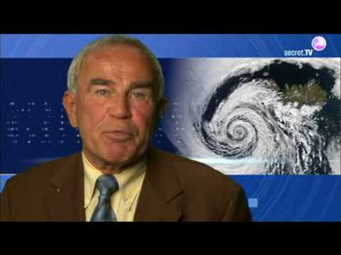
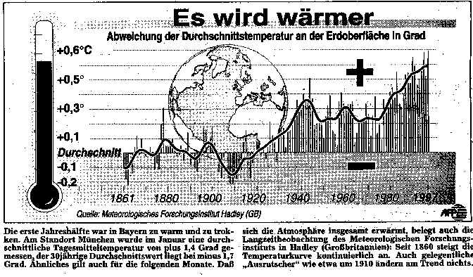
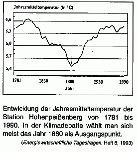

[🠔 Zur Startseite](index.md) 
# Klimafakten und Klimalügen
**Der organisierte Schwindel rund um Treibhauseffekt, Klima, Klimaschutz, Umwelt, CO2, Meteorologie, Klimamessung, Klimaprognose und Klimaänderung**  
_von Konrad Fischer • aktualisiert 30.11.2009_

> Was keiner wagt, das sollt ihr wagen, Was keiner sagt, das sagt heraus,  
> Was keiner denkt, sollt ihr befragen, Was keiner anfängt, das führt aus.  
>
> Wenn keiner ja sagt, sollt ihr´s sagen, Wenn keiner nein sagt, sagt doch nein,  
> Wenn alle zweifeln, wagt zu glauben, Wenn alle mittun, steht allein!  
> 
> Wo alle loben, habt Bedenken, Wo alle spotten, spottet nicht,  
> Wo alle geizen, wagt zu schenken, Wo alles dunkel ist, macht Licht!  
>
> _Walter Flex (6.7.1887 - 16.10.1917)_

> [!abstract]+ Kapitelübersicht: Klima  
> * **[🏠 Startseite](index.md)** • **[🧱 Altbau Restaurieren](20bausto.md)** • **[📐 Planen im Altbau](11planme.md)** • **[🏚️ Das malträtierte Haus](7epass.md)** • **🌍 Klima**
>
> ---
> 1. **Klimafakten und Klimalügen 1**
> 2. [KLIMAFAKTEN UND KLIMALÜGEN 2](7thu02.md)
> 3. [3 Ökoterrorismus durch Medienmanipulation 1](7thu03.md)
> 4. [Vergebliche Liebesmüh besorgter Bürger aus dem Ökowiderstand 1](7thu11.md)
> 5. [Der ehem. ZDF-Wetterfrosch Dr. Wolfgang Thüne zum Treibhausschwindel - Eine Sammlung von kontroversen Texten und kritischen Briefen](7thu40.md)
> 6. [52 Dämmtechnik - Ökologie und Ökonomie 1](7thu52.md)
> 7. [55 Dr.Ulrich Berner Bundesanstalt für Rohstoffe, BfR, Institut für Geowissenschaften: Wer ist schuld am Klimawandel? Gibt es eine menschengemachte Globale Erwärmung?](7thu55.md)
> 8. [63 Ökoterrorismus - Das Klimaschutz-Quiz](7thu63.md)
> 9. [Ökoterrorismus - Die Grüne Bewegung 1](7thu68.md)
> 10. [Klimawandel - Wieso? Klimahorror - Cui bono? + Argus-Kommentar Nairobi Report](7argus.md)
> 11. [Glaubensbekenntnis Global Warming: Ökologie+Ökonomie kein Widerspruch?](7argus2.md)
> 12. [Klimalügen, Energiesparschwindel und Baupfusch durch falsche Verordnungen und Normen](7lesbrif.md)
> 13. [Videoclips und Filme zum Treibhausschwindel und Klimaschutzterror](7video.md)
> 14. [Dr. Helmut Böttiger: Rette die Erde und bring Dich um!](7boet1.md)
> 15. [Verfassungsbeschwerde gegen das Erneuerbare Energien Gesetz (EEG)](7eeg.md)
> 16. [Die Schweizerische Energiepolitik ist fragwürdig](7eneb.md)

**Wie Ökospezln unsere abgepreßten Steuergroschen verarbeiten:**

> "Rechnungshof kritisiert Trittin 
>
> Der Umgang des grünen Ministers Trittin mit Steuergeldern bleibt in der Kritik. Der Bundesrechnungshof hat die Auftragsvergabe des Umweltministeriums an eine auch für die Grünen tätige Werbeagentur gerügt.
>
> In sechs von sieben überprüften Fällen mit einem Gesamtvolumen von 1,36 Millionen Euro seien die Aufträge „freihändig ohne Wettbewerb vergeben“ worden, heißt es in einem Bericht des Rechnungshofes. Damit habe das Trittin- Ministerium „die Grundsätze des Wettbewerbs, der Chancengleichheit und der Transparenz verletzt“. Auch gegen das Haushaltsrecht sei verstoßen worden.
>
> Die Rechnungsprüfer bezweifeln außerdem, dass das Ministerium mit der Finanzierung eines Empfangs im Zusammenhang mit der Abschaltung des AKW Stade „die vom Bundesverfassungsgericht für die Öffentlichkeitsarbeit der Bundesregierung gezogenen Grenzen beachtet hat“. "
>
> (Quelle: Infofax Nr. 12, 7.Jg. des Bundestagsabgeordneten Axel Fischer vom 13.7.2005)

---

> **_"Energie ist der zentrale Schlüsselfaktor für wirtschaftliche und gesellschaftliche Entwicklung."_**  
> Diplomsozialwirt und ehem. Aktivist im Kommunistischen Bund Westdeutschland KBW - Jürgen Trittin [DIE GRÜNEN], bis 2005 Umweltminister  
> Frankfurter Rundschau 17.9.03 

---

> **_"Selbst wenn ab sofort weltweit alle verfügbaren Mittel in den Ausbau der Atomenergie gelenkt würden, wäre der Effekt auf den globalen Treibhausgasausstoss marginal."_**  
> Fazit der [Stellungnahme des BMU vom 24.10.04 zur "Renaissance der Atomkraft"](http://www.bmu.de/de/1024/js/download/themenp_atomkraft/) (was mußte die Fossillobby dafür wohl berappen?) - also gilt auch: 
> **_"Selbst wenn ab sofort weltweit alle verfügbaren Mittel in den Ausbau der Ökoenergie gelenkt würden, wäre der Effekt auf den globalen Treibhausgasausstoss marginal."_**

---

> **_"Hohe Energiepreise durch EEG, Ökosteuer, Kraft- Wärme-Kopplung treiben nicht nur energieintensive Unternehmen ins Ausland. Die ausufernden Sozialkosten zerstören viele produktive Arbeitsplätze mit ansonsten ausreichender Wertschöpfung. Die planwirtschaftliche Überregulierung und Überbürokratisierung verhindert systematisch die Entstehung neuer produktiver Unternehmen. ... Dies alles zusammen mindert den Wohlstand in Deutschland erheblich, bremst die Weiterentwicklung unserer Wirtschaft._**  
> Dipl.-Ing. Axel Fischer, MdB am 17.2.05 vor dem Deutschen Bundestag

---

[Wirtschaftswoche online: _"Wenn Ökos in den Fördertopf greifen"_](http://www.wiwo.de/pswiwo/fn/ww2/sfn/buildww/cn/cn_artikel/cn/bm_morecontent/artpage/0/id/125/id/46630/fm/0/fl/0/id//bt/2/fl/0/fm/0/SH/0/depot/0/index.html) - 
(Vielleicht schon dem org. Verbrechen zuzurechnende Nichtregierungsorganisationen (NGOs) zocken immer mehr Staatsknete ab - undurchschaubar und von niemandem kontrolliert)

---

  
_Ansprache des Diplom-Meteorologen Dr. Wolfgang Thüne an die Bundeskanzlerin und Physikerin, Frau Dr. Angela Merkel_  

---

Maria Ackermann, Lawalde-Lauba: "**[Klimawandel und Klimalügen](7klima.md)** " 

---

und hier in autorisierter Erstveröffentlichung: 
**Staatstreue Bürger wehren sich gegen den Ökoterrorismus:** 
[Verfassungsbeschwerde gegen das EEG](7eeg.md)

---

### Klimaschutz, die Erste:  
Es war im Jahre des Herren 1349, als in Würzburg wieder einmal die Weinreben erfroren. Nur ein menschengemachter Klimawandel konnte die Ursache dafür sein. So glaubten es jedenfalls die Würzburger Obrigkeit und ihre tropfdoofen Bürger. Die Schuldigen dafür waren schnell ausgemacht: Die Bewohner des Würzburger Ghettos: Juden. So kam es zum Massenmord und nachfolgender Vertreibung der Hebräer im Rahmen eines Pogroms, bei dem das jüdische Viertel am Markt niedergebrannt wurde. Im Jahre 2006 wurden Reste der Brandruinen bei einer Ausgrabung unter dem Nachfolgebau - die Marienkapelle - entdeckt. 

### Klimaschutz, die Zweite:  
Es war im ausgehenden Mittelalter, die sogenannte Neuzeit begann. Neben der Entdeckung Amerikas und Ausrottung der dortigen Einwohner war Europa jahrhundertelang bis ins ausgehende 18.Jh. geprägt von schärfster Verfolgung der eigenen Bürgerinnen und Bürger. Zigtausende wurden ganz offiziell in von Kirche und Staat organisierten Prozessen u.a. der Wetterbehexung bezichtigt und öffentlich als Zauberer, Hexer und Hexen verbrannt. Theologische Doktoren und Professoren im Dienste der Macht zeugten für derartige Untaten, erfanden immer neue Delikte, Spekulationen und Gerüchte und genossen dafür einen regen und bestens dotierten Aufschwung ihrer diesbezüglichen Forschungsmöglichkeiten. Staat, Kirche, Gerichte und Denunzianten teilten sich die Erlöse aus dem konfiszierten Besitz der Klimasünder. Ein Millionengeschäft. 

### Klimaschutz heute:  
Eine gleichgeschaltete Masse von ökofaschistischen Politikern, Medien und neunmalklug-feigen Mitläufern verkündet wieder mal den menschengemachten Klimawandel. Wer sich dieser Hybris nicht anschließt, wird sozusagen gelyncht. Nur als Beispiel der SZ-Klima-Hysteriker Patrik Illinger am 14.12.07 zum ihm wohl nicht ausreichend erscheinenden Ökoterror im Ergebnis der nur lauen Klimakonferenz in Bali (S. 13): _"Der Begriff von der CO2isierung macht die Runde, ... "Klimatismus" in Anlehnung an die anderen schrecklichen Ismen dieser Welt, ... Beiträge illustrer Profi-Optimisten, die den Kliamwandel schlicht leugnen, werden sogar in akademisch angelegten Medien verbreitet. ... Als sei der Weltklimarat eine Verschwörung irr gewordener Weltuntergangs-Apologeten (und) es allen Ernstes möglich ... ein prosperierendes Deutschland zu erleben, während im Rest der Welt Hafenstädte überspült werden, ... Millionen Menschen durch das Wegscmelzen der Gletscher ihres Trinkwassers beraubt werden und der Süden Europas sich in eine Savanne verwandelt. ... Die Perversion liegt darin, dass jene so genannten Skeptiker, die uns Normaldenkenden das Wegdenken vordenken, als Optimisten empfunden werden."_ Oh, von welch abgrundtiefer Abscheu ist dieser "Normaldenker Illinger" ergriffen, mit welch abscheulicher und menschenverachtender Stürmer-Hetzmanier kanzelt er die Klimaungläubigen öffentlich als "Leugner" ab, wohl wissend, wie auch unsere durchtabuisierte Demokratur mit Ökowiderständlern, Klimaschutz-Abtrünnigen, Umweltwahn-Ketzern und Klimawandel-Leugnern umgeht. Was wird künftig das Ergebnis dieses jahrtausendealten bewährten Der-Mensch-ist-schuld-Aberglaubens sein? Ökosteuerabzocke, Fahrverbote, staatlicher und gutmenschenmäßiger Verfolgungsterror sowie enteignungsgleiche Klimaschutzgelderpressung, die offenbar in der Arisierung und Sozialisierung des Eigentums und der Freiheit ihr direktes Vorbild haben, in mehr und mehr gesteigerter Schärfe gegen die angeblichen Schuldigen - wir alle? Lassen wir uns überraschen. Hier finden Sie Dokumente des wie immer geradezu erbärmlichen Widerstandes gegen den Ökoterror und Ökofaschismus. Bis das auch noch verboten ist. Allzulange scheint es nicht mehr hin zu sein: 

> _"When we've finally gotten serious about global warming, when the impacts are really hitting us and we're in a full worldwide scramble to minimize the damage, we should have war crimes trials for these bastards - some sort of climate Nuremberg."_ (19 Sep 2006)  
> On October 27 (2006) Sens. Rockefeller (D., W.Va.) and Snowe (R., Maine) sent a letter to ExxonMobil's CEO requesting that ExxonMobil end its financial assistance and support of groups and individuals who reject global warming claims, and urging it to _"publicly acknowledge both the reality of climate change and the role of humans in causing or exacerbating it."_  
> _"This is not science fiction, these are plausible scenarios, based on clear and rigorous scientific modeling. A few diehard skeptics continue trying to sow doubt. They should be seen for what they are: out of step, out of arguments and out of the time"_ Kofi Annan, Nairobi, 15. Nov. 2006 und weiter: _"Politiker, die den Klimawandel nicht ernst nähmen, dürften nicht mehr gewählt werden."_ 
> On Thursday (16.11.2006), Margaret Beckett, the Foreign Secretary, compared climate sceptics to advocates of Islamic terror. Neither, she said, should have access to the media. 
> Every time someone dies as a result of floods in Bangladesh, an airline executive should be dragged out of his office and drowned. - George Monbiot, The Guardian, 5 December 2006 

---

###Ein "Mailwechsel" mit einem anonymen Klimaterroristen  
(Mail-Adresse ungültig)

> Date: 09 Jun 2005 08:36 GMT  
> From: 320019469052-0001@t-online.de (Konrad Fischer)  
> To: karl.kalb@yahoo.de  
> References: <200506081351.j58DprX20394@lnxc-053.ftu.mediaways.net>  
> Subject: Re: **SPIEGEL ONLINE - Umweltpolitik: Bush-Berater soll Klimastudien manipuliert haben**  
> 
> > Dieser Artikel wurde Ihnen geschickt von karl.kalb@yahoo.de mit der persönlichen Mitteilung:  
> > Klima & Umwelt - alles OK!!!  
> > Ein kleiner Text für plakative Dummschwätzer wie Konrad Fischer, der ständig solche hinrissigen Schlagwörter wie "Öko-Terrorismus", "Öko-Diktatur", "Öko-Profiteure" und ähnliches verbal ausscheißt. 
> >
> > SPIEGEL ONLINE, 08.06.2005  
> > Umweltpolitik: Bush-Berater soll Klimastudien manipuliert haben Die US-Regierung verweigert sich weiterhin dem internationalen Klimaschutz. Der britische Premier Tony Blair räumte ein, dass er keine Chance hat, US-Präsident Bush zum Einlenken zu bewegen. Zugleich wurde bekannt, dass ein Berater Bushs offizielle Klimastudien manipuliert haben soll.  
> > Den vollständigen Artikel erreichen Sie im Internet unter der URL  
> > [www.spiegel.de/wissenschaft/erde/0,1518,359574,00.html](http://www.spiegel.de/wissenschaft/erde> /0,1518,359574,00.html)
> 
> Lieber Herr Kalb, 
> gehören Sie wohl zu den Klimaschutzgewinnlern? Oder gar den Gutmenschen, die denen auf den Leim gehen? Oder wollten Sie sich einen herzhaften Spaß erlauben?  
> 
> Weil als Widerlegung des Ökoterrors ist der Artikel doch nicht geeignet. Da käme es erstmal drauf an, die Klimaschädlichkeit von 0,03% CO2 nachzuweisen und dann die Einflußnahme der Menschheit auf das Klima. Man müßte sogar annehmen, daß die Politiker etwas anderes wollten, als unser "Bestes" (Geld). Alles ein Unding oder eben gröbste Lügnerei.  
> 
> Lassen Sie uns ausnahmsweise mal realistisch und nicht ideologisch sein. Die Wissenschaft ist doch in einigen Bereichen käuflich, lesen Sie wohl keine Zeitung? Die Öllobby ist gegen CO2-Hype, dafür für den Dämmwahn, die Atomlobby schürt ihn, gemeinsam wird den Leuten weisgemacht, Industriestaaten bräuchten "alternative" Energien - ein böser Trick, um unsere Abhängigkeiten von Atom und Öl/Gas/Kohle-Monopolen einerseits zu bemänteln, andererseits zu verschärfen. Dazu finden Sie doch diverse Facts auf meiner Seite. Und die Klimawissenschaft und der peinliche Alarmismus der Medien und der Politik machen es auch nicht nur nach bestem Wissen und Gewissen. Wer zahlt, schafft auch dort an. Oder haben Sie da andere Meinung?  
> 
> Egal. Jede Resonanz erfreut mich. Und denken Sie an Rudi Dutschke: "Ohne Provokationen werden wir überhaupt nicht wahrgenommen". Auf einen groben Klotz gehört eben ein grober Keil.  
> 
> Besten Gruß  
> Konrad Fischer

---

Auch hereingefallen? So z. B. funktioniert der wissenschaftliche Klimaschwindel, die Klima-Panikmache, der Klimabeschiß und Klimabetrug zur mediengestützten Induzierung (Erzeugung) von Klimaangst, Klimahysterie, Klimapanik, Klimahorror, Klimaeentsetzen, Klima-Betroffenheit, Klimasünde, Klimaschuld und deprimiert-depressiven Klimaalbträumen und Klimadepressionen:

  
_Die übliche Meldung aus dem bekanntermaßen perfiden Albion._

  
_Sappra + Sacklzement - die bayerische Antwort. Ohrwatschengleich, ja, da legst Di nieda - HALLO, AUFWACHEN!_

Tip: Klasse Umwelt-Diskussion im Forum mit Pros und Contras, Links, Zitaten und Argumenten bis zum Abwinken: [Du sollst die Umwelt nicht verschmutzen](http://www.gomopa.net/Finanzforum/Umweltthemen/Du-sollst-die-Umwelt-nicht-verschmutzen.html)

---

**Hier gehts weiter: [Geht es um Energiesparen? Umweltschutz?? CO2??? Welterlösung????](7thu02.md)**

---

## Linksammlung: Energie & Klima
**Hinweis:** Alte Ankerlinks, keine automatische Weiterleitung, bitte drücken.

### Politische Dokumente & Analysen
* **DER SPIEGEL 44/1991:** [Mit Atomstrom aus der Klimakatastrophe?](7thu11.md)
* **EU-Emissionshandel:** [Einspruch gegen den von der EU propagierten Handel mit Treibhausgasemissionen](7thu49.md)
* **Bundestag (24.03.2004):** [Auszüge aus dem Protokoll der Aktuellen Stunde zum CO2-Zertifikatstreit](7thu61.md)
* **Energieversorger:** [Die deutschen Energieversorger wollen die Leistung ihrer Kernkraftwerke bis 2005 um 250 Megawatt erhöhen](7thu66.md)

### Kritische Analysen & Skeptiker
* **Hockeystick-Kurve:** [Zum Superbeschiß mit der Hockeystick-Kurve](7thu32.md)
    * *Externe Quellen:* [Heise.de](http://www.heise.de/tr/aktuell/meldung/52478) | [Technology Review](http://www.technologyreview.com/articles/04/10/wo_muller101504.asp?trk=nl)
* **Themen-Sammlung:** [Energiespar- und Klimaseite - Beschiß, Schwindel, Betrug, Lügen, Lobbyismus und Korruption allerorten](7wsvoant.md)
* **Berichte:**
    * [Argus: Klimakatastrophe - was ist wirklich dran? Der Nairobi-Report](7argus.md)
    * [Dr. Helmut Böttiger: Klimakatastrophe - Warum gerade CO2?](7boet3.md) (Treibhausschwindel & Klimaschutzlüge)
* **Web-Plattformen:**
    * [Klimanotizen.de - Rund um den Klimaschwindel & Skeptiker](http://www.Klimanotizen.de)
    * [Ökologismus.de - Aufklärung gegen den Ökologismus](http://www.oekologismus.de/)
    * [NAEB - Nationale Anti-EEG-Bewegung](http://www.naeb.info/)
    * [Chemtrails-Info: Profitable Lügen](http://www.chemtrails-info.de/chemtrails/klimawandel-luegen.htm)
* **Wirtschaft & Gesellschaft:**
    * [Bücher gegen den Ökowahn (Crichton, Thüne, Gold u.v.a.)](8buch22.md)
    * [Oliver Lehmann: Wie zocke ich den Autofahrer ab?](http://w463.de/co2.htm)
    * [Edgar Gärtner (Novo): "Es gibt keine globale Erwärmung!"](http://www.novo-magazin.de/85/novo8518.htm)
    * [Liberty.li: Klimawandel, Apokalypse und der Staat](http://de.liberty.li/magazine/?id=3843)

### Diskurs & Gegenseite  
Bei mir gibts immer auch die **Gegenseite, damit der Leser selbst entscheiden kann, woran er nun glauben will** :  

* Die "Widerlegung" der Klimaskepsis finden Sie z.B. hier:  
  **[Antworten des Umweltbundesamts UBA auf häufig vorgebrachte Argumente gegen den anthropogenen  "menschengemachten" Klimawandel](http://www.umweltbundesamt.de/themen/klima-energie/klimawandel/haeufige-fragen-klimawandel)** (mit vielen Links auf gleichgesonnene Webseiten. Motto: Der Mensch ist schuld)  
* Klimaschutz-Propaganda des Solarservers mit Christoph Bals (Germanwatch e.V):  
  [Sabotage am Klimaschutz/Das Ende der Sensation vom Klimamärchen](http://www.sfv.de/lokal/mails/wvf/klimazw3.htm)  

### Gesellschaftliche Rekonstruktion  
Texte zur Rekonstruktion des Faschismus in Deutschland:  

* [Das Antidiskriminierungs-Bundessicherheitshauptamt](8philipp.md#das)  
* [Staat - Provinz - Kolonie?](8philipp.md#staat)
