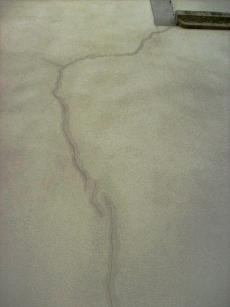
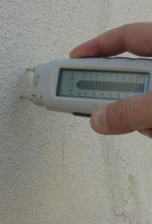
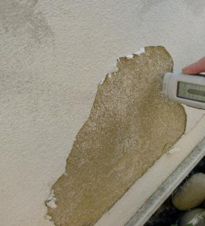
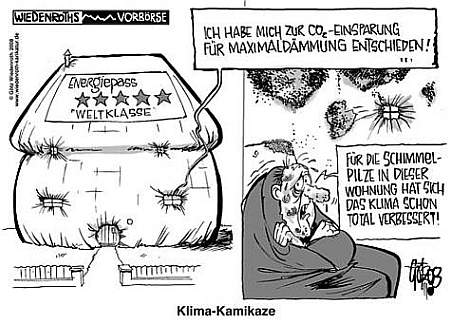
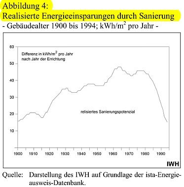
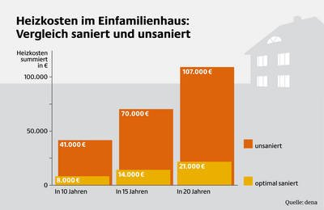
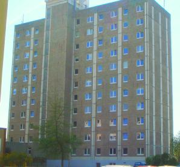
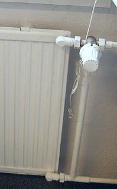
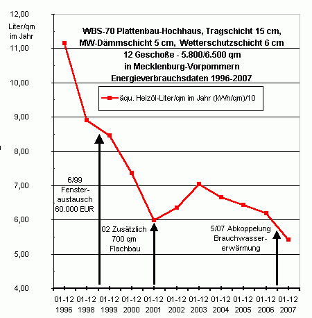
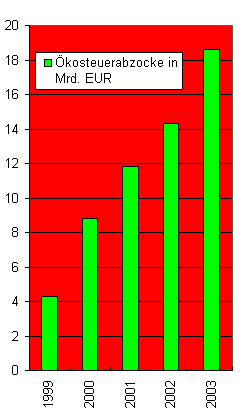

[🠔 Zur Übersicht: Energiesparen](7wsvoant.md)  
# Der Schwindel mit dem EnEV-Energieausweis
**Der k- bzw. U-Wert und seine üblen Folgen für Ihre Gesundheit und Ihren Beutel**  
_von Konrad Fischer_

Leider hat der k-Wert (heute U-Wert), rechnerische Grundlage der Energiespartheorie, für die Praxis am Bau keine Bedeutung. Er gilt normgemäß nur im stationären Zustand, also im Labor. Siehe hierzu Details:

Link: [k-Wert/U-Wert-Narretei](2139bau.md#u-narretei)

Die erwarteten Energieeinsparungen durch Dämmung sind an Massivbauten (Mauerwerksbau, Holzbau mit massiver Wand aus Bohlen, Mauerstein-/Lehm-Gefachen, Betonbau, ...) wie die meisten Baudenkmale sowie andere klassische und moderne Altbauten deswegen nirgends eingetreten und technisch auch nicht möglich. [Schäume und Gespinste können nämlich Wärmeabfluß in der Praxis nicht dämmen](2139bau.md). Dafür gibt es seit langem wissenschaftlich und praktisch unwiderlegbare [Beweise](7fehrtab.md). Auch bei der Wärme gilt ja Heraklits "Panta rhei - Alles fließt". Und die manipulative Labormesserei, die etwas anderes herauskriegt, befördert dadurch nur Baustoffsurrogate aus Schäumen, Porenschwammmsteinen und Gespinsten, nicht jedoch die für den Wärmedurchfluß wirklich schwer durchdringbaren ungelöcherten Massivstein und ungehäckseltes Massivholz bzw. andere echt massive Baumaterialien. Jeder kann das übrigens in punkto sommerlicher Wärmeschutz erfahren, wenn er nur mal in eine alte Kirche gehen würde, eine Burg oder sonst einen echten Massivbau. Und nur nach der bauphysikalischen Schwindeltheorie - da ohne Speicherfähigkeit der Bausubstanz und ohne Sonnenstrahl des Himmels - zum Anfeuern der Umsätze ihrer Lobbyisten dankbar aufgenommen von der "Klimaschutzpolitik" quer durch alle etablierten Parteien - können die Dämmstoffe Energie sparen. 

Konrad Fischer: Fassaden energetisch richtig und kostensparend sanieren 1  

  
[Teil 2](http://www.youtube.com/watch?v=Y1NSxAW15Cc) [Teil 3](http://www.youtube.com/watch?v=RAT7VzBo8k0) [Teil 4](http://www.youtube.com/watch?v=6TBII25iVQk) [Teil 5](http://www.youtube.com/watch?v=Kb0C4KiZvVA) 

 Das Deutsche Ingenieurblatt DIB, Kammerorgan der Ingenieure, Heft 11 2008 läßt uns zum Energiesparbeschiß endlich mal folgendes lesen: _"Wahrscheinlich ist ... eine geringere Energieeinsparung als im (nach DIN/EnEV) unterstellten Gebäudemodell berechnet, da die Studie ("Wirtschaftlichkeit energiesparender Maßnahmen für die selbst genutzte Wohnimmobilie und den vermieteten Bestand in Bezug auf die Anforderungen der Einergieeinsparverordnung (EnEV) ab 2009" des Institutes Wohnen und Umwelt IWU Darmstadt für die Bundesvereinigung der Spitzenverbände der Immobilienwirtschaft BSI -[Download pdf](http://www.bsi-web.de/download/080623_BSI_Bericht_und_Bewertung.pdf)) als Ausgangspunkt der Wirtschaftlichkeitsberechnungen beim theoretischen Energiebedarf festgelegter Mustergebäude ansetzt. Eine aktuelle Auswertung von Energieausweisen der Arbeitsgemeinschaft für zeitgemäßes Bauen zeigt, dass der tatsächliche Energiebedarf in der Praxis erheblich niedriger ist, als der theoretische Energiebedarf. Eine Sanierung, die sich bei einem hohen Energiebedarf für den Eigentümer "theoretisch" rechnet, kann praktisch trotzdem unwirtschaftlich sein. ... Es ist erkennbar, dass sich für jeden Eigentümer die Notwendigkeit einer belastbaren Ermittlung des tatsächlichen Einsparpotenzials ergibt, die auch den gegenwärtigen tatsächlichen Energieverbrauch in Bezug nimmt. ... Energieberatung, Planung und Qualitätskontrolle sind in den Investitionskosten der Studie nicht veranschlagt."_ 

Das Ingenieurblatt drückt es vorsichtshalber äußerst vornehm aus, was sich Kritiker des einschlägig bekannten Darmstädter Instituts schon lange fragen: Vielleicht es geht dort nämlich doch nicht ganz mit rechten Dingen zu und in manchen Studien wird u.U. solange gelinkt, bis was Gutes für die Dämmpropaganda herauskommt? Wirtschaftlichkeitsberechnungen ohne Ansatz der wahren Einsparpotenziale, ohne Ansatz der Vollkosten und vielleicht noch ein paar andere Schlawinereien - darf man die heutzutage seriös nennen? Peinlich für die so hochmögenden Auftraggeber, die sowas kommentarlos schlucken und aus den Beiträgen ihrer einfaltspinselingen Mitglieder bezahlen! Oder war es wieder mal nur Spezlwirtschaft auf höchstem BRD-Niveau, wer weiß das schon in diesen unseren Zeiten? Wie lachhaft und eigensüchtig die Spitzenvertreter der Immobilienwirtschaft auf die EnEV-Novelle 2009 reagieren und nur ihre Schäfchen ins Trockene bringen wollen, ohne das zugrundeliegende Lügengebäude namens "Klimaschutz" auch nur im geringsten in Frage zu stellen, können Sie sich übrigens hier reinziehen: [Stellungnahme der Bundesvereinigung Spitzenverbände der Immobilienwirtschaft (BSI) zur öffentlichen Anhörung zum Entwurf eines Dritten Gesetzes zur Änderung des Energieeinsparungsgesetzes im Ausschuss für Verkehr, Bau und Stadtentwicklung des Deutschen Bundestages am 10. November 2008](http://www.bsi-web.de/download/BSI-Stellungnahme Anhörung EnEG 081105.pdf) (PDF). Erbrechen garantiert! 

_"Die wissenschaftliche Erkenntnis, dass der Mensch den Klimawandel verantwortet, ist unumstößlich. Die Temperatur unserer Biosphäre hat sich während der letzten 100 Jahre wahrnehmbar erhöht. Wetterextreme nehmen mehr und mehr zu. Wenn wir unsere Lebens- und Verhaltensweisen nicht ändern, wird sich die Erwärmung der Erde mit verheerenden Folgen auf unser Leben und auf die Zukunft nachfolgender Generationen auswirken."_ 

Hä? Unumstößliche Erkenntnisse der Wissenschaft? Seit wann gab es das jemals? Wahrnehmbare Temperaturerhöhung seit 100 Jahren, obwohl sich dies nur auf statistische Daten zweifelhaftester Herkunft bezieht und seit 10 Jahren diese Daten eine stetige Abkühlung ergeben? Zunehmende Wetterextreme, obwohl alle unverfälschten statistischen Erhebungen dem Hohn sprechen? Diktatorische Forderung nach unser aller Verhaltensveränderung? Wer kann es wohl sein, der sich dermaßen anmaßend und verantwortungslos über die Wahrheit hinwegsetzt? Der Papst? Fundamentalistische Evangelikale? Neonazis reinsten Wassers? Die organisierte Kriminalität? Aber nein! Es ist die Präambel eines sog. [Manifestes namens (hochtrab, hochtrab) "Vernunft für die Welt"](http://www.klima-manifest.de/) - dem Bundesbauminister seitens der Bundesarchitektenkammer und allerlei anderer Berufsorganisationen der deutschen Architekten und Ingenieure überreicht und bald darauf als deutscher Beitrag der Architekten und Ingenieure in die UN-Klimakonferenz im Dezember 09 in Kopenhagen eingebracht. Obwohl ich als bayer. Architekt Mitglied der Architektenkammer sozusagen mitgefangen bin - Leut, glaubt's mir - mit derartigem Humbug - trotz allerlei wohlgemeinter Vorstellungen und Absichtserklärungen in den folgenden Manifest-Rubriken "Wir müssen .. wollen ... werden" habe ich gewiß nichts zu tun. Ganz im Gegenteil - ich bemühe mich wirklich nach besten Kräften, dem immer mehr um sich greifenden [Klimaschutzbeschiß und der vollständig unbegründeten und nur den Ökoprofiteuren dienenden Klimahysterie durch Klimasimulationen mithilfe wissenschaftliche Aufklärungsarbeit entgegen zu treten](7klima.md): 

- [Kann es überhaupt wissenschaftlich unumstößliche Erkenntnis geben?](http://www.neundorf.de/Kritik/kritik.html) - [Unumstößliche klimawissenschaftliche Erkenntnis?](http://vademecum.brandenberger.eu/themen/klima/informationen.php) - [Mensch verantwortlich für Klimawandel und globale Erwärmung?](http://www.eike-klima-energie.eu/?WCMSGroup_4_3=6&WCMSGroup_6_3=1247&WCMSArticle_3_1247=478) - [Erwärmung der globalen Durchschnittstemperaturen der Biosphäre seit 100 Jahren?](http://vademecum.brandenberger.eu/themen/klima/verlauf.php) - [Wetterextreme?](http://www.rightsidenews.com/200904214460/energy-and-environment/sec.-chu-s-assertions-quite-simply-being-proven-wrong-by-the-latest-climate-data.html) - [Mensch kann Klimawandel stoppen?](http://www.welt.de/wissenschaft/article2368289/Klimaskeptiker-bringt-Forscher-ins-Schwitzen.html) - [Klimawandel - positive Folgen?](http://www.welt.de/wissenschaft/article2368289/Klimaskeptiker-bringt-Forscher-ins-Schwitzen.html) 

Doch was hilft es? Denk ich an Deutschland in der Nacht ... 

Die ebenfalls deutsche Gesellschaft für Mauerwerksbau läßt zur EnEV-Novelle dafür die Sau raus und einen wirklichen und unabhängigen Gutachter - Prof. Dr. Volker Eichener - ran. Das _"Modernisierungs-Magazin 10/2008"_ berichtet wahrheitsgetreu darüber, daß sich die von der Bundesregierung verabschiedete Verschärfung der EnEV wirtschaftlich nicht begründen lasse und die Entscheidungsträger mit getürkten Gutachten hinters Licht führe. Ab Januar 2009 sollen die Anforderungen an die Energieeffizienz um weitere 30 Prozent verschärft werden, 2012 nochmals um weitere 30 Prozent. Hans Georg Leuck, Vorsitzender der Gesellschaft für Mauerwerksbau DGfM, wird zitiert: 

_"Mit der EnEV-Novelle würde die falsche Wohnungsbaupolitik der letzten Jahre fortgesetzt. Sie würde Investitionen behindern."_ Es gibt also doch noch Leute in der Baubranche, die ihr Hirn nicht an der Garderobe abgegeben haben und nicht auftragsgeil im Prokrustesbett der Macht herumhuren. Und der DGfM-Geschäftsführer Ronald Rast bringt es so auf den Punkt: _"es kann nicht nachgewiesen werden, dass sich energetische Investitionen rechnen."_ und kritisiert, _"dass die Bundesregierung im August zur EnEV-Novelle zwar ein Gutachten des Darmstädter Passivhaus-Instituts vorgelegt habe, dieses aber gravierende Schwächen beinhalte. Tatsächlich weist Professor Volker Eichener in einem[Gutachten](http://www.dgfm.de/pdf-dateien/Aktion_impulse/2008/sept08/Eichener_BBR_Guta080901.pdf) nach, dass die Studie aufgrund zahlreicher Mängel wertlos sei. Der Experte der Fachhochschule Düsseldorf und des Instituts für Wohnungswesen, Immobilienwirtschaft, Stadt- und Regionalentwicklung an der Ruhr-Universität Bochum kommt in seiner Analyse zum Ergebnis, dass sich eine energetische Sanierung bei der Erreichung von Klimaschutzzielen für Immobilieneigentümer in vielen Fällen nicht auszahlt."_ Der Bundesregierung wirft Leuck vor, die überteuerten Investitionen in den angeblichen Klimaschutz "schönzurechnen": _"Daher warne ich davor, Haus- oder Wohnungsbesitzern vorzugaukeln, energetische Sanierungsinvestitionen würden sich für sie mittelfristig auszahlen."_ 

Wir kennen solch diplomatische Sprache - übersetzt könnte das verquaste Geseiere der DGfM vielleicht heißen: Die Bundesregierung und die bestochenen Helfershelfer in der beteiligten ministeriellen Administration versuchen wieder einmal mithilfe für teueres Steuergeld professionell vereinseitigter Gefälligkeitsgutachten von einschlägigen Ökoprofiteuren sowohl den Bundesrat, die Abgeordneten wie auch das eigene Volk und alle Medien voll zu verhohnepipeln, um sie dem Ausschlachten der Profiteure auszuliefern. Oder liegt hier ein Übersetzungsfehler vor? 

Doch zurück zum Thema Dämmstoffmüll: Die geforderten Energiesparmaßnahmen schädigen nicht nur die öffentlichen und privaten Kassen (Profiteure ausgenommen). Die modernen "Dämmstoff"-Konstruktionen bedrohen außerdem die gesamte Bausubstanz durch konstruktionstypisch überhöhte und sogar vom Fraunhofer-Institut für Bauphysik meßtechnisch nachgewiesene kondensatbedingte [Feuchteaufnahme](7wdvs06.md#ibp) und -speicherung. In _"Risiken richtig beurteilen und vermeiden. Schimmel innen - Algen außen"_ kommen die Autoren Prof. Dr.-Ing. Dipl.-Phys. Klaus Sedlbauer und Dr.-Ing. Martin Krus vom Fraunhofer-Institut für Bauphysik ebenfalls im DIB 11/08 obendrein zur Erkenntnis, wonach _"die Verbesserung des Wärmedämmstandards zu einem deutlich höheren Risiko eines Befalls der Außenfassade mit Schwärzepilzen oder Algen"_ führt (S. 9). Und zwar wegen der systematisch bedingten hohen Feuchteaufnahme in nicht ausreichend speicherfähigen Dämmfassaden. 

Da mutet es nachgerade höhnisch krass an, wenn ein Denkmalpfleger Michael Habres ausgerechnet in den _"Denkmalpflege Informationen Nr. 141, November 2008"_ des Bayerischen Landesamts für Denkmalpflege in München zur Instandsetzung des ehemaligen Amtshauses von Schnelldorf (Lkr. Ansbach) zum Besten gibt: _"Der Außenputz musste, da er sich großflächig als schadhaft erwiesen hatte, gänzlich erneuert werden. So bot sich die Gelegenheit, einige Zentimeter Wärmedämmputz aufzutragen und das Gebäude in gewissem Maße dämmtechnisch zu optimieren. Anschließend wurden die Fassaden nach Befund in gebrochenem Weiß und in Grau gefasst."_ (S. 24). In einem weiteren Beitrag ist dann davon die Rede, daß bei der Sanierung eines spätmittelalterlichen Vogteibaus in Schwabach das _"Regelwerk der Energieeinsparverordnung (EnEV) im Grundatz eingehalten werden musste"_ (S. 26) - als ob es nicht gerade bei Baudenkmälern die einfachste aller Übungen wäre, mit Hilfe des EnEV § 24 und in gesetzestreuer Befolgung des Wirtschaftlichkeitsgebots des EnEG § 5 das ansonsten denkmalschädliche EneV-Dämm-Regelwerk auszuhebeln - auch und wg. Denkmalschutz selbstverfreilicht! 

Doch es liest sich noch mehr als krass weiter dort: _"Da es sich um eine Maßnahme der örtlichen Wohnungsbaugesellschaft gehandelt hat, musste gewährleistet sein, daß die Maßnahme nach den Prinzipien der Nachhaltigkeit und Energieeffizienz angelegt ist. ... vollständige Dämmung der Gebäudehülle nach der gesetzlich vorgeschriebenen sog. Zwangslüftung ...Obwohl aus bauphysikalischen Grüdnen eine Aufsparrendämmung zu bevorzugen gewesen wäre, entschied man sich für eine Zwischensparrendämmung, da die authentische Wirkung bzw. detailgetreue Reparatur der Ortgangbereiche und der profilierten Traufgesimse denkmalgerecht nicht möglich gewesen wäre."_ 

Jo mei und sackerlzäment, wenn sich sogar die als besonders kompetent angesehene boarische Denkmalpflege zum fördernden Fürsprecher der denkmalzerstörenden Dämmkriminalität macht und vor der Dämmpropaganda mit neudoitschen Worten wie "dämmtechnisch optimieren" nicht zurückschreckt, das läßt schon tief in die fachliche Befindlichkeit und die ausgehungerte bzw. verdummte Personaldecke der modernen Denkmalpflege einblicken. Da hilft kein "gebrochenes Weiß" mehr weiter, es ist vielleicht sogar insgesamt zum Kotzen! Abgründe tun sich auf, oddä? Alles halb so schlimm? Aber nein, denk mal an!: 

So könnte auch das vom bayerischen Denkmalamt bezuschußte Dämmen nach kurzer Zeit aussehen - hier eine dämmtechnisch unter den Augen der Denkmalbehörde und mit denkmalbedingten Steuerersparnissen und Zuschüssen vergewaltigte Denkmalfassade in Baden-Württemberg, die ich für die geschädigten Eigentümer begutachten mußte: 

   
Dämmputz-Fassade - übrigens an allen Seiten gerissen - man beachte den vergeblichen Rißklebeversuch, nicht nur in den Rißbereichen total aufgefeuchtet und am Sockel naß und abgängig. Innen sind die Wohnungen teils verschimmelt, logo. 

Und hier bittärschän die [Webseite zur abgesoffenen Dachdämmung im Baudenkmal](21316bau.md) - doch vorher Beruhigungspille nehmen. 

Selbstverständlich wäre die Denkmalpflege nach alter Konservierungs-Väter Sitte (DEHIO! RIEGL!) mit einer vehementen und engagierten und fachkundigen Verteidigung des armen, aber herzensglühend heißgeliebten Baudenkmals gegen den selbstsüchtigen Dämmfanatismus die einzig sinnvolle "nachhaltige und energieeffiziente" Chose gewesen, die auch den Gesetzgeber mit seinem Energieeinspargesetz EnEG - Rechtsgrundlage der Energieeinsparverordnung - dort wird die WIRTSCHAFTLICHKEIT der Energiesparerei gesetzlich gefordert! - einzig befriedigt hätte. Wo sind die entsprechenden Kenntnisse in den Denkmalbehörden? Welcher bayerische Denkmalpfleger kennt die radikal aufklärende Schrift des Deutschen Nationalkomitees für Denkmalschutz "Energieeinsparung bei Baudenkmälern, Heft 67"? Niemand? Schade für den Denkmalschutz, schade aber auch für jedes alte oder neue Bauwerk (Altbau, Neubau) und vor allem jeden Bauherren. Gottseidank gibt es aber auch noch ein paar Dämmskeptiker in den Denkmalfachbehörden - sie sind jedoch nach meiner unmaßgeblichen Einschätzung eher selten. 

Die mit der Gebäudedämmung und -abdichtungverbundene Gesundheitsschädigung der Wohnbevölkerung darf bei der Gesamtbeurteilung der staatlich geförderten und erzwungenen Dämmerei und Dichterei im Land der Dichter und der Dämmer nicht übersehen werden. Nicht weiter vor sich hindämmern! Aufwachen, aber Hallo! Wir sind Weltmeister!, und zwar des fruchtlosen Energiesparens und - der Asthma- und Allergiekranken. Schimmelpest, Silberfische und Milben sind inzwischen vertraute Begleiterscheinungen der 'energetischen Sanierung' des Altbaubestandes. Ganze Sachverständigenheere und Mietervereine leben davon und loben deswegen in einem Fort das tolle Wirken der staatlichen Energiesparpolitik. Hier auf dieser Seite wollen wir etwas hinter die Energiespar-Kulissen blicken, auch mal gegen den Strich bürsten und dabei die "offiziösen" Medienergüsse durchaus einseitig selektieren und kritisch kommentieren. 

[Hier finden Sie übrigens einige widerliche Details zur Energieeinsparverordnung und zur heute noch möglichen Gegenwehr aus Beamtensicht](21311bau.md) 

Im Obermain-Tagblatt Lichtenfels las man am 10.10.00 zur mißglückten Energiesparerei: 

**_"Allergien nehmen weiter rasant zu_**

_Etwa jeder dritte Deutsche ist nach Angaben des Ärzteverbandes Deutscher Allergologen (ÄDA) Allergiker. "Allergien nehmen rasant zu", sagte der Bonner Professor Joachim Sennekamp anlässlich des 26. Allergologen-Kongresses. Die neusten Zahlen zeigten, dass bereits 15 Prozent der Deutschen Heuschnupfen, neun Prozent eine Kontaktallergie und fünf Prozent Asthma hätten._

Risikofaktoren sind nach Ärzteangaben die erhöhte Milbenbelastung in modern isolierten Wohnungen, übertriebene Hygienemaßnahmen, der zunehmende Straßenverkehr, Ernährungsgewohnheiten sowie die vermehrte Haustierhaltung."

[ 
© Götz-Wiedenroth-Karikatur: Klima-Kamikaze (durch Energiepass-Weltklasse): 
"Ich habe mich zur CO2-Einsparung für Maximaldämmung entschieden - Für die Schimmelpilze in dieser Wohnung hat sich das Klima schon total verbessert!"](http://gwiedenroth.googlepages.com/)

Das Bauministerium tut nun das Seine dazu, damit möglichst bald die 100-Prozent-Krankheitsrate bei der klimaschützenden Wohnbevölkerung erreicht wird. Isolierzwang mittels klimarettender Energiesparverordnung heißt die segensreiche Aktivität. Sie läßt die Bau- und Gesundheitsbranche jubeln. Manche munkeln, daß die Pharmamafia, unbestritten die mächtigste international agierende Lobby, der eigentliche Motor des falschen Dämmens und Dichtens auf dem Verordnungswege sei. Unzählige Medikamente mit ständig steigenden Umsatzerlösen werden so verkauft, die allein durch mehr Lüftung und trockene Wohnverhältnisse ersetzt werden könnten. Wunderglauben wird allgemein verbreitet - Allgemeine Bauzeitung 12.1.01: _"Nachhaltig bauen mit Polyurethan-Dämmstoffen ... Bereits mit einer 1,9 cm starken Hartschaum-Platte erziele man denselben Wärmedämmwert (k-Wert) wie mit einer 153 cm starken Beton-Wand."_ - ohne zu fragen, ob so praktikables und energiesparendes Bauen tatsächlich entstehen kann? Die Chemieriesen dürfen dabei zweimal kassieren: Für die von ihnen produzierten Dämmstoffe und die Medikamente. Synergie heute.

Die Rechtsfolgen für die anderen Beteiligten: Der geschädigte Mieter behält Miete ein und klagt gegen den Vermieter. Der geschädigte Bauherr geht - von klugen Rechtsanwälten beraten - nicht auf den bankrottgefährdeten Handwerker, sondern auf den haftpflichtversicherten Architekten los. Nur der kann ja seinen Pfusch versichern. 

Interessant ist aber, was sich im juristischen Untergrund entwickelt: Ausgehend von der Beobachtung amerikanischer Verbraucherschutzklagen werden Modelle entwickelt, die Produzenten der untauglichen Bausysteme wegen fehlerhafter Inverkehrsbringung gem § 3 Produkthaftungsgesetz zu beanspruchen. Hier winkt das eigentliche Geld für die arbeitslose Juristenriege.

Problematisch ist die Sache vor allem für die mit Fördermitteln und Refinanzierungsdruck in vorausseilenden Gehorsam gejagte Wohnungswirtschaft. An wen soll sie sich halten, wenn herauskommt, wie nutzlos ihre Modernisierungsumlagen verpulvert wurden? An die Handwerker und Planer, wie oben erwähnt? Ist das gerecht? Ist nicht eigentlich der Staat schuld an diesem Energiesparschwindel? Nachdem nun sogar der Wohnungsabriß gefördert wird, wäre die Rückführung der kaputtsanierten Wohnungen in gesunde Zustände ein breites Betätigungsfeld der Subventionsspezialisten. Oder soll man sich halt doch an die Produzenten der Dämm- und vorgeblichen Energiesparsysteme mittels Anlagentechnik wenden? Hätten Sie ihren Mist halt wahrheitsgetreu "in Verkehr gebracht" - mit Hinweis auf Nebenwirkungen und Risisken. Nachdem nun sogar die BSE-zerkristen Bauern mit Witti und Fagan ihre Rechte reklamieren - sicher haben diese Wiedergutmachungsspezialisten auch keine Probleme damit, die gelackmeierte Wohnungswirtschaft zu vertreten ...

In der Energiefrage spielt auch die von den Medien zunehmend übersteigerte (sebnitzierte?) Klimahysterie eine wichtige Rolle. Sie verheißt uns erdumfassende Schockzustände und fördert das menschenverachtende Geschäft mit der Angst. Die kritiklosesten Zeitgenossen fallen darauf herein. Und die menschenverachtenden Weltverbesserer mit ihrer Mediokratie. Keine Maßnahme ist offenbar zu grausam, um Mitbürger mit "falschem" Bewußtsein auf den Pfad des weltrettenden Gutmenschen zu prügeln, in Wahrheit gerade die Ärmsten und Hilflosesten der Gesellschaft grausig auszuplündern. Gegen diesen schwarz-rot-grün-gelben Ökoscheiß (von ÖKÖ-Steuer über EEG zu EnEV) war der marxistische Totalitarismus ein reines Zuckerschlecken - selbst die der DVU nahestehende National Zeitung hebt den selbstverliebten Sonnenanbeter Prof. Alt auf ihren Schild und tarnt solche Untaten als "Friedenspolitik". Ja, der Schoß ist "fruchtbar noch".

**Von der "EU-Energieeffizienzrichtlinie" zum Nationalen Energiepaß/Energieausweis - So funktioniert der Ökofaschismus**

Auch die EU mißbrauchen die "deutschen" Ökomafiosi für die Abzocke unserer wehrlosen Bevölkerung! Kioto/Kyoto, [CO2-Lüge](7thuene1.md) und das [ Märchen von bald endender "fossiler" Energie](8buch22.md#gold) - kein Beschiß wird ausgelassen, um die Ökoausplünderung auch EU-mäßig zu fördern. EU-Energieeffizienzrichtlinie/EU-Richtlinie über die Gesamteffizienz von Gebäuden (_"Richtlinie 2002/91/EG des Europäischen Parlamentes u. d. Rates v. 16.12.2002 über die Gesamtenergieeffizienz von Gebäuden"_ , im Amtsblatt der Europäischen Gemeinschaft vom 4.1.2003 veröffentlicht) heißt hier die neueste Klima-Schutzgeld-Erpressung als wieder einmal "erster Streich" unserer neofaschistischen ÖKO-Mafia, die nun dank international agierender Dämm- und Heizungslobby "ins nationale Recht" umgesetzt wird. Bald muß an (nach derzeitiger Richtline vorerst "öffentlichen") größeren Altbaufassade ein _"Ausweis über die Gesamtenergieeffizienz an einer für die Öffentlichkeit gut sichtbaren Stelle angebracht"_ werden (Art. 7 (3)): Der "**Energiepaß** ". Nur heurige Hasen glauben, daß diesem ersten öffentlichen Streich keine weiteren privat folgen.

In gewohnter Weise beeinflußt durch die Profiteure wird dann das passende Bundesgesetz - das Energieeinspargesetzt EnEG - gegenüber der EU-Version noch wesentlich verschärft. Auszug [Gesetzesänderungsvorschlag vom 11.4.05](http://dip.bundestag.de/btd/15/052/1505226.pdf):

_㤠5a 
Energieausweise 
Die Bundesregierung wird ermächtigt, zur Umsetzung oder Durchführung von Rechtsakten der Europäischen Gemeinschaften durch Rechtsverordnung mit Zustimmung des Bundesrates Inhalte und Verwendung von Energieausweisen vorzugeben und dabei zu bestimmen, welche Angaben und Kennwerte über die Energieeffizienz eines Gebäudes, eines Gebäudeteils oder in § Abs. 1 genannter Anlagen oder Einrichtungen darzustellen sind. Die Vorgaben können sich insbesondere beziehen auf 
1. die Arten der betroffenen Gebäude, Gebäudeteile und Anlagen oder Einrichtungen, 
2. die Zeitpunkte und Anlässe für die Ausstellung und Aktualisierung von Energieausweisen, 
3. die Ermittlung, Dokumentation und Aktualisierung von Angaben und Kennwerten, 
4. die Angabe von Referenzwerten, wie gültige Rechtsnormen und Vergleichskennwerte, 
5. Empfehlungen für Verbesserungen der Energieeffizienz, 
6. die Verpflichtung, Energieausweise Behörden und bestimmten Dritten zugänglich zu machen, 
7. den Aushang von Energieausweisen für Gebäude, denen Dienstleistungen für die Allgemeinheit erbracht werden, 
8. die Berechtigung zur Ausstellung von Energieausweisen einschließlich der Anforderungen an die Qualifikation der Aussteller sowie 
9. die Ausgestaltung der Energieausweise.“_

Jedem Käufer, jedem Mieter ist folglich - aber nur auf Anfrage und nicht bei laufenden Mietverhältnissen!, eigentümerseits schriftlich von diesem ominösen Effizienzstatus, der ja sollgemäß keinerlei Nähe zum tatsächlichen Energieverbrauch hat, mittels Vorlage des Energiepasses zu berichten. Damit er seinen Mängelprozeß dokumentengestützt besser gewinnen kann? EU-Richtlinien-Art. (1): _"Die Mitgliedstaaten stellen sicher, dass beim Bau, beim Verkauf oder bei der Vermietung von Gebäuden Eigentümer bzw. dem potenziellen Käufer oder Mieter vom Eigentümer ein Ausweis über die Gesamtenergieeffizienz vorgelegt wird."_ Und in 10-Jahresfolge muß ein sog. Energieberater ständig nachzertifizieren, die perfekte Falle. 

Klaus Werwath, Chefredakteur des Deutschen Ingenieurblattes DIB bringt die unsägliche Lage rund um die die Energieberaterei aus technischer Sicht in seinem im Novemberblatt erschienenen Editorial "Die besten Fehler ..." prächtig auf den Punkt: 

_"... in dem ... Artikel auf Seite 28, ... Überschrift "Ergebnis: erschreckend" ... [wurde berichtet über] Resultate ... bei einem Vergleich von sechs ernst zu nehmenden Rechenprogrammen ..., die den Ingenieuren bei der Bewältigung der DIN V 18599 [Energetische Berechnung, Bilanzierung, Bewertung von Gebäuden und Erstellung von Energieausweisen. Berechnungs-Methode gemäß EU-Richtlinie für energieeffiziente Gebäude. Die EnergieeinsparVerordnung (EnEV 2007) nimmt auf die DIN V 18599 Bezug.] helfen sollen. ... in vielen Anrufen, E-Mails und Zuschriften aus ihrer Praxis als Ingenieure [legen Leser und ... Anwender der EnEV-Software] das bloß, was eigentlich alle wissen, dass in der DIN V 18599 "einige Hundert Fehler und Widersprüche stecken", wie [Software-Hersteller Dipl.-Ing. Andreas] Kern geschrieben hat, "darunter auch mehr als ein Dutzend schwerwiegende, die nicht umgangen werden können". 

Diese Fehler in der Norm aber sind der Grund dafür, dass viele Programme nicht so funktionieren, wie sie sollen. Die Programmierer haben allerdings auch einen gerade zu absurd schweren Stand, sollen sie doch eine fehlerfreie Software für eine fehlerhafte Software für eine fehlerhafte Norm schreiben; wobei "fehlerhaft" hier auch noch für grotesk überfrachtet und nicht handhabbar steht ... Der Fall zeigt, dass eine Grundsatzdebatte fällig ist darüber, was unsere Normen leisten sollen. ... 

Diese Debatte muss aber aus Sicht derer geführt werden, die diese Normen praktisch anwenden, nicht aus der Sicht derer, die sie bis zur fünfzehnten Stelle hinterm Komma theoretisch ausfeilen. 

Das Ergebnis unseres Artikels, dass nämlich alle sechs analysierten Softwareprodukte bei der Eingabe eines verhältnismäßig einfachen Gebäudes zu sechs zum Teil deutlich voneinander abweichenden Ergebnissen kommen, ... ist ... erschreckend, und ... sollte die gesamte Fachwelt dazu anregen, ... vor allem öffentlich darüber nachzudenken –, warum unsere bautechnischen Normen solche katastrophalen Dimensionen mit solch folgenreichen Fehlerquellen angenommen haben, und wie man das schleunigst wieder zurückfahren kann. ... mit der Veröffentlichung dieses Artikels [ist es uns] nicht darum gegangen ..., die Softwarehersteller schlecht zu machen, sondern nur ... um den Beweis der Erkenntnis, dass mit der DIN V 18599 ein System vorliegt, das viel zu kompliziert und unübersichtlich ist, als dass es in der Praxis problemlos umgesetzt werden könnte."_

Ja, so macht Energiepaß Energiespaß. Und selbstverständlich dürfte Werwath wissen, daß jegliche - und sei sie auch noch so sachlich und seriös vergetragen - Kritik am Energiesparschwindel aussichtslos ist. Nicht umsonst haben die Ökoprofiteure seit Jahrzehnten ihre Strategie der Politikbeeinflussung genial entwickelt, wer würde sich das nun aus der Hand schlagen lassen? Wo es doch so viel bringt! 

Ja, dat kostet und dat bringts. Wie nur die Polydicker so arg treuherzig Weltrettung geben! Laßt uns alle drum dankbar sein. Und die Medien! Und die Spitzen der Wirtschaft! Und die Spitzen der Eigentümer- und Mieterverbände! Dagegen war die alte Gleichschaltung ein buntestes Kaleidoskop der freiesten und frechsten Meinungen.

Ja, auch Ihre Banken machen da gerne mit und hetzen die angeblichen Energieberater in ihren Vortragssälen auf ihre vertrauensseligen Kunden. Warum? Weil die Banken genau wissen, wie sich das für sie lohnen wird: Der untreue Energieberater (soll's ja hin und wieder geben, vielleicht / viel leicht) "berät" dank seiner lizensierten Energieberater-Software (raten Sie mal, wer die Lizenzgebühr einsteckt, ätsch, ich weiß es!) und dank seiner für teuer Geld am Energieberater-Seminar erworbenen Zertifizierung (und wer kassiert dabei hintergründig ab?) zum plumpen Knöpfligedrücke (kann nämlich auch nicht selber rechnen!) zu allergröbstem Energievergeudungs-Unsinn: 

- Umstellung auf [unwirtschaftliche Blödsinns-Energien](7temp23.md), die bald wieder durch was Gscheits ersetzt werden müssen, die Fälle sind Legion, sowie 
- Gebabbe und Gestopfe von [schnell verschimmelndem Faser- und Schaumgelump - vulgo Dämmstoffe](213baust.md) - die gar niemals nicht auch nur eine Kilowattstunde einsparen werden. 

Alles Pseudo-Energiespar-Mist, der sich voraussehbar und sicher niemals gegenrechnen wird und damit dem Privatkunden aus dem Sparstrump Geld entzieht, das er dem zinsenfressenden Bankensystem in den Rachen schmeißen wird und obendrein irre Schulden aufnehmen wird, alles fein geködert durch KfW-Förderkredite oder Zuschußlappalien, die niemals den Mehrkostenaufwand rechtfertigen, selbst wenn ein wahres Wort am Energiegespare wäre. Und so liest man in den Energieberater-"Gutachten" Gedöns und Geschmurchel wie folgt (aus: " Energieberatungsbericht zur sparsamen Energieverwendung in Wohngebäuden vor Ort für das Einfamilienhaus in ..., BAFA-Berater Nr. ... vom 18.10.2009 (Schreibweise gem. vorliegendem Originaldokument): 

_"Die Enquêtkommission des Deutschen Budnestages hat ermittelt, dass es, um die Folgen unseres Energieverbrauchs in erträglichen Grenzen zu halten, erforderlich ist, bis zum Jahre 2050 den CO 2-Ausstoß um 80% (basis 1987) zu reduzieren und dieses bei wachsender Weltbevölkerung. Diese Zahl verdeutlicht die Dringlichkeit von Energiesparmaßnahmen. Aus diesem Grunde sollte die Wirtschaftlichkeit von Maßnahmen nicht als alleiniges Kriterium betrachtet werden."_ 

Auf Altdeutsch: Weil es die Lobbyisten in der Kommission und Bundesregierung geschafft haben, [den gewillkürten "menschengemachten Klimawandel"](7argus.md) zum Fundament der Ökoabzockpolitik zu machen, soll der vom Energieverbrater hereingelegte Kunde seine wirtschaftlichen Interessen nicht mehr angemessen wahrnehmen und nicht nur die seinen Geldbeutel schädigende Falschberatung widerspruchslos bezahlen, sondern auch all die unsinnigen Baumaßnahmen bezahlen. So schön ist Bauernfängerei heute. 

Wie gut, daß weder Bankkunden noch die meisten Bauherren nicht rechnen können. Setzen sechs! 

Oder fragen Sie Ihren schönen Energieverbrater, der Sie für seinen zum Himmel schreienden Datenmüll gerne von Ihrem schnäden Mammon befreit (seien Sie doch froh, ein reicher Jüngling kommt nie ins Himmelreich!), wie er sich die Gewährleistung und Haftung für sein Beratungsergebnis - Zehn- bis Hundertausende wenn nicht Millionen Fehlausgaben für Sie, mit denen Sie meist Ihr Haus und die Gesundheit seiner Bewohner / Nutzer ruinieren! - aussähe? Und weiden Sie sich an seinem (übrigens auch auf dem Energieberaterseminar und unter Eindruck wohl nicht immer gerichtsfester Meinungsabsonderungen der BAFA einstudierten / eingecoachtem Gestammel). Denn trotz aller verzweifelten Versuche der nur angeblich raffinierten Energieberater, sich von jeglicher Haftung für ihren ungeheuerlichen Datenmüll freizuzeichnen, bleibt eines doch zu wissen: Die Leistung des Energieberaters kann tausendundeinsmal als "Beratungs-Dienstleistung" nomenklatiert werden. Es bleibt für den Besteller nicht nur nach verständiger Rechtsauslegung eine auf Erfolg getrimmte Werkleistung nach BGB. 

Deswegen schreiben nicht nur juristische Profis wie Andreas Weglage, Thomas Gramlich, Bernd Pauls, Stefan Pauls, Ralf Schmelich und Tobias Jasef in "Energieausweis - Das große Kompendium: Grundlagen - Erstellung - Haftung, 2009 zum Haftungsthema im hier besonders interessierenden Umfeld der Anspruchsvoraussetzungen für einen sog. "Mangelfolgeschaden gem. § 280 Abs. 1 BGB" sehr tiefschürfend und m.E. auch sehr zutreffend auf Seite 267 u.a.: 

"Ersatz sonstiger durch einen Mangel verursachten Schäden ... 

Es handelt sich hierbei um Schäden an den Rechtsgütern des Bestellers in Folge von Mängeln an dem bestellten Werk [KF: des Energieberaters, also Energieausweis, Energieberatung, Energieberatungsbericht]. Diese sog. Mangelfolgeschäden (... Begleitschäden ...), die der Besteller [KF: Hausbesitzer] also außerhalb des eigentlichen Werkes an seiner Gesundheit [KF: Schimmelpilzbefall infolge des dem Beratungsergebnis beispielsweise folgenden Einbaues dichter Fenster oder nässeanreichernder Dämmstoffe], an seinem Eigentum [KF: Geldverluste infolge in Wahrheit unwirtschaftlicher, also nicht in 10 Jahren amortisierbarer Energiesparmaßnahmen, die der Energieberater als in irgendeiner Weise "sinnvoll" empfahl] oder an sonstigen Rechtsgütern erleidet, werden hiernach ersetzt. 

Anspruchsvoraussetzungen 

Auch hier gilt zunächst wieder, dass sich der Aussteller [KF: eines Energieausweises, also der Energieberater] nicht [KF: durch irgendwelche skurrilen Haftungsfreizeichnungsklauseln in Form allgemeiner Geschäftsbedingungen] entlasten kann, das heißt, er muss den Schaden, den er durch seine [KF: nur durch individualvertragliche Vereinbarungen abbedingbare] Pflichtverletzung zu vertreten hat, tragen [KF: Zahlen macht Frieden]. Dies wird stets, solange der Aussteller nichts zu seiner Entlastung vorträgt [KF: Beispielsweise eine vom Auftraggeber einzeln gegengezeichnete handschriftlich im Auftragsschreiben eingefügte und einzeln gerichtsfest nachweisbar beratene Vertragsklausel, wonach es zum beauftragten Leistungsumfang des Energieberaters gehört, auch zu bautechnisch ungeeigneten und dramatisch unwirtschaftlichen Weltrettungsmaßnahmen auf Kosten und am Bauwerk des Auftraggebers ohne jegliche Haftungsverantwortung zu raten, ohne dies im Einzelnen darlegen zu müssen. Dann darf er freilich zu dicker Dämmung und Dreifachisolierverglasung, zu Heizungserneuerung inkl. Anzapfung australischer Thermalquellen, zu Wärmerückgewinnung, bis alle Hausbewohner am Bakterienschleim aus den Abluftkanälen gestorben sind, zuraten. Aber nur dann.], vermutet. Des Weiteren muss der Mangel bereits bei der Abnahme des Energieausweises [KF: und ggf. Energieberatungsberichts] vorgelegen haben und es müssen durch diesen Mangel bedingt Mängelfolgeschäden eingetreten sein. 

Umfang und Höhe eine Mangelfolgeschadens 

Der Umfang bzw. die Höhe eines so entstandenen Schadens ergibt sich aus § 280 Abs. 1 BGB. Insbesondere erfasst der Mangelfolgeschaden ... auch einen Schmerzensgeldanspruch, wenn die Voraussetzungen des § 253 Abs. 2 BGB vorliegen, das heißt ein Rechtsgut wie insbesondere der Körper oder die Gesundheit verletzt worden ist. 

Ein typisches Beispiel für Mängelfolgeschäden sind die Kosten von aufgrund einer falschen Empfehlung zur Steigerung der Gesamtenergieeffizienz vorgenommenen (sinnlosen) Baumaßnahmen, die Kosten der Beseitigung von Schimmelpilzen ... (als Folge der sinnlosen Baumaßnahme) und schließlich eine Entschädigung in Geld für die Gesundheitsbeeinträchtigungen der Bewohner ... als weitere Folge dieses Mangels. ... 

Der Geschädigte muss für die Geltendmachung eines konkreten Schadens die Ursächlichkeit zwischen Rechtsgutverletzung und dem Schaden dartun ... die Verbindung zwischen dem mangelhaften Energieausweis und den dadurch entstehenden Kosten durch entsprechend eingeleitete - jedoch in ihrer Wirkung - völlig ungeeignete Umbau- und Modernisierungsmaßnahmen. ... 

Zum Beispiel muss ein Energieausweisersteller für Schäden haften, die durch entstandene Feuchtigkeit in Folge seines fehlerhaften Energieausweises an den Sachen eines Mieters des Bestellers entstanden sind ... hingegen haftet der Aussteller nicht für den Verdienstausfall, den der unter Bluthochdruck leidende Besteller aufgrund eines - wegen des mangelhaften Energieausweises - erlittenen Wutanfalls und daraus resultierenden Herzinfarktes erleidet. ... 

Liegt eine Rechtsgutverletzung [KF: als Folge von Ausweismängeln, die nicht der Regelverjährungsfrist von drei Jahren unterliegen, da der Geschädigte das Vorliegen der anspruchsbegründenden Umstände vorher nicht erkennen konnte] bezüglich des Lebens, des Körpers, der Gesundheit ... vor, gilt für die Verjährung gem. § 199 Abs. 2 BGB eine 30-JahresFrist, beginnend mit der Vornahme der Handlung, die den Schadensersatzanspruch begründet. 

Bei einer Verletzung von Eigentum ... gilt für die Verjährung von Schadensersatzansprüchen gem. § 199 Abs. 3 BGB eine Frist von 10 Jahren ab ihrer Entstehung und sogar eine Frist von 30 jahren - ohne Rücksicht auf ihre Entstehung - von der Begehung der Handlung, der Pflichtverketzung oder dem sonstigen den Schaden auslösenden Ereignis an." 

Tja, Energiesparen will offensichtlich gelernt sein, wie inzwischen viele Schadnesersatzprozesse gegen Energieverräter belegen. Auch der Präsident der Architektenkammer BW jammerte im DAB 9/2010 schon darüber herum. Zuallermeist fängt Energiesparen aber mit Energieberater Einsparen an. Das legen jedenfalls alle mir bis dato vorgelegten Energieberatungsergebnisse nahe, die in grauenhafter Weise den Energiebedarf, teils sogar den Energieverbrauch! durch grottenfalsche/gefälschte Rechennannahmen fahrlässig/grob fahrlässig/vorsätzlich? falsch berechnen und geradzu haarsträubendste Absurditäten vom nassen Wärmedämmpulli für ihr bis dato gesundes Haus über Heizungsrauswurf bis zu Technikschnulli empfehlen. Wie konnte es nur dazu kommen? 

Schon dolle, was sich die Ökos alles herausnehmen, damit ihre diplomierten Fachexperten mit U-Wert-Falschberechnungen ständig abkassieren. Noch doller: der gutmütige Michel! Und so nehmen nicht nur die doofen Verbraucher, sondern auch die deutschen "energieintensiven" Produzenten und ihre Arbeitnehmer (z.B. Aluminium, Kalkwerke und -steinbrüche, ...) ihren ökogemachten Untergang - bis auf ein bisserl Pseudo-Demo und Dynamitgetöse - widerspruchlos hin. Immer feste schwarz-braun-rot-grün-gelb wählen, christliberalgrünsozialextreme Freunde!

[BusinessWorld - Meldung EU-Richtlinie](http://www.businessworld.de/showNews.cfm?newsID=4742) 
[Immobilien - Wirtschaft und Recht: EU-Richtlinie über Energieprofile von Gebäuden - Kommentar und Download](http://www.iwr-magazin.de/news/showNews.cfm?newsID=5198&CFID=7282545&CFTOKEN=19702461) 
[DIMaGB.de - Infobereich: EU-Energieeffizienzrichtlinie Pro und Kontra](http://www.dimagb.de/info/gesetz/enevpuk1.html#hugeerl#hugeerl) - Stellungnahme Haus und Grund

Es folgt der zweite Streich - nun auf Bundesebene. Ausgekaspert nach der bewährten Methode "Etikettenschwindel": orwellscher Wortmißbrauch mittels Drohkulissen, gärtnernde Böcke und Verrat der Verbraucher und Mieter durch deren feindlich "überwanderte" Verbandspitzen - die pressure groups der Ökos. So kocht man auch den letzten ehrlichen Politiker weich, um das verordnungsgerechte Ausmagern des Volksvermögens weiter zu verschärfen - die unverzichtbaren metzgerwählenden Massen wollen es ja so:

_OT 15.3.03_

**_"Für Energie-Etikett"_**

_**BERLIN.** Verbraucherschützer, der Deutsche Mieterbund und der Verkehrsclub Deutschland haben eine Kennzeichnung des Energiebedarfs von Autos und Wohnraum entsprechend dem EU-Recht gefordert. Die Verbände werfen der Bundesregierung Versäumnisse vor. Es müsse nun umgehend ein leicht verständliches Label eingeführt werden, damit Verbraucher beim Autokauf oder der Immoblienwahl den Energiebedarf auf einen Blick erkennen können."_

Gegen diese scheinheiligen Mächte ist jede Gegenwehr zwecklos und - die verordnete EnEV-Verschärferei hat's ja hinreichend erwiesen - von vornherein zum Scheitern verurteilt.

Obendrein tut sich nun die Administration bis zur kommunalen Ebene mit der Deutschen Energieagentur dena (das klingt schon sehr verdächtig nach Energiediktatur, oder?) zusammen, um den Mieter mit sog. Heizspiegeln - natürlich nur auf wild errechneter Basis - aufzuhetzen, seinem Vermieter das Pseudo-Energiespar-Messer auf die Brust zu setzen. "Dämm, reiß Heizkessel raus oder nimm Mietminderung hin", so lautet die Devise. Das wird wie immer mit ein paar Testballons in den Bundesländern ausprobiert (z.B. Mainz, Tübingen, Freiburg, ...), um die schwächliche Gegenwehr auszutesten, seine Strategien zu verfeinern und dann flächendeckend gibs ihm! Administration der verbrannten Erde vom Feinsten. Der [beschissene Mieter](7fehrtab.md) zahlt die Zeche, der noch beschissenere Hausbesitzer mit. Wäre doch gelacht, wenn nur die Atommultis mittels EEG und sogenannter "Energiewende" zur staatlich sanktionierten Preistreiberei reicher würden, die ölige Dämm- und Heizbranche soll auch mal dürfen: EnEV + Dämmpaß bis zum Abwinken. Daß CO2 - egal ob manmade/menschengemacht, von Rindern (Kühen), Ziegen, Schweinen, Lämmern (Schafen), Ratten, Mäusen und Wichteln ausgestoßen bzw. ausgegörgst oder ausgefurzt - ein Popanz in den Händen einer Pseudo-Wissenschaftler, geldgieriger Ökoprofit-Unternehmen, Medien und einer mithelfenden Administration ist, daß [Dämmstoff nicht so dämmt, wie gedacht](2139bau.md), daß der Austausch bestens funktionierender Heizkessel gegen neuen Technikschmonz wirtschaftlicher Wahnsinn ist - schietegal. Hauptsache, es lohnt sich für die Mafia der Ökoschwindler und das Umkrempeln unserer Gesellschaft in einen ökommunistischen Gulag.

Ein krasses Beispiel dazu bietet - neben unzähligen anderen in unserer Bananrepublik - die Evangelische Stiftung Neuerkerode: Als "Umbau und energetische Sanierung" der aus dem Jahre 1972 stammenden Häuser Elm 1 und 2 wird auf dem Bauschild gepriesen, was die Wolfenbüttler Presse im Januar 2008 berichtet. Dort strebt man nach Aussage des Pressesprechers der Stiftung bei den entstehenden 8 Einzelappartements mit 28 Wohnplätzen einen "optimalen energetischen Standard" und den "Energiestandard EnEV - 30%" an, der angeblich den Energieverbrauch "um 60 %" senken soll. Das will man mit "umfangreichen Dämmmaßnahmen und neuen "Passivfenstern" (gem. Passivhausstandard) erreichen. Das Kostenvolumen allein der "energetischen Sanierung" beträgt schlappe 1.000.000 EUR, also eine Million Euro. In "13 bis 15 Jahren" soll sich das rechnen. Mein Informant schreibt dazu: 

_"2 Mio € für Sanierung in Neuerkerode, davon 1 Mio € für Dämmaßnahmen und Passivfenster bei 28 Wohneinheiten. Da muß man doch trotz PISA mal die 'Milchmädchenrechnung' aufmachen: 
1 Mio € / 28 = ca. 37.500 € pro WE. Muß man die finanzieren, so ergibt sich grob (6%;1%, 30 Jahre) 210 € / Monat. 
(Tatsächlich bezahlt man dann insgesamt ca. 81.500 €!! Die Bank wird 's freuen) 

Wenn ich von den letzt- bzw. vorletztjährigen Heizkosten für meine 120 m² (zugebenermaßen Mittel-) Wohnung (Altbau mit 36er Massivwänden) von 81 € 2006 bzw. 65 € 2007 pro Monat ausgehe, schätze ich den Bedarf einer o.g. Wohneinheit auf die Hälfte. 

Stellt sich doch die Frage, welchen Sinn es macht, um zur monatlichen Einsparung von (optimistisch vermutet, sagt die in Mode gekommene Vorstellung vom ökologischen Bauen: 50%) ca. 17 € eine Aufwendung von 210 € zu treiben?"_ 

Nun, solche Fragen darf man aber nicht stellen, wenn Ökogläubige das ihnen anvertraute öffentliche Geld verausgaben. Sonst kommt man wieder mal auf den Scheiterhaufen oder wird vorläufig wenigstens exkommuniziert. Selbstverständlich ist bei diesem üblen Spiel auch die politruckgesteuerte KfW-Bank beteiligt, deren finanzwirtschaftliches Gebaren ich hier nicht noch weiter in den Dreck ziehen will. Diese sehr verdienstvolle Arbeit haben ja schon alle anderen Medien im Zusammenhang mit der millionenschweren KfW-Überweisung an die bankrotten Lehman-Brüder-Bank in der USA getan. 

Zu welch peinlich-ökologistischen Hirnfürzen sich auch die evangelische Landeskirche in Bayern bei ihrem Criminal-Tango rund ums solargoldene Kalb herabläßt, wird im Mai 2011 wieder mal überdeutlich. Der neue [Landesbischof Heinrich Bedford-Strohm](http://www.bayern-evangelisch.de/www/ueber_uns/heinrich-bedford-strom.php) hat als Delegierter die Chance genutzt, nach Jamaika - nicht ökologisch korrekt brustschwimmend oder höchstens im selbstgeschnitzten Paddelboot aus Styroporrecyclat - sondern angenehmst umweltverkackendst jetmäßig zu düsen, um dann in Kingston an einer sogenannten "internationalen Friedenstagung" mit irrsinnsinduziertem Tagesordnungspunkt "Klimagerechtigkeit" klimaaanlagenverwöhnt herumzusitzen - neben dem ebenfalls angenehmen touristischen Begleitprogramm. Dabei läßt er sich herab, seine entlutherte Perversdogmatik namens Klimaschutztheologie zur Umverteilung nach ökommunistischer Gutsherrnart aufzurufen, wie Sie es hier [online nachlesen](http://www.epv.de/node/8360) können: 

_"Es gibt ... eine ökologische Schuld. Wir haben jetzt schon viel mehr CO2 verbraucht, als uns zusteht."_ Und demnach müßten die Kirchen fleißig und unter Benutzung all den ihnen zu Gebot stehenden Hilfsmittel mitarbeiten, das ökoterroristische Staatsziel namens "tatsächliche Umsetzung der Klimaziele" weltweit durchzusetzen. Auch unter Hinnahme sogenannter _"Energetischer Gebäudesanierungen"_ - die dann in unseren Breiten leider alle in [brutalstem Grauen voller Feuchte, Nässe, Pfusch, Algen und Schimmelpilz](2133bau.md) landen müssen. und sich erst am jüngsten Tag amortisieren - wenn überhaupt. Aus dem landeskirchlichen Ökoaberglauben ergibt sich dann für viele Pfarrhäuser ganz praktisch, daß diese nicht mehr instandgesetzt werden, da die irre Ökosanierung, die das landeskirchliche Bauamt unter Mißachtung des im Energieeinsparungsgesetz vorgeschriebenen Wirtschaftlichkeitsgebots als Standard vorschreibt, für die armen Kirchengemeinden nicht mehr zu stemmen sind. Und so gammeln die herrlichen Zeugnisse dörflicher Leidenschaft für eine früher luthersche Kirche nun dahin und werden zu Zeugnissen satanischer Gaiarituale. Fast täglich haut nun der Bedford-Strohm noch eine Ökomessage raus, wie auch am 16. März, als er auf der Frühjahrstagung des Politischen Clubs der Evangelischen Akademie Tutzing aus tiefstem Abgrund seiner ökotheologischen Sääle verlauten läßt (zitiert nach dpa): 

Zur Energiewende gäbe es nach seiner Überzeugung keine Alternative. Aus ethischen Gründen! Wo doch das Christentum gar keine Ethik kennt! Doch das wäre christliche Theologie - nix für den Bedford-Strohm und seine Jünger. Außerdem - so der "bayerische Landesbischof" - hätten die künftigen Generationen "das Recht, eine intakte Umwelt vorzufinden". Ach ja? Voller mit Solarplatten zugeschissene Kirchendächer, Friedhöfe und Agrarwüsten, Maismonokulturen und Windspargelwälder? Da ist einem ja der so übelst beschumpfene Papst zur Lutherzeit noch lieber, als so ein "intakter" Ökobischof! Dessen Ökoposition für "seine" Kirche "nicht verhandelbar" sei, denn sie gründe auf dem Gedanken "der Bewahrung der Schöpfung". Welch' neuheidnisches Schöpfungsverständnis ist da im entchristlichten Landeskirchentum wohl ausgebrochen? Hieß es nicht früher mal was vom Untertanmachen der Erde, weil der Mensch vom lieben Gott das Recht als Gottes Ebenbild dazu erhielt - wobei damit natürlich nicht die ökologische Verschandelung und Umweltverwüstung im Namen der Erdmutter Gaia gemeint war. Sondern die Urbarmachung der chaotischen Natur als Garten. Und da ist Hacke, Pickel und Axt angesagt. Pflügen und Ackern und Eggen und Säen und Ernten, nicht Verurwaldung und Versteinzeitung auf Kosten aller Armen auf der ganzen Welt. Ob der schöne Landesbischof auch mit Biosprit aus Brotgetreide den Hunger der Welt verantwortet und dieses unchritliche Tun dann Ethik nennt? Auf so eine Kirche können wir Christen eigentlich verzichten. Oder ist sie uns vom lieben Gott als Prüfstein namens "Hure Ökobabylon" gegönnt, an der wir die urchristliche Nächstenliebe üben sollen. Hu nous? 

Bei der "tatsächlichen Umsetzung der Klimaziele" dieser satanistischen Holy Church of Global Warming des Antichristen, der - wie einst offenbar korrekt geweissagt - inzwischen fast alle unserer Kirchentümer unter vollständiger Aufgabe jeglicher Christusserei mit Haut und Haar, Leib und Geist angehören, gibt es freilich noch weitaus mehr Kollateralschäden. 

Nein, nicht für die Ökoparasiten und Klimaschutz-Schmarotzer, sondern für uns Daheimgebliebene! 

Doch die nimmt ein dem Brotgelehrtentum entsprungener Landesbischof von Synodalensimpels Gnaden freilich gerne und pastoral billigend voll in Kauf und gönnt sie uns doofen Schäfchen von ganzem durchökologisiert-entmenschlichtem Herzen. Denn was die ganze christus- und lutherentfremdete Kirche als wohlfeiles Werkzeug der Staatsmacht eben nicht schafft, weil ihre selbsterwählte Verabschiedung aus Evangelium, Apostolat und Christusnachfolge zugunstem staatstreuem Kriechertum auf dem Weg zum ökologischen Umsturz unserer Wohlstandsgesellschaft keinen normalen Menschen mehr hinter dem Ofen hervorlockt und keinen Menschen zu irgendeiner "Umkehr" bewegen kann, müssen jetzt die Öfen verboten werden. Ja, genau das sollen jetzt die ökologistischen Zwangsmaßnahmen und damit damit verbundenen vorhersehbaren Härten des kirchlich-tugendterrorhaften Öko-Jakobinertums schaffen - O-Ton Bedford-Strohm: 

_"Es kann sein, daß sich durch einen Umstieg auf erneuerbare Energien der Lebensstil ändern wird."_ 

Aha. Robbespierre hätte es nicht deutlicher Sagen können. Im entklausulierten Klartext, dem Landesbischof aufs Maul geschaut: 

Kirchenführungsmäßig gewünscht ist eine Vernichtung des Wohlergehens der Menschen, die Schafe sollen die Wolle, die Milch und dann auch das Fleisch und die Lämmer hergeben, und damit das leichter gelingt, künftig wieder mehr zittern und zagen, dem Luxus eines winterwarmen Hauses, einer Fern- oder Nahreise, einem zur Unzeit importierten Erdbeerchen, geschweige denn Ananäschen, einem Sonntagsausflug im PS-Boliden undsoweiter undsofort abschwören. Und zwar nicht nach eigener Einstellung je nach persönlichem Fortschritt bei der selbstzergeißelnden Buß- und Entsagungspraxis mönchischer Hirndüsternis und eremitischer Stilitenhockerei, sondern auf Befehl des von den Kirchenperversen geweihten und gesegneten Klimaschutzgesetzes und im Marschtempo der Ökoabzocker und staatlichen Ökoterroristen. Mit Pfarrers und Kirchenvorstands Hilfe und Schmierensteherei. 

Wie immer macht also die seit jeher machtbesessene, zeitgeistvergeilte Kirche als Haus des endzeitlichen Antichrists auf ihrer speichelleckenden Schleimspur durch die Jahrhunderte mit, weist den Terrorstaat egal welcher Couleur, von dem sie als verläßlicher Helfershelfer bei auch den widerlichsten Staatsgewaltumtrieben seit jeher ihre Machtposition und Geldmittel (Ketzer- und Hexerexekution, Kirchensteuer, Lehrstuhlfinanzierung, Bischofsgehalt, ...) ewig dankbar und jeden Staatsmißbrauch deckend und belobigend empfängt Wes Brot ich eß ..., nicht in die allein schon aus Menschlichkeit gebotenen Schranken, sondern segnet auch noch die krudesten Waffen zum ökologistischen Angriff auf den Wohlstand, die Freiheit und die Sattheit unserer Bürger. Wieso diese ausgerechnet derart hirnkrankes Schmarotzertum auf den Thron und Altar heben? Weil es eben die wehrlose und verführte Masse ist, die als allerdümmste Kälber schon immer und ewig ihre brutalsten Metzger selber wählte. Wie sagte doch weiland der deutsche Geistesheld Johann Wolfgang von Goethe so treffend zum Menschendreck der Mehrheitlichen?: 

_"Nichts ist widerwärtiger als die Majorität, denn sie besteht aus wenigen kräftigen Vorgängern, aus Schelmen, die sich akkomodieren, aus Schwachen, die sich assmilieren, und der Masse, die nachtrollt, ohne nur im mindesten zu wissen, was sie will."_ 

Oh, herrliche Weisheit deutschester Geistesgröße! Geht es noch besser, genauer, wahrhaftiger? Vielleicht so?: 

Wie hellsichtig einst doch unser guter Dr. Martin Luther war, als er zum entfesselten Aufrührertum, das sich in unserer Zeit eben als über Leichen gehende enteignungsbereite Ökoumstürzlerei zeigt, in seinem sprachlich und inhaltlich bemerkenswerten Pamphlet _"Wider die räuberischen und mörderischen Rotten der Bauern"_ (heute sichtbar auch im brotgetreidevergasenden monokulturierenden windspargelverseuchten bodenverpestenden Tierschinder-Subventionsabzockerdreckpack) folgendes zum unnachahmlich Besten gab und damit nicht nur das entartete Bauernpack, sondern auch und ganz sicher deren abgefeimten intellektuellen Anführer meinte (Auszug): 

_"Und in Sonderheit ist's der Erzteufel, der zu [Solar- und Wind-?]Möhlhusen regiert und nichts denn Raub, Mord, Blutvergießen anricht, wie denn Christus Joh. 8 von ihm sagt, daß er sei ein Morder von Anbeginn. ... greuliche Sunden wider Gott und Menschen laden diese Baurn auf sich, daran sie den Tod verdienet haben an Leibe und Seele mannigfältiglich ...sie Aufruhr anrichten, rauben und plundern mit Frevel ... [fremde Besitztümer], die nicht ihr sind, damit sie als die offentlichen Straßenräuber und Morder alleine wohl zwiefältig den Tod an Leib und Seele verschulden. 

Auch ein aufruhrischer Mensch, den man des bezeugen kann, schon in Gotts und kaiserlicher Acht ist, daß, wer am ersten kann und mag, denselben erwurgen recht und wohl tut. Denn uber einen offentlichen Aufruhrigen ist ein iglicher Mensch beide, Oberrichter und Scharfrichter, gleich, als wenn ein Feur angehet: 

Wer am ersten kann leschen, der ist der Best. Denn Aufruhr ist nicht ein schlechter Mord, sondern wie ein groß Feur, das ein Land anzundet und verwustet. Also bringt Aufruhr mit sich ein Land voll Mords, Blutvergießen und macht Witwen und Waisen und verstoret alles wie das allergroßest Ungluck. 

... Drum soll hier zuschmeißen, wurgen und stechen, heimlich oder offensichtlich, wer da kann, und gedenken, daß nicht Giftigers, Schädlichers, Teuflischeres sein kann denn ein aufrührischer Mensch, gleich als wenn man einen tollen Hund totschlagen muß. 

... sie solche schreckliche, greuliche Sunde mit dem Evangelio decken, nennen sich christliche Bruder, nehmen Eid und Hulde und zwingen die Leute zu solchen Greueln mit ihnen zu halten, damit sie die allergroßten Gotteslästerer und Schänder seines heiligen Namens werden, und ehren und dienen also dem Teufel unter dem Schein des Evangelii. Daran sie wohl zehenmal den Tod verdienen an Leib und Seele, daß ich häßlicher Sunde nie gehoret habe. 

Und achte auch, daß der Teufel den Jungsten Tag fuhle, daß er solch unerhorte Stuck furnimmt, als sollt er sagen, es ist das letzte, darum soll es das ärgste sein, und will die Grundsuppe ruhren und den Boden gar ausstoßen, Gott wölle ihm wehren. 

Da siehe, wilch ein mächtiger Fürst der Teufel ist, wie er die Welt in Händen hat und ineinandermengen kann, der so bald so viel tausend Baurn fangen, verfuhren, verblenden, verstocken und empören kann und mit ihn machen, was sein allerwütigester Grimm furnimmt."_ 

Dies den räuberischen Ökobauern und ihren teufelsbesessenen und geldsüchtigen intellektuellen, theologischen und sonstigen Anführern ins Stammbuch. Luther hilf! In Ewigkeit, Amen! 

Wie bei der Schweineaufzucht werden die Bedienmechanismen im Ökosystem immer verfeinert. Mehr und mehr Speichellecker, besonders hochbegabte Intelligenzler und deswegen auf Sonderkarriere angewiesen, gehen für geradezu lächerlichstes Lockfutter den Ökoschlächtern ins Netz und verteidigen deren Interessen bis auf´s Blut gegen jedes Recht und Gesetz. Was hilft? Ich empfehle die Selbstverbrennung der Hausbesitzer vor ihren guten alten Hütten. Dann ist Ruhe. Das heilige Ökomanagement ist unantastbar und schreibt sich die notwendigen Gesetze und Staatsbürgschaften gleich selbst. Da kommen selbst Mafia, Cosa Nostra, N'drangheta, Freimaurer, Golfclubs, Rotarier, Schützenvereine, Bilderberger, Studentenverbindungen, Opus Dei, Evangelische Landeskirchen und die Triaden nicht mehr mit. Cornelie Barthelme, die Edelfeder der Neuen Presse Coburg, schreibt in ihrem Leitartikel unter dem Titel: _"Zum Kotzen, ja"_ am 19.5.2006 dazu:

_"... wenn die Wähler wüssten, dass der Bundestag viereinhalbtausend Lobbyisten Hausausweise ausgestellt hat [...] und ihnen so freien Zugang zu gerade mal gut sechshundert Abgeordneten sichert, oder dass sich Fraktionen und Ministerien ganze Gesetzentwürfe von Interessensvertretern vorschreiben lassen (in des Wortes doppelter Bedeutung) - [...], dann müssten sie sich erstens weigern, Parlamentarier und Bürokraten für Arbeiten zu bezahlen, die ganz andere tun. Und zweitens verlangen, künftig in jedem Gesetz zu lesen, wer es erfunden hat, in wessen Auftrag und von wem bezahlt. [...] wer sich_ [über den Aufstieg von bezahlten Lobbyisten zu hochrangigen Ministerialbürokraten]_wundert, ist selber schuld. Aber wir wundern uns ja gar nicht mehr. Wir übergeben uns schon."_

Ironisch kommentiert Barthelme am 10.10.06 das die Bevölkerung ganz und gar nicht entlastende "Energiegipfeltreffen" im Kanzleramt unter _"Das ist der Gipfel!"_ : _"... Warum sollten sie (die Regierungspolitiker) es sich, zugunsten der Wähler, mit jenen (Energiemonopolisten) verderben, mit denen sie seit Jahr und Tag in trauter Zweisamkeit kuscheln? Ist ihnen irgendetwas passiert, als ... Glos-Vorgänger Müller (SPD) von Eon übers Ministerium zur RAG wechselte (Eigner: Eon und RWE) und CDU-Wirtschaftsexperte Meyer jahrelang von RWE gesponsert wurde? Nichts. Also: Warum sollten sie sich schämen? Warum etwas tun zu unseren Gunsten? Wir nehmen doch alles hin. Und das ist der Gipfel!"_

Ein grelles Schlaglicht werfen auch die FOCUS-Autoren Verena Köttker und Christoph Elfelein am 7.8.2006 in _"Schmiergeld inklusive"_ auf das widerliche Treiben an den Fraßtrögen unserer Schweinerepublik, das auch im sog. Leipziger Skandal mit Mord, Totschlag oder gemeinschaftlicher Zigeuner-Kinder-Schändung oder den VW-Hurenböcken aus SPD und Gewerkschaft bestimmt keine Höhepunkte, sondern nur klitzekleinste Einblicke bietet. Sie berichten von einer _"Phalanx von Interessenvertretern in Bewegung, um ihre Pfründe zu sichern. [...] Zum Waffenarsenal der Lobbyisten gehören Kampagnen ebenso wie verdeckte Spenden, Pseudovortragshonorare und Einladungen zu Reisen [KF: Oder eben sonstige menschenunwürdige Belustigungen, s.o.]. Manches liegt jenseits der Grauzone. [...] Längst ist es üblich, daß die (begünstigten Unternehmen) der Bundesregierung für Wochen Mitarbeiter überlassen, die an wichtigen Gesetzentwürfen mitwirken. [...] Die Kosten trägt formal das Ministerium. Tatsächlich stellen die (Unternehmenschefs) aber meist nur einen Teil der Gehälter in Rechnung. "Das läuft mehr oder weniger auf Kulanz", gesteht der Vorstand (eines großen Unternehmens), "das Ministerium hat ja auch nicht so viel Geld. Und wir sind froh, dass unsere Leute dort sitzen." Trickreicher operieren (andere) Firmen. Um den Verdacht der Schmiergeldzahlung zu umgehen, agiere man mit Spenden, erzählt ein Eingeweihter aus der Branche. "Wenn wir wissen, dass ein Abgeordneter XY der Sportverein in seinem Wahlkreis sehr am Herzen liegt, dann sponsern wir den Verein eben ein bisschen." Am meisten aber werde mit großzügigen Vortragshonoraren gearbeitet. Knapp 2000 Vertreter von Unternehmen, Verbänden und Organisationen halten in Berlin offiziell die "Verbindungen" zur Politik. [...] Still und effektiv funktioniert die Maschinerie. Nicht selten sind Abgeordnete - wenn auch legal - nebenbei für die Wirtschaft tätig."_ Der _"SPD-Fachmann Klaus Kirschner"_ gibt Anekdotisches zum besten: _"Ich bin auch einmal von einem (...) Hersteller in ein teures Hotel in Nizza eingeladen worden und sollte für einen Pseudovortrag etliche Tausend Euro Honorar bekommen." Das habe er natürlich abgelehnt. "In meinen Augen grenzt das an Korruption." In einem anderen Fall bot man dem Sozialdemokraten sogar schriftlich für ein Wochenende mit lockeren Gesprächen auf Baden-Badens Bühlerhöhe 3000 Mark an. Kirschner spricht von "Schmiergeld". [...] Ministeriumsmann Knieps [...] vertraute ein Bekannter an, dass eine (...)Firma über Privatdetektive versuche, seine finanziellen Verhältnisse auszukundschaften."_

Alles also ganz genau wie und kaum sehr vielleicht oft noch schlimmer und effizienter als im Schattenreich des sonnigen Italiens von Gladio, P2 u.a. Geheimlogen und Totalabhörung et cetera, capito?

Die SZ berichtet am 29.9.2006 unter: _"Erfolg für (...)Lobby, Koalition übernimmt Vorlage der (...)Industrie"_ :

_"Bei den Spitzengesprächen der beiden (SPD+Union) Fraktionen über einen gemeinsamen Antrag für ein (...)Gesetz verhandelten die Teilnehmer entlang einer zweiseitigen Tischvorlage, die wörtlich den "Vorschlägen" des (Industrieverbandes) entspricht. Lediglich ein Unterpunkt wurde leicht verändert."_ Der Grüne Fraktionsvorsitzende Kuhn wird dazu zitiert: _""große Sauerei". Selten sei eine Koalition "so gnadenlos" vor einer Lobby in die Knie gegangen ..."_ Oha! Da kennt sich der Öko-Kuhn aber gar nicht richtig aus. Er sollte nur beispielsweise mal die ganze Ökogesetzgebung seiner ROT-GRÜNEN und deren entsprechende Zuwendungen mal genauer angucken. Dann wüßte er schnell, wes Schrotbrötlis Liedl dabei so gräßlich laut gesungen wurde.

Noch genauer beleuchtet Thomas Hanel am 30.3.07 in der Neuen Presse Coburg die _"Günstlingswirtschaft"_ der Regierung auf der Bevölkerungs Kosten: 

In neun Bundesministerien, dem Bundespresseamt und nur allzu logischerweise sogar im Bundeskanzleramt wurden seit der Regierung Schröder wohl weit über 100 (natürlich in passabler Weise bestimmt auch schon früher) sogenannten _"Fremdenlegionäre in wechselnder Besetzung"_ der sie - gem. Abstimmung mit der Regierung - bezahlenden Großlobbyisten mit _"Spezialauftrag"_ eingeschleust. Sie verrieten _"streng vertrauliche"_ Vorgänge an ihre Auftraggeber, _"leiten eine Abteilung"_ beispielsweise im Bau- und Verkehrsministerium, auch im Gesundheitsministerium und evtl. sonstwo, _"feilen gar an Gesetzestexten (wie) im Bankreferat des des Finanzministers"_ , sind _"Urheber eines Bundestags-Entschließungsantrags"_ , wobei die _"Wühlmäuse von Stromkonzernen ... in ein Gesetz über Strom-Durchleitungspreise Formulierungen einbringen, wie sie der Gigant RWE wörtlich vorgeschlagen hat"_ , usw. usf. Wofür brauchen wir da eigentlich noch unsere Abgeordneten, geschweigen denn die Regierung? Dieses _"Austauschprogramm" (wird) "offiziell begründet mit dem Bedürfnis des "Wissenstransfers" ... (angesichts dessen,) was sich hier tatsächlich abspielt, ... eine bewusste Irreführung"_. Das Resumee: _"Dieses Gestrüpp der Günstlingswirtschaft, die Deutschland regiert, hat mit Lobbyismus, wie er allgemein verstanden wird, nichts mehr gemein. Es hat die Grenze hinnehmbarer Vertretung des Profit-Interesses längst gesprengt und schrammt hart am Rand der Korruption."_ Obendrein werden _"Ex-Politiker ... mit Vorstandsposten entlohnt ... der wandelnde Beweis dafür"_. 

Am 27.07.07 zitiert die Süddeutsche Zeitung unter der Überschrift _"80 Millionen Euro Spenden für Ministerien"_ Ulrich Müller von der Initiative Lobby Control wie folgt: _"Noch immer arbeiten Mitarbeiter von Unternehmen und Wirtschaftsverbänden quasi als Scheinbeamte in den Ministerien und können so an Gesetzen mitwirken, die eigentlich ihre Unternehmen regulieren sollen."_ Auf der Datenbank [www.keine-lobbyisten-in-ministerien.de](http://www.keine-lobbyisten-in-ministerien.de) werden mehr als 100 bekanntgewordene Fälle solch korrumpierender Einflußnahme zugunsten der staatlich regulierten Lobbyistenabzocke namhaft gemacht. Pfui Deibi! 

Am 4.4.08 berichtet die Presse erstmals über einen Bericht des Bundesrechnungshofes, der dem widerlichen Lobbyistentreiben schon arg lange zuguckte, z.B.: Neue Presse Coburg: _"Wenn die Lobbyisten die Gesetze schreiben - "Leihbeamte" - Bundesrechnungshof rügt Praxis in Ministerien ..."_ Oh, was muß man da erfahren! Der hintergründig informierte MdB Volker Beck fragte im Herbst die Bundesregierung nach beschäftigten "externen" Mitarbeitern aus Konzernen und Verbänden in den Bundesministerien. "Gibt es gar nicht, ätsch!" war die Antwort. Als diese Lüge schnell aufgedeckt wurde, kam nach den ehernen Gesetzen des Lügens - eine schafft zig neue - gleich die nächste: 

"OK, "Externe" gibt es zuhauf, doch werden sie alle staatlich bezahlt." Flog natürlich auch sofort auf. Allein zwischen 2004 und 2006 wurden unter ROT-GRÜN zwischen 88 und 106 Lobbyisten allein in den obersten Bundesbehörden "tätig". Und über 60 Prozent davon wurden von ihren Firmen bezahlt, Motto: "Wes Brot ich eß, des Lied ich sing." Was der Bundesrechnungshof herausfand. 

Und auch, daß diese Typen - wie wohl auch unter SCHWARZ-GELB, schauen Sie nur deren "Gesetze" - mit Subventions- und Abzockcharakter rund um das staatlich verordnete Energiesparen oder das Gesundheitswesen an - in den Ministerien die ihnen passenden Gesetze selber schrieben, in den Ministerien Vorgänge betreuten, die genau die Geschäftsinteressen ihres Unternehmens betrafen, Entwürfe und Leitungsvorlagen gleich selber ausarbeiteten, die den eigenen Verband angingen und teils sogar als Referatsleiter im Wirtschaftsministerium und im Finanzministerium agieren durften. 

SPD-MdB Karl Lauterbach wird zitiert: _"Es kann nicht angehen, dass die Vertreter von BASF oder Bayer_ [KF: nicht ganz unbedeutende Produzenten in den Bereichen Chemie, Dämmstoffe, Pharma] _die geplanten Gesetze schon kennen, während wir als Abgeordnete nichts wissen und um Vertraulichkeit gebeten werden, wenn wir etwas erfahren."_ Ja mei, in Lauterbach hab ich mein Strumpf verloren, und vielleicht der MdB seinen Verstand. Denn das ist inzwischen doch sogar dem Dümmsten der Dummen klar, welche monopolistischen Interessengruppen nach ihrem Kohl seinen Schröder an die Macht brachten und wie unsere Demokraturmaschine zum Verkohlen und Zerschrödern seit jeher läuft: Durch Schmiergeld eben auf allen Ebenen und kräftigstes Strippenziehen im Hinter- und Untergrund. 

Thomas Hanel, Kommentator der Neuen Presse Coburg, beschimpft das korrupte Staatssystem ebenfalls mit harschen Worten. Die schärfsten Zitate aus seinem "Kommentar. Kostenexplosionen" zur vom Bundesgesundheitsminister Rösler den ewig doofgebliebenen Bundesbürgern als Reform und Stabilisierung des Gesundheitswesen verkauften neuen Abzockaktion der Bundesregierung am 7. Juli 2010: _"Reform ... heißt ... für den Gesetzgeber: Abkassieren, und für den Bürger: Zahlen. Längst ist das so und jetzt wieder. Mehr Netto vom Brutto? Nichts weiter als weniger Netto vom Brutto wird aus den Versprechungen dieser Koalition, mit denen sie angetreten ist, das Wahlvolk hinters Licht zu führen. ... Immer und immer wieder geht es allein darum, den (Bürgern) das Geld aus der Tasche zu ziehen. Dass sich Politiker von Interessensvertretern gefügig machen lassen und vor unverhohlenen Jobabbau-Drohungen in die Knie gehen; dass Lobbyisten ... gestattet wird, Gesetzestexte in ihrem Sinne ausformulieren: Das alles: Unvermeidlich, ja? ... Unvermeidlich scheint in diesem Lande nur eines: Eine rigorose Klientelpolitik gegen die Interessen der Bürgermehrheit."_ 

Und ob nun ein Bürgermeister Bauaufträge und Grundstücke seinem Kumpel und Wahlkampfhelfer zuschustert, untreue Beamte und Politiker nach besten Kräften in die eigene Tasche wirtschaften und sich getreu dem Motto "Cosi fan tutte" korrumpieren lassen, wo es nur geht, ein CSU-Landrat Solartage zugunsten eines befreundeten Solarplattenproduzenten auf Kosten der Bürger organisiert, ein Landtagsabgeordneter die Interessen seiner Spender in besonderem Maße berücksichtigt, ein Minister seinen "Auftraggebern" die Verdämmverordnungen erläßt, die abgehalfterten bzw. noch mächtigen Politiker in den Aufsichten der offenbar von gärtnernden Böcken besetzten staatlichen Landesbanken die ihnen anvertrauten Gelder in die amerikanische Sauwirtschaft milliardenschwer als ökonomische Volltrottel zwar, aber vielleicht nicht ganz zum Nachteil des eigenen Beutels, versumpfen und versaubeuteln lassen, oder ein/e Bundeskanzler/in eben auf seiner/ihrer Ebene nach besten Kräften dafür sorgt, daß die Interessen der Bürger auf dem Altar der Hintergrundmächte bestmöglichst geopfert werden und alle Beteiligten auf ihre Kosten kommen, das ist eben das Wahrnehmen des Bürger- und Wählerwillens nach altbekannter Gutsherrenart und war unter Mose und David, Papst und Kaiser, König und Edelmann, Stresemann und Hitler bestimmt niemals anders. Das nächste Sodom und Gomorrha bzw. die nächste Sintflut wird dann vielleicht wieder mal kurzfristig aufräumen, doch nützen wird es bestimmt wieder nix. Nie ging es uns auch diesbezüglich so gut wie heute ... 

Aus vertraulicher Quelle hört man es aus dem Bundestag übrigen flüstern: "Alle wissen über die Durchstecherei Bescheid." Und keiner macht was dagegen, denn man hat eben Todesangst, den wirklich Mächtigen allzu frech in die Suppe zu spucken. Denn das könnte eben Leben kosten, und zwar ausnahmsweise mal das eigene. Soweit geht die Vaterlandsliebe halt auch nicht. Was man wohl verstehen, aber keinesfalls gutheißen kann, oder? Doch was nutzt all die Klage, und wem steht sie wirklich an? Bitte immer zuerst mal in der eigenen Mördergube stochern, da gibt's bestimmt auch genug auszumisten. Und wer damit anfängt, hat bestimmt erst mal genug zu tun ... 

Interessant auch, was hier auf diesem Link: [Welcome to Lobbyland! - 15.000 Interessenvertreter kämpfen in Brüssel um Macht und Einfluss in der EU. Ein neuer "Reiseführer" gibt Einblicke in das Lobby-Paradies](http://www.heise.de/tp/r4/artikel/23/23009/1.html) - über den Mister Europaparlament der CDU - ein gewisser Elmar Brok, der seit 1980 schon dort sein Wesen treibt und neben [grundgesetzwidriger Einflußnahme auf die EU-Verfassung / den Vertrag von Lissabon](http://www.heise.de/tp/r4/artikel/24/24954/1.html) auch als [Einflüsterer einer EU-Kriegsführung auf dem Kaukasus gegen Rußland](http://www.heise.de/tp/blogs/8/114696) auffällig wurde - zu erfahren ist. Kann es wirklich wahr sein, daß er die EU-Gesetzgebung im Sinne seines Arbeitgebers und Mediengiganten Bertelsmann - Hans-Herbert von Arnim nannte das "legale Korruption" - beeinflußte und kritische Berichterstattung nach Pressionen gegenüber den Medien unterdrücken konnte? Ist Elmar Brok gar ein [einseitiger Zionistenfreund](http://www.toomuchcookies.net/archives/tag/elmar-brok)? Prüfen Sie doch selbst, ich trau's mich eh net! Vielleicht auch [hier (Brok und Rüstungslobbyist Bertelsmann!)](http://www.inge-hoeger.de/frieden/0000frieden.html) und [da (Broksches Allerlei bei FOCUS)](http://www.focus.de/schlagwoerter/personen/b/elmar-brok) und [dort (Lobbyismus und Korruption, Elmar Brok und Bertelsmann-Politik - Weiterführung der bertelsmannschen Nazitraditionen?)](http://www.uebergebuehr.de/de/themen/wirtschafts-und-finanzpolitik/lobbyismus-und-korruption/elmar-brok-eu-parlaments-hobbyist-bei-bertelsmann/) und auch noch [hier (EU-Spitzenparlamentarier Elmar Brok in seinem (Neben)-Job für die Bertelsmann AG)](http://www.hpmartin.net/Wie__Mister_Europaparlament__Brok_als_Konzern_Lobbyist_für_Bertelsmann_arbeitet.html) und auch [hier (Nebeneinnahmen im Zwielicht - Europaabgeordneter Brok: Ohne berufliche Tätigkeit fehlt der Bezug zur Realität)](http://www.hpmartin.net/Nebeneinnahmen_im_Zwielicht.html). Intime Einblicke in die Feuchtgebiete unter der Gürtellinie der "christdemokratischen" Union CDU. Derart sind unsere sog. Volksvertreter also gestrickt, nicht nur der von ihnen ausgedachte EU-Haftbefehl und das Gesinnungsstrafrecht lassen uns grausen ... 

Auch im Zusammenhang mit der Ausplünderung des deutschen Staatsvermögens, das ja dem Volke gehört, legt sich unsere Spezlregierung mächtig ins Zeug. Und wie ein Ron Sommer die Bundespost entfinanzierte, die Bundesbahn darauf noch harrt, zeigt das Beispiel der Bundesdruckerei, auf was der Globalisierungs-Laden und die Privatisierung auf Staatsgeheiß eigentlich hinausläuft: 

Erst wurde die Bundesdruckerei 2000 an die Londoner APAX, gegründet von den sog. Finanzinvestoren Alan Patricof und Ronald Cohen (keine Deutschen) verscherbelt. Doch Geld nahm der Staat dabei nicht ein, selbst bei dem Kaufpreis von fast einer Milliarde Euro. Die Finanzheuschrecken liehen sich schlauerweise die Moneten mit 450 Mio Euro bei der Hessischen Landesbank Helaba, 230 Mio stundete der Bund für zehn Jahre. Die Schulden wurden der Bundesdruckerei als Unternehmenschulden aufgebürdet und logischerweise ging das einst dicke Gewinne abwerfende Bundesunternehmen, das übrigens Geldscheine und Personaldokumente und Briefmarken druckt, nahezu bankrott. Zinsen und Schuldrückzahlungen zehrten die Kasse aus. Immer höhere Kredite nahmen dann die Finanzinvestoren auf das Unternehmen aus und saugten damit das Unternehmen immer weiter aus. Zurückzahlen muß das das Unternehmen, die Plünderer behalten das Geld! 2002 wurde die Pleite durch Zahlungsverzicht der Geldgeber und des Bundes gerade noch abgewendet. Die Kanzlei Clifford Chance übernahm die Druckbude dann für einen Euro, um sie meistbietend zu verschleudern. Doch bei Schulden von zuletzt 976,4 Mio EUR wollte niemand kaufen. "Die Welt" berichtet am 11.9.08: _"Notgedrungen ist der Bund nun wieder voll eingestiegen. (Der Preis) wird über dem Gebot von 400 Mio. Euro von G &D [Münchner Konkurrent der Druckerei] und den angeblich 900 Mio. von ausländischen Bietern liegen - da bleibt auch abzüglich des Darlehens ein hübsches Sümmchen, das der Staat begleichen muß."_ 

Und wer glaubt jetzt noch, daß die Verbörsung der Deutschen Bundesbahn nicht ebensolchen gesetzlich geschützten Gaunereien zum Opfer fällt? Und daß bei der Krise der deutschen Landesbanken ebenso wie bei der Hypo Real Estate (unter dem Vorstand von Bernd Knobloch) alles in Butter ist? Ich weiß es doch: Genau Sie! Und daß inzwischen Neuseeland seine (von wem eigentlich genau?) heruntergewirtschaftete privatisierte ehemalige Staatsbahn zum 1.7.08 wieder zurückkaufte, juckt doch niemanden ... 

Der direkt gewählte SPDler MdB Marco Bülow (franz.: Pirol) machte dann den ersten Whistleblower und flüsterte seinen Lesern in "Wir Abnicker. Über Macht und Ohnmacht der Volksvertreter" unwahrscheinlich viele Grausamkeiten aus dem System der angeblichen Demokratie (gr.: Volksherrschaft): 

Es sind die Lobbyisten und deren korrupte Huren namens Abgeordnete, Fraktionsvorsitzende, Ausschßvorsitzende und -Mitglieder, Ministeriale, Regierungsmitglieder und sonstiges Pack im Dunstkreis unserer Herrschenden, die gegen das Volksinteresse und gegen den Mehrheitswillen der Wähler und zuungunsten breitester Kreise der Deutschen ihre Terrorgesetze stricken und - auf das Gewaltmonopol gestützt - ihre Durchsetzung erzwingen. Und das notfalls über Leichen. 

Wenn nun ein - legalistisch betrachtet - nur seinem Gewissen verpflichteter - Abgeordneter, der auf dem Weg nach oben und als der verrotteten und unser Grundgesetz schon so oft willkürlich brechenden Parteien Günstling auf die Wahllisten schon unfaßbare Verbiegungen seines offensichtlich extrem biegsamen Rückgrats hinnehmen mußte und weiterhin tagtäglich die Bereitschaft erweisen muß, auch fetteste Kröten zum Frühstück, Mittagessen und zum Nachtmahl mit glücklichstem Gesichtsausdruck runterzuwürgen, auf einmal einen kümmerlichen Rest seines Gewissens entdeckt und nicht nach der Peitsche seiner Parteivorderen springen will, setzt die tagtäglich eingeübte und dem Abgeordneteneid und seiner Gewissensverpflichtung hohnlachende Notzucht ein: 

Er wird von den dafür von den Hintergrund-Halunken ausersehenen "Politikerkollegen" nach allen abgefeimten Regeln der Kunst fertiggemacht, weichgekocht, auf kleiner Flamme gegart, ins Gebet genommen, bedroht, kujoniert, zum Spießrutenlaufen gezwungen, verängstigt und mit seinen diversen Leichen im Keller oder seiner zukünftigen bzw. der seiner Angehörigen Existenz erpreßt und so lange bearbeitet, bis er sein Gewissen und sein Volk und vor allem auch seine Wähler verrät bzw. ans scharf gewetzte Messer der Politterroristen liefert und so zum "Abnicker" gegen besseres Wissen und Gewissen wird. 

Ein mehr als aufschlußreiches Buch aus den entsetzlichen Abgründen unseres Dreckhaufens aus Mächtigen und ihrer Speichellecker. Wo ist nur unser Robin Hood, unser Robespierre? Unsere Orleanser Johanna? Unser Johann Georg Elser oder Graf Stauffenberg? Wo unser Kaiser Rotbart Lobesam, der sein entrechtetes und betrogenes Volk aus den Klauen der ach so mächtigen Hyänen und Aasgeier einst befreien wird? Herrgott hilf! 

Selbst unser Bundespräsident - angeblich Garant der Verfassungsmäßigkeit unserer Gesetze und oberster Repräsentant des Politsystems namens Bundesrepublik Deutschland, ist sich nicht zu fein dafür, in aller Öffentlichkeit mit Lobbyistenkontakten zu prunken und damit vorzuführen, wie hierzulande der Laden zum Laufen gebracht und am Laufen gehalten wird: 

Die [taz berichtet über die "Sponsorenumtriebe" seines Sommerfest am 7. Juli 2010](http://www.taz.de/1/politik/deutschland/artikel/1/fest-in-sponsorenhand/): 

_"Das Sommerfest hat 1,8 Millionen Euro gekostet. Neben BP haben die Kosten weitgehend neun sogenannte Partner übernommen. Das sind der Stromkonzern Vattenfall, der Automobilproduzent Daimler, die Telekom. Dazu kommen Rewe, die Sparkasse, die Post und die AOK-Krankenkasse sowie der Windkraftanlagenhersteller Repower. Sie alle haben dem Vernehmen nach jeweils um die 75.000 Euro gezahlt, sie alle haben in gleich großen weißen Pavillons im Präsidentengarten ihr "gesellschaftliches Engagement" präsentieren dürfen. Und jeder von ihnen durfte etwa 50 Gäste vorschlagen. 

Zehn weitere Unternehmen und Lobbyverbände haben Geld gezahlt, weniger allerdings als die Partner. Sie werden Förderer und Kooperationspartner genannt und bekamen weniger Karten und kleinere Stände. Dazu gehören etwa Air Berlin, die Drogeriemarktkette dm und der Elektrokonzern Philips, aber auch die neoliberale Initiative Neue Soziale Marktwirtschaft und der Verband der forschenden Pharmaunternehmen. Pralinen und so weiter transportieren die Gubors und ihre Kollegen aus der Lebensmittelbranche kostenlos heran, es geht ihnen nur darum, ihre Marke zu platzieren. 

Denn "das lohnt sich", sagt eine Mitarbeiterin am vor Süßem überbordenden Gubor-Stand - "es bringt Kontakte und Werbung"."_

Fürst Otto von Bismarck wird zu diesem Thema folgender Spruch zugeschrieben: _"Je weniger die Leute darüber wissen, wie Würste und Gesetze gemacht werden, desto besser schlafen sie nachts."_ So ein grausamer Spötter! Na ja, Regieren ist eben seit jeher eine abgefeimte Hirtenkunst, die uns Woll-, Milch- und Fleischschafen den guten Hirten mimt und noch jeden zahnlosen Schäferhund zum reißenden Wolf mutieren läßt. Wer hat schon den Mut und hält es noch mit Viktor von Scheffel - _"so muß ich seitwärts durch den Wald als räudig Schäflein traben"_ in unserem _"Frankenlied"_? Und so haben wir eben die Gesetze, die wir verdienen. Und das gilt selbstverständlich auch für die angeblichen Ökogesetze und -verordnungen. Ist das was Neues?

 Lang, lang war's her: 

_"Deutschland bei der alten Zeit 
War ein Stand der Redlichkeit, 
Ist jetzt worden ein Gemach, 
Drinnen Laster, Schand und Schmach, 
Was auch sonsten auß man fegt, 
andere Völker abgelegt."_ 

Friedrich von Logau 1604-1655 

Nun haben sich aber Verbände der Haus- und Grundbesitzer sowie Vermieter etwas Lustiges ausgedacht, um sich vor sinnlosen Energiepaßausgaben zu retten - wenn es schon unbedingt sein muß, für nutzloses Papier zu löhnen. Als asozial angeprangert, da sie nach veröffentlichter Meinung böse Energie- und Renovierkostensparer wären und den wehrlosen Mietern überhöhte Heizkosten mittels Nebenkostenabrechnung aufbürden, stehen sie im Sozialistenstaat sowieso mit dem Rücken an der Massivwand. Im klaren Bewußtsein über die Beschißmechanismen - immerhin hat noch kein dämmender Hausbesitzer etwas vom wirtschaftlichen Energiesparen mittels Dämmstoffbeklatschen seiner Massivbude etwas mitbekommen - haben maßgebliche Verbände der Wohnungswirtschaft (BFW Bundesverband Freier Immobilien- und Wohnungsunternehmen, GdW Bundesverband deutscher Wohnungs- und Immobilienunternehmen, Haus & Grund Deutschland – Zentralverband der Deutschen Haus-, Wohnungs- und Grundeigentümer und ihre Partner: Bundesfachverband Wohnungs- und Immobilienverwalter (BFW), Dachverband Deutscher Immobilienverwalter e.V. (DDIV) und Verband deutscher Pfandbriefbanken e.V. (vdp)) einen raffinierten Abwehrtrick in Gang gesetzt. Einfach einige Energieberater beauftragt, für verschiedene Gebäude - Einfamilienhäuser und Mehrfamilienhäuser - je einen Energiepaß auszustellen. Die "Energieberater" haben nun nach besten Kräften computersimulativ berechnet - und jeder hat was absurd anderes rausbekommen. [Bis zu 60% Unterschied an einem und demselben Gebäude](http://www.richtigbauen.de/info/wbb/wbb24.htm)! Was natürlich mit dem tatsächlichen Verbrauch - der logischerweise fast immer weit unter den künstlichen Energiebedarfswerten liegt - überhaupt rein garnix zu tun hatte. Das Ergebnis frech den Ministerien vorgelegt und gefordert, auch den reinen Verbrauchspaß - basierend auf den tatsächlich Jahr für Jahr ermittelten Energieverbräuchen - zuzulassen. 

Infolink Praxiskritik an Bedarfsausweis durch Haus&Grund: [Mängel an Zuverlässigkeit und Vergleichbarkeit](http://www.haus-und-grund.net/index.phtml?PHPSESSID=07177d1a2df6224fd3a0180a0e608c3a&id=72&news_id=367)

In der SZ am 20. Juni 2008 darf man dann erfahren: _"Bei Vergleichen der beiden Energieausweise für das jeweils gleiche Haus stellte sich heraus, dass der Bedarfsausweis in manchen Fällen einen um bis zu 80 Prozent höheren Verbrauch [als der Bedarfsausweis] auswies. ... "Hauseigentümer [müssen nicht nur mehr bezahlen], sondern [erhalten] auch noch einen Energieausweis ..., der höhere, also schlechtere Werte ausweist", sagt Rudolf Stürzer, Vorsitzender von Haus und Grund München. ... Dieser Meinung ist auch die Deutsche Energie-Agentur GmbH (dena). "Es ist in der Tat so, dass der Bedarfsausweis im Vergleich zum Verbrauchsausweis einen höheren Wert ausweist ..." sagt Thomas Kwapich, Projektleiter bei der dena. ... "Wir empfehlen trotzdem, sich den teureren Bedarfsausweis ausstellen zu lassen," sagt Kwapich. Denn damit sei der Eigentümer nun wirklich genau im Bilde, wo sein Gebäude energetisch stehe. Außerdem könne der Bedarfsausweis ein guter Einstieg für eine Modernisierung sein, die sich dann langfristig für den Hausbesitzer auszahle."_ 

Letzteres ist natürlich dena-typisch meilenweit an der Wahrheit vorbeigeschrammt /Frechere als ich würden einfach "Perverse Lüge!" schimpfen), wenn man ehrlich und mit Verzinsung die EnEV-gemäßen Energiesparaufwendungen den fiktiv, geschweige denn den tatsächlich erzielbaren Einsparungen gegenüberstellt. Die 10-Jahresfrist als staatliche und von der Rechtsprechung festgestellte Maximalfrist, ab der sich eine Energiesparinvestition refinanzieren muß, um keine unbillige Härte und unwirtschaftlichkkeitsbedingt unzumutbar und entsprechend zu befreien ist, hält sozusagen keine staatliche Energiesparmaßnahme ein. Was im Zusammenhang mit der Ausstellung der Bescheinigung zur Inanspruchnahme der Befreiung gem. § 25 EnEV bei zig unterschiedlichen Fällen vom Einfamilienhaus bis zum vielgeschossigen Hochhaus bundesweit ständig festgestellt werden kann.

In die gleiche Kerbe gegen den praxisfernen Bedarfsausweis haut übrigens eine Untersuchung des Bundesministeriums für Verkehr, Bau und Stadtentwicklung. Ausgerechnet das Ramsauerministerium hat nun in dieser Studie herausgefunden, daß nur 29 Prozent der Bedarfsausweise annähernd an den tatsächlichen Verbrauch heranrechnen. Der Rest liegt bis zu 108 Prozent höher. Die ebenfalls untersuchten Verbrauchsausweise lagen nur um maximal 26 Prozent neben den tatsächlichen Werten. Wörtlich heißt es in der Studie auf Seite 44-45: 

_"Bei den Verbrauchsausweisen streuen die Abweichungen zwischen minus 26 Prozent und plus 15 Prozent, bei den Bedarfsausweisen dagegen zwischen minus 30 Prozent und plus 108 Prozent. 66 Prozent der Ergebnisse der Verbrauchsausweise stimmen im vorhandenen Ausweis und im Review weitgehend überein (Differenz plus/minus 5 Prozent), bei den Bedarfsausweisen sind es nur 29 Prozent der Ergebnisse. Der eigentlich als hochwertiger geltende Bedarfsausweis hat in der Praxis eine unzureichende Zuverlässigkeit. ... Der tatsächliche Verbrauch entspricht weder im Bestand mit mittlerem bis schlechtem energetischen Standard noch in energetisch sehr gut modernisierten Gebäuden dem berechneten Bedarf. Das Nutzerverhalten weicht in beiden Fällen von den den Berechnungen zu Grunde gelegten standardisierten Randbedingungen ab. Das Ergebnis des Verbrauchsausweises (Praxis) ist bei Bestandsgebäuden meist besser als das Ergebnis des Bedarfsausweises (Theorie). In den untersuchten Beispielen liegt der Verbrauchswert um bis zu 38 Prozent unter dem Bedarfswert. Bei auf einen hohen energetischen Standard sanierten Gebäuden ist der tatsächliche Verbrauch eher höher als der berechnete Bedarf. Die Nutzer verhalten sich nicht entsprechend den optimierten, rechnerischen Annahmen. Bei den beiden untersuchten Beispielen liegt der Verbrauch 40 Prozent bzw. 58 Prozent über dem berechneten Bedarf."_. Selber nachlesen? Bitteschön: [BMVBS-Online-Publikation, Nr. 01/2011: Evaluierung ausgestellter Energieausweise für Wohngebäude nach EnEV 2007](http://www.bbsr.bund.de/nn_340720/BBSR/DE/Veroeffentlichungen/BMVBS/Online/2011/DL__ON012011,templateId=raw,property=publicationFile.pdf/DL_ON012011.pdf) 

Und bitte lassen Sie sich nicht auch wie die Politaffen und Ministeriumslaffen von den Verfassern dieser Studie hereinlegen. Selbstverständlich ist mit Nichts "evaluiert" worden, was der tatsächliche Grund für die "Abweichung" ist. Das hier vorgeschobene Argument "Nutzerverhalten" steht im luftleeren Raum. Viel wahrscheinlicher ist - zumindest für objektive Fachleute - daß die schon immer bemängelten Rechenirrtümer bzw. Rechentricks Grund dafür sind, daß vor allem die Bedarfsberechnungen hier extrem beschönigen, was Dämmen und Dichten an Spareffekten bewirken soll. Jedoch diese Suche nach der Wahrheit hinter dem Rechenlobbyismus können wir uns schenken: Falsch ist falsch. Egal warum! 

Seltsamerweise oder - wer kennt nicht den durchschnittlichen, meinetwegen auch überdurchschnittlichen Intelligenzquotienten des deutschen Beamten an und Pfirsich?, kommt dann im März 2011 ein gewisser [Günther Hoffmann](http://www.bayerische-staatszeitung.de/index.php?id=203&no_cache=1&tx_ttnews\[tt_news\]=1285&tx_ttnews\[backPid\]=115) daher, der Bayer. Obersten Baubehörde entsprungen und seines Zeichens MDir (Ministerialdirigent) und "Leiter der Abteilung Bauwesen, Bauwirtschaft und Bundesbauten im Bundesministerium für Verkehr, Bau und Stadtentwicklung BMVBS und damit "Deutschlands oberster Baubeamter" (soll das jetzt vielleicht gar ein Gütesiegel für obersten Baupfusch sein?) und erzwingt in seinem mir aus Widerstandskreisen gegen den staatlichen Ökofaschismus zugespielten Ministerialschreiben vom 03.03.2011 an alle einschlägigen Empfänger bundesweit die Erfüllung neuer 

_"Vorgaben zur Unterschreitung der Anforderungen zur Energieeinsparverordnung 2009 (EnEV)"_ 

unter dem schmeichlerischen Titel _"Energetische Vorbildfunktion von Bundesbauten"_ , Aktenzeichen B 12 - 8133.2/3. 

Was sollen nun die meiner Erfahrung nach allgemein sehr kritisch gegen den behördlich erpreßten Dämmschwachsinn eingestellten unteren Baubeamten auf der Erfüllungsebene nach dieser Ordre de Mufti (Schufti?) an den ihnen anvertrauten Bundesbauten besorgen? Wie wird da herumgeschmurchelt? Bitteschön: 

_"Aus Gründen des Klimaschutzes und der Schonung wertvoller Energiereserven müssen die Anstrengungen zur Senkung des Energiebedarfs und zum Einsatz erneuerbarer Energien im Gebäudebereich verstärkt werden. Den Gebäuden des Bundes kommt dabei eine Vorbildfunktion zu."_ 

Hä? Hammernochalle? Ja ist nun aus dem Edelbajuwaren aus fränkischem Geblüt gar ein Saupreiß, damischer, geworden? Daß man Klima als Mittelwert des 30-Jahre-Wetters nicht schützen kann, nie gehört? Daß es aufgrund der abiotischen Genese der ganz und gar nicht "fossilen" (versteinerten, ausgegrabenen, von lat. fossilium - ausgegraben) Energiequellen keine zu schonenden "Reserven" gibt, daß Energie nicht erneuert sondern nur umgewandelt werden kann, daß die durch fast nichts mehr kontrollierte Sparwut die soziale und wirtschaftliche Entwicklung unserer Gesellschaft ausbremst und ihre angeordneten Ergebnisse kandauf und -ab zu Sanierleichen, Pfuschbauten und kranken Menschen führen, ja, davon hat ein oberster Baubeamter in seinem unerreichbar hohen Elfenbeinturm offensichtlich bei aller Karierristensucht noch nichts vernommen. Da fällt es freilich leicht, besonderen Blödsinnsmaßnahmen an Bundesbauten zu verschreiben, als da wären: 

_"die geltenden EnEV-Anforderungen bei Neu- sowie größeren Sanierungs- und Umbaumaßnahmen deutlich zu unterschreiten ... ab sofort (ist) sicherzustellen, dass der Jahres-Primärenergiebedarf sowie die Höchstwerte des mittleren Wärmeduchgangskoeffizienten der gesamten Gebäudehülle bzw. ... einzelner Bauteile die nachfolgend genannten Anforderungen erfüllen."_ 

Und dann werden in einer Tabelle Anforderungswerte genannt, die 

_"im Falle von Neubauten (gelten) sowie bei Änderung, Erweiterung und Ausbau sowie größeren Sanierungen von Bestandsgebäuden, wenn die Erfüllung der EnEV-Anforderungen über den Nachweis der Einhaltung des Jahres-Primärenergiebedarfs und der Wärmedurchgangskoeffizienten der wärmeübertragenden Umfassungsfläche erfolgt (EnEV 2009 §9 Absatz 1 Satz 2)."_ 

Und nun soll der Jahresprimärenergiebedarf um 20, der U-Wert um 30 Prozent unterschritten werden, und zwar auf Teufel komm raus, wie es im Kleingedruckten heißt: 

_"Die Anforderung bezieht sich auf die Gesamtheit von opaken und transparenten Bauteilen der wärmeübertragenden Umfassungsfläche eines Gebäudes. Das Erreichen des vorgenannten Ziels für die gesamte Gebäudehülle ist durch eine kostenoptimale energetische Verbesserung der einzelnen Bauteile der Gebäudehüllfläche sicherzustellen. Das heißt, dass eine gegebenenfalls unwirtschaftliche Zielerreichung bei einem Bauteil durch die wirtschaftliche energetische Verbesserung eines anderen Bauteils kompensiert werden soll."_ 

Von der Darstellung der dafür notwendigen Nebenrechnungen (das gönnen wir den Baubeamten von ganzem Herzen!) sehe ich hier ab. Was aber zu sagen wäre, daß schon die "normalen" Forderungen der EnEV nahezu immer unwirtschaftlich sind, als keinesfalls durch der Investition folgende "Ersparnisse" in akzeptabler Amortisationszeit wieder hereingespart werden können, geschweige denn die nochmals nach des Hoffmanns Befehl übertroffenen Anforderungen! Was hier also ministeriell erbeten bzw. "ab sofort" befohlen wird, ist nach allen Maßstäben, die einem gesunden Wirtschaften mit einer maximalen Amortisationszeit von 10 Jahren verpflichtet sind, eine gar übele Verschwendung unserer Steuermittel auf Kosten der immer weiteren Verschuldung von uns Bürgern bis zum Sankt Nimmerleinstag bzw. dem unausweichlichen Staatsbankrott. So kennen wir unsere Regierungsbankotteure, oder? 

Daß der Aloisius nicht nur die Bayerische Staatsregierung, sondern auch die bayerischen Staatsbeamten und zwar besonders auch in Berlin von den himmlischen Eingebungen ausgespart und somit den garstigen Einflüsterungen des Teufels ausgeliefert hat, dürfte nun auch dem Dümmsten klargeworden sein. Und wie ich derlei Staatsbaubamtentum einschätze, dürfte es nur kurz währen, bis zur leichten Einschränkung der bekanntermaßen rapiden Verfallserscheinungen des WDVS-Pfusches an Bundesbauten die inzwischen patentierte ["WDVS-Oberflächenheizung"](http://www.patent-de.com/20110203/DE102009035656A1.html) zwangsweise eingeführt wird. Man gönnt sich ja sonst nix. 

Doch zurück zum Energieausweis, der in den energetisch verpfuschten Bundesbauten - anstelle des Christuskreuzes? - öffentlich ausgehängt werden muß: Wenn Sie hier und da immer wieder auf das abgefeimt-heimtückische Pro-Bedarfsausweis-Marketinggeplärre aus den durch das Bedarfsberechnen begünstigen Schichten der Ingenieure, Sachverständigen und Energieberater stoßen: 

Die wollen - wie auch der Herr Staatsbedienstete Hoffmann von Ramsauers Gnaden? - doch bestimmt nicht die Welt besser retten, sondern nur ihre und ihrer Spießgesellen teure Schnullileistung dem Markt aufzwingen, wie es seit langem bad, nein worst practise im Ökogewerbe ist. Denn - wenn schon diese unssinnigste Ausweiserei sein muß - das Ausweis-Rechnen ist ja deutlich teurer als die zu Billigstpreisen gehandelte Verbrauchsausweiserei und bringt vielleicht sogar Provisionen der damit heimtückisch begünstigen Profiteure des Baugewerbes. Und bitte, vergleichen Sie dann doch mal die - wie in der auf über 200.000 Energieausweisen beruhenden IWH-Studie ["Energieeffizienz im Altbau: Werden die Sanierungspotenziale überschätzt?](http://www.iwh-halle.de/d/publik/wiwa/9-10-5.pdf) - Ergebnisse auf Grundlage des ista-IWH-Energieeffizienzindex" nachgewiesenermaßen zuallermeist falschen Rechenergebnisse der Ausweiserei - ista schreibt dazu: 

_"Ein zentrales Element der Energieeinsparverordnung (EnEV 2009) und des neuen Energiekonzeptes der Bundesregierung ist die deutliche Reduktion des Energiebedarfs von Wohnimmobilien. Eine Sanierung ist dazu nicht immer die sinnvollste Lösung, zumal dabei die Einsparpotenziale erheblich überschätzt werden. Zu diesen Ergebnissen kommt das Institut für Wirtschaftsforschung Halle (IWH) mit Hilfe der Energiedaten von ista, dem weltweit führenden Unternehmen für die verbrauchsgerechte Erfassung und Abrechnung von Energie, Wasser und Hausnebenkosten."_ 

- mit anderen Ingenieurberechnungen. Zum Beispiel der Dachstatik gegen Schneelast. Ach so, weicht auch - wie so oft in den vergangenen Wintern erwiesen, von den [Anforderungen der schneereichen Praxis](212bau2a.md) krass ab? Ach so! Ach ja: Dem Inschenör ist eben nix zu schwör. Selbst gröbste Fahrlässigkeit? 

 .  
So kann der Unterschied zwischen Wahrheit und Hypothese aussehen. Während die IWH-Studie auf Grundlage von etwa 200.000 ausgewerteten Verbrauchsausweisen der ista Deutschland GmbH in aller Schärfe zeigt, welch katastrophal geringe Einsparpotentiale bei Energiesparinvestitionen im Altbaubestand tatsächlich realisiert werden können - quasi zwischen ca. 1,6-4,8 Literchen Heizöl je Quadratmeter im Jahr (bei 100 qm Wohnung und 80 Cent der Ölliter also zwischen 128 und 384 EUR, die ein wirtschaftlich vertretbares Investitionslimit von ca. 1200 bis 3800 EUR gegenübersteht - kraß unter den tatsächlich verausgabten Sanierkosten!), propagiert die Propagandabteilung der Agenten der Deutschen Energie-Agentur GmbH dena geradezu ungeheuerlichste Einsparpotentiale. Sie sollen wohl dem von ständigen und auch vom Staat induzierten Energiepreissteigerungen geplagten Hausbesitzer die bitteren Tränen aus den Augen wischen, treiben ihn aber allzuoft in geradezu absurd unwirtschaftliche Investitionsabenteuer und Energieverschleuderungen rein, mit schauerlichen Amortisationszeiten, die nicht mal seine Urururenkel erleben werden. 

Daß dieses professionelle und mit Staatsmitteln induzierte Verkohlen der vom Energieproduktions- und verkaufsspezl(!) [Stephan Kohler](http://www.dena.de/services/ueber-uns/geschaeftsfuehrung/stephan-kohler/) geführten Organisation System haben könnte, ist nicht nur diesem Propagandafeldzug gegen den leichtgläubigen deutschen Einfamilienhausbesitzer und gesunden Menschenverstand zu entnehmen. Auch viele andere nur auf "Berechnungen" beruhende Fiktionen beherrschen die dena-Papiere - genauso wie im sogenannten Klimaschutz. Und die wenigen Besucher dieser Seite dürften wissen: 

Beim Rechenergebnis kommt es vor allem auf die verwendete Formel an. Und wer die aufstellt, hat das Wunschergebnis schon in der Tasche. Deswegen und genau deswegen hat wohl das Göbbelsche Reichspropagandaministerium dem bestimmt kaum zu übertreffende abgefeimteste Schlaumeier aller Zeiten, Sir Winston Churchill, der Ausspruch zugeschrieben, er glaube nur der Statistik, die er selber gefälscht habe. So sieht's aus. Und entsprechend sitzen ja auch in der heutigen angloamerikanischen "Wissenschaft" die illustren Vorbilder für unsere eigenen Drecksfälscher in den Ministerien des Bundes und des Landes und den von ihnen abhängigen Instituten. 

([Die Untersuchung des Dt. Siedlerbunds](http://web.archive.org/web/20080226012232/http://www.fug-verlag.de/on1619) an tausenden Einfamilienhäusern der Mitglieder bekam u.a. heraus: 

_"Von den Prophezeiungen der Politiker, wir würden demnächst in sogenannten Dreiliter-Häusern (3 Liter Heizöl pro qm/Jahr) wohnen sind wir meilenweit entfernt. Im Gegenteil: Man muss fragen, ob sich diese Wunschwerte überhaupt erreichen lassen. Im Gesamtdurchschnitt aller ausgewerteten Häuser zeigt sich nämlich ein Ölverbrauch von 18,5 Litern pro Quadratmeter Wohnfläche im Jahr. Das ist mehr als das sechsfache des gesteckten Zielwertes. 

Heiztechnik und Dämmung können aber kaum noch verbessert werden. Die Analyse zeigt, dass auch ganz moderne und gut gedämmte Häuser immer noch Verbräuche aufweisen, die bei 16 Litern pro Quadratmeter liegen._ 

Was wollten die verunsicherten Ministerialen Bau und Wirtschaft auch machen - sie schlagen erst mal eine Kompromißlösung vor: den sozusagen "Doppelpaß", jedoch bald getoppt vom Kompromiß brutal des Umweltministers Gabriel. Eine offenbarlich gefährliche Sache für all die Paßgewinnler.

[Haus&Grund weiß dazu](http://www.haus-und-grund.net/index.phtml?PHPSESSID=07177d1a2df6224fd3a0180a0e608c3a&id=66&news_id=410):

_"Die von Gabriel als Kompromiss verkündete Einführung des Bedarfsausweises für Gebäude mit bis zu sieben Wohneinheiten bezeichnete Dorn als "Schwindel". "Etwa 80 Prozent der 20 Millionen Gebäude in Deutschland fallen unter diese Kategorie. Gabriels Wunschlösung belastet die Eigentümer zusätzlich mit acht Milliarden Euro, bevor auch nur ein Cent für energetische Modernisierungen ausgegeben wurde.""_

DER SPIEGEL schreibt dazu am 27.10.2006 in einem sensationell augenöffenden Bericht [_"Windige Geschäfte mit dem Klimaaschutz"_](http://www.spiegel.de/wissenschaft/mensch/0,1518,445103,00.html), der der Klima-Schwindelbranche den Zerrspiegel vorhält: 

_"Insgesamt 18.000 lizenzierte Dena-Energieberater sind in der Datenbank der Energieagentur gelistet. "Das ist ein Megathema", sagt Geschäftsführer Kohler, "jeder Hausbesitzer, der sich gegen steigende Energiepreise wappnen will, ist gut beraten einen Pass anfertigen zu lassen." 

Vor allem wird es wohl ein großartiges Geschäft für sogenannte Energieberater, die die Pässe ausstellen sollen."_ 

[Einschub KF: Ich weißja nicht, wer damals am Ausstellen der Judensterne profitierte, doch das Bewerten derBauwerke hinsichtlich gute und schlechte Energieeffizienz, jede Abweichung von der Wirklichkeit dabei billigend in Kauf nehmend und dem Menschen die Schuld am drohenden Weltuntergang zuzuschieben, erinnert doch sehr an die perfide Logik: "Die Juden sind unser Unglück" oder "Die Juden sind an allem schuld". Denn allein der Öko-Logik ist geschuldet, wenn wir als schändlich-schädliche "Klimasünder" staatlicherseits verfolgt werden und allen Schandtaten und aller Willkür des Ökoregimes und seiner Klimaschutz-Helfershelfer ausgeliefert werden. Der Weg ins Klima-Auschwitz ist bestimmt nicht mehr allzuweit, wenn wir beobachten, wie sich die Ökomacht mehr und mehr zusammenballt. Die ökologischen Sturmtruppen werden derzeit dafür flächendeckend geschult - mit staatlicher Unterstützung und Verdienstgarantie.] 

_"Teure Fortbildungsseminare sind derzeit bundesweit weitgehend ausgebucht. Dozent Peter Braun von der privaten Hamburger "Hochschule für Angewandte Wissenschaften" etwa versichert den Teilnehmern: "Mit dem Kurs erwerben Sie eine Lizenz zum Gelddrucken."" - Sebastian Knauer_

Wofür haben die auftragshungrigen Energieberater nun ihr Geld in die dolle Rechensoftware, die schnuckeligen Energieberaterzertifikatseminare gesteckt, Abgeordnete und Ministeriale nach Kräften und im Verbund mit der Gewinnlerlobby der Bauwirtschaft nicht gerade billig "beeinflußt" (ist damit vielleicht sogar der u.g. "Aufwand der Energiepaßeinführung" gemeint?) um ihre Mogelpackung an den doofen Hausbesitzer öffentlich-rechtlich ranzuzwingen? Daß nun der doof-perfide Hausmeister kommt, seine echten Verbrauchszahlen in den Paß einschreibt und so jeder Massivbau seine vorhandenen Energiesparqualitäten bestens und billigst und wahrheitsgetreu bescheinigt bekommt? So haben wir nicht gewettet. Es setzt folglich ein ungeheuerliches Gebärme, Geheule und Gezetere ein:

_SZ, 7.7.2006_

_**"Zwei Optionen für den Energiepass** 
Tiefensee-Glos-Vorschlag stößt bei Verbänden aber auf Widerstand_

_[...] (Er) sieht für Eigentümer und Vermieter ein Optionsrecht vor. Sie dürfen zwischen dem ingenieurtechnisch berechnetem Energieausweis auf Grundlage des Energiebedarfs und [...] des tatsächlichen Energieverbrauchs wählen. [...] Doch in den Augen der [...] Verbände der Dämmstoff- und Glasindustrie sowie der Heizungswirtschaft [Energiepass Initiative Deutschlands EID] handelt es sich beim Tiefensee-Glos-Vorschlag um einen glatten Fehlpass. Denn bei einem Optionsrecht würden die meisten Eigentümer dem Energieausweis auf Grundlage des tatsächlichen Energieverbrauchs den Vorzug geben. [...] Christoph Neuschäffer"_

Freilich. Denn "die meisten Eigentümer" sind vielleicht gar nicht so blöd, daß sie nicht den Unsinn des obendrein wesentlich teureren Bedarfspasses erkennen würden. Ihre Massivhäuser sind ohnehin schon Super-Energiesparer, soweit nicht die geizgeilblinden und von der an teuren Elektroniksteuerungen glänzend verdienenden Heizungsbranche in die Irre geführten Sparerlein unnötig Heizenergie durch [geregelten Nachtabsenkbetrieb](7temp24.md) der Konvektorheizung in die Luft verpuffen. Warum sollten sie sich mit der alternativen Mogelpackung zu noch blödsinnigereren Dämm-, Dreifachglasfenster- und Heizungsrausschmeißaktionen nötigen lassen? 

Deswegen hinterläßt das wütende Geschrei der Verbände, unterstützt von Umweltminister Gabriel, wieder mal einen schalen, bitteren und geradezu vergifteten Nachgeschmack, an den wir uns immer noch nicht gewöhnt haben. Schon perfide, daß wieder mal das "Nutzerverhalten" - bis dato nach "energieeffizienzsteigernden" Zigtausenden bis Millionen Teuros die Standardausrede, wenn wie immer der Energieverbrauch danach nicht so sinkt, wie der vorher mit Bedarfsberechnung reingelegte Investor prognostiziert bekam - herhalten muß, um nun tatsächliche Energiesparerfolge allerorten dank traditioneller, kostengünstiger Massivbautechnik verächtlich zu machen, zu verleumden, kleinzureden bis zur Leugnung und damit maximal ins Abseits zu stellen. Schön, daß damit fast alle Kleinprofiteure, die die großen Räderdreher im Hintergrund (Sie wissen schon selbst, wer, gelle?) für ihren gaaanz großen Dreh zusammentrommeln konnten, mal namentlich gemacht werden:

Aus der [Pressemitteilung der Deutschen Umwelthilfe](http://www.duh.de/pressemitteilung.html?&tx_ttnews%5Btt_news%5D=628&tx_ttnews%5BbackPid%5D=6) (ha, ha!) vom 22.6.2006:

_"In ihren Forderungen unterstützt wird die EID von zahlreichen Bau- und Industrieverbänden sowie der Deutschen Umwelthilfe e.V. (DUH). Das Bündnis warnte Bundeskanzlerin Angela Merkel, dem _„angeblichen Kompromissvorschlag“_ von Bauminister Wolfgang Tiefensee (SPD) und Wirtschaftsminister Michael Glos (CSU) zu folgen, der lediglich _„eins zu eins die Vorstellungen der traditionellen Teile der Hausbesitzerverbände wiederholt.“_ Die beiden Minister hatten entgegen dem Rat praktisch der gesamten Fachwelt vorgeschlagen, den Hauseigentümern freizustellen, ob sie für ihre Immobilien den weitgehend wirkungslosen verbrauchsorientierten oder den Sanierungsinvestitionen anreizenden bedarforientierten Energieausweis bereit stellen._

Die Industrie- und Handwerksverbände fürchten, dass damit _„ein starkes Aufbruchssignal für mehr Energieeffizienz im Gebäudebestand, für Wachstum und Beschäftigung in der Bauwirtschaft und im Handwerk und für ehrgeizige Klimaschutzziele ohne Not gegen die Wand gefahren wird“_. Weil der verbrauchsorientierte Energieausweis lediglich Aufschluss gebe über die _„Heiz-, Dusch- oder Bademarotten der aktuellen Bewohner“_ , sei er _„beliebig, intransparent, in keiner Weise objektiv und letztlich wertlos für die Einschätzung des energetischen Zustands einer Immobilie“_. Er gebe keinerlei Hilfestellung für dringend notwendige Energiespar-Investitionen. Benötigt werde ein bedarfsorientierter Energieausweis, der sich am konkreten Gebäudezustand orientiert und nicht vom individuellen Nutzerverhalten abhängig sei. 

Nur für den bedarfsorientierten Energieausweis lohnt sich der Aufwand seiner Einführung", erklärte Stefan Bundscherer, der Energie- und Klimaschutzexperte der Deutschen Umwelthilfe e. V. (DUH). "Der Tiefensee-Glos-Vorschlag wäre kein Kompromiss, sondern ein Persilschein für Modernisierungsverweigerer." Die regierungsamtliche Umsetzung des Wunschzettels der Immobilienverbände werde weder Klimaschutz noch Beschäftigung voranbringen. Die 250 Euro, die die Erstellung eines bedarfsorientierten Ausweises pro Gebäude durchschnittlich kosten würde, seien "Peanuts im Vergleich zu den Energiekosten, die eine unsanierte Immobilie Jahr für Jahr verursacht. Ökologisch modernisierte Wohneinheiten bringen bei Vermietung oder Verkauf ein Vielfaches an Mehreinnahmen", so Bundscherer. Außerdem gebe der Ausweis dem Besitzer bei seiner Erstellung klare Hinweise, wo sich eine Sanierung lohne – zum Nutzen für den Mieter und den Vermieter, den Käufer und den Verkäufer und nicht zuletzt für das globale Klima.

"Das zögerliche Verhalten der Großen Koalition behindert die deutsche Bauwirtschaft. Wir könnten viele Arbeitsplätze in der energetischen Gebäudesanierung sichern bzw. neu schaffen, wenn der bedarfsorientierte Energieausweis als Innovations- und Investitionsbeschleuniger endlich eingeführt würde," sagt Prof. Dr. Karl Robl, Hauptgeschäftsführer des Zentralverbandes des Deutschen Baugewerbes.

Klaus-W. Körner, Präsident des Gesamtverbandes Dämmstoffindustrie und EID-Sprecher: "Nur der bedarfsorientierte Energieausweis führt zu nennenswerten Heizöleinsparungen und schafft Zehntausende von Arbeitsplätzen. Gleichzeitig wird so durch die nachhaltige CO2-Reduzierung aufgrund der energetischen Maßnahmen die Umwelt deutlich entlaste".

EID, Industrieverbände und DUH erklären in einem heute veröffentlichten, gemeinsamen Aufruf an die Minister Glos und Tiefensee, dass für eine Übergangszeit ein wirklicher Kompromiss zwischen beiden Modellen nicht in der beliebigen Wahlfreiheit bestehen könne. Allenfalls könne man bei großen Wohnanlagen mit mehr als 12 Wohneinheiten befristet einen Verbrauchsausweis akzeptieren, da sich hier das unterschiedliche Nutzerverhalten der Bewohner teilweise ausgleiche.

Nach jahrelangem Gezerre um die Ausgestaltung des von der EU geforderten Energieausweises hatten kürzlich die Minister Tiefensee und Glos die so genannte "Wahlfreiheit" als Kompromiss ausgerufen, ein Vorschlag, der zuvor von den Immobilienverbänden mit hoher Lobbyintensität vorgetragen worden war. Bisher sperrt sich Bundesumweltminister Sigmar Gabriel gegen den beliebigen Einsatz des Verbrauchsausweises.

Nun drängt die Zeit, weil die der Regelung zugrunde liegende EU-Richtlinie bereits zu Jahresbeginn 2006 hätte umgesetzt sein sollen. Die EID fürchtet, dass die Tiefensee-Glos-Pläne noch vor der Sommerpause im Windschatten der Fußballweltmeisterschaft festgezurrt werden sollen. Verzögert sich die Umsetzung der EU-Richtlinie weiter, droht Deutschland ein Vertragsverletzungsverfahren. Außerdem drohten die von der Bundesregierung in ihrem Koalitionsvertrag vereinbarten ehrgeizigen Förderprogramme zur energetischen Gebäudesanierung ins Leere zu laufen.

Die EID gründete sich Anfang 2000, um auf Bundesebene einen aussagekräftigen Energieausweis für den Wohnungsbestand durchzusetzen. EID, zahlreiche Wirtschaftsverbände und DUH fordern in dem gemeinsamen Aufruf den am Bedarf orientierten Energiepass mindestens für Ein- und Mehrfamilienhäuser mittlerer Größe.

Der EID gehören an: Energiepass Glas und Fenster, Gesamtverband Dämmstoffindustrie und Vereinigung der deutschen Zentralheizungswirtschaft e.V. Der gemeinsame Aufruf wurde darüber hinaus unterzeichnet von: Bundesindustrieverband Deutschland Haus-, Energie- und Umwelttechnik, Bundesverband Deutscher Baustoff-Fachhandel, Bundesarbeitskreis Altbauerneuerung, Bundesverband Gebäudeenergieberater Ingenieure Handwerker, Bundesverband des Schornsteinfegerhandwerks, Deutsche Umwelthilfe, Zentralverband Deutsches Baugewerbe, Zentralverband Deutsches Dachdeckerhandwerk und Zentralverband Sanitär Heizung Klima."

Na ja, mal sehen, welche Lobby auch diesmal wieder gewinnt. Mein Tip steht, woll'n mer wetten? Und unter EID würde ja wohl kaum einer versprechen wollen, daß man mit 250 EUR für den EID-Paß zurechtkäme - nach anderen Quellen sollen es nur 150 EUR sein, vielleicht gibt es Blödiane, die sich mangels Auftragslage dazu hinreißen lasssen, aber der Rest weiß dank zertifizierter Ausbildung, wie er die Paßgebühr nach Kräften (Stichpunkt Bestandaufnahme!) aufspeckt, um dann doch die Lawine von Blödsinnsmaßnahmen am Altbau und Denkmal, selbstverständlich auch bei allen Neubauten in Gang zu setzen. Und darum könnte es den Verbänden vielleicht mehr gehen, woll'n mer wieder wetten?

Nebenbei hat das bekannte Nürnberger Bauphysikbüro Wolfgang Sorge ebenfalls den Energiepaßwahn total ad absurdum geführt: Am alten Nürnberger Rathaus hat der Professor im Zusammenhang mit dem Bedarfspaß den Jahres-Heizenergiebedarf nach Norm gerechnet - 25,2 Liter Öläquivalent/qm. Verbrauchen tut die massive Energiesparbude aber leider nur kümmerliche 12,25 Liter - also nur die Hälfte der Falschberechnung. Im [Pressetext der Stadt Nürnberg](http://www2.nuernberg.de/presse/mitteilungen/presse_04424.html) liest sich das so:

_"Der rechnerische Heizenergiebedarf wurde nach DIN V 18599 mit 252 kWh pro Quadratmeter und Jahr ermittelt. Dass dieser Wert etwa doppelt so hoch wie der tatsächliche Verbrauchswert (122,5 kWh pro qm und Jahr) ist, zeigt die Schwächen des Berechnungsansatzes und der Rechenmethodik."_

Ach, wie wahr! Das zeigt genau, was der Schwindelpaß soll - falsche Energiesparinvestitionen zugunsten der Dämmstofflobby und deren Verbündeten rauszwingen. Dämm- und Dichtkrampf, der mangels Bedarf fast gar nix bringen kann und deswegen bei den tatsächlichen Einsparpotentialen wirtschaftlich unsinnigst ist. Hauptsache Klimaschutz. Doch wie es tatsächlich gelingen soll, durch unsinnigste und ZUSÄTZLICHE Baumaßnahmen und Ressourcenverschwendung das Klima zu schützen, wird ein ewiges Geheimnis der Dämmbranche bleiben. Die Verschrottungsprämie für bestens fahrbereite Altautos - ein vergleichbarer Lobbybedien- und Weltrettungssch... unserer so arg vortrefflichen Bundesregierung läßt grüßen. Schon lustig, daß der dermaßen vorstinkende EnEV-/Energiepaß-Rechenwahn selbst bei solch hochoffiziösen Widerlegungen nicht endlich dorthin geschmissen wird, wo er hingehört - auf die Sondermülldeponie! 

Freilich muß es in unserer Bananenrepublik klar sein, daß immer eine Hand die andere wäscht - manus manum lavat. Das gehört nun mal dazu, um ein so großes freies Land bürgergerecht zu verwalten. So wird es bestimmt nicht befremden, wenn die politisch organisierte Lobbykratie den ultimativen Dreh darin findet, beispielsweise den großen, schlauerweise erstmals so überaus widerspenstigen reichen Hausvermietern von Altbauten und Baudenkmalen via Steuergeschenk betr. Heizkostenpauschalabsetzung oder dergleichen den Biß in die Energieausweiszitrone so dermaßen zu versüßen, daß sie den Widerstand aufgeben und vielleicht gar zum Werbetrommelrührwerk mutieren. Wo doch Trommeln zum Handwerk gehört und auch der noch so überzeugend gemimte Widerstand letztlich nur den Preis für der Widerspenstigen Zähmung so vergnüglich hochtreibt. Es langt doch, wenn nur die große Masse der Eigenheimbesitzer die Zeche zahlt und die schleimig verstunkene Soße auslöffelt. Lesen Sie also die neuesten Steuernews künftig noch aufmerksamer, wenn Sie sich für politische Deals in diesem unserem schönen Lande interessieren. Und merken Sie sich: Geld stinkt nicht, Pecunia non olet und Gschmäckle auch net.

Übrigens, was Dämmen in Wahrheit spart oder nicht, [lesen Sie hier](7fehrtab.md) (Vorsicht! Schock!!). Da kann es nur befremden, wenn Bauminister Wolfgang Tiefensee, sein Ministerium hat günstigerweise die Federführung bei Energiepaß und EnEV-Novelle, im Techem Magazin Juli 2006 zum Besten gibt:

_"... Die Mieter haben ... Maßnahmen zur Einsparung von Energie grundsätzlich zu dulden. Dem Vermieter ist es gestattet, die jährliche Miete um 11 Prozent der von ihm aufgewendeten Kosten zu erhöhen. Die Mieter können nur in besonderen Härtefällen widersprechen, allerdings wegen der zu erwartenden Mieterhöhung dann nicht, wenn das Gebäude lediglich in einen allgemein üblichen Zustand versetzt wird. Ebenso wenig ist ein Widerspruch bei Maßnahmen möglich, die vom Gesetzgeber vorgeschrieben worden sind. ... Die (Staatlichen) Förderprogramme ... verringern die Investitionskosten und führen so zu einer geringeren möglichen Mieterhöhung bei gleichzeitig fühlbarer Senkung der Kosten für Heizung und Warmwasser."_ Und so rennen inzwischen "kostenlose Berater" durch die Lande an die Haustüren der verängstigten Bewohner und bieten "Feuchtigkeitsmessungen in Kellerräumen". Freilich nur als Türöffner für "energetische Haussanierungen" - mit Verweis auf den Staatszwang durch den Zwangs-Energiepaß. Verbraucherschutzorganisationen warnen "vor dem vorschnellen Abschluß eines Vertrages". Besser wäre deren Warnung vor der ganzen Energiesparbande und dem Energieberaterterror, doch darauf werden wir vergeblich warten.

Kommentar: [Nun fühlt mal schön](7fehrtab.md)!

Ob bei diesem Energiesparschwindel solch eingeübte Verhaltensweisen eine Rolle spielen, wie die SZ am 18.8.2006 berichtete? Demnach wurde der frühere sächsische Wirtschaftsminister Kajo Schommer (CDU) wegen des _"Verdachts der Bestechung, Untreue und Falschaussage angeklagt."_ Er soll _"staatliche Beihilfen"_ für ein inzwischen bankrottes Unternehmen _"nur unter der Voraussetzung erhöht haben, dass das Unternehmen im Gegenzug rund 1,5 Millionen Euro an die Sachsen-CDU spende"_. Tatsächlich hat dann das begünstigte Unternehmen 1,5 Millionen Euro für eine _"Imagekampagne der CDU-geführten Staatsregierung unter dem Titel "Sachsen für Sachsen" gespendet"_. Na ja, wen wundert sowas noch? Brot für die Welt und die Wurst bleibt hier. Terrorpolitik heute - von etablierten Parteien und Regierungsangehörigen (von wem denn sonst?). Und mal Pssst!, gaaanz unter uns, liebes Leserlein: Wäre es heutzutage wohl sehr erstaunlich, wenn herauskäme, wie die von staatlichen Gesetzen, Verordnungen und Subventionen am meisten profitierenden Kreise auch am meisten zum materiellen Wohlergehen der bestechlichen Herrschaftsgenossen via Partei- und Direktspende, Urlaubsflug im Privatjet, Yachtgekreuze und Nuttenlieferung beitrügen? Um als heemtüggsche Beutelschneider mit staatlich-politischer Rückendeckung ihr schleimiges Süppchen zu kochen und dem ach so widerborstigen Bürgerlein einzupressen? Verschleimt-keimsprühende Lüftungsröhrli, abgesoffen-veralgte Dämmfassädli, schwarzverschimmelte Dichtbüdli - soll nun gleich die ganze Bevölkerung von angeblichen Klimaschützern und Ökoterroristen im eigenen Mief und wieder mal auf eigene Kosten vergast und danach gleich kompostiert werden? Ein "Wehret den Anfängen" kommt nun zu spät, und der Schooß ist furchtbar noch ...

Interview von "Familienheim und Garten" mit Konrad Fischer, 8/06 ["Der Energieausweis und das Einfamilienhaus"](http://web.archive.org/web/20071230195225/http://www.verband-wohneigentum.de/bv/on20250)

Am 25.10.06 dürfen dann endlich die Sektkorken knallen. dpa bringt folgende Meldung, die die hier geäußerten Befürchtungen, düsteren Prognosen, Weissagungen und Prophezeiungen endlich Wirklichkeit werden läßt: _"**Energiepass wird Pflicht. BERLIN** - Hausbesitzer müssen nach dem Willen der Bundesregierung von 2008 an einen Pass über den Energieverbrauch ihres Gebäudes vorlegen. ... Für Gebäude mit bis zu vier Wohnungen, die vor 1978 gebaut wurden, werde der strengere bedarfsorientierte Pass zur Pflicht."_

Die Kaminfeuerrunden, die schwarzen Koffer, die Zuwendungen an Partei und parteinahe Stiftungen, die allerlei karrierefördernden Maßnahmen, die Beraterhonorare und Seminarentschädigungen an Ministerialbürokraten - sie alle waren wieder einmal nicht umsonst und haben ihre bekannte Wirkung gezeigt. Der deutsche und tumbe Michel, das dümmste Schaf bzw. Kalb (nur die allerdümmsten Kälber ...) der Weltgeschichte, wird wieder mal zur Schlachtbank geführt. Und während unsere Väter und Großväter in Stalingrad und sonstwo ihren dumpfen Patriotismus mit dem Leben bezahlen durften, wird diesmal das Volk in seinen Wohnstuben - Tucholsky läßt grüßen - im eigenen Mief vergast. Das ist nämlich die Endlösung der Energiesparfrage. Und dem technischen Fortschritt geschuldet. Wie schön, daß der "Willen der Bundesregierung" so dermaßen konform mit den Wünschen der Energiespar-Lobby geht - und damit wie immer diametral dem Interesse der Bevölkerung entgegengesetzt. Doch war das jemals anders in dieser unserer Bananenrepublik?

Doch Vorsicht, liebe Energieausweis-Aussteller: _"**Zivilrechtlich** haftet der Aussteller des Energieausweises gegenüber dem Besteller dafür, dass die Angaben darin **richtig** [nur diese Hervorhebung von KF) sind und der Ausweis ordnungsgemäß ausgestellt wird. Da Miet- und Kaufinteressenten den Energieausweis als ein (zusätzliches) Kriterium für Miet- und Kaufentscheidungen heranziehen, werden sie ein aussagekräftiges Dokument erwarten dürfen. Stimmen die Angaben im Ausweis nicht, kann der Vermieter bzw. Verkäufer Schadenersatzansprüchen des Käufers oder Mieters ausgesetzt sein."_ - so steht es geschrieben in [www.altbauwissen.de/index.php?page=energiepass](http://www.altbauwissen.de/index.php?page=energiepass) - eine ministeriell unterstützte Webseite der Verbraucherzentrale NRW. 

Am 25.4.07 ist es dann endlich so weit, die Handsalben der Lobbyisten zeigen ihre schmierige Wirkung gegen den Bürger, die Altbauten und Baudenkmale: Das Bundeskabinett beschließt die neue EnEV und die gesetzlich vorgeschriebene Einführung des Energiepasses/Energieausweises. Umweltschmerzbengel Gabriel _"kündigt eine deutliche Verschärfung der Gangart beim Klimaschutz an"_ - so die Presseverlautbarungen vom Tage. Und scheinheilig verkündigt er gleichzeitig den an die Schlachtbank getriebenen Schafen große Freude: _"Wer glaubt, Klimaschutz müsse den Verbrauchern richtig wehtun, ist schief gewickelt."_ Vielmehr gebe es für den Einzelnen dadurch _"mehr Vor- als Nachteile"_. Aha, für den einzelnen EnEV-Profiteur in Industrie, Baubranche, Medien, Administration und Politik stimmt das ganz gewiß. Doch was bedeutet das Gesumse für uns? Wohnungseigentümer müssen nach der gesetzlichen Vorschrift im Rahmen einer "Verordnung" ab 2008 bei Verkauf oder Vermietung den Energieausweis für Gebäude vorlegen. Und der kost. Er muß auch in allen großen öffentlichen Gebäuden mit Publikumsverkehr sichtbar aushängen. Dat kost Steuergeld, wer zahlt dat? Die Neue Presse Coburg verrät am 26.4.07: _"Für Wohngebäude und gewerbliche Bauten wird eine Inspektionspflicht für Klimaanlagen eingeführt. Wie beim Energieausweis ist auch hierbei mit Kosten zu rechnen."_ Und selbstverständlich wurden wieder einmal auch die übrigen EnEV-Anforderungen deutlich verschärft. Umsonst ist auch das nicht zu haben - der Hausbesitzer zahlt's ja. Kann man noch schlimmer lügen? 

Wie soll die gesetzlich vorgeschriebene Steil-Passerei nun praktisch vor sich gehen? Ab 1.7.2008 ist der Energieausweis Pflicht, bis 1.10.2008 darf jeder Hausbesitzer eines Altbaus und/oder Baudenkmals/Denkmals noch wählen und im Ausweisfall den in jeder Hinsicht wesentlichen günstigeren Verbrauchsausweis auf Grundlage des tatsächlichen, witterungsbereinigten Energieverbrauchs wählen. Der Paß hat dann 10 Jahre Gültigkeit. Ausstellen darf ihn quasi jeder ..., pardon Ingenieur der Fachrichtung Architektur, Hochbau, Bauingenieurwesen, technische Gebäudeausrüstung, Bauphysik, Maschinenbau, Elektrotechnik, Handwerker Hochbau, Installation, Heizungsbau, Schornsteinfegerwesen sowie staatl. geprüfte bzw. anerkannte Techniker der o.g. Bereiche, gem. EnEV 2007 § 21: 

_(1) Zur Ausstellung von Energieausweisen für bestehende Gebäude nach § 16 Abs. 2 und 3 und von Modernisierungsempfehlungen im Sinne des § 20 sind nur berechtigt 

1. Absolventen von Diplom-, Bachelor- oder Masterstudiengängen an Universitäten, Hochschulen oder Fachhochschulen in den Bereichen Architektur, Hochbau, Bauingenieurwesen, Gebäudetechnik, Bauphysik, Maschinenbau oder Elektrotechnik, 
2. Absolventen im Sinne der Nummer 1 im Bereich Architektur der Fachrichtung Innenarchitektur, 
3. Handwerksmeister, deren wesentliche Tätigkeit die Bereiche von Bauhandwerk, Heizungsbau, Installation oder Schornsteinfegerwesen umfasst, und Handwerker, die berechtigt sind, ein solches Handwerk ohne Meistertitel selbständig auszuüben, 
4. staatlich anerkannte oder geprüfte Techniker in den Bereichen Hochbau, Bauingenieurwesen oder Gebäudetechnik, 

wenn sie mindestens eine der Voraussetzungen des Absatzes 2 erfüllen. Die Ausstellungsberechtigung nach Satz 1 Nr. 2 bis 4 in Verbindung mit Absatz 2 bezieht sich nur auf Energieausweise für bestehende Wohngebäude einschließlich Modernisierungsempfehlungen im Sinne des § 20. 

(2) Voraussetzungen für die Ausstellungsberechtigung nach Absatz 1 sind 

1. während des Studiums ein Ausbildungsschwerpunkt im Bereich des energiesparenden Bauens oder nach einem Studium ohne einen solchen Schwerpunkt eine mindestens zweijährige Berufserfahrung in wesentlichen bau- oder anlagentechnischen Tätigkeitsbereichen des Hochbaus oder 
2. eine erfolgreiche Fortbildung im Bereich des energiesparenden Bauens, die den wesentlichen Inhalten des Anhangs 11 entspricht, oder 
3. eine nicht auf bestimmte Gewerke beschränkte Berechtigung nach bauordnungsrechtlichen Vorschriften der Länder zur Unterzeichnung von Bauvorlagen; ist die Bauvorlageberechtigung für zu errichtende Gebäude nach Landesrecht auf bestimmte Gebäudeklassen beschränkt, beschränkt sich die Ausstellungsberechtigung nach Absatz 1 auf Wohngebäude der entsprechenden Gebäudeklassen._ 

Interessant ist neben dem Blick auf die den Verordnungstext zum Energieausweis im allgemeinen auch dessen Ausnahmeregelung für Baudenkmäler: 

Die Energieeinsparverordnung – EnEV (Stand 2007) fordert im §16 (1) die Ausstellung eines Energieausweises nur bei neuen Gebäuden bzw. bei Änderungen nach Anlage 3, Nr. 1 bis 6 (bzw. Erweiterung der beheizten oder gekühlten Räume). 

_"§ 16 Ausstellung und Verwendung von Energieausweisen 
(1) Wird ein Gebäude errichtet, hat der Bauherr sicherzustellen, dass ihm, wenn er zugleich Eigentümer des Gebäudes ist, oder dem Eigentümer des Gebäudes ein Energieausweis nach dem Muster der Anlage 6 oder 7 unter Zugrundelegung der energetischen Eigenschaften des fertig gestellten Gebäudes ausgestellt wird. 
Satz 1 ist entsprechend anzuwenden, wenn 
1. an einem Gebäude Änderungen im Sinne der Anlage 3 Nr. 1 bis 6 vorgenommen 
oder 
2. die Nutzfläche der beheizten oder gekühlten Räume eines Gebäudes um mehr als die Hälfte erweitert wird und dabei für das gesamte Gebäude Berechnungen nach § 9 Abs. 2 durchgeführt werden. 

Der Eigentümer hat den Energieausweis der nach Landesrecht zuständigen Behörde auf Verlangen vorzulegen."_ 

Im Satz (2) des §16 wird bei Verkauf oder Vermietung die Vorlage eines Energieausweises gefordert. Nach §16 Satz (4) ist dies jedoch bei Baudenkmälern nicht notwendig: 

_"(2) Soll ein mit einem Gebäude bebautes Grundstück, ein grundstücksgleiches Recht an einem bebauten Grundstück oder Wohnungs- oder Teileigentum verkauft werden, hat der Verkäufer dem potenziellen Käufer einen Energieausweis mit dem Inhalt nach dem Muster der Anlage 6 oder 7 zugänglich zu machen, spätestens unverzüglich, nachdem der potenzielle Käufer dies verlangt hat. Satz 1 gilt entsprechend für den Eigentümer, Vermieter, Verpächter und Leasinggeber bei der Vermietung, der Verpachtung oder beim Leasing eines Gebäudes, einer Wohnung oder einer sonstigen selbständigen Nutzungseinheit. ... 
(4) Auf kleine Gebäude sind die Vorschriften dieses Abschnitts nicht anzuwenden. Auf Baudenkmäler ist Absatz 2 nicht anzuwenden."_ 

Bis 1. Juli 2008 (dank Einspruch Bundesrat) war alles noch freiwillig, ab 1.07.2008 sind die Wohngebäude der Baujahre bis 1965 dran, ab 1.01.2009 alle später errichteten und ab 1.02.2009 alle Nichtwohngebäude und der öffentliche Aushang des Energieausweises. 

Was empfiehlt aber Stephan Kohler, Geschäftsführer der Deutschen Energieagentur dena? SZ 11.5.2007: _"Gerade für Eigentümer älterer Häuser lohne sich aber oft ein Bedarfsausweis - dieser enthalte meist wertvolle Energiespartipps."_ Aha. Als da wären: Vergeudung des Geldes in Dämmstoffmaximierung, die gar [keine Energieersparnisse](7fehrtab.md) bringt, Austausch der guten Fenster in Wärmeschutzfenster, deren angeblich verbesserter [Wämrschutz nur auf dem Papier steht](23bausto.md) und selbst bei gerechneter Einsparung niemals die Investition wieder einholt, und selbstverständlich Heizungsregelung und Nachtabsenkbetrieb, der - analog dem Stop-and-go-Stadtverkehr - zur [sicheren Energieverschleuderung](7temp24.md) führt. Und dafür extra Paßgebühren bezahlen? Deutschland, ein Märchenland, das selbst die kluge Else von Grimm unüberholbar hinter sich läßt. Und so ist es nur folgerichtig, wenn ab 2008 alle Besitzer von Häusern mit bis zu vier Wohnungen, soweit erbaut vor 1978, im Falle des Verkaufs oder Neuvermietung gesetzlich auf dem Verordnungsweg gezwungen werden, den - mangels Realitätsnähe - oft danebenliegenden Bedarfsausweis anfertigen lassen müssen. Freie Wahl haben nur Besitzer von Wohngebäuden, die ab 1978 erbaut, vor 1978 mit mindestens fünf Wohnungen erbaut oder durch Modernisierung den Anforderungen der Wärmeschutzverordnung WSVO 11.8.1977 entsprechen. Da frohlocken die Ökogewinnler! Und Pflicht wird der Mist-Ausweis auch bei staatlicher Förderung. Ja, die lobbyhörige Regierung und Administration hat wieder mal - wie immer - ganze Arbeit geleistet. Da bleibt kein Auge trocken, kein Bürger verschont. Energiebschiß-Profiteure freilich ausgenommen. 

Ganz schlimm, wie sich beispielsweise die SZ der Ökohetze gegen den Hauseigentümer anschließt. Am 11. April 2008 erscheint eine als redaktionell aufgemachte Notiz _"Beim Energiepass auf die Inhalte achten"_ , in der ein _"Schwäbisch Hall-Rechtsexperte Christoph Flechtner"_ zitiert wird: _"Wer ab 1. Juli bei Verkauf oder Neuvermietung seiner Immobilie keinen oder nur einen unvollständigen Energieausweis vorlegen kann, dem drohen Bußgelder bis zu 15 000 Euro"_. Und trotz der hunderte Euro Kosten für die _"Analyse"_ eines _"Architekten oder qualifizierten Energieberaters"_ könne nur so ein _"zuverlässiger Fahrplan für eine energiesparende Modernisierung aufgestellt werden."_ 

Arme SZ-Leser - das ist - wenn nicht brutal gelogen, dennoch keine Wahrheit, schon weil die gegebenen Ausnahmen 

- für Wohngebäude über vier Wohneinheiten bzw. 
- unter vier, soweit gem. Wärmeschutzverordnung WSVO 1977 errichtet bzw. modernisiert und 
- für Nichtwohngebäude und Baudenkmale aller Art sowie 
- die bis 1. Oktober 2008 geltenden Übergangsregelungen btr. den Eigentümer entlastenden Wahlfreiheit zwischen falsch-teurem Bedarfsausweis oder realistisch-günstigem Verbrauchsausweis 

gar nicht erwähnt werden. 

Außerdem besteht die Frist ab 1. Juli 2008 lediglich für die Wohngebäude - und nur im Falle des Verkaufs und der Neuvermietung! - bis Baujahr 1965, die späteren erst ab 1. Januar 2009, für Büro- und andere Nichtwohngebäude beginnt die Pflicht zum Energieausweis-Vorlegen - bei Verkauf oder Vermietung (!) erst ab 1. Juli 2009. (nachlesen beim [Bauministerium - Energieausweis-Info im Detail](http://www.bmvbs.de/Stadtentwicklung_-Wohnen-,1500.955930/Energieausweise-Waermeschutz-b.htm). Und wie soll eigentlich jemand feststellen, ob ein billiger Verbrauchsausweis erst zig Jahre nach Ablaufen der Kulanzfrist ab 1. Oktober 2008 ausgestellt und unterschrieben wurde? Soweit man nicht den blöden Fehler macht, bei dessen Berechnung nicht die Verbrauchsjahre 2005, 2006 und 2007 anzusetzen, sondern spätere Jahre berücksichtigt. Ja, auch das Papier eines Energieausweises ist geduldig ... 

In den vielen _"Analysen"_ , die mir als verantwortlichem Sachverständigen gem. ZVEnEV [seit 2017 AVEn] seit Einführung des Energiepasses von betrogenen und zu Recht empörten Energieberatungskunden zur Stellungnahme zugänglich gemacht wurden - teils unter übelster Mitwirkung der untreuen Verwalter von Wohnungsanlagen gem. WEG (die sich schlauerweise für ihr schändliches Tun noch von der Miteigentümerversammlung "entlasten" lassen!), sind weder _"Zuverlässige Fahrpläne für eine Modernisierung"_ drin, geschweige denn auch nur ansatzweise wirtschaftlich vertretbare und damit das Wirtschaftlichkeitsgebot des Energieeinspargesetzes EnEG erfüllenden Energiesparmaßnahmen. 

Wörtlich steht im § 5 [EnEG](http://www.gesetze-im-internet.de/eneg/BJNR018730976.html): 

_(1) Die in den Rechtsverordnungen nach den §§ 1 bis 4 aufgestellten Anforderungen _müssen_ ... für Gebäude gleicher Art und Nutzung wirtschaftlich vertretbar sein. Anforderungen gelten als wirtschaftlich vertretbar, wenn generell die erforderlichen Aufwendungen innerhalb der üblichen Nutzungsdauer durch die eintretenden Einsparungen erwirtschaftet werden können. Bei bestehenden Gebäuden ist die noch zu erwartende Nutzungsdauer zu berücksichtigen. 

(2) In den Rechtsverordnungen ist vorzusehen, dass auf Antrag von den Anforderungen befreit werden kann, soweit diese im Einzelfall wegen besonderer Umstände durch einen unangemessenen Aufwand oder in sonstiger Weise zu einer unbilligen Härte führen."_ 

Und deswegen finden sich die auf Unwirtschaftlichkeit als unbillige Härte begründenden [Befreiungstatbestände eben auch im § 25 der Energieeinsparverordnung EnEV](7temp24.md), die neben einer weiteren [Detaillierung zum Amortisationszeitraum](21311bau.md) auch den Energieausweis regelt. 

Das wäre nun die Meldung, die eine sehr seriöse Zeitung ihrem sehr aufgeklärten Leser sehr gönnen sollte, nicht das sehr laute Drohen mit der sehr kräftig geschwungenen Bußgeldkeule durch den sehr verehrten Rechtsexperten eines sehr bekannten Bausparkassenunternehmens, das am sehr sinnlosen, da dem energieeinspargesetzt-Muß-Paragraphen schamlos widersprechenden Geldausgeben seiner sehr verehrten Kunden am Ende sehr vielleicht noch sehr kräftig mitverdienen könnte (um es mal in der mir sehr gewohnten Vorsichtigkeit auszudrücken) ... Denn die - soweit dem Wirtschaftlichkeitsgebot des EnEG entgegen handelnde "Berater" und gesetzwidrig pseudoinformierenden Industrielobbyisten in den Medien und Bau-Fachzeitschriften unterschlagen dies sehr gelegentlich. Beispiel aus Trockenbau-Akustik, off. Organ der Gütegemeinschaft Trockenbau e.V., Verlagsges. Rudolf Müller, Ausgabe 11/08, auf S. 41 schreiben die Mitarbeiter eines Dämmstoffherstellers, Dr. Georg Krämer und Dominik Herfurth, in "Die Alternative von innen" [gemeint: Innendämmung] in einem extra farblich hervorgehobenen "Kasten" im Fließtext: 

_"Achtung! Die Energieeinsparverordnung ist eine öffentlich-rechtliche Vorschrift mit uneingeschränkter Verbindlichkeit. Eine teilweise oder vollständige Befreiung von den Anforderungen der EnEV ist nur dann möglich (und erforderlich), wenn bautechnische oder denkmalpflegerische Zwänge eine solche Maßnahme erfordern."_ 

Nun kann ich nicht einfach so sagen, daß das durch Auslassung der vollen wahrheitsgetreuen Information - zwingende und gesetzestreue Befreiung aus wirtschaftlichen ! Gründen bei Vorliegen einer gesetzwidrigen unbilligen Härte (liegt nahezu immer vor, peinlich für die Dämm-Hersteller, Verarbeiter und Planer der Wärmedämmung, ebenso für die Heizungs- und Lüftungsbranche sowie den Fensterbau und die Haus-Luftabdichter!!!), Ausnahme bei gleichwertigen Ersatzmaßnahmen! - absichtsvolle Irreführung wäre. Nein, für derart Geheuchel, das - ach wie edel, oh wie selbstlos, unübertreffbare Menschenfreunde unter uns! - offensichtlich vorgibt, ehrlicherweise auf "die" vom Gesetzgeber vorgegebenen Befreiungstatbestände hinzuweisen, ist uns die Beweisführung verschlossen. Es könnte ja auch beispielsweise sein, daß 

- die teils doktorierten Autoren es tatsächlich nicht besser wissen und damit nur ihre Ahnungslosigkeit in die Fachwelt hinausposaunen, 
- der im Dienste seiner Anzeigenkunden und durch ungeheuerlichen Druck einer Verlagsleitung herumredigierende Zeitschriftenredakteur die ganze Wahrheit aus der hervorragenden Originalvorlage der ehrenwerten Autoren herauszensiert hat, um die gesetzlosen Interessen seiner Werbekunden nicht durch umsatzbehindernde Wahrheiten zu schädigen, 
- der Setzer die vollständige Wahrheit durch einen Fehler aus dem vollständig und aufrichtig informierenden Originaltext herausfallen ließ, 
- der Arbeitgeber der bei einem Dämmstoffhersteller angestellten Autoren diese beeinflußt hat, um die ganze Wahrheit zu unterdrücken, 
- oder was auch immer, nobody knows the trouble I've seen ... 

Wobei hier nur kurz vermerkt sein soll, daß die berufsodnungsrechtlich und in der ständigen Rechtsprechung verankerte Treuhänderschaft des Architekten diesen im Rahmen seiner Beratungspflicht verpflichtet, seinen Bauherren bzw. Beratungskunden auf Verletzung der Wirtschaftlichkeit durch überzogene Wärmedämmung bzw. Heizkesselaustausch hinzuweisen, ebenso auf die dafür vom Gesetzgeber vorgesehene Befreiungsmöglichkeit(en) sowie auf die gegebenen Ausnahmen. Darauf hat ein architektenberatener Bauherr ein einklagbares Recht mit im Falle eines Falles unübersehbaren Schadensersatzkonsequenzen. Gerade Architekten wäre also sehr anzuraten, diese Beratungspflichten zum wirtschaftlichen Vorteil des Kunden peinlichst genau zu erfüllen und das selbst unter Hinnahme wirtschaftlich dramatischer Folgen für ihn selbst, die sich durch dann erheblich geminderte Baukosten und damit auch Honoraransprüche ergeben. Der [Bundesgerichtshof / BGH hat zum architekteninduzierten Dämmwahn am 22.1.1998 sein aufschlußreiches Urteil schon längst "höchstrichterlich" gesprochen](7waefe10.md#bgh) ... 

In Wahrheit werden aber viele Energiepaßkunden hin und wieder auf gröbste Art und Weise darüber hinweggetäuscht, daß der ganze Energiesparplunder für sie ein kaum noch zu übertreffendes Minusgeschäft ist und mit [ungeheuerlichen Bauschadens- und Gesundheitsgefahren](213baust.md) verbunden ist. Dafür ein typisches Beispiel aus meiner Beratungspraxis (anonymisiert, vom 03.04.2008): 

Haus in S, Energieberater / Aussteller Bedarfspaß Dipl.-Ing. XY, Ingenieurbüro XY aus P, Mitglied ... der Ingenieurkammer-Bau Nordrhein-Westfalen (könnte auch jede andere sein). Zitate aus den mir vorliegenden Unterlagen: 

_"Baujahr Gebäude 1937, Anzahl Wohn-/Nutzeinheiten 2, Nutzfläche 193,13 m², Kellergeschoß unbeheizt, ... Anzahl Vollgeschosse 1, ... Dachgeschoss teilweise beheizt."_ Es folgt eine Kurzbeschreibung des Bauwerks in seiner zeittypischen Bauweise mit zweischaligem Mauerwerk. Zum _"Heiz- und Lüftungsverhalten der Bewohner"_ schreibt der Energieberater: _"Das Heizverhalten kann als durchaus sparsam betrachtet werden. Die Lüftung erfolgt manuell über das Fenster. Das Lüftungsverhalten wurde im Rahmen der Energieberatung nicht überprüft."_ 

Es folgt nun eine Bauteilliste mit Angabe der U-Werte nach EnEV in W/m²K. Und nun wird es skurril. Betitelt _"Jährliche Energiekosten im Bestand nach berechnetem Energiebedarf"_ trägt der Energieberater fälschlicherweise den tatsächlichen Jahresverbrauch ein. Er beträgt 2.258 Liter Heizöl EL. Bezogen auf die 193,13 m² beheizte Nutzfläche ergibt sich als eine tatsächlicher Energieverbrauch von 11,70 Liter/m². Das liegt nur knappest über dem Zielwert des Jahresverbrauchs in Quadratmeter per Anno der EnEV für Neubauten - 10 l/(m²a)! Doch was schreibt der _"Energieberater"_ in den folgenden Kasten? Na klar, weil nicht sein kann, was nicht sein darf: _"Energetische Gebäudebewertung durch den Aussteller: Der Ist-Zustand des untersuchten Gebäudes ist als baujahrstypisch zu bezeichnen. Der Energiebedarf ist für heutige Verhältnisse jedoch deutlich zu hoch."_ 

Haste Töne?! Und wie kommt das Energieverräterschwein auf so ungeheuerliche Verfälschung der Realität? Weil er im nächsten Kasten das Ergebnis seiner Energieberatungs-Software-Berechnung angibt: _"Berechneter Energiebedarf: Primärenergiebedarf: 268 kWh/(m²a), Endenergiebedarf 240 kWh/(m²a)!"_ Und so ist sich dieser Energieberater nicht zu blöd dafür, dem Auftraggeber verschiedene Varianten des Energiesparens durchzuspielen, die Summa Summarum in Folgendem gipfeln: 

_"Bauteile der wärmeübertragenden Gebäudehülle: Zur energetischen Verbesserung der Gebäudehülle werden z.T. umfangreiche Maßnahmen empfohlen. Die noch nicht gedämmte Decke zum unbeheizten Keller und die Außenwände sowie die Trennwand zum unbeheizten Anbau (einschließlich Türen) sollten gedämmt werden. Die Fenster sollten ausgetauscht werden. Des Weiteren sind effektive Kleinmaßnahmen, wie die Dämmung und Abdichtung der Rollladenkästen und Bodeneinschubtreppe zu empfehlen. 

Heizungsanlage und Heizsystem, Warmwasser-Bereitung und -Speicher: Die Heizungsanlage ist erst 3 Jahre alt. Sie sollte nicht geändert werden. Jedoch sollte die Dämmung der Rohrleitung vervollständigt werden. Zur Verbesserung des vorhandenen Heizsystems wird die Installation von Solaranlagen zur Heizungsunterstützung und Warmwasserbereitung empfohlen. 

Wärmebrücken, unkontrollierte Lüftungswärmeverluste: Zur Minimierung der Wärmebrücken müssen insbesondere die auskragenden Bauteile, wie z.B. die Geschossdecken gedämmt werden. Dies ist am einfachsten mit einer durchgehenden Fassadendämmung von außen möglich. Um die entstehende Wärmebrücke zwischen dem erdgeschoss (Außendämmung) und der Decke zum unbeheizten Kellergeschoss zu vermeiden, sollte die Außendämmung mindestens 50 cm ab Kellerdecke (ggf. nach unten ins Erdreich) geführt werden. Zudem sollten die Rollladeenkästen und die Bodeneinschubtreppe gedämmt und abgedichtet werden. Der Einbau der neuen Fenster muss luftdicht und wärmegedämmt erfolgen. Durch die empfohlenen Maßnahmen lassen sich unkontrollierte Lüftungswärmeverluste vermeiden. 

Erneuerbare Energien: Durch den Einsatz der Solarthermieanlagen wird kostenlose Sonnenenergie zur Erwärmung von Heizungs- und Brauchwarmwasser genutzt." _ 

Es folgt der bevorzugte Modernisierungsvorschlag 5, der alle vom Mitglied der Ingenieurkammer-Bau NRW empfohlenen Maßnahmen zusammenfaßt: 

_"Modernisierungsvorschlag / Investitionskosten 
Kellerdecke, Bodeneinschubtreppe, Rolladenkästen / 4.150 EUR 
Kerndämmung Außenwände, Türen Anbau / 9.100 EUR 
Austausch Fenster und Solaranlagen / 22.900 EUR 
Dämmung der Außenwände (auch Gaube, ohne Anbau) mit 14 cm WLG 035 WDVS / 21.500 EUR 
Teilschulderlass der KfW-Förderbank (5 %) / - 2.882 EUR 
Gesamt: 54.768 EUR."_ 

Warum das alles? Weil danach gem. Energiebedarfsberechnung der jährliche Primärenergiebedarf auf 102 kWh/(m²a), also 10,2 Liter Heizöl je Quadratmer sinken soll. Und mit einer an "günstigen" Annahmen (Investitionskapital-Verzinsung nur 3 Prozent, dafür Verzinsung der fiktiven Energieeinsparung mit einem Prozent mehr (!), als 4 Prozent und einer geradezu ungeheuerlichen Teuerungsrate für die Energiekosten von sage und schreibe 8 Prozentzugunsten einer verkürzten Amortisationszeit kaum zu übertreffenden _"Wirtschaftlichkeitsberechnung"_ rund um Energieeinsparung, Investition, Amortisation, Verzinsung, Zinssatz, Laufzeit, Preissteigerungsrate der Energiekosten und Break-Even-Point wird abschließend dem Auftraggeber weisgemacht: 

_"Die vorgeschlagene Modernisierungsmaßnahme amortisiert sich nach etwa 23 Jahren"._ Dann kostet der Liter Heizöl aufgrund´ der achtprozentigen Energieberater-Teuerungsraten-Spekulation immerhin 5,07 Euro je Liter und ist der eingebaute Energiesparklimbim schon längst verrottet. Konsequenterweise fehlt geradezu selbstverständlich jeder ingenieurpflichtgemäß anzusetzende Betrag für die laufende Instandhaltung der Energiespartechnik. Bei realistischen Annahmen wie z.B. jeweils fünf Prozent Verzinsung für Investition und Ersparnis sowie drei Prozent für die Energiekostensteigerung/Kostensteigerungsrate/Inflationsrate kommt übrigens eine Amortisation von 92 Jahren raus. Da freut sich der Scheich. Toll, wa? 

Vielleicht auch deshalb schreibt der Energieberater wohlweislich als abschließende Bemerkung auf seiner Seite 30: _"Rechtlicher Hinweis: ... Da Fehler [...] nie auszuschließen sind, übernehmen der Aussteller und die (XY)-Software GmbH keine Gewähr für Aktualität, Richtigkeit und Vollständigkeit der Aussagen in diesem Bericht."_ 

Ist das also die Natur von in NRW verkammerten Ingenieurleistungen heutzutage? Gilt das inzwischen auch für Ingenieurstatik? Dürfen alle ingenieurberechneten Buden neuerdings einfallen, und der Ingenieur sagt: "Ätsch, mich trifft keine Haftung" - und verweist auf's Kleingedruckte? Und daß der Auftraggeber mit einem Verbrauchspaß in jeder Hinsicht - was die Ausstellungskosten und auch das Ergebnis im Hinblick auf seine Vermietung betriff - wesentlich besser bedient gewesen wäre, dieses Wahrnehmen seiner gottverdammten Beratungspflicht hat der Ingenieur ebenfalls nach Aussage des Auftraggebers versäumt. Wie dann der beschissene Auftraggeber dennoch skeptisch wurde und sich anderweitigen Rat einholte? Weil sich der Energieberater selbst verriet und angesichts des günstigen tatsächlichen Jahresverbrauch fragte: _"Fahren Sie im Winter immer länger weg?_ 

Nun will ich hier keineswegs sagen, daß alle Energieberater der Ingenieurkammer-Bau NRW an solch widerlichen Betrugsmechanismen mitwirken. Schwarze Schafe mag es ja überall geben. Allerdings habe ich bisher aus allen anderen Bundesländern unserer Bananenrepublik von x-beliebigen Energieberatern nur vergleichbaren Schwindel, an welchem Haustyp auch immer (vom Einfamilienhaus über das Mehrfamilienhaus und Wohnblöcke bis zu Hochhäusern) zu sehen bekommen. Sie können sich bestimmt nicht vorstellen, wie die hereingelegten Kunden schimpfen. Und auf Rückfrage, warum sie solche Leutchen nicht vor den Kadi zerren, sinngemäß antworten: "Da haben wir bestimmt keine Chance, da die ganz und gar nicht politisch unabhängige Justiz das herrschende System deckt ..." 

Und oft langt selbst eine Energieeinsparung von 100 Prozent nicht aus, um den empfohlenen Energiesparaufwand unter Berücksichtigung des tatsächlich gegebenen Energieverbrauchs - selbst unter Annahme, daß sich die berechneten Werte tatsächlich einsparen ließen - gegenzufinanzieren. Das ist eben das Ergebnis falscher Arbeit im DIN-Ausschuß DIN 4108, in den zuständigen Ministerien und dem Gesetzgeber. In Szene gesetzt und orchestriert von den "Energiesparprofiteuren" - Sie wissen, wer gemeint ist. Und allzuviele aus unserer Baubranche - egal ob Planer oder Handwerker oder Produzent oder Bauamtsmitarbeiter oder Baufinanzierer machen dabei mit, aus mißverstandenem Eigeninteresse. O tempora, o mores!, könnte man stöhnen. Der Mönsch is halt a Sau. 

Deshalb liebe Hausbesitzer, prüfen Sie lieber genau vorher, lassen Sie sich vorsichtshalber einen schon getätigten Energieberatungsfall als Referenz vorführen, bevor sie hunderte Ihrer schwer verdienten Euro an solche Energieberatungs-Schwindler vergeuden, zuzüglich die dabei auch abgezockte Steuerknete von uns allen. Zumindest von Architekten mit deren berufsordnungsgeregelten und gerichtsbestätigten Treuhänderschaft/Treuhandpflicht für den Bauherren dürfte man eigentlich anderes erwarten. Ob man's auch bekommt? Fragen über Fragen. Von der SZ-Immobilienseite jedenfalls nicht. Sie unterstützt mit solchen Zeitungsenten, wie oben zitiert, leider das Hinterslichtführen der Leserschaft. Und nahezu alle anderen Medien unserer gleichgeschalteten Medienlandschaft auch. 

Meine Tipps: 

1. Als privater Hausbesitzer erst mal keinen Energiepaß beauftragen, soweit keine Vermietung oder Verkauf ansteht - oder, wenn das in den nächsten 10 Jahren nicht auszuschließen ist, selbstverständlich erst mal (bis 1.7.2008/1.1.2009, s.o.) die Übergangsregelung nutzen und "nur" den realistischen Verbrauchspaß - und zwar eiskalt, wo er am billigsten ist - ordern. Vom günstigsten Anbieter, das ist eh klar. Selbst genutzte Wohnhäuser, geschenkte oder vererbte (Eigentumsübertragung durch "Schenkung", "Vererbung") brauchen keinen Paß, lassen Sie sich da nicht von den Paßzecken /Ökovampiren reinlegen! Und so ein im Falle eines Falles dennoch später notwendig werdender Energiepaß ist auch im Falle des billigen "Verbrauchsausweises" doch bestimmt schnell rückzudatieren. Irgendeinen Aussteller dafür werden Sie schon finden, grad heutzutage, wo endlich nicht mehr das Gewissen, sondern der Markt Deutschland regiert ... 

Was übrigens eine durchaus sinnvolle Ergänzung der im Energiepaß vorgesehenen Zusatzangaben wäre und Sie beim Ausweisersteller abfordern könnten: 

Die Errechnung Ihres unter Berücksichtigung der Kapitalverzinsung gegebenen Investitionslimits für die EnEV-Energiesparmaßnahmen in Abhängigkeit der damit verbundenen Energieeinsparungen. 

Diese Zusatztabelle könnte dann das jeweils gegebene Limit bei Ersparnissen von 10, 20, ... bis 90 Prozent ausweisen und damit selbst mir und Dir schnell und übersichtlich klarmachen, daß sich EnEV-Maßnahmen niemals gegenrechnen lassen, absolut unwirtschaftlich sind und insofern die Voraussetzungen zur Inanspruchnahme der EnEV-Befreiung so gut wie immer gegeben sind. Sie braucht dann das Investitionslimit nur der Angebotssumme für die "Sparmaßnahmen" durch Dämmung inkl. aller notwendigen Umbauten an Fenstern, Sockeln, Fassadenanschlüssen und Dachkonstruktion, durch Fensteraustausch, Solarenergie und Heizungsaustausch gegenüberstellen. Selbst bei Annahme von 90, oft auch 100 Prozent Einsparung - vergessen Sie aber nicht, vom Anbieter die damit erreichbaren Ersparnisse schriftlich beziffern zu lassen, Sie werden sich wundern! - werden Sie die Kosten für den irre teuren nachträglichen Energiesparschmonz wohl niemals mehr hereinbringen. Wollmer wetten? Deshalb: 

2. Unbedingte Inanspruchnahme der gegebenen EnEV-Ausnahmen (= Nicht-Anwendung) bei harmlosen Fassadenänderungen an Putz, Mauerwerk und Fenster unter 20 Prozent. Hier die Vorschriften dieser Bagatellfälle im Detail: 

EnEV §8 (1) – Bagatelländerungen: 
Änderungen an Außenbauteilen ... 
1. bei Außenwänden, außen liegenden Fenstern, Fenstertüren und Dachflächenfenstern von weniger als 20 Prozent der Bauteilflächen gleicher Orientierung [KF: z.B. Änderungen an Westfassade] im Sinne von Anhang 1 Tabelle 2 Zeile 4 Spalte 3 oder 
2. bei Änderungen an anderen Außenbauteilen von weniger als 20 Prozent der jeweiligen Bauteilfläche (§§ (1)). 
EnEV §8 (3) – Bagatellerweiterungen: 
Auch die Erweiterung des beheizten Gebäudevolumens um zusammenhängend weniger als 30 Kubikmeter darf ohne Nachweis nach EnEV durchgeführt werden. 
3. Im möglicherweise gegebenen Förderfall: Subvention, CO2-Tonnagen-Einsparereien und die damit vergesellschafteten unwirtschaftlichen Mehrkosten sowie bauschadensträchtigen Maßnahmen sausen lassen und auf EnEV-gerechten Bedarfspaß verzichten, und nur notfalls, wenn es halt wg. baurechtlicher Anforderungen (Änderungen an Fassade mehr als 20 Prozent sowie Neubau) sein muß: 

4. [Trick 17: EnEV-Befreiung gem. § 25 (§ 17 alt) beanspruchen!](7temp24.md) - im Falle Baudenkmal "Ausnahme" gem. EnEV § 24 (vor 2008 § 16)

5. Und wenn das Kind schon in den Brunnen gefallen ist und sich keine wirtschaftlich vertretbaren Energieeinsparungen zeigen, kann ein gewitzter Jurist vielleicht weiterhelfen ... 

Die Einsprüche für Berechtigtenkreis, Fristen und Baudenkmale aus der Pressemeldung der Bundesrats vom 8.6.2007: 

_"Eine der Vorgaben des Bundesrates ist es, den Kreis der zur Ausstellung des Energiepasses Berechtigten auszuweiten. Mit der jetzigen Regelung würde eine Vielzahl von geeigneten und qualifizierten Handwerksberufen von vornherein ausgeschlossen. Die Länder verlangen daher unter anderem, dass die Berechtigung zur Ausstellung von Energieausweisen für bestehende Gebäude nicht zusätzlich von der Eintragung in die Handwerksrolle abhängt. 

Um den Eigentümern und Vermietern die Möglichkeit der energetischen Sanierung ihrer Gebäude zu geben, verlangt der Bundesrat die zeitliche Verschiebung der Fristen für die Einführung des Energiepasses um sechs Monate. Vor dem Hintergrund der Anzahl der zu versorgenden Immobilieneinheiten und des zu erwartenden Auftragsstaus sei der derzeit festgelegte Zeitraum nicht ausreichend._

Ferner sprechen sich die Länder dafür aus, bei Baudenkmälern von der Verpflichtung zur Erstellung eines Energieausweises abzusehen. Andernfalls würde der Modernisierungsdruck auf Baudenkmäler erhöht und das Erscheinungsbild der Gebäude gefährdet. Zudem böte der Denkmalschutz kein klimapolitisch relevantes Einsparpotenzial."

Schön, schön, wie uns wieder mal vorgespiegelt wird, daß unser Politsystem irgendwas für den Bürger übrig habe - und sei es nur eine kleine Marscherleichterung auf dem selbstfinanzierten Weg in den eigenen Untergang. Das läßt natürlich die einschlägigen Dämmstoffhetzer nicht ruhen: 

_"Bis zur Unbrauchbarkeit verwässert"_ habe der Bundesrat den Energieausweis, in seiner kompromissformulierten Fassung - sogar ohne Ausweiskopieüberlassungspflicht an Kauf- und Mietinteressenten (die absolute Höhe h!!!) - könne die EnEV _"nicht ernsthaft in Kraft gesetzt werden"_ , so der Präsident des schon seit eh und je von dämmstoffforcierenden Büchsenspannern angeführten und mißbrauchten Deutschen Mieterbundes (DMB) - Franz-Georg Rips - in seiner am 15.6.07 publizierten Erklärung. Ach ja, und keinesfalls dürfe die Regierung den Forderungen des Bundesrats nachgeben, darunter übrigens auch die Freistellung der Baudenkmale von der Ausweispflicht. Wie bösartig Lobbyisten sein können. Wo man doch kaum glauben konnte, daß Ripsens Vorgängerin, die scharfrote Anke Fuchs in ihrer Chemiewaffenfreundlichkeit - was anders wären denn die Dämmschäume und -gespinste? - jemals hätte übertroffen werden können ... 

Und nun kommt, was kommen muß: Die Bundesregierung beschließt neue CO2-Zwangs-Abgaben in Milliardenhöhe (Juli 2007), von denen ein Teil den Ökoprofiteuren als über die Subventionitis wieder in die Taschen gestopft werden. In plumpester Form wird dann der Autoverkauf angekurbelt, indem Altautos "wg. CO2" brutalst - und in der Sache selbstverständlich sinnlos - steuerlich und sonstwie (Feinstaub!) benachteiligt werden. (absurdeste Schweinerei i.d.S. die Verschrotungsprämie 2009! Als nächstes evtl. auch für alle nicht EnEV-konforome Altbauten eine beqeme Möglichkeit, alles aus dem Weg zu räumen, was den Umsatzzielen der deutschen Wirtschaft widerspricht.) Und die Länder verschärfen den Öko-Kaufzwang durch weitere Bedienmechanismen wie z.B. das nach Meinung mancher Kritiker in Verschlagenheit und Perfidie der heimtückischen Regierungskunst nicht nur in der Umweltgesetzgebung unübertreffbare Ländle der Gelbfüßler und Hannemänner Baden-Württemberg mit seinem Klimaschutzgesetz (als heimtückisch verschärfter Vorgriff auf das ab 1.1.2009 bundesweit eingeführte energielobbybedienende "Erneuerbare Energien Wärmegesetz EEWG/EEWärmeG" - und, da für den Altbau ausgeweitet, logischerweise die Modernisierungsinvestments an den Altbauheizungen nahezu zum Erliegen bringend!) "Gesetz zur Nutzung Erneuerbarer Wärmeenergie" (Entwurf Juli 2007), dessen Titel allein jedem sprachkundigen Deutschen schon die Zornesader schwellen läßt: Als ob es "erneuerbare" Energie, geschweige denn "Wärmeenergie" überhaupt gäbe: 

Wer ab 2010 eine alte Heizungsanlage ersetzt, muß mindestens 10 Prozent, im Neubau 20 Prozent des Wärmebedarfs durch "erneuerbare Energie" erzeugen. Ersatzweise "darf" der allemal betrogene Hausbesitzer natürlich auch verschärft dämmen, um damit rein rechnerisch mindestens 30 Prozent unter dem 2004er Energiesparverordnungs-Level zu landen. Dies muß bauherrenseits bzw. vom Hauseigentümer innerhalb von drei Monaten nach Inbetriebnahme oder Erneuerung der Heizungsanlage bei der Baurechtsbehörde vorgelegt werden. Brutaler kann man seine Lobbyisten wohl kaum mehr befriedigen - das ist der Zwangsstaat, nein, die brutalste Diktatur, die Deutschland je hatte, oder? Mit der Anbetungspflicht von staatlichen neugermanischen Wettergöttern wie St. Siegmar inklusive. Der Schwarze Mann/Kaminfeger/Schornsteinfeger/Schlotfeger und der Heizungsbauer / Installateur als Hiwi-Stasi, Baupolizist und Klimaschutz-Gendarm darf das dann überwachen und im Verstoßfall durch seine Anzeige bei der Baubehörde die vorgesehenen Buß- und Strafbescheide veranlassen - bis zu 100.000 EUR, wenn der Hausbesitzer seiner "Pflicht" nicht oder nur mit erheblicher Zeitverzögerung nachkommt, oder er oder seine Erfüllungsgehilfen bei der Bescheinigung irgendwelche falschen Angaben auf den Nachweisen macht. Nicht zu vergessen bis zu 50.000 EUR für "sonstige Ordnungswidrigkeiten". Alles übrigens nur der Testfall für die kommende bundesweite EnEV-Novelle, die diesen Ökoterror dann verallgemeinert. 

Die Valuierung des BW-EWärmeGesetzes 2011, zeigt nun, daß es überhaupt nicht hält, was es vollmundig verspricht. Aus dem Fachmagazin 2/2011 des Instituts für Wärme und Öltechnik e. V.: 

_"Das baden-württembergische Erneuerbare-Wärme-Gesetz (EWärmeG) schreibt Eigentümern bestehender Wohngebäude vor, nach einer Heizungssanierung mindestens zehn Prozent des jährlichen Wärmebedarfs über erneuerbare Energien zu decken. Aufgrund dieser Vorschrift haben im letzten Jahr Hausbesitzer fast 1200 Heizungssanierungen vertagt, wie aus einer Umfrage des Fachverbandes SHK Baden-Württemberg hervorgeht. Es wurden folglich fast 1200 veraltete, ineffiziente Heizkessel nicht verschrottet, sondern sie werden weiterbetrieben – nur weil es das Landeswärmegesetz gibt. 

Dieselbe Umfrage ergab: In den Handwerksbetrieben hat das Landeswärmegesetz zu Umsatzrückgängen geführt. 50,9 Prozent der befragten Handwerksbetriebe verzeichneten eher negative Auswirkungen auf den Absatz. Nur 16,6 Prozent stellten eher positive Auswirkungen fest. 

63,1 Prozent der befragten Handwerksunternehmen haben mindestens einmal die Erfahrung gemacht, dass ein Hausbesitzer auf die Erneuerung der Heizung verzichtet hat, um das Gesetz und somit die mit Mehrkosten verbundene Pflicht zur Einbindung erneuerbarer Energien nicht anwenden zu müssen."_ 

Geradezu unglaublich, wie der liebe Gott den hoffnungsfrohen Öko-Profiteuren das alte deutsche Sprichwort beibringt: _"Wer anderen eine Grube gräbt, fällt selbst herein."_ 

Dennoch wollen andere Bundesländer ebenfalls brutalstmöglich zuschlagen und bereiten vergleichbare Zwangserpreßgesetze vor, u.a. in Nordrhein-Westfalen, in der Hansestadt Hamburg und im Saarland. In Schleswig-Holstein will man mit einem "freiwilligen" Verschwörungs-Pakt mit der Immobilienwirtschaft eine CO2-Absenkung um 28,7 Prozent bis 2020 durchsetzen. Die Zeche dafür müssen wie immer die wehrlosen Teilnehmer unserer unwirtschaftlichen Prostitutionsgenossenschaft zahlen. Alexander Rychter, Verbandsdirektor des VdW Verband der Wohnungs- und Immobilienwirtschaft Rheinland Westfalen, motzt im Immobilienmanager 3/2011 auf Seite 55 unter dem Titel "Stoppt die Zwangsverordnungswelle" dazu herum (Auszug): 

_"Manche Politiker scheinen dem Irrglauben erlegen zu sein, dass das Abdrucken einer Anordnung im Gesetzesblatt reicht, um klimapolitische Ziele zu erfüllen. Dass dies Einfluß auf das Investitionsverhalten der Unternehmen und auf die Mietpreise hat, wollen sie offenbar ignorieren. Zum einen macht der Einsatz erneuerbarer Energien die Modernisierung teurer, weshalb insgesamt weniger Gebäude saniert werden können. Zum anderen ist mit dieser Verteuerung nicht notwendigerweise eine zusätzliche Energieeinsparung verbunden, weshalb sich für den Mieter die Kaltmiete zusätzlich erhöht, die Nebenkosten aber nicht entsprechend sinken. Ein solches Gesetz würde die Verringerung des CO2-Ausstoßes eher verhindern als fördern."_ 

Heilige Einfalt von weit hinter dem Mond! Oder welch' perfide Schurkerei mafiösester Manier!? Weiß denn der gute Herr Rychter, was spricht er?, wirklich nicht, daß erstens kein einziger unserer so treu fürsorgenden Politiker die brutalen Klimaschutzabzockgesetze eisern durchpeitscht, um tatsächlich das "Klima" zu schützen und "CO2" einzusparen, sondern nur, um die gesetzlich Begünstigten auch größtmöglich zu begünstigen? Und zweitens, was inzwischen doch Jeder weiß, daß CO2 mit dem Klima auch rein gar nix zu tun hat und auch das Verbrezeln noch so vieler Ökoenergien auch nich den geringstnachweisbaren CO2-Effekt hat, angesichts des allermarginalsten Tinzig-Winzig-Anteils des menschengemachten CO2s am Globalgesamtvolumen? Und drittens, daß doch überhaupt kein Bauherr gezwungen wäre, unwirtschaftliche Ökozwangsvorschriften blind zu erfüllen, da es dafür Befreiungsparagraphen gibt, auf die jeder Bauherr grundgesetzlich verbürgten Anspruch hat? Und die uns der schöne Herr Rychter - ja was sprycht er? - viertens ebenso wie die Energieberater wohlweislich vorenthält? Ei, warüm denn nür? 

Und das politische Vorbild für solche "Unabhängigkeitsbestrebungen" unserer Staatsführer? Na klar: Adolf Hitler! Er wollte unter dem Eindruck der britischen Seeblockade mit etwa einer Million Hungertoten im Deutschen Reich, dem die lutherdeutsche Welt schon grundsätzlich "voller Feinde" war, eine isolationistisch und militaristisch geprägte Autarkie in allen Wirtschaftsbereichen - also weitestgehende Unabhängigkeit der deutschen Wirtschaft und künftigen Kriegswirtschaft Speerscher Art von Auslandslieferungen. Unter der Leitung von Hermann Göhring, der als Reichsforstmeister und Reichsjägermeister, später auch Reichsfeldmarschall und Gröfaz, 1935 auch das auf entschädigungsloses Enteignen zielende [Reichsnaturschutzgestz](http://de.wikipedia.org/wiki/Reichsnaturschutzgesetz) als direkten Vorläufer des jegliche Bürgerrechte knackenden Umweltschutz- und Klimaschutzterrors bundesdeutscher Ausprägung durchpaukte, wurde so ab 1936, nur kurz nach der Machtergreifung 1933 - der [2. Vierjahresplan](http://de.wikipedia.org/wiki/Vierjahresplan) nach der Registrierung und unter intensivster Mitwirkung der IG Farben (heute in deren Nachfolgeunternehmen BASF, Dow Chemical und Konsorten gut wiedererkennbar) umgesetzt, der ebenso wie heute "bis 2020" oder gar "bis 2050" politische und energiewirtschaftliche Ziele wie Synthetikbenzin und andere unrentable, aber zwangsweise in den Markt gepreßte Rohstoffsurrogate (Kunstgummi Styrol-Butadien-Kautschuk "BUNA", zuguterletzt produziert von den Häftlingen in Auschwitz-Monowitz, vgl. heute: Alternativenergie, Bioenergie, Erneuerbare Energie, Energiesparen durch Zwangswärmedämmung, Elektromobilität etc.) vorgab, die als Totalautarkiebestrebungen unerreichbar waren, aber die äußerste Leidensfähigkeit der doofdeutschen Dumpfbacken bis zur Ausrottung in auswegslosen weltweiten Kämpfereien (heute: Balkan, Afghanistan, Afrika, ...) erzwingen sollte. 

In der sogenannten ["Grünen Mappe"](http://de.wikipedia.org/wiki/Grüne_Mappe) haben die Nazis dann geplant, alle besetzten Ausländereien maximalst für ihre Autarkieziele, insbesondere, was Erdöl betrifft, auszupressen, so wie es heutzutage die moderne grüne und angeblich umweltverliebte Politik aller Ökonaziparteien mit der internationalen Ausbeutung von Nahrungsmitteln wie Mais, Soja und Getreide, Landschaft, demächst wohl auch euthanisierte Föten, Greise und Greisinnen als Energielieferanten für Biosprit nachäfft, egal wiewiele Nigger, Rothäute und Schlitzaugen daran verrecken. Wenn ein Bundesumweltminister Norbert Röttgen am Faschingsdienstag, den 08.02.2011 auf dem sogenannten "Benzingipfel" vollmundig verkündete: 

_"Es ist keine Lösung, in der Abhängigkeit von Öl zu verharren."_ - dann wissen wir genau, welch fanatischer Autarkie-Faschismus - übrigens basierend auf einer irreinduzierten Psychosozialschädigung zu früh abgestillter Emanzipations- und Kriegsopferkinder, die infolge so traurig verlorenen Gottvertrauens hinter allem Fremden das Böse und den Feind und nicht mehr das im Nächsten sich selbst begegnende Ich bzw. den Gottessohn sehen und sich entsprechend selber als bösen Feind für alle Fremden mit Bunkermentalität und den gebunkerten Reichtümern "autark" einigeln - hinter solch jeder gesunden Persönlichkeit mehr als närrisch anmutendem Faschingismus dahintersteckt. 

Auch wenn uns die Symbole des römischen Staatshenkers - die um Henkersäxte gefesselten Rutenbündel - ebenso wie die blaue, gelbe und braune Mappe noch vorenthalten werden, zwischen den Arschbacken unserer gewissenlos über Leichen in den Abgrund marschierender Ökonazis stecken sie schon. Und haben wie einst der alte Adolf der Weimarer Verfassung wieder bürgerrechtsbezwingende "Staatsziele" dem einst so gut gemeinten Grundgesetz als Perversum der Gutmenschen aufoktroyiert, obwohl das GG genau das einst durch bindende Festschreibung der unveräußerlichen Bürgerrechte verhindern wollte. So wird demnächst aus dem GG 20a "Staatszielbestimmung Umweltschutz" der verschärfte Klimaschutz als grundgesetzlich geschützte Staatsziel-Waffe für den noch wesentlich zu verschärfenden Ökoterror hitleristischer Ausprägung. Ach wieso? Weil im Unterschied zu den Grundrechten die Staatsziele kein subjektives, einklagbares Recht begründen und es damit automatisch auch kein Recht zum Widerstand gegen die weiteren Gesetzauswüchse der nur noch politischer Willkür unterworfenen Staatsziele mehr gibt. Ja, der ROT+GRÜN=BRAUNE Schoß der blutbodigen Mutter Erde ist fruchtbar und furchtbar noch ... 

Wie sich der von unseren Staatsterroristen durchgezogene Ökofaschismus als dümmstmögliche Narretei praktisch zeigt, geht aus folgenden Textchen geradezu zwanglos hervor und bedarf keines weiteren Kommentars: 

 Staatssekretär Homann (Bild © BMWi) diskutiert Fragen des Klimaschutzes und der langfristigen Transformation des Energiesystems mit dem Wissenschaftlichen Beirat der Bundesregierung Globale Umweltveränderungen (WBGU) 

Pressemitteilung des Bundesministeriums für Wirtschaft und Technologie vom 25.6.2010 

Staatssekretär Homann führte am 24.06.2010 im Bundesministerium für Wirtschaft und Technologie einen intensiven Gedankenaustausch mit Mitgliedern des Wissenschaftlichen Beirats der Bundesregierung Globale Umweltveränderungen (WBGU) unter der Leitung von [Prof. Schellnhuber](http://www.eike-klima-energie.eu/news-anzeige/globale-erwaermung-erstaunliche-widersprueche-des-pik-experten-prof-hans-joachim-schellnhuber/) zu Fragen des Klimaschutzes und der langfristig notwendigen Transformation des globalen Energiesystems. 

BMWi und WBGU sehen gemeinsam die dringende Notwendigkeit, rechtzeitig geeignete Maßnahmen zu ergreifen, um zu einem wirksamen und effizienten Klimaschutz zu kommen. ... 

Staatsekretär Homann: "Wir werden im Rahmen des Energiekonzepts der Bundesregierung, das im Herbst vorgelegt werden soll, deutlich machen, wie wir in Deutschland Klimaschutz mit dem Gebot einer sicheren und wettbewerbsfähigen Energieversorgung in Einklang bringen wollen. Die wertvollen Beiträge des WBGU werden dabei von großem Nutzen sein." 

Prof. Schellnhuber: "Systemische Veränderungen besonders im Energiesystem sind notwendig, damit Deutschland auch langfristig wettbewerbsfähig sein kann. Der WBGU wird in seinem in Arbeit befindlichen Gutachten über die Transformation zur klimaverträglichen Gesellschaft konkrete Vorschläge hierzu vorlegen". 

Zum Henker nochmal! Wohin die Transformations-Reise in ihrer blutrünstigen Wahrheit geht, ist allen Eingeweihten und den Durchblickern sowieso klar: Zerstörung des Grundgesetzes und dann ab mit den Ökoketzern nach Ökoauschwitz. Beweis? Bitteschön: 

Auszug aus dem Erneuerbare Energien Wärme Gesetz EEWärmeG 2009: 

§ 10 Nachweise: ... (3) Die Verpflichteten müssen zum Nachweis der Erfüllung der Anforderungen nach den Nummern I bis VII der Anlage zu diesem Gesetz die dort in den Nummern I.2, II.1 Buchstabe c, II.2 Buchstabe c, II.3 Buchstabe b, III.3, IV.4, V.2, VI.3 und VII.2 jeweils angegebenen Nachweise 

1. der zuständigen Behörde innerhalb von drei Monaten ab dem Inbetriebnahmejahr der Heizungsanlage des Gebäudes und danach auf Verlangen vorlegen und 

2. mindestens fünf Jahre ab dem Inbetriebnahmejahr der Heizungsanlage aufbewahren, wenn die Nachweise nicht bei der Behörde verwahrt werden. 

(4) Die Verpflichteten müssen im Falle des Vorliegens einer Ausnahme nach § 9 Nr. 1 der zuständigen Behörde innerhalb von drei Monaten ab der Inbetriebnahme der Heizungsanlage anzeigen, dass die Erfüllung der Pflicht nach § 3 Abs. 1 und die Durchführung von Ersatzmaßnahmen nach § 7 öffentlich-rechtlichen Vorschriften widersprechen oder technisch unmöglich sind. ... 

§ 11 Überprüfung 

(1) Die zuständigen Behörden müssen zumindest durch geeignete Stichprobenverfahren die Erfüllung der Pflicht nach § 3 Abs. 1 und die Richtigkeit der Nachweise nach § 10 kontrollieren. 

(2) Die mit dem Vollzug dieses Gesetzes beauftragten Personen sind berechtigt, in Ausübung ihres Amtes Grundstücke und bauliche Anlagen einschließlich der Wohnungen zu betreten. Das **Grundrecht der Unverletzlichkeit der Wohnung (Artikel 13 des Grundgesetzes) wird** insoweit **eingeschränkt**. 

§ 17 Bußgeldvorschriften 

(1) Ordnungswidrig handelt, wer vorsätzlich oder leichtfertig 

1. entgegen § 3 Abs. 1 den Wärmeenergiebedarf nicht oder nicht richtig mit Erneuerbaren Energien deckt, 

2. entgegen § 10 Abs. 1 Satz 1 einen Nachweis nicht, nicht richtig, nicht vollständig oder nicht rechtzeitig erbringt, 

3. entgegen § 10 Abs. 2 Nr. 1 Buchstabe b Doppelbuchstabe aa oder Nr. 2 Buchstabe a oder Abs. 3 Satz 1 Nr. 2 einen Nachweis nicht oder nicht mindestens fünf Jahre aufbewahrt oder 

4. entgegen § 10 Abs. 5 eine unrichtige oder unvollständige Angabe macht. 

(2) Die **Ordnungswidrigkeit** kann in den Fällen des Absatzes 1 Nr. 1, 2 und 4 mit einer **Geldbuße** bis zu **fünfzigtausend Euro** und im Falle des Absatzes 1 Nr. 3 mit einer Geldbuße bis zu zwanzigtausend Euro geahndet werden. 

Geradezu ungeheuerliche Strafen, geraderzu unermeßliche und im Falle eines Falles dann durch Kerkerfolter neusprech: Erzwingungshaft) einzutreibende Ordnungsgelder - vergleichen Sie das mal bitte mit der Strafhöhe für die Mörder der ungeborenen Kinder im Mutterleib, die sonstigen Kinderschänder, Frauenmörder, korrupte Politiker und korrumpierende Konzerne - zeigen in aller Deutschlichkeit, welch ungeheuerer Druck auf der Klimaschutz-Politik und -Administration ausgeübt werden mußte, um den ökounwilligen Bürger derart zu kriminalisieren. Nur weil er sein sauer Erspartes nicht wieder mal in vorauseilendstem Gehorsam (schon schwer bei "Zeichnet Kriegsanleihen!") allerungeheuerlichsten Öko-Fascho-Blödsinn steckt, dessen Erfolg für die Industrie-, Handwerks- und Planerabzocke zwar unbestritten ist, jedoch für Umwelt, Klimaschutz und Energiesparen garantiert nicht das allergeringste leistet. Eher bringen Messen und Taler die Seelen der Verstorbenen aus dem Fegfeuer! Wie soll die Welt auch gerettet werden, bei [Dämmstoffen, die nicht dämmen](7fehrtab.md), brutalstsubventionierten Alternativenergien, die nix bringen und derlei üblem und geradezu ungeheuerlich umweltschädigendem Ökomüll? 

## Grundgesetz ade!

Besonders frech seitens der beteiligten A-, B- und C-Löcher ist nun die mit dem EEWärmeG verbundene Zerstörung des Grundgesetzes. Die einst grundgesetzlich garantierte Unverletzlichkeit der Wohnung wird frech aufgehoben, damit die ÖKO-Gestapo bei Hinz und Kunz nachschnüffeln darf, ob auch wirklich genug Solarscheiße am Dach Elektromist abkackt, ob die Dämmstoffdicke langt, ob alle Ökolobbyisten vorschriftsgemäß ordentlich und sicher bereichert wurden. Im JURA Heft 1/2010 kommentiert die Rechtskoryphäe Prof. Dr. Friedrich Schoch aus Freiburg im Breisgau in _"Die Unverletzlichkeit der Wohnung nach Art. 13 GG"_ die Frage, unter welchen Umständen behördlicherseits das Grundrecht gebrochen werden darf wie folgt: 

_"Seit einer Entscheidung des BVerwG aus dem Jahr 1974 versteht die nahezu einhellige Auffassung unter Durchsuchung i. S. d. Art. 13 II GG “das ziel- und zweckgerichtete Suchen staatlicher Organe in einer Wohnung, um dort planmäßig etwas aufzuspüren, was der Inhaber der Wohnung von sich aus nicht offenlegen oder herausgeben will, etwas nicht klar zutage Liegendes, vielleicht Verborgenes aufzudecken oder ein Geheimnis zu lüften„ ... Unbeachtlich für den verfassungsrechtlichen Durchsuchungsbegriff ist, von welcher staatlichen Stelle (z. B. Polizei, Gerichtsvollzieher) und nach welcher gesetzlichen Grundlage (z.B. StPO, ZPO, PolG) die Maßnahme vorgenommen wird. ... Behördliche Betretungs- und Besichtigungsrechte zur Ausübung von Kontrollbefugnissen (z. B. im Recht der Wirtschaftsaufsicht) zielen als solche i.d.R. nicht auf Durchsuchungshandlungen, weil die Nachschau grundsätzlich offen zutage liegende Sachverhalte betrifft; sind jedoch gesuchte Gegenstände unbekannt und werden sie vom Wohnungsinhaber nicht freiwillig offenbart, kann der eigentlichen Kontrolltätigkeit eine Durchsuchung vorausgehen. Es muss also im konkreten Fall geprüft werden, ob die Behördenach dem Eindringen in geschützte Räumlichkeiten nur eine Nachschau durchführt oder ob dieser Aufsichtsmaßnahme eine Durchsuchung vorgeschaltet war. ... Alle Beeinträchtigungen der Unverletzlichkeit der Wohnung, die die allgemeinen Anforderungen ... erfüllen und nicht Art. 13 II bis V GG unterfallen, sind sonstige Eingriffe (Art. 13 VII GG). Erfasst wird jedes vom Wohnungsinhaber nicht erwünschte Betreten, Eindringen in die Räumlichkeiten und das unerbetene Verweilen in der Wohnung, das keiner der speziellen Eingriffsformen zuzuordnen ist. Es handelt sich bei den “sonstigen Eingriffen„ um eine Auffangkategorie auf der Ebene der Grundrechtsbeeinträchtigungen. ... Der Schutzbereich erklärt die Wohnung zwar für “unverletzlich„ (Art. 13 I GG), aber nicht für “unantastbar„ (so für die Menschenwürde Art. 1 I 1 GG). Folglich kann ein Eingriff in den Schutzbereich verfassungsrechtlich gerechtfertigt sein. Die Rechtfertigung orientiert sich an der Art des Eingriffs; dazu stellt Art. 13 GG in seinen Absätzen 2 bis 5 ein differenziertes Schrankensystem zur Verfügung. ... Die verfassungsrechtliche Rechtfertigung einer Durchsuchung ist nur unter den strengen Voraussetzungen des qualifizierten Gesetzesvorbehalts gemäß Art. 13 II GG möglich. Verfassungsunmittelbar wird eine Anordnungszuständigkeit normiert, sodann ist die für eine Durchsuchung gesetzlich vorgeschriebene Form zu einer verfassungsrechtlichen Voraussetzung erhoben; hinzu treten verfassungsgerichtlich entwickelte Rechtmäßigkeitsanforderungen, das Übermaßverbot ist ohnehin zu beachten. ... Zur Rechtfertigung staatlicher Beeinträchtigungen der Unverletzlichkeit der Wohnung, die weder eine Durchsuchung noch ein Eindringen in die Wohnung durch technische Mittel darstellen, steht Art. 13 VII GG als Auffangtatbestand zur Verfügung. Von praktischer Bedeutung der in der Bestimmung normierten Schrankenregelungen ist der qualifizierte Gesetzesvorbehalt, demzufolge zur Verhütung dringender Gefahren für die öffentliche Sicherheit oder Ordnung eingeschritten werden kann. Art. 13 VII GG hat eine gefahrenabwehrrechtliche Ausrichtung 121. Die Auslegung der einzelnen Merkmale des Gesetzesvorbehalts erfolgt im polizei- und ordnungsrechtlichen Sinne. Die zu verhindernde Gefahrenlage muss eine konkrete sein; allerdings verlangt Art. 13 VII GG nicht den Eintritt der Gefahr, sondern erlaubt auf gesetzlicher Grundlage das behördliche Eindringen in die Wohnung bereits dann, wenn ein Zustand verhindert werden soll (“Verhütung„), der eine dringende Gefahr für die öffentliche Sicherheit oder Ordnung darstellen würde. “Dringend„ ist eine Gefahr in einer Sachlage, bei der mit großer Wahrscheinlichkeit einem besonders hochrangigen Rechtsgut ein Schaden droht. Die Rechtsordnung kennt etliche Gesetzesbestimmungen, die die qualifizierte Grundrechtsschranke des Art. 13 VII GG ausformen und dabei das Zitiergebot (Art. 19 I 2 GG) beachten. Da das Gefahrenabwehrrecht großenteils Landesrecht ist, kommt diesem im Rahmen des Art. 13 VII GG eine erhebliche Bedeutung zu. Das gilt nicht nur für das allgemeine Polizei- und Ordnungsrecht, sondern vor allem auch für das Bauordnungsrecht. Die Bauaufsichtsbehörden sind zur Erfüllung ihrer Aufgaben ermächtigt, Grundstücke und bauliche Anlagen sowie Wohnungen zu betreten. Enthält eine gesetzliche Bestimmung die einschränkenden Anforderungen des qualifizierten Gesetzesvorbehalts nicht, muss sie verfassungskonform (restriktiv) so ausgelegt werden, dass das Betreten einer Wohnung nur zur Verhütung dringender Gefahren für die öffentliche Sicherheit oder Ordnung zulässig ist. ... Richterrechtlich sind zum Schutz der Unverletzlichkeit der Wohnung weitere Vorkehrungen entwickelt worden. Auch wenn die gesetzlichen Ermächtigungsgrundlagen den Behörden unmittelbar das Recht zum Betreten der Wohnung auch gegen den Willen des Wohnungsinhabers einräumen, wird für den Regelfall der vorherige Erlass einer Duldungsanordnung gefordert, um einerseits dem hohen Rang des Art. 13 I GG Rechnung zu tragen und dem Betroffenen andererseits das Recht auf wirksamen Rechtsschutz (Art. 19 IV 1 GG) durch ein eiliges Betreten der Wohnung nicht zu nehmen. Auf dieser Grundlage ist dem Gebot einer ausreichenden vorherigen Anhörung des Betroffenen Rechnung zu tragen, da § 28 (L)VwVfG – einschließlich seiner Ausnahmen – zu beachten ist. ... "_

Und entsprechend urteilt das Bundesverwaltungsgericht in seinem Beschluss des 4. Senats vom 7. Juni 2006 - BVerwG 4 B 36.06 (Auszug):

_"Die Beschwerde der Klägerin gegen die Nichtzulassung der Revision in dem Urteil des Oberverwaltungsgerichts Rheinland-Pfalz vom 15. Februar 2006 wird zurückgewiesen. ... Die Beschwerde wirft als grundsätzlich bedeutsam die Rechtsfrage auf, ob die von der Beklagten auf der Grundlage von § 59 Abs. 4 Satz 2 LBauO angeordnete Bauzustandsbesichtigung eine Durchsuchung im Sinne von Art. 13 Abs. 2 GG darstellt oder den Eingriffen und Beschränkungen des Grundrechts auf Unverletzlichkeit der Wohnung im Sinne von Art. 13 Abs. 7 GG zuzuordnen ist. ... Es liegt auf der Hand, dass der Tatbestand einer Durchsuchung nicht - wie die Klägerin meint - immer schon dann vorliegt, wenn bei dem Betreten und der Besichtigung einer Wohnung Dinge wahrgenommen werden, die offen zutage liegen, die der Wohnungsinhaber aber gern vor den zuständigen Behörden geheim halten möchte. Die Befugnis zum Betreten und Besichtigen einer Wohnung, die den Bauaufsichtsbehörden zur Wahrnehmung ihrer Aufgabe eingeräum t wird, die Nutzung baulicher Anlagen daraufhin zu überwachen, ob sie die öffentlich-rechtlichen Bauvorschriften einhalten, verfolgt gerade nicht - wie das Berufungsgericht zutreffend ausführt - den Zweck, in der Wohnung verborgene Dinge oder Sachverhalte "aufzuspüren". Das bauaufsichtsbehördliche Betreten einer Wohnung fällt in den Anwendungsbereich des Art. 13 Abs. 7 GG. Insoweit gilt für das Betretungs- und Besichtigungsrecht der Bauaufsichtsbehörden nichts anderes als für die gesetzlichen Betretungs- und Besichtigungsrechte der Überwachungsbehörden auf den Gebieten des Apotheken-, Handwerks- und Lebensmittelrechts ... Die Rechtsfragen, die die Beschwerde zu dem Erfordernis der V erhütung dringender Gefahren für die öffentliche Sicherheit und Ordnung im Sinne von Art. 13 Abs. 7 GG aufwirft, rechtfertigen die Zulassung der Revision ebenfalls nicht. In der Rechtsprechung ist geklärt, dass Art. 13 Abs. 7 GG nicht den Eintritt einer konkreten Gefahr voraussetzt. Eingriffe und Beschränkungen des Grundrechts der Unverletzlichkeit der Wohnung sind bereits dann zulässig, wenn sie dem Zweck dienen, einen Zustand nicht eintreten zu lassen, der seinerseits eine dringende Gefahr für die öffentliche Sicherheit und Ordnung darstellen würde. ..."_

Ja, Freunde der Liebe, ich weiß, das ist harter Stoff. Eben Juristerei. Doch worauf kommt es an? Verletzung unserer Wohnungen - genau das, was das abscheuliche EEWärmeG billigt, durch bauliche Zwangsmaßnahmen fordert und jedem Baubeamten zugesteht, setzt eigentlich Gefahrenabwehr voraus.

Um welche Gefahren könnte es nun gehen, die durch die amtlich-gesetzlich verfügte Wohnungskontrolle aufgedeckt und durch ihre ungeheuerliche Strafbewehrung geahndet werden? Na klar: Daß die ekelerregenden Ökoprofiteure nicht zu wenig abzocken, die es wieder mal geschafft haben, die feinen Mitläufer und Mitschmarotzer und Herrlichkeiten und - Gender nicht vergessen! - Dämlichkeiten in der EU-Kommission, in unserer Regierung, in der Opposition, im Bundesrat, unter den Bürgermeistern und Bürgermeisterinnen im Städtetag und den Kommunen, in den wohnungswirtschaftlichen und bauwirtschaftlichen Verbänden, im Bundestag, den Landtagen und den zuständigen Bundes- und Landesministerien für Bau und Wirtschaft mit abstoßenden Methoden der Korruption und sonstigen Druckmitteln hinter sich zu bringen und das Volk von seinen einst grundgesetzlich verbürgten Rechten zu befreien. Kapitalsozialisierung 2.0.

Logisch, daß dann bei Strafen bis (erstamal) 50.000 EUR für ein paar vergessene Dämmstoffzentimeter oder Holzhackschnitzeleien nicht jedermann ohne Erzwingungshaft, später Folter und Sippenhaft bereit ist, die güldenen Pellets in die SStaatSSKaSSe zu spucken. Da heißt es freilich wieder mal "Deutscher Esel streck dich, Knüppel auf den Sack und Tischlein-deck-dich", letzteres aber nur für die begünstigten Parasiten dieses Ökoterrors. Und danke, danke an all die gewählten und staatsbediensteten und privatwirtschaftlich und öffentlich-rechtlich organisierten Mitläufer, Verschärfer, Verharmloser und Handaufheber, die uns diese Rohkostsuppe einschenkten!

Und um die Abzocke nun endlich auf den Punkt zu bringen, schicken wir Deutschen unsere fähigschde und schbitzeste Lobbyistenwaffe nach Brüssel, um dort als "Energiekommissar" nach dem Rechten und Linken zu schauen: 

Ja genau, den Günter Öttinger, der schon als Ministerpräsident und des Teufels General und dann Nachfolger das erste Erneuerbare Energien Wärmegesetz - Vorreiter des Bundesgesetzes - gegen seine gelbfüßlerischen Mitbürger auf den Weg gebracht hatte und damit seine von keinen rechtlichen Bedenken getrübte Lobbytauglichkeit bestens erwiesen hatte. Als EU-Kommissar für Energie brachte er mit als erste Großtat eine extrem verschärfte Novelle der RICHTLINIE 2010/31/EU DES EUROPÄISCHEN PARLAMENTS UND DES RATES vom 19. Mai 2010 über die Gesamtenergieeffizienz von Gebäuden hervor. Dort heiß es dann beispielsweise als richtlinienbegründende Lügen, deren Unfaßbarkeit offensichtlich in direkter Kongruenz zu ihrer politischen Anwendung und medialen Propagandistik steht: 

_"(3) die Senkung des Energieverbrauchs und die Nutzung von Energie aus erneuerbaren Quellen im Gebäudesektor (sind) wesentliche Maßnahmen, die zur Verringerung der Energieabhängigkeit der Union und der Treibhausgasemissionen benötigt werden. ..."_

Ist natürlich Käse. Dämmstoffmaximierung und der Einsatz unwirtschaftlichster Pseudoenergien verbrauchen natürlich wesentlich mehr Energie als sie ersparen, und stoßen folglich wesentlich mehr Treibhausgasemissionen aus. Und erhöhen die Energieabhängigkeit der Union von der Kernkraft und dem Erdöl udn Erdgas und der Kohle und das ist ja eben gewollt. EnBW und Konsorten der Atomlobby bzw. Energiemonopole - die mächtigsten und reichsten Einflußgruppen auf weiter Flur - sind folglich die Chefpropagandisten für derlei Humbug. Doch weiter: 

_"(3) ... Zusammen mit einer verstärkten Nutzung von Energie aus erneuerbaren Quellen würden Maßnahmen zur Senkung des Energieverbrauchs in der Union es der Union ermöglichen, das Kyoto-Protokoll zum Rahmenübereinkommen der Vereinten Nationen über Klimaänderungen (UNFCCC) einzuhalten und ihrer langfristigen Verpflichtung, den weltweiten Temperaturanstieg unter 2 °C zu halten, sowie ihrer Verpflichtung, bis 2020 die Gesamttreibhausgasemissionen gegenüber den Werten von 1990 um mindestens 20 % bzw. im Fall des Zustandekommens eines internationalen Übereinkommens um 30 % zu senken, nachzukommen."_

Ja was, hammer noch alle? Die weltweite Temperatur wollen wir als machbar festlegen? Und den vollkommen unschädlichen CO2-Ausstoß, der doch unabdingbar mit dem Funktionieren einer Industriegesellschaft und dem Blühen und Gedeihen von Flora und Fauna verbunden ist, vermindern! Das schlägt dem Faß den Boden aus! Dümmer geht's nümmer, und genau deswegen machen alle mit, gelle? Den Ökommunismus in seinem Lauf hält weder Ochs noch Esel auf und so nimmt das bittere Schicksal seinen Lauf:

_"(5) ... Das Europäische Parlament hat in seiner Entschließung vom 31. Januar 2008 dazu aufgerufen, die Bestimmungen der Richtlinie 2002/91/EG zu verschärfen, und hat wiederholt und zuletzt in seiner Entschließung vom 3. Februar 2009 zur zweiten Überprüfung der Energiestrategie gefordert, das für 2020 gesteckte Ziel einer Steigerung der Energieeffizienz um 20 % verbindlich vorzuschreiben."_

Und dann folgen Artikel über Artikel, um Rechenwege, Anforderungen, Maßnahmen, Harmonisierungen, Amortisationszeiträume, Marktanreize, Meldepflichten, Berichterstattungen, Inspektionsmechanismen und zuguterletzt härteste "Sanktionen" undsoweiter undsofort zu verschärfen und zu verschärfen und zu verschärfen. Im Ergebnis sollen bis 2020 in ganz Europa nur noch Niedrigstenergiehäuser gebaut werden dürfen. Und die alten Buden energieeffizient verdämmt und alternativ energetisiert werden und Zuwiderhandelnde von der Ökoinqisition und ihren staatlichen HHelfershelfern und Henkern erst gefilzt, dann eingesperrt und gefoltert, dann enteignet und zuguterletzt wohl auch exterminiert. Einen anderen Schluß lassen die langjährig beobachteten und hier nur ansatzweise dokumentierten Umtriebe der Okogenossen hierzulande wohl kaum noch zu. Nun, nun, und ha, ha, das alles mag für Doofland zutreffen, aber für Griechenland? Spanien? Italien? Frankreich? Portugal? Polen? Tschechei? Slowenien? Balkanien? Slawien? Welschien? Wer's glaubt wird selig. Nur bei uns wird erfahrungsgemäß dermaßen effizientifiziert, bis die Schwarte kracht. Und so werden wir bis 2020 noch so einiges an Novellierungen der EnEV und EEWärmeG, die bestimmt bald in einem Terrorgesetz vereinigt sind, über uns ergehen lassen müssen. Viel Spaß dabei, mein dummes, armes, gottverlassenes Volk!

Am 31.01.2011 titelt dann die Frankfurter Allgemeine Zeitung: "EU will Staaten zur Gebäudesanierung zwingen" und berichtet im weiteren: "hmk. BRÜSSEL, 30. Januar. Die Europäische Kommission will die Mitgliedstaaten zu einer systematischen Sanierung der öffentlichen Altbauten zwingen, um den Energieverbrauch in Europa zu senken. Städte und Gemeinden sowie andere öffentliche Institutionen sollten jähr-lich 2 Prozent ihrer Altbauten sanieren, heißt es in einem internen Entwurf für den neuen EU-Energieeffizienzplan, den die Kommission voraussichtlich im März offiziell vorstellen wird. ... Damit müssten die Staaten ihre Sanierungsbemühungen verdoppeln. Vor allem aber müssten sie dabei viel höhere Energiesparstandards anwenden. ... Die Kommission reagiert mit dem Vorschlag auf die ihrer Ansicht nach erfolglose Umsetzung des Energiesparziels, das die Staaten 2007 im Rahmen des Klimapakets beschlossen haben. Sie haben sich darin verpflichtet, ihren Energieverbrauch bis 2020 um 20 Prozent zu senken. Die bisher von den Staaten in Brüssel angemeldeten Anstrengungen reichten jedoch allenfalls aus, um die Hälfte dieses Ziels, also 10 Prozent, zu erreichen, heißt es in dem internen Papier. Auch Deutschland hat bisher nur Einsparungen von 12,8 Prozent nach Brüssel gemeldet. Die mangelnden Fortschritte auf diesem Gebiet sollen auch auf dem Energiegipfeltreffen der EU-Staats- und -Regierungschefs an diesem Freitag in Brüssel Thema sein. ... Verpflichtende nationale Energieeffizienzziele, wie sie etwa Umweltschutzverbände fordern, sieht der Energieeffizienzplan zunächst nicht vor. Sollte es bis zum Frühjahr des kommenden Jahres aber keine spürbaren Fortschritte geben, werde die EU-Kommission rechtlich bindende Ziele für 2020 vorschlagen, wie es sie derzeit schon für den Ausbau der erneuerbaren Energie gebe, heißt es in dem Papier ..." 

Ja, da sehnen wir uns langsam nach den Politkommissaren des stalinistischen Genickschußregimes zurück, gell? Unsere Ökommunisten da oben sind deren legitimen Erben und an Grausamkeit bestimmt von niemandem mehr zu übertreffen. Während sich die Stalinkommissare noch damit begnügten, willkürlich aufzuräumen, hat das EU-Kommissarentum eine perfekt organisierte Terrororganisation hinter sich, gegen die nun wirklich jede Gegenwehr zwecklos ist. Sollen wir vielleicht alle nach Tunesien oder Ägypten auswandern, um unsere Haut zu retten? Worin wird das alles enden? Ist das nächtliche Ausradieren aller Städte, deren Infrarotluftbild den kommenden Energiespar- und Dämm-Vorschriften nicht 100%ig entspricht, das zu solchem Politwahnsinn passende Modell? Die Rüstungsindustrie würde das bestimmt befürworten, Lancaster-Bomber und moderne Sprengbomben stehen bestimmt schnell wieder in ausreichender Menge zur Verfügung bzw. sind schnell aus dem Irak abgezogen.

Nur allzulogisch, daß solch Blöd- und Irrsinn nur mit schärfstem Terror von den mit allerlei Überredungskünsten willfährig gemachten Ökoscheinheiligkeitspolitikern in den Markt zwangsweise und gesetzlich reguliert - welch Perfidie für unsere Dämmokratie (Dämmokratur?) - reingepreßt werden kann. Solch ein Konsumterrorregime freut nicht nur die schwarze Zunft, nein auch die Dämmindustrie und ihre Energiekumpane natürlich sehr.

Und wie selbstverständlich ging damals wie heute der ökoterroristische Krieg gegen die Besitzer der angeblichen "Klimakiller-Häuser" weiter und weiter: Mit einem neuerlichen "ehrgeizigen Modernisierungsprogramm" (Meseberger Programm/Beschlüsse) mit "Schwerpunkt auf dem Gebäudebereich" - so die SZ 23.05.2008 - rückte die Bundesregierung ihren geschundenen Bürgern immer mehr auf die schon fast total abgenagte Pelle. Dafür soll die unsägliche Energieeinsparverordnung EnEV in zwei Stufen weiter verschäft werden. Die "primärenergetischen Anforderungen an Gebäude" sollen von 2009 an und ab 2012 um jeweils weitere 30 Prozent verschärft werden. Das heißt Dämmen bis zum Anschlag und Erbrechen. Für Hausbauer gilt von 2009 an eine Pflicht für Öko-Heizungen in Neubauten. Nachtspeicheröfen/Nachtspeicherheizungen sollen bis 2020 verboten werden - das könnte evtl. und sehr vielleicht auch als typischer Hinweis auf die unheilbar ausgebrochene Schlauheit der ministeriellen und politischen Entscheider gedeutet werden, denn eine sinnvollere Abnahme des nächtlich unvermeidbaren Stromüberschusses ist wohl kaum vorstellbar. Doch was schert die Vernunft eine solche Regierung? 

Und die braven Abgeordneten - unsere Staubsaugerverkäufer - ähh pardon, "Volksvertreter" ließen dann die bisher ungeheuerlichste und schauerlichste Abzocke der von ihnen vertretenen Bürgern mehrheitlich am schwarzen Freitag, den 06.06.2008 passieren. Daß unsere Bundesratten, ähh pardon, Bundesratvertreter das dann verabschieden, ist - wie in den Hinterzimmern schon lange beschlossen - sowieso ausgemachte Sache. Frech gibt an dem bewußten Freitag der Ökoschmerzbengel Gabriel zu, daß diese Beschlüsse zu Belastungen des Bürgers führen werden. Daß diesen aber keinerlei Gewinn - außer für die Sturmstaffeln der Ökofaschisten - gegenübersteht, wagt er den Bürgern freilich nicht zu offenbaren. Hitler und Göbbels haben ja auch keinem verraten, wohin die Reise hingeht ... Und daß am gleichen Tag auch 62,5 Milliarden zukünfti vom Bürger aufzubringende Ökosubventionen allein "für die Solarmodule" (so das Rheinisch-Westfälische Institut für Wirtschaftsforschung RWI) der unsäglich erneuerbaren Energien - sie spinnen täglich neu aus Biostroh schieres Gold für die Betreiber - beschlossen werden - das macht das Kraut dann auch nicht mehr fett. [WELT online: Bundestag beschließt neue Milliarden-Belastung](http://www.welt.de/finanzen/article2073094/Bundestag_beschliesst_neue_Milliarden-Belastung.html). Rumpelstilzchen hilf! 

Die Wärmeversorgung muß Zug um Zug um angeblich erneuerbare aber sauteure (Solar), umweltschädliche (schwermetallhaltige Solarplatten, rußige Holzverschmauchung beim An- und Abheizen aller Holzbrennstoffe, vogelzerfetzende Windkraftverspargelung, Biosprit aus Monokulturen und Urwaldrodungsgebieten) sowie bevölkerungsausrottende (Biosprit und Solarparks verdrängen Nahrungsmittelproduktionsflächen) Energien ergänzt, in einer der nächsten Novellen bestimmt ersetzt werden. Zunächst geben sich unsere Schafhirten damit zufrieden, bei Neubauten 15, bei grundlegenden Altbausanierungen zehn Prozent "Erneuerbare" - also Pellets, Hackschnitzel, Wärmepumpe und dergleichen Blödsinn mehr - zu erzwingen. Und wer das partout nicht schafft, muß die "Energieeffizienz" auf andere Weise nicht nur bis 30, sondern gar 40 Prozent steigern. Da reiben sich die Dämmstoffproduzenten aber die Hände heiß! 

Und den Vermietern wird die Hölle heiß gemacht, bis der Arsch versengt ist - die "ungedämmten" Mieter bekommen ein "Recht" auf Kürzung der Miete um erst einmal 12 Prozent. Daß das wohl allzubald nach und nach bis auf 100 Prozent gesteigert wird, ist absehbar. Daß sich die irren Maßnahmen nicht gerade einfach auf die Miete draufsatteln lassen, ist die bisherige Erfahrung der Vermieter und wird sich wohl auch künftig nur in wenigen Ausnahmefällen durchsetzen lassen. 

Obendrein geht es den Lastwagen durch erhöhte LKW-Maut für Brummis und auch all den sonstigen "Klimakiller-Autos" an den Kragen, die KFZ-Steuer soll künftig gem. CO2-Ausstoß erhoben - und damit erhöht werden. Altautos sollen wegen einiger kümmerlicher Proteste zunächst ausgespart werden, doch ich weissage Euch - nur bis zur nächsten Novelle. Denn die staatlich organisierten (das wissen wir vom denkwürdigen Umwelt-Staatssekretär Hartkopf, der das raffinierte Pseudeo-Protestler-Umweltschutz-System unter Genscher bundesweit ausbaute) Protestgruppen jammern schon, was das Zeugs hält: 

"Klimapaket als Scherbenhaufen" (Grünen-Bundestagsfraktion), und auch der schöne Mieterbund möchte mehr, hinzu alle sonstigen dubiosen NGOs aus der ökofaschistischen Ecke. Greenpeace wirft der Regierung vor, den Klimaschutz zu "verfehlen", und anstelle 40 % nur 30 % CO2 bis 2020 einzusparen. Schlimm, schlimm! Ja, das kennen wir schon seit Beginn des Ökoschwindels - unsere Politmonster können sich in Glanze des selbstorganisierten "es reicht ja gar nicht und keinesfalls, was dem umweltverpestenden Bürger jetzt schon wieder zugemutet wird" - als äußerst maßvolle und geradezu überbordend menschenfreundliche und treusorgende Väter und Mütter der Nation gebärden. 

Während sie in Wahrheit alle Arglist daran setzen, den Bürger rettungslos an ihre Strippenzieher auszuliefern. Am 18. Juni 2008 verküdet dann das aktuelle CO2-Schwindler-Trio der Bundesminister Wolfgang Tiefensee, Sigmar Gabriel und Michael Glos das "Zweite Klimapaket" - gepriesen in typisch doitschem Überheblichkeits- und Größenwahn sowie perverser Angeberei und Großmannssucht als "weltweit größtes Klimapaket". Der Gröfaz und Chemie-Ali lassen grüßen. Darunter tun es unsere staatlich organisierten und aus der Wirtschaft gesponsorten Klimaschutzfaschisten, deren energetisch schon seit Jahrzehnten im Nichts verpuffenden Zwangsmaßnahmen am 19.6.08 dpa/AFP unter _"Bundesregierung erhöht den Druck auf die Bürger zum Energiesparen für den Klimaschutz"_ verkündet werden, nämlich nicht und keinesfalls. 

Daß alles Klimaschutzgedöns umweltschutz- und energietechnisch im Nirwana landet, beweisen die seit jeher ausbleibenden Minderungen im bundesdeutschen Energieverbrauch - trotz aller staatlich erzwungener milliardenschweren Dämminvestitionen seit den 1970er sowie die deswegen ebenfalls ausbleibenden CO2-Minderungen, die freilich ohnehin am Wetterverlauf und damit am Klima und der schon lange widerlegten globalen Erwärmung nix ändern könnten. 

Nun gibt es landauf und -ab gottseidank doch noch Beamte, die eindeutig auf Seiten der gesetzesterrorgeplagten Bürger stehen, den ökofaschistischen Zwangsapparat selber aus natürlichem Empfinden oder besserer Einsicht heraus total ablehnen und nach besten Kräften boykottieren und sich schlichtweg sagen: "Es wird doch nichts so heiß gegessen, wie es gekocht wird." An dieser Stelle sei dafür mal im Namen von Millionen ökogequälten Bundesbürgern ein herzliches "Vergelt's Gott!" gesagt. Gepaart mit dem Wunsch und der Hoffnung, daß besagte Staatsbeamte dem unbestechlichen Preußentum im Herzen weiter treu ergeben bleiben. Das aber läßt nun typischerweise die Deutsche Umwelthilfe e.V. (DUH) in ihrer [Pressemitteilung vom 05. Juli 2010](http://www.duh.de/pressemitteilung.html?&tx_ttnews%5btt_news%5d=2340) nicht ruhen und rasten. Fast könnte man meinen, man wolle dort endlich die brutalstmöglichst perfektionierte Totalkontrolle - logischerweise verbunden mit den allerschärfsten, höchsten und schärfsten Bestrafereien - der ach so heimtückischen und ach so wenig die ganze Welt rettenden Ökosünder - eben nach Vorbild der keinen ideologisch verbrämten Tugendterror scheuenden Folter-Diktaturen nach immer noch wirkmächtigem faschistischem und/oder kommunistischem Vorbild - einfordern. Doch lesen Sie selbst, zu welchen Scheußlichkeiten institutionalisierte Umweltaktivisten - manche Spötter sagen dazu Ökohetzer und Öko-Flintenweiber (bestärkt uns das nicht wieder einmal in unseren natürlichen Bedenken gegen die von Sitte und Anstand nicht begrenzte Frauenemanzipation?) in diesem unseren Staate fähig sind, ohne sich nur im geringsten dafür zu schämen (wortwörtliche Auszüge): 

_"Nichtstun mit System: Bund und Länder vernachlässigen die Kontrolle von Klimaschutzgesetzen. 

Klimaschutzgesetze werden vielfach nicht oder mangelhaft umgesetzt, eine Kontrolle durch den Staat findet nur in Ausnahmefällen statt – Umfrage der Deutschen Umwelthilfe in Bundesländern stellt massive Vollzugsdefizite und ein Desinteresse an der Umsetzung von Klimaschutzgesetzen fest ... DUH-Geschäftsführer Resch: „Staatliches Nichtstun gefährdet akut den Klimaschutz“. 

Eine erschreckende Vernachlässigung der Umsetzung und Kontrolle von Klimaschutzgesetzen hat die Deutsche Umwelthilfe e.V. (DUH) bei einer Umfrage in den Bundesländern festgestellt. Entscheidende gesetzliche Vorgaben z.B. für den Klimaschutz im Gebäudebereich werden in den Bundesländern zum Teil entweder gar nicht umgesetzt oder aber ihre Einhaltung wird so gut wie nicht überwacht. So sind für das seit anderthalb Jahren geltende Gesetz zur Förderung Erneuerbarer Energien im Wärmebereich (EEWärmG) vielfach noch immer keine Vollzugsbehörden benannt worden. Und die Einhaltung der Vorgaben der Energieeinsparverordnung (EnEV) wird nicht einmal stichprobenhaft kontrolliert, obwohl bekannt ist, dass diese Vorgaben in der Praxis häufig umgangen werden. ... 

„Die mangelnde Kontrolle hat System ...“, sagte Jürgen Resch, Bundesgeschäftsführer der DUH. „Der Staat kümmert sich nicht um die Einhaltung der Klimaschutzgesetze und schafft so den Freiraum für Betrug, Schlamperei und Schlendrian, den Teile von Industrie und Gesellschaft nutzen, um Klima- und Umweltschutz auszuhebeln. ... Wenn am Fuße der staatlichen Hierarchieleiter keine Menschen mehr arbeiten, die die Gesetze in die Praxis umsetzen, dann können Regierung und Parlament sich lange mit wohlfeilen Gesetzestexten rühmen, sich für Klima und Umwelt einzusetzen" ... 

... Dr. Cornelia Ziehm, Leiterin Klimaschutz und Energiewende der DUH ... „In den Ländern sind vielfach massive Vollzugsdefizite und ein Desinteresse an der Gewährleistung eines ordnungsgemäßen Vollzugs zu konstatieren, so dass immense Energieeinsparpotenziale verschenkt werden. Der Bund schaut dabei zum Teil seit Jahren tatenlos zu“, sagte Ziehm, die die Umfrage zur Umsetzung von Energieeinspargesetzen im Gebäudebereich in den 16 Bundesländern durchgeführt hat. ... 

„Der Staat darf sich der Überwachung der Einhaltung seiner Gesetze und Verordnungen nicht entziehen“, sagte Ziehm. Unterlassen die Bundesländer dennoch die Umsetzung, kann und muss der Bund laut Grundgesetz Art. 84 Abs. 3 Einfluss nehmen. Denn danach übt die Bundesregierung die Aufsicht darüber aus, dass die Länder die Bundesgesetze dem geltenden Recht gemäß ausführen. Machen sie das nicht, eröffnet Art. 84 Abs. 4 GG dem Bund die Möglichkeit der Mängelrüge. 

„Vor diesem Hintergrund ist der seitens des Bundes gerne wiederholte Hinweis auf die Verwaltungshoheit der Länder zwar richtig, entschuldigt aber eine Tatenlosigkeit des Bundes spätestens dann nicht mehr, wenn Bundesgesetze in den Ländern jahrelang nicht vollzogen werden“, sagte Ziehm. Auch ein pauschaler Verweis auf die angespannte Haushaltslage in Bund, Ländern und Kommunen und die damit verbundenen Personaleinsparungen sei schwerlich zur Rechtfertigung von Vollzugsdefiziten geeignet. Denn würden die Länder die Einhaltung von Klimaschutzgesetzen kontrollieren und bei festgestellten Verstößen Bußgelder verhängen, wäre das mit entsprechenden Einnahmen für den Staat verbunden, aus denen sich die Kontrolle wie in anderen Industriestaaten üblich finanzieren ließen. ... 

Ziehm forderte zudem, den Bereich der Energieeffizienz insgesamt dem BMU zu übertragen. Denn insbesondere das bislang ... zuständige Bundeswirtschaftsministerium werde dieser Aufgabe seit Jahren nicht gerecht."_ (Übrigens ein Fund der Bürgerrechtlerin Hanna Thiele, der ich herzlich dafür danke!). 

Doch wer ist diese Ziehm? Was willse? Vielleicht den staatlich zentral organisierten und diktierten Umweltterror, ohne jegliche Beschränkung durch den so sehr - und das sage ich in vollem Ernst! - antifaschistisch bewärhten Föderalismus? Wieso ich das frage? Na lesen Sie doch mal, was die Ziehm schon am 13. Februar 2006 hier in einem [Interview](http://www.duh.de/739.html) zu Protokoll gab (Auszug der wesentlichen Passagen): _"... Ziel der Föderalismusreform sollte ein Verfassungsrecht ein, das die Grundlage für einen effektiven, europatauglichen und an globalen Herausforderungen ausgerichteten Umwelt- und Klimaschutz schafft. ... wir wollen mit der Föderalismusreform die Grundlage schaffen für einen modernen und an den gegenwärtigen länderübergreifenden Problemen ausgerichteten Umwelt- und Klimaschutz. ... Wir fordern ... für den Umweltbereich dringend tief greifende Korrekturen der im November 2005 vorgelegten Vorschläge zur Föderalismusreform. Daran ist selbstverständlich das BMU als wichtigste Fachbehörde zu beteiligen. Der bisherige Ausschluss des BMU ist ebenso wenig nachzuvollziehen wie der anscheinend beabsichtigte Verzicht auf eine ansonsten übliche Anhörung externer Experten. Die Änderung des Grundgesetzes - der deutschen Verfassung! - darf nicht zu einem Schnellschuss werden, der in einen regulativen Flickenteppich mündet und die Belange der im Einzelnen betroffen Bereiche ausblendet. Umweltschutz ist Staatsziel (Art. 20a GG). Dieses Ziel ist nicht disponibel. Mit einer Zuständigkeitsverteilung zwischen Bund und Ländern, die in hohem Maße unklar ist und wichtige Regelungsvorhaben, wie insbesondere auch das im Koalitionsvertrag beschlossene einheitliche Umweltgesetzbuch, unmöglich macht, ist niemandem gedient, weder der Umwelt noch der Wirtschaft. Konkret fordert die DUH die Schaffung eines übergreifenden Kompetenztitels "Recht der Umwelt", der dem Bund die Möglichkeit an die Hand gibt, sämtliche umweltrelevanten Bereiche bundeseinheitlich und umweltmedienübergreifend zu regeln. Diesbezüglich sind weder eine Erforderlichkeitsklausel noch Abweichungskompetenzen der Länder vorzusehen."_ - Ja genau, das sind nach Genschers Staatssekretär Dr. Hartkopf, der die Strategie des staatlichen und mit umweltbeamtenseits konstruierten NGOs Öko-Pressure-Groups beförderten Umweltterrors erfand bzw. umsetzte, die unabdingbaren Voraussetzung für den Sonderzug zur Sonderbehandlung nach Öko-Auschwitz! Und herzlichen Dank, Frau Rechtsanwältin Dr. Ziehm, daß Sie die Legalisierung des staatlich unbegrenzten Ökozwangs zu Ihrem unerbittlichen Lebenswerk machen, daß Sie nur kurz als Bremische Umwelt-Staatsrätin bis zu [Ihrem Rauswurf](http://www.taz.de/1/archiv/print-archiv/printressorts/digi-artikel/?ressort=ra&dig=2007%2F12%2F06%2Fa0060&cHash=3db1db788c) unterbrechen mußten. Wenn uns auch ein paar Kinder lieber gewesen wären, vor allem, wenn wir an die unfaßbare Grausamkeit in den antiken orientalischen Eunuchenstaaten denken ... 

Belege zur wirkungslosen Verpuffung all des staatlich verordneten Klimaschützirrsinns - freilich abgesehen von den damit verbundenen formidablen Bereicherungseffekten für Öko-Wirtschaft, Öko-Funktionäre, Öko-Nomenklatura und Öko-Politik - finden Sie auf diesen Seiten ohne Ende. Herrlich, wie die Ökokratur-bedingte Ökokrätze - Schimmelpilz und Algen und Milben und sonstiges Ungeziefer - dann nicht nur das Haus befallen und die Baukonstruktion schädigen, nein auch die Bewohner / Nutzer selbst werden dadurch krank. Hach, wie schön für die notleidende Bauwirtschaft und Pharmabranche! 

Damit gelingt es dem Ökofaschismus in schauerlicher Art und Weise, den abstruse Wahnbegrifflichkeiten wie "Vaterland, Ehre, Tugend, Treue, Blut und Boden, Mann und Frau, Gott und die Vorsehung" - unter denen sich vielleicht doch einige zurückgebliebene Schwachsinnige immerhin noch irgendwas zusammenreimen konnten - mißbrauchenden historischen Faschismus himmelweit zu übertrumpfen und mit - wie geil! - vollkommen inhaltsleerem Schwachsinn wie "Klimaschutz" und "CO2-Einsparung" nicht nur den Deutschen Bürger (um den es ja bekanntermaßen nicht grad besonders schad ist) und - hört, hört! - auch unsere sehr verehrten und allseits beliebten und seit langem schon heiß ersehnten ausländischen Mitbürger und Wirtschaftsflüchtlinge, nein, die ganze Welt aufs grausamste zu unterjochen. Dagegen gibt es nämlich keine Gegenwehr. Und bist Du nicht willig, dann braucht es eben unbarmherzigste (Staats-)Gewalt: 

Daß der Ökozwang nämlich auch wirklich jeden Hausbesitzer bis ins letzte Kaff hierzulande trifft, dafür sorgt künftig - wie auf diesen Seiten schon seit langem vorhergesagt - die - ach wie passend! - Schwarze Zunft. Der Schlotfeger / Kaminkehrer wird nämlich künftig als zwangsbeglückungsverheißender Öko-Blockwart oder Öko-Stasi alle in Ihrem Haus "unzureichend umgesetzten" oder vielleicht mißlungenen oder gar frech weggelassenen Energiespar-Zwangsmaßnahmen heimtückisch feststellen und dann der staatlichen Aufsichtsbehörde - die Baugenehmigungsbehörde am Landratsamt bzw. der Kreisbehörde bzw. der Stadtverwaltung verpfeifen und den wehrlosen Bürger gnadenlos anschwärzen. Danach folgt das Zwangsgeld und Bußgeld (soweit der Hausbesitzer nicht das [Mausloch der EneV - den Befreiungsparagrafen](7temp24.md) - gefunden hat), dessen ungeheuere Höhe jede Kinderschänderstrafe als Streicheleinheit entlarvt. Warum also in die historische Ferne schweifen, SIEH!, der Fascho ist so nah! Ob eingeweihte Kreise davon munkeln, daß dem schwarzen Mann wegen seines heroischen Einsatzes gegen den klimabedingten Weltuntergang demnächst ein silberner Totenkopf ans Revers oder die Schulterklappen geheftet wird, kann hier (noch) nicht bestätigt werden. 

Ja, ihr blöden Hausbesitzer, Vermieter und Autofahrer - das habt ihr nun von Euerer staatstragenden Toleranz gegenüber Euren von Euch selber mitgewählten Politpfeifen. Die sich jeden Tag um Euer Wohl verzehren und Euch Jahr um Jahr mit neuen Öko-Schweinereien beglücken werden. Woll'n mer wetten? Fast möchte man mitleidslos höhnisch werden ... 

Lesen Sie hier die Aufklärung zur Geschichte der Kommerzialisierung des Klimaschutzes - Hartmut Bachmann: **"Die Lüge der Klimakatstrophe. Das gigantischste Betrugswerk der Neuzeit. Manipulierte Angst als Mittel zur Macht."?** 

Freilich heckt auch die ökobewußte Bundesregierung unter der früheren Umweltministerin und weiland Politkämpferin für das Stasi-Regime A. Merkel weitere bösartigen Abzockgemeinheiten und Kaufzwänge zugunsten der frech installierten Ökobanditen aus: Das "Kimaschutzprogramm" mit umfangreichstem "Aktionsprogramm" türmt Maßnahmen um Maßnahmen - manche nennen sie frech erpresserische Abzocken unter Mißbrauch des staatlichen Gewaltmonopols und der dem entrechteten Bürger geraubten Legislative ohne Ende - auf. 

Unter anderem werden die Bürger nun gezwungen, erst mal sehr viel mehr Geld fürs Bauen auszugeben: für die angebliche, doch nur auf dem Papier stehende Erhöhung der "Energieeffizienz" um 30 Prozent. Schon mehr als gemein, daß die Regierung sinngemäß verlautbart, die Zwangs-Mehrkosten seien nicht als Eingriff in die Eigentumsrechte zu beanstanden, da diese ja durch Energieersparnisse mehr als wettgemacht würden. Pustekuchen, meine höchstverehrten und durchlauchtigsten Dämlichkeiten und Herrlichkeiten Politrucker: [Es gibt keine](7fehrtab.md) und [kann auch keine geben](2139bau.md)! 

Als Selbstbedienungs-Sahnehäubchen für die ökoinvestierenden Politiker, Blockwarte und sonstigen Administratoren, nach außen selbstverständlich als unübertreffbarer Weltrettungsgipfel des von der CO2-Sünde sicher erlösenden Bundesklimaschutzes - ei, wie kompromißbereit gegenüber den 10 bis 20 Prozent der Gelbfüßler und sicher nur allzubald aller Bürger hierzulande - allerfeinst ausgetüftelte 15 Prozent der Gebäudeenergie sollen nach dem Klimaschutzprogramm der lobbyistenbedienenden Ökommunisten an den Schalthebeln unserer "Res publica" verpflichtend aus erneuerbaren Energien kommen. Der Verschwörungscharakter des Ganzen - als konzertierte Aktion der Hintergrundmächte in Staat und Gesellschaft - seit der Einführung des baugesetzlichen Gebäudewärmeschutzes und der sich mehr und mehr verschärfenden Wärmeschutz- später Energieeinsparverordnungen, wird immer deutlicher. Seit der vom Magdeburger (!) Fürstbischof mit ausgeheckten allerscheinheiligst moralisch aufgeladenen Tetzelei zur Finanzierung seines Prassertums und der des damaligen Heiligen Stuhls gab es wohl kein so gewissenloses Rupfen deutscher Weihnachtsgänse mehr. Mönchlein, wo bist Du?! 

Und so soll es logischerweise bis in alle Ewigkeit weitergehen, Auszug aus _"ReGeneration: Wachstum 2.0, Nachhaltige und generationengerechte Politik für Baden-Württemberg, Leitantrag des Landesvorstandes für den 56. Landesparteitag der CDU Baden-Württemberg, Beschluss des Landesvorstandes vom 16. Juli 2007: S. 5, Z 153-155 "Als Anreiz für energetische Sanierungen sollen ... die Heiz- und Warmwasserkosten nur noch die Höhe eines gleichartig sanierten Gebäudes in Rechnung gestellt werden dürfen."_ 

Hat es sich also wieder mal wie immer gelohnt, unsere hochwohllöblichen Würdenträger in Politik und Administration mit allerlei Vergünstigungen von Schwarzkofferwohltaten, Geldschscheffel-Pöstchen, Festsponsoring usw. usf. alleruntertänigst zu päppeln (früher hätte man bestechen gesagt). Und die Medien? Na genauso. Die rühren dann fleißigst die Werbetrommel für die energetisch nutzlosen "erneuerbaren Energien" und schreiben wie die Stuttgarter Zeitung am 14.7.08: _"Die Pflicht ... gilt als erfüllt, wenn (eine) Solaranlage eine Größe von 0,04 Quadratmeter pro Quadratmeter Wohnfläche hat. ... Empfohlen werden für einen Vierpersonenhaushalt fünf bis acht Qudratmeter. Damit lässt sich dann im Jahresdurchschnitt bis zu zwei Drittel der zur Warmwasseraufbereitung benötigte Wärme solar erzeugen."_ Daß das ein unübertreffbares Super-Minus-Geschäft für den Betreiber dieser Schwindeltechnik ist, verschweigt das Blatt den leichtgläubigen Lesern vornehmerweise. Nachzulesen [hier](http://web.archive.org/web/20071127014442/www.solarresearch.org/). Schlauerweise liest man dann weiter zur Fotovoltaik: _"Hier wird die Kraft der Sonne zur Stromerzeugung genutzt. Auch damit läßt sich die im Gesetz vorgeschriebene Verpflichtung unter bestimmten Voraussetzungen ersatzweise erfüllen."_ Ja freilich, nur sinnvoll Energie erzeugen geht eben nicht. 

Es kommt ja aber dem Gesetz selbstverständlich überhaupt gar nicht darauf an, sondern wie bei nahezu allen unseren politischen Wohltaten unserer "Gesetzesgeber" nur um Bedienen der Begünstigten, um polizeilich geschützte Abzocke schwerster Art. Und so werden der Vollständigkeit halber noch genannt Erdwärme, Biogas, Bioöl, Biomasse und Kraft-Wärme-Kopplung. Und da alle auf Kosten des Bürgers abkassieren dürfen, freut das die wirtschaftsnahen Medien und genau deswegen agitpropen sie alle dafür - und liefern damit mit ihrem ökomoralisch aufgeladenen und an Gewissenlosigkeit ganz bestimmt unübertreffbaren Schmonz das einst christliche Abendland dem totalitären Industrialismus ihrer Gesinnungsgenossen immer weiter aus. 

Denn wie ging es doch einher mit der Abschaffung der christlichen Religion mit ihrem Naturrecht durch Ersatzreligion, in der der entpersonalisierte Mensch seiner göttlichen Natur beraubt wurde (Atheismus + Geisterglaube, Depression, Selbstmord, Fötenmord, Kindsmißbrauch, legalisierte Perversionen ohne Ende nur als lächerliche Beispiele)? Aufklärung-> Industrieentwicklung-> Sozialismus-> Ökologismus. Und nachdem der Sozialismus ohne Seele materialistisch versagte, in seiner funktionsfähigeren Form als Nationalsozialismus mit blutbodiger Volksseele und nicht hinnehmbarem Widerstand gegen das globale Durchregieren weniger erwünscht, macht nun die rotbraungrünschwarze Gaia-Seele mit globalisierter Pervertierung der braunen naturalwahnbeseelten Heimattümelei (Siegmar Gabriel am 18.8.07 in der Wochenendbeilage der Neuen Presse Coburg: _"Ich glaube übrigens, dass Heimatverbundenheit ein ganz wesentlicher Motor für Natur- und Umweltschutz ist"_ - das könnte doch ohne irgendwelche Abstriche auch von irgendeiner peinlichen Ministerialgröße des gottseidank untergegangenen Großdeutschen Reiches sein, oddä?) und des - wie peinlich! - Autarkieirrsinns das Rennen. So sind die nächsten 2000 Zwangsherrschaftsjahre gebongt. Soll Al Gore erster _"Ökopapst"_ (so DER SPIEGEL in _"Die Retter der Welt"_ am 23.7.07) werden? Ja, die entchristlichten "christlichen" Kirchen machen da gerne mit, geben oft sogar den Ton an und trommeln den hysterischen Tanz ums goldene Solarkalb immer schneller. Aber Heidschi, Bumbeidschi, dumm, dumm! Und der Islam, die einzige nennenswerte und gewichtige Gegenbewegung gegen die Ökodiktatur, wird im weltweiten Terrorkampf bestimmt bald gnadenlos ausgelöscht sein. Da machen wir doch alle wieder mal gerne mit. Eine wohlfeile Endlösung der Glaubensfrage ... 

Helga Zepp-Larouche beschreibt übrigens bestens quellengestützt in ihrem schon 1982 erschienenen Aufsatz "[Die historischen Wurzeln des grünen Faschismus](http://www.bueso.de/artikel/historischen-wurzeln-des-gruenen-faschismus)" die geistigen Grundlagen unserer ökommunistisch-faschistischen Eliten - Unbedingt lesenswert! 

**Heizkostenverordnung als weiter verschärfte Terrorwaffe gegen das Privateigentum** 

Nur nach allerkürzester Schamfrist nach dem bisher wohl ungeheuerlichsten Angriff einer Landesregierung auf das Privateigentum zieht also die Bundesregierung ihre schon lange vorbereiteten weiteren Daumenschrauben aus der Schublade: _"Vermieter im Visier der Regierung" / "Änderung der Heizkostenverordnung geplant - Vermieter sollen mehr fürs Klima tun ... sie sollen mit neuen Vorschriften unter Druck gesetzt werden."_ berichtet die Neue Presse Coburg am 21.7.07. 

Und der besagt Mieterbund-Rips meldet sich gleich und fordert, daß die Vermieter ab einem bestimmten Datum nur noch den theoretischen Verbrauch eines "Niedrigenergiehauses" abrechnen dürfen und alle Energieverbräuche ihrer lieben Mieter darüber selbstlos, wie sie nun mal sind, auf die eigene Kappe nehmen dürfen. Bravo, solch liebliche Heilsverkündigungen von den üblichen Ein-und Durchpeitschern der industriegesteuerten Öko-Machtergreifung hört man gerne in diesem unserem Lande. Wo man doch bisher Mietsbuden dämmt, ohne auch nur den geringsten Energiespareffekt einzuheimsen ([Beweise](7fehrtab.md)). 

Kaum hat man die Abzocke der wehrlosen Eigenheimbesitzer nach Durchziehen der EnEV 07 in der Tasche, trifft es nun die nächste Kategorie - den Vermieter. Wie soll man denn sonst den gleichmacherischen Kommunismus merkelmarxistischster Prägung verwirklichen (Funktionäre und sonstige Günstlinge der Stamokaps natürlich wie immer ausgenommen), wenn man nicht das Eigentum, ach quatsch, den mittelständischen Privateigentümer maximalst schädigt, besser gleich ganz ausrottet. Heutzutage schlauerweise in Dosen nach der altbewährten Salamitaktik, man ist ja lernfähig. 

Und so sollen nun die Vermieter zu weiteren ungeheuerlichsten und unwirtschaftlichsten "Energiesparanstrengungen" gem. _"einer ganzen Liste von Klimaschutzmaßnahmen"_ gezwungen werden, ersatzweise dem braven Mieter nicht mehr alle Heizkosten abknöpfen dürfen. Die Neue Presse titelt dazu am 6.8.07: _"Gabriel setzt Vermieter unter Druck ... Bundesumweltminister Gabriel (SPD) will Vermieter zur besseren Isolierung von Gebäuden und zum Einbau umweltfreundlicher Technik für Heizung und Strom zwingen. ... Das Wirtschaftsministerium ... geht in Berechnungen davon aus, es werde Haushalte rund 50 Milliarden Eurokosten. ... Rund eine Million Haushalte müssen ... bis zu 10 000 Euro für Investitionen in erneuerbare Energien ausgeben. Rund 2,4 Millionen Haushalte würden mit 5000 Euro belastet, weil sie Einscheibenfenster und Heizkessel erneuern müssten, die mehr als 20 Jahre alt sind. Die 1,4 Millionen Haushalte, die ... mit Strom heizen, müssten für den Einbau anderer Heizkessel im Schnitt sogar 20 000 Euro zahlen. ... Der Minister (Gabriel) sagte, die Klimaschutz- und Energiepolitik werde "im Ergebnis nicht zu höheren Belastungen der Verbraucher" führen. ... Wirtschaftsministerium und Union fielen mit dem Widerstand gegen bestimmte Maßnahmen "ihrer eigenen Kanzlerin in den Rücken", sagte Gabriel."_ Wie gerufen fordern lt. Pressemeldungen am 8.8.06 die "Experten" des "Fördervereins Ökologische Steurreform e.V. FÖS" - wieder eine der altbekannten NGO-Pressuregroups zur Unterstützung der staatlichen Brutalstabzocke und von wem wohl gegründet (einmal dürfen Sie raten)? - lt. FÖS-Chef Anselm Görres höhere Ökosteuern auf Gas, Öl, Kohle, Dieselsteuer und Flugtickets, die zu weiteren 34 Milliarden Euro Mehrbelastungen - angeblich zur Senkung von Sozialbeizträgen und Einkommensteuer (Wer's glaubt, wird selig!) führen werden. Da bleibt bestimmt kein Auge trocken. 

Na ja, eben der übliche Hü-und-Hott-Budenzauber fürs wehrlose und stromlinienförmig geBILDete Volk, wenn es darum geht, die spärlichen Reste der bürgerlichen Freiheit und des Eigentums auf dem von der Politik mit Zwangsabgabenimmer weiter überfrachteten Altar der Lobbyisten zu opfern. An Perfidie ist das bestimmt kaum mehr zu überbieten, um dümmste Dämmstoffverpackungen und allerdümmste, durch ihre nachweisbar gesundheitszerstörende Wirkung geradezu lebensgefährliche Dichtungs-, Lüftungs- und Heiztechniken - was tut man nicht alles und so unheimlich gern für den Klima- und Artenschutz für Ratten, Blutegel und Vampire? - zu erzwingen, gegen die sich Otto Normalvermieter bestimmt nicht wehren kann. Bei der Inanspruchnahme seiner letzten - auf dem Papier noch verbliebenen - Rechte wird er außerdem - ach wie raffiniert durch all die dreisten gesetzlich geschützten Bedienmechanismen eingefädelt - nicht nur von den Selbstbedienungs-Politikern, sondern selbstverständlich auch von Planern, "Energieberatern" und Handwerkern schmählichst in Stich gelassen. Sein Untergang wäre ihm freilich - wenn man absonderlicherweise kein Christ wäre - von ganzem und aus vollstem Herzen zu gönnen: 

Wer hat uns denn diese kommunistisch-sozialistisch perfekt vorgebildete Bundeskanzlerin inkl. ihrer "christsozialen" Spießgesellen als Pandorasäckchen von drieben an die Macht gewählt, meine lieben und sehr verehrten Damen und Herren Vermieterinnen und Vermieter, Verbraucherinnen und Verbraucher? Wer eine Regierung, die das schwer verdiente Steuergeld in Öko-Lobbyistenkassen spült, wie es nicht nur die abscheuliche Subventionspolitik der Bundesregierung betreibt, sondern auch alle Landesregierungen? 

Wer einen weilandigen Ministerpräsiden Günther Beckstein?, der sofort nach seiner Machtergreifung mit seinem neuen Umweltminister Ottmar Bernhard ein perverses "Klimaschutzprogramm" verkündigt mit drei Säulen: Abbau von Treibhausgas-Emissionen ([es gibt aber gar keinen Treibhauseffekt](7argus.md)), vorbeugende Naturschutz-Maßnahmen gegen den Klimawandel (Klima ist aber ein statistischer Wert aus Wetterdaten und [das Wetter kann der Mensch gar nicht beeinflussen](7klima.md)) und zusätzliche Ausgaben für die Forschung (die lediglich aus übelstem [Klima-Junk-Science](7thuene1.md) und Populationsgezähle besteht). Allein für die "energetische Gebäudesanierung" werden von den bayerischen 200 Klimaschutzmillionen ganze 150 Millionen Euro veraast (Meldung vom 17.11.2007) - d.h. in das Wegwerfen bestens funktionsfähiger Heizungen und Ersatz durch allerunwirtschaftlichsten Technikblödsinn wie weiland am Landesamt für Umweltschutz in Augsburg, wo der Technikstrunz am Ende wieder rausgerissen werden mußte) und an den staatlichen Altbauten das bauschädliche Beklebe und Gestopfe von Unmassen [wirkungslosesten Dämmstoffen, die gar nicht dämmen können](7fehrtab.md), das Steuergeld verjucken. 

Oder wie der rode Nönbärche Oberbürgermeister / Obbäbörchemaste Ulrich Maly, der die rund 130 Gigawattstunden Strom, den die Stadt und ihre Betriebe jährlich verbrauchen, ab 1. Januar 2008 ausgerechnet als teureren Ökostrom / Öggoschdrohm einkauft - weil er hofft, damit "den Aufbau resourcenschonender Energiegewinnung zu unterstützen". Jou, die Nönbärche, wer ko, der ko. Grad wenn's nix kost und der daabgschlogne Steurbürchä zohlt bis die Schwoddn grochd. 

Raten Sie also mal, wessen Geld dabei verhunzt wird, und wer die Unterstützungs-Kohle in Wahrheit einsteggd? Und wieviele rodgrünschwarzgelbe Politfreunde (Namen sind teils bekannt bzw. stehen im Handelsregister als Teilhaber, Kommanditisten, Geschäftsführer und als Bei- und Aufsichtsräte sowie gerne auch als stillverschwiegende Anteilseigner) da mit die Hand aufhalten? Und wessen Interessen dabei zu kurz kommen, wo das aus den Rippla geschnittene Steuergeld dann so schmerzlich fehlt? 

A Dippla: Es sind nicht nur die Sozialhilfeempfänger, die Kindergärten, die Schulen, die Förderung des Breitensports, der Senioren, der Hochschulen, die Erhaltung und der Ausbau der öffentlichen,nun überweigend auch privatisierten, ausverkauften, einst steuerfinanzierten Infrastruktur. 

Wer hat aber derartige Umweld-Glimaschuds-Bollidigger nun gewählt - ja genau: middm Greuzzla aufm Wälhdsäddl - um sich von diesen Fräggern dann notgedrungen ums Hab und Gut bringen zu lassen? Ebenen! 

Und jetzt noch frech beschweren, daß Euch SCHWARZROT GOLD, Hab und Gut, Euer und Eurer Mieter Leib und Leben abknöpft und Euer Geld in eigene und Spezltaschen reinspült? Bei ständig steigenden Diöten, Pensionen und Nebeneinkünften? 

Pfui, das ist ganz schön dreist und unfein. Und merkt Euch: Nur die allerdümmsten Kalbei wählen ihren Metzger salbei (Heil Kräuter, hieß das anno dunnemals). Und nur die blödsten Schafe glauben, daß sie es bei dem ach so Guten Hirten auch wirklich gut haben weil er doch nur ihr Bestes (Fell, Milch, Fleisch und Lamm!) will. 

Muh, mäh, mäh und nochmals Muh! 

So kommt es dann auch auf der ökofaschistischen Bundesebene, wie es kommen muß: 

Am 30.10.2007 melden die Käsblätter: _"Scharfe Vorgaben für den Klimaschutz. Gesetzespaket: Wärmedämmung und erneuerbare Energien (zur Verbesserung des Klimaschutzes) werden zur Pflicht. ... scharfe Vorschriften für Hausbesitzer. ... umfangreiches Gesetzespaket ... Verkehrsminister Wolfgang Tiefensee, Finanzminister Peer Steinbrück und Umweltminister Gabriel ... klärten ihre bisherigen Streitigkeiten. ... Gesetz (verpflichtet Hausbesitzer) bei Neubauten 15 Prozent, bei Sanierungen zehn Prozent der energie aus erneuerbaren Quellen wie Holzpelletheizungen oder Solarthermie zu beziehen. Tun sie das nicht, erhöht sich die geforderte Effizienzsteigerung auf 45 Prozent. ... durch umfangreiche Dämmungen ... auch ... wenn die Heizungsanlage erneuert wird und "eine weitere Baumaßnahme" dazu kommt. ... Bußgelder ... neue Energie-Einsparverordnung, die Vermieter ... anreizen soll, in die Gebäudesanierung zu investieren. ... bei der Heizkostenabrechnung (soll) der verbrauchsabhängige Anteil erhöht werden."_ 

Der Bundes-Öko-Wohlfahrtsausschuß holt nun zum letzten Schlag des Öko-Tugend-Terrors aus und scheffelt den Profiteuren - Dämmstoffler und Ökoergielern die Hosen bis zum Anschlag voll. Dafür ist es ja ein Leichtes gewesen, den Hausbesitzern die letzten, meist ja gar nicht mehr vorhandenen Groschen zu rauben. Wie gut ging es denen vergleichsweise in der guten alten DDR. Was noch kommen wird? Todesstrafe für Ökoverbrecher? Holocaust für Klimaschutz-Leugner? Warten wir es ab, lange wird es nicht mehr dauern. Die Bediensteten der Klimaschutzlobbyisten im "Staat" sind schon an der Arbeit. Und wir bezahlen sie dafür noch ... 

Doch erst mal planen die Halunken eine neuerliche Verschärfung der EnEV schon zum 1.1.2009, die dann am 1.10.09 inKraft tritt. Die Financial Times Deutschland schreibt recht böse dazu: [_"Neue Energieverordnung überfordert Unternehmen"_](http://www.ftd.de/unternehmen/industrie/322401.html?nv=cd-topnews) und darin:_"Architekten und Bauingenieure ... kritisieren, die Bundesregierung fördere mit der Novelle bauphysikalisch nicht sinnvolle Dämm- und Sanierungsmaßnahmen, die Gebäude schädigen und damit Architekturbüros in Verruf bringen könnten."_. Ein Volltreffer, doch schitegal. Und ob da noch viel Ruf zu verlieren ist, bei all der lediglich tabellengestützten Energieberaterei, der Betonbröckelei und der Flachdachtropferei? Schön wär's ja. Lesen Sie hierzu die Meinung meiner Besucher in der ["Vertrauensumfrage"](umfrage.md). 

Und so geht's fröhlich weiter in den Ökoterrorstaat - der Weg in das bestimmt noch nicht ultimative Klimaschutz-Ermächtigungsgesetz: 

_["heute im Bundestag - 24.09.2008](http://www.bundestag.de/aktuell/hib/2008/2008_258/01.html)

### Gesetzliche Ermächtigungen zur Energieeinsparung in Gebäuden schaffen

Verkehr und Bau/Gesetzentwurf

Berlin: (hib/VOM) Die Bundesregierung will die Energieeffizienz von Gebäuden verbessern und hat dazu einen Gesetzentwurf zur Änderung des Energieeinsparungsgesetzes ([16/10290](http://dip21.bundestag.de/dip21/btd/16/102/1610290.pdf) [PDF]) vorgelegt. Vorgesehen sind gesetzliche Ermächtigungen für den Erlass von Rechtsverordnungen. Durch Verordnung sollen ... Vorgaben für Nachrüstpflichten gemacht werden können, die die Gebäudeeigentümer unabhängig von geplanten eigenen Bau- oder Sanierungsvorhaben erfüllen sollen. Auch soll die Bundesregierung per Verordnung für vorhandene Gebäude vorschreiben können, dass elektrische Speicherheizsysteme und Heizkessel außer Betrieb genommen werden müssen. ....

Zudem soll von privaten Fachbetrieben künftig verlangt werden können, dass durch ihre Arbeiten die gesetzlichen Anforderungen an die Energieeinsparung erfüllt werden. Bei Arbeiten, die der Eigentümer selbst vornehmen kann, etwa die Dämmung von Rohrleitungen, soll es möglich sein, von ihm eine Erklärung darüber verlangen zu können. Ändern will die Regierung darüber hinaus das Schornsteinfegergesetz, sodass auch die Bezirksschornsteinfeger in die Überwachung von Energiesparvorgaben einbezogen werden können. Schließlich ist auch geplant, die Bußgeldvorschriften zu harmonisieren. ..." 

_

Und warum diese Gesetzesänderung? Aus der Begründung der Ökoregierung: _"Das geltende Energieeinsparungsgesetz stellt dem Verordnungsgeber nicht für alle beabsichtigten verordnungsrechtlichen Neuregelungen ausreichende Ermächtigungsgrundlagen zur Verfügung, die deswegen durch das vorliegende Gesetz geschaffen werden sollen."_ 

Verstanden? Die Ökodiktatur will sich weiterhin den Anschein der Legalität für die geplanten Zwangsmaßnahmen geben. Die Heizkesselbranche, die Dämmstofffritzen jubeln - hat es sich doch gelohnt, so nett zur Politik, insbesondere aber auch zu den lieben Leuten in den zuständigen Ministerien zu sein, all die Besuche, die geldbewehrten Einladungen zu Vorträgleins, die Spendli auf schweizer Köntli oder ans Lieblingsvereinli des Verantwortungsträgerlis und was es sonst noch alles geben mag als sinnvolle Investitiönli in eine nette gemeinsame Zukunft. 

Doch was kommt auf Sie zu? Ob Sie nun sanieren wollen oder nicht, ob Sie Geld haben oder nicht - es muß geEnEVt werden!!! Und Ihr schöner guter Heizkessel, vor wenigen Jahren erst teuer angeschafft oder aufwendig modernisiert - er muß raus!!! Im Altbau fordert die EnEV 2009 das erste Mal bessere U-Werte für die Wand, als im Neubau! Das nennt sich Umweltpolitik und Klimaschutz, bis 2020 soll ja der CO2-Ausstoß unter dem Motto "Veringerung der Kohlendioxidemissionen" um 40 Prozent im Vergleich zu 1990 gemindert werden. Wobei die [CO2-Kampagne einer der wohl hinterhältigsten Tricks der Energiekonzerne und Atommafiosi](7thu67.md#waas) ist, wie leider nur in eingeweihten Kreisen und nicht bei den allzuviel leichtgläubigen Klimaschuztzgläubigen in der breiten Bevölkerung schon lange bekannt, und die vorgebliche CO2-Einsparung ja ebenfalls nur getürkt ist und ihre Realität nur auf dem Papier besitzt. An dem dank Emissionshandel und sonstigem Ökoprofitismus rund um Dämmstoff-, Heiz- und Klimatechnikverkauf und alternativen Energiewahnsinn freilich prächtig auf Kosten der zwangsabgezockten Verbraucher kräftig Reibach gemacht wird. 

Der zugelassene sog. Jahres-Primärenergiebedarf bei Neubauten wird in der EnEV 2009 nochmals um 30 Prozent gesenkt, die Wärmedämmung der Gebäudehülle nochmals um 15 Prozent verschärft. Auch bei den Altbauten verschärfen sich die Anforderungen an die Bauteile der Gebäudehülle um nochmals 30 Prozent bzw. 15 Prozent, wenn durch anderweitige Maßnahmen bei der Gebäudetechnik der Jahres-Primärenergiebedarf um 30 Prozent gesenkt wird. Der Charakter solcher Zwangsvorschriften wird dadurch klarer: Umsatzsteigerung um jeden Preis! Für wen? Raten Sie mal! 

Als nächstes werden die Hausbesitzer durch die Energieeinsparverordnung 09 gezwungen, daß bis Ende 2011 die begehbaren Geschoßdecken zwangsnachgedämmt werden müssen, wenn das Dach darüber ungedämmt ist (Kaltdach, Speicher). Und die preisgünstigen Nachtstromheizungen (Nachtstromspeicherheizungen) müssen ab 2020 schrittweise außer Betrieb genommen werden. Damit diese nicht etwa durch andere und noch günstigere Elektroheizsysteme ersetzt werden, wird der Elektroheizung / Stromheizung ein Malus beim Primärneergiefaktor draufgebrummt. Damit die atombetriebene Stromindustrie dann dennoch jubeln darf, fördert und fordert die von der einstigen FDJ-Propagandistin im trautesten Einvernehmen mit den westlichen Anhängern der Ökodiktatur dann das "Elektromobol/Elektroauto". Das ist kuhl, oder? 

Herrlich auch, wie die Bagatellfallregelung der bisherigen EnEV - erst ab Erneuerung über 20 Prozent der betroffenen Bauteile (z.B. Fassadenputz) war die EnEV anzuwenden - nun erstmals auf mickrige 10 Prozent zusammengeschnurrt und eingedampft wurde. Meine Vorhersage: Demnächst Null Prozent, d.h. EnEV-Zwangsmaßnahmen immer und ausnahmslos vorgeschrieben. Das ergibt sich geradezu zwangsläufig aus der Beurteilung des bisherigen Verlaufs der ständigen Verschärferei in den in immer kürzeren Abständen erfolgenden WSVO- und EnEV-Novellen, mit denene uns unsere korrupte Ministerialbürokratie im Verbund mit den bestimmt nicht weniger käuflichen bzw. lobbyabhängigen Abgeordneten im Bundestag und Bundesrat beglücken. Und konsequenterweise werden uns gleich im Zusammenhang mit der 2009er EnEV-Novelle die Beglückungen verkündigt, die die EnEV 2012 bringen wird: eine erneute Senkung des freilich nur auf falschen Rechenmodellen beruhenden "berechneten" Energiebedarfs und eine weitere Verschärfung der Dämmvorschriften um weitere 30 Prozent. Ja, das Klimaschutzpaket der von einstigen DDR-Propagandaschweinderln, Stasimitarbeitern, SED-/Blockparteien-Mitläufern, Edelmarxisten, Volksverrätern und sonstigen menschenfeindlichen Altkommunisten / Grünen und Utopisten / Menschenverbesserern nicht nur unterwanderten, sondern auch angeführten Bundesregierung will halt erfüllt werden, koste es den wehrlosen Bürger, was es wolle. Freunde, gegen diesen Stamokap-Ökommunismus war die kommunistische Zwangswirtschaft/Planwirtschaft ein unübetreffliches Paradies der Werktätigen, Arbeiter, Bauern, Soldaten und Hausbesitzer. 

Sie und ihre Handwerkerlein müssen künftig schriftliche und strafbewehrte Selbstbekenntnisse abgeben, auf die Sie dann verwaltungsjuristisch festgenagelt werden. In der sogenannten Unternehmererklärung muß der Handwerker dem Auftraggeber gegenüber rechtskräftig und einklagbar auch im Altbau erklären, daß er bei der baulichen oder anlagentechnischen Modernisierung auch tatsächlich zu 100 Prozent die EnEV 2009 eingehalten habe. Wie er das kann,wo er doch oft nicht mal weiß, wie ein U-Wert mit irgendeiner Dämmstärke zusammenhängt, oder was sich aus der Wärmebedarfsberechnung gem. EnEV an Anforderungen alles ergibt und welche Variante der Auftraggeber im Einzelfall überhaupt und wie erfüllen will? Rätsel über Rätsel, bei deren Lösung die Außendienstmitarbeiter der EnEV-Mafiosi des produzierenden Gewerbes bestimmt eine tragende Rollespielen werden. Denn nach Abschluß der Baumaßnahme kommt dann der Schwarze Mann mit seinem unbegrenzten Hausdurchsuchungsbefehl vom Keller bis zum Dach. Ihr ganz persönlicher Glücksbringer / Schlotfeger - in Wahrheit künftig eher Ihr Pechvogel und Öko-Blockwart - terrorisiert Sie dann - zunächst nach dem "System Stichprobe" bzw. "Sichtprüfung der Bezirksschornsteinfegermeister". Bestimmt wird das bald novelliert zur ausnahmslosen Prüfpflicht! So kommt es zu peniblen Dämmstoffstärkenprüfungen mit nachfolgenden gigantischen Zwangsgeldern/Bußgeldern bis 50.000 EUR - schon in der EnEV 2009! Bis Sie endlich mürbe sind - dem Staat Ihr Hüttli schenken (ja genau, das ist es, das "System DDR") und endlich auswandern oder sich - möglichst CO2-neutral! - vor dem Reichstag selbstverbrennen, bevor Sie sich ins EnEV-KZ einweisen lassen. Zu krass? Da haben Sie aber die letzten 100 Jahre Staatskunst Marke Deutschland verschlafen, gelle? 

Noch ein vorletztes Wort unter uns: Sie haben diese Leute mit ihren ökommunistischen Stasimethoden persönlich an die Regierung gewählt, stimmt's? Weil - ich war's bestimmt net. 

Fazit: Nichts und niemand wird die galoppierend-wuchernde EnEV-Pest aufhalten. Das politische Räderwerk läuft immer weiter wie geschmiert ;-) 

Da der EnEV-Irrsinn seinen Gipfel darin findet, daß - zumindest nach meinen bisherigen Erfahrungen bei den Wirtschaftlichkeitsberechnungen als zugelassener Sachverständiger gem. ZVEnEV/AVEn - ausnahmslos ALLE Maßnahmen nach EnEV krass unwirtschaftlich sind - die "Anpassungen" der Wirtschaftlichkeitsberechnung auf seiten mancher Planer und Energieberater durch "passende" Zinsansätze und Preissteigerungsraten mal beiseitegelassen - verbleiben auch künftig nur zwei Wege für den gestreßten Hausbesitzer und seinen ehrlichen Planer: Für Jedermann - Die Befreiung von der EnEV gem. EnEV - ab 1. Oktober wieder mal in einem neuen Paragrafen versteckt: § 23! und ansonsten: Befreiung wegen Denkmalschutz. Gut also, wer ein Baudenkmal sein eigen nennen darf - das spart echtes Geld, ätsch. 

Ein französisches Genie wie Gustave Le Bon hat diese vor allem im Klimaschutzterror sichtbar werdende Pervertierung des Ökostaats und seiner verbeamteten Ökokamarilla in nahezu allen schauerlichen Einzelheiten schon 1895 vorausgesehen, wie dieser kleine Auszug aus seinem Werk "Die Psychologie der Massen" im Kapitel [Gefahren des Parlamentarismus](http://www.textlog.de/35496.html) zeigt: 

_"Die Schaffung jener unzähligen gesetzlichen Maßnahmen allgemeinbeschränkender Art führt notwendig zur Erhöhung der Zahl, der Macht und des Einflusses der Beamten, die mit ihrer Durchführung beauftragt werden. Sie haben also alle Aussicht, die wahren Gebieter der Kulturländer zu werden. Ihre Macht ist um so größer, als nur die Beamtenkaste, als einzige, die unverantwortlich, unpersönlich und auf Lebenszeit angestellt ist, dem unaufhörlichen Machtwechsel entgeht. Nun gibt es aber keine Gewaltherrschaft, die härter ist als diese, die in dieser dreifachen Gestalt auftritt. 

Die fortwährende Schaffung von Gesetzen und Beschränkungsmaßnahmen, die die unbedeutendsten Lebensäußerungen mit byzantinischen Förmlichkeiten umgeben, hat das verhängnisvolle Ergebnis, den Bereich, in dem sich der Bürger frei bewegen kann, immer mehr einzuengen. Als Opfer des Irrtums, dass durch Vermehrung der Gesetze Freiheit und Gleichheit besser gesichert würden, nehmen die Völker nur drückendere Fesseln auf sich. 

Sie nehmen sie nicht ungestraft auf sich. Gewohnt, jedes Joch zu tragen, kommen sie schließlich dahin, es aufzusuchen, und büßen zuletzt alle Ursprünglichkeit und Kraft ein. Sie sind nur noch wesenlose Schatten, Automaten, willenlos, ohne Widerstand und Kraft. 

Wenn der Mensch in sich selbst die Spannkraft nicht mehr findet, muß er sie anderswo suchen. Mit der zunehmenden Gleichgültigkeit und Ohnmacht der Bürger muß die Bedeutung der Regierungen nur noch mehr wachsen. Sie müssen notgedrungen den Geist der Initiative, der Unternehmung und Führung besitzen, den der Bürger verloren hat. Sie haben alles zu unternehmen, zu leiten, zu schützen. So wird der Staat zu einem allmächtigen Gott. Die Erfahrung lehrt aber, dass die Macht solcher Gottheiten weder von Dauer noch sehr stark war. 

Die fortschreitende Einschränkung aller Freiheiten bei gewissen Völkern, trotz einer Ungebundenheit, die ihnen Freiheit vortäuscht, scheint eine Folge ihres Alters und ebensosehr der Regierung zu sein. Sie ist ein Vorzeichen für die Entartung, der bisher noch keine Kultur entgehen konnte. 

Wenn man aus den Lehren der Vergangenheit Schlüsse zieht und nach den Anzeichen urteilt, die überall in Erscheinung treten, so sind mehrere unserer modernen Kulturen auf dieser Stufe des höchsten Greisenalters, das der Entartung vorangeht, angelangt."_ 

Noch Fragen, Kienzle? Vielleicht, wie blutig die Revolution einst sein muß, um uns von dieser Pest zu befreien? Aber nicht doch - wir Deutschen sind doch keine Franzosen, sondern unbegrenzt leidensfähig. 

Kleiner Themenwechsel: Hier möchte ich meinen ungläubigen Lesern noch einen interessanten Fall aus meiner Energieberatung für Aufgeweckte vorführen: 

**Das Ossi-Energiesparwunder** 

Ein unscheinbares [Wohnungsbauserie-(WBS-)70-Hochhaus](http://www.iemb.de/veroeffentlichungen/schriftenreihen/leitfaden/Wbs70/wbs70_02.htm) aus guter alter Ostzonenzeit, wie es fast überall herumsteht: 

Der mickrige Wandaufbau mit systemtypischer "Dreischichtplatte" aus Betonfertigteilen: 15 cm Tragschicht, 5 cm Mineralwolledämmung, 6 cm Wetterschutzschicht. Geheizt mit schönen DDR-Plattenheizkörpern einfachster und heiztechnisch bester Bauart, damit vorwiegend mit Wärmestrahlung beheizt und in der Nachwendezeit mit Raumluft-Thermostat RLT ergänzt: 

Die Heizenergie der Bude kommt als Fernwärme daher. 10 kWh-Preis z.B. 2007: 0,65 EUR. Fensteraustausch war schon 1999, die Kellersockelwände wurden 2003 mit wenig Aufwand ca. 1,20 Meter hoch nachträglich gedämmt, die Warmwasserbereitung wurde 2007 von der Heizung abgekoppelt und auf neu eingebaute Durchlauferhitzer umgestellt. 

Was kann man nun machen, um den Energieverbrauch noch weiter zu senken? Die industriegesteuerten Energieberater kennen da nur eins: Wärmedämmung bis zum Halskragen. Und zwar möglichst dicke Pakete synthetische Dämmfilze oder Isolierschäume diverser Provenienzen. Kosten 110 EUR je Quadratmeter plus, plus, alle Beiarbeiten inklusive. Da kommen schöne Beträge heraus für die ca. 4.000 qm Fassade (probieren Sie es doch einfach mal mit Kopfrechnen!). 

Und die aus bauphysikalischen Gründen feuchtesaufen Fassadendämmungen sehen dann einem langsamen Vergammeln entgegen, wie auf dieser Seite ja ausgiebigst vorgeführt und reich bebildert. 

Nach der bauphysikalisch nutzlosen und oft praktisch falschen Wärmebedarfsberechnung gem. DIN / EnEV braucht so ein dünn gebautes Büdli unwahrscheinlich viel Heizenergie und wird deswegen von dahergelaufenen Energieberatern und gewissenlosen EnEV-Fanatikern frech als Energieschleuder beschimpft. 

Doch wie sieht denn die Realität in so einem unscheinbaren Massivplattenbau eigentlich aus, von der sich ein Bauherr bitteschön viel lieber verführen lassen sollte, als von den regierungsamtlich vorgeschriebenen Rechenutopien? 

Hier der wahre Heizenergieverbrauch per Anno je Qudaratmeter, umgerechnet in Liter Heizöl (alle Angaben vom Hausbesitzer, Adresse auf Anfrage): 

1996: 11,16 Liter, 1997: Unterlagen nicht auffindbar, 1998: 8,91 Liter, 1999: 8,45 Liter, 2000: 7,35 Liter, 2001: 5,99 Liter, 2002: 6,36 Liter - ab diesem Jahr wird auch der angebaute Flachbau mit beheizt, 2003: 7,03 Liter, 2004: 6,64 Liter, 2005: 6,43 Liter, 2006: 6,19 Liter, ab 2007 ohne Warmwasserbereitung: 5,42 Liter. 

Das unterschreitet den Neubau-Niedrigenergiehaus-Standard. Und mindert die wirtschaftlich vertretbaren Energiesparinvestitionen ins Bodenlose. Wer da noch dämmt, ist selber schuld. Selbst der schon erfolgte Fensteraustausch für 60.000 EUR bekommt aufgrund der damit (vielleicht!) erreichbaren Energiekostenersparnis eine Amortisationszeit bis zum St. Nimmerleinstag. Alles, was zu tun bleibt, ist eine simple Optimierung des Heizungsbetriebs, um den immer noch gegebenen Konvektionsanteil und damit die Lüftungswärmeverluste noch etwas weiter abzusenken - doch das kost ja fast nix. Hier die Grafik des Jahresverbrauchs je Quadratmeter geheizter Fläche: 

Da muß es einen schon wundern, daß nach einer 2008er Frühjahrs-Umfrage der Deutschen Energieagentur dena unter 3.500 Ausstellern von Energieausweisen sich über 52 Prozent der profi(t)mäßig verblödeten Hausbesitzern für den utopischen "Bedarfsausweis" entschieden haben. Bei so viel Einfalt auf der Kundenseite nimmt es wiederum nicht Wunder, daß die befragten Energieberater zu 90 Prozent mit stärker gefüllten Auftragsbüchern rechnen, und über 50 Prozent meinen, daß durch ihren Ausweis der Modernisierungsmarkt belebt werde. 

Ja, da haben wir ihn wieder, den deutschen Energiesparer: 

Weltmeister in der Disziplin "Mit dem Schinken nach der Wurst werfen" bzw. "Saving the Penny, losing the Pound". 

[Ein frecher und altertümlich-unzeitgemäß-christlicher Hinweis für alle Ökos: Planer, Energieberater und Handwerker](8dom.md#werkstatt).

Ein letzter Blick zurück, mit beißend tränendem Auge zwar, doch ganz ohne Wehmut:

Eine raffinierte Methode, dem Arbeitsamt Zukunft zu sichern:

_OT 13.10.1999_

**_"Regierung besteht auf Klimaschutz-Ziel_**

_**LUXEMBURG.** Die Bundesregierung hat Forderungen der deutschen Industrie, auf EU-Ebene getroffene Vereinbarungen zum Klimaschutz abzuschwächen, zurückgewiesen. Die Verpflichtung, die Treibhausgase in Deutschland bis 2012 um 21 Prozent zu senken, sei zwar nicht rechtlich bindend, sei aber politisch so vereinbart, betonte Umwelt-Staatssekretär Rainer Baake."_

Au Backe. Wem diese Politik wirklich nützt, ist die Frage. Unser Altbundeskanzler Kohl nutzte nach einer SZ-Meldung einen Terminplaner der BASF. Wer weiland Bernt Engelmanns "Schwarzbuch Kohl&Strauß" und Dr. Peter Plichtas Primzahlkreuze las, weiß, wie die deutsche Chemie Interessenskonflikte zu ihren Gunsten entscheidet. Wir halten dann die andere Baake hin.

Was rauskommt, wenn Politiker Bauminister werden, verdeutlicht diese Meldung aus der Allgemeinen Bauzeitung vom 1.12.00:

_"_UNSCHULD BETEUERT:__ 
**_Ex-Bauminister Klimmt nimmt Strafbefehl an_**

_BERLIN (dpa). - Der wegen einer Finanzaffäre zurückgetretene Bundesverkehrsminister Reinhard Klimmt (SPD) nimmt den gegen ihn erlassenen Strafbefehl an. Er werde keinen Einspruch einlegen, gaben Klimmts Anwälte bekannt._

_Klimmt war vom Amtsgericht Trier wegen Beihilfe zur Untreue im Zusammenhang mit einer Finanzaffäre um den Fußballverein 1. FC Saarbrücken verurteilt worden. Klimmt war ... im Zuge der Affäre zurückgetreten. ..._

Erneut beteuerte Klimmt ..., dass er sich nichts habe zu Schulden kommen lassen. Sein einziges Interesse habe darin bestanden, das Überleben des Fußballvereins zu sichern. ..."

Gute Entschuldigung. Ob das Interesse für das Überleben bestimmter "Vereine" auch jeden Schwindel im angeblichen Klima- und Wärmeschutz rechtfertigen mag? Solang sich der doofe Michel es gefallen läßt, bestimmt. Dem Deutschen Architektenblatt 12/2000 ist dann auf Seite 1523 zu entnehmen:

_"... dass Kurt Bodewig (SPD) als Nachfolger des zurückgetretenen Reinhard Klimmt zum Bundesminister für Verkehr, Bau- und Wohnungswesen ernannt worden ist. ... Bodewig kündigte an, er werde sein neues Amt "in der Kontinuität" seines Vorgängers Klimmt führen"._

Eigentlich schade. Mit seinen kaufmännischen Erfahrungen aus der Wohnungswirtschaft hätte Bodewig eigentlich einen Umschwung herbeiführen können. War nix. Es folgt dann der gelernte Ing. für industrielle Elektronik und ehem. Leipziger Oberbürgermeister Wolfgang Tiefensee, der auch kein ministerielles Umdenken befördert, sondern den unsinnigen Energiespaß auf Bürgers Kosten weiter verschärft. So darf sich der Bürger weiter darauf freuen, verordnungs- und subventionsgestützt mit energetisch widersinnigem und wirtschaftlich schädlichem Energiesparmüll um seinen Spargroschen gebracht zu werden. Brutalstmögliche Steuergeldverschwendung als Politikkonzept? Bei gleichzeitig brutalstmöglichem sozialgrünem Ausbau des Überwachungsangriffes auf Andersdenkende? Das fördert die Elektronikindustrie, aber nicht die Demokratiebegeisterung.

Dabei ist der wirtschaftliche Witz der Energieeinsparverordnung jedem normalen Menschen sofort einsichtig, sobald er den Trick herausgekriegt hat:

_**"Die neue Energiespar-Verordnung: Wirtschaftlichkeitsanalysen mit konkreten Konstruktionen und Baukosten** 
Überprüfung des Wirtschaftlichkeitsgebots des EnEG bei den neuen Anforderungen der Wärmeschutzverordnung 1999 Teil II - Wirtschaftlichkeitsberechnungen auf der Grundlage konkreter Konstruktionen und Baukosten (Basisjahr 1996). Abschlussbericht. Januar 2000. 110 Seiten, ca. 40 Abbildungen, ca. 80 Tabellen. Ingenieurbüro Prof. Dr. Ing. Gerd Hauser GmbH, Baunatal._

_... Man ... verglich den nach der 1995er Wärmeschutzverordnung erforderlichen Aufwand mit dem, den die neue Energieeinspar-Verordnung erwartet. ... [Es] ergeben sich wirtschaftliche Amortisationszeiten von weniger als 25 Jahren. ..." (News Letter Bauforschung, Fraunhofer-Informationszentrum Raum und Bau IRB Nr. 4/2000)_

Daß bei diesem worthülsengespickten "Vergleich" die wahren Gesamtkosten total unterschlagen werden, macht den geneigten Lesern solcher Machwerke ebenso wenig wie die Tatsache, daß die angenommen Energieeinsparungen der Habenseite nur fiktiv auf dem Papier stehen, in der Praxis aber noch niemals irgendwo festzustellen waren. Das ist eben verbraucherfreundliche Öko-und Klimaschutz-Wissenschaft, auf die sich unsere Volksvertreter und Staatsdiener gerne stützen und mit unserem Steuergroschen subventionieren. Wenn´s der Verbraucher halt so will! Frei nach Orwell: Energieverschwendungs-Verordnung wäre der Klarname dieses Behördenstreichs.

Irgendwann zwischendurch ist die Stromwirtschaft mal aufgewacht und hat herausgekriegt, woher der Wind weht. In der Allgemeinen Bauzeitung vom 12.1.01 durften wir dazu lesen:

_**"_EINGRIFF IN DIE BESTEHENDE BAUPRAXIS BEFÜRCHTET_**_ 
**_Stromwirtschaft gegen Energiesparverordnung_**

_BONN (dpa). - Die Stromwirtschaft hat sich gegen den Entwurf zur Energieeinsparverordnung der Bundesregierung gewandt. Die geplante Verordnung garantiere weder eine Einsparung beim Energieverbrauch noch einen verminderten Ausstoß von klimaschädlichen Treibhausgasen, erklärte der Verband der Elektrizitätswirtschaft (VDEW) bei einer Verbändeanhörung in Bonn. Vielmehr würden die vorgesehenen Regelungen zu einer stärkeren Abhängigkeit von Ölimporten führen._

_... (Es) werde dem Öl im ländlichen Raum eine Monopolstellung eingeräumt. ..."_

Das ist nun wirklich auf den Punkt gebracht.

Wohin die Auftragsgeilheit uns normerkrankte Ingenieure führt, zeigt folgende Meldung der ibau-Planungsinformationen vom 19.1.01:

**_"Ingenieure verteidigen Energiesparverordnung_**

_München - Die Bayerische Ingenieurekammer-Bau tritt der von Stromwirtschaft und Fertigbauindustrie geäußerten Kritik am Entwurf der neuen Energieeinsparverordnung entgegen. Kammerpräsident Prof. Karl Kling erklärte, das Klimaschutzziel der Bundesregierung sei nur durch die konsequente Anhebung des baulichen und anlagetechnischen Anforderungsniveaus und unter Nutzung des Expertenwissens Beratender Ingenieure zu erreichen. ..._

_Die Bayerische Ingenieurekammer-Bau unterstützt Bauherren und Immobilienverkäufer bei der Suche nach qualifizierten Experten durch ihre im Internet unter<http://www.bayika.de> abrufbare Liste der Beratenden Ingenieure und Energieberater."_

_Aufgepaßt und nun in hockdoitsch: Nur die allerdümmsten Kälber wählen ihren Metzger selber. Seit wann durchblicken CSU-Kammerpräsidenten den Simulationsstand der Klimaapokalyptik? Und als ernstgemeinte Vorsichtsmaßnahme a la Ede für den vorsichtigen Verbraucher: Legen Sie Energiespar-Neppern, Schleppern, Bauernfängern vorausschauend das Handwerk. Verlangen Sie schriftliche und haftungsrechtlich verwertbare Zusicherungen, daß die beratenden Ingenieur-Empfehlungen zu einem wirtschaftlich rentierlichen Gesamtergebnis - selbstverständlich im Pflichtenheft gem. HOAI festgeschrieben - führen. Wie das mit dem gängigen Tabellenglauben, Energiesparschwindel und Technikhumbug ginge, wäre erst mal zu beweisen. Viel Glück! Ihr Rechtsanwalt hilft dann weiter. Tipp: Frecher[Link zum Expertenunwesen](3gutacht.md)._

Mit dem gleichen Klingelbeutel wie die Ingenieure klimpert auch der Zentralverband des Deutschen Handwerkers - bekanntermaßen nur am Wohl und Wehe des bauenden Mitbürgers interessiert ("fast" jeder Bauherr kann davon ein Liedlein mit mehreren Strophen aus dem letzten Loch im Beutel pfeifen) - ibau Planungsinformationen 30.1.01:

**_"Handwerk begrüßt Programm zur Gebäudesanierung 
Die Bauwirtschaft wird gestützt, der Klimaschutz gestärkt_**

_Berlin - Der Start des CO2-Gebäudesanierungs-Programms von Bundesbauministerium und Kreditanstalt für Wiederaufbau (KfW) wird vom Zentralverband des Deutschen Handwerks (ZDH) begrüßt. Das auf 5 Jahre angelegte Programm wird mit zinsverbilligten Darlehen der KfW ab sofort Maßnahmen insbesondere zur Heizungsmodernisierung, Wärmedämmung und Fenstererneuerung in Altbauten fördern. Damit soll der CO2-Ausstoß im Gebäudebestand deutlich gesenkt werden. ..._

_Das Handwerk hofft auf eine starke Inanspruchnahme des aus Erlösen der UMTS-Lizenzversteigerung finanzierten Programms. ..."_

Daß gegen die voraussehbar leeren Versprechungen des Finanzministers, die UMTS-Milliarden nur zur Schuldentilgung unseres Staates zu benutzen, nun der Pfusch am Bau und die sinnlose Verschuldung der Bauherrn daraus wird, ist logisches Programm einer Schwarz-Rot-Gelb-Grün-Politik, die auch korrupte Diätenschwindler, Altkommunisten, Müllmonopole und Polizistenschläger (und - pardon -/Innen) fördert. Vielleicht ist das gut so für Wissenschaft, Handwerk und Ingenieure, aber wer zahlt dann diese Zeche? Allergie- und asthmakranke Bürger, wahnsinnige Kühe und verpestete Schweine?

Auch das "ÖKOTEST Sonderheft Nr. 32 ENERGIE sparen und gewinnen", mit "Im TEST: Wärmedämmung, Thermohaut, Sonnenkollektoren, Gasheizungen, Wärmepumpen, Fotovoltaik" "klärt" den Bürger auf. Langatmige Tabellen und hin und wieder ein böses Wort über giftige Dämmstoffe (Polystyrol, ...), Schimmel (in dichten Buden) und Korrosion (in Fehlkonstruktionen der Heizungsbranche) spiegeln dem Leser vor, guten Rat zu erhalten. Die klare Beurteilung der Wirtschaftlichkeit, die die "sehr empfohlenen" Konstruktionen und Anlagensysteme sofort als Geldvernichtungstechnik entlarven würden, unterschlägt man dem geneigten Klimaschützer aber samt und sonders. Das würde den Guten doch desillusionieren. Bravo, Herr Chefredakteur Stellpflug. Das ist journalistisches Meisterhandwerk. Und so macht man dem gläubigen Ökofritzen in seiner Schimmelbude vor, er möge nur mehr dämmen, um den Schimmel abzuschaffen:

Originalzitat (S. 40): _"Dünne Wände beginnen [nach dem Einbau luftdichter Fenster] zu schimmeln. Hier kann nur ein Wärmedämmverbundsystem helfen. Zudem lassen sich damit zwischen 10 und 30 Prozent Heizwärme sparen."_

Dabei ist es nur eine Frage der Feuchte, die in den überdichten Wohnungen entsteht, sich an den zwangsläufig gegenüber Raumluft immer kühleren Wänden kondensieren muß und von zusätzlicher Dämmung eben nur noch besser am Trocknen gehindert wird als vorher. Daß das keine Energie spart, ist traurige Praxis. Für wie blöd muß man eigentlich den Verbraucher halten, wenn man ihm solche Dämmweisheiten verpaßt? Und welche Vorteile müssen interessierte Kreise verschaffen, um solche Werbung zu platzieren? Da spielen asthmakranke Kinder und die allergische Bevölkerung in diesen ökoempfohlenen Intelligenzkonstruktionen gewiß keine Rolle. Mit dieser Trickserei machen leider auch allzuviele "Schimmelsachverständige" ihr Geld bzw. schustern ihre aufgeblähten Textbaustein-"Gutachten" für 3000 Euro aufwärts zusammen. Die erst mal der geplagte Endverbraucher zahlt und in zweiter Instanz auch darauf sitzen bleibt. Dann hat er zum Gesundheits- und Bauschaden auch den Spott.

Irgendwie haben es die Fremdsteuerer unserer Gesellschaft geschafft, den Mietern und Häuslebauern weiszumachen, der grausame Ökoscheiß wäre nur zu deren Besten. Mieterbund und -vereine sorgen von oben herab dafür, daß es immer so weiter geht, in den genossenschaftlichen Wohnbaus sitzen dafür parteipolitische Bluthunde. Hauptsache, der Ökoprofit schäumt über. Und dieses Geschäftchen besorgen alle Parteien von schwarz bis rot, gelb und grün, Sonntagsreden in Richtung Mieter, Mittelstand und Häuslebauer zum Trotz. An ihren Früchten - den Gesetzen (z.B. EEG und Ökosteuer) und Verordnungen (z.B. EnEV) - erkennen wir, was diese Leute wirklich wollen: Die maximale Abzocke des Steueruntertanen - immer weiter auf Kosten der Gesundheit und leeren Taschen der Ärmsten - aber unter weltrettendem und ökosozialbehauchtem Deckmäntelchen. Da hilft auch kein Freistaat gegen.

So sieht die politisch offenbar gewollte und gegen alle Ermahnungen (mir liegen allein zwei dicke Ordner von diesbezüglichen Anfragen und Briefen des 2002 verstorbenen Bau- und Schimmelsachverständigen Rolf Köneke an "unsere" Massenmedien, Politiker, Behörden und Ministerien vor) in Kauf genommene Schimmelwahrheit aus:

**_[Deutsches Ärzteblatt 97, Heft 45 vom 10.11.00, Seite A-2990:](http://www.aerzteblatt.de/archiv/artikeldruck.asp?artikelid=24952)_**

_Dr. rer. nat. Ferdinand Klinkhammer 
**Mykologie: Der Schimmelpilz - ein unliebsamer Mitbewohner**_

_Um Energiekosten zu sparen, werden heute Wärmedämmungsmaßnahmen vorgenommen, die dem Pilzbefall in Innenräumen Vorschub leisten._

... Wie Dr. Dr. Axel Schmidt (Wuppertal) auf der 34. Wissenschaftlichen Tagung der Deutschsprachigen Mykologischen Gesellschaft in Berlin berichtete, ist in der Öffentlichkeit eine intensive Aufklärungsarbeit in Bezug auf Wärmedämmungsmaßnahmen dringend erforderlich.

Viele Hausbesitzer und Mieter haben wegen der rapide gestiegenen Heizkosten mit übertriebenen Maßnahmen zur Wärmedämmung bis hin zur hermetischen Abriegelung von Wohnungen einem Innenraumpilzbefall Vorschub geleistet

Es sollte deshalb bezüglich der baulichen Gegebenheiten auf vertretbare Dämmungsstrategien, Isolierungen, Raumluftzirkulationen und Verglasungen wegen der möglichen Auswirkungen auf das Schimmelpilzwachstum hingewiesen werden. Die Bewohner müssen über ein richtiges Lüftungsverhalten (kontinuierliches und keinesfalls [ausschließlich] intermittierendes Lüften) und über die Auswirkungen von Wasseranfall und Luftfeuchtigkeit, von Mobiliaraufstellung, Bodenbelägen und Hausstaubmilbenbelastung informiert werden. ..."

Sie dürfen also selbst nachdenken, unter welcher Kategorie Sie die "Experten" einordnen, die Ihnen Dämmung gegen Schimmel verordnen: Wohlwollende Sachverständige, Energie-"Berater", treuhänderisch verpflichtete Architekten, oder, oder, oder. Viel Spaß bei der Wahl.

[Hier geht's weiter, wenn'S noch meng ...](7wdvs03.md)
