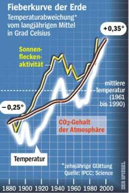

[🠔 Zur Übersicht: Energiesparen](7wsvoant.md)  
# Energiesparen und Wärmeschutz am Altbau 3
**Vom Betrug mit Bauphysik und Klimatologie - Klimawissenschaft und Wissenschaftsbetrug, Helfershelfer beim Klimaschutz-Abzocken**  
_von Konrad Fischer_

## Eine kleine unendliche Geschichte der Ökoabzocke

## Von der Intelligenz moderner Baumethoden/Haustechnik/Schimmelpilzzüchtung usw. 
Ökovampirismus: Klimaschutzblutsauger auf der Jagd nach Ihren letzten Kröten

_[Konrad Fischer](1refernz.md)_ 
**(aktualisiert 46.04.09)** 

---

Helfershelfer beim Abzocken

Sogar ehemalige Bundesminister wirken kräftig mit, den Bürger erst zu erschrecken, und dann mit bußgeldbewehrter Energiespar- und Dämmstoff-Kaufzwangverordnung "Öko"steuer abzuzocken: 

Obermain-Tagblatt 22.10.1999 

**_"Ozonloch doppelt so groß wie China_**

_**NEW YORK.** Das Ozonloch über der Antarktis ist gegenwärtig mit 22 Millionen Quadratkilometern doppelt so groß wie China. Dies hat der deutsche Exekutivdirektor der UN-Umweltorganisation Unep, Klaus Töpfer, in New York mitgeteilt. Er stellte den Träger des mit 200.000 Dollar dotierten UN-Umweltpreises 1999, den US-Ozonforscher Mario J. Molina, vor."_

Oh, diese Schlaumeier und Töpfer. Was man (natürlich kein ehem. CDU-Sauertopf-Forschungsminister!) dazu wissen könnte: das sog. Ozonloch wechselt über den Polkappen im 6-Monatsrhytmus seinen Umfang. Ozon ensteht auf der Luftschicht janz weit oben als kraß instabiles Reaktionsergebnis aus brutalstmöglich bestrahlten Sauerstoffdioxidmolekülen - unabhängig von Gut+Bösmensch+Tier. Weil im schattigen Erdhalbkugel-Winter weniger Sonnen-UV auf die nord- bzw.südpolaren 02-Sauerstöfflein scheint, gibt´s dann klaro weniger O3-Ozon. Auch die Sonnenaktivität und die eierige Kreiselei des Erdballs spielen dabei mit. Im Sommer heilt dann das Löchlein wieder etwas - bis der nächste Winter kommt. Kapito? Daß Klimasimulanten hieraus etwas Bedrohliches, _"doppelt so groß wie China"_ herauslesen, mag ein lustiges Scherzchen für doofe SZ-Urban-Leser und deutschdeprimierte Angsthäschen sein. Was ein getürktes Computermodell mit einer ideolügisierten Wissenschaftsjournaille halt so hinbiegt, wenn der Winter langweilig ist. Lesen Sie die [andere Seite](8buch22.md) und benutzen Sie die hier angebotenen Links. 

[Nobelpreisträger Mullis macht in einem SZ-Interview den Ozonloch-Erfinder Molina fertig ...](7wdvs04.md#mullis)

Wie Daten Klimameinung erzeugen:

Und so sieht die "Wissenschafts-" und Medienaufklärung der Menschheit dann praktisch aus: Obermain-Tagblatt vom 19.6.1998: 

Diese Datendeformation findet sich auch bei der nahezu identischen Grafik _"Globale Durchschnittstemperatur (in 2 m Höhe)" der Broschüre "Treibhauseffekt und Wald, überarbeitete Neuauflage, Band 5 der "Stiftung Wald in Not/Gemeinschaftswerk zur Rettung des Waldes"_ - gefördert durch die Deutsche Bundesstiftung Umwelt. In die selbe Kategorie fallen auch Katastrophenmeldungen, die wohlweislich verschweigen, wieviel höher z.B. historische Hochwassermarken von Rhein bis Donau als heutige sind, wieviele im 19. Jahrhundert vergletscherten Alpendörfli wieder durch Gleztscherschmelze zutage treten und welch bedeutende Erträge der norwegische Weinbau im Mittelalter lieferte. Ein Bravo der Volksverdummung durch mißbrauchte Naturliebe - echt gekonnt! 

Da hilft auch DER SPIEGEL nicht weiter, oder? -  
[DER SPIEGEL: Die Fieberkurve der Erde: Einfluß CO2 oder Sonnenaktivität?](http://www.spiegel.de/) [DIMaGB.de - Infobereich: Einiges zum Treibhauseffekt](http://www.dimagb.de/info/bauphys/mbklima3.html#sto#sto)

Und auch nicht [DIMaGB.de - Einiges zum Treibhauseffekt](http://www.dimagb.de/info/bauphys/mbklima3.html#sto#sto)

[Was Late 20th Century Warming Really Unprecedented Over the Past Two Millennia?](http://www.co2science.org/journal/2003/v6n34c4.htm) - co2science.org: Info mit langjähriger Temperaturgrafik (200-2000 n. Chr.) über betrügerische Dateninterpretation (Mann und Jones), die auch unsere entarteten Klimawissenschaftler zur Volksverarschung nutzen.

Der Trick, durch bewußt reduzierte Information die schnöde Klimawirklichkeit zum existenziell spannenden Horrorszenario aufzupuschen, geht vergleichsweise so: 

_"Stellt man mit den Wassertemperaturen von Mai bis Juli Hochrechnungen an, 
dann läßt sich aus ihnen der Schluß ziehen, 
daß man gegen Ostern des folgenden Jahres im Mittelmeer Eier kochen kann."_

[aus: Hans-Peter Beck-Bornholdt/Hans-Hermann Dubben: Der Hund, der Eier legt - Erkennen von Fehlinformationen durch Querdenken, Rowohlt Sachbuch 60359 - Weiterführende [Rezensionen/Informationen](8buch23.md#der hund, der eier legt)]

Um das Kind nicht mit dem Bade auszuschütten: Es gibt im Unterschied zu den Großmutterverkäufern im Akademikergewand auch noch ehrliche Wissenschaftler (und vielleicht gehören auch sie zur meist schweigsamen Mehrheit): 

Obermain Tagblatt 3.8.00 

**_"Schweizer Gletscher brach auseinander_**

_**SAAS ALMAGELL.** Bei einem der größten Eisabbrüche dieses Jahrhunderts in den Alpen sind von einem Gletscher im Schweizer Kanton Wallis 500.000 Kubikmeter Eis abgegangen. Das sei der größte Eisabbruch in den Alpen seit 35 Jahren, sagte der Glaziologe Martin Lüthi von der Eidgenössischen Technischen Hochschule in Zärich. "Eisbrüche dieser Größe geschehen dort ein bis zwei Mal pro Jahrhundert."_

_Bei dem Zwischenfall kam niemand zu Schaden. Bei einem ähnlich großen Gletscherabbruch an gleicher Stelle waren vor 35 Jahren 88 Menschen ums Leben gekommen. "Wie viel der Mensch zu den Gletscherabbrüchen beigetragen hat, darüber möchte ich nicht spekulieren", sagte Lüthi. Die so genannte kleine Eiszeit mit kaltem und feuchtem Klima hatte um 1850 zu sehr großen Gletschern geführt. Seitdem gehen sie zurück."_

Vergleichen Sie diese Aussagen mit den oben dargestellten Klimakurven. Dann verstehen Sie, worum es hier geht. Und wenn dann eine Ente gerupft wird - so wie kürzlich das aufgeschmolzene Nordpoleis - wird ein Schritt zurückgerudert und zwei vor. Siehe diese Meldung, die ich Peter Dietze verdanke: 

_From: David Theroux <> THE LIGHTHOUSE VOL. 2, ISSUE 35 September 12, 2000 "Enlightening Ideas for Public Policy..." ~~~~~~~~~_

_**NEW YORK TIMES CORRECTS NORTH POLE SCARE STORY**_

Readers of The Lighthouse will be pleased to learn that The New York Times has corrected its Aug. 19 front-page news story which claimed that open water was found at the North Pole for the first time in 50 million years. The correction (which did not appear on the front page) was published the day after Independent Institute research fellow S. Fred Singer disputed this claim in an Aug. 28 op-ed in The Wall Street Journal. Singer stated that NOAA scientists have long known that the North Pole's "open water" is largely seasonal and that the region is still feeling the effects of the warming of 1900-1940.

"In a correction Tuesday," the Associated Press (8/29) reported, "the Times said it had misstated the normal conditions of sea ice at the pole. It said open water probably has occurred there before because the Arctic Ocean is about 10 percent ice-free during a typical summer.

"The Times also said the lack of ice at the North Pole is not necessarily a result of global warming," the AP report concludes.

The Lighthouse congratulates New York Times reporter John Noble Wilford, author of the original article ("Ages-Old Icecap at North Pole Is Now Liquid, Scientists Find") for writing the follow-up article ("Open Water at Pole Is Not Surprising, Experts Say") which highlights many of the uncertainties that now perplex climate scientists.

Wilford says the major-league mistake "was based on the descriptions and interpretations of two scientists who had just visited there" -- one of whom, it is worth noting, is a Harvard University oceanographer and co-leader of a group working for the Intergovernmental Panel on Climate Change, the U.N. advisory group behind the Kyoto accord.

The correction did not go unnoticed on CBS's "Late Night with David Letterman" (Aug. 30), which noted the Top Ten signs that the New York Times is slipping. Number 10:**"Instead of 'All The News That's Fit To Print,' slogan is 'Stuff We Heard From A Guy Who Says His Friend Heard About It.'"**

Unfortunately, like other politically correct falsehoods, we haven't heard the end of the "first time in 50 million years" myth: syndicated columnist Richard Reeves repeated it in his Sept. 10 column.

Catastrophic global warming from man-made activity is only one hypothetical (and, according to weather satellite data, yet unrealized) scenario. The admission of error by the New York Times may be evidence for what some observers consider another unlikely scenario: Hell freezing over.

See "AP Corrects North Pole Story" <http://www.independent.org/tii/lighthouse/LHLink2-35-1.html> and "Open Water at Pole is Not Surprising, Experts Say" by John Noble Wilford (New York Times, 8/29/00) at <http://www.independent.org/tii/lighthouse/LHLink2-35-2.html> (NYT archive fee required).

Also see:

"Sure, the North Pole is Melting. So What?" by S. Fred Singer (Wall Street Journal, 8/28/00), <http://www.independent.org/tii/lighthouse/LHLink2-35-3.html>

and HOT TALK, COLD SCIENCE: Global Warming's Unfinished Debate, by S. Fred Singer <http://www.independent.org/tii/lighthouse/LHLink2-35-4.html>.

"Top Ten Signs the New York Times Is Slipping" (David Letterman, 8/30/00) <http://www.independent.org/tii/lighthouse/LHLink2-35-5.html>

Den einfallreichsten Vorschlag zum Nordpoleis gibt Joseph von Westfalen am 29.9.01 im Feuilleton der SZ:

Ob die Terroristen, die ihren Durchblick betr. westlichem Angstpotential ausreichend bewiesen haben, doch mal einen Jumbo auf das schwer zu verteidigende Nordpoleis crashen? Das schmilzt dann ab und löst endlich den lang ersehnten Klima-GAU aus.

Da wird sich der Bin Laden in den afghanischen Bergen aber dolle ins Fäustchen lachen. Und wir wissen dann, warum wir endlich wieder den Verstand abgegeben haben und zu mordenden Soldaten für lichte/dunkle Mächte werden. Diesmal aber wirklich weltweit. Ist eh besser, als zu Hause Moviestar auf Dauersendung in Polizeicomputern zu spielen. 84 hat etwas länger gebraucht, als Orwell ahnte.

**Verursacht eine CO 2-Schicht einen mit Bewölkung vergleichbaren Treibhauseffekt?**

Tipp: Das aktuelle Buch ["Klimafakten"](8buch.md#klimafakten) aus amtlicher Schreibe, inzwischen in der xten Auflage

[Wie man Klimaschwindel praktisch bekämpft](http://www.dimagb.de/info/bauphys/mbklima3.html)

Der Vergleich der wärmerückhaltenden Wolkendecke (als allseitig strahlender "Körper" aus unzähligen Wassertröpfchen ein recht undurchdringlicher Deckel gegen langwellig abgestrahlte Wärmestrahlung, selbstverständlich aber auch gegen die Sonnenstrahlung von oben!) mit einer CO2-Schichttrifft nicht zu: 

Die angeblich in 6 km Höhe minus 16 Grad eiskalte CO2-Schicht ist ein Erfindung des Eiszeiterfinders Svante Arrhenius 1895. Er wollte damit sein Eiszeit-Modell begründen. Eine derartige Schicht wurde aber noch niemals nachgewiesen, sondern lebt als These bis heute fort. Bei allen dramatischen Temperaturwechseln auf der Erde seit zig Jahren blieb übrigens die CO2-Konzentration verblüffend stabil. CO2 ist obendrein zweimal schwerer als Luft. Deshalb kann es in Erdbodennähe als Pflanzennahrung seinen für uns sehr trefflichen Dienst erfüllen und schichtet gottseidank nicht in irrsinigen Höhen herum. Meßwerte von unglaublich wenigen 7 ppm da oben bestätigen die praktische Abwesenheit dieses Klimakillergases dort oben. Und selbst, wenn es klimawirksam da oben sein Unwesen treiben würde, wäre seine erste Tat ganz gewiß, die heiße Sonnenstrahlung erst mal abzufiltern, oddaä? Wie das dann erwärmend wirken solle, kann vielleicht Großmütterchen in der Märchenstunde dem kleinen Seppl erzählen oder die Politkaspern der Gretel, doch kein ernstzunehmender Wissenschaftler der ganzen Welt. 

Außerdem könnte CO2 mangels ausreichender Absorptions-/Reflektionsfähigkeit das "Strahlungsfenster" für die Erd-Wärmeabstrahlung nicht schließen. Sonst gäbe es nämlich keine gestochen scharfen Satellitenbilder mit der Wärmekamera, sondern Nebel auf dem Bildabzug. Eine erwärmte Gasschicht steigt nach oben zum Abkühlen. Weil eben kein Glasdach dies verhindert. Wie soll sowas die Erdoberfläche erwärmen? Und seit wann könnten kalte Heizkörper wärmere Heizkörper durch Rückstrahlung erwärmen? Als _"Perpetuum mobile der zweiten Art"_ (Prof. Gerlich vom Institut für mathematische Physik der TU Braunschweig) ein Widerspruch gegen den zweiten Hauptsatz der mechanischen Wärmetheorie, wonach gilt: "Die Wärme kann nicht von selbst aus einem kälteren in einen wärmeren Körper übergehen" (Rudolf Clausius: _Die Mechanische Wärmetheorie_ , Braunschweig 1887, S. 81, zit. n. Prof. Gerlich: _Die physikalischen Grundlagen des Treibhauseffektes und fiktiver Treibhauseffekte_ , S. 22, in: Die Treibhaus-Kontroverse, Leipzig 1996). 

Obendrein ist es nur als abstruses Mißverständnis der Strahlungsausgleichstheorie des Franzosen Prevost aus dem späten 18. Jh. (als man überhaupt noch nichts wußte vom Wesen der Strahlung und an ein Phlogiston glaubte) zu werten, daraus eine treibhauswirksame "Gegenstrahlung" von atmosphärischen Gasen als Beleg für den Treibhauseffekt zusammenzuschustern. 

In Prof. Gerlichs Aufsatz findet sich auch der Hinweis, daß die Debatte um die Absorptions- und Emissionsfähigkeit von atmosphärischen Gasen am Kern des Problems vorbeigeht. Die Oberflächentemperatur ist demnach eher ein Ergebnis der Erdabkühlung als ein Ergebnis der solaren Strahlungsbilanz. Und wenn schon Wärme an die Atmosphäre abgegeben wird, führt das eben zur Abkühlung der wärmeabgebenden Erdoberfläche: Auch eine rotglühende Herdplatte, auf die ein gefüllter Wasserkessel gestellt wird, kühlt bekanntermaßen unter den rotglühenden Zustand ab, solange Wasser im Kessel für die Wärmeableitung sorgt. In seinem auf dem Herbstkongreß der Europ. Akademie für Umweltfragen in Leipzig vom 9.-10. Nov. 1995 vorgetragenen Aufsatz resümiert Prof. Gerlich deshalb wie folgt (S. 31 ff.): 

_"So wenig, wie normale Bürger jemandem für das Beobachten der Sterne oder Planeten eine müde Mark geben würden, würde man heute einem Atmosphären- oder Klimamodellrechner eine müde Mark geben._

_Aber genauso, wie sich früher die Astrologen überlegen mußten, wie man aufgrund der Stern- und Planetenpositionen wichtige Ereignisse auf der Erde sollte voraussagen können, damit sie sich den schönen Sternenhimmel auf Staatskosten ansehen durften - sie waren wirklich "Weise", die mit geschickten Formulierungen den Königen die Zukunft "richtig" voraussagten, genauso mußten die Klimamodellrechner etwas finden, womit man von den modernen Königen Geld für Computer bekommt._

_Dazu eignet sich besonders der CO 2-Treibhauseffekt: Man muß nur seine Prognose so weit in die Zukunft legen, daß sie niemand überprüfen kann. Damit die Geldquelle nicht versiegt, verändert man immer in der politisch vertretbaren Bandbreite mit neuen sorgfältigen, nicht nachvollziehbaren Rechnungen seine Prognosen._

_Schließen möchte ich mit einem völlig unverfänglichen Beispiel, das zeigt, daß es auch in der Physik nicht anders ist. Ich greife auf einen der ganz Großen der Physik zurück: Galilei._

_Wenn er nicht die Bewegungen der Erde und Sonne zu einem wichtigen theologischen Problem hochstilisiert hätte, hätte sich kein Bischof für diese Sache interessiert. Er wollte gerne - wie Kepler - so etwas wie ein Hofastronom werden. Dummerweise hatte sich Galilei aber über die Machtverteilung bei den damaligen Bischöfen geirrt. Er glaubte, der intelligente Bischof könnte ihn vor den dümmeren schützen. Leider haben aber oft die dümmeren mehr Macht und nutzen sie auch rücksichtsloser aus._

_Ceterum censeo:_

_Der CO 2-Treibhauseffekt der Erdatmosphäre ist eine reine Fiktion von Leuten, die gerne große Computer benutzen, ohne physikalische Grundlagen."_

Anm. KF: Und läßt sich für das Abzocken der Bürger mittels Ökosteuer, Dämmstoffwahn und Energiepreiserhöhung trefflich instrumentalisieren. Daran sind auch die Großen unserer Zeit wirklich interessiert.

Ein frecher Kommentar Gero von Billerbecks im Obermain-Tagblatt vom 21.9.00 trifft den Wissenschaftsbetrug unserer Zeit ins Herz: 

**_"Sternenlotto_**

_Etwa alle zwölf Minuten wird jemand von einem Asteroiden erschlagen, haben britische Wissenschaftler ausgerechnet. Genauer, es folgert aus dem, was sie ausgerechnet haben: nämlich dass man 750-mal leichter von einem unbotmäßigen Himmelskörper zermatscht werden, als im Lotto gewinnen kann, was bekanntlich jede Woche geschieht._

_Vorsichtshalber bitten wir mal um Entschuldigung für die Nichtmeldung von 107,1 Sternschnuppentoten, die gestern fällig gewesen wären, wenn Theorie und Praxis nicht so weit auseinander klaffen würden. Trotzdem fordern die Wissenschaftler Konsequenzen aus ihrer "Entdeckung"._

_Für rund 50 Millionen Mark soll ein Riesenteleskop entstehen - ein irdischer Aussichtsturm für außerirdische Wurfgeschosse. Mit fünfzig Lotto-Hauptgewinnen wäre das Ding schon finanziert. Ein Klacks für die 15 Millionen Menschen, die der nächste Asteroid mit einem Schlag hinwegpusten würde, ihr Leben mit Lotto-Einsatz zu verlängern._

_Welche das sind? Das werden die Experten doch wohl auch noch ausrechnen können!"_

Beweist Großbritannien nun auch die antike Weisheit: "Mens sana in corpore sano - ein gesunder Geist wohnt in einem gesunden Körper" bzw. die calvinistische Auffassung vom Tun-Ergehens-Zusammenhang bzw. die u.a. von Thorwald Detlefsen vorgetragene Annahme, daß jede Krankheit ein dahinterliegendes Psychoproblem signalisiert? Obermain-Tagblatt vom 2.10.00: 

**_"Hawking: Menschheit braucht neuen Planeten_**

_**EDINBURGH**. Der britische Astrophysiker Stephen Hawking (58) befürchtet, dass die Menschheit ein "weiteres Jahrtausend" nicht überleben wird. In einem Vortrag in Edinburgh erklärte Hawking, entweder ein "Unfall oder die Erderwärmung" würden das Leben auf der Erde auslöschen. Die Menschheit könne nur überleben, wenn sie sich auf einem anderen Planeten ansiedle, ließ der fast vollständig gelähmte Wissenschaftler seine Zuhörer wissen. _[Anm. KF: Oder die blutsaugenden Scharlatane aller Couleur zum Gottseibeiuns schickte]. _Der international renommierte Professor leidet_[Anm. KF: u.a., vgl. mens sana in corpore sano]_unter der Lähmungserkrankung Amyotrophe Lateralsklerose (ALS) und kann sich nur per Sprachcomputer verständigen._

**_Heiß wie die Venus_**

_"Ich befürchte, dass die Atmosphäre immer heißer wird, und dass sie wie Venus zu brodelnder Schwefelsäure wird" meinte Hawking. "Ich mache mir Sorgen um den Treibhauseffekt." Die Menschheit könne nur überleben, wenn sie sich in "den Weltraum ausbreitet". Ohne die "Kolonialisierung" anderer Planeten sei die Menschheit vom Aussterben bedroht._[Anm. KF: Eine seltsame Verdrehung der Tatsache, daß gerade die anglo-amerikanischen Kolonisationsbemühungen und ihre alliierten Freunde ganze Völker bzw. deutsche, japanische und andere Nigger weltweit aussterben ließen oder erheblich dezimierten - Indianerland/Afrika/Indien/Hiroshima/Dresden/Ostdeutschland lassen grüßen. Der Zarismus/Kommunismus/Slawismus nahm dieses Vorbild edelster darwinistischer Kulturgesittung des Westens ja sehr dankbar auf ...] _Hauptaufgabe der theoretischen Physik des 21. Jahrhunderts sei es, der Menschheit eine lückenlose Theorie über das Geschehen im Universum anzubieten._[Anm. KF: Dieser "Ansatz" verrät alles, dagegen ist Dr. Frankenstein ein Vorbild an Bescheidenheit!]_"Wir glauben, wir haben die Endstücke einer vollständigen und einheitlichen Theorie gefunden, aber in der Mitte ist noch viel auszufüllen", sagte der Wissenschaftler."_

Derart totalitären Wahn, der am 3.10. vom Obermain-Tagblatt (Kommentar Heimbeck) in den Zusammenhang der _"geistigen Überkompensation Hawkings körperlicher Gebrechen"_ und der Propaganda für sein neues Buch _"The Universe in a nutshell"_ gestellt wird, wiederholt sich. Ist das ein Virus?: OT 17.10.01:

_**"Kritiker "schießen" gegen Hawking 
**Katastrophenszenario soll Buchverkauf unterstützen_

**__LONDON__**

_**Der britische Physiker Stephen Hawking (59) ist mit seiner Prognose, nach der die Menschheit noch in diesem Jahrtausend von einem Virus ausgerottet werden wird, auf scharfe Kritik gestoßen. Er musste sich ... vorwerfen lassen, mit der "bedauernswerten Panikmache" nur sein neues Buch in die Schlagzeilen bringen zu wollen.** _

_... Hawkins Katastrophen-Prophezeihungen seien in den den vergangenen Jahren immer wirrer geworden. Vor gut einem Jahr habe er noch vorausgesagt, die Erde werde sich durch den Treibhauseffekt bis zum Kochen aufheizen. "Und jetzt, da alles vom Bio-Terrorismus spricht, kommt er mit der allerneuesten Prophezeihung, die unsere sichere Selbstzerstörung als Ergebnis biologischer Forschung voraussagt." ..."_

Auch der für die britische Wirtschaft arbeitende WWF apokalyptisiert - Obermain-Tagblatt vom 30.9.00: 

**_"Studie: Mehr Unwetter durch Treibhauseffekt_**

_**FRANKFURT.** Die Erhöhung der Welttemperatur verschärft nach Ansicht der Umweltorganisation World Wide Fund for Nature (WWF) extreme Wetterereignisse. Katastrophen wie die aktuellen verheerenden Monsunregen in Asien werden sich nach dem Ergebnis einer neuen WWF-Studie künftig häufen. Vor allem der Süden werde extreme Wetterereignisse immer häufiger zu spüren bekommen, heißt es in der Studie. Nicht nur die Häufigkeit, sondern auch die Dimension von Überschwemmungen, Stürmen und Dürren werde wachsen._

_Laut Münchner Rückversicherung wurden in den 50er Jahren weltweit 14 wetterbedingte Katastrophen registriert, in den 90er Jahren bereits 70._[Anm. KF: Das spricht für flächendeckendere Registrierung, wenn es überhaupt wahr ist. Und all das Münchner-Rück-Katastrophengehetze dient doch in allerdurchsichtigster Weise nur einem - dem besseren Verkauf von Versicherungen gegen Naturkatastrophen!]_Gleichzeitig sei die weltweite Durchschnittstemperatur gestiegen._[Anm. KF: Wieso wurden dann vor einiger Zeit noch Eiszeiten angedroht?]

_Die Bundesregierung müsse eine Klimastrategie mit klaren Zielen zur Verminderung des Treibhaus-Gases Kohlendioxid verfolgen, forderte WWF."_

Mein Vorschlag dient dem: Füttert fleischfressende Pflanzen mit solchen Scharlatanen! Schon bemerkt? Die Horrormeldungen unterstützen nicht nur das Abzocken der Bürger mittels Klimawahn sondern auch die maximale Schädigung unserer Volkswirtschaft. Vorsicht: Uns goldeierlegende Doofgänse sollte man wenigstens nicht schlachten. Soviel sollte man aus unserem letzten Aderlaß mindestens gelernt haben ... 

Den leider nur sehr vorläufigen Gipfel des Nirwana erreichten die Klimaexperten dann im August 2001:

OT Lichtenfels, 14.8.01:

**_"Forscher: Nur null CO 2 stoppt Klima-Änderung_**

_**"GARMISCH-PARTENKIRCHEN.** Der weltweite Kohlendioxid-Ausstoß (CO2) muss nach Meinung von Klimaexperten in den nächsten 100 Jahren auf null sinken._

Kommentar: Aha. Das setzt die Ausrottung aller ausatmenden und furzenden Lebewesen voraus. Ob das auch für Klimaexperten und ihre Freunde gilt?

_Nur so könne eine Klimaveränderung mit weit reichenden Folgen für die Menschheit verhindert werden, sagte der Meteorologe Mojib Latif vom Max-Planck-Institut für Meteorologie (Hamburg) bei einem Expertentreffen auf der Zugspitze. ..._

_Es gebe praktisch keine Zweifel mehr, dass der Mensch für den Großteil der Erderwärmung verantwortlich sei._

Kommentar: Da müssen die Steinzeitler aber dolle Lagerfeuer betrieben haben, um die letzte Eiszeit abzuschmelzen. Das glauben meinetwegen Mojibs und Meteorolügen. Wir Ungläubigen zweifeln weiter und glauben lieber an den Lieben Gott. 

_Die Klimaexperten forderten ... eine Abkehr von fossilen Brennstoffen wie Gas, Öl und Kohle. Diese Materialien sollten durch eine verstärkte Nutzung erneuerbarer Energien wie zum Beispiel der Solarenergie ersetzt werden."_

Kommentar: Höhenrausch pur. Die "erneuerbaren Energien" (Wasserkraft ausgenommen) verbrauchen mehr Energie, als sie bringen können. Ihr Problem: Mangelhafte Energiedichte und notwendiger Parallelbetrieb "konventioneller" Energie mangels Versorgungssicherheit und Leistung.

Der ehemalige ZDF-Wetterfrosch Dipl.-Met. Dr. Wolfgang Thüne, Ministerialbeamter im Mainzer Umweltministerium, beschreibt das Problem der Wissenschaft in einem Brief an seinen Ministerpräsidenten Kurt Beck vom 9.8.2000 so: 

_"... Wie wichtig Kritikfähigkeit ist, zeigten jüngst die Worte des Präsidenten der Max-Planck-Gesellschaft e. V., Professor Dr. Hubert Markl, der anläßlich der EXPO in Hannover offen sagte, daß „Lüge und Betrug“ integrale Bestandteile des Forschens seien, und dies auch biologisch begründete. Dies muß besonders einen Politiker hellhörig machen und die Frage aufwerfen, ob die Milliarden, die von der Politik für die Forschung eingefordert werden, auch sinnvoll verwandt werden. Dies betrifft insbesondere die moderne Variante der „Katastrophenforschung“._

_Seit 25 Jahren wird z.B. mit vielen Milliarden an Steuergeldern die „Klimaforschung“ staatlich subventioniert, indem Forscher einen Effekt erfanden, den „Treibhauseffekt“, den es unermüdlich zu erforschen gelte, drohe doch durch ihn die „Klimakatastrophe“._

_Alle massenpsychologischen Tricks wurden in Szene gesetzt, um eine Angstpsychose zu erzeugen, die geradezu politisches Handeln erzwang. Dabei gibt es diesen Effekt gar nicht, ja er wäre tödlich für alles Leben auf der Erde. Die von Forschern irregeleitete „Klimapolitik“ bekämpft nun ein Phantom und ist stolz auf diese „Leistung“, während die „Klimaexperten“ rund um die Welt jetten und alle Hebel in Bewegung setzen, um zu verhindern, daß der „Treibhaus-Schwindel“ auffällt, auffliegt und die Forschungsmilliarden davonfliegen._

_Angesichts dieses bedauerlichen Zustandes in weiten Bereichen der Forschung, Prof. Markl wollte sicherlich nicht „sein“ MPI für Meteorologie in Hamburg gefährden, ist Kritikfähigkeit dringlicher denn je. Es genügen nicht mehr „Ethikkomissionen“ an den Hochschulen, in denen die Betroffenen alles andere tun, als sich selbst zu richten. Es muß eine „neue Aufklärung“ her, die bereits in den Schulen ansetzen muß. ..."_

Mehr Fachinfo zum Thema: [www.co2science.org](http://www.co2science.org) 
[Nairobi-Report, IPCC-Wahnsinn, Weltklimabericht-Kriminelle, Klimaschutzbeschiß und Ökoterror - Cui bono?](7argus.md) 
[www.co2betrug.de](http://www.co2betrug.de/) 
[www.treibhaus-schwindel.de](http://www.treibhaus-schwindel.de) 
[www.biokurs.de/treibhaus/](http://www.biokurs.de/treibhaus/)

Und nun endlich die deutsch-jüdische (der [Bochumer ](http://www.ruhr-uni-bochum.de/pressestelle)Geologe Prof. Dr. Jan Veizer und der israelische Astrophysiker Prof. Dr. Nir J. Shaviv (Hebrew University, Jerusalem) CO2-Klatsche: Das Klima wird aus dem Weltraum gesteuert - mittels kosmischer Strahlung. Facts: [Zusammenspiel von kosmischer Strahlung und unserem Klima](http://idw-online.de/public/zeige_bild?imgid=7546) [www.welt.de](http://www.welt.de/data/2003/07/01/126848.html) [www.geosociety.org/pubs/gsatoday/](http://www.geosociety.org/pubs/gsatoday/).[www.ncbi.nlm.nih.gov/](http://www.ncbi.nlm.nih.gov/entrez/query.fcgi?holding=npg&cmd=Retrieve&db=PubMed&list_uids=11130067&dopt=Abstract).[http://idw-online.de](http://idw-online.de/public/pmid-27936/zeige_pm.html)

Von allen großen Tageszeitungen hat sich als erste die FAZ der Ironisierung des Klima- und Energieschwindels gewidmet. In der Ausgabe vom 14.4.2001 schreibt dort z.B. Professor Dr.-Ing. Bert Küppers, Roetgen:

**_"Klima-Apokalypse als Glaubensbekenntnis_**

_... inzwischen ist eines klargeworden: Kohlendioxyd ist nicht nur kein Treibhausgas. Es wird sich außerdem auch niemals dauerhaft in der Atmosphäre akkumulieren. Kohlendioxyd ist das einzige "Nahrungsmittel" der Algen. Diese leben in einer durch sie selbst geschaffenen Kohlendioxyd-Mangelsituation und vermehren sich explosionsartig, sobald ihnen überschüssiges Kohlendioxyd zur Verfügung steht. Die Algen leben in Symbiose mit den kalkbildenden Foraminiferen, die das Kohlendioxyd als Kalziumkarbonat auf diese Weise kontrolliert am Meeresboden absetzen. Dabei macht der Anteil der anthropogenen Kohlendioxydemission nur wenige Prozent des jährlich aus dem Erdinnern, aus Erdspalten und Vulkanen in die Atmosphäre geratenden Kohlendioxyds aus._

_Dies ist ein natürlicher, geregelter Prozeß, der seit Jahrmillionen so abläuft und die Atmosphäre für die höheren Lebewesen erst bewohnbar gemacht hat und in ihrer Zusammensetzung erhält. Dieser Prozeß wird auch dafür sorgen, daß, selbst wenn dereinst alle verfügbaren fossilen Ressourcen durch den Menschen verbraucht sein werden, die Kohlendioxydkonzentration, durch diesen biologischen Regelkreis konstant gehalten, sich nicht ändert. ..."_

Was haben wohl die "Experten" vor, die uns Gegenteiliges vormachen? Wie der bayer. Umweltminister Schnappauf, dessen aufgeschnapp(s)ter Ökowahn sich in der SZ am 22.3.02 mächtig gewaltig potenziert:

_"... Schnappauf forderte [bei der Vorlage des jüngsten Klimaschutzberichtes im Landtag] vermehrte Anstrengungen zum Klimaschutz ... Die größten Möglichkeiten,_ CO2 _-Emissionen deutlich zu senken, sehen Schnappauf und die Oppositionsparteien in der Wärmedämmung an Gebäuden sowie der Modernisierung alter Heizungsanlagen. ... Der Minister sprach von einem "gewaltigen Potenzial" für den Klimaschutz. Bei dem von der EU beschlossenen Handel mit Zertifikaten für Treibhausgase stellte sich Schnappauf (CSU) ausdrücklich auf die Seite von Bundesumweltminister Trittin (Grüne) und forderte, die Industrie solle ihren Widerstand gegen diesen Zertifikaten-Handel endlich aufgeben. ... Christian Schneider"_

Daß ein Oberfrankenhinterwäldler wie Schnappauf ein grüner Industriefeind sein muß und als sponsoreninformierter Politiker auf den Dämmschwindel hereinfallen _muß_ , is scho glar. Vielleicht ist er ja ebenso wie seine oberfränkische SPD-MdL-Genossin Biedefeld Windkraft-Anteilseigner, was die Unterstützung der Öko-Politik aus sich selbst heraus erklärte. Warum gibt aber der angeblich _gegen_ Rot-Grün antretende Stoiber, nach Meinung der meisten bayerischen Wähler der klügste und weiseste Regent seit langem, einem solchen Oppositionellen politischen Freiraum? Und übernimmt in seine Werbebroschüre zur Landtagswahl 21.9.03 u.a. folgende Aussage: _"Bayern ist Vorreiter beim Klimaschutz in der Bundesrepublik. ... Der hohe Anteil von erneuerbaren Energien soll zudem weiter gesteigert werden -**für ein lebenswertes Bayern** "_ - wo gleichzeitig der SPD-Wirtschaftsminister Clement die Windkraft und Ökosubventionsvergeudung einschränken will? Und Brandenburgs Agrar- und Umweltminister Wolfgang Birthler (SPD) am 25.8.2003 in der FAZ zugibt: _"Am liebsten würde ich alle Windkraftanlagen wieder umlegen. Sie verschandeln die Landschaft, fressen Milliarden-Subventionen, Arbeitsplätze entstehen kaum, der Strom wird teurer."_ Hofnarrentum heute? Schnappauf in seiner Wahlbroschüre: _"für den Ausbau der erneuerbaren Energien, vor allem der Biomasse."_ Böcke zu Gärtnern? Subventionsverschleuderer und Naturverschandler als _"Bayerische Staatsminister für Landesentwicklung und Umweltfragen"_. Wie bei RAF/NPD Opposition selber schaffen? Selbst beantworten! 

Im Entwurf 2002 zum Regierungsprogramm der "oppositionellen" CDU in Niedersachsen _"Niedersachsen kann mehr - Fortschritt und Geborgenheit"_ steht in Zeile 2500: _"Erneuerbare Energien fördern wir..."_ und in Zeile 2509 ist von _"CO 2-freien Energiequellen"_ die Rede. Auch aus der Bundes-CDU und der CSU wird der Ruf nach geilem Kuscheln im grünen Lager - und Übernahme dessen bürgerfeindlicher und scheinheilig ökomoralinverbrämter Politstrategien immer heftiger. Logisch, daß bei so viel Wählerbeschiß der persönliche Ökoprofitismus eine nicht unwesentliche Rolle spielen dürfte, oder?

Ob der Leserbriefschreiber V. Schmidt, Berlin, gar Recht hat, der am 15.11.02 in der NZ schreibt?:

**_"Das einzige Land?_**

_Warum unsere Gesellschaft sich in dieser Verfassung befindet, wie wir sie jetzt erleben, hat bereits Carl von Ossietzky dargelegt:_

_"Deutschland ist das einzige Land, wo Mangel an politischer Befähigung den Weg zu höchsten Ehrenämtern sichert. So wie gewisse Naturvölker Schwachsinnigen göttliche Ehrungen entgegenbringen, so verehren die Deutschen den politischen Schwachsinn und holen sich von dorther ihre politischen Führer.""_

Ergänzung: Henry Louis Mencken (USA 1925): 

_"Die Kunst aller Politik ist es, den Bürger mit immer neuen Schreckgespenstern - allesamt erfunden - so zu verängstigen, daß er von den Politikern Abhilfe um jeden Preis einfordert."_

[The H. L. Mencken Page - A Mencken Cornucopia - guide to H. L. Mencken resources on the Web 
](http://www.io.com/~gibbonsb/mencken.html)[Mencken Society](http://www.mencken.org/) 
[THE H.L. MENCKEN HOME PAGE 
](http://www.geocities.com/CapitolHill/1414/)[H.L. Mencken Quotes](http://watchfuleye.com/mencken.html)

Rückgerudere + 2 Schritte nach vorn? Eben "Wissenschaft" aktuell. Link: [www.notiz.ch/wissenschaft-unzensiert/](http://www.notiz.ch/wissenschaft-unzensiert/)

Weiter: [Kapitel 4](7wdvs04.md)
