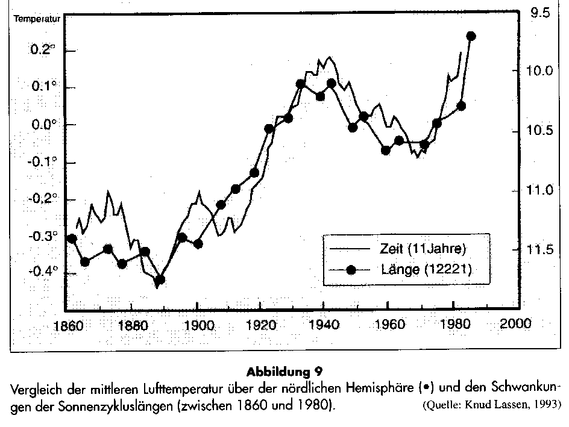
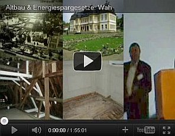
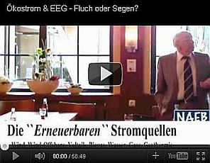
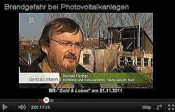

[🠔 Zur Übersicht: Energiesparen](7wsvoant.md)  
# Energiesparen, Klimalügen, Klimaschwindel, Klimapolitik, Solarenergie, Solartechnik 4 - Eine kleine unendliche Geschichte der Ökoabzocke
**Von der Intelligenz moderner Baumethoden/Haustechnik/Schimmelpilzzüchtung usw. Ökovampirismus: Klimaschutzblutsauger auf der Jagd. Bevor wir mit der Kritik anfangen, erst mal ein paar gute Worte zur ökologisch sinnvollen Solartechnik vorab: Selbstverständlich hat der Solarstrom und die Solarstromgewinnung wie alle Dinge zwei Seiten - eine Licht- und eine Schattenseite. Erst mal die sonnige Seite der Medaille: Daß man mit Solarzellen im Outdoorbereich bzw. dort, wo es absolut keine Steckdose für das Handy, iPhone, PDA, das Laptop, den Akku-Rasierer, MP3-Player (iPod), Radioapparat, Navigationsgeräte, Videokamera und Digitalkamera / Digital-Fotoapparat und Taschenrechner für das Trekking oder sonstwie auf Reisen zur Verfügung hat, sind mobile Solarmodule bzw. ein mobiles Solar-Ladegerät mit Solar-Akku das Mittel der Wahl und sozusagen lebenswichtig, teils auch überlebenswichtig. Und wer als Reisender schon mal mit einem leeren Handy-Akku blöd herumgestanden ist, beim Wandern, Bergwandern, Bergtour, Wüstentour oder im Urwald Amazoniens, auf Fluß, See oder Meer, Radtour, Reittour, Kanutour oder Paddeltour, beim Campen / Camping oder mit defektem Wohnmobil, der weiß genau, was es bedeuten würde, dann eine Solarzellenanlage als faltbares oder rollbares Solarmodul / Solarpanel / Solar-Faltmodul auf Basis der Dünnschichttechnologie CIGS (Kupfer-Indium-Gallium-Diselenid) oder a-Si (amorphes Silizium) zu haben, aus der man seinen notwendigen Strom zum Betrieb der schönen modernen Gerätschaften aufladen / zapfen / nachladen kann. Freilich nur tagsüber bei Sonne am Himmel. Fazit: Mobile Solarmodule dienen einem guten Zweck und sind - dort wo alle anderen Stromquellen versagen bzw. fehlen - unersetzlich und deswegen eine prima Sache, jawollja!**  
_von Konrad Fischer_

## Energiesparen und Wärmeschutz am Altbau 4

## Energiesparen, Klimalügen, Klimaschwindel, Klimapolitik, Solarenergie, Solartechnik 4 - Eine kleine unendliche Geschichte der Ökoabzocke

## Von der Intelligenz moderner Baumethoden/Haustechnik/Schimmelpilzzüchtung usw. 
Ökovampirismus: Klimaschutzblutsauger auf der Jagd

_[Konrad Fischer](1refernz.md)_ 

Bevor wir mit der Kritik anfangen, erst mal ein paar gute Worte zur ökologisch sinnvollen Solartechnik vorab:

Selbstverständlich hat der Solarstrom und die Solarstromgewinnung wie alle Dinge zwei Seiten - eine Licht- und eine Schattenseite. Erst mal die sonnige Seite der Medaille: Daß man mit Solarzellen im Outdoorbereich bzw. dort, wo es absolut keine Steckdose für das Handy, iPhone, PDA, das Laptop, den Akku-Rasierer, MP3-Player (iPod), Radioapparat, Navigationsgeräte, Videokamera und Digitalkamera / Digital-Fotoapparat und Taschenrechner für das Trekking oder sonstwie auf Reisen zur Verfügung hat, sind mobile Solarmodule bzw. ein mobiles Solar-Ladegerät mit Solar-Akku das Mittel der Wahl und sozusagen lebenswichtig, teils auch überlebenswichtig. 

Und wer als Reisender schon mal mit einem leeren Handy-Akku blöd herumgestanden ist, beim Wandern, Bergwandern, Bergtour, Wüstentour oder im Urwald Amazoniens, auf Fluß, See oder Meer, Radtour, Reittour, Kanutour oder Paddeltour, beim Campen / Camping oder mit defektem Wohnmobil, der weiß genau, was es bedeuten würde, dann eine Solarzellenanlage als faltbares oder rollbares Solarmodul / Solarpanel / Solar-Faltmodul auf Basis der Dünnschichttechnologie CIGS (Kupfer-Indium-Gallium-Diselenid) oder a-Si (amorphes Silizium) zu haben, aus der man seinen notwendigen Strom zum Betrieb der schönen modernen Gerätschaften aufladen / zapfen / nachladen kann. Freilich nur tagsüber bei Sonne am Himmel. Fazit: Mobile Solarmodule dienen einem guten Zweck und sind - dort wo alle anderen Stromquellen versagen bzw. fehlen - unersetzbar und deswegen eine prima Sache, jawollja! Beispiele für solch netten Solar-Schnickschnack: 

Auch im Gartenbereich / Außenbereich können solarbetriebene Lüfter für das Gartenhaus oder Gewächshaus und als Solar-Lampe / Gartenlicht / Gartenlampe / Gartenleuchte / Außenleuchte / Lichterkette / Garten-Strahler, als Treppenbeleuchtung oder Wegbeleuchtung / Außen-Belichtung bzw. Lampe für draußen, auch als Wandstrahler mit Bewegungsmelder oder als Solarkappe / lichtspendende Solarcap / Solar-Schirmmütze strahlend gute Dienste leisten. Sogar als Solarpumpe für den Gartenteich kann man die sonnigen Helferlein einsetzen - vielleicht auch bald in edlem Gartenzwerg-Design mit ständigem Auf und Ab des rechten Armes zum römischen Gruß ;- ) Ja, hier zeigen sich eben genau die Autarkie-Vorteile, die die Solartechnik als ökogrünbraune Insellösung / im Inselbetrieb eben mal unbestritten hat. Auch hierzu einige Beispiele: 

**Und jetzt zur provozierenden Kritik: Wetter und Klima, wer mißbraucht eigentlich die Naturphänomene für unnatürliche Dämmstoffumsätze für Innen- und Außendämmung von Gebäuden, für sinnlose Ökoenergien und gnadenlose Ökoabzocke des Staates? Fragen über Fragen. Sorgloser kann man den Begriff "Wahrheit" wohl kaum noch überhöhen:**

Schwarzwälder Bote (gem. Pressenotiz im Obermain-Tagblatt 28.12.99) zum Orkan um Weihnachten 99:

_"Bisher traten bei uns Orkane nur über den Meeren auf. Nun haben Sie den Kontinent im Griff. Die Prognosen der Forscher bewahrheiten sich: Unser sorgloser Umgang mit der Erde bringt häufigere und heftigere Klimaschwankungen als bisher. Diese Prognosen lassen sich nicht länger als Kassandra-Rufe abtun."_

Ist denn die in den 80ern waldniederlegende "Wiebke" schon vergessen? Nach der so qualvollen Ablösung vom Tod, Höllen- und Fegefeuerschreckgespenst muß heute also die Klimaapokalyptik herhalten, um die Schafsherde (mit treibstoffpreisexplodierender Ökosteuer usw.) zu scheren. Wissenschaftliche Klimasimulation - Hof-Astrologie / Theologie heute? Vergeblich hofften wir, daß dank Bushs vorgeblicher Abkehr vom Öko-Irrglauben auch die Wahrheitsblockade unserer Medienlandschaft aufbrechen könnte: 

FAZ vom 06.04.01, S.2 : 

**_"Europas Klimapolitik beruht auf Ideologie_** 
_Auch deutsche Wissenschaftler zweifeln an Ergebnissen des Internationalen Rates für Klimaveränderungen"_ 
_von H. Rademacher_

Den Text können wir uns sparen, Wiederholungen des hier Gesagten braucht es nicht, genutzt hat es auch nix. 

**Wieso schwankt die Temperaturentwicklung der Außenluft?**

Die Sonne, nicht der "allmächtige" Mensch steuert die Temperaturentwicklung der Erdatmosphäre (nicht zu verwechseln mit der Temperatur der Erdoberfläche, die von innen (heißer Erdkern) nach außen abnimmt). Und die Atmosphärentemperatur steigt maßgeblich durch den Kontakt der Luft mit der von der Sonne angestrahlten Erdoberfläche. Wenn es wolkig ist, wird es deshalb kühler - und trotz aller Temperaturstrahlungsabsorption der Wolke eben nicht treibhausmäßig wärmer. Wer uns etwas anderes beibringen will, erzählt nicht die Wahrheit. Es sind [Kindermärchen](http://www.kindermaerchen.net/), mit denen uns die [staatlichen Ökoterroristen](213baust.md#energiekonzept) einlullen. Das Licht eines Kerzchens würde genügen, um die Ökoangst zu vertreiben, den Ökowahn aufzuklären. Doch niemand zündet das Licht an, die so arg wohlmeinenden [Klimaschützer](http://www.kernenergie.de/kernenergie/Themen/Klimaschutz/index.php) freuen sich lieber am unterbelichteten Staatsvolk.Warum? Um das kommende Klimaschutzgesetz, inkl. steuerlich bzw. abschreibungstechnisch induziertem Dämmzwang, inkl. gesetzlichem "Ökoenergiezwang" usw., will sagen die staatsfinanzeninduzierte Totalbereicherung der Ökolobbyisten - besser "Ökoparasiten" widerstandslos durchzusetzen. Ja, das sind die Wohltaten, weswegen wir den Abschaum unserer Dämmokratur gewählt haben. Und hieß es früher: "Nur die allerdümmsten Kälber wählen ihren Metzger selber", heiß es nun: Nur zu, allerdümmster Atomhysteriker! Selber gibst Du hier Dein Fell her.

Den eindeutigen Zusammenhang der Atmosphärentemperatur mit der Sonnenaktivität (und nicht vom natürlichen bzw. angeblich menschengemachten CO2-Gehalt) zeigt diese Grafik: 

Die "Hohenpeißenberg-" und die "Sonnenzyklus-"Grafiken sind entnommen dem lesenswerten und auch heute noch aktuellen Aufsatz von Dr. Helmut Böttiger: "Mit kühlem Kopf gegen die Klimahysterie", der als Nachdruck aus der Zeitschrift FUSION 1/95 
Fundierte Kritik - [rotgruen.de.](http://www.rotgruen.de) Interessant auch für Altkommunisten! Und hier etwas zum allgemeinen wirtschaftlichen Umfeld - was die Spatzen von den Dächern pfeifen und keiner zu sagen wagt: [Die Spatzseite](http://www.spatzseite.com)

**Klimawandel?**

Leider übertreffen manche beamteten Politiker selbst die schlimmsten Vorurteile. Ein Synergie-Effekt? Urteilen Sie selbst: 

Obermain-Tagblatt 28.12.1999 

**_"Lawinengefahr nach Orkan_** 
_Hochwasser an der Mosel - "Wir sind bereits im Klimawandel"_

_[...] Die von Menschen verursachte Veränderung des Weltklimas ist nach Ansicht des Direktors der UN-Umweltbehörde Unep, Klaus Töpfer (CDU), nicht mehr abzuwenden. "Wir sind bereits im Klimawandel", sagte Töpfer. Ein Indiz dafür sei, dass die extremen Wettersituationen dramatisch zugenommen hätten, darunter "Hurrikane, Taifune, gewaltige Niederschläge wie jetzt in Venezuela und der Orkan vom Sonntag in Frankreich und Süddeutschland", sagte Töpfer."_

Das Volk und das Wetter kennt so ein Fachmann offenbar nur vom Fernsehen. Sonst wüßte er, daß es im Winter manchmal mehr oder weniger stürmt und schneit. Und zwar schon immer. Da hätten wir Denkmalpfleger jahrhundertealte Hochwassermarken an Main und Mosel, an Regen und Inn, an Rhein und Donau vorzuweisen, die unsere Zeit recht gemütlich erscheinen lassen. Aber das ist halt nicht _"extrem dramatisch menschenverursacht"_ genug. Welches Wort reimt sich übrigens auf Unep? Depp? Nepp? Sepp? oder was? 

Das Getöpfer wird noch schlimmer: Obermain-Tagblatt 15.7.02

**_"Töpfer: Stürme durch Klima-Erwärmung_**

_**HAMBURG.** Nach den Unwettern in Deutschland sprach sich ... Klaus Töpfer zum Schutz des Klimas für einen radikalen Wandel in der Energieversorgung aus. Niemand könne heute noch einen Zusammenhang zwischen dem Klimawandel und vermehrt auftretenden Stürmen leugnen, sagte der frühere Bundesumweltminister. ... Es gelte einen nachhaltigen Kampf gegen die Treibhausgase zu führen. Kohlendioxid sei der Klimakiller Nummer eins, sagte Töpfer. Deshalb müsse man in der Energieversorgung radikal umsteuern, die Verbrennung von Kohle, Gas und Erdöl drosseln."_

aber:

1. Was "man" uns wieder mal zu leugnen verbietet, leugnen wir als aufgeklärte Bayern (s. Wetteraufzeichungen im bayer. Hohenpeißenberg) schon aus Prinzip (solange kein StGB dagegenspricht)! 
2. Wer Kohlendioxid als Klimakiller bezeichnet, weiß entweder 
a) nicht (PISA läßt grüßen, selbst bei Senilen), daß CO2-Gas Wärmestrahlung überhaupt nicht reflektieren kann, als Reflektorschicht nie nachgewiesen wurde, obendrein doppelt so schwer wie Luft ist und deswegen nur am Boden herum(f)liegt und dort die Pflanzendecke ernährt - Klima also nicht killen kann, oder 
b) lügt vorsätzlich, um gräßliche Politikkonzepte durchzusetzen. 
Ist a) oder gar b) bei "unseren" Experten ausgeschlossen? 
3. Gegen kämpferische Radikalinskis haben wir nicht erst seit SA-marschiert was. 
4. Wer Kohle, Gas und Erdöl erdrosseln will, setzt der auf Wind+Solar, womit wir niemals eine sinnvolle Energieversorgung absichern können, oder ist das gar der erste Schritt in eine sinnvolle Weiterentwicklung sicherer Kernkraft? Bei Politikern weiß man ja nie, woher gerade der schwarze Koffer weht...

Bild am Sonntag - Sonderausgabe Dezember 1999 

**_"Verschwinden Sommer und Winter?_**

_Im Winter blühen die Kirschbäume, zu Weihnachten gibt´s Regen statt Schnee, und im Sommer überraschen uns Gewitter, die wir bislang nur vom Herbst kannten - der Laie staunt, den Meteorologen wundert es nicht mehr:_

_"Jahreszeiten werden sich verschieben und vermischen", prophezeit Dr. Manfred Stock vom[Potsdam-Institut für Klimaforschung](http://www.pik-potsdam.de). "Frühling und Sommer treten früher ein, die Winter werden wärmer und bringen weniger Schnee." Grund für das Klima-Chaos ist die Erderwärmung - zu 95% ausgelöst vom Menschen: Durch die riesigen Mengen Kohlendioxid (CO2), die durch das Verbrennen von Kohle, Öl oder Gas in die Atmosphäre gelangen, kommt es zum "Treibhauseffekt", zur Aufheizung des Klimas._

Furchtbare Folge: Gletscher und Eisberge schmelzen, ganze Landstriche werden für immer verschwinden. Gibt es Rettungsmöglichkeiten? Ernüchterndes Fazit der Wissenschaftler: "Klima kann man nicht reparieren."

Furchtbar, furchtbar. Bild sprach wieder einmal mit dem Toten. Aber warum dann diese Kampagne zugunsten Dämmstoffverpackung unserer Häuser und Öko-Steuer? Nun, die subventionsgeilen Klimasimulanten überlegen es sich schnell anders, jetzt soll das Klima doch noch repariert werden: 

Obermain-Tagblatt 28.6.00 

**_"Forscher: Winter wird wärmer und feuchter_**

_**Potsdam.** Angesichts des Treibhauseffekts bleiben der Menschheit nach Aussagen des renommierten Umweltforschers Prof. Hans-Joachim Schellnhuber zwei Strategien. Sie müsse auf alternative Energien umsatteln, damit die Temperaturen nicht rasant ansteigen,_

[Kommentar KF: Damit kann nur Atomenergie gemeint sein. Alle anderen "Alternativen" verbrauchen viel zu viel Energie im Verhältnis zu ihrem energetischen Ertrag. Denn nur dort ist durch die hohe Energiedichte des Energieträgers der Energiegewinn maximal. 

Im Verhältnis zum Energieertrag verbraucht eine Photovoltaik-Anlage fast das Hundertfache an Kupfer und das Zwanzigfache an sonstigen Baumaterialien. Trotz des hohen Transportaufkommens für ihre Brennstoffe haben herkömmliche Kraftwerke kaum höhere Stoffströme pro erzeugter Energie als Solarkraftwerke. Das berühmte Solarkraftwerk in der Wüste Kaliforniens erzeugt nicht einmal die notwendige Energie zum Nachführen der Solarzellenspiegel an den Sonnenstand. Nur bei Atom- und Wasserkraftwerken fallen die Stoffströme um ein bis zwei Größenordnungen niedriger als bei Solarkraftwerken aus. 

Und die Windkraft? Sie kann mangels Zuverlässigkeit keine konventionellen Energieträger ersetzen. Und nur durch übelste Abschreibungs- und Subventionstricks rechnet sich ihre Investition. Nicht aber ihr Energieertrag! Der ganze Unsinn der sog. Alternativen Energie ist in der im Auftrag der Schweizer Regierung erstellten aktuellen Vergleichsstudie des Paul-Scherrer-Instituts in Villingen (PSI) in Zusammenarbeit mit der ETH Zürich nachzulesen.]

_und sich zugleich an einen leichten Klimawandel anpassen. "Wenn wir jetzt die Energien um nur einen Prozentpunkt pro Jahr auf alternative Nutzung umstellen, werden wir das Klima in einem akzeptablen Bereich halten", sagte der Direktor des[Potsdam-Instituts für Klimafolgenforschung](http://www.pik-potsdam.de)._

[Kommentar KF: Daß der Klimatologe an den Treibhauseffekt durch Gashüllen glaubt, ist schwer nachzuvollziehen. Mit Horrormeldungen kann vielleicht die politische Unterstützung seines Instituts verbessern, im Klartext mehr Kohle rüberwachsen lassen. Daß er sich kompetent zu Energiefragen äußern könnte, ist seiner diesbezüglichen Ausbildung nicht abzulesen. 

Wie sagte doch der gutinformierte amerikanische Nobelpreisträger der Chemie Kary Mullis dem Magazin der SZ (23.6.00): 

**_"Wenn 99 Prozent aller Wissenschaftler einer Meinung sind, ist sie mit großer Wahrscheinlichkeit falsch. ..._**

**_SZ: Krankt die moderne Wissenschaft an zu vielen Expertenmeinungen?_** 
_Mullis: An zu vielen selbst ernannten Experten. Im Internet gibt es noch viel schlimmere Fälle von Desinformation als die über (angeblich gefährliche) Spinnen(bisse): etwa zur so genannten globalen Erwärmung. Bei der Flut von Webseiten zu diesem Thema muss man sich fragen: Wer stellt welche Informationen aus welchem Grund zur Verfügung? Dabei kann man deutlich zwei Gruppen unterscheiden. Die meisten vertreten das Konzept, wir Menschen seien für die Aufheizung der Atmosphäre verantwortlich. Diese Leute erhalten ihre Forschungsgelder in der Regel von staatlichen Organisationen. Nur eine kleine Minderheit hält es für völligen Blödsinn, dass der Mensch für die globale Erwärmung allein verantwortlich sei. Dazu gehöre ich. Wir sagen: Hey, sind vor 15.000 Jahren die Gletscher geschmolzen, weil die Leute zu viele Lagerfeuer angezündet haben? Nein, und auch die nächste Eiszeit werden nicht wir Menschen verursachen. Da sind mächtigere Kräfte im Spiel. Aber wer würde eine solche Meinung finanzieren?_

**_SZ: Vielleicht die Autoindustrie. Der Nobelpreisträger Mario Molina vom Massachusetts Institute of Technology, der das Ozonloch erforscht hat, jedenfalls nicht._** 
_Mullis: Molina ist ein Krankenpfleger, kein Wissenschaftler. Ich traf ihn einmal auf einer kleinen Cocktailparty, die in den USA jedes Jahr für Nobelpreisträger gegeben wird. Davor hatte ich sogar sein fürchterlich langweiliges Buch durchgearbeitet, um ihn zu fragen: Was kapiere ich da nicht? Das UV-Licht der Sonne trifft auf die Sauerstoffmoleküle unserer Atmosphäre; dabei entsteht Ozon, das ein Schutzschild aufbaut, das die für uns schädliche UV-Strahlung von der Erde fernhält. Würde diese Ozonschicht aus irgendeinem Grund dünner, müsste mehr UV-Licht durchdringen, auf darunter liegende Sauerstoffmoleküle treffen und wiederum Ozon bilden - ein Ozongleichgewicht also. Wie kann da ein Loch entstehen? Ist etwa plötzlich der ganze Sauerstoff von der Erde verschwunden?_

**_SZ: Was hat Molina geantwortet?_** 
_Mullis: Es sei viel komplizierter. Und als ich sagte: "Erkläre mir das, ich bin doch nicht blöd, wo liegt das Problem? Wenn das Sonnenlicht auf einen von Sauerstoff umgebenen Planeten scheint, wird es in einer gewissen Höhe immer eine Ozonschicht bilden, die genügend dicht ist, um den Boden vor UV-Licht zu schützen. Außer es gibt keinen Sauerstoff mehr", da antwortete er nur: "Das verstehst du nicht", und lief weg. Molina hat nicht einmal gefragt, wie ich zu meinem Einwand komme. Er wollte mir anscheinend deutlich machen, dass ich das Problem bin. Er hat seine Chance genutzt, Forschungsgelder einzustreichen. Die ganze Welt ist auf ihn hereingefallen. ..."_

so wie die Meinungspresse auf den grünen Schellnober. - Lesen Sie hier weitere Aufklärung zum Ausbeuten des natürlichen Ozonlochs: [Das Märchen vom "Ozonloch" als Auftakt der "menschengemachten Erderwärmung"](http://www.eike-klima-energie.eu/news-anzeige/die-maerchen-vom-ozonloch-waren-der-auftakt-fuer-die-erderwaermung/)]

_Er rechnet mit einem Temperaturanstieg von zwei bis 2,5 Grad in 100 Jahren. "In Deutschland werden die Winter wärmer und feuchter, die Sommer vor allem in Ostdeutschland trockener." Die Landwirtschaft müsse sich umstellen: "Wir könnten neue Getreidesorten anpflanzen und der Weinbau wird einen Aufschwung nehmen."_

[Kommentar KF: Na und? Im Mittelalter konnte sogar England und Norwegen respektable Weine anbauen. Nordamerika galt den Wikingern als Vinland. Hat da jemand zu viel Suppe gekocht? Und deswegen sollen wir diese fürchterlichen Windrotoren über uns pfeifen lassen?]

_In heißen Ländern dagegen sei die Landwirtschaft schon an der Grenze. Afrika, Süd-Ost-Asien und Westindien können nicht einfach zu anderen Pflanzen übergehen. Große Jahrhundertdürren wie dieses Jahr in Westindien werden sich häufen."_

[Kommentar KF: Und das kommt ganz sicher von der vielen heißen Luft, die solche Wissenschaftler in die Welt blasen. Das vermag wirklich nur noch Politiker zu überzeugen.]

Mit Konferenzen von Rio über Kyoto zu Nairobi und Kopenhagen haben die Klimaangstgewinnler alles versucht und versuchen weiter alles, die Weltmeinung - und auch die Völker der Welt zu beherrschen. Doch Präsident Bush machte den Ökoschwindel nicht so mit, wie es sich die Ökofreunde wünschten: _"steigt aus aus Kyoto-Verpflichtungen"_ (Obermain-Tagblatt 29.3.01) und _"dreht die Uhr beim Klimaschutz zurück"_(Handelsblatt 27.3.01). Das grauste die auserwählte Internationale der "Demokraten". Ihre neue Schröpfkur für uns droht zu scheitern. Drohte nun vorsichtshalber ein neues Dallas? Mr. President, watch your step! Doch schon ist er weg und ein neuer kommt. Von den Al Goristen heftigst unterstützt. Und was macht Baracken-Obama? Mit! God bless America.

**Die eine und die andere Seite**

Es gibt ja immer eine andere Seite - und gerade im Internet noch freie wissenschaftliche Diskussion. Wer davor, und vor künftigen Meinungsverbrechen noch keine Angst hat, sollte mal die nachfolgenden Links probieren:

[Kritik an der Treibhauseffekt-Theorie](http://medizin.freepage.de/medwiss/ozon.html) - Zusammenstellung wichtiger deutschsprachiger Aufsätze/Stellungnahmen (u.a. von Dipl.-Met. Dr. Wolfgang Thüne, Umweltministerium Rheinland-Pfalz und Prof. Dr. Gerd Gerlich, Institut für mathematische Physik der TU Braunschweig) und Links der [medizin.freepage.de](http://medizin.freepage.de): [news](http://medizin.freepage.de/medwiss/news.html) 
[Der Treibhaus-Schwindel](http://medizin.freepage.de/cgi-bin/feets/freepage_ext/41030x030A/rewrite/medwiss/ozon2.html) [Treibhaus-Schwindel.de](http://www.treibhaus-schwindel.de) 
[Ist der Treibhauseffekt wirklich auf menschlichen Einfluß zurückzuführen? Zweifel sind angebracht](http://konservativ.de/umwelt/maxeiner.htm) - von [Dirk Maxeiner](http://www.maxeiner-miersch.de), Coautor von ["Lexikon der Öko-Irrtümer"](8buch.md#d. maxeiner), Eichborn 1998 
[www.dsri.dk/~hsv/](http://www.dsri.dk/~hsv/) 
[www.hschickor.de/ozon/index.html](http://www.hschickor.de/ozon/index.html) 
[Global Warming - Treibhaus main](http://www.geocities.com/Nashville/4981/schwindel.htm) 
[Der CO2 u. Ozonschwindel zum Abzocken der Buerger - Alles Lüge!](http://www.co2betrug.de/) 
[Lehrer-freepage.de: Der Klima Flop - stabiles Klima mit leichter Temperaturerhoehung auf Grund verstärkter solarer Einstrahlung](http://lehrer.freepage.de/cgi-bin/feets/freepage_ext/41030x030A/rewrite/krahmer/klima3.html) 
[Umweltthemen](http://konservativ.de/umwelt/home.htm) von konservativ.de - was Sie woanders nicht lesen dürfen. 
[ESEF ](http://www.esef.org)- European Science and Environment Forum, das wissenschaftliche Forum zur Umweltpolitik (english) 
[The Science & Environmental Policy Project](http://www.sepp.org//index.html) - Topaktuelle Info rund um die Klimadebatte (english) 
[Böttiger Verlag](http://www.solidaritaet.com) - Skeptische Informationen zur Klima-, Energie- und Umweltpolitik 
Dr. Helmut Böttiger: ["Rette die Erde und bringe dich um"](7boet1.md) - Zur Geschichte der Klimaapokalyptik 
Dr. Helmut Böttiger: [Politik der Kernenergie ](7boet2.md)- Wahn und Wahrheit rund um die Atomkraft - und wie man Strahlungsabfall durch Transmutation unschädlich macht - **Lesen!** Dr. Helmut Böttiger: [Kernenergie, Gesellschaft, Umweltschutz](http://www.konservativ.de/umwelt/boett2.htm) 
[Kernenergie-Wissen.de](http://www.kernenergie-wissen.de)- Wissen, das uns oft vorenthalten wird und man trotzdem brauchen könnte 
**TIPP für Atomfeinde:**[Nucleostop - wie Sie Atomstrom nicht in Ihr Ökohausstromnetz reinlassen und zurücksenden ;-))](http://www.nucleostop.onlinehome.de/index.html) 
[Energie-Fakten.de](http://www.energie-fakten.de)- Wissen, das man als Ökojünger gar nicht wissen will 
[Kernenergie-Lexikon](http://www.kernenergie-lexikon.de/index.html) [Neues, Interessantes und Kurioses aus der Welt der Energie](http://www.kernenergie-lexikon.de/html/kurioses.html) - wer lacht schon gerne? 
[Die neuen 68er - progressiver Umweltschutz](http://www.die-neuen-68er.de/) - nanu? 
[Bürger für Technik](http://www.buerger-fuer-technik.de/) - sowas gibt´s! 
[Regenerative Energieerzeugung - Der Weg aus dem Energienotstand?](http://www.iavg.org/text04.htm) 
[Subventionierter Wahnsinn - Alternative Energien in der Schweiz](http://www.fdp.ch/fdp/sfp/sfp24_97.html#Session2#Session2) 
[Harrys Resources](http://www.zingel-online.de) - Unterhaltsame und kontroverse Nachrichten und Stellungnahmen zu Umwelt und Geschäftemacherei. 
[Krahmers Seiten](http://won.mayn.de/mm-physik/klima.htm) - Rund um die Klimadebatte und den Wissenschaftsbetrug - Die TOP-Adresse für Neugierige. Die Klimadebatte aus der Sicht Pro und Contra, Linksammlung in die Welt der Klimatiker. Für jeden Laien zum Einstieg bestens geeignet. 
Krahmers [multimedia physik](http://won.mayn.de/mm-physik/homep.htm) - die beste Physik-Page in Deutschland und weit darüber hinaus 
[Peter Knechtlis Homepage](http://www.peterknechtli.ch/index.htm) - Eine interessante und unabhängige Informationsquelle aus der Schweiz zu Wirtschaft und Ökologie 
[Raum und Zeit](http://www.raum-und-zeit.com) - Zeitschrift mit freier Debatte rund um Wirtschaft, Gesundheitswesen, Ökologie, Wissenschaft und Kultur 
[konservativ.de](http://www.konservativ.de/inhaltsv.htm) - Gut sortierte Informationsquelle, die auch kontroverse Standpunkte bietet 
[Rotgruen.de](http://www.rotgruen.de) - Frech recherchierte Kritik an aktuellen Fehlentwicklungen 
Auf Hinweis von P. Dietze: 
Dr. Vincent Gray in Climate Research Vol 10/2 1998 (pdf-File) ["The IPCC future projections: are they plausible?"](http://www.int-res.com/abstracts/cr/v10/n2/index.html) 
[John Daly: Still Waiting For Greenhouse](http://www.john-daly.com) 
[American Meteorological Society Homepage](http://www.ametsoc.org/AMS/index.html)

**Dr. phil. Dipl.-Met. Wolfgang Thüne, Fachaufsätze und Stellungnahmen zur Klimafrage:** 
[Nein zur Ökodiktatur](http://www.konservativ.de/umwelt/thuene44.htm) 
[Kohlendioxid kein Klimakiller](http://www.konservativ.de/zf/CO2.htm) 
**[Thünes Einsprüche](7thu40.md)** (siehe hierzu auch den Schockbeitrag zum EU-Grünbuch und CO2-Zertifikathandel von Wildgruber: **<http://www.konservativ.de/umwelt/wildgrue.htm>**) 
und **[Klimaschwindel brutal](7thuene1.md)**

Daß es in Wahrheit keinen Treibhauseffekt geben kann, wissen alle Fachleute und zuständigen Beamten und Politiker. Schreiben (3.3.1997, 2003) und Aussagen (Mai 1997) aus dem Bundesministerium für Bildung, Wissenschaft, Forschung und Technologie belegen, daß dort niemand mehr an den Treibhauseffekt glaubt. Gleichwohl werden marktverzerrende Subventionsmaßnahmen und bürgerbedrohende Verordnungen mit entwickelt und unter der Lüge "Vorsorgepolitik" dem doofen Michel aufgezwungen. Als soziologisches Problem wird erkannt:

_"Das Auftreten ganzer Wissenschaftlergruppen, die unter dem Deckmantel angeblicher Objektivität und Sorge Schreckensszenarien [zur Globalerwärmung] entwerfen, die durch bereitwillige Medien in politischen Druck verwandelt werden, was dann zu Aufträgen für die verantwortlichen Wissenschaftler führt."_

(zitiert nach: Prof. Dr. Dr. Gunnar Heinsohn: _Anfang und Ende des Klimawahns_ , Management Zentrum St. Gallen 1997)

[Information/Buchvorstellung "Klimalüge" zur Klimadebatte](http://www.itcm.com/ENERI) von Dipl.-Ing. Manfred Müller 
[Kontra zur Klimainfo des Umweltbundesamtes von Dipl.-Ing. Manfred Müller](7muellr.md) - ein Beitrag für die Altbau und Denkmalpflege Informationen

**Zum Vergleich: Die andere Seite - Es geht um Ihre eigene Meinung:**

[Die Sonnenseite](http://www.sonnenseite.com/) - von Franz Alt 
[Greenpeace](http://www.greenpeace.de) 
[Regenerative Energien von Sonne bis Wind](http://www.renarch.de) 
[X-tausendmal quer : 14.10.99](http://www.x1000malquer.de/pa99900.html) - taz-Interview mit kritischen Fragen an den Solarpapst Scheer - zur Taktik des Kleinredens ernster Einsprüche 
sfv.de: [Halbwahrheiten zur heimischen Solarstrom-Nutzung 11.10.96](http://www.sfv.de/infos/soinf41.htm) - Versuch einer Widerlegung, aber kann das selbständig denkende Zeitgenossen überzeugen? Entscheiden Sie selbst. 
[GRE - Gesellschaft für Rationelle Energieverwendung](http://www.gre-online.de) 
[EnEV-online: EnergieEinsparVerordnung und Energiepass für Gebäude](http://www.enev-online.de/) 
[www.energynet.de](http://www.energynet.de/)/ - Die wichtigsten Infos zum Eneregiesparen und Umweltretten nach "klassischer" Art - sogar mit kontroversen Links - von Andreas Kühl 
[Energiesparhaus.at](http://www.energiesparhaus.at/tour.htm) - Eine offene und interessante östereichische Seite 
[energytech.at/](http://energytech.at/) - Rund um das Energiethema am Bau - Anlagensysteme und Förderung 
[EU-Förderdruck in Richtung Ökologismus](http://www.dlr.de/PT/eu/u-klima) 
[Energiedatenbank](http://www.lotusintergate.at/energiedatenbank) 
[Umweltdatenbank](http://www.umWeltData.de) 
[Öko.de](http://www.oeko.de) 
[Oneworld](http://www.oneworld.de) unsere Brave New World im Newspeak? 
Ökoaktionismus pur: [www.berliner-impulse.de/data/News_April_03.pdf ](http://www.berliner-impulse.de/data/News_April_03.pdf)<> [www.berliner-energietage.de](http://www.berliner-energietage.de) <> [www.ihk-berlin24.de](http://www.ihk-berlin24.de) <> [www.WBGU.de](http://www.WBGU.de) <> [www.ufu.de](http://www.ufu.de)

****Topadresse zur Sonnenenergie**** : **[Solarserver für Sonnenenergie, Solaranlagen, Solarthermie, Photovoltaik](http://www.solarserver.de/)** 
**Werbeseiten** für Solaranlagen: [www.bad-u-heizung.de](http://www.bad-u-heizung.de) <> [bine.fiz-karlsruhe.de](http://bine.fiz-karlsruhe.de) <> [www.solaranlage.com](http://www.solaranlage.com) <> [www.solarkataster.de](http://www.solarkataster.de) 
Aus dem sfv-Rundmail 26/01:_ 
"... Den politischen Akteuren fehlt auch heute noch die Standfestigkeit, die notwendigen Energiepreisanhebungen in notwendiger Höhe und Konsequenz durchzusetzen. Die ständig neu aufkommenden Diskussionen im Regierungslager, ob und welche Stufen der Ökosteuerreform verschoben oder gar aufgehoben werden sollen, sind ein warnendes Indiz. Die Tatsache, dass der Umweltminister mit einem Energiesparappell an die Öffentlichkeit tritt, anstatt die Energiepreise weiter anzuheben, beweist seinen eingeschränkten Spielraum. 
Hier liegt somit eine wichtige Aufgabe für die Umweltbewegung. Hier wurden schon immer die neuen und wegweisenden Gedanken der zukünftigen Umweltpolitik entwickelt und in die Öffentlichkeit getragen. Es gilt deshalb für alle Umweltgruppierungen, das bisher eingeübte und zum automatischen Reflex erstarrte Zeremoniell der Energie-Spar-Appelle hinter sich zu lassen, um an seine Stelle die begründete Forderung nach ständiger Verteuerung der Energie zu setzen. 
Es führt nun einmal kein Weg daran vorbei: Energie muss teuer werden! Energie muss noch teurer werden, Energie muss schmerzhaft teuer werden! Anders bekommen wir das Problem nicht in den Griff. 
Mit freundlichen Grüßen 
Wolf von Fabeck 
Solarenergie-Förderverein * Bundesgeschäftsstelle * Herzogstraße 6 * D-52070 Aachen * zentrale@sfv.de * Tel. 0241-511616 * Fax 0241-535786 * [http://www.sfv.de ](http://www.sfv.de)*" 
_**Kritik** : Dipl.-Ing. Alfred Eisenschink: [Solarkollektoren für die Warmwasserbereitung? Doppelter Verbrauch und Schaden für die Umwelt !](http://www.sancal.de/sites/100fragen/A036.html) 
[www.solarresearch.org](http://web.archive.org/web/20071127014442/www.solarresearch.org/) - Solarkritik! 

Zur derzeit einzigen Möglichkeit der Solarzellen-Verschrottung mittels höchst aufwendigem Abfallsortieren, -trennen und Recyceln, die abgefeimte "Bürgersolardachbetreiber" als kostenloses Geschenk nach Ende der EEG-Abzocke am liebsten dem Dachbesitzer (meist Kommune) überlassen, schreibt ein BINE-Infoblatt:

BINE- Publikation "Photovoltaikanlagen, Untersuchungen zur Umweltverträglichkeit" Projekt Info-Service Nr. 6/September 1998, ISSN 0937-8367

_"Entsorgung: Aufgrund der experimentellen Befunde ist eine Deponierung von CdTe-Modulen derzeit nicht möglich. Eine Entsorgung von CdTe und CIS-MOdulen über die Müllverbrennung ist, da Dünnschichtmodule kaum brennbare Materialien enthalten, nicht mit einer Reduzierung der Abfallmenge verbunden."_

_"PV-Module enthalten neben hohen Kunststoffanteilen_ [fluorierte Kohlenwasserstoffe, PVC, ...]_eine Reihe verschiedener Metalle_[auch eine Menge Schwermetalle, darunter Cu, Sn, Pb, Ag, Ni, Td, Pd, Bor, Phosphor, Ga, In, As, Sb, ...!!] _und Beschichtungen, die je nach Hersteller in sehr unterschiedlichen Zusammensetzungen und Mengen eingesetzt werden."_

Prof. Karl Gertis, Leiter des Fraunhofer-Instituts Holzkirchen, äußerte sich auf einer Sachverständigentagung in Hannover am 14.12.02 sehr kritisch über die Solarverschrottung, und zwar aus eigener Erfahrung. Sein Institut hat die gegebenen Probleme bei der Entsorgung des institutseigenen PV-Mülls selbst erlebt.

**Thema Windkraft u.a.:**

Deutschland - ein Land von Windmüllern, politikerbeteiligten Windfirmen, beatmeten Kommunalpolitikern oder windigen Schlawinern naziökofaschistischer Prägung? Die Ingenieure Honnef und Kleinhenz planten schon vor dem 2. Weltkrieg Windkraftanlagen. Sie sollten bei 120 m Rotordurchmesser auf 525 m hohen Türmen Leistungen von 10000 bis 13000 kW erreichen. Im Nazireich wurde die Windkraftfirma Ventimotor durch Hitlers Reichsstatthalter von Thüringen, Fritz Sauckel, zusammen mit Walter Schieber gegründet. Der "Windpapst" der Bundesrepublik, Prof. Ulrich Hütter, war als 30-jähriger Mitarbeiter dieser Firma. Nachtigal, ick hör dir trapsen - der Schoß ist furchtbar noch ...! (Quelle: O. Wildgruber). 
**Neu vom Klimaketzer: **[www.naturschutzparadox.de](http://www.naturschutzparadox.de) - zum Naturschmutz durch "Naturschutz" 
**Topadresse** : [Windstromeuphorie in Deutschland](http://members.tripod.com/~WilfriedHeck/windkr.htm) - mit umfangreichem Newsdienst! 
[Wie baue ich ein Windrad?](http://home1.tiscalinet.de/beitimedia/windradbau/index.html) Spitze! 
[Europäische Plattform gegen Windkraftanlagen (EPAW)](http://www.epaw.org/) - Die Internationale gegen die Ökoverbrecher 
[Sturmlauf.de](http://www.sturmlauf.de/)- Gegen den Windbetrug in Nordrhein-Westfalen 
[Hügelland](http://www.huegelland.net/) - Windfakten von engagierten Bürgern 
[www.windkraftgegner.de](http://www.windkraftgegner.de) - Windprobleme 
[www.windparkgegner.de](http://www.windparkgegner.de) - Gegen den Windbetrug in Sachsen-Anhalt 
[WINDRAD-UNFALLDATEI / Windradunfälle / Datenbank](http://members.aol.com/fswemedien/ZZUnfalldatei.htm) 
[www.volksinitiative-windrad.de](http://www.volksinitiative-windrad.de/) 
<http://www.gegenwind-nauener-platte.de/> 
[http://www.pro-spreewald.de](http://www.pro-spreewald.de/) 
[www.rettet-die-uckermark.de](http://www.rettet-die-uckermark.de/) 
<http://www.gegenwind-ruethnick.de/> 
[www.pro-glindow.de](http://www.pro-glindow.de/) 
[www.gallun-online.de](http://www.gallun-online.de/) 
[www.bi-dretzen.de](http://www.bi-dretzen.de/) 
[www.windmuellers-land.de](http://www.windmuellers-land.de/) 
[www.gegenwind-sh.de](http://www.gegenwind-sh.de/) 
[www.gegenwind-neuendorf.de](http://www.gegenwind-neuendorf.de/) 
<http://wilfriedheck.tripod.com/> 
<http://www.kraemer-dieter.de/> 
[http://www.gaertner-online.de](http://www.gaertner-online.de/) 
[www.ninapierpont.com](http://www.ninapierpont.com/) - Krankheitsbilder durch Windenergiebelastung (english) 

[MdB Hermann Scheer liest Energieversorgern Leviten](http://members.tripod.com/~WilfriedHeck/scheer.htm) [MdB-Biographie von Hermann Scheer, SPD](http://www.bundestag.de/mdb14/bio/scheehe0.htm) 
[IWR Internationales Wirtschaftsforum Regenerative Energien](http://www.uni-muenster.de/Energie/Welcomed.htm) 
[www.nabu-sachsen.de/facharbeit/windkraft/position.html](http://www.nabu-sachsen.de/facharbeit/windkraft/position.html) - Kritik am Windkraftwahn aus dem Naturschutzbund, freilich garniert mit widerlichen Klimalügen 
[Das "Wissenschaftliche Mess- und Evaluierungsprogramm (WMEP)"](http://www.reisi.i-set.uni-kassel.de)- 10 Jahre Erfassung von Betriebsdaten (Wartung, Reparaturen, Kosten, eingespeiste Energie, z.T. autom. Messung von Windgeschwindigkeit und elektr. Leistung) von 1500 Windkraftanlagen in Deutschland (REISI - Renewable Energy Information System on Internet)

Worum es den Ökopseudos wirklich geht, ist ausnahmsweise mal der Presse zu entnehmen - FAZ vom 4.9.2000: 

**_"Wind und Geld_**

_**V.Z.** Die Windenergiekonverter, die sich mehr und mehr in ganz Deutschland ausbreiten - in den ersten Jahren haben sie nur das Landschaftsbild der Küstenregionen verwüstet -, sind das sichtbarste Symbol einer neuen Lobby, die in Deutschland aus der Umweltbewegung hervorgegangen ist._

_Zunächst hatten die Umweltschützer den Staat als feindliches Gegenüber wahrgenommen. Das ist zwar im Habitus bei einem Teil der Grünen und ihrer Anhänger noch vorhanden, inzwischen aber hat man seinen Frieden mit dem Staat gemacht._

_Denn inzwischen sitzt man in den Kommunen, den Ländern, dem Bund selbst mit an den Hebeln der Macht. Und man hat, was damit regelmäßig einherzugehen scheint, die Qualitäten dieses Staates als Umverteilungsmaschine entdeckt._

_Das gilt für die Umweltlobby im allgemeinen und im besonderen für ihren Ableger, die aggressive Windlobby, die mit nicht nachlassendem Eifer ihre rechtlichen Privilegierungen und ihre aus den Taschen der Stromkunden zwangsweise erhobenen Subventionen erschlichen und erstritten hat._

_Dabei wird zwar viel Wind um die Umwelt gemacht, in Wirklichkeit aber geht es ums Geld. Und wie die allenthalben aus dem Boden sprießenden Türme mit den riesigen Rotoren zeigen, ist Geld eine unerschöpfliche Energiequelle."_

Daß nun auch kirchliche Kreise die Dreieinigkeit in den Rotorflügeln beschwören und ins Werk setzen (kein Witz sondern traurige bajuwarische Wahrheit!), zeigt, wohin uns der GAIA-Aberglauben führen kann. Die SZ beleuchtet das für den Bürger traurige Ergebnis am 1.Juni 2001:

__"Schwarzes Brett__

**_Strom wird teurer_**

_Die Talfahrt der Strompreise scheint endgültig beendet. Die privaten Haushalte müssen sich auf steigende Kosten einstellen. Dies erklärte der Präsident des Verbandes der Elektrizitätswirtschaft (VDEW), Günter Marquis._

_In den beiden vergangenen Jahren hatte sich für Privatkunden die Freigabe des Strommarktes mit Preisnachlässen von 10 bis 20 Prozent ausgewirkt. Industriekunden waren gar um 30 bis 40 Prozent günstiger weggekommen. Seit Beginn des geöffneten Marktes 1998 hätten die Stromversorger ihre Preise um jährlich 15 Milliarden Mark zurückgenommen. Dieser "Kraftakt der Stromwirtschaft" werde aber von der Politik wieder zunichte gemacht._

_Allein 2001 würden die Sonderlasten auf Grund der Ökosteuer sowie den Gesetzen über Erneuerbare Energien und Kraft-Wärme-Koppelung auf etwa 12,5 Milliarden Mark ansteigen. Bei einem Durchschnittshaushalt machten diese Sonderlasten schon 40 Prozent der Stromrechnung aus, sagte der VDEW-Präsident. [...] dpa"_

Diese Bekämpfung der Deutschen Wirtschaftskraft durch politischen Wahnsinn und habsüchtige Politik - ein spätes Ergebnis der Lizenzparteien und der USA-Pläne a la "Germany must perish"?

Und hier eine positive Meldung an alle Ozongeängstigten: 

Obermain-Tagblatt 28.4.1999: 

_"**Ozonschicht:** Die Ozonschicht in der Atmosphäre der Nordhalbkugel ist so dick wie lange nicht mehr. Das habe der ERS-2-Satellit in der Stratosphäre gemessen, teilte das Fernerkundungszentrum des Deutschen Zentrums für Luft- und Raumfahrt (DLR) in Oberpfaffenhofen mit. "Die Ergebnisse sind überraschend. Die Ozonschicht war allenfalls in den achtziger Jahren so dick", sagte der Atomphysiker Michael Bittner."_

Am 9.7.1999 dann in der SZ, noch ein Rückschlag für die menschlich Hybris: 

**_"Entstehung der Sahara nicht von Menschen bewirkt_**

_**Washington** (AFP) - Nicht wie bisher angenommen Abholzung durch den Menschen, sondern eine Änderung der Erdumlaufbahn hat Forschern zufolge vor mehr als 5000 Jahren zur plötzlichen Wüstenbildung in Nordafrika und zur Entstehung der Sahara geführt. Die Wissenschaftler machen die Reaktionen von Vegetation und Atmosphäre verantwortlich, wie es in dem Bericht von Martin Claussen vom [Potsdamer Institut für Klimaforschung](http://www.pik-potsdam.de) heißt. [...] "Unsere Simulation legt nahe, daß die Wüstenbildung der Sahara ein (...) natürliches Phänomen war", schreiben Claussen und seine Kollegen. Die Wüstenbildung in der Sahara-Region war einer der abruptesten Klimawechsel in den vergangenen 11.000 Jahren."_

Na dann simuliert mal weiter. Am besten am MPI bei Hasselmann, den die SZ am 17.9.1999 mit folgender Meldung outet (Einschübe K.F.): 

**_""Kampf gegen Änderung des Klimas verbessern"_**

_**Hamburg**(Reuters) - Der Kampf gegen die weltweite Klimaveränderung wird nach Ansicht führender Wetterforscher _[das hieß mal "Klimatologen", wieso auf einmal so volksnah?] _nicht energisch genug geführt. "Wir werden eine katastrophale Entwicklung_ [mindestens, wenn nicht noch mehr]_erleben, wenn man_[wer ist das?] _dem Trend nicht gegensteuert", sagte Klaus Hasselmann vom Max-Plank-Institut für Meteorologie_ _zum Auftakt einer internationalen Wissenschaftlertagung_[unter Ausschaltung aller Kritik] _in Hamburg. Wahrscheinlich werde sich das Erdklima bis zum Jahr 2100 durch Kohlendioxid_ _und andere Treibhausgase_[Falsche Theorie, s.o. [Dr. Thünes Aufsätze](7thu40.md)]_im Schnitt um etwa zweieinhalb Grad erhöhen_[es gab schon andere Simulations-Zahlen!]_. Eine zusätzliche Veränderung könne zudem frei werdendes Methangas verursachen, das auf dem Meeresboden lagere_[wem das nicht langt, denke an tierische Ausdünstungen, die uns nach den gängigen Klimatolügen auch schon bedrohen]_."_

Daß CO2 für alles mögliche, nur nicht für Klimaänderungen zuständig ist, beweist diese ultimative Nachricht: 

**_"Die Rekonstruktion aus in polaren Eiskernen eingeschlossener Luft zeigt, dass die atmosphärische CO 2-Konzentration während des gesamten Holozäns, also während der letzten 8.000 Jahre, auf einem ungefähr konstanten Niveau von rund 280 ppmv verweilte"._** 
Report Nr. 287, Max-Planck-Institut für Meteorologie, Februar 1999 (zitiert nach: Dr. Wolfgang Thüne: Newtons Gesetze widerlegen den Treibhauseffekt, in: geospektrum 5/99, Zeitschrift der Alfred-Wegener-Stiftung)

Ein offener Brief von Dipl.-Ing. Peter Dietze vom 28.10.99 gibt Ihnen schöne Tips zum **Klimasurfen** : 

_Hallo, Klimaforscher -_

nun hat ja in Bonn die COP-5 begonnen, der größte anzunehmende CO2-Reduktionszirkus. Obwohl Greenpeace vorgerechnet hat, das Flugbenzin müsse DM 8,50 kosten, sind ca. 5000 Delegierte aus 160 Ländern angereist. Themen werden vor allen Dingen das Emission Trading, Carbon Accounting das JI/CDM-Prozedere sowie die Kontroll- und Sanktionsinstrumente sein. 

_Aus diesem Anlaß weise ich nochmal auf meine Internet-Beiträge hin<http://www.konservativ.de/umwelt/dietze.htm> (CO2-Zertifikate Narrenhaus) sowie <http://www.konservativ.de/umwelt/dietze2.htm> (Leserbrief in VDI-Nachrichten am 7.5.99 zu "Bald heiße Geschäfte mit dem Klima?" am 9.4.99 und zum Artikel von Jürgen Hacker am 20.11.98 über den CO2-Zertifikathandel, ungekürzt)._

_Erstaunlich ist, in welch intensiver Form z.B. die regierungsgestützte IEA (Sitz in Paris Nähe Eiffelturm) der[IPCC- und Kyoto-Implementierung](http://www.sepp.org/pressrel/petition.html) zuarbeitet (siehe <http://www.iea.org/climat.htm> IEA Publications on Climate Change, Climate Change: IEA and COP5, events sowie <http://www.ieagreen.org.uk/>)._

_Kanzler Gerhard Schröder setzte sich in seiner Rede dafür ein, daß alle Staaten die[in Kyoto eingegangenen Reduktionsverpflichtungen](http://www.sepp.org//pressrel/petition.html) durchsetzen und entsprechende Überwachungsinstrumente geschaffen werden - vergaß aber bei seiner Forderung, wir müßten glaubwürdig handeln, glatt zu erwähnen, daß am Standort Deutschland der unumkehrbare Kernenergieausstieg betrieben wird._

_In "Energiewirtschaftliche Tagesfragen" H.9/99 war auf S.570 zu lesen, wie sich[Rot-Grün](http://www.rotgruen.de) eine entschädigungsfreie Patentlösung vorstellt:_

_Die Geschädigten selbst, d.h. die Stromwirtschaft, finanzieren über eine Umlage einen Fonds, aus dem die Entschädigung für das jeweils stillgelegte KKW gezahlt wird! So bleibt die Staatskasse verschont und es würde demjenigen EVU, das das Bauernopfer zu erbringen hat, nicht so weh tun, daß es rebelliert..._

_Übrigens, während man in Deutschland über eine Befristung der unbefristeten Betriebsgenehmigungen streitet, beginnen die USA, die auf 40 Jahre befristeten Genehmigungen auf 60 Jahre zu verlängern. In einem Memorandum (Arbeitskreis Kernenergie) haben sich 565 Wissenschaftler vehement für die Kernenergie eingesetzt - Text siehe unter<http://www.konservativ.de/umwelt/mem_kern.htm>._

_Auch die EVU wagen jetzt Klimakritk, da es mit CO 2 und Klima als Argument für die Kernenergie schiefgegangen ist. Nachdem noch in "Elektrizitätswirtschaft" H.8/98 Prof. Schönwiese behaupteten konnte, "Das Klimaproblem ist real", heißt es nun in H.20/99 bei Dipl.-Ing. Heinz Thieme "Treibhauseffekt ohne wissenschaftliche Grundlage" (ähnlicher Text <http://krahmer.freepage.de/klima/thieme/thieme.html>)._

_Lange Zeit ritten unsere Industrie und Energieversorger auf der Umwelt-Welle und verneigten sich vor dem grünen Geßlerhut; jetzt dämmert ihnen aber allmählich, was da mit der im EU-Rahmen leichtfertig zugesagten und nicht realisierbaren 21%igen Reduktion bis ~2010 auf uns zukommt:_

_BDI-Präsident Henkel warnte vor milliardenschweren Klagen und gravierenden Wettbewerbsnachteilen. Daß dennoch eine CO 2-Reduktion um 80% bis 2050 mit Hilfe erneuerbarer Energien und drastischer Einsparung realisierbar und angeblich "finanziell tragbar" ist, hat Dr. Groscurth (bisher bei ZEW, jetzt bei HEW) in <http://www.zew.de/zewnews/1096/art04.htm> dargelegt - man glaubt es kaum, zu welchen Irrealitäten Wirtschaftswissenschaftler heute fähig sind (abgesehen von den ca. 350, die sich gemeinsam mit Prof. Ewers vehement für den Zertifikathandel einsetzen - siehe <http://wip.ww.tu-berlin.de/klima/survey.htm>)._

_Da erscheinen die Aussagen von MdEP Dr. Linkohr (<http://www.linkohr.de/redeklim.htm>) schon wesentlich realistischer. Die Kritik des Schweizer Bauingenieurs Paul Bossert an der fragwürdigen und auf Unkenntnis sowie CO2-Hysterie beruhenden Energiepolitik sowie der geplanten Energieeinsparverordnung sollte wirklich zu denken geben ([7eneb.htm](7eneb.md) und [/7enfasch.htm](7enfasch.md)._

_[Dr. Hermann Scheer](http://www.bundestag.de/mdb14/bio/scheehe0.htm), SPD-Abgeordneter, alternativer Nobelpreisträger und EuroSolar-Präsident (<http://www.eurosolar.org/default.html>), will schnellstmöglich auf Solarenergie umsteigen - Kosten und Strombedarf spielen natürlich keine Rolle. In der "Frankfurter Rundschau" vom 9.10.99 (und in seinem neuen Buch "Solare Weltwirtschaft") beschwört er bei zur Neige gehenden fossilen Energien ein Horrorszenario:_

_"Es droht das größte Gemetzel seit Menschengedenken"._

_Nebenbei bemerkt er, daß wir nicht mehr atmen könnten, wenn wir den Luftsauerstoff durch Verbrennung der Kohlenstoffspeicher binden. Aber metzeln könnten wir schon noch - oder? Keine Sorge Herr Scheer, seitdem wir 130 Jahre (zum Wohl der Menschheit) fossile Energien nutzen, sind nur 0,6 Promille (!) des vorhandenen Sauerstoffs verbraucht worden - und die Thoriumvorräte entsprechen etwa 10.000 Jahre unsres heutigen Öl- und Gasverbrauchs, sofern wir die Brütertechnologie nicht verhindern._

_Am 28./29.99. hatte ich eine Mail "Prof. Hasselmann" verschickt, in der ich seine Behauptung, daß wir "nach Expertenmeinung" in vierzig bis fünfzig Jahren wegen der Erderwärmung nicht mehr Ski fahren können, kritisierte sowie seinen grotesken Artikel in NATURE vom 20.11.97, wo er ohne Hemmungen computer-spielend, einfach etwa die zehnfache Menge (!) der fossilen Reserven verbrennt und es um 2500 bei 5600 ppm (!) gar um gut 10°C wärmer werden läßt. Voilà, diese Arbeit "Climate-change research after Kyoto" ist auf<http://www.wuerzburg.de/mm-physik/klimakt.htm> verlinkt und unter <http://www.nature.com/server-java/Propub/nature/390225A0.frameset> zu finden - wer die o.g. 5600 ppm nicht für möglich hält, sehe sich seine Figure 2 in Originalgröße an!_

_Wie weit Prof. Hasselmann die Realität überzogen hat, zeigt die Tatsache, daß wir bei Verbrennung der fossilen Reserven von etwa 1300 GtC gemäß 'business as usual' bis 2090 gerade bei 550 ppm und ca. +0,55°C transient landen (siehe<http://www.wuerzburg.de/mm-physik/klima/cmodel.htm>). Davon abgesehen scheinen die Solareffekte einer höheren Gewichtung um mindestens den Faktor vier und der CO2-Effekt einer Mindergewichtung um den Faktor drei zu bedürfen (<http://www.microtech.com.au/daly/fraction/fraction.htm>)._

_Aber wie sagte doch der Exekutiv-Direktor der UNEP (Nairobi), Klaus Töpfer (siehe Handelsblatt vom 7.10.99, S.B2 bei K. Kindermann, über dem Artikel von H. Heuseler) angesichts der COP-5: "Wir dürfen nicht den Eindruck erwecken, als bedürfe es noch der [weiteren wissenschaftlichen] Analysen" - das wäre in der Tat schlecht für die Rekordwerte von Prof. Hasselmann! Gilt es doch jetzt, den erreichten Katastrophenlevel zu sichern, Kyoto festzuklopfen und die CO 2-Überwachungs-, Repressions-, Abkassier- und Sanktionierungsbürokratie aufzubauen (für letztere ist die WTO vorgesehen)..._

_Mit freundlichen Grüßen P. Dietze_

_Dipl.-Ing. Peter Dietze_ 
_D-91094 Langensendelbach_ 
_Phone &Fax 09133-5371_ 

**Nachtrag zum Einfluß der Sonnenaktivität auf das Klimageschehen:**

_<http://www.millenngroup.com/repository/global/CREC.html> (Svensmark) <http://www.wdc.rl.ac.uk/wdcc1/papers/grlcover.html> (Lockwood &Stamper) <http://www.microtech.com.au/daly/solar/solar.htm> (Landscheidt) <http://users.erols.com/dhoyt1/annex10.htm> +[annex5.htm](http://users.erols.com/dhoyt1/annex5.htm) (Douglas Hoyt) <http://www.meto.gov.uk/sec5/CR_div/ipcc/wg1/drafts/expert.html> (IPCC 2000 TAR pdf draft)_

Und hier der _[Einspruch von 15.000 Wissenschaftlern gegen den Klimawahnsinn des IPPC/der Kyoto-Konferenz](http://www.sepp.org//pressrel/petition.html)_

Ein Nachtrag Peter Dietzes zu den fleißigen Schafschur-Aktionen unserer Hirten (4.4.00): 

_Gestern erhielt ich eine höchst aufschlußreiche Einladung vom PEW Center on Global Climate Change, das sich intensiv für Kyoto und den CO 2-Zertifikathandel einsetzt (Studien siehe unter <http://www.pewclimate.org/projects/index.html>). Meinen Standpunkt zu Zertifikathandel s. u.a. Leserbrief in VDI-Nachrichten unter <http://www.konservativ.de/umwelt/dietze2.htm> +[dietze.htm](http://www.konservativ.de/umwelt/dietze.htm)._

_In einer Druckschrift (viele dieser schön gemachten Exemplare werden von PEW kostenlos in die Welt verschickt) fand ich unter "Staff and board of directors":_

_- Eileen Clausen President ... - Klaus Töpfer Executive Director (!!!!) der bekanntlich Greenpeace um tatkräftige Unterstützung gebeten hat - und der von H. Kohl (der ausgerechnet glaubte, die UN brauche dringend noch einen Umwelt-Rat), in sein wichtiges Amt als UNEP-Direktor geschickt wurde, um als Deutscher die (Um-)Welt wirkungsvoll zu retten.. und damit er nach Nairobi ging, wurde ihm, wie es peinlicherweise bekannt wurde, ein Riesenbatzen Geld zugesteckt._

_Es ist zu vermuten, daß außer von interessierten Ölfirmen und Regierungen auch UNEP-Gelder an PEW fließen - und damit werden möglicherweise auch Studien wie z.B. die von Wigley als Vorstufe zum IPCC-TAR- Report finanziert._

_Das grüne "Royal Institute of International Affairs" ist ebenfalls mit von der Partie, wenn es um die Erhöhung der Energiepreise, Einführung von Ökosteuern und Zertifikathandel geht, um die Industrienationen bankrott zu machen. Für den CO 2-Handel hielt bereits der TÜV mehrere Tagungen ab, z.B. Stuttgart, München (Schirmherr hier: Umwelt-Minister Schnappauf). Prospekt-Motto: "Wie Sie durch Reduktion von Treibhausgasen Geld verdienen". Der TÜV scheint neuen Aufgaben zuzustreben und in der BRD-Agenda für das Überwachungs- und Restriktions-"framework" vorgesehen zu sein, ebenso wie die WTO weltweit für CO2-Sanktionen._

_Und noch was: Die VDI-N brachten am 24.3.00 "Das große Tauen", wo ausgerechnet Worldwatch-Expertin Lisa Mastny sowie Prof. Schellnhuber ausgiebig zitiert wurden. Sogar die Web-Adresse von worldwatch.org wurde mitgeteilt. Schellnhuber hielt in der SZ vom 26.6.99 in "Russisches Roulette" eine Vervierfachung der CO 2-Konzentration und einen Temperaturanstieg um bis zu 10 °C (Faktor 20 gegen meinen Wert!!) für möglich. Weiter heißt es in VDI-N: "Schellnhuber ist leitender Koordinator [des] dritten Berichts des UN-Klimarats IPCC, der nächstes Jahr publiziert werden soll"... Alles klar, da können wir die TAR-Trendenz ermessen. Neugierig, was drinsteht? Siehe unter <http://www.meto.gov.uk/sec5/CR_div/ipcc/wg1/drafts/chapts.html> sowie einige - abgesehen von langen Diskussionen - teils recht kompetente Reviews unter <http://www.microtech.com.au/daly/tar-2000.htm>._

_Grüße von P. Dietze_

**Die Einladung:**

_"Return-Path: <bounce-pew-alert-712671@lists.client-mail.com> Received: from mx1.client-mail.com ([204.243.96.15]) by mailin04.sul.t-online.de with smtp id 12cBQn-0wHojwa; Mon, 3 Apr 2000 20:18:33 +0200 Date: Mon, 3 Apr 2000 14:18:46 Subject: Reserve Your Seat at the Global Climate Change Conference - Online To: pew-alert@lists.client-mail.com From: owner-pew-alert@lists.client-mail.com_ 
_List-Unsubscribe: <mailto:leave-pew-alert-712671N@lists.client-mail.com>_ 
_Reply-To: owner-pew-alert@lists.client-mail.com_ 
_Message-Id: <LYR712671-285147-2000.04.03-14.18.50--_ 
_091335371#t-online.de@lists.client-mail.com > Precedence: bulk_

_The**Pew Center for Global Climate Change** and **The Royal Institute of International Affairs** are pleased to invite you to the **"Innovative Policy Solutions to Global Climate Change,"** conference on April 25-26, 2000 in Washington, DC. Join world leaders, business executives and policy makers as they discuss pragmatic solutions to climate change._

_Agendas and online registration are available online now at<http://www.pewclimate.org/forms/innov_conf.html>_

_The conference will feature:_

_· John Prescott, Deputy Prime Minister, United Kingdom;_ 
_· Jan Pronk, Minister for Housing, Spatial Planning and the Environment, The Netherlands;_ 
_· Robert Hill, Minister for the Environment and Heritage, Australia;_ 
_· Rodney Chase, Deputy Group Chief Executive, BP Amoco; and_ 
_· Theodore Roosevelt, IV, Managing Director, Lehman Brothers, Inc._

_The Pew Center will also co-sponsor with the Shell Foundation Sustainable Energy Programme a roundtable discussion on Developing Country Perspectives to climate change._

_Space is limited, and time is running out!_

_Register Online Today at<http://www.pewclimate.org/forms/innov_conf.html> or contact Pilliod Meeting Planning at (202) 544-7900"_

Anm. KF: Das muß eine wirklich gute Sache sein, wenn die Öl- und Finanzbranche Klima rettet! Da müssen wir alle mitmachen, gell? Dieser Nachtrag Dietzes vom 3.8.00 zeigt nun das gleiche Schema in unserer "deutschen" Demokratur:

_"Es geht wieder voran mit dem Klimaschutz! Ich erhielt eine Einladung für einen Workshop pro CO2-Zertifikathandel von der AGU ([Arbeitsgemeinschaft für Umweltfragen](http://www.ag-umweltfragen.de)) - offenbar kostenlos im Auftrag der Bundesregierung*) und mit Unterstützung der deutschen Ausgleichsbank ausgerichtet in Bonn am 31.August in der Deutschen Ausgleichsbank. Flyer-Motto: "Die Umsetzung der Beschlüsse von Kyoto drängt". Der Vorsitzende der AGU und Diskussionsleiter ist der Shell-Vorstand Fritz Vahrenholt!! Vertreten ist auch wieder (wie in Stuttgart) Peter Knödel vom BP-Vorstand - stinkt ziemlich nach Benzin oder?, Stefan Gloger vom Stuttgarter Umweltministerium, Franzjosef Schafhausen vom BMU sowie u.a. Henning Rentz vom RWE, Hermann Pieper vom BMWi und Peter Zapfel von der Brüsseler EG-Kommission GD 'Umwelt', wo ja das "Grünbuch" (<http://www.konservativ.de/umwelt/wildgrue.htm>) verfaßt wurde. Unter <http://berlinews.de/wista/archiv/235.shtml> finden Sie eine Rede von Vahrenholt "Das Solarzeitalter hat begonnen". Shell macht's möglich..._ 
_*) Die hat lt. Klimaschutzbericht<http://www.bmu.de/klima/index_ksag.htm> auch die Einrichtung einer Bundesagentur für die Energiespar- Indoktrinierung des Volkes beschlossen..."_

Die Qualität der hochtrabenden Energieagenturen verdeutlicht folgende erfreuliche Meldung der HAZ am 16.4.03 (Auszug):

_**"Teure Gutachten für den Aktenkeller 
**Geheimpapier des Rechnungshofes fällt vernichtendes Urteil über die Energieagentur_

_Hannover (mbb). Vor drei Tagen hat Umweltminister Hans-Heinrich Sander (FDP) die Auflösung der Niedersächsischen Energieagentur zum Jahresende bekanntgegeben - ohne großen Kommentar. Doch Sanders Schritt war überfällig, wie ein dieser Zeitung vorliegendes Geheimpapier des Landesrechnungshofes schildert. "Schwere Mängel in der Wirtschaftsführung" hat der Rechnungshof dem Unternehmen attestiert. Schon im Jahr 2001 hätte die Energieagentur Insolvenz anmelden müssen - wenn das Land nicht mit einer Finanzspritze eingegriffen hätte._

_Das brisante Papier des Landesrechnungshofes wurde am 21. Januar - wenige Tage vor der Landtagswahl - verfasst und erst einmal unter Verschluss gehalten. Denn das Urteil über die 1991 gegründete Agentur, die Unternehmen, Stadtwerke und Kommunen beim Energiesparen helfen sollte, fällt verheerend aus. ... gravierende Managementfehler ... unter dem geschäftsführer Stephan Kohler ... Folgeprojekte habe sie zu Bedingungen angeboten, die bereits bei anfangsprojekten zu erheblichen Verlusten geführt haätten. Nur ein Fünftel aller Projekte sei wirtschaftlich gedeckt gewesen. Kreaitiv war das Unternehmen ... indes bei Arbeitsbeschaffungsmaßnahmen - für sich selbst - und langte hier bei Honoraren umso kräftiger zu. 12 250 Euro kostete etwa die "Erstellung einer fachlichen Beurteilung der Kraft-Wärme-Kopplung nach der Novellierung des Energiewirtschaftsgesetzes", die das Wirtschaftsministerium eigentlich gar nicht wollte - und gleich nach Fertigstellung zu den Akten nahm._

_Eine andere, 11 000 Euro teure Studie habe sich erst ... auf Geheiß des Ministerpräsidenten Sigmar Gabriel (SPD) mit der Fortschreibung des Energiesparkonzeptes des Landes befassen sollen. "Das zuständige Fachreferat stellte hierzu fest, dass es ein Energieeinsparungskonzept des Landes nicht gebe und es daher auch nicht fortgeschrieben werden könne", bemerkt der Rechnungshof. ..."_

Untaugliche Geschäftsführer, getürkte Gutachten, als Schlechtachten obendrein manipulativ die unwirtschaftlichen Öko"energien" bevorzugend, korrupte Politiker, mafiöse Geheimniskrämerei, Methoden - das ist eben typisch für den Energiesparwahn, aus dessen Annehmlichkeiten sich viele Taschen füllen. Energie sparen - Energiesparagenturen abschaffen! Doch das Gegenteil geschieht und aus dem für "Umweltpolitik" geradezu prädestinierten Gabriel wird dann unter Rotschwarz/Schwarzrot Merkel neuer Umweltminister. Und toppt den Trittin von A-Z.

---

****Apokalypsenlyrik:****

Aus der SZ vom 23.3.1999: Themen aus Deutschland (Auszug) 

**"Physiker Konrad Kleinknecht kritisiert die Energiekonsens-Gespräche** 
**"Der Klimaschutz hat keine Lobby"** 
Ein schneller Ausstieg aus der Kernenergie könnte sich als umweltgefährdend erweisen, fürchtet sich der Wissenschaftler 

Konrad Kleinknecht ist Professor für Experimentalphysik in Mainz und leitet die Gruppe Experimentelle Teilchen- und Atomphysik. Der Träger des Leibniz-Preises ist Vorstandsmitglied der Deutschen Physikalischen Gesellschaft. [...] 

**Wolfgang Roth (SZ):**

Spätestens seit Tschernobyl 
sind die Gefahren der Kernkraft 
im Bewußtsein der Bürger. 
Der drohende Klimawandel scheint 
nicht sehr zu beeindrucken. 
Weil die Gefahr nicht spürbar ist? 

**Kleinknecht:**

Der Klimawandel erfolgt schleichend, 
aber er ist irreversibel. 
Die Kurve, die den CO2-Anstieg 
in der Atmosphäre abbildet, wird jedes Jahr steiler. 

Und wir können das CO2nie wieder zurückholen. 
Und die Erwärmung der Erdatmosphäre 
hat schon jetzt sichtbare Konsequenzen: 
Es schmelzen die Gletscher, sterben die Korallenriffe. 

Anerkannte Wissenschaftler glauben schon 
Anzeichen für eine Veränderung 
der Meeresströmungen zu erkennen, 
was im schlimmsten Fall eine Umleitung des Golfstroms bedeuten könnte. 

Wir fürchten, daß der Klimaschutz 
bei den Konsensgesprächen 
keinen Anwalt hat.[...] 
Wir haben zu wenig getan in der Gebäudeisolierung [...]*." 

* Aha - von dorther weht der Wind und wird das Lied gesungen. Merke: Erhöhte Wachstumsraten von Schimmelpilzen sind gerade bei gem. WSVO/EnEV/Klimaschutz/Energiewende gedämmten Gebäuden üblich (so auch Prof. Dr.-Ing. habil. Dr. h.c. mult. Dr. E.h. mult K. Gertis u.a., Fraunhofer Institut für Bauphysik: Klimawirkungen und Schimmelpilzbildung bei sanierten Gebäuden, in: DFG-Forschungsschwerpunkt Bauphysik der Aussenwände, Int. Bauphysikkongress TU Berlin 1997, Fraunhofer IRB Verlag, Stuttgart 1997).

Und den Gipfel des katastrophalen Bewußtseins offenbart der so sehr ehrenwerte Professor Kleinknecht - dessen ganze Lyrik nur dem Verkaufen von Atomstrom (gegen den ich übrigens nichts habe, doch gegen die vielen marketingbedingten widerlichen Fälschungen vom "CO2-Treibhausgas" zur "Endlichkeit" der angeblich "fossilen" Konkurrenzenergien, die im Effekt den Klimaschutzbetrug an der Weltbevölkerung dank unerschöpflicher Machtmittel der Atommafia in Szene setzen) und neuen Kernkraftwerksbauten dient (dabei würde es uns eigentlich langen, die preisgünstigeren Altmeiler schlichtweg ordentlich weiterzubetreiben und ansonsten für Neubedarf der nächsten 500 Jahre mit billigeren Braunkohlekraftwerken zu bedienen, bei gleichzeitigem Kernkraftwerksexport in alle Länder, die eben nicht wie wir auf der Braunkohle hocken) - dann in seinem Machwerk "["Abkehr vom Klimaschutz"](http://www.bpb.de/apuz/59687/abkehr-vom-klimaschutz?p=all): _"Die Emissionen des Treibhausgases Kohlendioxid (CO2) werden ansteigen, und die Klimaziele der Regierung können nicht erreicht werden." Um dann ansonsten - welch Simpl! - geschäftsschädigend für seine Kernkraft - anzumerken, daß wir das irre Atomrisiko doch gefälligst selbst auf uns zu nehmen haben:_"Wir importieren den Strom und versuchen das Risiko an die Nachbarn weiterzureichen. Bei vorherrschenden Westwinden und 50 französischen Kernkraftwerken in Betrieb ist das allerdings eine Illusion._ - aus: [spektrum.de - Zehn Jahre reichen nicht zum Umstieg](http://www.spektrum.de/alias/energie/zehn-jahre-reichen-nicht-zum-umstieg/1146932)_

Eine weitere Medienglanzleistung: Nix dran, unverbindliches Horrorszenario, "unabschätzbares Risiko" - Das ist Infoqualität: 

Obermain-Tagblatt 28.7.1999: 

**_"Forscher warnt vor Klimakatastrophen_**

_**STUTTGART.** Sollte sich die globale Umweltpolitik in den kommenden Jahrzehnten nicht radikal ändern, kann es nach Ansicht des [Potsdamer Klimatologen Stefan Rahmstorf ](http://www.pik-potsdam.de/~stefan)zu ökologischen Katastrophen kommen. Bei weiteren Eingriffen in den Wärmehaushalt könne etwa der Golfstrom unterbrochen werden."... _[Darunter geht´s wohl nimmer?].._. "Dann sei eine Abkühlung Europas um bis zu sechs Grad" ..._[vielleicht etwas genauer 5,999-6,001 Grad gefällig?] _... " zu befürchten - ein Klima wie im Norden Kanadas" ..._[warum nicht Sibirien?]_..." Allerdings könne dieses Phänomen erst in 100 Jahren einsetzen,"..._[wie beruhigend, gestern hieß es doch noch, es ist schon fünf nach zwölf und die computersimulierten Club-of-Rome-Angstmachereien (Grenzen des Wachstums...) von 1974 sind dank der darin versammelten "Weisheit" auch nie eingetreten. Gottseidank!]..._" so Rahmstorf gestern bei einer Internationalen Klimakonferenz in Stuttgart._

_Eine andere "Überraschung" für die Weltbevölkerung könne ein Abschmelzen des westantarktischen Eisschildes sein, in dessen Folge der Meeresspiegel um bis zu sechs Metern"_[Schreibfehler im Original. Diese Horrorvision ist ein Plagiat, das haben wir schon vor 20 Jahren mal gelesen. Und wer erinnert sich nicht mehr an den Kölner Dom im Wasser auf dem Spiegel-Titel?]_..." steigen könnte. Dieses Szenario könne in 200 bis 500 Jahren Realität werden. Als weitere mögliche Katastrophe nannte Rahmstorf eine gestörte Wechselwirkung zwischen Pflanzen und Klima, die zu großflächigem Waldsterben führen könnte. Das Risiko für solche Entwicklungen sei "unabschätzbar"._

Dann sollten solche Spaßmeldungen und grauenhaft überschätzten Simulationsnachrichten aber besser unterbleiben. Wir wollen doch nicht ganzjährig Fasching feiern. 

Als Nachschlag eine Meldung aus dem Obermain Tagblatt vom 17.4.1999: 

_""Übermaß an Weltuntergangspropheten"_ 
**_Tagung befaßte sich mit Konzepten für die Zukunft - Oberreuther: Überforderte Politik_** 
_Tutzing_ 
_Von Werner vom Busch, RNT_

_[...] "Was auf uns zukommt - Wandel als Chance" hieß eine Tagung der Akademie für Politische Bildung in Tutzing, die zumindest einige Perspektiven aufzeigen sollte, wohin der Weg führen soll. [...]_

Zur "Gegenwartserhellung" wollte denn auch der Hamburger Matthias Horx mit seinem Referat "Von der Industriegesellschaft zur Wissensgesellschaft" beitragen. Der konstatierte für die Bundesrepublik zunächst einmal einen Überfluß an Weltuntergangspropheten. Horx:" Es ist immer schlimm, man trägt keine Verantwortung und immer sind die anderen Schuld" - und folglich einen Nachholbedarf, das "Denken nach vorn" zu öffnen. [...]"

Einer dieser überflüssigen Weltuntergangspropheten heißt: Konrad Kleinknecht. Ein weiterer Stefan Rahmstorf. Siehe oben. Am besten ist jedoch die Medienfreiheit, die derartige Spaßmacher herumtanzen läßt. 

Neues Beispiel der Computerfuzzis mit Fuzzilogik und Chaostheorie - Obermain-Tagblatt vom 10.9.1999: 

**_"Studie warnt: Erde wird drei Grad kälter_**

_**POTSDAM.** Die Temperatur der Atmosphäre droht nach einer neuen Computersimulation des [Potsdam-Instituts für Klimafolgenforschung (PIK)](http://www.pik-potsdam.de) bis Ende des kommenden Jahrhunderts dramatisch anzusteigen. Die Studie bestätige Befürchtungen, dass die Durchschnittstemperatur auf der Erde um drei Grad zunehmen wird, falls die Emission von Treibhausgasen nicht deutlich zurückgehen, teilte das Institut mit. Eine Folge der globalen Erwärmung wäre unter anderem eine dauerhafte Abkühlung in Europa durch das Umklappen eines Wärme bringenden Meeresstromes._ 
_Für ihre Studie benutzen die Wissenschaftler Stefan Rahmstorf und Andrey Ganopolski ein Computermodell für Langzeit-Klimasituationen."_

Da liegt also der Hase im Pfeffer: Nur wer nicht weiß, daß bei Simulationen auf Rechnern nur das rauskommt, was ich vorne hereinmanipuliere, fällt auf sowas herein. Eine geradezu lächerliche Datendichte bringt die angeblichen Folgen von menschengemachten Einflüssen hervor. Das hängt nur vom Können der Rechner ab. Und während gestern noch 200-300 Jahre errechnet wurden, ist heute schon das kommende Jahrhundert dran. Offenbar haben die Öffentlichkeit/Finanzverantwortlichen der Forschungsmittel noch nicht genug gespurt im gewünschten Sinn. Da die Simulationen schon nach wenigen Rechenschritten "entarten", wird steuernd "eingegriffen", um das vorhergesehnte Ergebnis herbeizurechnen - als nächstes sicher die 50-Jahre-Drohung. Bleiben Sie aufgeklärt und versuchen Sie´s mal mit dem "Lexikon der Ökoirrtümer" aus dem Eichborn-Verlag oder einigen anderen "Aufklärern". [Kurzrezensionen](8buch22.md#d. maxeiner). Interessant ist auch, die früheren Club-of-Rome-Prognosen mit der heutigen Situation zu vergleichen. Demnach dürfte es uns sozusagen gar nicht mehr geben. Jedoch - wir leben noch. Und auch Rohstoffe sind noch da. 

Das Obermain-Tagblatt hat das schon gelernt: Sie parodieren (*) diese Klima-"Voraussage", die schon für den kommenden Tag nicht exakt sein kann, durch Abdruck der folgenden Nachricht genau neben der Potsdamer Meldung: 

**_"Italiens Hoteliers über Wetterprognose erbost_**

_**GENUA.** Hoteliers an der italienischen Riviera haben Meteorologen wegen falscher Vorhersagen mit rechtlichen Schritten gedroht. "Die Schäden sind enorm, weil die Touristen nicht kommen", sagte Massimo Parodi [!*], Präsident des Hotelverbandes in Savona. Parodi soll im Auftrag der Hoteliers einen Anwalt konsultieren. Die TV-Meteorologen hätten zu viel Regen vorhergesagt._ 
_Fernseh-Meteorologe Mario Giuliacci sprach von einer "absurden Fehde". "Unsere Vorhersagen für den nächsten Tag sind zu 90 Prozent richtig." Ausgehend von 52 Wochenenden beschränke sich die Fehlerrate auf etwa fünf Wochenenden. Wenn zwei oder drei Mal Regen angekündigt werde und es scheine die Sonne, so werde ebenso oft Sonne vorhergesagt und es regne."_

Der Leser dankt für kritischen Journalismus, der zum eigenen Nachdenken behilflich ist. Und freut sich an der Jugend - Obermain-Tagblatt 30.10.1999: 

_**"Ökologie:** Das Umweltbewusstsein lässt rapide nach. Naturschützer, Pädagogen und Umweltbeauftragte von Regierung und Verbänden beklagten auf einer Tagung, dass sich vor allem die jüngere Generation kaum noch für den Umweltschutz interessiere."_

Da hilft es auch nichts, wenn der SZ-Apokalyptiker seinen Weltgenesungs-Drohton noch weiter aufpumpt. Unter der Flagge der "Industriefeindlichkeit" und "was das Ausland schon wieder über uns Deutsche denkt". Das merkt inzwischen doch jeder! Mehr Rafinesse, liebe SZ, und laßt nicht nur die Einfaltspinsel ran. Moderne Propaganda darf heute klüger sein, auch beim Deutschen. Die bewußte Tatsachenverkürzung zur Steigerung des Marktwertes bestimmter Produkte geht aus folgender Beitrag der ADAC-Motorwelt 7/2000 zur Benzinpreiserhöhung hervor (S. 16): 

_"****?** Stimmt es, dass die Hälfte aller konventionell förderbaren Ölvorkommen bis 2014 verbraucht sein werden, wie Shell behauptet?**_

_Die jährlich veröffentlichten Prognosen gehen davon aus, dass bei annähernd gleichem Verbrauch und ohne Entdeckung neuer Erdölvorkommen die Vorräte bis etwa 2040 reichen würden. Bislang wurden jedoch fast jedes Jahr mehr neue Ölquellen entdeckt als alte ausgeschöpft."_

Noch schöner: Obermain-Tagblatt 22.7.00: 

**_"Esso: Öl reicht noch für Jahrhunderte_**

_**STUTTGART.** Die weltweiten Ölvorräte reichen nach einer Studie des [Mineralölkonzerns Esso](http://www.esso.de) noch "mehrere hundert Jahre". Bei der Vorstellung der Studie "Oeldorado 2000" widersprach Esso Befürchtungen, wonach nur noch für etwa 40 Jahre vorhanden seien. ..."_

Liebe Leser, wer etwas anderes behauptet, wer CO2 und "bald verbrauchte Energiequellen" bemüht, ist ein ... und verfolgt andere Ziele als ehrliche Aufklärung oder sachgerechte Verbraucherinformation. Klaro? Unsere lieben Ökopolitiker, wie nutzen sie diesen Endlichkeitswahn zur Totalabzocke des steuergeplagten Volks weidlich aus? 

Neu: [Rohölreserven stiegen auf Rekordniveau - Info Haustechnik-Dialog](http://www.haustechnikdialog.de/artikel.asp?id=2771)

Auch die SZ verbreitet am 6.11.1999 Horror und Wahnvorstellungen, um die arme Lesersau in die gewünschte Ecke zu peitschen: 

**_"Trittins Sprung über Kohls Messlatte_** 
_Klimagipfel: Der Umweltminister weiß was nötig ist und verdient dabei jede Unterstützung_

_Von Alexander Hagelüken_ 
... 

_Patzt die [Rot-Grüne] Koalition in der Klimapolitik, wird sich das rasch über die Grenzen hinaus auswirken. Deutschland wird in die Rolle des Betrunkenen geraten, der anderen Wasser predigt. Der Unwillen der Amerikaner oder Russen wird sich verstärken, eine Katastrophe für sich. Denn handelt die Welt nicht bald, ist die**Verödung ganzer Landschaften** und die **Überflutung von Küsten** kaum aufzuhalten. Die Bonner Klimakonferenz zeigte: Deutschland muss Kohls Klimaziel schaffen, bis 2005 ein Viertel weniger Treibhausgase in die Luft zu blasen. Was in Bonn an Fortschritt gelang, verdankte sich der Hartnäckigkeit der Deutschen und übrigen Europäer. Hartnäckigkeit kann nur sein, wer glaubwürdig ist._

_... Trittin weiß, was nötig ist:_

_Eine entfernungsabhängige Abgabe für Lastkraftwagen, 
genauere Selbstverpflichtungen der Firmen, 
**mehr Wärmedämmung für Häuser 
**und mehr Ökostrom._

_Für einen politischen Kurzfristdenker ist so etwas unpopulär.**Die Hauptopfer kommen nicht auf Unternehmen zu, sondern auf Autofahrer, Mieter, Steuerzahler - also auf alle Wähler.** Aus jeder Massnahme lässt sich mit Missgunst eine Schlagzeile formulieren, die vom Schröpfen der Bürger spricht. Gefragt sind **Opfer für eine Bedrohung, die trotz aller wissenschaftlicher Szenarien seltsam entrückt, weil in der Zukunft ist**._

_Mutige Politik besteht darin, vorausschauend zu handeln. Die Lebenden schulden dies späteren Generationen, denen sie genug Probleme hinterlassen. Der Umweltminister verdient jede Unterstützung, wenn er diese Vision verfolgt."_

Mit dieser "seltsam entrückten" Unterstützung wird er aber nicht mehr viel anfangen können. Denn was sein Haus - das Bundesministerium für Umwelt, Naturschutz und Reaktorsicherheit am 16.7.03 in einem Schreiben zum Besten gibt, übertrifft inzwischen den Rinderwahnsinn:

Die Anfrage: 

_"Aufgrund welcher Wirkungen von Kohlendioxid (CO2) hat die Bundesregierung diesen Stoff als "Schadstoff" klassifiziert (<http://www.umweltbundesamt.de/klimaschutz/kskept.htm>) und welche Schädigungen durch Kohlendioxid sind der Bundesregierung innerhalb Deutschlands bisher konkret bekannt?"_

wird 

_"wie folgt beantwortet: [...] Mit dem Begriff "Schadstoff", der auf der bezugnehmenden Website des Umweltbundesamtes deskriptiv verwandt wird, müssen nicht zwingend direkte Schäden verbunden sein, es können auch indirekte Folgeschäden sein. [...]"_

Es folgt einiges pseudowissenschaftliches Klimaschutzgesülze, das in der Apokalypse gipfelt: 

_"Zudem werden - auch in Deutschland - weitere negative Auswirkungen erwartet wie das verstärkte Auftreten lokaler Wetterextrema, Hitzestress, Dürreperioden, Ausbreitung vektorgebundener Krankheiten, Abschmelzen von Gebirgsgletschern u.v.m.. 
Mit freundlichen Grüßen 
In Vertretung 
Rainer Baake" _

In einem Satz: In Deutschland gibt es Jahreszeiten, manche Leute bekommen nach Zugluft Schnupfen. 

Fazit: Keine Schäden in Deutschland und sonstwo durch CO2 und: Alles ist Schadstoff wg. _"indirekter Folgeschäden"_ : Fe wg. Messer im Rücken und Gabel in der fetten Schweinshaxe, H wg. Zeppelinexplosion Lakehurst, O dank Brandschäden allerorten. Usw. Na, wird in diesem unseren Staate die Politik vielleicht grundsätzlich auf gröbsten Lügen und Mythen aufgebaut, mit Hilfe von strafbewehrtem Gesetz und Verordnung, Subventionsvergeude, Begünstigerei und Abzocke undurchsichtigster Natur? Ob das unsere Führer wissen?, hätte man sich möglicherweise früher zu fragen getraut. Da möchte einem fast die alleinseligmachende Kirche noch lieber gewesen sein. Da wurde Theologie noch Theologie, Glaube noch Glaube genannt. Credo, quia absurdum - ich glaube den ungeheuerlichsten Blödsinn (nach Tertullian) - da wußte man wenigstens noch, wie ein abgefeimter Aberglaube funktioniert. Heute wird der gröbste Unfug nicht mehr im Hinblick auf die Ewigkeit verkündet und erzwungen, nein, es soll hier und jetzt bald geschehen. Fegefeuerängste heißen heute "Globale Erwärmung/Gletscherschmelze/Meeresspiegel-Anstieg". Das soll nun durch Ökoschmonz gebannt werden, die Ökoexorzisten geben sich den Anschein der Unfehlbarjeit - und alle käuflichen Medien und Politrucker machen dabei mit. Wenn man das als Öko-Byzantinismus bezeichnen wollte, &oumlläge man wahrscheinlich gar nicht so weit daneben. Und wenn man allein bedenkt, daß - nur als kleines Beispiel des unseligen Ökohabertreibens - die so hoch geförderten Solarzellen bei ihrer Produktion und der Produktion des zugrundeliegenden Siliziums eine Unmenge als klimaschädlich verschrieener "Treibhausgase" freisetzt, daß eine Solarzelle der Photovoltaikanlage erst nach fünf Jahren Laufzeit bei günstigen Wetterbedingungen die Produktionsenergie wieder hereinspielt, daß die perfide Einspeisevergütung für Solarstrom in Wahrheit chinesische und japanische Solarzellenfabriken hochzüchtet (DIE WELT 23.03.06), allein in China von 2007-2010 über 100 Kohlekraftwerke zur Herstellung von Stahl, Alu und Silizium, und daß lt. Studie des Umweltministeriums die Solarproduzenten von 2005 - 2020 28 Milliarden EUR abkassieren, um dann im jahre 2020 nicht mehr als 1,5 % unseres Stromverbrauchs abzudecken. Das könnte man vielleicht besser Gangsterpolitik als Umweltpolitik nennen. Natürlich dient das alles zur Vorsorge unserer etablierten und wohlbestallten Genossen Ökofunktionäre. Es ist also reinste Vorsorgepolitik. Und raten Sie mal, wieviele unserer Ökovertreter Abgeordnete sind? Sie werden das nie herausbekommen.

Weitere Info zum solaren Wahnsinn und Aufklärungsfilme zur Energiegesetzgebung: 

  

### **TV-TIPPS:**

[21.11, 21.15 Uhr: BR "Geld & Leben - Zeitbombe Photovoltaik"](http://www.br.de/fernsehen/bayerisches-fernsehen/sendungen/geld-und-leben-das-wirtschaftsmagazin/wirtschaft-solar-brand100.html) - mit Konrad Fischer 
 
[Brandgefährliches auf unseren Dächern???? - Aus photovoltaik.com](http://www.photovoltaikforum.com/pv-news-f25/brandgefaehrliches-auf-unseren-daechern--t71697.html) 
Solarbrandinfo im [Ketzerforum: Wie geht die Feuerwehr bei einem Dachstuhlbrand vor, wenn eine Photovoltaikanlage installiert ist?](http://freezonechef.servertalk.in/freezonechef-post-56240.html) 

### [28.11.11, 22.00 Uhr: NDR "45 Min - Wahnsinn Wärmedämmung"](http://www.ndr.de/fernsehen/epg/epg1157_sid-1064044.html) - mit Konrad Fischer

Leider druckt die SZ zu selten Leserbriefe wie diesen am 6.11.99: 

**_"Infantile Öko-Stunts_** 
_Ems-Sperrwerk kann weiter gebaut werden / SZ vom 28. Oktober_

_Auf dem Weg in das germanische Ökotopia gab es für die Öko-Konzerne WWF/Greenpeace/BUND, und wie sie alle heißen, mal wieder einen herben Rückschlag. In Deutschland gibt es für jeden infantilen Öko-Stunt mittlerweile eine unglaubliche Medienresonanz, Lehrer und Politiker stehen auf Betroffenheits-Stand-By. Deutsche Bank und Commerzbank beweihräuchern sich gerne wegen der finanziellen Unterstützung unserer Öko-Konzerne. Nur eine Bastion ist noch nicht geschliffen: die deutschen Richter. Das soll sich ändern: Hochrangige Ökoschamanen aus dem niedersächsischen Landtag und dem Bundestag beratschlagen, wie man das Bundesnaturschutzgesetz endlich deckungsgleich mit ökologischen Wahnvorstellungen bringen könne. Denn deutsche Richter "denken noch nicht ökologisch genug"._

_Da wir in Deutschland auf dem Gebiet endzeitgesteuerter Ökos nicht Weltniveau haben, muss der Richterspruch zum Emssperrwerk natürlich weh tun. Die Umweltkonzerne, die sich gerne international geben_[da von dort nicht schlecht finanziert, vgl. Engdahl: "Mit der Ölwaffe zur Weltmacht", Dr. Böttiger Verlag Wiesbaden, Anm. KF],_sind mittlerweile vornehmlich in Deutschland engagiert. Darg man vielleicht fragen, ob es irgendeinen Prozess gab, bei dem die marktwirtschaftlichen Interessen der Großbanken eine Rolle spielten? Vielleicht hat die Meyer Werft ja nur die falsche Hausbank? ... Hendrik Tongers, Langeoog"_

oder so einen vom gleichen Datum: 

**_"Ein Sinneswandel kommt zu spät_** 
_Das Klima-Experiment / SZ vom 25. Oktober_

_Roth stellt es als gesicherte und allgemein akteptierte Erkenntnis hin, dass der Ausstoß von CO 2 eine Erwärmung der Atmosphäre verursache und dass nur ein kleinerer Teil der Wissenschaftler das anzweifle. Das Gegenteil ist richtig: C. Kuo und Kollegen haben bereits 1990 nachgewiesen, dass es genau umgekehrt ist als bisher angenommen. Zuerst ändert sich nämlich die Temperatur der Atmosphäre _[Nach dem dänischen Klimaforscher K. Lassens, 1993 eine direkte Folge der Sonnenaktivität, s. Fusion 1/95, Anm. KF] _und erst danach - bei langwelligen Vorgängen mit 5 Monaten Verzug - folgt die zugehörige CO_ _2 -Änderung. (Nature, Vol. 343, 22. Februar 1990, S. 697-713)._

_Die dabei verwendete Untersuchungsmethode war die sogenannte Systemtheorie, die an der TU München von Prof. H. Marko entwickelt wurde, und die hier ihre erstaunliche Leistungsfähigkeit bewies. Die obigen Ergebnisse lösten in der englischsprachigen Welt erhebliche Debatten aus, die mit einer vollen Bestätigung der Untersuchungen von C. Kuo und Kollegen endete. Seitdem gilt es vor allem in den USA als gesichertes Allgemeinwissen, dass sich erst die Temperatur der Atmosphäre ändert und dann ihr CO 2 -Gehalt. Das CO2 - ist also die Folge, nicht die Ursache von Temperaturänderungen._

_Dies ist auch nicht die Meinung nur eines kleinen Teils der Wissenschaftler, wie Roth meint. Vielmehr hat Professor Frederick Seitz, ehemaliger Präsident der National Academy of Sciences, 1998 einen offenen Brief an die US-Regierung gerichtet mit der Mahnung, das Klimaprotokoll von Kyoto nicht zu unterschreiben. Dieses beruhe auf der bisherigen CO 2 -Theorie, die von Forschungsdaten nicht gestützt werde. Diesen Brief haben bislang etwa 18.000 Geowissenschaftler und andere Fachkollegen unterschrieben, also praktisch die Gesamtheit der US-Wissenschaftler. Leider ist über alle diese Dinge in Deutschland nicht berichtet worden. ... Fritz Schoppe, Geretsried."_

Falsch. Berichtet hat wie immer sehr genau die Zeitschrift Fusion im Dr. [Böttiger Verlag](http://www.solidaritaet.com), Wiesbaden. Man darf auch in Deutschland manchmal und manches noch lesen - nur keine Meinungsverbrechen nach § 130 StGB. Auch wenn die Öko-Keule droht. Wie lange noch? Die reaktionelle Unterschrift unter diesem SZ-Leserbrief entlarvt die formale Rabulistik der Redaktion unserer Schreibtischtäter: 

_"Die Mehrheit der Spezialisten weltweit sieht das anders. ... Anm. d. Redaktion"_

Ja, und wenn Bertrand Russel doch recht hätte, was dann?: 

_"Selbst wenn alle Fachleute einer Meinung sind, können sie sehr wohl im Irrtum sein."_ 
Weiter: [Kapitel 5](7wdvs05.md)
