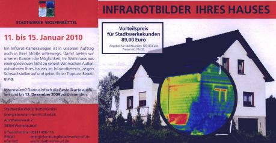
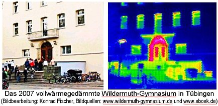
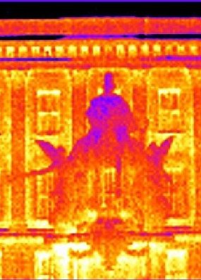
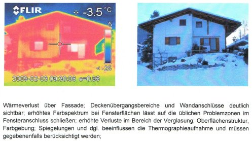
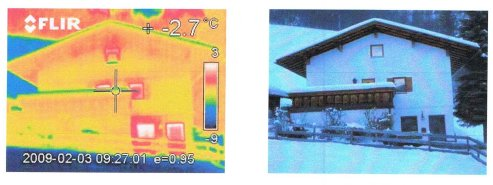
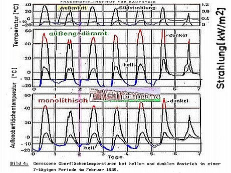
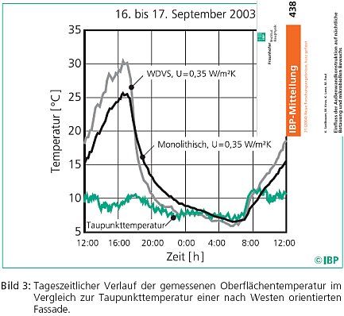

[🠔 Zur Übersicht: Energiesparen](7wsvoant.md)  
# Eine kleine unendliche Geschichte der Ökoabzocke
**Ökovampirismus: Klimaschutzblutsauger auf der Jagd nach Ihren letzten Kröten**  
_von Konrad Fischer_

## Energiesparen und Wärmeschutz am Altbau 6

## Eine kleine unendliche Geschichte der Ökoabzocke

## Von der Intelligenz moderner Baumethoden/Haustechnik/Schimmelpilzzüchtung usw. 
Ökovampirismus: Klimaschutzblutsauger auf der Jagd nach Ihren letzten Kröten

_[Konrad Fischer](1refernz.md)_ 

---

**Mathematische Zauberkünste**

Sehr witzig das bei der Dämmberechnung maßgebliche A/V-Verhältnis, das angeblich Gebäude geringer Außenflächenanteile am Volumen mit geringerem Dämmaufwand begünstigen soll. Was kommt beim kompaktesten aller Baukörper, dem Würfel, heraus? Würfeloberfläche A bei Seitenlänge a = 6a2, Würfelvolumen V = a3, A/V = 6a2/a3 = 6/a. Beispiele mit Kantenlänge a = 10m: A/V = 6/10 = 0,6. Soweit so gut. 

Aber jetzt: Kantenlänge 100m: A/V = 6/100 = 0,06. Hokuspokus? Selbst nachrechnen!

Haben also die gemeingefährlichen Massenwohnungsbesitzer die WSVO/EnEV befördert, um den kleinen Häuslebauer oder den privaten Vermieter zu strangulieren? Der verfassungsgemäße Gleichheitsgrundsatz unserer Demokratur: Die kleinen dämmt man, die Großen läßt man Energie versaufen. Gut, daß die EnEV nur noch mit hauserlizensierter Software zu bedienen ist. Sonst könnte jemand nochmal merken, welch verfassungsfeindliche Mathematik hier herrscht. Dagegen waren Churchills Statistiken ein Kinderspiel.

Auch in Dietikon kann der Dämmschwindel keine Energie sparen: [http://www.universe-architecture.com/ch/E-Stadt4.html ](http://www.universe-architecture.com/ch/E-Stadt4.html)

Die Wahrheit am Bau wird z.B. in dieser Grafik - "Bild 1" aus der Ossi-TGL 26760/07 - "Heizlast von Bauwerken" deutlich:

Die X-Achse zeigt den k-Wert von 0 bis 2,5, die Y-Achse den Strahlungsabsorptionswert gr. phi. Und je mieser (höher) nun der k-Wert wird, umso besser verwertet das Bauteil die Solarstrahlung, egal bei welcher Oberflächenfarbe der Wand. Logisch, daß damit ein toller Zugewinn kostenloser Wärmeenergie für Massivbaustoffe verbunden ist, den k-Wert-optimierte Dämmbuden wirkungslos verpuffen lassen. 

In der Rubrik _"Technik"_ der Zeitschrift _"unipor-trend 7/2000"_ dürfen wir erfahren: 

_"Forschungsprojekt Bochum-Werne beweist: Die k-Wert Diskussion ist längst irrelevant_ 
**_Lüftung verursacht vielfachen Wärmeverlust_**

**_Die k-Wert-Diskussion erübrigt sich - das haben die Messreihen [des Fraunhofer-Instituts und der AG Mauerziegel] an neun Reihenhäusern [unterschiedlichster Lage und Wandkonstruktion, mit und ohne Dämmschichten] in Bochum-Werne ergeben._**

_Denn trotz rechnerischer k-Werte von 0,27 bis 0,47 lag der Wärmebedarf der Gebäudehülle jeweils bei 2,5 Liter Heizöl pro Quadratmeter und Jahr. "Die individuellen Lüftungsgewohnheiten verursachen ein Vielfaches [lt. abgebildeter Grafik teils bis über das 10-fache] davon", stellte das Fraunhofer-Institut fest. ... Die Diskussion um den k-Wert war berechtigt, bekommt aber nach Auswertung seriöser Messergebnisse einen nachgeordneten Stellenwert."_

Utopie und Wirklichkeit sind eben zwei paar Stiefel, nicht nur beim k-Wert/ U-Wert. Logisch, daß Bauen mit schwereren Steinen, dickeren Wänden und [Strahlungsheizung/Temperierung](7temper.md) noch bessere Ergebnisse gebracht hätten. Eine Strahlungsheizung macht ja schon bei geringeren Lufttemperaturen wohlig warm, mit der dann kühleren Abluft wird weit weniger Energie verschleudert. Verblüffend der Schwenk einer Branche, die jahrzehntelang die aufwendig produzierten schwächlichen und rissanfälligen Schaumsteine dem gläubigen Kunden aufgeschwatzt hat und noch aufschwatzt, mit k-Wert-Argumentation und deutlich höherem Preis als der energiesparend herzustellende Voll- oder Hochlochziegel. Daß man sich so rißgefährdete Steine überhaupt gefallen läßt? Das ganze Drama wird neuerdings wieder mal von Helmut Künzel, Fraunhofer-Institut für Bauphysik Holzkirchen, in _"Wie verputzt man Leichtziegel-Mauerwerk?"_ , Deutsches Architektenblatt 8/2000 behandelt. Gut, daß Fachartikel kaum gelesen werden. Mehr zum Thema "fragwürdige Wandbildner" [hier](29bau09.md).

Den [Schuß in den Ofen mit der k-Wert-Theorie](2139bau.md) erkennt auch das Deutsche Institut für Wirtschaftsforschung (DIW) Berlin, das wie folgt in den ibau-Planungsinformationen vom 1.9.2000 zitiert wird: 

**_"Wohnungsbestand:_** 
**_DIW analysiert Energieeinsparung_**

_... Im Verlauf der 90-er Jahre wurden von der Politik zahlreiche Maßnahmen [z.B. Wärmeschutzverordnung 1995, Heizungsanlagenverordnung 1994] im Hinblick auf ehrgeizige Zielvorgaben beim Klimaschutz ergriffen. ... Rückblickend müsse festgestellt werden, dass die erwarteten Wirkungen offenbar überschätzt bzw. die Hemmnisse für die Umsetzung der Maßnahmen unterschätzt worden sind._

_Eindeutige Minderungstendenzen bei Energieverbrauch und CO2-Emission seien hier bisher nicht zu erkennen - ein merklicher Rückgang werde in aktuellen Vorausschätzungen erst vom Jahr 2005 an erwartet."_

Im Klartext: Keine Energieeinsparung durch Wärmedämmung und sonstigen "Klimaschutz". Erfolg auf später verschoben. Auch ab 2005 ist von Energiesparerfolgen durch "Dämmstoffe" rein gar nix zu bemerken gewesen. Voraussage: Glauben Sie den Vertröstungen nicht, die ganze Sache ist und bleibt auch 2005 ff. ergebnislos. Energiesparen durch falsche bzw. nicht funktionierende Wärmedämmung aus luftigen Leichtbaustoffen kann es eben nicht geben, da steht die unerbittliche Physik dagegen. Schön, daß mit Wissenschaftsbetrug und leeren Versprechungen, mit amtlichem Bauzwang und (Ö)KO-Steuer der Bürger so wirksam geschröpft werden kann. Geschäft mit der Angst - Hofastrologie heute.

**Greenpeace**

Gestern - technische Aufklärung: Aus der Greenpeace-Info 3/99: 

**_"Dämmstoffe - ... aus Sicht des Umweltschutzes_**

_...**_Polystyrol_**_ 
_Die Produktion von PS erfolgt aus krebserregenden Stoffen wie Benzol und Stoffen wie 1,3 Butadien und Styrol, die zumindest im Verdacht stehen, Krebs auszulösen. Styrol beeinträchtigt zudem die Fortpflanzungsfähigkeit. PS werden in der Regel bromierte Flammschutzmittel zugesetzt. Hexabromcyclododecan ist zum Beispiel ein schwer abbaubarer Stoff, der sich in der Umwelt anreichert und auch schon im Meerwasser nachgewiesen worden ist. Trotz und wegen der bromierten Flammschutzmittel wird PS im Brandfall zu einer extremen Gefahrenquelle wie die Untersuchung des Flughafenbrandes in Düsseldorf gezeigt hat. Im Brandfall können sie zur Entstehung von ätzenden Brandgasen und Dioxinen führen. Bei der Verbrennung von PS entstehen darüber hinaus in verstärktem Maße krebserzeugende polycyclische aromatische Kohlenwasserstoffe (PAK) sowie Monostyrol._ 
_Extrudiertes Polystyrol (XPS) macht etwa 10 Prozent der PS-Dämmstoffe aus. Bei der Produktion wird immer noch ozonzerstörendes HFCKW zur Aufschäumung des PS genutzt ..._

**_= >Auf den Einsatz von Dämmstoffen aus Polystyrol sollte wegen der Probleme in der Herstellung, der Verwendung problematischer Flammschutzmittel und der Gefahren im Brandfall verzichtet werden._**

**__Polyurethan__** 
_Die Produktion von Polyurethan (PUR) ist mit diversen giftigen Zwischen- und Nebenprodukten verbunden (unter anderem Phosgen, Isocyanat, Toluol, Diamine). Zudem werden von einzelnen Herstellern immer noch HFCKW zur Aufschäumung genutzt. Auch PUR werden halogenierte Flammschutzmittel zugesetzt, die schwer abbaubar sind und sich in der Natur anreichern können (zum Beispiel TCEP: Tris-2-chlorethyl-phosphat). Gerät PUR in Brand werden giftige Chemikalien wie Isocyanate, Salzsäure, polycyclische aromatische Kohlenwasserstoffe und Dioxine freigesetzt. Letztere insbesondere wenn halogenierte Flammschutzmittel verwendet worden sind. Saubere Baustellenabfälle werden teilweise in anderen Produkten aus PUR weiterverwendet._

**_= > Dämmstoffe aus PUR sollten wegen der Probleme in der Herstellung, der Verwendung problematischer Flammschutzmittel und der Gefahren im Brandfall vermieden werden. ..._**

Heute, nach dem Burgfrieden mit der Dämmstoffindustrie - Stimmungsmache mit falschen Argumenten: In den ibau-Planungsinformationen vom 29.2.2000 dürfen wir lesen (erfreulicherweise lehnt Greenpeace Hamburg aber den Einsatz von Polystyrol nach wie vor ab. Lesen Sie einen [Auszug eines Schreibens an den Verband WDVS)](2134bau.md#gottseidank): 

**_"Heizwärme: 70 Prozent der Heizwärme verpufft_** 
**_Greenpeace fordert Wärmeschutz für ältere Wohngebäude - Bundesweite Thermografie-Tour dokumentiert Wärmelecks_**

_Köln (ots) - Die meisten älteren Wohngebäude in der Bundesrepublik sind wahre Verschwender von Heizenergie._

KF: Nach den unbestechlichen Energiekosten-Abrechnungsdaten verbrauchen "ältere" Massivbauten viel weniger Energie, als die mit dem nur für zu vernachlässigende molekulare Wärmeübertragung (z.B. von konvektiv anströmenden Warmluftmoleküle in die Wand), nicht aber für die überwiegende Wärmestrahlung (z.B. von den warmen Raumhüllflächen in die Außenwand) gültigen U-Wert basierenden Rechenmodelle ergeben. Dies zeigen auch [Dipl.-Ing. Paul Bosserts](http://www.universe-architecture.com/Publik.html#InfoEnergie#InfoEnergie) im amtlichen Auftrag durchgeführte Energieverbrauchsanalysen. Jeder weiß, was alte Massivbauten wirklich leisten: Im Sommer kühl - ohne Kühlenergie, im Winter warm, da energiesparend wärmespeichernd. Das ist in den windig gebauten "Niedrigenergiehäusern" und "Passivhäusern" technisch unmöglich. Wie Greenpeace (recte Grünpiss?) nun Hetzjagd auf die Wohnungswirtschaft macht, sieht man [hier](2134bau.md#greenpeace). Die Thermografie soll dafür als Schrotbüchse dienen. Ein Beispiel aus Dänemark (es ist was faul ...) zeigt, für wie blöd man den Verbraucher hält. Mit allerprimitivsten Täuschungsmanövern will man sein Geld aus der Tasche ziehen:

 Bildunterschrift: _"Ein Thermografiebild der Fassade offenbart große Wärmeverluste. Die Messung fand statt bei 1 °C Außentemperatur, Windstille und unbekannter Raumtemperatur. Die Ursache für den gezeigten Wärmeverlust ist, daß die Fensterbrüstung, -sturz und -anschlag in massivem Mauerwerk ausgeführt sind."_ (aus: Michael Rughede: _"Nu skal husene vaere taette/Nun sollen die Häuser dicht werden"_ , BYG-TEK, 25.10.04, mit Aufruf zu Blower-door, Hausdichtung und Maximal-Dämmung, Übersetzung: Konrad Fischer). 

Schon dolle, wie orangewarm eine Süd-Ziegelwand nur durch Belichtung werden kann. Während die noch unbesonnte Westgiebelwand deutlich kälter blaugrünt. Wobei im Eckzimmer (hinter linkem Fenster) innen vor Süd- und Westwand doch absolut die gleiche Raumwärme herrscht. Was so eine Thermografie abbilden kann, ist doch nur die Wärmeabstrahlleistung einer Oberfläche, keinesfalls die Wärmeverluste von innen nach außen. Und die Oberflächenerwärmung kommt gerade in speicherfähigen Massivbauten vorrangig von der Solarstrahlung! Klaro? Auch der West-Betonsockel kann seine Orangewärme voraussichtlich durch Reflexionseffekte vom vorgelagerten hellen Gehweg oder sonstige lagebedingte Einstrahleffekte erhalten haben. Vielleicht speichert er auch die Vortagserwärmung besser als das zweischalige Vormauerwerk.

Ob man mit einem solch volksverblödenden Expertenbeschiß die dummen Dänen genauso schön einseifen kann, wie unsere deutschen Intelligenzbestien?

Schon lustig, wie die folgende Thermographie deren gewillkürte Aussagekraft entlarvt:

 Bildunterschrift: _"Thermografie: Der Wärmeverlust bei der linken Haushälfte (mit Dämmung) beträgt nur einen Bruchteil des Verlusts auf der rechten Seite (gelbe und rote Flächen verraten den Wärmedurchgang)."_ aus: houseandmore.de, Seitenstand 26.10.06, abgedruckt in "Bauen & Wohnen", 26.10.06, Verlagsbeilage der Neuen Presse Coburg, Bildquelle: Sto AG, vgl. www.pr-nord.de/stoo_text155.html.

Klar, daß es am Rollokasten etwas erhöhten Wärmedurchgang gibt. Aber wieso strahlen ausgerechnet die Fensterklappläden vor (!) der blauen Superdämmfassade so dermaßen gelbwarm? Wo kommt denn diese Energie wohl her? Fließt die irre Wärme aus den Beschlägen am Ladenanschlag und heizt ungebührlicherweise den ganzen Laden auf? Verliert das WDVS ausgerechnet hinter Fensterläden jede Dämmwirkung und es fließt ungeschützt Wärme aus dem warmen Zimmer zielgenau bis zum Laden? Hat die Ladenwärme nicht aufgepaßt und wurde vom raffinierten Thermographen in einer äußerst hochnotpeinlichen Situation erwischt? War der Laden vielleicht in eisiger Nacht gar zugeklappt und wurde so von innen her durch das Super-Isolierglas - ganz entgegen der Versprechungen der Glasindustrie - so dolle aufgewärmt? Ach Leute - logischerweise wird auch hier die tagsüber in Massivbaustoffe eingespeicherte Solarenergie des Nachts thermographiert. Und da das WDVS nix speichern will und kann, steht es nach sofortiger Auskühlung durch Strahlunsaustausch mit dem weltalligen Nachthimmel eisekalt herum und fängt lieber saumäßig Kondensat / Tau aus der abkühlenden Nachtluft ein. Das friert dann winters das WDVS auf und sommers sorgt es für baldige Veralgung auf der sollgemäß bald abgesoffenen Dämmhaut - sobald die algizide Vergiftung der Fassadenfarbe ausgewaschen ist. So sorgt das schlaue Malerhandwerk für stetige Nachfrage. Wieviele leichtgläubige Bausimpel werden aber auf diesen ultimativen Gipfel der Energiesparweisheit - auch so ein Bild sagt mehr als tausend Worte - wieder hereinfallen? Und ist es nicht schön, wie das tag- und nächtens aufgeklappte Fensterlädli sogar die Dämmfassade dahinter vor der Abstrahlung in den Eishimmel schützt? Ts, ts ...

 Bild aus: _"Die Wärmebild-Kamera enthüllt: Braunschweigs Schloss ist vorbildlich gedämmt. Im Rathaus-Anbau ließe sich mit so guter Dämmung 40 Prozent Energie sparen ... 40 Prozent Energieeinsparung seien bei bester Dämmqualität möglich, meint Baudezernent Wolfgang Zwafelink ...Wärmebildkameras sind für das Aufspüren von Kältebrücken ein wichtiges Werkzeug für Energieberater."_ aus: Braunschweiger Zeitung 8.2.08, Bildquelle: www.newsclick.de/index.jsp/menuid/2044/artid/7951454, bearb. KF.

Oha, ein solch buntes Woarmäbuidl beansprucht die ergrauten Zellen des Beglotzers aber mächtig prächtig! Und bei den Energieberatern und Wärmebildkünstlern kommt es offensichtlich zur gravierenden Überbeanspruchung. Diese Braunschweiger Pruissn! Nun scheinen sie doch tatsächlich ihre vor der Fassade im Portikus / Säulengiebel außen hingestellten Säulen zu heizen, damit die net so frian müassn. 

Wieso denn sonst strahlen die soliden Sandstein-Säulen (mit Betonkern-Temperierung???) hier wärmer als die vorbildlich nach nordischer Manier eisekalt naßgedämmte Fassade? 

Na, die Nordlichter haben offenbar schon auf Energiesparbirne umgetauscht, gell? Und bestimmt verdämmen die so dolle von klugen EnergieberaterInnen und einem verantwortungsvoll die kommunale Kassen entlastenden Baudezernenten aufgeklärten Braunschweiger nun auch ihr Rathaus. Schilda ist ein Dreck dagegen, Löwen-Heinrich, dir grauts ja wirklich vor garnix! Na ja, an der Neuen Messe München (Minka) an der Isarbruggn haben zugegebenermaßen die boarischen Fachspezln / Gaudibrüder dafür gesorgt, daß auch ihre _vor_ der Fassade stehenden Außensäulen, die das Betondachl tragen sollen, vollwärmegedämmt wurden. Das fehlt den Braunschweiger Löwenbrüdern an ihrem neuen Schloßkistl noch. Mia san hoit mia. Und zeigen den preißischen Sachsen den Vogler. Blöder dämmen geht ja wirklich net. Und schon nach dem ersten Winter war die [Dämmung in Minka putt, und nach der Erneuerung gleich wuida](21314bau.md#messe). Do dämmst di nida, Saubeitl, doamischer! 

Reinhardt Schmidt aus Wolfenbüttel, ein aufmerksamer Leser dieser Seiten, sendete mir am 21.11.09 sein nachfolgendes Mail zur kommunalen Wärmebildeinseifung der arglosen Wolfenbütteler an die Stadtwerke, die offenbar nix unversucht lassen, ihren Bürgern das Geld aus dem Beutel zu bütteln: 

_Sehr geehrter Herr Skodzik, 

mit Erstaunen sehe ich auf der Postwurfsendung ein werbendes Bild eines Hauses - ich nehme an, es soll mir zeigen, daß (mit der Lupe sichtbar gemacht) hier Wärme aus dem Inneren des Hauses entweicht. 

Wie allerdings erklärt sich, daß die Ost- und die Südwand des Zimmers im Erdgeschoß unterschiedliche Temperaturen aufweisen? Ich gehe mal davon aus, dass der Baukörper in diesem Bereich homogen (was die reine Wand betrifft) ist!? und die Unterschiede NICHT aus dem Inneren kommen können. 
Zum anderen finde ich es höchst erstaunlich, daß zur Darstellung von eventuellen 'Wärmelecks' eine offensichtlich um die Mittagszeit bei starker Sonneneinstrahlung gemachte Aufnahme herangezogen wird. 
Noch erstaunlicher ist wohl die Tatsache, daß die Aufnahme im Sommer entstanden sein muß (Blätter am Baum, ein heruntergelassenes Rollo an der Südseite bei Tage - Wärmeschutz? - sowie ein Sonnenschirm auf der Terasse) 

In der Hoffnung, daß Ihre Kunden energietechnisch besser beraten werden, und Sie wenigstens den RICHTIGEN Zeitpunkt für die Aufnahme wählen, wünsche ich Ihnen viel Erfolg bei Ihrer Arbeit. 

Mit freundlichen Grüßen 

Reinhard Schmidt _ 

Der Urheber der Grafik "Infrarotbilder Ihres Hauses" sind die Stadtwerke Wolfenbüttel. Sie wird hier verkleinert und leicht beschnitten lediglich im Rahmen des ges. gesch. Zitierrechts zitiert. Die an der Fassade angebrachten Dämmstoffe am Rollokasten und der Betondeckenplattenverkleidung, ebenso der evtl. herabgelassene Rollo vor dem Kellerfenster oder anderweitige schmalbrüstige "Dämmstoff" glühen feurig rot dank akuter Solareinstrahlung. Nur allzubald sind sie allerdings dort verglüht und werden dämmstoffeiseblau strahlen, da sie eben keine Wärme speichern können. 

 Auch im schwäbischen Tübingen, das seine kaum übertreffbare und geradezu siebenschwabengleiche Unterordnung unter jede Staatsideologie 1938 durch Niederbrennung der Synagoge in der Gartenstraße trefflich erwiesen hat, ruhte man/frau nicht, um auch den Klimaschutzwahn vorbildlich zu bedienen. Ein kleines Beispiel des ökoterroristischen Voranpreschens gegen den Klimaschutzhasen liefert das Wildermuth(!)-Gymnasium, das 2007 einen sogenannten Vollwärmeschutz erhielt, wie die gymnasiale Homepage stolz herauspropagandiert. Na ja, früher war man/frau zum vollstrammen Hasenmarsch in der HJ und im BDM, gelle? Und nun schauen Sie sich an, wie dolle Tübingen Wärmeenergie spart! 

Es langt sogar dazu, das ganz und gar außen liegende Haupttrepple mit besonderer Bevorzugung des aecht massiven Wangenmauerwerkblocks vollfett aufzuheizen, ebenso das gegen Nachtauskühlung im Strahlungsaustausch mit dem schwäbischen Eishimmel dank Balkonkragplatte geschützte Natursteingewändle des Eingangstörles. 

Ja, der urschwäbische MercedesPorscheProtz läßt sich eben auch im gymnasialen Bildungssystem künftiger Schwabeneliten nicht ganz verleugnen. Und Öttingerle war doch mit seinem Wärmegesetzle das ebenfalls unübertreffbare Vorreiterle auch der unsäglichsten Klimaschützerei auf armer Bürger Geldkätzle Koschten. Den allnächtlichen Tauwasserniederschlag auf der ausgekühlten Oberfläche des WDVS - im froschtigen Winterle übrigens ein schwäbsches Eisbähnle - könnte das als besonders strebsam verrufene Physikleistungskürsle überigens mit einem handelsüblichen Widerstandsmeßgerätle Typ Protimeter jeden Morgen vor Schulbeginn messen, wenn es sich mal ausnahmsweise nicht dem Solarschwachsinn und Globalerwärmungsschwindele widmen würde ... 

Dieses schnuggeligge Beischpiel voll geglückter Welterlösung dank schwäbischer Inbrunst verdanke ich wieder mal einem aufmerksamen Besucher dieser Seite. Danggschö, Thomas Förster aus Sachsen! 

Und so funktioniert der Dämmschwindel in den etablierten Qualitätsmedien des Westens mit Thermografien / Wärmebildern / Wärmebildkamera-Aufnahmen, die die Leser voll verarschen - bewundern Sie den Super-Brüller!!!: 
 
Wie schön wärmestrahlt der garantiert unbeheizte steinern-massive Denkmalsockel des von Karl Janssen nach Preisausschreiben und hochherzogen Bürgerspenden 1896 ausgeführte und ständig in der Düsseldorfer Altstadt herumziehende [Königsberg-Versailles-Kaiser-Wilhemlm-I.-Reiterdenkmals](http://fkoester.de/denkmaeler/KaiserWilhelm/index.php) so ultra heiß, heiß, heiß, ebenso wie die Bronzeapplikationen und das Reiterstandbild selber, die mangels Masse etwas weniger Solarenergie einspeichern können, deswegen schneller auskühlen und so etwas weniger heiß abstrahlen. Herrlich auch, wie das Dachgesims zeigt, wie die vom kalten Nachthimmel geschützten Friesrücklagen wärmer bleiben. Oder will hier jemand sagen, das NRW-Staatsbauamt und die Landeshauptstadt Düsseldorf haben mit heißem Glühherzen dafür gesorgt, das heißgeliebte Denkmal und diese herrlichen Massivfassaden so dolle und partiell recht differenziert heiß zu heizen, frei nach dem Motto Jeck bleibt Jeck? Oder als konservierende Temperierung, die die für alle bewitterten Teile so arg bedrohlichen Temperaturschwankungen ausbremst? Nur die modernen Jecken bauen Auskühlfassaden aus dünnen Platten und viel Glas, wie am Landtag - die mangels Speichermasse jede Nacht dolle abfrosten und nur von den Doofsten der Doofen als "gut gedämmt" bezeichnet werden. Junge, Junge, da ist offensichtlich Dauerkarneval angesagt. Jeck, wie die Leute sind, wird nun bestimmt bald auch der Kaiser Willi mit Vollwärmeschutz gedämmt, damit auch er nur noch blauschwarz vor sich hinfeuchten und hinfrosten darf. Wer auf solche Schwindellügen der Dämmbranche noch reinfällt, ist der noch bei Sinnen? Voraussichtlich gibt es hierzulande aber allzuviele, viele davon ... Und für die machen die Klimaschutzterroristen in Amt und Würden dann das neue Klimaschutzgesetz. Denn wir wollen und müssen betrogen werden, am besten von der selbst gewählten Regierung! Denn nur die allerdümmsten Kälber wählen ihre Merkel selber, egal ob rot, grün, schwarz, gelb oder braun. 
(Bildquelle und Originalartikel: [WAZ: "Ministerien verplempern Energie"](http://www.derwesten.de/nachrichten/im-westen/Jedes-zweite-NRW-Ministerium-verheizt-zu-viel-Energie-id4534888.html) Printausgabe 12.04.11, Link auf Onlineausgabe, von dort auch die Einzel-Aufnahme des Standbilds) Freilich leiden auch unsere deutschösterreichen Leidengenossen unter dem weitverbreiteten Energiesparschwindel. Schauen Sie erst mal selbst die folgenden vom Energieberater-Ingenieur am 3. Februar 2009 morgends um halberzehne geschossenen und irgendwann später - im Suff? Kokainrausch? - interpretierten Wärmebildaufnahmen eine unschuldigen und einigermaßen gut gebauten Tiroler Wohnhäuserls mit nur 12,8 Liter Öl Heizbedarf je Quadratmeter (deutscher Durchschnitt ca. 18 Liter!) an und lassen sich die lehrreichen Erläuterungen auf der dämmpelzigen Zunge vergehen (Bildquelle: Beratungskunde): 

 

Die durch die ultragenaue Auswertung der Gebäudethermografie empfohlene Wärmedämmung der gegenüber dem kältestrahlenden Nachthimmel unter dem weit überstehenden Dach perfekt perfekt geschützten Hausfassaden mit einem WDVS hätte ca. 20.000 EUR gekostet. Die von der Sparkasse empfohlene und mitvermarktete Wärmebildaufnahme / Temperaturaufnahme war auch nicht geschenkt. Und jetzt - genau geguckt und alles gleich erkannt, zu welchem Wahnsinn die bekannte Tiroler Heizsucht fähig ist, dort oben in Bergeshöh, beim finstren Wald, auf grüner Alm? Nein? Na dann schaumermal gemeinsam: 

Ein Tiroler Energiesparliedl 

Der Tiroler spart lustig, der Tiroler spart froh, 
denn er heizt seinen Hausbaum wie die Hauswand grad so! 

Doch das langt net, er hat's ja, darum heizt er noch mehr: 
Von der Stützmau'r im Garten bis vom Zaun die Bretter! 

Und sein Pulli ist wollig, unterm Dacherl ist's heiß, 
und im Haus ist's ihm mollig, weil's vom Dämmstoff nix weiß! 

Nach diesem hoffentlich recht lehrreichen Ausflug in den staatlichen, sparkassenmäßigen und gewerblichen Thermografieschwindel nun zurück zum Grünen Frieden Greenpeace, eine NGO: 

_[...] [Nach Jan Rispens, Klimaexperte von Greenpeace] verursacht die Raumheizung pro Jahr 180 Millionen Tonnen klimaschädliches Kohlendioxid, 20 Prozent der deutschen CO2-Emissionen._

KF: Aber, aber: [Kohlendioxid ist doch gar nicht "klimaschädlich"](7thuene1.md) (vgl. die obigen Ausführungen und auch die o. angelinkten [Aufsätze von Dipl.-Met. Dr. Wolfgang Thüne](7thu40.md), ehemals Ministerialrat im Mainzer Umweltministerium!). Seine gastypische Absorptionskennlinie bei 15 Mikrometern Wellenlänge kann die Wärmestrahlung der Erde mit 7 - 14 und >15 Mikrometern nämlich gar nicht absorbieren/reflektieren. Beweis? Jede gestochenst scharfe Satelliten-Wärmebildaufnahme der Erdoberfläche. Und daß CO2 und die Globale Erwärmung (seit über 10 Jahren aber de facto Abkühlung) irgendetwas miteinander zu tun hätten, wurde spätestens November 2009 durch Publikation der ökoterroristischen Mails als perfider angloamerikanischer Wissenschaftsschwindel - selbstverständlich mit der tätigen Hilfe deutscher Volksverräter des ökommunistischen Lagers - enttarnt - (nur nicht bei Wikipedia): [Climategate!](http://blogs.telegraph.co.uk/news/jamesdelingpole/100020515/climategate-the-corruption-of-wikipedia/) 

_Bisher scheuen viele Wohnungseigentümer wegen der hohen Kosten vor einer Sanierung ihrer Gebäude zurück._

KF: Das sollten sie bezogen auf Dämm- und Dichtungsmaßnahmen auch weiter tun, sind diese doch sowohl energetisch unwirtschaftlich, gesundheitlich schädlich und im Ausführungsfall ein hohes Schadensrisiko. Im Deutschen Architektenblatt 3/2000 darf man dazu lesen:

_"Mit dem Ziel der Energieeinsparung durch eine wärmetechnische Verbesserung der Außenwand und der Vermeidung von Undichtigkeiten in der Gebäudehülle zur Reduzierung der Lüftungswärmeverluste wird in den Feuchtehaushalt der Gebäude eingegriffen. Seit der Einführung der Wärmeschutzverordnung [Vorläuferverordnung der Energieeinsparverordnung, Ergänzung Konrad Fischer] lässt sich eindeutig eine Zunahme der Probleme mit Tauwasser am Fenster und an der angrenzenden Wand feststellen. Es wurde häufig nicht berücksichtigt, dass die im Gebäude entstehende Feuchtigkeit über die verbleibenden Undichtheiten unzureichend abgeführt werden kann, und somit die Raumluftfeuchte und der Feuchtedruck an die Außenwand ansteigen._

_Diese geänderten Bedingungen führen zur Bildung von Tauwasser und Schimmelpilzen an wärmetechnischen Schwachstellen in der Gebäudehülle, die vorher kaum problembelastet waren."_ 
in: Josef Schmid, Ingo Leuschner: "Tauwasser und Schimmelpilze im Fensterbereich".

 Bildunterschrift: _"Gemessene Oberflächentemperaturen bei hellem und dunklem Anstrich in einer 7-tägigen Periode im Februar 1985"_ aus: _"Fraunhofer Institut für Bauphysik, Außenstelle Holzkirchen: "Effektiver Wärmeschutz von Ziegelaußenkonstruktionen, 3. Untersuchungsabschnitt, Auswirkung der Strahlungsabsorption von Außenwandoberflächen und Nachtabsenkung der Raumlufttemperaturen auf den Transmissionswärmeverlust und den Heizenergieverbrauch,[EB-8/1985](http://www.ibp.fraunhofer.de/content/dam/ibp/de/documents/Studien80er/Forschungsbericht_FraunhoferIBP_EB-8_1985.pdf), Sachbearbeiter und Abteilungsleiter Dr.-Ing. H. Werner, Institutsleiter Prof. Dr.-Ing. habil. K.A. Gertis, Holzkirchen 20.12.1985"_

In diesem schönen Forschungsbericht aus dem Tollhaus der etablierten U-Wert/k-Wert-Bauphysik, der ganz nebenbei die nicht vorhandene Energiesparwirkung von Außendämmung nachweisen konnte, aber nicht wollte, wird auch in nebenstehender Kurvengrafik mit nicht anzuzweifelnden Meßwerten einer kalten Februarwoche erwiesen, wie viel heißer die Außenoberflächen von Dämmschwarten ("außengedämmt" - 10 cm Polystyrol lambda-Wert 0,04 auf Hochlochziegel, lambda 0,58) gegenüber auch nicht besonders hasenreinen verputzten Porenziegeln (lambda nur 0,25) und vor allem der Außen- und selbstverständlich auch Innentemperatur tagsüber werden und dann reziprok auch taupunktunterschreitend-kondenswassersaufend kälter nachts. Wenn man jetzt noch wüßte, was einem die Ergebnisdiskussion der feinen Herren Bauphysikerdoktores und -professores im Solde der Bauindustrie eiskalt verschweigt, daß Polystyrol einen Wärmedehnkoeffizienten von 8 mm/m 100K gegenüber ca. 0,5 mm/m 100K des Ziegels hat, sich also um das 16-fache mal mehr als der Ziegelstein bei Temperaturwechseln bewegt und damit durch derlei Extremtemperaturschwankungen geradzu von der Ziegelwand weg explodiert, verstünde man, wieso so viele WDVS-Systeme trotz aller Dübeleien und Gewebegitterarmierungseinlagen im Oberputz so schnell blasenbildend von der Wand hängen.

Und eine fast ebenso olle Kamelle ist dieses grandiose Untersuchungsergebnis des Fraunhofer-Instituts für Bauphysik, veröffentlicht unter der Berichtsnummer IBP 438 weiland 2004, das die ganze Tragik der Thermografie und der WDVS-Schimmelzuchtanstalten bloßlegt - einer der schärfsten Bauphysik-Pornos und offenbar nur unter dem Ladentisch gehandelt:

 Bildunterschrift: _"Tageszeitlicher Verlauf der gemessenen Oberflächentemperatur im Vergleich zur Taupunkttemperatur einer nach Westen orientierten Fassade"_ aus: _"Fraunhofer Institut Bauphysik, IBP-Mitteilung 438, 31 (2004), Neue Forschungsergebnisse, kurz gefasst. K. Sedlbauer, M. Krus, K. Lenz, M. Paul: Einfluss der Außenwandkonstruktion auf nächtliche Betauung und mikrobiellen Bewuchs."_ (Bildbearbeitung Konrad Fischer unter Verwendung der Originalgrafik)

Oha, fei Obacht! Hier kann der ahnungslose Energiesparer mehr lernen, als in seinen vorurteilsbeladenen Quadratschädel neipaßt: Erstens, daß sogar an einem blöden Septembertag mit durchschnittlichen Temperaturen (suchen Sie den Tagestemperaturverlauf aus Wetter online bitte selber, das Fraunhofer-Team verrät dazu hier nix) die Oberflächentemperatur auf dem wärmedämmgeblähten WDVS um 17 Uhr wesentlich doller ist, als auf der Nicht-WDVS-Fassade aus irgendwelchem Porenschwammgesteinsl. Wer nur die geringste Ahnung vom Dehnverhalten der Baustoffe hätte, wüßte gleich, was das vor allem für das vergleichsweise noch schwacheligere WDVS-Leichtfassadensystem hochsommers und eiswinters über heißen muß:

Reiß und Zerreiß auf Dübel kimm außi! Das temperaturbedingte Dehnvermögen von beispielsweise Polystyrol - das ist das weißschaumige Gekrümel aus hochgiftigem Styrol in den ach so herrlich leichten Dämmplatten - überschreitet nämlich das des Ziegelmauerwerks um etwa das 20!-fache. Und in die dabei im Wärmedämmfassadli über kurz oder lang trotz aller Armierungsnetze entstehenden kapllar wassersaufenden Furchen und Klüfte und abgescherten Hohllagen der Schwarte spült dann der Regen ein. 

Wo nicht, kommt es dann zweitens zum Absaufen durch tägliche bzw. nächtliche Tauwasseraufnahme in das eisekalte WDV-System. Siehe Grafik! Weil nämlich die Tageshitze aus dem nicht speicherfähigen Dämmstoffplunder ganz schnell wieder rausrutscht, wenn der Abend kommt. Da hilft dann das teuer bezahlte und stärkstens beworbene Wasserabgeweise natürlich gar nix, man ist ja sollgemäß "diffusionsoffen" und besäuft sich mit Tau! Ganz im Gegenteil zu einer speicherfähig warmbleibenden Mauerwerk, wenn es nicht hochwärmedämmend wie eine WDVS-Fassade ist, sondern einen guten U-Wert von 1,1 W/m²K aufweist, wie es das Bild 2 aus der gleichen Publikation zeigt: 

 Bildunterschrift: _"Tageszeitlicher Verlauf der Oberflächentemperatur im Vergleich zur Taupunkttemperatur zur Verdeutlichung des Einflusses des heutigen Dämmstandards auf die nächtliche Unterkühlung einer nach Westen orientierten WDVS-Fassade"_ , ebenfalls aus: _"Fraunhofer Institut Bauphysik, IBP-Mitteilung 438, 31 (2004), Neue Forschungsergebnisse, kurz gefasst. K. Sedlbauer, M. Krus, K. Lenz, M. Paul: Einfluss der Außenwandkonstruktion auf nächtliche Betauung und mikrobiellen Bewuchs."_

Nur das warm die tagsüber eingespeicherte Solarstrahlung nächtens gemütlich und im entscheidenden Unterschied auch zu den "wärmedämmenden" Lochschwammsteinfassaden _immer! über der Taupunkttemperatur_ abstrahlende Massivmauerwerk wird dann zwar von doofen, soweit Dämmstoffpropaganda betreibenden Thermographen mit ihren blauvereisten Dämmbildern angeprangert und von der Ziegelindustrie flugs durch hochwärmedämmende, porenlochdurchschwammte feuchtesaugend errötete Großriesenblöcke mit Niedrigst-U-Wert auf Kleblagerfugen ohne Stoßfugenvermörtelung rißfreundlichst ersetzt, aber solche Leut verstehen ja nicht einmal von ihrem Handwerk, geschweige denn vom Bauen auch nur das geringste und gönnen ihrer beschwindelten Kundschaft außer Werbesprüchlein auch sonst nicht viel wirklich und dauerhaft Brauchbares, oder? 

Und das Betaue der Dämmfassaden passiert selbstverständlich nicht nur vom 16.-17. September 2003, sondern Nacht für Nacht und Tag für Tag, Jahraus und Jahrein. Schauen Sie nur schnell noch mal das Braunschweiger Schloßfassädli oben genauer an. Und entdecken Sie, wie die Massivsäulen im Plusbereich trocken wärmestrahlen, während die naßfeuchten Dämmflächen im Minusbereich angetautes Kondenswasser / Kondensat / Tau / Tauwasser in nordisch-rauhen Mengen schlucken bzw. als Frostpackete in den obersten Fassadenschichten anfrieren. 

Ahoi! Fassade, nicht Land unter, heißt es da bei den Nordlichtern und verhinderten Ostfriesen in ihren nassen Dämmpullis, die genau wegen Nässe nicht dämmen sondern [Schimmelpilzen, Flechten, Algen, Maden, Würmern, Insekten und Spechten](213baust.md) beste Nist- Brut- und Zuchtmöglichkeiten bieten. Ja, und genau deswegen schmeißen die Dämm- und Farbprofis in der schlechtesten Tradition der alchymischen Giftmischer und Hexenmeister unfaßbare Mengen krebsschädlicher Pestizide in ihre Tunken - giftige Chemikalien / Biozide, die kaum oder schwer abbaubar unsere Gewässer verpesten und letztlich dem Trinkwasser, Meerwasser, Grundwasser, Teichwasser, Seewasser und Bachwasser untergejubelt werden. Beschönigend als "Pflanzenschutzmittel" zur technischen Schutzausrüstung oder Filmkonservierung im technischen Merkblatt dargeboten. Danke, liebe Bundesregierung und danke, liebe Ministerialbürokraten und danke auch den Bundestagsabgeordneten für die maximale Förderung des gegen das Wirtschaftlichkeitsgebot des EnEG § 5 verstoßenden und umweltverseuchenden Gedämmes. 

Wobei die WDVS-Beschwartung mit Kunstharzputz und wasserabweisenden Plastik-Anstrichbeschichtungen nicht nur für optimale Wasserhaltung auf der kapillarsaufenden Oberfläche sorgt, sondern eben auch für maximale Blockade des Trocknens und das maximale damit verbundene Frostsprengen, Auffrieren und Aufbeulen der WDVS-Schwarte. Wohingegen der gekalkte Kalkputz auf dem Ziegelmauerwerk in allerdollster Geschwindigkeit die hin und wieder mal schadfrei aufgesogene Regennässe oder Taufeuchte abdunstet, was das Zeugs hält. Ohne wie die [wasserglashaltigen Silikatanstriche den Malgrund durch Härte / Fixierung überzubeanspruchen](22bausto.md). So schlau kann wahres Energiesparen nach alter Väter Sitte sein. 

So manche Energieberater und Planer, vielleicht sogar einige eigentlich dem unbedingten Bauherreninteresse verpflichteten Architekten und Ingenieure? - begeistern sich jedoch leider genau für das Allerfalscheste - übelstes Dämmstoffgeplunder an der Fassade und sonstwo am Bau. Und beraten ihre Kunden auf deren eigene Kosten, ihr Geld an der eigenen guten Fassade mit WDVS zu vernichten. Ja, ja, wie sagt der Volksmund so wahr und schön?: Eben "nur die allerdümmsten Kälber wählen ihren Metzger selber" ... 

Dafür zahlt unsere schöne Bundesregierung via ihrem schrägen KfW-Bankerinstitut (ja, das sind die, deren klammerbeutelgepuderten Flaschen den bankrotten Lehman Brothers noch Millionen über Millionen ins Grab hinterhergeworfen haben) noch Zuschuß aus unseren Steuermitteln bzw. denen unserer Kindeskinder. Das ist er, der Ökommunismus pur von Kohl, Schröders und Merkels Gnaden - zum Wohl des Monopolkapitalismus und all der bestochenen Schweine in Politik und Wirtschaft. Weitere Details - reich bebildert - dazu finden Sie [hier](213baust.md).

_Eine umfangreiche Wärmedämmung könnte jedoch sowohl für den Wohnungsinhaber als auch für den Mieter lohnend sein, wie eine im Auftrag von Greenpeace durchgeführte Untersuchung des Darmstädter Institutes Wohnen und Umwelt (IWU) belegt. Dazu müsste der Staat etwa 30 Prozent der energiebedingten Mehrkosten übernehmen._

_Außerdem müßte er sicherstellen, dass Energiesparmaßnahmen für den Vermieter wirtschaftlich sind und auf den Mieter keine zusätzlichen Belastungen zukommen (Warmmietenneutralität)._

KF: Es ist offenbar aus mit dem Trick, Dämmmaßnahmen ließen sich wirtschaftlich durchführen. Auch die hier als "Mehrkosten" verklausulierten Verluste sind noch geschönt, wie z.B. [Prof. Meiers Analysen](7wirt.exe) und die anderen auf dieser Seite angeführten Untersuchungen seit langem belegen. Der Ruf nach dem Staat ist typisch für derartige Wissenschaft, das Vertrauen in die Politik erstaunt immer wieder. "Warmmietenneutralität" - die neuste Erfindung des Orwell´schen Neusprech?

_Der vorgestellte Ansatz des IWU geht davon aus, dass der Energieverbrauch eines Gebäudes im Mietspiegel aufgenommen wird._

KF: Davor ist zu warnen, da es hier nur um fiktive Rechenwerte geht, die technisch und wirtschaftlich ohne jede Berechtigung sind.

_Führt ein Vermieter Energiesparmaßnahmen durch, kann er eine höhere Kaltmiete verlangen._

KF: Die Anregung des wirtschaftlichen Denkens ernährt erst die Dämmstoffproduzenten und später die Juristen.

_Dem Mieter kommt die Heizkosteneinsparung zugute._

KF: Und wer zahlt für die Bau-, Schimmel- und Krankheitsschäden, wenn es dem Mieter tatsächlich gelingt, überhitzte Atemluft in nennenswertem Umfang einzusperren? Garantiert Greenpeace/IWU dem Mieter die fiktiv errechenbare Kostenersparnis? Und dem Vermieter die Ansprüche auf Mietminderung, wenn sich die Ersparnis nicht einstellt und er obendrein an Allergien, Asthma, Milben und Schimmelpilz im überdichten Wohnraum erkrankt? Und die ständigen Fassadenreparaturen an den typischerweise veralgten und abgesoffenen Wärmedämmfassaden?

_Jan Rispens: "Der Vorschlag des IWU lohnt sich für alle Beteiligten. Weder Mieter noch Vermieter zahlen bei einer energetischen Sanierung drauf, und die Bundesregierung schafft Arbeitsplätze und kommt ihrem Klimaschutzziel ein großes Stück näher."_

_Greenpeace fordert daher Bundeskanzler Schröder auf, in seinem für diesen Sommer angekündigten Klimaschutzplan ein umfassendes Wärmeschutzprogramm für ältere Wohnungsbauten zu verankern._

_Nach Berechnungen des Wuppertal-Institutes könnten mit einer umfangreichen Wärmedämmung bis zu 400.000 neue Arbeitsplätze geschaffen werden._

_Durch sinkende Sozialausgaben und eine geringfügige Umschichtung der Fördergelder vom Neu- in den Altbaubereich hätte der Staat keine zusätzliche finanzielle Belastung zu befürchten. [...]"_

KF: Verbrauchertäuschung und Betrug werden in Deutschland strafrechtlich verfolgt. Ob das für Sowas auch greift?

Wieso sollen die überwiegend nichtdeutschen Arbeiter, die für 3 EURO Stundenlohn die Dämmpakete auf die Wand klatschen, hier für Arbeitsplätze sorgen? Das sind die Realitäten im Dämmstoffverbau. Da die Baufirmen mehr und mehr merken, daß der versprochene Fassadenaufschwung an ihnen vorübergeht, trommelt die Dämmstoffproduktion immer mehr auf dem angeblichen Arbeitsplatzargument herum. Pfeifen im Walde. Befürchtet man, daß die bisherigen Stillhalteabkommen rund um den [U-Wert-Schwindel](2139bau.md) von Seiten der benachteiligten Unternehmen aufgekündigt werden?

Auch das deutsche Handwerk bleibt dabei auf der Strecke, da die sonst erforderlichen Sanierungsarbeiten an der Altfassade bei Dämmung unterbleiben. Die frißt ja die Instandsetzungsmittel schon restlos auf.

Da die schnell absaufenden Dämmfassaden zur Schnellbegrünung und Verschwärzung neigen, vermarktet man nebenbei noch Kunstharzpampen mit angeblich wasserabweisender [Lotuseffizienz](2lotus.md). Jeder Säftl kann diese teure Soße auf Kunstharzputz aufschmieren. NAch zwei Jahren muß man wieder kommen, und dann? Wie erneuert die Lotusfarbe denn ihre Lotusfunktion? Was da nachwächst heißt Alge und Schimmel, nicht Lotusflimmerhärchen. Wo bleibt da das ehrliche Handwerk? Auf Nimmerwiederseh´n.

Die Millionen qm betreffende Dämmstoffentsorgung ist ein weiteres trauriges Kapitel. Anstelle reparaturfähiger Verputze nun also Wegwerfbaustoffe. Da diese mit zerstörerischen Systemen an der Wand befestigtwerden, wird man nach der kurzlebigen Wirkung der Dämmung diese dann unter Zerstörung der Grundsubstanz wieder abrupfen. Die Dämmung überdeckt´s ja.

Zementasbest- und Kunststoffschindelbrigaden der 60er lassen grüßen. Ist der Mensch nur noch Verpackungsware? Lesen Sie dazu diesen [Beitrag von Dipl.-Ing. Paul Bossert](7poly.md).

Weiter: [Kapitel 7](7wdvs07.md)
