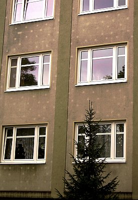
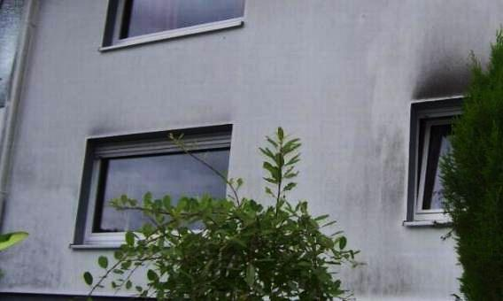
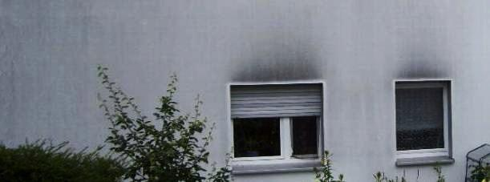

[🠔 Zur Übersicht: Energiesparen](7wsvoant.md)  
# Energiesparen und Wärmeschutz am Altbau 13: WDVS Mängel und Schäden
**Analyse von Mängeln und Schäden an WDVS-Fassaden, einschließlich Feuchte, Schimmel und Algenbildung, sowie deren Auswirkungen auf das Wohnklima. Beispiele und Sanierungshinweise.**  
_von Konrad Fischer • aktualisiert 04.04.2009_

_[Konrad Fischer](1refernz.md)_

## Energiesparen und Wärmeschutz am Altbau 13 - WDVS Wärmedämmverbundsystem - Typische Mängel und Schäden

## Kommentierte Meldungen zum Wohnklima und der "Niedrig"-Energie-/"Passiv"-Hausbauweise gem. U-/k-Wert

### Feuchte, Schimmel und Algen auf gedämmten Fassaden

Den grünen Öko erkennt man heutzutage ja an seiner Fassade. So kann das über kurz oder gar nicht so lang aussehen: 

Oder auch so:   

Im Detail: 

Schön, wie sich die besseren Wärme-Speichereigenschaften der WDVS-Teller-Dübel an der geringeren Vergrünung und Verschwärung mit Grünalgen, Schwazalgen, Stau, Öl und Rüß sofort punktgenau nachweisen lassen.

(Abbildung "Algenbefund auf der WDVS-Fassade" aus "[Forschung] Wärmedämmung; Zur EnEV: 1. Grünes Hinweisschild + 2. Schotten dicht" 
in: _[Bautenschutz+Bausanierung, Zeitschrift für Bauinstandhaltung und Denkmalpflege](http://www.bautenschutz-bausanierung.de)_ , Januar 2002, S. 44, Bildautor: Hochschule Wismar, Bildbearbeitung K.F.)

[Ein dimagb.de-Bilder-Rätsel der Dämmtechnik. Sehr zu empfehlen!!!](http://www.dimagb.de/info/baualt/ahwd01.html#raetsel#raetsel)

 
**Abbildung:** Eine verschindelte Mineralwolledämmung auf Ziegelmauerwerk von außen - mit frischen Nässespuren der vollgesoffenen Dämmung am Sockel, und von innen - die Schimmelpilzzucht (Bildquelle: [Dipl.-Ing. Steier, Fa. Thermotech](http://www.thermotech.de)).

 
**Abbildung:** Ein algenbefallenes Wärmedämmverbundsystem auf der Nordostseite nach wenigen Jahren. So schmutzig kann "Energiesparen" sein. Trotz jährlichem Heißdampfreinigen. (Bildquelle: Beratungskunde).

 
**Abbildung:** Die veralgte wärmegedämmte Fassade (Polystyrol) - Südwestseite (Bildquelle: Beratungskunde). Gegen Kondensateinlagerung ist ein schnell auskühlende Thermohaut machtlos. Das Ergebnis ist vorprogrammiert. Und eine fungizide Silikonharzfarbe kann hier nur wenig bis gar nix helfen.

Aus einem Werbeprospekt der Wülfrather Zement GmbH (01.98): 

**_Aus alt mach neu ..._**

_Millionen Quadratmeter Fassadenflächen in ganz Deutschland sind sanierungsbedürftig. Dazu gehören viele Fassaden, die mit 3 bis 5 cm dicken Polystyrol-Dämmplatten in Verbindung mit einer Oberbeschichtung aus Kunstharzputzen beschichtet sind. Leicht zu erkennen an der Rißbildung, der Ablösung des Oberputzes, auch Blasenbildung genannt, und der Veralgung._

_Von Zeit zu Zeit durchgeführte Renovierungsanstriche der schadhaften Flächen mit kunstharzgebundenen Farben können zwar kurzfristig die Optik der Fassaden verbessern, führen aber langfristig nur zu einer weiteren Verschlechterung der Diffusionsfähigkeit. Das Ergebnis: So "geschönte" Fassaden erfordern bereits nach kurzer Zeit eine aufwendige, kostenintensive Sanierung._

_[...]**Die Lösung:**_

**_Das patentierte Wülfrather ReTec ®-Verfahren, bei dem die gesamte Fassade aufgeschlitzt wird._**

_Diese Technik gewährleistet nicht nur eine optimale Haftung des ReTec ®-Mörtels, sondern sorgt auch für eine wesentliche Verbesserung der Diffusion, die sonst durch den Kunstharzputz stark eingeschränkt ist._

_[...]_ 
_1. Zuerst wird die Oberfläche des kunstharzgebundenen Putzes mit einem Dampfstrahlgerät gründlich gereinigt._

_Um ein Aufweichen bzw. Aufquellen des Kunstharzputzes zu vermeiden, dürfen Temperatur und Druck nicht zu hoch gewählt werden._

_2. Anschließend wird die Fassade horizontal und vertikal z.B. mit Hilfe einer Fräse partiell geschlitzt. Das Rastermaß der Schlitze richtet sich nach dem jeweiligen Zustand der_[durchfeuchteten, abgesoffenen (Ergänzung Fischer)] _Fassade (von ca. 15 x 15 cm 2 bis 30 x 30 cm2). Die Schlitzbreite beträgt 5-7 mm, die Tiefe ist so zu wählen, daß die Schlitze ca. 5 mm in den Untergrund (z.B. Kalk-Zementputz oder Dämmplatte) hineinragen. [...]._

Mein Vorschlag zur Güte: WDVS gleich mit Schlitzen liefern. Das erleichtert die spätere Sanierung der Sanierung und sieht obendrein schick aus. Aus der Ferne wie eine geflieste Bedürfnisanstalt von innen. Auch die neuesten und heute vorschriftsgemäß schadensträchtigen WDVS eignen sich zur Vermarktung von Intelligenzkonzepten wie [kapillarsperrende Beschichtungssysteme](2lotus.md) nach Künzel. 

Einem Promotionartikel der Wülfrather Zement in der Zeitschrift "Bautenschutz+Bausanierung" 8/99 entnehmen wir folgende Ausführungen (die bemerkenswerten Schadensfotos von durchgerissenen, abgelösten und verschimmelten WDVS-Fassaden sparen wir uns hier, fordern Sie bei Interesse das Heft direkt bei der Redaktion Tel.: 0221-5497-321/Fax: 0221-5497-326 an):

_"Dr. Markus Hildebrandt:_ 
**_WDVS_** 
**_Draufsatteln [...]_**

_Eine häufig anzutreffende Rißbildung entlang der Plattenstöße [KF: Igloeffekt, in USA auch Sto-Effekt genannt] resultiert einerseits aus der "Materialermüdung" der als Spachtelung (ca. 2 mm) ausgeführten Armierungsschicht und andererseits aus der großen mechanischen Beanspruchung in diesem Bereich._

_[...] Unter Temperatureinwirkung traten dann im Dämmplattenstoß größere Bewegungen auf, die auf Dauer von den dünnen Armierschichten nicht verkraftet worden sind._

_Die zunächst entstehenden feinen Haarrisse wären z.B. bei mineralischen Putzsystemen auch auf Dauer unbedenklich.**Wenn jedoch das über die Risse eingedrungene Wasser, aufgrund der ungünstigen feuchtetechnischen Eigenschaften der organischen Beschichtungen, nicht schnell genug wieder aus dem System hinaustransportiert werden kann, kommt es im Laufe der Zeit zu einer Vergrößerung der Risse. (Abb. 2).**_

_Schließlich führt das, aufgrund der dauerhaften Hinterfeuchtung in diesem Bereich, zur Ablösung des Oberputzes oder des gesamten Putzsystems von der Platte (Abb. 3 und 4). In diesem Zusammenhang sind auch vielfach mit Wasser gefüllte Putzblasen (Ausbeulungen) (Abb. 5) zu sehen._

**_Weiteres Schadensbild:_** 
**_Verschmutzung und Algenbewuchs_**

_Bei WDVS liegen die Putzsysteme im kalten Bereich, da wegen der hohen Wärmedämmung der Dämmplatten im Winter nur wenig Wärme von innen auf das Putzsystem übertragen wird._

_Dies hat zur Folge, daß Niederschlagswasser, das in das Putzsystem eingedrungen ist (die Putze sind wasserabweisend, aber nicht wasserdicht), nur langsam wieder entweichen kann._

_In diesem Zusammenhang spielen die bekannten feuchtetechnischen Unterschiede zwischen organischen und mineralischen Putzschichten eine Rolle. Während bei [...] mineralischen Putzen eingedrungene Feuchtigkeit extrem schnell wieder entweichen kann_**[Anm. KF: gilt nur bei reinen Luftkalk-Mörteln!, da ansonsten den mineralischen Putzen meist feuchterückhaltende Zuschläge wie Methylzellulose, Hydrophobiezusatz und hydraulische Bindemittel zugesetzt werden sowie regelmäßig stark feuchtespeichernde Kleinporenstruktur vorliegt;]**_, dauert der Vorgang bei organischen Beschichtungen wesentlich länger._

_Die Folge ist, daß die Kunstharzputze sich quasi im dauerfeuchten Zustand befinden. Damit ist die Hauptvoraussetzung für ein Algen- oder Schimmelwachstum erfüllt (Abb. 6). Das Resultat sind grüne und schwarze Bewüchse an den Fassaden, die zu den bereits geschilderten Rißschäden dazukommen und sich teilweise gegenseitig verstärken._

_[Textblock]_ 
**_WDVS-Sanierungsbedarf_** 
_Mehrere Millionen m 2 Fassadenflächen sind allein in ganz Deutschland sanierungsbedürftig._ 
_Hierzu gehören auch viele Fassaden, die mit einem Wärmedämm-Verbundsystem versehen sind. Die Systeme wurden in der Vergangenheit oft mit Dämmstoffdicken von 4 cm und Beschichtungen aus Kunstharzputzen hergestellt. [...]_

**_Sanierung - der allgemeine Stand der Technik_**

_Eine der am meisten angewandten Sanierungsverfahren ist das Aufbringen eines Anstriches, was allerdings in der Regel nur für intakte, d.h. nicht gerissene Systeme, empfohlen wird. Das bedeutet, daß es hierbei nur um eine optische Verschönerung geht._

_Wenn Risse zu sanieren sind, kommen teilweise sogenannte rißüberbrückende Anstriche zum Einsatz, die allerdings die beschriebenen Schäden nicht dauerhaft beheben können, da die Rißflankenbewegung zu groß ist._

_Hinzu kommt, daß viele der eingesetzten Anstriche den bauphysikalischen Zustand der Systeme weiter verschlechtern, da es sich um Beschichtungen mit hohen s D-Werten handelt. Werden solche Anstriche mehrmals vorgenommen, was oft der Fall ist, da sie nur eine kurzfristige Kosmetik darstellen, kommt zu der Schlagregenbelastung von außen zusätzlich ein Tauwasseranfall im Inneren des Systems._

**_Drastisch ausgedrückt: Das System säuft im Laufe der Zeit ab. Eine wirkliche Sanierung eines solchen Systems wird dadurch immer schwieriger und kostenintensiver. Vielfach werden die Systeme dann komplett abgerissen._**

_Eine andere Möglichkeit besteht darin, erneut eine Armierungsschicht aufzubringen. Für eine ausreichende und dauerhafte Haftung auf der alten organischen Beschichtung müssen wiederum Armierungsschichten mit hohem Dispersionskleberanteil gewählt werden._

_Dadurch kommt es zu einer weiteren Verschlechterung der Wasserdampfdurchlässigkeit des Systems, und die Oberfläche ist wiederum mit Werkstoffen hergestellt, die die oben beschriebenen ungünstigen Eigenschaften aufweisen._

**_Wenn die alten Putzbeschichtungen keine ausreichende Haftung untereinander oder am Dämmstoff aufweisen, ist die Standsicherheit beim Aufbringen einer neuen Putzschicht nicht gewährleistet. Die Dauerhaftigkeit einer solchen Sanierung muß daher in Frage gestellt werden._**

_Als letzte Möglichkeit besteht der Abbau und die Entsorgung des schadhaften WDVS. Die Kosten hierfür sind beträchtlich. Dazu kommt die Dreckbelastung, die während des Abbaus entsteht. Eine befriedigende, preiswerte und dauerhafte Lösung existierte im vorgenannten Sinne also bisher nicht."_

> Und ob das vom Verfasser vorgeschlagene aufwendige Applizieren von Zementmörtel hier dauerhafte Besserung verspricht, darf bezweifelt werden. Zementmörtel ist ja für seine hohe Wasserrückhaltung und Versprödungsneigung wohlbekannt. 
> 
> 

> 
> Auch Prof. Dr. Dr. Venzmer, Dahlberg-Institut Wismar berichtet auf den 11. Hanseatischen Sanierungstagen 2000 lt. Bautenschutz und Bausanierung 1/2001: 
>
>> > _"Wärmegedämmte Außenwandflächen von neuen und sanierten Wohngebäuden werden deutlich stärker als andere ungeschützte Flächen von Algen befallen!_
>>> 
>>> _Demnach weisen bis zu 50% von Großtafelbauten in mehreren Städten Norddeutschlands den auffälligen Bewuchs auf."_
> 
> Haben die beteiligten Architekten/Ingenieure/"Bauphysiker"/Unternehmen den Kunden vor diesem seit langem bekanntem Risiko seines Energiesparwahns pflichtgemäß (Beratung als vertragliche Nebenpflicht mit zigjähriger Haftung!) gewarnt? Wer hat nun die Schadensersatzpflicht? Der Hersteller der schlechten Baustoffe im Rahmen seiner Produkthaftpflicht? Und was, wenn die feuchten Fassaden soweit aufgefeuchtet sind, daß die Feuchte durchschlägt und die abgedichtete Dämmwohnung zusätzlich mit der ohnehin schlecht abgelüfteten Wohnfeuchte noch mehr zum Schimmelpilzbefall gezwungen wird? Mit Gesundheitsrisiken und Krankheitsrisiken vom Asthma über Allergie bis zur kompletten Körpervergiftung als logische Folgen zu feuchter Wohnung? Fragen über Fragen. Lesen Sie dazu auch mal hier nach: [Mit WDVS-Wärmedämmung sanierte Häuser massenhaft von Algen befallen](http://www.welt.de/finanzen/immobilien/article13372977/Sanierte-Haeuser-massenhaft-von-Algen-befallen.html ).
> 
> Wenn Sie wissen wollen, wie es um die WDVSe wirklich aussieht, gehen Sie mal mit einer handelsüblichen Feuchtemeßsonde an derartige Kunststoff-Fassaden heran und überprüfen Sie diese mir vorliegenden Meßwerte eines Bausachverständigen (Dämmstoff EPS, Ablesung Display 10.4.2000, Steigende Meßwerte = Steigender Feuchtegehalt): 
> 
> * **11,3** (Aussen-Kontakt auf der Dämmung)
> * **97,0** (ca. 6 cm in der Dämmung)
> * **145,6** (Kontaktfläche Aussenwand-Dämmung)
> 
> Wissen Sie, daß schon 5% Feuchte den Dämmwert angeblich (!) um ca. 50% reduzieren? Und welchen U-Dämmwert wird ein derartig abgesoffenes WDVS wohl haben? Dabei sieht es in Wahrheit freilich anders rum aus: Ein nasser Baustoff kann mehr Wärme speichern, damit verlangsamt sich der Wärmedurchfluß, die Energiesparwirkung
> 
> Und wissen Sie, wie es an dieser Kontaktfläche zwischen WDVS und Wand wirklich aussieht?
> 
> 

> 
> Ja, die deutsche Bauwirtschaft darf den Professoren Gertis, Hauser, Ehm (+) und Werner (u.a.), wohlbekannt aus "Fachseminaren", also ewig dankbar sein. Deren Produkte "DIN 4108" und "WSVO/EnEV" liefern Arbeitsplätze auf Dauer. Sogar für die Müllwerker. Obwohl das energetisch rein garnix bringt, vgl. diese [Meßwertanalyse ](7fehrtab.md)von Prof. Fehrenberg. 
> 
> Beispiel aus einer Presse Information der Wüstenrot Holding AG 8/99, witzigerweise als "Wüstenrot-Ratgeber" tituliert [Kommentare in Klammern von Konrad Fischer]: 
> 
> **_"Wenn Algen und Pilze auf der neuen Hausfassade wuchern_**
> 
> _Mit Recht ist der Hausbesitzer ärgerlich, wenn mit viel Geld und Energiesparwillen modernisierte Hausfassaden in kürzester Zeit wieder verschmutzt sind. Was wurde falsch gemacht? Oft liegt eine Verkettung bauphysikalischer Vorgänge zugrunde, stellt Wüstenrot fest_
> 
> [woher die Kompetenz?]
> 
> _und gibt Hinweise, wie Schäden zu vermeiden oder zu beheben sind._
> 
> _Als Hausbesitzer Alfons Marquard seinen örtlichen Fassadenspezialisten_
> 
> [seit wann sind gutgläubige bzw. von Bauschadenserzeugung lebende Handwerker "_Fassadenspezialisten_ "?]
> 
> _beauftragte, sein Wohnhaus mit einer vollwärmegedämmten Schutzhülle zu versehen, wollte er die nächsten Jahre Ruhe an der Hausfront haben. Einige Monate später lag er mit dem Fachhandwerker im Streit. Was war geschehen? Schon nach wenigen Wochen zeigte sich zunächst ein leichter grüner Hauch auf dem neuen Wärmedämmverbundsystem. Er entpuppte sich im weiteren Verlauf als intensiver schmieriger grüner Belag auf der Außenhaut._
> 
> [Das gibt es heute fast in jeder Straße.]
> 
> _Insbesondere an den Nord- und Westseiten des Gebäudes wucherte der Schmutzfilm aus._
> 
> [Hoffentlich haftet der Fassadenspezi nun auch für die fehlende Beratungspflicht und Bedenkeneinlegung gegen unwirtschaftliche und bauschadensverursachende Dämmung.]
> 
> _Der Befund eines hinzugezogenen Sachverständigen: Algen- und Pilzbewuchs. Bei Algen handelt es sich in erster Linie um einen ästhetischen Mangel. Der optische Störenfried führt auf mineralischen Untergründen zu keinen materiellen Schäden._
> 
> [Typisch [Schwachverständiger ](3gutacht.md)- weiß er denn nicht, daß auf WDVS ausschließlich [kunstharzverschnittene, kapillarentfeuchtungsblockierende Anstriche](2lotus.md) kleben, die teils unter dem Begriff "mineralisch" dem Kunden aufgeschwätzt werden? Und daß Veralgung darauf sehr wohl zu strukturellen Schäden und beschleunigter Alterung führt? Da dieser Artikel letztlich der Vermarktung solcher Klebpampe dient, könnte dies allerdings auch ein Unterschlagen der tatsächlichen Zusammenhänge sein.]
> 
> _Pilze dagegen können die Fassade angreifen._
> 
> **_Die Ursachen_**
> 
> _Die unliebsamen mikrobiellen Hauswandbewohner, Algen und Schwärzepilze haben einen gemeinsamen Nenner. Wie alle Lebewesen brauchen sie Feuchtigkeit. Sie entsteht durch Schlagregen, aber auch durch Temperaturunterschiede zwischen Tag und Nacht._
> 
> [Gemeint ist die tägliche Kondensation aus der feuchtetragenden Umgebungsluft an kühleren Flächen.]
> 
> _Dazu kommt, daß Vollwärmedämmfassaden ein sehr geringes Wärmespeichervermögen haben. Nach Sonnenuntergang kann die Temperatur innerhalb weniger Minuten leicht um 20 Grad Celsius sinken._
> 
> [Sehr richtig! Und jetzt kommt der Infrarotfotograf im Auftrag des Fassadenspezi zum Zuge: Er fotografiert nun die blaufeuchtkalten Dämmbereiche, während die speicherfähigen Massivbereiche noch gemütlich die kostenlos eingefangene Sonnenenergie gelbrot abstrahlen. Käme er zur Mittagszeit, hätte die Dämmfassade allerdings 70 Grad und die Massivwand 30. Klaro?]
> 
> _Die Folge: Der Taupunkt wird unterschritten - es entsteht Kondenswasser._
> 
> [Richtig! Es wird in die zwar wassersperrende aber lt. Werbeaussagen dampfdiffusionsoffene kunstharzhaltige Beschichtung (Putz/Anstrich) begierig eingesaugt und dort angestaut. Viele Stunden leidet ja ein nicht speicherfähiges WDVS unter deutlicher Unterkühlung gegenüber der der zwar kalten, aber im Vergleich zur angeblich "wärmegedämmten Fassade" wesentlich wärmeren Nachtluft und nimmt dabei immer Kondensat ohne Ende auf. Die Brühe kann dann durch das bauphysikalisch falsche Kunstharz-Beschichtungssystem nie richtig austrocknen und bietet so dem scheußlichen Algenbefall allerbeste Nahrungsgrundlage - gerade im Verbund mit dem immer leicht sauren Plastikanstrich bzw. auch Plastikputz / Kunstharzputz.]
> 
> _Zusätzlich gefährdet sind Gebäude mit hohem Baumbewuchs in der unmittelbaren Umgebung. Die grüne Front hält die Sonnenstrahlung ab, das Abtrocknen der Fassadenoberfläche erfolgt langsam oder gar nicht._
> 
> [Das gilt auch für die zwangsläufig unter und in der kunstharzbeschichteten bzw. hydrophobierten Dämmpackung entstehende Feuchtigkeit - Folge: "abgesoffene Wärmedämmung".]
> 
> _Idealer Nährboden für Mikroorganismen. Einen - allerdings eher fragwürdigen - Vorteil haben Fassaden von Häusern, die 30 Jahre oder älter und weniger dick eingepackt sind: Die Gefahr eines unerwünschten Bewuchses ist dort weniger groß, weil unter hoher Energieverschwendung der Fassadenaufbau und damit deren oberste Schicht von innen her eher abtrocknen kann._
> 
> [In Wirklichkeit speichern Massivbauten die Sonne tagsüber und auch im Winter ein und werden dadurch eben besser trocken. Voraussetzung: Kein kunstharz- bzw. silikathaltig trocknungsblockierender Anstrich/Verputz. Selbstverständlich kommt die so kostenlos eingespeicherte Sonnenenergie auch dem Energiehaushalt zugute. Energie- und Geldverschwendung sind bisher nur an gedämmten Häusern praktisch erwiesen, das zeigen umfangreiche Untersuchungen (z.B. Bosserts Energieverbrauchsanalyse, Wichmann und Varsek, Therma-Wettbewerb, GEWOS-Untersuchung).]
> 
> _Außerdem enthalten die Farbpigmente früherer Anstrichfarben Schwermetallverbindungen, die einen mikrobiellen Bewuchs verhindern._
> 
> [Gilt selbstverständlich nicht für Erdfarben in Kalktünchen, die ebenfalls bewuchsverhindernd waren und sind.]
> 
> _Das längst verbotene_
> 
> [gilt nicht in der Denkmalpflege]
> 
> _Bleiweiß_
> 
> [wurde in den vorwiegend mineralischen Fassadenfarben nicht, sondern nur bei - eher selten bzw. auf bestimmte Regionen beschränkt anzutreffenden - Ölfarben auf Fassaden eingesetzt. Bleiweiß wurde und wird vorwiegend [Ölfarben auf Holz](2oel.md) - z.B. für Fensteranstriche - beigemischt.]
> 
> _beispielsweise ist der reinste Pilzkiller."_
> 
> 

> 
> Das abschließende Getrommel, kumulierend in [Lotuseffekt](2lotus.md), Superhydrophobie und Kunst(Silikon)-Harzanstrich sparen wir uns.

Ja, die Schäden an Wärmedämmverbundsystemen. Auch der Silikonharzanstrich-Hersteller Herbol weiß davon zu berichten. Auf seiner mit vielen WDVS-Mängeln und -Schäden reich bebilderten [Webseite](http://www.herbol.de/fprofitipp3.htm) findet sich folgende Information: 

"WDV-Systeme: die Gebäudesituation 
75% aller WDV-Systeme sind anstrichtechnisch Instand zu setzen. Ein Überblick über die Situation hilft bei der Wahl des passenden Instandsetzungs-Systems." Einer Grafik ist dann folgendes zur Schadenssituation an WDV-Systemen zu entnehmen: 

50 % Mängel an der Oberfläche 
"18 % partielle Schäden 
15 % Mängel in der Dämmschicht 
10 % ohne Mängel 
5 % flächige Schäden 
2 % nicht behebbare Schäden"

Ja, da macht das Sanieren Spaß. Wobei ich nicht daran glaube, daß mit einem kapillardicht-sperrenden Anstrich gleich welcher Komposition die WDVS-Bauweise zu retten sein wird. Kondensat dringt weiter ein und wird sich darunter stauen. Und dann? Was nützt dann die schäönste Dampfdiffusion? Sie hat eh nur 1:1000 Anteil an den Feuchtetransporten durch Baustoffe. Da heißt es aufpassen! 

Rainer Jütte, Produktmanager bei Brillux, schreibt zum Veralgungsproblem auf Fassaden und dem Einsatz von vergifteten fassadenfarben / Fassadenanstrichen mit algizider (algentötender) bzw. fungizider (pilztötender) Ausrüstung / Beimischung sehr treffend in Bauhandwerk 9/2007: 

_"Grünstich. Fassadensanierung nach Algen- und Pilzbefall. Durch den Einsatz von algizid- oder fungizidausgerüsteten Beschichtungen können Mikroorganismen über einen Zeitraum von etwa fünf Jahren in ihrer Ausbreitung eingeschränkt werden. Bei günstiger Objektlage, guter Baukonstruktion und wenig Oberflächenfeuchtigkeit sind längere Zeiträume möglich; unter ungünstigen Bedingungen kann sich ein Bewuchs allerdings auch eher einstellen. ..."_ 

Find ich bemerkenswert, wie praxisnah einschränkend hier getextet wird. Was heißt das alles für die Gewährleistung des Handwerkers / der ausführenden Firma? Wo doch jeder normale Bauherr keine bald algenbefallene Fassade wünscht bzw. bestellt / beauftragt? Immer gleich Haftungsausschluß? Es immer darauf ankommen lassen und dann mit wohlfeilen Ausreden glänzen? 

Noch besser dann das Öko-Test Spezial Umwelt & Energie vom Dezember 2008 auf Seite 105: 

_"Passivhaus - die aktive Altersvorsorge."_ Hier wird ein Herrenberger Ehepärchen vorgeführt, das sich von dem "Passivhaus-Papst" Wolfgang Feist (stammt bezeichnenderweise ebenfalls aus Herrenberg!) persönlich zu einem Passivmonster stimulieren ließ. Und was nicht alles in diesem Holzbretterbüdli alles zur Ausführung gelangt, selbstverständlich mit konstruktiver Hilfe eines passivhauserfahrenen Planers: 

30 cm Wärmedämmung aus Hartschaum wurde unter der Bodenplatte des kellerlosen Büdlis verbuddelt, im Boden dann noch 80 mm Polystyrol-Dämmung, 36 cm "relativ preiswert" (!) eingeblasene und selbstverständlich boratverseuchte Zellulosefaser aus Altpapier in der Wand aus Holzstaketen und Lärchenholzschalung, gar 40 cm zwischen den Dachsparren plus paraffinierte Holzfaserplatte sowie angeblich feuchtevariable (in Wahrheit gem. Untersuchungen der FH Hildesheim, Prof. Möring bald dicht verschleimende) Dampfbremse, dreifachverglaste und mit dem Edelgas Argon gefüllte passivhauszertifizierte Wärmeschutzfenster mit einer abstrahlungsblockierenden Spezialbeschichtung, ein Scheitholzkessel mit Wärmetauschereinsatz, dazu elf Quadratmeter Solarkollektoren auf dem Dächli, eine Zwangslüftungsanlage mit Wärmerückgewinnung, Zulufttemperierung durch einen Erdwärmetauscher, der mit einer Umwälzpumpe sein Sole-Wasser aus 80 Meter Kunststoffrohren bezieht, die ein Meter tief im Gärtli verbuddelt wurden, sowie noch ein paar sonstige Ökofinessen wie eine Regenwassersammelanlage und selbstverständlich - man gönnt sich ja sonst nix - schon mal die Vorbereitung für eine nachzurüstende Photovoltaikanlage. Ja, solch konsequenter Umweltschutz macht eben Spaß. 

Doch zu welchem Preis? Na, ja, im Artikel steht, daß die 125 qm Wohnfläche in den Kostengruppen 300 und 400 satte 315.000 Euro kosten, zuzüglich Baunebenkosten (Kostengruppe 700) dürften so ca. 380.000 Euro zusammengekommen sein - wenn's langt. Macht 3040 EUR/qm WF. Für diesen Preis bauen Banken ihre Hauptsitze. 

Hätte der oberstolze schwäbische Passivhausbesitzer ein normales kellerloses Häusli mit 125 qm gebaut, z.B. mit 36,5 vollen Backsteinen und Massivholzdämmung, hätte er alleine vom Ersparten die nächsten 100.000 Jahre heizen können. Legt man nämlich die bei normalen Hauskosten von ca. 1.440 EUR/qm locker einzusparenden 200.000 EUR mit nur 3 Prozent Zins an, bekommt man jährlich 6.000 EUR Zinsgewinn ausbezahlt. Was bedeuten demgegenüber die Passiv-Geschäftle laut Werbeaussage der Ökotestredaktion?: 

_"Schon beim aktuellen Preisniveau ist das (sparsame Passivhaus) auf lange Sicht ein gutes Geschäft, denn die (Passivbauherren) sparen etwa 800 Euro (Energiekosten) pro Jahr."_ 

Mööönsch, Pisa ist wirklich überall!. Allein die ersparbaren Baukosten dürften mehr als locker reichen, um die 125 Quadratmeterchen warmzuheizen, selbst mit Edelholz oder Olivenöl extra Vergine. Leute, kann man sich eine größere Umweltverschmutzung als durch eine solche ökoinduzierte Ressourcenvergeudung noch vorstellen? Ja, so ist er eben, der sparsame Passiv-Schwabe in Herrenberg, Allzeitchampion in seinen typischen drei Geizdisziplinen: 

1. Mit dem Schinken nach der Wurst werfen, 2. Die Brüh teurer als die Wurst kochen und 3. Saving the Penny and losing the Pound. So schlägt man ganz persönlich die BW-Landesbank in der Finanzkrise.

Und wie verhält sich eigentlich die Gesamtwirtschaftlichkeit eines Fassadensystems, wenn man eine längere Zeitperiode betrachtet? Dirk Fanslau-Görlitz, Martin Pfeiffer, Janet Simon und Yasemin Wildebrand stellten sich diese drängende Frage auch und geben in ihrem "Atlas - Bauen im Bestand", Verlagsges. Müller, 2008, im Kapitel I.3: "Nachhaltige Modernisierung" auf Seite 59 eine Tabelle an, aus der die folgenden Kostendaten und Instandsetzungszyklen für verschiedene Fassadensysteme -auch für das vorgenannte Holzständerwerk mit Holzverschalung - bei Betrachtung einer Periode von 80 Jahren aufgeführt werden. Dieses Buch kann als wahre Fundgrube bezeichnet werden, soweit man sich für Baukosten und Wirtschaftlichkeitsbetrachtungen gerade im Zusammenhang mit derzeit anstehenden Neubauten oder auch Sanierungen interessiert. 

Und wenn der schlaumeiernde Leser denkt, daß man ja die Instandhaltungszyklen fast nach Belieben dehnen kann, nur das: Dann steigen halt die jeweils anfallenden Instandhaltungskosten entsprechend. Vielleicht sogar exponentiell. 

Hier nun ein wohl mehr als aufschlußreicher Auszug aus der aufschlußreichen Tabelle, die auf einer entsprechende Untersuchung des Instituts für Bauforschung e.V. IFB in Hannover (Erklärte Ziele u.a.: Kostengünstiges Planen, Bauen und Betreiben) aus dem Jahre 2001 aufbaut: 

Tabelle I.45: 
**Instandsetzungsintervalle und Instandsetzungskosten ausgewählter Bauteile im Wohnungsbau** [Auszug] 
Bauteil, Art der Leistung Instand- 
setzungs- 
intervall Kosten Jahre Kosten nach 80 Jahren 
[inkl. Neben- 
kosten + Ust 
Inflation 2%) Kosten im 
Jahresdurch- 
schnitt 
Außenwände [Jahre] [EUR/m²] 5 10 15 20 25 30 35 40 45 50 55 60 65 70 75 80 [EUR/m²] [EUR/m²] 
Außenwand mit Verblendmauerwerk 284,73 3,56 
Verfugung ausbessern 20 7,67 . . . x . . . x . . . x . . . x 89,10 1,11 
Gerüstvorhaltung 20 7,67 . . . x . . . x . . . x . . . x 89,10 1,11 
Mauerwerk säubern 40 15,34 . . . . . . . x . . . . . . . x 106,53 1,33 
Außenwand mit Standardputz (mit Anstrich 566,36 7,08 
Neuer Anstrich 15 25,56 . . x . . x . . x . . x . . x . 333,09 4,16 
Putzausbesserung 15 10,23 . . x . . x . . x . . x . . x . 133,32 1,67 
Gerüstvorhaltung 15 7,67 . . x . . x . . x . . x . . x . 99,95 1,25 
Außenwand aus Holzständerwerk mit Holzschalung 650,47 8,13 
Streichen 5 5,11 x x x x x x x x x x x x x x x x 205,92 2,57 
Gerüstvorhaltung 5 7,67 x x x x x x x x x x x x x x x x 309,63 3,87 
neue Holzschalung 50 51,13 . . . . . . . . . x . . . . . . 134,92 1,69 
Außenwand mit Wärmedämm-Verbundsystem 1.314,05 16,43 
Reinigung und Pflege 5 7,67 x x x x x x x x x x x x x x x x 309,63 3,87 
Gerüstvorhaltung 5 7,67 x x x x x x x x x x x x x x x x 309,63 3,87 
Putzausbesserung 10 7,67 . x . x . x . x . x . x . x . x 162,21 2,03 
Neues WDVS 40 76,69 . . . . . . . x . . . . . . . x 532,58 6,66 

Nun soll mir mal ein Planer oder Energieberater erklären, wie sich das grottige WDVS-Ergebnis in der oberen Tabelle mit dem Umweltschutz, dem Klimaschutz, der Energieeinsparung und vor allem der Wirtschaftlichkeit verträgt? Ist es angesichts dieser wissenschaftlich erhobenen Daten nicht geradezu ein abscheulicher Betrug, unkundigen und vertrauensseligen Bauherren weiszumachen, daß WDVS zu großen Vorteilen führe? Und selbst der dickste KfW-Zuschuß - von den mickrigen Zinsvorteilen gar nicht zu reden - kann die hier wohl auf den ersten Blick sichtbare Unwirtschaftlichkeit der WDVS-Bauweise jemals heilen. Geschweige denn die selbst gemäß DIN und EnEV "regelrechte" Ermittlung der Heizkostenersparnis als Grundlage der Anfangsinvestition in ein Wärmedämmverbundsystem. Und aufgepaßt: Ein Bauherr kann wohl mit Fug und Recht erwarten, daß sein studierter Planer und auch sein zertifizierter Energieberater die einschlägige Fachliteratur zum Thema beherrscht und seinen Bauherrn deswegen auf Basis gesicherter Erkenntnis vollumfänglich auch wirtschaftlich korrekt berät! Wenn nicht? Das ist dann eine Frage für die Gerichte ... 

[**Extreme Bildbeispiele für Algenbefall auf Wand und Fassade** - Grünalgen, Schwarzalgen, Beulenpest und EnEV](2134bau.md) 

Der auf der Webseite des Europäischen Instituts für Energie und Klima - EIKE e.V. - erschienene Artikel 

## [Der grüne Dämmwahn wird immer teurer!](http://www.eike-klima-energie.eu/news-cache/der-gruene-daemmwahn-wird-immer-teurer/)

von Edgar Gärtner veranlaßte mich zu mehreren Richtigstellungen, die ich hier - etwas überarbeitet - auch der Leserschaft meiner Webseite präsentieren will. Grund: Um den hier offensichtlich weitverbreiteten Irrtümern vorzubeugen. 

### Tauwasseraufnahme der Dämmschwarten

Im Artikel steht: 

_"Die Dämmschicht verhindert tagsüber die Aufheizung der Außenmauern durch die Sonnenstrahlen. Nachts geben die Mauern deshalb kaum Wärme nach außen ab. Die Außenhaut der Dämmung kühlt daher rasch so weit unter den Taupunkt ab, dass sich Kondenswasser darauf niederschlägt. Durch unvermeidliche feine Risse in der Außenhaut dringt die Feuchtigkeit in die Dämmung ein, kommt aber am Tage vor allem an der Nordseite des Gebäudes wegen der wasserdichten Kunststoff-Farbe kaum wieder heraus."_ 

Tatsächlich kondensiert auf den Dämmstoffhäuten mangels Speicherfähigkeit in der Nacht Tauwasser, sobald ihre Oberfläche den [Taupunkt](http://de.wikipedia.org/wiki/Taupunkt) unterschritten hat. Das kann dann durch das Mikrorißcraquelee auch kapillar eingesogen werden. Und die Brühe staut sich dann unter der Kunstharzschwarte, die übrigens auch etwas Feuchte aufnimmt und dann anquillt und so besten Nährboden für die Algensauerei (z.B. Grünalge Fritschiella u.a.) bietet. 

Hinzu kommt aber das Tauwasser, das im feuchtluftgeschwängerten und - bis auf wenige Ausnahmen (Schaumglas) - immer luftdurchlässigem, diffusionsoffenen Dämmstoff selber ausfällt - und zwar in allen Zonen und damit auch irgendwo im Dämmstoffpaket selber, in denen der temperaturabhängige Taupunkt während der jahreszeitlich bedingten Wetterschwankungen gerade mal unterschritten wird. Das ausgefällte Kondensat - pures Wasser in flüssiger Form - kann nun aus dem Dämmstoff nicht mehr entweichen, weil der zwar für Dampfdiffusion und damit für das Eindringen von wasserdampfgeschwängerter feuchter Luft offen ist, nicht aber für flüssige Feuchte. Die müßte nämlich kapillar transportiert werden, das kann der Dämmstoff aber mangels Kapillarsystem nicht. 

Was man hierzu wissen sollte: ~ 1000 : 1 ist das Verhältnis zwischen Kapillartransport und Dampfdiffusion, wenn es um Feuchtetransport in Baustoffen geht. Und wenn sie eben keine Kapillaraktivität aufweisen, bleibt die eingedampfte Brühe eben drin. Verdampfen geht auch schlecht, weil im Dämmstoffschaumbläschen ebensowenig wie im Dämmgespinst oder der Dämmflockenschüttung keine kleinen grünen Männchen mit Tauchsieder drinsitzen, die die zwangsweise angereicherte Flüssigkeit ordentlich verdampfen. Ein Phänomen, das übrigens auch den hinter Dampfbremsen verborgenen Dämmplunder im Dach oder in der Wand betrifft. 

Genau diesen Auffeuchtungsprozeß im diffusionsoffenen, aber kapillarlosen Dämmstoff PUR haben wir im Fassaden-Isolierklinkerfall in ["45 Minuten - Wahnsinn Wärmedämmung"](https://youtu.be/MKeRe7FA4Gs) (NDR) aufgezeigt. Und hinter dem wassergeschwängerten Dämmstoff war die alte Außenwand nahezu komplett vom Schwarzschimmel befallen, wie sich nun beim Abreißen der komplett nassen Dämmhaut bestätigt hat. 

Sowas kommt eben raus, wenn intelligenzgeschwängerte Hausverwalter, erfahrene Planer und brave Handwerker dem scherzpertengläubigen Hausbesitzer beibringen, daß er unbedingt dämmen muß. 

### Sparen nasse Fassaden besser?

Artikel: 

_"Einmal vollgesaugt, isolieren die Dämmplatten nicht besser als ein nasser Pullover."_ 

Jein! Das Entscheidende ist: Die Dämmplatten verhindern vom ersten Tag an - egal ob trocken oder naß, daß die Wandkonstruktion dahinter sich alltäglich mit diffuser oder direkter Solarwärme vollsaugen kann. Die sogenannte Solarblockade. 

Der somit fehlende Wärmeeintrag muß dann zusätzlich durch die Heizung geliefert werden. Genau das hat das Fraunhofer-Institut für Bauphysik in Holzkirchen [experimentell bestätigt](7fehrtab.md). Das war 1983-85. Und ist seitdem nicht nur nicht widerlegt worden, sondern durch die Großuntersuchung an knapp 50 gedämmten und ungedämmten Ziegelbauten (Gewos-Untersuchung 1996) grausam bestätigt. Immer wenn Dämmung auf der Hütte war, stiegen deren Heizkosten. 

Wobei die Nässe im Baustoff dessen Speicherfähigkeit und damit dessen Solarabsorption dramatisch erhöht! Was doch eigentlich eine Selbstverständlichkeit sein sollte. Die ETH Zürich hat nach Kollege Paul Bossert in den 50ern experimentell bestätigt, daß nassere Fassaden weniger Heizenergieverbrauch bedingen. 

### Sind Wärmedämmdübel, die sich hell von der versauten WDVS-Fassade abzeichnen, Wärmebrücken?

Artikel: 

_"Oft sieht man an den grünen Fassaden regelmäßig angeordnete weiße Punkte. Dort sitzen die Dübel, mit denen die Dämmplatten am Mauerwerk befestigt sind. Sie bilden Wärmebrücken, an denen der Außenputz trocken bleibt und Algen nicht gedeihen können."_ 

Das stimmt so nicht. Die Vorstellung, die Dübelschräubchen seien in der Lage, so mächtig Wärme aus der Wand zu saugen, daß sie die draufsitzenden Tellerdübel aus Plaste dermaßen erhitzen, daß sie nicht mehr so viel Oberflächenkondensat einfangen und dadurch weniger veralgen, ist komplett daneben. Dieser Blödsinn wird von der Industrie und den fachlich durchgeknallten Scherzperten suggeriert, um dem furchtsamen (Gewährleistung!) Handwerksheini bzw. dessen Auftraggeber nun oberseitig gedämmte - wesentlich teurere - Dübel zu verhökern. Die dann tatsächlich genauso verdrecken, wie die Gesamtfassade drumherum. 

Die Wahrheit ist viel einfacher: 

Die Dübelteller aus massivem Plastik, die in der äußeren Zone des kranken Fassadensystems sitzen, haben selber wesentlich mehr Speicherfähigkeit, als die Dämmstoffe. Außerdem sitzen sie direkt unter dem Putzhäutchen und haben keinen Dämmstoff drüber. Die dadurch verschwindend höhere Speicherfähigkeit der Dübelteller genügt schon, um die Oberzone über dem Dübelteller einmal weniger auszukühlen und damit allnächtlich weniger Tauwasser reinzusaugen. Somit dann kann sich auch keine Feuchte im Dämmtellerbereich anreichern, so wie in der verdämmten Situation drumherum. Ergebnis: Die Dämmtelleroberflächenzone wird weniger verschmuddelt und von Algen angefressen. Das heißt dann im Fachjargon "Leopardeffekt" oder "Leopardeneffekt". 

### Heizenergie berechnen oder messen?

Kommentator Schwerdt schreibt als "Beweis", daß Dämmstoff eine prima Sache sei zu seinem Dämmhüttchen: 

_"Primärenergiebedarf für diesen Neubau seitdem unter 40 KWh/m²/a. Mein altes Haus mit zweischaliger Bauweise ca 300 KWh/m²/a."_ 

Da hätte er aber schon dazuschreiben dürfen, was "Primärenergiebedarf" in Wahrheit bedeutet: Das fiktive Ergebnis einer falschen U-Wert-Rechenformel, die bei gedämmten Buden grundsätzlich zu schön und bei ungedämmten zu schlecht rechnet und mit dem HeizenergieVERBRAUCH nix zu tun hat. Was zumindest versteckt in den ["DENA-Sanierungs-Studien"](http://www.zukunft-haus.info/de/planer-handwerker/fachwissen-bauen-und-sanieren/baukosten-und-wirtschaftlichkeit/dena-sanierungsstudie.html) - Wirtschaftlichkeit energetischer Modernisierung im Mietwohnungsbestand. Begleitforschung zum dena-Projekt "Niedrigenergiehaus im Bestand" zugegeben wird. Die "Nachweise", daß das Häuserdämmen wirtschaftlich und damit sinnvoll sei, liefert die Deutsche Energie Agentur dena alle nur mit dem gerechneten "Bedarf", wobei sie extrem abenteuerliche Randbedingungen setzen muß, um den Empfängern ihrer Botschaften weiszumachen, daß durch Dämmung echte Kostenvorteile entstünden. Nur professionell, aber von jedem Deppen - Politiker und Beamte ausdrücklic ausgeschlossen! - zu durchschauende gefakete Berechnungen simulieren, daß sich Dämmung lohne. 

### Spart Dämmen Heizkosten?

Wichtig die hier maßgeblichen [Untersuchungen des Fraunhofer-Instituts für Bauphysik](7fehrta2.md) - Effektiver Wärmeschutz von Ziegelaußenwandkonstruktionen - Auswirkung der Strahlungsabsorption von Außenwandoberflächen ... auf den Transmissionswärmeverlust und den Heizenergiebverbrauch", Holzkirchen 20. Dezember 1985. Genau die haben im reproduzierbaren Experiment an echten Testgebäuden justament das erwiesen, was Fakt ist. Sobald WDVS: Höhere Heizkosten. 

Und: Im Sommer kühl, im Winter warm, das ist nicht die gedämmte Pappendeckelbude, sondern das Massivhaus mit aecht Mauerwerk! 

Soviel zu dem EIKE-Artikel. 

**Glanzlichter dieser Seite:** 
[Aktuelles](7wsvoant.md#aktuelles) 
[Einleitung](7wdvs02.md#einleitung) 
[Apokalypsenlyrik](7wdvs04.md#apokalypsenlyrik) 
[Wärmedämmung oder -speicherung, "Wissenschafterkenntnis" der etablierten Bauphysik?](7wdvs05.md#wã¤rmedã¤mmung) 
[Kommentierte Meldungen zum Wohnklima und der "Niedrig"-Energiebauweise](7wdvs13.md#kommentierte) 
[Nachhilfeunterricht in energiesparendem und wohngesundem Bauen 
Das Professorenrätsel](7wdvs17.md#einschub) 
[Interessante Schimmellinks](7wdvs21.md#interessante schimmellinks) 
[Prof. Dr.-Ing. habil. Claus Meier bauphysikalische Beiträge](7waefe.md) 
[Empfehlenswerte Klima- und Umweltliteratur](8buch22.md) 
[Temperierung/Strahlungsheizung](7temp01.md)

---

[Anfragen und Antworten zu Bauproblemen](2frag.md) 
[Das Handwerkerquiz ](10hoai13.md)\+ [Das Planerquiz für schlaue Bauherrn](10hoai14.md) 
[Zum besseren Bauen, Energiesparen und der Klimafrage](7lesbrif.md) 
[Fenster-"Aufklärung"](23bausto.md) 
[Dämmstoffe im Zwielicht - Das Lichtenfelser Experiment](2139bau.md) 
[Die gängigen Klimalügen](7thuene1.md)

Weiter: **[Energiesparen und Wärmeschutz am Altbau Kap. 14](7wdvs14.md)**
