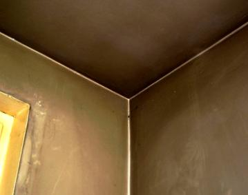
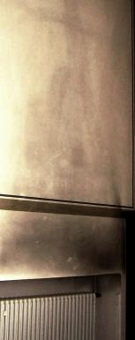

[🠔 Zur Übersicht: Energiesparen](7wsvoant.md)  
# Energiesparen und Wärmeschutz am Altbau 19 - Wohnraum-Schadstoffe und Schimmelpilzbefall / Scharzschimmel, woher und wieso?
**Wohnraum-Schadstoffe, woher und wieso? Schimmel und Fogging - Krankheit durch Dämmung und Energiesparen?**  
_von Konrad Fischer • aktualisiert 18.09.2009_

_[Konrad Fischer](1refernz.md)_

## Energiesparen und Wärmeschutz am Altbau 19 - Wohnraum-Schadstoffe und Schimmelpilzbefall / Scharzschimmel, woher und wieso?

### Von der Intelligenz moderner Baumethoden/Haustechnik/Schimmelpilzzüchtung usw. 

Pseudo-Wissenschaft und Bauphysik

**(aktualisiert 18.09.09)** 

## Wohnraum-Schadstoffe und Schimmelpilzbefall, woher und wieso?

Aus dem Obermain-Tagblatt Lichtenfels, 12.10.1998:

**_"Verbraucher Tips_**

_**Farben** : Viele Dispersionsfarben zum Streichen von Innenwänden enthalten (gem.) "Öko-Haus" gesundheitlich bedenkliche Chemikalien. Von 31 ... weißen Wandfarben ... nur sechs ohne Einschränkungen empfehlenswert .... Elf ... Farben enthielten gesundheitsschädliche Weichmacher. Sie gasten über lange Zeit in die Räume aus ... ähnlich bedenklich wie Lösungsmittel. In acht Farben ... Formaldehyd oder Stoffe, die diese Substanz abspalten."_

Das ÖKO-TEST-Sonderheft Energie Nr. 32 schreibt zu Dämmstoffen (S. 30 ff): 

**_"Dicke Packung_**

_... Immer mehr Bauherren wollen ... weder Kunststoff noch die ... unangenehm juckenden Mineralfasern unters Dach holen. ... künstliche(n) Materialien ... praktische Nachteile: ... nicht in der Lage, eingedrungene Feuchtigkeit leicht nach draußen zu transportieren, ... entwickeln bei ... Brand häufig gefährliche Gase. ... im Sommer unter dem Dach ... häufig ... unangenehme(r) Schwüle. ... Materialien, halten nicht ... die sommerliche Hitze ab. ..._

_... der beliebteste Öko-Dämmstoff ins Visier der Krebsbekämpfer. ... beim Einblasen, insbesondere beim Befüllen der Blasmaschine, irrwitzig hohe Staub-Konzentrationen. ... Laborversuche des Branchen-Primus Isofloc ... ergeben, ... Zellulose-Stäube ... lungengängig ... hohe Biopersistenz ... sich sehr langsam im Körper auflösen. ... neues Gutachten ... soll ... angeblich Krebs durch Holz- bzw. Zellulosefasern im Tierversuch belegen. ..."_

_" Polystyrolplatten ... gasten das krebsverdächtige Nervengift Styrol aus ... enthalten gesundheitlich problematische halogenorganische Verbindungen (AOX) als Flammhemmung._

_... konventionelle Alternative zu Polystyrol ... Dämmplatten aus Mineralfasern. Zwei von drei ... Platten entsprechen nicht ... Norm KI 40 für Biolöslichkeit. Beim Einbau oder der Demontage könnten Fasern austreten und - wenn man sie einatmet - Krebs auslösen. ... bei zwei Produkten krebsverdächtiges Formaldehyd im Test freigesetzt ..."_

Wer sind die Schreibtischtäter und ihre willigen Helfer, die unser ganzes Volk in Gaskammern=Wohnräume schicken? Ist das alles nach Kurt Tucholsky, der in seiner "_Weltbühne_ " Nr. 30/1927 forderte: 

_"Möge das Gas in die Spielstuben Eurer Kinder schleichen! Mögen sie langsam umsinken, die Püppchen! Ich wünsche der Frau des Kirchenrates und des Chefredakteurs und der Mutter des Bildhauers und der Schwester des Bankiers, daß sie einen bitteren und qualvollen Tod finden, alle zusammen!"_ 
(zitiert aus: E. Kern (Hrsg.): Verheimlichte Dokumente, Was den Deutschen verschwiegen wird, München 1988) 

Mit dem in unsere Wohnungen einschleichend vergasenden Schadstoffcocktail, aus denen unsere modernen Baustoffe in der Chemieküche der IG-Farben-Derivate zusammengebraut werden, wird das nicht mehr allzulange auf sich warten lassen. Und dürfen die Opfer der Wärmedämmzeit dann auch auf eine vergleichbare Pressemeldung hoffen?: 

Obermain-Tagblatt 26.3.1999: 

_"**IG Farben** : Die IG Farben in Abwicklung will eine Stiftung gründen, mit der die Opfer des Unternehmens aus der Nazizeit entschädigt werden sollen [...]."_

---

Aus der Neuen Presse Coburg, 23.9.1997: 

**_"Krank durchs Büro_** 
**_Klimaanlagen sind Bakterienschleudern_**

**_Klimaanlagen in Büros ... Studie zufolge zu Asthmaanfällen, Brustverengungen und laufenden Nasen führen._**

_Menschen ... in klimatisierten Gebäuden... leiden beinahe zweieinhalbmal so oft an Reizungen der oberen Atemwege wie Personen in natürlich belüfteten Gebäuden, ...(so der) Mediziner Dan Teculescu ... Jahreskongreß der Europäischen Atemwegsgesellschaft ... in Berlin. ... rund 10.000 Spezialisten (erörten) Atemwegserkrankungen._

_Die Ergebnisse stützen die Berichte über das sogenannte Kranken-Gebäude-Syndroms ... Erkrankungen ... Infektionen von Nase, Hals, Stirn- und Nasenhöhlen ... Kehlkopf ... Augenreizungen ... Mandelentzündungen ... rauher Hals. Je höher das Volumen der Luftumwälzung ... desto geringer ... Gefahr einer Infektion. ... Konzentration der Erreger ... bei großen Luftvolumen erniedrigt._

_Untersucht wurden 425 Büroangestellte in klimatisierten Räumen und 351 Personen in Gebäuden mit natürlicher Belüftung. ... Sieben von acht festgestellten Krankheitssymptomen seien mit Klimaanlagen am Arbeitsplatz verbunden ... mit der durch Klimaanlagen umlaufenden Luft könnten Bakterien und Pilze mitgeführt werden."_

Diese Arbeitsbeschaffung für das Gesundheitswesen durch "Dichtes Gebäude mit Lüftungsanlage" betreiben sogenannte "Bauphysiker", "Planer", Hersteller, Normierer und Anwender/Verarbeiter von Dämmstoffen, Lüftungs- und Heizungsanlagen, Blower-Door-Meßgeräten. Sogar die Tierarzneiproduzenten dürfen davon profitieren: 

Obermain-Tagblatt 29.6.00 

_**"Flöhe:** Jedes dritte Haustier in Deutschland hat regelmäßig Flöhe. Katzen und Hunde sind am häufigsten befallen. Dies geht aus einer Studie eines Tierarzneimittelproduzenten hervor. "Die Entwicklungsbedingungen für Flöhe haben sich durch klimatisierte Räume und Teppichböden verbessert", sagte Firmensprecher Carlheinz Wiedemann."_

Na gut, daß ein Drittel der Deutschen mitverursacht durch unhygienische Wohnbedingungen Allergien haben, daß wir deswegen auch mit jährlich 8.000-10.000 Fällen kontinentaler Europameister im Asthmatotenbereich sind, können wir als Menschenfeinde gerne vergessen. Aber daß nun auch unsere lieben Haustiere unter der Dämm- und Dichtbauweise leiden müssen? 

Daß der Lüftungswahn sogar eine ungesetzliche Bauweise erzeugt, belegt folgende SZ-Meldung vom 1.4.00: 

**_"Wohnungsbau für Hartgesottene_**

_Neubauten in Wohngebieter ... müssen ... nach ... Urteil des Verwaltungsgerichtshofes (VGH BW Mannheim) ... natürliche Frischluftzufuhr besitzen. Ein Bebauungsplan, der wegen ständiger Luftverunreinigung nicht zu öffnende Fenster sowie Klimaanlagen vorschreibe, sei rechtswidrig ... Eine ausschließliche Frischluftzufuhr aus der Klimaanlage widerspreche den Anforderungen an ein gesundes Wohnen. Der ... Bebauungsplan, der die künstliche Belüftung von acht Häusern vorgesehen hatte, ist damit nichtig. ...(AZ: 3 S 3/99) (epd)"_ 

---

> Aus ibau-Planungsinformationen vom 30.10.1998:

_"**Schimmelpilze in Innenräumen lösen Allergien aus**_

_Nürnberg - Auf dem 4. Fachkongreß der Arbeitsgemeinschaft Ökologischer Forschungsinstitute (AGÖF) am 25. und 26. September 1998 in Nürnberg haben Experten erneut bekräftigt, daß Schimmelpilze zu den bedeutendsten Allergenen im Innenraum gehören. Die Sporen der Schimmelpilze verbreiten sich bei entsprechenden Wachstumsbedingungen im Innenraum und werden von den Menschen eingeatmet. Sie können sowohl Allergien mit sogenannten Sofortreaktionen (Typ I und III) auslösen, als auch Allergien mit sogenannten verzögerten Reaktionen vom Typ IV hervorrufen._

_Besteht ein permanenter Kontakt des Menschen zu Allergenen, wie das in einer mit Schimmelpilz belasteten Wohnung der Fall ist, so kann vor allem eine Allergie vom Typ IV mit einer verzögerten Reaktion entstehen. "Dies führt in vielen Fällen zu schweren Krankheitsbildern wie z.B. Hauterkrankungen, Migräne, Magen-Darm-Beschwerden, Autoimmunerkrankungen, Neurodermitis und Konzentrationsstörungen", berichtete die Diplombiologin Nicole Richardson, Sprecherin des Instituts für angewandte Immunologie und Umweltmedizin, Med Plus aus Düsseldorf und Vorstandsmitglied des VDB auf dem diesjährigen AGÖF-Fachkongreß._

_Es besteht durchaus die Gefahr, daß Schimmelpilze in der Wohnung wachsen, ohne daß ein direkt sichtbarer Befall auf den ersten Blick zu erkennen ist. Hinweise für einen "versteckten" Schimmelpilzbefall bieten medizinische Diagnosen, eine sorgfältige Gebäude-Anamnese, mikrobiologische Probenahmen der Schimmelpilzsporen sowie der spezifischen mikrobiellen Stoffwechselprodukte der Mikroorganismen in der Wohnung. [...]."_

Eine dolle ABM für Untersuchungsinstitute und sogenannte Baubiologen. Mein Rat: Wenn´s muffelt, und daran erkennt man Schimmelpilze meist zuerst, raus mit den bei der letzten Sanierung oder beim Baracken-Neubau eingebauten "modernen" Baustoffen, Wärmedämmschichten, kunststoffhaltigen Beschichtungen/Anstrichen, Gummilippenfenster aus Plasten und Elasten, Lüftungsanlagen, ... . Das spart zumindest die nicht unerheblichen Untersuchungskosten.

Das Umweltbundesamt UBA, das bisher von einem Rückgang des Strombedarfs ausging, berichtet dann im Jahresbericht über die Sackgasse "energetische Sanierung des Gebäudebestandes", die, "wenn überhaupt, nur mit äußerster Zurückhaltung weiter beschritten werden dürfe". Grund: "Nach neuesten Erkenntnissen kann bei der Abdichtung der Gebäudehülle die Innenraumluft belastet und dadurch gesundheitliche Probleme durch mikrobielle Kontaminationen auslöst werden." Das bisher "fest eingeplante Energieeinsparpotential, das sowohl vom UBA als auch von der Enquetekommission bei der Berechnung des akuten Nachbaubedarfs von Kraftwerken berücksichtigt worden ist, entfällt in beachtlicher Größenordnung." 

Ja mei, wie sieht es dann mit dem demnächst angeblich verminderten Energieverbrauch auf, der Grundlage des Ausstiegs aus der billigen und bestens verfügbaren Kernenergie ist und den "Alternativen" den Weg bahnen soll? Auch alles behördlicher Strunzmist?

> * * *
> 
> Aus aktuell 2/98, Das internationale Fenstermagazin der gealan-Fachgruppe: 

_"**Gefahren durch Schimmelpilze und Mykotoxine**_ 
_Professor Manfred Gareis berichtet vom 3. Internationalen Kongreß über Bioaerosole, Schimmelpilze und Mykotoxine, USA._

_[...] Wissenschaftlicher Konsens besteht darüber, daß eine intensive Exposition gegenüber Schimmelpilzen, vor allem gegenüber toxinbildenden Arten des Stachybotrys chartarum, mit ernsten Gesundheitsgefahren verbunden sein kann, weshalb in den USA bereits Richtlinien zur Beurteilung und Entfernung von Stachybotrys chartarum im Innenraumbereich erstellt wurden._

_Die von Schimmelpilzen verursachten Gesundheitsgefahren für den Menschen lassen sich generell in Infektionserkrankungen (Mykosen), Allergien (Mykoallergosen) und Intoxikationserkrankungen (Mykotoxikosen) einteilen. Mykotoxikosen, akut sowie chronisch, können aus der Aufnahme von Mykotoxinen über die Nahrungskette, durch Kontakt und durch die Inhalation Mykotoxin-kontaminierter Pilzsporen und Stäube resultieren. Dieser letztgenannte Aspekt stand im Mittelpunkt eines kürzlich in den USA nunmehr zum dritten Male durchgeführten internationalen Kongresses über Bioaerosole, Schimmelpilze und Mykotoxine sowie den damit verbundenen Gesundheitsrisiken, der Diagnostik, der Vorbeugung und der Kontrolle._

_In den Veröffentlichungen zu diesem Thema wurde darauf hingewiesen, daß es nach Wasserschäden und bei hoher Innenraumfeuchtigkeit zu intensivem Schimmelpilzbefall von Inneneinrichtungen und Baumaterialien wie Tapeten, Teppichen, Holzleisten, Gipskartonplatten etc. kommen kann._

_In der Folge kann in solchen Problemhäusern ein statistisch belegter Zusammenhang mit Atemwegserkrankungen, Allergien und anderen unspezifischen Beschwerden bei den Bewohnern festgestellt werden._

_Bislang nahm man an, daß intensiver Kontakt mit Schimmelpilzen entweder zu primär infektösen oder allergischen Erkrankungen bei prädisponierten Personen führen kann. Wenig bekannt war bzw. ist jedoch, daß unter den genannten Bedingungen auch Giftstoffe von Schimmelpilzen über die Inhalation von toxinhaltigen, luftgängigen Schimmelpilzsporen oder Stäuben aufgenommen werden und zu Erkrankungen führen können._

**_Immunsystem gegen Schimmelpilze machtlos_**

_Die als Mykotoxine bezeichneten Gifte der Schimmelpilze sind niedermolekulare Produkte, die beim Stoffwechsel der Pilze entstehen können._

_[...] Aufgrund des niedrigen Molekulargewichts ist unser Immunsystem nicht in der Lage, derartige Stoffe zu erkennen. Ein aktiver Schutz in Form von Antikörperbildung bleibt also aus._

_Eine besondere Bedeutung im Zusammenhang mit dem Gesundheitsrisiko in Innenräumen mit hohen Feuchtigkeiten scheint von dem schwarzgefärbten Pilz Stachybotrys chartarum ("black mould") auszugehen, der besonders auf cellulosereichem Material wachsen kann und bei klinisch-epidemologischen Studien wiederholt als Problemkeim identifiziert werden konnte._

**_Sogar das Blutbild veränderte sich_**

_So konnte in klinisch-epidemologischen Untersuchungen an 53 Personen, die in den USA im Innenbereich ungewöhnlich hohen Konzentrationen an Stachobotrys chartarum ausgesetzt waren, ein statistisch gesicherter Zusammenhang zwischen Exposition und Störungen der unteren Atemwege (Bronchitis, Asthma, chronischer Reizhusten), Hautreizungen, Augenbeschwerden, konstitutionelle Beschwerden (Grippegefühl, Muskelschmerzen, allgemeines Unwohlsein) und chronische Erschöpfungszuständen festgestellt werden. Darüber hinaus traten bei den betroffenen Personen labor-chemische Veränderungen, insbesondere des weißen Blutbildes und des Immunsystems auf._

_Stachobotrys chartarum (synonym atra) ist in der Lage, u.a. die hochtoxischen Satratoxine zu produzieren, die starke Zellgifte sind und das Immunsystem negativ beeinflussen können."_

**Bildunterschriften:**

_"Schimmelpilzsporen setzen sich ähnlich wie Asbestfasern tief in der Lunge ab und sind daher hochgefährlich."_

_"Das Wohngift Schimmelpilz ist tückisch. Die Symptome, die er auslöst, werden oft mit Allergien verwechselt."_

[Literaturreferenzen hier nicht angegeben].

Das ist also das Ergebnis von moderner - streng normgemäßer - Feuchtbauweise. Ein Totalangriff auf unsere Gesundheit durch vorgeschriebene Konstruktionen. Über Geschmack könnte man ja noch streiten, aber über gesundheitsschädigende Bauweise? 

Mit "intelligenten" klappengelöcherten Fensterrahmen aus PVC-Profil, die mit dieser Schreckensnachricht vermarktet werden sollen, ist da nur wenig bis gar nichts erreicht. Ist um des lieben Geldes willen wirklich alles erlaubt? Wie immer schlafen die zuständigen Behörden (oder werden gar kölsch geklüngelt?). Noch schlimmer: Sie verordnen den verschärften Angriff auf die Bürgergesundheit mittels EnEV, nennen das in Newspeak "Klimaschutz" und subventionieren das mit unserem Geld als "CO2-Minderungsprogramm"! Wenn nur die Erträge im Dämm- und Pharmagewerbe wachsen. Das bringt bestimmt keine Nachteile beim Spendenstückeln.

> * * *
> 
> Aus der SZ vom 16.3.1999: 

**_"Eva Kaspar: Wenn die Wohnung plötzlich schwarz wird - [...] Umweltbundesamt [...] 200 Fälle eines neuen Phänomens dokumentiert_**

_"[...] Sie kommen von der Arbeit nach Hause, und Ihre Wohnung ist schwarz. Decken und Wände [...], als wenn [...] 30 Jahre lang nicht renoviert [...] Gardinen [...] grau [...] Kaffeemaschine [...] schwarz-schmierig [...] Kunststoffteile. [...] "Phänomen der schwarzen Wohnungen"._

_[...] mysteriösen Schwarzfärbungen [...] "Fogging". [...] schubartig in der kalten Jahreszeit [...] ölig-schmierigen Ablagerungen [...] vor allem [...] wo warme Raumluft auf kalte Flächen stößt [...] an Außenwänden und Kältebrücken, oder wo [...] Luft verwirbelt [...] oberhalb von Heizkörpern, an Bilderrahmen, Türkanten [...] besonders auf Kunststoffflächen._

_[...] Institut für Wasser-, Boden- und Lufthygiene [...] Umweltbundesamt [...] Gruppe unter Leitung von Heinz-Jörn Moriske [...] Fragebogenaktion [...] über 200 Fälle seit dem Winter 1995/96. In rund zwei Dritteln der betroffenen Wohnungen sind zuvor bauliche Veränderungen vorgenommen worden: [...] Streichen der Innenwände [...] Wärmedämmung des Gebäudes. [...] rund ein(em) Viertel [...] Neubauten._

_[...] Analysen [des schwarzen Belags] [...] Nachweis für schwerflüchtige, organische Verbindungen, sogenannte SVOC, wie langkettige Alkane und Alkohole, Carbonsäuren und Phthalate. [...] Weichmacher, gasen [...] aus Farben und Lacken, Teppichböden und [...] anderen Baumaterialien und Einrichtungsgegenständen aus._

_[...] Helmut Scholz, Ingenieur für technischen Umweltschutz bei der Gesellschaft für Umweltchemie, München, [...] ist aufgefallen, daß manche ältere (Heirzungs-) Anlagen sehr schnell auf maximale Temperaturen von 90 Grad Celsius hochfahren. Die Luft mit den darin schwebenden Staubteilchen wird von den extrem heißen Heizkörpern erheblich beschleunigt - je heißer, desto schneller verwirbelt sie. Dadurch können Staubpartikel verstärkt an Oberflächen geworfen werden._

_Andere Faktoren [...] geringe Luftwechselraten durch moderne, gut schließende Fenster oder schlechtes Lüftungsverhalten [...] erhebliche Mengen weichmacherhaltige Kunststoffe oder stark isolierende Materialien wie Versiegelungen._

_Schwierige Renovierung_

_[...] Renovierung schwierig. Oft kommen die Schwarzfärbungen trotz Putzens immer wieder. [...] manchmal müssen Laminatfußböden oder Styropordecken entfernt werden._

_[...] Die rechtliche Situation ist verworren. Außer bei erkennbaren Baumängeln ist niemand für die Schwarzfärbung verantwortlich zu machen. [...]"_

****NEU:**[Fogging-Magic Dust](http://www.bau.net/forum/schaden/282.htm)** - Diskussion im Baunet-Forum um plötzlichen Schwarzfilmbefall in Wohnräumen

Soweit der SZ-Bericht. Verantwortlich ist also niemand. 

So kann das dann Aussehen (Bilder aus meiner Bauberatung): 
  

Nicht die Bauchemie mit ihren tollen Verschlimmbesserungen der traditionellen Bauweise trägt also irgendeine Schuld am Verseuchen der Wohnung, nicht die Fensterbauer und Fassadendämmer mit ihren schadensträchtig genormten Baukonstruktionen. 

Nicht das DIN, ein **[Verein der industriellen Interessen](2mbu.md)** , 

nicht der dem Lobbyeinfluß hörige Verordnungsgeber, 

nicht die Baubehörden, Architekten und Ingenieure, die den "Bauvorschriften" gehorchen. 

Nicht die titelbehangenen "Wissenschaftler", die "moderne" Bauweisen auftragsgemäß gutrechnen, -messen (sog. **[Drittmittelforschung](4behoerd.md#6. technische)**) und -reden (auf Propagandafeldzügen der Industrie). Die objekt- und menschenvernichtende Wärmeschutz- und Heizanlagenverordnungen erzeugen. Sei die Wirklichkeit noch so dagegen. 

Schuld ist auch nicht der Wohnungsnutzer, der sich blind auf so viel Fachverstand verläßt und auf jede Hochglanzreklame mit Anlauf hereinfällt? Sein feuchtwarmes Abgas ist es doch, das auf kühlen Außenwänden kondensiert. Kühl dank radiatorgestützter Luftkonvektionsheizung und außenliegender, sonnenenergieblockierender, abgesoffener Dämmstoffverpackung. Jeder ist seines Glückes Schmied oder wie man in die Wand hineindampft, so schimmelt es zurück... 

Daß die Förderung der Schimmelkultur im deutschen Wohnungsbau ein direkt zuordenbares Ergebnis der seit etwa 20 Jahren mehr und mehr "berichtigten" Bauphysik und Wärmeschutzverordnung ist, belegt auch folgende Erkenntnis des Umweltbundesamtes: 

Obermain-Tagblatt 31.1.2000 

**_"Schimmel im Haus kann man vorbeugen_**

_Seit etwa 20 Jahren treten nach Angaben des Umweltbundesamtes verstärkt Schimmelpilze in Wohnräumen auf. Für gesunde Menschen seien erhöhte Schimmelpilz-Konzentrationen zwar normalerweise nicht gefährlich, bei Allergikern oder Menschen mit geschwächtem Immunsystem aber können sie allergische Reaktionen, Vergiftungserscheinungen oder Infektionen auslösen._

_Die wichtigste Vorbeugungs- und Bekämpfungsmaßnahme sei die Vermeidung zu hoher Feuchtigkeit in den Wohnräumen .... Schimmelsporen benätigen zum Auskeimen ... Luftfeuchtigkeit zwischen mindestens 65 und 85 Prozent. Ursache des Pilzbefalls seien aus diesem Grund meist bauliche Mängel oder falsches Lüften und Heizen ..."_

**Im Klartext:**

Bauliche Mängel:

Abdichtende kunstharzhaltige Wandbeschichtungen und entfeuchtungsblockierende, da kapillarsperrende Dämmstoffe. Abhilfe: [Nur kapillaroffene Beschichtungen ohne giftträchtige Kunstharzzusätze](26bausto.md).

Falsches Lüften: 

Gummilippendichte moderne Fensterkonstruktionen, deren Stoßlüftungsbetätigung den erhöhten Porenwassergehalt in den abgesoffenen Wohnraumwänden nicht ausreichend ablüften kann. Die gebräuchlichen Isoliergläser verhindern das Abkondensieren von erhöhter Feuchte an der Innenscheibe, diese Feuchte muß dann in die kühleren Wand- und Deckenbauteile einwandern. Abhilfe: [Nur Fenster ohne Gummilippen und ohne Isolierglas](23bausto.md).

Falsches Heizen: 

Heizsysteme mittels Radiatoren/Konvektoren/Heizkörpern, die die Atemluft als Energieträger mißbrauchen. Die erhitzte Luft nimmt vermehrt Feuchte auf, die dann in den kühleren Außenwänden niederschlägt. Da diese oft mit zwar dampfdiffusionsoffenen, aber nicht kapillaraktiven Beschichtungen versehen sind, bildet sich dort ein ideales Wachstumsklima für den Schimmel. Abhilfe: [Bauteil-/Hüllflächentemperierung](7temper.md).

[Info zu Wohnraumgiften](20bausto.md#wohngifte)

Wie wäre es alternativ mit [speicherfähiger Massivbauweise](29bausto.md), kunststofffreien Baumaterialien ([Kalkmörtel, -putz und anstrich](26bausto.md#6.+reine+luftkalkmã¶rtel+fã¼r+mauerwerk,+innen-+und), leinölbehandelte Hölzern, dämmstofffreie Außenhüllen) und einer [Hüllflächentemperierung ](7temper.md)als Strahlungsheizung? Vielleicht gegen die Norm, aber mit dem gesunden Menschenverstand. Und den zumindest von unseren Vätern anerkannten Regeln der Baukunst. 

**_*[Temperierung/Strahlungsheizung](7temper.md)_**

---

Aus den ibau-Planungsinformationen vom 19.3.99: 

**_""In Deutschland schimmelt es wie noch nie zuvor"_** 
**_Schimmel ist häufigster Bauschaden in Wohnungen mit dichten Fenstern_**

_Stuttgart - "In unserer Republik schimmelt es wie noch nie zuvor" - mit diesem plakativen Ausspruch brachte der Bauphysiker Prof. Dr. Gertis vom Fraunhofer Institut für Bauphysik anläßlich der internationalen Fachmesse "fensterbau", die vom 18. bis 20. Februar in Stuttgart stattfand, eines der größten Probleme seit Einführung dichter Fenster auf den Punkt. Tatsache ist, daß schon im Bauschadensbericht der Bundesregierung von 1995 die sichtbare Schimmelpilzbildung in Wohnungen als häufigster Bauschaden hervorgehoben wurde._

_[...] In Wohnungen werden täglich durchschnittlich zwischen acht und fünfzehn Liter Wasser erzeugt - durch Duschen und Baden, Blumengießen und Schweißabsonderung. Die Feuchtigkeit muß wieder nach draußen, wenn sie in der Wohnung keinen Schaden anrichten soll. Meistens genügt es, die Fenster zu öffnen, wobei im Winter kurzes Lüften reicht, im Frühjahr und Sommer ist längeres Lüften nötig, da die "Frischluft" nicht so trocken ist wie im Winter._

_Ab einer Temperatur von 10 Grad C und einer relativen Feuchte von 65% fühlen sich schon einige Schimmelpilze wohl, die meisten gedeihen erst ab 80% Luftfeuchtigkeit richtig. Doch auch wenn der Hygrometer weniger anzeigt. An kalten Wänden und Fenstern ist die Luftfeuchtigkeit meist höher. Hängen dann noch dicke Vorhänge vor den Fenstern, kann man die Tröpfchenbildung am Rahmen und Glas schon sehen._

_Auch Schmutz spielt eine Rolle, je stärker die Verschmutzung, desto leichteres Spiel haben Schimmelpilze und Bakterien. Manche Anstriche und Tapeten können außerdem das Schimmelwachstum fördern. Ungünstig ist auch, wenn die Möbel zu dicht an der Wand stehen, weil dann dahinter keine Luft mehr zirkulieren kann. [...]"_

Das Problem dichter Wohnungen greift die Seite 2 der SZ am 27. 5. 2000 auf: 

**_"Volkskrankheit Allergie_**

_Jeder dritte Bundesbürger ... Allergie. ... Bei einer allergischen Reaktion bekämpft das Immunsystem irrtümlich harmlose Stoffe aus der Umwelt. ..._

**_Der Feind aus der Natur_** 
_Bei Allergikern bekämpft das Immunsystem eigentlich harmlose Stoffe wie Staub oder Pollen_

_Von Christina Berndt_

_... Nur ... knappe Mehrheit der Bundesbürger reagiert grundsätzlich gelassen auf an sich harmlose Substanzen in der Umwelt, auf Birkenpollen etwa, Hundehaare oder Haselnüsse._

[Anm. KF: Diese "knappe Mehrheit" wohnt halt noch in "unsanierten" Wohnungen - ohne dichtschließende Fenster, ohne Fassadenvollwärmeschutz - aber mit gesundem Wohnklima!]

_Bei den übrigen vermutet das Immunsystem in mindestens einem dieser Stoffe seinen ärgsten Feind und geht vehement dagegen vor._

_... Zerstörungswut der körpereigenen Abwehr schadet vor allem dem Allergiker selbst. ... Immunzellen verteilen ... aggressive Stoffe. ... Histamin ... bewirkt ... Bronchien zusammenkrampfen, ... Schleimhäute anschwellen ... Nervenenden jucken - typische Symptome einer allergischen Reaktion. ... Bei einer besonders heftigen Reaktion bricht der Organismus in einem "anaphylaktischen Schock" zusammen, der tödlich enden kann. ..._

_... Erwin Schöpf ... Universität Freiburg. "Das Risiko von Allergien wächst, ... weil wir seit der Ölkrise von 1973 in schlecht durchlüfteten Wohnungen leben." ... In Akademikerhaushalten ... leiden mehr Kinder unter juckenden Hautausschlägen und Heuschnupfen als in Arbeiterfamilien. ..."_

Ist doch klar: Erstere konnten es sich als erste leisten, auf den Energiesparwahn heireinzufallen: Fenster dicht, Niedrigenergiehaus aus 80 Prozent Sondermüll, oben drauf Photovoltaik plus Solarkollektor. Bude dicht, aber mit Sick-building-Verteilungslüftung. Und krankhafter Waschzwang wegen praktischer Naturabscheu - die Folge des Ökospiritismus nach James Lovelock. Da die Baupresse aus geschäftlichen Zwängen das Schimmelthema rund um die Wärmschutzverordnung nicht wahrheitsgetreu anpackt, kommt der Tagespresse eine besondere Verantwortung zu. Beispiel ehem. DDR: [www.jungewelt.de/2002/03-01/020.php](http://www.jungewelt.de/2002/03-01/020.php) und auch BILD macht mit: 

Bild der Frau Nr. 21 am 22. Mai 2000, S. 48 bis 49: 

**_"Gefahr in der Wohnung 
Schimmelpilze machen krank_**

_... Zahlen ... alarmierend: ... in 40 Prozent unserer Häuser wuchern Schimmelpilze. ... Umweltexperten warnen: "Noch wissen zu wenig Ärzte, wie gefährlich die Pilze sein können. ... Auslöser von schlimmen Allergien, Entzündungen und Asthma." ..._

_Tage- und nächtelang weinte mein Junge, weil er so starke Ohrenschmerzen hatte. Dazu kamen Probleme mit den Bronchien, Erstickungsanfälle, immer wieder Erkältungen, Grippe, Husten, Magen- und Darminfekte." Widerwillig denkt Sophie Brocks (40) an ihre alte Wohnung - obwohl ... eigentlich ein Traum ... wunderschönes ehemaliges Fachwerkhaus mitten in einem Park. Viereinhalb Jahre hat die Familie dort gelebt - mit üblen Folgen: Sophie, ihrem Mann Rüdiger (Chefarzt, 42) und den Söhnen Frilli (6), Johann (9) ging es immer schlechter: Schlafstörungen, ständige Erkältungen, verschwollene Nasenschleimhäute, schmerzende Bronchien. Der Grund: Schimmelpilz._

_Sophie Brocks: "Als das Mauerwerk feucht wurde, ... mit einer luftundurchlässigen Styropor-Fassade saniert. ... darunter ... Schimmelpilz ungehemmt wuchern."_

[Anm. KF: Folge der üblichen Fehlberatung der "Fachleute", man müsse gegen Feuchte dämmen und isolieren, man müsse damit "Kältebrücken" vermeiden, an denen Luftfeuchte kondensiert. Falsch: Dämmfassaden sind nicht "Luftundurchlässig". Sie lassen Kondensat prima herein (Werbung: "Diffusionsoffene Fassade"), aber mangels Kapillarentfeuchtung schlecht wieder heraus. Folge: Die "abgesoffenen Dämmfassade".]

_Keiner der Mieter ahnt etwas von dem Unheil. "Der Schimmel wuchs versteckt, nur der muffige Geruch machte uns stutzig. ... Sachen im Keller schimmelig wurden ... wir sie entsorgen wollten. ... Müllabfuhr ...: Das ist Sondermüll."_

_Sophie Brocks ... lässt das Haus von Umwelt-Ingenieuren untersuchen. ... eine bis zu 16-fach erhöhte Konzentration giftiger Schimmelpilz-Gase - und Sporen von einem halben Dutzend weiterer Arten ... schädigen das Immunsystem, führen zu Allergien, Asthma, Rheuma, Augenbindehautentzündungen und Erkältungen. ... Krebs, Herz- und Lungenentzündungen durch Schimmelpilze sind nachgewiesen._

_... eine Nachbarin der Brocks ... Augen- und Schleimhaut-Reizungen, ... andere kann nachts kaum schlafen, ... Schluckbeschwerden. "Am ärgsten traf es den kleinen Jungen in der Erdgeschoss-Wohnung. Er bekam eine Lungen-Fibrose (Raucherlunge)!"_

_Mittlerweile ... Schimmel so weit ausgebreitet, dass er in den unteren Etagen sichtbar ist. Familie Brocks ist umgezogen - in eine schimmelfreie Wohnung! Frilli geht es viel besser. Sophie Brocks: "Experten sprechen von einer neuen Volksseuche._

[Anm. KF: Das ist zutreffend. Auch Autoren dieser Seite warnen seit fast 30 Jahren vor den krankmachenden Folgen der Gebaüdeverpackung in Schaumstoffe. Gegen eine Übermacht industriehöriger "Experten".]

_Meine Erfahrung: Kaum zehn Prozent der Ärzte und Heilpraktiker wissen, wie krank Schimmelpilz macht. In den USA, in Japan, Schweden und den Niederlanden ist man schon viel weiter." Lutz Franke, Facharzt für Immunologie und Laboratoriums-Medizin in Düsseldorf ... : "Wir müssen bei Störungen des Immunsystems verstärkt darauf achten, was dahinter steckt. ... zu oft werden Schimmelpilzvergiftungen falsch diagnostiziert. ..."_

[Anm. KF: Wer ein gutes Ergebnis sucht, folge diesem Rat: 

Keine Dämmung, keine Dichtung, keine Leichtbauweise: Kein Schimmel!]

_... Amtliche Materialprüfungsanstalt Bremen ...: Über 40 Prozent unserer Häuser ... Schimmelpilz-Problem. Risse in Dach oder Mauern, in denen sich Regenwasser sammelt, oder Staunässe in Grundmauern sind ideale Lebensbedingungen für die Pilz-Sporen._

[Anm. KF: Ach wie schlau - es geht doch vor allem um Feuchtekondensation an Außenwänden infolge Dämmung, Dichtung und falscher Heizung! Sonst gäbe es nicht die explosive Zunahme des Schimmels in energetisch sanierten Wohnungen, wie auch das Beispiel Brocks beweist!]

_Schon geringe Mengen Feuchtigkeit lassen sie keimen - oft auch jahrelang unbemerkt hinter Tapeten oder Fußböden. Dr. Thomas Warscheid von der Materialprüfungsanstalt ...: "Kunststoff-Fenster verhindern Luftaustausch. Neubauten werden viel zu früh bezogen, bevor sie ausgetrocknet sind. Dünne Deckenkonstruktionen schaffen Kältebrücken. Zu oft werden Baumaterialien falsch verwendet."_

[Anm. KF: Oder Verpackungsstoffe als Baustoffe mißbraucht!]

_30 Prozent aller Klagen entstehen nach dem Wechseln auf Kunststoff-Fensterrahmen. Anwalt Marcus Schmidt vom Verein "Mieter helfen Mietern", Hamburg: "Bauherren und Vermieter ... unterschätzen die hohen Regress-Forderungen, die Mieter ihnen stellen können."_

_Um anderen Betroffenen zu helfen, hat das Ehepaar Brocks jetzt die Schimmelpilz-Liga e.V. [_ Neuer Wall 14, 20354 Hamburg, Tel.: 040: 457 609, Fax: 447179, nimmt Berichte (max. 2 Seiten) zu Schimmelpilzproblem an und vermittelt Untersuchungsdienstleistungen]_mitbegründet: ... Wir wollen erreichen, dass die Wärmeschutzverordnung und die Energiespargesetze geändert werden und Krankenkassen die Vorsorgeuntersuchungskosten bezahlen." INGA DI MAR"_

Wer bezahlt wohl die Kosten, wenn nun der ganze Fassadenmüll wieder entsorgt werden muß? Die SZ orientiert den Mieter auf die Durchsetzung von schimmelbedingten Mietminderungen - die vor Gericht gar nicht selten in der zweiten Instanz gegen den Vermieter verlorengehen - am 3.12.1999 wie folgt:

**__"Der alljährliche Zankapfel:__** 
**_Heißes Eisen Heizkosten_** 
_Das Streitthema erhitzt regelmäßig die Gemüter von Mietern und Vermietern_

_Von Sabine Hense-Ferch_ 
_[...]_

**_Das Schimmel-Problem_** 
_"... typisches Problem zwischen Mieter und Vermieter ... Feuchtigkeit und Schimmelpilz in der Wohnung" weiß [Mieterbund-Sprecher] Ropertz. ... Anspruch auf eine mangelfreie Wohnung, ... Mieter verlangen, dass ... Schäden (kurzfristig beseitigt) werden. Gleichzeitig ... Mietminderung zwischen fünf und 60 Prozent ankündigen._

_... Sache des Vermieters, zu beweisen, dass die Wohnung keine zu dünnen Außenwände, keine schadhafte Fassade oder sonstige Baufehler hat._

_"Erst wenn feststeht, dass die Wohnung frei von Mängeln und auch die Fenster, Türen und Heizungen in Ordnung sind, muss der Mieter nachweisen, dass er oft genug gelüftet hat und dass die Möbel nicht zu dicht an der Wand stehen", rät die Verbraucherzentrale. [...]"_

Dabei könnte alles so einfach sein: Der Vermieter löst die Schimmelschäden in seinem Verantwortungsbereich aus, weil er sich durch die entsprechenden Verordnungen zu den schimmelpilzfördernden Dämm- und Dichtmaßnahmen zwingen läßt. Inzwischen fördern die Dämmfans sogar staatliche Zwangsmaßnahmen, die so aussehen: In einem Wohnblock sind 30 Wohnungen. Bei einem Mieter schimmelt es. Der Wohnblock muß zwangsweise gedämmt werden. Die norm- und verordnungsgläubigen bzw. baukostengeile Planer und Handwerker (hier gibt es für Bauherren natürlich [Regreßmöglichkeiten ](2mbu.md)zuhauf!) des Vermieters haben für die Schimmelpest des Mieters die erforderlichen Bedingungen geschaffen (wobei die übergroße Mehrzahl dieser Prozesse vom Vermieter letztlich gewonnen werden, da der Mieter nach der Schwachverständigenmeinung eben trotzdem mehr lüften hätte müssen. Auslöser solcher Meldungen ist die Werbeabsicht zugunsten der Dienstleistungen von Verbraucherzentralen und Mieterberatungsvereine. Trau, schau, wem!):

1. Heizsystem: Die Radiator-/Konvektor-Heizung mißbraucht nicht nur das wichtigste Lebensmittel Luft als staub- und keimbelasteten und überschnell flüchtigen Energieträger, sondern führt obendrein feuchte Warmluft sollgemäß an wärmetechnisch unterversorgte, also kühle Außenwände. Folgen: Kondensation und Schimmelbildung, nachrangig Bauschäden. Dagegen kann auch ein Klafter Dämmstoff vor der Wand nichts helfen. 

2. Fenstersystem: Die übermäßig dichten Isolierfenster gem. WSVO/EnEV verhindern systematisch (bauartbedingt: Isolierscheiben ohne Soll-Kondensatbildung als unübersehbarer Warnhinweis an den Nutzer, endlich zu lüften sowie Gummilippendichtung ohne Frischluftzutritt) eine ausreichende Ablüftung der feuchten, verkeimten und schadstoffbelasteten Raumluft. Folge: Soll-Kondensation an den kühleren Außenwänden, Schimmelbildung, Bau- und Gesundheitsschäden. 

3. Dämmung gem. WSVO/EnEV: Außendämmung verhindert die Wandaufheizung durch die tagsüber auch im Winter wirksame Solarenergiespeicherung. Von Innen wird die Wand nicht ausreichend erwärmt, infolge falscher Heizung (s. 1.), evtl. infolge zusätzlicher Innendämmung, evtl. wg. nicht speicherfähiger Barackenbauweise. Die nicht speicherfähigen Dämmstoffe sind wasserabweisend "vergütet" und können das dank starker Nachtauskühlung nächtlich eindringende Kondensat nicht mehr abtrocknen. Sie saufen feuchtetechnisch ab. Die Wand kühlt weiter unnötig ab und wird dadurch kondensatgefährdeter. Folge: Schimmel und Bauschäden. 

4. "Energiesparstrategie": Das Bauen nach k-Wert und WSVO/EnEV 2000 vermag in Wahrheit ([s.o.](7wdvs05.md#wã¤rmedã¤mmung)) überhaupt keine Energie auf wirtschaftlich, technisch und wohngesunde Art und Weise einzusparen. Die auf die Miete umgelegten "Energiesparinvestitionen" sind also total für die Katz. Das muß sich der Mieter aber nicht gefallen lassen. Und die "bestens" beratenen Bauherren, Vermieter, Wohnungsbaugesellschaften eigentlich auch nicht. Leider nutzen sie die entsprechende Mieterhöhung auch gerne zu zusätzlicher Preissteigerung. Liegt da der Hase im Pfeffer?

Einzig sinnvolle Gegenwehr des Mieters aus wohnhygienischer Sicht und Überlebensstrategie: Obere Gummilippendichtung rausrupfen oder Fenster Tag und Nacht ständig aufreißen oder in bessere Wohnung ziehen. Um den Zusammenhang zwischen Heizen und Lüften erst mal aus Streitvermeidungsabsicht und zur Ermöglichung einer gütlichen einigung sozusagen unter Umgehung von Zusatzkosten für Schwachverständige und Rechtsverdreher selbst zu ermitteln, könnte man einfach einen kostengünstigen Thermo-Hygrometer mit integrierter Datenloggerfunktion zur Aufzeichung der Meßwerte von Raumtemperatur und Raumluftfeuchte über einen angemessenen Zeitraum einsetzen. Und Vorsicht vor Schimmelbroschüren ohne eingehende objektgerechte Aufklärung (muß die der Planer bzw. Handwerker zur Regreßvermeidung vielleicht mitliefern?):

FAZ 26.7.02

**_"Heiz- und Lüftungsverhalten_**

_Nach Modernisierungsarbeiten, insbesondere nach dem Einbau neuer isolierverglaster Fenster, obliegt es dem Vermieter, den Mieter auf ein zu änderndes Heiz-und Lüftungsverhalten hinzuweisen. Die Belehrung ist nicht in allgemeiner Form, anhand einer Broschüre, sondern auf die konkreten Raumverhältnisse hin zu erteilen. - > LG Neubrandenburg, Urteil vom 2.4.2002, Aktenzeichen 1 S 297/01._

_Ist dem Mieter eine Wohnung mit älteren Fenstern überlassen, sorgen diese häufig schon für Luftzirkulation in den Räumen. Dies kann sich ändern, wenn luftdichte Fenster eingesetzt werden. Soll Schimmelpilzbildung vermieden werden, muß der Vermieter den Mieter entsprechend instruieren, weil die Änderung in der Bausubstanz vom Vermieter veranlaßt wird und diese Maßnahme grundsätzlich in seine Sphäre gehört."_

Fazit: Der gegen jede Vernunft als mietrechtlich umlagefähige Modernisierung veranlaßte nachträgliche Dichtfenstereinbau kommt den Mieter wg. unzumutbarer Wohnverhältnisse und den Vermieter wegen Mietausfall und Prozeßrisiko gleichermaßen teuer zu stehen. Das ist Sanierung heute. Einziger Profiteur: Gewissenlose Fensterhersteller und Bauphysick-Building-Beförderer.

Weiter: **[Energiesparen und Wärmeschutz am Altbau Kap. 20](7wdvs20.md)**
