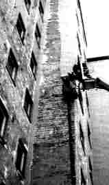

[🠔 Zur Übersicht: Altbau Restaurierung](20bausto.md)  
# Energiesparen und Wärmeschutz am Altbau 1
**Vom Betrug mit Bauphysik und Klimatologie - Wirtschaftlich, energiesparend und gesund bauen - Wie geht das? Einleitung - Aecht bayerischer Ökogrusel - Lohnt sich Energiesparen?**  
_von Konrad Fischer_

> [!abstract]+ Kapitelübersicht: Energiesparen  
> 1. **Energiesparen und Wärmeschutz am Altbau 1**
> 2. [Energiesparen und Wärmeschutz am Altbau 1a - Wie sollen wir richtig bauen?](7wdvs01.md)
> 3. [EnEV-Energieausweis/Energiepass-Schwindel: Altbau-Energieberatung, Architektur+Wärmeschutz 2](7wdvs02.md)
> 4. [Energiesparen und Wärmeschutz am Altbau 3](7wdvs03.md)
> 5. [Energiesparen, Klimalügen, Klimaschwindel, Klimapolitik, Solarenergie, Solartechnik 4 - Eine kleine unendliche Geschichte der Ökoabzocke](7wdvs04.md)
> 6. [Wärmedämmung oder -speicherung, Witze der etablierten Bauphysik?](7wdvs05.md)
> 7. [Eine kleine unendliche Geschichte der Ökoabzocke](7wdvs06.md)
> 8. [Energiesparen und Wärmeschutz am Altbau 7](7wdvs07.md)
> 9. [Die Dämmfanatiker](7wdvs08.md)
> 10. [Energiesparen und Wärmeschutz am Altbau 9 - Wie sollen wir richtig bauen?](7wdvs09.md)
> 11. [Energiesparen und Wärmeschutz am Altbau 10: Wie funktioniert die k-Wert-Rechenkunst (neu U-Wert)?](7wdvs10.md)
> 12. [Energiesparen und Wärmeschutz am Altbau 11](7wdvs11.md)
> 13. [Energiesparen und Wärmeschutz am Altbau 12 - Wie sollen wir richtig bauen?](7wdvs12.md)
> 14. [Energiesparen und Wärmeschutz am Altbau 13: WDVS Mängel und Schäden](7wdvs13.md)
> 15. [Energiesparen und Wärmeschutz am Altbau 14](7wdvs14.md)
> 16. [Wohnklima? in vorschriftsgemäß gedämmten Bauwerken](7wdvs15.md)
> 17. [Wohnungslüftung in gedämmten Buden - Fluch oder Segen?](7wdvs16.md)
> 18. [Energiesparen und Wärmeschutz am Altbau 17](7wdvs17.md)
> 19. [Die Energetische Sanierung von Altbauten und ihre Folgen](7wdvs18.md)
> 20. [Energiesparen und Wärmeschutz am Altbau 19 - Wohnraum-Schadstoffe und Schimmelpilzbefall / Scharzschimmel, woher und wieso?](7wdvs19.md)
> 21. [Staatliches Energiesparen - ein Anschlag auf die Volksgesundheit?](7wdvs20.md)
> 22. [Energiesparen und Wärmeschutz am Altbau 21 - Wie sollen wir richtig bauen?](7wdvs21.md)
> 23. [Wärmedämmung / Wärmedämmverbundsystem / WDVS ja oder nein?](7fehrtab.md)
> 24. [Dämmstoff/Wärmedämmung/WDVS ja oder nein? Teil 2](7fehrta2.md)

## Von der Intelligenz moderner Baumethoden / Haustechnik / Schimmelpilzzüchtung usw. 

Wissenschaftsdogmatik am Bau und in den Klima-Simulatoren

[Konrad Fischer](1refernz.md) 

**Glanzlichter dieser Seite:** 
Ewig Aktuelles 
Einleitung 
[Apokalypsenlyrik](7wdvs04.md#apokalypsenlyrik) 
[Wärmedämmung oder -speicherung, "Wissenschafterkenntnis" der etablierten Bauphysik?](7wdvs05.md#wã¤rmedã¤mmung) 
[Kommentierte Meldungen zum Wohnklima und der "Niedrig"-Energiebauweise](7wdvs13.md#kommentierte) 
[Nachhilfeunterricht in energiesparendem und wohngesundem Bauen - Das Professorenrätsel](7wdvs17.md#einschub) 
[Interessante Schimmellinks](7wdvs21.md) 
[Prof. Dr.-Ing. habil. Claus Meier bauphysikalische Beiträge](7waefe.md) 
[Die härtesten **Bücher gegen den Klimabetrug** - Kurz + deftig rezensiert](8buch22.md) 
[Temperierung/Strahlungsheizung](7temper.md) 
[Leser-Anfragen und meine Antworten zu Bauproblemen](2frag.md) 
[Was kostet eine Altbauplanung? Kommentierter Honorar- und Leistungsvergleich](10hoai26.md) 
[Das Handwerkerquiz ](10hoai13.md)\+ [Das Planerquiz für schlaue Bauherrn](10hoai14.md) 
[Zum besseren Bauen, Energiesparen und der Klimafrage](7lesbrif.md) 
[Fenster-"Aufklärung"](23bausto.md) 
[Dämmstoffe im Zwielicht - Das Lichtenfelser Experiment](2139bau.md) 
Dr. Ulrich Berner, Geozentrum Hannover, [zu den gängigen Klimalügen](7thu55.md) (Buderus-/IWO-Forum: Die Ölheizung der Zukunft, 28.10.03, Kloster Banz) 

---

**München TV** Pressetalk 20:00 **"Einstürzende Flachbauten"** [Talk-Clip 6 min wmv 2,9MB Download](mtvclip1.wmv)) 
mit v.l.: Konrad Fischer, SZ: Red. Christian Schneider, TV-Moderator Christopher Griebel, FOCUS: Red. Christian Sturm, BYAK: Vorstand Rudolf Scherzer 
aus tragischem Anlaß 

---

_"Der Bauende soll nicht herumtasten und versuchen. 
Was stehenbleiben soll, muß stehen und, 
wo nicht für die Ewigkeit, doch für geraume Zeit genügen. 
Man mag zwar Fehler begehen, bauen darf man keine!_ 

Johann Wolfgang von Goethe (1749-1832) 

in: Wilhelm Meisters Wanderjahre, II, 8; gefunden von Carl. M. Bresch. 

---

**Ewig Aktuelles**

[Prof. Dr.-Ing. habil. Claus Meier: Das malträtierte Haus - Zum falschen Wärmedämmen und den genormten Schwindeleien mit "Energieausweis/Energiepass" und EnEV](7epass.md)

[Paul Bossert zum steuergeldvernichtenden CO2-Gebäudesanierungsprogramm](7bo.md)

ARD Ratgeber Bauen & Wohnen - 8.5.04: **[Fensteraustausch](http://web.archive.org/web/20040622224645/http://www.wdr.de/tv/ardbauen/archiv/040508_3.phtml) 
** Siehe hierzu Fachbuchreihe **["Fenster im Baudenkmal"](8buch06.md#leckerbissen)** mit Beiträgen von Konrad Fischer zur Erhaltungsproblematik, Bestandsaufnahme und Ausschreibung von Fensterreparaturen sowie Claus Meier zur kontroversen Fenster-Bauphysik 
 

Unterstützen Sie die [Initiative für gesundes Bauen](7intiv.md) 
 
[Veräppelung3- Die Wärmedämmung](2131bau.md) (Foto: Helmut Pätzold in: Bauhandwerk mit Bausanierung 2/01)

 
[Die Alternative:](2131bau.md) Maschinelles Runterrupfen der schnell totalzerstörten WDVS. Auch das Mauerwerk ist nun kaputt. Doof gelaufen?(Bild aus Thomas Böttcher: "Warmes Fressen für den Biber" in: _[Bautenschutz+Bausanierung, Zeitschrift für Bauinstandhaltung und Denkmalpflege](http://www.bautenschutz-bausanierung.de)_ , März 2001, S. 29, Bildbearbeitung K.F.) 
**[Einspruch gegen den Entwurf zur DIN 4108-2](7adnr.md)** - der Arbeitsgemeinschaft für Dämmstoffe aus nachwachsenden Rohstoffen e.V. 
Prof. Meiers **[Einspruch gegen den Entwurf zur DIN 4108-2](7din4108.md)** - lesen Sie auch die **[Kurzfassung](7d4108kf.md)** , erschienen in "bausubstanz" 9/1999 
Auf die zum Einspruchstermin am 23.11.1999 Prof. Meier übergebene Stellungnahme des NABau 4108-2 (Verf. Prof. Hauser u.a.) des DIN hier seine erwidernde [Stellungnahme](7d41082e.md) 
[Stellungnahme Prof. Meiers zum Entwurf der DIN 4108 Teil 3](7d41083.md) 
[Diskussion zur EnEV 2000: Position des Bundesverbandes der Deutschen Ziegelindustrie e.V.](http://www.gre-online.de/EnEV/forum/06ziegel.htm) 
AGH-[Petition an den Deutschen Bundestag gegen die EnEV](enev.md#petition) (mit Nachfolgeschreiben!) 
[Petition des Architekten Schwan, Berlin, an den Deutschen Bundestag gegen die EnEV 2002](enev.md) 
[enev-online.de/forum/4_web.htm](http://www.enev-online.de/forum/4_web.htm) 
[Energiedialog 2000](http://www.energiedialog2000.de/) 
[Strafanzeige gegen Glaswollehersteller](http://www.mythen-post.ch/datei_news_25_5_02/strafanzeige_i_news_25_5_02.htm) wg. Betrug 
[Energie-"Faschismus"](7enfasch.md): Wie das Bundesministerium für Raumordnung, Bauwesen und Städtebau (BMBau) auf Empfehlungen des Petitionsausschusses des Deutschen Bundestages "reagierte". Von Paul Bossert 
Die [Stellungnahme der Bundesarchitektenkammer](http://www.universe-architecture.com/Publik.html#InfoEnergie#InfoEnergie) zur Energieeinsparungsverordnung EnEV (Referentenentwurf) - kommentiert von Paul Bossert 
RA Johannes Kirchmeier: [Zur Verfassungswidrigkeit der WSVO/EnEV 2000](7enevver.md) 
[Einspruch (Entwurf) der Architektenkammer Berlin ](7enevrlp.md#berlin)gegen die EnEV 2002 (Referentenentwurf) 
[Einspruch der Architektenkammern Rheinland-Pfalz und Hessen](7enevrlp.md) gegen die EnEV 2000 (Referentenentwurf) 
[Kommentar der Architektenkammer Nordrhein-Westfalen](7enevrlp.md#kommentar der architektenkammer nordrhein-westfalen) zur EnEV 2000 (Referentenentwurf) 
[Minergie](http://www.universe-architecture.com/Publik.html#InfoEnergie#InfoEnergie): Zum Schweizer Energiehumor. Von Paul Bossert 
[Paul Bossert: Zum fiktiven Rechnen mit der EN 823](7d41082e.md) 
[Eczem.de](http://www.eczem.de) bietet den dämmstoffgeschädigten Kranken diese bemerkenswerte [Linksammlung](http://www.eczem.de/links/links.html) 
[Weitere Formen amtlicher Großleistungen](4behoerd.md) 
Naturstrom oder was? [Eine TOP-Seite zur Energieerzeugung - mit kritischen News rund ums Energiethema](http://members.tripod.com/WilfriedHeck/) 
[Gegen kriminelle Klimaschutzpolitik!](http://www.sancal.de/klima-schwindel.htm) 
Tipp: Bundesweite Energieberatung gem. KfW-Richtlinien - jedoch ohne kreditvernichtenden Dämmschwindel und k-Wert-Betrug vom zugelassenen Energieberater: 
[Architekt Kai Kühnel](http://www.A--2.de/)

---

**Einleitung**

---

_"Das Zeitalter der Aufklärung muß erst noch kommen: 
Ein Zeitalter ohne Vormünder und Entmündigte, 
eine radikale Aufklärung, 
in dem keines Wissen und Verstand mit Finsternis umhüllet ist. [...], 
sind doch die Kirchentümer wie die Fakultäten behaftet 
mit einem Mangel an Erkenntnis und also einer unvollendeten Aufklärung. 
Der Nachholbedarf an Aufklärung ist allenthalben größer als wir uns vorstellen."_ 
Rudolf Bohren 

_"Nichts schafft ein besseres Gewissen, 
als dem lieben Nächsten ein schlechteres suggeriert zu haben. 
Die Fabrikation des schlechten Gewissens ... gehört seit langem zur Strategie radikaler Minderheiten in der gesamten westlichen Welt."_ 
Helmut Schoeck

Friedrich Schiller: [_**Der Brodgelehrte**_](2000.md#der brotgelehrte) - ein wahrheitstreues Bild der Wissenschaft.

---

**Seit Jahren manipulieren uns vier zusammenhängende Kampagnen:**

1. Simulationen und Klimaereignisse "bewiesen", daß der Fortbestand der Menschheit durch das "Treibhaus- und Klimakillergas" CO2 gefährdet sei. 
2. Die EnEV sei nicht "scharf" genug, um unsere klimaabstürzende Welt zu retten, es bräuchte Verschärfung sowie CO2-Emissionszertifikathandel, und 
3. Die chemiebedienende Barackenbauweise, natürlich im Verbund mit von den Energiemonopolen raffiniert aufgezäumte Öko-High-Tech, spare Energie. 
Wenn nur wenigstens die Energie teurer wäre, damit das auch wirtschaftlich gelänge. 
4. Die Wissenschaft sei sich in 1. bis 3. einig. Nur unabhängige "Spinner/Eigenbrötler" stänkern dagegen.

**Entscheiden Sie selbst: Hier finden Sie die Kehrseite der ÖKO-Medaille**

****Aecht Bairischer** ÖKO**- Grusel****

**Das Augsburger Landesamt für Umweltschutz LfU.**

Erst den vorauseilenden Lobpreis lesen: 
[LfU: Solarige "_Lobende Erwähnung"_](http://www.architektur-solarthermie.de/html/LE35.html)_ 
_[Stoibers Einweihungsrede 29.11.99: _"Pionierleistung der energiesparenden Architektur und revolutionären Energieversorgung"_](http://text.bayern.de/Presse-Info/Reden/1999/991129.html)_ 
_ Dann aus dem Jahresbericht des Bayer. Obersten Rechnungshofes 2001 S. 73-76: 

**_"Energieeinsparung bei neuen Hochbauten"_**

(Nach weiteren Totaldesastern des Neuen Leichtbauens zum Augsburger Landesamt): _Das Gebäude wird über eine Lüftungsheizung beheizt, bei der die bis zu 30_ _o C erwärmte Luft über ein Kanalsystem im Deckenbereich ... eingeblasen wird. Wegen der Strahlungskälte im Winter erreicht die Raumtemperatur an den Arbeitsplätzen der Außenwand (Nordseite) nur 17 o C. ...". _

Die Augsburger Allgemeine AA dazu als Nikolausimeldung am 6.12.01:__

_"**Umweltamt als Energieschleuder** "_

_... Staatsregierung ... wählte als (Energiespar-)Demonstrationsobjekt das "Landesamt für Umweltschutz" in Augsburg aus. Und erlitt damit kräftig Schiffbruch. Denn aus dem Pilotprojekt wurde ein abschreckendes Beispiel dafür, wie man es nicht machen sollte, so der Rechnungshof. ... Dass die Mitarbeiter kalte Füße bekommen, so die Prüfer, hätten die Planer wissen müssen. ..."_

Die SZ am 10.12.01: 

**_"Blaues Wunder im grünen Haus_**

_... Der Vorwurf trifft vor allem die für die staatlichen Hochbauten zuständige Oberste Baubehörde im Innenministerium. Speziell der schreibt der ORH nun ins Stammbuch, dass schon bei der Planung von öffentlichen Gebäuden der Energieverbrauch "kritisch untersucht" werden muss. Auch müsse die Behörde darauf achten, dass Architekten- und Ingenieurbüros die Grundsätze der Energieeinsparung einhalten. Jetzt zeigt sich das Innenministerium zerknirscht: "Da gibt es einen Planungsfehler, das legen wir nicht zu den Akten", sagt ein Ministeriums-Sprecher. ... die Prüfer können zwar kritisieren, nicht aber betrafen. Ihre schärfste Waffe ist die Veröffentlichung."_

Da helfen wir aber gerne mit, am 13.6.02 auch die AA:

**_"Heiz-Desaster im Umweltamt 
Klimaneutrales Konzept im Vorzeigebau gescheitert _**

_... Das Augsburger Landesamt für Umweltschutz (LfU) war als "Energiesparwunder" geplant, wurde 2001 aber vom Obersten Rechnungshof als "Energieschleuder" gerügt. ... Die Planer hatten den Energiebedarf des Vorzeige-Baus ... auf rund 1000 Megawattstunden pro Jahr berechnet, so Hochbauamtsleiter Bernhard Schwarz. Nun liege der Verbrauch dreimal so hoch wie die Prognose. ... Das bedeutet Mehrkosten von über 150 000 Euro pro Jahr. ... Die Haustechnik mit Kies-Wasserspeicher, Lüftungen und Kältemaschinen für Labors, Sonnenkollektoren und Photovoltaik sei "hochkomplex". ... Im Landesamt spricht man unterdessen deutlichere Worte: "Das Grundkonzept einer klimaneutraklen Heizung mit einem geschlossenen Kohlendioxid-Kreislauf ist gescheitert", sagte Vizepräsident Dr. Otto Wunderlich. Die versprochenen Werte der Planer seien nicht mehr zu erreichen. Das Amt stehe deshalb vor einem neuen Problem. Im Gebäude gibt´s nicht genug Lagerkapazitäten für Rapsöl. Jede Woche einen Tanklaster vorfahren zu lassen sei nicht praktikabel. ... Im Umweltministerium soll in Kürze entschieden werden, zusätzliche Energie fürs Landesamt aus dem Erdgas- oder Fernwärmenetz zu beziehen, um die Versorgung zu sichern. Dafür muss aber ein neuer Anschluss gelegt werden. ... Wer nun für die zusätzlichen Kosten aufkommen muß, ist ebenfalls offen. ... (Es) wurden von der Bauverwaltung große Teile des Architektenhonorars vorsorglich einbehalten. ... rund 750000 Euro ... Insgesamt hat das Landesamt rund 70 Millionen Euro aus Steuernmitteln gekostet. ..."_

weiter am 4.9.02: 

**_"Umweltamt: Statt Rapsöl nun Fernwärme 
Nach jahrelangen Energieproblemen konventionelle Lösung_**

_... Die Stadtwerke verlängern ihre Leitungen ... 500 Meter ..., um den Anschluss des neuen Großkunden vorzubereiten. ... Die bisherige Rapsöl-Heizanlage wird ausgebaut ... Die Umrüstungskosten beziffert (Referatsleiter für Gebäudetechnik im LfU) Huber mit 100 000 Euro ..."_

Kommentar: Sauber neindappt: Staatsbauamt (k-Wert-Irrsinn bis zum Schwarz ärgern), Umweltamt (bis zum Arsch abfrieren, der Tod für Beamten), Stoiber (man darf den Öko-Ghostwritern nix glauben!) und Konsorten (leichtgläubig abgedrehte bzw. anzeigenbestochene Baujournaille). Man könnt hämisch werden, wenn´s net unser aller Steuergeld wär, was hier von Klimaretterintelligenzlern und Ego-ÖKOs verpufft würde. Und warum machen da die freien und beamteten "Fachleute" mit? Und wie lange noch? Da können wir freilich lange dumm fragen. Wos hätt da dr Filser füa Briaf gschruim!

Konrad Fischer: Fassaden energetisch richtig und kostensparend sanieren 1 

[Teil 2](http://www.youtube.com/watch?v=Y1NSxAW15Cc) [Teil 3](http://www.youtube.com/watch?v=RAT7VzBo8k0) [Teil 4](http://www.youtube.com/watch?v=6TBII25iVQk) [Teil 5](http://www.youtube.com/watch?v=Kb0C4KiZvVA) 

Rheinische Öko-Jecken aufgepaßt: Auch Euere Leichen im Keller stinken bis hierher: Ausgerechnet Euer Kölner Amt für Umweltschutz sitzt im [Stadthaus Deutz](http://www.eutropia.com/fotos/picture.asp?id=13175&lv=2098) und erreicht boarische Energieverschwendungsqualitäten. Dazu schreibt die Kölnische Rundschau am 18.2.03:

**_"Stadthaus als Energiefresser? 
Kritik am hohen Strom- und Wärmeverbrauch ..._**

_Das Stadthaus in Deutz verbraucht mehr Energie, als der Politik bei der Planung des teuren Prestigeobjekts versprochen worden ist. Die Stadtverwaltung beziffert den Wärmebedarf für das Haus heute auf 90 Kilowattstunden pro Quadratmeter und Jahr. 1996 war der Politik im Hochbauausschuss zugesagt worden, dass das Haus mit weniger als die Hälfte auskommen werde._

_Auch beim Stromverbrauch erzielt das Stadthaus mit 54 kWh pro Quadratmeter und Jahr Spitzenwerte. ..._

_Das verursache Mehrkosten von mehr als 100 000 Euro pro Jahr. ... Nun fordern die Grünen, die hohen Energiekosten als Anlass zu nehmen, um Mietminderungen gegenüber dem Vermieter ... zu prüfen. ... Engelbert Rummel von der städtischen Gebäudewirtschaft weist die Kritik zurück. Die Energievorgaben von ... der gültigen Wärmeschutzverordnung (53,2 kWh), seien "Soll-Werte", die sich unter Betriebsbedingungen nicht erreichen ließen. ..."_

Noch ein paar Kölle Alaaf draufgepackt:

[taz köln: Arbeit bei Sonne macht Freizeit - zum Sonnenschutz-Nachrüste-Skandal des gläsernen Stadthauses in Deutz](http://www.taz-koeln.de/scripts/taz/main.htmi?am_idx=1&am_kat=Stadt) [Interview mit Erwin K. Scheuch auch zum Deutzer Stadthaus-Skandal](http://www.journaille.de/spd-spendenskandal/tk02-08-29dok.htm) 

Worum es hier geht

Wir alle wollen energiesparend bauen. Dazu ist uns kein Aufwand zu viel. Aber: Vieles, was als energiesparend werbewirksam angepriesen wird, kann überhaupt keine Energie einsparen. Im Gegenteil: es verschleudert Energie. Mit bösartigen, teils lebensbedrohlichen Begleiterscheinungen. Auch weil die Werbung, die auf unseren Energiesparwillen setzt, alle Risiken für Mensch, Bauwerk, Wirtschaft und vor allem unsere selbstverständlich heißgeliebte Götzen Mutter Natur totschweigt. Und haben Sie eigentlich die Folgen des [falschen Energiesparbemühens](213baust.md) bedacht? 

 
_Beschimmelte / Schimmelbefallene Kalziumsilikatplatte als Innendämmung ([Bild: Flickr-Album von Edi Bromm](http://www.flickr.com/photos/11672694@N08/sets/72157601498882984/)): 

 
Schimmelbefallener Leichtlehm - die ökologische und baubiologische Innendämmung / Innenisolierung (Schon gewußt? Lehm / Ton ist ein prima Dichtungsmittel wie Bitumen, allerdings mit gigantischer Wasserrückhaltung und eesig langer Austrocknungszeit) 

   
Veralgte Wärmedämmverbundsysteme WDVS als Fassadendämmung / Außenisolierung 

 
Nasse Fassadendämmung - Schwarzschimmelpilzbefall im Wohnzimmer hinter der Couch / dem Sofa 

 
Schwarzer Schimmelpilzbefall in der Dachdämmung aus Mineralwolle 

 
Schwarzschimmelpilz auf Weichholzfaserplatte als Dachdämmung / Innenisolierung 

(Weitere Erläuterung in folgenden Kapiteln)_

Die blowerdoorisierten Bewohner müssen amtlich erzwungen ihre Buden naß wohnen und dann im eigenen Mief ersticken. Den schimmelgeplagten Troglodyten wird obendrein weisgemacht, daß nur mehr Dämmung den Schimmel in ihrem vakuumversiegelten Tropfsteinklima bekämpft. Dann zahlen sie obendrein ständig steigende Zwangsstromgebühren für lachhafte Energiegewinnungsversuche, die schäbigerweise als ÖKO verkauft werden. Aber mangels Ertrag und Perspektive jedem wahrhaft ökologischen Gedanken Hohn sprechen. Und nach leider vorhersehbarem wirtschaftlichem Zusammenbruch Betonfundamente, Metall- und Betonmasten, Zusatzstromüberlandleitungen und giftvermüllte GIL-Kabel für unterirdische Kabeltrassenführung (Windkraft), unentsorgbare Schwermetallmüll-Photovoltaikzellen und umweltschädigende Biomasseverschwelanlagen hinterlassen. Pseudoökologische Geldvernichtung mit übelsten Umweltfolgen.

Zur Täuschung der "Verbraucher" enstehen dafür Tarnbegriffe und Schlagworte, deren praktische Bedeutung niemand mehr - auch nicht Experten - überblickt. Verkomplizierte Theorien der Bauphysik und abenteuerliche Klimasimulationen sollen Alles beweisen. Jedoch: sie vernebeln die praktische Wirklichkeit, anstatt aufzuklären. Das versorgt den Intellektuellen auf seiner Suche nach materialistischer Sinnstiftung mit eschatologischer Glaubensgewißheit.

Auf dem Fassaden-Tag in Leipzig am 29. September 2015 haben sich nach dem [Bericht in FASSADE 6/2015](http://www.die-fassade.de/aktuell/veranstaltungen/5712-hochkaraetiger-fassaden-treff-in-leipzig.html) die allerfeinsten Herren im Auftrag der Veranstalter des DIBt, der MPFA Leipzig, von Sahlmann & Partner, IFBT sowie HTWK Leipzig den Spaß gemacht, Pseudo-Kritik am EnEV-Stuß zu äußern - auf der Suche nach der verlorengegangenen Glaubwürdigkeit? Der hochmögende Ministerialrat im Bundeministerium für Umwelt, Naturschutz, Bau und Reaktorsicherheit Peter Rathert argwöhnte dort, daß sich spätestens ab 2021, wenn _"dann gar "Niedrigstenergiegebäude" Standard werden, ... vor allem die Frage der Wirtschaftlichkeit (stelle). Eine nochmalige Verschärfung erweise sich - so zeige ein aktuelles Gutachten - nicht mehr wirtschaftlich vertretbar, da die Kosten zur Erreichung der besseren Energiekennwerte den Nutzen "Energieeinsparung" nicht mehr rechtfertigen."_ Aha, so so! 

Dabei wissen alle - auch das Bauministerium - daß eine Wirtschaftlichkeit selbst zu WSVO, geschweige denn EnEV-Zeiten, niemals in dem Sinne gegeben war, daß faktische Energieeinsparungen die Vollkosten der Dämm- und sonstigen EnEV-Maßnahmen betreffend Fassade, Dach und Heiztechnik in den maßgeblichen 10 Jahren amortisierten. Und die Lösung unserer Ökodiktatur zur fiktiven Wirtschaftlichkeit - und etwas anderes hat es im Umfeld der gesetzlichen Klimastußrepressionen ja nie gegeben - ist absehbar: Durch Zerstörung der sicheren und sozialverträglichen deutschen Energieversorgung steht ein kommender "alternativer" Energiepreis mit dauernder "Erneuerung" namens galoppierender Inflation ins Haus, der dann für die weitere Fiktion "Dämmen lohnt sich" wie von selbst sorgen wird. Auch Dr. Jörg Lippert vom Wohnungsbauverband BBU übte sich auf dem Fassadentag in Beschönigung und faselte davon, _"dass Wärmedämmung nur dann sinnvoll sein könne, wenn das Maß stimme. Immer dickere Dämmstärken seien unwirtschaftlich und nicht mehr zu finanzieren."_ Stimmt so auch nicht, denn Dämmen nach Vorschrift ab WSVO war von Anfang an immer unwirtschaftlich und hieb- und stichfeste Beweise für eine energiesparende Wirkung von WDVS gibt es ja überhaupt nicht. Nur [Gegenbeweise](7fehrtab.md). Außerdem: Im Eigenheim und im öffentlichen Bau wird alles dem Bauherrn, im Mietwohnungsbau dem Mieter draufgebürdet, der ärmste zahlt seit jeher die Zeche für die unüberwindbare Gier der Ökoparasiten. Und langts dann tatsächlich nicht mehr, erfolgt der Ruf nach Subvention und damit nach dem Steuerzahler. Den letzten beißen eben auch die Ökoköter. Der Dipl.-Ing. Sebastian Hauswaldt von ausgerechnet von der MFPA Leipzig, deren Vertreter Dipl.-Phys. Ingolf Kotthoff seine Arbeitszeit und Autorenschaft nicht nur der fast ewigen Zertifizierung des Brennpolystyrols als "schwer entflammbar", sondern auch für Schriften des Fachverbands WDVS zum Brandschutz der Dämmsysteme widmete - wußte Neues "zu aktuellen Prüfmethoden von WDVS in Deutschland" zum Besten zu geben. Zum Glück gab es aber auch den Dr.-Ing. Thomas Schrepfer von CRP Bauingenieure, der den Tagungsteilnehmern Erschröckliches zum _"oftmals vernachlässigten Thema ... hygrothermische Verformungen ... (von) VHF- und WDVS-Fassaden"_ vorführte: Aufquellen, Biegen, Reißen. Doch das kennen wir von den WDVS-Fassaden deutschlandweit nach meist nur kurzer Standzeit. 

Letztlich schreckt auch das Bayerische Wirtschaftsministerium nicht davor zurück, gutgläubige Seppeln (den Saupreißn tät mans ja schon von Herzen gönnen) mit hundsgemeinen Klimastuß-Derbleckereien zu verarschen (das gehört in Bayern offenbar zum Folklorebereich, ja leck mich, Kaffeefahrtbeschiß wird dagegen scharf bestraft!) - Auszug aus [Solarkollektoren - Warmes Wasser von der Sonne](http://web.archive.org/web/20070103170444/http://www.stmwivt.bayern.de/energie/energiespartipps/frames/04warm.html)vom 30.4.03: 

_"Bei sinnvoller Auslegung - z. B. 6 Quadratmeter Kollektorfläche für einen Vierpersonen-Haushalt - decken solche solarthermischen Systeme bis zu 60 % des jährlichen Brauchwasser-Wärmebedarfs. Der Primärenergieverbrauch zur Warmwasserbereitung läßt sich auf etwa die Hälfte reduzieren."_

Daß sich dahinter nur eine tatsächliche Energieersparnis von maximal 8 - 12 % verbirgt, die sich niemals rechnet, hat und wird jeder Solarkollektorbesitzer schnell erfahren. Jedoch dann ist es zu spät - seine Investition ist in den Sand resp. aufs Dach gesetzt. Deutschland ist nämlich gem. [Bundestags-Drucksache 14/9400](http://dip21.bundestag.de/dip21/btd/14/094/1409400.pdf) S. 277 _"für solarthermische Kraftwerke nicht geeignet"_ - mangels Sonnenscheinintensität. Erfüllt diese amtliche Begünstigung der Solarbescheißer nun zumindest den Betrugstatbestand gem. STGB § 263 Nr. 2, wenn nicht Amtsmißbrauch und Begünstigung von Straftaten? Tatsachenbeweise:[www.solarresearch.org](http://web.archive.org/web/20071127014442/www.solarresearch.org/)

Gleichzeitig verweigert uns die Atomindustrie die [ökologische Weiterentwicklung ihrer Technik](7boet2.md): Wo bleibt das Transmutationsverfahren, mit dem man das angebliche Atommüll-Problem lösen kann - durch krasseste Mengenverminderung, radikalste Kürzung der bedrohlichen Halbwertszeiten und "Entplutoniumisierung" durch Abfallbehandlung (Neutronenbeschuß) und energetische Recyklierung bei gleichzeitig immenser Energieausbeute? Und wo bleibt die ökologische Weiterentwicklung in noch sanftere und noch sicherere Verfahrenstechnik der Kernenergiegewinnung, die es ja gibt? Dichtmachen, Schrottmühlen zu Ende fahren und uns mittels weit weniger wirtschaftlich und ökologisch funktionierenden minderwertigen kohlenstoffbasierten Verbrennungskraftwerken den Amis-, Russen- und Arabermonopolen weiter ausliefern! Pfui! Wer weiß, wieviel von den hier Begünstigten in die Beeinflussung unserer "Administration" und "Medien" gesteckt wurde und wird, um ein so einheitliches Stimmungsbild für volkswirtschafts- und menschenschädigenden Ökowahnsinn zu erzeugen? Ich jedenfalls nicht. Und wünsche mir den überfälligen ökologischen Umbau der Kernenergietechnik als entscheidenden Beitrag zur nachhaltigen Stromversorgung! Nur das kann gleichzeitig Rente und Kindergeld sichern, Bildungssystem ausbauen und die Schlaglochpest auf deutschen Straßen beseitigen. Und alles bio! Doch mit solchen frommen Wünschlein bleibt man heutzutage leider allein auf weiter Flur. Ach hätt´ ich nur eine (eiserne?) Wünschelrute ...

Hintergrundinfo: [FAZ: Transmutation - Die zauberhafte Entschärfung des Atommülls](http://www.faz.net/aktuell/wissen/physik-chemie/transmutation-die-zauberhafte-entschaerfung-des-atommuells-1655406.html) 

Totalitäre Züge beherrschen die Szene: wer nicht für die Weltrettung durch CO2-Vermeidung und U-Wert-Minimierung ist, wird (zunächst nur) zum Energieverschwender, Umweltfeind, also zum garstigen Mitmenschen gestempelt. Ökologische Moralkeulen bedrohen uns, dubioseste Ziele lassen sich mit der apokalyptisch mißbrauchten Ökoreligion durchsetzen. Diese funktioniert wie alle Aberglaubenssystem vorher: 1. Erhebe eine Naturgewalt oder Macht wie die Mutter Erde zur opferheischenden Gottheit, die für die von den Menschen zugefügten Sünden nur durch außergewöhnliche Opfer besänftigt werden kann und unantastbar über allem steht. 2. Entwerfe ein ins unüberprüfbare Jenseits verlagertes höllisches Weltungergangsszenario aus Wettergewalten wie Blitz und Donner, Überflutung und Trockenheit, dem die sich an der Gottheit versündigende Menschheit gemäß ausgefeilter und abgeschmacktester Wunder bemühender Dogmatik nur durch schwerste Entbehrungen wie Energiesparen / Energiefasten und Operung der Ersparnisse wie Ökosteuer und Dämmzwang entrinnen kann. 3. Beteilige die mißgünstigsten und gewissenlosesten Untermenschen als Devotionalienhändler, Bußgeldkassierer, Ablaßhändler, Priester, Prediger, Sakrestane, Mesner, Meßdiener, Pfründner und Marktschreier am Ertrag des Klingelbeutels und der staatszwangsweise auferlegten Kirchensteuer, verteuere alle lebenswichtigen Konsumformen mit sich ständig steigernden Strafabgabe oder ersetze sie durch extrem teuerere Alternativen und verbiete Verbilligung und bediene die niedrigsten Instinkte der Abergläubigen namens Neid, Eifersucht und Mißgunst, um den wehrlosen Opfern des Aberglaubens sich ständig verschärfende Härten des Konsumverzichts aufzuerlegen. 4. Bediene den Machbarkeitswahn und die allgegenwärtigen Allmachtsphantasien der im magischen Denken steckengebliebenen Menschen und mache ihnen weis, daß ihr Gebärme, Selbstgegeisel und zwischen Flugreisen und Anfällen des Brutalkonsumismus punktuell geübtem Verzicht vor dem selbstverschuldeten Weltuntergang retten könne. 5. Belege Ketzerei und Widerstand gegen den Terror des Aberglaubens wie Entlarvung des falschen Zaubers mit einem sich bis ins Entsetzlichste steigernden Strafsystem von Tabuisierung und Umerziehung über Ausgrenzung und Geldbußen bis zur Ausrottung (Bevölkerungskontrolle und "ÜBerbevölkerung", Elitenzucht durch Gentechnik und Eugenik), unterstützt durch organisierte Inquisition. 5. Festige die terroristische Glaubensmacht durch möglichst staatsgestützte Organsisation, als Einheit von Thron und Altar nach dem Vorbild des Kirchenstaats Vatikan oder des Schariastaates oder des Konfuzianismus und bekämpfe alle konkurrierenden Religionen und Wertsysteme bis zu deren endgültigen Vernichtung. Der Zeitgeist der an Völlerei verkaterten und vom materialistischen Konsumismus entleerten Moderne lechzt nach Erlösung vom widerlichen Magendrücken und der billigsten Energie durch Atomstrom, biete deswegen den Spar-Aberglauben als heilsversprechendes Wundermittel, so gewinnst Du auch dank möglichst professoral-/politgewichtiger Quacksalber, für die selbstverständlich keinerlei Konsumbeschränkungen gelten: Wasser predigen, Wein trinken!), die dumpf-plumpe Masse als treue und verängstigte Gefolgschaft der auch der bisher absurdesten Variante des Aberglaubens, der modernen Ökoreligion, der dank perfekter Orchestrierung auch die eigentlich konkurrierenden, aber inzwischen morschen, da gottlos gewordenen Kulte zum Opfer fallen. Einfältigste Kirchengemeinden investieren folglich in betonfundamentierte Windradklapperatismen, aus Klosterdächern wachsen schwermetallige Sonnenfanganlagen, deren stetig zunehmender Reserveenergiebedarf für windstille Neumondnächte die hinter dem Ökoaberglauben steckenden Atombetreiber heimtückisch jubeln läßt. Der Klingelbeutel füllt sich mit "Öko"steuer, der Energiepreis steigt. Utopischer Ökologismus als blutsaugender Nachfolger der abgewirtschafteten Menschenfress-Ideologien? Ökozecken als Abzocker? Grünstbraunster Ökofaschismus unseligster Prägung? Also gleichgeschaltete Presse und sonstige Medien inzwischen weltweit globalisiert, Wirtschaftsprofitler als Finanziers und Anstifter menschenfeindlichster Politiker, Euthanasierung und Vergasung diesmal der eigenen Wohnbevölkerung - alles rattengesindeliges krummbeiniges Prekariat? - im eigenen Mief? Mit den einschlägigen Banken, Finanzdienstleistern, elitärer Energieberatungs-SS und institutionalisierten Mengeleforschern als fleißige Erfüllungsgehilfen? Hat Goldhagen also doch recht mit seiner grundsätzlichen genetisch bedingten Kriminalisierung des ganzen deutschen Volkes?

Zu starker Toback? Prüfen Sie selbst! Wie das Schwindelunternehmen beispielsweise von den Finanzhaien aufgezogen wird, offenbart die Beilage der Neuen Presse Coburg "Bauen & Wohnen" am 26.10.2006 unter dem irreführenden und göbbelsparolengleichen Propagandatitel: "Investitionen in Energiesparmaßnahmen lohnen sich". Unter Nutzung der "Quelle: Finanzpartner BHW" wird eine bunte Grafik gezeigt, die ich hier zitiere:

ENERGIE SPAREN DURCH MODERNISIERUNG 
Beispiel für Einfamilienhaus, Baujahr 1950er, 140 qm Wohnfläche, 
Heizölverbrauch 40 l/qm

Maßnahme Kosten 
in Euro Jährliche 
in Litern Einsparungen 
in Euro 
Dachdämmung 10.000 560 258 
Außenwanddämmung 20.000 1.680 772 
Kellerdeckendämmung 1.000 280 128 
Brennwertheizung 2.500 560 258 
Erneuerung Fenster 5.000 560 258 

Soweit das Zitat. Was dem doofen Michel - als bequem-feiger Mitläufer hinter dem Getrommel unserer Öko-SA - nun bestimmt nicht auffällt: 

1. Seit wann verbraucht ein EFH der 1950er 40 l/qm? Damals wurde massiv, speicherfähig und bestens energiesparend gebaut. Der Deutsche Siedlerbund hat das in einer Umfrage unter seinen ca. 380.000 Mitgliedern erst 2005 belegt. Man verbraucht um die 15 l/qm, Ausreißer wenig über 20 l/qm. Zeigen Sie mir bitte ein solches Haus, das 40 l/qm verbraucht. Es gibt in ganz Deutschland kein Beispiel. 

2. Warum diese Verbrauchsutopie? Haben Sie bestimmt bemerkt, der doofe Michel bestimmt niemals: Ein so illusionärer Energieverbrauch muß dafür herhalten, daß sich in der Tabelle überhaupt nennenswerte Einsparungen ergeben. Und zwar nach offizieller Normberechnung! Sie werden hier noch lernen, warum diese ganz und gar nicht stimmt, aber lassen wir es erst mal damit gutsein. 

3. Wie sieht es nun mit der angeblichen Einsparung für die so heftig herbeigeschrieben "Energiesparmaßnahmen" unter wirtschaftlichem Aspekt tatsächlich aus? Finanzwirtschaftlich betrachtet kommt hier höchstenfalls der Mehrkosten-Nutzen-Verhältnis MNV = 12 in Frage. Das heißt im deutschdeutlichen Klartext: Der wirtschaftliche Grenzwert des Investitionsbetrages bemißt sich am 12-fachen der erzielbaren Ersparnis. 

4. Im Einzelnen heiß das für das Investitionslimit: 
Dachdämmung: 12 x 258 = 3.096 EUR bei Kosten von 10.000 EUR 
Außenwanddämmung: 12 x 772 = 9.264 EUR bei Kosten von 20.000 EUR 
Kellerdeckendämmung: 12 x 128 = 1.536 EUR bei Kosten von 1.000 EUR 
Brennwertheizung: 12 x 258 = 3.096 EUR bei Kosten von 2.500 EUR 
Erneuerung Fenster: 12 x 258 = 3.096 EUR bei Kosten von 5.000 EUR 

Was das nun heißt, brauche ich Ihnen nicht zu erklären. Und das selbst unter der Voraussetzung, daß die fiktiven Ersparnisse sich durch diese Maßnahmen tatsächlich ergeben würden. Fakt ist natürlich, daß [sich weder diese Einsparungen mangels niedriger Literverbräuche ergeben](7fehrtab.md), noch daß es überhaupt irgendwelche Ersparnisse gibt. Wobei die Brennwertheizung, die hier scheinbar positiv abschneidet, dollste - hier geradezu selbstverständlich unterschlagene - Zusatzkosten nicht nur für den Ausbau der alten Heizung, sondern auch für die unabdingbare Kaminsanierung mit sich bringen würde. 

Fazit: Finger weg von nutzlosen Maßnahmen. Alle meine bisherigen Wirtschaftlichleitsberechnungen als EnEV-Sachverständiger im Rahmen der Befreiung von den Vorschriften der Energieeinsparverordnung EnEV (§ 25) legen jedenfalls den Schluß nahe, daß eine Aufrüstung zum KfW60/KfW-60 oder gar KfW40/KfW-40-Standard, neuerdings auch KfW-Effizienzhaus 55 / KfW-Effizienzhaus 70, um angeblich Heizkosten und Energiekosten einzusparen, trotz alle verbilligten Darlehen und sogar Zuschüsse der KfW-Bank im grob unwirtschaftlichen Bereich verbleibt und damit zwar die beteiligten Firmen (Lieferanten,.ausführende Unternehmen, Hausbank) begünstigen, jedoch nicht den investierenden Bauherren. Letzterer wird so Weltmeister beim mit dem Schinken nach der Wurst werfen, da nämlich die seine Energiespar-Brüh' teurer als die Brocken wird. 

Auf solche Finanzpartner verzichten wir gerne! Die KfW_Tochter hat schon genug gezeigt, was derartige Herren von Rendite und Zukunftsspekulation im Immobilienbereich verstehen. Das widerliche Begleitgesumse im Artikel rund um die bauernschlaue Michelabzocke und Bauernlegerei solcher Bauernfänger mittels "Besonders günstige Finanzierungsprogramme ... verbesserte Darlehenskonditionen ... idealer zuteilungsreifer Bausparvertrag ... zusätzliches Bauspardarlehen mit festgeschrieben Zinsen ... Vorsorgebausparvertrag auf Expertenrat ... Sofortfinanzierung mit Tilgungsaussetzungsdarlehen ... noch niedriges Zinsniveau" usw.usf. verzichten wir hier aus Hygienegründen. 

Die passende Lektüre für eine umfassende und kontroverse Aufklärung rund um den offiziellen Bauphysik-Beschiß ist übrigens auch: 

Prof. Dr.-Ing. habil. Claus Meier: **Richtig bauen. Bauphysik im Widerstreit + Mythos Bauphysik** ==> 

Die EnEV hat nun - mit letztem Restchen Rechtsstaatlichkeit noch im vorletzten Paragrafen gut versteckter Grundgesetzverpflichtung - für unzumutbare, also sozusagen alle nutzlosen Spar-Maßnahmen im § 25 die [Befreiung von den Verordnungsvorschriften wegen "unbilliger Härte" mangels wirtschaftlicher Zumutbarkeit](7wdvs01.md) vorgesehen. Wer Ihnen diesen Paragrafen vorenthält, kann nicht Ihr Freund und Partner sein. Punktum und Basta! 

Wie es wirklich aussieht mit der Wirksamkeit von Dämm-Maßnahmen können Sie [hier](7fehrtab.md) nachlesen. Retten Sie wenigstens Ihre Haut, wenn Sie noch etwas Mumm in den morschen Knochen haben, leisten Sie wenigstens Widerstand, auch wenn das - realistisch betrachtet - nichts mehr helfen wird auf dem unaufhaltsamen Zug der Lemminge in den Untergang durch organisierten Ökoterror. Der Ökofaschismus hat die totale Machtergreifung ja schon lange hinter sich, ein "Wehret den Anfängen" kommt Jahrzehnte zu spät, es folgt wieder mal irgendein 1000-jährige Reich. 

Und den Michels, die sich auf diese Seite möglicherweise verirrt haben, sage ich: Nun spart mal schön!
