[🠔 Zur Übersicht: Burgen & Schlösser kaufen](8schloss.md)  
# Schweizerisches Freilichtmuseum für ländliche Kultur Ballenberg: Exkursion mit Fotos
**Exkursion mit 244 Digital-Fotografien von Konrad Fischer im Schweizerischen Freilichtmuseum Ballenberg, aufgenommen anläßlich des EUROLIME-Meetings vom 6-8.8.05.**  
_von Konrad Fischer • aktualisiert 08.08.2005_

### Exkursionsfotos von Konrad Fischer

## Das 🇨🇭[ Schweizerische Freilichtmuseum für ländliche Kultur](http://www.ballenberg.ch) 🇨🇭
auf dem Ballenberg in CH-3855 Brienz

gegründet 1968, eingeweiht 1978 

## Extras: 
Grindelwald - Die Härrlichkeit und Hässlichkeit der Bergli - Ein Bergfilm 
Die Gletscherschlucht in Grindelwald - Ein Talfilm

## Exkursion

## mit 244 Digital-Fotografien von [Konrad Fischer](1refernz.md)

anläßlich des [EUROLIME-Meetings](2eurolim.md) vom 6-8.8.05 

(JPGs in Originalgröße, nachbearbeitet zur Bildoptimierung) 

## Inhalt (entsprechend [Museumsgliederung](http://www.ballenberg.ch/d/uebersicht_500.html)):

Eingang/Ausgang West 
Jura 
Zentrales Mittelland 
Berner Mittelland 
Ländliches Gewerbe 
Westliches Mittelland 
Östliches Mittelland 
Zentralschweiz 
Tessin 
Ostschweiz 
Berner Oberland 
Alp- und Temporärsiedlungen

**Eingang/Ausgang West**

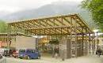

---

Jura

Bauernhaus La Chaux-de-Fons NE, 1617 
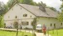.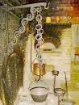.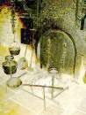.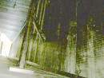.

Bauernhaus Therwil BL, 1675 
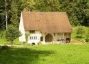.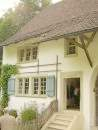.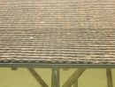.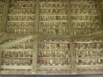.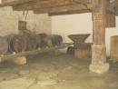.

Weidentor zur Feuerstelle 
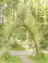

---

**Zentrales Mittelland**

Wohnhaus Villnachern AG, um 1630 
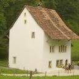.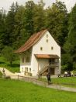

Taglöhnerhaus Leutwil AG, 1803 (links) und Bauernhaus Oberentfelden AG, 1609 (rechts) 
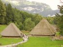

Bauernhaus 1609 
.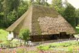.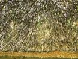.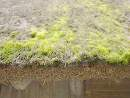.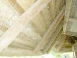.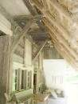.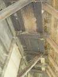.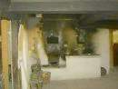.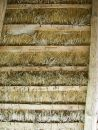.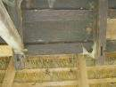.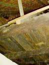.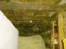.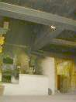.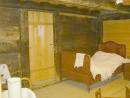.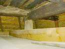.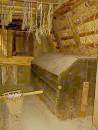.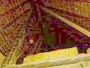.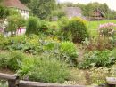

Taglöhnerhaus 1803 
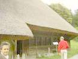.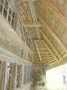.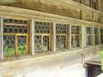.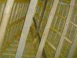.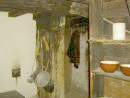.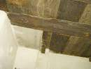.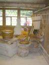.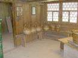. 

---

**Berner Mittelland**

Getreidefelder vor Bauernhaus Ostermundigen 
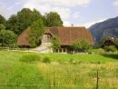.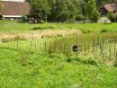.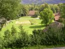

Heilpflanzengarten der Schweizer Drogisten 
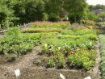.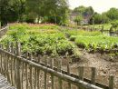.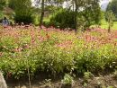.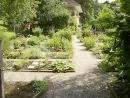.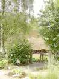.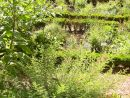

Wirtshaus "Alter Bären" Rapperswil BE, 19. Jh. 
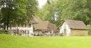.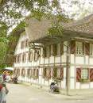..

Bauernhaus Madiswil BE, 1709 
......................

Kornspeicher Kiesen BE, 1685 
..

Baugruppe Bauernhaus Ostermundigen BE,1797 
....

Bauernhaus Eggiwil BE, 17. Jh. 
..................

Käsespeicher Wasen BE, 18. Jh. 

Wohnhaus Burgdorf BE, 1872 
..

Taglöhnerhaus Detlingen BE, 1760 

.Handwerkerhaus mit hist. Drogerie Herzogenbuchsee BE, 1778 
.

Stöckli Köniz BE, 1820 
..

---

**Ländliches Gewerbe**

Köhlerei, Kalkbrennofen und Harzbrennerei 
.........

---

**Westliches Mittelland**

Tabakfeld 

Bauernhaus Tentlingen FR, 1790 
.....

Kornspeicher Heitenried FR, 1652 
...

Bauernhaus Villars-Bramard VD, 1800 
..

Kornspeicher Ecoteaux VD, 17. Jh. 
.

Bauernhaus mit Taubenhaus Lancy GE, 1762/1796/1820 
..

---

**Östliches Mittelland**

Übersicht Baugruppe 

Bauernhaus Wila ZH, 1690 (rechts), Kornspeicher Lindau/Tagelswangen ZH, 1531/1661 (mittig), Kornspeicher Wellhausen TG, 1760 (links) 

Weinbauernhaus Richterswil ZH, um 1780 

Bauernhaus Uesslingen TG, 1568/1605 

Bauernhaus Wila ZH, 1690 (rechts), Kornspeicher Lindau/Tagelswangen ZH, 1531/1661 (links) 
 
Bauernhaus Wila ZH, 1690 
. 

Knochenstampfe Knonau ZH, 19. Jh. 

Säge Rafz ZH, 1840 
.

Trotte Schaffhausen SH, 17. Jh. 
  

Leinsamenstampfe Medel GR, 18. Jh 
...

Am Weiher 

