[🠔 Zur Übersicht: Burgen & Schlösser kaufen](8schloss.md)  
# Burgen und Schlösser im Beaujolais - Châteaux du Beaujolais
**Plein-Air-Reiseskizzen/Architektur-Skizzen von Konrad Fischer 1996**  
_von Konrad Fischer_

**Burgen und Schlösser im Beaujolais - Châteaux du Beaujolais**

Plein-Air-Reiseskizzen/Architektur-Skizzen von Konrad Fischer 1996

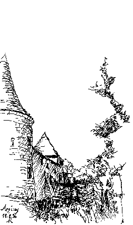 
Arginy

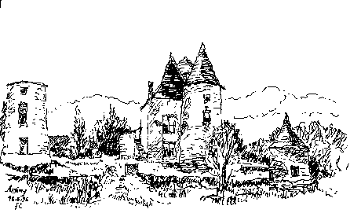 
Arginy

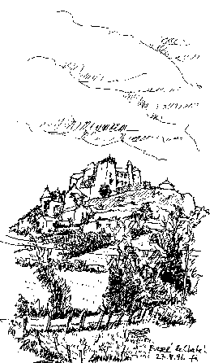 
Berzé le Chatel

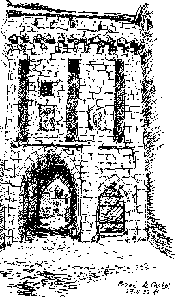 
Berzé le Chatel

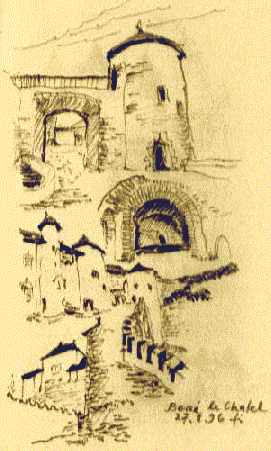 
Berzé le Chatel

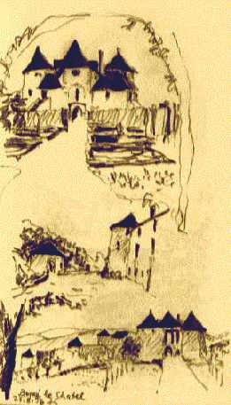 
Berzé le Chatel

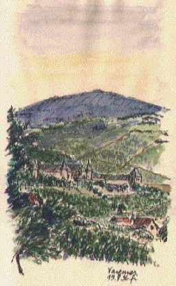 
Varennes

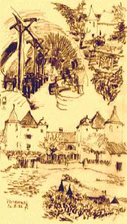 
Varennes

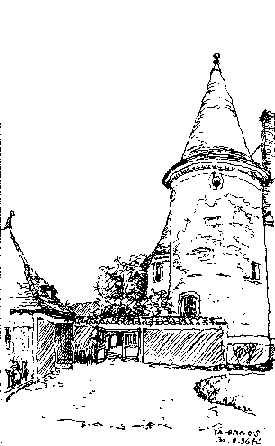 
Varennes

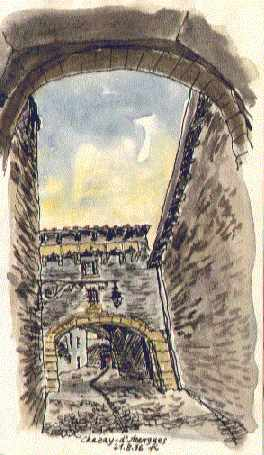 
Chazay-d´Azergues

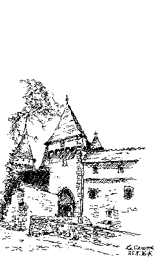 
La Clayette

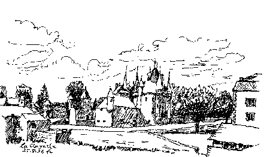 
La Clayette

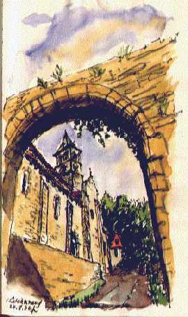 
Châteauneuf

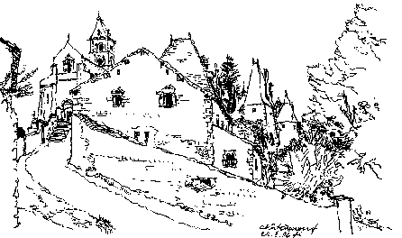 
Châteauneuf

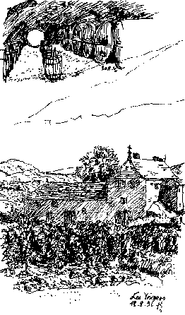 
Les Vergers

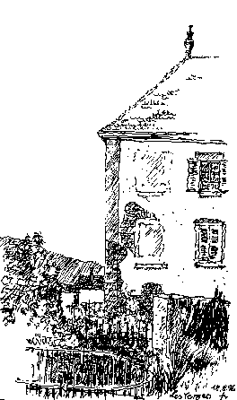 
Les Vergers

