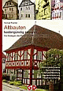

[🠔 Zur Übersicht: Quellen](8infober.md)  
# Fachliteratur und Quellensammlungen 1
**Gute, kluge, kontroverse, freche, unbekannte Literatur, Rezensionen, Verlage, Quellen, Bücher, Zeitschriften, Zitate, Links 1./Denkmalpflege+Altbausanierung 1**  
_von Konrad Fischer_

> [!abstract]+ Kapitelübersicht: Literatur Altbau I  
> 1. **Fachliteratur und Quellensammlungen 1**
> 2. [2. Denkmalpflege/Altbausanierung 2](8buch02.md)
> 3. [2. Denkmalpflege/Altbausanierung 3](8buch03.md)
> 4. [2. Denkmalpflege/Altbausanierung 4: Denkmalschutz in Österreich, Restaurierungsberichte, Treppenbau, Plumpsklo/Abort/Toiletten/WC](8buch04.md)
> 5. [2\. Denkmalpflege/Altbausanierung 5](8buch05.md)
> 6. [2. Denkmalpflege/Altbausanierung 6](8buch06.md)
> 7. [2. Denkmalpflege/Altbausanierung 7](8buch07.md)
> 8. [3. Bauwesen allgemein](8buch08.md)
> 9. [4. Burg/Schloß/Wehr- und Waffentechnik](8buch09.md)
> 10. [5. Kirche/Kloster/Theologie/Schönes und Unbequemes 1](8buch10.md)
> 11. [Literatur/Bücher 11 - 5. Kirche / Kloster / Theologie 2](8buch11.md)
> 12. [5. Kirche/Kloster/Theologie 3](8buch12.md)
> 13. [5. Kirche/Kloster/Theologie 4](8buch13.md)
> 14. [5. Kirche/Kloster/Theologie 5](8buch14.md)
> 15. [6. Geschichte / Gesellschaft / Korruption / Mafia / Geschichtsfälschung / Kultur / Wissenschaft allgemein 1](8buch15.md)
> 16. [6. Geschichte / Gesellschaft / Kultur / Wissenschaft allgemein 2](8buch16.md)
> 17. [6. Geschichte/Gesellschaft/Kultur/Wissenschaft allgemein 3](8buch17.md)
> 18. [6. Geschichte/Gesellschaft/Kultur/Wissenschaft allgemein 4](8buch18.md)
> 19. [6. Geschichte/Gesellschaft/Kultur/Wissenschaft allgemein 5](8buch19.md)
> 20. [6. Geschichte / Gesellschaft / Korruption / Mafia / Geschichtsfälschung / Kultur / Wissenschaft allgemein 6](8buch20.md)
> 21. [6. Geschichte/Gesellschaft/Kultur/Wissenschaft allgemein 7](8buch21.md)
> 22. [7. Umwelt/Klima/Energie 1](8buch22.md)
> 23. [7. Umwelt/Klima/Energie 2: Kontra Klimakatastrophe - Václav Klaus, Edgar Gärtner, Dirk Maxeiner, Dr. Wolfgang Thüne, Dr. Helmut Böttiger u.a.](8buch23.md)
> 24. [Bücher und Zeitschriften, Rezensionen, Aufsätze, Internetlinks, Verlagskontakte, Literaturrecherche- und bestellung, Quellensammlungen 24](8buch24.md)
> 25. [Aufsätze zur Denkmalpflege](8buch25.md)

_"Wahrheit erkennen, Schönheit lieben, Gutes wollen, das Beste tun"_ 
Moses Mendelssohn (1728-86) 

_"Eine Tatsache ist darum eine Tatsache, 
weil die Versuche sie zu leugnen an den Tatsachen scheitern 
und nicht an der Möglichkeit 
fünf Jahre für die Leugnung ins Gefängnis zu müssen"_ 
[Arno Widmann](http://www.perlentaucher.de/autoren/10969/Arno_Widmann.html), Adorno-Schüler und Mit-Gründer der taz (* 1946) in 
[_"Der Kampf um die Erinnerung, Historiker wenden sich gegen ein staatlich verordnetes Geschichtsbild"_](http://www.fr-online.de/_em_cms/_globals/print.php?em_ssc=MSwwLDEsMCwxLDAsMSww&em_cnt=1617551&em_loc=89&em_ref=/in_und_ausland/kultur_und_medien/feuilleton/&em_ivw=fr_feuilleto) 
Frankfurter Rundschau 23.10.2008 

_"Mich nennt den Hutten jedermann. 
Zu Schimpf, zu Ernst ich fechten kann. 
Schwert, Feder führ ich mit gleicher Macht. 
Mein Gemüt Gotts Huld hält in hoher Acht. 

Ohne Rücksicht schreib ich frei 
der Kurtisanen Büberei, 
wie sie ganz Deutschland berauben ganz 
durch ihre Pfründ und Trugfinanz. 

Drum mich verfolgt der Papst ohn Recht 
und tut Gewalt mit Edelknecht. 
Das klag ich Gott und Kaisers Ohr. 
Ich hab´s gewagt, Rom sieh dich vor!_ 
Ullrich von Hutten (1488-1523) 

_"Ohne Provokation werden wir überhaupt nicht wahrgenommen"_ 
Rudolf (Rudi) Dutschke, dt. Studentenführer (1940-1979) 

_"Denn jeder Historiker, 
auch jener der Kunst, 
ist ein fictor, ein Erfinder von Vergangenheit"_ 
Günter Metken (Kunsthistoriker, SZ-Autor, + 2000) 

_"Wer die Wahrheit nicht kennt, ist zumindest ein Dummkopf. 
Wer sie kennt, aber leugnet, ein Verbrecher."_ 
Galileo Galilei (nach Brecht)

**1. Bücher/Zeitschriften/Informationsreihen/Internetlinks** 

**[EuroWEB Online Kiosk](http://www.gok.de/)** - grösster virtueller Kiosk im Internet 
**[Bücher rund ums Bauen](http://www.bauliteratur24.de)** - bei bauliteratur24.de 
****Gut:**[Kunstbuchanzeiger.de](http://www.kunstbuchanzeiger.de/)** (Von Langewiesche!) 
****Nützlich:**** **[Zentrales Verzeichnis Antiquarischer Bücher](http://www.zvab.com)** - hier finden Sie alte Bücher, und wo sie zukaufen sind** <> [Bildarchive zur Kunst und Architektur in Deutschland](http://www.bildindex.de/)** 
[Elchbuch - Wissen im Netz aufspüren: PDF Bücher und auch welche aus Papier](http://www.tautenhahn.de/gerd/Schnuff/Elchbuch/elchbuch.html) (von www.tautenhahn.de) 

---

**2. Denkmalpflege/Altbausanierung 1**

**[Altbau und Denkmalpflege Informationen auf CD](11form.md#cd)**

****Neu:**** [Kostengünstig Instandsetzen](http://www.gdigest.com/product_info.php?ref=79&products_id=1189) - Ein kleiner Ratgeber zu Kauf, Finanzierung, Planung (PDF eBook, 29 S.) 
[Altbauten kostengünstig sanieren](http://www.gdigest.com/product_info.php?ref=79&products_id=1234) - mit vielen Tipps & Tricks gegen Sanierpfusch, 2. wesentlich erweiterte und verbesserte Auflage (PDF eBook und Druckversion)

Preisgünstige E-Books zu den Dauerbrennern **[Baufeuchte, Schimmel und Dachausbau](http://www.ib-rauch.de/starts/literatur.html)** vom Praktiker Dipl.-Ing. Peter Rauch

Mila Schrader, Julia Voigt: **Adressleitfaden und Ratgeber für Altbausanierung und exklusives Bauen, Bauforscher, Planer, Handwerker und Spezialisten, ökologische und historische Baustoffe, Denkmalpflege,** EDITION _:anderweit_ , Suderburg 2004, ISBN 3-931824-32-2 
Fehlt Ihnen eine gußeiserne Zaunspitze für die Umfriedung Ihres Schloßparks? Ist das Ecklager des alten Fensterbeschlags gebrochen oder die wunderschöne Messing-Guß-Armatur Ihres historischen Gußheizkörpers und keiner weiß, wo es dafür replizierten Ersatz gibt? Suchen Sie eine Gemeinschaft von Gleichgesinnten mit kompetenten Ansprechpartnern, einen Reetdachdecker, einen Standöllieferanten oder gar einen preiswerten Bauforscher? Wo finden Sie das, wen fragen Sie? Weiter von Pontius zu Pilatus und niemand, nicht mal Google weiß Bescheid - weil der Altbauspezi eben webresistent ist und bleibt? Hier kommt endlich die richtige Lösung. 
Nur Mila Schrader und ihrem [baurat.de](http://www.baurat.de)-Team konnte es gelingen, aus über 10jähriger Sammelleidenschaft einen "Michelin" durch die bisher sehr unübersichtliche Landschaft der Altbau- und Denkmalpflegepraxis herauszugeben. Zwar ohne Sternewertung, dafür aber von A bis Z, nach Postleitzahl und mit der sinnigen Empfehlung zum Do-it-yourself: "Fragen Sie vor Auftragserteilung immer nach Referenzen und schauen Sie sich sanierte Objekte an" (S. 130). Dieser Umweg lohnt sich ganz gewiß. Super die durchgängig reiche Bebilderung, meist themenbezogen in den durchrubrizierten Adreßregistern von "1. Bauforschung und Bauplanung" über "2. Baustelle, Werkstatt, Baustoffe" und "3. Bauhandwerker" bis zu "4. Ansprechpartner und Spezialisten". Insgesamt 504 Seiten gebündelte und auch dank Indizierung leicht auffindbare 2000 Expertenadressen inkl. Telefon, www und Spezialisierungsbereich in Schlagworten. Das ganze jedoch kein trockenes "Telefonverzeichnis", sondern dank spritzig geschriebener Themeneinführungen und der über 600 Farbbilder beispielsweise von Schäden vor (und nach) Sanierung und zum schraderschen Subtext "freistehende Badewannen in jeder Lage" auch ein Genuß für Auge und Geist. Besonders anschaulich die vielen superperfekt anmutenden denkmalähnlichen Neubauten über altem Kern bis zum "Zustand der Fouqé Bibliothek in Brandenburg a.d.H. vor und nach der Restaurierung", bei dem ein erklecklicher Teil der schönen historischen Fenster die Aufhübscherei der Denkmalpflege (des firmenberatenen Architekturgestalters?) nicht überlebte, sondern gegen noch tolleres (?) Neues ersetzt wurde (S. 112). 
Nicht jeder der hier verzeichneten "Denkmalpflege"-Adressaten liefert also wirklich Denkmalpflege. Doch das haben wir schon vorher gewußt. 
Fazit: Dieser Adreßleitfaden liefert wie alle Schraderbücher neue, bisher dringend vermißte Zugänge zum Altbau, zu seinen speziellen Details und auch zu seinen Liebhabern aller (!) Couleur. Ein Muß in die Hand der Altbaubesitzer, Denkmalpfleger, Planer und Handwerker. Liebevollst aufgemacht, in praktisch taschengängigem "Michelinformat" und mit ständigem Adreßupdate auf www.baurat.de.

Mila Schrader, Julia Voigt: **Bauhistorisches Lexikon: Baustoffe, Bauweisen, Architekturdetails** EDITION _:anderweit_ , Suderburg 2003 
Wie heißen sie nun, die historischen Baudeteails - und vor allem: Welche gibt es? In den ca. 3.800 Stichworten des opulenten Nachschlagewerks geben die altbauerfahrenen und stilkundigen Verfasserinnen Auskunft zur Nomenklatur, Bedeutung und konstruktiven Ausformung all dessen, was unsere geliebten Altbauten und Baudenkmale von dem üblicherweise gesichtslosen / geschichtslosen Neubaushit unterscheidet. Ein Buch für alle, nicht nur den Architekturhistoriker!

****Neu - 2.verbesserte Auflage!!!:****[Martin](8martin.md)/Krautzberger, Deutsche Stiftung Denkmalschutz (Hrsg.): **Handbuch Denkmalschutz und Denkmalpflege - einschließlich Archäologie -, Recht - fachliche Grundsätze - Verfahren - Finanzierung** , [Verlag C. H. Beck](http://www.beck.de), München 2004, ISBN 3 406 51778 1 
Wie funktioniert Denkmalpflege? Auf diese Frage läßt sich das dicke "Handbuch Denkmalschutz" zusammenfassen, hierzu bietet es Lösungsansätze. Auf 672 Seiten behandeln die 27 (!) Autoren aus Denkmalbehörden, Universitäten, kirchlichen, kommunalen und staatlichen Bauämtern, aus Rechtsanwalts- und Steuerberaterkanzlei sowie Architekturbüro die wesentlichen Probleme, die sich dem Bauherrn, dem Planer und Restaurator, dem Finanzberater und der staatlichen Denkmalpflege rund ums Denkmal stellen. Das synoptisch dargestellte Denkmalrecht von Bund und Ländern verknüpfen die Herausgeber dazu mit den aktuellen denkmalpflegerischen und archäologischen Grundsätzen.

Die Verfasser von der Denkmalfront sparen dabei kritische, ja bissige Anmerkungen zu den Fehlerquellen, die den Erfolg denkmalschützerischer Bemühungen seit jeher untergraben, nicht aus. So hinterfragt Prof. Dr. Ursula Schädler-Saub in "Konservierung, Restaurierung, Instandsetzung", S. 212 ff. die verfügbaren "handwerklichen und technischen Qualitäten" sowie die Planungshoheit bei Substanzeingriffen und fordert ein "gut funktionierendes Team aus Denkmalpflegern und Restauratoren, Historikern, Handwerkern und Künstlern", um die altbekannten Schäden durch "Denkmalpflege", vor allem auch "Restaurierung" wenigstens künftig zu vermeiden. Daß dies im bunten Alltag zwischen Handwerkswut und Planungsstolz nur schwer eingelöst wird, bemerkt Prof. Dr. Gert Th. Mader in "Organisation und Ablauf einer Maßnahme - Planung" S. 283 ff. im Zusammenhang mit den Umnutzungen "großer Schrannen zu Veranstaltungssälen, wodurch diese Denkmäler völlig verfremdet und beträchtlich zerstört wurden", oder wenn "Zerstörungen durch Elektro- oder Rohrleitungen größer sein können als die durch neue Einbauten von Wänden." Aber auch "modische Einbauten wie Wendeltreppen in Balkendecken" bringen "ohne Not durch Auswechslungen Schwachstellen in eine gealterte Konstruktion", entlarven "Denkmalschutz und Denkmalpflege" als wohlfeile Tarnbegriffe für Denkmalmord. Hier muß der Denkmalbesitzer also ansetzen, wenn er günstig und langlebig instandsetzen will. Sein altes Haus ist in aller Regel energietechnisch vorteilhaft konstruiert und könnte diesbezüglich in Ruhe gelassen werden. Normgemäße Energiesparzutaten aus bauphysikalischem Unverstand wie Dämm- und Dichtkonstruktionen können weder Energie noch Kosten sparen, aber das Bauwerk und dessen Nutzer nachhaltig schädigen. Folglich fordert Dipl.-Ing. [Konrad Fischer](1refernz.md), Mitglied des Beirats für Denkmalerhaltung (nicht des Wissenschaftlichen Beirats!) der [Deutschen Burgenvereinigung e.V.](http://www.deutsche-burgen.org), in "[Energiesparen und Wärmeschutz am Baudenkmal](11erhins.md)" S. 388 ff., regen Gebrauch der denkmalbezogenen [Ausnahmen und Befreiungen von der EnergieEinsparVerordnung EnEV](11form.md#enevantrag).

Zum Gebrauchswert dieses Handbuchs: Seine praktikablen Ratschläge zum Planen, Finanzieren und Bauen, seine verständlichen Erläuterungen der Grundbegriffe, seine reichen Literaturhinweise und der ausgereifte Schlagwortkatalog machen es zu einem guten Arbeitswerkzeug für bessere Denkmalpflege. Daß diese nicht nur an den allseits anerkannten "hochrangigen" Baudenkmalen Not tut, sondern auch an den aufgegebenen Hinterlassenschaften der industriellen Kultur, zeigt Axel Föhl in "Denkmäler der Technikgeschichte" S. 138 ff.: Die "Auffassung, es müsse sich bei einem Baudenkmal unbedingt um ein künstlerisch hochwertiges Objekt handeln" ist zumindest in der Fachwelt "überwunden". Den Herausgebern um [Dr. Dieter Martin](8martin.md), Dozent für Management und Recht der Denkmalpflege an der Uni Bamberg, der auch die meisten Beiträge liefert, ist ein großes Werk gelungen. Es wird in der Zeit ruinierter Denkmalpflegekassen seine Bedeutung noch oft genug beweisen können.

[Deutsches Nationalkomitee für Denkmalschutz DNfD](http://www.nationalkomitee.de) (Hrsg.): **[Energieeinsparung bei Baudenkmälern](http://www.nationalkomitee.de/veroeffentlichungen/veroeffentlichung_1.htm), **Dokumentation der Tagung des [DNfD](http://www.nationalkomitee.de) am 19.3.02 in Bonn, Band 67 der Schriftenreihe des DNfD, ISSN 0723-5747, _kostenlos_ erhältlich bei: [Geschäftsstelle des Deutschen Nationalkomitees für Denkmalschutz, beim Beauftragten der Bundesregierung für Angelegenheiten der Kultur und der Medien, Graurheindorfer Str. 198, 53117 Bonn](http://www.nationalkomitee.de) 
Von vielen Seiten wird das Thema in dieser reich bebilderten und schön ausgestatteten Vortragssammlung beleuchtet. Ergebnis: (nicht nur) Baudenkmäler brauchen wegen ihrer ohnehin vorhandenen energiesparenden Massivbauweise keine Zusatzdämmung oder -lüftung - ganz im Gegenteil: sie und ihre Bewohner werden dadurch ergeblich gefährdet. Unendliche Schadensfälle in dichten Dämmbuden beweisen: Die Bausubstanz verrottet, die Wohnungen werden zu Schimmelbrutstätten, die Bewohner verrecken im eigenen Mief und der Gipfel: Energie wird keine gespart, da [viele Dämmstoffe gar nicht richtig dämmen](2139bau.md). Die Denkmalpflege bläst hier endlich zum Sturm gegen die Interessensvertreter, die unseren Gesetzgeber in Gefangenschaft genommen haben. Vorwort vom grünen NRW-Bauminister Dr. Vesper (hat Tagung nach Begrüßung verlassen) inkl. CO2-Lüge und Leichtbauweise-Werbung!

****Und noch eins drauf:****

[Verband der Bausachverständigen Deutschlands e.V. (Hrsg)](http://www.vbd-ev.de): **[VBN-Info Sonderheft WärmeEnergie 2003, Dämmen wir uns krank? Pro und Kontra Wärmeschutz und Energieeinsparung](http://www.vbd-ev.de/vbd_we/Info/i_waerme.php), **Fachaufsätze von Bausachverständigen, Architekten, Physikern und Juristen, durchgehend farbig illustriert, Literaturrecherche u.v.m., Bremerhaven 2003. 
Der ultimative EnEV-Hammer. Bauschäden en masse, vergebliche Einsparversuche, pseudowissenschftliches Bemühen, aus Schwarz dann dennoch Weiß zu machen - alles ist da drin. Die kontrahierenden Protagonisten wie Meier und Gertis und das Fußvolk wie Fischer u.v.a. kloppen sich um die Argumente rund um das [Lichtenfelser Experiment](2139bau.md). Erheblich mit Beiträgen ergänzt gegenüber der zugrundeliegenden sensationellen [VBN-Tagung 12/02 in Hannover](12akt.md#vbn 14.12.02). Spannend, kontravers, deftig und formelgestützt zum Nachrechnen. Nun kann sich aber wirklich jeder seine eigene Meinung schnitzen. Und das Beste: Die [originale Gertisgrafik zur Ergänzung des Lichtenfelser Experiments ](21312bau.md)der Tagungsunterlagen wurde in der Druckversion in ihr [krasses Gegenteil](21312bau.md) verkehrt. Wat stimmt nu? Und wer vergackeiert denn nun wen? Haben doch die etablierten Baupfuisicker im Web schon allerlei unternommen, um Gertis-Schwarz mit Gertis-Weiß zu versöhnen. Grau ist eben alle Theorie.

_Konrad Fischer (Hrsg.)_ 
**Das Baudenkmal - Nutzung und Unterhalt** 
[Tagung des Beirats für Restaurierung der Deutschen Burgenvereinigung, Nürnberg 99](12akt.md#nue), 
(Veröffentlichungen der [Dt. Burgenvereinigung](http://www.deutsche-burgen.org), Reihe B: Schriften, Bd. 8) Braubach 2001, 192 S., 228, meist farbige Abb., Geb. 
ISBN 3927558168 

Die oft kontroversen und die Inhalte dieser Webseite ergänzenden aktualisierten [Tagungsbeiträge ](12akt.md#nue)in reich und bunt bebildertem Hochglanz. Mit Fachbeiträgen der tagungsbegleitenden Aussteller. Praxisnah und normenfern. 

[de - Fachzeitschrift für Elektro- und Gebäudetechnik 1-2/02, K. Fischer: Gebäudetemperierung und Wärmestrahlung](http://web.archive.org/web/20020420164747/http://www.pflaum.de/de.dir/de/archiv/2002/01-02/a_de-geb02.html)

****Neu:**** Edmund Bromm: **Gesund wohnen in Altbauten – Mit alten und kranken Häusern richtig umgehen – Ein praktischer Ratgeber für Laien und Profis** , 210 Seiten, 26 farbige Abbildungen, mehrere Tabellen, pro literatur Verlag, 2007, ISBN 978-3-866-11 320-6 
Ein Erfahrungsbericht aus der Praxis der Firma Isar Bautenschutz mit einem Vorwort von Professor Dr. Folker H. Wittmann. Hier packt der Baupraktiker und Mitgründert des WTA e.V. aus seinem Nähkästchen aus. Schwerpunkt: Ursachenforschung und Beseitigung von Bauschäden rund um die Mauerwerksentfeuchtung, Schimmel und Fogging. Die dezidierte Warnung vor falschen Saniermaßnahmen wird nicht ausgespart. Nicht immer konform mit der Lehrmeinung, bestimmt auch nicht immer mit der des Rezensenten. Eben eine sehr persönliche Schau auf das Saniergeschehen und geprägt von den leidensgestützten Erfahrungen des Autors als Inhaber eines langjährig am Saniermarkt erfolgreichen Unternehmens. Als feuchtegeplagter Hausbesitzer, aber auch als Sanierungsprofi sollte man sich dieses Buch gewiß nicht entgehen lassen. [Bestellung beim Autor](http://www.isarbautenschutz.de/schriften/index.html)

Rolf Köneke + : **Bauschäden am Haus - Gesunde, werterhaltende Instandsetzung vom Keller bis zum Dach** , Fachverlag Köneke, Hamburg 2002, ISBN 3-923605-13-7, 211 S. 
Klare Info für den Bauherrn. Wer nach diesem Buch noch sinnlos dämmt und dichtet, ist selber Schuld. Wie man Schimmel wirkungsvoll bekämpft oder noch besser von vornherein vermeidet, wie man bauliche Probleme lösen kann - das findet man in diesem neuen "Köneke".

Rolf Köneke +: **Schimmelpilze und Feuchte in Gebäuden** , Fogging - Schwarzwerden von Wänden in Wohnungen, Wohngifte - Ursachen und gesundheitliche Risiken, Bauphysikalische Einflüsse, Mietrechtliche Konsequenzen, Falsche mykologische Interpretationen, 3. überarbeitete und erweiterte Auflage 2001, Hammonia, Hamburg 2001, ISBN 3-87292-114-2 
Das ganze Spektrum verseuchter Wohnungen nimmt dieser Klassiker aufs Korn. Die hier angesammelten Informationen, kurz und bündig dargestellt und allgemein verständlich, dienen seit jeher den Schimmelgeplagten, Baupraktikern, Wohnungswirtschaftlern und Sachverständigen, Licht ins Dunkel falscher Bauweisen zu bringen. In mietrechtlichen Auseinandersetzungen, bei der Beurteilung von Sanierungsvorschlägen, beim Planen und Bauen liefert Köneke unersetzliche Informationen. Wichtig: Nicht Dämmstoffverpackung, sondern ausreichende Lüftung ist wichtig, um die in ca. 50 % des deutschen Wohnbestands anzutreffende Schimmelseuche zu bekämpfen. Auch wenn Schlaumeier etwas anderes versprechen.

Rolf Köneke + u.a.: **Unser Haus gesund instandsetzen** , Fachverlag Köneke, Hamburg 2000, ISBN 3-922299-39-3, ca. 100 S. 
Feuchte, Schimmel und Wärmedämmung - die idealen Partner zur Vernichtung der Baukonstruktion und des Wohnklimas. Der Fachautor nimmt diese Problempunkte aufs Korn und sagt, worauf es ankommt. Mögen auch nicht alle Tipps zum Einsatz von bauchemischen Sanierbaustoffen das Gelbe vom Ei sein - die Linie stimmt. Und: Die Beiträge von [Prof. Dr.-Ing. habil. Claus Meier](7waefe.md) (Gesund wohnen - was sagt die Bauphysik?), von Dr. Helmut Böttiger (Die Wahrheit über Energie - und Energie-Einsparungen, die offenbar keiner erfahren soll), von [Dipl.-Met. Dr. Wolfgang Thüne](7thuene1.md) ("Klimaschutz" ist und bleibt ein utopischer Wunschtraum, denn erst ändert sich das Wetter und dann gleitet das "Klima" hinterher!) bereiten das Thema auf und argumentieren gegen das mit DIN, WSVO und EnEV verordnete "Tun" an unseren Häusern und ihren Bewohnern.

Vernichtend die Stellungnahme des Bau-Fachredakteurs eines "Ökologischen" Verlages und Redakteur einer "Ökologischen" Haus-Zeitschrift an Rolf Köneke + (Originalzuschrift liegt vor):

_"... Ich habe mir die Mühe gemacht und Ihre Kampfschrift "Unser Haus gesund instand setzen" gelesen. Leider sind darin derart viele sachlich falsche und unwissenschaftliche Aussagen enthalten, dass sich eine Diskussion im Detail erübrigt._

_Sicher haben Sie recht, wenn Sie auf die häufig nicht erkannte Notwendigkeit ausreichender Lüftung zur Vermeidung von Schimmel hinweisen. Diese Lüftung aber durch den Ausbau von Lippendichtungen in Fenstern und bewußt undichte Konstruktionen zu erreichen, ist schlichtweg abenteuerlich und wird zwangsläufig Bauschäden nach sich ziehen._

_Ihr Don-Quichotte-Kampf gegen die Wärmedämmung zeigt sein wahres Gesicht, wenn Klimaschäden und mangelnde Energiereserven schlicht geleugnet und die Atomkraft als universales Allheilmittel propagiert werden. Bitte verschonen Sie uns künftig mit diesem Unsinn. Mit freundlichen Grüßen XY"_

Treffen diese Vorwürfe zu? Entscheiden Sie selbst, genau das eigene Nachdenken, die eigene Entscheidung soll Ihnen auf diesen Seiten nicht erspart werden. Viel Spaß beim Denkabenteuer mit den "Leugnern" der mächtigen, weltweit verschworenen Öko-Guten und ihrem Klimalügenbusiness, das so viel Folgelügen und Mythen ausschwitzt, wie man es sonst (fast?) nicht kennt und jeglicher Faktiziät Hohn spricht: Hier geht es gegen die ozonigen Locherfinder, die Globalklimaerwärmung bis zur -holokaustisierung mit industriell-menschengemachten Methoden! Winken dafür bald die hierzulande als Ausgeburt "wehrhafter Demokratie" verstandenen strafgesetzbewehrten Denk- und Frageverbote, wenn man sogar den [Ökoterroristen](7thuene1.md) und dem internationalen Klimabusiness ans taube Holzbein pinkelt? 

[Familienheim und Garten: Interview mit Rolf Köneke +: Gesundes Wohnen](http://web.archive.org/web/20020817035618/http://www.fug-verlag.de/on188)

Rolf Könekes Titel bei Amazon: 

---

Ankerlinks zu guten Büchern auf weiteren Themenseiten: Keine automatische Weiterleitung, bitte drücken: 

[Udo Mainzer (Hrsg.): **Politik und Denkmalpflege in Deutschland**](8buch02.md#politik und denkmalpflege in deutschland) 
[Manfred Steinröx (Hrsg.): **Finanzierungsstrategien für Kultureinrichtungen in Deutschland**](8buch02.md#steinrã¶x) 
[**Petzet** /Mader: **Praktische Denkmalpflege**](8buch02.md#petzet)**** 
[G. Eckstein: ](8buch02.md#empfehlungen+fã¼r+baudokumentationen)**[Empfehlungen für Baudokumentationen](8buch02.md#empfehlungen+fã¼r+baudokumentationen) ** 
[Verein Denkmalpflege in Oberösterreich](8buch04.md#ober) (Hrsg.): **Denkmalpflege in Oberösterreich mit Jahresbericht** 
**[Leckerbissen für den Fensterfreund](8buch06.md#leckerbissen) ** 
[Claus Meier: ](8buch08.md#meier richtig bauen)**[Richtig bauen. Bauphysik im Widerstreit – Probleme und Lösungen + Mythos Bauphysik](8buch08.md#meier richtig bauen) ** 
[Südtiroler Burgeninstitut (Hrsg.): **Burg Runkelstein - Castel Roncolo, Erhalten und Gestalten von Burgen und Schlössern**](8buch09.md#runkelstein tagungsband)**** 
[Francesco Carotta: **War Jesus Caesar? 2000 Jahre Anbetung einer Kopie**](8buch11.md#carotta) 
[Wilhelm Kammeier: **Die Fälschung der Geschichte des Urchristentums**](8buch11.md#wilhelm kammeier)**** 
[Paul van Buitenen: ](8buch15.md#paul van)**[Unbestechlich für Europa, Ein EU-Beamter kämpft gegen Misswirtschaft und Korruption](8buch15.md#paul van) ** 
[Hans Jürgen Syberberg: ](8buch16.md#hans+jã¼rgen+syberberg)**[Vom Unglück und Glück der Kunst in Deutschland nach dem letzten Kriege](8buch16.md#hans+jã¼rgen+syberberg) ** 
[U. Topper: ](8buch20.md#topperaktion)**[Die>Große Aktion< - Europas erfundene Geschichte](8buch20.md#topperaktion) ** 
**[**Die Offenbarung Johannis - Eine astronomisch-historische Untersuchung** von Nikolaus Morosow](8buch20.md#johannes-apokalypse) 
**[Michael Crichton: ](8buch22.md#crichton)**[Welt in Angst](8buch22.md#crichton) ** 
[Ogereg Lerlow (Norbert Staude, Hrsg): **2048**](8buch22.md#2048)**** 
[Ulrich Berner, Hansjörg Streif (Hrsg): ](8buch22.md#klimafakten)**[Klimafakten](8buch22.md#klimafakten) ** 
[Thomas Gold: **Biosphäre der heißen Tiefe**](8buch22.md#gold)**** 
[D. Maxeiner/M. Miersch: ](8buch23.md#d. maxeiner)**[Lexikon der Ökoirrtümer](8buch23.md#d. maxeiner) ** 
[H.-P. Beck-Bornholdt/H.-H. Dubben: **Der Hund, der Eier legt - Erkennen von Fehlinformationen durch Querdenken**](8buch23.md#der hund, der eier legt)**** 
[W. Thüne: **Freispruch für CO 2! Wie ein Molekül die Phantasien von Experten gleichschaltet**](8buch23.md#thã¼ne+co2)**** 
[F. William Engdahl: ](8buch23.md#f. william engdahl:#f. william engdahl:)**[Mit der Ölwaffe zur Weltmacht - Der Weg zur neuen Weltordnung](8buch23.md#f. william engdahl:#f. william engdahl:) ** 
Petzet/Mader: **[Praktische Denkmalpflege](8rezpema.md)** - Rezension in ARX und BURGEN UND SCHLÖSSER

---

**Hier weiter zu[Denkmalpflege/Altbausanierung 2](8buch02.md)**
