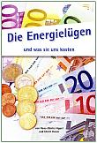

[🠔 Zur Übersicht: Literatur Altbau I](8buch.md)  
# 7. Umwelt/Klima/Energie 2: Kontra Klimakatastrophe - Václav Klaus, Edgar Gärtner, Dirk Maxeiner, Dr. Wolfgang Thüne, Dr. Helmut Böttiger u.a.
**Eine unzensierte Auseinandersetzung mit dem 'Ökowahn' und Klimaskeptikern wie Václav Klaus und Harry G. Olson, die Klimaschutzlügen und die Behauptungen über menschengemachten Klimawandel kritisch beleuchtet.**  
_von Konrad Fischer_

 **Literatur/Bücher gegen Ökowahn 23** 

(Vorsicht, nicht immer absolut zeitgeistig - (oder doch schon?)!) 

## 7. Umwelt/Klima/Energie 2: Kontra Klimakatastrophe - Václav Klaus, Edgar Gärtner, Dirk Maxeiner, Dr. Wolfgang Thüne, Dr. Helmut Böttiger u.a.

Harry G. Olson: **Handbuch der Klimalügen** , TvR Medienverlag, Jena 2010 Geradezu unfaßbar, was Harry G. Olson (Pseudonym) hier zusammengetragen hat: Egal ob es um Klimaschutz geht, den Weltklimarat, das Treibhaus, den menschengemachten Klimawandel, die globale Erwärmung oder das Eisbärsterben, das Gletscherschmelzen, die Verwüstung, die Extremwetterereignisse oder, oder, oder - alles, was hier pausenlos zur CO2-induzierten Einschränkung unserer Freiheit hinausposaunt wird, es ist frech gelogen! 

Und genau deswegen macht sich "Olson", ehemals Opfer der Klimainquisition und deswegen pseudonym auftretend, einen Heidenspaß daraus, den dreisten Lügen der meistens auf politischen und wissenschaftlichen Thronen sitzenden Klimaterroristen die simple Wahrheit entgegenzuhalten. 

Auf jeweils zwei Seiten - ein übersichtlicher Text und eine anschauliche bunte Grafik - stellt Olson all die gräßlichen Schwindeleien und ihre wissenschaftliche Entlarvung schön sauber zitiert nacheinander dar, und nennt die Erfinder oder Propagandisten des Erstunkenen gnadenlos beim Namen. Egal ob es sich dabei um die Frau Bundeskanzlerin und Doktorin der Physik (!) Angela Merkel, frühere Agitpropbeauftragte der FDJ, oder ihren Adlatus Prof. Stefan Rahmsdorf handelt, um den hochmögenden Prof. H.J. Schellnhuber oder den Wikipedia-Klima-Zensuristen Nils Simon. Olson schreckt vor nichts und niemandem zurück. Und so entsteht auf den 62 DIN-A-4-Broschurseiten ein wahrhaftig erleuchtendes Feuerwerk der respektlosen Aufklärung (engl. Enlightenment). 

Daß dabei die wichtigen und auch international anerkannten Beiträge der in Deutschland führenden Klimaskeptiker bzw. Klimarealisten wie Prof. Gerhard Gerlich und Ernst-Georg Beck eine maßgeblich Rolle spielen, ist Insidern bestimmt keine Überraschung. Was aber den besonderen Reiz dieses Aufklärungsschockers ausmacht, ist seine leicht faßbare Aufmachung, die einfach nachvollziehbare Argumentation und Widerlegung des offenbar gewillkürten Klimaschutzschwachsinns und seine hervorragende Brauchbarkeit in der Diskussion mit Zeitgenossen, die auf die Klimareligion hereingefallen sind. 

An diesem Schocker kommt kein Klimalügner vorbei. Und auch das ist gut so! Denn schon jetzt haben uns die Klimaschutzlügen hunderte von Milliarden Euro gekostet, halten Millionen weltweit weiter in Armut und Hunger geknebelt, dienen nur dem persönlichen Profit der Ökoprofiteure und dem Abschaffen unserer Grundrechte. 

Am 25. Juni 2010 fordert Schellnhuber im Wissenschaftlichen Beirat der Bundesregierung Globale Umweltveränderungen (WBGU): "Systemische Veränderungen besonders im Energiesystem" und kündigt seine "konkreten Vorschläge" zur "Transformation zur klimaverträglichen Gesellschaft" an. Das Prinzip der Unverletzlichkeit der Wohnung wurde durch das Erneuerbare Energien Wärmegesetz EEWärmeG jüngst ausgehebelt, die Ökopolizei darf jetzt in jeder Wohnung auch gegen den Willen des Eigentümers nachkontrollieren, ob genug Ökomist nach Vorschrift eingebaut wurde und Zuwiderhandelnden 50.000 EUR-Strafen verhängen. Ersatzweise Gefängnis und Erzwingungshaft. Wie lange wird es da wohl bis zur Zwangsverschickung der Klimasünder in KKZs (Klimasünder-Konzentrationslager) noch dauern? Erst mal zur Umerziehung ... 

Dieses Buch will dies verhindern. Und Sie? 

 Hans-Günter Appel und Ulrich Kaiser: **Die Energielügen - und was sie uns kosten** , 113 Seiten A5, broschiert, 9,80 EUR inkl.Versand, Herausgeber und Bezug: Prof. Dr.-Ing. Hans-Günter Appel, Auenweg 2, 26419 Schortens, Tel. 04423-7557, Schortens 2008 

Führt die CO2-Emission der Menschen tatsächlich zu einer Erderwärmung? Führt der Glaube, der Mensch könne das Klima beeinflussen, zum modernen Ablasshandel? Können wir uns ohne Kernenergie auf dem Weltmarkt behaupten? Wie gefährlich sind Atomkraftwerke? Wie viele Jahre werden wir noch Erdgas, Erdöl und Kohle zur Verfügung haben? Ist Wasserstoff der Treibstoff der Zukunft? Warum sind die Energiekosten in Deutschland so hoch? Können wir mit alternativen Energien die Stromversorgung sicherstellen und bezahlen? Wie viel Energie geht verloren bei der Stromerzeugung, beim Autofahren, beim Kochen oder bei der elektrischen Beleuchtung? Wie kann man Energiekosten sparen? - das sind sie, die zentralen Energiefragen, die alle verängstigte Energiesparer heute umtreiben. Und hier suchen die beiden Autoren Prof. Dr.-Ing. Hans-Günther Appel und Ing. grad. Ulrich Kaiser die richtige Antwort. 

Hä? Wieso eigentlich? Servieren uns nicht die Bundesregierung und die ihr mehr oder weniger nahestehenden Medien und sonstigen Ökotrommler tagtäglich die unbestrittene Wahrheit zu diesen drängend quälenden Fragen? Und zwar bis zum Erbrechen? Gepaart mit entsprechender Energiegesetzgebung von der geradezu irrsinnigen Extremförderung und Zwangseinspeisung der angeblichen Ökoenergien bis zu den von bedrohlichen Zwangsmaßnahmen begleiteten Energiesparverordnungen, in nahezu jährlicher Folge weiter und weiter verschärft? 

Weit gefehlt, folgt man den beiden Autoren! Geradezu perverse Irrtümer - NEIN: Lügen! beherrschen demnach das energiepolitische Umfeld. Hier grassiert der regierungsamtlich und mit Hilfe von amtlich erschaffenen NGO-Pressure-Groups induzierte (Genscher und sein Umwelt-Staatssekretär Hartkopf lassen grüßen!) Ökwahn. Und wenn die Autoren den ehemaligen Bundeskanzler Helmut Schmidt zitieren (S. 100): 

_"Die Dummheit von Regierungen sollte niemals unterschätzt werden"_

- so hat unser Altmeister des Regierungsschwindels vielleicht sogar absichtlich? zu kurz gegriffen, denn es ist wohl kaum "Dummheit", sondern eher verabscheuungswürdigste Gemeinheit und gewöhnlichster Machtmißbrauch, der unsere Regierungen seit eh und je in den Kernfragen zum Lügen und Betrügen veranlaßt. Damit wird nämlich Politik gemacht - eben auch die aktuelle Energiepolitik. Und die ist freilich auch dumm, dümmer geht's nümmer. Aber nur für den davon betroffenen Energieverbraucher, der seine Stromrechnung und Bezinkosten selber bezahlen muß und nix von den Industrielobbyisten für das Verabschieden ihrer Abzockgesetze hinten rein gesteckt bekommt ... 

So ist jedenfalls das naheliegende Fazit eines unbefangenen Lesers, wenn er sich mit den gut dokumentierten und nur zu oft verblüffendsten Gegenaussagen der beiden Autoren zum gängigen Energieschwindel konfrontiert hat. Auch wenn sie sich - diese marginale Kritik sei erlaubt - betreffend Öl, Gas und Kohle leider immer noch die gängige Endlichkeits-Schwindeltheorie - nur mit etwas längeren Zeiträumen - zueigenmachen und von den seit langem schon vorliegenden [Gegenbeweisen (Kudryavtsev, Gold et.al.)](8buch22.md#gold) offenbar noch nichts mitbekommen haben. 

Unfaßbar, wie geradezu Alles und Jedes bei den Energiefragen seitens der uns Beherrschenden ins Gegenteil der Wahrheit - eben die politisch motivierte Lüge - verkehrt wird. Daß dieses erbärmliche Schauspiel der bundesdeutschen Energiepolitik seine Claqueure ausgerechnet im Bereich der monopolistischen Energieunternehmen bis hinunter zu den raffiniert-treuherzig herumglubschenden Betreiber sogenannter Bürgerkraftwerke - aber auch unter all den energiepolitischen und klimaschutzpolitischen regierungsnahen Beratergremien findet, läßt freilich tief blicken. Offenbar sind sie es, die ihrer Marionettenregierung inkl. der Pseudo-Opposition den Marsch blasen, die Marschrichtung vorgeben und damit den Bürger immer grenzenloser und brutaler abzocken können. Alles energiepolitisch sehr genehm, alles gesetzlich geregelt. 

So ist die Vergewaltigung der Energieverbraucher freilich am bequemsten: Legal und durch die ökodiktatorische Allmacht der Bundesregierung oppositionsfrei gedeckt. Klar, daß unsere Volksverräter nun durch die Hintertür des EU-Ermächtigungungsgesetzes (Lissabon-Vertrag) den Schußbefehl und die Todesstrafe gegen aufrührerische Volksmassen klammheimlich wieder einführen wollen und werden. Das ist eben genau die Tradition, aus der unsere derzeitige Bundeskanzlerin und ihre Helfershelfer und Spießgesellen kommen: 17. Juni, Ungarn 1956 und Prag 1968 lassen grüßen ... 

Genug der Worte, lest selber das Energielügen-Buch von Appel/Kaiser, damit Euch endlich mal die Augen übergehen, wie Ihr von denen da oben verarscht werdet. Und noch ein Spruch auf den Weg: _"Nur die allerdümmsten Kälber wählen ihren Metzger selber!"_ 

PS: Der Autor Professor Dr.-Ing. Hans-Günther Appel ist gerne bereit, seine so dringend notwendige Aufklärung durch Vorträge zu ergänzen - einfach telefonsch anfragen, das kostet nur einen mickrigen Bruchteil im Vergleich zu Al Gore - 04423-7557! 

Joachim Weimann: **Die Klimapolitik-Katastrophe: Deutschland im Dunkel der Energiesparlampe** , Metropolis Verlag, Petersberg 2009 

Dieses Buch des Wirtschaftspolitik-Professors aus Magdeburg ist ein hervorragender Leitfaden zu all den ökonomischen Irrtümern der staatlichen Klimschutzpolitik aus Professorensicht. Mit leidenschaftlicher Akribie zeigt Weimann auf, wie all die ges. gesch. Energiesparmaßnahmen und CO2-Vermeidungsstrategien im wirtschaftlichen Abseits landen und recht eigentlich gar nichts mit Klimaschutz im Sinne effizienter CO2-Vermeidung am Hut haben. 

Seine Vorschläge für eine bessere Klimaschutzpolitik durch bessere Erschließung der gegebenen Einsparreserven und Streichung aller - eben auch der versteckten! - Subventionen mögen zwar "wirtschaftlicher" sein, als der aktuelle Unsinn. Vielleicht übersieht der Autor aber dabei die Interessen der eigentlichen Urheber dieser Fehlentwicklung: Die Ökoabzocker, also die BegÜnstigen dieser Vergeudungskampagnen. Ihre Lobby ist mächtig, das staatliche Wirken ist ein logisches Resultat ihrer Einflußnahme zum Nachteil der Stromkunden, nein, eigentlich aller vom verordneten Energiesparwahn belasteten Bürger. 

Des Autors Verbesserungsvorschläge würden den Ökoprofiteuren mächtig weh tun und all die in die Beeinflussungsmechachanik getätigten Investitionen entwerten. Deswegen dürfte deren Verwirklichungschance nahe Null liegen. Leider. 

Daß eigentlich das ganze Bemühen um "Klimaschutz" für die Katz ist, da der Mensch das Klima grundsätzlich nicht beeinflussen kann und auch an irgendwelchen Klimaeffekten nicht schuld ist, wäre eine Angelegenheit, die vielleicht in einer kommenden Ausgabe noch ausbaufähig wäre. Weimanns ökotypischer "Kampf um das Klimasystem" mit besserer CO2-Spareffizienz und seine fachlich durchaus nachvollziehbare Diskussion der sog. "Grenzvermeidungskosten" und all der systemimmanenten Widersprüche im CO2-Zertifikatehandel tappen insofern in die Falle des menschengemachten Klimawandels - mit den meteorologischen Realitäten hat das aber nichts zu tun. 

Fazit: Bei aller Utopie dennoch sehr lesenwert. 

Helmut Böttiger: **Klimawandel - Gewissheit oder politische Machenschaft?** , Michael Imhof Verlag (Imhof Zeitgeschichte), Petersberg 2008 

Wer jemals einen Text von Helmut Böttiger gelesen hat, weiß, was ihn auch in diesem Werk zur "Klimakatastrophe" erwartet: Perfekt aufbereitete und bestens recherchierte Information, verständlich für Jedermann, verbindlich im Ton und knallhart in der Sache. Diesmal auch mit vielen anschaulichen Fotos und Grafiken vom Feinsten als I-Tüpfelchen angereichert. Ausgiebiger Quellennachweis selbstverständlich inklusive. 

Wer sich also zum Thema Klimawandel einen unabhängigen Eindruck verschaffen will, wird mit diesem Buch von einem der aktivsten Aufklärer hierzulande - man denke nur an seinen online-"Spatz im Gebälk" - bestens bedient. Spannend, wie es dem Autor gelingt, komplexe Sachverhalte anschaulich aufzubereiten, ohne den Leser zu ermüden. Es sind dabei nicht Schlagworte, die in diesem Thema durchaus zum üblichen Jargon der publizistischen Auseinandersetzung gehören, sondern hochinformative und leicht nachvollziehbar aufbereitete Fakten, die dem Leser einen tiefen Einblick in die anstehenden und allerorten heiß diskutierten Überlebensfragen gönnen: 

Beruht die Hypothese vom menschengemachten Klimawandel auf wissenschaftlichem Fundament, oder ist sie eine wissenschaftliche Fiktion? Vielleicht gar mißbraucht für einen politischen und wirtschaftlicher Feldzug, bei dem lediglich wir Bürger auf dem Schlachtfeld der Interessen geopfert werden, für die Umwelt aber gar nichts erreicht wird? Was sind die wahren Ursachen für Klimaschwankungen und wieviel Anteil hat der Mensch daran? Welche Interessensgruppen feuern die Klima-Hysterie an, dient sie gar der Öl- und der Atomlobby? Welche Rolle spielen dabei die politischen und wissenschaftlichen Akteure? Wie kommt es, daß auf den historischen Karten nach Mercator (1595) und des Admirals Piri Reis (1513) - beide sehr schön im Buch abgebildet - eisfreie Polregionen dargestellt wurden, die heutzutage teils unter 1.500 Meter Eis verborgen sind? Und was ist dran an den angeblich versiegenden Energiequellen, wer profitiert von dieser Hypothese, wie sehen eigentlich die möglichen Alternativen aus? 

Helmut Böttiger führt den interessierten Leser in die wesentlichen Fakten ein in der nötigen Kürze, aber dennoch ausreichenden Tiefe. Nach diesem Buch ist es ohne weiteres möglich, auf Grundlage der vom Autor gebotenen Gesamtschau sachkundig und konstruktiv mitzudiskutieren, wohin der ökologische Umbau unserer Gesellschaft führen soll. Insgesamt wohl eines der gelungensten und reichhaltigst illustrierten Bücher zur Problematik Klimawandel und Klimaschutz - und auch für Schüler ab der Oberstufe bestens geeignet.

Nicht CO2, sondern die Sonne sorgt für Klimaschwankungen. Wer genauer wissen will, wie die Sonne das macht und zugleich etwas über die Erforschung der Sonne und ihrer aufregenden Tätigkeiten in den letzten 200 Jahren wissen will, findet das in dem Buch von Nigel Calder: **Die launische Sonne widerlegt Klimatheorien.**

[Die wichtigsten Argumente ](http://www.solidaritaet.com/buecher/umwelt.htm:#klima#klima)der Europäischen Akademie für Umweltfragen gegen die Annahme, CO2 verursache eine Klimakatastrophe.

Aufklärung zu den Wahnvorstellungen unserer Zeit: [www.iavg.org](http://www.iavg.org/)

[Václav Klaus ](http://klaus.cz/klaus2/asp/clanek.asp?id=esKqs4lHRBOh): **Blauer Planet in grünen Fesseln. Was ist bedroht: Klima oder Freiheit?** , Carl Gerold’s Sohn (2007), 126 Seiten, ISBN 978-3-900812-15-7 
Endlich mal ein vernünftiger Staatsmann, der auf den Punkt der Ökodebatte kommt: Freiheit oder Ökofaschismus (den er "Environmentalismus" nennt)? Apokalyptische Utopien werden von den Ökoterroristen aus Politik, Wissenschaft, Medien, Industrie, Handwerk und der Planerszene in Szene gesetzt, um Freiheiten zu beschränken, den mit einer getürkten "Klimakatastrophe" in Panik versetzten Bürger mit gesetzlich geschütztem Ökoblödsinn abzuzocken: 

Subventionsgestützte "alternative" Energien, die niemals sinnvolle Alternativen bieten können, zwangsweise [Dämmstoffverstopfung](213baust.md) unserer Häuser mit Industrieschäumen und -gespinsten, boratvergifteten Naturfilzen und Recyclinghäcksel, die [Wärme gar nicht richtig dämmen können](7fehrtab.md), sondern auffeuchten. 

Letztlich - da die in Öko verpulverten Gelder für weltweit dringendere Handlungsfelder bitter fehlen - gehen die Klimaschutzprofiteure wie alle Utopisten über Leichen, um ihre Umsätze zu maximieren. Daß das der sogenannten Umwelt gar nix bringt, wird aus diesem Buch mehr als deutlich. 

Klaus scheut nicht davor zurück, die Umweltschutz-Banditen beim Namen zu nennen, widerlegt in wissenschaftlicher Manier ihre Lügen und schreckt auch vor Ikonen wie dem heiliggesprochenen / nobelitierten Klimaschutz-Börsianer Al Gore (Goracle) nicht zurück. 

Eigentlich mehr als entsetzlich, wie wir [mit dem Klimathema betrogen](7argus.md) werden. Weder gibt es die behauptete Erwärmung - seit über 10 Jahren fällt die Globaltemperatur, noch hat das bisserl menschengemachte CO2 damit zu tun. Das ganze Klimaschutzbemühen steht auf tönernen Füßen und dient lediglich dem globalen Reibach. Der gelernte Ökonom Vaclav Klaus zerpflückt nicht nur die Pseudo-Klimawissenschaft, sondern reißt den Akteuren ihre grüne Maske herunter - dahinter lugt die marxistische Fratze hervor. 

Mein Glückwunsch an die tschechische Nation für einen solch unbequemen, wahrheitsliebenden und mutigen Präsidenten. Wie schlecht demgegenüber Deutschland mit seinem Klimamerkelismus dasteht! Und wie teuer wir alle dafür bezahlen müssen. 

Auch wenn uns so ein freches Buch aus dem schon viel zu weit fortgeschrittenen CO2-Vermeidungs-Irrweg nicht mehr raushelfen wird - als Augenöffner lohnt es sich trotzdem. Gut geschrieben und in engagierter Sprache liest es sich in einem Rutsch und wird auch immer wieder hervorgeholt werden, um sich seiner Argumente im Detail zu bedienen. 

Hans-Joachim Lüdecke: **CO2 und Klimaschutz. Fakten, Irrtümer, Politik** , Bouvier, Dezember 2007

Das macht Spaß: Ausgerechnet auf Grundlage der IPCC-Klimadaten entlarvt Hans-Joachim Lüdecke, als Prof. Dr., Diplom-Physiker und Dozent an der Hochschule für Technik und Wirtschaft des Saarlandes ein besonders heller Kopf der Wissenschaft, den menschengemachten Klimawandel als Gespensterdebatte einer faktenfreien Politik des Klimairrsinns. Warum der ganze Klimaspuk? Um Kasse zu machen! Um energetisch sinnlose Windrädlein ins Laufen zu bringen, umweltkritisch-schwermetallhaltige Solarplatten besser zu verkaufen und sonstigen pseudoalternativen Industrieschrott in den Markt zu zwingen. Nicht zu vergessen all die Ökosteuerabzocke als Klimaschutzgelderpressung bzw. Umweltsünden-Ablaß. 

Dafür wird eine ökofaschistische Klimapolitik installiert, die vor keiner Fälschung zurückschreckt und dafür sogar willfährige Helferlein - nein Spießgesellen aus der sogenannten Klimawissenschaft findet. Der Autor liefert in leicht verständlicher Sprache die Wissensbasis, um den CO2-Kreislauf und die Klimatatsachen wie sie wirklich sind, besser zu begreifen. Doch nicht genug damit: Auch der falschen Ideologie hinter all dem Klimaschwindel und dessen Profiteuren gönnt Lüdecke grelles Schlaglicht und seine. spitze Feder. Spannung garantiert! 

Hilft so ein Buch auch nichts gegen den staatlich geschüzten Klimaschutzterrorismus, nimmt seine Aufklärung wenigstens die Angst vor dem menschengemachten Weltuntergang durch Heizung, Autofahren, Flugreisen und Konsumgüterproduktion. Das ist schon was in ökowahnsinnigen Zeiten. 

Fazit: Unbedingt lesenswert.

Senja Post: **Klimakatastrophe oder Katastrophenklima? Die Berichterstattung über den Klimawandel aus Sicht der Klimaforscher** , Reinhard Fischer, 2008

Der Mainzer Professors für empirische Soziologie Hans Mathias Keplinger und seiner Studentin Senja Post waren schon in der WELT Medienstars, als sie am 25.9.2007 das Ergebnis ihrer Umfrage unter 133 anerkannten deutschen Klimaforschern verlautbarten. Demnach ist das Gschmarri von IPCC, Al Gore, Merkel, Schwarzenegger über die Professoren Stefan Rahmstorf, Konrad Kleinknecht, Schellnhuber, Hartmut Graßl bis zu den Medien wie SZ (Süddeutsche Zeitung) et al. entlarvt als ohrenbetäubendes und leider sehr publikumswirksames Pfeifen im Walde. 

Der Klimaschutz steht auf tönernen Füßen, sein Haus ist auf lockersten Sand gebaut, seine Anhänger frönen einem Öko-Aberglauben als religionsersetzendem Glaubensbekenntnis. Die Autorin dokumentiert nun das Ergebnis in diesem Buch (aus Verlagsinfo): 

"Was sind die Ursachen des Klimawandels? Wie zuverlässig sind Klimaprognosen? Wie sollten wir auf den Klimawandel reagieren? Und was halten die Klimaforscher von der Klimaberichterstattung der Massenmedien?" - so die Fragen. 

Resultat: "Der Wissensstand der Klimaforschung ist erstens längst nicht so eindeutig wie es in der öffentlichen Debatte erscheint. Die Wissenschaftler halten die Klimaberichterstattung zweitens überwiegend für sensationalistisch und die dargestellten Sachverhalte für grob vereinfacht. Trotzdem verzeichnen die Klimaforscher drittens eine starke Wirkung der Klimaberichterstattung auf den Forschungsprozess und auf die Forschungsförderung in der Klimaforschung." 

Fazit: Klasse!

[Edgar L. Gärtner ](http://www.gaertner-online.de): **Öko-Nihilismus: Eine Kritik der Politischen Ökologie** , Thuß und van Riesen GbR, 2007, ISBN 978-3-00-020598-9 
Klappentext: Warum versteifen sich UN-Gremien darauf, die Welt als geschlossenes System, als "Treibhaus", darzustellen? Wer hat ein Interesse an der missionarischen Verbreitung eines solchen Weltbildes, das dem gesunden Menschenverstand flagrant widerspricht? Während sich die "Klimapolitik" und die ihr zugrunde liegenden Computermodelle in einer virtuellen Welt bewegen, ist die klimapolitisch begründete Abzocke der Bürger über die künstliche Verteuerung von Energie, Autofahren und Öko-Steuern durch die Öko-Industrie und ihre politischen Handlanger durchaus real. Edgar L. Gärtner gibt einen schockierenden Einblick in Denken und Motivation dieser Öko-Nihilisten. 

Hier eine passende Ergänzung zum Verständnis, worum es im Buch geht: 

Kölner Stadtanzeiger 14.6.07: "FALSCHE PRIORITÄTEN IN DER UMWELTPOLITIK? 
Die Öko-Nihilisten 

GASTBEITRAG / LESERBRIEF VON EDGAR GÄRTNER 
Müssen dem „Klimaschutz“, von dem zurzeit so viel die Rede ist, nötigenfalls Freiheit und Demokratie, wenn nicht sogar Menschenleben geopfert werden? Angesichts eines um sich greifenden „Öko-Nihilismus“ ist diese scheinbar absurde Frage berechtigt. In Nachschlagewerken ist zu lesen, Nihilisten glaubten an so gut wie gar nichts. Doch das ist irreführend. Alle halbwegs gesunden Menschen glauben an etwas, sonst könnten sie keinen Fuß vor die Tür setzen. Nihilist zu sein, heißt nach Friedrich Nietzsche und Albert Camus nicht, an nichts zu glauben, sondern nicht an das zu glauben, was ist. Nihilisten erachten also irgendetwas für „höher“ als das real existierende Leben. Aktuelle Musterbeispiele dafür sind islamistische Selbstmord-Attentäter. 
Weniger offenkundig ist die nihilistische Tendenz vieler Umweltschützer. Nicht selten geben sie fragwürdige Ziele aus wie den Schutz des (nicht definierbaren) Weltklimas durch eine drastische Drosselung des CO2-Ausstoßes und die Förderung „erneuerbarer Energien“ mit Hilfe von Zwangsabgaben. Sie nehmen damit aber in Kauf, dass die Armen durch die Verteuerung von Nahrung und Energie noch ärmer werden. Überdies verschlechtern sie ganz allgemein die Voraussetzungen für den Fortgang technischer Innovationen und die Mehrung des Wohlstands. 
Der Grund für diese „nihilistische Versuchung“ findet sich in der Geschichte der Umweltpolitik. Sie war in den 70er und 80er Jahren extrem erfolgreich. Gerade das aber lockte sie in eine von Katastrophenangst und Hysterie getriebene Populismus-Spirale. Mit anderen Worten: Als die Bekämpfung messbarer Belastungen von Wasser und Luft bereits große Fortschritte gemacht hatte und die Umweltpolitik dabei war, sich überflüssig zu machen, begannen Politiker, sich um ungelegte Eier zu sorgen. Sie verschrieben sich im Namen der „Vorsorge“ der Bekämpfung hypothetischer Zukunftsprobleme wie des als Bedrohung hingestellten Klimawandels. 
Die dem Vorsorgeprinzip zugrunde liegende Denkfigur des Alles oder Nichts ist ein Kind des Kalten Kriegs: Mit dem Ost-West-Konflikt ließen sich Investitionen rechtfertigen, die – ökonomisch gesehen – jedes Maß sprengten. Ging es doch um eine reale Bedrohung von Freiheit und Demokratie, ja des Fortbestands der westlichen Welt als solcher. 
Seit diese Logik nach dem Ende des Kalten Kriegs auf der Suche nach einem Ersatzfeindbild jedoch auch auf hypothetische Gefahren angewandt wird, droht das Abgleiten in den von mir beschriebenen „Nihilismus“. Noch boomt die deutsche Wirtschaft. Noch sind Strom, Gas und Benzin für die meisten einigermaßen erschwinglich. Wenn das von der Bundesregierung beschlossene Programm einer 40-prozentigen CO2-Einsparung bis 2020 bei gleichzeitigem Ausstieg aus der Atomenergie umgesetzt wird, könnte das schon ganz anders aussehen. Dennoch regt sich kaum Widerstand. 
Der „Klimaschutz“ ist offenbar zur letzten Bastion derer geworden, die auch im Zeitalter der Raumfahrt, der Globalisierung der Märkte und des Internets an der Fiktion einer geschlossenen Welt festhalten. Damit sind unrealistische Sicherheitsversprechen verbunden. Aber jeder, der sich einen Rest gesunden Menschenverstands bewahrt hat, merkt das. Hoffentlich." Mein Tipp zum besseren Merken. 

Und hier das lesenswerte [Interview von Media-Mania mit Edgar Gärtner rund um den Klimaschutz](http://www.media-mania.de/index.php?action=interview&id=51) 

[D. Maxeiner/M. Miersch](http://www.maxeiner-miersch.de): **Lexikon der Ökoirrtümer - Überraschende Fakten zu Energie, Gesundheit, Klima, Ozon, Wald und vielen anderen Umweltthemen** , Eichborn 1998, ISBN 3-8218-0586-2 
Lesenswerte Widerlegung der Grundlagen unserer "modernen" Ängste, ein Bestseller des Jahres 1998. Ein gutes Hilfsmittel gegen die nun auch auf Altbauten losgelassene Propaganda der von Vermarktungsinteressen bestimmten Umwelthysteriker. Im Bereich Bauen und [Wärmedämmung ](213baust.md)(Kapitel "Beton ist böse") leider nicht ganz auf [aktuellstem Stand](2beton.md). [Ist der Treibhauseffekt wirklich auf menschlichen Einfluß zurückzuführen? Zweifel sind angebracht](http://konservativ.de/umwelt/maxeiner.htm) - von [Dirk Maxeiner](http://www.maxeiner-miersch.de), Fachautor zur Klimahysterie auch für FAZ und DIE WELT.

Weitere scharfe Titel gegen den Umweltscheiß, die Ökodiktatur, den Klimaschwindel und den Terror / Krieg gegen die Klimaskeptiker von Dirk Maxeiner: "Hurra, wir retten die Welt! - "Das Mephisto-Prinzip" - "Öko-Optimismus" - "Die Zukunft und ihre Feinde" - "Schöner Denken"" 

H. Schoeck: **Die Lust am schlechten Gewissen: Das unterwanderte Gemüt. Hatz auf Sündenböcke. Besteuere Deinen Nächsten wie Dich selbst. "Umwelt" als Knüppel. Öffentliche Opulenz und private Askese.** Herderbücherei 464, Herder, Freiburg 1973, ISBN 3-451-01964-7 

All die moralinsauren Strategien unserer Ökobesserwisser sind in dieser witzigen Aufsatzsammlung schon scharfsinnig zerpflückt. Wer hätte damals gedacht, wie es die Gutmenschen schaffen, die Gesellschaft dermaßen zu placken, daß Wahnsinnsprojekte wie Dämmstoffzwang, Solar- und Windkraftförderung den Fiskus auszehren. Herrlich, wie unser schlechtes Ökogewissen und Schuldkomplex für selbstmörderische Projekte bis zur Kriegsführung gegen Unbekannt auszubeuten ist. Kästner: "Was immer auch geschieht, / so tief dürft ihr nicht sinken, / von dem Kakao, durch den man euch zieht, / auch noch zu trinken." ist vergessen.

Weitere hammerharte Bücher gegen die Schweinegesellschaft und ihre Leittiere von Helmut Schoeck: "Der Neid und die Gesellschaft." - "Der Neid. Die Urgeschichte des Bösen" - "Der Spätmarxismus und sein Publikum" - "Die 12 Irrtümer unseres Jahrhunderts" - "Altes Ethos, neues Tabu" - "Ist Leistung unanständig?" - "Utopie und Frustration in der Jugendrebellion" - "Das Geschäft mit dem Pessimismus" - "Vorsicht, Schreibtischtäter. Politik und Presse in der Bundesrepublik" - "Umverteilung als Klassenkampf. Zur Politik und Psychologie der Vermögensbildung": 

H. Eilingsfeld: **Der sanfte Wahn: Ökologismus total** , 411.S., Südwestdeutsche Verlagsanstalt SVA, Mannheim 1989, ISBN 3-87804-195-0

Der Klassiker gegen das Regime der Angstmacher. Mit dem grimmigen Märchen "Die kluge Else" (die bei Ansicht der Kreuzhacke im Keller das Bierholen vergißt und sich und andere ins Greinen versetzt, da die Hacke ja dermaleinst ihr ungeborenes Kind erschlagen könnte) legt Eilingsfeld den kritischen Finger auf die schwärende Wunde der Neu-Apokalyptiker: Technikangst, Stasimentalität, Besserwisserei und fiese Lust, die Mitmenschen doppelmoralisch zu schickanieren schreiben das Drehbuch des "Ökologismus". Jeden Tag wird eine neue Sau durchs Dorf gepeitscht, um im Verein mit dem Schweinejournalismus das tumbe Volk von neuem zu verängstigen. Das läßt die Gutmenschen gut leben. Besonders schön: Die vielen entlarvten Öko-Lügen und die knapp zusammengefaßten Zitat- und Quellen-Seiten. So erhält der Leser schnellen Zugriff auf die Argumente. Wenig tiefschürfend: Eilingsfelds bösartiger Vorschlag, Umwelt-Probleme mit dem Kampf gegen die angebliche Überbevölkerung zu lösen ("Ungehemmte Zeugung kann Aggression sein"). Wer sowas schreibt, soll mit der Selbstentmannung anfangen. Dennoch: Für aufgeklärte Mitmenschen ein meist lehrreiches und hilfreiches Buch.

H.-P. Beck-Bornholdt/H.-H. Dubben: **Der Hund, der Eier legt - Erkennen von Fehlinformationen durch Querdenken** , Rowohlt Sachbuch 60359, 1997

Beck-Bornholdt, Prof. für Biophysik und Strahlenbiologie und H.-H. Dubben, Dr. der Biophysik, beide Mediziner an der Uni Hamburg, sind Insider. Und Zyniker. Damit zerpflücken sie die 'Naivität und Dummheit in der modernen Wissenschaft'. Die physikalischen Narrheiten haben es ihnen besonders angetan. Und immer belegen Sie die Entlarvung durch laiengängige Darstellung und wissenschaftlich einwandfreie Belegführung. Ihr bissiger Humor ist zum Piepen: _"Stellt man mit den Wassertemperaturen von Mai bis Juli Hochrechnungen [im Stil der etablierten Klimatologen] an, dann läßt sich aus ihnen der Schluß ziehen, daß man gegen Ostern des folgenden Jahres im Mittelmeer Eier kochen kann."_ Ein Buch für die vergnüglichen Lesestunden. Die Autoren: [Institut für Biophysik und Strahlenbiologie der Universität - Projekt 4.020.06](http://www.uni-hamburg.de/Forber/aforber/e04/e04020/p06.htm) Weitere Rezensionen hierzu: [Hamburger Morgenpost Online 8.4.97](http://database.mopo.de/bookmark/hamburg/old/91679905825396.html) <> [[PROMPT 1/'98] Äpfel und Eier](http://ruesch.addict.de/~prompt/1998.1/buchempfehlungen.html) <> [Alternative Buchempfehlungen von Hans-Joachim Zillmer](http://www.zillmer.com/amaeigen.htm) <> [Johann Schmids Buchempfehlungen](http://home.a-city.de/johann.schmid/buch.htm) <> [Junge Welt 21.03.1998](http://www.jungewelt.de/1998/03-21/016.htm)

[W. Thüne](http://www.treibhaus-schwindel.de): **Freispruch für CO 2! Wie ein Molekül die Phantasien von Experten gleichschaltet**, [edition steinherz](http://www.edition-steinherz), Wiesbaden 2002, ISBN 3-9807378-0

Der Pisa-Schock für die Klimatologie. Alles falsch, was deren Kassandrarufer vorhersagen? Apokalypse 0? CO2 - in der Luft überall mit nur 0,03% enthalten und obendrein fast doppelt so schwer (Molgewicht 44) wie Luft (29) - wie soll das in 6 km Höhe Wärmestrahlung reflektieren, am Erdboden die Pflanzen ernähren, Treibhauseffekte hervorrufen und dennoch weltweit unterschiedlichstes Klima und vor allem Wetter zulassen? Woher kommen die Irrtümer, wer verbreitet sie und warum? Von der Eiszeittheorie des Arrhenius 1896, den Ökostrategien der KPdSU seit 1965 über die falschen Prophezeihungen des Club of Rome und den abgesoffenen Kölner Dom im SPIEGEL 1986 geht die Ökohetze über zum Politikderblecken a la Graßl, Hasselmann, Latif und ihren ökopolitischen Instituten. Dr. Thüne räumt auf mit den Klimaszenarien und Abzockmechanismen, die uns entartetete "Wissenschaft", voreingenommene Medien und desinformierte Politiker einbrocken. Die physikalischen Tatsachen der Wetterkunde, die soziologischen Hintergründe der weltweit vernetzten Klimaforschung - im "Freispruch" zu finden. Nachvollziehbar und für Jedermann verständlich. Lesen und Schluß mit dem Ökowahn! Eine seit langem fällige Generalabrechnung.

W. Thüne: **[Der Treibhaus-Schwindel](http://www.treibhaus-schwindel.de)** , Oppenheim 2000, ISBN 3-9803768-6-9

Der Renner gegen die Öko-Apokalyptik in nun 3. Auflage. Das "Treibhaus-Gespenst" als Erfindung interessierter Kreise, [medial vermarktet](7argus.md) von grünen Hiwis. Sehr gut, um Sofasitzer und Freizeitmenschen zu willigen Spendern und Steuerzahlern zu kujonieren. Der Leser erfährt, daß die paar Klimadaten aus wenigen "englischen Hütten" (Meßstationen 2 Meter über der Erdoberfläche) niemals ausreichen können, eine "Globaltemperatur" zu beschreiben; daß grobe Fehldeutungen und bewußte Datenmanipulation die Grundlage der absichtlich gefälschten Horrorszenarien der Klimapäpste bilden; daß handfeste wirtschaftliche Interessen der beteiligten "Experten" zu berücksichtigen sind; daß frühere Falschmeldungen durch neue Manipulationen keine besseren Ergebnisse simulieren können und vieles andere mehr. Ein wissenschaftlich fundiertes und gut lesbares Werk. Der Verfasser, Dr. phil. und Dipl.-Meteorologe, ehem. ZDF-Wetterfrosch und Umweltbeamter weiß, wovon er schreibt. [Rezension: Dr. Thüne - Der Treibhaus-Schwindel](http://www.phi-presse.de/Nachrichten/Meldungen/m_d_phi39.htm) [Rezension 2: Dr. Thüne - Der Treibhaus-Schwindel](http://die-neue-ordnung.de/99-53/3/3-99-53-07.html)

W. Roeder: **Umwelt-Naturschutz - Betrug - Ökofaschismus bis hin zum Völkermord** , Dr. Böttiger Verlags-GmbH 1993, ISBN 3-925725-20-2 

Ökohysterie vom Waldsterben über Artenschutz bis zur Vergiftungsangst auf dem Prüfstand. Ein Buch mit handfesten Informationen gegen den modernen Malthusianismus und Menschenhaß.

R. Maduro/R. Schauerhammer: **Ozonloch - Das mißbrauchte Naturwunder** , Dr. Böttiger Verlags-GmbH 1992, ISBN 3-925725-11-3 

Das Ozonloch ist kein Ergebnis menschlicher Hybris, sondern ein lange bekanntes Naturereignis. Die Autoren liefern stichhaltige Argumente der Wissenschaft gegen die Umweltangst.

Gerd R. Weber: **Treibhauseffekt - Klimakatastrophe oder Medienpsychose?** Dr. Böttiger Verlags-GmbH 1992, ISBN 3-925725-14-8 
Was wissen wir überhaupt über "Treibhausgase" in der Atmosphäre, wie verfälschen stimulierte Rechenprogramme die Klimawirklichkeit? Welche Interessen werden durch die [Klimaapokalyptik in den Medien](7wsvoant.md#einleitung) durchgesetzt? Provokante Antworten eines erfahrenen Meteorologen und ehrlichen Klimaforschers! Neuer Titel: Gerd R. Weber: Global Warming 

Heinz Hug: **Der tägliche Ökohorror - So werden wir manipuliert.** Wirtschaftsverlag Langen Müller / Herbig 1997, ISBN 3-7844-7354-7 
Eine kräftige Polemik mit aufklärerischem Zündstoff gegen den Mißbrauch der ökologischen Argumentation. Leider stark malthusianisch, d.h. menschenfeindlich geprägte "Überlebensstrategie".

Dieter Ber: **[Der teuflische Staat. Demokratie oder Verwaltungsdiktatur? Diktatur der Alimentierten? Ein neuer Klassenfeind?](http://www.der-teuflische-staat.de/)**, Lumax 2007 
Der Titel ist Programm. Hier geht's zur Sache, ein FDP-Insider packt aus und haut druff. Satanische Verse auf starkdeutsch - noch nicht verboten? 

F. William Engdahl: **Mit der Ölwaffe zur Weltmacht - Der Weg zur neuen Weltordnung.** Neuauflage in [edition steinherz](http://www.edition-steinherz.de) 
Das Buch erzählt die Geschichte des Erdöls, das zur Waffe um die Weltherrschaft wurde. Es zeigt, wie die beiden Ölkrisen 1973 in Saltsjöbaden (Schweden) von unserer Weltregierung verabredet wurden (wie später der Klimaschutz-Schwindel und die Gründung des IPCC als Lieferant der Drohbotschaften), wie daraus die gegenwärtige Finanzkrise erwuchs und die neue Form des "Kolonialismus durch Leasing" entstanden ist. Die Installation der "Grünen" als Putztruppe der Öl- und Finanzkreise zur Bekämpfung der Kernkraftkonkurrenz wird dokumentiert. Brandgefährlicher Zündstoff in der aktuellen Diskussion um Ökosteuer, Treibhauslüge und Dämmstoffwahn - jenseits linker und rechter Klischees.

Und hier die weiteren Hämmer gegen den Klimaschutzscheiß und die Ökokriminalität: 
Tanja Krienen: "Schönes Grün - 2022 - Die nicht überleben wollen" - Matthias Horx: "Anleitung zum Zukunfts-Optimismus. Warum die Welt nicht schlechter wird" - Matthias Horx: "Zukunft passiert. Prognosen, Visionen und falsche Bärte" - Matthias Horx: "Das Zukunfts- Manifest. Aufbruch aus der Jammerkultur." - Björn Lomborg: "Apocalypse No!" - Paul K. Driessen: "Öko-Imperialismus. Grüne Politik mit tödlichen Folgen" - Henrik Svensmark, Nigel Calder: "The Chilling Stars: A New Theory of Climate Change" - Kurt G. Blüchel: "Der Klimaschwindel" - s.a. Amazonlinks: 

**[Zu Aufsätzen, Nachrichten und Stellungnahmen der aktuellen Klimadebatte](7wsvoant.md#einleitung)**

**[ESEF](http://www.esef.org)** - European Science and Enviroment Forum - Umweltpolitische Informationen aus wissenschaftlicher Sicht und gegen den Trend (english)

**[Böttiger Verlag](http://www.solidaritaet.com)** 
Skeptische Informationen zur Klima-, Energie- und Umweltpolitik

**[Harrys Resources](http://members.aol.com/HZingel/index.htm)** 
Unterhaltsame und kontroverse Nachrichten und Stellungnahmen zu Umwelt und Geschäftemacherei

**[Kontra Klimalügen](http://www.wuerzburg.de/wue/bildung/mm-physik/klima.htm)**

**[Petition von 15000 US-Akademikern kontra Klimalügen](http://www.oism.org/pproject/s33p37.htm)**

**[Peter Knechtlis Homepage](http://www.peterknechtli.ch/index.htm)** 
Unabhängige Informationen aus der Schweiz zu Wirtschaft, Bau, Politik und Ökologie

**[konservativ.de](http://www.konservativ.de/)** 
Die unabhängige Informationsquelle für Deutschland

**[rotgruen.de](http://www.rotgruen.de)** 
Zur Fehlern und Mißbrauchsformen in der aktuellen Umwelt- und Wirtschaftspolitik

**[Umwelt und Gesundheit](http://www.free.de/WiLa/derik/EXISTHUM.html)** 
Wissenswertes zu Umweltgiften

**[Ökotest](http://www.oekotest.de)** 
Heiße Informationen auch zu modernen Baustoffen, die Chemielabors sogar im Baudenkmalversuch freisetzen

**[Wetter online](http://www.wetterleuchten.de)** 
Großes Angebot bis zu regionalen Wettervorhersagen und herrlichen Satellitenbildern

**[GEO - Magazin](http://www.geo.de)**

**[National Geographic Magazine](http://www.nationalgeographic.com)**

**[Spektrum der Wissenschaft](http://www.spektrum.de)**

**[Brutalste Abrechnung mit dem Ökoschwindel! Zum Piepen und Pupsen.](7thuene1.md)**

Themen: Ökologie, Umweltschutz, Klimaschutz, Klimaschwindel, Klimakatastrophe, Treibhauseffekt, Ozonloch, CO2, Kohlendioxid, Globale Erwärmung, Unwetter, Polkappen, Kontra Klima-Schwindel, Klimaschutz-Betrug, Öko-Kriminelle, Ökologismus, Klimakatastrophe, Globale Erwärmung 

---

**Hier weiter:[8. Literaturrecherche und -bestellung](8buch24.md)**
