[🠔 Zur Übersicht: Literatur Altbau I](8buch.md)  
# Bücher und Zeitschriften, Rezensionen, Aufsätze, Internetlinks, Verlagskontakte, Literaturrecherche- und bestellung, Quellensammlungen 24
**Umfassende Sammlung von Büchern, Zeitschriften, Rezensionen, Aufsätzen, Internetlinks, Verlagskontakten, Literaturrecherche- und bestellung sowie Quellensammlungen zu verschiedenen Themen.**  
_von Konrad Fischer_

**Bücher und Zeitschriften, Rezensionen, Aufsätze, Internetlinks, Verlagskontakte, Literaturrecherche- und bestellung, Quellensammlungen 24** 
(Vorsicht, nicht immer absolut zeitgeistig (oder doch schon?)!) 

---

**8. Literaturrecherche und -bestellung**

[Buchkatalog](http://www.buchkatalog.de) <> [Buchhandel](http://www.buchhandel.de) <> [Bücher, CD-Roms, Videos](http://www.buecher.de) <> [Haus + Garten bei amazon.de](http://www.amazon.de/b?_encoding=UTF8&site-redirect=de&node=122&tag=altbauunddenk-21&linkCode=ur2&camp=1638&creative=6742) [Antiquariat bei amazon.de](http://www.amazon.de/b?_encoding=UTF8&site-redirect=de&node=4185461&tag=altbauunddenk-21&linkCode=ur2&camp=1638&creative=6742) [Kunst + Kultur bei amazon.de](http://www.amazon.de/b?_encoding=UTF8&site-redirect=de&node=548400&tag=altbauunddenk-21&linkCode=ur2&camp=1638&creative=6742) [Ratgeber bei amazon.de](http://www.amazon.de/b?_encoding=UTF8&site-redirect=de&node=536302&tag=altbauunddenk-21&linkCode=ur2&camp=1638&creative=6742) [Fachbücher bei amazon.de](http://www.amazon.de/b?_encoding=UTF8&site-redirect=de&node=288100&tag=altbauunddenk-21&linkCode=ur2&camp=1638&creative=6742) <> [Mediumbooks](http://www.mediumbooks.com)<>[Worldwide](http://www.worldwide.com)<> [Virtuelle Bibliothek Denkmalpflege der Uni Freiburg](http://www.ufg.uni-freiburg.de/d/link/subject/index.html) <> [Bauschadensliteratur Fraunhofer IRB Verlag](http://www.irb.fhg.de) <> [Ebook - früher Libri](http://www.ebook.de) <> [Online-Landesbibliothek Düsseldorf](http://www.rz.uni-duesseldorf.de/WWW/ulb) <> [Subito](http://www.subito-doc.de/) <> [Gabriel](http://www.ddb.de/gabriel/de/welcome.html) <> [Deutsche Nationalbibliothek](http://www.dnb.de/) <> [British Library](http://www.bl.uk/) <> [Library of Congress](http://www.loc.gov/) <> [Global Info](http://www.global-info.org/) <> [Weltkunst Verlag](http://www.weltkunstverlag.de)

---

**9. Preiswerte Bücher/Modernes Antiquariat/Suche nach antiquarischen Büchern/Eigene Bücher verkaufen/Druckaufträge für eigene Publikationen**

[Franz A. Taubert Versandbuchhandlung](http://www.taubert.de) <> [Reclam](http://reclam.de) <> Suche mit [Bookfinder](http://www.bookfinder.com) (engl.) <> Suche mit [Bibliofind](http://www.bibliofind.com) (engl.)<> Suche mit [Alibris](http://www.alibris.com) (engl.) <> Suche mit [ZVAB](http://www.zvab.com) (deutsch)<>Eigene Bücher verkaufen mit [Yourbooks](http://www.yourbooks.com) <> [www.bod.de](http://www.bod.de) - Preiswerte Publikation nach Bedarf / Books On Demand

---

**10. Hungrig nach schönen Bildern? Meditieren Sie im:** 

[Stundenbuch des Herzogs von Berry](http://www.christusrex.org/www2/berry/index.html) - oder hier: 

Peter von Bohr: **Roland von Bohr (1899 - 1982): Leben, Werk und Selbstzeugnis eines Bildhauers** gebunden, 283 S., 200 schwarz-weiß Abbildungen und 38 Farbtafeln, Roderer, Regensburg, Februar 2012, ISBN: 978-3-89783-742-3 

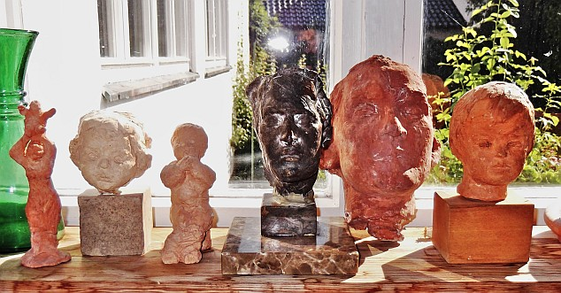 
_Roland von Bohr: Kleinplastiken im Hause Fischer_

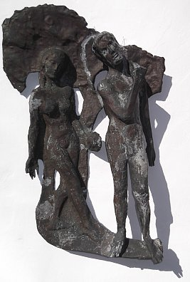 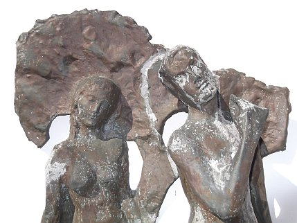 Vom "Geheimbildhauer" 

Berührend, um das vorliegende Buch in einem Worte zu beschreiben. Unromantisch, unverkrampft, geradezu lakonisch stellt uns der inzwischen 87-jährige Architekt Peter von Bohr den Menschen und das Kunstwirken seines Vaters Roland vor - der zwischen 1899 und 1982 die drei Kaiserreiche Österreich, Rußland, Deutschland sterben sah und den weiteren Verlauf seines Lebens der Liebe zur Kunst, zum Menschen und vor allem zur Wahrheit widmete. Und sich dabei auch treu blieb, als (fast) alle untreu wurden. 

Trotz des eigenen Miterlebens gelingt es Peter von Bohr die Geschichte des Vater zwar einfühlsam, doch unsentimental zu umreißen. Die vier Hauptkapitel: "Wegstationen", "Künstlerische Entwicklung", Werkstatt und Auftrag" sowie "Zeit und Leben" folgen einem dramatischen Spannungsbogen. Das verführt den Leser mehr und mehr zum Weiterlesen und so taucht er unversehens ein in den Strom der beschriebenen Zeitläufte, in die vorzüglich abgebildeten und feinsinnig gedeuteten Werke aus Bildhauerei, Malerei und Grafik, in die Selbstzeugnisse Rolands, gipfelnd und das Buch abschließend: "Meine Figuren ... befinden sich aber gegenwärtig im Depot, weil Platz für namhafte Dinge gebraucht wird. Ich habe mir in Anbetracht meiner langjährigen Wirksamkeit in solchem Sinne den Titel 'Geheimbildhauer' verliehen - mehr kann ich kaum noch werden." 

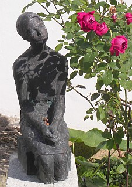 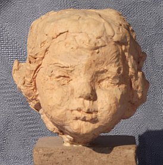 Gleichsam im Vorbeigehen erfährt der Leser, wie Roland von Bohr die merkwürdigsten Lebensstationen durchstreift: Vom Geburtsort Wien noch als Kind nach St. Petersburg, vom refombewegten Ascona ins bierdimpflige München, nach Hallein, Salzburg und in die Schweiz, auftragssuchend von der Türkei nach Schweden, und immer wieder hin und her, von grotesken Anekdoten zu Freundschaften und erwiesener und eben auch versagter Anerkennung. Aus russischer Landidylle und Petersburger Noblesse zu reformbewegten Langhaar-Vegetariern im hakenkreuzgeschmückt-"gotischen" Gewand, die dem jungen Mann 1914 wohl zu imponieren wissen, geht es über die Wandervögel zu den k.u.k. Soldaten und ins aufgewühlte Wien der 1920er. Weiter und immer weiter durch fast das ganze 20. Jahrhundert. Tiefgründig all die Einblicke in die Ateliers und Werkstätten seiner Lehrer "der alten Schule": [Anton Hanak in Wien](http://members.aon.at/lemu/Homepage/Hanak.htm) und [Joseph Wackerle, München](http://de.wikipedia.org/wiki/Joseph_Wackerle), bei Prof. Pfaffenbichler an der Fachschule für Holzbearbeitung, Hallstatt und in der Werkstatt für religiöse Kunst des Hanakschülers Jakob Adlhart in Hallein, an dessen spektakulärem ["Schreckenschristus"](http://www.salzburg.com/sn/wochenschau/artikel/832025.html) für St. Peter in Salzburg [er mitarbeiten durfte](http://www.philaseiten.de/cgi-bin/index.pl?PR=30321). 

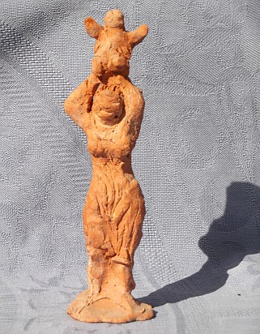 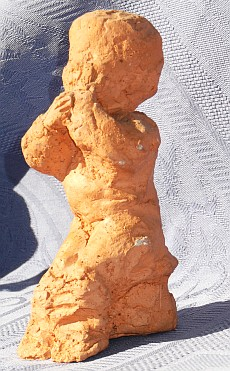 Künstlerische Gewißheit und seine breite Ausbildung stützen Bohrs Treue zum Gegenständlichen, zum sakralen, aber auch gerne zum mythologischen Thema - selbst in späterer Zeit, als das gar nicht mehr modern war. Trotz lebenslänglicher Suche nach Form und Inhalt, nach Gestalt und Stil, nach Werkzeug und Werkstoff. Im gleichen Sinn findet er schon früh zur lebenslangen Liebe zu seiner mitwirkenden Künstlergattin Eliza aus Arnstadt in Thüringen. Bei all dem lassen uns Peter von Bohr, die Kunstwerke und zeitgeschichtlich aufschlußreiche Fotografien zu Weggefährten werden - ein Panoptikum der Geschichte, Lebens- und Kunstentwicklung, das wohl seinesgleichen sucht. Und trotz allerlei Einblicke in das Leben der Bohrs fern aller Spießbürgerei niemals peinlich, eher heiter gestimmt. 

Herrlich die unverblümten Zitate zu den Erlebnissen des Künstlers mit deutschen Prachtexemplaren, Österreichern, Schweizern, Schweden, Russen und Juden. Bohr bleibt allen meist Fremder, läßt sich nicht nationalisieren. Sein Versuch, ausgerechnet in Küßnacht, der Stadt des Geßlerhutes, den österreichischen Buben zu geben, endet in einem Steingewitter der fanatisierten Straßenjungen. Das belehrt. 

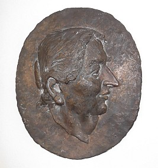 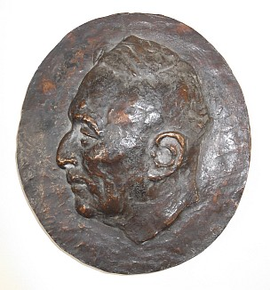 Der Bildhauer Bohr findet seine Gestalt vom Kleinen zum Großen, vom ornamental durchbrochenen "Gewurle" einer an mittelalterliche Mystik erinnernden Schnitzkunst zur stillen, antiker Grabplastik folgenden Archaik. Im holzgeschnitzten Schachspiel von verblüffender Individualität bis zum letzten Bauern, Porzellan feinglatt perfektionierend, doch dann auch nur derb, dafür vielsagend verkürzte Materialität und Form der Großfigur in und an Architektur, an Autobahnen und im Brunnen. Die für Clemens Holzmeister erschaffenen Allegorien für das alte Salzburger Festspielhaus, der ["Thukydides" vor der Münchner Staatsbibliothek](http://www.vanderkrogt.net/statues/object.php?webpage=ST&record=deby088) (fälschlicherweise Hans Vogel zugesprochen) und der ["Kundschafter-Brunnen" vor St. Stephanus in Nymphenburg](http://www.ju-greber.de/MUC-Springbrunnen09-18.html), der "Petrus" für den Dom zu Lund, der [Römerstein in Bad Gögging](http://www.urlaub-im-altmuehltal.de/kurort-goegging/roemerstein.htm), die reich figurierten Säulen der Rüschlikoner Bruderschafts-Kapelle sowie die markanten Köpfe von Karajan und Cosima Wagner seien als bekanntere Beispiele Bohrschen Kunstschaffens benannt. Nicht zu vergessen die so feurigen Pastelle aus München, duftige Aquarelle, umwerfende Porträtskizzen. Früchte eines Lebenswerkes, erschaffen nicht ohne Humor, aber manchmal auch mit Zweifel und in Verzweiflung. Peter von Bohrs Buch bietet von allem etwas und läßt uns so der Entwicklung seines Vaters und dessen überzeitlichem Stilempfinden folgen. Auch in den mehr oder minder stark vom jeweiligen Auftraggeber "mitgestalteten" Werken. 

Fazit: Wer sich den Sinn für eine menschliche Kunst und Schöpferkraft, für den Menschen an sich und seine Sehnsucht nach dem Eigentlichen bewahrt hat, wird dieses Kunst- und Künstlerbuch lieben. Beim Rezensenten, dessen Kinderzeit durch die im Familienkreis erlebte Zusammenarbeit seines kirchenbauenden Architektenvaters mit dem Bildhauer Roland von Bohr verwoben war, ist das zumindest gelungen. 

Aus unserer Sammlung: 
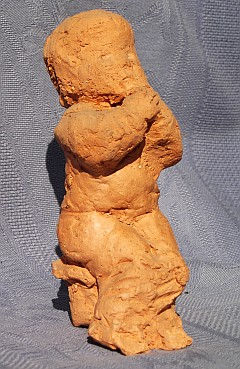 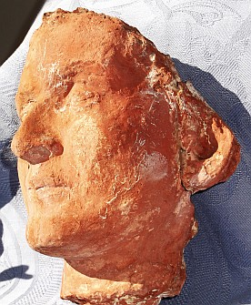 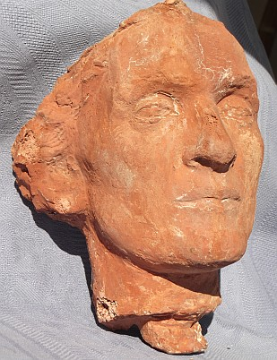 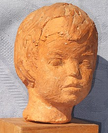 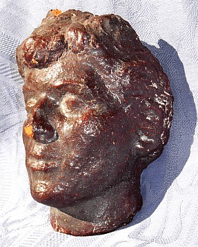 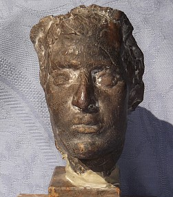 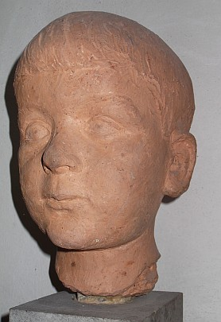 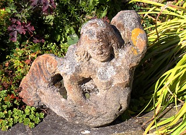 

Zufallsfund: [Ein Idyll: Roland von Bohr singt in Schweizer Familie Bucherer, Schönbühl, russische Lieder](http://buchererpianos.ch/)

---

**11. Ausführliche Rezensionen** 
**von Konrad Fischer und Gastautoren**

Petzet/Mader: **[Praktische Denkmalpflege](8rezpema.md)** - Rezension in ARX und BURGEN UND SCHLÖSSER

H. Thomas (Hrsg.) **[Denkmalpflege für Architekten](8dpfl.md)** - Vom Grundwissen zur Gesamtleitung - Rezensionen in ARX, BURGEN UND SCHLÖSSER, SCHÖNERE HEIMAT, DENKMALPFLEGE IN SACHSEN 1998 
**[Rezension2](http://www.baunetz.de/BauNetz/2mediath/rezens/30086c_.htm)** ein Kollege im BauNetz zum Vergleich. Lesenswert!

Zeune: **[Burgen, Symbole der Macht](8zeune.md)** - Rezension in ARX, BURGEN UND SCHLÖSSER, FRANKENLAND, SCHÖNERE HEIMAT, DENKMALPFLEGE IN SACHSEN 1997

Louis Krompotic: **[Relationen über Fortifikation der Südgrenzen des Habsburgerreiches](8kromp.md)** - Rezension in ARX und SCHÖNERE HEIMAT

Hubel, Schuller und Mitarbeiter: **[Der Dom zu Regensburg - Vom Bauen und Gestalten einer gotischen Kathedrale](8dom.md)** - Rezension in ARX

Ziesemann, Krampfer, Knieriemen: **[Natürliche Farben, Anstriche und Verputze selber herstellen](8ziese.md)** - Rezension in ARX

Ross, Stahl: **[Praxishandbuch Putz - Stoffe, Verarbeitung, Schadensvermeidung](8ross.md)** - Rezension in BURGEN UND SCHLÖSSER

Wetzel und 4 Mitautoren: **[Historische Holzfachwerkbauten, Erhalt und Sanierung, Band I: Sanierungspraxis](8wetz.md)** - Rezension in ARX und bausubstanz

Hermann G. Meier:**[Sanierputze, Ein wichtiger Bestandteil der Bauwerksinstandsetzung](8wetz.md#hermann g. meier)**

Horst Rusam: **[Anstriche als Beschichtungen für mineralische Untergründe, Eigenschaften und fachgerechte Aufbringung](8wetz.md#horst rusam)**

Erwin Dietz: **[Denkmalgeschützte Gebäude, Historisch-technische Wertmaßstäbe](8wetz.md#erwin dietz:#erwin dietz:)**

Sándor O. Pállfy und 9 Mitautoren:**[Wasserkraftanlagen, Klein- und Kleinstkraftwerke](8wetz.md#sã¡ndor+o.+pã¡llfy)**

**Gastautoren:**

Karin Schade: **[Fachwerkwörterbücher - eine Hilfe beim Lesen des Holznagels?](8ks2.md)** - Kritisch vergnügliche Rezension in "Der Holznagel"

---

Weiter: [12. Aufsätze zur Denkmalpflege](8buch25.md) 
[13. Verlagskontakte](8buch25.md#verlagskontakte) 
[14. Quellen/Links zu historischen Themen / Altertumswissenschaft / Theologie / Philosophie / Mythologie](8buch25.md#quellen/links)
