[🠔 Zur Übersicht: Burgen & Schlösser kaufen](8schloss.md)  
# Betr.: SZ 19./20.3.05, Fragen an die Leser, „Das Gute liegt rechts“ von Hermann Unterstöger
**Ein Leserbrief analysiert die Ikonologie der Hauptneigung Jesu am Kreuz im Kontext theologischer Kosmologie, Mondphasen und Zodiakgestirne und widerlegt oberflächliche Erklärungen.**  
_von Konrad Fischer • aktualisiert 01.04.2005_

## Betr.: SZ 19./20.3.05, Fragen an die Leser, "Das Gute liegt rechts" von Hermann Unterstöger

Leserbrief (nicht gedruckt, aktualisiert 04/05)

Es greift natürlich zu kurz, die tief schürfende Frage nach der Ikonologie der Hauptneigung Jesu am Kreuz mit "Nichts Genaues weiß man nicht" und "Das Gute liegt rechts" zu beantworten. Der Grund dieser verbindlichen Bildtradition liegt tiefer: Wie in der Tradition aller am ersten Sonnentag nach Vollmond nach Frühlings-Tag-und-Nacht-Gleiche auferstehenden Frühlingsgottheiten bezieht sich die theologische Kosmologie (vgl. dazu Ambrosius von Mailand und Dionysius Aeropagitus bzw. die Hinweise bei Arthur Drews, Werner Papke u.a.) auch bei Jesu auf den Mond und seinen Lauf durch die Zodiakgestirne. 14 Kreuzweg-Altarstationen bis Golgatha entsprechen wie im Osiristempel den 14 Stationen (Nächten) des Mondes von seiner Vollmond- bis Schwarzmondphase.

---

## Bildbeispiel: Die 14 Kreuzwegstationen auf dem Kreuzweg von der Giechburg zur Gügel-Kirche (bei Bamberg)

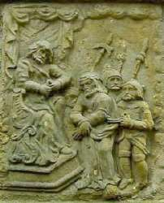I Jesus vor Pilatus 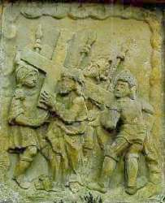II Jesus wird das Kreuz aufgelegt 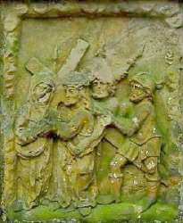III Jesus nimmt Abschied von seiner Mutter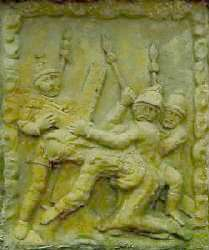IV Jesus stürzt das erste Mal 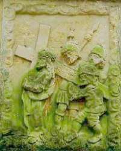V Simon von Kyrene hilft Jesus Tragen 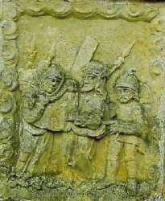VI Das Schweißtuch der Veronica (Vera Icon / Wahres Bild) 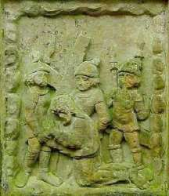VII Jesus stürzt das zweite Mal 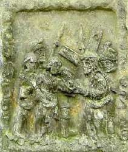IIX Die Töchter Sion beweinen Jesus 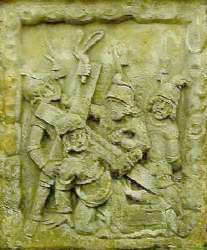IX Jesus stürzt das dritte Mal 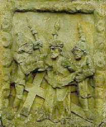X Die Kriegsknechte entkleiden Jesus 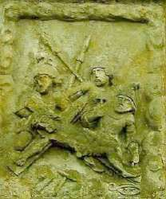XI Jesus wird ans Kreuz genagelt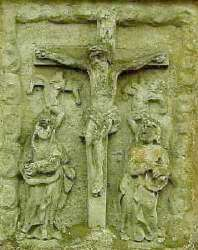XII Jesus am Kreuz (Deesis) 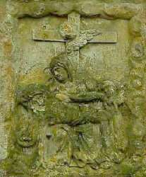XIII Maria betrauert Jesu Leichnam (Pieta) 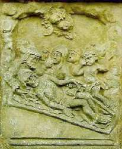XIV Grablegung

---

Wobei die 14 auch die Anzahl der Zodiak-Sternbilder repräsentiert. Zwillinge und Fische liefern dafür ja zwei Figuren. Entsprechend geben sich die [14 Heiligen](http://www.vierzehnheiligen.de/de/gnadenaltar/) am Gnadenaltar in Vierzehnheiligen und sonstwo mit ihren kosmologisch entschlüsselbaren Attributen dem kundigen Betrachter nicht nur als irdische, sodern überirdische und himmlische Nothelfer zu erkennen, ebenso die [21 Figuren](http://upload.wikimedia.org/wikipedia/commons/7/70/Bamberg_Dom_Fürstenportal_Tympanon.jpg) des [Fürstenportals](http://www.flickr.com/photos/zug55/2661933116/sizes/l/in/photostream/) am Bamberger Kaiserdom, an dem noch die sieben antiken Planetengottheiten - erkennbar u.a. an ihren Heiligenscheinen - dazukommen. Auch die sieben Fische und 12 Brotkörbe der Speisungswunder Jesu dürfen bestimmt auch in diesem Sinne verstanden werden. Daher die Auferstehung nach drei Tagen in der unsichtbaren Unterwelt wie einst Jona im Walbauch, die auch der Jona-Jesus-Schwarzmond monatlich durchleiden muß. Wobei das Sterben im Mondhaus Krebs die neugeborene Mondsichel in der Jungfrau - das ist gewißlich wahr! - zur Folge hat.

Verblüfft? Dann prüfen Sie die Sterne doch selber nach, beispielsweise mit dem [Stellarium-Planetarium (kostenloser Download)](http://www.stellarium.org/de/)

 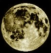................................................................................................................................................................................. 

Im Krebs - sitzend zur Rechten des Sonnenhauses Löwe - dann der Krebsnebel Praesepe (Krippe), darüber die Aselli (Eselssternchen), daneben Zwillinge (das holde Paar), der Stier (Ochs) und der Himmelhirte Orion, der des Nachts seine Herde aus Stier, Widder und Steinbock mit Hilfe seines Großen und Kleinen (Hirten-)Hundes (Canis maior und minor) hütet. Der Fortschritt des Frühlingspunktes als Sonnenstandort zur Tag-und-Nacht-Gleiche zur Zeit Christi Geburt aus dem Widder (Osterlamm) in die Fische zeigt sich kosmo-logisch an unserer (kar-)freitäglichen sternbildentsprechenden Fastenspeise. Sie löste als kosmologisch notwendige Reform das Opferlamm (Frühlingspunkt ca. -2000 bis zum Jahr 0 im Widder, Auferstehungs-Frühlings-Mond-Widdergottheit wie z.B. äg. Chnum - Zeugungs- und Wassergottheit, germ. Odinsohn Vidar - Naturkraftgottheit, vgl. auch Amun/Ammun/Zeus-/Jupiter-Ammon) und den Ochs am Spieß (Stier-Frhülingspunkt -4000 bis -2000, Stiergott z.B. äg. Month mit mondgleich weißem Körper und schwarzem Gesicht, auch Amun und Fruchtbarkeits-Totengott Apis-Stier, Synkretismus Osiris-Apis-Serapis, gr. Zeus-Stier und Europa, Minotaurus, röm. Stieropfer Taurobolium, ...) mit ihren mondsichelgleichen Hörnern ab. Auch deshalb also der Fisch als geheimnisvolles Erkennungszeichen und Christussymbol. Die Papst-Tiara und auch die fischmaulgleiche Bischofsmütze hat dann das katholische Christentum - [evtl. durch Einfluß des Kirchenvaters Hieronymus](http://de.wikipedia.org/wiki/Dagon) - sinnigerweise direkt von den identisch entsprechenden Kopfbedeckungen, die dem syrisch-babylonischen Fischgott Dagon, als Wetter-, Fruchtbarkeits- und das Nacht-und Schattenreich beherrschender Mond-Totengott auch Sohn des Sonnen-Gottvaters El (= Sabazios/Saturn/Chronos-Zeitenherrscher und Schöpfergott, Christus am Kreuz: "Eli, Eli, lama sabachtani") zugesprochen wurden - übernommen.

Weiterführend die Bildlinks - [Zeus Ammon: 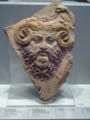](http://commons.wikimedia.org/wiki/File:Zeus_Ammon_Louvre_MNB316.jpg) und [Serapis: 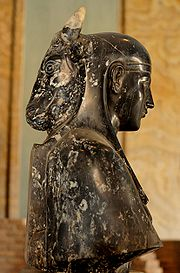](http://de.wikipedia.org/wiki/Synkretismus_\(Ägyptologie\)) und hier u.a. christologischen Krassheiten die [Darstellungen der Fischgotthüte im Vergleich. 

 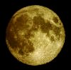................................................................................................................................................................................. 

 Wer nun das Mondgesicht genauer betrachtet, sieht sofort, wohin es blickt bzw. sich neigt: Nach rechts bzw. vom Betrachter aus eben nach links. Wobei die sog. [Libration des Mondes im Jahreslauf](http://www.fourmilab.ch/earthview/moon_ap_per.html) für leicht veränderte Neigungswinkel sorgt (siehe Bildbeispiele), aber an der grundsätzlichen Ausrichtung des erstorbenen Blickes nichts ändert. Paul Gerhardt besingt das grause Sterben am Kreuz: "Du edles Angesichte, davor sonst schrickt und scheut das große Weltgewichte: wie bist du so bespeit, wie bist du so erbleichet! Wer hat dein Augenlicht, dem sonst kein Licht nicht gleichet, so schändlich zugericht´?" 

 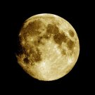........................................................................................................................................................................... 

 Wenn nun der erbleichte Neumond vor die Sonne tritt, kommt es zur in den Evangelien bezeugten Finsternis. Das erstorbene Mondgesicht verfärbt sich blutrot. Das Kreuz verweist dabei auf die -2340 von den Chaldäern kanonisierte Sternenordnung der 12 (14) Zodiaksternbilder, die auch heute noch gilt. Die vier Kardinalpunkte des Sonnenkreises (Gleichen und Wenden) bildeten damals ein Kreuz ausgerechnet zwischen den vier hellsten und dem Sonnenlauf nächsten Fixsternen, die wir heute als Evangelistensymbole (Regulus im Markus-"Löwen", Aldebaran im Lukas-"Stier", Antares im Skorpion, darüber der Ophiuchos/Schlangenhalter - Johannes mit Kelch, darin die Schlange, Fomalhaut beim Wassermann, nahe Adler-Matthäus) und als Schmuck der vier Kreuzbalken kennen. 

 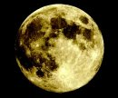................................................................................................................................................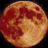.. .. 

 Ein bisserl Kosmologie kann also auch bei der christlichen Theologie und Kunstbetrachtung nicht schaden und liefert des Rätsels anagogische (zu den Dingen des Himmels führende) Lösung für alle der Drei-Sinn-Lehre entsprechenden Bildprogramme von der Antike bis zur Aufklärung. Genauer als jede volksetymologische Kombinatorik der hochgelahrten Kunstgeschichtler. [Konrad Fischer, Hochstadt am Main](1refernz.md) Wer ein bisserl Astronom / Astrolog am Bildschirm spielen will, ein perfektes Programm, das sogar die Sternbilder als Bilder zeigt, ist das kostenlos auf diesem Link erhältliche [Stellarium](http://www.stellarium.org/). 

Interessant in kosmologischen Zusammenhang, die kalendarische Grundlage der Kirchenbauachsen: [Erwin Reidunger: Fortpflanzung von Absteckfehlern im mittelalterlichen Kirchenbau - Beispiele](http://de.geocities.com/studiolo_2000/diverses_absteckfehler.htm)

---

Zu Fragen der christlichen Lehre 
Personen, Geschichte und Kosmologie Konrad Fischer Wieder mal eine dicke Überraschung offenbarte uns [Heribert Illigs](http://www.mantis-verlag.de) [ZS 4/99, 670] Hinweis auf [Francesco Carotta: War Jesus Caesar? 2000 Jahre Anbetung einer Kopie; München](8buch.md#carotta). Dieses Buch verdient eine vertiefte Nachschau - auch im Vergleich zu anderen Autoren. Seine These: Vom vergöttlichten Kaiser zum göttlichen Menschensohn. Wer Lucius Annäus Senecas "Trostbrief an Maria/De consolatione ad Mariam" kennt, durfte sich schon immer fragen, ob er an die ihren gemordeten Sohn beklagende "Gottesmutter" ging. Die Tradition unterstellt Seneca ja "innige Verbindung mit dem Apostel Paulus (und wenigstens) Bekanntschaft mit den heiligen Schriften der Christen" [Meyer´s Conversations=Lexicon 1851]. Wie weit ging eigentlich diese "Bekanntschaft"? Livio C. Stecchini schrieb Seneca gleich die ganze Passionsgeschichte zu ["The Passion of Jesus read as a Roman Tragedy", 1982, Hinweis aus ZS]. Der Römer beutete demnach die ihm zugeschriebenen Bühnenwerke wie beispielsweise "Hercules Oetaeus", "Troades", "Thyestes" und "Medea" und andere antike Dramen als Motivsteinbruch aus. Stecchini gelangt so bis zur Rekonstruktion der originalen Bühnenausstattung und Kulisse des Fünfakters - mit bis heute ungebrochener Aufführungstradition (Oberammergau). Obendrein entlarvt er auch personale Rätsel: Maria Magdalena wird mit guten Gründen zur Gottesmutter selbst, Joseph von Arimathia zum Aromatarius=Leichenbestatter, der den Frauen am Grab Spezereien andient. Stecchinis Methodik klärt viele Ungereimtheiten der Evangelisten. Sie gründen demnach in der Petrusfixiertheit und der Annahme, dass die frühen Evangelisten Markus und Lukas Senecas "Jesus Christus" noch als Bühnenspiel sahen, Matthäus dann zwischen ihnen vermittelt und Johannes selbst nicht mehr Zeuge war, dafür aber auf das Drehbuch zurückgreifen konnte. Deshalb wird die erste Sichtung des Auferstandenen teils dem Papstvorgänger zugeschrieben und der Auftritt des bühnenwirksamen Tragödienchors unterschiedlich gewichtet. Jedoch - Jesu Person bleibt 'literarisch', die Frage nach seiner Historizität wirft Stecchini gar nicht auf. Weiter gelangt Carotta: Seine Parallelen bringen eine historische Identität von Jesus und Cäsar hervor. Gallia ist also Galilaea, die Personen des Neuen Testaments entstammen Cäsars Abenteuern. Beispiel: Brutus=Judas. Auch den anderen Bekannten von Antonius über Kleopatra bis zu Octavian schneidert Carotta ihre Rolle recht überzeugend auf den Leib. Detering: "Der gefälschte Paulus" [ZS 1/95, 68]: entpuppte Paulus schon als Simon Magus. Dessen verschollene Originalschriften hat die Offizialtheologie demnach im Nachhinein zurechtgerückt und dem Staatskirchendogma dienstbar gemacht. Nun aber Carotta: Paulus/Saulus förderte als vespasianischer Propagandaminister Flavius Josephus, wohlbekannter Autor so mancher Judaica, die Einvernahme des Judentums für den römischen Cäsarenkult. Das Kostüm des verurteilten Jesu mit römischem Purpur und der sonnengöttlichen Zackenkrone steht wie das Kreuzigungsgeschehen parallel zu Vergils Beschreibung des cäsarischen Todesrummels mit Sonnenfinsternis von 6.-9. Stunde, Erdbeben und erschreckenden Vorgängen im Tempel einem "König der Juden" jedenfalls nicht so gut. Im Unterschied zu einem römischen Diktator, dessen Ermordung die Täter mit seinem angeblichen Streben nach königlicher Macht zu rechtfertigen suchten und so der sofortigen Strafe entgingen. Die Jesuspassion also eine verklausulierte Paraphrasierung des cäsarischen Schicksals? Die frühchristliche Ikonographie belegt Carotta als Ergebnis römischer Münzprägungen und des seltsamerweise so spurenarmen nachcäsarischen Divus-Julius-Kults. Der römisch-katholische Machtapparat in der Reichshauptstadt, seine Funktionäre in römischen Uniformen, die Konstantinische Schenkung, der "Kirchenstaat", die Überstülpung des "Römischen" Rechts nördlich der Alpen, das deutsch-römische Kaisertum von Gottes Gnaden, der Unfehlbarkeitsanspruch des Obersten Brückenbauers - nach Carotta alles logisch. Wirklich verblüffend: Carottas Wort-für-Wort-Ableitung des Markusevangeliums aus der 'gelehrt verballhornten' Leben-Cäsar-Literatur. Das Christentum demnach geboren aus dem umgewandelten Cäsarkult, die frühchristlichen Kirchen eine Umwandlung der Cäsarentempel, der Klosterbau also Nachfolger des römischen Heerlagers? Das Evangelium gar die Geschichte des römischen Bürgerkriegs? Einige Gleichnisse entschlüsselt Carotta als Nacherzählung cäsarischer Historien. Auch Cäsars sozusagen freiwillige und gegen alle Warnungen erfolgte Annahme des Opfertodes um des römischen Volkes willen stimmt schon nach Stecchinis Analyse mit Jesus überein. Diese letzte herkuleische Tat (Herkules wählte die altargestützte Selbstverbrennung, um nicht dem Nesselhemd seiner Gattin den Triumph zu gönnen) ermöglicht ja erst die Apotheose, die Vergöttlichung des Menschensohns. Deshalb stirbt auch Jesus durch freiwillige Aufnahme des mit dem Schwamm dargebotenen Gifts - als solches entpuppt sich nämlich bei näherer Betrachtung der luther´sche "Essig". Und nur deswegen kann Jesu sagen: "Es ist vollbracht - Peractum est". Antikes Heldenbrauchtum - auch einem schierlingsbechernden Sokrates als Christus vorausgehendem Wahrheitskünder nicht fremd. So verdienen sich Herkules, Cäsar als Divus Julius und dann Jesus ihren Sitz zu Rechten ihres jeweiligen Gottvaters. Im Falle Jesus/Cäsar zu sehen auf nachcäsarischen Münzprägungen in Carottas reichbebildertem Buch. Ist es nun endgültig aus mit der protestantischen Nachkriegstheologie: 'Jesus gab es historisch nicht, aber freilich war er Jude' (nach Carotta)? Und spricht diese geradezu scholastische Analogisiererei und Beibehaltung mythologischer Versatzstücke in allen wirklich guten alten Geschichten nicht auch für eine einheitliche Schreibaktion, die so manche Quellenkritiker erst der frühen Neuzeit mit ihren so wissensbreit aufgestellten Humanisten zuschreiben? Ein wirklich herausforderndes Buch. Witzig, ironisch, saftig und brilliant geschriebene Wissenschaft eines gelernt- und gelehrten Outsiders (Studium der Philosophie u. Linguistik). Seine Ergebnisse ermutigen ihn zu durchaus frechen Seitenhieben auf die Leben-Jesu-Versuche von Augstein & Co. Die klare ikonologische Beweisführung durch viele Abbildungen und eine wirklich fundierte Verarbeitung des zugehörigen Forschungsstands ermutigen und ermöglichen den Nachvollzug des Lesers. Ein dicker Anmerkungsapparat ist mit den umfangreichen lateinisch/griechischen Quellentexten dem Bildungsbürger klassischer Prägung zugeeignet. Und tiefe Einblicke in das kulturelle Umfeld eines Cäsars und seine ihm zugeschriebenen revolutionären Erfindungen vom Buch bis zum Reisewagen gönnen auch dem Laien das Aha-Erlebnis. Wie werden die Theologen reagieren? Als 'Illig-Jünger' ahnt man was kommen mag: Abscheu, Totschweigen, Verächtlichmachen, Widerlegen. Wir warten. Spannend auch der Vergleich zu [Wilhelm Kammeiers "Fälschung der Geschichte des Urchristentums"](8buch11.md#kammeier): Alle historischen Bezüge von vornherein eine Fiktion? Die Evangelien absichtsvoll erst aus einer einheitlich organisierten mittelalterlichen bzw. am Anfang der "Neuzeit" anzusiedelnden Fälscherquelle, die das Christentum bzw. den Katholizismus erst im Interesse des französichen Königstums konstituiert und für Laien und Priesterschaft je eine sich fundamental widersprechende Moral aufbaut? Gnädige Erlösung für Jedermann kontra ungnädiger Ge- und Verbotspingeligkeit? Theologen müssen hier kopfstehen und so mancher Quellenkritikaster wohl auch. Panta rhei eben. Aktuelle Diskussion, Forum und Hintergrundwissen auf Carottas Website [www.carotta.de](http://www.carotta.de). Zur Kosmologie der göttlichen Liebe Wie steht es nun mit der theologisch-kosmologischen Überhöhung des religionsstiftenden Mythos? Es geht dabei um die Meta-Ebenen des antiken Himmels und seiner Sternbilder/Planetengottheiten als Schöpfungsprinzip hinter den christlichen Bildern. Dazu erlaubt sich der Rezensent, ein Kondensat seines Forschungsstands anzuhängen - zur Ergänzung der Thematik und Anregung weiterer Nachschau. Auch hier gibt es nämlich noch viel (wieder) zu entdecken: die Ereignisse des gestirnten Himmels bilden sozusagen die Vorlage für Mythos und Sage, Kult und Märchen [vgl. Charles François Dupuis, Origine de tous les cultes ou religion universelle. Bd. 1-7. Paris: Agasse [1795], siehe nachfolgend den Text bei Google-Books, 

der sich auf Dupuis beziehende Karlsruher Professor Arthur Drews mit seinen vielen astralmythologischen Werken, die seinerzeit der historisierenden Jesu-Leben-Forschung das unbeschwerte Räsonieren schwermachten (s.u.) und 

neuerdings auch Werner Papke: "Die Sterne Babylons"; Bergisch-Gladbach 1994 sowie David Ulansey ([Mithraism: The Cosmic Mysteries of Mithras](http://www.well.com/user/davidu/mithras.html)): Die Ursprünge des Mithraskults. Kosmologie und Erlösung in der Antike, Theiss 1998]. So wäre Josephs Zimmererbeil nicht nur eine aus den Fasces/dem Liktorenbündel herausgelöste Ritualaxt und Zeichen übergeordneter Herrschaftsgewalt, sondern auch als Streitaxt Kennzeichen des Kriegsgottes Mars im anagogischen, also zu den Dingen des Himmels verweisenden Rätselspiel rund um die sieben antiken Planetengottheiten und die "Vierzehn Heiligen" Tierkreisfiguren (Zwillinge/Fische je zwei!). Die Johannes-Apokalypse offenbart Nikolaus Morosow ["Die Offenbarung Johannis - Eine astronomisch-historische Untersuchung" vgl. ZS 4/97, 670] demzufolge als gelehrtes Sternrätsel des Johannes Chrysostomos, ein wirkmächtiges Pamphlet gegen den staatstragenden Kirchenapparat. Es muß ja nicht immer Cäsar sein. Und unsere lieben Ochs und Esel finden sich ebenso zwanglos am Himmel wieder: Im Sternbild Stier und den Eselssternen "Aselli" im Sternbild Krebs, Wiedergeburtsort der Seele nach Platon - ausgerechnet über dem Krebs-Sternhaufen, antik: "Praesepe-Krippe". Die "Zwillinge" Josef und Maria gucken zu, wie der Gottessohn dort als Schwarzmond geboren und nach drei Tagen in der Gottesmutter Jungfrau als Neumondsichel erscheint. Jungfrauengeburt pur. Wobei der Hirte Orion mit seinen "Hundssternbildern" Canis maior und minor am Sternenfeld die benachbarte Sternenherde - Widder, Steinbock und Stier - hütet. Auch der astronomisch bedingten Zahlensymbolik muß weiter nachgegangen werden. Die synodischen Umlaufzeiten der Planeten bringen hier die Zahl zuwege. Platons Demiurg hat ja seine Schöpfung nach Potenzen geordnet, ein klarer Hinweis: Merkur: 4,5 + 4,5² + 4,5³ = 115,88 d. Die offen vorgestreckten Hände des Seelengeleiters/Psychopompos/Oranten der Katakombenkunst zeigen diese 4,5 als vier ganze und einen halben Finger - den Daumen. Heinke Sudhoff ["Sorry Kolumbus, Seefahrer der Antike entdecken Amerika", Bergisch-Gladbach] belegt dieses merkurische Handzeichen und die Potenzrechnungen für Merkur, Venus und Jupiter (s.u.) mit Kurt Schildmann ["Die Wiedererhellung des Anthropozentrischen Planeten-Systems des Alten Orients"; Bonn] und Heinrich Quiring ["Die Heilige Sieben-Zahl und die Entdeckung des Merkur"; in: Das Altertum. Deutsche Akademie der Wissenschaften, Bd. 4, Heft 4, Berlin 1958]. Mars: 5 + 5² + 5³ + 54 = 780 d. Anders als Sudhoff, die - auf Martin Knapps geometrische Belegführung ["Pentagramma Veneris"; Basel 1934] gestützt - die Fünf auch der Venus zuschreibt, zeigt meine Berechnung eindeutig den Kriegsgott. Die Fünf zeigt sich in den fünf Fingern der geballten oder - wie bei dem Mars des Bamberger Fürstenportaltympanons - um eine Waffe greifenden Faust des am Jüngsten Gericht teilnehmenden Lanzenträgers 'Longinus'. Aus der ikonologischen Analyse der Handzeichen erschließen sich die Fünf in der Faust und die Folgezahlen bis zur Acht als Abspreizungen von ihr. Der Mars des Bamberger Apostelreigens am Portalgewände weist dann als Petrus seine Doppelschlüssel in Streitaxtmanier vor. Man denkt sogleich an des Malchus Ohr. Das Pentagramm (Pentagon!) hat also durchaus kriegerischen Charakter. Eine mögliche Alternativrechnung für Saturn und Venus entdeckte ich aber z.B. in der Sechs: Saturn: 6 x 3 \+ 6² x 4 + 6³ = 378 d. Und auch Venus hat Sex: 6 + 6 : 3 + 6² x 4 + 6³ x 2 = 584 d. Im sechszackigen Stern/Hexagramm ist die Sechs zu finden, bzw. in der Faust mit abgespreizt tödlich drohendem (Saturn/Chronos als Sensenmann) oder gar verführerisch lockendem Zeigefinger. Das könnte auf den Tod und das Mädchen weisen, die Beziehung zwischen Wasserneck bzw. Nixe/Hexe und ihren ungleichen Opfern. Daß Saturn sein Haus im Wassermann hat, fördert solche Verbindungen. 

Die alten Kalenderheiligen gönnen dem Sternkundigen jeden Tag einen nicht selten humorigen Hinweis, begründet in den Beziehungen zwischen dem Jahreslauf der Sonne durch den Zodiak und dessen Häusern für die "klassischen" Planeten (Löwe - Sonne, Krebs - Mond, Zwillinge/Jungfrau - Merkur, Widder/Skorpion - Mars, Stier/Waage - Venus, Schütze/Fische - Jupiter, Steinbock/Wassermann-Saturn): am 20. Januar, Tag des Wassermannbeginns, z. B. der nackte Jüngling Sebastian mit verliebtem Seufzerblick. Amors Pfeile: liebevolle Versinnbildlichung der 6-Beziehung Wassermann/Saturn-Venus als Marterwerkzeuge des so schönen Heiligen. Auch das schon erwähnte Bamberger Fürstenportal bietet dem Eingeweihten mit seinen 14 (Tierkreis) + 7 (Planetengottheiten) = 21 Tympanonfiguren im Jüngsten Gericht und seinen 24 'Aposteln auf Propheten' (21 + Zwillingsdopplung + Polarbär) am Portalgewände erbaulichsten Stoff für die Anwendung der kosmologischen Zahlenspiele: so gönnt Venus als 'Lieblingsjünger Johannes' dem Publikum einen überaus ermutigenden Blick und ein provozierend weibliches Hinterteil. Wer will, kann das nun verstehen. Nur die lieber nach moralisierender Bibelspruchparallele, Meisterfrage und Datierung suchende Kunsthistorie nicht. Jupiter: 7 + 7² + 7³ = 399 d, das Zahlzeichen Sieben des Himmelskönigs im Victory-Zeichen bzw. der segnenden Hand. Venus: 8 + 8² + 8³ = 584 d. Der achtstrahlige Stern der Ischtar und Maria zeigt das ebenfalls wie die drei von der Faust abgestreckten Schwurfinger. Die astrale Zahlensymbolik und die darauf aufbauende Attributlehre entschlüsseln die in den Kultbildern verborgenen Planetengottheiten und Sternbilder. Der Jesuskult am Anfang des präzessionsbedingten neuen Fischezeitalters mit seiner Fischsymbolik, sein Freitags-Opfertier in Nachfolge von Widder (ca. -2000 bis Ztw.) und Stier (ca. -4000 bis -2000) - alles nicht nur historisch, sondern auch kosmologisch bedingt. Es lohnt sich also, dem antiken Sternenwissen nachzugehen. Vor allem, wenn man über den 'sensus moralis' zum 'sensus anagogicus', zu den Dingen des Himmels vordringen will. Dann versteht man auch die drei Tage des Wiedergeburtsgottes im Reich des Todes kosmologisch als die drei Schwarzmondnächte ebenso wie die 14 Stationen vom Voll- bis Schwarzmond als technischen Kern des Kreuzweges. 

Einschub: Präzession 

Präzession - Fortschreiten (des Frühlingspunktes FP): 
Durch das sogenannte Torkeln der Erdachse, um die sich die Erde dreht, wandert der von der Erde aus sichtbare FP - der Sonnenstandort zur Frühlings-Tag- und Nacht-Gleiche, durch die Sternbilder. Ca. alle 2000 Jahre - eine Ära oder ein Äon - erreicht die Sonne dabei ein neues Sternbild. Nach ca. 24.000 Jahren beginnt sie nach Durchschreiten aller zwölf auf der Sonnenbahn (Ekliptik, s. Einschub u.) liegenden Zodiak-Sternbilder - unsere bekannten "Sternzeichen" - den Durchgang von vorne - bis zum Ende der Tage. 

Der FP - astronomischer Schnittpunkt der Ekliptik mit dem Himmeläquator - läutet das Sommerhalbjahr mit bis zur Sonnwende zunehmenden Tageslängen ein und dem Lauf der Sonne durch den oberen Ekliptikbogen ein und war deshalb seit jeher Ausgangspunkt für Kulte rund um die "Auferstehung". In den Jahren 4.000 bis 2.000 vor Christus war der FP im Sternzeichen Stier, man verehrte gehörnte Stiergöttheiten mit goldenen Sonnenkukeln auf der Hornspitze und opferte/schlachtete ihnen Stiere, die nach ordentlichem Durchbraten auf dem Brandopferaltar dann - begleitet von ausgiebigem Gebrauch alkoholisch-begeisternder Getränke - von den das Opfer vollziehenden Priestern und den Kultgenossen verzehrt wurden. Das römische Stieropfer "Taurobolium", die Minotaurus-Mythe usw. erinnern noch daran. Etwa 2000 bis Christi Geburt stand dann der FP im Widder. Es war die große Zeit der Opferlämmer, des Passahlammes, des widdergehörnten Zeus Ammon des Lamm Gottes, eben alles Stellvertreter des sich im Mond darbietenden Auferstehungsgottes, der in seinem Monatszyklus das Werden und Vergehen der staunenden Welt wieder und wieder vorführt. 

Und was geschah nun am Himmel zu Christi Geburt? Was opfern und verspeisen wir am Sterbetag unseres Heilands? Genau: Fische, das manchen noch bekannte Symbol und Erkennungszeichen der Christenheit seit altersher. Entsprechend trat die Sonne zum FP in das Sternbild Fische/Pisces ein und erforderte auch deswegen eine durchgreifende Reformation des Auferstehungskultes. Freitag und Karfreitag sowie die auf das Osterfest hinführende "Fastenzeit" sind deswegen die bevorzugten Fisch- und Festtage für unseren christlichen Auferstehungskult. Und im "Osterlamm" leisten wir uns obendrein noch die mystische und am OStersonntag auch verfleischlichte Erinnerung an den vorangehenden Widderkult, den der Fischkult ablöste. 

The 5th Dimension: Aquarius - Let the sunshine in 

Soraya Arnelas: Aquarius - Let the sunshine in 

Hair (Filmausschnitt) - Aquarius 

Hair (Filmausschnitt) - Sodomy - Holy orgy 

Hair - Hashish 

[Info / Songtexte / Story Musical Hair](http://www.musical-hair.de/) 

[www.aquarian-age.net](http://www.aquarian-age.net/) Heute - seit etwa 2.000 n.Chr. - ist der FP nun in den Wassermann - das Saturn-Haus - eingetreten. Das sog. Wassermannzeitalter ist heraufgezogen. Der Jugend wurde es schon lange psychedelisch angepriesen ("Mystic crystal revelation and the mind's true liberation ... Guided by the cosmic forces, Oh, care for us; Aquarius!") z.B. im Lied "Aquarius" im Musical "Hair". Der Regenbogen ist sein beliebtes Symbol, seine aktuellen Merkmale: 

- der gleichgeschlechtliche und sonstig perverse Sex, 
- "saturnalische" Orgien, Drogenkonsum, - Umstürzlerei (1968: Weg mit den alten Zöpfen), 
- der von der vom Wassermann bewässerten Erdmutter Gaia dominierte Ökokult mit seinem menschenfeindlichen, menschenverachtenden und auf weitestgehende Bevölkerungs-Ausrottung/Bevölkerungs-Dezimierung (Abtreibung, Empfängnisverhäütung, Bevökerungskontrolle als logischer Kult für den alten Todesgott Saturn/Chronos, der nach antiker Lehre seine Kinder frißt, dessen historischen Attribute/Erkennungszeichen: Harpe/Sense/Sichelschwert und dessen Habitus als Sensenmann / Gevatter Tod, aber auch als "Wasserneck", der die Jungfrau (Venus) zu sich ins Wasser zieht bzw. das Urmotiv "Der alte Mann und die junge Frau" wohl hinreichend bekannt sind) und 
- der davon abgeleitete "Ökologismus" als quasi "Mutter-Erde-Kult". 

Ihm huldigen heute leider auch nahezu alle "christlichen" Priester unter dem scheinheiligen Deckmantel der "Schöpfungsliebe / Umweltliebe / Naturliebe" und all deren tropfigen Schäflein (Sie auch vielleicht?). Daß sie damit bedenkenlos den ewig wahren Christus verraten (Petrus!) und auf Gaias Altar abschlachten schert da weiter nicht. Im Geheimen und teils auch zugegebenermaßen glaubt man ja eh lieber an die planetenfundierte Mär der ewigen Wiederkehr, buddhistischen Wiedergeburt bzw. Reinkarnationslehre und Menschenverbesserei inkl. [Affenabstammung und darwinistischer Selektion/Evolution](http://www.pm-magazin.de/de/heftartikel/ganzer_artikel.asp?artikelid=170) (als Rechtfertigungslehre für die menschenunwürdige Behandlung der von England unterjochten Kolonialbevölkerung) als an den vom Schöpfer als einmalig erschaffenen Adam und uns als seine Nachkommen. Helga Zepp-Larouche beschreibt in ihrem schon 1982 erschienenen Aufsatz "[Die historischen Wurzeln des grünen Faschismus](http://www.bueso.de/artikel/historischen-wurzeln-des-gruenen-faschismus)" die geistigen Grundlagen des Wassermann-Zeitalters und seiner aktuellen Eliten in der anti-christlichen romantisch / pessimistisch / fortschrittsfeindlichen Bewegung recht scharfsinnig und verweist darin wohl zu recht auf Marilyn Ferguson: The Aquarian Conspiracy (Die Wassermann-Verschwüörung). Personal and Social Transformations in the 1980s. J. P. Tarcher, Inc., Los Angeles, neu hrsg. von John Naisbitt 1987. 

Daß der ganze Wassermann-Zinnober von den herrschenden Eliten in Gang gesetzt und zur besseren Ausbeutung der als unmündig angenommenen Masse immer weiter entwickelt wird, ist ein vielleicht nicht ganz von der Hand zu weisender Deutungsversuch der Kritiker. Da kommt Endzeitstimmung auf ... 
Die deftig-erotischen Schöpfungsmotive, 'creatio continua' und 'logos spermaticos' der christlichen Kirchenväter im Faltenwurf unserer und der antiken "Heiligen" als konkrete Bearbeitung des seit Empedokles und auch von Aristoteles so vielbeschworenen actus-potentia-Zusammenspiels, wären eine weitere Entfaltung des theologischen Bildgehalts: Der göttliche Eros als dialektisches Erkenntnisprinzip widerstrebender und sich gleichzeit anziehender immerwährender Schöpfungskräfte. Eine spannende Sache auch für Liebhaber der Lehre Diotimas im platonischen Symposion [vgl. Wilhelm Schmid: "Die Geburt der Philosophie im Garten der Lüste, Michel Foucaults Archäologie des platonischen Eros"; Frankfurt a. M.] und des Aeropagiten [Dionysius Pseudo-Aeropagitos: "Von den göttlichen Namen"]. Die "platonische" Theologie und die sich daraus ergebenden erkenntnistheoretischen und maltechnischen Probleme der Bildverrätselung beleuchtet z. B. Georges Didi-Huberman ["Fra Angelico - Unähnlichkeit und Figuration"; München] schon recht kenntnisreich, aber ohne den letzten Schleier zu zerfetzen. Man begreift, warum Platon die sinnverwirrenden Malermeister aus seinem Musterstaat verbannen wollte. Aus dem Jesus-Cäsar-Nachwort der Würzburger Archäologin Prof. Dr. Erika Simon: "Das Buch von Francesco Carotta möge dazu beitragen, daß wir uns für Fragen, die das frühe Christentum betreffen, offenhalten." Dafür bin ich auch. Konrad Fischer, Hochstadt am Main (Rezension in "Zeitensprünge", [Mantis Verlag](http://www.mantis-verlag.de), ergänzt 04/08) Anhang: Das Mondkapitel aus meinem bisher unveröffentlichten Text über Kosmologie und Kunst: Mond Im Mond, dem Himmelsriesen des Nachthimmels, bei Erdbeobachtung von Sonnengröße und so Verursacher deren totaler Verfinsterung, erblühten und starben Wiedergeburtsgötter aller Kulturen als treffende Ausdeutung seines Wachstums, Vergehens und Wiedererscheinens. Die wechselnden Mondfarben schwarz, rot, gold, und orange, silber, sowie weiß mit himmelblau bildeten eine Kriegsfahnenpalette, in der sich sein Farbspektrum mit Auferstehungszuversicht paarte. 

 .................................................................................................................................................. .. 

 Seine ihm zugeschriebene Verantwortung für die Erde und deren Blühen und Gedeihen ergänzte den Farbkasten noch mit dem grünen Spektrum. Bilder des dreiköpfigen Höllenhunds, der Wächter des Totenfährmanns (Hunde, Orion), hatten dementsprechend in der Wolle verschieden gefärbte Köpfe und bildeten auch die drei Mondphasen (zu-, abnehmend, voll) als Dreikopf ab. Der Dreiphasencharakter gab neben der schon erwähnten Idee der drei Lebensalter in den Drei Königen wohl auch den Dreisproßpflanzen/-blüten Gestalt, die im dreigliedrigen Lotosornament (oft mit Sonnenstrahl-Palmette) auch das weiß-silbrige Erscheinungsbild aufnahmen (vgl. Horusgeburt aus Lotos). Romanische Kapitelle mit Köpfen in Eckprofil und Frontalstellung versinnbildlichten ebenfalls die drei Mondphasen, die auch in den griechischen Göttertriaden erscheinen wie die drei Schicksalsgöttinen/Moirai, die Alten des Meeres Phorkys, Proteus, Nereus oder die drei Gorgonen Sthenno, Euryale und Medusa. Der Mond "SHESH.KI-Bruder der Erde", den mit "modernem" sonnenzentrischen Weltbild arbeitenden chaldäischen Priestern als Erdtrabant bekannt, belebte die Stellvertretungsspekulation, in Ägypten erhielt der Verstorbene den Mondgottnamen Osiris in der Hoffnung, die himmische Mondwiedergeburt nachfolgend auch zu erleben, bei den Griechen hieß die Gattin des Sonnengottes Perse oder Perseis wie auch die Unterweltsgöttin Hekate (vgl. Perseus und Persephone), auch Neaira/die Neue wurde sie genannt. So offenbarte sich ihre Bedeutung als Neumond und das Liebesverhältnis zwischen Sonne und Mond zur Neumondnacht. In der Kultpraxis wurden die 14 Stationen vom Vollmond bis zu seinem dreitägigen Verschwinden als Leidensstationen gedeutet. Die chaldäischen Priesterastronomen konnten daraus einen stellvertretenden Erlösungstod konstruieren, mit dem der Mondgott die Sünden der Welt übernahm, was Gilgamesch in der bei Papke publizierten hethitischen Fassung der Kultlegende veranlaßt, seinen sterbenden "Mondbruder" Enkidu, mit dem er die Götter verärgerte, zu fragen: "Oh Bruder! Lieber Bruder! Warum sprechen sie (die Götter) mich frei von Schuld statt dich?", bevor die Götterversammlung im damaligen Haus des Sonnengottes Schamasch (vgl. hier auch die alttestamentarischen Helden Samson und Simson, denen ihr Sonnenstrahlenhaar zum Verhängnis wurde), dem Sternbild der Waage, das vernichtende Urteil am abnehmenden Mond vollzog. Die mittelalterliche Kreuzwegskonstruktion aus 14 Stationen verband mit den zuerst 7 Kreuzfällen Christi und dem Tod bei der 12 Station die Planeten- sowie Monatszahl mit den 14 Mondstationen. Die barock manchmal beigefügte 15. Station berücksichtigte auch den halben 30-Tage Monat. In den 3 Nächten seiner Unsichtbarkeit fährt der Mondgott sinnbildlich in das Reich des Todes - die von den Chaldäern am Himmel konstruierte "Hölle" der Nicht-Sichtbarkeit - nieder. Im Osirismythos wird der fruchtbare Gottesleib nach der bösartigen Ermordung in 14 Teile zerstückelt, auch Dionysos "Zagreus" (der Zerstückelte" wird Dank seiner Stiefmutter Hera in Kleinteile zerfetzt, bei Jesus kommen Geißelung, Kleiderteilung und Kreuzigung diesem Martyrium als Sinnbild der Mondsterbens auch recht nahe. Dieses am Himmel monatlich aufgeführte Sterbedrama ist bei allen Mondgottheiten also ein in Kultmythos und Märchen immer wiederkehrendes Motiv. Zur Neugeburt wurden die Einzelteile dann wieder vereinigt und zum neuen Leben zauberhaft erweckt. Als sterbender Mondgott Adonis/Atunis/Ajtony? wurde er liebevoll in den Armen der trauernden Jungfrau/Aphrodite aufgenommen, dem Pietamotiv verblüffend ähnlich. Die fürsorgliche Pflege der Todeswunden des Adonis durch einen Schwammträger könnte so auch Urheber des Schwammträgers unter dem Kreuze sein. Und auch Isis darf den aus Osiris stammenden Horusknaben dann mütterlich als "Madonna mit dem Kinde" präsentieren. Während die Göttin der Philosophie den Menschen als Erzeuger seines Schicksals aus dem Bewußtsein ("Sein aus Bewußtsein", Platon, Aristoteles, Kant, Hegel) nicht aus persönlicher Verantwortung entlassen will und Erlösung nur in Hingabe an sein selbstverursachtes Leid verheißt (Nietzsche), verwertete die chaldäische Priesterschaft lieber die menschlichen Schwächen und Bedürfnisse nach stellvertretend bequemer Entsühnung und Absolution von Außen gespendet, verwaltet und vermarktet von den kundigen Priestern. Auf einem 4000 Jahre alten assyrischem Rollsiegelbild - publiziert ebenfalls bei Papke - antwortet der Priester dem "Erlöse mich" rufenden Sünder: "Ich löse Dich" und bietet den Mondkelch vor Planetensymbolen. Demgegenüber erscheint die Orakelastrologie fast als abgespeckte Variante der Sternmagie ohne Personenkult und Kultbildzauberei. Die auch im Protestantismus angestrebte direkte Beziehung des Menschen zu Gott, ohne die gnadenvoll antikischen Hilfestellungen des Katholizismus mit Kultbild, dem ägyptischen Totengericht entsprechend vermittelnd fürsprechenden Heiligen und der Gottesmutter, mit (allzuleicht?) zu erlangender Absolution und Weihwasserreinigung von wöchentlich rituell abzubüßender und so frisch erneuerbarer Sündentat, ist nicht jedermanns Sache und dem schwachen Menschen in seinen Nöten wenig zugewandt. Die reine Ausrichtung auf Jesus und Kreuzestheologie verspricht in ihrer leicht mißverstehbaren Version zwar voraussetzungslose Begnadigung ohne den Handel mit der rechtfertigenden Tat als last minute-Glauben und streitet so das selbstverursachte Lebensschicksal ab, vermag aber andererseits den Bedarf nach äußerer Hilfestellung bei inneren Nöten nicht recht zu befriedigen und erzeugt so lebensfeindlich grausame Lehrgebäude "wortgläubiger" Pietismen als Hilfsgerüste. Die großen Kultgestalten der Spätantike vermochten dagegen in ihrer wirkmächtigen Symbolkraft die menschenzugewandten Eigenschaften mehrerer Planetencharaktere in sich zu vereinen. Dies beförderte ihren Erfolg im dankbaren Publikum. Mithras - nach der überzeugenden Entschlüsselung durch David Ulansey ebenfalls ein präzessionsinduzierter Reformgott mit Auferstehungscharakter-, bei Stiertötung Soldatengott Mars im Skorpion (Stier und Skorpion als gegenüberliegende Sternbilder nie gemeinsam auftretend, der sichtbare Skorpion des Mars "tötet" so den unsichtbaren Stier), erhielt wie der orientalische Zeus, verwandt auch dem Baal von Tarsos, Stellvertretung auch in anderen Planeten - gleich und doch nicht gleich. Auch im Christusbild sind Züge der konkurrierenden Kalendergötter erkennbar, soweit er nicht aussah wie der jugendlich-bartlose gute Hirte und Gottes Botschafter (und als Psychopompos Leiter der verstorbenen Seele an das Sonnengericht) Hermes, verlieh ihm wohl der gestrenge Richter Zeus auf dem Thron mit Schwert, Bart und Mittelscheitel seine Kultgestalt. Kalendarische Botschaften sind ohnehin die Spezialität der heute meist unverstandenen Mythen und Legenden. Die im Orpheuskult mit löchrigen umgedrehten Gefäßen auftretenden 49 Töchter des ägyptischen Königs Danaus, ermordeten ihre Bräutigame im Hochzeitsbett bis auf den der glücklichen 50. als kalendarisches Merkrätsel: 4 X 365 Tage (Sonnenjahr) = 1460 (2 ½ Venusjahre) = 49 X 29,53 (Mondmonat) + 13,03 Tage ("glückliche" Vollmondphase des 50. Monats). Die Venustöchter "töteten" also 49 Mondsöhne im Kalenderablauf bis auf den 50., der die neue Kalenderperiode begründet. Zur Strafe mußten die 49 "Danaiden" dann in der Unterwelt mit löchrigen Gefäßen Wasser schöpfen, im Mysterienkult des Unterweltsängers Orpheus, der mit seinem süßen Gesang Tote erweckte, traten sie auf als betrübte Jungfrauen, umgedrehte Gefäße in den Händen haltend. Zur Bedeutung des ägyptischen Venuskalenders und der Geschichtsrekonstruktion der beiden Jahrtausende v.Chr. brachte der jüdische Wissenschaftler Immanuel Velikovsky (Die Seevölker, 1987, Vom Exodus zu König Echnaton, 1981) Forschungsergebnisse heraus, die gängigen Ansichten in großen Teilen widersprechen, in seiner umfangreichen Quellenanalyse jedoch begründbar erscheinen auch wenn sie im Hinblick auf die Beweihräucherung jüdischer Geschichtlichkeit und der Fragwürdigkeit der "Quellen" an sich vorsichtig zu genießen sind (vgl. hierzu Uwe Topper). Von der kleinen vierjährigen Olympiade ist bekannt, daß sie einmal nach 50 , das andere Mal nach 49 Mondmonaten stattfand (vgl. Karl Kereny), auch die Griechen kannten also diese Kalenderkontrolle. Ob sich hinter den genau 153 = 3 X 51 = 3 X 50 + 3 (Mondsichel-)Fischen, die der auferstandene Jesus aus dem See Genezareth zog, auch eine Kalenderbeziehung im Sinn einer Schaltkorrespondenz des kultischen Mondjahres mit "bürgerlichem" Sonnen- und kontrollierendem Venusjahr verbarg, erscheint immerhin denkbar. Die Gottesbraut Isis mit ihrem gefüllten Krug in der Hand mag die sich erbarmende Königstochter/Danaide vertreten, die dem Mondprinzen zum Königstum verhalf, der Krug verwies auf ihren geliebten "Wassermann/Osiris". Möglicherweise wollten die 5 klugen und 5 törichten Jungfrauen mit ihrer Zahl und Gottesbrautmystik auch dieser Kalenderbeziehung ein neues Bild geben. Die sieben Fische und 12 Brotkörbe der Speisungsgeschichten können ja auch in dieser Hinsicht verstanden werden. 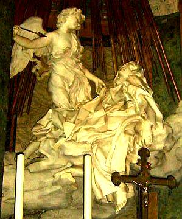 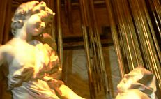 
Berninis Teresa von Avila - Gesamt und Detail (Foto 14.7.06, K. Fischer) Mit künstlerischen Mitteln gestaltete Bernini die mystischen Freuden göttlicher Liebe bei der Skulptur St. Teresas von Avila in Sta. Maria della Vittoria in Rom als leibliches Hochgefühl bis in die letzte Gewandfalte und -spalte, die fruchtbar schwellende Beziehung wohl zwischen Barberinipapst Urban VIII. und seinem erst beglückten, dann schwangeren und schlußendlich gebärenden Schatz verewigte er an den Sockelwappen am Baldachin des Petrusgrabs, in gefälliger Form der saturnalisch grinsenden Gesichtsfaltung den Akt als solchen, im bienenbesetzten Wappenkörper die leiblichen Liebesfolgen tiefsinnig preisend. Ein "must" für jeden aufgeweckten Rompilger. Schon erstaunlich, wovor die Päpste beten. Dieser Barberini-Papst, als Kardinal der Freund und Förderer des Galilei, hetzte dann vom Petersstuhl die Inquisition auf ihn - mit den bekannten Folgen. Galileis Argumentation, daß "die Bibel uns lehrt, wie wir in den Himmel kommen, aber nicht, wie die Himmelskörper sich bewegen", konnte den erzwungenen Widerruf seiner Erkenntnisse nicht verhindern. Daß den unter teils von Eltern (Galilei schickte beispielsweise seine beiden unehelichen Töchter ins Kloster, um Mitgift zu sparen) und Vormündern zu verantwortender Entsagung leidenden Klosterinsassen beiderlei Geschlechts die Freuden der Liebe in vielen Formen verteufelt oder vergöttlicht erschienen, bescherte jedenfalls den Künstlern, die nach St. Augustinus aus der "ewgen Schönheit Maßstab und Urteil (nehmen und ausgießen) an schwächend trügerische Süßigkeiten", beste Auftragslage. Ihre optische Aufhübschung der dabei benutzten Maler-Modelle zu verführerischen Anschmachtvorlagen kam den heute bei den an Alterskrisen oder Selbstzweifeln erkrankten Damen mehr und mehr beliebten Schönheitsoperationen verblüffend nahe und kann im Falle der Auftrags-Porträtkunst vielleicht ebenso lukrativ wie die Arbeit eines von den Frauen begehrten Schönheitschirurgen gewesen sein. 

In den der wirklichen Kunst gewidmeten [Museen der Welt](8museum.md) und den [klassischen Kunstbüchern](8buch24.md#hungrig) können wir als Kunstliebhaber und Kunstkenner deren Wirkung auf das empfängliche Gemüt recht gut nachvollziehen. Den "Bekenntnissen" Augustins und seiner Nachkommen sind überraschendste Formen der Gefühlsgestaltung zu entnehmen, auch die berümte Mystikerin Theresa von Avila machte davon keine Ausnahme: "Für schwache Weiblein, die wie ich nur geringe Stärke besitzen, scheint es mir allerdings angemessen zu sein, wenn sie der Herr mit Wonnegenüssen unterstützt. ... Es ist auf wie auf Erden zwischen zwei Personen, die einander sehr lieben. ... (Es) wandeln auf dem Wege wahrer klösterlicher Vollkommenheit so wenige, daß Ordensmann oder Nonne ... die eigenen Hausgenossen mehr zu fürchten haben als alle höllischen Geister zusammengenommen." Die detailfreudigen Beschreibungen des Verkehrs mit teuflischen Gestalten und dem fleischlichen Rest der Beschneidung Christi sollen hier nicht Gegenstand der Erörterung sein, auch wenn sie die darstellende Kunst mit ihrem Versteckspiel erotischer Details in faltigen Gewändern und schiebenden Wolkengebirgen noch so befruchtet haben mögen. Nach dem heiligen "Beda Venerabilis" (angeblich 672-735) wählten viele Männer "das Klosterleben nur, um von allen Staatsdiensten befreit zu werden und ungestörter ihre Lüste befriedigen zu können. Diese sogenannten Mönche befolgen nicht nur selbst kein Gelübde der Keuschheit, sondern sie mißbrauchen sogar die Jungfrauen, welche die Gelübde getan haben." Dies wird ihnen bei den lange gebräuchlichen "Doppelklöstern" keine allzugroßen Schwierigkeiten bereitet haben, die der sündigen Begierde der Klosterinsassen als qualvollste Folterstätte galten, wie dies Jaques Dalarun in "Erotik und Enthaltsamkeit, Das Kloster des Robert von Arbrissel" (Frankfurt a.M. 1987) verdeutlicht. Dabei spielte die leitende Rolle von Nonnen, die vorher dem städtischen Frauenhaus entrissen sein konnten, eine besondere Rolle in der Demütigung der mitwohnenden Mönche, von Dalarun "perverse Wirkung der Askese" genannt. Allerdings machte auch hier die Kirchenhierarchie keine Ausnahme, ein Kardinal Albrecht II. von Mainz (1514-1545) ließ seine Liebsten Käthe und Ernestine von Dürer als Loths Töchter, Käthe von Grünewald als "St. Katharina in der mystischen Ehe" und Ernestine von Lukas Cranach als "St. Ursula" mit dem Kardinal als "St. Martin" verewigen. Ein besonders sinnenfroher Auswuchs der frommen Liebe war dann die Angebetete des erzkatholischen Erzbischofs Albrecht von Magdeburg, die er auf einer Prozession im Reliquienschrein als "lebendige Heilige" herumtragen ließ. Kunst und Liebe waren immer gut für heimlich heilige Freuden, dies erweist auch die sinnenfrohe Betrachtung der verehrungswürdigsten Kultbilder. Die Monderlebnisse im Sonnenjahr mit 24 Voll- und Schwarzmondphasen könnten auch die kultischen Alphabete mit 24 Buchstaben befruchtet haben. Für die Runen, die auch griechisch und altitalischer Schrift Formen gaben, zeigte Gerhard Heß 1993, daß ihre von hinten beginnende Zuordnung zu diesen Mondphasen nach der Winterwende zur Deckung ihrer Kultbedeutung mit den Kalenderfesten des Heidentums führte, der chaldäische Mondname "EN.ZU - Herr der Weisheit" mag das bestätigen. Zu beachten ist auch die frühere Verwendung der Buchstaben als Zählzeichen, die ihnen sicher Bedeutung bei der Kalenderzählung verliehen. Im kreisbogenförmig gebauschten Tuch der Gottheiten (z.B. Luna/Phöbe/Selene/Sol) wurde Mond und Sonne in der Spätantike oft verschlüsselt, neben Kreisscheiben in Trinkschalen und ähnlichen Rundobjekten, mit der Sterngötter und Wiedergeburtshoffende oft bezeichnet wurden. Der römische Clipeus (Rundscheibe, in der Büste erscheint) wies so mit Tondobild (Rundrahmen), Heiligenschein und der zuerst im Serapäum Alexandriens getragenen Tonsur auf Verstirnte. Die Vollmonderscheinung wurde auch als geneigtes Haupt aufgefaßt, das Bamberger Tympanon zeigt es als Bischofshaupt von seinen zwei sichelförmigen Händen getragen. 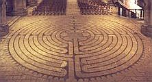 Die das Himmelsgeschehen dominierende Sonne und ihre Laufeigenschaften wurden seit Urzeiten im Symbol der Spirale und Doppelspirale dargestellt. Ihr im Sommerhalbjahr täglich breiter werdender Bogen am Südhimmel wird so - verbunden mit den nächtlich durch die unsichtbare Unterwelt angenommenen Laufbögen - zur geschlossenen Spirale. Der abnehmende Sonnenbogen im Winterhalbjahr wurde dann als gegenläufige Spirale angehängt.Damit erklären sich die vor allem in der Bronzezeit beliebten Schmuckspiralen, die am Arm getragen wurden und auch für sonstige Schmuckgegenstände und als Grabbeigabe gerne als Wiedergeburtszeichen verwendet wurden. Auch die als spiraliges Labyrinth konstruierten sogenannten Trojaburgen - vorwärts und rückwärts abgelaufen bzw. durchtanzt können damit als Zeichen der ewigen Wiederkehr bezeichnet werden und fanden in auf Fruchtbarkeit und Auferstehung zielenden Kultritualen ihre kosmo-logische Anwendung. Auch in den gotischen Kathedralen finden sich noch die Trojaburgen als rituell benutzte Labyrinthe auf dem Boden. Auf der Webseite [ Labyrintos](http://www.labyrinthos.net/) gibt es schöne Beispiele der Sonnen-Labyrinthe durch die Jahrtausende, und hier schöne Doppelspiralen, richtigerweise als Sonnenlaufsymbol erkannt: [Dieter Braasch: Spiralen als Symbol der Sonnenbahn](http://www.braasch-megalith.de/). 

Da der Mond ebenso diesen spiraligen Laufgesetzen folgt, könnte selbstverständlich auch er sozusagen parallel als Spiralsymbol verwendet worden sein. Da sein Lauf interessanterweise dem der Sonne in zweifacher Hinsicht diametral entgegengesetzt ist - er erscheint zur Nachtzeit, die Sonne am Tage, er hat seinen niedrigsten Zenithpunkt im Sommer und den höchsten Bogen im Winter, die Sonne dagegen im Sommer mit höchstem Punkt an der Sommersonnenwende - kann auch dieser Gegensatz der Ausgangspunkt der beliebten Doppelspirale gewesen sein. Wenn nun der am Sonnwendtag "Johanni" geköpfte Johannes der Täufer / Johannes Baptist als Vertreter der Himmelssonne von dem den Mondgesetzen folgenden Sohn Gottes Jesus Christus sagt: _"Der aber, der nach mir kommt, ist stärker/mächtiger/größer als ich"_ (Matth. 3.11, Joh. 1.15), ist damit auch ein Hinweis gegeben, daß der Mond in seinem jährlichen Himmelslauf mit seiner Wintermondwende zur Weihnachtszeit einen um genau einen Sonnen- = Monddurchmesser höheren Zenithpunkt erreicht, als die Sonne. Dem Mond zugeordnet wurde das Tierkreiszeichen Krebs - nach den Neuplatonikern das Himmelstor, aus dem auferstandene Seelen in neugeborene Körper treten. Vorher durchschritten sie die vom wehrhaften Jupiterschützen verschlüsselte Himmelspforte, erwarteten in der Milchstraße Wiedergeburt und ließen nach dem Totengericht die Torhüterzwillinge hinter sich, eine Umformung chaldäischer Tor- und Wiedergeburtsspekulation, die auch kommende Geschlechter noch zu fesseln vermochte. Interessanterweise sitzt das dem Mondgott zugeordnete Krebssternbild zur Rechten des Sonnengottes und seinem Löwensternbild im himmlischen Sternbilderreigen. Das Krebstier vermag als "Taschenkrebs" in seiner runden Panzerform und als Flußkrebs mit seiner Panzerzeichnung an die Vollmonderscheinung erinnern, als Einsiedlerkrebs kann sein Verschwinden im Schneckengehäuse als Verkörperung der Neumondphase gedacht werden, der jährliche Panzerwechsel verweist wie die Schlangenhäutung neben seiner Lebensweise als Aasfresser auf Wiedergeburtsqualität. Als Sternbild der Sommersonnenwende verbindet er die scheinbare "Rückbewegung" der Sonne mit der rückläufigen Krebsgangart und weist so auch auf die Verwandschaft der beiden Himmelskörper. Die gegenläufig auf- und absteigende "Spiralbahn" der Sonne - auch im o.g. Schneckengehäuse erkennbar-versinnbildlicht auch das astrologische Krebszeichen der liegenden 69. Der Mondkrebs in seiner alternativen Skorpionform als Doppelsymbol des männlichen und weiblichen Geschlechtsorgans wird der ägyptischen Göttin Selket/Selkis zum Attribut, in dem sowohl ihre Eigenschaft als Wächterin eines der 4 Unterwelttore (= Kardinalpunkte), aus denen der lebensspendende Nil entquillt, wie auch als Fruchtbarkeitsgöttin verdeutlicht sind. Auch ihre Doppelbeziehung zum Sternbild Hydra als Krebsnachbar in den Gestalten der Apohisschlange und ihrem Gemahl Nechebhau, ein Schlangengott mit menschlichen Gliedern, verkörpert ihren astronomischen Standort. Der Hydradrachen ist dabei ein Verwandter des Nilkrokodils. In dessen Eigenart, die frisch geschlüpften Jungen im Maul zu bergen um sie vor Feinden in Sicherheit zu bringen und sie erst später wieder daraus entschlüpfen zu lassen, liegt möglicherweise der Ursprung entsprechender Bestienkopfgeburten, die als Mondsymbolik vor allem die mittelalterliche Bildwelt bereichern. In der Darstellung am Kanopenschrein des Tutanchamun benutzt Selket den Skorpion-Krebs in Dildoform als Kopfschmuck, bei der mystische Hochzeit des Gottes Amun in Gestalt des Thutmosis IV. mit dessen Gemahlin Mutemwia stützt sie das sich vereinigende Paar, auf der Reise des Sonnengottes Re durch die Unterwelt tritt sie am Kopf der bedrohlichen Apophisschlange auf, dort kann sie mit Mondsichelmesser auch zur göttlichen Katze werden, die den Schlangenkopf abtrennt. Letztere Erscheinungsform leiht sich die Gestalt des benachbarten Sonnenlöwen, hier findet das seit der Antike beliebte Löwenpaar im Eingangsbereich vor Kulträumen als Verkörperung von Sonne und Mond unter Bezugnahme auf die Sternbilder Löwe, Krebs und Zwillinge seine kosmologische Erklärung. Die Ausdeutung der Zwillingslöwen als Versinnbildlichung von Tod und Wiedergeburt im kosmischen Rahmen kann durch Beifügung eines weiteren Tiers - oft des den Frühlingspunkt vertretenden Widders - zwischen die Löwenfänge noch gesteigert werden. Die den Krebs vertretende Mondkatze vermag auch als schwarzer Panther im Gefolge von Mondgottheiten oder wie im Tutanchamungrab als Leopard mit dreipaßförmigen Fellflecken zur Interpretation der Monderscheinung auftreten. So vertritt auch der romanische Dreipaß den Mond in seinen Erscheinungsformen, der Vierpaß charakterisiert die Sonne mit ihren vier Kardinalpunkten der Wenden und Gleichen. Im Kultbild der Veronica zeigte sich der Mondkrebs auch neben dem Schweißtuch verschlüsselt. Hans Memling vereinte das vorwitzige Tierchen so mit der Venus-Hydra-Schlange, daß nach Bilddrehung belebte Mantelgesichtsfaltenschlangen und in dunkle Erdspalten steinhart eindringende Felsglieder Gewandschamröte verursachen und nach Vorgaukelung von Knieein-, Krebsbe- und Bodenverdeckung auch im Halsausschnitt vielfältige Entdeckerfreuden deckten. Das Zusammenspiel von Röhrenfalten mit geschickt drapierten Tuchkniffen ist sowohl im Skulpturgewand als auch in den Gewandungen der Gestalten in Zeichnung, Druck- oder Tafelbild zur Formgebung der Gliedmaßen des Krebses geeignet und vielfach nachweisbar. Auch im Leichentuch Christi oder seinen hellen Umhängen als Hirte darf man nun also auf Suche gehen - nach Krebsen, nach Mondgesichtern, nach hartgeschwollenen Eindringlingen in lippige Faltungen - eine nicht ganz scherzfreie Augentäuschung darf hier erwartet werden. Daß solche Spielereien in langer Tradition stehen, läßt auch Platon (Politeia, 602 ff) vermuten, im scharfen Gegensatz zu "seiner" erkenntnistheoretischen Rechtfertigung der erotischen Sinnenfreude der Malerei: _"Täuschungen, die dem Auge durch die Farbe entstehen" vorwirft, als "große Verwirrung in unserer Seele, auf welche Beschaffenheit unserer Natur dann die Schattierkunst lauert und keine Täuschung ungebraucht läßt ..., (womit) die Malerei und die Nachbildnerei überhaupt, wie sie in großer Ferne von der Wahrheit ihr Werk zustande bringt, so auch mit dem von der Vernunft Fernen in uns ihren Verkehr hat, und sich mit diesem zu nichts Gesundem und Wahrem befreundet ... Selbst also schlecht, und mit Schlechtem sich verbindend erzeugt die Nachbildnerei auch Schlechtes."_ Der menschlichen Seele ist diesbezüglich auch wenig zuzutrauen. Platon (Timaios, 79) macht einen sterblichen Seelenanteil aus, der "_gefährliche und der blinden Notwendigkeit folgende Eindrücke aufnimmt, zunächst die Lust (!), die stärkste Lockspeise des Bösen, dann den Schmerz, den Verscheucher des Guten, fernerhin Mut und Furcht, zwei törichte Ratgeber, schwer zu besänftigenden Zorn und leicht verlockende Hoffnung, endlich verbanden sie (die vom Weltenbaumeister erzeugten Göttersöhne, die die sterblichen Menschen "bewerkstelligen") mit ihr vernunftlose Empfindung und Wahrnehmung und allunternehmende Liebe, der Notwendigkeit gemäß ... (diesen Teil der Seele) verlegten sie in den Raum zwischen Zwerchfell und der Nabelgegend, nachdem sie gleichsam eine Krippe in dieser ganzen Räumlichkeit für die Nahrung des Körpers angefertigt hatten, und banden denn jenes (Seelen-) Wesen hier an, wie ein wildes Tier ..."_ - doch zurück zu den Sternen und ihrem kosmischen Theater. Die beiden Zentralsterne im Krebs, antik Aselli - Eselchen, dazwischen sein Sternnebel (M 44), antik Praesepe - Krippe, mit dem Himmelshirten Orion und Nachbarn Stier-Ochs, Widder-Schaf, den Zwillingen als Engelchen bzw. Josef und Maria sowie der Jungfrau dürfen so sinnreich den biblisch allerdings nicht bezeugten Stall Bethlehems unter dem Ekliptikbogen zur Zeitenwende um das Jahr 1 beleben. Matthäus weiß lediglich von "einem Haus" und Lukas schreibt, daß man den Neugeborenen in eine Krippe legt, da sonst kein Raum in der Herberge war. Die beiden anderen Evangelisten schweigen sich zur Geburt aus. Zieht man das sogenannte Protoevangelium des Johannes als Beleg heran, das "Origines" (konventionell etwa 185-254 n. Chr.) als Werk des Herrenbruders ansieht, wird die Geburtslegende etwas anders und im Detail geschildert.

Einschub "Ekliptik": 

Sonnenbahn, Sonnenweg (Solveig), Projektion des von der Erde sichtbaren "Laufs der Sonne durch die 12 Sternzeichen" an den Himmelsglobus, ihre Bahnkurve bildet gegenüber dem Himmeläquator als gedachte x-Achse eine liegende S- bzw. "Sinuskurve". 

Im über der Äquatorachse gelegenen oberen Bogen ist der sommerliche Sonnenlauf, im unteren Bogen das Winterhalbjahr. Vgl. hierzu die aufschlußreichen [Abbildungen von Dr. Papke in seinem lesenswerten Aufsatz "Mithras oder Jesus? Ostern im Zeichen des Tammuz"](http://www.bibelcenter.de/bibliothek/papke/mithrasp.htm) 

Die Schnittpunkte der Sonnenbahn mit dem Äquator stehen für die Frühlings-Tag-und-Nacht-Gleiche beim Eintritt in den oberen Bogenabschnitt, für die Herbst-Tag-und-Nacht-Gleiche beim Eintritt in den unteren. 

Der Gipfelpunkt des oberen Bogens ist der Sonnenstandort zur Sommersondenwende, der "Talpunkt" des unteren Bogens die Wintersonnenwende. 

Auch der Mond und alle Planeten ziehen gleichsam ihre Bahn mit nur geringen Abweichungen im Ekliptikbereich - astronomisch begründet durch ihre nahezu auf einer gedachten "Scheibe" im Weltall gelegenen Umlaufbahnen um die Sonne. 

Die drei "Gipfelsternbilder" der Ekliptik: Krebs - Mondhaus, Löwe - Sonnenhaus und Jungfrau - Merkurhaus, aber auch Stellvertreterin der Venus und mit dem kleinen Sternbild Corvus/Rabe, seit altersher auch als "Taube" bekannt - eng benachbart und damit "seelenverwandt" bzw. als Stellvertretung in der höheren kosmologischen Rätselkunst bedacht - bilden auch das antikisierend-christliche theologische Konzept der geheimnisvollen/mystischen himmlisch-göttlichen Dreieinigkeit / Triniät / Göttertrias in perfekter Weise am Himmel ab: 

Vater im Himmel (Löwe/Sonne), Sohn (Krebs/Mond) und Heiliger Geist (Geist-Taube/Sophia/Jungfrau und Merkur - den antiken Religionen bestens bekannt als Spender und Patron von Wissenschaft, Schrift und Sprache) bzw. "himmlischer Vater, Sohn und Gottesmutter Jungfrau Maria". 

Selbstverständlich ist diese geradezu unerbittlich kosmologische Logik und Ordnung den gelehrten griechisch-neuplatonischen Kirchenvätern immer bewußt gewesen und vor allem in ihrer trinitarischen Beziehungslehre und Lichtmystik (bis heute nachwirkende Gleichsetzung der göttlichen Naturen in Gebeten, Liedern und theologischen Texten als "Himmelswesen" bzw. Sonne(nschein), Stern und Licht) immer präsent. Dazu im logischen Gegensatz die Wesen der Unterwelt als "gefallen Engel", Dämonen bzw. - kosmologisch/astronomisch - die den unteren Ekliptikbogen bevölkernden Sternbildvertreter. Schauen Sie bitte selbst mal nach, wo sie den bocksfüigen Steinbock, Stellvertreter des dem Jupiter zugeordneten Hirtengott Pan und des "Fürsten dieser Welt" auf dem Sonnenweg antreffen. 

Daß ihre geradezu hochradig spannenden Texten von allzuwenigen modernen "Theologen" noch ausreichend studiert und damit verstanden werden, ist bestimmt nicht die Schuld der Kirchenväter - gepriesen seien ihre Namen ... 

Ein kleines [Beispiel aus dem Exameron](http://www.unifr.ch/bkv/kapitel543-1.htm), des dem Ur- und Haupt-Kirchenvater Ambrosius von Mailand zugeschriebenen All-Erklärungswerk sei zitiert, um hier zu verdeutlichen. Im 32. Unterkapitel aus "Der vierte Tag. Sechste Homilie. (Gen 1,14-19), VIII. Kapitel" werden wir in die vielfältigen theologisch-astrologischen Entsprechungen des Mondes wie folgt eingewiesen: 

_"Beurteile also den Mond nicht nach dem leiblichen Auge, sondern mit dem klaren Blick des Geistes!. Der Mond nimmt ab, um den Dingen ihre Fülle zu geben. Das ist nun ein großes Geheimnis. Dem verdankt er das, der allen Dingen ihre Ausstattung verliehen hat. Jener entäußerte ihn, daß er diese Fülle spende, der auch sich selbst entäußert hat, um alle Dinge zu erfüllen. Er hat sich nämlich entäußert, um für uns herabzusteigen, um für alle aufzufahren; denn "aufgefahren, so heißt es, ist er über die Himmel, damit er alles erfülle". Er also, der in Selbstentäußerung erschienen, hat aus seiner Fülle die Apostel erfüllt. Darum versichert einer von ihnen: 

"Denn aus seiner Fülle haben wir alle empfangen". 

So kündete also der Mond das Geheimnis Christi an. Nichts Geringes ist er, in welchen Christus sein Zeichen setzte; nichts Geringes, der ein Bild der geliebten Kirche darstellt. Das zeigte der Prophet mit den Worten an: 

"Aufgehen wird in seinen Tagen die Gerechtigkeit und des Friedens Fülle, bis weggenommen wird der Mond". 

Und im Hohen Liede spricht der Herr von seiner Braut: 

"Wer ist doch die, welche hervorschaut wie das Morgenrot, herrlich wie der Mond, auserlesen wie die Sonne?" 

Und mit Recht gleicht die Kirche dem Monde: Auch sie leuchtet der ganzen Welt und ruft, die Finsternis dieser Welt aufhellend, aus: 

"Die Nacht ist vorgerückt, der Tag hat sich genaht". 

Sinnig heißt es: "welche hervorschaut", als blickte sie von der Höhe auf die Ihrigen herab. So heißt es ähnlich: 

"Der Herr schaut vom Himmel auf die Menschenkinder". 

Auch die Kirche nun, die hervorschaut, hat wie der Mond ihre oftmalige Abnahme und Zunahme, aber auf ihre Abnahme wuchs sie und verdiente sich neuen Zuwachs: die Verfolgungen bringen ihr Verlust, das Martyrium der Bekenner Siegeskronen. Sie ist der wahre Mond. Vom unvergänglichen Lichte ihres Brudergestirnes borgt sie das Licht der Unsterblichkeit und Gnade. Denn die Kirche leuchtet nicht im eigenen, sondern im Lichte Christi und entlehnt ihren Glanz von der "Sonne der Gerechtigkeit", so daß sie sprechen kann: 

"Ich lebe aber: nicht mehr ich, es lebt aber in mir Christus". 

Selig wahrlich [o Mond], der du so großer Auszeichnung gewürdigt wardst! Selig möchte ich dich preisen nicht wegen deiner Neumonde, sondern als Typus der Kirche. In ersterer Beziehung bist du ja nur unser Diener, in letzterer unser Liebling."_ 

Soweit der gute alte Ambrosius, einer der gelahrtesten Kirchenlehrer seiner Zeit und auch heute noch mit großem Genuß und Gewinn zu lesen. Hier können Sie nachlesen, was der wirkmächtige Mailänder dem Mond sonst noch so alles an hegendem Einfluß auf die Samen, Fruchtspende und feuchten Ergüssen im allegorischen Vergleich mit unserem Herrn Jesus Christus zugeschrieben hat: [VII. Kapitel. Der Mond, der Genosse und Bruder der Sonne, tautriefend und tauspendend ...](http://www.unifr.ch/bkv/kapitel542.htm) 

Weitere einleuchtende Beispiele aus den Kirchenvätern: 

[Astralmystik bei Clemens von Alexandrien, Stromateis](http://www.unifr.ch/bkv/kapitel248-5.htm) ff. 
[Theophilus von Antiochien an Autolykus (Ad Autolycum) zur Analogie Auferstehung und Mond](http://www.unifr.ch/bkv/kapitel293-12.htm) 
[Leo der Grosse, Sermo XXXIV. 4. Predigt auf Epiphanie, Manichäische Verehrung Christi im Mond](http://www.unifr.ch/bkv/kapitel330-3.htm) 
[Augustinus, Gottesstaat, 18. Buch 32, Gleichsetzung Sonne/Mond - Christus/Kirche bei Habakuk](http://www.unifr.ch/bkv/kapitel1936-31.htm) 

Dem augenweidenden Bilderfreund erschließt sich diese Theo-/Astro-Logik zunächst auf der Ebene der astronomisch deutbaren Attribute und sonstigen Merkmalen der kirchlichen / sakralen Bilderwelt und bietet damit einen sinnenfreudigen / sinnlichen Einstieg in die "übervernünftige" Welt der himmlischen Dinge. 
Dort bringt Joseph Maria auf einer Eselin (Aselli im Krebs?) auf einen Hügel (oberer Ekliptikbogen?) außerhalb von Bethlehem, findet dort eine Höhle (Bereich unter dem Ekliptikbogen?) und bringt das Kind (Neumondsichel, Mond-Haus im Krebs?) zur Welt. Danach tritt eine Zauberin namens Salome auf, die bei Annäherung an den Jungfrauenkörper zur Untersuchung ihre Hand verbrennt, durch Aufnahme des Kindes jedoch wieder geheilt wird, ob auch diese bildhafte Schilderung des Geschehens auf Himmelserscheinungen verweist, erscheint möglich, die Beziehungen zwischen Mars, Venus, Mond, Krebs und Jungfrau im Jahre 6 v. Chr. - heute in einer Astrologiesoftware leicht nachstellbar und jedermann zur weiteren Aufklärung empfohlen - ließen sich auch so umdeuten. Fazit: Die in der Jungfrau stattfindende "Jungfrauengeburt" der Neumondsichel drei Tage nach Verschwinden des Schwarzmondes im (nach Platon) Wiedergeburtssternbild Krebs ist also eine genau Beschreibung der Geschehnisse auf dem Sonnenweg - denn der in seinem "Hause" Krebs "gestorbene" und dann "in der Ekliptikhöhle zu Grabe getragene" Mond muß immer nach drei Tagen in der Jungfrau wieder auftauchen. Dazu braucht es keinen Glauben an Widernatürliches. Bei Martin Kerner: "Das goldene Venus-Zepter von Bernstorf" in Zeitensprünge 1/2007, S. 15, findet sich folgende Beschreibung zur religiösen Interpretaion des Mondlaufes als Auferstehungsphänomen: 

_"Im hellen Osten, wo das Paradies liegt, verschwindet der Mond und kommt danach als junger neugeborener Mond im Westen, wo das Reich der Toten liegt, erneut zum Vorschein. Darin liegt der religiöse Gedanke der Auferstehung begründet."_ Im wortwörtlichen Einklang mit dem Himmelsgeschehen und alttestamentarischen Visionen (Sacharja 9.9) erscheint auch der Einzug Jesu durch das Jerusalemer Stadttor bei Matthäus im 21. Kapitel: Jesus sendet zwei Jünger (Zwillinge neben Eselssternbild Krebs) nach zwei Eseln (Aselli im Krebs), um darauf nach Jerusalem (auch noch im Mittelalter Symbolname der himmlischen Stadt) einzuziehen (als Mondgott durch das Krebstor?). Im Bamberger Tympanon täuschen Krebsscheren in der Hand der Kreuzträgerin ein Scherenwerkzeug vor, in deren Gewand formen sie den Faltenwurf in allen Dimensionen, auch der vollmondrunde Körper des Taschenkrebses ist hier zu finden und in ihrer Mondsichelgestalt wollen sie sogar Mandorlarahmen des Christusrichters sowie Begleitattribute des rechts von Christus geneigten Mondkopfes sein. Bei Hesekiel wurde das Eselsorgan als Symbol übersteigerter Geschlechtsbrunst neben sonstig beliebten Bräuchen beschrieben. Voraussichtlich der eselsköpfige Bruder des Osiris Seth wurde auch als gekreuzigte Gottheit verehrt, wie aus der ersten erhaltenen Kruzifixdarstellung, wohl aus dem 3. Jh.n.Chr., auf dem Palatin in Rom hervorgeht. Ein beigeschriebenes Y symbolisierte dabei auch Anwesenheit der Jungfrau/Venus - es entsprach der sumerischen Schreibweise für die Sterngöttin, ein Mutterschoßbild. In den abgewinkelten Y-Armen erscheint auch die Doppelnatur der Venus als Morgen- und Abendstern sowie als Jungfrau mit Waage. Durch seine Nähe zu anderen Sternbildern wie Hydra, Mischkrug, Zwillinge und Schiff erhielt der Krebs weitere Stellvertreter in Drachenbestie, Kelch (darin manchmal Hydraschlange), Quelle oder Brunnen mit Wasser des Lebens, aus dem Sonne-Mond-Tierzwillinge trinken konnten, ebenso als Totenschiff/germ. Naglfar, nutzbar auch von den verstorbenen Pharaonen unterwegs zur Insel der Seligen auf dem Gipfelbereich der Ekliptikkurve. Das Bild des schlangenhalsigen Sonnen-Reihers, der seinen Kopf in den Mond-Wolfsrachen (= Prokyon/Kleiner Hund) oder einen Krug steckt, verarbeitet ebenfalls diese Konstellation als Symbol für die Sonnenfinsternis mit Wiedergeburtssinn, noch heute will unser Klapperstorch als Reihernachfolger die Geburt bewirken und Menschenfrösche aus dem Wasserteich des Lebens ziehen. Die Beziehung der Mondsichel zum 8-strahligen Venusstern, auch auf Isisaltären zu sehen, wurde mit dem 5-strahligen Mars (Islam) ein Heerzeichen mit dem Krummsäbel. Auch die Jungfrau auf der Hydraschlange und Mondsichel offenbart diesen Bildungshintergrund aus ältesten Kultbildtraditionen der Sterngötterverehrung. In den Mond- und Sonnenfinsternissen sah man früher auch ein erschreckendes Wirken der Krebs (Hydra"krokodil")/Skorpion (Wolf)-Drachen, die die Himmelskörper verschlucken und wieder ausspeien. Sie erscheinen z.B. am St. Jakobsportal in Regensburg neben den anderen Zodiakzeichen und -göttern der Heidengermanen, die dort im rätselhaften Sinn vereinigt wurden. Die Bildtradition des feuerspeienden, z.T. mit Feuerkugeln bewaffneten Schlangendrachens läßt sich nach Alexander und Edith Tollmann (Und die Sintflut gab es doch - Vom Mythos zur historischen Wahrheit, 1993) als Umsetzung der Himmelserscheinungen etwa 7550 v.Chr. deuten, ein in Bruchstücke zerfallener Kometeneinschlag in den Ozean soll damals eine Weltverfinsterung und die Sintflut ausgelöst haben. Sein Feuerschweif und seitliche Ausgasungen wurden dann im Drachenbild vieler Kulturen und entsprechenden Legenden bewahrt, die Edda (Völuspa, 51 ff.) kündet von ihm: _"Surtur fährt von Süden mit flammendem Schwert, von seiner Klinge (Schwanz) scheint die Sonne der Götter. ... Schwarz wird die Sonne, die Erde sinkt ins Meer, vom Himmel verschwinden die heitern Sterne. Glutwirbel umwühlen den allnährenden Weltbaum (Milchstraße?), die heiße Lohe bedeckt den Himmel. Da sah ich auftauchen zum andernmale aus dem Wasser die Erde und wieder grünen. Die Fluten fallen, darüber fliegt der Adler, der auf dem Felsen nach Fischen weidet (die nahen Sternbilder Adler und Fische?)"_ Sonne und Mond werden nach der gemanischen Mythologie von den Abkömmlingen des Fenriswolfs Sköll und Hate, zwei entsetzliche Wolfsdrachen verschlungen, die Finsternisse wurden als teils gelungene Versuche gesehen. Mutter dieser Gestalten ist Gyge, ein Riesenweib im Walde Jarnwidr, wohl verwandt mit Gyges/Gyas, ein hundertarmiger griechischer Riese, Sohn der Erdgöttin Gäa und des Uranus. Auch Skarabäus, Schildkröte, Kröte, Frosch und Eber/Schwein (Sichelzähne und -kamm) konnten das rundliche Krebsgestirn beleben, seine Scheren wurden wie auch das Sternbild des Orion umgeformt zum Geweih des Hirsches, der am Baum des Lebens/Milchstraße äste, immer mit Tod und Wiedergeburtshoffnungen verbunden. Der Milchstraßenbaum - ein häufiges Kultbildmotiv in Verbindung mit dem Hirten Orion/Merkur erhielt im z.T. mit 23,5 Grad geneigten Ekliptik- bzw. Weltachsenbaum sein Pendant. Paradieslebens- und erkenntnisbäume sowie Hydraschlange, Apfel/Krebs-Mond, Adam, Eva (Zwillinge) und Vatergott Jupiter-Löwe ließen sich in der Schöpfungslegende auch im sternenkundlichen Sinn ausdeuten. Im Kampf mit dämonischen Ebern wurden Wiedergeburtsgötter zu Helden, Herkules bezwang, Adonis wurde getötet und Jesus verbannte böse Geister in Schweinen, die im Meer dann umkamen. In der griechischen Mythologie war das Mondantlitz zuweilen als brüllender, zungenstreckender und manchmal trunkener Lärmer auslegbar, der auch im Haupt der Gorgo, den abgeschlagenen Köpfen der Medusa, eines Holofernes, Johannes oder St. Dionys/St. Denis sowie im Veronikatuch mythologische Verbildlichung fand. Hierher könnte auch die Figur der Salome der o.g. Variante des Geburtsgeschehens Jesu deuten. Der Vollmond wurde auch zum Stein, den in weiße Windeln gewickelt Kronos anstelle des Zeus fraß, oder der als göttliche Waffe gegen Titanen oder von Demeter als Grabstein auf Askalaphos geworfen wurde bis ihn Herakles von ihm hob. Kadmos tötete mit einem Stein den quellbewachenden Höhlendrachen (Hydra), als Verwandlungsprodukt der Sterngöttin/Asteria fiel ein Stein ins Meer und verwandelte sich in eine Insel, die der zeusgeschwängerten Leto als Geburtsstätte diente. Von Sisyphos wurde ein Stein in der Unterwelt vergeblich in die Höhe (des Ekliptikgipfels) gewälzt , von Amphions Spiel mit der "7" -saitigen Leier betört ordneten sich die Steine selbstständig zu den 7 Toren Thebens, Perseus bekämpfte mit Steinwürfen den eberköpfigen Meerdrachen (Hydra), und Polydeukes (Zwilling) wurde von einem geworfenen Grabstein betäubt. Unter einem Grabstein lag der dienende Unterweltsdaimon Askalaphos, den Herakles davon befreit. Der schlangenumwundene Kultstein "Omphalos" wurde sogar zum Nabel der Welt. Theseus kämpfte mit Steinwürfen gegen die graue Sau/Phaia (Krebs) einer alten Frau (Hydra). Vielleicht erinnert an die herkulische Dämonenrettung auch Markus im Kapitel 5, der Christus aus einem Schiff (Sternbild nahe Krebs?) zu einem in Gräbern (unter dem Ekliptikbogen?) wohnenden "Besessenen" kommen läßt, der sich menschlichen Fesselungsversuchen "unzähmbar" widersetzt und steinewerfend (Mond?) auf den Bergen (Ekliptikgipfel?) herumschrie. Nachdem dieser sich als "Legion"(unzählige Menge der Monderscheinungen?) bezeichnet hat, gelingt es Jesu, ihm Teufel (benachbarte Hydrasterne) auszutreiben, die auf ihr Bitten in eine Herde Säue "an den Bergen" (Hydra/Krebs am Ekliptikbogen?) fahren dürfen, der geheilte Besessene durfte dann auf Geheiß Jesus in zehn Städten (Zehn Zodiakzeichen ohne Grab-Krebs und Berg-Löwe?) das Wunder verkündigen, ebenso wie die "Säuhirten" (Zwillinge und Orion?). Fruchtbar frohes Wachstum in Kultbildern des missionsreisefreudigen Mond- und Weingottes Dionysos aus Akanthus und Weinblättern, pflanzte sich bildhaft fort bei seinen Verwandten Frei/Fro mit Kopfaustrieb von Rankenwerk. Dionysos, der im (Stein -) Bock und Stier auch als Tiergott auftrat, wurden diese Tiere damit bevorzugte Kultopfer, die wie das jüdische Sündenbock-Opfer und das "Passahlamm" zum Frühlingsgleichenvollmond eine Sündenvertretung anstrebten. Das auf immergrünende Wiedergeburt weisende Efeuherz des Dionysos könnte auch als vierblättriges Kleeblatt zum glücksbringenden Jahreskreuz geworden sein. Ein im Adonis- und Osiriskult aussprossendes Wachstum aus dem Gottesleibsymbol (man bepflanzte Amphoren und Sarkophage), als Adonisgärtchen Karwochenbrauch Südeuropas, mag auch den Zweigen in Bildern des Stammbaum Jesses zur Sprossung verholfen haben. Frei/Fro und Freia, aus mittelalterlichem Kultbildmund fröhlich rankenspuckend von Schweden bis Italien, entsprachen römisch Bacchos/Liber und Libera (lat. liber-frei), deren freizügig liebevolle Geburtsfeste Mond- und Sonnenschicksal feierten, bei den Griechen war zu Neumond Fest des Apollon mit dem silberglänzenden Bogen. Wenn Dionysos in antiken Darstellungen mit der Mondgorgone, den saturnvertretenden Satyrn als "mystischen Zahlenverwandten", dem Krater-Henkelgefäß als Krebssymbol und seinem Efeubekränzten Thyrsosstab auftritt, wird darin ein anspielungsreiches Kosmologieprogramm umgesetzt. Die uns herzförmig erscheinenden Efeublätter bilden dabei die Dreiheit der männlichen Zeugungsorgane ab, eine Interpretation, die schon in der ägyptischen Grabkunst immergrün wiederkehrende Lebenserzeugung verkörpert und auch dem von Amors Pfeil durchdrungenen Liebesherz eine weitere Sinnebene eröffnet. Im buddhistischen Kulturkreis, der im Kulturaustausch chaldäische Glaubens- und Bildformen bis in den fernen Osten vermittelt (vgl. Baltrusaitis, Das phantastische Mittelalter, 1985) trat die Krebsschildkröte auf als Kalenderträgerin, Hoheitszeichen der Wiedergeburt und Erinnerung an die Schildkrötenleier des Sohns der Plejade Maia, Merkur, Botschafter der göttlichen Macht über Raum und Zeit. Die rückwärtsgewandte Fortbewegungsart des Krebses gebar ihm als stellvertretende Familienmitglieder rücksichtsvolle Gestalten mit hinterrücks blickenden Auswüchsen oder sonstigen kehrseitig verkehrten Gesichtsbildungen, ebenso wie Einfüßler (Skiapode) mit rückwärtsgewandt schattenspendendem Fuß (St. Jakob in Kastellaz) oder den rückwärtsgewandten Ziegenkopf der von Bellerophon in Georgspose bekämpften Chimäre (vgl. röm. Wandmalerei der Kölner Domgrabung) , die ihren Löwenkopf und Schlangenkopfschwanz den benachbarten Sternbildern verdankt. Der krokodilsmäßige Wiedergeburtsvorgang durch den Krebs (das Krokodil und ein dickbäuchiger Nilfisch schützt, die Ägypter zu entsprechenden Auslegungen anregend, seinen Nachwuchs durch Verbergen in seinem Maul), als mystische "Kopfgeburt" verstehbar, wird heute gegenteilig als mörderischer Verschlingungsvorgang mißgedeutet. Dabei deutet der Gesichtsausdruck der "Geborenen" meist offen auf gegebenes Einverständnis mit dem verkehrten Geschehen und bestätigt diese Auflösung, die auch dem Halsausschnitt so mancher heiligen Jungfrau zu entnehmen ist. Auch scheinbar ein gerissenes Lebewesen unter sich begrabende Wächterlöwenpaare in der Portalarchitektur von Kultstätten wollen eigentlich die Beziehung Zwilling-Löwe-Krebs in himmlischer Bildsprache für Leben-Tod-Wiedergeburt versinnbildlichen und stellen so gängige Deutungspraxis entscheidend in Frage. Nun sind wir am Ende der Offenbarung offensichtlicher Rätsel im Kultbildgebrauch, die die nachfolgende Bilddeutung vielleicht nachvollziehbar machen. Dieser Hintergrund beleuchtet Kunstwerke mit bisher rätselhaft verborgenem, mystisch verklärtem oder mißgedeutetem Inhalt in neuem Licht, manche Sinnzusammenhänge des himmlischen Geschehens enträtselnd. Die Einsicht in göttliches Wirken in Raum und Zeit sowie Erlösungshoffen aus Seelenangst steht am Ausgangspunkt des begnadeten Wirkens an kultischer Kunst. Platon (Epinomis 991 ff.) versprach den Jüngern der Sternenkunde, daß es ohne ihre Kenntnis _"nie in einem Staate einen wahrhaft glückseligen Menschen gebe ... Wer aber dies (die zahlenabhängige Astronomie als Ganzes) Alles ... sich angeeignet hat, den allein nenne ich einen wahrhaft weisen Mann und versichere ... in ernster Lehre und im heiteren Scherz und Spiel der Dichtung, daß ein solcher, wenn er einst im Tod sein Schicksal erfüllen wird, gleich unmittelbar nach seinem Sterben nicht mehr vielerlei sinnlicher Wahrnehmung bedürfen, sondern einartig geworden und aus der Geteiltheit des Seins zur Einheit gelangt, wahrhaft glücklich, vollweise und selig sein wird, mag er nun diese Seligkeit auf Inseln oder festem Land genießen, und daß sie von ununterbrochener Dauer sein wird ... Denn denen, die von Natur göttlicher Art sind und Anlage zur Besonnenheit und jeder anderen Tugend besitzen und außerdem alle zur wahren Glückseligkeit erforderlichen (sternenkundlichen) Kenntnisse sich erworben haben ... diesen allein ist Alles, was Götter den Sterblichen gewähren können, in aller Fülle zu Teil geworden und steht ihnen fort und fort also zu Gebote."_ Der dazu notwendige Bildungshintergrund entstammte dem Quellenstudium der Neuplatoniker, die Erfinder und Schöpfer der Kunstwerke und ihrer Programme erschienen mittels Signatur oder im Abbild, meist ein Buch vorweisend. Stellvertreten durch den himmels- oder bauteiltragenden Atlas, den die Antike für einen großen Astronomen hielt, auch in St. Katharina, gekrönte Philosophia mit Radsymbol, oder dem Zeitengott Saturn bezeugten sie Kenntnis des Jahreskreisgeschehens und verbargen ihre Person gern im Bildrätsel unter dem Fischesternzeichen des Frühlingsgottes. Atlas verlieh auch dem Himmelsherrscher Coelus bildhafte Form, mittelalterlicher Interpretation der antiken Götterübertragung für christlichen Gebrauch, in Weiterführung der entsprechenden byzantinischen und ottonischen Bestrebungen, schuf dann das Gottesbild nach Coelus, die Evangelistenportraits nach Atlasbildern. Aus den als Himmelsrätsel begreifbaren Kunstwerken geht hervor, daß Rätselstellung und -lösung gebildete Schichten erfreute und regelrechtes Wetteifern in der Suche nach geistvollen Varianten des Themas bestand. Fast der gesamte Kunstbestand bis zur Neuzeit harrt noch kosmologischer Entdeckung durch sinnenfrohe Kunstliebhaber, ein ergiebiges Feld, das überraschendste Ergebnisse der Rätsellösung bereitstellt. Mit den im zweiten Teil dieser Abhandlung als Beispiel vorgestellten Kunstwerken mag das leichter nachvollziehbar werden, bei der Deutung wird der für unvollständig Ausgebildete präsentierte Sensus moralis, dem in den bekannten Kunstführern nachgegangen wird, nicht weiter ausgedeutscht. Dabei ist nicht zu vergessen, daß diese Kunstwerke auch ohne gelehrte Ausdeutung für sich bestehen können, ebenso wie das geheimnisvolle Schöpfungswerk des Himmels. Dessen überraschende Botschaften, die nur uns Menschen auf der Erde geschenkt zu sein scheinen und vom Beobachtungsstandpunkt der "Marsmenschen" bedeutungslos sind, lassen uns Gedanken nachvollziehen, die die Erde und uns Menschen ins Zentrum der dann doch von Gott erschaffenen Welt erheben. Das sonnenzentrische Weltbild ist neben der Erdscheibe und dem Himmelsgewölbe auch nur ein relatives Rechenmodell und uns Menschen in unserer täglich- und nächtlichen "Wirklichkeit" so fern wie die Antipoden. Sogar moderner Wissenschaftsglauben ist der dialektischen Infragestellung zugänglich und bedarf ihrer mehr als angeblich glaubenslos "wissende" Materialisten oft meinen. Dabei dürfen wir nicht vergessen, daß gerade die moderne christliche Theologie den materialistischen Geist in die Beurteilung unserer Vergangenheit hineingetragen hat. Die Diskussion um die geschichtliche Beweisbarkeit der Person Jesu ist dafür nur ein Beispiel, Ablehnung der mythologischen Studien des Theologen Bultmanns ein anderes. Allerdings wird wohl auch die einseitig und ohne vertiefte Kenntnis der kosmologischen Grundlagen vorgetragene Mythendeutung im Stile Drewermanns von der "moralisierenden" Ebene wohl kaum zur verständnisvollen Einsicht unserer Vorfahren im Glauben führen - mag derartige Textpsychologisierung den seelenschmerzerleidenden und geistig zermürbten Menschen noch so sehr verblüffen. 

In aller astralen Materialisierung bzw Ver(himmels)körperung der religiösen Kulte darf nämlich nicht vergessen werden, daß die Kultschöpfer bestimmt die einsichtigsten Bildungsträger ihrer jeweiligen Zeit waren. Und so dürfen, ja müssen wir annehmen, daß deren Kosmologie auch die großen, dem Menschen überhaupt zugänglichen Wahrheiten der übermenschlichen "himmlischen" Sphäre in schmucke Bilder (Kosmos - gr. Schmuck) ausschmückten. Einem wahren und nicht abergläubigen Christen dürfte doch klar sein, daß seine Glaubenserfahrung die eigentliche und auch in Not und Schmerz belastbare Glaubensgewißheit liefert, nicht verständnislose, oft auch widervernünftige Sprücheklopferei aus irgendeinem Bibeltext. Dabei sind auch die Forschungsergebnisse eines Kammeier zu bedenken, wonach den Bibeltexten sehr bewußt und ganz im Dienste der Theologie und Dialektik als Erkenntnismethode aus dem Widerspruch immer Pro und Contra, These und Antithese zu jeder theologischen Aussage eingeschrieben wurde. Eben "Wahrer Gott" und "Wahrer Mensch" in Einem. Wobei die "unnatürlichen" Geschehnisse in der religiösen Dogmatik - wie hier gezeigt - ihre wortwörtliche Auflösung am Sternenhimmel erfahren dürfen. Damit ist dem kundigen Priester immer der Weg offen, aus der Mitte her (Eugen Biser), aus dem liebenden und mit dem Nächsten mitleidenden Herzen, von dem wahren Jesus also, das heilsame Erlösungsgeschehen des christlichen Therapeuten zu aktualisieren und damit im wahren Lichte erscheinen zu lassen. Welch "konkurrierende" Religion könnte da unserem altbewährten und ewig auch - sogar im kosmologischen Sinne - wortwörtlich wahren Christentum als Erlösungs- und Verwandlungsweg des seit Adam und Eva ursündigen (schauen Sie nur mal selbstkritisch in ihre eigene Mördergrube!) Menschen das Wasser reichen? Und wer in Christo den Weg zum inneren Frieden sucht, wird auch entdecken können, daß die Verheißung des Paradieses nicht aufs unbekannte Jenseits beschränkt ist, sondern sein heilsames Erlösungswerk gerade auch im Hier und Heute entfalten kann. Kein Wunder also, daß die Bibel mit ihren mißbrauchsfähigen Texten dem tumben Volke früher weggeschlossen wurde und nur aus der Vermittlung gelehrter und geweihter Proester zu empfangen war. Denken wir an den fundamentalen Irrsinn heutiger evangelisierter Wortklauber, denen nach gruppendynamischer Massensuggestion unser Herr Jesus gaaanz persönlich erschien, aber auch den christusfernsten Schmarrn moderner "Theologen" - und die beide begleitenden Auswüchse "moderner" Kirchenkunst im entweder übersüßlichen Herzjesu-Nazarenismus oder abgeschmackt-abschtrakten Potthäßlichismus, ist es doch eigentlich jammerschade, daß diese gute alte Zeit vergangen ist. Liebgewonnene und als wahr bewährte Glaubensinhalte sollten also nicht sinnlos aufgegeben werden, um das Gemüt danach nur mit desto unbarmherzigeren Ketten zu fesseln. Der anagogisch zum Himmel führende Sinn vermag immer auch das Bewährte hinterfragend zu reformieren und ihm damit neues Leben zu verleihen - wie uns die großen Meister des Geistes an so vielen köstlichen Beispielen bewiesen haben. Als kleine Ergänzung zur astralen Fragestellung hier ein kurzer Auszug aus: 

Arthur Drews: Der Sternhimmel in der Dichtung und Religion der alten Völker und des Christentums. Eine Einführung in die Astralmythologie, Erstes und zeites Tausend / Mit 25 Abbildungen, 12 Sterntafeln und dem Porträt des Verfassers. Verlegt bei Eugen Diederichs in Jena 1923, S. 187 ff. 

"DER STERNHIMMEL IM MARKUSEVANGELIUM 

Nach welchem Gesichtspunkte sind die verschiedenen Erzählungen in unseren Evangelien aneinandergereiht? 

Die Frage gehört zu den schwierigsten der Leben-Jesu-Forschung und hat bisher noch keine befriedigende Antwort gefunden. Bekanntlich stehen die Erzählungen der Evangelien in keinem inneren Zusammenhange untereinander und zeigen auch kaum irgendwelche Höhen oder Tiefen, sondern erscheinen gleichsam wie auf einer Fläche aufgetragen. Daß ein wirklicher Geschichtsverlauf den Gang der evangelischen Erzählung beeinflußt haben sollte, ist aus diesem Grunde sehr unwahrscheinlich, zumal auch die verschiedenen Evangelisten eine ganz verschiedene Reihenfolge innehalten. Und doch erscheint es auf der andern Seite wenig glaubhaft, daß die bloße subjektive Willkür des Erzählers die Aufeinanderfolge der Geschehnisse bestimmt habe. 

Die heilige Geschichte, die Geschichte des göttlichen Heilands und himmlischen Welterlösers, pflegte in den Geheimkulten des ausgehenden Altertums, z. B. auch im Mithraismus sowie in den sog. gnostischen Sekten, die sich eines übernatürlichen himmlischen Wissens rühmten, aus dem Buche des Himmels abgelesen zu werden. Die "Gottesschau" oder Gnosis, wie sie den in die Mysterien Eingeweihten vermittelt wurde, war astraler Art und bezog sich unmittelbar auf die Anschauung der sichtbaren Götter am Himmel, d. h. der Sterne und ihrer Beziehungen zueinander1. Aus gnostischer Spekulation aber und dem Dunkel des Mysterienglaubens ist auch das Christentum hervorgegangen, woraus es sich erklärt, daß wir so wenig von seinem Ursprung wissen2. Sollte die Vermutung zu gewagt sein, daß auch die Geschichte des christlichen Heilands [KF: wie die im Buch vorher dargestellten sonstigen Astralmythen der Griechen, Babylonier und sonstiger Erlösungskulte] nach astralen Gesichtspunkten zustande gekommen ist und diese jedenfalls in ihr eine bedeutsame Rolle spielen? 

Wie der Mensch das eigene Schicksal durch die Sterne bestimmt glaubte und sich dadurch mit den Göttern selbst verbunden fühlte, so meinten die Anhänger Jesu auch das Schicksal ihres Mensch gewordenen Gottes in Sternenschrift am Himmel aufgezeichnet und darin eine Offenbarungsquelle zu erblicken, die derjenigen des Alten Testaments als gleichberechtigt zur Seite trat. Der Heiland "mußte" dies oder jenes getan oder gesagt haben, weil man es in der Schrift "geweissagt" fand. So "mußte" auch sein Leben sich in dieser Weise abgespielt haben, weil es so in den Sternen geschrieben stand und man überzeugt war, daß das irdische Geschehen in der himmlischen Welt eine geheimnisvolle Widerspiegelung erfahre. Die irdische Offenbarung in der Schrift bot eine reiche Fülle zusammenhangsloser Ereignisse aus dem Leben des Erlösers dar. Die himmlische Offenbarung aus den Sternen lieferte die Möglichkeit, die zerstreuten Andeutungen der Schrift nach einem bestimmten inneren Prinzip aneinander zu reihen und daraus ein Ganzes herzustellen. 

Und zwar war es auch hier genauer der Gang der Sonne durch den Tierkreis, in welchem man nach der astrologischen Auffassung der Zeit den irdischen Lebensweg des Heilands vorgezeichnet glaubte. ..." 

---

l Vgl. Dupuis: Bd. II. 2 Vgl. mein Werk: Das Markusevangelium als Zeugnis gegen die Geschichtlichkeit Jesu, 1921." 

Und nun dröselt Arthur Drews das Markusevangelium in allen(!) seinen Einzelheiten als dreimaligen Rundlauf der Sonne durch den Zodiak/Tierkreis auf, danach die folgenden Evangelien des Matthäus und Johannes. Bebildert mit den beigegebenen Sternkarten. Spannend! Und leider oft vergessen bzw. überhaupt nicht bekannt. 

Es folgt noch ein Auszug aus dem Anhang (S. 307), in dem Drews die astrale Deutung der Evangelien nochmals knapp zusammenfaßt. 

Dabei ist zu berücksichtigen, daß das Auflösen der Entsprechungen der berichteten Ereignisse mit den Sternbildern voraussetzt, daß man die jeweilige mythologische Ausdeutung der antiken Sternbilder und ihrer vielgestaltigen Umdeutungen und Alternativen in den damalig maßgeblichen Kulturkreisen kennt. Denn nicht immer und überall war beispielsweise das Sternbild Schwan als Schwan aufgefaßt. Schauen Sie mal den berühmten Tierkreis des ägyptischen Dendera an, dann verstehen Sie, was gemeint ist. Diese interessante Aufklärung zur Sternbilddeutung und Sternbildalternative gibt Drews und weist in Fußnoten auf die literarischen Fundstellen hin - wie es wissenschaftliches Zitieren erfordert. Allein das macht sein Buch mehr als lesenswert. Zusammenfassend beschreibt er das Prinzip astraler Textkonstruktion auf der inhaltlichen Grundlage alttestamentarischer und rabbinischer, teils auch sonstig konkurrierender Kulttexte aus Syrien (Attis, Kybele, ...) Indien, Babylon/Chaldäa (z.B. Gilgamesch-Epos, Tammuz), Griechenland (Die 12 Taten des Herakles/Herkules usw.), Rom und Ägypten entsprechend Dupuis folgendermaßen (S. 285): 

"(In den Evangelien) ist die Reihenfolge der Erzählungen mit dem Gang der _Sonne_ durch die Tierkreisbilder gleichgerichtet. Die gleichzeitig mit einem bestimmten Zeichen, in welchem die _Sonne_ sich jeweilig befindet, aufgehenden und untergehenden Sternbilder sowie diejenigen, die sich alsdann in der oberen oder unteren Kulmination befinden, liefern die Stichwörter für die Erzählungen, klingen in diesen an und werden in ihnen als Motiv verwertet, und in dem Sinne, in welchem die Sonne von einem zum anderen Bilde übergeht, verschiebt sich auch der Gang der evangelischen Berichterstattung."

Auf der Suche nach diesem astralen Schema sind nun auch die Mythenforscher Nikolaus Morosow und Werner Papke gewesen, und dabei noch weiter gekommen: Sie fanden auch das Mitwirken der Planeten bei diesem bunten Sternenreigen. Und damit ergaben sich für sie zeitlich und räumlich konkretisierbare Konstellationen und damit die Gelegenheit zum Datieren der Mythenschöpfung auf Basis der astronomischen Rückrechnung. Für die Apokalypse ist damit die Frage nach Zeit, Ort und Schöpfer beantwortet worden (Morosow), nicht jedoch für die Evangelien, die dieser weiteren Aufklärung noch harren. Wobei auch die Opferrolle Jesu in seiner Passion in Bezug auf das monatliche Wiedergeburtsgeschehen im Mondenlauf bei Drews nicht berührt wird, hierzu liefert Papke in seiner Deutung des Gilgamesch-Epos die wesentlichen Aufschlüsse. 

Was sich allerdings bei Akzeptanz des vom Wintersonnenwenden-Sternbild Steinbock startenden Mythenreigen der Synoptiker und des Johannes nach Drews ergibt, ist eine sehr frühe Datierung in das astronomische Zeitalter vor Christi Geburt, in dem der Frühlingspunkt vom Widder (wie in den Evangelien nach Drews) für die nächsten zwei Jahrtausende in das Sternbild der Fische übergeht. Und entsprechend die fischbetonte Jesusmythologie (Fisch als Opferspeise, Fischsysmbol für Christus und die Christen, Fischkopf-Mithra ...) hervorbringt. Wobei die christliche Opferlammsymbolik im auf den Himmel verweisenden Kern freilich auf das Zodiaksternbild Widder im Frühlingspunkt (Frühjahrs-Tag-und-Nacht-Gleiche) zurückgeht, der den allen Frühlingsgöttern gemeinsamen Wiedergeburtsmythos befruchtet. 

Zugegebenermaßen wird die Astralmythologie vielleicht manchen Leser doch noch überraschen können, denn so oft bekommt man ja nicht davon zu hören. Ist da wirklich was dran?, fragt man sich als Wahrheitssucher unwillkürlich. Kann es sein, daß biblischer / mythologischer Bericht und die vorwiegend von der sternenkundigen Priesterschaft beobachteten Vorgänge am Himmel miteinander in tiefer Beziehung stehen, daß kalendarische Effekte des Planetenlaufs durch den Tierkreis im Heiligenkalender und Festkalender Widerhall finden? Daß Erlösungsmythen seit frühesten Zeiten Sternereignisse widerspiegeln? Und derlei naturkundliche Phänomene auch im gelehrten Christentum eine tragende Rolle spielen durften? Interessant ist es schon, sich mit den berufenen und unberufenen Kritikern an Drews und seinen steilen Hypothesen, Deutungs- und Nachweisversuchen zu beschäftigen. Versuchen Sie es! Mehr als steifes Beharre auf dogmatischer Einfleischung, persönliche Verächtlichmachung der Person Drews und philologisches Geklaubsel rund um wüste Historizitätsbehauptungen, gründend auf oft schon lange als zweckgebundene Fälschung entlarvten "Urkunden" und sonstig fragwürdigen "Dokumenten" wird man da kaum finden. Oder doch? Versuchen Sie es! 

Drews selbst endigt seinen Text mit folgenden Bemerkungen, die sicher seine bittere Erfahrung mit den üblichen "Gegenargumenten" widerspiegeln: 

"Auf den Einwand, daß der astrale Charakter des Evangeliums auf Täuschung beruhe und bloß das Erzeugnis einer "fixen" Idee sei, braucht wohl nicht näher eingegangen zu werden. Wo alles Zug für Zug so bis ins einzelnste stimmt, wo die astralen Motive, und zwar jeweils gerade dort, wo man sie erwartet, so bestimmt und deutlich als Stichworte anklingen, als "Leitmotive" den Gang der Darstellung und die Anordnung der Ereignisse bestimmen und die Erzählung des Evangelisten sich so unverkennbar an den Lauf der Sonne durch den Tierkreis anschließt, wo [bei den Evangelien] die gleichen Motive in den selben Zeichen wiederkehren, da wird man von Selbsttäuschung wohl nicht sprechen können, da ist der Zufall ausgeschlossen. Die Aufdeckung des gleichen Prinzips im Johannesevangelium, wie wir dieses bei Markus und Mathhäus antrafen, beweist, daß wir damit wirklich das den genannten Evangelien zugrunde liegende Schema gefunden haben, und hierin wieder liegt ein starkes Zeugnis dafür, daß der Kern der Evangelien nicht historischer, sondern astraler Art ist und daß die geschichtliche Einkleidung dieses Grundcharakters ganz ebenso nur ein Sinnbild darstellt, wie jener selbst, zum mindesten beim Johannesevangelium, nur wieder auf einen hinter ihm verborgenen geheimnisvollen, philosophischen oder spekulativen Sinn hindeutet."

Doch nun zum abschließend zusammenfassenden Auszug aus der tabellarischen Darstellung des astralen Schemas: 

"DAS ASTRALE SCHEMA BEI MARKUS, MATTHÄUS UND JOHANNES1 

a) BEI MARKUS 

I [KF: 1. Durchgang der Sonne durch den Tierkreis] 

_Steinbock_ : Der Rufer in der Wüste: "Siehe, ich sende meinen Boten vor dir her!" (_Bootes_ kulminiert.) 
_Wassermann_ : Auftreten des _Täufers Johannes_ , Versuchung und Taufe Jesu. 
_Fische_ : Berufung der beiden Fischer-Jünger: Andreas (_westl. Tierkreisfisch_), Petrus (_östl. Tierkreisfisch_). 
_Widder_ : Jesus als König des neuen Jahres. _Seine Wunderheilungen zu Kapernaum_ (Sieg der Sonne über die Wintergestirne). _Heilung_ (Aufrichtung) _der Schwiegermutter des Petrus_ (_Andromeda_). _Stier_ : Heilung des Gelähmten (_Fuhrmann_ , der durch das "Dach" der Milchstraße herabgelassen wird.) Die _Bahre_ (_der Große Bär_) im Aufgang. 
_Zwillinge_ : Die Berufung des Zöllners Levi (_Orion_). Jesu Zu-Tische-Sitzen mit den Zöllnern (Simon}. Die Fastenfrage. Bräutigam und Braut. Der neue Wein in alten Schläuchen (_Wolf_ -Milchstraßenriß). 
_Krebs_ : Das Ährenraufen im Hinblick auf die _Jungfrau mit der Ähre_ (im unteren Meridian). David und die Schaubrote (_Orion_ und die _Plejaden_ und _Hyaden_.) Der Mann mit der geschwundenen Hand (_Orion_). Die Erwählung der Zwölf auf dem Berge (der Ekliptik). 
_Löwe_ : Bereitstellung des Nachens (_Argo_). Das "Haus des Starken". 
_Jungfrau_ : Jesu Mutter und Brüder bei ihm. _Jesus besteigt den Kahn_. 
_Wage_ : Die Gleichnisse vom Säemann (_Bootes_), von Aussaat und Ernte (Herbst!). Die Vögel auf dem Wege (_Rabe_ auf _Wasserschlange_) und auf dem Milchstraßen"baume". 
_Skorpion_ : Das Seesturmwunder (die _Argo_ im Kampf mit den Wellen der Milchstraße). _Jesus im Totenlande_ jenseits des Jordan (Milchstraße). Der Gerasener Besessene (_Herakles_) unter den Gräbern (_Antares_ -hurru). Der Untergang der Schweine (_Hyaden_). Jesus als Totenerwecker: Jairus Töchterlein (_Ophiuchos_). Das blutflüssige Weib (Jungfrau und Milchstraße beim _Skorpion_). 
_Schütze_ : Jesus in Nazareth, der Zweigstadt (Zweig des _Herakles_) oder Hüterstadt (Skorpionmensch). _Unfähigkeit Jesu, Kranke zu heilen_. 

---

1 Die kursiv gedruckten Worte weisen auf die Entsprechungen in demselben Evangelium, die Bezeichnungen Mark. I usw. auf diejenigen in den verschiedenen Evangelien hin." 

Hier Links zu weiteren Texten von Arthur Drews: 
[Die Christusmythe (1910) - Auszug](http://www.philos-website.de/index_g.htm?autoren/drews_arthur_g.htm~main2) 
[Die Petruslegende (1924)](https://web.archive.org/web/20060529052022/http://www.radikalkritik.de:80/Petruslegende.htm) 

---

Der katholische Witz - im und am Zentrum des Glaubens: 
Sankt Peter in Rom / Roma, San Pietro Das als Architekt, Maler und Bildhauer wirkende barocke Universalgenie [Johann Lorenz (Gian Lorenzo) Bernini](http://de.wikipedia.org/wiki/Gian_Lorenzo_Bernini) (1598-1680) gibt an den Sockeln des Tabernakels/Ziboriums/Baldachins ("Baldacchino") über dem Grab des Heiligen Peters, eine Auftragsarbeit für den Papst Urban VIII. / Maffeo Barberini (1568-1644, Papst ab 1623), ein besonders deftiges Beispiel für die Verbindung von Kunst, Erotik und Kirche. In den acht außenseitigen Reliefs beschreibt der Schoöpfer auch der den Petersplatz umgreifenden Arkadenarchitektur durch Gestaltung des päpstlichen Bienenwappens als Frauenkörper / schwellend gebusten weiblichen Leib mit dem darüber befindlichen Frauenkopf und der darunter angeordneten recht sardonisch sich gebenden Maske eines männlichen Gesichts - auch unter Einbeziehung genitalerotischer Motive - die Schwängerung und den Schwangerschaftsverlauf einer jungen Frau sowie die Geburt ihres Sohnes - und des Auftraggebers? Andere kunst- und religionswissenschaftliche Analytikern wollen darin die Schwangerschaft der ominösen Päpstin (der Frauenkopf ist ja unter der Tiara des Papstwappens mit den gekreuzten Schlüsseln zu sehen) Johanna erkennen - der englische Standpunkt - oder nach italienischer (etwas weniger anstößigen) Interpretation gar die verfleischlichte Kreativität der Ecclesia - also der alleinseligmachenden katholischen Kirche. Meinungen über Meinungen also. Die drei Bienen besetzen die Brüste und den Nabel des von Nr. 2-7 anschwellenden Frauenkörpers. Besonders schön, wie die von Sockelrelief zu Sockelrelief wechselnden Gesichtszüge des Frauenköpfchens und der Papstfratze das natürliche voranschreitende Geschehen dramatisch-sinnlich kommentieren. Meine folgenden Bilder können und sollen das Detailstudium dieser feinsinnig-derben Kunst am Orte des Geschehens keinesfalls ersetzen sondern wollen genau dazu anregen - Auf nach Rom! Zum Petersgrab! 

Für den 1624 beauftragten und 1625 begonnenen Bau des Baldachins präsentierte Bernini eine Architekturzeichnung seines Assistenten und später ärgsten Konkurrenten, [Francesco Castelli gen. Borromini](http://www.nextroom.at/article.php?article_id=4993) (1599-1667), mit dem er damals aber noch freundschaftlich zusammenarbeitete. Nachdem Bernini zehn mal mehr Lohn für das 1633 fertiggestellte Werk als Borromini erhält, zerbricht daran ihre bis dahin kollegiale Freundschaft. Künstlerisch und religiös gesehen ein besonderer Leckerbissen für jeden Rombesuch - auch für gottesfernste Atheisten. Und eine geradzu köstlich ironische und alle verbissenen Kirchenfeinde und antireligiösen Eiferer in die Schranken ihres engherzigen "Geistes" weisende Widerlegung der angeblichen Leibesfeindlichkeit unserer großartigen, schöpferischen und in ihrem Kultus und Kulturschaffen nach altem (!) Brauch geradezu betörden sinnenfreudigen und menschenzugewandten christlichen Religion. Wie wäre dasjemals zu übertreffen?: 

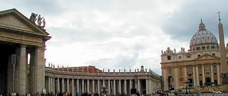Übersicht Petersplatz - die Bernini-Arkaden umrahmen den heiligen Schoß der allein seligmachenden Mutter Katholische Kirche / Sancta Ecclesia Catholica - den Petersdom, zentrales Repräsentativ-Gebäude und Quelle / Ursprung der heiligen katholischen Lehre des Vatikan / Vaticano 
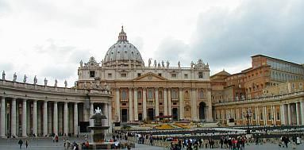Übersicht Fassade S. Pietro, rechts oben die päpstlichen Gemächer (auch ein sinnlicher Quell der geistlichen und leiblichen Freuden ...) 
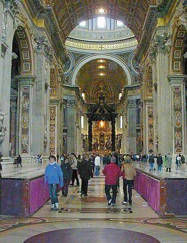Petersdom innen - Übersicht. Vorne zeichnet sich der Baldachin über dem Petersgrab dunkel ab, im Durchblick der vergoldete Peterstuhl - Kathedra Petri - im Zusammenhang mit der durchleuchteten Monstranz ebenfalls von betörendster Formgebung ... 
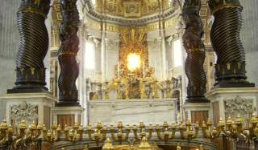Übersicht, man sieht die Wappen 1 und 8 
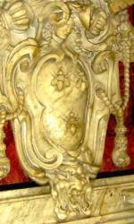Wappen 1 - die extatischen Freuden der Schwängerung 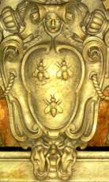Wappen 2 ff. Wehe und Wohl der Schwangerschaft 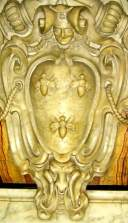Wappen 3 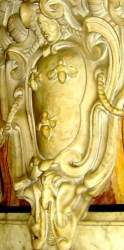Wappen 4 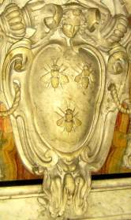Wappen 5 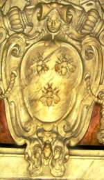Wappen 6 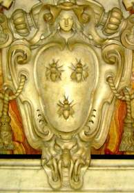Wappen 7 - der Geburtsschmerz 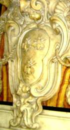Wappen 8 - mit dem Neugeborenen - ein lockiger pausbäckig-herziger Knabe. Gratulazione! 

[Friedrich Müller urteilt über Bernini](http://www.textlog.de/9295.html) _:"Da jedoch seine Begeisterung nicht der freie Erguss der schaffenden Künstlerseele war, sondern mehr als eine künstliche Erhitzung des Verstandes erscheint, so verraten seine Darstellungen durchweg eine gewisse reflektierende Absichtlichkeit, tragen ein mehr oder minder affektiertes Gepräge; da er ferner nur den gröberen Sinn zu befriedigen bestrebt war, so trat bei ihm an die Stelle von Grazie und Schönheit ein gesuchter koketter Liebreiz und wo er empfindsam werden will, ist seine Sentimentalität die einer Buhldirne. Man kann sagen, dass er die Schattenseiten der Darstellungsweise des Correggio, die stimulierte Erhitzung des Gefühls, die gesuchte Grazie und die rundlichen fleischigen Körperformen bis zur Karikatur übertrieb."_ 

Maffeo Barberini / Papst Urban VIII. frönte dem Nepotismus, war erst Galilei Galileos Freund und Fördererer, dann -nach dessen Einstieg ins fruchtlos-anmaßende Theologisieren - logischerweise sein entschiedener Gegner, weihte 1626 den unter seiner Ägide fertiggestellten Petersdom nach 120 Jahren Bauzeit ein, förderte die katholische Mission und den sakral-auftrumpfenden Prachtausbau Roms, erbaute die Sommerresidenz Castel Gandolfo und enthielt sich während des dreißigjährigen Kriegs (1618-48) fast aller Unterstützung der kaiserlich-katholischen Liga - sehr zum Mißfallen der deutschkatholischen Kirchenfürsten. Der noch genialere Francesco Borromini - von ihm stammen die bemerkenswerten Worte: „ _Chi segue altri non gli va mai innanzi_ “ („Wer anderen folgt, wird ihnen niemals voranschreiten“), mußte unter der Konkurrenz des gefälligeren Bernini lebenslänglich leiden und stürzte sich schließlich, vom Leben trotz einiger bemerkenswerter Erfolge maßlos enttäuscht und plötzlich erkrankt, in seinen Degen. Sein Begräbnis als Selbstmörder erfolgt ohne priesterliche Weihen, seine kirchliche Rehabilitation durch päpstlichen Beschluß erfolgt erst 326 Jahre später, 1993! Ein typisches Architektenschicksal? 

Weitere Info: 
[vaticanhistory](http://www.vaticanhistory.de/kon/html/urban viii_.html) 
[wikipedia](http://de.wikipedia.org/wiki/Urban_VIII.) [bautz](http://www.bautz.de/bbkl/u/urban_viii.shtml) 
[koniarek: Urban Biographie](https://web.archive.org/web/20071006100431/http://private.addcom.de/koniarek/neue-biographien/urban/urban.htm) 
[messala/Gabriele Pasch: Borromini](http://ars.messala.de/borromini.htm) 
[Michael Meisegeier: Frühchristlicher Kirchenbau – zu früh!](http://www.m-meisegeier.homepage.t-online.de/Rom.htm) - die radikale Infragestellung der Frühdatierung des Kirchenbaues in Byzanz, Jerusalem, Bethlehem und Rom 
[Ergänzung zur trickreichen Augenverwirrnis: Spiegelanamorphose - Die geheime Welt der Achsspiegelung in der mittelalterlichen Kunst](http://www.forschung-fischerprivat.de/fischerweb/Spiegel.htm) 

---

Obermain Tagblatt Lichtenfels, 16.3.2006 Leserbrief zum Leserbrief "Sind alle Priester?" von Roland Will, Burgkunstadt im OT 14.3.06 Eine moderne Theologie tut Not Mit Erstaunen dürfen wir die ausgezeichnete Bibelkenntnis von Herrn Will registrieren, mit dem er das Priesteramt exklusiv für Männer begründet. Eine Austeilung des Abendmahls und anderer priesterlicher Sakramente durch Frauen ist da tatsächlich, ei wer hätte das gedacht?, nicht vorgesehen. Neben vielen anderen Details, die uns eine wortwörtliche Auslegung der heiligen Schrift versagt oder - oft schlimmer noch - gar vorschreibt. Ich möchte lieber nicht erwähnen, was da zum Ausrotten der Feinde des auserwählten Volkes, zur gleichgeschlechtlichen Vereinigung, zu den vielerlei Speisevorschriften, zum Umgang mit Frauen während ihrer Tage, zu den "Söhnen des Teufels" (Joh. 8, 44) und dergleichen mehr bis zu Jesu Erwürgegebot für Ungläubige (Luk. 19, 27) unter dem Deckmantel des göttlichen Wortes alles drinsteht. Wollen die wahren Bibelkenner hierzulande das auch verkündigen? Natürlich können Vorzugsgläubige sich nach Lust und Laune daran halten, auch wenn es nun wirklich nicht jedermanns Sache ist und gewiß selbst in heiliggeistbeseelten Kirchenkreisen nicht mehr in allen Punkten mehrheitsfähig. 

Doch dürfen wir aufgeklärten Christen, heute zugegebenermaßen mehr als je bedürftig nach religiöser Weisung, einfach alles vergessen, was die quellenkritische Bibelwissenschaft hervorbrachte? Daß die Bibel inklusive der meist erst im 19. Jahrhundert auftauchenden Papyri - übrigens sehr passend zum damaligen Glaubenskampf - eine mehr als dubiose, oft geradezu abenteuerlich verderbte Tradierung aufweist? So wurde schon immer zeitgeistig neu und uminterpretiert und übersetzt bis heute. Das neufränkische Testament und die aktuelle Volxbibel im künstlichen Jugendjargon lassen grüßen, Papier ist ja unglaublich geduldig. Der Historiker [Wilhelm Kammeier](8buch11.md#kammeier) spricht gar von einer Verschriftlichung erst kurz vor dem Zeitalter des Humanismus und dem Papsttum mit guten Gründen sogar jegliche Existenz vor Avignon ab. Das entzieht übrigens vielen Kirchenkritikern ihre schärfsten Waffen, soweit sie vorwiegend auf unprüfbar Geschriebenes rund um wunderliche Exzesse und Moritaten im weitgehend erdichteten Mittelalter starren. 

In den heiligen Texten der Mönchsskriptorien blüht also das zeitgeistige Umfeld mit entsprechenden Zielsetzungen. Nur unbefangene Theologen und Geschichtswissenschaftler können sich dem inhaltlichen Kern ausreichend text- und quellenkritisch annähern. Gottseidank! Sonst müssten wir all den selbstbereichernden Wortkonstrukten, man denke nur an den Grundstücksklau von der Konstantinischen bis zur Pippinschen "Schenkung", wieder blind gehorchen. Gerade wir Evangelischen - Heiden, gar Ketzer im dogmentreuen Verständnis?, leiden besonders unter all dem wortgläubigen Sektierertum, das in unserem bibelfesten Umfeld unter Besserwissern aufbricht. Die Bibel läßt sich leider auch als ein geduldiger Steinbruch mißbrauchen, die arg vielen Peinlichkeiten und Widersprüche in diesem Buch aus vielen Büchern werden dann wohlweislich verschwiegen, raffiniert ausgeblendet - oder - wie schlau! - gleich in die Hände Gottes versenkt. 

Vielleicht nicht ganz zu Unrecht hat die katholische Kirche noch bis vor kurzem ihren Gläubigen den Bibelbesitz strengstens verboten, beschlagnahmte Exemplare verbrannt, hausgemachtes Theologisieren scharf verfolgt und nur die amtspriesterliche Auslegung zugelassen. Unser Dr. Martin Luther und seine Helfershelfer haben die Bibel unters Volk gebracht - doch mit welch grausamen Folgen? Ob er es nochmals täte, bei dieser Wirkung? Mörderische Glaubenskriege oder sonstige Schandtaten unter und durch Christenmenschen bis zum Irakkrieg, für alle muß eine überlegene Bibelvolksweisheit herhalten. In God we trust, who's next? 

Mit dem puren Ur-Patriarchentum verflossener Männerwelten ist heutzutage doch kein Blumentopf mehr zu gewinnen. Die christliche Botschaft des Evangeliums soll nach dem auch von mir sehr verehrten katholischen Theologen [Eugen Biser](https://de.wikipedia.org/wiki/Eugen_Biser) vom Herzen her verstanden und gelebt werden. Unser Gott ist die Liebe. Dazu braucht es freilich keine textgläubige Wortklauberei und Selektion mit Tunnelblick, die sich jeder Überprüfung entzieht. Eine wahrhaftige Theologie tut not, die ihrer Zeit und ihren Menschen in Gottes Namen gerecht wird, wohltut und uns räudige Schafe und verlorene Töchter und Söhne wieder um sich sammelt - übrigens wie zu jeder Epoche der Kirchengeschichte. Fazit: Wir dürfen stolz sein auf unsere engagierten Frauen im Priesteramt, vulgo Pfarrerinnen! Alle Kirchen bräuchten mehr davon. 

Konrad Fischer 
Schwürbitz 

---

Zum nahenden Abschluß gönnen wir uns - meine lieben Freunde und Kupferstecher, die ihr bis hierher durchgehalten oder sonstwie hergefunden - als krönendes I-Tüpfelchen und als Last but not least noch etwas Ultimatives, frech Empörendes, so richtig Anstößiges, unkorrekt Aufwühlendes: Zunächst mal eine reaktionäre, nein revolutionäre, vielleicht gar protestantisch-reformatorische Donnerei des Geistes von dem unvergeßlichen Prälaten Dr. h.c. Robert Mäder. Anschnallen und festhalten - aus _"Jesus der König"_ Verlag St. Michael, Goldach, Schweiz (hab ich von Pater Franz X. Failer aus Offenburg, Vergelt's Gott!): 

_"Man kann den offiziellen Verkehr von Kirche und Staat aufheben, aber man kann niemals den Bürger und den Staatsmann trennen von seinem Herrgott, von seinem Gewissen, von seinen zehn Geboten, von seinen religiösen Überzeugungen, also von seiner Kirche. Immer werden es Grundsätze sein, nach welchen er seine Anordnungen trifft und sind diese Grundsätze nicht katholisch, so sind sie protestantisch, freidenkerisch, materialistisch oder sozialistisch, also die Grundsätze einer bestimmten Religion oder Weltanschauung, aber nie neutral._ Wie sein Gott, so seine Politik! Wie sein Gott, so seine Gesetzbücher! Wie sein Gott, so seine Schule! Wie sein Gott, so seine Gerichte! Mag es Trennung geben zwischen Kirche und Staat, Scheidung kann es keine geben. Der Geist der Kirche muß des Staates Seele bleiben. Was Gott verbunden, kann der Mensch nicht scheiden. Gottes Wahrheiten und Gesetze vom öffentlichen Leben scheiden, ist sozialer Gottesmord. Und sozialer Gottesmord ist sozialer Selbstmord. Der Staat ohne Kirche ist des Staates Tod. Leib ohne Seele ist Leiche! In dem Maße, wie der Einfluß der Kirche auf das öffentliche Leben schwindet, beobachten wir zwei Todesanzeichen, die sterbende Autorität und die sterbende Freiheit. Der Staat existiert nur durch die Autorität. Er beruht auf der Voraussetzung, daß es Regierungen gibt, die anerkannt, Gesetze, die beobachtet, Befehle, die ausgeführt, Urteile, die anerkannt werden. Darin liegt die Garantie für Ordnung, Friede, Wohlfahrt, Sicherheit. Die Hüterin der staatlichen Autorität aber ist die Kirche. Für die Kirche ist es heiliger Glaubenssatz: Jedermann unterwerfe sich der obrigkeitlichen Gewalt. Wer sich der obrigkeitlichen Gewalt widersetzt, der widersetzt sich der Anordnung Gottes und die sich dieser widersetzen, ziehen sich selber Verdammnis zu. (Röm. 13, 2.) Die staatliche Autorität ist somit nach der Lehre des heiligen Paulus ein Teil jenes Evangeliums, von dem kein Wort vergehen wird. Die Kirche ist dem Staate Fundament. Sobald aber die Regierung nicht mehr als Gottesdienerin, als von Gott angeordnete Gewalt, mit dem Auge des Glaubens betrachtet wird, hängt sie in der Luft. Warum soll man gehorchen? Was ist ein Arbeiter? Ein Mensch! Was ein Regierungsrat? Nicht mehr, ein Mensch! Warum soll nun ein Mensch befehlen und der andere gehorchen? Warum soll man Gesetze halten? Wer macht sie? Menschen, die sind, was ich bin. Und mit welchem Rechte sagen 10.000 oder 300.000, indem sie einen Gesetzentwurf mit Ja in die Urne werfen, zu mir "du sollst"! wenn es mir beliebt, zu sagen: "ich will nicht!? Autorität, d.h. ein Mensch über mir, existiert nur, wenn ein höherer ihn über mich gestellt, also wenn Gott, Religion, Kirche existiert. Und steht nicht die Religion mit dem Flammenschwert eines Cherubs neben dem Staat, dann ist er Anmaßung und das Konsequente ist Recht auf Ungehorsam, Recht auf Revolution, Anarchie. Der Staat exisitert zweitens nur als menschenwürdige Institution, insofern neben der Autorität der Obrigkeit die Freiheit des Volkes garantiert ist. Das Land ist das glücklichste, welches am meisten Rechte und Freiheiten und am wenigsten Gesetze hat, wo am wenigsten befohlen wird. Nun gibt es eine Tatsache der Weltgeschichte: Je mehr Religion, desto mehr Freiheit. Je weniger Religion, desto mehr Gewalt. "Das religiöse Thermometer kann in einem Lande nicht steigen, ohne dass das Thermometer der politischen Gewalt falle und andererseits: das religiöse Thermometer kann nicht sinken, ohne dass das Thermometer der politischen Gewalt sich bis zur Tyrannei steigert." Vor dem Tage von Golgatha war das Thermometer der Religion auf Null, das der Staatsallmacht auf Hundert. Es gab nur Tyrannen und Sklaven. Jesus kam. Das Thermometer der Religion erreichte seine höchste Höhe und damit auch das der Freiheit. Denn Jesus bildete mit seinen Jüngern eine Gesellschaft und in dieser Gesellschaft gab es keine Gewalt. Zwischen Jesus und seinen Jüngern bestand keine andere Regierung als die Liebe, die Liebe des Meisters zu seinen Jüngern. Betrachtet die französische Revolution. Die Religion ist auf Null und darum ist die Freiheit auch auf Null. Denn die Gewalt stieg im Zeichen der Guillotine auf Hundert und vom 1. Juli 1789 bis 26. Oktober 1795 machte sie 15,479 Gesetze. Nur eine Macht schützt den Bürger vor der Ausartung der Staastsgewalt zur freiheitsmörderischen Tyrannei - das "du sollst" und das "es ist dir nicht erlaubt" der Religion, hinaufgerufen zu den Fürstenthronen und den grünen Sesseln. Der Staat ohne Kirche ist sozialer Selbstmord, der Tod der Autorität oben und der Tod der Freiheit unten! ... Der Geist des Gekreuzigten ist der Geist der Liebe und des Opfers und der Geist der modernen Familie ist der Geist der Selbstsucht und des Genusses. Die Sprache des Gekreuzigten ist: Zuerst die Andern, ich zuletzt! Die Sprache der Selbstsucht ist: Zuerst ich, dann noch einmal ich, zuletzt die Andern! Die christliche Familie ist aufgebaut auf der Idee des Opfers, der Hingabe. Die Idee des christlichen Vaters ist: Arbeiten von morgen bis abends - für Andere. Die Idee der christlichen Mutter ist: Sorgen für Andere! Selber immer erst zuletzt kommen wollen! Die Idee des christlichen Kindes ist - Ehrfurcht, Liebe, Gehorsam. Vater und Mutter zuerst, dann erst ich! Diese Idee des Opfers, der Hingabe, stirbt in der modernen Familie aus. Die moderne Familie ist aufgebaut auf dem Gesetz des Egoismus. Die moderne Famiie hat zum Leitgedanken: Möglichst viel Genuß, möglichst wenig Opfer! Daher der Malthusianismus. Daher die weichlich charakterlose Erziehung. Daran wird sie zu Grunde gehen. Nur das Kruzifix und seine Predigt von der Selbstbeherrschung, Selbstentsagung, Hingabe kann die sterbende Familie retten. Der Gekreuzigte König! **Kreuzauffindung muß sein in der Werkstatt. Die Werkstatt war früher wie alles Leben verklärt von der Religion. Eine Art Heiligtum. Die Arbeit galt als Gottesdienst, Gottesdienst und Nächstenliebe. Sie war nicht leere Brot- und Geldmacherei. Als Gottesdienststätte trug der Arbeitssraum Alles beherrschend das Kreuzbild. Das Kruzifix war dem Handwerker oberste Arbeitsnorm im Wirtschaftsleben, beständiger Ansporn zu Fleiß, Gewissenhaftigkeit, Wahrhaftigkeit, Ehrlichkeit, Geduld, Sanftmut, Beharrlichkeit. Im Schatten des Kruzifixes konnte Habsucht, Geiz, Geschäftslüge, Betrug, Warenwucher, Vorenthaltung des verdienten Lohnes, menschenunwürdige Behandlung, Neid und Klassenhass nicht aufkommen oder wenigstens nicht zur sozialen Krankheit werden. 

Der Liberalismus hat das Kreuz aus der Werkstatt verbannt, indem er die Irrlehre aufstellte, daß Religion und Arbeit, Moral und Industrie und Handel nichts miteinander zu tun haben. Er glaubte, das Kruzifix mit Polizeiparagraphen, Reglementen und Gesetzesartikeln ersetzen zu können.** Die Erfahrung hat die Unmöglichkeit dieser Wirtschaftstheorie erwiesen. Sie hat die Werkstatt, das Atelier, das Büro und den Fabriksaal zum Kampfplatz wilder Leidenschaft gemacht, wo eine Klasse der andern Wolf und Schlange wird. Die Arbeitsstätte muß wieder das verlorene Kreuz unter den Trümmern des Kapitalismus und Sozialismus hervorholen. Der Arbeiter muß mit dem Meister im Triumphe das Kruzifix an seinen alten Ehrenplatz tragen. Sonst sind beide verloren, unrettbar verloren. [Hervorhebung durch KF, Anm.: Und wie sieht es aus mit dem Auftraggeber und dem Auftragnehmer? Dem Bauherren und dem Dienstleister, dem Werkverträgler? Hä??] 

_Die soziale Frage wird entweder durch das Kreuz, d. h. durch das Opfer, die gegenseitige Liebe, die Geduld und die Gnade gelöst oder sie wird nicht gelöst._ Der Gekreuzigte König! Kreuzauffindung muß auch das Fest der Schule werden. Die Schule, angefangen von der Volksschule bis zur Universität, ist von der katholischen Kirche gegründet worden. Die Kirche ist die übernatürliche Erzieherin der Völker wie die Familie die natürliche Lehrerin der Nationen ist. Das göttliche und natürliche Recht überweisen das Kind zur Erziehung dem Vater, der Mutter und dem Priester. Wer außerhalb des Vaters, der Mutter und des Priesters das Kind erzieht und unterrichtet, tut es kraft der von diesen dreien ihm überwiesenen Vollmacht. Der Staat ist nicht Lehrer. Der Staat ist Beamter, Gesetzgeber, Richter, Polizist, Soldat, aber er ist nicht Lehrer. Die staatliche Zwangsschule ist ein an der Familie, der Kirche und dem Kinde vollzogener Raub. ... 

Es scheint, dass nun die Welt auf ihrer zentrifugalen Flucht vor Christus dem König an ihrem Ziel angelangt ist. Aber sie ist noch nicht am Ende. Es gibt, wie der Heilige Vater [Papst Pius XI. in seinem Rundschreiben Quas primas] andeutet, noch eine vierte Etappe der Gottlosigkeit. Das ist die Etappe der gewalttätigen Gottlosigkeit, in ihren beiden Formen der Tyrannei und der Gottlosigkeit der Barbarei. Die von Gott, Christus und der Kirche emanzipierte Freiheit wird schliesslich naturgemäss zur Bestie, die alles rücksichtslos zermalmt, was ihr im Wege steht. Zur Bestie des Gotteshasses, weil sie in Gott den natürlichen Feind des Bösen erkennt. Zur Bestie des Antichristentums, weil Christus dazu in die Welt gekommen ist, die Werke des Teufels zu zerstören. Zur Bestie der Kirchenverfolgung, weil die Kirche die Hüterin der Sittlichkeit, des Gewissens, der Autorität, des Eigentums, der Familie, der Menschenwürde und der wahren Menschenrechte ist. ..." 

Könnt fast von Luther sein, mein ich als protestantischer Evangele ;-) 

Und zuguterletzt noch ein paar Takte aus dem 17. Band der Bibliothek der Kirchenväter (schon Wahnsinn, was ich alles lese, wa?), und zwar aus der Allgemeinen Einleitung über des Hl. Ambrosius Leben, Schriften und Theologie des Dr. Johann Evangelist Niederhuber zum [Exameron des heiligen Kirchenlehrers Ambrosius von Mailand](http://www.unifr.ch/bkv/kapitel504.htm), von ihm erstmals übersetzt, Verlag der Köselschen Buchhandlung Kempten & München 1914. Thema? Na was uns am meisten interessiert, warum wir immer solche Angst in der Welt haben und woher das kommt, kurz gesagt: 

_"10. Lehre von der Sünde. Sündenfall. Erbsünde. 

Die Geschichtlichkeit des Sündenfalles der Stammeltern steht dem Ambrosius außer Zweifel; biblische Bedenken wie sie z. B. der Marcionite Apelles erhoben hatte, weist er besonnen ab. Dem gnostische Dualismus gegenüber hebt er die Sünde aus der Sphäre der Naturnotwendigkeiten in die des Sittlichen empor und betont, daß nicht Gott, nicht eine fatalistische Naturordnung, sondern der Mensch, und im Menschlichen nicht sowohl das verführerische Fleisch ('ministra peccati') als vielmehr "der Geist Urheber der Schuld" sei (De poenit. I), während der äußere Anstoß stets vom Teufel ausgehe, ohne dessen Verführung der Seele nimmer die Zügel über die Gelüste des Fleisches entrissen würden. 

In den Sündenfall Adams wurde das ganze Menschengeschlecht solidarisch verstrickt: "Da ward Adam und in ihm waren wir alle; da fiel Adam und in ihm fielen wir alle" (In Luc. VII). Die Allgemeinheit der Erbsünde ('haereditas peccati', 'haereditarium vinculum') betont Ambrosius wiederholt: "Niemand ist sündelos außer allein Jesus" (In Ps. 118), "jedes Alter sündeverstrickt", daher die Kindertaufe notwendig (De Abr. II). 

Die Erbsünde besteht nicht bloß in gewissen physischen Sündefolgen, sondern ist wesentlich Erbschuld: "schuldverfallen in Adam" ward der Mensch, den "die Erbschaft eines sträflichen Zustandes an Schuld band." "Bevor wir noch geboren werden", erklärt Ambrosius zu Ps. 50,7, "werden wir durch Ansteckung befleckt und vor dem Gebrauch des Lichts nehmen wir in uns auf die Ursünde" ('originis ipsius iniuriam')." 

Das in Adams Geschlecht eingedrungene Sündengift tat nun seine Wirkung. Adam, und in ihm der gefallene Mensch, ging vor allem des Sellenparadieses und seiner Gnadengüter und in weiterer Folge des äußeren Paradieseslebens verlustig. Er ward von jenem "erhabenen und himmlischen Ort" "zur Erde herabgestoßen" "ins Elend nimmer endender und unerträglicher Not". Er wurde also in einem zweifachen Sinn aus einem "himmlischen Menschen" ein "irdischer Mensch". Statt der Gottnachbildlichkeit trägt er nun die Züge des Irdischen (imago terrena), ja die Züge des Teufels (imago diaboli) an sich, zu dem er nicht bloß in einem äußerlich-juridischen, sondern als "Glied" (membrum) und "Ausgeburt" (semen) gleichsam in einem innerlich-organischen Verhältnisse steht. Und seine Sündenschuld aktualisiert und häuft sich fort und fort, bis erst der Tod der Verschuldung ein Ende setzt ('mors finis culpae'). 

Unter verschiedenen Gesichtspunkten wird dieser Sündenzustand des Unerlösten ins AUge gefaßt. Er ist ein Zustand der Straffälligkeit und Verdammungswürdigkeit. Schon der bloße Nichtbesitz der Gottnachbildlichkeit macht ihn straffällig und verdammungswürdig (In Ps. 118; De off. I). - An Stelle der Freiheit trat der Zustand der Knechtschaft unter der Herrschaft des Fleisches, der Sünde, des Satans - der einzigen wahren Diensbarkeit; denn "nicht der zufällige Lebensstand (Sklavenberuf) macht jemand unfrei" (De Jac. II)." - Der Gnadengüter bar, ist der Sünder völliger Armut und Blöße anheimgegeben: "Aller Güter beraubt und entblößt hat (die Sünde den Adam) zurückgelassen"(In Ps. 118). Satan und Welt hat dem Menschen nichts zu bieten; denn "ein Nichts ist, was der Teufel besitzt" (De Jac. II) und "Nichtigkeit der Schatz dieser Welt" ( Exam. VI). "O Reicher, du weißt nicht, wie arm du bist!" (De Nab.) - In der "Nacht und Finsternis dieser Welt" schmachtet der Unerlöste unter dem "Fürsten der Finsternis"; denn "Dunkel folgt der Ungerechtigkeit, Finsternis den Sünden, wie der Unschuld das Licht" (In Ps. 43). - Ein ethischer Tod ist ist sein Zustand, ein (moralisches) Nichtsein, Nichtexistieren, "ein Reich des Todes" diese Welt; "wandelnde Leichen" sind die Gottlosen in ihr (De Abr. II); "wie viele schmachten bei lebendigem Leib in der Hölle!" (In Ps. 118) - Ein letzter Zug im traurigen Bilde ist die Fried- und Ruhelosigkeit. Für das schuldbewußte Gewissen gibt es keine Ruhe (tranquillitas), keinen sicheren Frieden (securitas). Vom bösen Gewissen gequält, ist "der Gottlose sich selbst zur Strafe", trägt die Hölle auf Erden in sich herum: "Der Gottlosen Ruhe ist in der Hölle; denn lebendig fahren sie zur Hölle" (De off. I). 

Drei Menschenklassen sind bei Ambrosius vom religiös-sittlichen Standpunkt wohl zu unterscheiden. Für das Verständnis so mancher (namentlich eschatologischer) Ausführungen ist diese Unterscheidung von entscheidender Wichtigkeit: 

1) Die "Ungläubigen" und "Gottlosen", die des Glaubenshabitus ermangeln, also den Glauben entweder nicht angenommen (Heiden, Juden) oder (formell oder praktisch) verleugnet haben. 

2) Die "Sünder" ('peccatores'), das sind jene Gläubigen, welche mit Sünden behaftet sind. Sie scheiden sich wiederum in zwei Gruppen, je nachdem ihre guten oder bösen Werke überwiegen (bzw. "zum Gericht vorangehen", 1. Tim. 5,24). Im Vergleich zu den letzteren werden die ersteren auch "Gerechte" (im weiteren Sinn) genannt. 

3) Die "Vollkommenen" oder "Gerechten" (im engeren Sinn), das sind die die Gläubigen, die von aller Sündenmakel rein sind, oder nach der Definition des Ambrosius "jene, welche recht glauben und ihren Glauben in Werken betätigen", bezw. welche im Feuer der Liebe Gottes die Schlacken der Sünden ausgebrannt haben (1 Kor. 3, 12 f.)."_ 

Hier noch ein Link zur [Radikalkritik](http://www.radikalkritik.de/), Webseite des Theologen Hermann Detering, Motto: "Nicht Kritik am Christentum, sondern kritische Untersuchung seiner historischen Grundlagen." - Na, wenn das nicht herausfordert ...
