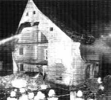
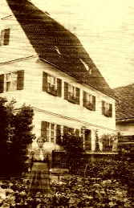

[🠔 Zur Übersicht: Pfusch-Anleitung (Satire)](altbau.md)  
# Ratgeber für abrißwillige Denkmalbesitzer und andere Seltsamkeiten
**Wie schaffe ich es schnellstmöglich, (m)ein Baudenkmal abreißen zu dürfen? 50 miese Tricks, an eine legale Abrißgenehmigung zu kommen**  
_von Karin Schade • aktualisiert 01.09.1998_

Hier erhalten Sie Anregung, Rat und Vorbild bei Problemen mit ungeliebten Denkmalen 
(Vorsicht, nicht nur Satire): 

Ratgeber '98 für abrißwillige Denkmalbesitzer - Schon lange vor Hoffmann-Axthelm und Antje Vollmer - mit aktuellem Nachtrag 
Wie zerbombe ich das Denkmal? 
Wie verramsche ich das Denkmal? 
Wie zernutze ich ein Denkmal? 
Wie versilbere ich das Erbgut? 
[Wie gründet man ein Museum? 25 erprobte Praxistips um den Dachboden zu leeren und den Gemeindekämmerer zu ruinieren](8museum.md#steinroex) 
Wie benutzt man Denkmale und Architekturkritik als Stoff für eine Polit-Glosse? 
Ortsbild- und Landschaftsverschandelung durch Neubauten: "Negativ-Denkmale" 
Was bringt es dem Denkmalbesitzer, sein Denkmal zu pflegen? 10 Gründe 
Links 
Was ist überhaupt ein Denkmal, und was will die Denkmalpflege, bzw. soll sie wollen? - Einsichten von [Prof. Dr. Tilmann Breuer](8breuer.md) und von [Dr. Dieter Martin](8martin.md) 
Wie teuer ist die Denkmalpflege wirklich? - [Ein selbstkritischer Beitrag](8schulze.md) - Prof. Dr.-Ing. Jörg Schulze, Rhein. Amt für Denkmalpflege 
Aktuelle Kritik an der Denkmalpflege 
[Auch eine Lösung: Translozierung / Relocation](8berat.md#translozierung relocation)

[Helmut Haberkamm](http://www.HelmutHaberkamm.de)

**Es is immer bloß a Bamm**

**Es is immer bloß a Bamm, den wussi wechmachn, a Heggn 
Immer bloß a Brunna, a Gärdla, a Pflasder, a Maierla, a Briggla 
Es is immer bloß a alds Haisla, des wussi eireißn denna, a Baggoofn 
A Milchrambm, a Woochhaisla, a Staagreiz, a Scheierla, a Keller 
Es is immer bloß a Booch, wu begroodichd werd, bloß a Fuhr 
A Weech, der wu verleechd werd, a Hohlgaß, a Hubbl, a Ranga 
Es is immer bloß a Agger, wu wechkummd, a Wiesn, a Wäldla 
Es is immer bloß a Bauer, wu aufgeem dudd, a Hof, wu eigehd 
A alder Grauderer, wu widder wech is, a Werdschafd na wenger 
A Loodn widder fodd, a guuda Haud, a komischa Kabbm 
Aaner allaa auf weider Fluur, a ganz einger Schlooch**

---

**Immer sinns bloß a boor Veecherle un Viecher, wu fodd sinn 
A boor Pfiffer un Graider un Blumma, wummer nämmer sichd 
Immer bloß a Stiggla, a Drimmla is widder fodd, nedd di Weld 
Doo is nedd schood drum, soongs, nedd weider draagisch 
Des hadd wechkerd, des ald Zeich, schood um a jeds Word 
Pfeif auf die boor Greedn doo, soongs, bloß a boor Zergwedschda 
Des Glumb is kann Schuß Bulfer weerd, a Schlooch ins kald Wasser**

---

**Immer bloß a bißla, a weng wos, nix weider 
Immer hald bloß a Bamm, a Haisla, a Baierla wenger 
Bloß midder Zeid hald werd alles ganz annersch 
Un dernooch hadd widder kanner doo dervoo wos gwißd 
Hadds widder kanner so kumma sehng, wies sei werd 
Haddmer widder rein goor nix machn kenna dergeeng**

---

**Bloß am End stenners na dodd mid gwaschna Häls un beeglda Hoosn 
Un mid aufgrissna Aang stierns widdi Eelgetzn in di Weldgschichd 
Gratzn middi Finger am Lagg un am Gloos un am Blech un am Deer 
Un suhng nooch an bißla, bloß an Fitzerla vonnam ganz annern Leem **

---

**Aus[Helmut Haberkamms ](http://www.HelmutHaberkamm.de)Gedichtband "Lichd ab vom Schuß", 
erschienen im [Ars Vivendi Verlag Cadolzburg](http://www.arsvivendi.com) (1999).** 

Karin Schade 
Interessengemeinschaft Bauernhaus e.V. **[IGB](http://www.IGBauernhaus.de)** Göttingen/Eichsfeld

**„Ratgeber“ für abrißwillige Denkmalbesitzer** 
(Erstveröffentlichung in: Der Holznagel, Mitteilungsblatt der Interessengemeinschaft Bauernhaus **[IGB](http://www.IGBauernhaus.de)** e.V., 24. Jahrgang, Heft 5, Sep./Okt. 1998, zur Veröffentlichung in den Altbau und Denkmalpflege Informationen freigegeben durch Autorin)

Wir alle wissen, daß der Denkmalschutz überflüssig ist, daß die Denkmalschutzgesetze abgeschafft oder erheblich abgespeckt gehören und daß man die Arbeitsplätze, die künstlich durch Denkmalreparaturen in den Handwerkerfirmen geschaffen werden, sinnvollerweise umlenken sollte für die Beseitigung der Schandmale in den Dörfern und Städten.

Wir wissen aber auch, daß es zu lange dauert und viel zu viel Staub aufwirbeln würde. Deshalb unser neuer 

**Ratgeber:**

**Wie schaffe ich es schnellstmöglich, (m)ein Baudenkmal abreißen zu dürfen? 50 miese Tricks, an eine legale Abrißgenehmigung zu kommen** , 

den wir Ihnen heute in Auszügen vorstellen möchten. Diese Vorgehensweise ist durch die Aushöhlung der heute bestehenden Gesetze viel wirksamer als ein öffentlicher Angriff auf die Denkmalpflege.

**Lektion 1: ich besorge mir eine Abrißverfügung.**

Diese Lektion bietet sich für all jene an, die auf dem Gelände, das ihr Baudenkmal okkupiert, gern einen lukrativen Neubau erstellen möchten, mit einem Antrag auf eine Erlaubnis zum Abriß aber gescheitert sind, weil man ihnen nicht geglaubt hat, daß ein Abriß und die Erstellung eines kompletten Neubaukomplexes für Sie erheblich billiger kommen würde als das Auswechseln einer Schwelle und der Ersatz dreier gesprungener Dachziegel.

**1. Maßnahme:** Sie reißen an nicht exponierter Stelle bitte das Dach auf, und bei Wind oder noch besser bei Sturm werfen Sie, ohne sich sehen zu lassen, zwei, drei Dachziegel auf die Straße. Besonders wirksam ist diese Aktion, wenn Sie dabei den Bürgermeister oder den Verwaltungschef treffen können.

**2. Maßnahme:** Sie lassen einen guten Freund daraufhin eine Anzeige gegen Sie erstatten, weil Ihr Baudenkmal die Sicherheit und Ordnung gefährde. Haben Sie keinen zuverlässigen Freund, erstatten Sie anonym Anzeige gegen sich selbst. Fordern Sie, daß die Dachziegel, die per se eine potentielle Gefährdung darstellen, durch eine leicht verwehende Folie ersetzt werden müssen.

**3. Maßnahme:** Nach Erhalt der Verfügung zur Entfernung der Dachziegel lassen Sie regelmäßig eine große Menge Wasser im Gebäude arbeiten; Gießkannen sind nicht so ergiebig, organisieren Sie lieber einen Wasserschlauch. Hierbei sind besonders Lehmdecken sehr für eine Durchfeuchtung geeignet. 

Haben Sie es nicht gar so eilig mit der Abrißverfügung, lesen Sie bitte weiter unter Maßnahme 5, andernfalls fahren Sie mit Maßnahme 4 fort.

**4. Maßnahme:** Sägen Sie einen Deckenbalken innerhalb des Hauses durch.

**5. Maßnahme:** Verkürzen Sie die Intervalle, in denen Sie Anzeigen erstatten; werfen Sie parallel dazu sämtliche Fensterscheiben ein.

**6. Maßnahme:** Warten Sie eine Menschenansammlung vor dem Gebäude ab und lassen Sie die zum Einsturz vorbereitete Decke herunterfallen. Eventuell können Sie bei schlechter Akustik einen Verstärker zuhilfe nehmen.

**7. Maßnahme:** Benachrichtigen Sie sofort die Polizei. Rufen Sie nach Ruhe und Sicherheit und Ordnung.

**8. Maßnahme:** Reißen Sie Ihr Haus möglichst schnell nach Erhalt der Abrißverfügung ab; sonst kommt noch irgendein Idiot, der meint, das Haus sei noch zu retten.

**Lektion 2: ich weise die wirtschaftliche Unzumutbarkeit nach**

Diese Lektion bietet sich für all jene an, die sich durch die Existenz eines Baudenkmals in der Nachbarschaft oder sonstirgendwo in Ihrem Wohlbefinden oder bei der Vermehrung Ihres Kapitals gestört fühlen.

**1. Maßnahme:** Gehört das Baudenkmal nicht Ihnen, kaufen Sie es.

**2. Maßnahme:** Trennen Sie das vorhandene Grundstück vom Haus ab; nutzen Sie es oder tun Sie wenigstens so als ob, lagern Sie zum Beispiel Ihren Müll auf dem Gelände.

**3. Maßnahme:** Versperren Sie den Zugang zum Gebäude.

**4. Maßnahme:** Bieten Sie Ihr Objekt nun werbewirksam an; zeigen Sie bei Besichtigungsterminen aus allen Fenstern stolz auf Ihren stinkenden Müllhaufen und weisen Sie darauf hin, daß fehlerhafte Wasseranschlüsse und andere Installationen nicht möglich sein werden, da sie über Ihr Grundstück verlegt werden müßten, was Sie selbstverständlich nicht zulassen würden. Lassen Sie sich jeden Besichtigungstermin bestätigen.

**5. Maßnahme:** Sollte sich ein Interessent nicht abschrecken lassen, erzählen Sie ihm einfach, die Abrißgenehmigung sei schon erteilt, er sei zu spät gekommen.

**6. Maßnahme:** Reichen Sie Ihre Liste mit abgeschreckten Interessenten beim Denkmalamt ein; weisen Sie in einem Anschreiben auf den schlechten Zustand des Gebäudes hin. Zeigen Sie sich sehr zerknirscht, ein so wundervolles Zeitzeugnis nicht mehr halten zu können und setzen Sie sich vehement für eine Auflage der Denkmalbehörde zur Translozierung ein, denn Sie wissen ja: das erspart Ihnen die Kosten für den Abriß; diese muß dann der Kaufinteressent tragen!

**Bei Interesse können Sie jederzeit die Broschüre anfordern bei der[IGB ](http://www.IGBauernhaus.de). Auf Wunsch werden wir versuchen, Kontakte zwecks Erfahrungsaustausches herzustellen.**

Konrad Fischer: Fassaden retten oder zerstören 1 

[Teil 2](http://www.youtube.com/watch?v=Y1NSxAW15Cc) [Teil 3](http://www.youtube.com/watch?v=RAT7VzBo8k0) [Teil 4](http://www.youtube.com/watch?v=6TBII25iVQk) [Teil 5](http://www.youtube.com/watch?v=Kb0C4KiZvVA) 

**Nachträge (Konrad Fischer)**

Die bisher wohl witzigste Variante des großen vaterländischen Krieges gegen den deutschen Altbau liefert die "Kommission Wohnungswirtschaftlicher Strukturwandel in den neuen Bundesländern", auch "Expertenkommission Leerstand Ost" genannt. Ihr Fazit (lt. ibau Planungsinformationen 21.11.2000): "Viele Städte drohen auseinander zu brechen. Sie zerfallen in Fragmente aus leeren Altbaugebieten, konsolidierten, in neuer Pracht wieder erstandenen Kernbereichen, halbleeren durch Abriss schrumpfende Plattenbausiedlungen ... und in große neue Einfamilienhaussiedlungen. Ein Ende ist nicht abzusehen ..." (bis 2015 die Flüchtlingswelle in die BRD hereinschwappte ...?)

Daraus wird nun in bekannter Manier gefolgert, die leerstehenden Altbaugebiete auch der Innenstädte, oft im Kern mittelalterliche Baudenkmale mit dem Erscheinungsbild des 18./19. Jhs., endlich endgültig abzuräumen. Gefördert durch Staatsknete aus dem mit privatisiertem Volksvermögen "überquellenden" Steuertopf. Eine geniale Finanzquelle für die institutionellen Immobilisten, die den privaten Hausbesitzer logischerweise ausspart. Das diesbezügliche Gemäkel der kapitalistischen Haus- und Grundbesitzervereinigungen darf man als echter Roter (auch in schwarzer Verkleidung, man denke an die nachwendliche Endlösung betr. Altgroßgrundbesitzer mittels Kohl-Regierung) nicht ernstnehmen. Hauptsache, die Genossen-/Spezlversorgung im Wohnungsunternehmen funktioniert weiter. Endlich finden die genialen Abrißprogramme der DDR zugunsten eines Neuen Deutschlands ihre Erfüllung. Für den Wiederaufbau wäre dann neben der aktuellen Kaninchenstallbauweise auch die Berücksichtigung der Baukultur unserer Neubürger angesagt. Ein prima Weg aus der häßlichen deutschen Bauleitkultur. Wie man z.B. leergezogene Kirchen minarettgarniert in dauergenutzte muselmanische Architektur verwandelt, ist ja schon lange in Istanbul zu besichtigen. Tipp für Architekturisten: Der Schuppen hieß mal Hagia Sophia...

Natürlich versucht die staatliche Denkmalpflege dagegenzuhalten und fordert (und fördert mittels neuartiger Zuschußstrategien!) die Mitwirkung bei der erhaltungsorientierten _"Entwicklung von Nutzungs- und Finanzierungskonzepten"_(so Dr. Jörg Haspel, Chef der Berliner Denkmalpflege, in der ZEIT am 14.9.2000). Typische Spielverderber in der Spaßgesellschaft. Sogar gegen den verordneten Dämmzwang werden dort schon Stimmen laut. Was haben die nur gegen die Zerstörung des Wohnklimas, der Altbauten und der Geldbeutelbestände mittels [Energiesparwahn](7wsvoant.md)? Wie lange noch läßt sich die seriöse Wirtschaftspolitik das gefallen?

Noch ein heißer Tipp für Investoren und Planer: Wer es versteht, der Profilneurose eines von täglichem Mißmanagement und Mißerfolg geplagten Denkmalpflegers (es soll ja auch welche von dieser Kategorie geben) durch galante Unterwürfigkeit ausreichend zu schmeicheln, kann das Denkmal vergewaltigen bis zum Abriß. Dazu gehören auch manche witzigen Polit-Geschäftchen und sonstige Einflußnahmen auf Gegenseitigkeit. Bisinässäsjuschl.

Besonders schön arbeiten Treuhandnachfolgeeinrichtungen den überflüssigen Denkmalbestand ab. Dabei werden die aus dem Arbeitsmarkt sonst ausgesonderten Mukkibesitzer sowie sogar willige Inschönöhre in Brot und Arbeit versetzt. Beispiel MVP: Abbruch der Feldsteinställe in H., Transport Abbruchmaterial zum Schloß G. (Besitzer Freiherr von M.). Dort kann man ja hübsche Mäuerchen errichten, um wieder freche Bauern vom Junkerland fernzuhalten. Die für das allerorten dringend erforderliche Aufräumen MVPs beauftragte Abbruchfirma "Kluge Denkmalschutz, Duisburg" (nach Angabe in [IGB-Der Holznagel](http://www.IGBauernhaus.de) 5/2003) konnten ihr kluges Denkmalschutz-Werk natürlich nur deshalb erfüllen, da ihnen gefällige Ingenieursgutachten zur Seite standen. Motto: Abbruch unvermeidlich, Erhaltung wirtschaftlich unzumutbar. Das zieht immer und die beteiligten Behörden sind aus dem Schneider. Note: Sehr empfehlenswert!

Ein unglaublich lehrreiches Beispiel der Behördenrealität rund um eine Denkmalsanierung - vom Erhaltungswillen bis zum Abbruchantrag - bietet diese fetzige Webseite vom [Märchenhof bei Kassel](http://www.reitmeier-kassel.de/html/der_marchenhof.html).

Und ebenfalls sehr lehrreich ist dieses [Urteil VG München vom 24. November 2009, Az. M 1 K 09.939](https://openjur.de/u/480329.html) zu einer Abbruchverweigerung des Landratsamtes 

Lehrreich auch die Berichterstattung über die Abrißerlaubnis trotz Denkmalschutz für die alte Villa in Freiburg Herdern - aus wirtschaftlichen Gründen: [Villa darf weg](http://www.badische-zeitung.de/freiburg/alte-villa-in-herdern-darf-trotz-denkmalschutz-abgerissen-werden--115278973.html) 

Sitzt nun ein Mieter in einem Baudenkmal und das Baudenkmal auf einem teuren Grundstück, das der denkmalhassende Besitzer gerne anderweitig - nach Abriß der störenden Kulturbude selbstverfreilicht - verwursten will, muß er die unzumutbare Unwirtschaftliche seines Baudenkmals beweisen, dann darf der Bagger kommen. Nun könnte man einwenden, daß ein bestehendes Mietverhältnis, das ja ggf. sogar kostendeckende Einnahmen garantiert, der Annahme einer grundsätzlich unzumutbaren Unwirtschaftlichkeit und damit einem Abriß sowie einer ertragsreicheren Verwertung des denkmalbelasteten Grundstücks entgegensteht. Doch in diesem Fall ist das Mietrecht gem. BGB zuberücksichtigen: 

§ 573 Ordentliche Kündigung des Vermieters 
(1) Der Vermieter kann nur kündigen, wenn er ein berechtigtes Interesse an der Beendigung des Mietverhältnisses hat. 2Die Kündigung zum Zwecke der Mieterhöhung ist ausgeschlossen. 
(2) Ein berechtigtes Interesse des Vermieters an der Beendigung des Mietverhältnisses liegt insbesondere vor, wenn 

1. 
der Mieter seine vertraglichen Pflichten schuldhaft nicht unerheblich verletzt hat, 
2. 
der Vermieter die Räume als Wohnung für sich, seine Familienangehörigen oder Angehörige seines Haushalts benötigt oder 
3. 
der Vermieter durch die Fortsetzung des Mietverhältnisses an einer angemessenen wirtschaftlichen Verwertung des Grundstücks gehindert und dadurch erhebliche Nachteile erleiden würde; die Möglichkeit, durch eine anderweitige Vermietung als Wohnraum eine höhere Miete zu erzielen, bleibt außer Betracht; der Vermieter kann sich auch nicht darauf berufen, dass er die Mieträume im Zusammenhang mit einer beabsichtigten oder nach Überlassung an den Mieter erfolgten Begründung von Wohnungseigentum veräußern will. 

(3) Die Gründe für ein berechtigtes Interesse des Vermieters sind in dem Kündigungsschreiben anzugeben. Andere Gründe werden nur berücksichtigt, soweit sie nachträglich entstanden sind. 
(4) Eine zum Nachteil des Mieters abweichende Vereinbarung ist unwirksam.

Was sagt uns das? Zum Absatz (2) Nr. 3 beispielsweise der Bundesgerichtshof BGH in seinem Urteil vom 28.01.2009, Aktenzeichen: VIII ZR 7/08, VIII ZR 8/08, VIII ZR 9/08: 

Eine Baugesellschaft hatte ein denkmalgeschütztes vermietetes Wohnhaus - ein sanierungsbedürftiges Baudenkmal von 1914 - gekauft und wollte es abreißen und auf dem Grundstück ein neues Bauwerk mit sechs Eigentumswohnungen errichten und danach veräußern, da sich eine Sanierung nicht mehr lohne. Dafür erhielt der Vermieter auch die baurechtliche und denkmalschutzrechtliche Genehmigung. Die Mieter waren dagegen. Der BGH gab dem Abreißer aber recht, da der Vermieter nicht an einer "angemessenen wirtschaftlichen Verwertung" gehindert werden darf. Angeblich, so wußten es jedenfalls Deutschlands allerweiseste und allerhöchste Richter, wäre die Sanierung im beurteilten Fall nicht nur sehr teuer, sondern würde auch die Nutzungsdauer des Baudenkmals kaum verlängern. Und auch eine harmlosere Sanierung würde ja - da dies ohne Entkernung und Auszug der Mieter nicht zu machen sei, unzumutbar sein. Die Kündigungsschutzklagen der klagenden betroffenen Mieter wurde abgewiesen, das Baudenkmal darf abgebrochen werden. [Urteilsinfo bei finanztip.de](http://www.finanztip.de/recht/mietrecht/abrisskuendigung.htm)

Lehrreiche Beispiel aus Austria - Zum klammheimlichen Abriß des Kaipalastes auf Raten: [INITIATIVE KAI-PALAST](http://www.denkmalschutz.at/kaipalast/) 
und zur veramteten und bürgermeisterlichen Abbruchgrazie in der vorgeblichen Kulturhaupt- und Weltkulturstadt Graz, wo wieder einmal Wirtschaftlichkeitsverrechnungen (die ja sowohl für kreditfinanzierten Alt- wie Neubau immer Unrentierlichkeit bestätigen müßten, wenn nicht Spitzenlage am Kudamm) den Grund zum Denkmalmord am Kommod-Haus liefern: [Bericht aus "Kleine Zeitung" mit Diskussionsforum](http://www.kleinezeitung.at/nachrichten/chronik/artikel/_557873/index.jsp), Stellungnahme: [ICOMOS-Präsident besorgt um Grazer Weltkulturerbe-Status](http://www.kleinezeitung.at/nachrichten/chronik/artikel/_563011/index.jsp?backlink=/nachrichten/chronik/artikel/_557873/index.jsp), Stellungnahme der [Österreichischen Gesellschaft für Denkmal- u. Ortsbildpflege,](http://www.denkmal-ortsbildpflege.at) [ORF TV-Bericht.](http://steiermark.orf.at/oesterreich.orf?read=detail&channel=8&id=286261) Ob man die rotweißen Kulturterminatoren nicht besser auch in Kalifornia als vater(lands)lose schwarze Negger herumregieren lassen sollte? Das Blödi Building könnte man da pfeilgrad sparen. Ja freili, d' austriakischen Intölläcktuölln sind hoit modärn (gibts dafür jetzt grad kein english surrogate?): [Bürgeradvokatur erfordert mehr als Sonntagsredetechnik](http://www.nextroom.at/article.php?article_id=4)

Und hier kann man VON POLEN LERNEN: [Abbruchtricks aus Wr´száwzc´zwrs´ctzwa (oder so, hieß mal Warschau)](http://www.diepresse.com/detail/default.asp?channel=p&ressort=a&id=286249)

Oder diese Alternativen: Brüsselisierung oder Fassadismus - Jana Laasch: ["Fassaden-Retterei, Denkmalschutz auf Brüsseler Art"](http://www.europa-digital.de/laender/bel/bruessel/fassadismus.shtml)

Oder, oder, oder: 
[Leipzscher Seilschaftstechnik rund um "verkehrsbedingten" Abriß des Henriette-Goldschmidt-Hauses](http://www.henriette-goldschmidt-haus.de/inhalt5.htm) 
[Stadtbildverbrechen und Denkmaltötung in Marburg](http://www.stadtbild-marburg.de/ar-vortrag.htm) 
[Die Ermordung der vergreisten Oppenheimer Denkmal-Scheune](http://www.main-rheiner.de/archiv/objekt.php3?artikel_id=1100141) 
[Ehrenmalvernichtung durch vorauseilenden Zeitgeist in Bad Doberan](http://www.siteboard.de/cgi-siteboard/board.mpl?fnr=9206&read=6637) 
[Denkmalabbruch und Bürgermeinung in Bremen](http://www.tachauch.de/bremensien/stadt_schnack/archiv/mauer2001meinungen2.html) 
[Massenmord an Zürcher Kreuzplatz-Denkmalbuden](http://switzerland.indymedia.org/fr/2002/06/407.shtml) 
[Rettet das Hallenser Irrenhaus!](http://www.scheer-halle.de/hs/hs_03.htm) Oder eben nicht? 
Endlich! [Abbruch des Schlosses Schönhausen in Pankow ab 18.1.04](http://www.wams.de/data/2004/01/18/224242.html)

Obs was nutzt? [denkmal aktiv - Kulturerbe macht Schule](http://www.denkmal-aktiv.de/)

**Neu:** Beispiel aus meiner [Bauberatung betr. Abbruch/Neubau oder Denkmalerhaltung](5wiber.md#abbruch/neubau)

---

**Wenn alles nichts geholfen hat: Willige Vollstrecker - Die Endlösung mit Gas:**

Obermain-Tagblatt Lichtenfels 23.6.1999:

_**"Gläubige loben den Bombenleger 
**Nach Sprengung eines denkmalgeschützten Pfarrhofes herrscht Zwietracht im Dorf_

**__ACHSHEIM 
_Von Christoph Meyer_**

_Die Stimmung unter den 800 Einwohnern im schwäbischen Achsheim ist noch immer explosiv. Vor zwei Wochen hatte ein Dorfbewohner den historischen Pfarrhof mit Flüssiggas-Flaschen in die Luft gesprengt. ..._

**_Ein paar Steine, das ist alles, was vom alten Pfarrhof in Achsheim blieb. Zwei Bewohner hatten den umstrittenen denkmalgeschützten Bau in die Luft gesprengt. Foto: dpa/Puchner_**

_... Landratsamt als auch die Regierung von Schwaben (haben) ... Abbruch abgelehnt. ... Landtag war für eine Sanierung. 1,1 Millionen Mark hätten für die Modernisierung bereitgestanden._

_Soviel staatliche Einigkeit veranlaßte einen bisher unbescholtenen Bürger zur Sprengung des Gebäudes. "Er war frustriert und verbittert, weil die Behörden sich über den Mehrheitswillen des Dorfes einfach weggesetzt haben", erklärt Pfarrer Köbel. Außerdem habe er nicht eingesehen, soviel Steuergelder nutzlos zu verbauen. Die Motive für die Tat des 60jährigen Mitglieds der Kirchenverwaltung verstehe er._

 
Die Feuerwehr beim Löschen des zerbombten Pfarrhofs (Foto aus: Schönere Heimat, Erbe und Auftrag, Bayerischer Landesverein für Heimatpflege e.V., 1999/Heft 3 - Titelbild (Original in Farbe))

So sah der alte Pfarrhof 1917 aus (Foto aus: Martin Wolzmüller: Die "schnelle Lösung" von Achsheim, Das gesprengte Baudenkmal - ein Zeichen mit weitreichender Wirkung! in: Die Schönere Heimat, Erbe und Auftrag, Bayerischer Landesverein für Heimatpflege e.V., 1999/Heft 3): 

So schön ist nun das denkmalfreie Achsheim (Fotonachweis wie vor): 
 
Und auf der kernigen Holzstange steht herzallerliebst in Schönschrift: 
_"__**Z** u ehren einen alten **B** rauch u. unsrer **A** hnen **S** itte 
**D** rum haben einen **M** aibaum wir gestellt in unsre **M** itte 
**S** oll **M** ahner sein in schwerer **Z** eit u. stärken unser **W** ollen 
**D** rum unser **W** ahlspruch immer sei: **T** reu bleib der **V** äter **S** cholle"_

(Da hofft man, daß die treuherzigen Achsheimer bei soviel maibaumgestärktem Wollen in ihrer Blindheit nach dem Maßstemmen noch den Baum zum Brunzen finden.)

Bei dieser Zerstörung eines christlichen Bauwerks zeigt dann auch die deutsche Gesinnungsjustiz Milde:

Obermain-Tagblatt 5.10.1999

_**Sanierung durch Sprengung vereitelt 
**Streit um Pfarrhaus: Geldbuße für Kirchenverwalter_

**__AUGSBURG 
_Für seine Selbstjustiz im Streit um einen verfallenen Pfarrhof im schwäbischen Achsheim ist ein Kirchenverwalter zu einer zweijährigen Bewährungsstrafe und 15000 Mark Geldbuße verurteilt worden._**

_Ein Richter im Augsburger Amtsgericht sah es als erwiesen an, dass der 62-Jährige das leer stehende Haus im Juni mit Gasflaschen in die Luft jagte, damit es anschließend abgerissen und ein Neubau errichtet wird. 
Als Motiv hatte der Angeklagte Protest gegen die seiner Meinung nach zu hohen Sanierungskosten des denkmalgeschützten, aber heruntergekommenen Hauses genannt. Statt einer Renovierung habe die Kirchengemeinde in dem 800-Einwohner-Ort einen Neubau gewünscht, der zudem billiger geworden wäre. _

[Einschub K.F.: Wer´s glaubt, wird selig. Seit wann ist denn Neubau in traditioneller Qualitätsbauweise billiger als eine [ordentlich geplante und öffentlich ausgeschriebene Bauwerksreparatur](11erhins.md), bei der doch schon mindestens ein halber Rohbau steht? 

Höchstens ein bald abzureissender "Billigbau" in [moderner Barackenbauweise](7wdvs12.md) mag billiger sein, aber auch das nur bedingt. Normalerweise wird er ja mit [dümmster Technik vom Solarkollektor über Photovoltaik bis zur Zwangslüftung](7wdvs09.md#rentabilitã¤t+der+anlagentechnik+nicht+nachweisbar) vollgestopft und mit viel - gar nicht so billiger - Kunstharzbeschichtung zugekleistert. Das kostet dann Bomben-Investition, [Schimmelprozeß ](7schim.md)und Dauerwartung ohne jegliche wirtschaftliche Berechtigung. Bauen für Selbstgeißler.]

_Die Diözese Augsburg wollte das 300 Jahre alte Gebäude für rund 1,3 Millionen Mark restaurieren lassen. 
In seiner Urteilsbegründung sprach der Richer von "einer Art Selbstjustiz", die nicht hinzunehmen sei. "Der Angeklagte hatte es nicht in der Hand, was passieren könnte. Er hat Glück gehabt, dass nicht mehr passiert ist." Auch sei durch die Explosion hoher Schaden entstanden. Zu seinen Gunsten habe aber gesprochen, dass er sich gleich stellte."_

Ganz prima, wie sich auch unter Wessis das Soli-Denken verbreitet, wenn es um katholische Laienbewegung geht:

Süddeutsche Zeitung 15.10.1999

**_"Spenden-Aufruf für Brandstifter_**

_**Achsheim** (cafu) - Der 62jährige Rentner, der im Juni dieses Jahres den 300 Jahre alten denkmalgeschützten Achsheimer Pfarrhof (Landkreis Augsburg) in die Luft gesprengt hatte und vergangene Woche in Augsburg zu einer Freiheitsstrafe von zwei Jahren sowie zu einer Geldbuße verurteilt worden war (die SZ berichtete), kann mit der Hilfe seiner dörflichen Nachbarn und Freunde rechnen. _

_Da auf den 62-Jährigen nun neben 15.000 Mark Strafe auch noch mehrere 10.000 Mark Schadensersatz für das zerstörte Gebäude zukommen, hat eine neu gegründete Gruppe "Solidarität" - bestehend aus Mitgliedern der Kirchenverwaltung und des Pfarrgemeinderats - um Unterstützung für den Verurteilten gebeten. Der Rentner sagt:" Brauchen kann ich das Geld auf jeden Fall."_

Tu felix Austriae: Wie Denkmale in guter Lage warm beseitigt werden: **<http://www.rettet-die-sofiensaele.at>**

**[oder ein rechtswidriger Abbruch im "geschützten" Ensemblebereich der Klimtvilla am 28.6.02](http://www.klimt.at)**

**[oder ein rechtswidriger Abbruch im "geschützten" Ensemblebereich der Klimtvilla am 28.6.02](http://www.klimt.at)**

Wie und warum staatlicherseits Denkmale zerbombt werden (Hiroshima, Nagasaki, Dresden, Würzburg, Nürnberg, Hamburg, Bremen, Köln, Linz usw. sind hier nicht gemeint, siehe hierzu z. B. folgende traurige Dokumentationen: Beseler, Gutschow: Kriegsschicksale Deutscher Architektur, Verluste - Schäden - Wiederaufbau, Eine Dokumentation für das Gebiet der Bundesrepublik Deutschland, 2. reichbeilderte Bände, Karl Wachholtz Verlag Neumünster / Panorama Verlag, Wiesbaden; und: Eckart: Schicksale deutscher Baudenkmale im zweiten Weltkrieg, Eine Dokumentation der Schäden und Totalverluste auf dem Gebiet der neuen Bundesländer, 2. reichbeilderte Bände, Henschel Verlag, Berlin / Panorama Verlag Wiesbaden), dazu [dieser Link ...](8museum.md#kulturzerstã¶rung/bildersturm)

Ab nach Kassel - Verhunzung oder Fortschreibung eines Baudenkmals - Sie entscheiden: **[Planungen für das Karlshospital in der Kasseler Innenstadt](http://www.presche-chr.de/christian/KarlshospitalAktuell.htm)**

---

Wie verramsche ich ein Denkmal bzw. wie werde ich ein bewegliches Denkmal los? 

Nach dem Auktionieren der Kulturobjekte des Herzogs von Baden 1998, der staatlich geförderten Verramschung Thurn- und -Taxis´scher Kunstschätze 1999 in Regensburg nun die Fürstenbergische Hofbibliothek in Donaueschingen als vorbildliches Beispiel:

Süddeutsche Zeitung 30.7.1999

_**"Leuchtendes Vorbild Bayern 
**Fürstlich verramscht / SZ vom 16. Juli_

_120.000 der 130.000 Bücher der Fürstenbergischen Hofbibliothek Donaueschingen werden ausgeräumt und ins Ausland verbracht - und niemanden stört das._

_[Leserbrief] 
Der Artikel verweist auf Defizite, die in Baden-Württemberg schon ungute Tradition haben. Hier sei nur auf die Verschleuderung der Kunstwerke aus dem Besitz des Hauses Baden verwiesen, als der damals zuständige Minister die Übernahme des gesamten ihm angebotenen Schatzes mit Bemerkungen wie "Fürstennippes" oder "Keine Mark dem Markgrafen" ablehnte, danach aber für einen Bruchteil der versteigerten Werke ein Mehrfaches aufwendete. _

_Daß in Bayern das Kultusministerium in allen vergleichbaren Fällen eine glücklichere Hand bewies, zeigte sich bei der Übernahme der Fürstlich Öttingenschen Bibliothek oder bei den Kunstwerken aus dem fürstlichen Hause Thurn und Taxis, welche in Regensburg ihre Heimat gefunden haben._

_Vielleicht wäre dies auch ein reizvolles Aufgabengebiet für den Kultur-Staatsminister im Bundeskanzleramt, Michael Naumann, in Fällen offenkundiger Überforderung einzelner Bundesländer tätig zu werden. Die so dem Land erhaltenen Kunstwerke könnten dann ja in den Berliner Museen verwahrt werden, womit gleichermaßen die ungeliebten Süddeutschen beschämt und der Rang der neuen Hauptstadt erhöht werden könnte. ... Horst Iberl, Bernhardswald"_

Falsch ist die ungerechtfertigte Inschutznahme Bayerns - man denke nur an den Ausverkauf (und späteren teuren Wiedererwerb) von Schloß und Inventar Seehof, ehemalige Sommerresidenz der Bamberger Fürstbischöfe.

Zur Kostenproblematik - Obermain-Tagblatt 7.8.99:

_"**Verzicht:** Nach Baden-Württemberg hat auch Bayern von einem Kauf der wertvollen Nibelungenhandschrift aus dem Haus Fürstenberg Abstand genommen. Zweifellos sei die Handschrift ein Denkmal ersten Ranges erklärte das bayerische Kunstministerium gestern auf Anfrage. Doch scheiterte ein Ankauf an den Kosten, die 20 bis 25 Millionen Mark betragen."_

Darf man aus diesem Umgang mit einem beweglichen Denkmal folgern, daß auch Baudenkmale "ersten Ranges" (römische Thermen X, Basilika Y, Rathaus Z) z.B.an ein amerikanisches oder japanisches Freilichtmuseum derartige Kulturgüter sang- und klanglos bzw. straffrei außer Landes verhökert werden dürfen? 

Eine neue Entwicklung kündigt sich (9/99) an. Der bayerische Kultusminister sucht Sponsoren und die Kulturstiftung der Länder will vermitteln. Mal sehen, ob´s was bringt. 

Und dann der Abschluß des Gezerres um den machbarsten Preis - SZ 3.3.01:

_**"Nibelungenlied gekauft 
**Handschrift bleibt im Lande_

_Die Donaueschinger Handschrift des Nibelungenliedes ist vom Haus Fürstenberg an das Land Baden-Württemberg verkauft worden. ... Die Donaueschinger Handschrift C des Nibelungenliedes steht auf der Liste gesetzlich geschützter Kulturgüter und darf daher nicht ins Ausland verkauft werden. ...dpa"_

Wie der Herr, so's Gescherr? Die SZ kommentiert den nun anstehenden Ausverkauf mittelalterliche Handschriften zur möglichst unbehinderten Weiterfinanzierung des staatlichen Lotterlebens am 29.9.06 so: _"Oettinger ist heute - in diesem Zusammenhang muss man sagen: leider - Ministerpräsident von Baden Württemberg. ... Um den Markgrafen von Baden respektive die Sanierung dessen Salemer Schlosses zu finanzieren, will Oettinger (wichtige Teile der Landesbibliothek) versteigern lassen. (Die Sammlung) wird von einem emporgekommenen Provinzpolitiker versilbert. ... Dies entlarvt alles, was Oettinger (bisher) zu Kultur und Leitkultur gesagt hat, als heuchlerisches Gelaber. ... kk"_ 
Ja, verhökern was das Zeug hält, Schalk-Goldkowski in der unseligen Täterä hat einst vorgemacht, zu was ein bankrottierender "Staat" alles fähig macht. Wer wird wohl dereinst unseren Klumpatsch übernehmen? Die Schweiz vielleicht? Die Schwarzgeldkassen unserer Guten Hirten sind ja schon dort ... 

In Polen macht man uns vor, wie man wertvollste deutsche Bücher aus der Kriegsbeute an den Mann bringt. Einer Meldung des Obermain-Tagblatts vom 15.10.1999 zufolge werden die Zimelien aus der Krakauer Jagiellonen-Bibliothek gestohlen und kommen dann auf gewohnten Wegen in die westlichen Auktionshäuser:

_**"Ein Kopernikus für 1,5 Millionen** 
Gestohlenes Buch aus Polen bei Sotheby´s aufgetaucht [...]"_

Einen der Bücherdiebe hat die Polizei lt. Meldung vom 20.10.1999 in Krakau gefunden - einen 29jährigen bulgarischen Studenten. In seiner Bude fand man noch _"mehr als 60 Bücher und Schriften aus dem 18. und 19. Jahrhundert [...] außerdem 150 historische Landkarten, die aus den Büchern der Bibliothek herausgerissen waren.[...]"_

Weitersuchen!

Auch in deutschen Kirchenarchiven haben alte Schmöker keinen rechten Platz mehr, sobald man sie verramschen kann:

Süddeutsche Zeitung 22.10.1999:

**_"Wem gehört die Bibel?_**

_Schleswig-Holsteins Kulturministerin Ute Erdsiek-Rave hat sich gegen den Verkauf der vor drei Jahren in Rendsburg entdeckten Gutenberg-Bibel ausgesprochen - die Bibel, die das Hamburger Antiquariat Dr. Jörn Günther in seiner neuen Ausstellung von Neuerwerbungen zeigt. 1998 hatte das Ministerium die Bibel in das "Gesamtverzeichnis national wertvollen Kulturguts" eintragen lassen. Gegen die Registrierung durch das Bundesinnenministerium legte die evangelische Marien-Kirche-Gemeinde in Rendsburg als Eigentümerin der Bibel Beschwerde ein._

[Einschub: Gottseidank hat man nicht das liebe Jesukindlein dort gefunden. Das wäre wahrscheinlich einem islamistischen Teppichhändler gleich unter der Hand verhökert worden. Nicht nur dem marx'schen "Kapital" begegnete man sicher mit mehr Erfurcht. Daß der Nietzsche mit seiner "Entwertung aller Werte" (Der Wille zur Macht) dermaßen recht behalten sollte, stimmt auch einen eisernen Atheisten doch etwas traurig ...]

---

Wie zernutze ich ein Denkmal?

Ein beliebter Trick zur Zerstörung von Baudenkmalen ist die Argumentation mit übergeordneten Nutzungszielen wie Arbeitsplätze oder höherwertige Kulturrelevanz. Ein besonders heikles Beispiel für den Gebrauch von Religion und Bildung in diesem Spiel bringt der Evangelische Pressedienst epd in der Süddeutschen Zeitung am 28.1.2000:

**_"Streit in Jerusalem um Kreuzfahrerkirche_**

_**Jerusalem** (KNA/epd) - Auf scharfe Kirchenkritik sind Umbaupläne für eine Kreuzfahrerruine in der Jerusalemer Altstadt zu einer jüdischen Lehrstätte gestoßen. Die jüdische Hochschule "Feuer der Tora" will die 1968 ausgegrabenen Reste der Kreuzfahrerkirche "St. Maria Alemannorum" im jüdischen Viertel der Altstadt zu einem Hospiz für Talmudstudenten ausbauen. Sie pachtete bereits das Gelände, auf dem nach der Überlieferung der Prozess Jesu vor Pilatus stattfand, von der staatlichen Verwaltungsgesellschaft für den Wiederaufbau des jüdischen Viertels für 49 Jahre. ... Der Sprecher des israelischen Religionsministeriums, Uri Mor, sagte, die Regierung erwäge die Anrufung des Obersten Gerichtshofs, um den Pachtvertrag für das beliebte christliche Pilgerzentrum für ungültig erklären zu lassen."_

Problematisch ist die Berufung auf Historismen freilich nicht allzu selten. Es gäbe ja nun sogar Stimmen, wonach der Prozeß Jesu vor Pilatus gar nicht in Jerusalem, sondern in Rom stattfand. Lesen Sie weiter bei [Francesco Carotta: War Jesus Cäsar?](8buch11.md#carotta)

Ebenso tauglich als wunderbares Beispiel für guldurälle Zerrnutzung:

aus: [www.denkmalpfleger.de/Aktuelles.htm](http://www.denkmalpfleger.de/Aktuelles.htm)

**_"Bachhaus Eisenach_**

_10.10.00_

_Das Ensemble des Bachhauses Eisenach, bestehend aus dem eigentlichen "Bachhaus" und weiteren Bauten des Quartiers am Eisenacher Frauenberg, wird zu drei Vierteln abgebrochen. Das zeigten die gestern in Eisenach präsentierten Pläne des "renommierten Architekturbüros" (Zitat amt. Landeskonservatorin Sabine Ortmann) [...] aus [...]. Die Stadt Eisenach hatte, nachdem das Projekt vom örtlichen Denkmalpflegeverein mehrfach scharf kritisiert worden war, zu einer Informationsveranstaltung eingeladen. Nachdem heute der Presse zu entnehmen war, daß das Rathaus bereits am gestrigen Mittag bekanntgegeben hatte, die Abrißbagger würden am 11.10.00 ihr Werk verrichten, kann man die Veranstaltung getrost als Farce bezeichnen._

_Herr Dr. Oefner hatte zunächst mit zu Tränen rührender Stimme die schlechten Arbeits- und Lebensbedingungen für die Mitarbeiter des Bachhauses dargestellt, die eine Neubaulösung fast schon allein erzwängen._

_Herr [...] stellte das Konzept vor und legte dar, daß sich ihre ersten Überlegungen anhand der Nutzervorgaben von der Sanierung im Bestand zum nahezu vollständigen Neubau gewandelt hätten. Lediglich die Steinfassaden der Häuser Frauenplan 23 und 19 blieben bestehen, für die 21a wäre das nicht möglich, da das Gebäude ein verputzter Fachwerkbau sei. Eine im Verband stehende Fachwerkfassade getrennt vom eh. Fachwerkverband zu erhalten, könne sein Büro nicht vertreten. Vertretbar wäre dies allerdings bei einer Steinfassade. Herr [...] äußerte seine Verwunderung, daß die Bürger in Eisenach gegen das Vorhaben so vehement protestierten._

_Seitens des Landesamtes für Denkmalpflege wurde die gefundene Lösung als "Kompromiß" bezeichnet. Es fragt sich, wo der Kompromiß liegen soll. Was könnte man noch mehr abreißen? Das Bachhaus des 16. Jahrhunderts? Die Denkmalbehörden hätten den Planungsprozeß begleitet, ein "renommiertes" Bauforschungsbüro hätte festgestellt, daß die benachbarte Bebauung allein für sich keinen Denkmalwert habe._

_Frau Domizlaff, bis 1990 selbst Direktorin des Bachhauses, äußerte ihr völliges Unverständnis über das Vorhaben. Zu DDR-Zeiten wären weit geringere Eingriffe in die Bauten aus denkmalpflegerischen Gründen nicht denkbar gewesen. Nachdem sich die Lage des Denkmalschutzes doch heute verbessert hätte, könne sie nicht nachvollziehen, wieso man heute seitens der Denkmalbehörden zulassen könne, was damals verboten war._

_Christoph Schwarzkopf stellte als ehemaliger Mitarbeiter des Landesamtes zwar ironisch fest, daß juristisch nach Denkmalschutzgesetz alles in bester Ordnung sei, da die Stadt Eisenach als Untere Denkmalschutzbehörde und das Landesamt einvernehmlich dem Abbruch zugestimmt hätten. Jedoch wäre die denkmalpflegerisch getroffene Entscheidung schlicht falsch, wogegen es nach seiner Kenntnis allerdings kein Rechtsmittel gäbe. Er zollte den Kollegen Architekten Respekt für deren Leistung bei der Umsetzung der Vorgaben der Bauherrschaft, und sah in deren Aufgabenstellung die eigentliche Ursache für den bevorstehenden Abbruch. Das Konzept müsse geändert werden; daß das jetzt noch jemand tun würde, glaube er angesichts des Planungsstandes jedoch auch nicht. Fassadenkosmetik könne hier nichts richten, meinte er mit Blick auf die amtlichen Denkmalpfleger, die dargelegt hatten, daß das letzte Wort zum Neubau noch nicht gesprochen sei._

_Herr Prof. Petzold von der Neuen Bachgesellschaft aus Leipzig stellte unter Bezug auf die Fragen zum Konzept fest, daß es nur ein Vorwärts, aber kein Zurück geben könne. Der Verfasser fühlte sich an Honeckers letzte Zeit erinnert, der da einmal sagte: "Vorwärts immer, Rückwärts nimmer"._

_Ganz persönlich und zum Schluß: Ich bin betroffen, wie hier der Anschein erweckt werden soll, die Sache wäre transparent, erst recht dann, wenn, wie oben gesagt, morgen die Abrißbagger ihr Werk tun. Der Zeitgeist (oder mainstream) bricht sich wieder Bahn. Mit amtlichem Segen._

_Christoph Schwarzkopf_

---

Wie versilbere ich das Erbgut? 

Die Silberschatz der Wettiner - in alle Welt verklopft [zum Ersten](http://www.sz-online.de/nachrichten/wettiner-schatz-vor-15-jahren-geborgen-in-alle-welt-verklopft-909597.html) und [zum Zweiten](https://hampel-auctions.com/archive-catalogue-detail.php?a=100&s=460&id=525743&la=de)

---

Auch Innenminister können sich der Aufgabe stellen, Denkmal(dach)landschaften zu verhunzen. Wenn´s nur dem braven Bürger/Investor hilft:

Süddeutsche Zeitung 7.8.1999

**_"Beckstein attackiert Dachgauben-Urteil_**

_Beckstein kämpft weiter für Dachgauben: Bayerns Innenminister will sich nicht durch Lokalbaukommission und durch einen verlorenen Gerichtsprozess davon abbringen lassen, dass Baubehörden Dachgauben gegenüber toleranter sein sollten. Deshalb möchte er ein Urteil des Bayerischen Verwaltungsgerichtshofs zu Fall bringen, der zwei Münchner Dachgauben als "gegen die anerkannten Regeln der Baukunst verstoßend" bewertet hatte. Bevor Beckstein aber beim Bundesverwaltungsgericht Revision einlegen kann, muss er das sogenannte Nichtzulassungsbeschwerdeverfahren gewinnen. Mit einer schnellen Entscheidung ist also nicht zu rechnen. ... emj"_

---

Ortsbild- und Landschaftsverschandelung durch Neubauten: "Negativ-Denkmale" 

Leserbrief als Reaktion auf einen offenen Beschwerdebrief eines bauwilligen Ehepaars, das vor seine EFH-Parodie überraschenderweise ein mehrgeschossiges Mehrfamilienwohnhaus als Nachbarn erhält und dies als öffentliche Verschandelung brandmarkt (abgedruckt am 23.3.2000 im Obermain-Tagblatt Lichtenfels):

_"Betr.: OT 21.3.2000 Jutta und Toni Stark: "Das ganze Baugebiet wird verschandelt", Thema: Baugebiet Berglein_

**_Negativ-Denkmale im Baugebiet - ein Nachgesang_**

_Danke, Herr und Frau Stark, das war echt stark! Sie haben ein heißes Eisen angefaßt - die Verschandelung unserer fränkischen Heimat durch Neubauten - "Negativ-Denkmale" nach Ihren treffenden Worten. Was sich seit der Nachkriegszeit in einfallslose Baugebietspläne wie aus dem Tintenfaß der Kloakenkonstrukteure ergießt, ist nicht nur eine optische Umweltverschmutzung. Amtlich genehmigter Ent- besser: Auswurf von billigzeichnenden Flickschustern, Konstruktion aus gelackten Ersatzbaustoffen, grobgeschnitzter Jodelstil und bogendurchfensterte Fassadenwarze (Erker), ansteckendes Gaupengeschwür und eine verzwergte Vorgartenbefroschung, deren Artenreichtum den Tropenwald übertrifft - das Wort 'Verschandelung' greift hier eigentlich zu kurz._

_Baumarkt- und schwarzarbeitgestütztes 'Schöner Thronen' anstelle anständiger Baugesittung, die sich dem Ganzen landschaftsgerecht unterzuordnen vermag oder im Falle öffentlicher Repräsentation echte Baukunst hervorbrachte - jedes unserer Neubaugebiete könnte einem Dieter Wieland als Kabinett des Schreckens dienen. Deren rituelle Bejubelung in der jährlichen Kärwa-Ankündigung ist eine ländliche Satire, vor deren Genuß die Einnahme von Reisetabletten zumindest nicht schadet. Daß der Bauwahn nicht selten in den familiären, wirtschaftlichen und auch technischen Ruin führt, vermag mit dieser Ballermann-'Kultur' nur wenig zu versöhnen, oder?_

_Und so erwürgt die Neubauschande unser schönes Franken immer weiter, das einst so wunderbare Ortsbilder wie das historische Marktzeuln hervorbrachte. Was lehrt uns der Sonntagsspaziergang durchs alte und durch das neue Markzeuln, Lichtenfels, Bamberg, ...? Ist es für uns moderne Menschen wirklich aussichtslos, aus der Baugesinnung vergangener Zeiten Zukunft zu gewinnen?_

_Dipl.-Ing. Konrad Fischer 
Architekt BYAK 
Hochstadt a. Main"_

---

Aktuelle Kritik an der Denkmalpflege

[Das Hoffmann-Axthelm Gutachten](http://www.zum.de/Faecher/G/BW/Landeskunde/rhein/kultur/archiv/thesen2.htm)

Anmerkung KF: Was zur Denkmalbetreung aus praktischer Sicht noch nachzutragen ist: Die Vergabe von Planungs- und Bauaufträgen im Denkmalbereich und deren praktischen Ergebnisse zeigen, daß dabei zwei Prinzipien überwiegen: "Saving the penny and losing the pound" sowie "Eine Hand wäscht die andere". Mit den hier durchaus sinnvollen Reglementierungen mittels [HOAI und VOB](10hoai.md) hat das jedenfalls nichts zu tun. Und das ist vielen Beteiligten bis in die höchsten Amtsränge durchaus bewußt. Im Klartext: Denkmal- bzw. Substanzzerstörung und die daraus resultierenden Kostenexplosionen werden billigend in Kauf genommen. HOAI-gerechte Planungsangebote werden durch staatlich vermittelte Unterbieter ausgehebelt (selbst erlebt). Sogar die VOF wird dazu benutzt. Zur Ehrenrettung sei gesagt: Es gibt Gegenbeispiele. Doch: wie viele mögen es sein?

Als logische Konsequenz des Kulturverfalls sind seit 1990 die Denkmalfördermittel der Baudenkmalpflege von jährlich 42 Millionen Mark auf 7 Millionen Euro gesunken (Quelle: Bayer. Landesdenkmalrat). Das ist in den anderen Bundesländern nicht besser. Begleitend wurden die Denkmalschutzgesetze soweit verändert, daß die Macht der Landesdenkmalbehörden stark beschnitten wurde.

---

**Was bringt es dem Denkmalbesitzer, sein Denkmal zu pflegen? 10 Gründe**

Nachdem theoretische Kritik an der Denkmalpflege heute Konjunktur hat, hier auch ein paar freundliche Worte aus der Praxis:

1. Denkmalpflege anstelle Abruch und zerstörender Eingriff ist meistens die wirtschaftlichste Variante. Je weniger man baut, umso billiger. Wenn Denkmalpflege überteuer wird, stehen oft administrative, planerische und technische Fehler dahinter, die man sich sparen könnte. Hierzu gehören selbstverständlich auch die teils von ignoranten Denkmalpflegern sogar gepriesenen "Energetische Ertüchtigungen", die das Baudenkmal sowohl schädeigen wie auch keinerlei wirtschaftlich vertretbare Energieersparnisse bewirken. Und oft bietet der Denkmalbestand ein Baurecht und eine Flächenausnutzung, die mit dem Neubau nie erreichbar wäre.

2. Die behutsame Ergänzung fehlender Partien sowie der schonende Einbau moderner Haustechnik kostet weniger als das normgerechte Umkrempeln des Bauwerks im Neubaustil.

3. Der Denkmalbestand ist regelmäßig wohngesunder, da die Bauwerksvergiftung meist erst durch "Saniermaßnahmen" der Nachkriegszeit einsetzt.

4. Es lohnt sich, das Denkmal von den technisch minderwertigen und oft wohnklimatisch nachteiligen Zutaten bzw. bauphysikalisch schädigenden Schichtbildnern der Nachkriegszeit zu befreien. Man kann so ein qualitätsvolles Bauwerk bekommen, das aktuellen Verirrungen der Baukonstruktion und Architektur überlegen ist.

5. Auch gestalterisch ist ein altes Haus meist ansprechender als die architektonische "Leistung" irgendwelcher "Modernen". Wer kennt nicht den Charme eines Bauernhäusls, einer Jugendstilvilla oder eines Siedlungshauses im reduzierten Heimatstil? Vom Historismus und seinen Stilvorgängern ganz zu schweigen. Modern dogmatische Architektur beweihräuchert sich mit (inzwischen dekonstruktivistisch zerstörter oder immer noch bauhäuslerisch abgestrapster) Form und Technik, der wohnende Mensch verkommt zum Popanz. 

Themenlink: **[The Architecture Hate Page - Welcome!](http://web.archive.org/web/20021020005341/http://www.bbvh.nl/hate/lt-enter.html)**

6. Der Fanatismus rund um das [Energiesparen](7wsvoant.md) ist am aus baumeisterlicher Erfahrung, Handwerkskunst und Besitzerstolz entstandenen Denkmal sinnlos. Wirtschaftlicher als im [strahlungsoptimiert beheizten](7temper.md) massiven Bau kann man nicht wohnen, besser, dauerhafter und wohngesunder kann man nicht bauen.

7. Der Denkmalbestand ist den modernen Konstruktionen oft technisch weit überlegen. Alles ist auf Dauer gebaut (Ausnahme: Die klassische Moderne). Nur trickreiche Normung der Baustoffindustrie konnte es schaffen, Baukonstruktionen aus [Kalk](26bausto.md) und [Ziegel oder Naturstein, aus Lehm](29bausto.md), Holz und [Leinöl](2oel.md), mit [Einfachfenstern ](23bausto.md#3. erneuerung oder erhalt von altfenstern) und [Strahlungsoptimierter Heizung](7temper.md) ins schiefe Licht zu rücken. Ziel: Die [Vermarktung minderwertiger Ersatzbaustoffe](10hoai22.md) oder aufwendigster, aber technisch nutzloser Konstruktionen. Ein Denkmalbesitzer muß sich das nicht gefallen lassen.

8. Denkmalbesitzer werden - wenn ihr Haus ordentlich gepflegt ist - von Nichtdenkmalbesitzern oft beneidet. Viele wollen lieber im gemütlichen und gestalterisch überzeugenden Bestand leben als in dem, was die Moderne bietet. Die Fürsprecher für den Abriß von Baudenkmalen und auch anderen Altbauten sind meist schlecht informiert bzw. von gewissen Eigeninteressen getrieben, die mit dem Denkmal an sich nichts zu tun haben. Vorwürfe an die Denkmalpflege kommen oft von einer Seite, die Meinungsmache liebt und nichts Konkretes, Besseres vorweisen kann. Vorsicht vor Versprechungen, alles würde ohne Baudenkmal besser oder seine Erhaltung im Detail sei unwirtschaftlich bzw. werde von Neubauteilen übertroffen. 

Besonders kraß zeigen sich heutzutage Abrißargumente, die sich auf die Energieeinsparverordnung EnEV berufen. Regelmäßig wird dabei unterschlagen, daß die EnEV - beruhend auf dem Wirtschaftlichkeitsgebot des Energieeeinsparungsgesetzes - die WIRTSCHAFTLICHKEIT der Energieeinsparinvestition beruht. Und diese ist für die Maßnahmen aus dem EnEV-Katalog zuallermeist nicht gegeben. Nach der Studie der Arbeitsgemeinschaft für zeitgemäßes Bauen e.V. "Wohnungsbau in Deutschland 2011 - Modernisierung oder Bestandsersatz" - Studie zum Zustand und der Zukunftsfähigkeit des deutschen "Kleinen Wohnungsbaus" der Autoren Holz, Astrid; Walberg, Dietmar; Gniechwitz, Timo; Schulze, Thorsten lohnt sich das Sanieren nach EnEV für ca. 1,8 Millionen Häuser nicht mehr, da die Aufwendungen unwirtschaftlich wären. Ach ja? Dann sanieren wir eben nicht nach EnEV sondern nehmen dann den [Befreiungsparagraphen 25 der EnEV](21311bau.md) in Anspruch. Davon leider kein Wort bei der ahnungslosen Presse namens dpa, wie unter anderem [hier](http://www.aachener-zeitung.de/ratgeber/bauen-wohnen/altes-haus-sanieren-oder-neues-bauen-wann-sich-der-abriss-lohnt-1.1184584) nachzulesen.

9. Denkmalpflege lohnt sich auch steuerlich. Man kann Erhaltungs- und Instandhaltungsaufwand perfekt von der Einkommens-Steuerschuld absetzen.

10. Wenn man dem staatlichen Denkmalpfleger frühzeitig als glaubwürdiger Partner erscheint, kann man auch Fördermittel erhalten. Diese werden nach Objektbedeutung, Bauwerksgefährdung und Kassenlage - auf jeden Fall auch "nach Gusto" vergeben und können kleine Zuschüsse, aber auch wesentliche Beträge ausmachen. Hier haben Denkmalfreunde auf jeden Fall strategische Vorteile. Auch staatliche Denkmalpfleger können übrigens sehr nette Menschen sein, mit denen es sich lohnt, zu unterhalten. Man darf sie nur nicht als Todfeinde behandeln, dann geht´s (meistens).

Aber Vorsicht: Wenn Sie an einen beamteten Nebenkostenschneider geraten, steht Planungsqualität und Kostensicherheit nicht mehr an erster Stelle. Dann bekommen Sie teuerste und oft unsinnige Baukosten wie für [Sanierputz](2sanipuz.md), [Holzvergiftung](23bausto.md#5.+wirksamer+bekã¤mpfender+und+vorbeugender), [Dämmung ](213baust.md)oder [Horizontalsperre](2aufstfe.md) gefördert, aber [nicht mehr als 12% Architektenhonorar](10hoai.md).

Zu allen diesen Themen und Fragestellungen erhalten Sie auf dieser Homepage fundierte und umfangreiche Informationen. Starten Sie auf der [Hauptseite](index.md), benutzen Sie auch die angebotenen [Themenlinks ](8berat.md)zu anderen guten Seiten im Internet. Viel Spaß mit der Denkmalpflege, viel Freude mit Ihrem Altbau.

---

**Links zum Thema**

**[BVG-Urteil zur Zumutbarkeit von unwirtschaftlicher Denkmalpflege](5wiber.md#bvg)**

**[Projekte rund um ungeliebte oder gar böse Baudenkmale - Förderkreis zur Erhaltung Eisenachs e.V.](http://www.fzee.de/scripts/angebote/640)** - Bürger wehren sich gegen die Zerstörung ihrer Stadt

**[www.denkmalpflegediskussion.de](http://www.denkmalpflegediskussion.de)** - Fetzig und informativ. Mit Forum für Hinz und Kunz

**[www.denkmalpflege-forum.de](http://www.denkmalpflege-forum.de)**

**[Alternative: Die erhaltende Instandsetzung](11erhins.md)**

**[Das lustige Handwerker-Quiz](10hoai13.md)**

**[Wie finde ich den schlechtesten Planer?](10hoai26.md)**
