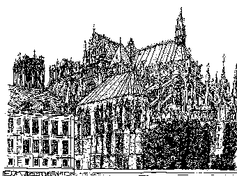
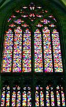
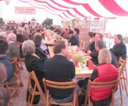
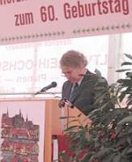

[🠔 Zur Übersicht: Burgen & Schlösser kaufen](8schloss.md)  
# Museums-, Kunst- und Kultursponsoring Informationen
**Info zu Museum & Kultureinrichtungen, zu Marketing, Spendensammlung, Sponsoring, Fundraising, Kultur & Kunst**  
_von Konrad Fischer_

 

## Ein Museum finden, gründen & betreiben, Kunst & Kultursponsoring - Spender&Sponsoren finden 
Info zu Museum & Kultureinrichtungen, zu Marketing, Spendensammlung, Sponsoring, Fundraising, Kultur & Kunst

### Präsentiert nach dem museumstypischen System Kraut und Rüben ;-)

Diese Bauwerke sind "wahr, gut und schön, oder?: 

  
Die Kathedralen zu Reims, Treguier und 
 
Evreux. Plein-air-Tusche-Skizzen von Konrad Fischer 1985 (Orig. DIN A 3) 
**Ein Klick auf das Bild führt Sie zur Kathedrale im Web!** 
Wieso das alles? Als Anregung für Kulturuser, als Beitrag zum kunstwissenschaftlichen Diskurs, als Infragestellung des gängigen Kulturbetriebs. Und auch einfach so.

---

**Inhalt** 
Kulturmanagement 
Kultursponsoring 
Museum und Kommerz 
Gründen Sie ein Museum! 25 erprobte Praxistips 
Das Museums-Quiz 
Kulturlinks 
Kulturplünderung 
Kulturzerstörung/Bildersturm 
Ehrliche Kulturverwaltung/Problem Beutekunst 
Kunsthandel/Antics/Antiques/Antiquitäten/Fine Art 
**Kunstproduzenten - Ateliergemeinschaften - Künstler**

Kunstweisheiten: 

_"Eifrige Didaktiker vergessen: 
Das Museum darf nicht neben den, 
sondern muss d u r c h die Artefakte sprechen. 
Es gibt kulturgeschichtliche Museen, 
die Heu anhäufen und hoffen, 
so an die Landwirtschaft im Mittelalter zu erinnern. 
Aber man desillusioniert den Betrachter, 
wenn man ihm zeigt, 
dass Heu eben schon zu Kaiser Rotbarts Zeiten Heu war. 
Zur Vermittlung von Vergangenheit im Museum gehören Distanz. Fiktion, Traum. 
Das Geheimnis des erfolgreichen kulturgeschichtlichen Museums 
ist eine subtile Balance zwischen Studienort und Märchenhaus. 
Natürlich können die Museen ihre traditionelle kunstgeschichtliche Klassifizierung nicht einfach abschaffen. 
Aber diese Ordnung lässt sich aufbrechen, 
variieren, 
multiplizieren. [...] 
Museen werden auch im 21. Jahrhundert notwendige Aufgaben 
für eine breite Öffentlichkeit erfüllen müssen: 
Sie bilden die Gegenstimme 
in einem Zeitalter der visuellen Reizüberflutung 
und lehren die Kunst geduldiger Erinnerung."_ 
Willibald Sauerländer, Dir. em. des Münchner ZI für Kunstgeschichte in: **_"Das Alte immer neu genießen"_** 
Süddeutsche Zeitung 6.11.1999 

_"Ein Schatzhaus ist kein Museum, 
ein Museum ist nach seiner politisch-historischen Etymologie eine öffentliche Einrichtung, 
in welcher der kollektive Besitz dem Bürger zum Besichtigen und Beurteilen offensteht. 
Der Louvre nahm den Titel "Les Musées" im selben Jahre 1793 an, 
in dem der französische König geköpft 
und der verstaatlichte Kronbesitz dem Publikum vorgezeigt wurde. 
Wenn also heute vom "Sammlermuseum" die Rede ist, 
dann sollten sich dessen Besitzer einmal kurz an den Hals fassen 
oder vorsorglich das Wort "Museum" aus dem Briefkopf streichen. ... 
Ein musealer Gegenstand ist Totem im strikten Sinne von Sigmund Freud: 
Leitbild einer überwundenen Macht, 
das nachträglich als Fetisch in Kunstgestalt verehrt wird. 
Museen sind also Stätten kultureller Kannibalisierung. 
Hier können wir bewundern, 
was die herrschende Gesellschaft sich einverleibt hat, 
um legitimierende Kraft anzusetzen. ... 
Museen sind Denkmäler von Gewalt und verschobener Ordnung. 
Damit ein Museum überhaupt an seine Exponate kommt, 
müssen diese ihrem ursprünglichen Ort entfremdet worden sein. 
Die hauptsächlichen Gründe für deren Ablösung sind: 
Säkularisierung, Kolonisierung, Zwangsversteigerung und Krieg. 
Das Museum ist der eingefrorene Querschnitt von losgelösten Kulturgütern im Durchlauf. ... 
Seine größten Zuwächse verdankt der Louvre Napoleons Ägyptenexpedition 
und den Koalitionskriegen in Europa. 
Als napoleonisches Produkt missioniert der Louvre heute die Welt à la française im Sinne Napoleons. ... 
Dank Waterloo haben die Preußen Napoleons Beutekunst wieder zurückerhalten. 
Mehr noch: 
Durch den Umweg nach Paris wurden die Kunstschätze des Königs überhaupt erst zu "preußischem Kulturbesitz". ... 
Mit der Säkularisierung der Klöster während der Besetzung Italiens wurden ortlos gewordene Bildwerke auf den Markt gespült. 
Nicht die ursprüglichen Besitzer machten Reibach, sondern Zwischenhändler, 
die mit mafiösen Mitteln die Ware ins Ausland verschoben, 
denn selbst der Papst hatte ein Verbot für die Ausfuhr italienischer Kulturgüter verhängt. ... 
Der sogenannte preußische Kulturbesitz ist also von Anfang an ein Produkt des Systems Louvre-Napoleon. ... 
Wir müssen uns damit abfinden, dass museale Kunst zur symbolischen Leitwährung des globalisierten Kapitalismus geworden ist. ... 
Diese Entwicklung entspricht dem Reliquienhandel im europäischen Mittelalter, 
der die Ausbreitung und Festigung der christlichen Kirche im Westen begleitete. 
Rohstoffquelle war damals, neben dem Heiligen Land, die Stadt Byzanz, 
deren Schätze gnadenlos ausgebeutet wurden. 
Der kulturelle Kannibalismus, die Mechanismen von Gewalt und Verschiebung, 
haben hier einen religiösen Vorläufer. 
Auch da gab es Streit, ob es statthaft sei, 
die Gebeine eines Märtyrers zu zerstückeln 
und an verschiedenen Orten zur Verehrung auszustellen. 
Die wenig pietätvolle, 
aber ökonomisch viel interessantere Lösung setzte sich durch. 
In hoc signo vincis: Wo Kunst in Museen gehortet wird, hat der Kapitalismus gesiegt."_ 
Prof. Beat Wyss, Staatl. Hochschule für Gestaltung Karlsruhe, in: _**"Ein Leitbild überwundener Macht"**_ , 
Süddeutsche Zeitung, Freitag 13.April 2007, S. 13

_"Die moderne Kunst ist ein Welt-Bluff, 
die größte Betrügerei, 
die es je gab. 
Niemand sagt ein Wort, 
weil er sofort von der Kunstmafia in den Massenmedien erledigt wird."_ 
Ephraim Kishon 

_"Ich brauche die Vergötterung des Weltschmerzes nicht. 
Mich nervt dieses Rumgesabbere, 
dieses ewige Verneinen und Kritisieren. 
Wenn die Verzweiflung der Nährboden der Kunst ist, 
dann pfeife ich auf die Kunst."_ 
Hanna Schygulla, Schauspielerin 

_"Seit die Kunst nicht mehr Nahrung der Besten ist, 
kann der Künstler sein Talent für alle Wandlungen und Launen seiner Phantasie einsetzen. 
Alle Wege stehen einem intellektuellen Scharlatanismus offen. 
Das Volk findet in der Kunst weder Trost noch Erhebung. 
Aber die Raffinierten, die Reichen, die Nichtstuer und Effekthascher 
suchen in ihr Neuheit, Seltsamkeit, Originalität und Anstößigkeit. 
Seit dem Kubismus, ja schon früher, 
habe ich alle Kritiker mit den zahllosen Scherzen zufriedengestellt, 
die mir gerade so einfielen 
und für die sie mich umso mehr bewunderten, 
je weniger sie ihnen verständlich waren. 
Durch diese Spielereien, diese Rätsel und Arabesken habe ich mich schnell berühmt gemacht. 
Und der Ruhm bedeutet für den Künstler: 
Verkauf, Vermögen, Reichtum. 
Ich bin heute nicht nur berühmt, 
sondern auch reich. 
Wenn ich aber allein mit mir bin, 
kann ich mich nicht als Künstler betrachten im großen Sinne des Wortes. 
Große Maler waren Giotto, Tizian, Rembrandt und Goya. 
Ich bin nur ein Spaßmacher, 
der seine Zeit verstanden hat und alles, was er konnte, 
herausgeholt hat aus der Dummheit, der Lüsternheit und Eitelkeit seiner Zeitgenossen."_ 
Picasso, Maler, 2.5.1952 
nach _**"Freiheit und Moral in der Politik der USA"**_ , Prof. Dr. Wjatscheslaw Daschitschew, NZ 26.1.2007 

_"Die zeitgenössische Kunst ist eine intellektuelle Onanie geworden. 
Unsere Kunst wurde hässlich und leer, ohne Schönheit, 
ohne Gott, dumm und kalt und herzlos. 
Der avantgardistische Sklave der Kunstmafia trampelt in Ruinen herum. 
So wird die Kunst pervers. 
Dieses negative, das Leben verneinende Ruinengerümpel füllt nun unsere Museen, 
rostet, verstaubt und zerfällt. 
Dieses Horrorpanoptikum der zeitgenössischen Kunst 
wird von einer kleinen farben- und formenblinden Clique angebetet wie das Goldene Kalb 
und bestaunt wie des Kaisers neue Kleider. 
Nie war die Kunst so ohne Kunst, so künstlich, entartet, 
so weit von der Natur und der Schöpfung entfernt wie heute."_ 
Friedensreich Hundertwasser 

Äußerungen des wohl mutigsten und volksnähesten und dafür von den üblichen Verdächtigen erbittert beschimpften, fertiggemachten und mit Mist beworfenen Kunstkritikers der katholischen Kirche in Deutschland: Der Kölner Erzbischof Joachim Kardinal Meisner: 
**Aus der Predigt am 14. September 2007 im Hohen Dom zu Köln zur Einweihung des Diözesanmuseums Kolumba** 

_"In den Werken der Schöpfung dem Schöpfer auf die Spur zu kommen, 
ist Sache und Berufung der Künstler. 
Darum hat die Kunst auch immer mit Gott zu tun, 
und wenn es auch rein profane Kunst ist. 
Wenn sie den Namen „Kunst“ verdient, 
ist sie immer von der Wirklichkeit der Welt abgedeckt, 
und damit hat sie eine theologische Dimension. 
Darum sind Künstler so etwas Ähnliches wie Wünschelrutenläufer. 
Sie spüren die verborgenen Wasseradern dessen auf, 
der sich in der Schöpfung selbst entäußert und in seinen Werken verinnerlicht hat. 
Der Künstler zieht das Verborgene wieder ans Licht. 
Die Weltwirklichkeit wird gleichsam durch die horizontale Dimension des Kreuzes dargestellt. 
Die Horizontale verläuft nach rechts und links ins Unendliche; 
wenn sie nicht durch die Vertikale durchkreuzt würde, 
wäre kein Überstieg des Menschen über sich selbst möglich. 
Die Vertikale macht aus dem Minus der Horizontalen das Plus der Gestalt des Kreuzes. 

Dem Menschen als Ebenbild Gottes ist es aufgegeben, 
in der Schöpfungswirklichkeit die Schöpfungsgedanken Gottes zu entbinden, 
ihnen Gestalt zu geben: 
in Literatur, Musik, Bild oder Plastik. 
Diese Schöpfungsgedanken Gottes in der Welt aufzuspüren 
und ihnen erneut Gestalt zu geben 
und die Mitmenschen daran zu erinnern, 
ist der Sinn von Kunst. 
Die Werke, in denen das in besonderer Weise gelungen ist, 
sind nicht alle kultfähig, also für den Gottesdienstraum geeignet, 
aber sie sind in unseren Museen ausgestellt, 
nicht um rein ästhetisch bewundert zu werden, 
sondern um die Betrachter und Besucher anzurühren, 
ihnen die Augen und die Herzen für eine neue Dimension des Daseins zu öffnen, 
die man in der Alltäglichkeit leicht übersieht. ... 

Die schönsten Menschenbilder Europas sind Christusbilder, sind Marienbilder, sind Heiligenbilder. 
Hier leuchtet etwas von dem innersten Wesen des Menschen auf. 
Der Mensch ist nie nur profan, er ist auch immer sakral. 
Deshalb gehört es zur Sachlichkeit des Künstlers, 
diese Menschenwirklichkeit in ihrer ganzen Breite und Tiefe zur Kenntnis zu nehmen. 
Wo das vergessen wird, wird man dem Menschen nie gerecht. ... 

Wir erwarten von unserem Museum ... dass es gleichsam ein Areopag wird, 
auf dem sich Künstlerinnen und Künstler, Interessierte, Jugendliche und Ältere begegnen, 
um aus der Gegenüberstellung von moderner und alter Kunst, von profaner und sakraler Kunst, 
sich selbst besser zu erkennen 
und damit ihren Auftrag für den Weltdienst. 
Vergessen wir nicht, 
dass es einen unaufgebbaren Zusammenhang zwischen Kultur und Kult gibt. 
Dort, wo die Kultur vom Kultus, von der Gottesverehrung abgekoppelt wird, 
erstarrt der Kultus im Ritualismus und die Kultur entartet. 
Sie verliert ihre Mitte. ..."_ 

**Gott und Mensch – Christusbilder zeitgenössischer Künstler** 
Aus dem Vortrag bei der 50. „Kunstbegegnung Bensberg“ am Donnerstag, 30. August 2007 

_"... Unsere Welt ist nicht so sehr durch äußere Katastrophen gefährdet, 
sondern durch ein inneres Gähnen, 
durch eine Langeweile, 
eben durch eine Geschmacklosigkeit, 
durch eine Abgeschmacktheit am Sein selbst. 
Hier ist es der Gottes Geist, 
der Geschmack an der Welt gibt. 
Als Gott mit Mose am Sinai redete und sich ihm offenbarte, 
legte sich – wie die Schrift sagt – der Glanz Gottes auf das Gesicht des Mose, 
sodass er ein Antlitz bekam, 
das er im Gespräch mit dem Volke Gottes durch ein Velum, einen Schleier, verhüllen musste, 
damit die Israeliten nicht geblendet wurden. 
Bemerkenswerte künstlerische Arbeiten sind von diesem prophetischen Charakter geprägt: 
sich von der Wirklichkeit beeindrucken zu lassen 
und dann die Wirklichkeit zu zeigen, 
aber unter dem Schleier, 
damit der Betrachter nicht geblendet wird, 
um das innere Leuchten der Dinge wahrzunehmen. 

Ein Künstler ist in diesem Sinn kein blendender und auch kein geblendeter Mensch. 
Seine Kunst blendet nicht, 
aber sie erleuchtet. 
Solch bleibender Widerschein des Göttlichen im Irdischen schützt den Menschen vor der Diktatur der Zwecke 
und des Nutzens 
und bewahrt ihn vor den Götzen, 
die wir Erfolg, Image, öffentliche Meinung, 
besonders auch im Kulturbetrieb, nennen 
und vor denen sich die Menschen oft unwürdig beugen. 
Dort wo die Haltung der Ehrfurcht vor der Wirklichkeit lebendig ist, 
bleiben auch Glanz und Würde über dem Dasein des Menschen, 
dort bleibt der Mensch fähig, Feste zu feiern. 
Das Fest lebt vom Glanz und der Schönheit 
und ruft daher auch nach der verklärenden Macht der Kunst. ... 

Wieviel künstlerische Avantgarde verträgt die Kirche, 
wenn sie nicht nur Avantgarde ist, 
sondern künstlerische Avantgarde? 
– Sehr, sehr viel!_ 

 Zum abstrakten **Kölner Domfenster für das Südquerhaus von Gerhard Richter** , der seinen Entwurf stiftete. 
Es zeigt ein mit dem Zufallsprinzip eines Computer entworfenes kaleidoskopartiges, 
teils gespiegeltes, teils sich wiederholendes Sammelsurium von bunten Gläsern 
in 80 Farben, die angeblich auch in den alten Domfenstern verwendet wurden. 
Düsseldorf, 29.07.2007 
(zitiert nach Kölner Stadtanzeiger) 

_"Das Fenster passt nicht in den Dom. 
Es passt eher in eine Moschee 
oder in ein Gebetshaus ... 
Wenn wir schon ein neues Fenster bekommen, 
dann soll es auch deutlich unseren Glauben widerspiegeln. 
Und nicht irgendeinen."_ 

Kommentar KF: Besser kann man wohl den Glauben unserer kirchlichen Kunstentscheider kaum widerspiegeln ;-)

_"Wir besitzen in der Welt den Ruf, daß wir Kathedralen zu zerstören imstande sind. 
Das will viel heißen zu einer Zeit, 
in der das Bewußtsein der Unfruchtbarkeit ein Museum neben dem andern aus dem Boden treibt. 
Und wirklich, wenn man mit schärferen Gläsern schaut, 
wenn man sich durch die scheinbare Schmerzlosigkeit der Vorgänge nicht täuschen läßt, 
muß man erkennen, daß wir uns bemühen, eines hohen Grades der Schonungslosigkeit würdig zu werden. 
Man muß erkennen, daß wir uns bemühen, uns Schmerz zuzufügen, 
und daß wieder wie im 15. Jahrhundert der Rauch der Scheiterhaufen über der Landschaft steht. 
Wir, deren Sprache die meisten Fremdworte zu ertragen vermag, 
haben nicht nur dem Osten und Westen weit die Tore geöffnet, 
sondern jedem Raum und jeder Zeit, die für uns erreichbar sind. 
Dies alles gleicht der peinlichen Frage der alten Kriminalordnung, 
und wer könnte etwa die eschatologische Welt Dostojewskis anders an sich herantreten lassen als mit Zähneklappern - 
mit der Furcht, keine Antwort zu finden, deren Unbarmherzigkeit dem Maße des angetanen Schmerzes entspricht. 
Die Beschäftigung des Deutschen zu dieser Zeit ist die, 
von allen Ecken der Welt Material herbeizuschleppen, 
um den Brand zu nähren, 
den er unter seinen Begriffen gestiftet hat. 
So ist es denn kein Wunder, daß alles, was brennbar ist, in vollen Flammen steht."_ 
Ernst Jünger, aus seinem Buch _**"Das abenteuerliche Herz"**_ (1929)

---

**Kulturmanagement** 
**2001** - Stiftung Moses Mendelssohn Akademie, Halberstadt 

Fachtagung: **[Finanzierungsstrategien für Kultureinrichtungen in Deutschland](12akt.md#finanzierungsstrategien)**

Für Museen, die mehr wollen als im Keller Sammlungen zu sichten, digitale Inventarlisten zu schreiben und unverkäufliche Publikationen mit geringstem Neuheitswert auf den Markt zu werfen. Wenn das Museumscafe mehr sein soll als eine schicke Mitarbeiterkantine und der Museumsshop mehr als eine Gratwanderung zwischen Volksbildungswerk und Museumskrawattenständer. Und für alle, die nach Alternativen zum Betütteln eitler Sponsoren suchen.

**Zur Besinnung** 
**Claus Koch: "Für Hilmar H."** Süddeutsche Zeitung 10.12.1999 - Auszug aus "Noten und Notizen" 

_"Es wäre schön, wenn man vor den Kulturbetrieben, die Kulturstätten längst nicht mehr sind, wieder ein paar der verschwundenen Hemmschwellen einbauen könnte. Wenn es vor fünfzig Jahren ein ehrenwertes Ziel war, die Privilegienräume der Kultur zu öffnen und das Volk in die Museen, die Theater, die Buchhandlungen und sogar ins Ballet zu locken, so war doch der Erfolg allzu durchschlagend.

Mittlerweile [...] die meisten Museen wieder leer [...] Zuschauerreihen in den Qualitätstheatern lichten sich. [...] Tanztheater hat mit seinem rabiaten Dilettantismus der Nackten und der Hässlichen die Kunstdisziplin zerstört [...] das kompetente Publikum vertrieben. Kulturprivilegierte gibt es nicht mehr. Bayreuth und Salzburg sind ganz für die Geldprivilegierten reserviert und somit von Kultur befreit. Hemmschwellen nach außen braucht es vor allem, weil Hemmschwellen für innen notwendig sind, nämlich für die Künstler.

Es gibt zu viele von ihnen, die, im Bund mit der Meute der Zwischenhändler, sich von den hemmungslosen Konsumenten korrumpieren lassen und Schlechtes liefern. Man muss heute durch Unmassen von Kulturmüll waten, wenn man gute Qualität erleben will. Das aber kann nicht in genügsamer Einsamkeit geschehen. Darum sind die leeren Museen zwar wieder ein Genuss für Kenner, zugleich aber, weil ohne Publikum, deprimierend."

_ Die im Sommer 99 öffentlich gewordene Verbreitung von Kulturdreck als CIA-Projekt seit den 50ern (vgl. hierzu [Franz Krahberger: "The Masterminds"](http://ejournal.thing.at/Buecher/puergg/master.html)) hat allen Kulturinteressierten wieder mal bewiesen, daß 1. Alles Gute dieser Zeit von den USA kommt, und 2. Nix von nix kommt. Aber jetzt zum Geld: 

**Wolfgang Görl: "Köfferchen voller Konzerte, Mehr Manager als Künstler - Wie man lernt, Kultur zu verkaufen"** , Süddeutsche Zeitung Nr. 94, 24.4.1999 - Auszüge

_"Ausgerechnet Frankfurt, ausgerechnet Hindemith. Für Wolfgang Ogrisek [...] Samstagmorgen voll kniffliger Fragen [...] Aufgabe? Konzipieren Sie für [...] Frankfurt ein Paul-Hindemith-Festival [...] daß jeder merkt: Oha, in Frankfurt weht aber ein fortschrittlicher Geist. Dafür spendiert der Kämmerer sieben Millionen Mark, auch die Banken lassen etwas springen. [...] Imageförderung ist angesagt.[...] Sonst machen die Sponsoren nicht mit.

[...] Wer war Hindemith, was hat er mit Frankfurt zu tun, wie steht´s mit seiner Aktualität? [...] Hindemith, 1895 in Hanau geboren, hat in Frankfurt gewirkt und galt in der Tonkunst als Radikaler; später das Exil [...], am Ende zurück nach Frankfurt, wo er 1963 starb. Das reicht [...] zum Hindemith-Standort [...] Exil und Moderne wären zwei Stichworte, mit denen man bei Publikum und Sponsoren Eindruck schinden könnte. "Originelle Lügen" (Ogrisek), um die Geldgeber gnädig zu stimmen, sind möglicherweise überflüssig.

[...] Leichtsinnig [...], wer bloß ein Konzert oder eine Ausstellung anböte [...]. Jede Veranstaltung muß ein Event werden [...]. Der Kulturmanager verkauft Kultur. Dafür muß er was biete [...] wofür der Kunde sein Geld locker macht und auf den Fernsehabend verzichtet. Von Kunst ist dabei nicht so sehr die Rede; vielmehr von "entertain, educate and edify". [...] Einführungsvorträge [...] Parallelveranstaltungen [...] Rahmenprogramm für Kinder [...] ordentliche Getränke, gutes Essen, saubere Toiletten. (Wenn der) Dirigent oder die Schauspieler in Form sind, kommen die Leute wieder.

"Event" [...]eine Art Zauberwort [...], mit dem man das Wunder schafft, Menschen ins Konzert, ins Theater, ins Museum zu bringen. Auch Christoph Vitali gebraucht es. Hier, im Haus der Kunst, beim Seminar "Ausstellungs- und Museumsmanagemanet", hat er ein Heimspiel. An den rotbespannten Wänden [...] Meisterwerke aus 500 Jahren. [...] genug [...] die Leute anzulocken. "Wir müssen versuchen, das Publikum zu umarmen", sagt Vitali. Abends [...] müsse man die Museen öffnen. Auch gegen ein "Event im Haus" sei nichts einzuwenden [...] Konzert nach Mitternacht oder ein Fest. [...]

[Beispiel USA:] Einnahmen müssen her, und sei es vom Markt der Geschmacklosigkeiten. Besucher einer Cézanne-Ausstellung finden im Museums-Shop Baseballkäppis mit Motiven des Künstlers [...] Nudeln in Form von Rodin-Plastiken [...] zumindest attraktiv gestaltete Tüten. Alles okay, solange es Geld bringt. [...]

[...] Michael Herrmann beim INK-Seminar "Festivalmanagement". [...] Um [teure Künstler] zu bezahlen, geht er hausieren. Im Köfferchen [...] Liste mit Konzerten in allen Preisklassen [...] bei einer Anne-Sophie-Mutter wird der Käufer einen sechsstelligen Betrag hinlegen müssen. Dafür prangt das Firmenlogo des Sponsors [...] im Programmheft, Hinweistafeln [...] am Eingang [...] respektable Menge Ehrenkarten. [...] "Viele sagen: Es ist uns eine Ehre."

[...] Kulturmanagement [...] moderne Form des Bettler- und Hausierertums sowie anderer Geldbeschaffungsmethoden unterhalb der Schwelle zum Bankraub. [...] Mäzene: Sie wollen bloß Gutes tun, und sei es für Kunst. Spender [mahnen] steuerlich wirksame Spendenquittung (an). Sponsoren wollen eine Gegenleistung: Werbung [...] dem Image und der Corporate Identity dienlich [...]. Ganz schwierig ist es mit den Kämmerern. [...] gezwungen zu sparen. Sieben Millionen für Hindemith - das gibt´s nur im Spiel. [...]

_

[Frans Francken: Der Tod und der Kaufmann (1620)](http://www.religionsunterricht.de/ifr/ifr45zd2.htm)

Alles richtig. Und wichtig aus meiner Sicht: 

1. Klare und gut vorzeigbare Vorstellung vom "Kulturprodukt" entwickeln, sonst findet sich vielleicht kein "Käufer"/Sponsor. Im Baufall ein übersichtliches (Gesamt-) Konzept mit klaren Kostendaten. 

2. Giganten der Lotto-, Geld- und Versicherungsbranche, Quasi- bzw. Möchtegern-Monopolisten der Energie-/Wasser-/usw.-Fraktion sind effektivere Gesprächspartner für Sponsorenanfragen als örtliche Metzgermeister und Handwerksfirmen.

3. Sponsorship auf Dauer anlegen. Das fordert Höflichkeit, Händchenhalten, Platzwarmhalten und treue Nachsorge. Sponsoring ist auch der Wunsch nach Kommunikation. Solche "Gespräche" dürfen nicht einfach abgebrochen werden. Das einfachste für den Kulturmanager ist ein treuer Sponsor.

4. Kein Sponsorenfriedhof. Sponsoren lieben es nicht, neben Konkurrenten zu sponsorieren. Also Branchenmix bzw. Konzentration auf einen Hauptsponsor.

5. Gutes Angebot. Sponsoring erfordert unbedingte Gegenleistung. Das muß nicht unbedingt ein fußballtorgroßes Gerüstplakat mit dem Sponsorenlogo sein - da gibt es sehr viele und im Sinne des Sponsors besser funktionierende Möglichkeiten, die der Gesponsorte sein eigen nennt. Nur weiß Letzterer das oft gar nicht, weil er vom Sponsoring nix versteht. Da liegt dann der Hase im Pfeffer.

6. Deutschlands Nachkriegsvermögen wollen vererbt werden. Wie wär´s mit der Suche nach reichen Erbschaften, die sich in Kulturstiftungen verewigen wollen? Die diesbezüglichen Strategien kann man von der Deutschen Stiftung Denkmalschutz trefflich lernen. Herzerweichende Monatsbriefchens, schauerliche Baunotfälle in rührendster Journalistik dargeboten. Löbliche Berichte von edlem Spendertum. Tränenabdrückerei, Nostalgie- und Notzeitenschmonz. Kindchen-, Arm-ab, Krücken- und Rollstuhlschemata geben das Vorbild für den heftigen Apell an das Gute bzw. das schlechte Gewissen im Mitmenschen. Hut ab vor derartig tiefen und funktionierenden Einblicken in das deutsche Spenderherz! Stiftung/Foundation!! Denken wir mal an die Finanzierung des historischen Kirchenbaus und seiner Ausstattung. Was da aus Erbschaften und "Donationen" floß! Leider betreibt die Kirche diesbezüglich erforderliches Gesülze und überirdische Panikmache nicht mehr so professionell wie einst. Vielleicht fehlt´s ja hier und da auch an der richtigen Einstellung. Lesbenhochzeiten und Kriegstreiberei sind vielleicht mehr trendy. Ob das aber Spenderhirne und -herzen genug bewegt und die Hüttchen dauerhaft zusammenhält? Und die Kanzelbesetzung sichert? Gottseidank gibt´s für letzteres ja Pfarrer aus der dritten Welt: 

Obermain-Tagblatt 30.4.1999 
_**""Vor allem bin ich ein Christ"** 
Neues Gesicht in der Pfarrei/Geistlicher aus Indien hilft aus/Lob für Gastfreundschaft [...]"_ 

Na ja, letztlich werden wir wohl mit Fundis, Pietkong und kosovarischen Imamen auch zufrieden sein müssen. Es geht ja um Ökumene. Und mit der neuen Einigung zur Rechtfertigungslehre können endlich auch die katholischen Mitbrüder jeden menschlichen Schwachsinn theologisch rechtfertigen. Dem lieben Gott muß das jetzt egal sein. "Weil wir so brav sind...". Vom gerechten Gott ist ja keine Rede mehr. Reli für geistig Behinderte? "Hauptsache, die Seele ist schwarz", sagte der Pastor karfreitags auf die Frage, ob sich seine bunte Krawatte zieme. 

Zum Abschluß eine kleine Weisheit meines Schwiegervaters Prof. Rudolf Bohren, seines Zeichens evang. Theologe und Predigtlehrer: 

**_"Das Zeitalter der Aufklärung muß erst noch kommen: Ein Zeitalter ohne Vormünder und Entmündigte, eine radikale Aufklärung, in dem keines Wissen und Verstand mit Finsternis umhüllet ist. [...], sind doch die Kirchentümer wie die Fakultäten behaftet mit einem Mangel an Erkenntnis und also einer unvollendeten Aufklärung. Der Nachholbedarf an Aufklärung ist allenthalben größer als wir uns vorstellen."_** 

---

**Kultursponsoring**

So fangen Märchen an: Es war einmal, als die Staatsknete noch für unsere Politiker und die Kultur ausreichte ... - Das ist offenbar vorbei, "die Wirtschaft" ist nun zuständig, hier kräftiger zu unterstützen. Natürlich tut sie das nie ohne Gegenleistung. Das muß man wissen: Wirtschaftskapitäne huldigen nicht der christlichen Seefahrt. Oder - denkt man an das System Pizarro, vielleicht doch? 

**Obermain-Tagblatt 24.11.1999**

**_"Wirtschaft soll mehr Kultur sponsoren_**

_BERLIN. Kulturstaatsminister Michael Naumann (SPD) hat bei der Bundesvereinigung der Deutschen Arbeitgeberverbände um neue Geldquellen für die Kultur geworben. Er forderte die Wirtschaft zu einem "offensiven Kultursponsoring" auf, wie [...] im Sport [...]. [...] Zusammenwirken von Staat und Wirtschaft in einem ausgewogenen Verhältnis zwischen Ereignissen mit Eventcharakter und stetiger Kulturarbeit könne [...] vielfältiges Kulturleben fördern. "Politik ohne Kultur ist unfrei, sprachlos und ohne Sinn."

Die geplante Änderung des Stiftungsrechts soll [...] steuerliche Anreize zum "Kultur-Stiften" geben,.... Steuerliche Hemmnisse sollten beseitigt und "neue Möglichkeiten für Mäzene, Stifter und Kultursponsoren" eröffnet werden."

_ Na, wenn das "der Kultur" nur wirklich hilft. Im Land der unbegrenzten Möglichkeiten dient das Stiftungswesen bekanntermaßen vorwiegend dazu, reichen Pinkeln das weltweit zusammengeklaubte Geld vor der Steuer zu retten und durch wohldotierte Stiftungsposten der gierigen Politikerclique angenehme Oasen zu sponsorieren. Dafür hat dann der Staat zwar nicht mehr Geld mehr für "Kultur", der "Wirtschaft" bleibt dann aber mehr übrig, um den US-Wahlkampf zu dotieren. Das kostet, die Demokratie. Immerhin kommt dabei allerbeste Kultursensation raus. Das mögen höchstens altchristliche Dummheinis net: 

Süddeutsche Zeitung 18.12.1999 - Was aktuelle Konservierungstechnik an einer schwarzen Madonna aus heiliger Elefantenkacke zu leisten vermag - 

_**"Bildersäuberer 
Attentat auf schmutzige Jungfrau** 

Mit allen Mitteln hat New Yorks Bürgermeister Guiliani versucht, die [...] im Brooklyn Museum of Art gezeigte "Sensation"-Ausstellung zu schließen. "Krank", "blasphemisch" und "anti-katholisch"[...], was er dort sah. Doch sein [...] Feldzug scheiterte [...] nun griff ein Attentäter [...] zu radikaleren Mitteln. Er schmuggelte eine Dose weißer Latexfarbe in die Ausstellung und bespritzte [...] Gemälde, das das religiöse Empfinden des Wahlkämpfers Guiliani besonders verletzt hatte: 

Chris Ofilis "Holy Virgin Mary". Ofili verwendete für seine Darstellung der Jungfrau Maria unter anderem Elefantendung und Fotos weiblicher Geschlechtsteile.

[...] Die Ehefrau [des Attentäters] gab später an, dass ihr Mann als strenger Katholik gegen "Gotteslästerung" habe protestieren wollen. Den Elefanten-Kot und die Ausrisse aus Porno-Magazinen auf dem Bild habe er für frevelhaft gehalten. Am Morgen der Tat habe er gesagt: "Das soll das Bild der Mutter Jesu sein, ich werde hingehen und es reinigen."

_ So ein Dummkopf. Dabei weiß doch heute offenbar jeder Neger, was es mit dem "logos spermatikos", dem "göttlichen Eros" und der "creatio continua" in den Bildelementen der abendländischen Kunstwerke wirklich auf sich hatte - vor allem, wenn er als "Chris" getauft und als ehrenwerter Meister der Künstlergilde ausgebildet wurde. Und war nicht der Hl. Lukas der Erste Madonnenmaler? Allerdings waren die mehr oder weniger heiligen alten Pinselschwinger noch nicht so gerissen, das vor Jedermanns Augen zu enthüllen. Doch heute, im allseits gelobten Zeitalter der Aufklärung, muß das wohl durchgehen. 

So empfehlen wir die künftigen wirtschaftsfeindlichen Sensationsauftritte von Schlingensief mit Meir Mendelssohn sowie Faßbinders "Der Müll, die Stadt und der Tod" vor dem geneigten New Yorker Publikum - wo doch die Kulturbanausen in Deutschland und Tel Aviv sowas nicht durchgehen lassen wollen. Wir schlagen auch den islamischen Religionsstifter und vielleicht ´nen siebenarmigen Thoraschrein mit Schläfenlocken als nächste Opfer vor für Ofilis schwarze Kunst. Und ein heißer Tipp unter Kollegen: Für sowas bieten auch Ochs und Esel gute Kacke mit Brunz. Und sogar das Wüstenkamel. In London bekommt Ofili dann wenigstens, was ihm gebührt: Den Turner-Kunstpreis (s.u.).

Weitere Info zur SENSATION-Ausstellung (z.T. mit Abbildung des wunderschönen Elefantendung-Kunstwerks): 

[Ofili + Werke](http://www.cmoa.org/international/html/art/ofili.htm) 
[Ofilis Holy Virgin Mary bei arts.guardian.co.uk](http://arts.guardian.co.uk/pictures/image/0,8543,-11504640117,00.html) 
[Waste: quel che resta dell'arte - Ofilis Holy Virgin Mary und andere Kack-Kunst bei kainos.it](http://www.kainos.it/numero4/percorsi/waste.html) 
[Welcome to the Brooklyn Museum of Art](http://www.brooklynart.org/) - Homepage 
[ZKM Frontpage: 04.10.99](http://on1.zkm.de/news/artlog/1999/10/04/) 

**Die Idee schlechthin - oder Rumpelstilz 2000? Süddeutsche Zeitung 17.12.99 (Vorsicht! Keine Satire):** 

_**"Aus Staub wird Geld 

Künstler in Augsburg sponsern sich selbst** 

[...] Die Idee eines modernen Mäzenatentums des Augsburger Künstlers Klaus Zöttl ist bislang weltweit einmalig[...]. Der Künstler packte [...] Korrosionsmaterial, Staub und Schmutz(teilchen) [...] die [...] bei der Restaurierung der Augsburger Renaissance-Brunnenfiguren Augustus, Herkules und Merkur anfielen, in Glasröhrchen, ließ je drei Röhrchen in einen Ahornholzblock ein und nannte das Gesamtkunstwerk "particula". [...] 

Die im Sinne von Joseph Beuys "sozialen Plastiken" werden nun von Klaus Zöttl und sieben städtischen Kunstpreisträgern veräußert, die sich zu einem gemeinnützigen Verein zusammengeschlossen haben. [...] 1000 Mark [...] pro "particula" [...] - Spenden [...] muss der "Förderverein für zeitgenössische Kunst e.V." nicht versteuern.

Von den Zinsen [...] werden dann [...] Werke [...] bedeutender Künstler aufgekauft, um so eine Sammlung "nichtpopulistischer" Kunst zu beginnen. [...]"

_ Ja du meine Güte, wie tief wird sich die _"nichtpopulistische Kunst"_ denn noch erniedrigen? Wenn schon Leichenfledderei, warum nicht gleich als sparsame Berührungsreliquie? Oder gleich ein bisserl Dreck von Werweißwoher, Hauptsache offiziös zum rostigen Heilixblechle zertifiziert? Dann muß es nicht bei _"150 solcher Objekte"_ von modernen Abstaubern für "_Sozialplastik_ "-Fans bleiben. Darf man "Abstauber" zu solchen Künstlern sagen? 

**Doch nun zu den Sponsoring-Links:**

**Meine o.g. Sponsoringtipps**

[Stiftung zur Bewahrung kirchlicher Baudenkmäler in Deutschland](http://www.ekd.de/kiba/welcome.html) 
Aufmachung beispielhaft, Spende empfohlen! Wenn wir Christen vielleicht auch nicht den modernsten "Glauben" haben, wissen wir zumindest eines: Unser Verein hat die schönsten Vereinsfeste und -hütten (vorzugsweise die gammeligen Baudenkmale unter ihnen, selbstverständlich), die sogar Heiden oder gar Materialisten/Atheisten/Wissenschaftsgläubigen offenstehen. Meist sogar ohne Eintrittsgeld . Wie lange noch? Helfen Sie mit zur Erhaltung abendländischer Kulturumwelt auch über das Morgen hinaus und lassen Sie den Klingelbeutel mal klingeln. Was wäre Osterhasi, Pfingstochs, Weihnachststreß und Silvestertrubel ohne Glockengeläute? Na sehen Sie!

<http://www.kultursponsoring.de/> 
[Fachverband für Sponsoring und Sonderwerbeformen](http://www.faspo.de/) 
[www.public-sponsoring.de](http://www.public-sponsoring.de/index.htm) 
[www.sponsor-service.de/stex/Kultursponsoring/Kultursponsoring.htm](http://www.sponsor-service.de/stex/Kultursponsoring/Kultursponsoring.htm) - Sponsor - Service, die Sponsorbörse im Internet mit tausenden von Kontaktadressen. 
[kultur plus: Kooperationsangebote für Mäzene](http://www.kulturplus.de/sbkooperationsangebote.htm) 
[www.doemich.de/kultursponsor_inhalt.html](http://www.doemich.de/kultursponsor_inhalt.html) - Kultursponsoring im Internet - Sponsoring beruht auf Leistung und Gegenleistung mit dem Zweck, die jeweiligen Zielsetzungen von Sponsoringgeber und –nehmer effektiver zu erreichen. 
[Contrib.Net-Art, Culture & Media](http://www.kultursponsoring.de/) 
[Fachverband Sponsoring mit Publikationen zu Kultursponsoring](http://www.faspo.de/)

Verwandte Themen: Sozialmarketing, Spenden, Betteln (keine Zigeunerlinks!) und Fundraising - 

[Bundesarbeitsgemeinschaft Sozialmarketing BSM - Deutscher Fundraising Verband e.V.: Fragen rund ums Sozialmarketing/Fundraising](http://www.sozialmarketing.de/Spenden-FAQs.13.0.html) 
[pan-adress Sozialmarketing](http://www.pan-adress.de/) 
[Deutscher Spenden Spiegel](http://www.spendenspiegel.de/) 
[Willkommen bei nonprofit.de - Informationen für Vereine Verbände Organisationen](http://www.nonprofit.de/) 
[nonprofit.de: Interessante Webseiten Spenden/Fundraising/Sozialmarketing](http://www.nonprofit.de/links.html) 
[Jugendsozialarbeit online - Finanzierung, Sponsoring, Stiftungen](http://bagkjs.jugendsozialarbeit.de/) 
[FundRaising.Com: Home Page](http://www.fundraising.com/) (Kommerzielle Info mit Fundraising-Artikelvertrieb) 
[Fundraising Ideas & Products Center](http://www.fundraising-ideas.org) - Traditional, unique and even bizarre fundraising ideas and products, including a large selection of do-it-yourself options. 
[All Fundraising Companies Directory](http://www.fundraisingweb.org/) - 1200+ fundraising companies. Choose from the most fundraising ideas and fundraising products on the Internet. 
[Charity Fundraising Events Mall](http://www.fundraisingweb.com)- Non-profit groups of all sizes and interests can find the most appropriate event for their next fundraiser. 
[Church Fundraising Ideas Center](http://www.fundraisinginformation.com) - Fund raising ideas for church group fundraisers. Make money and have fun with some different fundraising alternatives! 
[Österreichisches Institut für Spendenwesen](http://www.spenden.at/) 
[Fundraising im Internet: Potentiale – Inhalte – Spenderwünsche - Dissertation von Beate Patolla (PDF)](http://scidok.sulb.uni-saarland.de/volltexte/2005/441/pdf/Beate_Patolla-Fundraising_im_Internet.pdf) 

---

**Museum und Kommerz** 

Und wenn´s mit dem Sponsoring nicht geklappt hat, es gibt ja noch den echten Kommerz - Süddeutsche Zeitung 22.10.1999: 

_**"Mousepad mit Monet** 
Finanznot macht erfinderisch: Museen als Konsumtempel 

Die originellsten Geschenktipps aus Hochglanzmagazinen [...] auch in Museums-Shops. [...] Nachbildungen von antiken Stücken, Design-Klassiker aus dem Bauhaus, Repliken von antikem Schmuck oder nummerierte Multiples zeitgenössischer Jung-Künstler.

[...] Möglichkeit, per Internet und Kreditkarte vom heimischen PC aus zu ordern.

[...] Immer mehr Alltagsartikel [...] in die Verkaufsregale der Museen gewandert: Mousepads, Schlipse, Seidentücher und T-Shirts, Papeterie, Spielzeug und Porzellan, versehen mit Motiven von Vermeer bis Keith Haring [...] Trend: Kuschelkunst, die immer weniger mit den eigentlichen Museumsexponaten zu tun hat.

_ [Einschub: Das erinnert mich doch stark an den Münchner Architekturstudenten an der TU, der lieber in das Museumscafe in der Glyptothek als in die Mensa ging. 

Der im 97. Stock auf der Aussichtsplatform des in Warschau an Stelle des Rekoschlosses besuchten Domy Kultury namens Josef Stalin überrascht das dort bereitgehaltene Angebot am Liftausstieg wahrnahm: Neben den obligaten Postkarten Regaltürme von Ölsardinen. Cola hätte man in Anbetracht der Schulklassenbesucher vielleicht noch verstanden.

Und war nicht der Geheimtip zur Partnersuche immer, Madels im Museumsrundgang anzuquatschen?

Das Museum kann also schon lange mehr als Wissenstransfer leisten. Vielleicht gibt´s dort ja bald Klopapier und Weichspüler im Sonderangebot, wenn das so weitergeht mit der Selbstfinanzierung.]

_Die kunterbunten Einrichtungs-, Geschenk- und Kuriositäten-Boutiquen signalisieren [...] deutlichen Wandel im [...] Museumsbetrieb. [...] Flankierendes muß her. [...] mehr Besucher [...] kommen nur und lassen zusätzlich Geld da, wenn [...] Freizeitwert der Kunsttempel stimmt und [...] Amüsement, Kommunikation und Events aller Art geboten werden. 

_ [Einschub: Und vielleicht nicht nur in Burgmuseen bestünden eigentlich gute Chancen für den wieder zum Leben erweckten Raubritter inklusive Schutzgelderpressung via Creditcard und SM-Folterkammer. Vielleicht gäbe es auch die Möglichkeit hier und da den bösen Neonazismus durch Henkervorstellungen, Galgen, Hackebeil, Vierteilen, Pfählen und Rädern überzeugend und publikumswirksam zu bekämpfen. Hört doch mal auf die medialen Scharfmacher - und auf zu alten Ufern!] 

_Vorbild New York

Die kommerzielle Öffnung der Museen [...] Folge der maroden Finanzlage [...] Bei rigiden Sparprogrammen lassen sich Ausstellungsbetrieb und Neukauf von Bildern und Skulpturen nur am Leben erhalten, wenn auch in staatlichen Institutionen neue Geldquellen erschlossen werden.

_ [Einschub: Wie wär´s mit organisierter Einschleusung von Schein-Asylanten aus den Ländern, aus denen man seine Raub- und Beutekunst bezogen hat und bezieht? Wenn doch heute das Geld zur Pflege deutscher Kultur nun mal nicht mehr da ist! Die verdeckten Transportwege sind traditionell bekannt, die Hehlerkontakte zweckdienlich. Das bringt echt Verdienst und ist noch nicht mal so kolonial und british/francais wie sonst.] 

_[...] USA [...] die meisten Kulturbetriebe ohne staatliche Förderung [...] auf Spendengelder und eigene Geschäftsideen angewiesen sind._ 

[Einschub: Na also, die eine Welt-Kulturnation schlechthin macht uns doch die erfolgreichen Geschäftsideen Eingeborenenausrottung, Sklavenhandel und auch sonst alles Wahre, Gute und Schöne vor. Nachmachen!] 

_Herausragendes Beispiel ist das Metropolitan Museum in New York. Was dort an Papierwaren, Schmuck und Dekorationsgegenständen angeboten wird, galt jahrelang als geschmackssichere Insel für Einheimische und Touristen in der kulturellen Wüstenei des amerikanischen Alltags. Man braucht dafür nicht einmal in das Museum selbst zu gehen. [...] separater Laden [...] am Rockefeller Center. 

_ [Einschub: Der Traum jedes wahren Wahrers seines Nibelungenhorts. Gold im Depot und Museums-Talmi bei Aldi als Finanzierungsquelle. Und gar keine blöde Pädagogik mehr. Und schmutzige Besucher, deren Kondensat das Goldkettchen langfristig zerstören wird. Echt spitze! Und fast schon virtuell. Pretty America-God´s own country.] 

_In Deutschland hat die Berliner Dependance des Guggenheim-Museums im Gebäude der Deutschen Bank "Unter den Linden" den Museumsbetrieb mit unternehmerischem Pfiff und Witz auf Trab gebracht. Zwei Drittel des Sortiments [...] entsprechen dem, was in New York auf der Fifth Avenue am Central Park angeboten wird. 

_ [Einschub: Auch Koks, Heroin in abgestuften Reinheitsgraden und Crack neben vielem anderen Stoff, woraus unsere Alb-Träume sind?] 

_[...] Geschmacksmuster [...] überall die gleichen [...]: [...] Peggy Guggenheims silberne Pantoletten und ihre wild geschwungene Sonnenbrille sind Dauerseller [...] Espresso-Tassen "Frank Lloyd Wright" [...] Mahagoni-Köfferchen mit erlesenen Dürer-Farbstiften. Reißenden Absatz finden aber auch erschwingliche Multiples aus der berliner Kunst- und Designer-Szene und [...] Ottmar Hörls hintersinnige "Unschuldsseife" im Holzkästchen, limitiert auf die Einwohnerzahl Deutschlands, 

_ [Einschub: Ja gibt´s des immer noch? Und meint der jetzt nur die deutschen Ur-Einwohner Deutschlands oder gar alle? Des sind fei dann gleich dolle Unterschiede in der Verkaufsauflage, gell!] 

_oder seine zipfelmützigen Gartenzwerge in den Farben Schwarz, Rot, Gold. 

_ [Einschub: Ja wieso denn nicht in Grün? Und Gelb? Und Kurd und Türk? Des sind doch die Gartenzipfelmützen der Gegenwart und Zukunft, oddä?] 

_Zu Kalenderfesten [...] Einfallsreichtum. [...] für den Ostertisch ein ganzes Gehege voller Kunst-Hasen [...]. 

_ [Einschub: Und demnächst zum Pascha Porzellan-Mazzen von Rosenthal? Und zum Ramadan Kehlkopfwürger von Ali Ben Mooshammerlik? Und Weihnachten Krippenstroh aus Gold von Rumpel Stilz? Des wer ächt Keil!] 

_Auch in Bremen, Wuppertal und Emden, Mannheim und Wolfsburg werden längst nicht mehr nur Kunstbände, Kataloge und Plakate feilgeboten. 

_ [Einschub: Und in Wolfsschanze und dem Berghof? Gibt´s da vielleicht demnächst Vorder- und Hinterlader für den Sammelschrank? Und ein Zunderei für die Milleniumsfeier? Wenn´s der Kunde doch will!] 

_Kunstbücher [...] verkaufen sich nur dann gut, wenn eine publikumswirksame Ausstellung zum Thema läuft. [...] Mehr Profit macht [...] "Flachware" [...] - Kugelschreiber, Mousepads und Schnickschnack [...]. 

_ [Einschub: Darf´s demnächst auch ein grasiges Wasserpfeifchen im Museums-Coffee-Shop sein? Da gäb´s doch auch feine Kunden, die man sonst nur selten im Museum sieht. Und wäre eine gute Chance für die evtl. erforderliche bessere Freiflächenbewirtschaftung. Mit Gras und Bistrotischchen. So wäre in der Museumstoilette dann auch mehr los. Und die Nadeltoten geben doch klasse Äggtschnkunscht ab, oder? Ein Event, den wir doch heute lieben müssen. Wie soll man denn seine Fernseh-Kinder sonst noch am Leben teilhaben lassen und zum Überleben trainieren als in solchem Kulturmilieu. Gebt uns mehr Museumsnächte! Und teilt dabei Waffen aus!] 

[Wachsende Umsätze] 

_Um den Markt auszuweiten, startete in Bremen im vergangenen Jahr eine eigene deutsche Museumsmesse, auf der sich 50 Verleger von Print-Waren_

[Einschub: Sind das Aachner Printen? Meine Kinder mögen auch immer am liebsten die Süßigkeiten-Auslage der Tankstelle.] 

_und Hersteller von Repliken und Merchandise-Artikeln den Betreibern von Museums-Shops vorstellen. [...]_

_[...] fiskalische Seite ist für kommerziell orientierte Museumsläden keine Bagatelle. [...] steuerliche Vergünstigungen. [...] können für den Museums-Shop als wirtschaftlichen Geschäftsbetrieb entfallen. Repliken aus eigenem Bestand unterliegen dabei ebensowenig der Umsatzbesteuerung wie Kataloge, Postkarten und Poster, allerdings nur bis zum geringen Umsatz von 60.000 Mark. Bei T-Shirts, Kaffeebechern und Krawatten sieht die Sache anders aus. [...]_

_Diese Probleme schaffen sich Museen am ehesten vom Hals, wenn sie ihre hauseigenen Läden verpachten. Damit reduziert sich [...] Etataufbesserung [...] . Auch das äußere Erscheinungsbild der Verkaufsstände und der Inhalt ihrer Regale unterliegen dann fremder und daher manchmal unliebsamer Regie._

[Dieser elitäre Dünkel! Nehmt Euch doch mal ein Beispiel an den Devotionalien-Ramschläden inkl. Coke, MacSchlabber und Eis in, auf, unter, um und herum St. Peter in Rom. Auch hier zeigt uns das so unverdient langmütige Rom wieder mal, wo´s in Deutschlands Musentempeln langgehen sollte. Bloß daß diese herzlos-doofen Pietisten das wieder nicht verstehen. Der gewohnt totalitäre Erzieherismus, oder was? Das hat schon Il Fascio non comprendet.] 

_[...] Betreiber von Art-Stores stellen [...] Sortiment ohne kunsterzieherischen und geschmacksbildenden Anspruch [...] nach Umsatzkriterien zusammen. Sie scheuen dabei nicht die gnadenlose Wiederholung gängiger Motive auf allen nur erdenklichen Objekten. 

_ [Ach was. Bei einem echten Gläubigen schadet die Gnadenmadonna auf der Unterhose doch gar nichts. Und wenn die CDU Verhüterli im Wahlkampf verteilt, gehört dann eben ein Raffaelo-Engelchen drauf. Und bei der PDS eben das liebe Jesulein, das allen alles zu Weihnachten schenkt. Is doch schööön!] 

_[...] ULLA FÖLSING" 

_ Resümee: Alles gut und schön, aber das Eigentliche (was mag das wohl sein?) möglichst nicht ganz vergessen. Und eine bessere Kulturpolitik wär´auch schon was. Muß den alles nur den Armen und Schwachen aus hier und überall in den unersättlichen Rachen geschmissen werden? Von Staats wegen? Da geht doch der Scheriff von Nottingheim gleich in den Wald, wenn Robin die Schatzkammer weiter so entwaltet. Es gibt doch nicht nur Sozialisten, oder? Und auch hier vielleicht wirkungsvollere Konzepte. Das Land Hessen hat nun seine Museumsbestände "betriebswirtschaftlich" bewertet. Das läuft dann über kurz oder lang auf die Ossi-Methode Schalk-Golodkowskis hinaus: Vermarktung des Kulturguts im Sinne der Privatisierung allen Staatseigentums. Viel Spaß dann beim Preisverfall für all die Dürers, Rembrandts und van Goghs, die demnächst den Markt überschwemmen werden! 

Gibt es Auswege aus der staatsgestützten Zerstörung unserer Gesellschaft?

Obermain-Tagblatt 16.11.1999

_**Abstimmung mit den Füßen** 
Zehntausende Kunstinteressierte stürmten in der "Langen Nacht" ihre Museen 

**_MÜNCHEN_** 
Von Stephan Maurer

Zehntausende Kunstinteressierte haben bei der ersten langen Museumsnacht am Samstag in München die Museen und Sammlungen gestürmt. [...] Manche Häuser mussten zeitweise die Pforten schließen, so groß war der Andrang. [...]

20 Mark kostete die General-Eintrittskarte inklusive Benutzung der Shuttle-Busse. Der Preis animierte auch junge Leute zum Museumsbesuch. [...]

Schon nach kurzer Zeit wurde der Ruf nach einer weiteren "Langen Nacht der Museen" laut. [...]

"Eine tolle Stimmung", schwärmte Pinakotheken-Chef Reinhold Baumstark. [...] Überraschungen für die Nachtschwärmer [...]. In der Neuen Pinakothek etwa ließen sich Münchner Modeschöpfer von den Bildern inspirieren. In einem Raum lagerten auf weichen Polstern Schönheiten in wallenden Gewändern, [...]. Vor Claude Monets berühmten Bild "Seerosen" bestaunten die Besucherinnen einen "Traum in Blau", ein eigens entworfenes Couture-Kleid [...] den träumerischen Impressionen Monets nachempfunden [...] . Dazu [...] Musik von Komponisten wie Schumann, Brahms, Wagner und Debussy.

[...] "Brechend voll, fantastische Stimmung, so etwas haben wir noch nicht erlebt", schilderte Doris Schlechter von der "Galerie der Künstler" in der Maximilianstraße. Die "Museumsnacht" hat [...] Publikum angesprochen, das sonst um die Museen eher einen Bogen macht: "Leute, die Spaß und Unterhaltung suchen."

_ Der Erfolg wird ausgebaut: Süddeutsche Zeitung 11.3.2000 

**__"Abendöffnungen zum halben Preis, attraktive Shops, Restaurants und Events__ 
_In den staatlichen Museen weht ein neuer Geist_** 
**_Die Pläne des Landtags von 1998 nehmen allmählich Gestalt an: Vorbilder sind die USA, Wien und London_**

_Von E l i s s a S o b o t t a 
Mehr als drei Viertel der Deutschen gehen fast nie ins Museum. Genau diese Menschen möchte der Landtag in die bayerischen Museen locken - mit Abendöffnungen zum halben Preis, attraktiven Museumsshops und Restaurants, Konzerten, Büfetts und Events wie der "Langen Nacht der Museen". "Die Leute wollen nicht nur gebildet, sondern auch unterhalten werden, essen und einkaufen", erklärt Paul Wilhelm (CSU), Vorsitzender des Ausschusses für Hochschule, Forschung und Kultur[...] hat [...] Konzept "Lebendiges Museum" initiiert [...]. Vorbild [...] Museumspolitik der USA; [...] aus Berlin, Wien und London [...] Anregungen. [...]_

[...] Donnerstagabend [...] Pinakotheken-Abend: Die Neue und die Alte Pinakothek öffnen bis 22 Uhr. Begleitend [...] kostenlose Führungen [...] Vorträge oder Konzerte. [...] Büfett in den Eingangshallen [...] für sechs Mark ein Glas Wein [...] Biergarten [...] soll [...] außerhalb der Öffnungszeiten des Museums - bis 2 Uhr nachts - in Betrieb sein. [...] Museumsläden [...] in der Alten und Neuen Pinakothek [...] jedes Jahr 40 Prozent beim Umsatz zugelegt [...] besseres Angebot [...] mehr Broschen, Tassen und Krawatten, die nur in München erhältlich sind.

Voraussetzung [...] Einnahmen aus Shops und Restaurants gehen nun nicht mehr zu 100 Prozent, sondern nur zu 20 Prozent an das Finanzministerium. [...] Langfristig [...] zentrales Museumsfachgeschäft in der Innenstadt geplant.

Gemeinsam mit der Stadt errichtet der Freistaat einen Info-Point für Touristen im Alten Hof. [...] Reklame an Bahnhof und Flughafen verstärkt. Die Busse der Museums-Linie 53 sollen Museums-Plakate tragen. Auch ein Museums-Magazin ist in Planung. Die Lange Nacht der Museen soll im Oktober wiederholt und langfristig zur Institution werden [...].

Konzerte, Videos und Disko bis 2 Uhr früh

Vorbild [...] Haus der Kunst [...] öffnet täglich von 10 bis 22 Uhr, auch an Feiertagen [...] fast doppelt so lange wie die Staatsgemäldesammlungen. Die Abendöffnungen lohnen sich: Rund ein Drittel der Besucher kommen nach 17.15 Uhr. [...]. sbo"

Das Geheimnis der modernen Kunst offenbart diese Meldung der Süddeutschen Zeitung am 27.11.1999: 

_**"Recycling** 
Das exklusive Amsterdamer Luxuswarenhaus Bijkenkorf hat seinen Kunden Abfall verkauft. Künstler des "Instituts für Ökonomische Disharmonisierung" [...] im Rahmen eines Kunst-Happenings 207 Gegenstände aus dem Müll in die Regale geschmuggelt [...]. Alte Schals, Teller und eine Bettdecke wurden mit kopierten Preisschildern ordentlich ausgezeichnet. [...] Die Müll-Schmuggler wollten [...] zeigen, dass der Wert von Dingen durch die Art der Präsentation bestimmt wird. Die peinlich berührten Kaufhaus-Verantwortlichen erklärten, der Müll sei kaum vom normalen Angebot zu unterscheiden. Man wisse daher nicht wieviel Abfall noch in den Regalen liege. (epd)"_ 

So ähnlich hat man es sich ja schon gedacht - Obermain Tagblatt 6.12.1998: 

**_"Kunstpreis für Elefanten-Dung_** 

_Chris Ofili (29), der seine Gemälde mit trockenem Elefanten-Dung dekoriert, hat Englands wichtigste Auszeichnung für moderne Kunst erhalten. Eine Jury sprach ihm in London den mit über 55.000 Mark (20.000 Pfund) dotierten Turner-Preis zu. Eine Preisrichterin hatte Ofilis bunte Bilder als profan und pornographisch abgetan. Ein Kritiker: "Ich habe genug von Scheiße, die sich als Kunst ausgibt." 

Doch die Gesamtjury lobte "die Originalität und Energie seiner Bilder und den dynamischen Gebrauch von Farben". Ofili, der in Manchester als Sohn nigerianischer Eltern geboren wurde, nutzt neben Öl- und Acrylfarben auch mit Harz versiegelte Exkremente von Elefanten aus dem Londoner Zoo, Collage-Papier und Stecknadeln."_ 

- wenn er mit letzterem die Dung-Voodoo-Püppis der Jury-Mitglieder ein bisserl piesacken würde, wäre das herrlichste Kunst-Action - oder? Denken Sie nur an seine schwarze Madonna aus Elefantenkacke. 

Auch nicht schlecht - OT 12.2.03: 

_**""Amateure" leimten Guggenheim-Museum**

BILBAO. Einem jungen Paar ist es gelungen, ein selbst gemaltes Bild in das Guggenheim-Museum der nordspanischen Stadt Bilbao zu schmuggeln und es unbemerkt zweieinhalb Stunden lang an die Wand zu hängen. Die Aktion wollte auf "den geringen Wert der modernen Kunst" aufmerksam machen.

Das 50 mal 40 Zentimeter große Bild zeigt eine auf ein Holzbrett gemalte rote Spirale, die sich in der Mitte zu einem Herz formt. "Ich habe fünf Minuten gebraucht, um es zu malen", sagte einer der Eindringlinge. Um das "Wirbelwind der Liebe" getaufte Werk authentischer zu machen, versahen es die Aktivisten mit einem Schild, das es als Schenkung ... auswies."

_ NZ 25.2.2000: 

_**"Zum Tode von F. Hundertwasser**

Im Alter von 61 Jahren ist der Maler, Grafiker und Kunstgestalter Friedensreich Hundertwasser gestorben. Der gebürtige Wiener hieß eigentlich Fritz Stowasser. Die Mutter war Jüdin. Vor allem mit seinen "Naturhäusern" sorgte der Verstorbene für Aufsehen. Ab 1981 lehrte er als Professor an der Wiener Kunstakademie. Die meiste Zeit des Jahres lebte er auf seinem Anwesen in der Normandie bzw. Neuseeland, dessen Staatsangehörigkeit er zusätzlich angenommen hatte.

Hundertwasser hat die etablierten Schickimickis mit heftiger Kritik an Auswüchsen des Modernismus in der Kunst geschockt. So äußerte er beispielsweise:

"Die zeitgenössische Kunst ist eine intellektuelle Onanie geworden. Unsere Kunst wurde hässlich und leer, ohne Schönheit, ohne Gott, dumm und kalt und herzlos. Der avantgardistische Sklave der Kunstmafia trampelt in Ruinen herum. So wird die Kunst pervers. Dieses negative, das Leben verneinende Ruinengerümpel füllt nun unsere Museen, rostet, verstaubt und zerfällt. Dieses Horrorpanoptikum der zeitgenössischen Kunst wird von einer kleinen farben- und formblinden Clique angebetet wie das Goldene Kalb und bestaunt wie des Kaisers neue Kleider. Nie war Kunst so ohne Kunst, so künstlich, so weit von der Natur und der Schöpfung entfernt wie heute."

_ Auch eine auserwählt gute Idee - SZ-Leserbrief 9.2.02: 

_**"Begnadete Blicke auf des Kaisers neue Kleider** 
**Tausend Stunden starren / SZ vom 23. Januar** 

Andrian Kreye berichtet aus New York über eine Werkschau des 36-jährigen Bildhauers und Installationskünstlers Tom Friedman im Museum für zeitgenössische Kunst. Friedmans meistzitiertesStück heiße "1000 Hours of Staring" (Tausend Stunden Starren) und bestehe aus einem gewöhnlichen, leeren Blatt Papier, das der Künstler aus dem mittleren Westen der Vereinigten Staaten zwischen den Jahren 1992 und 1997 tausend Stunden lang angestarrt habe. 

Wenn Blicke töten könnten! Nein, sie können es nicht. Dennoch vermögen sie viel. Sie vermögen zum Beispiel einen banalen Gegenstand zum Kunstwerk zu erheben. Solches vollbrachte Tom Friedmann mit seinem leeren Blatt weißen Papiers, das durch das tausend Stunden lange Anstarren zu einem Kunstwerk wurde, welches nun im New Yorker Museum of Contemporary Art ausgestellt ist. Eine erstaunliche Leistung, freilich eine mühevolle, denn tausend Stunden sind eine lange Zeit. Immerhin sinnvoll und zweckmäßig angewandte Zeit. Hätte Friedman nur in die Luft gestarrt, wäre kein Kunstwerk entstanden. War er sich von Anbeginn der Magie seines Blickes bewusst oder merkte er erst nach 378 Stunden, dass mit dem Papier eine Veränderung vorging? War nach 800 Stunden das Wark im Grunde schon fertig und gab er noch 200 Stunden drauf, um es zu einem besonders guten Werk zu machen? 

Man müsste Blätter zum Vergleich haben, die unterschiedlich lange angestarrt wurden, um solche bohrenden Fragen zu beantworten. Eines jedoch steht fest: Tom Friedman hat begnadete Augen. Und eine begnadete Spucke. Unter seinen Ausstellungsstücken befindet sich nämlich auch "ein rosaroter Kloß aus 1500 gekauten Kaugummis". Es versteht sich, dass er sie selber gekaut hat, denn aus Gummis, die von irgendwelchen Banausen ausgelutscht wurden, hätte nichts Künstlerisches entstehen können. 

Vielleicht entdeckt Friedman, dass noch andere seiner Körperausscheidungen wundersamer Natur sind, sodass er dem Publikum ein Fläschen mit Rotz und Ohrenschmalz vorstellen könnte. Aber das wäre nicht originell, da schon vor dreißig Jahren ein Avantgardist seine Exkremente in Konservendosen verpackte und als "artist´s shit" verkaufte. 

Friedmans Stärke liegt im Subtilen, Vergeistigten, wie jenes Papier beweist. Und da könnte er sich durchaus einiger Dinge annehmen, die bisher noch nicht künstlerisch gestaltet wurden. Wer "1000 Hours of Staring" zu materialisieren versteht, wird auch anderes bewältigen, etwa den Schnee von gestern, den langen Schatten, den die Ereignisse vorauswerfen, des Kaisers neue Kleider sowie jenes legendäre Messer ohne Griff, an dem die Klinge fehlt. 

Einem Gerücht zufolge hat ein Besucher nach Musterung der Friedmanschen Werke lauthals gelacht. Er wurde vom Aufsichtspersonal sogleich aus der Galerie entfernt und vom Direktor mit Hausverbot belegt._ Alfons Scholz, Neubeuern" 

**Buchtip zum Thema:** Hans Jürgen Syberberg: "**Vom Unglück und Glück der Kunst in Deutschland nach dem letzten Kriege** "Matthes & Seitz, München 1990, ISBN 3-88221-761-8 
Zum kulturellen Identitätsverlust in der Nachkriegsepoche. Syberberg gehört neben dem Regisseur Schlingensief, der den Bubis-Kritiker und Grabschänder Meir Mendelssohn in seine Theater-Ereignisse einbezieht, zu den derzeit terribelsten Enfants der aktuellen Kunstszene. Ein provokatives Buch. 

---

**Museum und Wirtschaftlichkeit - Tipps von Dr. Manfred Steinröx:**

**Gründen Sie ein Museum!**

**25 Praxistips, den Dachboden zu leeren, Ansehen zu gewinnen und einen Kämmerer zu ruinieren**

1. Der Dachboden ist voll, Sie wissen nicht, wohin mit dem Erbe? Gründen Sie ein Museum! 

2. Kein Geld? Ihre Gemeinde wartet nur darauf, Ihnen Ihre Last abzunehmen! 

3. Machen Sie zunächst aus Ihrer Last ein begehrtes Kulturgut. Bitten Sie aber nicht um Unterstützung – erklären Sie sich bereit, eventuell als Stifter bereitzustehen. 

4. Sie haben keine teuren Ölschinken bekannter Maler – macht nichts: Regionalspezifische Alltagskultur ist in. 

5. Die Opposition im Gemeinderat ist Ihr geborener Verbündeter. Die aktuelle Mehrheit zögert bei der Annahme Ihrer Schenkung? Womöglich ein gutes Thema für den nächsten Wahlkampf: die örtliche Identität wird ignoriert, die Bewahrung traditioneller Werte ist bedroht, die Standortqualität gefährdet! Ihr Projekt erhält erste Unterstützung. 

6. Doch bis zur nächsten Wahl sollten Sie nicht warten. Fühlen Sie gleich auch mal im Rathaus nach. Die Gemeinde hat keinen Platz? Lassen Sie sich nicht abwimmeln. Bieten Sie die Last aus Tante Irmtrauts Nachlaß gleich mit an – das alte Haus, dessen Renovierung sich eh‘ nicht mehr lohnt. Wohnte da nicht auch früher mal der Großonkel des bekannten Heimatdichters? Na also: noch ein Kulturgut! 

7. Sehen Sie: schon schwankt der Kulturausschuß. Jetzt müssen Sie fix nachlegen. Wäre das nicht auch ein Thema für die Volkshochschule? „Auf den Spuren der eigenen Vergangenheit“. Zwischen Blumenstecken und Italienisch für Anfänger. Das Interesse ist groß. Und der Bürgermeister soll gleich mal im Kulturministerium nachfragen. Da gibt’s bestimmt Zuschüsse. 

8. Die Dinge nehmen ihren Lauf. Der Schwager des Bürgermeisters, ein Architekt, freut sich: ein Museumsbau ist immer gut fürs Renommee. Der Umbau des Gebäudes ist natürlich unwirtschaftlich. Aber es geht ja schließlich auch um höhere Werte. Deshalb gibt der Kultusminister ordentlich dazu. 

9. Jetzt will jeder dabei sein: schnell bildet sich ein Förderverein - auch andere sind auf dem Dachboden gewesen und haben Regionalgeschichte gefunden. 

10. Ein Student der Geschichtswissenschaft bietet an, nach Beendigung des 17. Semesters seine Diplom-Arbeit dem Thema zu widmen. Denn wenn man erst einmal einen Fuß im Museum drin hat... 

11. Das Museum nimmt Formen an. Zwar wird alles etwas teurer, als geplant, aber die Wünsche der Ratsfraktionen wollen ja berücksichtigt werden: Stühle mit Stadtwappen für die einen, Blumenbeete in den Landesfarben für die anderen... 

12. Die Diplom-Arbeit ist fertig. 300 Seiten: toll! Der Historiker ist arbeitslos: Klasse! Nun kann er doch demnächst als ABM-Kraft das neue Haus wissenschaftlich leiten. 

13. Bei der Eröffnung sind alle stolz. Jetzt ist man endlich wer – mit eigener Kultur! Das neue Haus wurde sogar in der Architektenzeitung abgebildet. Schade, daß der Bürgermeister kaum zu erkennen war. 

14. Nach der Eröffnung kommen kaum noch Besucher. Macht nichts: der Fundus muß schließlich erst archiviert und erforscht werden. Der Historiker will nicht am Ort versauern, also muß er publizieren – da bleibt für Führungen auch nur wenig Zeit. 

15. Ärgerlich: neue Ratsmitglieder (Neubürger!) stänkern. Die Unterhaltskosten seien viel zu hoch. Dumm: die Besucherzahlen gehen weiter zurück. Der Museumsleiter soll also noch vor Auslaufen seiner ABM-Förderung ein Marketingkonzept entwickeln. 

16. Kein Problem: ein Tag der offenen Tür bei Sonnenschein läßt die Besucher strömen. Gezählt wird, wer Wurst ißt und Bier trinkt. Museumsleiters Frau, die neue Lehrerin, besucht mit ihren Schülern regelmäßig das Museum. Am Jahresende kann er 25% mehr Besucher vermelden. 

17. Noch mal gut gegangen! Die Festeinstellung geht klar. Zusätzlich 25.000 DM für in neues Inventurprogramm. Und 5.000 DM für’s Marketing. 

18. Außer Schulkindern scheint sich niemand mehr so recht für das Museum zu interessieren. Selbst DRK und Arbeiterwohlfahrt winken dankend ab: deren Zielgruppe besucht lieber Molkereien und Brauereien... 

19. Jetzt wird aber ernst gemacht mit dem Kulturmarketing: aus dem Büro des Museumsleiters wird ein Museumscafé. Die Frauen der Fördervereinsmitglieder backen Samstags Kuchen. Ein Ausstellungskatalog wird gedruckt. Er liegt – trotz EU-Zuschuß und Vorwort des Staatssekretärs - wie Blei in den Regalen. 

20. Es hilft alles nichts. Der Zuschußbedarf steigt unbeirrt weiter. Museumsunterhaltung und Personalkosten zwingen die Gemeinde in die Knie. Und die Feuerwehr braucht schon seit Jahren ein neues Löschfahrzeug. Also, weg mit der Last – aber elegant, es handelt sich schließlich um Kultur. 

21. Aus dem Museum wird eine Stiftung. Gut, daß die Gemeinde noch eine eigene Sparkasse hat. Sie stellt das Stiftungskapital zur Verfügung. Die Gemeinde ist endlich die Verantwortung los. Der Bürgermeister erhält einen Ehrenplatz im Beirat. 

22. Der Museumsleiter nimmt die Veränderungen hin. Nicht aber, daß es bald darauf aufs Manuskript tropft. Er arbeitet schließlich an seiner Dissertation. Ein Lehrauftrag, das wär’s! Das Dach ist eindeutig ein Sanierungsfall. Die Dämmfassade schimmelt. Ob der Schwager-Architekt doch nicht so fit war? 

23. Aber woher das Geld für die Sanierung nehmen? Das Stiftungskapital gibt’s nicht her. Rücklagen und Abschreibungen kannte der Kämmerer nicht, also wurden solche Positionen auch nicht mit eingeplant... 

24. Wer schießt nun nach? Bei der Landesregierung ist niemand mehr zuständig, die Sparkasse fusionierte inzwischen mit dem Nachbarinstitut, der Förderkreis ist längst mit der Gründung eines Kleinbahnmuseums beschäftigt... 

25. Der Bürgermeister will wiedergewählt werden, und wer wollte auch den Wert Ihrer Kulturgüter ernsthaft in Frage stellen? Der Kämmerer muß ’ran ! Muß eben die Sanierung des Freibades bis nach der Wahl warten. Und die eigentliche Lösung des Problems? 

Wir wissen natürlich nicht, wie solche Projekte in Ihrer Gemeinde angegangen werden. Empfehlenswert ist folgende Vorgehensweise: 

* Wenn Sie Besucher und Eintrittsentgelte „angeln“ wollen, müssen die Nutzungskonzepte dem Publikum gefallen – so wie der Wurm dem Fisch. _Besucherzahlen_ und erzielbare _Einnahmen_ lassen sich prognostizieren.
* Mit Zuschüssen ist es wie mit Steuersparmodellen: sie trüben oft den Blick auf das „Danach“. Teuer wird erst der laufende Betrieb, denn Defizite müssen Sie als Träger alleine ausgleichen. Sie benötigen eine _Ertragsvorschau_ als wichtige Investitionsgrundlage, damit Sie wissen, was auf Sie zukommt.
* Nichts altert so schnell wie ein „Denkmal“. Und nichts ist weniger einnahmeträchtig. Vordergründige Originalität im Architektur-Entwurf geht oft zu Lasten der _Betriebskosten_. Kein Ausstellungskonzept lebt so lange wie das Gebäude – also muß sich letzteres immer wieder verändern lassen können. Die laufenden Kosten (Reinigung, Heizung Instandhaltung) lassen sich optimieren - wenn Sie die richtigen Vorgaben schon in der Planungsphase (_Ausschreibung_) machen.
* Beschränken Sie Ihr Kulturangebot nicht auf den defizitären Bereich. Auch Kinos leben nicht vom Kartenverkauf alleine. Aber Shops und Gastronomie können zur Bürde werden, wenn das _Sortiment_ nicht paßt oder der _Pachtvertrag_ nicht stimmt.
* Gründen Sie kein „Amt“, wenn Sie eine „Kulturdienstleistung“ etablieren wollen. Motivation und (wirtschaftlicher) Erfolg bedingen Flexibilität in der Organisation. Schaffen Sie dem Zweck angemessene _Betriebsstrukturen_. Das können je nach konkreter Situation Verein, GmbH, Stiftung oder andere sein.

Dr. Manfred Steinröx 
Wirtschafts- und Kommunalberatung 
Alte Holstenstr. 42 
21031 Hamburg 
Tel.: 040 / 724 60 91, Fax: 040 / 724 60 92 
[www.steinroex.de](http://www.steinroex.de/)

---

**Das Museums-Quiz nach dem Motto: "Ein bißchen Spaß muß sein"**

**Zur Einführung**

_"Aufgrund der Strategien der Inszenierung liegt das eigentliche Ziel, das durch die Einrichtung in dieser neuen Ära von Museen erreicht werden soll, in der Kommunikation von abstrakten - wenn nicht erklärterweise ideologischen - Komplexen. Dabei handelt es sich um eine Art von Inszenierung, die dank dreidimensionaler und multimedialer assemblage direkt auf die emotionale Reaktion des Besuchers zielt._

_... Überall [in alten Bauten] die unerbittliche Hand von Architekten, Einrichtern und Installateuren. Wer auf der Suche nach einer authentischen Begegnung, nach irgendeiner Emotion ist, soll, wenn er will, ins Museum gehen: Denn der alte Gasthof mit den knarrenden Böden, die ausgestopften Tiere und irgendein alter verkohlter Druck existieren nicht mehr, nicht in Südtirol und noch viel weniger im Trentino._

_... Der explizite Ruf nach einer spielerischen Annäherung, die stärker auf der emotionalen Seite und auf der freien Assoziation von Ideen basiert als auf der Genauigkeit des scharfen Verstandes, birgt das Risiko in sich, wie jedes schöne Spiel nur kurz zu dauern, und den Besucher nicht dazu anzuregen, zu vertiefen und zurückkehren zu wollen - ähnlich wie es in einem x-beliebigen Luna Park passiert, wenn man einmal die Runde gemacht hat und den Schwindel entdeckt hat."_

Dr. Giovanni Kezich, Direktor des [Museo degli Usi e Costumi della Gente Trentina, San Michele all`Adige](http://www.museosanmichele.it/), in: "Anmerkungen zum Museumswesen in Tirol", Der Schlern 77/2003, S. 58

**Das Quiz 
Woran erkennt man ein Museum?** 
A) Am liebevollen Umgang mit seinen Exponaten 
B) Am respektlosen Umgang mit seinen Exponaten 
C) Am liederlichen Umgang mit seinen Exponaten 
D) Am gewalttätigen Umgang mit seinen Exponaten

**Wie präsentiert ein modernes Museum seine Exponate? 
**A) Sie spielen angesichts der befremdlich unbrauchbaren Museumsarchitektur und aufgeblasenen Dekorationskulisse die traurige Rolle des verschmähten Liebhabers 
B) Sie liegen knöchern, hölzern, blechern und papiern in punktlichtgenau-bespotteten Reliquienschreinen aus Edelstahl-Kristallglas und verbreiten unwürdevollste Scheinheiligkeit 
C) Sie schmachten in staubigen Depotregalen, verschimmeln und verrotten 
D) Sie stehen einfach so nichtssagend und/oder als Anfaßobjekte im Raum herum

**Wie adaptiert man ein Baudenkmal zum Museum?** 
A) Es gilt als bauliches Exponat, wird unverfälscht akzeptiert, seine Baugeschichte wird pietätvoll als eigenständiger Wert respektiert und in die Exponatinszenierung behutsam integriert 
B) Es gilt als störender Fremdkörper und wird spurlos wegdekoriert 
C) Es ist total egal und wird weggebrochen, verfremdend verändert, norm- und behindertengerecht modernisiert und angebaut auf Museumsgag komm raus 
D) Erst wird die Substanz bauarchäologisch zerforscht, dann Gewünschtes als Leipziger Einerlei phantasievoll in Plastezementbauweise rekonstruiert und heimattümlich dekoriert - hochwissenschaftlich begleitet von einer publizistischen Sintflut der krautrübigen Belanglosigkeiten

**Was leistet computervermauste Multimedia im Museum?** 
A) Sie ernährt ihre Macher und animiert einfältige Eltern und Großeltern zum Museums-CD-Rom-Kauf für die gottseidank lieber doofbleibenden Gören 
B) Der virtuelle Automat will modern sein und entzieht das Exponat dem Verständnis bis ins Unendliche 
C) Ihre schrille Langweiligkeit schreckt interessierte Besucher ab 
D) Ihre touchscreenige Sterilität bringt auf spannende Handytastaturspiele geeichte Kids zum Gähnen

**Was leistet die Museumsgehäuse?** 
A) Es bietet den Exponaten technisch perfekten Schutz 
B) Seine [zerstörerische Haustechnik garantiert Klimaschwankung, maximale Betriebskosten und Objektzerfall](7temper.md) 
C) Es bietet den Exponaten einen sinnigen und objektgerechten Schauraum 
D) Es bietet den Exponaten die größtmögliche Verfremdung

**Was charakterisiert das Museumsarbeit?** 
A) Kaputtierung der Exponate durch gnadenlose Restaurierung, [Kaputtheizung ](7temper.md)und Präsentation ([Themenlink Bausünden im Freilicht-Museum](http://fachwerkhaus.historisches-fachwerk.com/fachwerk/index.cfm?ly=1|0|forum|a|showForum|56797)) 
B) Gemütliche Kaffeekränzchen, Textchens, Listen solange der Haushalt reicht 
C) Äußerster Sachverstand und grenzenlose Mühewaltung zum alleinigen Wohle der anvertrauten Kostbarkeiten 
D) Bissigste Besucherabwehr und gnadenloseste Durchsetzung des Fotografierverbots

**Warum geht der Besucher ins Museum?** 
A) Weil es draußen regnet 
B) Weil er seine entfremdete Persönlichkeit mit mystifizierter Historizität aufladen will 
C) Weil er von den Exponaten was versteht und dazulernen will 
D) Weil sich sein kaltes Herz an aufgespießten Schmetterlingen delektiert

**Was lernt der Museumsbesucher?** 
A) Auch Kleinkleckersdorf kann allerlei historische Bruchstücke in Reih und Glied, einen Schatzgräber und mehrere Kunsträuber aufbieten 
B) Moderne Kunst ist nicht jedermanns Sache, der Shop hat schöne Regenschirme, die Besuchermädels sind zum Anbeißen 
C) Alte Schinken sind sowas von langweilig, das Museumscafe lohnt sich 
D) "Geschichte" ist ideologische Mystik, das Museum ihre Fälscherwerkstatt, die trotz angestrengter Multidimensionalität unerklärt außerhalb ihrer angestammten Umgebung inszenierten Exponate verkommen zum Kehrichthaufen des Gewesenen

**Was interessiert den Ausstellungsmacher am meisten?** 
A) Das warmgeheizte Pöstchen als Sprosse der Karriereleiter 
B) Die Wirkung seines Werks auf die neidischen Kollegen 
C) Die Wirkung seines Werks auf die träge Masse des Publikums 
D) Das soziopolitpathologische Umfeld der Exponate

**Und was kennt er vom Zustandekommen seiner Exponate?** 
A) Die Werkgeheimnisse der klassischen Künstler 
B) Die [vielfachen Deutungsebenen klassischer Kunstwerke](8dom.md) 
C) Den weitgespannten Bildungshorizont des klassischen Künstlers und seiner Auftraggeber 
D) Die AT-gestützt [moralpsychologisierende Deutungspraxis](8dom.md#mondjesus), aufgesetzt auf Datierungs- und Meisterfrage

**Wem vertraut der Museumsdirektor am unbedingtesten?** 
A) Dem überlegenen Interventionswissen des skalpell-, spritzbesteck- und chemiewaffenbestückten Diplomrestaurators 
B) Dem "unabhängigen" Raumklimatiker als Haupmultiplikator der Klimatechnik 
C) Dem Museums-Ufogehäuseplaner 
D) Dem Hausmeister

**Wie soll ein Museumsexponat museal exponiert werden?** 
A) Im jungfräulich rekonstruierten, nie dagewesenen Urzustand von Anno Tobak 
B) Zeitlos plastifiziert, mumifiziert, eingefroren, verknöchert und versteinert 
C) Beseelend auraverströmend lebendig und weiter an der Geschichte alterungsfähig teilhabend 
D) Mit allen geschichtsbezeugenden Änderungen, Verfallserscheinungen, Verschmutzungen, Alterungs- und Gebrauchsspuren

**und dabei präsentiert und erläutert** 
A) in strengster Befolgung aller zeitgeistigen Tabus 
B) unter genauester Beachtung aller aktuellen Konventionen von Wissenschaft, Politik und Kunst 
C) wie es gerade überall und sonstwo gemacht wird 
D) und völliger Miß- bzw. Beachtung des "gesunden (?) Volksempfindens" und "guten Geschmacks"

**Woran erkennt man ein Freilichtmuseum?** 
A) An den modernen Besuchern 
B) An den [verrottenden Häusern ohne Heizung](7temper.md) 
C) An den ohne [leider verrottenden](7temp17.md) Exponaten wie Möbel, Gerät, Kleidung 
D) An der "Living history" zwischen Pferdeäpfeln, Rauchwurst, Wikingerkeule, Kettenhemdnachbildung und härenem Gewand

**Wer ist der größte Feind des Museums?** 
A) Der Kassenwart des Museumsträgers 
B) Die Objektkorrosion 
C) Der Besucher 
D) Die das Museumskonzept veralternde Zeit

---

**Kulturlinks 
**Kunst und Kultur in Deutschland****

[E-Mail-Verzeichnis Museen bei Robert Strötgen](http://www.stroetgen.de/) 
[Museen im Internet](http://webmuseen.de/) 
[Das virtuelle Online-Fenstermuseum - Das muß man gesehen haben!](http://www.paxclassic.de/Fenstermuseum/) 
[Schloßmuseum Jever: Links für Fachleute und Museumsfreunde](http://www.schlossmuseum.de/) 
[VL Museen : Museumsrecht, Kulturgutschutz, Denkmalschutz](http://www.histsem.uni-freiburg.de/mertens/graf/museumr.htm) - Ziel dieser Seite ist die virtuelle Vernetzung institutioneller und privater Internetangebote zum Kulturgutschutz und zum Recht der Museen, Archive und Bibliotheken. 
[AHF München](http://www.ahf-muenchen.de/) - Historische Forschung außerhalb der Universitäten - umfangreiche Tagungsberichte und -beiträge!

22.10.1999, Rudolstadt, Schloß Heidecksburg, Herbstsymposion der Thüringer Stiftung Schlösser und Gärten: Schloßmuseum und Museumsschloß - Museumsarbeit in Schlössern und Gärten - [Seminarmitschrift](6sv.md)

[Museen in Bayern](http://www.museen-in-bayern.de/) 
[Bayern.de](http://www.bayern.de/) 
[Haus der Kunst München](http://www.hausderkunst.de) 
[Haus der Bayerischen Geschichte](http://www.hdbg.de/) 
[Diözesanmuseum Freising](http://www.dioezesanmuseum-freising.de/) 
[Architekturmuseum Schwaben](http://www.architekturmuseum.de) 
[Adriaen de Vries - ein Renaissance-Bildhauer in Augsburg](http://de.wikipedia.org/wiki/adriaen_de_vries=) 
[Das Germanische Nationalmuseum Nürnberg](http://www.gnm.de/)

Das museale Ereignis des Jahres 2004: Prof. Dr. Konrad Bedal, Nestor der wissenschaftlichen Hausforschung, wurde 60: 
Ein ganzes Festzelt kam zur Gratulation Der Jubilar dankt 
Das schönste Geschenk: _Herbert May/Kilian Kreilinger (Hg.): Alles unter einem Dach. Häuser, Menschen, Dinge. Festschrift für Konrad Bedal zum 60. Geburtstag, Petersberg 2004_ 
[Restaurierung der Tiepolo-Fresken in der Würzburger Residenz](http://www.tiepolo-wuerzburg.net/) 
[Alamannenmuseum Ellwangen](http://www.alamannenmuseum-ellwangen.de) - in einem Armen- und Siechenhaus von 1593 mit verlängerter Sonderausstellung: "Die Reiterkrieger von Pfahlheim" 
[Burgen und Schlösser am Obermain](http://portal.obermain.de/index.php?id=67) 
[Der Bamberger Dom](http://www.eo-bamberg.de/eob/dcms/sites/bistum/bildung/bamberger_dom/index.html) 
[Kunstsammlungen der Veste Coburg](http://www.kunstsammlungen-coburg.de)- internationale Spitzenklasse: Glas, Rüstungen, Waffenkammer, Kupferstichsammlung u.a. Grafik, altdeutsche Meister der Sammlung Schäfer 
[Aachener Dom](http://www.aachendom.de/) 
[Berlin](http://www.berlin.de) 
[- Deutsches Historisches Museum](http://www.dh-museum.com) 
[- Sehenswürdigkeiten Berlin](http://www.meinberlin.net/berlinguide/) 
[Dresden](http://www.dresden.de) 
[- Frauenkirche](http://www.frauenkirche-dresden.org/) 
[Bauhaus Dessau: Die geteilte Moderne. Architektur im Nachkriegsdeutschland](http://www.bauhaus-dessau.de) 
[Düsseldorf](http://www.duesseldorf.de) 
[- Kunstsammlungen](http://www.kunstsammlung.de) 
[Hamburgs Museum für Kunst und Gewerbe](http://www.mkg-hamburg.de) 
[- Weltkulturerbe Lübeck](http://www.luebeck.de/) 
[Schwimmkran Langer Heinrich](http://www.langer-heinrich.de.vu/) - mit interessanten Links zu weiteren maritimen Seiten 
[Köln](http://www.cologne-in.de) 
[- Willkommen beim Kölner Dom](http://www.koelner-dom.de/) 
[- Kölnischer Kunstverein](http://www.koelnischerkunstverein.de) 
[München](http://www.muenchen.de) 
[-Deutsches Museum](http://www.deutsches-museum.de) 
[Das Deutsche Schloss- und Beschlägemuseum in Velbert](http://www.velbert.de/kultur-freizeit/schloss-beschlaege/default.asp) 
[Südtiroler Volkskundemuseen in historischen Häusern und Burgen](http://www.provincia.bz.it/volkskundemuseen/Jm_dt_0.htm)

---

****Andere Länder und Städte/Other countries****

[Landkarten online](http://www.lib.utexas.edu) - Mit vielen Links 
[documentatie.org](http://www.documentatie.org/uds4/zoekpagina.asp) - Das sensationelle Angebot aus Holland zur Dokumentation historischer Bauwerke - Bilder, Texte und Literaturverweise zuhauf! 
[Links zu Burgen- und Schlossmuseen weltweit](8reise.md) 
[Die christlichen Heiligtümer im Heiligen Land](http://198.62.75.1/) - Sehenswerte Informationen des Franziskanerordens auf Malta 
[Catedrales](http://www.esglesia.org/) - **eine spanische Linksammlung zu Kathedralen im Web - Spitze!** 
[Generalat der Zisterzienser in Rom](http://www.ocist.org/) - Schöne Links zu Zisterzienserklöster, Aktivitäten und Literatur weltweit 
[Antikes/Geheimnisvolles](http://www.mysteriousplaces.com) 
[ECC: Cultural Routes: The different cultural Routes](http://www.culture-routes.lu/) - Vom Jakobsweg über Wikingerspuren bis zum Nordlicht am Polarkreis 
[MUSEUMS AND EXHIBITIONS - by TEFAF](http://www.tefaf.com/DesktopDefault.aspx?tabid=19&tabindex=18) 
[Museumexperts.com - Webportal](http://www.museumexperts.com/) - ständig aktuelle Museumsinfo - was läuft, was kommt, was war? 
[Amsterdam](http://www.amsterdam.nl) 
[Ägypten - eine Expedition in die Vergangenheit](http://www.scriptorium.org/) 
[- Die sieben Weltwunder](http://www.design-training.com/art/wonders-of-the-world/) 
[- Spannendes Informationsangebot zu den Pyramiden und anderen Sehenswürdigkeiten Ägyptens](http://www.pbs.org/wgbh/nova/pyramid/explore/) 
[Barcelona](http://www.bcn.es) 
[China](http://zhouyi.com/1) 
[- Museen in China](http://www.chinapage.com/museum.html)

**Japan** 
[Miho-Museum](http://www.miho.or.jp) - Ieoh Ming Pei´s "Shangrila" mit Kunstwerken verschiedenster Kulturen und Epochen von der Prähistorie bis zur islamischen Zeit 

**Frankreich**

Klicken Sie auf das Bild, Sie kommen zu meinen Reiseskizzen von Burgen und Schlössern im Beaujolais](8beau.md)

[120 Villes et Pays d'Art et d'Histoire](http://www.vpah.culture.fr/vpah/france/france.htm) 
[Albi - La Cathédrale Ste. Cécile](http://www.mairie-albi.fr/arthisto/lieux/stececile/cathedrale.html) - mit dem berühmten Jüngsten Gericht 

[- Paris](http://www.paris.fr/portail/accueil/Portal.lut?page_id=1) 
[Site officiel du musée du Louvre](http://www.louvre.fr/) 
[Archevêché de Paris / Visite de Notre-Dame](http://www.cathedraledeparis.com) 
[Reims cathedrale accueil](http://www.cathedrale-reims.com/) 

Und was sonst noch wichtig ist: 
[AERIA - Die Akropolis - Parthenon](http://www.phil.uni-erlangen.de/~p1altar/galerie_html/akropolis/parthenon.html) - Top Antikenadresse der Uni Erlangen. Bilder satt. 

[Griechische Museen - Museums in Greece](http://de.greece-museums.com/) 
[Acropolis Museum](http://www.theacropolismuseum.gr/) 
[Smithsonian Institution](http://www.si.edu/) 
[London Museum Guide](http://www.ukguide.org/london/museum.html) [Toronto's Top Museums](http://www.kanetix.ca/top-toronto-museums) 
[Der italienische Touristenführer](http://www.itwg.com) 
[Italienische Museen](http://www.emmeti.it/Arte/musei.it.html) 
Eine Tour zu [Galilei und Leonardo](http://www.imss.fi.it/index.html), geführt vom Florentiner Museum für Wissenschaftsgeschichte 

[Rom](http://www.Roma2000.it) 
[ROMA ANTIQUA](http://www.roma-antiqua.de/) 
[Rom und sein Weltreich](http://welcome.to/Markus-Homepage) 
[- Vatikanische Museen ](http://www.christusrex.org/www1/vaticano/0-Musei.html) **Empfehlung:** Dieser Besuch lohnt! Sie kommen bis Jerusalem! 

[- Der Heilige Stuhl / Vatican direkt](http://www.vatican.va/) 
[London 1](http://london.all-uk.com/) 
- [London 2](http://www.LondonTown.com) 
- [National Gallery](http://www.nationalgallery.org.uk/) 
- [British Museum](http://www.british-museum.ac.uk) 
Süddeutsche Zeitung 11.5.1999: 

"Skulpturen bröckeln 
_Briten lassen Kunst verkommen_ 
_Das[Britische Museum](https://www.britishmuseum.org/) hat die vor fast 200 Jahren von der [Akropolis ](http://www.phil.uni-erlangen.de/~p1altar/photo_html/topographie/griechenland/athen/akropolis/ebene5.html)nach London geholten [Figuren](http://www.phil.uni-erlangen.de/~p1altar/photo_html/bauplastik/fries/parthenon/ebene4.html) vom [Parthenon](http://www.phil.uni-erlangen.de/~p1altar/galerie_html/akropolis/parthenon.html)-Fries nach Angaben eines Experten völlig verkommen lassen. Das immer wieder gegen die Rückgabe an Griechenland angeführte Argument, die Kunstschätze würden in London optimal bewahrt, sei eine "zynische Täuschung", sagte William StClair. [...] Autor eines Standardwerkes über die [Giebelskulpturen](http://www.phil.uni-erlangen.de/~p1altar/photo_html/bauplastik/fries/parthenon/ebene4.html), die 1803 von Lord Elgin "zu ihrer sicheren Aufbewahrung und als vollständige Repräsentation des klassischen Athen" nach England geholt worden waren. [...]dpa"_

Süddeutsche Zeitung 20.11.1999: 

_**"Mehr Hackaktion denn legaler Kauf** 
Beschädigte Götter - Der Streit um die Elgin Marbles / SZ vom 28. Oktober 
[...] Lord Elgin hat sie keineswegs "legal von der damaligen Regierung gekauft". [...] als Gesandter in Konstantinopel 1799 den Sultan um Erlaubnis gebeten, Abgüsse von Skulpturen machen zu können und einige alte Steine mit Figuren und Inschriften nach London mitnehmen zu dürfen. Damals betrachtete die "Pforte" Großbritannien als wichtigen Verbündeten [...]. Wie hätte der Sultan einen so harmlos klingenden Wunsch eines vermeintlichen Freundes ablehnen sollen? 

[...] nun aber kam [...] gewaltige Hack-Aktion. [...] dreihundert Arbeiter [...] beschäftigt, abzumontieren, zu sortieren [...] zu verpacken. Die Beute [...] 200 meist riesige Kisten [...]. Viele Stücke waren rücksichtslos aus ihrer Umgebung herausgebrochen, diese oft schwer beschädigt. 

[...] Vor 20 Jahren behauptete man, dass kein Museum seiner Erwerbungen aus Kolonialzeiten mehr sicher sein könnte. Durch Vermittlung der Unesco haben sich westliche Museen schon längst von manchen solcher Stücke getrennt [...] Gert v. Paczensky, Köln"_ 

Und dann kommt die Katze aus dem Sack - Obermain-Tagblatt 9.12.1999: 

_"Griechenland will Parthenon-Teile zurück 

NEW YORK. [...] Der griechische UN-Botschafter Elias Gounaris legte der (UN-)Vollversammlung einen Resolutionsentwurf vor, worin die Rückkehr des kulturellen Eigentums "in die Ursprungsländer" gefordert wird. 

Obwohl oder gerade weil der Parthenon-Tempelschmuck im Entwurf nicht ausdrücklich erwähnt wird, werden einer Verabschiedung der Resolution mit großer Mehrheit gute Chancen eingeräumt. [...]"_ 

Literaturtipp zum Thema Kunstberaubung durch Großmächte: 

Joachim Rehork: **"Plünderer - Archäologie und Macht"** Rütten und Loening, Berlin 1994, ISBN 3-352-00602-4 

Surftipps Beutekunst/Kunstraub durch "Sieger/Befreier":

[Hans-Joachim von Leesen: Kunstraub im Zweiten Weltkrieg (PDF)](http://www.swg-hamburg.de/Deutschland_Journal/Kunstraub_im_Zweiten_Weltkrieg.pdf) 
[**Verluste deutscher Museen und Bibliotheken infolge des Zweiten Weltkriegs** : LOOTED ART - First Internet Research Catalog (Eingestellte Webseite)](http://web.archive.org/web/20090924031108/http://www.beutekunst.de/) 
[Lostart.de - Lost Art Internet Database](http://www.lostart.de/) 
[Sowjetischer Kunstraub in Potsdam - Die Legende von Ludschuweit](http://www.pnn.de/potsdam/136720/) 
[Geld oder Gewissen?](http://www.zeit.de/1994/10/geld-oder-gewissen/komplettansicht) - Wie sich russische Räuber an deutscher Kunst bereichern 
[Päsler über Lehmann/Kolasa: **Die sowjetischen Trophäenkommissionen**](http://www.iaslonline.de/index.php?vorgang_id=2311) 
[Vorwort zur **"Beutekunst"-Bibliographie**](http://www.ib.hu-berlin.de/~pbruhn/bk4_vorw.htm) 
[**Bibliographie Beutekunst** - Looted Trophy Art](http://www.ib.hu-berlin.de/~pbruhn/b-kunst.htm) 
[art-info.com **Kunst und Galerieführer**](http://www.art-info.com/index_d.sht) 
[The Art Loss Register](http://www.artloss.com/en) 

---

Unter dem spannungsgeladenen Titel _"Fortschritte am Brukenthalmuseum. Weg von der Ausstellungsdidaktik der Halbwahrheiten"_ berichtete Frank-Thomas Ziegler in der Siebenbürgischen Zeitung am 5.12.2007 von der manipulativen Museumskunst Osteuropas mit mutigen, ja geradezu - im Angesicht des selbsthassenden Zeitgeistes in der deutschen politischen und medialen Öffentlichkeit - frechen Widerworten, von denen hier einige Sprachfetzen gegen die Tabuisierung des Unrechts zitiert sein sollen:

_"In den meisten postkommunistischen Staaten begreift man die Anstalt des Kunstmuseum an und für sich immer noch als "Nationalanstalt", als Medium nationaler Selbstvergewisserung. Bewacht werden sie meist wie militärische Sperrzonen: Nicht nur vor Dieben, sondern auch vor Wissenschaftlern. Denkmäler und Kunstwerke sind meist stumm und können sich nicht wehren. Darin liegt die günstige Voraussetzung für eine politische Vereinnahmung "in aller Stille.""_ Stimm genau. Und kann nicht nur in Museen von Polen bis Rumänien, von Böhmen und Mähren bis Ungarn, von den baltischen Staaten bis Sibirien beobachtet werden, sondern an den Baudenkmälern und Altbauten in Städten und Dörfern auf dem Land aller Staaten, die durch entfesselten Deutschenhaß bzw. Haß auf ihre sonstigen Minderheitsbevölkerungen diese beraubten, folterten, verhungern ließen, auf grauenhafteste und bestialische Art in unfaßbaren Massen ermordeten und den Rest nahezu vollständig vertrieben. Die jüngsten [Massenmord-Funde in "Malbork" vulgo Marienburg und anderen heute polnisch besetzten deutschen Ostgebieten](http://polskaweb.eu/ziviles-massengrab-polen-mit-1500-zivilisten-45677.html) und [jugoslawischen Grotten, Höhlen](http://www.kleinezeitung.at/nachrichten/chronik/1888654/index.do) und [anderen Massengräbern](http://www.online-roman.de/alltag/alltag-576.html) zeichnen noch heute ein gruseliges Bild davon. Doch weiter: _"... die Mittel, derer sich Kunstmuseen zur Manipulation der Geschichte vor der Wende bedienten, (werden) immer noch benutzt. Als Multiplikatoren öffentlicher Meinung wurden und werden Denkmäler und Kunstmuseen instrumentalisiert. Die in den Grundgesetzen verankerte "Freiheit der Wissenschaft" kann so lange nicht frei sein, bis nicht der Kurzschluss von Denkmalbestand und Staatsverherrlichung aus den Köpfen von Politikern und Museumskuratoren verschwunden ist. ... lässt man ... gegenüber Kunstmuseen und dem dort eifrig betriebenen Vergessen weiterhin eine unerklärliche Milde walten ... In eben dem Maße, in dem die Information dem Interessierten zuträglich wäre, ist sie ... dem Stolz betroffener Institutionen abträglich, denn museologische Transparenz würde möglicherweise unrühmliche Akquisemethoden ans Licht bringen und unbequemen Restitutionsforderungen Nahrung geben. Nationalpädagogen fürchten zudem, dass all dies die althergebrachten, reichlich selbstgefälligen Geschichtsbilder ganzer Nationen verstören könnte. Aus diesen Gründen lohnt es sich auch heute noch für ostmitteleuropäische Kunstmuseen, sich Halbwahrheiten zu leisten. ... Das dafür benutzte Spektrum der sprachlichen Mittel ist kaum zu überschauen und mehr oder minder raffiniert. Weniger subtil ist der Verzicht auf Offenlegung der bereits oben genannten Provenienz und des Erwerbsmodus der Kunstwerke."_ Zarter kann man den von Gewissenspein so gut wie ungetrübten Räuberdünkel in Osteuropa kaum bekritteln, oder? Hier [der ganze Artikel](http://www.siebenbuerger.de/zeitung/artikel/kultur/7252-das-brukenthalmuseum-am-scheideweg.html)zum Nachlesen.

Und so verhalten sich brave deutsche Museumsbetreiber: Ehrlichkeit oder schlechtes Gewissen währt mindestens in Deutschland am längsten und nährt den hiesigen Gutmenschendünkel bis zum Exzeß - und: Unrecht Gut gedeihet zumindest bei uns nicht besonders lange (Ausnahmen btr. der gesetzlich sanktionierte Raubzüge am Deutschen Bürger durch z.B. zigfache Verstaatlichung der Junkergüter und Herrenhäuser bestätigen die Regel):

Obermain-Tagblatt 10.12.1999 

_"Bistum gibt Diebesgut zurück: Jahrelang wurde im katholischen[Diözesanmuseum in Freising](http://www.dioezesanmuseum-freising.de/) eine in Zypern gestohlene Ikone ausgestellt. Der Münchner Kardinal Friedrich Wetter veranlasste [...] Rückgabe an das Johanneskloster Mesapotamos auf Zypern [...] ."_ 

Hierzu legt die Süddeutsche Zeitung am gleichen Datum nach: 

 _[...] Wetter habe damit einer ausdrücklichen Bitte des orthodoxen Erzbischofs Chrysostomos von Zypern entsprochen. Die Rückgabe der 1584 von Abt Sophronius für das Johanneskloster gestifteten Ikone erfolge ohne juristische Prüfung des Sachverhalts und sei auch als Zeichen ökumenischer Solidarität mit der orthodoxen Kirche Zyperns zu verstehen [...]. 

Auf eine [...] Spur [des Diebesguts] waren LKA-Fahnder im vergangenen Jahr bei einem türkischen Hehler in München gestoßen, der Tausende von Kunstgegenständen aus Zypern - darunter Mosaiken, Ikonen und Skulpturen - verschoben und zum Teil noch gelagert hatte. Das Ordinariat betonte, dass gestohlene Kunstgegenstände oft schwer als Diebesgut erkannt werden könnten. Dies hänge mit dem raffinierten Vorgehen der Diebe und Hehler zusammen. dpa/Foto: Diözesanmuseum"_ (Foto-Nachbearbeitung KF) 

Jo mei, sakra aa! Hätt´s denn net a a gristlicher Bazi sei könna, muaß dös grod a muselmanischer Devotionalien-Hehler sei? Ob dös von wegen dera Ökumene is? Und daß die den Orthodoxen ihr hoibe Insel eigheimst hom, is dös wohl nix? Wart´s ab, seid´s örst in dr EU, nocha derfts unsa Mariensäuln aa verscherbeln. Die brauch mer nochat nemmi. Wann's nur an guat'n Döner gem mog zuam Tee. Und Fraunkirch hätt sogar zwoa Minarettürm. Do könnt einer für die Kurdn sein, wenn´s die nochat no giebt. 

Obermain-Tagblatt 24.4.1999 

"Eine Selbstverständlichkeit" 
**_Preußischer Kulturbesitz gibt Kunst an Italien zurück 

_BERLIN_

---

Die Berliner Stiftung Preußischer Kulturbesitz hat drei während der Nazi-Zeit nach Deutschland gelangte römische Marmorskulpturen an Italien zurückgegeben. [...] Rückgabe [...] keine Frage des Verhandelns, sondern [...] Selbstverständlichkeit, sagte Stiftungspräsident Klaus-Dieter Lehmann [...] . Die Stiftung halte sich an die Haager Konvention, während das jüngste "Beutekunst"-Urteil des Moskauer Verfassungsgerichts Völkerrecht eklatant verletze. Lehmann kündigte die Veröffentlichung eines Suchkatalogs mit weiteren 15 bisher "unidentifizierten Objekten" aus den Sammlungen an. [...] 

Der Präsident der italienischen Kommission für die Wiedererlangung von Kunstwerken, Mario Bondioli-Osio, lobte die Rückgabe. Mit ihrer Geste bekräftige die Stiftung ein in der Rechtskultur anerkannten Grundsatz, geraubte Kunstschätze zurückzugeben. Kultur sei die Seele einer Nation, die ihr nicht genommen werden dürfe. [...]" (Foto einer zurückgegebenen Skulptur aus Obermain-Tagblatt, Nachbearbeitung KF) 

Aber, aber, liebe Herren Kulturheinis: Seit wann darf man denn in aller Öffentlichkeit unsere lieben verehrten Kriegsgewinnler so zynisch bespötteln? Ob Frau Madeleine Körbler/Albright ihre in Prag geraubten Kunstschätze oder ihre WW2-Old-Boys die in The Reich eingesackten Pretiosen je freiwillig und ohne Bares zu sehen zurückgeben mögen? Oder der Ruß mit seinen anderen sklavischen Räuberhorden dies und das und dazu die Ländereien? Oder der Franzos? Gar der Engländer? No, no, right or wrong, my country (-side)!! Rien ne va plus, mon cherie! Ob sich ausgerechnet der Welsche anders verhalten hat? Bella Südtirol läßt grüßen, oder? Und die Neulandmuseen mit ihren Adelstrophäen bzw. der BRD-Finanzminister und seine Rittergüter? Der Anderen Kirschen schmecken nun mal besonders fein, oder?

Südddeutsche Zeitung 30.12.1999> 

---

"Die Schatztruhe öffnet sich** 
Deutschland will von den Nazis geraubte Kunstwerke zurückgeben 

[...] Stiftung Preußischer Kulturbesitz (SPKB), allen voran die Gemäldegalerie, die vor kurzem einen vollständigen Katalog mit 168 Gemälden aus Fremdbesitz vorlegte. Drei dieser herrenlosen Gemälde werden in Kürze an die Republik Polen übergeben. Seit Mitte des Jahres hat die SPKB bereits mehrere Kunstwerke zurückgegeben [...] auch eine Zeichnung Vincent van Goghs aus [...] Sammlung Silberberg. Die [...] Erbin wollte das Bild gar nicht [...] ließ es bei Sotheby's [...] versteigern. Marianne Heuwagen"_

Die feine Ironie der Frau Heuwagen ist bemerkenswert: Gemälde gegen die von Polen ersessenen Ländereien "aus Fremdbesitz"? Der dialektische Zwang eines Geschenkes? Und die blanke Geldgier der Silberberg-Erbin? Na, na, ob das so weiter durchgeht? Das geht doch schon in Richtung Revisionismus, oder?

Sehr schön auch die Großmut unserer Plünderer - Obermain-Tagblatt 22.10.99:

_**"Kriegsbeute als Geschenk für Stoiber** 

WASHINGTON. Bayerns Ministerpräsident Edmund Stoiber (CSU) ist bei seinem Washington-Besuch mit einem ganz besonderen Geschenk überrascht worden. Bei einem Empfang [...] überreichte Botschafter Jürgen Chrobog [...] Porzellanvase, die ein amerikanischer Besatzungssoldat [...] hatte mitgehen lassen. Die Angehörigen des GI hatten das gute Stück vor einigen Monaten an die deutsche Botschaft zurückerstattet. [...]"_

Hauptsache, unsere Goldbarren bleiben in Fort Knox und die Ausbeute unserer Patente bei den alliierten Freunden, gell?

Die Krönung deutscher Kulturpolitik und Museumszusammenarbeit über die Grenzen? 

Obermain-Tagblatt 5.1.2000 

_"Auschwitz: Die deutschen Bundesländer stellen dem Museum der Gedenkstätte Auschwitz-Birkenau zehn Millionen Mark zur Restaurierung der Zäune des ehemaligen deutschen Vernichtungslagers zur Verfügung."_ 

Die Vorbereitung der Annexion durch Finanzierungshilfe - siehe Schicksal Ostzone/SBZ/"DDR"? 

Buchtipp: G. Schmirber, Y. Langenstein (Hrsg.): _Möglichkeiten und Wege der Zusammenarbeit der Museen in Mittel- und Osteuropa, Argumente und Materialien zum Zeitgeschehen 8_ , Hanns-Seidel-Stiftung, München 1999, ISBN 3-88795-186-7 
Eine Zusammenfassung von Beiträgen einer internationalen Tagung der Hanns-Seidel-Stiftung mit der Landesstelle für die Nichtstaatlichen Museen in Bayern. Handfeste Information zu Fördermöglichkeiten, bisherigen Ergebnissen und aufgetretenen Problemen, zu Partneradressen, allen erfordlichen Ansprechpartnern und zur künftigen Weiterentwicklung der länderübergreifenden Museumskooperation. Spannend. 

Das gute deutsche Kunst-Rückgabe-Beispiel macht Schule, auch international. Folgende Websites geben im Internet Auskunft über zweifelhaftes Sammlungsgut, Diebesgut und Plünderungsschätze, die an ihre rechtmäßigen Besitzer zurückgegeben werden sollen: ** 

[www.lostart.de](http://www.lostart.de) - Deutschland 
[Metropolitan Museum of Art, New York](http://www.metmuseum.org) 
[Museum of Modern Art, New York](http://www.moma.org) 
[Museum of Fine Arts, Boston](http://www.mfa.de) 
[Art Institute of Chicago](http://www.artic.edu) 
[National Gallery of Art, Washington](http://www.artic.edu)**

Erwartet uns nun die Rückgabe des Beuteguts aus dem ehem. Ostblock, aus den anderen Siegermächten (nach aktueller deutscher "Verlustzusammenstellung" handelt es sich dabei um ca. 3,5 Millionen Kunstobjekte aus über 300 öffentlichen Einrichtungen, die nach dem Krieg aus deutschem Besitz von den lieben Sieger "befreit" wurden), der "befreiten" bzw. in Mitteldeutschland und im deutschen Osten trickreich in Bundes- und Fremdbesitz übergegangenen Befreiungsgüter, vielleicht auch Ostpreußen, Königsberg und Memelland und, und, und? Der Reichsbankschatz - das sog. Nazigold? Und wie war das noch mit der Wiedergutmachung für "Wiedergutmachungsarbeit", z.B. auch ab 1945 bis 1955, z.B. in der Sowjetunion und bei den alliierten bzw. den von ihnen befreiten Sekundärsiegern? Wie gut, daß wir uns zum Ausgleich in Ironieausstellungen und -memorials erheitern dürfen, wo man uns sogar die Siegervergnügungen oder ganz und gar nur getürkte Enten unterschiebt. We(h)r macht Ausstellungen wie diese? Ach so, die Profiteure einst und jetzt. Schwamm, Bücherverbot, §131 StGB und Finkelstein drüber und -

weiter mit sonstigen Museumslinks: 

[- Tate Gallery](http://www.tate.org.uk) 
[- St. Paul´s Cathedral](http://www.stpauls.co.uk/) 
[- Westminster Abbey](http://www.westminster-abbey.org) 
[Weald and Downland Open Air Museum of Historic Buildings Chichester Sussex UK](http://www.wealddown.co.uk/) 
[New York Metropolitan Museum](http://www.metmuseum.org/) 
[Prag](http://www.guide-prague.cz) 
[Dansk Nationalmuseet](http://www.natmus.dk) 
[Schwedens Sehenswürdigkeiten ](http://www.virtualtourist.com/travel/Europe/Sweden/TravelGuide-Sweden.html)und Reisebuchung 
[Svenska Museer](http://www.museiforeningen.se/svenskamuseer/) 
[- Lund Kulturen - ](http://kulturen.org)"Das" historische Museum in Schonen (mit vielen Links) 
[Länsmuseet på Gotland](http://www.lansmuseetgotland.se/) 
[- Stockholm - Alle Museen ](http://www.stockholmsmuseer.com/)(mit vielen Links zu sonstigen Sehenswürdigkeiten) **Empfehlung:** Historiska Museet, Arkitekturmuseet und Milles Garden 
[- Västergötland - eine Rundreise](http://www.vastergotland.com) 
[Museen in Finnland](http://www.nba.fi/en/) - die Seite des finnischen Zentralamtes für Museen und Denkmalpflege 
[St. Petersburg](http://www.petersburg.aktuell.ru/) [Die Eremitage](http://www.hermitagemuseum.org/) 
[Die Arbeitsgemeinschaft Historischer Städte Nordrhein-Westfalens und Rußlands](http://www.hist-stadt.nrw.de/) - Interessante Links! 
[The Polish Maritime Museum](http://www.abc.se/~pa/mar/musmorsk.htm) in Danzig 
[Rumänien und Siebenbürgen 1](http://www.transylvania.net/kultur.html)(von dort stammt meine Mutter), besuchen Sie die Zeugnisse deutscher Kultur weitab von der "Heimat"! 
[- Siebenbürgen 2](http://www.sibiweb.de) 
[Das Straßburger Münster und seine Bauhütte](http://www.oeuvre-notre-dame.org/) - ein vorbildlicher Webauftritt (francais/english) 
[Cathedrale Reims](http://www.cathedrale-reims.com/) <> [/Sainte Geneviève - Paris](http://clovis1er.free.fr/saintegenevieve.htm) 
[Wien](http://www.wien.at/) 
[Museumsland Steiermark](http://www.kultur.steiermark.at/cms/ziel/3016590/DE/) - ein anregendes Webangebot für Kulturliebhaber 
Das [Schweizerische Freilichtmuseum für ländliche Kultur](http://www.ballenberg.ch/index02.html) Ballenberg/Brienz (Die 244 Digitalbilder meiner [Fotoexkursion](8balberg.md)) 
Scotland - [The Official Rosslyn Chapel Website](http://www.rosslynchapel.org.uk/) 

Kulturzerstörung/Bildersturm 
Eine Meldung des Obermain-Tagblattes Lichtenfels vom 2.3.2001 zeigt, welche götzenvernichtende Segnungen wir erwarten dürfen, wenn unsere islamischen Mitbürger/Innen(??) endlich das postchristliche Kulturministerium errungen haben: 

_"Taliban begann mit Zerstörung von Statuen 
KABUL. Die in Afghanistan regierende radikal-islamische Taliban-Miliz hat trotz internationaler Proteste mit der Zerstörung alter Statuen begonnen. Taliban-Kulturminister Kudrathullah Dschamal sagte nach Berichten aus Kabul, die Arbeit werde mit "allen Mitteln" ausgeführt, auch mit Artilleriesalven. Die Statuen gelten den Taliban als unislamisch. 
Besonders im Blickfeld des Auslands stehen die beiden 55 und 38 Meter hohen Buddha-Statuen, die in der Bamiyan-Provinz in einen Fels gehauen sind und noch aus präislamischer Vergangenheit stammen. Außenminister Joschka Fischer äußerte sich in Berlin erschüttert über die Zerstörung "unersetzlicher Kulturgüter"._ 

Na ja. Alles eine Frage des Standpunkts, gell Herr Özdemir? Außerdem haben unsere französischen Menschenrechtler anno dunnemals (18.Jh.) doch schon vorgearbeitet, die Kultur christlich bildgeschmückter Dome zu vernichten. Auch "unsere" die Religion wie das Hemd wechselnden Absolutisten (16./17. Jh.) und freien Mauerer um Montgelas u.a. (18./19. Jh.) haben ebenso christliche Buden "säkularisiert". Und wie war das gleich in Jugoslawien? 
Wieso also die internationale Aufregung? Weil es diesmal um buddhistische Götzen geht? Na eben. An unseren Bilderpopanz glauben doch nur noch vernachlässigbare Minderheiten und die Denkmalpflege. Oder? Wir sollten also schon mal Geschütze bereitstellen lassen für die Bereinigungsarbeiten an unserem abmorschenden sogenannten Abendland. Der Rest wandert dann wie gehabt als Spolien in die neuen Kulturpaläste, diesmal unserer Muselmänner. Wenn sie nicht vorher ausgebombt werden, wie es erstmal den Talibanern erging.

---

******Kunsthandel/Antics/Antiques/Antiquitäten/Fine Art****

[Antiquitäten und Alte Kunst](http://www.fineart.com/)

** 
[Antiques France](http://www.franceantiq.fr/) - Restaurierung/Konservierung/Antiquitätenhandel in Frankreich - Tolle links! 
[Antique online](http://www.antiqueonline.it/) (italiano/english)- Restaurierung/Konservierung/Antiquitätenhandel in Italien 
[Der Kunsthandel - Zeitschrift für Bild und Rahmen](http://www.kunsthandel-verlag.de/)

[Gestohlene Kunstwerke](http://www.swift-find.com/site/index.asp/) 

Obermain-Tagblatt 23.2.2000: 

_**"Preisabsprachen:** 
[...] drohender Prozess wegen geheimer Preisabsprachen hat die Spitze des Auktionshauses Sotheby´s zurücktreten lassen. Sotheby´s soll mit seinem Hauptkonkurrenten Christie´s Erhöhungen der Gebühren vereinbart haben, die Käufer und Verkäufer von Kunst und Antiqitäten an die Auktionshäuser zahlen müssen."_

Süddeutsche Zeitung 25.2.2000 dann genauer: 

_**Der Zorn der Millionäre 
Die zornigen Kunden von Christie´s und Sotheby´s schlagen zurück**_

Blow Up bei Sotheby´s: Alfred Taubman ist jetzt 75 und fürs Gefängnis eigentlich zu alt. Es wäre auch das erste Mal, der in Detroit geborene Sohn deutscher Emigranten wurde auf ganz legale Weise [Anm. KF: Das scheint für"deutsche" Emigranten offenbar etwas besonders "Bemerkenswertes" zu sein!]_zu einem der reichsten Männer Amerikas, [...] Einkaufszentren baute_ [Anm. KF: ist dafür das Startkapital einfach mitemigriert?]_, die etwas größer waren, als es [...] nötig schien. [...] ein paar glückhafte Grundstücksdeals hinzu, [...] Anfang der achtziger Jahre [...] Vermögen von schätzungsweise 600 Millionen Dollar. [...] in den letzten Wochen wurde es sogar für diesen kunstsinnigen Tycoon brenzlig. 

[...] Sammelklage von verärgerten Sotheby´s- und Christie´s-Kunden, die Anstoß an der Höhe des sogenannten Aufgelds nehmen. [...] zusätzlich zum offiziellen Zuschlagspreis [...] als die Geschäfte wegen Rezession und Golfkrieg ganz schlecht liefen, erhöhte Sotheby´s das Aufgeld auf fünfzehn Prozent und Christie´s zog [...] nach. [...] 

Als Taubman die Macht [...] übernahm, [...] erfand einen Marketingtrick nach dem anderen [...]. 

Bei Christie´s [...] konservativer und sah solche Geschäftstaktiken mit Missbehagen [...] Weil Marktanteile abzubröckeln drohten, ließ man sich ebenfalls auf diese Amerikanisierung des Kunsthandels ein.[...] 

[...] Anfang der neunziger Jahre [...] begann jene jammervolle Zeit, in der die beiden Traditionsfirmen auf einem zusammengebrochenen Kunstmarkt mit aggresivsten Mitteln nach Gewinn suchten. [...] 

[...] Sammelklage von 40 Kunden der Auktionshäuser [...]: Christie´s opferte seinen Chef Christopher Davidge und lieferte den amerikanischen Behörden Beweismaterial für die vermuteten rechtswidrigen Preisabsprachen. 

Nicht nur drohte den Verantwortlichen tatsächlich Gefängnis, auch die möglichen Geldstrafen - es handelt sich um das Dreifache der zu Unrecht vereinnahmten Beträge - gehen in die -zig, wenn nicht sogar Hunderte Millionen Dollar. [...] Herbert Black [...] hat für 2,7 Millionen Dollar angeblich antike Sessel bei Sotheby´s gekauft, doch [...] stellte sich heraus, dass sie nachgemacht sind. Auch Black will sich an Sotheby´s ein bisschen rächen. BURKHARD MÜLLER-ULLRICH"_ 

Oh je, wenn es mal zur Rache kommen sollte für tatsächlich alle Fälschungen, die Taubman & Konsorten irgendwem untergejubelt haben, was dann? Gibt es dann vielleicht mal "ein bisschen" Vergebung, oder wie für Nichtauserwählte vorgesehen und gewohnt Rache bis ins siebte Glied? Nachträge: 
**Süddeutsche Zeitung 8.4.2000** 

_**"Null für Nullen 
Absprachen der Auktionshäuser**

[...] Die Chefs beider Häuser hätten leitende Mitarbeiter angewiesen, die Höhe von Kommissionen fest zu legen, die beide Häuser Käufern wie Verkäufern abverlangten. [...] dpa"

_ Das Ende: Süddeutsche Zeitung 7.12.01 
_**"Früherer Sotheby´s-Chef schuldig gesprochen**

New York (AFP) - Der Besitzer des weltberühmten Auktionshauses Sotheby´s, Alfred Taubmann, ist am Mittwoch illegaler Preisabsprachen für schuldig befunden worden. Der 76-Jährige betrog [...] mit seinem Kollegen von Christie´s, Anthony Tennant, Kunsthändler um insgesamt rund 400 Millionen Dollar (876 Millionen Mark). [...]"

_ Und im Obermain-Tagblatt 24.4.02: 

_**"Knast für Sotheby´s-Chef 
EU klärt Preisabsprachen**

New York - Wegen Preisabsprachen mit dem Auktionshaus Christie´s muss Alfred Taubmann, Haupteigner und früherer Vorstand von Sotheby´s, für ein Jahr ins Gefängnis. Zudem [...] Geldstrafe von 7,5 Millionen Dollar [...]. [...] geringfügig im Vergleich mit den vielen Millionen, um die Taubmann Kunden durch illegale Absprachen benachteiligt hat. 
Auch Christie´s Vorstandsvorsitzender [...] Sir Anthony Tennant, war in New York angeklagt. Er lebt jedoch in England und zog es vor, nicht zum Prozeß zu erscheinen. Dafür könnte ihn das Recht jetzt in Europa einholen, denn inzwischen will auch die EU-Kommission in Brüssel mutmaßlichen Preisabsprachen der beiden Auktionsgiganten auf den Grund gehen. ... Bußgelder in Höhe von bis zu zehn Prozent des Jahresumsatzes sind möglich. 
Das Auktionshaus hatte sich selbst der Preisabsprache schuldig erklärt und eine Strafe von 45 Millionen Dollar gezahlt. Sotheby´s und Christie´s stimmten darüber hinaus in einem Zivilverfahren zu, Kunden mit 512 Millionen Dollar zu entschädigen."

_ Und SZ 31.11.02: 
_**"Komplott** 
EU-Strafe gegen Sotheby`s 
Wegen illegaler Preisabsprachen mit dem Konkurrenten Christie´s hat nun auch die Europäische Union ein Strafgeld in Höhe von 20,4 Millionen Euro gegen das Auktionshaus Sotheby`s verhängt. [...] In den USA war Sotheby´s [...] bereits zu einer Strafe von 45 Millionen Dollar verurteilt worden. [...] Alfred Taubmann, muss außerdem für ein Jahr ins Gefängnis. Wie in den USA [...] Christi´s auch diesmal straffrei [...], weil es mit den Strafverfolgungsbehörden kooperierte. sko"_ 

Daraus läßt sich auch eine Strategie zur Vernichtung der Konkurrenz schmieden. Erst zu Straftaten verführen, dann alles verraten. Zuletzt hämisch grinsen. 

**Internet-Auktionshäuser/Auctioneers und Händler für Kunst/Antiquitäten/Arts/Antics - Stöbern, Bieten, Kaufen online:**

[Kunst-Messe München](http://www.KunstMesseMuenchen.de) <> [e-bay](http://www.e-bay.com) <> [Extralot](http://www.Extralot.com) <> [artnet](http://www.artnet.com) <> [Bernheimer ](http://www.bernheimer.com)<>[Antike Münzen ](http://www.muenzen-ritter.de)<> [Villa Griesebach](http://www.villa-grisebach.de) <> [Haus der Kunst](http://www.hausderkunst.com) <> [Zisska](http://www.zisska.de) <> [Hampel ](http://www.hampel-auctions.com)<> [Lempertz ](http://www.Lempertz.de)<> [Neumeister ](http://www.neumeister.com)<> [Nusser ](http://www.Nusser-Auktionen.de)<> [Phillips ](http://www.phillips-auctions.com)<> [Allgäuer Auktionshaus](http://www.allgaeuer-auktionshaus.de) <> [DAWO](http://www.dawo.de) <> [Badum Antiquitäten/Kunsthandel](http://www.badum.de/) <> [THE BRITISH ANTIQUE DEALERS' ASSOCIATION - BADA Homepage ](http://www.bada.org/) <> [Henry´s ](http://www.henrys.de)<> [The English House ](http://www.TheEnglishHouse.de)<> [Antiquariat Steutzger](http://www.steutzger.de) <> [Ketterer-Kunst ](http://www.Ketterer-Kunst.de)<> [Hauswedell-nolte.de ](http://www.hauswedell-nolte.de)<> [Kunst und Auktionshaus Schwabing ](http://www.auktionshaus-schwabing.de)<> [Hans Stahl](http://www.auktionshaus-stahl.de) <> <http://www.ec-Art.com/> 
[The European Fine Art Foundation TEFAF](http://www.tefaf.com/) 
[dArt - The Internet Art Database](http://dart.fine-art.com/) 
[Weltkunst Verlag](http://www.weltkunstverlag.de) 
[Kunstversicherung.de](http://www.Kunstversicherung.de/)
