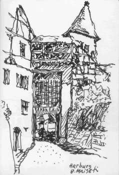

[🠔 Zur Übersicht: Burgen Links 1](8reise.md)  
# Links und Tips für Burgenfreunde/Castles and Forts 3
**Links und Tips für Burgenfreunde/Castles and Forts 3.**  
_von Konrad Fischer_

## Eine Reise zu Kunst, Baudenkmalen, Museen und Antiquitäten

## A journey to the past 12 (Mit einigen meiner Reiseskizzen/with some of my sketches)

(Mit einigen meiner Reiseskizzen/with some of my sketches) 

_[Konrad Fischer](1refernz.md)_ 

**Links und Tips für Burgenfreunde/Castles and Forts 3**

Neuschwanstein und Ludwig II 
[König Ludwig II. von Bayern](http://www.netz-werk.org/Ludwig_II/index.htm) - [Königswinkel - info@neuschwanstein-country.net](http://neuschwanstein-country.net/koenigswinkel/fussen.htm) - [Walli´s König Ludwig II-Homepage](http://koenigludwig.notrix.de/)

[Blutenburg in München - Obermenzing](http://www.blutenburg.de/)

[Burgen und Schlösser in Franken](http://www.historisches-franken.de/revue/beginn.htm)

[Burgen und Schlösser des Hauses Oettingen-Wallerstein](http://www.fuerst-wallerstein.de) an der Romantischen Straße 

[Die Harburg in Schwaben](http://www.stadt-harburg-schwaben.de/rundgang/19burg/harburg.htm)

[Veitshöchheim - Fürstbischöfliches Schloß Veitshöchheim](http://www.schloesser.bayern.de/seiten/objekte/ve_sch.htm) (Einbau einer Hüllflächentemperierung mit konservatorischer Zielstellung, Planung Architektur- und Ingenieurbüro Konrad Fischer, 2001) 
[Schloß Veitshöchheim](http://www.museen-in-bayern.de/Veitshoechheim-Schloss.htm) - in museen.bayern.de

[Burgen, Schlösser, Ruinen und Kirchen](http://www.fraenkische-schweiz.com/info/burgen.html) in der Fränkischen Schweiz

[Das Bayreuth der Markgräfin Wilhelmine](http://mars.bnbt.de/bayreuth/wilhel.htm) [Altes Schloß Bayreuth - Die Eremitage der Wilhelmine. Chinoiserie und Exotismus](http://mars.bnbt.de/bayreuth/4.htm) *******

[Die Altenburg, Alte Hofhaltung, Neue Residenz und weitere historische Bauten in Bamberg und Umgebung - Rubrik "Sehen&Erleben"](http://www.tourismus.bamberg.de/index_1.htm)

[Schloß Weißenstein in Pommersfelden](http://www.schoenborn.de) - Ein Traum in Barock - [Skizzencollage ](8menuhin.md)vom dortigen Yehudi Menuhin live music now Benefizkonzert am 9.10.1999 mit Siegfried Jerusalem und jungen Künstlern

Der Katalog der Bayer. Landesausstellung auf Schloß Callenberg/Coburg (mit Abbildungen!): [Ein Herzogtum und viele Kronen](http://www.bayern.de/HDBG/hacd003.htm) [Die Veste Coburg](http://www.veste-coburg.de/veste.htm)

[Festung Rosenberg in Kronach mit der Fränkischen Galerie](http://www.stmukwk.bayern.de/kunst/zwmuseen/kronach.html) <> [Kronach Online](http://www.kronach.de/) - mit Info zur Festung

[Die Nürnberger Kaiserburg - im Schatzkästlein des Deutschen Reiches](http://www.deutschland-city.de/nuernberg/burg.html), mit [Burgmuseum](http://www.museen-in-bayern.de/Nuernberg-Kaiserburg.htm) <> [Germanisches Nationalmuseum Nürnberg - Das Kaiserburg-Museum](http://www.gnm.de/Burgmuseum.htm) <> [Worldwide Ferntouristik: WEBCAM Nürnberger Kaiserburg](http://www.worldwide-nue.de/livecam/live1.html)

[Schloß Neunhof](http://www.gnm.de/VeranstAnsichtenNeunhof.htm) - Zweigstelle des Germanischen Nationalmuseums Nürnberg

[Burg Burgthann](http://www.burgverein-burgthann.de/) - [German castle Burgthann](http://www.roadstoruins.com/burgthann.html) - [Burg Burgthann II -](http://www.historisches-franken.de/revue/burgthann061.htm) eine reizvolle Anlage mit sehenswertem Heimatmuseum zwischen Altdorf und Nürnberg (An dieser Restaurierung war ich beteiligt)

[Schloß Wonfurt](http://www.schloss-wonfurt.de) bei Haßfurt (An dieser Restaurierung war ich beteiligt)

[Burg Rabenstein](http://www.burg-rabenstein.de/) in der Fränkischen Schweiz - mit Falknerei! Sehr schön gemachte Seite mit guten Links

[Schloß und Museen der Familie Thurn und Taxis in Regensburg](http://www.thurnundtaxis.de/home/)

Die weltgrößten Ritterspiele - seit 20 Jahren in [Kaltenberg](http://www.kaltenberg.de)

[Burgruine Wolfstein](http://landkreis.neumarkt.de/wolfstein/ausgrab/bericht.html) - Ausgrabungsbericht

[NZZ Format: Die neue Lust am Mittelalter - Filmtext zur Restaurierung der Burg Sulzberg/Allgäu](http://www-x.nzz.ch/nzz/format/broadcasts/transcripts_123_25.html)

[Sehenswürdigkeiten im Allgäu](http://www.info-germany.de/allgaeu.htm) - mit Links zu Burgen und Schlössern

[Schlösser und Burgen im Allgäu und im Dreiländereck D-A-CH](http://www.dein-allgaeu.de/kultur/kultur_schloesser_burgen.html)

[Alfred Voglers Allgäu Wanderungen - Burgen, Schlösser, Seen, Moore, Kirchen, ...](http://www.metalldatenbank.de/texte/vogler_8_seeligkeiten/index2.html)

[www.heimatpfleger.dein-allgaeu.de](http://www.heimatpfleger.dein-allgaeu.de) - Eine vorbildliche Heimatpfleger-Seite - Mit Texten zu Burg, Schloß u.a. Denkmalthemen

Weiter: **[Links und Tips für Burgenfreunde/Castles and Forts 4](8reise04.md)**
