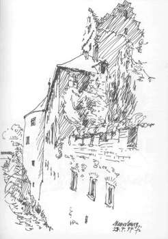
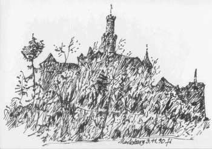

[🠔 Zur Übersicht: Burgen Links 1](8reise.md)  
# Links und Tips für Burgenfreunde/Castles and Forts 4
**A journey to the past 12 (Mit einigen meiner Reiseskizzen/with some of my sketches)**  
_von Konrad Fischer_

## Eine Reise zu Kunst, Baudenkmalen, Museen und Antiquitäten

## A journey to the past 12 (Mit einigen meiner Reiseskizzen/with some of my sketches)

(Mit einigen meiner Reiseskizzen/with some of my sketches) 

_[Konrad Fischer](1refernz.md)_ 

**Links und Tips für Burgenfreunde/Castles and Forts 4** 

[Staatliche Schlösser in Baden-Württemberg](http://www.schloesser-magazin.de) [Schlösser](http://www.baden-wuerttemberg.de/kultur/d_62.schloesser.html) - Übersicht und ihre Marketingprobleme: [BZO - Land & Region](http://www.badische-zeitung.de/nachrichten/mantel/land/land_reg_0711.htm)

[Meersburg](http://www.burg-meersburg.de/)

[Schloss Bruchsal](http://members.aol.com/SchlossBR/Index.htm)- umfangreiche Info, toll gemacht, "inoffizielle" Seite (priv. Homepage)

Rund ums Schwetzinger Schloss: [Schwetzingen - Zu Schloß, Garten und Stadt](http://www.zum.de/Faecher/G/BW/Landeskunde/rhein/swetz/swetzi00.htm) [Schloß](http://www.markt-schwetzingen.de/schloss/fr_schloss1_d.htm) [Schloßgarten 1](http://www.markt-schwetzingen.de/schloss/fr_garten1_d.htm) [Schloßgarten 2](http://www.goettingen-bau.de/firma/richter/0004-1.htm) [Schloßgarten 3](http://www.zum.de/Faecher/G/BW/Landeskunde/rhein/swetz/swepar02.htm) [Moschee im Schloßpark](http://www.zum.de/Faecher/G/BW/Landeskunde/rhein/swetz/sw_mosc.htm)

[Das Heidelberger Schloß](http://www.zum.de/Faecher/G/BW/Landeskunde/rhein/hd/hd_shl.htm)

[Das Mannheimer Schloß](http://www.zum.de/Faecher/G/BW/Landeskunde/rhein/ma/ma_shl.htm)

[Schlossgarten.de: Schloss, Schlossgarten und Rosensteinpark Stuttgart](http://www.schlossgarten.de/index.html)

Burg Hohenstaufen: [Homepage staufische Sehenswürdigkeiten im Landkreis Göppingen](http://www.fto.de/ftsehen/ftsehen.htm)

[Schloß Löwenstein](http://www.kleinheubach.de/KULTUR/schloss.htm)

[Alte Burg Penzlin](http://www.mueritz.de/moaltb.htm)

[Schlosshotels in Mecklenburg-Vorpommern](http://www.schlosshotel-mv.de/)

[Berliner-Schloss.de](http://www.berliner-schloss.de/c_expertenkommission.php) [DIE WELT online: Zum Berliner Schloß](http://www.welt.de/kultur/blickpunkt/schloss/)

[Marlies Ebert: Großes Motiv (Berliner Stadtschloß) auf kleinen Karten](http://www.berlinische-monatsschrift.de/bms/bmstxt01/01072deta.htm)

[Palast der Republik](http://web01.city-map.de/city/print/070102015400.html) [Diskussion zum Palast der Republik](http://palast.com/start/)

[Potsdamer Schloss Wiederaufbau: Euphorie bekommt erste Dämpfer](http://www2.tagesspiegel.de/archiv/2001/09/27/ak-br-5510237.html)

[Burgen und Schlösser in Waren an der Müritz](http://www.burgen-und-schloesser.net/mecklenburg-vorpommern/mueritz-waren.html)

[Schloss Freienwalde](http://www.walther-rathenau.de/schloss_freienwalde.htm)

[Die Rheinburgen](http://www.rhinecastles.com)

[www.rhein.burgen-online.de](http://www.rhein.burgen-online.de/)

[Schloss-Liedberg - Perle am Niederrhein](http://www.schloss-liedberg.de/index.html)

[Burg Rheinfels bei St. Goar am Rhein](http://www.loreleytal.com/rheinburgen/links/rheinfels/) mit vielen Links zu den Rheintalburgen

[Ruine Fürstenberg bei Rheindiebach am Rhein](http://www.bacharach.mittelrhein.net/rhein-rheindiebach/burgen-burg-ruine-fuerstenberg/restaurierung-7.html)

[Braubach am Rhein. Sehenswürdigkeiten und Informationen rund um die historische Stadt und die DBV-Burgen Marks- und Phillipsburg](http://home.rhein-zeitung.de/~rmuelle1/braubach.htm) 
[Marksburg.de (off. Seite der DBV)](http://www.marksburg.de) [Die Marksburg](http://www.rheintal.de/kultur/geschi/burgen/marksb.htm) in Braubach am Rhein, (Fassadeninstandsetzung und Verputz des Rheinbaus, Planung Architektur- und Ingenieurbüro Konrad Fischer, 2001 (die beiden unteren Fotos zeigen die Rheinbaufassade vor der Instandsetzung)); [Marksburg bei Braubach am Rhein;](http://www.loreleytal.com/rheinburgen/rechts/marksburg/) [Marksburg;](http://www.burgenwelt.de/marksburg/bimark.htm) [Marksburg Rundgang](http://www.bti-net.com/burgen/burg/0102.htm)

Die [Marksburg](http://www.marksburg.de)

[Burg Freienstein](http://www.odenwald.de/sights/beburgfr.htm) im Odenwald 

[Burgen und Schlösser im Moselland](http://www.mosel-reisefuehrer.de/Moselburgen/BurgenA2.html)

[Burgen der Pfalz von Trifels bis Landeck](http://www.zum.de/Faecher/G/BW/Landeskunde/rhein/burgen/burgen.htm)

[Burg Bosselstein und Schloß Oberstein](http://www.idar-oberstein.de/tourist/denkmal/schloss.htm)

[Burg Eltz ](http://www.burg-eltz.de)- ein Traumschloß (deutsch/english)

Zwischen Schloß und und Schmetterling - die Seiten des Präsidenten der [Deutschen Burgenvereinigung e.V.](http://www.deutsche-burgen.org), Alexander Fürst Sayn-Wittgenstein-Sayn: [Willkommen in Sayn](http://www.sayn.de/)

[Schloss Monaise](http://www.roscheiderhof.de/umgebung/monaise.html)

[Schloss des Deutschen Ordens in Temmels](http://www.roscheiderhof.de/umgebung/dord.html)

[Gotische und romanische Sakral- und Feudal-Architektur auf dem Hunsrück - bk-projekt: Herzog-Johann-Gymnasium Simmern](http://www.uni-koblenz.de/~odswer/comenius/bk_proje.htm)

[Schloß Löwenstein](http://www.kleinheubach.de/KULTUR/schloss.htm)

[Schloß Babenhausen](http://www.auslese.com/schloss/nutzung.htm)

[Schloß Sigmaringen - Die Burg der Hohenzollern](http://www.hohenzollern.com/) (deutsch/english)

[Burg Hohenzollern](http://www.burg-hohenzollern.com/)

Weiter: **[Links und Tips für Burgenfreunde/Castles and Forts 5](8reise05.md)**
