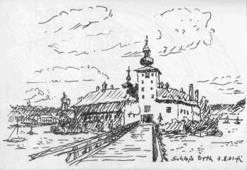

[🠔 Zur Übersicht: Burgen Links 1](8reise.md)  
# Links und Tips für Burgenfreunde/Castles and Forts 6
**Hier finden Sie Links zu Burgen und Schlössern sowie zugehörigen Informationen der Länder bzw. historischen Regionen Österreich, Habsburger Reich, Ungarn, KuK-Monarchie, Preußen, Deutschordensland, Polen, Niederlande/Holland, Siebenbürgen, Rumänien.**  
_von Konrad Fischer_

## Eine Reise zu Kunst, Baudenkmalen, Museen und Antiquitäten

## A journey to the past 12 (Mit einigen meiner Reiseskizzen/with some of my sketches)

(Mit einigen meiner Reiseskizzen/with some of my sketches) 

_[Konrad Fischer](1refernz.md)_ 

 **Links und Tips für Burgenfreunde/Castles and Forts 6** Hier finden Sie Links zu Burgen und Schlössern sowie zugehörigen Informationen der Länder bzw. historischen Regionen Österreich, Habsburger Reich / Monarchie, Ungarn, KuK-Monarchie, Preußen (auch Ostpreußen), Deutschordensland, Deutscher Orden, Ordo Teutonico, Polen, Niederlande / Holland, Siebenbürgen, Rumänien ... Lassen Sie sich faszinieren von den Burgen und Schlössern der betreffenden Lande und Orte, der blutigen und unblutigen Geschichte einer einst christlichen Kultur und ihrer würdigen und unwürdigen Erben. Machen Sie sich selbst ein Bild von den Nachkommen einstiger Herrschaft, egal ob Adel, Kirche, Kloster und Orden. Und genießen Sie die Möglichkeiten des Internets, wo Sie überall hinsurfen können, ohne den Platz vor Ihrem Bildschirm aufgeben zu müssen. Mein Tipp: Selber an die Orte der Begierde zu reisen, ist trotzdem schöner. Nutzen Sie die Informationen zur Reisevorbereitung ... Viel Spaß - wie auch immer ... und bitte nicht wütend werden, wenn mal wieder ein Link abgestorben ist, ich bin daran unschuldig ... 

[Die Habsburger-Monarchie - Kommission für die Geschichte der Habsburgermonarchie](http://www.oeaw.ac.at/habskomm/index.html)

[Via imperialis](http://www.viaimperialis.at) - die schönsten Burgen, Schlösser und Stifte Österreichs

[www.burgen-austria.com](http://www.burgen-austria.com/)

[Schloßhotels ](http://www.schlosshotels.co.at/)- Gastliche Burgen und Schlösser Österreichs (mit Gratiskatalog!)

[Schloß Schönbrunn](http://www.schoenbrunn.at/) in Wien

[Burgen und Schlösser in und um Salzburg](http://www.salzburg.gv.at/burgen)

[Schloß Orth am Traunsee/Gmunden](http://www.grabler.at/haus_grabler/haus_grabler/urlaub_salzkammergut/schloss_orth/schloss_orth.htm) (Zeichnung: Konrad Fischer)

[Festung Hohensalzburg](http://www.salzburginfo.or.at/sehenswertes_30.htm)

[Steirischer Burgenverein](http://www.steirischer-burgenverein.at/)

[Schloß Gobelsburg: Geschichte und Architektur](http://www.gobelsburg.at/) - Eine schöne Adresse auch für Weinliebhaber

[Renaissance-Festungsanlage Bad Radkersburg](http://www.unibg.it/walledtowns/bad_radkersburg6_ger.htm)

[Burgen der Schweiz](http://www.burgen.ch)

[Altijd welkom bij de Nederlandse Kastelenstichting](http://www.kastelen.nl/) - Burgen und Schlösser der Niederlande/Hollands - eine Topseite der Schlösserstiftung mit Info zu allen öffentlich zugänglichen Objekten.

[Die Kirchenburg in Tartlau](http://www.diletto-musicale.ro/opencms/export/dilettomusicale/Kirchenburg/), Siebenbürgen (Hier war mein Großvater Pfarrer) 
[Siebenbürger WebRing](http://g.webring.com/hub?ring=siebenbuergen) <>[Geschichte, Kultur und Landeskunde Siebenbürgens](http://www.sibiweb.de/gekula.htm) <>Die Landler- [Geschichte der deutschen Siedler in Siebenbürgen](http://www.landler.com/) <> [Uwe Kroners Homepage: Siebenbürgenreisen](http://www.uwe-kroner.de/alt/siereis1.htm) <> [Kronstadt](http://welcome.to/kronstadt)<> [Siebenbürger Sachsen in Baden-Württemberg](http://www.siebenbuerger-sachsen-bw.de) 
Dr. Gabriele Mergenthaler: **[Preisgabe, Sichern, Konservieren, ... ? Zur Situation der kirchlichen Denkmalpflege und Kirchenburgen in Siebenbürgen](http://www.siebenbuerger.de/sbz/landundleute/kirchenburgen_siebenbuergen_mergenthaler.html)**

**[www.civertan.hu](http://www.civertan.hu)** - Gigantische Datenbank mit Fotos und historischen Postkarten von Burgen, Schlössern, Baudenkmalen und Ortsansichten in Ungarn 
[Schlösser in Ungarn: morphe.de/schloesser-ungarn.html](http://morphe.de/schloesser-ungarn.html) 
[Ungarisches Tourismusamt - Ungarn's Schlösser](http://www.ungarn-tourismus.de/schloesser.htm) 
[Várak Magyarországon - Ungarns Burgen und Schlösser](http://www.varak.hu/) 
[Königliches Schloss Gödöllo/Ungarn](http://www.kiralyikastely.hu/) 
[www.sehenswuerdigkeiten.info/ - Ungarische Burgen und Schlösser](http://www.sehenswuerdigkeiten.info/ungarn/h_burgen/index_b_h.htm)

Umfangreiche Ungarische/Internationale Themen-Linksammlungen: 
[castrumbene.lap.hu/](http://castrumbene.lap.hu/): [Burgenbau](http://castrumbene.lap.hu/) 
[www.varepiteszet.lap.hu/](http://www.varepiteszet.lap.hu/) : [Burgenbau](http://www.varepiteszet.lap.hu/) 
[www.foldvarak.lap.hu/:](http://www.foldvarak.lap.hu/) [Erdburgen](http://www.foldvarak.lap.hu/) 
[www.felvidekivarak.lap.hu/](http://www.felvidekivarak.lap.hu/): [Slowakische Burgen](http://www.felvidekivarak.lap.hu/) 
[www.erodtemplom.lap.hu/](http://www.erodtemplom.lap.hu/): [Kirchenburgen ](http://www.erodtemplom.lap.hu/) 
[legiregeszet.lap.hu/](http://legiregeszet.lap.hu/): [Luftbildarchäologie](http://legiregeszet.lap.hu/) 
[erod.lap.hu/](http://erod.lap.hu/): [Burgen, Kastelle und Forts](http://erod.lap.hu/)

[Malbork / Marienburg 1](http://www.malbork.pl/) <> [Malbork / Marienburg 2](http://www.preussenweb.de/marien.htm) <> The [TEUTONIC ORDER](http://www.newadvent.org/cathen/14541b.htm) - Artikel der kath. Enzyklopädie < [Ordo Teutonicus (OT) - Deutscher Orden - Teutonic Order in Österreich](http://www.deutscher-orden.at/) <> [Kurze Geschichte](http://www.deutscher-orden.de/_pages/_orden_allgemein/geschichte/geschichte_start.html) des OT <> [Preußen](http://www.preussenweb.de/) <> [Das inzwischen aufgegegebene bayerische Projekt des Deutschen Ordens ](5finanz.md#ein+schã¶nes+nutzungsmodell)(Vorsicht, bissige Kommentare) <> [P. Jens J. Bergmann OT, virtuelle Kirchenführung durch Maria Birnbaum u.v.a. Info](http://www.jens-bergmann.de/)> <> [Der Deutsche Orden in Deutschland - Deutsche Brüderprovinz](http://www.deutscher-orden.de)

---

Weiter [Kapitel 7](8reise07.md)

Anregungen, Ergänzungsvorschläge? - 

Weiter: **[Links und Tips für Burgenfreunde/Castles and Forts 7](8reise07.md)**
