[🠔 Zur Übersicht: Startseite](index.md)  
# Burg & Schloss - Burgen & Schlösser zu verkaufen
**Burgen und Schlösser zu verkaufen: aktuelle Angebote aus Deutschland und international. Für Liebhaber stilvoller und authentischer Immobilien, auch zur gastronomischen Nutzung.**  
_von Konrad Fischer_

> [!abstract]+ Kapitelübersicht: Burgen & Schlösser kaufen  
> 1. **Burg & Schloss - Burgen & Schlösser zu verkaufen**
> 2. [Burgen, Schlösser, Ansitze, Herrenhäuser und Spezialimmobilien in Deutschland zu verkaufen](8burg.md)
> 3. [Eine Reise zu Kunst, Baudenkmalen, Museen und Antiquitäten](8reise.md)
> 4. [Architektur-Skizzen Architectural Sketches Croquis Dessin von Konrad Fischer auf der Exkursion der Sektion C - Bautechnik am 9.6.1999](landdenk.md)
> 5. [Burgen und Schlösser im Beaujolais - Châteaux du Beaujolais](8beau.md)
> 6. [Betr.: SZ 19./20.3.05, Fragen an die Leser, „Das Gute liegt rechts“ von Hermann Unterstöger](8dom.md)
> 7. [Museums-, Kunst- und Kultursponsoring Informationen](8museum.md)
> 8. [Schweizerisches Freilichtmuseum für ländliche Kultur Ballenberg: Exkursion mit Fotos](8balberg.md)

## Burg & Schloss - Burgen & Schlösser zu verkaufen 
Castles for sale - Buy a Residence - Purchase a Palace

### Крепость и замок для продажи / Замки Германии недвижимость - Slott/Slotte til salg - Châteaux à vendre - Vendesi / Vendita Vendere Castelli - Palais / Kasteel te koop - Palácio / Castelo / Mansão para venda - Palacio / Castillo para la venta - القلعة والقصر للبيع - 판매를 위한 성곽 그리고 궁전 - 城堡、宫殿、住宅出售 - 販売のためのドイツの中世城 / 古代宮殿 / 歴史的な住宅 - κάστρο και παλάτι για την πώληση στη Γερμανία - Kastali til sölu - Linna myydä ja ostaa

**Aktuelle Angebote aus Deutschland** - Nicht nur für Lotto-Millionäre + Jackpot-Knacker 

****Hinweis:** Alle Zustands- und Flächenangaben sind unverbindlich, aktuelle Info auf Anfrage** 

ARD-Kulturreport 25.11.01: "Vom Schloss zur Ruine" mit Interview Konrad Fischer 
[Wie finanziert man eine Schlosssanierung?](5finanz.md) <> [Woher weiß man, ob eine Schloßsanierung finanzierbar ist?](5wiber.md) <> [Wie plant man eine erfolgreiche Schlossrenovierung / Schlossinstandsetzung / Schlossrestaurierung?](11erhins.md) 

[Altbauverträgliche Bautechnik](2baustof.md) # [Finanzierung und Förderung](5finanz.md) # [DBV-Ratgeber: Erhaltenden und wirtschaftliche Schloßinstandsetzung](6prwiins.md) 
[Antike Möbel/Raumausstattung/Interieur/Kunstwerke online](8reise13.md) 

---

**Wer schon fast alles hat, wer es gerne aecht stilvoll, aesthetisch, authentisch mag und wer seine Erfolgsstory in Good Old Germany im gelungenen Ambiente abrunden will:**

 * fast voll am Steuereinnehmer (Einkommens- und Erbschaftssteuer, Grunderwerbs- und Grundsteuer) vorbei, in sicherste Immobilien für unsichere Zeiten!
 * weil es bei uns vielleicht doch recht nett und dank ordentlicher Besteuerung andererseits vergleichsweise sicher / sozialverträglich / gepflegt / medizin- / not- und brandfallversorgt sowie subventionig / kultur-, konzert-, vernissage-,opern- und theaterversorgt / auto- und eisenbahnfreundlich / bier&weinseelig mit servicebetonter staatlicher Denkmalpflege und sowieso am Unnieselnebeligsten / Winterprächtigsten / Hitzeerträglichsten / Interessantesten / eben Heimatlichsten ist und um die Ecke nicht nur Fish&Chips+Curry&Burger muffeln und kulturbeflissene Räuberbanden spähen) 
oder ein historisches und meist denkmalgeschütztes Objekt für gastronomische Nutzung, als Gasthof, Hotel, Pension, für Ferienwohnungen oder Gewerbeimmobilie, mit Campingplatz, als Reiterhof, Jagdquartier, Touristengaststätte, Gourmettempel, Luxusherberge, Nähe Naturschutzgebiet, in unverbaubarer Lage, als Location für dies und das, als Museum und repräsentativer Ausstellungsort zum Aufbewahren und Vorzeigen Ihrer einmaligen Kunstsammlung oder Bierdeckelsammlung oder auch als erstklassige Firmenadresse bzw. Firmensitz - eben je nachdem, 
 * auch wenn es hier (noch) nicht Luxusobjekte wie die Villa in Klagenfurt gibt, die der Verkäufer nach einer Losaktion mit 9999 99-Euro-Losen in einer staatlich genehmigten Losaktion an einen glücklichen Gewinner übergab - 

**wie wär´s mal damit - Ein herrschaftliches Schloß oder eine alte Burg kaufen - buying a castle?:**

 
1. Kärnten. **Barockschloß**. Im letzten Viertel des 18. Jh. von fürstlichem Bauherr als Sommerresidenz erbaut, nobles Treppenhaus und außergewöhnlich hochwertig dekorierte Belletage mit Enfilade, Hauptnutzräume auf vier Etagen, eigene Schloßkapelle, Nutzfläche mit Keller und Dachgeschoß ca. 2.800 qm, innen teilweise Modernisierungsbedarf je nach Nutzungswunsch, zweiseitig öff. Straßen angrenzend, Schloßpark 1,9 ha, Jagdrevier 900 ha. zu verpachten, zugehörige Luxus-Jagdresidenz siehe Nr. 2. Preis: **Auf Anfrage.Info** 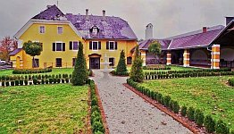 
2. Kärnten. **Luxus-Jagdresidenz in Nähe zu Barockschloß Nr. 1**. Renovierte Luxus-Jagdresidenz mit 38 möblierten Räumen und 1.250 qm Wohnfläche, Ausstattung mit Antiquitäten, Grundstück 5.800 qm mit eigenem Biotop, Nebengebäude ca. 1.000 qm mit Waffenkammer, Gefrierzellen, Büro und Personalwohnung. Preis: **Auf Anfrage.Info** 
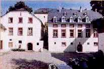 
3. Rheinland-Pfalz. **Klostermühle**. 
Preis: **Auf Anfrage.Info** 
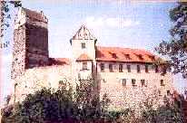 
4. Baden-Württemberg. **Ritterburg** 12. Jh., teilrestauriert. Höhenlage über Ort. Grundstück 13.000 qm. Offene Vorburg, ummauerte Kernburg 2.500 qm mit staufischem Bergfried, frühgotischer Burgkapelle mit Fresken von 1250, Torbau, Altes Schloß, Palas mit Brunnenstube, Wehrgang, 8 neue 2-Zimmer-Ferienwohnungen. Wohnfläche gesamt ca. 1.300 qm. **Verkauft.Info**

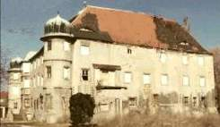 

5. Sachsen-Anhalt. **Schlossanlage mit Nebengebäuden und verwildertem Park um ehem. Renaissance-Wasserschloss**. Stark renovierungsbedürftig, viele Originalteile, interessante Lage nahe Autobahn und Ballungszentrum. **Verkauft** 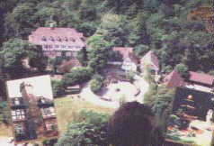 
6. Niedersachsen. **Schloßanlage,** Grundstück 140.000 qm mit Schlosspark und Wald (Naturschutz). Top-Zustand. Wohnfläche in 5 Etagen (Fahrstuhl) ca. 85 Räume ca. 2.800 qm, in Zehntscheune ca. 160 qm, in Marstall ca. 340 qm, Garagen ca. 350 qm. Aufteilung in ca. 20 Wohnungen möglich. **Verkauft.** 
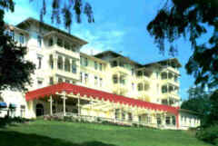 
7. Im Kurbadeort, Harz, Niedersachsen. **Traditions-Hotel** mit 100 Zimmern, weiterer An-/Ausbau möglich, 80 Senioren-Wohnungen denkbar. Grundstück ca. 50.000 qm in ruhiger Stadtlage. Preis: **Auf Anfrage.Info** 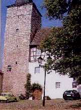 
8. Thüringen. **Burganteil.** **Verkauft.** 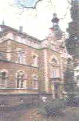9. Rheinland-Pfalz. Gepflegtes **Schloß der Gründerzeit** 1890/1978. Ortslage, Park mit Teich und Saunahaus. Grundstück ca. 28.000 qm, 8 Bauplätze abteilbar. Wohnfläche ca. 1.500 qm. **Verkauft** 
 
10. Rheinland-Pfalz am Rhein, **Höhenschloss** Ursprung 1590/1700, Umbau 1873. Rheinblick, 3 Geschosse, Dächer neu gedeckt 1988, Fenster u. Zentralheizung 1993, bis vor wenigen Jahren private Wohnnutzung. Grundstück ca. 9000 qm, Wohnfläche ca. 1000 qm. Preis: **Verkauft.** 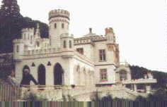 
11. Rheinland. **Schloß.** Verkauft 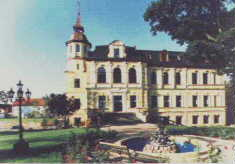 

12. Sachsen-Anhalt. Luxussaniertes **Freiguts-Herrenhaus/Schloß** v. 1885/95. Kleinstadt-Randlage. Park und Hof. Grundstück ca. 11.000 qm. Schloss ca. 1.500 qm Wohn-/Nutzfläche, zus. ca. 3.000 qm Ausbauflächen. Preis: **Verkauft** 
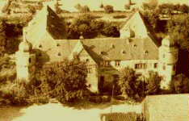

13. Unterfranken, Bayern. **Wasserschloss** 18. Jh., renovierungsbedürftig, voll erschlossen. Grundfläche ca. 800 qm, Grundstück 5350 qm, Schloßhof 540 qm, privat und gewerblich nutzbar. 
Preis: **Auf Anfrage.Info**

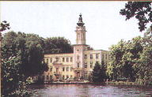 
14. Brandenburg nahe Berlin. **Schloß.** Preis: **Auf Anfrage.Info** 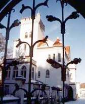 15. Brandenburg, bei Berlin. **Große Schlossanlage mit umfriedetem Parkgelände und Teich.** Grundfläche 16.000 qm, Hauptgebäude voll modernisiert, 1.600 qm Nutzfläche + Nebengebäude (Ausbaureserve) 1.800 qm Nutzfläche. Preis: **Auf Anfrage.Info** 
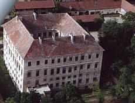 
16. Niederösterreich, Weinbaugebiet, gute Verkehrsanschließung. **Großzügige Vierflügel-Schloßanlage von berühmtem Barockarchitekten.** Renovierungsbedürftig, Zuschüsse mögl., Nutzfläche 4.000 qm, Festsaal ca. 300 qm, Marmorkapelle, reiche Stuckaturen und sonstiges Dekor, Grundstück ca. 9.170 m2 inkl. Park, Nebengebäude evtl. zuerwerbbar, Preis: **Auf Anfrage.Info** 
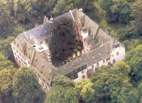 
17. Hessen. **Vierflügel-Schloß.** Verkauft. 
Über 100 weitere Burgen, Ritterburgen, Wasserburgen, Paläste, Schlösser und Herrenhäuser in Deutschland, auch Objekte in Österreich, Ungarn, Schweiz, Frankreich, Portugal, Schottland, England, Irland, Wales, Tschechei, Polen - More Castles, Palaces, Forts, Manoirs (et Mansions, Maison des Chevaliers, Palais, Châteaux) in Austria, Hungary, Switzerland, France, Portugal, Scotland, England, Ireland, Wales, Czech Republic, Poland available. 

 
Oder gar eine Translozierung (Translocation) oder ein stilechter Nachbau (Copy) wie unsere 
[Burgenvereins-Marksburg in Japan](http://www.marksburg.de/ueno.htm)?

---

****Hinweis:**** Hier finden Sie Objekte von verschiedenen deutschen Maklern. Exposeübersendung mit aktuellem Preis und Terminvereinbarung für Besichtigung: 

Um den Verkäufer vor unseriösen Anfragen (es gibt mehr davon, als Sie meinen) zu schützen, werden Ihre Anfragen unverbindlich und ohne Erfolgsgarantie an die jeweils zuständigen Makler / den Eigentümer ausschließlich unter folgenden Voraussetzungen weitergeleitet: 

1. Überweisung Bearbeitungspauschale 250 EUR (Rechnungsstellung erfolgt nach Zahlungseingang), danach senden Sie ein Email mit: 
2. Angabe vollständige Postadresse mit Telefon-/Telefaxnummer und Email/Website (optional). 
3. Angabe Objektnummer (siehe oben). 
4. Angabe geplante Nutzung des Objekts (privat, gewerblich mit Nutzungsdetails, ...). 
5. Angabe beabsichtigte Finanzierung / Finanzierungsnachweis. 

Das Expose und Terminvorschläge erhalten Sie direkt vom Makler. 

Konrad Fischer: Fassaden energetisch richtig und kostensparend sanieren 
 
und neu: 
 
[ 
Interview Klimaschutz + Energiesparen](http://www.thermoshield-kongress.de/experten_fischer.html) 

---

**Interested - excited - inspired to buy a german castle?** 

On this page you can find castles for sale from various brokers / real estate agents / realtors / owners. Expose transfer and date agreement for a guided visit: 

To protect the owners from dubious bids (there are more than you'll argue) inquiries are passed on to the responsible estate agents/realtors/owners exclusively under the following conditions: 

1. Transfer handling charge 250 EUR to my bank account (rendering of invoice will follow after receipt of payment), then send an email to: 
2. Indicate your complete postal address with telephone/fax number and email/website (optional). 
3. Indicate the object number (see list above). 
4. Indicate the planned use of the object (private, commercial details, ...). 
5. Indicate the intended financing and declare some financing proof. 

After this you will soon get the expose with actual price and date proposals directly from the broker. 

---

Anfragen/Inquiries an/to: 

Konrad Fischer 
Hauptstraße 50 
D - 96 272 Hochstadt am Main 
Tel.: ++49 - (0)9574-3011, Mob. (0)170-73 515 57, Fax: (0)9574-4960 
Email: i n f o ( a) k o n r a d - f i s c h e r - i n f o . d e 
Konto/Bank account: 
Bank: Sparkasse Coburg-Lichtenfels 
Bankleitzahl/Bank code number 783 500 00 
Kto./Account: 982 46 57 
IBAN DE 57 7835 0000 0009 8246 57 
SWIFT - BIC: BYLADEM 1 COB 

---

**Organisation weitere Objektrecherche** gegen vorab zu vereinbarende **Aufwandsentschädigung** (Reisekosten/Zeitaufwand).**Auslandsreisen** zu Kaufverhandlungen bedingen vorherige Überweisung der Reisekosten (Fahrtkosten und Unterbringung privat, in Pensionen oder Hotels. **Währungstransaktionen** in Bar im Zusammenhang mit der Kaufsumme werden nicht vorgenommen. Notice: No cash currency change transactions!

****Die obigen Objektangaben sind unverbindlich, aktuelle Preise erhalten Sie mit dem detaillierten Expose. 
The named object information above is not binding, actual price you will get with the detailed expose.****

---

****Ein ernst- und gutgemeinter Tipp:**** 
Wer denkt, die fehlenden Eigenmittel für Erwerb und erforderliche Baumaßnahmen aus dem Betrieb eines Objektes locker herauswirtschaften zu können, ist zu 99,99% auf dem Holzweg (Ausnahme: z.B. Casino + Luxusbordell) und sollte sich die Anfrage sparen.

---

Уважаемый господин ...! 

Большое спасибо за ваш запрос, на который я тут же отвечаю: 

1.Фотографии Замков, предлагающихся к продаже в различных землях Германии и Австрии, вы найдёте на моей страничке (www.konrad-fischer-info.de/8schloss.htm). Замки продаются или через маклеров, или напрямую хозяевами. 

Если 250 евро за услуги уже на моём счету, то я сообщу адреса маклеров или самих хозяев, продающих эти замки. Тогда вы сможете дальнейшую информацию запросить непосредственно у хозяев или у маклеров. Если бы вы мне сообщили ваши пожелания по части размеров, стоимости, месторасположения замков, которых нет на моей страничке, я бы мог переговорить с маклерами на предмет поиска. 

2. О программе 1-евро поддержки у меня нет информации. У каждой земли в Германии своя программа по уходу за памятниками, подробности которой узнать лучше всего до покупки. Перед покупкой замка я делаю грубую прикидку стоимости и состояния объекта и с этими данными тогда переговариваю с ответственными лицами, от которых зависит размер денежных выплат по программе сохранения памятников. 

3. Для интересующихся покупкой замков и нуждающихся в профессиональном совете,я предлагаю следующие услуги: 

-посещение объекта покупки с предварительной оценкой состояния и планирования работ. 
-предварительная калькуляция затрат на реставрацию и (по желанию)на перестройку (примерно1-2 стр. А4). 
-предполагаемые реставрационные работы (15-20 стр. А4). 
-содействие в планировании финансирования и посредничество в переговорах с организациями,занимающимися сохранением и фин.поддержкой памятников (1день на посещение организаций). 
-содействие в решении юридических проблем, связанных с перестраиванием или достраиванием объектов, попадающих под статус памятника. 

Эти услуги стоят в зависимости от объекта и сложности,возникающих проблем, от 3000 до 7000 евро.Час у меня стоит 100 евро + дорожные. В качестве предоплаты-70% договорной суммы. 

Последующее планирование работ (архитектурное и инженерное) также возможно. У меня большой опыт. С 1979 по всей Германии свыше 400 реставраций. Инфо на русском вы найдёте (www.konrad-fischer-info.de/rossija.htm). 

4. Затраты на реставрацию, нуждающихся в том замков, рассчитываются в каждом конкретном случае индивидуально. Некоторые объекты почти готовы и не нуждаются в восстановительных работах.Перед покупкой достаточна примерная оценка (см. пункт 3), чтобы обговорить финансирование и поддержку. После покупки всё это более уточняется.В зависимости от проекта, реставрация и финансировние может производитья в несколько ступеней. 

Если возникнуть ещё вопросы,я к вашим услугам. 

Всего доброго 
Конрад Фишер 

---

Das ehemalige [Prämonstratenser-Chorherrenstift Reichenstein ](http://www.kloster-reichenstein.de) in der Eifel, ursprünglich Burg des Herzogs von Limburg, soll nach Besitzerwechsel wieder Kloster werden (Fundraising-Video von Konrad Fischer) 

Die Alternative zum eigenen Schloßbesitz? 
 

---

K. Fischer in DIE WELT 21.6.08: ["Deutsche Schlösser im Angebot"](http://www.welt.de/welt_print/article2129728/Deutsche-Schloesser-im-Angebot.html) 

**Die typischen Fragen aus Interviews rund um Schloss-Immobilien:** 

_Frage: Wie gefragt sind Schlösser?_ 
[Konrad Fischer](1refernz.md): Bei den mit mir zusammenarbeitenden Schloßmaklern kommen monatlich etwa 15 bis 20 konkrete Anfragen herein. Angesichts einer Anzahl von ungefähr 200 Objekten aus dem Bereich Schloß, Burg, Herrenhaus und Landsitz, die allein im August 2008 in verschiedenen Verkaufsportalen in allen Regionen Deutschlands mit Schwerpunkt im Süden zum Verkauf angeboten wurden, ergibt sich sehr deutlich, daß es sich dabei um einen sogenannten Käufermarkt handelt. Im Klartext: Ein potentieller Käufer hat nicht nur allerbeste Chancen, ein Objekt zu finden, sondern ebenso die wesentlichen Vorteile bei einer Verkaufsverhandlung auf seiner Seite. 

_Frage: Was kostet ein Schloss?_ 
[Konrad Fischer](1refernz.md): Oft gar nicht so viel, wie man denkt. Verkäufliche Schlösser in perfektem Zustand und Inventar sind ab etwa 6 bis 30 Millionen EUR am Markt. In durchschnittlichem Zustand kann für ca. drei Millionen, in schlechterem Zustand und leergeräumt schon ab ca. 500.000 EUR ein komplettes Schloß erworben werden. Im Extremfall gibt es aber auch Schlösser und Burgen zum Schnäppchenpreis: Wie das Beispiel des ansehnlichen Wasserschlosses Giebelstadt aus dem 16. Jahrhundert zeigt, das im Februar 2008 mit einem Mindestgebot von 21.000 EUR zur Versteigerung kam - bei einem Verkehrswert von ca. 500.000 EUR - kann man mit etwas Glück auch für ganz wenig Geld zum Schloßbesitzer werden. 
Der Zuschlag ging dann bei 430.000 EUR an einen ehemaligen Giebelstädter, der in den USA zu Reichtum gekommen ist. Die Überschuldung des adeligen Alteigentümers ließ diesen einige Jahre vorher schon Teile des wertvollen historischen Inventars versteigern. Trotz finanzieller Unterstützung durch das Denkmalamt bei früheren Sanierungen kam er mit etwa 3 Millionen EUR Gesamtschulden dennoch unter die Räder und das ansehnliche Schloß in die Zwangsversteigerung. Seine Pläne, das Schloß durch den Ausbau für hochwertige Mietwohnungen, Hotel, Museum oder ein Gesundheitszentrum einer wirtschaftlichen Nutzung zuzuführen, scheiterten. Nun will der neue Eigentümer die instandsetzungsbedürftige Anlage in ein romantisches Schloßhotel mit mindestens vier Sternen umbauen und hofft auf reiche Amerikaner als Gäste. 
Wie das ohne Zuschüsse deröffentlichen Hand wirtschaftlich gelingen soll, ist aber mehr als fraglich. Solche Projekte -und das zeigen alle meine bisherigen Kosten-Nutzen-Analysen für derartige Anlagen - sind und bleiben immer unwirtschaftliche Liebhaberei, ein Millionengrab oder ein Anlageobjekt für Schwarzgeld und Geldwäsche. 

_Frage: Wie werden die Verkaufspreise für Schlösser und Burgen ermittelt?_ 
[Konrad Fischer](1refernz.md): Die Preise richten sich - wie bei anderen Immoblien auch - vorwiegend nach Erhaltungszustand und Lage. Gar nicht so selten wird der reine Grundstückswert dem Verkaufspreis zugrunde gelegt, das kann man fast als Faustregel nehmen. Gegebenenfalls sind auch antikes Inventar und grundstücksbedingte Faktoren wie Waldungen, Wiesen, Ackerland, Wasserrecht (bei Wasserschlössern) oder sogar ein Jagdrecht (Eigenjagd - interessant für Jäger, die eine Nutzung als Jagdschloß anstreben) zu berücksichtigen. 
Ein typisches Beispiel für die riesigen Unterschiede bei der Preisbewertung ist das [badische Schloß Salem am Bodensee](http://www.salem.de/), ein [ehemaliges Zisterzienserkloster](http://de.wikipedia.org/wiki/Reichsabtei_Salem), das sich der Markgraf von Baden im Zuge der 2. Säkularisation (Enteignung der kirchlichen Besitztümer zur weiteren wirtschaftlichen Ausbeutung der damaligen adeligen / fürstlichen Landesherren im Unterschied zur 1. Säkularisation im Zusammenhang mit der Reformation in den evangelischen Ländern Deutschlands) 1802 "angeeignet" hat. 
Die Ertragswertanalyse des Landes Baden-Württemberg als möglicher und seitens des Hauses Baden wegen der unübertreffbaren Kaufkraft und Erhaltungsabsicht auch sehr gewünschter Käufer kommt nach der Aller-Zeitung auf Grundlage der Mieteinnahmen, Pachteinnahmen usw. zu einem Preis von 5,4 Millionen. Dagegen meint die hochadelige Familie Baden, daß zum Verkaufswert auch der sogenannte Sachwert - sechs Millionen sollen die mehr oder weniger mobilen Kunstgegenstände nach Expertise des Lands wert sein, nach anderer Meinung aber 36,5 Millionen - die schwer bewertbare kunsthistorische Bedeutung sowie eine "aktuelle Marktsituation" zählen müßte. 42 Millionen soll das nach Ansicht des generalbevollmächtigten Verkäufers - Prinz Bernhard von Baden - für die gewerblich nutzbaren Teile der Schloßanlage ausmachen. Dabei berücksichtigt der Prinz auch die 30 Millionen Schulden für die Instandsetzungen der letzten 20 Jahre, die nun zurückgezahlt werden müssen. Zur Unterstützung seines Standpunktes hat sich sogar ein hochrangiges Unterstützungsnetzwerk gebildet - der Initiativkreis Zukunft kulturhistorisches Erbe Salem. 
Die Verkaufsverhandlungen werden durch umstrittene Eigentumsrechte weiter erschwert. Dabei handeltes sich um die sogenannte Türkensammlung und die badischen Zimelien / Handschriftensammlung in der Landesbibliothek. Sie sollen 300 Millionen Euro Marktwert besitzen, befinden sich nach Meinung des Landes aufgrund der früheren Ausgleichsabmachungen zwischen dem Land und dem Hause Baden aber schon im öffentlichen Besitz. Denkt man an andere "politische" Wiedergutmachungsregelungen der öffentlichen Hand in unserem Lande, zeigen frühere und aktuelle Zahlungen allerdings kaum dauerhafte Wirkung. 
Ein professioneller Kaufinteressent würde nun den überschuldeten Käufer in die Insolvenz gehen lassen und dann die Banken solange schmoren lassen, bis sich der Erwerbswert in den bei solchen Objekten üblicherweise ergebnislosen Zwangsversteigerungen dem Ertragswert Null + Gründstückswert (Belastung durch nicht abreißfähige Baudenkmäler beachten!) ausreichend angenähert hat - und erst dann zuschlagen. Die Berücksichtigung früherer Bauinvestitionen - oft den persönlichen Vorlieben der Auftraggeber und keinesfalls immer der Objekterhaltung nutzend - käme für Kaufprofis keinesfalls in Frage. 
Daß der Prinz von Baden wie jeder Sauerbierverkäufer anonyme private Kaufinteressenten als Konkurrenz ins Feld führt, gehört zur üblichen Verkäuferlyrik. Wenn es sich hier nicht nur um typische strategische Lügen im Verhandlungspoker handelt -wie es Insider annehmen, wäre es aus Landessicht ja mehr als prima, wenn sich tatsächlich ein Dummer fände, der in ein solch unwirtschaftliches Objekt privates Geld versenken würde, ohne die gebeutelten öffentlichen Haushalte zu belasten. Um die NPD, Scientology oder Al Kaida kann es sich dabei ja nicht handeln. Und gegen reiche Saudis, kapitalistische Chinesen oder russisch-jüdische Oligarchen dürfte ja heutzutage nichts mehr einzuwenden sein. 
Letztlich [werden das Schloß und die Kunstschätze für 60,8 Millionen Euro vom Land erworben](http://www.zeit.de/news/artikel/2008/11/04/2653232.xml). 25,8 Mio werden dem Schloßbau zugerechnet, 17 Mio für die unzweifelhaft badischen Kunstschätze, 15 Mio für den endgültigen Verzicht des Hauses Baden auf die mit 300 Mio bewerteten sonstigen Kunstgegenstände und Archivalien. Damit geht die Verkaufsstrategie mehr als auf. Und Ministerpräsident Öttinger als - hereingelegter oder gar adelshöriger? - Vertreter des Käufers möchte dem Hause Baden nicht nur den Besitz der halben Prälatur und das Nutzungsrecht für deren Rest zur Repräsentation (!) überlassen, sondern den Prinzen Bernhard als "erfahrenen Verwalter" für das künftige Marketing des Schlosses einsetzen. Aus Sicht der Familie Baden sicher ein absoluter Hit, und vielleicht auch für die Masse der üblichen Schloßtouristen, die sich bestimmt gerne in der Personality-Show rund um die Geblütsheiligkeit eines alten Adelsgeschlechts sonnen werden. Wenn schon kein echtes Königshaus zur Verfügung steht. 
Die Gegner einer solchen Lösung meinen jedoch, daß die Familie Baden sich geradezu als schlechter Verwalter erwiesen hätte und wollten diese Luxuslösung für den Verkäufer noch etwas torpedieren. Erscheint ja irgendwie auch seltsam (jedoch gar nicht mal so selten, wie man denkt), wenn der in Not geratenene Alteigentümer wie die Made im Speck sitzen bleiben könnte und auf Honorarbasis oder gar als Festangestellter weiter auf dem vergeigten Thron das Szepter wie anno dunnemals schwingen dürfte - auf Kosten des zum Kauf erpreßten Käufers. Schloßverkauf - immer wieder eine Tragikkomödie. 
Meine Wertermittlung bei der [Beratung potentieller Schloßkäufer](2berat.md) berücksichtigt zusätzlich auch die anstehenden Aufwendungen für Instandsetzung, nutzungsbedingten Umbau sowie Modernisierung. Denn was nützt es einem Schloßerwerber, wenn er ein Schloß für eine Million erwirbt, aus den künftigen Erträgen bzw. ersparter Miete für die Nutzung eine Bauinvestition von zwei Millionen knapp finanzieren könnte, aber alleine für die unabweisbaren Baumaßnahmen 10 Millionen bräuchte? Diese Fallgestaltung ist gar nicht einmal so selten. Die Denkmalbehörden wissen das. Und deswegen braucht es hier verkaufsbegleitende Verhandlungen, die - richtig eingefädelt - die sich hier regelmäßig auftuenden Lücken schließen helfen können. 

_Frage: Sind viele Schloßpreise nicht überraschend niedrig?_ 
[Konrad Fischer](1refernz.md): Stimmt. Aber: In Anbetracht der zu erwartenden Aufwendungen für die Sanierung, die spätere Instandhaltung und der realistisch machbaren Ertragsmöglichkeiten sind auch die günstig erscheinenden Kaufpreise herrlichster Burgen, Schlösser und Ruinen in Traumlage für die meisten Budgets aber immer noch viel zu hoch. Das gilt besonders für allerlei "Sauerbier-Objekte", die als teil- oder vollruinierte Problemobjekte in unserem Lande herumstehen und unter Umständen für einen symbolischen Kaufpreis von nur einem Euro erhältlich sein mögen. Ich habe das als Restaurierungsarchitekt bei mutigen, begeisterten, teils sogar blaublütigen und zumindest anfangs immer zu blauäugigen Schnäppchen-Schloßbauherren ausreichend selbst erleben dürfen. Aber auch voll restaurierte Objekte sind in reicher Anzahl am Markt zu finden - weil die Banken den Geldhahn am Ende zugedreht haben und das Objekt dann zum Zwangsverkauf kommt. Gerade in den neuen Bundesländern kommen jetzt die in der ersten Euphorie sanierten Bauwerke wieder auf den Markt - wegen endgültig gescheiterter Bedienung der Kredite. Das läßt die Preise purzeln. 

_Frage: Wie können sich Schloßkäufer vor der Einkaufspleite schützen?_ 
[Konrad Fischer](1refernz.md): Vor einer Kaufentscheidung müssen die kommenden Sanierkosten und der Bauunterhalt zumindest in einer Grobkostenschätzung und [Wirtschaftlichkeitsberechnung](5wiber.md) bewertet werden. Das hilft bei der Preisverhandlung mit allzu erwartungsfrohen Verkäufern ebenso wie bei dem rechtzeitigen Aushandeln von Zuschüssen der Denkmalpflege und von angemessenen Erschließungsbeiträgen der Kommune. Auch ein radikaler Schuldennachlaß bei bankrottierten Objekten steht hin und wieder zur Debatte. Ein Neubesitzer wird ja nur zu gerne mit Bauauflagen, Gebühren und Schulden belastet, die beim Vorgänger mangels Masse nie zu realisieren waren. 
Mein Tipp lautet deswegen: 
Erst mal all' die genannten Problemfragen als wesentliche Kaufkriterien abstimmen und seine romantische Entscheidung damit auf rationale Fundamente stellen. Wichtig ist auch, die meist möglichen Zuschüsse unter Berücksichtigung einer Gesamtsanierung in einem vorläufigen Gesamt-Finanzierungsplan auf den Punkt zu bringen. Und zwar immer vor dem Kauf! Nach einem voreiligen Kauf hat man dafür bedeutend schlechtere Karten und kann - mit dem wunderschönen Objekt der Begierde - zum bedauernswerten Sanieropfer werden. Zerstörtes Familienglück inklusive. Und gar nicht mal so selten verfolgt die Denkmalpflege angesichts immer zu knapper Mittel, nur die Gebäudesicherung feste zu bezuschussen, und dann das Baudenkmal seinem Schicksal zu überlassen. Für den im Ausbau steckenbleibenden Besitzer können solche - freilich verständlichen - Strategien tragisch enden. Wer in der entscheidenen Phase - also vor dem Kauf! - eine sachgerechte Objektbegutachtung mit Grobkostenschätzung und Finanzierungsberatung durchführt, verbessert seine Überlebenschance. Sonst [mutiert der Altbau](altbau.md) gerne auch mal zur Katastrophe. 
Interessante Fallbeispiele zu mißlungenen Schloßsanierungen bietet übrigens das Haus Thurn und Taxis. Schon [2004 scheiterten die Gebrüder Philipp und Hubertus von Thurn und Taxis am Ausbau ihres Schwangauer Schlosses Bullachberg](http://www.welt.de/print-welt/article309930/Thurn-und-Taxis-Schloss-Bullachberg-steht-zum-Verkauf.html) am Fuße von König Ludwigs Schloß Neuschwanstein zum Nobelhotel, gingen nach Angaben des Amtsgerichts Kempten in die Insolvenz, mußten dann das Schloß für 4,8 Millionen EUR bei Sotheby's feilbieten, wie schon [am 9. Oktober 1997 dessen originales Mobiliar seitens Prinz Max Emmanuel von Thurn und Taxis](http://www.antiqbook.nl/boox/int/211097.shtml). Es dauerte bis 2006, als die [Porsche AG Bullachberg vom Insolvenzverwalter für angeblich 6 Mio EUR erwarb](http://www.faz.net/aktuell/wirtschaft/automobile-porsche-kauft-schloss-bullachberg-1330623.html), um darin ein Hotel für ihre noblen Auslandskunden und sonstige Betriebszwecke zu errichten - was bis 2008 aber noch keinerlei Bauaktivitäten hervorrief. 
Gloria von Thurn und Taxis traf das eigentlich so leicht vorhersehbare Schloßunglück im Herbst 2008. Erst dann merkte das fürstliche Haus, daß sich die geschätzt 50 bis 60 Millionen EUR, die der Umbau des fürstlichen Schlosses in Regensburg - ehemals Kloster Emmeram - zu einer Nobelherberge bzw. einem Luxushotel kosten sollte, niemals rentierlich werden. Anlaß der verspäteten Erkenntnis - man hatte ja schon bis zur Baugenehmigung geplant und dafür bestimmt nicht gerade wenig Geld in die Hand nehmen müssen - soll der Ausstieg des Investors Schörghuber gewesen sein, so jedenfalls die Presseberichte. Und mehr als dubios die Rolle von ICOMOS/UNESCO bei dem Gewährenlassen des Bauantrags für das zum Weltkulturerbe zählende Baudenkmal - so jedenfalls die [Bürgerkritik an diesem letztlich gescheiterten Sanierungsprojekt]( http://www.regensburg-digital.de/schlosshotel-veits-vergeblicher-versuch/30052008/). Schon Jahre vorher scheiterte das Haus Turn und Taxis mit seinem Vorhaben, auf dem Schloßareal ein Kongreßzentrum zu errichten. Auch dies hätte sich selbstverständlich nicht aus künftigen Einnahmen finanzieren lassen, der Gründe des Scheiterns waren aber baurechtlicher Natur. Auch hier wurden kostenintensive Planungen in den Sand gesetzt - und man fragt sich unwillkürlich, wie lange Fürstin Gloria das wohl noch durchhalten wird, ihre Pferde immer vom hinten aufzuzäumen. 
Ein typischer Fall ist auch das in zyklischer Wiederkehr sich übernehmender Schloßbesitzer dahindämmernde [Schinkel-Schloß in Petzow](http://www.maz-online.de/cms/beitrag/11829472/60889/Eigentuemer-Axel-Hilpert-unterlaesst-Sanierung-und-will-wohl.html). So schreibt man Schloßtragödien aus geplatzten Finanzierungsträumen. 
_Frage: Oft explodieren bei Sanierungen ja die Baukosten. Läßt sich das überhaupt verhindern?_ 
[Konrad Fischer](1refernz.md): Um später bei der Restaurierung sowohl die Kosten wie auch die Bauqualität im Griff zu behalten, braucht es neben einem erfolgreichen Zuschußmanagement auch geeignete [Planungsstrategien und Baumethoden](11erhins.md) - für den verwilderten Schloßpark über das nasse Fundament und feuchte Kellergewölbe bis zum offenen Dach, für verrottete Balkenauflager, das lädierte Parkett und die verschwammten Stuckdecke über bröselnde Fresken bis zur abgeschabten Vergoldung. Nicht zu vergessen eine möglichst zerstörungsarme und kostengünstige Haustechnikmodernisierung. Was nützt denn der teuerste Öko-Bio-Pelletskessel, wenn er die Hitze dann in energieverschleudernder Luftheizungstechnik oder unter Putz in einer Wandheizung oder Fußbodenheizung vergurkt, das passivhausbefensterte Schloß mit Raumluftkondensat aufnässt und die antike Einrichtung kaputtheizt? Oft bilden die künftigen Heizkosten die gravierendste Position der Betriebskosten. Dabei könnten durch objektgerechtes und technisch sinnvolles Vorgehen gerade beim [Beheizen eines Schlosses oder einer Burg](7temper.md) große Ausgaben eingespart werden, ohne Komfortverlust und ohne Schädigung der Bausubstanz und des Inventars wie beim üblichen falschen Heizen. 

Und: Muß der himmelhohe Bergfried wirklich behindertengerecht erschlossen werden, die Toilettenanlage Siebensternehotels den Rang ablaufen? Unendliche Millionenbeträge sind schon in technisch vollkommen sinnlose Maßnahmen zur Trockenlegung von Wasserschlössern und feuchten Mauern geflossen, obwohl es doch im Mauerwerk gar [keine "aufsteigende Feuchte" geben kann](2aufstfe.md). Und nützen die entsetzlich teuren Stahltonnagen und Betonierereien dem armen Bauwerk tatsächlich, nur weil sein gotisches Dachgebälk oder barockes Gewölbe in der Computerrechnung einstürzte? Wunderliche Brutalsanierungen finden leider auch immer wieder die Prunkbausucht im öffentlichen Bauverwaltungen und vorzugsweise staatlichen Schlösserverwaltungen, meist via Initiative der davon profitierenden (produzentengeliebten) Planer und Baufirmen. 
Es kommt also auf bauliche Kompromisse rund um eingeschränkte Standards im Sinne auch von Low-Tech, auf die Akzeptanz angegammelter Bausubstanz und das bautechnische Verständnis für traditionelle Konstruktionen an. Genau das ehrwürdig gealterte Erscheinungsbild - hochtrabend Patina genannt - könnte kostensparend auch zum Markenzeichen der künftigen Nutzung werden und vielleicht sogar mehr Besucher anlocken, als hochglanzgestylter Edelkitsch. Alles eine Frage des Marketings. Außerdem gelingt eine Schloßsanierung nicht immer auf einen Schlag, sondern nur als stufenweise Fertigstellung in machbaren Bauabschnitten. 
Was auffällt: Die Planungskosten für eine kostengünstige und budgetsichere Schloßsanierung werden in üblichen Schätzungen meist erschreckend unterbewertet. Bestandsaufnahmen, Gebäude- und Fachplanungen sowie eine angemessene Baubetreuung sind für die ominösen 10 Prozent der Gesamtbaukosten aber nur zu haben, wenn der Bauherr [Planerkorruption](10hoai22.md), radikalen Erneuerungsumfang und [überzogenen Bauluxus](10hoai10.md) mit dadurch explodierenden Baukosten in Kauf nimmt. So mancher [schlaue Bauherr](10hoai16.md) spart hier am falschen Fleck. Doch das ist [ein anderes Thema](10hoai.md). 

_Frage: Welche Ausstattung verlangen die Interessenten?_ 
[Konrad Fischer](1refernz.md): Das ist individuell sehr verschieden. Es wird zwar meist historisches Ambiente inklusive schmuckem Inventar gewünscht. Die einst prächtigen Möbel und die hochwertige Dekoration aus Kronleuchtern, Kandelabern, Ölgemälden, Schnitzwerken, Hellebarden, Säbel, Degen, Schwertern und Ritterrüstungen bis zu Büchern, Familienbibeln, Gobelins, Tapisserien und sakralem Mobiliar der Kapellen wie Kanzel, Altar, Taufstein, Epitaphien usw. sind aber bei vielen Verkausobjekten gar nicht mehr vorhanden. Entweder wurde die Ausstattung schon vorher abgezogen und im Familienkreis aufgeteilt, auf Aktionen verhökert oder in Kriegs- und Nachkriegszeiten in den damaligen Besatzungszonen geraubt und dann in Offiziersfamilien oder - das gilt nur für die ehemalige Sowjetunion - in schimmelgeplagten Museumsdepots verstreut. Stichworte Raubkunst oder Beutekunst eben. 
Insofern kommen die nicht ganz unwesentlichen Kosten für eine Neuaustattung mit passendem Mobiliar und Dekorationen zum Kaufpreis oft noch dazu. Der Antiquitätenhandel steht dafür gerne Gewehr bei Fuß. Und dort landen letztlich auch die geraubten Kunstwerke. 

_Frage: Hatten Sie schon prominente Kunden?_ 
[Konrad Fischer](1refernz.md): Ein ukrainischer Geschäftsmann erhielt über meine Webseite Kenntnis von einem Schloß bei Frankfurt, das er über den Makler für 1,8 Mio Euro aus der Insolvenzmasse der überschuldeten Alteigentümer erwarb. Ich selber bin ja kein Makler, sondern informiere lediglich über einschlägige Maklerangebote. Davon zu unterscheiden ist mein [Beratungsangebot für potentielle Objektkäufer und Bauherren](2berat.md). Sie benötigen unabhängige Unterstützung bei der Bewertung des Zustands und Kaufpreises, der erforderlichen Instandsetzungen und der damit verbundenen Kosten. Oft organisiere ich auch die Zuschußverhandlung mit möglichen Förderinstitutionen wie dem Denkmalamt oder demzuständigen Ministerium. Den Hollywood-Star Nicolas Cage durfte ich vor seinem Erwerb von Schloß Neidstein hinsichtlich Bauzustand und Sanierungskosten beraten. Eingeschaltet hat mich die dort zuständige Maklerin, die vor dem Kauf eine entsprechende Expertise vorlegen sollte. Inzwischen hat sich Cage ja wieder von Neidstein getrennt und es an seinen deutschen Anwalt verkauft. Der dürfte die gegebenen Steuererleichterungen besser nutzen können. Die öffentlichen und privaten Kunden, deren Schloß- und Burgrestaurierungen ich planerisch betreuen durfte, zählen selbst nicht zur spektakulären "Prominenz", auch wenn es sich um mehr oder minder berühmte und teils sehr geschichtsträchtige Objekte wie die [Neuenburg in Sachsen-Anhalt](http://www.schloss-neuenburg.de/) oder das fränkische [Gartenschloß Veitshöchheim](7temp17.md) handelte. Für mich und meine Arbeit macht das jedenfalls keinen Unterschied. 

[www.prinzvonpreussen.eu: Capital 18/2006: Historie mit Zukunft, Tausende von Schlössern und Burgen stehen zum Verkauf. So manches Denkmal ist günstiger zu haben als das Eigenheim im Speckgürtel einer deutschen Großstadt. (mit Konrad Fischer)](http://www.prinzvonpreussen.eu/infoplattform/content/info01/index.php) 

Schöne, lustige und traurige Links zur Versteigerung und zum Verkauf von Schlössern: 

[Gutshäuser, Herrenhäuser und Schlösser in Mecklenburg-Vorpommern zu versteigern](http://www.gutshaeuser.de/versteigerung.html) 
[Zobel-Schloss in Giebelstadt versteigert: Jetzt Hotel geplant](http://www.main.de/lokales/wuerzburg/Ochsenfurt;art779,4369869) 
[Essinger Million-Schloß für 250.000 Euro ersteigert](http://www.aaleninfo.de/sep09/18/gerichta.htm) 
[ Schloss Oetlishausen wird an Flughafendirektor verkauft](http://www.nzz.ch/aktuell/startseite/articleEZPT9-1.124576) 
[Schloß Bertoldsheim: Ein schönes Barockschloss für einen Euro](http://www.donaukurier.de/lokales/neuburg/Ein-schoenes-Barockschloss-fuer-einen-Euro;art1763,1797339) 
[Geschichte von Schloß Crossen bis zur Versteigerung](http://de.wikipedia.org/wiki/Schloss_Crossen) 
[Geschichte von Schloß Wilhelmsthal als verrottetes Opfer staatlicher Bauverwaltung](http://www.tlz.de/startseite/detail/-/specific/Die-Akte-Wilhelmsthal-Historisches-Erbe-Thueringens-verrottet-860436536) 
[Schloss Rued - Le château de Rued in Schlossrued wurde versteigert](http://www.swisscastles.ch/Aargau/rued.html) 
[Schloss Karnzow versteigert](http://www.ahgz.de/regional-und-lokal/schloss-karnzow-versteigert,509194878.html) 
[Schloss Kummerow wurde versteigert](http://www.gutshaeuser.de/gutshaeuser_k/kummerow.html) 
[Schloss Gartrop wurde versteigert](http://www.exclusive-immobilien.info/Gartrop-nrz200904.php) 
[Schloß Kellenberg - Betrug und Korruption beim Verkauf an BLB - den Bau- und Liegenschaftsbetrieb des Landes Nordrhein-Westfalen?](http://www.derwesten.de/blogs/rechercheblog/korruption-beim-blb-kohle-fuer-die-grafen-id6016304.html) 
[Château Gütsch - ein Märchenschloß wurde von UBS ersteigert](http://www.wirtschaft.ch/UBS+ersteigert+Hotel/216085/detail.htm) 

Nachschlag: 

Interessant für Schloßfans und Luxusvillen-Liebhaber: Die SZ berichtet am 26.7.02 vom multikulturellen Leben in der europäischen Provinz:

__"Raubzüge in Frankreich_ 
**Schrecken der Schlösser** 
Von Rudolf Chimelli_

**Paris,** 25. Juli - ... die Schlösser Bande. So hießen sie, weil sie jahrelang Schlösser ... vermögender Franzosen ausräumten. Illustre Persönlichkeiten ... (wurden) von den 16 Mitgliedern der Gang heimgesucht ... . (Valérie Giscard d'Estaings) Schloss Varvasse ... von der Bande erstmals 1989 visitiert, danach noch mehrmals. ... (Der 50-jährige Antiquitätenhändler Cornelius Martens, der in Belgien lebt,) wurde jetzt als Chef der Bande von einem französischen Gericht ... zu 14 Jahren Gefängnis verurteilt.

Freiheitsstrafen zwischen einem und fünf Jahren erhielten ein italienischer Fernfahrer, der mehrere Dutzend Mal lastwagenweise Diebesgut transportiert hatte, sowie die 14 ausführenden Diebe, überwiegend Roma und Sinti. ...

Das Werkzeug der Bande war äußerst primitiv. Mit einer Eisenstange hängten die Täter ... einen Gartenschlauch an die Fassade und stiegen wie an einem Kletterseil in ein oberes Stockwerk ein. Bei der Auswahl des Diebesgutes gingen sie indessen äußerst professionell zu. ... "weit fortgeschrittene Kenntnis". Oft waren die Opfer während des Einbruchs im Haus, merkten aber nichts. Kein einziges Mal wurden die Täter, die für jedes Unternehmen frisch gestohlene Autos benutzten, in flagranti ertappt. ...

Den Dieben kamen landesspezifische Umstände entgegen. Kaum irgendwo in Europa ist die Provinz so groß und so leer wie in Frankreich. ... Die Diebe hatten von 1998 bis 2000 etwa 600 Häuser heimgesucht. ... Wert der geraubten Güter [ca.] 30 Millionen Euro. ... bekannte, gut bewachte Objekte ..." - Und 2008 entschloß sich der frühere französische Präsident Valérie Giscard (den Adelstitel hatte sein eitler Vater Edmond erst 1922 unter Berufung auf seine Urgroßmutter aus dem Hause derer d'Estaing gekauft), seine Bude zu verkaufen - für 3 Millionen Euro. Bis 2010 hat niemand zugeschlagen, das eherne Gesetz der Lage - das auch in Chanonat, mitten in der Pampa der Auvergne gilt, schlägt wieder zu. Und die reichen Russen, Araber und Chinesen kaufen lieber an den Küsten des Mittelmeers, da ist ja auch Platz für deren Yachten. Dafür hat sich der von seiner Adeligkeit besessene Valérie 2005 mit seinem Bruder lieber das recht vergammelte Schloß in Estaing, Departement Aveyron andrehen lassen. Die baufällige Bruchbude wurde extra für diesen Verkauf vorher von der Kommune erworben, und ist gar nicht bewohnbar. Aber der Name - endlich "zuhause"! Es gibt schon sehr wunderliche Gesetze am Schlössermarkt. Und nun soll das Schloß angeblich ein Seminarzentrum werden. Wie originell! Die fehlen auch in der französischen Pampa besonders schmerzlich. Und so ist auch 2010 noch nix davon zu sehen. Gut für die Bauwerksreste, wer die französischen Restaurierungspraxis kennt, weiß, warum!

---

**Links zu Berichten über berühmte Schlossherren und ihre Traumschlösser / Movie and TV Stars buy a castle:** 

[www.femalefirst.co.uk](http://www.femalefirst.co.uk/celebrity/Nicholas+Cage-10976.html) Nicolas Cage Buys The Bavarian Castle Neidstein - And Some More Cage Gossip 
[DIE WELT: "Schloss verkauft.](http://www.welt.de/vermischtes/article3478625/Nicolas-Cage-zieht-nicht-in-die-Oberpfalz.html) Nicolas Cage zieht nicht in die Oberpfalz " 
Und dann stand in der ZEIT: Cage gibt angeklagtem Ex-Manager und Wirtschaftsprüfer Samuel J. Levin Schuld an Ruin durch zu riskante Immobilienkäufe, Aufnahme zu hoher Kredite, Verschweigen von finanztechnischen Einzelheiten und Nichtzahlung von sechs Millionen Dollar Steuern - und: Nicolas Cage muß auch sein Schloß in der englischen Grafschaft Somerset / Midford Castle weit unter Wert verkaufen, nachdem er schon 5 Millionen Euro in die Sanierung gesteckt hat. 
[Peter Conradi, The London Times: NICHOLAS CAGE’S CASTLE DREAM COLLAPSES.](http://www.sanfranciscosentinel.com/?p=46455) 
[Tax bill forces Nicolas Cage to sell £5m UK castle.](http://www.hellomagazine.com/celebrities-news-in-pics/15-10-2009/52437/general/) 
["Der hat es sicher schön da oben" - Gottschalk neuer Schlossbesitzer von Marienfels](http://www.ksta.de/panorama/-der-hat-es-sicher-schoen-da-oben-,15189504,13626086.html) 
[Von Schloss Marienfels und Monsieur de Spinat (20.01.2006)](http://www.general-anzeiger-bonn.de/region/kreis-ahrweiler/remagen/Von-Schloss-Marienfels-und-Monsieur-de-Spinat-article85892.html) 
[Aus der Mühle in Malibu ins Schloss am Rhein (16.11.2004)](http://www.general-anzeiger-bonn.de/region/kreis-ahrweiler/remagen/Aus-der-Muehle-in-Malibu-ins-Schloss-am-Rhein-article241838.html) 
[RP Online - Nachrichten - Gottschalk ist jetzt Schlossherr am Rhein](http://www.rp-online.de/gesellschaft/leute/gottschalk-ist-jetzt-schlossherr-am-rhein-1.1613363) 
[NETZEITUNG PEOPLE: Gottschalk wird Schlossherr](http://www.netzeitung.de/entertainment/people/313466.html) 
[www.swisscastles.ch/Schaffhausen/herblingend.html](http://www.swisscastles.ch/Schaffhausen/herblingend.html): Peter und Stephan Günthart, die Besitzer der gleichnamigen Günthart AG (Süsswarenprodukte), das Schloss Herblingen gekauft haben und darin ihren weltweiten Firmeneinsitz und auch den privaten Wohnsitz einrichten werden. 
[www.fielmann-akademie.com/](http://www.fielmann-akademie.com/): Schloß Plön als Akademiesitz von Fielmann gekauft, . s.a.: [www.scheinschlag.de/archiv/2001/10_2001/texte/21.html](http://www.scheinschlag.de/archiv/2001/10_2001/texte/21.html) 
[www.broellin.de/](http://www.broellin.de/): Schloß Bröllin von Verein als "Künstlerlabor" gekauft 
[www.wasserschloss-neuenheerse.de/](http://www.wasserschloss-neuenheerse.de/): Konsul Schröder kauft des Wasserschloß Neuenheerse für seine Sammlung 
[www.pythiancastle.com/](http://www.pythiancastle.com/): The Californian Tamara Finocchiaro 2003 bought Pythian Castle in Springfield; she knew from past experience that historic sites are popular, but she had no idea just how popular Pythian Castle would be ... 
[www.helnweinreview.com/press_15a_helnwein_02_2000_16.htm](http://www.helnweinreview.com/press_15a_helnwein_02_2000_16.htm): Austrian denazifying artist Gottfried Helnwein bought a irish "castle outside Clonmel which he says, along with his wife, Renate and four kids, "gave me, for the first time in my life, a feeling of home"" - just the middleclass-bourgeoise-hype of a postwar-reeducated lefty with catholic Kinderstube? ... 
[www.spinaltapfan.com/atozed/TAP00570.HTM](http://www.spinaltapfan.com/atozed/TAP00570.HTM): Singer Nigel Tufnel bought a castle in Scotland under the mistaken belief it would save him money on his taxes (the locals called it "the ruin"). 
[www.millaj.com/art/femme0598.shtml](http://www.millaj.com/art/femme0598.shtml):"Milla Jovovich and Luc Besson 1998 bought a castle in Normandy. Two hundred hectares of land, a nice little wood and a pond. And Milla, crazy with happiness, adds: "My little garden and my coop." There, in the copse, she wants to gather a commune of artists like the ones who form her imaginary museum: Lee Miller, Tina Modotti, Modigliani, Alfred Steiglitz or Georgia O'Keefe. "While Luc never had the call of the country, I always had love for the earth. The place is sublime. You look at the castle and immediately fall in love. It's just perfect. And around you, the air tastes like a big meal."" 
[teemix.aufeminin.com/w/star/b986/biographie/Luc-Besson.html](http://teemix.aufeminin.com/w/star/b986/biographie/Luc-Besson.html): Milla et Luc Besson se sont mariés à Las Vegas le 14 décembre 1998. "Depuis 2000, Luc vit de beaux jours avec sa compagne Virginie Sylla et leurs deux filles Talia et Satine." 

 Warum werden nun aber überhaupt Burgen und Schlösser verkauft? Die häufigsten Gründe - Reihenfolge beliebig: 

 * Der alte Schloßbesitzer ist verstorben, die Erben können sich auf die Objektübernahme nicht einigen und/oder wollen lieber Geld sehen und deswegen das Bauwerk meistbietend verkloppen.
 * Der Staat hat das Objekt einstmals inkl. Grundbesitz dem Alteigentümer geraubt, will die ertragreichen Grundstücke behalten, das instandsetzungsbedürftige Bauwerk - ein Klotz am Bein - aber schlauerweise loswerden und deswegen meistbietend verscheuern.
 * Der alte Schloßbesitzer hat sich von untreuen und schlechten Beratern/Planern und/oder oder eigenem Wahnsinn in die Kostenexplosion treiben lassen und muß das Bauwerk zur Schuldendeckung notgedrungen verkaufen
 * Der alte private/öffentliche Schloßbesitzer kann die laufenden Instandsetzungen und notwendigen Modernisierungen trotz Denkmalschutz-Förderung - oder mangels (!) angemessener Förderverhandlung - nicht mehr finanzieren und verkauft das Bauwerk lieber.
 * Der alte Schloßbesitzer hat seine Lebensplanung geändert und stößt das Bauwerk deshalb meistbietend ab.

Worauf man als erhaltungsorientierter Schloßbesitzer mit mehr oder weniger Finanzierungsmöglichkeiten achten sollte, finden Sie [hier](6prwiins.md) und [hier](5wiber.md) 

Aber wieso muß es überhaupt ein Schloß, eine Burg oder Palais sein? Sind Sie ein echt unverbesserlicher Blaublutnarr? Bruder von Don Blech, dem General und Ritter der Blechbüchsenarmee? Fürst Draculas Wiedergänger, gar ein reinkarnierter Prinz Ivanhoe, Prinz Lancelot, König Artus, Lohengrin oder Parsival/Perceval, Ritter Blaubart, Götz von Berlichingen, Ulrich von Hutten, Louis XIV., Madame Pompadour, Marquis de Sade, Napoleon I.-III., Queen Victoria, Dornröschen, alter Fritz, Kaiserin Maria Theresia oder Kaiser Franz-Josef, der russische Zar aus dem Hause Romanow, Graf von Luxemburg, Märchenkönig Ludwig II. oder starker August? Haben Sie schon mal über andere historische Objekte nachgedacht? Auch bemerkenswerte Industriebauten oder Bürgerhausruinen in bester Erschließung und feinstem Abschreibungs- und / oder Förderrahmen könnten doch für diverse Nutzungen interessant sein ...
