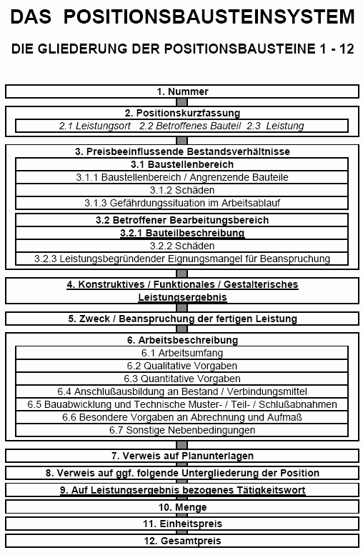

[🠔 Zur Übersicht: Planen im Altbau](11planme.md)  
# DAS POSITIONSBAUSTEINSYSTEM
**Begriffsklärung und Anwendungshilfen für Planer und Bauherren. Detaillierte Ausführungen zu Altbau, Sanierung, Denkmalpflege, HOAI, Kostenschätzung, Ausschreibung, LV, VOB, AVA und Software.**  
_von Konrad Fischer_

> [!abstract]+ Kapitelübersicht: Planung & Kosten  
> 1. **DAS POSITIONSBAUSTEINSYSTEM**
> 2. [Kostenexplosion und Leistungsbeschreibung - Zusammenhänge, Probleme, Lösungen](9pbs01.md)
> 3. [Planungskosten, Planungshonorar und HOAI im Altbau 1](10hoai.md)
> 4. [Planungskosten im Altbau 7](10hoai07.md)
> 5. [Planungskosten im Altbau 10: Luxusplanung als Überlebenskunst](10hoai10.md)
> 6. [Handwerker-Quiz für Bauherren - Pfusch + Planungskosten im Altbau 13](10hoai13.md)
> 7. [Das lustige Planerquiz - Planungskosten im Altbau 14](10hoai14.md)
> 8. [Deutschland wählt die Superplanung](10hoai15.md)
> 9. [Bauherren-Quiz](10hoai16.md)
> 10. [Ziel- und qualitätsbezogene Vergabekriterien für den Planungsauftrag](10hoai17.md)
> 11. [Planungskosten im Altbau 20](10hoai20.md)
> 12. [Planungskosten im Altbau 26](10hoai26.md)
> 13. [Planungskosten im Altbau 27](10hoai27.md)
> 14. [Die Ausschreibung von Planungsleistungen bei der Altbausanierung, Denkmalpflege und dem Denkmalschutz, die Unterschreitung der Mindestsätze sowie die Bedeutung des Mindestpreischarakters gem. HOAI](10vof.md)
> 15. [CAD und AVA im Altbau - Kann es schärfere Info gegen Vergabebetrüger geben?](9cadava.md)

[Das Positionsbausteinsystem als Bestandteil einer AVA-Software](http://www.crusius-online.com/Produkte/PBS/AFrame.htm)

## DIE BESCHREIBUNG VON BAULEISTUNGEN GEMÄSS VOB UND HOAI

**Begriffsklärung und Anwendungshilfen - Ein Leitfaden für Planer und Bauherren 
**Mit detaillierten Ausführungen zu den Themen Altbau, Sanierung, Denkmalpflege, Denkmalschutz, HOAI, Kostenschätzung, Kostenberechnung, Ausschreibung, Leistungsverzeichnis (LV), Standardleistungsbuch, VOB, AVA und Software.

**LEISTUNGSBESCHREIBUNG UND KOSTENBERECHNUNG**

**Grundlagen**

Architekten und Ingenieure planen Bauleistungen zeichnerisch in Entwurfs- und Konstruktionsplänen und schriftlich in Baubeschreibungen. Die Beschreibung soll mit den Plänen korrespondieren, im Streitfall mit ausführenden Firmen geht sie dem Planinhalt vor. Trotz ihrer Bedeutung im Baugeschehen wird die Leistungsbeschreibung in der Ausbildung vernachlässigt. Auch Bauverlage und Softwarehäuser bieten dafür nur unbeholfene Systeme. Sie beschränken sich auf grob strukturierte Textsammlungen, die den praktischen (technische Vollständigkeit), aber auch rechtlichen Ansprüchen (eindeutige Kalkulierbarkeit, Nachtragssicherheit) nicht genügen und allzuoft in ihrer Einseitigkeit ihre Herkunft aus der Baustoffvermarktung nicht verleugnen können. 

Die VOB, die Richtlinien des VHB, die HOAI, Vertragsrecht, Rechtsprechung und der Informationsbedarf der Baubeteiligten stellen [andere Ansprüche an die Beschreibung und Berechnung der Bauleistungen](4behoerd.md#die positiven auswirkungen). Als Neubaunorm entstand dafür die DIN 276. Sie möchte das Bauen in statistisch verwertbaren Zahlen und Texten ordnen. Seine verschiedenen Entwicklungsstufen werden dafür in sieben "Kostengruppen" gegliedert.

Diese Kostengruppen sind aber in der Praxis nicht sinnvoll und brauchbar, sondern weitestgehend theorielastiger Blödsinn von einflußreichen Schreibtischtätern ( und die Vermarktung von Bauprodukten im Auge, nicht den Bauablauf eines jeden Projektes) erster Klasse: Geplant, vergeben, gebaut und abgerechnet werden Baugewerke. Mangels zuverlässiger Vergleichswerte von der Instandsetzung einer gotischen Bürgerhausruine bis zur Neufassung einer Barockkirche nach Befund von 1841 verliert die DIN 276 gerade im Altbau auch ihren statistischen Sinn. Und während der Erdaushub schon schluß-, gleichzeitig die Mauerwerksarbeiten erst zwischenabgerechnet, Folgearbeiten teils vergeben, teils ausgeschrieben und teils nur vorgeplant sind, schuldet der Architekt vier zunehmend detaillierte Kostenermittlungen nach DIN (1. Kostenschätzung, 2. -berechnung, 3. -anschlag, 4. -feststellung), die eigentlich nur die Daten der vier wesentlichen Projektphasen (1. Vor-, 2. Entwurfsplanung, 3. Vergabe, 4. Schlußabrechnung) für sich darstellen sollen.

In der Praxis - die Entwickler der DIN saßen offenbar immer am grünen Tisch und kannten die Baustellenwahrheit nicht mal vom Hörensagen - müssen Bauleistungen und -kosten aber möglichst vollständig abgebildet werden, gleichzeitig laufende Projektphasen übergreifend, ggf. mit fördertechnischer Kostentrennung (z.B. Denkmalpflegeaufwand). Werden in einer Phase Kostenmehrungen deutlich, kann dann in folgenden Phasen rechtzeitig Einsparung gesucht werden.

Auch das Detaillierungssystem der DIN 276 mit ihren Bauteilen/Kostengruppen versagt hier, deswegen erlaubt sie immerhin auch die Gliederung nach Leistungsbereichen bzw. Gewerken. Die Bauleistungen werden dann in Vergabeeinheiten beschrieben. Aus wirtschaftlicher und technischer Sicht ist es besser, schon in möglichst frühen Projektstufen die letztlich abgerechneten Bauleistungen zutreffend darzustellen. Kostensicherheit und eine Kostenkontrolle vom frühestmöglichen Zeitpunkt an über die gesamte Bauphase setzt eine entsprechend genaue Leistungsbeschreibung voraus. Eine oberflächliche Zusammenfassung in Grobelementen reicht dafür zumindest im Altbau nicht. 

Deswegen sollte ab der Kostenberechnung die Gliederung nicht nach DIN-Bauteilen, sondern nach Leistungsbereichen/Gewerken gewählt werden, sinnvollerweise im Grobrahmen der ersten, höchstens zweiten Gliederungsstufe der Kostengruppen. 

[weiter ...](9pbs01.md)
