 
[🠔 Zur Übersicht: Startseite](index.md)  
# Die Sausanierung – Das letzte Abenteuer: Wie die Altbausanierung garantiert misslingt
**Du willst den größten Pfusch beim Sanieren von Altbau und Baudenkmal für das meiste Geld? Dieser Text zeigt dir, wie deine Altbausanierung garantiert misslingt und du Kosten maximierst.**  
_von Konrad Fischer_

> [!abstract]+ Kapitelübersicht: Pfusch-Anleitung (Satire)  
> 1. **Die Sausanierung – Das letzte Abenteuer: Wie die Altbausanierung garantiert misslingt**
> 2. [Ratgeber für abrißwillige Denkmalbesitzer und andere Seltsamkeiten](8ks1.md)
> 3. [Die Seite mit den wirklich spannenden Bau-Umfragen](umfrage.md)
> 4. [Energiekeinsparung im Altbau 150 % - Aber sicher! 1. Warum Energiekeinsparen?](energie.md)
> 5. [Das ökologische Bauen und die Baubiologie - eine kritischsatirische Abrechnung 1](oekobau.md)
> 6. [Das Antidiskriminierungs-Bundessicherheitshauptamt](8philipp.md)

**Vorsicht! 
KEIN Ratgeber!** 

 **Die Sausanierung - 
Das Letzte Aberteuer**

**Wie es bestimmt mißlingt**

[Was moderne Bauweisen für unerfahrene Bauherren bedeuten können](2mbu.md)

_"Zum Unglück hat sich mit der Industrie ein System verbunden, 
das Profit als den eigentlichen Motor des gesellschaftlichen Fortschritts betrachtet, 
den Wettbewerb als das oberste Gesetz der Wirtschaft, 
Eigentum an den Produktionsgütern als absolutes Recht, 
ohne Schranken, 
ohne entsprechende Verpflichtung der Gesellschaft gegenüber. [...] 
Noch einmal sei feierlich daran erinnert, 
dass Wirtschaft im Dienst des Menschen steht." 
_Papst Paul IV. 
(in seiner Enzyklika über den Fortschritt der Völker - [POPULORUM PROGRESSIO - Volltext deutsch](http://www.christusrex.org/www1/overkott/populo.htm) ) 

**Das Bild zum Thema:**[Frans Francken - Der Tod und der Kaufmann (1620)](http://www.religionsunterricht.de/ifr/ifr45zd2.htm)

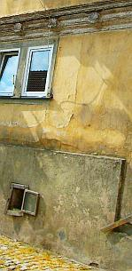 **Zum Einstieg** 

Altbausanierung ist doch was Feines: Jeder kennt sich aus, nicht nur der altbauerfahrene Architekt und Bauingenieur, jeder - egal ob Physiker, Biologe oder Geologe, sogar der Geograph und der Chemiker - weiß, wie es geht. Ja, auch Du, selbstverfreilicht. Restaurierung, Sanierung, Instandhaltung, Instandsetzung, Modernisierung, Renovierung, Revitalisierung - logische Begrifflichkeiten, alles klaro. Deswegen brauchst Du auch keine langweiligen Ratschläge und bekommst hier auch keine. Doch wenn Du vielleicht blutiger, aber sehr begabter Anfänger bist und trotzdem unbedingt wissen willst, wie Du es anstellst, auch ganz sicher den größten Pfusch für das meiste Geld zu bekommen, natürlich für Quadratmeterkosten Null Euro, was die Planung betrifft, können Dir die paar Tipps hier vielleicht doch noch was nützen. Sonst schaffst Du es vielleicht nicht so perfekt wie alle anderen, Deine Altbausanierungskosten pro Quadratmeter zu maximieren. Deswegen fangen wir mal ganz von Anfang an. 

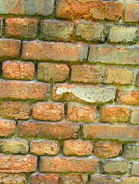 **Der Kauf** 

So, so. Du willst also einen Altbau kaufen. Weil Du noch keinen hast vielleicht. Oder weil das Geld für flotten Neubau mit ausreichend Platz für Nachwuchs und Hobbies nicht reichen könnte. Perserteppiche aus Seide, vergoldete Römerrüstungen und Deine sonstigen Luxuserweise des gehobenen Wohnstils wollen bewundert werden! Da braucht es Platz, Platz, Platz - der nix kosten darf. Doch Aladdins Wunderlampe hast Du leider gerade im Staubeck hinter dem Goldesel verlegt. 

Oder weil es eben atmosphärisch und romantisch viel schöner ist, ein salpeterbesoffenes Bauernhäusel, ein morschwurmstichiges Fachwerkhäusl, ein abgewirtschaftets Bürgerhaus in verlotterter Innenstadtlage, eine vergeigte Villa im Neurenaissance-Stil oder gar ein adelsversoffenes Schloß inkl. Burgruine in Besitz zu nehmen. Schon wegen der Adresse "Schloßpark 1" oder "Klainbäuerlesheimhausen 48a". 

Oder weil es Deiner Lebensgefährtin bestimmt gefällt, in alter Umgebung ein neues Leben zu beginnen, das frühere zu verfeinern oder endlich mal alles aus "Modernes Wohnen" zu verwirklichen. 

Oder, oder, oder. Auf jeden Fall wird lange rumgefahren - überall stehen ja die so dermaßen knappen Altbüdli herum - und in der Zeitung geguckt. Oder bei der Denkmalbehörde und im Freundeskreis nachgefragt, wer weiß, wo gerade der letzte Bewohner rausgestorben ist, eine Erbengemeinschaft endlich meistbietend verhökern will, ein Altbausanierer bankrottiert ist oder eine nette alte Bruchbude mit ausreichend Grundstück schon allzulange vor sich hinmodert.  Vielleicht auch zum Makler. Selbst Immobilienhaie sollen ja flotte Altbauten zu unglaublichen qm-Preisen oder cbm-Kosten im Portefeuille parat haben. Vielleicht auch ein angefangenes - aber leider trotz, wegen oder ohne Architekten - mißglücktes Bauvorhaben, egal ob Alt- oder Neubau. Bauherr nach Überschuldung am Mauergerüst erhängt, hinterbliebene Witwe muß verkaufen. Oder Bank verspielt die Bude in Zwangsversteigerung. Oft ist ja auch das Web die erste Adresse, um mit ["Immobilien Köln"](http://www.greif-contzen.de/), "Herrenhaus Rheinland", "Jugendstillvilla Düsseldorf Zentrum" oder "Bauernhof Oberbayern" 3,27 Mio Treffer zu landen und so eine [erfolgreiche Altbausanierung](11erhins.md) - vielleicht sogar mit [Architekten- und Ingenieurplanung](10hoai.md) herauszufordern. 

Eben je nachdem. Irgendwann findest Du bestimmt was, über das es sich lohnt, etwas näher nachzudenken. Und dann brauchst Du wahrscheinlich - wenn Du die Kröten in ausreichender Menge nicht im eigenen Sack hast (schon die Altvorderen angebettelt, die - huch wie ecklig! - Schwiegereltern? Den Erbonkel? Oder eben die [Kreditbank](kredite.md). 

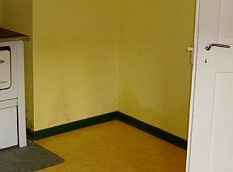 Da steht es nun, Dein künftiges Schmuckstück. Fast genau das Schnuckelchen, die Traumvilla oder das Musterhaus, wonach Du immer gesucht hast. Eben kein [Fertighaus](2fertig.md), Toll! Allerdings - ob der Preis auch angemessen ist? Bei der Lage, bei dem Zustand, bei den Grundlasten? Der dauernden Last durch schlecht abbrechbare Denkmalruinensubstanz, die den ortsüblichen Bodenpreis grausamst nach unten zoomt, was die verkäuferseitig vorgelegte Immobilienbewertung so ganz nebenbei total unterschlagen hat? Ebenso wie die ca. 30 plusminus Prozent Baunebenkosten sowie die wahren Baukosten für Instandsetzung, Umbau und Modernisierung inklusive aller geflissentlich übersehenen Problemchen durch nicht sofort sichtbare Bauschäden, vergiftungsbedingte Schadstoffkontamination an den einst "holzgeschützten" Holzbalken und Brettern, durch Schadsalzbelastung der Böden, Wände und Decken in allen Bereichen, die einst der geregelten oder in Notzeiten auch ungeregelten Stalltierhaltung oder Pißpottausleerung dienten und die nun die Mörtel und Steine durch Luftfeuchteeinspeicherung benäßt und bei Kristallisation zerbröselt. Und das bei Deinem Finanzrahmen? Dem Verkäufer und seinem raffiniert - da recht professionell mängelbestückt - lobpreisenden Sachverständigengutachten mißtrauen? Dem höflichen Mann in der dritten Reihe und der flotten Dame ganz vorne, die beim Zwangsversteigern immer den Preis weiter nach oben geschraubt haben, bis dann doch Du den Zuschlag bekamst? Den frisch überstrichenen Wasserflecken vom Keller bis zum Dach? Dem mulmigen Gefühl in der Magengrube, ob das weniger der Leichengeruch des mit den Füßen voraus aus dem lange vernachlässigten Haus getragenen Altbesitzers oder der säuerliche Muffgeruch seiner überlebenden Herzensdame ist, sondern eher Schwarzschimmel, Hausschwamm und Stockfleckengestank eines allzu sparsam geheizten, oft befurzten und von lieben Haustierchen verschissenen, dafür aber nie gelüfteten Hauses, was Deine feine Nase beleidigt? Und was sind das eigentlich für Häufli auf den Dielenbrettern im Dachgeschoß, für Schrägen und Buckel am Boden, für Rissli im Putz, für Verwerfungen der muffligen Tapeten, für seltsame Kristllblüten und Röhrlingspilzli auf den Kellerwändli (Bild links: aus Bauberatung, Fotograf: Elmar Gensky, alle anderen Fotos: Konrad Fischer), für dunkle Flecken an Wand und Kellerboden, für mürbbrüchigweicheierige Hölzli hier und dort zwischen Boden, Wand und Decken? Tatsächlich bezugsfertig nach Tapetenwechsel und Baderneuerung? Oder muß alles raus und gegen neue Bauchemieprodukte ausgetauscht werden, wie es in allen Gazetten steht? 

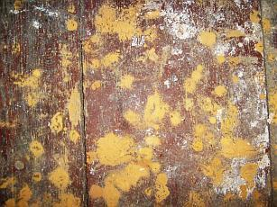 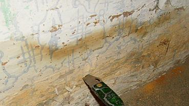 Ach was, Kosten sparen von Anfang an, Augen zu und durch. So ein Schnäppchen kommt bestimmt nicht wieder. Auch wenn es schon seit drei Jahren als Sauerbier im Angebot stand und die steinalte Hausbesitzerin inzwischen verfelst ist. Gottseidank hat der seriöse Makler ein noch seriöseres Sachverständigengutachten zur Hand, oder es macht Dir ein auftragshungriger Planungsexperte - das muß beileibe nicht immer ein Architekt oder eine Architektin aus dem Ort oder Deinem großen Bekanntenkreis sein, es soll auch Bauingenieure und sogar Bautechniker - last but not least auch "Energieberater", Bauzeichner oder ausgemusterte Maurerlehrlinge und Altgesellen des Zimmererhandwerks geben - eines. Ganz besonders schlau ist auf jeden Fall die Begehung mit benachbarten 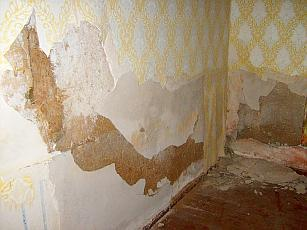 Handwerksmeistern. Die sind kostenlos kompetent, übersehen sehr geflissentlich alles Dich ärgernde mögliche Nachteilige und bestärken Dich massiv, endlich zuzuschlagen. Genau das wolltest Du ja hören: "Das ist gar nicht so schlecht, die paar Schädli werden wir mit wenig Aufwand später beseitigen können". 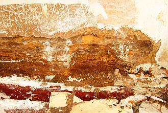 Daß das genau der allergewöhnlichste Kundeninsunglückstürz-und-Geldrauspreßtrick ist, brauchst Du jetzt noch nicht wissen. Wenn der gute Zimmerermeister dann später empört in die von keinem Bauschlaumeier je zu übersehenden Fraßlöcher der irre geheim hinter der Oberfläche möglichst tief wütenden Holzfreßkäfer, in die würfelbrüchig schwammverpilzte Holzsubstanz stechbeitelt und - wie schon hunderttausendfach eingeübt - auf einmal sehr überrascht tut und sagt: "Ja, wat haben wir denn da? 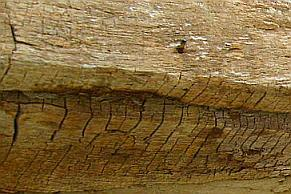 Oh, Oh, Oh!" und jedes Oh verzehntfacht seine klammheimliche Freude und die Abzockgebühr für von Anfang an in seinem "sehr annehmbaren" Angebot zwischen jeder Zeile schon eingepreister und nun - Gottseidank, hochgelobt und ewig gepriesen - endlich anstehende Stundenverzettelei - ja, dann kommt echte Bauherrenfreude auf. Dieses angesichts der hochmögend schlauen Bauherren geradezu unübertreffbare Trauerspiel in so wenigen Akten und nach festem Spielplan und unendlichen Wiederholungen ist übrigens die feste Grundlage (fast?) aller Handwerksmeistergeschäftemacherei in allen Gewerken. Noch nie in der Autowerkstatt gewesen, hä? 

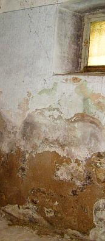 Soll alles also gar nicht so viel kosten, bis Du schnellstmöglich einziehen kannst, das stemmst Du bestimmt. Mutti, Vati, Opi, Omi, Onkelchen und Tantchen - alle helfen gerne mit, Dich ihre edle Spende rausschmeißen zu lassen, ist doch Ehrensache und Blut ist dicker als Wasser. Der von Anfang an eingeplante gnädige Verkäufer-Nachlaß von 20.000 (es hätten freilich wesentlich mehr sein können, aber soviel Nerven hast Du nicht gezeigt) Teuro "wegen der Rissli" und "weil Sie es sind" und weil es hier und da doch "etwas rieselt", woanders leicht 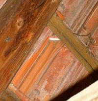 "feuchtelt" und nur "a bissi muffelt" hat Deine letzten Bedenken restlos beseitigt. Wer sollte gerade Dich bescheißen, wenn Du endlich, endlich, Deine so lange ausgereifte, mit heißem Herzen brennend herbeigesehnte und Dich so dermaßen glückseligmachende Lebensentscheidung triffst? Wo doch alle so nette Menschen sind und waren? Eben. 100.000 aufwärts darf das schon wertsein, nach allgemein sachkundigen Auskünften von allerlei Respektspersonen. Bist ja nicht blöde! 

Man kann sich ja auch - aber nur im Notfall, daß es doch ein kleines bißli teurer wird, etwas einschränken. Auch wenn die Lebenspartnerin immer noch die Stirne runzelt. Du bist der Mann, Du bringst das Geld und Glück nach Haus, Du entscheidest. Oder bist Du gar die Frau? Egal!: Rasch zum Notar, die langweilige Prozedur zu stinkigen Monopolkosten über sich ergehen lassen, fertig. Zahlen macht Freude. Es bleibt ja gottseidank noch mehr als genug für die allfällige Komplettsanierung zu höchstens 1 - 500 EUR/qm, 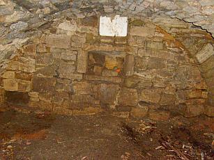 außerdem ist Opa ja noch rüstig und die bucklige Verwandschaft aus Nah- und Fernost packt für ein paar Flasch Bier und ne Leberkässemmel auch noch an. Des Menschen Glaube ist ja sein Himmelreich. Was war das doch gleich mit Grundschuldeinträgen, Leibrente für die alte Bauersfrau, Geh- und Fahrtrechte für diverse Nachbarschaften, anstehende Erschließungsumlagen wegen Abwasseranschluß an die 30 km entfernte Kreisstadt-Kläranlage? Na ja, ein frischgebackener Hausbesitzer hat es eben nicht ganz leicht. Geschafft. 

Vielleicht hast Du aber Dein Büdli "nur" geerbt oder schon länger und willst jetzt unbedingt was sanieren. Aus purer Abenteuerlust oder weil Du so viel darüber in den Wochenendbeilagen gelesen hast und jetzt unbedingt rauskriegen willst, wie man eine Altbausanierung mit 1 Eur/qm Quadratmeterkosten ein wirklich superfeines Wohnidyll im Grünen realisiert. 

**Es geht los** 

Nanu, fragst Du Dich als Käufer, es ist ein frisch eingetragenes Baudenkmal und gerade Du sollst auf einmal, und zwar schnelle!, die 100jährigen Löcher im Tropf-Dach stopfen, aber hoppla? Es gibt nettere Behördenbriefe. Na freilich, Du hast eben frisches Geld und ein nach oben offenes Kreditvolumen, da lohnt sich das Schreiben endlich. Der Alteigentümer kam immer gleich mit Flinte, soweit bist Du noch nicht. Also erst mal Anfangsberatung. Du sollst einen kompetenten Planer nehmen, heißt es plötzlich und bekommst auch gleich den kompetentesten oder auch nur beliebtesten aus dem Poesiealbum der Denkmalpflegerin/des Denkmalpflegers empfohlen, da heißt es nicht lange fackeln! Der kennt sich aus, weiß Bescheid im Umgang mit den Behörden, hat seine Lieblingsproduzenten und Handwerksfavoriten dank "bester Erfahrung"! Was für Erfahrungen, brauchste lieber nicht fragen. Muttu glauben! Kann ja nicht schief gehen. Gottseidank. Kamst ja schon was ins Nachdenken, als schon unter der ersten Tapete nur mulmige Balken und bröckelige Steinli in sandig-morsch-mürbem Körndl-Mörtel herausrieselten. Sah gar nicht so gut aus. Doch warum nun lange fackeln? Undurchsichtig-unvergleichbare Angebote sind durch, der Planer hat sein Machtwort gesprochen, Aufträge sind erteilt und frisch ans Werk! Vielleicht sogar erst mal selbst Hand angelegt, frisch in die Hände gespuckt, Tatendrang abgeschwitzt, im Baumarkt Schaufel, Pickel, Preßlufthammer und Schubkarren, in der Apotheke Pflaster und Schmerzmittel, im Getränkemarkt das Bier gekauft (auf unschlagbare Sonderangebote achten, man muß ja sparen!) und alles, was noch irgendwie gebraucht werden könnte, nur weil es Dir sowieso nicht gefällt und Du ein doller Macher bist, zerdeppert und abgeräumt, was nur geht. Sanierung fängt mit Aufräumen, Großreinemachen und Entkernung bis zur Vollskelettierung und Totalabbruch an, so machen es ja die Großen der Branche vor. Also raus mit der alten, guten Heizanlage namens Kessel, Brenner, Heizrohre und Heizkörper, die alle auch trotz EnEV und EWärmeG (BW Altbau)/EEWärmeG (BRD Neubau) wegen nachweisbarer Wirtschaftlichkeit [befreit](21311bau.md) locker weitere 60 Jahre ihren warmmachenden Dienst preisgünstig hätte leisten können, pfiffig nachgerüstet vielleicht sogar noch preisgünstiger, und gleich auch raus die alten Fenster egal welcher Bauart, Einfachscheibe, Zweifachscheibe, Isolierscheibe ohne Sprossen, Holz, Aluminium oder Plastik, sie sind ja angeblich "durch", unsanierbar, energetisch schlecht und/oder gefallen der Liebsten oder dem Dorfverschönerungsverein nicht, egal ob sie mehr oder minder intakt sind oder mit geringem Aufwand, aber technisch richtig instandzusetzen wären, natürlich muß auch die Dachdeckung neu gemacht werden, nach mehr als 30 Jahren sieht sie doch schäbig aus und jeder Dachdeckerhai rät dazu, obwohl die grauen Schleier und wenigen kleinen Mürbstellen an der Dachziegelunterseite nur von dem aus dem Dachdeckermörtel ausgewaschenen Kalk stammt, der an der Unterseite versintert und dies noch weitere 100 Jahre schadensfrei so weitertreiben könnte, vielleicht auch gleich den ganzen Dachstuhl inklusive Dachsparren neumachen, weil das Zeugs eh nicht taugt und auch die fette Zwischensparrendämmung nicht mehr ohne überzuquellen aufnehmen kann. Dann alle Bodenbeläge, alle Unterböden bis ein Kilometer Tiefe, denn wer weiß, was da alles drin ist und wie soll sonst die XPS- oder Glasschaumschotter-Dämmung da rein? Und wenn Du dann verschwitzt, verstaubt und verraten vor den letzten Bruchstück-Trümmern des vor kurzem fast oder ganz noch für die nächsten 100 Jahre bewohnbaren Altbaus stehst und erst mal nicht mehr weiter weißt - geh zum benachbarten Handwerksmeister (s.o.), zum Baumarktfachberater oder gleich zum örtlichen Abbruchunternehmer, dort wird Dir bestimmt geholfen. 

**DO IT WITH AN EXPERT!** 

Halt, so könnte es gehen und geht es so oft, aber es geht vielleicht noch besser. Wofür hast Du eigentlich auf so wohlmeinenden Rat hin einen Experten berufen (müssen)? Der kennt sich zwar selber nicht so dolle aus (außer auf dem gnädigen Schoß des gnädigen Baustoffproduzenten-/Bauchemie-/Handwerks-Ratgebers), hat vielleicht wegen Neubauausbildung und/oder Erfahrungsmangel ein bisserl Angst vor Deiner vergammelten Bruchbude ("Huch, ist das nicht der echte Hausschwamm?") und stiehlt sich lieber etwas aus der Verantwortung, genau deswegen empfiehlt er Dir weitere. Die können zwar auch nicht viel mehr, aber es umweht sie dafür ein rätselhafter Hauch des Oberexpertentums in ihrem streng begrenzten Fachgebiet mit undurchsichtigster Softwareanwendung von der Bauphysik über die Gebäudetechnikauslegung bis zur Tragwerksplanung. Oha, da muß man ja Respekt haben! Laien auf die Knie und Anbetung bitteschön, der Herr Dr. kommt. Ach schau, ist der auch schon Professor an einer Fachhochschule (heute Hochschule für angewandte Wissenschaften), vielleicht sogar einer Universität geworden? Sogar obendrein von der Handwerkskammer berufener öffentlich bestellter und vereidigter Sachverständiger namens ö.b.u.v.S.? Auf irgendwas in dieser so wissenschaftlich aufgeklärten Welt muß man sich doch verlassen können, gell? Und es können doch nicht alle Scharlatane und/oder Betrüger sein! 

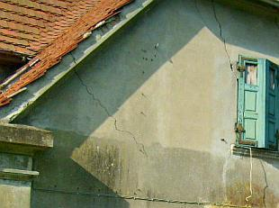 Diese Oberexperten rücken meist mit seltsamen Geräten und vor allem mit vielen Zahlen deinen paar armseligen Salzkristallen, angenagten Bälkli, brüchigen Steinli, bröseligen Pützli, schimmelig verkästen Tapetli und sonstwas zu Leibe. Das undurchsichtige Ergebnis (wofür denn sonst Experten?!) dann fleißig ausgedruckt zwischen möglichst unbequem dicken Aktendeckeln. Damit möglichst niemand durchblickt und niemals jemand reinschaut. Zahlen zum Vor- und Nachrechnen, daß Deine Bude schon lange nicht mehr steht (die Wirklichkeit seit 300 Jahren gilt nicht, wir haben ja die Zahlen schwarz auf weiß, ätsch!), zum Überprüfen und Erforschen Deiner geheimnisvollen Substanz bis in die Elektronenschalen, ja den Atomkern selbst und zum Katalogisieren aller jemals erfundenen bauschädlichen Salze. Nicht zu vergessen ein dachshaarpinsel-, skalpell- und für die Rausanierung auch brechstangenbewehrter Restaurator oder gar Bauforscher / Bauarchäologe von Gottes und des stellvertretend allerheiligsten Offiziums, vulgo Denkmalamtes Gnaden. Der räumt erst mal die störende Substanz weg und haut Löcher ohne Ende in den Bau. Holla, endlich eine Baufuge, und gratis dazu 97 buntverstaubte alte Farbreste. Alles im Raumbuch, besser Raumroman meterdick zwischen den schon oben erwähnten Aktendeckeln festgehalten. Das heißt Dokumentation. 

 Wofür das alles? Du wirst schon noch herauskriegen, warum. Ach je, für die eigentlichen Baumaßnahmen steht gar nix Gscheites drin? Dafür weißt Du nun die 27 verschiedenen Ausdrücke für Karniesprofilierungen und Verschreibvarianten für allerlei Latinismen (noch nicht alle Steinmetzhanseln und deren Freunde sind ja schon doktoriert oder kennen einen). Und außerdem kannst Du so manche stilistische und epochengenaue Einordnung Deines alten Gelumps nachlesen. Das lohnt sich massig, also: Erst mal Gutachten/Doku löhnen. So ein Zuschuß, so eine Steuerabschreibung will ja ehrlich verdient sein. Auch wenn sie schon von der Befunduntersuchung und Kaputtrechnung der Baukonstruktion fast aufgefressen wird und man sich oft trotzdem dafür fast die Kniescheiben abscheuern muß beim Antichambrieren, Buckeln und unter Amtstüren durchrutschen bis zur Proskynese (byzantinescher Fußkuß des Kaisers Filzpantoffel). Es lohnt sich trotzdem! 

 
[Teil 2](http://www.youtube.com/watch?v=Y1NSxAW15Cc) [Teil 3](http://www.youtube.com/watch?v=RAT7VzBo8k0) [Teil 4](http://www.youtube.com/watch?v=6TBII25iVQk) [Teil 5](http://www.youtube.com/watch?v=Kb0C4KiZvVA) 

und neu: 
 

Und bitte nicht verzweifeln, wenn die berechneten Dämmpakete und Stahlträger und Kabelbündel nicht so einfach unterzubringen sind, wie es auf der schniecken Planzeichung erst mal aussah. Mann kann ja das störende Gekrümel einfach wegreissen, dann klappt das bestimmt. Wofür gäbe es denn sonst all die tollen Abrißbirnen, Preßlufthämmer, Kettensägen, Dynamit und Kostenexplosionen, wenn nicht auch für Deinen Altbau? 

Wie man am Experten sparen kann? Geht auch, muttu nur fragen. Dann bekommst Du bis kurz vor der Bauleitung alles umsonst angeboten, weil es ja ziemlich viele Experten gibt, die Deiner winkenden Aufträge harren und vielleicht sonst nix zu tun haben. Dann schon lieber Acquise bis zum Abwinken. Was das dann für eine Leistung wird, brauchen wir uns eigentlich nicht zu fragen. Entweder wird sie anderweits gesponsort (vielleicht weil die Frau arbeitet, oder weil Experten grundsätzlich Multimillionäre sind und ihren Beruf zum Hobby gemacht haben oder weil so einige Baufirmen dankbar sind, wenn ihre Produkte endlich auch mal berücksichtigt werden, oder was weiß ich), oder sie ist halt so gut wie sie kostet. Du wolltest ja Schnäppchen, dann würg sie auch herunter, egal wie oft sie danach wieder übel aufstoßen. 

Aber vielleicht machst Du als ausgewiesener Fachmann des Bauens, Organisierens und Finanzkontrollierens am besten eh alles selber, einen Nagel für das Bild hast Du bestimmt schon mal in die Wand gebracht, und auch eine Glübirne schon mal ausgewechselt. Mehr braucht man bestimmt nicht draufzuhaben als echter Alleskönnner. Wenn Du später dann doch mal eine Unterschrift auf Stempeln brauchst, auch das ist billig an jeder Ecke zu haben. 

 **Gottseidank gibt es Firmen!** 

Zuguterletzt (oder eben gleich am Anfang) kommen auf Expertenrat vielleicht irgendwelche krawattierte und schwarzkofferbewehrte Firmenberater ins Haus (oder doch nur hinter Deinem Rücken ins Expertenbüro?) und machen sehr seriöse Vorschläge, wie sie trotz all dem feinstakribischen Hinundher des Forschungsreigens den Ein-/Umsatz ihrer dollen und allerneuesten 08/15-Sanierprodukte auf Deine Kosten in gröbster Form maximieren können. Es wollen doch [effloreszierende Salze](2salz.md) und gar feuchte Flecken höchstwahrscheinlich [aus dem nassen Boden aufsteigender Feuchte](2aufstfe.md) in reicher Zahl bekämpft werden, die kannst Du alle im teuren Gutachten nachlesen. Ob da die immer gleichen (kannste mir glauben, habe ich schwarz auf weiß) Textbaustein-Nachsätze namens nachträgliche Horizontalisolierung plus Buddeln und Vertikalisolierung des [Feuchte-Salz-Gutachters](3gutacht.md) den Riesenaufwand der Untersucherei bis zum letzten Atomkern rechtfertigen können? Na, wenn schon. 

Also drauf mit [absperrendem Sanierputz](2sanipuz.md) (immer unverändert brauchbarer Textbaustein 17.1 des 130-seitigen Salzanalysegutachtens, paßt in fünf Zeilen des entscheidenden Absatzes), der als superteurer (cbm 1000 EUR aufwärts) und wasserabweisender Kapillarblocker die Untergrundfeuchte ganz sicher erhöht und, da zementär mit ausreichend Schadsalzen bepackt, mit Sulfaten des feuchten Putzgrundes explosives Treibmineral bildet bis die Putzscholle abspringt und das Mauerwerk Dir in Brocken entgegenscherbelt. Als flankierende Maßnahme für die Horizontalisolierung gegen die [aufsteigende Feuchte](2aufstfe.md) (Textbaustein 17.2). Lies nach, sie soll es wirklich geben und ausgerechnet in Deinem Haus! Ein Wunder! 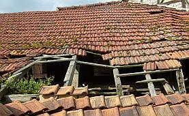

Da kannst Du aber wirklich froh sein, daß die Mauersäge in Deinem Gekrümel nicht so richtig geht und es deswegen mit Bohrlochtränkung oder Injektion irgendwelcher zweifelhafter Süppli sein Bewenden haben soll. Super substanzschonend und viel kostengünstiger übrigens echte Wunderwaffen gegen solche Wunder, für die eine Schraube in der Decke genügt. Das freut den wahren Denkmalpfleger, der auf seine Weihnachtspackerl von den Sägen- und Bohrerbesitzern und deren verdockterte Multiplikateure verzichten kann und im jungaltgebleibenen Herzerl ein treuechter Rieglfan ist, eben Metaphysik statt Bauphysik, Wandlung statt Alchymie. Doch das wird nur von Insidern verstanden, Du mußt Dir nichts dabei denken. 

Ansonsten bezuschussen sowohl Staat wie Kirche mit allergrößtem Vergnügen bestimmt jeden geradezu irrsinig überteuerten Bauschwindel für Dummies, kommt er doch oft genug auch aus dem eigenen Bauamt (in dem leider nur hin und wieder enttäuschte Geliebte das Hinundher der Vorteilsnahmen mit den noch geliebteren Firmen aufdecken - Motto: Schärscheelafamm). Auch manche Denkmalämter stehen hinter solchen Substanzzerstörungen treu und fest. Das kann sogar in Deinem wie in meinem Heimatblättla nachgelesen werden. Beispiel Kirchensanierung Geuthenreuth in der Neuen Presse Coburg am 27.9.2006: _"Die Maßnahme beinhaltet zudem auch die Entfeuchtung des Raumes im Sockelbereich durch ein "[Sanierputzsystem](2sanipuz.md)" ... Die Gesamtkosten für die Komplettsanierung, die exakt mit dem Bauamt des erzbischöflichen Ordinariats und dem Landesamt für Denkmalpflege abgestimmt wurde, belaufen sich auf zirka 285 000 Euro."_(Gedeckt durch ein vielfältiges Förderszenario und Klingelbeutelmittel der sicher sehr treugläubig an die unbefleckte Empfängnis Mariens, die Auferstehung Jesu und bestimmt noch viel mehr an die Unfehlbarkeit ihrer Behörden glaubenden Geutenreuther). Daß sogar schon maßgebliche Sanierputzhersteller in ihren Fachtexten die [Entfeuchtungs- (und damit auch die Entsalzungs-)Leistung ihrer Wunderwaffe](2sanipuz.md) korrekterweise abstreiten, braucht ein beamteter Kunsthistoriker oder katholischer Kirchenbaubeamter bestimmt nicht zu wissen, warum dann ausgerechnet Du? Wo selbst evangelische Pfarrhäuser in [vergammelsichere Schäume und Gespinste](213baust.md) eingemottet werden, ohne auch nur einen Tropfen der angeblich letzten [Ölung einzusparen](7fehrtab.md). Es muß wohl ein nicht jedermann bekannter Sinn in den Wunderwaffen liegen. Ist auch dem Wernher von Braun für seine sinnlosen Feuerwerkskracher damals schon ganz gut gelungen, den Feind nicht zu bezwingen, sondern nur die Kasse der Auftraggeber. Heute sind die Altbauten und ihre Finanziers die Gelackmeierten. Und weißte, wie Du Kohle beibringst, wenn alle Stricke schon gerissen sind? Meinste, daß dann noch [Auslandskredit ohne Schufa](kredite.md) helefen kann? Ich net. 

Auf die wasserabweisend geheilten Sanierflächen oben drauf übrigens unbedingt und bestimmt was Plastikvergütetbeklebendes. Heißt witzigerweise "[Mineralfarbe](22bausto.md)". Will nix heißen, wir lachen. Es gibt auch Kalkfarben, die nur wegen Methylzellulose und anderen organisch-synthetisch-acrylatisch-acetatischen Heilklebern so richtig aufkleben. Und schimmeln und veralgen. Man kann ziemlich viel Synthetik reinschmeißen. Heißt dann Kalkolin, Kalkolan, Kalkipur, Kalkisit oder so und verkauft sich auch noch als ziemlich reines PUR-Kalkprodukt. Nicht zu vergessen festigende und wasserabweisende Trocknungsblocker-Volltränkungen der wehrlosen Substanz mit irgendwelchen Kunstsandsuppen, reinsilikatisch, silokonatisch, methacrylatisch, polyvinylacetatisch, natriumstearatisch, polykondensiert kieselsäureesterisch oder sonstig abartig. Hauptsache OH (Oh, Ha!) und was Gutes für Drinnen und Draußen. Schon immer bewährt, Null Problemo. Wo? Da greift endlich mal der Datenschutz. Du bist auch mit Fotos kurz vor der Bauabnahme nach 27 Mängelbeseitigungsaufforderungen zufrieden. Und wissenschaftlichen Lobpreisungen der bestellten Engelschöre in Hochglanz. Halleluja, Kyrieleis und Amen. Klappe zu, Oberfläche dicht, Substanz tot. Aber erst nach der Gewährleistung. Expertenrat und Akrobat schööööön. 

 **Kostenexplosion nach Planung und göttlicher Vorsehung** 

Damit auch der richtige Produzent und Hersteller seine freundliche Sanierberatung des Bau-Pharmareferenten und Hintenrumzuschusterung der manipulierten Kostenlosplanung fett vergütet bekommt und beim nächsten Mal wieder leistet und außerdem mit den herstellertreuen Bietern das kostensteigernde Hintenrumbieterkartell (mit Festlegung der Gratifikation für den Ausschreiber) schmieden kann, muß er bzw. sein Markenprodukt vom Putz zur Farbe bis zur Dämmung und Deckung auch ordentlich im Leistungsverzeichnis benamst bekommen. Aber natürlich getarnt mit dem Zusatz "oder gleichwertig" und auch damit total VOB-widrig (das ist die verbindliche (Ha, ha!) Vergabeordnung für Bauämter und alle Zuschußempfänger, lies mal in den Nebenbestimmungen zu Deinem Zuschußschreiben nach). Prüft doch eh keiner, kein Rechnungsprüfer, kein Kämmerer und bestimmt kein privater Bauherr. Sonst käme ja fast jeder mindestsatzunterschreitende Planer schon bei der Vorlage eines echten (mit Bietereintragungen versehenen!) Muster-LVs "Fassadenarbeiten" im Bewerbungsverfahren ins Schwitzen und vielleicht sogar an die 0,1 bis X % aller Bauamtsausschreiber, egal ob staatlich oder kirchlich, gelle? 

Auch ein sehr beliebter Expertensport, um Deine kümmerliche Baufinanzierung möglichst total abzugreifen und wenn keine freundlichen Produkthersteller greifbar sind (wie bei Zimmererarbeiten): Von freundlichst superkompetenten Bauunternehmern hintenrum das Leistungsverzeichnis reinkriegen, Nullpositionen inklusive. Damit der freundliche Freund auch später, wenn er "seine" Ausschreibung neu betitelkopft als [kompetentes Leistungsverzeichnis](9pbs.md) zur neutralen Vergabe, natürlichst streng nach [VOB](8recht.md), wieder reinkriegt, richtig spekulieren kann und auch gaaaanz sicher den Auftrag zugeschustert bekommt. Mit ausreichend Lücken zur mindestens Verdopplung der Auftragssumme, dann aber zu fetten Nachtragspreisen. Man muß halt Leute kennen, wenn man schwarzbefrackt irgendwie überleben will. 

Wo soll denn eigentlich das Problem drin sein, wenn nicht der supabilliche Planer das originale Leistungsverzeichnis macht, sondern dahergelaufene Firmen? Die sind doch allesamt weit und breit dafür bekannt, daß sie für magersten Gotteslohn, aus purer Lust, Liebe und Menschenfreundlichkeit 

- immer die perfekte und in die Tiefe gehende Bestandsaufnahme der technischen Zusammenhänge und Mängel machen, 
- dadurch immer ohne Ansehen der eigenen Produktpalette die technisch und wirtschaftlich allergünstigste Heilmethode herausfinden, 
- immer ganz ohne Umsatzinteressen das am Markt vorhandene beste Produkt oder gar den Maßnahmenverzicht empfehlen, 
- niemals aus Blödheit oder Berechnung Positionslücken lassen und ungenaue Beschreibungen liefern, aus denen sich später dem klügsten (und befreundeten) Billigbieter die ungeheuerlichsten Nachtragswünsche erfüllen, 
- auch niemals Trickpositionen im Text drunternudeln, die es dem klügsten Billigbieter garantiert ermöglichen, das billigste Angebot und die teuerste Abrechnung vorzulegen, 
- und garantiert niemals - wenn schon eigene Produkte - all den preisanfragenden Bietern später die Möglichkeit bieten, eine ergiebige Preisabsprache mit Herstellerhilfe zu schmieden - 

und das alles wegen der damit so wesentlichen Randbedingungen für das hiesige und künftige Seelenwohl. Ja aber, wenn Du trotz Billichplanung von solchen Dingen nix haben willst, bleibt immer noch was Schönes übrig: 

Es gibt die letzte, und für Dich auch nicht nachteiligere Variante der Billigst- und Schlechtestplanung: Das komplexe Saniergeschehen in schwammigsten Alles-inklusive-Positionen auszuschreiben, um dann ohne Mühe 90 Prozent Nachträge durchzuwinken. Weil ja - blöder Altbau! - wieder mal nix gepaßt hat und schon das dümmste Amtsgericht unklare Ausschreibungstexte nicht zum Nachteil des Bieters durchgehen läßt. Prüf es nach, wenn Du es nicht glaubst! 

Die Krönung für Dein Bauvorhaben ist dann bestimmt die bunte Mischung aus allen Möglichkeiten, Deine Kosten zum buntesten Feuerwerk aufzuexplodieren: Falsche Sinnlosprodukte und -technologien im Verbund mit allen Manipulationsstrategien der Bauvergabe. Gratuliere! Du wolltest es ja so. Und nur so kann es mißlingen. 

**Holzschutz muß sein - oder: Wat mutt, dat mutt (neue deutsche Schreibe - Wat mut dat mut)!** 

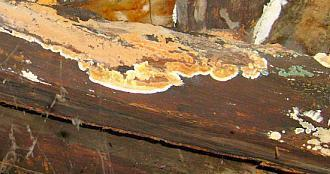 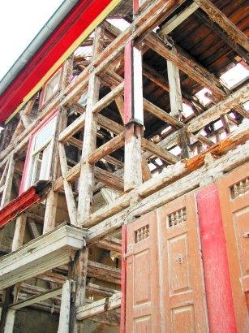 Nicht vergessen, falls es trotz aller unsinnigst freigelgten Balkenköpfli immer noch ein paar schäbige Restli von Altholz in Deiner Bruchbude gibt, das Du wegen vehementer Gegenwehr nicht rausbrechen konntest: Ein schwachverständiges Holzschutzschlechtachten, das nach Vollentkernung / Skelettierung / Filettierung durch technisch-konstruktiv absolut überflüssiges Herausbrechen aller noch so historisch gefaßten Gefache des vorher so bemerkenswerten und 99%ig tragfähigen Fachwerkhauses sowie aller restlichen Deckenbalkenlagen möglichst jedem einzelnen Viecherl, Pilzerl und Pflänzchen zwei Vornamen verleiht: Deutsch und Lateinisch (manchmal falsch geschrieben, aber trotzdem). Und wenn es nur ein bis zwei Wurmlöchli gibt? Und gar kein aktiver Befall oder nur durch konstruktiven Holzschutz leicht und ungiftig beherrschbarer echter Hausschwamm / Serpula lacrymans nachgewiesen? 

Egal. Wie immer Vollvergiftung nach Norm, DIN 68800 und Verwandlung Deines naturgleichen Biobaus in eine krankmachende Sondermülldeponie. Könnte ja auch gut helfen, wenn Deine plastikverpackte Sanierbude später doch auffeuchtet, man weiß ja nie. Und wofür gibt es denn all die werbefinanzierten und anzeigenabhängigen Fachzeitschriften und sonstigen Lobhudler? Und die lobbyistenerschaffenen Bauvorschriften zur Umsatzmaximierung auf Kosten des allgemeinen Grauens und der unbändigen Angst? Wir Deutsche sind halt mal sehr vorsichtig und vorschriftengläubig und unserer Obrigkeit allzeit treu und dankbar sehr ergeben. Eben. Dafür kann man dann auch gerne den Rest des Lebens Schorf abkratzen, näseln, tränen, mit Migräne lahmliegen, kopfschmerzeln und husten. Aber nur hinter vorgehaltener Hand, bitteschön. Und bitte Tabletten reinschmeißen nicht vergessen. Die Chemie hat ja auch dafür was im Angebot. Ob das gut für Kinder ist? Ach was, wer hält sich denn noch sowas? Die stören doch nur bei der Arbeit, bei der Abzahlung des bis zum Exitus ausgeweiteten Baukredits _und_ bei der Freizeitgestaltung. 

Hauptsache, das so arg böse Würmli ist töter als tot!

**Energiespar- und Konsumterror rundum, Amen!** 

Da werden wir ja angeblich auch gesetzlich gezwungen zu. Sagen jedenfalls alle Profiteure, sehr nette und umgängliche Menschen und seriöseste Fachleute übrigens. Sowieso wegen dem ominösen Klimaschutz, der neuen Religion für uns Gottlose, zunehmend auch in Kirchenkreisen zuhause. Daß es für alle Klimaschutzgesetze tolle und immer greifende Ausnahmen und Befreiungen gibt, mußt Du ja nicht wissen, es interessiert Dich auch nicht, sondern nur gottverdammte, CO2-Hype-renitente Öko-, Altbau- und Technikketzer und außerdem hast Du Expertenrat, vielleicht sogar vom zertifizierten Energieberater,die Dir alles für Dich kostensparende sicher verschweigen und als ewiges peinliches Geheimnis tief im tiefgekühlt erfrorenen Herzen verschließen. Pssst! -Feind hört mit! Hej, da fürkann der auf Zuschuß und auch nur für Deinen Zaster rechnen, was das Zeug hält. Bunte Ausdrucke mit fetzigen Grafiken inklusive! Fast wie der Statiker. Oder macht doch alles die Software vom Kassler Professor? Na, wenigstens die richtigen Knöpfli muß man auch bei größter Düsternis blind ertasten können, das ist schon was wert. Und probier es spaßeshalber mal aus: Drei Experten - drei unterschiedliche Rechenergebnisse. Versprochen! Egal. Also raus mit den alten Böden und ein paar dicke Dämmstoffe drunter. Ein Teppich drüber gäb bessere Fußwärme, aber nur nicht nachdenken anfangen. Sonst wird nix draus. Und dann aufbetonieren und Naßestriche. Sonst bleibt die Bude nicht jahrzehntelang feucht und kein Boden will sich werfen. Das wollen wir doch nicht wirklich, oder? 

Auch in die Wände, vor die Wände und oder dahinter (wenn es unbedingt nach dem Willen der Denkmalpflege gehen muß), unter, über und zwischen die Sparren, für Frühling, Sommer oder Winter einen Schatz, zig Meter finden Platz. Die Ökodenkmalpflege favorisiert neben der Neufensterverwüstung in Naturholz (gibt es gottseidank auch passivzertifiziert mit Dämmkern!) übrigens Leichtlehmgepampe, das wäre doch so altbauverträglich. Meinen die Schimmel auch, die in und auf dem immer allzunassen Zeug gerne Urständ feiern. Toll, daß die korrekte Anwendung der weltrettenden Dämmvorschrift auch gleich für ein neues Dach sorgt, oder? Der Platz zwischen den alten Gespärren hätte für all die dicken Kubikmeter doch nie gelangt. Daß die fette [Dämmung vielleicht gar nicht dämmen kann](7fehrtab.md)? Das klingt lustig, gelle? Und bald [von der Wand abschimmelt](213baust.md)? Dafür wird doch Gift in die Beschichtung reingehauen ohne Ende. Das wäscht zwar aus, aber über die Gewährleistungszeit wird's schon taugen. 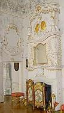 Ebenso wie die Borat-Vergiftung Deiner Naturökobiodämmung in Dach und Wand. Wenn's trotzdem wegschimmelt, weil eben bald genug feucht? Pech gehabt, Altbausanierung ist doch als Glücksspiel wohlbekannt und beliebt. Wer zocken will, muß auch damit rechnen. 

**Heizung raus, Energieschleuder rein** 

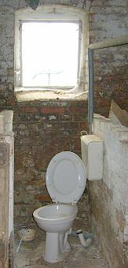 Und die alte Heizung, der alte Ölbrenner, die Kaminheizung, der Kachelofen,der offene Kamin, egal wie schön und seit Jahrhunderten gut, nein bestens und energiesparendst funktionierend? Runzel, runzel, die muß ebenso wie die restliche vorsintflutliche Haustechnik auch raus und in neuestem Hightech erneuert werden. Sie hat doch noch so gut funktioniert und gar nicht so viel verbraucht? Ach was, wir haben ein Gesetze und nach dem Gesetz muß sie sterben. Punktum. Wofür gibt es nun die Ruß- und Feinstaubrichtlinie inkl. BImSch und EnEV, Klimaschutzgesetz und EEWärmeG? Außerdem braucht es dafür noch einen Experten. Doch daran hast Du Dich nun gewöhnt. Auch wenn die Lebenspartnerin mehr und mehr stöhnt und immer öfters die Krise kriegt. Augen zu ist nun nicht mehr genug, ab jetzt müssen die Zähne zusammengebissen werden. Knirsch. 

Also rein mit Erdsonde, Wärmerückgewinnung, Zwangslüftung mit Pollenfilter, Blockheizkraften, Vollbrennwerten explosionsgeschützt (bitte nicht all die Gasexplosionsbilder angucken, die Woche für Woche unsere Tageszeitungsbildredaktionen begeistern), Pelletsverstopfmaschinerie, Hackschnitzelverschimmler, Holzvergaser, Getreideschredder, uswusf.. Nur drauf mit Sollarkollektor, drüber Photovoltaik. Ebus, Netzfreischalter (wir sind doch ökobio!) und vollelektronische Haustürposteinwurfwechselsprechalarmanlage. Brandschutzmelder extra. Daß Energiesparen so viel mehr als Eisenbahn im Keller kost! Muß wohl an den viel mehr Drehknöpfli und Fernbedienungen liegen. Und der Software, die nur noch einer bedienen kann. Aber über Telefonkabel oder Satellit oder Handauflegen und dran Rütteln. 

 **Fenster? Aber bitte mit Fünffachverglasung und Kerndämmung!** 

Natürlich alle alten Fenster raus und allerneueste passivhauszertifizierte Wärmeschutzglasfenster rein. Wg. Öko in Holzprügel, außen alulkaschiert auf PUR-Dämmung. Ja, mit diesem U-Wert kann die Nachbarschaft bestimmt nicht mehr mithalten. Die waren früher fertig und wer hier zu früh kommt, den bestraft das Leben. Es muß Dir doch perfekt gelingen, den Altbau möglichst unkenntlich in Neuware zu verwandeln. Man macht das ja nur einmal. Übrigens ließen Fenster früher Licht rein, da mußteman nicht schon am Tag alle Energiesparlampen glühen lassen. Daß schon einfachstes Fensterglas die für den Wärmeverlust maßgebliche Wärmestrahlung aus deinen IR-abstrahlenden Tonnen Massivbaustoff nicht durchläßt und in fetten Profilen eingebackenes Doppelglas die kostenlose Solareinstrahlung mindert, ist doch egal. Außerdem mußt Du doch nicht alles wissen. 

**Dachschaden** 

Auch die alten Ziegel dürfen über den Jordan springen, selbst wenn sie nochmals 300 Jahre halten würden, trotz ihrer Anbröselung, die jedem wahren Dachdeckermeister die gruseligsten Horrorgeschichten entlocken. Es gibt so schön bunt glasierten Ersatz. Sogar in Naturrot und doppelter Größe. Außerdem, wenn schon alle Dämmstoffe so gut Kondensat aufsaufen, warum soll dann das Dach so schnell abtrocken wie früher? Braucht es alles nicht bei all der Technik. Hauptsache, die blowergedoorten Folienverklebungen sind schön dicht. Wollten wir nicht immer schon in Thermoskannen leben? Na eben. 

Schön auch dampfdiffusionsoffen aufgeklebte Dach- und/oder Unterdachbahnen plus unterseitige Dampfsperre. Keine sollgemäße Hinterlüftung, sondern Sparrenvolldämmung! Nur so kann sich die rundum folienverpackte Dachkonstruktion so richtig auffeuchten und dann wegrotten. Dabei hilft dann auch das trotz angepreßter Klebestöße in das bewegungsfreudige Dacherl irgendwann reinflutschende Kondensat aus Raumluftfeuchte mächtig gewaltig. 

**Die Bauabrechnung** 

Da reden wir lieben nicht drüber. Nur soviel: Bis zum Finanzcrash funktioniert sie so: Alle Chaos-Rechnungen werden mangels Prüffähigkeit nicht zurückgewiesen (macht den ans Herz gewachsenen Firmen und dem Prüfer sinnlos Arbeit), sondern nur fleißig in den Multiplikationen und deren Summen geprüft und dann grün abgehakt und Dir zur Zahlung angewiesen. Oder ohne Expertenhilfe: Die Rechnungen werden solange ohne jegliche Prüfung (da hast Du dann nämlich keine Nerven mehr) bezahlt, wie Dein Geld halt langt. Dabei schiebst Du dann mehr und mehr hin und her und vor Dir her, wirst säumig, flüchtest Dich in geradezu irre Entschuldigungen, kommst ins Abstottern und irgendwann ist dann doch der Ofen aus. Gäubigerversammlung, Gläubigervereinbarung, Insolvenzverfahren und Bankrott mit Pfänung des Privatvermögens. Die Mängelbeseitigung, wenn Deine Sanierkunststückchen recht bald alle wieder von der Wand springen, spielt dann wirklich keine Rolle mehr. Von der Bausanierung zur Rausanierung durch Sausanierung - vom Bautenschutz zum Flautenschutz. Aber nur für die Sanierspezeln, gellfreilihostmiwa? 

**Fazit** 

Jetzt weißt Du fast alles, wie auch Deine zünftige Altbausanierung funktionieren kann. Und mehr brauchst Du doch nicht. Wenn Deine ehemals geliebte Lebensabschnittpartnerin dann aber nach der Privatinsolvenz nur noch lästig zickt, such Dir halt eine neue. Es gibt ja Singlebörsen ... 

---

Bitte gar nix davon lesen, wenn Du ökobiologisch und bestimmt nicht energiesparend verrotten willst: 

**Inhaltsverzeichnis Baustoffkapitel:** 

[Einführung zum Problemkreis "Modernes Bauen"](20bausto.md#einfã¼hrung) 
[Einige Tips zur Produktvermarktung](10hoai22.md) - Ihre raffinierten (von Raffen?) Methoden, Tricks und Betrugsmanöver 
[Zusammenfassung](20bausto.md#zusammenfassung) 
Die anderen Kapitel: [0. Aktuelles](2baustof.md#aktuelles) 
[1. Gibt es "aufsteigende Feuchte"?](2aufstfe.md) 
[2. Erneuerung oder Erhalt von Altputzen](22bausto.md) 
[3. Erneuerung oder Erhalt von Altfenstern](23bausto.md) 
[4. Geeignete und ungeeignete Farbsysteme auf Holzuntergründen im Innen- und Außenbereich](23bau08.md) 
[4a. Rostschutzanstrich](23bau10.md#rostschutzfarbe) 
 [5. Wirksamer bekämpfender und vorbeugender Holzschutz ohne Gift](23bau16.md) 
[6. Luftkalkmörtel für Mauerwerk, Innen- und Außenputze, Dachdeckerbedarf, Verfugung und Verpressung](26bausto.md) 
[7. Mineralische untergrundverträgliche Anstrichsysteme](26bau07.md) 
[8. Ertüchtigung historischer Gründungen durch Stopfverfahren](28bausto.md) 
[9. Natursteinrestaurierung/Naturstein](29bausto.md) 
[9a. Boden/Verkleidung keramisch/mineralisch](29bau07.md) 
[9b. Reinigungsverfahren für verschmutzte Altoberflächen](29bau08.md) 
[10. Wandbildner im Altbau](29bau09.md) 
[10a. Nachtrag: Fachwerkbau/Holzfußboden/Fußbodenaufbau allgemein](29bau16.md) 
[11. Der Stahlbeton und Zement](2beton.md) 
[12. Dachdeckung und -konstruktion](212baust.md) 
[13. Wärmedämmung](213baust.md) 
[14. Brandschutz im Altbau](2baustof.md#14) 
[15. Arbeitssicherheit bei der Altbauinstandsetzung](2baustof.md#15) 
[16. Links zu verwandten sonstigen Themenbereichen ](2baustof.md#16) 
[Extra: Vom richtigen und falschen Heizen - die Hüllflächentemperierung](7temper.md) 
[Extradry: Geheimnisse der Ökoreligion, ihre Ursprünge und ihre Folgen](7thuene1.md) 

