[🠔 Zur Übersicht: Asia & Middle East](asia.md)  
# 欺骗? 潮湿/湿度, 墙面潮湿 + 墙面脱水技术
**关于欺诈行为的: 返潮, 湿度, 墙面潮湿, 墙面干燥 + 地下室脱水除湿, 稍后补充 水平密封 / 墙面和砖体的横向隔离排水 - 侦察和挑衅!**  
_von Konrad Fischer • aktualisiert 25.08.2007_

## 潮湿上升1
问题引言

### 潮湿上升的章节 1 - 导言介绍 2 - 一种可怕的 "干燥（缩减）状况" 3 - 潮湿来源 4 - 砖墙和潮湿上升 5 - 天然石材（人造石）墙面和潮湿上升 6 -老式砖墙的附加水平填缝? - 砖墙的盐化/受潮 - 为什么? 7 - 冷凝水和雨水 8 - 由水平隔离引起的缩减或建筑损伤? 9 - 排水问题 - 市场策略 10 - 电渗漏和典型的干燥处理-失败的借口 11 - 干燥处理专家? - 设计者和检查员 12 - 干燥处理 - 工业咨询 或者好的共识? 问题和答案 13 - 墙面排水 - 传统的误区 14 - 受潮墙体的改造 - 科学的答案? 15 - 墙体受潮来源? 对此从科学和历史的角度进行分析

每个房子 - 并不是只有动物的粪便才能引起氨化硝石档墙/硝石墙/墙壁起霜/硝酸钾 - 而是在任何地方都会浸透盐屑,硝酸钾的气息, 表面硬结, 潮湿鳞片状或发霉海绵状的墙角,或许? 在圆顶地下室 (无论是桶式拱形还是普鲁士或是波西米亚拱形),或在混凝土天花板,混凝土空心板,木梁,铁支架或空心遮盖的地下室，在基座边和在那些天然石材，砖的内 墙, 砖砌墙或者是框架墙人们认识到这些 - 甲醇:

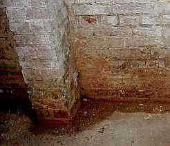.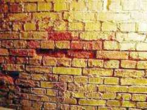.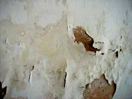. 
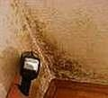.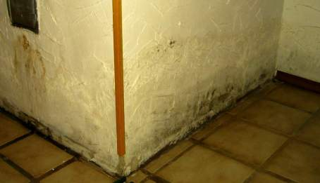 
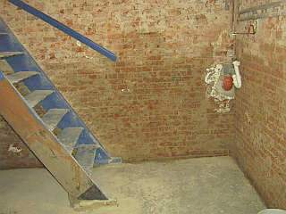.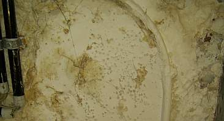. 

 以至显然能够看到: 

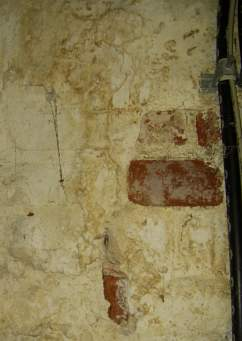.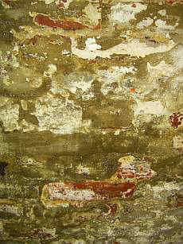.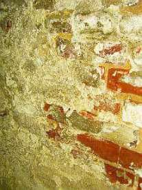. 
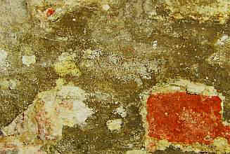. 
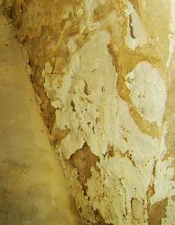 
(所有的图片来源本人所收集的建筑资料) 

---

**竭尽全力修理和拆除 - 极可能的昴贵和无意义! 

** SCHREIT 采用墙体除潮和排水处理, 基础开挖, 排水系统/排水设备, 降低地形, 永久性墙体供暖/加热, 装饰层重新粉刷和抹灰层翻新, 还是? 在墙体/地下室受潮。市场有一些远近闻名的专家和专业人士,化学污泥- 和永动机生产商, 不了解真实情况的工匠提供给最亲密的邻居（所有建筑设计所都以无以伦比的营销-如太过昴贵销售的策划和最愚蠢以及错误百出的同样方案提供给建筑设计所的客 户, 对不?)。 翻修工,专家, 工匠, 处理者和供应商 对于“干燥处理“和"受潮治理" 问题的处理是通过抹上一种“水平阻塞/ 横向填缝 /水平填塞面 /横向隔离" 各种各样的有毒的- 和含盐的-膏状液体(!)。通过绳锯方法 确切的说，墙体锯方法镶入的合成材料面,可浇铸的合成材料,部分的重金属层和镶嵌的铅片(钢板 - V4A-铅片,铬钢片,铬溴钢片，铬溴钼-钢板, 沥青的铝面,铅板,自动的水平缝填通过壁锯方法或通过壁交换方法), 电渗漏和其他回转方法的专业处理. 

往往越是神秘的,却越是能够更好向业主解释和渗透. 但不是每个房主都如狐狸般聪明. 以至被潮湿处理专家,家庭医生,建筑物理学研究者或是 - 简而言之 - 建筑保护者/建筑改造者所蒙蔽，所以说，对于那些可怜的业主, 这涉及到盐性的潮湿/湿度/墙壁受潮/墙壁湿度/墙面受潮/墙体湿度的"增加" 和通过他们的单层隔离/覆盖 或是潮湿在多数-和少数-消除方法，这类方法是比较安全的...实惠或完全没费用.以前墙体受潮是将地基上面产生的水通过在右侧的一个粘土袋和人工的适当 的习惯处理(粘土/硅酸铝含量过高的土壤/混凝土是目前另外的一种高密度材料!),目前需要专家和其隐藏的创新，还是? 

更让人忍俊不禁的是 “聪明的" 抹灰工, 粉刷工和其他工人: 在两周内-特价货品每天新的 [神奇的-专业的 -翻修灰浆, 特别-微孔灰浆, 防水含合成树脂的-人造的隔离灰浆, 针对干燥处理的灰浆/防潮灰浆](2sanipuz.md). 或是如[ 钙-硝酸盐板/钙-硅酸盐板或是其他的粘合剂](2sanipuz.md). 为什么如此受欢迎? 因为如此毫无意义而且昴贵的材料不可能卖给那些聪明的业主（合格的高中毕业，也许是大学毕业!),不过也极可能没有保障(工匠对于采购员: "因为我有一种全新的材料，我应该毫无隐瞒的告诉你, 因此就说了. 商品说明书上的某一处会解释, 质量保证是不可能给予的, 这次我们为你作为一次尝试, 亲爱的（乡村）业主,这样你，因此(肯定不是的!)你就可以节约很多钱". 而最可能的是在过了若干年后，在这新的管道上又添上了类似发醇的东西，而与此对应 的，在那 墙面上又添上了独特的墙面色，与此同时，增加了高品质材料市场的需求. 

因此准确的提供给你最好的，我们了解你，尊敬的业主! 了解你那让你痛苦的可怜的拱形地下室!, 那受潮的墙体! 为补救成功那盐化污染的砌砖墙: 工匠，不是，专业人才，在哪里有,全球唯一对于建筑保护&建筑维修的专家, 对于干燥&墙体受潮的处理! 建议 /检验包括潮湿测试 & 潮湿控制, 通过实验报告分析出盐含量, 那些翻修的专家咨询而得到专业化的制定，"版权的保护" (因为在竞争中所有原文都会被抄袭/复制), 是无费用的并不用酬劳! 是的，那些吝啬的业主很喜欢这样. 

根据德国 WTA-说明书 4-5-99/D "对于墙体判断-墙体分析B" 通过对于水泥抽样/墙体抽样的实验分析最终评价出其中所含有害盐-离子? 

这里是表格概要 - 评价在墙体内不同盐离子中有害物引出的影响: 

乙烯 < 0,2 0,2 - 0,5 > 0,5 
硝酸酯 <0,1 0,1 - 0,3 > 0,3 
硝酸盐 (可作为轻度可溶性硝酸酯) < 0,5 0,5 - 1,5 > 1,5 
评价 (措施不仅仅依据于盐的评价) 含量少 - 措施在这种情况下是可行的. 含量适中 - 尽一步分析盐总含量 (盐化合物, 阳离子). 措施在这种情况下是可行的. 含量过高 - 尽一步分析盐总含量 (盐化合物.阳离子是适合的，措施就是可行的. 

是的，每个业主都喜欢像专业人才或专家. 

并因此建议就会被专业人才不可思议的美化，不! 最为专业化的专家鉴定 这种后面隐藏着欺骗-生产者和他清楚的知道，由于你对于便宜价格更容易接受的那不可超越的精明，所谓的建筑科学目前呈现出可悲的形态,建筑化学和建筑物 理，比如教授和/或者至少是博士们。 

结论: 鉴定是必要的!!! 当然, 为了让你迷惑, 因此"专家鉴定" 正如化学剂量和流质产品及他们虚伪被工人精明的伪造,特别是对这种精确的鉴定-需求, 最让人忍俊不禁的是被各种各样的内行所支持和需要. 

 _粪便盐化引起对苫房基座的伤害 
不是细细上升的潮湿 / 墙体受潮 / 外墙受潮, 而是由于目前雨水, 含水的水泥接缝和较早的畜牧业 
工匠的建议: 盐解离的化学剂量作为横向隔离/隔离层钻孔注入 ! 
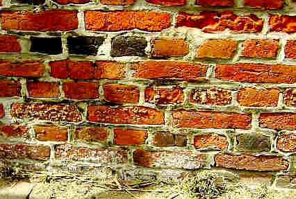 

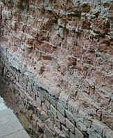 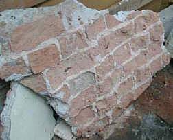 
来自我的建筑咨询 (业主的照片): 盐化墙, 错误的抹灰 - 结果: 
[带有水泥抹灰酸化的](2beton16.md) 彻砖墙外皮由于盐结晶(比如. 硝酸钾-漫延, 盐-"Ausblähung"), 潮气堵塞和霜而阻塞. 
这种暴露在外面的有存贮能力的土壤上的地基砌砖承受着有害的盐-装载. 
那还由于少量的结晶压力的长期受潮, 少量霜的存贮能力和没有潮气孔的抹灰. 
地基的水泥接缝自然也是损坏的. 

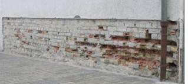 
类似的建筑咨询(业主的照片): 
这里存在的仅仅是部分的盐过量 - 不可接受的, 如果人们相信 "增长的潮湿" - 这种由上至下单一的盐分解和盐负载及完全潮湿的含有害盐质霜产生在砌砖上. 局部受潮的水泥抹灰主要是损害了一些盐含量过高的局部砌砖. 腐烂的和碎裂的砌砖用手刮除. 
怎样处理这种情况? 您尝试着用三个墙干燥处理方法. 这种情况就是向眼睛里滴盐水!_

来自一个非典型的[参考咨询](2sanipuz.md) (25.8.07): 

_受损描述 ... 外屋是不带地下室且只带前墙 ... 从邻近建筑旁扩建. ... 建造年代大概是1890 ...__较早_ _也许是做贮藏室或者 ... 屠宰场用的 ... 在 20 年前 ... 做住宅改建的... 在房里和房边由于于脱落的颜色和灰泥出现了受潮损坏... 盐晶的扩散 ... 没有, 或者_ _仅仅少量_ _黑色的霉菌的. ... 2年前我们就从外面隔离 (供使用的墙). ... 外墙到地基大概 0,60 - 0,80米深的地方被暴露无遗. ... 粗石地基 ... 墙表面 ... 带有大约15cm厚的混凝土外皮是被防水的水泥 "覆盖", 因此抹上一层沥青涂层并安置着排水板. 在底部在房屋边安置排水管_ _,但排水沟并没有被挖开. ... 这种房屋受潮情况2年来都没有所改变,虽然没有更糟糕. 在楼房底层的空气潮湿是相当高的,墙周围是或多或少的有些受潮. 人们可以感觉到 ... 当手掌放在墙上 ... 感到墙面外部是干的, 尽管涂层部分是脱落的. ... 用非标准尺寸测量 ...: 前墙 A: 受潮到70cm的高度! ... 墙体 B und C 平均湿度在大概35 cm 高度 ... 内墙E 和 F: 局部的, 较高的潮度,专门在墙内- 和墙外角 E ... 下面的翻新措施是由我们专业人士提出的: 

- __分别在外墙和内墙的内侧_ _安装水平隔离(例如. 作为用石蜡的注入法...) 
- 选择所有墙内部带有室内_ _气温调解含有_ _钙硅酸盐_ _的 板(...) 
- 垂直前墙的内部密封相对应外部密封 
所涉及的都是比较昴贵的并且毫无用处.外表面的垂直外部密封并不是强制成功的保证，因为没有一个是基于受潮的根本原因基础上而被采取的_ _措 施_ _... 

  

然而还能做什么? ...我认为这种情况必须 ... 给予定期的补水.但从哪里能获得? ...房屋的雨水排水管在地面上是损坏的,以至于屋顶的雨水不能够系统的流走,而是无法控制的到地面渗入. ... 而邻居 ... 在花园的喷泉(地下水位大约 12 m). 水将从喷泉被电动的抽高. 能漏一些, 结果在没察觉时不断的渗入到土壤? ... 是不在使用的烟囱 ...? ... 在地里的水能够通过外部隔离不在向外面渗出, 由此更多是在内墙上升 ... 在墙内部产生强烈的冷凝 ... 墙面水分完全不能蒸发 ..._" 等等.

仅仅是, 所推荐的措施鉴于过去 "上升的潮湿". 三次被取笑! 从何时起有了这事? 或许他们仅仅想要粗劣的掩饰,潮湿是没办法被消除.能有什么意义?由霉菌引起的墙体受潮能被减少? 可是不行!!!

 

## 可怕的"干燥处理问题

这里有我的建筑咨询的一个案例:

_31.5.05 
... 第一次祝贺你的网页建立 ... 可惜我看到的太迟了. 我的灾难己经发生了. ... 我是一个可怜人 ... 目前右边那，我为一个化工的横向锁花了钱并且由于长期熏伤的眼睛而不能在我的房子里住. ..._

_下面述叙这件事:_

__

_4周前我在法国的独立住宅的地下室装了一个横向材料产品XY的XYZ. 这种水平隔离是由外向内安装的._

__

_地下室是由 ...-石材所建的,这种情况自然能够将潮湿理想的吸收, 当然在地下室有一些部分黑的受潮的污点. 在地下室上面的房屋是木质的. 我想保护木结构中一直上升的潮湿, 因此我就理想化的用了这个产品. 而实施公司的代表也表示了相应担心._

__

_现在是, 我自从在墙内用了这个产品(4 周)而眼睛-发炎病痛, 当我逗留在房间时.我必须要提到, 我们6个人中3个见面. 2个人在3天后就诉苦身体不舒服._

__

_试想一下，如果有办法解决我的问题，比如，通过墙填缝等等? 我不会在将这个产品安放在墙里._

__

亲切的问候

__

_N.N."_

首先是安全参数单 - 并非是产品的宣传 - 是要提取出的,这个是在昴贵的硅酸盐/玻璃杯-剂量， 这剂量是骗人的, 但令人恐惧的材料被翻转过来并且受潮的木房里注射 - 自然建筑监理就允许了!:

此外 (注释的摘要): 

_"材料的应用/准备: 工业化的. 修补材料对于: 建筑材料 ._

__

_有害的物质含量: 
R-沉积物B名称 
R10 R52/53 易燃的. 对水生生物有害的, 在水域中有长期伤害影响. 
R38 R41 对皮肤刺激. 对眼睛有严重的伤害. 
R10 R20 R36/37 _ _易燃的_ _. 对呼吸有健康上面的伤害. 对于呼吸系统和眼睛有刺激性. 
R10 R35 _ _易燃的_ _. 由于棘手的化学所引起的。 
R11 R23/24/25 R39/23/24/25 轻微易燃的. 毒气吸入, 摄入和接触_ _到 皮肤_ _. 是毒的: 通过吸气_ _会引起不必避免的伤害_ _的 严重危险，在应用时皮肤的接触._

__

_额外的对于人类和环境危险提示: 
在吸入喷雾剂时出现健康伤害. 产品水解形成甲醇 (CAS-Nr. 67-56-1).__甲醇对于吸气是有毒的_ _,__皮 肤的接触_ _(T, R23/24/25), 在吸气时，_ _皮肤接触时_ _导 致不可逆转的伤害(T, 39/23/24/25)并且_ _轻微易燃的_ _(F, R11)._

_对于医生的指示: 
当接触_ _水时产品分裂出更多的_ _甲醇_ _(同 样在胃-肠-Trakt), 因此考虑到_ _甲醇_ _中毒并且要注意到众所周知的 潜伏期!_

__

_火灾-和爆炸保护的指示: 
产品能够分解_ _甲醇_ _.蒸气能够在封闭的房间在空气中混合的形成, 而他正是导致爆炸的点燃来源, 同样在空的，不干净的容器. 远离着火来源并且没有冒烟. 对于静电充电的产生措施. 带有水有危险的容器冷却._

__

_应必免的条件: 潮湿"_

KF: 这是独创的. 这个声称的受潮蒸汽 仅允许在最干燥的边界条件下进行. 是否应用者也知道? 所有人都是文盲? 但另一方面谈到更好的:

_"需要避免的原材料: 反应是: 水, 碱性材料和_ _氨基酸_ _. 其反应产生了:__甲醇_ _._

__

危险的分解产物 _: 
通过空气湿度，水，碱性物质: _ _甲醇_ _,__乙 醇_ _. 对于硅铜部分中物质有: 测量取得结果,通过少量脱水成分的氧化分解在温度大约 150 °C进行。_

__

_通过动物实验分析得出的具体影响: 
吸气正如一个喷雾剂罐: 在动物实验技术上可行的最高的浓度并没有引起死亡率. 
产品原因: 呼吸困难，协调障碍. 
对于类似产品的类比判断法: 10%的稀释水: 刺激眼睛._

__

_附加毒性的提示: 
严重眼疾的危险. 水解产品: 注意! 产品可以在胃肠和甲醇水解释放. _

_根据文献_ _甲醇_ _(67-56-1)可 能_ 产生 _皮 肤脱脂，粘膜刺激，麻醉昏迷或死亡。通过皮肤吸收是可能.经过一些拖延会伤害心脏，肾脏，肝脏和视神经(眼疾). 
__根据文献乙醇_ _(64-17-5)可能产生刺激粘膜,稍微刺激皮肤, 皮肤脱脂,麻醉, 肝脏损伤._

__

_特征(EU) Xi 刺激 
R-Satz 名称 
R10 _ _易燃的_ _. 
R41 严重眼疾的风险. 
R52/53 对于水有机组织有伤害的, 在水中能够长期产生有损健康的结果._

__

_S-Satz_ _名称_ _ 
S23 蒸气/喷雾器 不能吸入. 
S26 如果接触到眼睛，马上用水冲洗和咨询医生. 
S39 带防护眼镜/面罩. 
S51 只能_ _应用_ _在通风的地方. 
S61 避免释放到周围环境中. 特殊说明书/安全参数单参考."_

KF: 非常好. 建筑保护是毒气和污物? 这肯定不是对墙上的潮气, 是不是? 请不要释放到环境中, 只好尽量释放到那些毫不知情市民的受潮的房屋, 是不是?

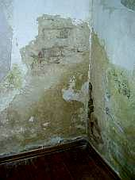根据排水 公司提到的建议就是典型的上升湿度. 应该应用更多昂贵的钻探和注射.答案并非如此, 而在其他的某个方面:

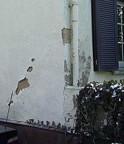长期堵塞 的雨水排水管和那些花园墙冠的水滴总是忙碌着灌溉墙 角落.

---

 

# 潮湿来源

同样人们必须注意那些损坏的作为传统的潮湿设施的雨水排水管: 
 墙角处: & nbsp; 都没有增加湿度, 但很明显限定了并且不是通过什么技术的创新和金钱耗费，而是相当少的钱就解决了! 自己研究的成果.

 并不是用那些隔潮的 [翻 修石膏](2sanipuz.md) 和干燥封闭的 "矿物颜色", 他作为一种真实的塑胶颜色: 称作"[色散-硅酸盐- 颜色](22bausto.md)".他削碎和损伤地基.

经常性的 洪水 - 在地下室下面是从地面作为真正上升的湿度并积聚着丰富的粪便 - 戏剧化的影响湿度效应.什么是在砌砖水平隔离, 而他是被那些勇敢砌砖受潮处理工人无知的赞扬并且被那些昴贵的翻修专家 / 建筑监督者所推荐? 或是这里，更像猪圈?:

 在冬季地下室的寒冷盐化墙提供了湿热的牲畜圈气息最好机会, 最终在砌墙里浓缩.

 这里由于盐含量过剩这新的瓷砖底部破裂 - 大约20 qm -以上. 一个更好的理由, 为了一个昴贵的历史建筑 -一个好的带有工匠专业知识“受潮处理“文化建筑,正如"专业技术公司" 所提供和夸大排水处理所供给? 用砌砖锯 + 翻修石膏能一次性恢复? 但却不是:

不增加湿度, 不是来自外部压榨的湿度 - 这漂移矿产-经典索赔是愚蠢的，通过完全内行的粉浆匠和铺砖工. 拯救我们的细节，尤其是难看的修补. 质量保证并且迅速解决!

建于1939年较好结构的地下室. 应用了干净的高密度灰泥 (成本己经完全没有意义), 这个作为典型的水平隔离还是没有阻挡受潮,还是要掉墙屑.

其原因自然在于应用受限的盐含量. 来源很快被确定. 并与知对应的廉价策略也一并出台.

---

 

# 砌砖墙和增高的湿度

一些在2004文物保护展览会上关于浴室潮湿墙壁的 "排水-剖面" ,莱比锡:

 
注意: 并不是在所有地方, 那些产生了"上升的潮气", 还增加湿度, 虽然那5天都没有沐浴用过的!

 
令人难以置信的是,那些只有少量技巧但朴实的文物保护者,神圣的教堂建筑管理局,精明的建筑管理局, 同样那些风雅的建筑师和对"排水处理"麻木了的业主可以接受.考察这种水平隔离 +修整抹灰的参考.

 
既便是竞争对手没有成功,对于第一层接缝的 5-天-受潮上升进行处理. 
在这种情况下他还可以长久的等待并且每小时一次在墙体进行湿度蒸发的注浇.

在美丽的汉堡水墙和实验的浴墙是一致的，这当然是无稽之谈。如果汉堡市民虚构了 对于 "上涨湿度"研究的"建筑-专家",那里仅仅需要对海浪和潮汐引起的在易北河和阿尔斯特湖里的地基和码头的咸水(由于缺乏抹灰的接缝和阻隔去潮的疏水经常 变脏)漂洗:

++++经典

 

# 砌石-墙和上升的湿度

你相信吗?完全确信吗? 对那些 黑猫，巫婆魔法，天使, 占卜者和天体节目? 对我来说,那是相当有趣的. 早上就有治病功效的石头,神秘的地方,圣水,奇妙的树木, 香精油, 等等. 都无所谓. 但我必须遗憾的给予您一些解答: 

令人难以置信的乌托邦所谓的“湿度上升“ -对此你热情的确信无疑,而这我当然知道! - 在现实中的某个地方能够找到证实. 在看看你的周围, 检查一下墙边, 桥墩和所有长期在水的建筑,是否在某个边缘的水位高于水-标高. 睁开眼睛吧! 

同样在班贝格旧市政厅和桥墩及岸边墙的Regnitz河这种高超的手工艺品同样放弃了"水平隔离", 如果不是这样的话，恐怕班贝克的市长都要被弄湿了脚:

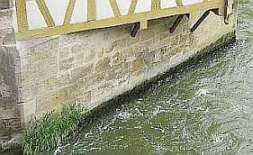 
同样我们更准确看到, 仅仅桥墩及岸边墙是湿的, 由于水的冲洗.

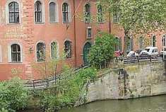. 
同样相对与此. 请注意! - 硅酸盐涂料的损害是对于这个有主教的城市宫殿的天气方面.并没有增加湿度

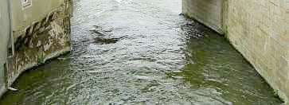.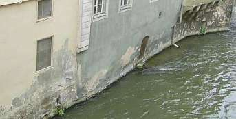盐是惊人的 低水优惠溶液中，然后传达错误的印象重大水分墙。 
然后左岸河下 游有着天主教的奇景: 在市政厅基座的右边是没有上升的湿度 - 但是对面是否有呢? 也没有. 在这里班贝克的农民养着鸡，羊和猪.

我的建议: 看看你自己! 每个桥和岸上砌体告诉您, 它无处不在. 为什么? 阅读更多的科学知识:

---

 

建设 7/98: Konrad Fischer: 

# 附加对历史性砌墙的水平填缝 - 问什么?

(扩大版) 

_" 关于渗透的程度是吸水性，所以建筑材料是孔隙结构._

_由于 水分从粗孔逐渐转向细孔层面渗透（反之亦然） ，这是令人担忧，由于这种因为毛孔相互间隙。"_ 

- 因此亨利施密特，如：高层建筑设计，建筑组成部分和部件和建筑结构, 作为当代建筑的基本原理,第五版 1974, S. 34. 这同样适用于历史性的砌砖墙! 孔隙之间是怎样排列?

通常情况下在基础上的地基和砌体由相当坚固的，同样也是密实的,细孔的石材所建立.需要用粗孔的石灰作为连接, 通常是节省的应用. 这些没有抹灰的部分 "干的"-地基砌墙 和相临无法超越的毛细阻力在细孔石材向粗孔的灰泥的转换看上去有毛细破碎性的效果.在基础上外墙是由含有较小密度的毛孔组织石材或砖作为地基石. 因此建立的旧建筑墙体, 湿度上升符合上述声明的教科书很少或根本没有办法提供.自从19世纪进入专业知识丢失的时代，开始了可疑专家和隔离材料的应用.

此外，在一些细孔石头非值得注意的测试-因此可预见-对于一个毛细孔增多的水柱的运输业绩. 就不一样了, 如果在地基脚下的没有水标记.

即使是“历史性“的对于室内冰雹防护往往是用简单的方法：双粗糙墙壁内填充. 毛细管运输的水在细孔的砌墙过渡到粗孔的石灰，如粗孔的中心填补的完全无法填补.

这些对于毛细孔运输的基本理论目前使用，如放弃附加的水平填缝，而是处于发展的压缩石灰.最后必须对毛细孔结构的证实,这从旧砌墙的盐 量的分解提供了适当的细孔 . 即使通过 [修复灰浆](2sanipuz.md)得 出, 首先是细孔的盐化和最合适的情况下组成粗孔.

在那臭名昭著的基座灰浆的损伤和地下室的受潮, 简单化的 "上升" 湿度分配(也许永远没有对于计算了细毛孔输送建筑结构的细毛孔分析的证据或者是地基-水标)? 在存在湿度来源主要是, 如果湿度从这里得出时. 而这往往不需要任何分析设备转运充分，也往往不是特别干预和应对措施.

**1. 砌砖墙的盐化**

历史和现代的使用提供了关于有害的盐负荷历史性砌体的许多可能性，： 
-如盐或更早传统的充满粪便负载的街道，道路和广场, 

 
_有了这样公共和私人道路及广场的交通条件肯定没有眼睛或墙角是干燥的不过硝石却没有的!_

_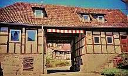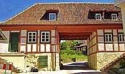_

简 单抹灰及适当的压缩材料 _. 
对于在砌砖墙上的在毛细孔分隔层基础上带有粘土压缩技术门通道淡化盐或硝酸盐的项目样本（技术方案和-监管: 设计院和-工程院Konrad Fischer, 2005) - 但不能保证长期稳定的重新盐负荷进入再次通过冬季散射服务 
_

- 由于筑路或院堤防产生在墙角旁附加的地形高度, 
- 由于在一楼温暖房间的住户或马棚冬季的粪便负载积聚(在1 9世纪乡村医生议定书。示范多达1 5人，青年和小孩), 
- 其他住宅的土地使用马厩和耕地市民的城市，包括工人的定居点, 

 
_房屋的牛棚作为一个对于粪便盐入口的, 这不仅仅是由于模式 / 动物粪便/ 人粪便, 而且也是由于氨基的室内空气，这在室内或室外的墙体浓缩并在那通过石灰硝酸钙结合 - 墙硝石M - 构成._

 
_一个谷仓山坡上-只有在该地区盐负荷的进入有增加墙湿度和抹灰损伤. 
水平隔离能影响当前的潮湿渗出透吗, 还是停止_

- 在回水阀门开始运作前，管道回水情况是水己经到了地下室脚踝那么高， 
- 在战争时期对居民是应用了紧急住房, 在房边旁的教堂或城堡边拴上他们的牲口，以至于牲口不会被敌人屠宰的, 在德国战后45年的事情都不必说了 
- 滥用的住宅，储存室或宗教室作为马厩, ，如在3 0年战争的班贝格大教堂是被占领的，包括那些值得注意的猪，羊，狗，鸡的无害盐粪便, 
- 固化盐水或防腐剂酸菜或鲱鱼桶，以及最后但并非最不重要的 
- 屠宰场使用包括在地下室的洗衣间用于肠清洗.

更现代的有害的盐来源是水泥，道路和矽化材料以及许多粉刷材料, 有的甚至是“对湿度上升“首当其冲. 同样那些控制室内海棉的材料也是盐碱的,这种材料企图抑制他们水补给功能以至于产生了毛孔阻塞.

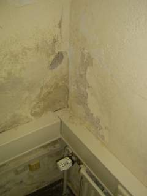 
_电气装置和散热器 与 盐有关的石膏和油漆损坏 。暖气装置的重新加热有利于在夏 天在溶液有害盐的扩散。_

_同样电子石膏 也 可以在适当的湿度下通过水泥漂移反应产生这种情况。 
. _

当盐从墙缝中产生，从而收缩了毛孔并促进毛细管运动. 更重要的是提高了吸收水份. 盐存放在湿度低的水里。盐在非常少量水中溶解，然后误传成极为潮湿的墙.

水平隔离是怎样负担盐化的，吸湿效果的并且具有冷凝负荷的砌墙? 价格较为低廉的，较为经济的，较为有效的甚至于符合文物保护的而是简单的压缩-甚至于无私的抹灰技术，而这些简单抹灰及适当的压缩材料就是最好和最有可能 的对于毛孔有效的.

这可能也适用于在科堡的七个支柱的宫殿教堂，而根据2.12.2006科堡新报社的报告，"金钢石绳剪断柱子"只是昂贵的锯断. 基于“同时上 升湿度...如此强烈的添加到一些支柱，部分大理石和石膏表面以至到画廊剥落. 为了逐步停止这种损害, (从建筑设计角度)决定了,这种毛细孔岩石料,这对于水分增加是负有责任的, 表面上削减. ... 即使是削减一片塑料板"后推". 进程并非没有问题，因为必须考虑到静态的问题，如拱顶或画廊的负载能够被承担." 是的，然后在“大约三年的时间里"，直至建筑枯竭." 幸运的事!,有这样的愿望 ... 是否将刚材用于祈祷室? 而这自然也是之前提到的表面损坏的理由.

---

 

# 2. 冷凝

墙脚埋藏于冰冷的地下. 每天都会产生冷凝,尤其是夏季, 大量空气湿度转为冷凝水.自然这相比较冷冻外墙的室内空气.水平隔离是怎样阻截冷凝水的? 

有效的对策: 
- [墙 体加温](7temper.md) 来对抗冷凝, 同样作为脱水保护, 这样就可以长年保持下去, 
- 单层窗户作为冷凝面(缓解内墙的冷凝,避免霉菌增长), 
- 长期的通风(尤其适用于潮湿的地下室) 
- 带有开放性毛孔的墙涂料和适度湿度的涂料缓冲了高度湿度. 毛细孔阻塞的聚合体如在色散-, 硅树脂- 和"矿物色/分散硅酸盐色" 是不允许存在的。 

# 3. 喷灌

 
_墙体受潮看起来是1838 教堂的某部分, 至少是画家 Heinrich Bürkel的观点._

这个墙脚对于从来自屋顶边缘直接喷灌只有极少的保护. 由废弃的壁炉，漏的排水沟和管道漏水原因，必须对于没有足够压缩的开方进行填充(标准工艺，因为没人看到，那些被填充或覆盖的!), 水分渗入和通过墙体和到地下室- 甚至于砌墙基座. 同样和地接壤的外层抹灰吸收盐和水. 甚至漏的房屋自来水管道（旧的铅管）也是作为巨大的砌墙受潮原因. 而水平隔离对于这些能提供什么帮助?

这里手工业的和文物保护是需要理解的, 为了找到改造-和结构适合的解决方案. 既使是从地面上切断开放式毛孔的水泥-和灰泥 (便宜的修整石膏，这个实际上仅仅作为[防潮石膏](2sanipuz.md) 应用). 熟练地执行，带来持久的解决办法, 尽管所有对于所谓的“文物保护石膏“失败的尝试“。 存在的问题，如在狭窄的屋顶上融雪盐和积水屋顶，集中在防水屋面角的水积聚等等. 自然也是靠边站的.

结尾:

上升的湿度,有文献和有关各方往往声称，通过稳定有效的实验室公式（ 根据Hagen-Poiseulle，绿色，梅耶/韦特曼）对单层客体是可 “预测“的 ，而对于建筑绝不会有这种证明。 毛细管吸收的石加气混凝土在实验室水槽，与地面相壤的砌墙渗透和湿地窖大量或向内或以上减少盐-和水分含量在墙砌体是没有对于在旧房上升的湿度. 

 
_轻拍易碎的易腐烂的内墙值并没有证明，毛细孔上升的湿度来自于潮湿的地下 室!_

在空气和建筑组成部分中的

 
_同样在底层的地板并没有增长的毛细孔式海棉化_

 
_而不是仅仅对于那些燃烧剩下的“住宅海绵絮“在地下室墙上_

 
_即使地下室地面上的房屋海棉被证明，没有来自地板层里上升的湿度_

在空气和建筑组成部分中的

_. 
同样，这里也没有。 （图片：来自咨询案例，图片： R. Gundelach ） 
_

科学实践证明可靠的研究，在相反情况下，盐和冷凝负载相当的影响力W(参考 Kloster Maulbronn, 特殊研究领域年报 315,卡尔斯洛各, 出版社Ernst und Sohn).这种对于水平隔离的注射性材料是在专业领域里有着已经严重“争议". 目前他们不允许注入到那些受潮和盐化的墙体(参考 Venzmer (Hrsg.): 建筑保护工具, 建筑出版社, 柏林 1997)并提供大部分额外的有害盐，在任何情况下产生荒唐的建筑损坏 .

---

 

# 通过水平隔离得到建筑损坏还是干燥?

房屋通过附加的水平隔离导致了墙体干燥，砌墙脱水，地下室墙体脱水等等. 越大的，支付的越为昂贵: 锯切口, 钻孔和带着有疑问化学成份的注射("神奇盒子" 除外). 业主倾其所有，但资金阻碍了有意义的修理. 这种保温的好处只会给参加的使用者，建筑材料制造商和供应商及检查者，出版者和规化者- 带着商业恐惧。并且: 在简单建筑官方的主事无论在国家还是教堂无争议的干燥处理将钱全部托付给他 -还有哪些结果? 继续进行0-策划施工钱是不可相信的-还是?

大家可以自我理解一下性能，或者说"自己动手（DIY）“ 一栋潮湿的建筑没有用处而且翻新成本“昂贵". 一个日常生活中报纸上就能看到的可惜的例子: 像是在07年10月23日报道的上部管道叶片 _"在 农村安装的"_ 如下: 

_"一个大的施工现场相当于现在的小礼堂 ..., 然后翻修工作以最大的速度进行. 因此，教堂建筑协会的成员...重新接管了主导权。 ... 教堂内部装饰的各种各样的工作必须被处理. ... 在所有的潮气上升之前地板有显著的阴影。潮湿的原因是, 教堂房间没有可用的坚固的地基，而是在岩层上仅铺有沙子和一些别的腐烂的上层. ... 通过统一的墩压和熟练的手工艺者可以使全部的地基铲平。... 用来铺新地下结构的砾石（被用在教堂房子中）. ...,__砾石层上应该被铸成板，_ _这 样才能在上面铺上地板.此外教堂中也要挖掘一个小渠, 被用来修建一个排水道, 用来引导水流. 因为（通过）潮湿的地板也会在砌墙的时候损害它。并且它能很坚固的保持它自己的湿度. 当排水管道安装好时，_ _附加 一层额外的涂层来保护_ _教堂的_ _外墙_ _...."_ 

我们这儿能了解到什么: 显然是一个奇妙的教堂地板下面的自流井. 究竟这个上升的潮气的地点是从哪儿来的呢？ 因为信徒冬季求神带来的脚下沾的融雪盐和他长桶靴上污泥中的盐分, 这些盐分从空气中吸收水分并且由于脱干水分盐分结晶，因此地板被损坏， 因为每个夏季冷凝水在没有暖气的房间里闷热，温暖潮湿的夏季空气中放在存在于寒冷的位置- 不可能? 而现在含有几公升水的水泥板/地板其湿度对于既将到来的季节己经无法估量了，而他由房间不停的吸收并且其冷凝问题进一步的恶化 - 不可思议?怎样将这种受潮的并含有害盐的砌墙的潮湿问题排除掉, 如果只有应用了隔离的话，这是否将成为一个无法解决的谜? 一条在粘土里排水渠，在它管通往教堂的开放的水域排水管那提供水和可能阻 塞，在那里 是，是没有安全概率的，同时他就成了施工和设计方案必不可少的一部分. 上帝保护!

这是非常简单的：受潮的墙壁和房间大部分既便不通过附加的防潮设施如横向保温，排水系统，垂直绝缘，防水性油漆和水泥也能在经济上和技 术上很好的维修。 只要具体的对实际中受潮的建筑进行调解.

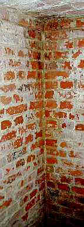_ 
如同这样的_!

回到建筑设计的原理和健康的居民!

---

# 干燥处理把戏-营销技巧?

“ 湿度上升“是那些建筑商错误的建筑需求，外行和专 家/规划者。 相反有针对性的建设维修以这种名义进行，而这仅仅将专家和工匠的钱包填满。这种徒劳的建筑措施仍然是建筑商作为专业化，如“建设干燥 /墙排水 /砌筑排水/地下室排水系统“ （或其他的概念（从初步护理？））体现。

盐的反应产物 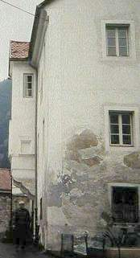 
这是什么? 
是过度潮湿引起的吗?

首先通过之前所展示的方法，当人们是极不认真的观察者，换言之人们没有全面的检查和分析.而干燥处理公司通过大量己经确定的处理方法。 以至于得到的 结果是令人兴奋的，同时盐的化学成份被制出表格,表明是会伤害眼睛的. 在此困境下建筑损伤的侵入(横向保温 / 应用墙锯实现砌墙排水处理,室内钢板作为 "钻孔技术 / 穿孔保温 / ...")附带破坏性措施 ([灰浆](2sanipuz.md), 防水和 [防 水防干燥的"透气的" 涂料](22bausto.md) 外)开发并且蒙蔽了忠实的顾客. 因为它声称，比如"采用代理XY-横向锁，优点在于（盐碱化是一定的）抹灰与相应的专业清理" - 并且除了会让墙体穿孔可怕的注射性化学材料外在很多面积应用了昂贵的 "化学-灰浆". 以至于顾客在无不知情的条件下应用着这种过于狡猾的方法.

当然，许多修整正在进行，其“提供消除潮湿引起的损害“ / “提供：XY-系统-砌墙排水/砌墙干燥“ / “提供的地下室干燥“ / “提供砌墙修复-XY-系统“只是或多或少的资料是来自于那些信口开河和“参考资料 “，甚至退款保证. 这种很微妙的受潮之前和受潮之后的“证明“，如果最初的湿度在空气和建筑组成部分中在夏季进行测量，而在干燥的 冬季系统化的，尤 其是1月。非常不错的伎俩，而这，您几乎总是遇到：戏剧化的损害表面的报价，然后对那些没有抵抗力的，老实的和毫无戒心的业主通过不错的哄骗签定了合同（ “表面上是必要的“ ）并且“排不费用“永无止境的增加.

---

 

# 渗电和典型的受潮处理-失败的借口

各种不必要的施工方法是如所谓密封系统/排水系统为了砌墙脱水/砌墙排水而应用。而朴实的业主，却被那些毫不知情的房管或建设局非常糟 糕的管理着。是的！在建筑文物保护+建筑翻修手册7 / 01由化学硕士A. Detmann,Prof. Dr. rer. nat. habil. H. Venzmer, 物理硕士. C.-M. Moewe 和特理硕士 O. Bakhramov,所有Dahlberg-研究所 Wismar， _"_ 湿度保护， _技术关键问题，这种渗电的排水方法可行吗？ “经过相关的研究，第57页销售方法_ _的结_ _论 & rdquo;这种渗电的排水处理方法，需在极少的紧张和大型电极间隔工作，但没有得到所需的结果。在一系列的测试已成为明确指出，这种方法（电反渗透）没 有获得通过建筑型的毛细孔系统有所谓的排水。美丽的笨蛋，己经中断了这种方法，而还有那些低能的，在将来才会中断。_

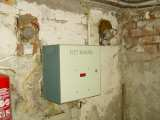 
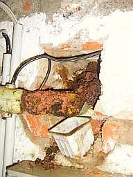 . 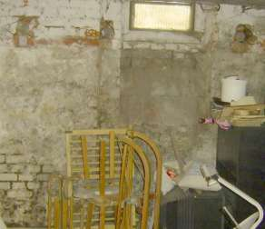 .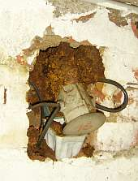 
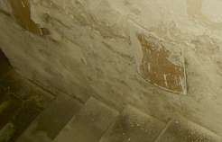 
_来自我的处方 
用于徒劳无益的砌墙排水和盐碱淡化的一个最惊奇的工程方法。 
几年后对 于那公开的和隐蔽的电渗使 用： 
在地面，墙壁和天花板上盐和湿度是没有结止，残酷的漏洞，腐烂的牺牲品，一直的能源耗用。 在这些地方，电 渗透基本是不允许 - 砌墙“上升的湿 度“，因为在这些网页有足够的证据。 
由此可见： 为了钱包业主如此积极安排所有对于排水有关的方法！ _ 

这当然也适用于那些需要通过外部任务，保温，封闭，绝缘和室内[抹灰](2sanipuz.md)的 许多用户，尽管它仅仅为了处理地下室砌墙的冷凝和盐淡化。 人们不会把钱扔掉。 噢，只是通过对钱包-进行排水而让荷包变的干瘪，而这样却节省了税钱！ 这是私人的赠送！但每个人却以为在打造他的幸福。

: 
**Die bekanntesten Ausreden der Trockenlegungs-Scharlatane** 
(nach Edmund Bromm, leicht ergänzt)_ 
_

_如果它再次没有奏效： 
__排水是_ _最有名的借口，骗子 
（如_ Emund Bromm _，简单地解释） 

“他们有水！ 
他们换气错了！ 
管道漏油！ 
把水从下面打出来！ 
底板一定有个裂缝！ 
水是滞水！ 
石膏已损坏！ 
石膏太多盐！ 
在砌体有太多的盐！ 
有了霜水，因为房间不正确的使用！ 
有水自除霜夏天潮湿的空气进房间来！ 
加热器有缺陷！ 
您的干燥器排掉太潮湿的空气！ 
溢流没有了！ 
地下水增加了！ 
通过壁炉水出现了，因为没有保护层！ 
房屋_ _的设置_ _导致了裂痕！ 
该设备只能应用30-50年！ 
您那边太高的湿度，因此不能快速地显示效果！ 
等等“_

---

 

# 排水专家? - 
设计者和检验者

对于建筑围绕“排水“的专家，砌墙盐淡化和湿度翻修在技术上是不可靠的。 为了贿赂精明的翻修需求他们是最大的受害者。就像用领带围住业主，相信己经证实了这一点！ 
归根结底，锯，钻，保温，填缝 ，粘合，粉刷，加热和渗出这类事情，都是垃圾并且能让业主的钱包产生最大的漏洞，同样那些消耗金钱的毫无能力的文物保护。只有一个不被这样处理：问题的根 源被隐藏而和盐及湿度的墙永久减少或消除。 尤其危险的是那些专家，他们专业的表达湿度负载和建筑排不处理的意见，并且表示这样的话建筑就像从未出现过“上升的 “湿度。谁是 专家的责任水分胁迫和排水结构，而这仅作为几个可能性中的一种。因此，容易产生不采取真正有效措施愚蠢。 
. 
一个严肃的检验员面对受潮的墙壁说： “在砌墙体系中上升湿度由于技术上的原因不能提供，（例外得出规则，因为有害盐的负载并且渗透的建筑组成部分-无论是砖混或灰浆-随 着浓度均 衡活跃的盐吸湿的向上运输，从而盐前提下横向渗透增加-对此没有附加的横向保温却更有益处;极为罕见，但并非完全没可能的，砌墙与石材和灰浆中的孔隙半径 是相近的-这是一种情况有关横向保温，例如，当湿度来源非常明确指出为在该地区的地下水。） ，让我们找到产生湿度的原因，我们在那里找出（压缩地基的水负载，在吸湿受潮的砌墙中的有害的盐负载，冰冷建筑组成部分中暖空气形成冷凝）然后找出有目地 性适当的对策，应用最少的调研和施工费用。表格厚度和昂贵的湿度及盐分有害的研究并不需要，但这对于大部分人们健康的保护是有意义。 “ 

但是，这是非常罕见的 

---

 

# 排水处理 - 
工业咨询或者常识? 存在的问题及对策

共同的常识是很少见的. 所以并不感到惊讶，几年之后，化学武器袭击事件也是完全消失了:

 _ 
中世纪砖窖建设结束时，建筑化学-“排水“通过横向保温， 隔离灰浆应用 ，带有“ 翻修建筑材料 “外部填缝和表面翻修。 黑暗的领域强调的盐污染和冷凝程度的潮湿浓度在土壤和墙体是作为反应的“石子“注射解决办法 ， “隔离性灰浆“ ， “ 专门的淤泥“ ， “墙体盐隔离“等引起建筑化学产品。 
根据化学分析：漂移矿产，石膏，碳酸钠，天然碱... 
另外的空间外壳的其他面积（地面，墙壁和拱形的地区）和中心柱是极其受盐污染的和易碎的。 

_ 
 _从注射领域，并且在这之基础上增长厘米 长的填料盐。 砖窖表 面易碎，灰尘，脱皮和破 碎。 

建筑表面完全破损。 

这有化学处方再次完成整个工作。 

_ 
 _走廊墙柱溶解到它的组成部分。 

盐隔离右边的立方分米己经打破。 

_ 
 _地面下的“横向保 温“生长出强大的令人讨厌的盐山。 

像这个墙上的一部分都脱落。 

_ 

“翻修“所相关的=己经发生了一段时间了 。 该公司在外面是很细致的，没有看见建筑师。持续了一段时间，在米厚的砖石，这个被外面用化学剂量（隔离性砂浆，厚涂层， ... ）玻璃技术的“保温的“ ，与室内的浓缩的湿气是隔离的。 并且我们建筑化学中带有翻修材料的盐反应产物（我将尽我举的招标文件，该公司的“ 翻修咨询 “以及存放照片上那损坏的，中世纪的墙面）从墙上滋长。 

 
_另一个排水-测量装置在2004 年莱比锡文物保护展览会： 
在建筑翻修中可 能没有比受潮墙体更容易得到收入来源的了。 
这些有着过人专业智慧的设计者，文物保护者和业者有着这样的想法._

正确的技术措施如下： 

1 通过[温 度保护膜](7temper.md)提高那些有冷凝风险的建筑组成部分的温度。 

2 干洗对于在建筑上己经存在的，扩散的盐，湿度驱逐仍然存在的盐，脱水， ... 

3 之前还可能存在的有害盐的结晶类现有的墙转移到表面上不含水泥的，无伤害的以至于少量盐的灰泥，包括如果有需要的话灰浆更新。 
决不要用含矿物质的水泥砂浆，他是对含有大量新的盐负载负有责任的。而这种 "[翻 新石膏"](http://66.102.9.104/translate_c?hl=en&sl=de&tl=zh-CN&u=2sanipuz.htm&usg=ALkJrhhESvNewDHjiEsjzsBxlZKZd15ETA)“也是矿物质的水泥，有着石灰般的强度性，有着较高的热延伸性和疏水限定性的干燥和盐积聚。 

4 适用的放弃在外部用厚泥的垂直填缝。 它在许多情况下是没用的。 但要在介于地基过渡到仓库之间的旧砌墙基座填缝-参照DIN。希望愉快！对于烘干时和基础预抹灰时间是非常重要的。 

选择：例如，修理可能由于无密封管道和分类的排水转移的地表水渗入。用陶土“填缝“是必要的。物美价廉的，百年 保质的，长年密实 的，用剩下的材料可以将建筑的石灰面保持的很好并且可以透气。 垃圾处理会引起毒水。 “棕色的水“带是膨润土-涂料在柏林的地下水室里在潮湿的土壤里受到了最安全的保护，甚至服务于基坑中的水管系 统！ 在密封带中膨润土也会使白色水槽的填缝变得密实。 

重要提示：正确的评估和粘土选择的。 必须在最低限度渗透因素 kf 10-10 内密封。而陶土材料是不允许过量潮湿的。正确密封和适合的施工技术在设计基坡时必须能够防止水流返回建筑，如果没有夹层-填缝和基坑的受潮，可以在基坑边 缘和密封层之间填加足够的填充材料。 否则，就会流回房屋。技术上和经济上吸引人的（无干缩开裂 sandgemagerter的配方，良好不规则表面的模制，有时只有约20厘米，对于相关均衡的底层没有任何有关筹备工作，仅通过钝开方简单重复的纵向 和横向施工阶段） 这种填填缝也可使用特殊的混合对矿物质分解，，膨润土，膨润土-垫子而获得。 

然而：如果违反的加工条件，并且“不干净的“液体基坑泥抽上来，而不更换土地，那么在种植粘性土上的基坑也不能 正确的密封，并且 建筑的密封也不会充分的完成，管道和地下室竖井应用了易碎的材料，而通过机械压力密封土地是有危险的，这个弱点不能通过适当的方式对适合的结构-和道路构 成进行保护，或者那些开放式的基坑在施工过程中不能防雨，也许在旧传统中密封基础管道是落空了（都经历过了！），表面如同陶土密封一样不能立刻有反映的。 这不是灵丹妙药，并不能自动通过任何一个墙工匠或修理工就获得成功。 密封仍然是一门专业工作并需要工作经验，智慧和建议，而它本身也仅仅是“陶土“。 

5 没有注射性盐分解的化学剂量（该如何进入那充满盐的毛孔组织，所以，有了新型的方法，确切的说，蒸发方法！对于不存在上升湿度是特别昂贵的，所以很乐意购 买因此决不会对在砌墙内湿性的老化盐负载有任何影响），在其他环境下没有额外的水平阻塞。 

6 化学白痴就像一个没有经验的廉价规划者没人会相信。 他仅是带着漂亮领带并且最低限制上能带来带来圣诞包裹。

---

 

# 砌墙排水- 
经典的错误 

在市场措施中对于墙体受潮的经典的错误： （计算并不详尽！ ） ： 

1 湿度来源是无法正确评估-由于缺乏线索，缺少初步调查（注意：并不是总要由专业检查员在实验室中获得，但可以保证，没有完全正确的建筑问题分析，更谈不上 治理建议！ ） ，感对由于兴趣而实施的一些方法。 

2 为了排水而进行的有针对性的措施，违反现有的湿度分散和来源，如：在潮湿的砌墙的吸湿的盐化和/或者冷凝，通过那些愚蠢的方法如垂直和/或横向保温的，没 有起到任何帮助。 因此就有了诈骗性的趣味，因为那种超级昂贵的愚蠢方法，越是愚蠢，越是昂贵，如同，翻修灰浆相结合，从而强硬的失败尽可能长时间掩盖。& nbsp;应该如 何用种方法能将建筑中的大部分抽干，我投了一份沥青片到水中，-然后也许这就是脱水？ 

3 有效的措施被删除掉，因为湿度状况被错误的分析。 常常很容易做到，但却没带来收益。 

4 尤其-顾问或公司或是他所依赖的设计者，没有诚信的强调情况始终只是“唯一的“方法，通常是一个组合由带有干燥 作用的翻修灰浆或者“电子化的“的横向保温

没有任何作用除了很快损坏掉的牺牲品，毫无意义的在砌墙里牵引和打孔并且引起能量消耗。一个排水，一个淡化盐，一个& ldquo;翻修 “为了“保暖“却不能完成。当带着长串名简的方法就是为了愚弄顾客-是的-大部分都来自建 设局和教堂建筑部门，您亲 自检查一下吧！-化丽的地址在作广告。 

5 该“措施“本身是损害健康（如一些注射性化学剂量 ） ，首先湿度通过流体注射和 [烘干封锁-翻修 水泥](2sanipuz.md) 以及其他阻隔作用的方法，继续在那己经受潮的砌墙进一步潮湿下去。

---

 

# 受潮墙体翻修- 什么是科学?

**增编来源： 

**1 达尔伯格（Dahlberg)研究所是为了诊断和修复具有历史价值的建筑物，研究协会中心汉莎同盟维斯城市（WISMAR），收集了汉莎同盟的翻修日第9 次会议记录 “ 灰浆修维护“，屈隆斯博恩（Kühlungsborn)1998年，由建筑出版社1998年在柏林发行： “目前，有批评意见对于“上升的湿度“。 [...]这是相当正确地指出，尤其历史性的建筑在从空气中吸收水分打击的背景下建设远远大于来自建筑基层。 因为相当高的浓度可溶性的盐是起到了控制性的角度。 

_这个问题是如此的重要，因此他们必须作进一步的讨论，为了能够简单，采用各种方法为了排水比如附加装备安装的横向建筑防水不被高估。 “ 

（ Venzmer ， Lesnych ， Kots ：模式尝试对翻修灰浆的砖块进行干燥处理） 

2 研究_[Fraunhofer-Institut für Bauphysik IBP Institutsteil Holzkirchen](http://www.hoki.ibp.fhg.de/) _， 收集到_ ：Elke Nürmberger: "_： “建筑研究， 实验室在一片广阔的天空下，_ Das Fraunhofer-Institut für Bauphysik IBP 包含 _在Holzkirchen世界上最大自由机构， “ Arconis 1 / 99 ： 

“上升湿度： 这诊断往往是不正确的，因为_ _不同的物质的_ _转移抗性，如 砖混，是非常高的。砖混烟囱的高度大约20厘米，而砌石的可以略高些。 “ 
_ 
3. Helmut Künzel: "建筑物理学 - 来历第17个, 返潮: 巨大的问号!" 在: ARCONIS 4/02: 

_"__[...]_ 已经 _从_ 几十年前到最近不同样式的试验样本在不同的砖墙被实施，这在浴缸中被安置，湿度上升吸收的数量。发现，始终只有一个穿 透两至三个石砖厚度。这并不适合实际的经验， 渗透约一到两个楼层。 [...]解释：砌砖对石头和水泥的吸水率将由通过石头和水泥之间或者确切地说是水泥和紧接着的势头的过渡阻力的标准决定。这个概念，一个良好排水砖和良好的排水石灰水泥 同样也是好的吸水性，因此，必须予以纠正。该石灰水泥是直接与水接触是非常的吸水，从潮湿的砖中吸水又因为过渡阻力而小得多。它由一个层到另一个继续。 _[...]_

结论：返潮在实践中并不如通常诊断 和过去针对它的补救措施那样出现。实际上的原因是在实际中发生的潮湿减少主要是由于在砌体（墙面硝石）的浓缩盐并且通过夏季冷凝返回。 [...]这是一个额外的阻隔层（在地基中）真的不是不可缺少的。 _[...]_

此前，那种与老建筑相关的壁画作品的水分损失的事实，它只是 对1900年以来的习惯，横向隔离下面砌体的方式增加，因此，“返潮“在以后的建筑物不再发生。同样，随着时间 的变化，人们同时也能实现环境卫生的改善。 [...]它需要只是一个建筑技术公认的，对盐化带来的问题及其吸湿性并不不熟悉，横向隔离被提出来并被学术界接手。这种判断错误可能持续很长时间，像这 样我们从经验知道“呼吸墙“这个词。

这 是这形势下估量的，从婴儿 护理得到的概念得到“干燥的地方“这个建筑物理词汇。这些案件中所描述的必要的修复措施没有任何共同之处。 _"_

_以及_

**_"IBP-信息 337, 25 (1998) 新的科研成果, 简介_**

**_H. Künzel_** 
_旧建筑物的 损害原因：返潮，盐化吸湿或屋顶渗水?_

_[...]**返潮**_

_返潮将和预防措施如排水道，水平封锁或者 注入等作为非常频繁的损害因素一起被讨论, 这些也经常在实际中发生. 水中建筑或者码头墙, 发生直接的渗水, 是最高到第二或者第三的石位置潮湿的. 这相当于在过去的各种机构已获得的测量值[图像链接] 。虽然砂浆盘或石膏连续升到创纪录的水平，这是砖墙非常低矮和砖混结束约20厘米。原因是，不同的材料之间，如砖头和水泥存在较大的过渡阻力。因此，对砖 混墙来说，潮湿上升高度预计约20厘米，这在有较大砂浆份额的粗石墙中可能更高。_

**_吸湿的潮湿(墙面硝石)_**

_在一些较明显的墙面透湿大概在分米 级的范围-往往在地面层上结束-通常是吸湿盐[从墙上高处的粪便]的原因。盐度越高，就剩下越多的水分含量，在外强抹面或着说砖面就从空气侧吸湿。 [...]由于大约19， 20世纪之交城市和乡村卫生的改善，采用横向锁方式的建筑物的衰弱，人们那种错误的在前面提到的墙面防潮 情形也有明显下降。 [...]"_

---

对于便宜价格更容易 

# 墙面潮湿从何而来? 看看历史和科学的根源

4. 巴伐利亚的出版物. 建筑保护和规划, 硅胶方面, 瓦克化学，巴伐利亚规划科室, 慕尼黑, 根据阅读中: 赫穆.韦伯: "在处于困难条件下的长期使用中的坍塌预防, 翻修保护系统 " 建筑原料 4月 1999: 

_" 在最近十年中人们一直不停的尝试，潮湿条件下的墙面和_ _石膏的_ _损 坏通过额外的_ 填塞方法 _在水平和竖直方向加固来消除。_

_然而人们一直必须不停的加固，因为这个是_ 只有条件的可能性，那么- 就像今天人们熟知的那样- 就是很多可以看见的潮湿的-和盐化的墙面的损害 _，就在在最初的盐化返潮的那条线上。这些盐分在水中又可以溶 解，在墙面蔓延并且最终集中到一块儿, 他们顺着石膏的或者墙面中的机械性的损伤蔓延，其机械损伤是通过盐分表面的结晶作用-和水和作 用共同作用的结果并且含水量的升高是通过吸湿效果完成。_

_通过_ _墙面_ _持久地_ _吸 湿的水分吸收，_ _会对家人的精神产生不利的影响。"_

5. 建筑保护(B)和建筑改造(B) B+B 5/2005: Dr. Dirk Hoffmann, BAM - 联邦材料检验部门, 柏林: "怎样才有效? 处理墙面潮湿的额外处理措施-在实践和实验室中流程及其效果

... (在各种各样毛孔吸水流程的各种各样矛盾的效果之后，作为一系列在实验室和一家公司场地中一系列测试的结果，该结果采用陌生的组合。

_墙体在经过化学流程处理之后能在水中持续两年并且在实验开始的时刻能承受43.3kg的水._ 在 水平面第三砖的位置以上 _（=第四砖下面）是每隔8个洞装入。 ..._

__

_这个被_ _灌了_ _一个_ _未 知成分_ _来化学溶解。那么它自己在半年之内没有质量减少, 反而有1.4kg的增长, 随之后来引入新的小孔一个第二钉入第四和第五水平面上方砖形式。_

__

_在又半年之后这里质量也有超过5kg的增加。 在转的表面上和勾缝处抹着巨大数量的扩散. 于是尝试被中断"_

(最开始采用一个注入方式减少水负载. 但这还是不能经住剩下的...)

到 结束:

那样翻修代理人确切地说他的 "说明书" 去灌注和填料，[粉刷石膏](2sanipuz.md)也 能非常不错作为 "侧保护面"或者作为唯一的充分的措施方案/示范, 我建议也批判的对待这个神奇武器, 比如，通过型压得到石膏壁画.

参考:

从历史根源上看，Otto Krätz在SZ的一个周末（11.10.01）写就的著作(S. I)中提到建筑中的盐化问题: 

_"1847年工艺人员_ _F. Knapp彻底的描述了_ _在 当时正确的大量文生条件下的各地已经出现的硝酸盐成分._

_"在很多人口的狭窄的街道上有很多牲畜的排泄物, 屠宰后的垃圾, 家庭用的废水, 集市上的废弃物-那儿人们出售肉，家禽，鱼其他的食品, 也就是这儿大量这样的东西以及液态的东西在污水沟混合并且不断的腐烂，人们看到,作为抹灰砂浆在脚下的外墙逐渐被削弱并且被覆盖上了雪花状的，白色的，结 晶状的结晶和被叫做“ 硝酸猪肉硝酸库 “ 

自从18世纪以来巴伐利亚的军队就利用这种特别的院墙周围的墙面硝石并且大多数并不存在农家地下室. 从士兵保护硝酸委员会的代表在黎明的时候攻击毫无防备的农家， 从外面撕裂地板，刮掉硝酸. 这些农民 [...]通过教堂的支持放置, 因为至少客厅的每个部分, 用作宗教的虔诚, 依然宽恕. 通过来自主视角的说明和丰富的介绍，可以给硝酸委员会的人展示家庭祭坛和神圣的形象. 这种精明的风格建立了持续不断的声誉，直至今天仍被巴伐利亚人深深信仰." 

那么应该能看到，士兵是怎样的兴高采烈: 
_

  _. 
_

_人们一直关注, 零星的盐表面的原理怎样反映表面的潮湿上升问题_

---

非常感谢您的光临. 现在是不是您都清楚了。还是还没有?[ 问题/咨询](english.md#consultation)?
