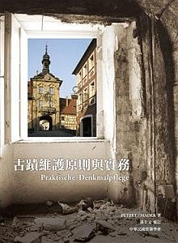

[🠔 Zur Übersicht: Asia & Middle East](asia.md)  
# 修 复老房子的历史丰碑+养护
**免费房屋解决方案信息：最便宜的价格修缮老房子、 文物修复，艺术品保存，保暖节能，提高房屋能源利用效率。**  
_von Konrad Fischer_

房屋面临着闻所未闻的问题：您是否大胆设想过翻新您的老房子，修复它？恢复它的原貌？重建它？ 使它现代化？你花费了太多的金钱，失去希望了吗？ 

 你的老房子保暖吗?你的家 是密不透风的吗? 墙壁的屋顶长满了真菌和霉菌? 房间充满了各种有毒气味：杀虫剂、杀菌剂、杀藻 剂、农药、合成柔软剂、溶剂及防火剂？天花板在滴水吗？你的孩子患上皮肤病，各种皮炎 ，皮肤敏感，感到浑身皮肤瘙痒，或者有气喘、咳嗽? 你的眼睛开始流泪并觉得干裂的疼痛？

你经常在你得周围或者互联网论坛上看到现那些听起来很棒的专家，商人，工匠，工程师。 你可以得到最好的建议和最便宜的价格来翻修你珍贵的老房子，选用优质的古木，石头，混泥土及最好的材料翻新，可以抵挡住暴风骤雨却不用改变旧建筑的风格。你的建筑师和他的工作朋友已经开始用你的钱进行规划，并使用朋友们提供的建筑材料。 对他来说这都是免费的，对你来说就太昂贵了，并且这样的“解决方案“既不便宜，又不符合你的预算。这不是少见的事，然而，你并不知道这些。你现在开始想如何让你的房子实现最高价值？恭喜你！也许我会让你的工作会做得更好，更健康并且价格便宜更多，你知道怎样做吗？

欢迎您并感谢您的访问！我们已经恭候多时，现在你才来到这个网站还为时未晚。在这里你会发现免费房屋解决方案信息。主题:最便宜的价格修缮老房子、 文物修复，艺术品保存，保暖节能，提高房屋能源利用效率。信息内容大多为德语资讯，有些页面是其他语言文字(英文、俄文、意大利文，丹麦语，瑞典语: [等等)。 ](index.md) 如果您发现这也文字有错误，请您帮助我改进完善。以便帮助其他访问者。谢谢！ [(这里 可参考英文版对比)](english2.md)

为什么会有你的母语文字呢? 因为在你的家乡也会有很多老房子,古老的建筑物及历史古迹, 这些建筑的屋顶啊，墙壁啊都必须进行修缮了。我们会有共同的技术问题或者经济问题，当然，也包括错误问题。不管是历史建筑还是文物古迹面临着同样需要修葺的问题,你希望恢复他们的价值, 或者把它们修缮得更好么? 这不是魔法, 国际建筑业和你的专家都日夜不眠的思考解决方法。 你想看更多的案例吗? 请点击下面的图片 查看详情： 

 (1) +  (2) +  (3) +  (4) +  (5) +  (6a) +  (6b) +  (7)+  (8)+  (9) +  (10) +  (11) +  (12) +  (13) +  (14) + (15)+  (16)+ (17) 

**图片说明** ： (1), (2), (3), (4)： [由于强化硅酸钾和钾硅酸盐涂料损坏的地面和表面](22bausto.md); (5) [浴室里的黑色霉菌- 想一下受污染的空气和空气质量](7schim.md); (6a) [受潮变形的砖面 (Deutsch)](2aufstfe.md); (6b) [生成硝酸钾及其钙镁硝酸盐的墙壁](chaoshi.md); (7) [外墙上的苔藓 ](213baust.md)： 图片： B+B [《楼宇的维修和保养志》建筑杂志，2002年1月，摄影：维斯马大学](http://www.bautenschutz-bausanierung.de/); (8) [花园里受潮外墙](7wsvoant.md), 图片： "建设技术与修复 2/01",摄影： H. Paetzold (人名); (9) [建筑内外滋生的霉菌](7poly.md); (10) [被烧过的墙壁](6brand.md),来自： "最新的灾难照片", 巴伐利亚慕尼黑发生的火灾; (11) [冻坏的水泥和砖缝](29bau09.md); (12) [水泥及天然石材](29bausto.md); (13) [墙壁上的石灰](29bau02.md); (14) [原材料覆盖的合成树脂涂料](22bau2.md); (15) [裂口的合成树脂涂料](23bau08.md); (16) [合成树脂涂料的栅栏](23bau08.md); (17)[最新技术安装的门窗。 ](23bausto.md) 

对这些鲜为人知的信息有异议吗？然而，这些信息是符合传统技术的。建立在多年的修复工作实践经验上的：比如历史古迹，古建筑，农舍到城堡， 庄园，别墅，教会建筑如教堂和修道院等修复工作。我的父亲作为建筑师，从1958年一直到他过世前1979年一直做这样的建筑修护工作，我最初从他那里学习到很多的经验，在学业结束后，我作为科学自愿者在慕尼黑文物保护局工作两年。 

Konrad Fischer: Fassaden energetisch richtig sanieren 
 
Konrad Fischer: CO2 und Öko-Bau-Interview 
 Konrad Fischer: Kalk am Baudenkmal - Scheitern und Gelingen 
 

最好的业内专家，那些著名，值得信赖的工程师，总是穿着黑色西装的建筑师，以及你附近的朋友们通常还会有另外一种看法。也许他们会给你更好的建议，但你必须自己决定，我的信息是否对你有意义有帮助。不过，你也能从专家这取得成功。（仅仅因为是专家？）

你 可以在这里找到： 也许你在这里没找到你要的答案，你可以这样：这里有超过1500个页面主题和更多的德语主题：恢复，保护，保养，技术和历史分析；建筑材料：砖，石灰，砂 浆，石膏，砖，半木框架，水泥，合成树脂涂料和硅酸钾涂料，沙石和被腐蚀的天然石材，房屋修缮和恢复屋顶及其他部分的问题，花销和预算，[房屋规划和修复中的骗局和黑幕。 ](4behoerd.md) 
最后，但并非不重要的冒险：气候变化- 什么是真实的？你可以在这里找到方法：

**- 您想购买德国城堡或宫殿?你想知道售价**? [ 例如： 待售的故宫/城堡/庄园/楼房。 ](8schloss.md)

- **[(从地面进入墙垣的) 上升潮气。](chaoshi.md)** 在这里你可以看到，哪些是对混泥土，砖砌体，砖缝，地下室，基底及石灰表层错误的防潮方法。如昂贵的砖石干燥法，硝酸钾处理法，混泥土结构化学灌浆法或钢 结构化学灌浆法，合成树脂乳液砂壁状密封涂料，还有非常可笑的通过通过电渗透进行的电脱水法，这些无用，带有破坏性的方法不仅能在德语中看到大量的案例， 而且还有英文介绍 ： 🇬🇧 [Rising damp does not exist 不增加的潮气湿度](2auffen.md)

[   砖石建筑和砖缝中没有毛细管上升作用和潮气。 ](chaoshi.md) 这不是在实验室，或者水中的建筑，也不是港口的砖房子。但为什么会这样呢？因为毛细管是可以把物质从从小孔隙（如砖和天然石材）运输到大空隙中。并且毛细 管是在重力10-20cm以上的石头和混凝土中完成运输。雨水和潮水只是弄湿墙壁！对古今德国都是如此，也应该对你美丽而神秘的国家也是如此。如果你不相 信这些的话，你可以在浴室里做个试验。

一方面是穿着考究配着豪华的轿车，另一方面是给你忠告的网页，不管你相信谁，真正的工作才是最重要的！

- **[霉菌和黑菌](meijun.md)** 室内霉菌产生的原因由于现代建筑采用错误保暖方法的结果，室内的密封性和采暖通风问题。所以，请不要乱放食物，注意空气流通。 

- **[气 候变化/气候保护--全球变暖和冷却：](7thuene1.md)**  （图1）德国Hohenpeißenberg 的气温变化（1781年-1990年）图表 （图2） 英国哈德利中心推出的全球气候变化表，对全球气候变暖对植物和人类的危害和影响的担忧预测。 

[瑞典友人Fred Goldberg:全球气候,不会因二氧化碳的排放而变暖 ](http://bbs.local.163.com/bbs/guoji/158879713.html)

- **[- 保温中的欺骗。](213baust.md)** 错误的节能，生态规律的破坏和违规操作都会使你对你的房屋和家人或者你的房客造成破坏。用工业原料和生态材料来进行错误的保温：你花钱买来的昂贵的泡沫包装，纤维，人造石，带空的陶瓷制品，羊毛，棉，麻，纤维素，可回收报纸，海草…等等。 虽然这些材料吸收水分很快，但是他们也非常容易滋生出各种菌类，有毒的细菌，黑菌，蜘蛛，蟑螂，蛀虫/银鱼，甲虫，蚂蚁，老鼠，黄鼠狼，啄木鸟。也可能导致气喘，头痛，皮炎和癌症。 
 藻 类菌的表面有外墙保温预系统。 

---

 

---

小 心房屋改动的危险！德国的垃圾科学！今天还存在的弊病。现代科学也可以是很不诚实的。 

 
图 表： 不同结构的墙壁保温消耗热量分析。R-毫无意义的价值和功效/ K值（热传导） 。弗劳恩霍夫于1983年研究结果。 X轴： k值结构的隔离墙。 y轴：瓦特 热能消耗的测量时间。 紫色与红色： 用23和10公分的聚苯乙烯保温。 绿色： 只有用砖来保温。 

 
原 文： _"热成像显示巨大的能量损失证明。当室外测量温度为10oC，同样的风力下，坚固的房间内的温度仍是未知数，砌体中门窗是造成热量损耗主要原因。"_ 出自丹麦报纸《建筑技术》，2004年10月25日，记者米歇尔。 

尽管这只是国际化学工业和能源制造商的广告，但是绝缘材料的浪费是错误的。生产商是和财政和某些工程师，建筑师，工匠，科学家，官员，政客或媒体联系在一起的。他们只想出售盖好的房屋和保温系统给你，来填满他们的钱包，争取利益最大化。

图片显示在12点钟的时候，墙壁表面的辐射热量。这只是来自太阳的热量。在南边的墙上吸收的热能和红光比较多，在西边的墙吸收只有一点点蓝色和绿色的辐射。 更多提示!

- **[房间采暖系统。](7temper.md)** - 合理的采暖系统和风险。空气采暖还是墙壁采暖? 
 房间里灰尘飞扬是密不透风？沙尘暴空气刮来的热度？对流热还是辐射热？或多或少的能源消耗？由错误的取暖而导致的每年冬季诱发儿童哮喘和流感疾病？冰凉的墙壁上结满了凝结水和各种霉菌真菌- 或是房间里表面热辐射微弱？只需要一点节能供暖技术，就可达到保持房间一直干燥，健康，冷静, 拥有纯净的室内空气的结果。 
。 
 红外辐射供暖 

室内空气比室内表面的空气要凉一些，不是针对那些封闭型不好的房间，也不是有问题的取暖建材，不是有冷凝结表面，而是在正常的情况下，室内空气要比表面的温度低。

关于地板供暖管道，墙里的石灰后面，地热供暖的问题，我们有其他得更好解决方案。举其中一个例子, 经济实用的热辐射取暖系统。 ：  [Veitshoechheim Palace 伐兹显市 宫殿热辐射采暖系统 （英文版本）](7temp17.md)

- **[有毒 和无毒木材防腐剂。](23bau16.md)** 使木材免受虫、菌等生物体侵蚀的技术，以延长木材的使用寿命和降低木材的消耗。 使木制建筑使用寿命更长久，内外例如露台，露台，着陆阶段，桥梁。 。 。 

 
气候影响和有毒的木材防腐剂。 

- [ 新旧门窗质量问题和涂层问题。 ](23bausto.md) 许多技术性解释。  旧窗用新合成树脂涂料涂层一年后的结果 

 电磁波和玻璃。 
图片来自 Professor Dr.-Ing. habil. Claus Meier / 克劳斯 梅尔教授

图 文说明：玻璃窗不吸收波长 (< 0.3µm) 的紫外线辐射和红外线辐射 (> 2,7µm) 。 

所以最大热能根本无法通过玻璃窗传送进来，只有辐射波长的光可以穿透玻璃。 

因为，你可以在装有防火玻璃窗的房间里感受阳光。 当发生火灾时，我们能透过玻璃 感受到火光，却感应不到火的热度。 

普通玻璃是隔离红外线的，因此红外线照相机的镜头不能是玻璃晶体，而必须是红外光学晶体如硒化锌和蓝宝石镜片。 

X轴表示： 波长和透明的玻璃窗。 
Y轴表示： 辐射强度。 

  

电磁波的光透过你的窗户吸收房间内部不同电磁波然后释放出红外线波段，给房间供暖。X轴表示：波长和透明的玻璃窗。 Y轴表示：辐射的强度。热能运输主要是在材料上的辐射热（音像电子，移动点子）。双层玻璃比单层玻璃过滤更多的太阳热能，双层玻璃会使墙壁形成凝结水，密 封的窗户增加房间的潮气。这样也增加了供暖能源消耗。因此现代玻璃注意降低能源消耗和防止霉菌。参考历史建筑传统方法节约能源。看看你邻居家的屋顶和露天 博物馆里类似的原建筑物。 
他们为你展示经验丰富老工匠的智慧和现代建筑的弊端。启示！

 
[Neuenburg 诺因堡的城堡。 ](http://www.schloss-neuenburg.de/) 
规划，修复工程包括 (建筑、建设、土木工程/技术： 水、污水、取暖、通风)： 
由Konrrad Fischer （康拉德 费舍）建筑师,工程师和他的员工完成 
([诺因堡城市博物馆](http://www.schloss-neuenburg.de/) [的英文资料： www.roadstoruins.com/neuenburg.html)](http://web.archive.org/web/20120220161824/http://www.roadstoruins.com/neuenburg.html) 

- -我在研讨会上的英文演讲：主题“旧砂浆的特性和修复- 历史砂浆，特性和测试“ 课题地点：苏格兰 佩斯里大学 1999年5月： 🇬🇧 **[现代建筑中使用传统工艺-是否行得通?』(英文](2rilem.md)** ) 
🇬🇧 **[我 的素描写生,](2rilskz.md) **斯特灵城堡和古老的地窑在查尔斯敦法伊夫，格拉斯哥和其他地方。

 
[德国德国瓦德萨森waldsassen](http://www.waldsassen.de/) 的天主修道院 
我们先用纯碱（不含水的）， 石灰砂浆和石灰清洗发来修复。比用水泥，化纤或可溶性玻璃/钾（钾）硅酸盐这种带破坏性方法更便宜和更好。

- [被损坏的混凝土和水泥。 ](2beton.md)  生锈的钢筋混凝土，被腐坏的钢筋混凝土-例如波多尔的“安提歌尼“，法国蒙彼利埃郊区的实验田。都是不同填充物经过几年风蚀作用后的典型情况，这是建筑和现代建筑建材的自我破坏。正确的修复建设生锈的钢筋混凝土和错误。

-  **[作者/ 参考资料 - 我的传记。](1refernz.md)** 部分参考资料选自1979(<400)。 [ 官方文献证明。 ](1mader.md) 注： 点击我的图片，可以下载我演奏的圣诞圣曲，选自巴赫大提琴演奏曲。演奏年份：2005年。地点：克拉纳赫（Lucas Cranach）

 古蹟維護原則與實務 
[Praktische Denkmalpflege](8rezpema.md) 

作者 ／ Petzet / Mader 
譯者 ／ 孫全文 / 張采欣 
出版社 ／ 建築情報季刊雜誌 
出版日期 ／ 2010/10/01 
商品語言 ／ 中文 / 繁體 
裝訂 ／ 平裝 
定價 ／ NT$550 
內容簡介本書的內容如正如同其書名─原則與實務兼具。涵蓋了理論層次的古蹟維護價值、理念論述及其與時俱進的演變歷程，到如何具體執行古蹟維護的實務層 次，包括：調查記錄、規劃設計、修復技術、材料應用經營管理 …等。本書是二位畢身投入古蹟維護事業的德國巴伐利亞的權威專家，以德國式的科學化、務實化、一絲不苟的研究及實務材料為基礎，所編寫的古 蹟維護專書，是一本鉅細靡遺、功能完備的實用好書，其出版對於國內的古蹟保護工作將具有劃時代的義意。 

作者介紹 
Michael Petzet 
出任世界古蹟保存組織ICOMOS主席之前，已於德國最具代表性的慕尼黑古蹟維護局（Bayerisches Landesamt für Denkmalpflege）擔任 25 的總監，負責主持德國境內及歐洲的各種古蹟保存工作，也曾 與許多世界級文化遺產的修護工作，對世界古蹟保存 及相關議題有很完整的看法。 
Gert Th. Mader 
於慕尼黑大學及巴伐 亞古蹟維護局20多 工作中，專門負責與古蹟保存相關的建築及保存技術方面的工作，在古蹟維護技術方面為德國首屈一指的專家。 

詳細資料 
ISBN 13 ／9789573066378 
ISBN 10 ／9573066378 
EAN ／9789573066378 
頁數 / 368 
裝訂 / 平裝 
語言 / 中文/繁體 

- [  **同 济大学建筑系网站 —— 教授蔡永洁先生是 作者的朋友**](http://www.tongji-arch.org/person_detail.asp?id=55)

- **[建材-现代建筑结构问题。](2baustof.md)** 不当的建材和结构不但对老房子有所破坏，也会危害房子里的住户。备选方案：

 [图 表： ](2139bau.md) 不同绝缘材料*（4cm）经过10分钟红光照射的温度变化。 。 从上至下表示的材料 依次为： 矿棉、聚苯乙烯、泡沫玻璃、粘土砖、木纤维、石膏纸 板、松林 。 X轴：表示时间的照射。Y轴 ：表示气温摄氏度 (°C) 。 

注： <R值/U值(="U") 不代表常温和实际保温的效果一样。 

多孔材料(如现代轻型砖,加气混凝土、工业或生态环境保温从技术上来讲都值得怀疑的。他们主要是防潮的原料，防止毛细血管作用，使用合成涂料完全或者部分 防止毛细血管活动。低质的材料和密闭的合成涂料控制毛细血管。材料中毛细血管作用运输的水分子和扩散的比例为1000：1。所以，这种情况下，虽然毛细血 管作用被阻滞了，但是，仍然很难摆脱湿气和水分。绝缘材料储存很多每晚的凝结水，轻型材料是没有储存的，他们无法储存每日太阳的辐射和能量，所以，在太阳 落山后，会迅速冷却，并开始整晚吸收外部冷空气中的凝结水。 
许多绝缘材料是有毒的化学物质，甚至是威胁健康的可怕的毒药，如硼盐，杀菌剂，农药，杀虫剂，藻。矿棉，聚氨酯、膨胀或膨化的聚苯乙烯、聚酯、玻璃纤维、泡沫玻璃或木材纤维,绵羊毛、纤维素羊毛或棉花、羊毛大麻或大麻纤维、亚麻纤维、椰子纤维、海藻、海 草,轻壤土、蛭石、钨木羊毛、新闻纸回收, 纤维素，这些典型失败的隔绝材料，经过一段时间后都会变得潮湿。 
启示：！他们没有比传统固体建筑材料像木材，砖和天然石材更好的绝热材料，而作用墙后面的绝缘将增加热能消耗量。这些有毒的，密封的绝缘材料对湿气毫无帮 助。这种材料在储存湿气和凝结水后，将导致各种病菌，霉菌，真菌，黑菌，干腐病、霉菌的产生，还会引来螨、虱，,蚂蚁、甲虫、老鼠。当冷凝水穿透箔合金的 时候，寄生虫会产生！除了玻璃和类似的绝缘材料可引起严重的瘙痒，炎症及其他危害之外，聪明的房主不应过于信任理论计算的热传导/导电性，一定要考虑到太 阳辐射的关系。提示！

石灰、砖瓦、砂浆、砌筑的资料： 

- [石灰砂浆及其改进。 ](2kalk.md) 

- [墙壁修复方法和油漆更新和维护-问题和解决办法。 ](22bausto.md) 

- [最常见的错误方法使用水泥、 石灰，油漆。 ](2kalkfel.md) 

- [石灰砂浆说明。 ](26bausto.md) 

- [古建筑里的石灰水泥和砂浆分析](2prokalk.md) 

- [墙壁和砌筑体的建筑材料和比较。 ](29bau09.md) 许多有趣和罕见的建筑材料表- 不同环境下的建房信息。现代建筑材料修复问题，日积月累被潮气腐蚀的历史建筑。注意：水无法渗透水泥砂浆墙壁, 水只能附在墙表面，一旦达到饱和，墙上就会开始褪色。 。

 .  
巴洛克式半木框架房屋，用传统经济的技术修复前后对比， 
规划：Konrad Fischer （康拉德 费舍）建筑师,工程师和他的员工 

- **[精心整修和保护、投标。](11erhins.md)** 谨慎处理修复和保护工作—如何用不同方法修复和恢复老房子和古建筑，用传统，创新，灵敏，可逆的还是经济的方法？相比之下，用现代的方法对古建筑进行规划由（教授，修复家，博物馆馆长，建筑师，工程师提出的规划）和装修，这种方式在几年后必然会对房屋造成损害。 
如何保留历史建筑的历史意义和现代意义？以前面临的是石头砌体和墙壁（天然石材，打破石头，砖和半木框架），用混合灰砂石膏和石灰，石灰涂料和油料，一切都可以修复好。 
今天面临的是：可怕的钢筋混凝土，生锈的铁，灰砂砖，塑料，多孔砖和隔热泡沫和纤维。一切都是急需要修复。 

- **[成本和修复预算](5wiber.md)** 旧建筑修葺的成本和预算问题

[Kloster Reichenstein](http://www.kloster-reichenstein.de) - Fundraising-Video 

- 也如果你会翻译我的德语网页内容，也许会更容易理解。可以 [尝 试worldlingo-翻译软件或](http://www.worldlingo.com/en/websites/url_translator.html) 谷歌翻译 

- 如果你需要一些更为详细的咨询： 通过邮件详细解答1-3个问题费用为 200 欧元， 4-10个问题解答为 500 欧元。 当地咨询： 100欧元/小时咨询费，旅行时间计算在内，旅行产生费用另算。 提供咨询请预付70%的协商费用，[付款方式(银行帐户)](11form.md#kto) 这样做法能在修复过程中为你节省大量的金钱和避免损失。请决定你准备咨询的问题，将你的问题连同图片还有付款证明一起发给我，我会尽快给你解答。更多的详情请见 [德文内容](2berat.md) 。 这是我的电子邮件地址：**[EMAIL](english.md#consultation) 如果你对建筑 恢复/保存/保护讲座/研讨会（例如）感兴趣，请发邮件给我或者电话。** 图例参考： [常见问题解答](2frag.md)

当然了我知道你是对花钱是非常谨慎的，我也一样！你也可以选择，在网络上寻找解决方案，试一试。祝你好运！

感谢你今天的访问，祝你一切顺利！能在老房子里尽情享受美酒和假期。

欢迎再次访问!!!再见。 

(请记得转告你的朋友们，他们还不知道这些信息呢 。 。 。) 

---

翻译： [www.international.icomos.org/e_venice.htm](http://www.international.icomos.org/e_venice.htm)

## **威尼斯宪章**

**国际宪章养护 和修复古迹和遗址**

[序言]

从事历史文物建筑工作的建筑师和技术人员国际议会（ICOM）第二次会议通过的决议 
世世代代人民的历史文物建筑，饱含着从过去的年月传下来的信息，是人民千百年传统的活的见证。人民越未越认识到人类各种价值的统一性，从而把古代的纪 念物看作共同的遗产。大家承认，为子孙后代而妥善地保护它们是我们共同的责任。我们必须一点不走样地把它们的全部信息传下去。 
绝对有必要为完全保护和修复古建筑建立国际公认的原则，每个国家有义务根据自己的文化和传统运用这些原则。 
1931年的雅典宪章，第一次规定了这些基本原则，促进了广泛的国际运动的发展。这个运动落实在各国的文件里，落实在从事文物建筑工作的建筑师和技术 人员国际议会（ICOM）的工作里，落实在联合国教科文组织的工作以及它的建立文物的完全保护和修复的国际研究中心（ICCROM）里。人们越来越注意 到，问题已经变得很复杂，很多样，而且正在继续不断地变得更复杂，更多样；人们已经对问题作了深入的研究。于是，有必要重新检查宪章，彻底研究一下它所包 含的原则，并且在一份新的文件里扩大它的范围。 
为此，从事历史文物建筑工作的建筑师和技术人员国际会议第二次会议，于1964年5月25日至31日在威尼斯开会，通过了以下的决定：

#### 定义

_第 1。_ 历史文物建筑的概念，不仅包含单一的建筑作品，而且包含能够见证某种文明、某种有意义的发展或某种历史事件的城市或乡村环境，这不仅适用于伟大的艺术品，也适用于由于时光流逝而获得文化意义的在过去比较不重要的作品。

 _第 2。_ 必须利用有助于研究和保护建筑遗产的一切科学和技术来保护和修复文物建筑。

#### 目的

_第 3。_ 保护和修复文物建筑，既要当作历史见证物，也要当作艺术作品来保护。 

#### 养护

_第 4。_ 保护文物建筑，务必要使它传之永久。

 _第 5。_ 为社会公益而使用文物建筑，有利于它的保护。但使用时决不可以变动它的平面布局或装饰。只有在这个限度内，才可以考虑和同意由于功能的改变所要求的修正。

_第 6。_ 保护一座文物建筑，意味着要适当地保护一个环境。任何地方，凡传统的环境还存在，就必须保护。凡是会改变体形关系和颜色关系的新建、拆除或变动都是决不允许的。

_第 7。_ 一座文物建筑不可以从它所见证的历史和它所从产生的环境中分离出来。不得整个地或局部地搬迁文物建筑，除非为保护它而非迁不可，或者因为国家的或国际的十分重大的利益有此要求。

_第8。_ 文物建筑上的绘画、雕刻或装饰只有在非取下便不能保护它们时才可以取下。

#### 修复

_第 9。_ 修复是一件高度专门化的技术。它的目的是完全保护和再现文物建筑的审美和历史价值，它必须尊重原始资料和确凿的文献。它不能有丝毫臆测。任何一点不可避免 的增添部分都必须跟原来的建筑外观明显地区别开来，并且要看得出是当代的东西。不论什么情况下，修复之前和之后都要对文物建筑进行考古的和历史的研究。

 _第 10。_ 当传统的技术不能解决问题时，可以利用任何现代的结构和保护技术来加固文物建筑，但这种技术应有充分的科学根据，并经实验证明其有效。

_第 11。_ 各时代加在一座文物建筑上的正当的东西都要尊重，因为修复的目的不是追求风格的统一。一座建筑物有各时期叠压的东西时，只有在个别情况下才允许把被压的底 层显示出来，条件是，去掉的东西价值甚小，而显示出来的却有很大的历史、考古和审美价值，而且保存情况良好，还值得显示。负责修复工作的个人不能独自评价 所涉及的各部分的重要性和决定去掉什么东西。

_第 12。_ 补足缺失的部分，必须保持整体的和谐一致，但在同时，又必须使补足的部分跟原来部分明显地区别，防止补足部分使原有的艺术和历史见证失去真实性。

_第 13。_ 不允许有所添加，除非它们不致于损伤建筑物的有关部分、它的传统布局、它的构图的均衡和它跟传统环境的关系。

#### 历史遗址

_第 14。_ 必须把文物建筑所在的地段当作专门注意的对象，要保护它们的整体性，要保证用恰当的方式清理和展示它们。这种地段上的保护和修复工作要按前面所说各项原则进行。

#### 挖掘

_第 15。_ 发掘必须坚持科学标准，并且遵守 [ 联合国教科文组织1956年通过的关于考古发掘的国际原则的建议。](http://www.icomos.org/unesco/delhi56.html)遗 址必须保存，必须采取必要的措施永久地保存建筑面貌和所发现的文物。进一步，必须采取一切方法从速理解文物的意义，揭示它而决不可歪曲它。预先就要禁止任 何的重建。只允许把还存在的但已散开的部分重新组合起来。粘合材料必须是可以识别的，而且要尽可能地少用，只要能保护文物和再现它的形状就足够了。

#### 出版

_第 16。_ 一切保护、修复和发掘工作都要有准确的记录，作有分析有讨论的报告，要有插图和照片。清理、加固、调整和重新组合成整体的每个步骤，以及工作进行过程中的 技术和外形的鉴定，都要写在记录和报告里。记录和报告应当存在一个公共机构的档案里，使研究者都可以读到，最好是公开出版。

下列人员参加了国际宪章养护和修复古迹起草委员会的工作

## Gazzola皮耶罗（意大利） ，主席
# Raymond Lemaire ( Belgium ), Reporter雷蒙德勒梅尔（比利时） ，记者 
# Jose Bassegoda-Nonell ( Spain )何Bassegoda - Nonell （西班牙） 
# Luis Benavente ( Portugal )路易斯贝纳文特（葡萄牙） 
# Djurdje Boskovic ( Yugoslavia ) Djurdje博什科维奇（南斯拉夫） 
# Hiroshi Daifuku ( UNESCO )博大福（教科文组织） 
# PL de Vrieze ( Netherlands )特等Vrieze德（荷兰） 
# Harald Langberg ( Denmark )哈拉尔Langberg （丹麦） 
# Mario Matteucci ( Italy )马里奥Matteucci （意大利） 
# Jean Merlet ( France )让•墨赫莱（法国） 
# Carlos Flores Marini ( Mexico )卡洛斯弗洛雷斯马里妮（墨西哥） 
# Roberto Pane (Italy)罗伯托窗格（意大利） 
# SCJ Pavel ( Czechoslovakia ) SCJ帕维尔（捷克斯洛伐克） 
# Paul Philippot ( ICCROM )保罗Philippot （ ICCROM ） 
# Victor Pimentel ( Peru )维克多皮门特尔（秘鲁） 
# Harold Plenderleith (ICCROM)哈罗德Plenderleith （ ICCROM ） 
# Deoclecio Redig de Campos ( Vatican ) Deoclecio Redig的坎波斯（梵蒂冈） 
# Jean Sonnier (France)让Sonnier （法国） 
# Francois Sorlin (France)法国索林（法国） 
# Eustathios Stikas ( Greece ) Eustathios Stikas （希腊） 
# Mrs. Gertrud Tripp ( Austria )夫人格特鲁德特里普（奥地利） 
# Jan Zachwatowicz ( Poland ) 1月Zachwatowicz （波兰） 
# Mustafa S. Zbiss ( Tunisia )穆斯塔法南Zbiss （突尼斯）
