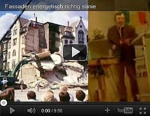

[🠔 Zur Übersicht: Pfusch-Anleitung (Satire)](altbau.md)  
# Energiekeinsparung im Altbau 150 % - Aber sicher! 1. Warum Energiekeinsparen?
**Energiesparen und Klimaschutz im Altbau - 1. Warum Energiekeinsparen?**  
_von Konrad Fischer_

> [!abstract]+ Kapitelübersicht: Energiesparwunder  
> 1. **Energiekeinsparung im Altbau 150 % - Aber sicher! 1. Warum Energiekeinsparen?**
> 2. [Energiekeinsparung im Altbau 150% - 2. Der Energieberater und seine Energiebedarfsberechnung!](energie2.md)
> 3. [Energiekeinsparung im Altbau 150% - 3. Energiesparmaßnahmen im Detail](energie3.md)

 **Vorsicht! Klimaschutz!** 
**Energiekeinsparung im Altbau 150 % - 
Aber sicher! 
1. Warum Energiekeinsparen?** 

 _"Zum Unglück hat sich mit der Industrie ein System verbunden, 
das Profit als den eigentlichen Motor des gesellschaftlichen Fortschritts betrachtet, 
den Wettbewerb als das oberste Gesetz der Wirtschaft, 
Eigentum an den Produktionsgütern als absolutes Recht, 
ohne Schranken, 
ohne entsprechende Verpflichtung der Gesellschaft gegenüber. [...] 
Noch einmal sei feierlich daran erinnert, 
dass Wirtschaft im Dienst des Menschen steht." 
_Papst Paul IV. 
(in seiner Enzyklika über den Fortschritt der Völker - [POPULORUM PROGRESSIO - Volltext deutsch](http://www.christusrex.org/www1/overkott/populo.htm)) 

**Das Bild zum Thema:**[Frans Francken - Der Tod und der Kaufmann (1620)](http://www.religionsunterricht.de/ifr/ifr45zd2.htm)

**1. Warum Energiekeinsparen?** 

Weil es richtig Spaß macht. Und der Rest doch schon lange erledigt ist: Das neueste Töfftöff XXL mit gaaanz normaler Sonerausstattung - Weltweit-Navi, Alufelgen, Scheibentönung und Metalliclackierung sowie flauschigem Sesselschutzüberzug und gehäkeltem Klopapierrollenüberzug - steht in der geheizten Doppelgarage neben dem Frauenkleinschmart SE oder Turbo Vierradbully zum Sonntagsausflug bereit, der vollelektronisch-automatische Selbstfahr-Rasenmäher daneben, die 3.000 EUR Maundnbeigs plus Rennrädli jeweils inkl. trendy dreigestreifterWeißwurstpelle auch. 

In der Wohnung ist inzwischen auch das letzte unschuldige Eckli vergewaltigt durch Wohlstandsmüll der urdeutschen Art - Kitsch as Kitsch can, lilatürkiser Nappalederpolstergarnituren in gefengshuiter Ausrichtung mit einer Akkuratesse, die jedem muselmanischen Qiblaweiser die Neidtropfen ins listigfundamentalterroristische Äuglein zwingt, satellitgestützte Flachbildschirmglotze, quadrophone Haifai-Dudelmusiempfänger in jedem Raum bis zum Gästeklo, lammfellgerollte Raufasern neben Designerplastetapete. Das buntgekrümmte Augenglasmonster zwickt bereits auf der Nase, die Haarspitzli sind vergoldet, die Zähne hochwertig auf Krokodilsniveau getrimmt. Die Gewissenserleichterungsspendenüberweisung an unschuldige Negeraugen (Kindersoldaten/Soldatenkinder?) und Regenwaldbegießaktivisten und Ökobiomohnfeldhüter ist getätigt. Jetzt wird es vielleicht langweilig. 

Der trotzdem noch reichlich, allzureichlich vorhandene Kontobestand brennt weiter unter den Nägeln. Soll der so schnöde Mammon unbemerkt klammheimlich still und leise dahininflationieren und wie das Poleis in der schellenhuberlatifseilergoregemachten Globalerwärmung restlos wegschmelzen? Niemals! Nun bleibt nur noch das Energiesparinvestieren über, man will es ja später noch weitaus besser haben als heutzutage. Und wer weiß schon, wie sich die Energiepreise dank Öko und Schröder und Konsortien immer frecherem Monopolismus entwickeln werden? Wo doch nicht mal bekannt ist, wieviel die eigene Bude überhaupt pro Quadratmeter im Jahr braucht. 

Konrad Fischer: Fassaden energetisch richtig und kostensparend sanieren und trockenlegen 1 
 
[Teil 2](http://www.youtube.com/watch?v=Y1NSxAW15Cc) [Teil 3](http://www.youtube.com/watch?v=RAT7VzBo8k0) [Teil 4](http://www.youtube.com/watch?v=6TBII25iVQk) [Teil 5](http://www.youtube.com/watch?v=Kb0C4KiZvVA) 

 

Egal. Energiesparen ist angesagt. Selbst für Gewerbebauten, Industriehallen, Bürogebäude - zumindest als Werbegag. Unser Monsterstaat will es außerdem gesetzlich erzwingen,der Energiespargaudiwurm geht um. Wer wollte sich da verschließen und bockig in der vermieften Ecke rumtrotzen? Alle müssen doch mitmachen, wie immer! Wohngebäude/Wohnhäuser wie Einfamilienwohnaus, Doppelhaus, Reihenhaus, Sozialer Wohnungsbau, Gewerbebau, Industriebau, Hotel, Restaurant/Gaststätte/Wirtshaus/Kneipe/Bar/Cafe, Kindergarten, Schule, Gemeindehaus und Gemeindezentrum, Pfarrhaus, Kapelle, Kirche, Moschee, Synagoge, Bürohaus - wirklich alle! Auch dieser Kelch darf an Dir keinesfalls vorübergehen. Wie fängst Du das aber nun praktisch an? Dazu helfen Dir die folgenden Energiekeinsparberatungsempfehlungen. Unzertifiziert und deswegen ganz geizgeil und umsonst, für Altbauten gedacht - doch trotzdem und genau deswegen mehr als nützlich. Auch für Dein flottes Neubauvorhaben. 

Also erst mal alles auswendig lernen, was Dir die gesponsorten News in Deinem von käuflichen Leitartiklern gemachten und politisierenden Medienmoguln ausgehaltenen Käsblättla alles dazu beigebracht haben: Pellets- oder Getreide- oder Holzschnitzhäckselbrennwurstverheizung neu. Totalvolldämmen - doch ei mit was denn nu - Faser, Schäume, Brösel, Flocken, Sprühbrüh oder Gespinst? Bio oder Chemie, Physik oder Baupfuisick? Egal, alle diese blutsaugdraculinischen Luftiküsschen werden gleich naß, deswegen gibt es davon keine Materialkennwerte im Merkblättli für uns Doofis. Dazu Klimalüftungsautomatenmaschinerismus mit mindestens kilometrigem Luftschlauch inkl. Kreuzigungswärmetauscher und Pollenfilterwärmerückgewinner in Edelstahl-Plastik-Silberfischmilben-Compoundbauweise fuzzylogicgesteuert plus Solar. 

So ähnlich heißt es da jede Woche, bis Du es so richtig drauf hast, was sinnvolles Investieren in [Klimaschmutz](7thuene1.md) wirklich heißt. Das will denn auch mal verwirklicht werden. Der Moloch Energiekeinsparbranche hat ja nicht umsonst alles getan, was unsere so wohlfeil dönsende Medienlandschaft der [Lobbykratie](7wdvs02.md) am liebsten erwarten. Die logische Folge: Dauertrommelfeuerndes Huren- und Hurrageschrei, Angstmanipulation und staatlicher Gesetzesklamauk auf Zuruf und vorauseilenden Gehorsam. Wir alle werden da über kurz oder noch kürzer erfaßt von Sparpanikattacken und der Dämmlustseuche, sogar der Nachbar gegenüber hat sein Haus schon fett verpackt und vom Dach nebenan glänzen die schwermetalldotierten Solarglitzerer so unglaublich prall. Es muß sich also lohnen, und wer zu spät kommt, .... So richtig zehnmalklug herumgeizen macht ja immer Spaß. Nicht nur in einer Spaßgesellschaft. Und total egal, was die Photovoltaik-Anlage, die Zangslüftung, die Klimaanlage mit Pollenfilter und Wärmerückgewinnung, die Pelletsheizung oder Hackschnitzelheizanlage, das Blockheizkraftwerk für Dein Wochenendhaus auch immer kosten mögen. Wer ko, der ko - wir ham's ja dicke! 

Außerdem sind wir ja alle arg feine Gutmenschen, und Du willst bestimmt dazugehören. Als braver Lehrling nur? Nein, dann schon lieber als Vorzeigebester. Also Hauptfeldoberklimaumweltschützer mit Eichenlaub und Schwertern vom Landrat und Klimaschmutzbündnisobristen dekoriert, das soll es schon sein. Dafür schmeißt Du auch gerne Deine sauer ersparten Kröten raus. Darf's a bisserl mehr sein? Aber selbstverfreilicht, Du willst auch da wieder mal unbedingt dabei sein, nach alter Väter Unsitte eben! Und damit Dein bei jedem Atemstoß ausgepestete brandgefährliche Klimakillergift (Dein Mundgeruch ist ein Dreck dagegen!) einigermaßen neutralisiert wird und Du Dein schlechtes Gewissen beruhigst und wieder nach nur drei Valium auf Deinem Hanfstrohkissen süßsauer träumen kannst, kannst Du so sehr viel tun. 

Die globale CO2-Bilanz muß ja ausgerechnet durch Dein wertvolles Zutun bei Deiner Restaurierung, Sanierung, Instandhaltung, Instandsetzung, Modernisierung, Renovierung oder gar Revitalisierung in den grünen Bereich gewuchtet werden. CO2-Steuer reicht da bestimmt nicht. Soviel kannst Du gar nicht abgasvollmotorisiert in Deinem grünen Klimaschutzmobil herumdüsen und den Atomstromstandby unterdrücken, bis die Rechnung aufgeht. Klimaschutz fängt eben zuhause an. Jeder kehre da vor seiner Tür, Du hinter Deiner. Sonst geht bestimmt die Welt drei Tage früher unter als sonst. Der Terminator hat immer recht. Als Österreicher sowieso und als Ami schon zweimal. 

Also - wieso nun eigentlich Energiekeinsparung? Na, Du hast doch schon 1984 Orwell gelesen. Das ist Newspeak, auf doitsch Neusprech: Krieg ist Frieden, Schwarz ist Weiß, GRÜN ist KACKBRAUN. Ökomist halt, der grüne Dünger für fette Geschäfte. Was anderes gilt doch gar nimmer in unserer so schrecklich aufgeklärten Gesellschaft. Wie dann die alternativen Sonnenblumen geerntet werden? Ganz einfach, wie normale: Der beschissene Wurzelboden wird platt gemacht, der kernige Ertrag oben abgeschöpft. Weiß doch jeder! 

Und außerdem sichert und schafft das Arbeitsplätze in der Luxusgüterindustrie und Tourismusbranche. Das alleine hätte schon gereicht. Eben zigfacher Nutzen für andere. Wenn Du nur mitmachst. Einer muß das ganze Gesumse doch kaufen. Und das bist DU! Sonst gibt's Druck und Eintopf, Gebärme, Gejammere, Geschluchze, Geheule und besorgte Betroffenheit pur. Das hält doch kein Weichei aus. Und vielleicht bringt's doch was? Wer weiß? Frag doch den Experten! Dem Schmerbauchgefühl darfst Du jedenfalls keinesfalls trauen. 

Weiter hier - [2. Der Energiekeinsparberater](energie2.md) - [3. Die Energiekeinsparmaßnahmen im Detail](energie3.md)
