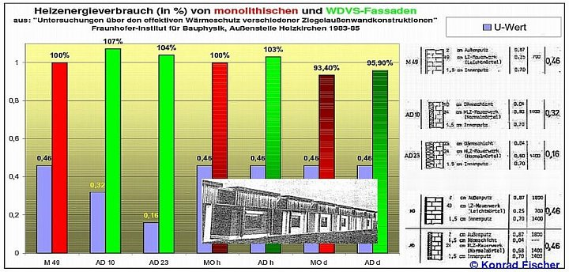
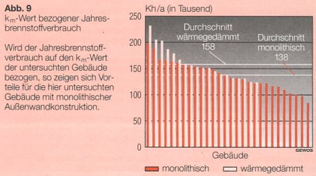

[🠔 Zur Übersicht: EEG Kritik](7eeg.md)  
# In Dämmbuden verrecken
**Kritische Analyse des Dämmzwangs und der Energieeinsparverordnung (EnEV). EnEV-Maßnahmen führen zu Bau- und Gesundheitsschäden, verursachen keinen Energieverbrauch und belasten Volkswirtschaft und Gesellschaft.**  
_von Konrad Fischer_

Zum Gedenken an den unvergessenen und erfolglosen Streiter für Recht und Ordnung im Bausektor, gegen die Dämmstofflüge und gegen den Mißbrauch der Behörden durch interessensgeleitete Lobbyisten - **ROLF KÖNEKE** , Bausachverständiger (**+** 28.9.2002) 
**(aktualisiert bis heute)**

## Presseinformationen

Vergeblichste Aktionen zum ökologischen Umbau des Energiespar- und Klimaschutzwahns: 
[Motion 02.3757, 13.12.02 zur Überprüfung angeblicher Energieeinsparung durch Dämmstoffverbau im Eidgenössischen Nationalrat](http://www.parlament.ch/afs/data/d/gesch/2002/d_gesch_20023757.htm) 
**Neu:[Der Klima-Schutzgeld-Erpressertrick - eine EU-Richtline](7wdvs02.md)** 
Pressemitteilung 
Petition des AGH an den Deutschen Bundestag (mit Nachfolgeschreiben) 
Petition des Architekten C. Schwan an den Deutschen Bundestag 
EnEV-Befreiung und EEWärmeG-Befreiung 
Stellungnahme des Arbeitskreise "Richtig Bauen" zur EnEG-/EnEV-Novellierung 2013 
Stellungnahme der Schutzgemeinschaft für Wohnungseigentümer und Mieter zur EnEG-/EnEV-/HeizkostenV-/EEWärmeG-Novellierung durch Einführung des Gebäudeenergiegesetzes GEG 2018 

---

Juni 2002 - und leider/selbstverständlich auch 2012 ff. noch ebenso aktuell, begründet und richtig - aber eben aus allgemein bekannten Gründen total vergeblich, zweck- und sinnlos wie zuvor

Rückfragen: Dipl.-Ing. Konrad Fischer, Architekt BYAK, 
Telefon 09 574 - 30 11 / 0170-73 515 57 
Telefax 09 574 - 49 60 
[eMail](2berat.md#email)

## PRESSEMITTEILUNG Energieeinsparverordnung (EnEV) 2002 ff. (Aktalisiert)

**_(Kurzfassung)_**

**Dämmzwang als Anschlag auf Volkswirtschaft und -gesundheit**

Die alle paar Jahre wiederkehrende Kampagne für die EnEV verspricht immer noch mehr Energiesparen, Arbeitsplätze und Klimaschutz. Den verordneten Maßnahmen folgen aber nicht nur Bau- und Gesundheitsschäden bis zum Tod durch Dämmstoffbrand, sie sparen auch keine Energie. Die Fakten:

1. Die Bauwerksverpackung kann das Klima nicht schützen. Das [Treibhaus Erde ist eine Utopie aus Datenmanipulation und Irrtum](7thuene1.md).

2. Die Dämmbauweise verschleudert Geld und Energie - trotz Subvention. Das [Lichtenfelser Experiment](2139bau.md) und [langjährige Heizkostenabrechnungen](7wdvs05.md) und alle vorliegenden Praxistests (Institut für Bauphysik IPB der Fraunhofer-Gesellschaft 1983-1985, GEWOS-Studie 1996, Fehrenberg-Untersuchung, IWH-/ISTA-Untersuchung 2010) beweisen: Dämmstoff dämmt überhaupt nicht, wie berechnet, sondern sorgt für höhere Heizkosten.

3. Der überdichte Bau verschimmelt, auch mit Algen- und Pilzkillern vergiftete Dämmstoffe 'saufen ab', das Aufheizen feuchter Raumluft frißt Energie, der Schallschutz sinkt. Die zementverklebte und oft entzündliche Dämmbauweise ist Pfusch. Das zerstört Fassade, Haus und Mensch, belastet unsere Rohstoffreserven und die Sondermülldeponien.

4. [Dem dichten Haus fehlt Frischluft](23bau02.md), die Schadstoffkonzentration ist zu hoch. Viel zu viele Milben, Keime, Schimmelpilze und Algen bevölkern inzwischen fast jedes zweite Haus.

5. Jeder zehnte Erstklässler ist hierzulande Asthmatiker, jährlich sterben bei uns 8.000-10.000 Menschen an Asthma. Jeder Dritte leidet an Allergien. Das feuchte Wohnklima der angeblichen Energiesparbauten trägt dazu bei. Die geforderte künstliche Lüftung mit Wärmerückgewinnung ist zu teuer und trotz teurer Wartung oft genug hygienisch riskant.

6. Die [Warmmiete kann durch die vorgeschriebene Dämmung nicht gesenkt werden](7fehrtab.md). Der Vermieter weiß das und dämmt nur, um die Baumaßnahme als Modernisierung auf den Mieter umzulegen oder ärmere Mieter gegen zahlungskräftigere auszutauschen. Mietminderung, Abwehr von Kostenumlagen und Kapitalverlust sind neben ungeheueren sozialen Härten die Folge des gesetzlich geförderten Dämmwahns.

7. Der Umweltmediziner Prof. Dr. Martin Schata schreibt der dichten Bauweise jährlich 80 Millionen Mark Folgeschäden zu. Nach einer IfO/RWI-Studie gefährdet die amtliche 'CO2-Minderungsstrategie' unsere Volkswirtschaft. Trotzdem vergeudet unser Staat dafür hohe Steuergeld-Subventionen in dreistelliger Milliardenhöhe mittels raffinierter Verwaltungsmechanismen.

8. Der Energiesparpfusch treibt die Mieter, Vermieter und sonstigen Baubeteiligten vor Gericht.

9. Die Fassadendämmung wird auch von herstellerbeeinflußen Planern und unwirtschaftlich arbeitenden Hausverwaltungen im Eigeninteresse organisiert und von Billig-Kolonnen aufgebracht. Dieser Ersatz der handwerklichen Fassadeninstandsetzung kostet uns qualifizierte Arbeitsplätze und belastet das Sozialsystem.

Daher ist es falsch, das Dämmen und Dichten der Alt- und Neubauten weiter zu verschärfen. Die Systemfehler der EnEV oder am besten gleich der ganze vergebliche Energiesparzwang sind zu beseitigen. Für echten Umweltschutz und ein gesundes Haus bleibt der bewährte Massivbau mit Strahlungsheizung Vorbild.

Weitere Information: 

[Ratgeber 'Altbau und Wärmeschutz'](6prwsch.md) bei der Deutschen Burgenvereinigung e.V., Marksburg, 56338 Braubach a. Rhein gegen 2,50 EUR in Briefmarken oder kostenlos im Internet [www.deutsche-burgen.org.](http://www.deutsche-burgen.org)

_Text kann hier beendet werden._

Altbau und Denkmalpflege Informationen: [http://www.konrad-fischer-info.de](index.md)

Abdruck frei, 2 Belegexemplare erbeten an o.a. Auskunftsadresse. 

V.i.S.d.P.: 

Dipl.-Ing. Architekt Konrad Fischer 
Hauptstr. 50 - 96272 Hochstadt a. Main - Tel.: 09574 - 3011; Fax: - 4960 [eMail](2berat.md#email) 
Altbau und Denkmalpflege Informationen: [http://www.konrad-fischer-info.de](index.md)

_Text kann hier beendet werden._

 

---

Mitteilung in leicht abgespeckter Vorgängerversion, als Fachbeitrag oder redaktionell überarbeitet publiziert in folgenden, damals jedenfalls noch nicht total gleichgeschalteten Medien: 

**_mm Modernisierungsmarkt_** , Stadthaus-Verlag Berlin 
**_[wi Wohnungspolitische Informationen](http://www.gdw.de)_** , GdW Bundesverband deutscher Wohnungsunternehmen e.V. Berlin 
**_[Bauhandwerk mit BauSanierung und Modernisierungspraxis](http://www.bertelsmann.de)_** , Fachzeitschrift für die gewerkeübergreifende Bauausführung mit Mitteilungen der Arbeitsgemeinschaft Holz, der Deutschen Gesellschaft für Mauerwerksbau, des Bundesarbeitskreises Trockenbau und des Deutschen Zentrums für Handwerk und Denkmalpflege, Bertelsmann Gütersloh 
**_[ibau Planungsinformationen](http://www.ibau.de)_** , i.p. ibau Münster 
**_[bau zeitung](http://www.bau-zeitung.de)_** , Verlag Bauwesen vb, Organ des Zentralverbandes Deutscher Ingenieure e.V. (ZDI), Fachschaft Bauwesen und der Union Beratender Ingenieure e.V. (U.B.I.-D.) 
**_bauplan/bauorga_** , Internationale technisch-wirtschaftliche Zeitschrift mit Nachrichten und Mitteilungen für die Mitglieder des BFIA Berufsverband Freischaffender Ingenieure und Architekten e.V., ADAI Arbeitgeberverband Deutscher Architekten und Ingenieure e.V., AFB Arbeitgeberverband Freier Berufe im Zentralverband Deutscher Ingenieure e.V. (ZDI), Verlag Heinrich Graefen, Duisburg 
**_Neue Solidarität_** , Wochenzeitschrift, Dr. Böttiger-Verlag Wiesbaden 
**_Der Holznagel_** , Mitteilungsblatt der [Interessengemeinschaft Bauernhaus e.V.](http://www.IGBauernhaus.de) 
**_B+B Bautenschutz Bausanierung_** , Zeitschrift für Bauinstandhaltung und Denkmalpflege, Mit den Mitteilungen der Wissenschaftlich-Technischen Arbeitsgemeinschaft für Bauwerkserhaltung und Denkmalpflege e.V. (WTA), des Deutschen Holz- und Bautenschutzverbandes e.V. (DHBV), des Bundesarbeitskreises für Altbauerneuerung e.V. (BAKA), der Deutschen Bauchemie e.V., des Fachverbandes Feuchte- & Altbausanierung e.V., (FAS) sowie des Dahlberg-Institutes f. Diagnostik u. Instandsetzung historischer Bausubstanz e.V., [Verlagsgesellschaft Rudolf Müller Köln](http://www.rudolf-mueller.de) 
**ARCONIS,** Wissen zum Planen und Bauen und zum Baumarkt, Fraunhofer IRB Verlag

---

[ 
© Götz-Wiedenroth-Karikatur: Klima-Kamikaze (durch Energiepass-Weltklasse): 
"Ich habe mich zur CO2-Einsparung für Maximaldämmung entschieden - Für die Schimmelpilze in dieser Wohnung hat sich das Klima schon total verbessert!"](http://gwiedenroth.googlepages.com/)

Wie war das - 

Dämmung dämmt nicht wie berechnet? 

Nein - der Energiesparaufwand gem. Energieeinsparverordnung (vulgo: Energiesparverordnung/Energiesparordnung) EnEV spart keine Energie und ist folglich kein "Beitrag zum Klimaschutz" (Bundesbauministerium)? 

Deutschlands Häuser sollen aber dennoch verpackt, die Bewohner darin im eigenen Mief vergast werden - obwohl das noch nie, wie Vergleichsstudien (IWH/ista 2010, GEWOS 1969, THERMA-WETTBEWERB des BUNDES, Fraunhofer-Institut 1983-1985, EVAs im eidgenöss. Auftrag durch Bossert, Fehrenberg, ...) seit den 1980er immer wieder bewiesen - geschweige denn wirtschaftlich - Energie gespart hat. Seit Inkrafttreten der sog. Energieeinsparverordnung EnEV 2002 läuft die Umsetzung der Dämmstofflüge sogar bußgeldgestützt. 

Zwei diesbezüglich aufschlußreiche Grafiken aus den bzw. auf Grundlage der oben aufgeführten Untersuchungen belegen die ausbleibende Dämmwirkung von Dämmstoffen auf der Fassade ([Details und Referenz dazu](7fehrta2.md)): 

 

 

Ob es immer Dämmung sein muß? Lesen Sie nach beim [Energiespar-**W**U** **N** **D** **E** **R****](2137bau.md#wunder)!

Auch alle Heizkessel älter als 1978 müssen lt. EnEV vernichtet werden, selbst wenn sie perfekt Energie sparen und technisch gem. BImschV einwandfreie Abgaswerte bringen. Damit gehen entweder die Kaminanlagen versottungshalber total kaputt oder müssen gleich aufwendigst - meist total unwirtschaftlich - vorbeugend saniert werden. Allerblödsinnigste Rechenscharlatanerie (Norm-Berechnung Wärmebedarf / Bedarfsberechnung) wird als Energieausweis / Energiepaß zwangsweise für teuer Geld mit willigen Helfershelfern an den Hausbesitzer gebracht. Wer sitzt eigentlich in unserer politischen und ministeriellen Administration und erläßt so einen widerlichen Schmarrn? Eine Invasion von Veganern? Käufliches Personal der Lobbyisten? Affen? Schweine? Ministerialratten und Schnulliticker? 

So ein Grad von vorschriftsmäßiger Kamikaze-Selbstzerstörung wäre selbst bei den einst so heiß geliebten Volks(ver)führern Ceaucescu, Stalin, Hitler, Truman, Roosevelt, Johnson, Bush sen.+jr., Clinton, Mao oder gar Churchill wohl kaum durchgegangen und ist bisher wohl nur in Japan und unter deutschen Ökos beobachtbar gewesen, wie Edgar Gärtner in "Ökonihilismus 2012 - Selbstmord in Grün" so volltrefflich nachweist. 

Doch wir lassen uns wie immer alles gefallen, bis es wieder mal zu spät ist. Inzwischen schlägt die Industrie zur Verlängerung der kläglichen WDVS-Lebensdauer und Behinderung des vorschnellen Absaufens infolge der allnächtlichen Tauwassereinspeicherung sogar deren systematische Beheizung (!) vor (Patent Ewald Dörken AG, DE102009035656A1 03.02.2011, Titel [Elektrische bzw. Warmwasserrohr-Beheizung der wärmegedämmten] "Gebäudehülle eines Gebäudes"). Dagegen war das Rathaus von Schilda ein Tempel der Weisheit. 

12.10.12: WirtschaftsWoche: [Umstrittene Ersparnis: Kostenfalle Wärmedämmung](http://www.wiwo.de/finanzen/immobilien/umstrittene-ersparnis-kostenfalle-waermedaemmung-seite-all/7243848-all.html) 
08.10.12: DIE WELT: [Praxisstudien beweisen: Wärmedämmung kann Heizkosten in die Höhe treiben](http://www.welt.de/finanzen/immobilien/article109699115/Waermedaemmung-kann-Heizkosten-in-die-Hoehe-treiben.html) 
18.09.12: DEUTSCHE WELLE: [Die kaputtgedämmte Republik?](http://www.dw.de/dw/article/0,,16240512,00.html)

Diese Seiten wollen aufklären, obwohl klar ist, daß wohl mehr als 99 Prozent der Bevölkerung dem Ökowahn, der Klimaschutz-Massen-Halluzination, der Ökopsychose und dem Biofanatismus verfallen sind und wohl auch bald dazu bereit, Ketzer wieder mal zu steinigen, verbrennen oder in Lagern - diesmal mit CO2? - zu vergasen. Dennoch, auch unsere Gesllschaft hat genug Platz für tragische Figuren und Don-Quichotterien, und sei es am Pranger, Balkenkreuz oder auf dem flachen Lande. 

Deswegen werden Sie hier mit vergeblicher Aufklärung belästigt, die Ihnen freilich nichts nutzen wird, da Sie eben nicht zu dem verlorenen Häuflein der restlichen Ein Prozent gehören wollen. Warum denn dann? Damit Sie dennoch mal am eigenen, sinnentleerten Kopf kratzen: 

Allen EnEV-Schwindel rund um Neubau, Altbau, Altbausanierung, Bauwerksinstandsetzung, Gebäudemodernisierung und Nachrüstung - und sei er noch so paragrafiert und bußgeldbewehrt - könnte man sich nämlich auch sparen - was Ihnen von allerlei umherlaufenden Energieberatern, Planern und Handwerkern jedoch zu Ihren Ungunsten und gegen alle hier anzunehmenden Treue-, Beratungs-, und sogar Treuhänderpflichten entweder aus grober Fahrlässigkeit oder Vorsatz verschwiegen werden kann. 

Das sind genau Ihre Fachleute, die Sie in etwa so (oder sinngemäß) "aufklären" und Ihr Geld für den Energiesparschwindel rausjucken nach dem Motto "Mit dem Schinken nach der Wurst werfen" - und selbstverständlich ohne die in Klammern stehenden Erläuterungen für die ahnungslos wieder mal mitlaufenden Bauexperten von Grün bis Schwarz in der bundesdeutschen ökosozialistischen Einheitspartei der Klimaschutz-Planwirtschaft bis 2050: 

_"Die Energieeinsparverordnung EnEV 2009 hat die energetischen Anforderungen an Bestandsgebäude nochmals drastisch erhöht (ohne den meist anzuwendenden Befreiungsparagrafen 25 anzutasten, der bei allen unwirtschaftlichen - sich nicht in 10 Jahren refinanzierenden / amortisierenden Energiesparmaßnahmen anzuwenden ist und dessen Anwendung jeder von Ihnen beauftragte Planer plichtgemäß zur Vermeidung Ihrer Schadensersatzforderung zu prüfen und Ihnen das Prüfergebnis mitzuteilen hat): 

Sind z.B. durch Änderungen an der wärmeumfassenden Gebäudehülle mehr als 10 Prozent der gesamten Fassadenfläche betroffen (was nicht für Putzreparaturen gilt, selbst wenn sich im Laufe der Sanierung mehr als 10 Prozent Erneuerungsbedarf ergibt), müssen die Maßnahmen streng nach und unter strikter Berücksichtigung der EnEV 2009 (und immer unter Beachtung des Wirtschaftlichkeitsgebots gem. EnEG § 5 und der entsprechenden Befreiung gem EnEV § 25) durchgeführt werden. 

Die Mißachtung dieser verschärften Vorgaben bei Planung und Ausführung (löst im Falle verfehlter Wirtschaftlichkeit einen Schadensersatzanspruch des geschädigten Auftraggebers aus, das heißt, daß der wirtschaftlich entstandene Schaden - die Fehlinvestition in unwirtschaftliche Energiesparmaßnahmen - als Schadensersatz seitens des die unwirtschaftliche Planung verschuldenden Auftragnehmers an den geschädigten Auftraggeber zu zahlen ist) ist eine Ordnungswidrigkeit im Sinne des Energieeinsparungsgesetztes (EnEG) und kann mit einem Bußgeld von bis zu 50.000 Euro bestraft werden (was aber noch nie vorgekommen ist, da der Vollzug der EnEV seitens der dafür zuständigen unteren Baugenehmigungsbehörden dank fehlender Personalkapazitäten meist weder die Prüfung geschweige denn die Ahndung bzw. Sanktionierung von Verstößen gegen die EneV zuläßt)! 

Als (von Ihnen wirklich ganz) unabhängiger Energieberater erstelle ich (mit Hilfe meiner Industrieberater, von denen Sie nichts wissen müssen und sollen) ganzheitliche (und immer kraß unwirtschaftliche, oft auch Baupfusch und Gesundheitsschäden provozierend) Energiekonzepte für Bestandsgebäude (von deren Baukonstruktion und Bauphysik ich sowieso nichts verstehe) und Neubauten (die ich nur auf dem Papier beherrsche, ansonsten erledigen das meine ebenfalls der Industrieberatung zu Ungunsten des Bauherren verpflichteten Fachingenieure und eben meine Industriefreunde/Pharmareferenten), und helfe bei der Antragstellung für KfW-Förderkredite und Zuschüsse. 

Ich überwache für Sie die (im Sinne der Industrienormen, sonst aber gewiß nicht) mängelfreie Ausführung der Arbeiten - Preis nach Absprache (und grundsätzlich unter HOAI-Mindestsätzen, da ich den Rest von meinen Industrie- und Handwerkspartnern zugesteckt bekomme, deren Produkte und Leistungen ich - selbstverständlich ohne, daß Sie etwas davon mitbekommen - auch in Ihrem Bauvorhaben [mit allen mir zur Verfügung stehenden Mitteln manipulativ zu Ihren Lasten und auf Ihre Kosten begünstige](10hoai22.md))."_ 

Einzige Voraussetzung der EnEV-Abservierung bei Neubauvorhaben und der Altbauinstandsetzung: Inanspruchnahme der rechtlich in entsprechenden Paragrafen inbegriffenen Ausnahmen und [Befreiungen](7temp24.md), die jedem Bürger gem. EnEV 2007 §§ 24 und 25 (früher §§ 16, 17) zustehen und vor allem im Falle Baudenkmal/Denkmalschutz/Denkmalpflege/Denkmalinstandsetzung und wegen der nahezu immer vorliegenden Unwirtschaftlichkeit/Unzumutbaren Härte beansprucht werden können. [Hier gibt es dafür ein schmuckes DIN-A-4 Antragsformular](11form.md) zum Ankreuzen für Jedermann - strengstens gem. EnEV(!), das ich als im Freistaat Bayern zugel. Sachverständiger gem. ZVEnEV [seit 2017 AVEn] ausgearbeitet und oft genug auch in anderen BRD-Bundesländern schon erfolgreich durchgebracht habe. 

Kosten für die tatsächliche Erfüllung der Energiesparforderungen gem. EnEV durch Verzicht auf die dafür gem. EnEV geforderten - wie immer in einer Lobbykratur - in der Sache wirkungslosesten, dafür ganz woanders taschenfüllendste Maßnahmen? Vergleichsweise geringe Kosten für Antrag + Bescheinigung, dafür zig- bis hunderttausende EUR Ersparnis durch Verzicht auf sinnloseste, schädlichste und auch durch KfW-Kredit (fast) niemals wirtschaftlich sinnvolle Investitionen. Und da bis zum 30. September 2008 für jeden Hausbesitzer die Wahlmöglichkeit zwischen billigem und realistischem Energiepaß / Energieausweis namens "Verbrauchsausweis" auf Grundlage des tatsächlichen Energieverbrauchs der letzten drei Jahre sowie dem viel teureren "Bedarfsausweis" auf Grundlage einer unsinnigen, auf fiktiven und arg falschen "U-Werten" der Baukonstruktion besteht, die beide 10 Jahre gültig sind, ist es sehr anzuraten, möglichst rechtzeitig den Billigpaß zu bestellen. Daß auch danach eine nachträgliche Rückdatierung - wer soll denn das wie feststellen, wann so ein lumpiges Ausweislein tatsächlich ausgestellt und unterschrieben wurde? - zum Billigpaß führen kann, braucht den eher praktisch gesonnen Hausbesitzern wohl kaum weiter erläutert werden ... 

Das wären also die jedem Bürger offenstehenden und ganz praktischen Auswege aus dem administrativen hauszerstörendem und gesundheitsschädigenden Energiesparbeschiß - unter rechtlicher Ausnutzung - nein Beanspruchung - der aus grundgesetzlichen Gründen von der Lobby bisher nicht aushebelbaren Ausnahmeparagrafen. 

Nun müssen Sie nicht annehmen, daß unsereiner so dermaßen wahnsinnig, blöde oder durchgeknallt wäre, anzunehmen, daß man mit unwiderlegbaren Sachargumenten in Brieflein (ich rede nicht von banknotenvollgestopften Kuverts oder gern gesehene und vorwiegend auf alpinen, channel- oder südseeländischen Nummernkonten erfreulicherweise explodierende Koffer-Schwarzpulverbomben!) an Regierung, Parlament, Parteien, Institute, Stiftungen und Ministerialbürokratie unserer Lobbykratie irgendwas zum Guten erreichen könnte. Nein, und nochmals nein, wir wissen: Wat mutt, dat mutt! Wenn es nur dem Bürger maximal schadet und den hochwohllöblichen Auftraggebern, Gesinnungsgenossen und Helfershelfern maximal nutzt. 

Warum also dennoch der Versuch - zusätzlich zu dem praktischen und bisher einmaligen und nur hier gebotenen Werkzeug "Ausnahme/Befreiungsantrag gem. EnEV"(!)? 

Weil es einmal unser - trotz aller Abschaffversuche und mieser Vorbildwirkung der gewissenlosen Eliten - noch vorhandenes Gewissen fordert. Daß Widerstand mit z.B. feigen Aktentaschen-, Koffer- oder Rucksackbomben (Eisner, Stauffenberg usw.) gegen ein internazional durchorganisiertes Terrorregime gar nix bringt, ist uns ebenfalls schon lange klar. Dennoch zwingt uns der verbliebene Anstand, alle Vernichtungsrisiken und die hetzerische Verfolgung auf uns zu nehmen und dennoch - wenn auch vergeblich und zur Ergebnislosigkeit von Anfang an verurteilt - aufzuklären. Die dem Energiesparzwang zugrundeliegenden Wunder wollen hinterfragt werden. Hier die fraglichen Links:

[Das Wunder der globalen Erwärmung](7wdvs03.md) 
[Das Wunder des gefährlichen CO2s](7argus.md) 
[Das Wunder der versiegenden fossilen Energiequellen](8buch22.md#gold) 
[Das Wunder des Naturstroms im Solarzeitalter](7wdvs04.md) 
[Das Wunder der energiesparenden Dämmung mit Leichtbaustoffen.](2139bau.md) 
[Das Wunder des Energiesparens mit WDVS / Zusatzdämmung / Fassadendämmung.](7fehrtab.md)

So treibt dann der verordnete Dämmzwang die Wohnungsverschimmelung und Investitionsvernichtung - wie immer und ewig - gegen alle begründeten Einwände und Bedenken voran - Zitat aus:

haustechnikdialog.de:

_"17.7.2001 Bundesrat ändert EnEV_

_Der Bundesrat hat am Freitag, 13.07.01 der Energieeinsparverordnung zugestimmt."_

Kommentar: Das sicherte der Lobby sogar noch zusätzliche Erträge, in der Sache bleibt die Maßnahme wirkungslos, wie alle Dämmanstrengungen (vgl. [Fehrenberg-Untersuchung](7fehrtab.md))

_In einer gleichzeitig gefassten Entschließung bittet der Bundesrat die Bundesregierung, bis zum 31. Dezember 2006 die Auswirkungen der Verordnung insbesondere im Hinblick auf die angestrebten Energieeinsparungen und den Klimaschutz zu überprüfen und dem Bundesrat hierzu einen Bericht vorzulegen."_

Kommentar: Diese Sache stinkt zum Himmel. Bis zum Jahre 2006 war davon nichts mehr zu hören. Dafür verschärft man die EnEV noch weiter. Man hätte doch auch damals (2001) nur prüfen müssen, wo die vorher geltende WSVO irgendwas eingespart hat ([NIRGENDS](7fehrtab.md)!), und wie es zu erklären ist, daß noch mehr Aufwand im verordneten Dämmen und Heizanlagenvernichtung das Klima schützen soll. Wo doch der Klimaschutzbetrug mit den "[Klimafakten](8buch22.md#klimafakten)" des staatlichen Instituts für Geowissenschaften, Hannover sozusagen amtlich entlarvt wurde. Da mit der bisherigen WSVO also nichts war, tut man nun so, als ob es mit der EnEV besser ginge. Irgendjemandem muß es dann doch fast rechtzeitig aufgefallen sein, daß hier ein Erfolgsbericht überfällig war und folglich kommt es dann letztlich am 31. Januar 2007 zu einem Schreiben des hochmögenden Bundesministeriums für Wirtschaft und Technologie an die Exzellenzen, Magnifizenzen, Herrlich- und Dämlichkeiten des wunderbaren Bundesrats: [Bericht der Bundesregierung zu der Entschließung des Bundesrates zur Verordnung über energiesparenden Wärmeschutz und energiesparende Anlagentechnik bei Gebäuden (Energieeinsparverordnung - EnEV)](https://www.umwelt-online.de/cgi-bin/parser/Drucksachen/drucknews.cgi?id=recht&texte=0087_2D07). Darin heißt es dann abschließend so schön im allerbesten Orwellschen Neusprech: 

_"Auswirkungen der EnEV auf Energieeinsparung und Klimaschutz / CO2-Reduktion: 
Mit ihren umfassenden energiesparenden Anforderungen an neue und bestehende Gebäude leistet die EnEV im Gebäudebereich einen wesentlichen Beitrag zur Energieeinsparung und damit auch zur CO2-Reduktion. Quantitative Aussagen über die Auswirkungen der EnEV-Anforderungen sind allerdings schwierig und lediglich als grobe Schätzungen möglich. 
Im Neubaubereich lassen sich die aufgrund der Anforderungen der EnEV zu erwartenden Einspareffekte in Referenz zum Anforderungsniveau der jeweils vorher geltenden Verordnungsfassung recht gut einschätzen. Das energetisch einzuhaltende Niveau neuer Gebäude nach EnEV liegt um durchschnittlich 30 % unter dem geforderten Niveau der Vorgängerregelung. Im Gebäudebestand sind dagegen wegen der komplexen Bestandslage und der häufig vielfältigen Motive für eine energetische Sanierung allein auf die EnEV bezogene Energie- und CO2- Einspareffekte schwieriger zu ermitteln. Die verfügbaren Untersuchungsergebnisse differieren in ihren Einschätzungen daher erheblich. Ihnen ist jedoch gemein, dass sie von einem signifikanten Einspareffekt durch die EnEV ausgehen."_ 

Aha. Nix Genaues weiß man halt nicht und das muß dem Bundesrat genügen, um den Bürger weiter dem Klimastuß zum Fraß auszuliefern. Lobbykratur vom Feinsten eben. Nichts anderes haben wir Wähler von unserer Politik, der wir unsere Stimmviehstimme gegeben haben, erwartet. Mäh, mäh! Und unsere Politiker, was haben die darauf gemacht? Nichts. Sie ziehen wie immer die Hände aus unseren Taschen - aber nur zur Abstimmung weiterer enteignungsgleicher Abzocken - und werden am Ende bestenfalls mit heuchlerischem Augenaufschlag sagen, sie hätten halt wieder mal den ausgewiesenen Experten vertraut und wüßten sonst von nichts. Das hatten wir doch schon mal, oder?

Hier, was ein erfahrener Kollege zur EnEV meint: [Interview mit Dipl.-Ing. Arch. Tomas Schreiner: auf www.dimagb.de](http://www.dimagb.de/info/gesetz/enevswan.html#schreiner#schreiner)

und hier, was sonst noch so läuft:

---

Rolf Köneke - sick-building-center 
Buschrosenweg 31 
22 177 Hamburg 

als Kontaktadresse für den Arbeitskreis Gesundes Haus AGH

An den 
Petitionsauschuß des Deutschen Bundestages 
11011 Berlin

**AGH-Petition zur Energieeinsparungsverordnung EnEV**

Sehr geehrte Damen und Herren des Petitionsausschusses,

es wird hiermit Beschwerde gegen die an der EnEV beteiligten Ministerien eingelegt aus folgenden Gründen: 

1. Gesetzwidriges Verhalten, 
2. Unzumutbarkeit der vorgeschlagenen Rechenmethoden, 
3. Mißbrauch technisch-wissenschaftlicher Verfahren, 
4. Negative Auswirkungen der EnEV.

Der Referentenentwurf vom 29. 11. 2000 liegt vor. Auf Grund des Energieeinsparungsgesetzes vom 22. Juli 1976 soll dieser Referentenentwurf von der Bundesregierung verordnet werden. Hierzu wird festgestellt: 

Zu 1) Gesetzwidriges Verhalten 

Im Energieeinsparungsgesetz, der Ermächtigungsgrundlage zum Erlaß der Wärmeschutzverordnungen, wird die Wirtschaftlichkeit im § 5 “Gemeinsame Voraussetzungen für Rechtsverordnungen“ gefordert. Der § 5(1) lautet verkürzt: 

(1) "Die in den Rechtsverordnungen ... aufgestellten Anforderungen müssen ... wirtschaftlich vertretbar sein. Anforderungen gelten als wirtschaftlich vertretbar, wenn generell die erforderlichen Aufwendungen innerhalb der üblichen Nutzungsdauer durch die eintretenden Einsparungen erwirtschaftet werden können." 

Diese Aussage ist eindeutig. Unwirtschaftliche Energiesparmaßnahmen sind damit gesetzwidrig. Die technische Umsetzung der Anforderungen der EnEV erfordert einen Aufwand, der durch die damit erzielten Einsparungen wirtschaftlich nicht gedeckt werden kann. Es gibt kein Beispiel, bei dem die Wirtschaftlichkeit nachgewiesen werden konnte. Eine Verordnung, deren Anforderungen grundsätzlich zu unwirtschaftlichen Energiesparmaßnahmen führen, ist deshalb null und nichtig. 

Auch die Wohnungswirtschaft leidet unter dem Diktat der überzogenen Anforderungen, die Wohnungsbaugesellschaften werden in ein finanzielles Fiasko gestürzt. Die Umlegung der investiven Maßnahmen auf den Mieter wird für sozialen Zündstoff sorgen. Die Differenz der Heizkostenrechnungen können die Differenz zur steigenden Miete nicht kompensieren. 

Beispielhaft sei eine Notiz aus der FAZ vom 05. 09. 2000 erwähnt: 

Drei Wohnhäuser mit jeweils 6 Dreizimmer-Wohnungen a 71 m² Wohnfläche werden von der “Gesellschaft für Wohnungsbau und Hausverwaltung im Stadtgebiet Aschaffenburg“ saniert. Als “energiesparende Maßnahmen“ wurden durchgeführt: 

- Wärmedämmverbundsystem mit 8 cm Mineralfaser und Silikonputz, 
- wärmedämmende Kunststoffenster mit Wärmedämmverglasung, 
- Decke zum Dach mit 12 cm Polystyrol, 
- Einbau eines Brennwertkessels 
- Regelung der Raumtemperaturen. 

Im Text heißt es dann: 

“Der Energiebedarf zum Heizen der Häuser wird nach den Erwartungen der Baugesellschaft um rund 35 Prozent sinken. Pro Jahr und Wohnung würde das eine Einsparung von etwa 180 Mark ergeben“. 

35 % suggeriert viel, 180 DM pro Jahr bedeutet aber ein “Nichts“. Bei 6 Wohnungen pro Haus wird damit eine Einsparung von 1080 DM/a erzielt. Wird für die Wirtschaftlichkeitsberechnung ein Mehrkostennutzenverhältnis von 15 (sehr gewagt) angenommen, dann beträgt das Investitionskostenlimit pro Haus: 

15 x 1080 = 16.200 DM. 
(Das Mehrkostennutzenverhältnis ist das Maß für die Wirtschaftlichkeit; siehe: Ehm, H.: Maßnahmen zum baulichen Wärmeschutz und zur Energieeinsparung in bestehenden Gebäuden; Kosten-Nutzen-Betrachtung. wksb 1979, H. 8, S. 1 und Werner, H.; Gertis, K.: Zur Wahl von Kalkulationsmethoden bei der Ermittlung der Wirtschaftlichkeit von Energiesparmaßnahmen. Baumaschine + Bautechnik 1979, H.2, S. 65). 

Jeder Architekt oder Bauleiter weiß, daß die Realisierung der oben genannten fünf “energiesparenden“ Maßnahmen für 16.200 DM pro Haus eine Utopie ist – wie eben alles im jetzt geforderten Gebäudewärmeschutz. 

Die beteiligten Ministerien verstoßen somit eklatant gegen das Wirtschaftlichkeitsgebot des Energieeinsparungsgesetzes – sie handeln gesetzwidrig. Das soziale Gewissen soll jetzt nicht Gegenstand der Petition sein. 

Gegenstand einer Gegenäußerung muß die nachvollziehbare und mit realistischen Daten versehende Wirtschaftlichkeitsberechnung sein; eine solche ist bis jetzt noch nicht vorgelegt worden. Die der Bundesregierung vorliegenden Gutachten zur Wirtschaftlichkeit sind, wenn darauf zurückgegriffen wird, vollständig zu präsentieren, die Gutachter zu benennen. 

Zu 2) Unzumutbarkeit der vorgeschlagenen Rechenmethoden 

Es heißt in der Begründung zur EnEV: “Die Energieeinsparverordnung soll nicht mit umfänglichen technischen Regelungen befrachtet werden“. Es wird statt dessen auf umfangreiche Normen verwiesen. Diese sind: 

1. DIN V 4108-6 mit 46 Seiten 
2. Entwurf DIN 4701-10 mit 30 Seiten 
3. DIN EN 832 mit 30 Seiten 

Werden die ebenfalls zu beachtenden Entwürfe zur DIN 4108-2 mit 21 Seiten und zur DIN 4108-3 mit 43 Seiten hinzugezählt, dann ergeben sich allein für diesen schmalen bauphysikalischen Sektor insgesamt 170 Seiten. 

Diese Informationsfülle ist für ein ordnungsgemäßes Planen und Entwerfen unzumutbar. Werden die inhaltlichen und methodischen Fehler noch mit einbezogen, dann mutiert diese Informationsschwemme zum Informationsmüll. Die Anwendung verbietet sich somit von selbst. 

Zu 3) Mißbrauch technisch-wissenschaftlicher Verfahren 

Es heißt in der Begründung zur EnEV: 

“Durch Verweis auf die EN 832 ist nunmehr die Möglichkeit gegeben, auf die Darstellung von Nachweisregeln in der Verordnung weitgehend zu verzichten“. 

Die DIN EN 832 wird damit beim Nachweis zum zentralen Mittelpunkt der EnEV. Dieses Nachweisverfahren wird an einem Beispiel im Anhang L der DIN EN 832 erläutert. 

Die Tabelle L9 listet die Heizwärmebedarfswerte eines ca. 90 m² großen Hauses auf und enthält auch das Ergebnis für die Heizperiode: 

30 000 MJ ± 13 000 MJ oder in kWh: 8333 kWh ± 3611 kWh 

Mit einer solchen Abweichung werden alle ernst zu nehmenden Berechnungen in den Ingenieurwissenschaften verhöhnt. Eine Abweichung von ± 43,3 % ist ein Skandal. Immerhin liegen mögliche Ergebnisse dann zwischen 4722 kWh und 11944 kWh bzw. zwischen 52,8 kWh/m²a und 133,5 kWh/m²a und das ist immerhin das 2,53 fache. Eine derartige Streuung entbehrt jeder soliden wissenschaftlichen Arbeit. 

Ein solches Ergebnis kann nicht ernst genommen werden und beweist die Unzuverlässigkeit der Rechenmethoden. Mit dieser Streuung werden die methodischen und inhaltlichen Fehler der DIN-Normen inkognito eingestanden. Die gesamte DIN-EN 832 muß deshalb aus dem Verkehr gezogen werden. 

Weiter heißt es in der Begründung zur EnEV: 

“Ziel sei die Erhöhung der Transparenz für Bauherren und Nutzer durch aussagekräftige Energieausweise“. 

Bei solchen haarsträubenden Ergebnissen mit Streuungen von ± 43,3 % kann nicht von aussagekräftigen Dokumenten gesprochen werden. 

Damit aber werden auch die in der EnEV §13 geforderten “Ausweise über Energie- und Wärmebedarf, Energieverbrauchskennwerte“ hinfällig. Die Juristen finden jedenfalls hier ein reichhaltiges Betätigungsfeld vor, wenn der Kunde, wenn der Verbraucher, wie ihm ja immer erzählt wird, die dort angegebenen “Bedarfswerte“ einmal juristisch einfordern, einmal einklagen sollte. Immerhin muß vom Verordnungsgeber die Frage klar beantwortet werden, ob ein Recht auf die Einhaltung der in den Energieausweisen falsch berechneten Werte besteht. 

Zu 4) Auswirkungen der EnEV 

Im Vollzug der EnEV, aber auch der bisherigen Wärmeschutzverordnungen werden für die Außenhülle ausschließlich Dämm-Maßnahnen vorgesehen, die sich hauptsächlich in Wärmedämmverbundsystemen niederschlagen. Die Nachteile sind gewaltig, sie dürfen nicht bagatellisiert werden. 

Gesundheitlicher Aspekt 

Seit Jahren werden unsere Wohnhäuser gemäß WSchVO mit “Verpackungs-Material“ eingepackt. Das führt zu einem hermetischen Verschluß. In etwa Einhunderttausend Groß-Wohnhäusern gibt es 1 Million Wohnungen mit Schimmel. Die Folge ist: 

Vernichtung des Wohnklimas, 
Übersättigung mit Schimmel, 
schwere Allergien, 
asthmatische Erkrankungen. 

Energierelevanter Aspekt 

Der Einbau neuer Fenster und die Verkleidung mit Dämm-Material sollte zu einer wesentlichen Energieeinsparung führen. Dies hat sich nicht bewahrheitet (man meint deshalb, nun noch mehr dämmen zu müssen, um endlich etwas zu erreichen). Nur heiztechnische Verbesserungen können Heizkosten senken. 

Bauphysikalischer Aspekt 

Das seit Jahrhunderten wohnbiologisch vorbildliche Massiv-Haus mit einer Wohnqualität, die “Niedrigenergiehäuser“ nie erreichen können, darf nicht hermetisch abgedichtet werden. Dagegen wird jedoch verstoßen: 

Von außen durch das sorptionsdichte und diffusionsbehindernde Wärmedämmverbundsystem, von innen durch die mit Kunststoffdispersion gestrichene Rauhfasertapete und die dichten Fenster. Die Folge ist: 

Schimmel verursachende hohe Feuchte im Innenraum, 
Feuchteansammlung in der Außenwand 

– die Dämmung wird unwirksam. 

Lüftungsrelevanter Aspekt 

In einem dichten Raum, der allein schon durch das Bewohnen eine hohe Feuchte aufweist, wird es niemals gesundes Leben geben. Alles wird feucht und schimmelig. Die eingebauten Wohngifte erhöhen die Krankheitshäufigkeit. 

Umweltrelevanter Aspekt 

Bei den WDV-Systemen kommt zu 90% EPS zum Einsatz; es enthält hochbrennbares Styrol. Im Brandfall werden hochgiftige Gase freigesetzt (Flughafen Düsseldorf). WDV-Systeme lassen sich nicht recyceln, es sitzt fest verbunden am Wohnhaus. 

Fachleute – auch das Umweltamt Hamburg – sagen: 

“Dieses Material dürfte gar nicht erst produziert werden“. 

Trotzdem wird es überall eingesetzt – auch im Innenbereich. Gesundheitsverstöße sind deshalb an der Tagesordnung. 

Volkswirtschaftlicher Aspekt 

Das Anbringen eines WDV-Systems kostet 150,-DM/m². Auf diese Weise wurden bisher 40 Milliarden DM ausgegeben – ohne eine wesentliche Energieeinsparung zu erzielen, die dann auch zu einer merkbaren CO2-Minderung führen würde. 

Allerdings wurde damit erreicht, daß bereits 400 000 Bürger erkrankt sind. Das Entfernen der WDV-Verkleidung kostet noch einmal 20 Milliarden DM. Der Wertverlust der Häuser muß auch beachtet werden. 

Quintessenz 

Die angeführten Fakten müssen beachtet werden, soll das Staatswesen durch solche unverständlichen und deshalb wohl auch zwangsläufig administrativen Aktivitäten nicht weiterhin in Mißkredit geraten und Schaden erleiden. Die Vergangenheit zeigt genügend Beispiele unverantwortlichen Handelns. 

Der Arbeitskreis stellt fest: 

**1. Werden die Unzulänglichkeiten der “Energieeinsparkampagnen“ offengelegt, wird mit Bußgeldbescheiden ab 250 000 DM operiert.**

**2. Werden Ministerien auf die Widersprüche und Gefahren aufmerksam gemacht, so werden diese Warnungen ignoriert – sie interessieren sich nicht dafür.**

**3. Werden einzeln Gesundheits-, Jugend-, Sozial- und andere Ministerien mit klaren Fragen angeschrieben, so setzt das Geschiebe der Zuständigkeiten ein. So werden klare Antworten vermieden.**

**4. Auf Fragen im Zusammenhang mit der Gesundheit der Bürger an den “Umwelt-Sachverständigen-Rat“, der die Bundesregierung berät, wird überhaupt nicht geantwortet. Die Verdrängung von unangenehm empfundenen Fragen scheint Schule zu machen – siehe BSE-Krise.**

**5. Auch industrieabhängige “Wissenschaftler“, die die Bundesregierung richtig beraten sollten, tun dies nicht. Die Interessen der Industrie haben Vorrang vor den Interessen der Verbraucher. Auch beim Gebäudewärmeschutz muß der Vebraucherschutz eingefordert werden.**

**6. Es geht nicht an, daß in dieser bisherigen Form weitergearbeitet wird. Es geht nicht an, daß die Gebäudesubstanz eingepackt werden soll. Es geht nicht an, daß unsere Häuser zerstört werden. Es geht nicht an, daß die Gesundheit der Bürger gefährdet wird. Es geht nicht an, daß unsere schon kranken Kinder im Umwelt-Dämm-Müll ersticken.**

**7. Deshalb ist eine öffentliche Diskussion unausweichlich. Die Verantwortung gegenüber dem Bürger gebietet dies.**

Wir bitten im Interesse der betroffenen Bevölkerung um angemessene Sachbehandlung.

Im März 2001

Arbeitskreis Gesundes Haus AGH: 
Dr. phil. Helmut Böttiger, Wiesbaden; Dipl.-Ing. Alfred Eisenschink, Murnau; Dipl.-Ing. Architekt Konrad Fischer, Hochstadt a. Main; Dr. rer. nat. habil. Michael Gagelmann, Wiss. Beirat der Interdisziplinären Gesellschaft für Umweltmedizin IGUMED e.V., Schriesheim; Prof. Dr. Gerhard Gerlich (* 6. April 1942 in Prag; † 8. November 2014), Institut für Mathematische Physik der TU Braunschweig, Braunschweig; Rolf Köneke (4.4.1922 - 28.9.2002), Bausachverständiger, Hamburg; Dipl.-Ing. Architekt Kai Kühnel, Stadtrat, Dachau; Prof. Dr.-Ing. habil. Claus Meier (1932-2015), wiss. Direktor und Leiter Hochbauamt Stadt Nürnberg a.D., Nürnberg; Dipl.-Met. Dr. phil. Wolfgang Thüne, ZDF-Meteorologe und Ministerialrat a. D., Oppenheim

i. A. 

Rolf Köneke, Bausachverständiger 

---

_Wie üblich versucht nun der Petitionsausschuß unter Berufung auf den in dieser Angelegenheit seit über 20 Jahren bewiesenen Sachverstand seines Bauministeriums das Bürgeranliegen abzuschmettern. Zitat aus dem (Textbaustein-)Schreiben vom 9.5.01:_

"Nach Prüfung aller Gesichtspunkte kommt der Ausschussdienst zu dem Ergebnis, dass Ihre Petition erfolglos bleiben wird. Diese Auffassung stützt sich insbesondere auf die detaillierten Ausführungen des Bundesministeriums für Verkehr, Bau- und Wohnungswesen vom 17.04.2001."

_Mit wie wenig so ein "Ausschußdienst" zufrieden zu stellen ist - in Anbetracht der gegebenen und schlüssig dargelegten Brisanz der Petition für das Bürgerwohl - ist wohl am besten in der Rubrik "MAKABER" einzuordnen. Wir wollen Ihnen nicht vorenthalten, zu welch gestanzten Leer- bzw. Beschwörungsformeln ein MD Prof. Dr. Abteilungsleiter - wohl unter Zuhilfenahme eines TOP-Beamten in seinem Hause (hoffentlich, wobei die Vorlage auch "von draußen" denkbar sein könnte) - sich herablassen kann:_

_(wortgetreue Abschrift, grammatikalische Fehler im Original)_

**"BUNDESMINISTERIUM FÜR VERKEHR, 
BAU- UND WOHNUNGSWESEN**

**MD Prof. Dr. Michael Krautzberger 
Abteilungsleiter Bauwesen und Städtebau**

17. April 2001 / Gesch.-Z.: BS 34 - R 14 

Deutscher Bundestag 
Petitionsausschuß 
Platz der Republik 1

11011 Berlin

Eingabe des Herrn Rolf Köneke, 22177 Hamburg, Buschrosenweg 31, 
vom 10. Februar 2001

Ihr Schreiben vom 6.3.2001, Pet 1-14-12-232-031592, hier eingegangen 
am 8. März 2001

Der nachhaltige Umgang mit Umweltressourcen, insbesondere mit fossilen Energieträgern, ist ein besonderes Anliegen der Bundesregierung. Sie ist gewillt, den Energieverbrauch und die CO2 Emissionen im Gebäudebereich deutlich zu reduzieren und hat dazu im Rahmen des nationalen Klimaschutzprogramms entsprechende Beschlüsse gefasst. Da der Heizenergieverbrauch in der Bundesrepublik Deutschland ca. ein Drittel des Gesamtenergieverbrauches ausmacht, ist es notwendig, gerade im Gebäudebereich weitere Maßnahmen zur Verbesserung der Energieeffizienz zu ergreifen. Damit wird nicht nur die Umwelt entlastet, sondern auch die Betriebskosten der Bürger gesenkt.

Die wärmeschutztechnische Optimierung von Gebäuden einschließlich der Verminderung der Transmissionswärmeverluste durch Verbesserung der Dämmeigenschaften der Gebäudehülle ist eine wichtige Maßnahme der Energieeinsparung. Nicht nur theoretisch errechnete, sondern auch in der Praxis gemessene Werte zeigen, dass eine zusätzliche Dämmung den Energieverbrauch von Gebäuden deutlich verringert. Dies zeigt auch die statistische Auswertung der Heizkostenerfassung. Über entsprechende wissenschaftlich begleitet Felsuntersuchungen können Sie sich z. B. beim Institut für Wohnen und Umwelt Darmstadt, beim Fraunhofer-Institut für Bauphysik in Stuttgart oder beim Institut für Erhaltung und Modernisierung von Bauwerken in Berlin informieren.

Feuchteschäden und die damit verbundene Schimmelpilzbildung sind nicht das Resultat einer ordnungsgemäßen Wärmedämmung. Ursache für Schimmelbildung ist eine hohe relative Luftfeuchtigkeit in Kombination mit niedrigen Raumluft- bzw. Oberflächentemperaturen der Bauteile. Untersuchungen an Bauwerken zeigen, dass z. B. die Dämmung der Außenwände bei älteren Gebäuden die innere Oberflächentemperatur der Außenwände im Durchschnitt um 3 bis 4°C erhöht. Bei Vermeidung von Wärmebrücken verringert die zusätzliche Dämmung die Gefahr von Tauwasserniederschlag.

Darüber hinaus ist eine sachgerechte Beheizung und Belüftung notwendig. Eine gezielte Lüftung ist im Übrigen nur durch den Nutzer ider durch eine Lüftungsanlage jedoch nicht über „atmende Bauteile“ möglich. Auch diese Tatsache ist in der Bauphysik durch Theorie und Praxis zweifelsfrei belegt worden.

Zu der Kritik, dass durch die zusätzliche Dämmung von Gebäuden hochbrennbare Stoffe im Gebäude eingebaut werden, verweise ich auf die Landesbauordnungen, in denen die Verwendung von Bauprodukten imn Bauwesen geregelt wird. Danach müssen Dämmstoffe wie alle gebäuchlichen Baustoffe mindestens schwer- oder normalentflammbar sowie umweltverträglich sein. Nachfragen können Sie an das zuständige Deutsche Institut für Bautechnik, Berlin, richten.

Moderne zusätzlich gedämmte Konstruktionen können ebenso wie monolithische Massivbauweisen bei richtiger Auslegung und Optimierung zur Energieeinsparung beitragen. Die ist und bleibt ein wichtiges volkswirtschaftliches Erfordernis.

Mit freundlichen Grüßen

Im Auftrag"

---

_Das läßt den AGH natürlich nicht ruhen, und so wird mit folgender Stellungnahme pariert:_

Prof. Dr.-Ing. habil. Claus Meier 
Architekt SRL, BYAK 
Neuendettelsauer Straße 39 

90449 Nürnberg

An den 
Petitionsauschuß des Deutschen Bundestages 

11011 Berlin

AGH-Petition zur EnEV vom März 2001 
Pet 1-14-12-232-031592 

hier: Brief des Petitionsausschusses vom 09.05.01 / Stellungnahme des BMBau vom 17.04.01

Sehr geehrte Damen und Herren, 

zu den og Schreiben ist folgendes zu erwidern: 

Wenn die Stellungnahme des Bundesministeriums für Verkehr, Bau und Wohnungswesen bei der Prüfung der Petition mit einbezogen wird, so ist dies üblich, doch das Anliegen des “Arbeitskreises Gesundes Haus“ ist dabei keineswegs sachgerecht gewürdigt worden. Wenn der “Ausschußdienst“ zu dem Ergebnis kommt, daß nach “Prüfung aller Argumente“ die Petition der AGH erfolglos bleiben wird, so ist es in einem demokratischen Staat durchaus legitim, die “Ausschußmitglieder“ zu benennen, die zu dieser Schlußfolgerung kamen. Der Ausschußdienst sollte darauf achten, nicht als “Ausschlußdienst“ zu fungieren. Für diese Art von Arbeit dürften sich viele Abgeordnete interessieren. 

Die Erfahrung lehrt, daß kritische Äußerungen nicht beachtet werden, weil sie nicht zu widerlegen sind. Dies aber ist nach Karl Raimund Popper notwendig, denn nach seinen Aussagen kann nicht das Wahre bewiesen, sondern nur das Falsche widerlegt werden. Es muß also widerlegt werden; nur widersprechen ist unnötig und dient nicht der Sache. Insofern ist es dann schon recht aufschlußreich, daß auf die Argumente der AGH überhaupt nicht eingegangen wird; statt dessen werden die üblichen Floskeln zum Thema wiederholt. 

Die Erwiderung besteht deshalb aus zwei Teilen: 

A) Wie ist auf die Argumente der AGH eingegangen worden? 
B) Wie ist die Stellungnahme des Ministeriums zu werten?

Zu A): Punkt 1) der AGH: Gesetzwidriges Verhalten. 

Die Gesetzwidrigkeit besteht in der grundsätzlichen Unwirtschaftlichkeit des geforderten Anforderungsniveaus. Ein Beispiel ist in der Petition genannt. Darauf wird nicht eingegangen. Da nicht widerlegt wird, gilt die Aussage der AGH. 

Punkt 2) der AGH: Unzumutbarkeit der vorgeschlagenen Rechenmethoden. 

Auch diese Feststellung wird ignoriert. Wer keine nachvollziehbaren Gegenargumente vorbringen kann, der akzeptiert somit die in der Petition enthaltenen Äußerungen. 

Punkt 3) der AGH: Mißbrauch technisch-wissenschaftlicher Verfahren. 

Es geht immerhin um die von der Bundesregierung beabsichtigte Einführung der EnEV. Die “Berechnungen“ stützen sich auf die DIN EN 832. Dieses “Rechenwerk“ wird von den Schöpfern selbst in Methode und Inhalt als unzureichend und widersprüchlich angesehen, sonst würden die Rechenergebnisse nicht mit einer Streuung von ± 43,3% belegt werden. Jeder verantwortungsvolle Fachmann lehnt einen solchen “Rechenunsinn“ ab. Das Ministerium erwähnt mit keiner Silbe diesen ingenieursmäßigen Skandal. Auch die Konsequenzen bezüglich der Energie- und Wärmebedarfsausweise werden verdrängt. 

Punkt 4) der AGH: Auswirkungen der EnEV. 

Auf die sechs Aspekte der Auswirkungen ist nicht eingegangen worden. 

Quintessenz der AGH: Feststellungen des Arbeitskreises. 

Die Feststellungen bewahrheiten sich in erstaunlicher Weise durch die Sachbehandlung dieser Petition selbst. 

Fazit: Es ist der falsche Weg, in doktrinärer und absolutistischer Art zu reagieren und die ernst gemeinten Hinweise der AGH zu übergehen. Mit solchem Verhalten entfernen sich Politik und Administration von der Realität; sie haben keinen Bezug mehr zum Bürger. Sich dann über Politikverdrossenheit zu beklagen, ist Heuchelei. Auf meinen Brief an den Herrn Bundeskanzler vom 03.01.01 wird in diesem Zusammenhang hingewiesen. 

Zu B): 

Aus dem Brief des Bundesministerium für Verkehr, Bau- und Wohnungswesen werden wesentliche Passagen aus der Sicht des Kunden und Verbrauchers kommentiert: 

_1. “Sie (die Bundesregierung) ist gewillt, den Energieverbrauch und die CO2-Emissionen ... deutlich zu reduzieren“._

Was heißt hier “ist gewillt“?. Entweder sie macht es oder sie macht es nicht. Diese Floskel ist das verborgene Eingeständnis, mit den gefaßten Beschlüssen kaum etwas erreichen zu können – dies ist nämlich nachweisbar unwiderlegbare Realität. Sie hat es mit dieser Formulierung also weder versprochen, noch steht sie dafür gerade. 

_2. “Der Heizenergieverbrauch in der BRD macht ca. ein Drittel des Gesamtenergieverbrauches aus“._

Dies ist eine der großen Unwahrheiten, die überall verbreitet werden. Das Drittel bezieht sich auf den Energieverbrauch der fünf “Endenergieverbrauchssektoren“ und dieser Wert wird zum “Gesamtenergieverbrauch“ umgemünzt. Der Gesamtenergieverbrauch beläuft sich jedoch bei Berücksichtigung der Umwandlungsenergie und der Umwandlungsverluste auf etwa das Zweieinhalbfache, so daß für den Heizenergieverbrauch ca. 10% herauskommt. Zu entnehmen dem “Vierten Immissionsschutzbericht der Bundesregierung vom 28. 07. 88 (Drucksache 11/2714 – Deutscher Bundestag) S. 14 und 15. 

_3. “Es ist notwendig, weitere Maßnahmen zur Verbesserung der Effizienz zu ergreifen“._

Effizienz bedeutet auch und vor allem Wirtschaftlichkeit. Diese zu gewährleisten ist die eindeutige Auflage des Energieeinsparungsgesetzes, das im § 5 die Wirtschaftlichkeit dieser “Maßnahmen“ fordert. Die aber ist nicht gegeben. Gegenteiliges muß nachgewiesen werden, kann jedoch wegen der Hyperbeltragik grundsätzlich nicht nachgewiesen werden. Insofern wird auf diesem Feld nur palavert und gekalauert. 

_4. “Damit wird nicht nur die Umwelt entlastet, sondern auch die Betriebskosten der Bürger gesenkt“._

Mit dem Anforderungsniveau eines Niedrigenergiehauses gegenüber einem Normalhaus (Referenzhaus) wird kaum eine nennenswerte Einsparung erzielt, also auch die Umwelt nicht nennenswert entlastet. Deshalb wird dann immer nur von prozentualen Einsparungen gesprochen. Wegen der sehr geringen absoluten Energieeinsparungen ist alles unwirtschaftlich. Aus diesem Grunde wird hier auch nur von den “gesenkten Betriebskosten“ gesprochen. Einmal wird über die Höhe dieser Betriebskosten nichts ausgesagt, zum anderen müssen den ersparten Betriebskosten die hierfür erforderlichen Investitionskosten gegenüber gestellt werden – und da sieht es mit der Wirtschaftlichkeit sehr schlecht aus [siehe Beispiel in 1) der Petition vom März 2001]. Aber auch andere Veröffentlichungen zeigen die Unwirtschaftlichkeit der Niedrigenergiebauweise. Für Energiekosteneinsparungen von 1,30 DM/m²a müssen 50 bis 150 DM/m² an Mehrkosten aufgebracht werden. Auch hier ist die Wirtschaftlichkeit nicht gegeben. [Erhorn, H.: Nullheizenergiehäuser marktreif – auch marktgängig? Bauphysik 1998, H. 3, S. 69]. 

_5. “Verminderung der Transmissionswärmeverluste durch Verbesserung der Dämmeigenschaften ... ist eine wichtige Maßnahme ...“_

Die Verbesserung der Dämmeigenschaften (k-Wert-Verbesserung) hat eine Effizienzgrenze, die durch die EnEV nicht eingehalten wird. Der Aufwand wird zu groß und entspricht damit nicht mehr dem Wirtschaftlichkeitsgebot des Energieeinsparungsgesetzes. Man handelt gegen das EnEG. [siehe auch 4. und 6.]. Außerdem ist zu beachten: Der k-Wert gilt nur für den Beharrungszustand, dies steht in jedem Bauphysik-Lehrbuch. Das bedeutet aber: Keine Sonne, keine Speicherfähigkeit, konstante Wärmestromdichte. Alle drei Bedingungen treffen in Realität wegen der ständig vorhandenen Solarstrahlung nicht zu – besonders beim Altbau. Hier glauben Politiker und Administration kritiklos der Dämmstoffindustrie – und die will nur Dämmstoff verkaufen. Ebenfalls Bestandteil eines umfassenden Wärmeschutzes ist jedoch auch die Speicherung mit unterschiedlichen Wärmestromdichten. [Forschungsbericht des Institutes für Bauphysik EB-8/1985]. Insofern führt die k-Wert-Minimierung in die Sackgasse. Aber Speicherung der Außenwand wird konsequent ignoriert. 

_6. “Statistische Auswertungen von in der Praxis gemessenen Heizkostenerfassungen, wie z. B. vom Institut für Wohnen und Umwelt Darmstadt, zeigen, daß eine zusätzliche Dämmung den Energieverbrauch ... deutlich verringert“._

Die Frage lautet hier nur, um welchen Betrag wird verringert? Meist werden nur prozentuale Angaben gemacht und die sind allein irreführend, weil die absoluten Werte unbedeutend sind. Die Auswertungen der vom IWU-Darmstadt betreuten Niedrigenergiehaus-Programme in Schleswig-Holstein und Hessen zeigen die Unwirtschaftlichkeit der durchgeführten Maßnahmen und damit verstoßen sie gegen das EnEG. Zusätzliche Investitionskosten für Niedrigenergiehäuser i. M. von 46,5 DM/m² stehen Einsparungen i. M. von 1,35 DM/m²a gegenüber, so daß diese Maßnahmen sogar divergent sind; sie amortisieren sich also nie. Die finanzmathematische Analyse der von den Niedrigenergiehauserbauern selbst vorgelegten Daten beweisen also schon den Gesetzesverstoß gegen das EnEG. Es ist ein Hohn, wenn dann sogar vom “EnergieEffizientenBauen“ gesprochen wird; der Kunde wird damit maßlos getäuscht. 

_7. “Über entsprechende wissenschaftlich begleitete Feldversuche kann man sich u.a. auch beim Fraunhofer-Institut für Bauphysik informieren“._

Von der Qualität von Feldversuchen des IBP-Stuttgart kann sich sogar jeder Laie eine Vorstellung machen, wenn folgendes Forschungsergebnis erwähnt wird [IBP-Bericht REB-4/1996]: “Infolge der Absorption von Solarenergie ist eine Nordwand ohne Solareinstrahlung energetisch günstiger einzustufen als eine Südwand mit Solareinstrahlung“. Etwas Widersinnigeres gibt es nicht. Dies zeigt recht eindrucksvoll den desolaten Zustand des Fraunhofer-Institutes unter Prof. Gertis in Fragen der Wissenschaftsmethodik. 

_8. “Ursache für Schimmelpilzbildung ist eine hohe relative Luftfeuchtigkeit in Kombination mit niedrigen Raumluft- bzw. Oberflächentemperaturen der Bauteile“._

Allein entscheidend für die Schimmelpilzbildung ist die zu hohe relative Luftfeuchte. Die aber entsteht durch die geforderten dichten Fenster, wodurch sich automatisch ein feuchtes Raumklima einstellt. Die “niedrigen Raumluft- bzw. Oberflächentemperaturen der Bauteile“ spielen nur eine untergeordnete Rolle, denn bei 20°C Lufttemperatur und normaler relativer Feuchte von 50% (Randbedingung in der DIN 4108, Teil 5) kann die Raumluft bis auf 9,3°C abgekühlt werden, ehe sie kondensiert (DIN 4108, Teil 5, Tabelle 1). Es ist also eine irreführende Aussage, hier von einer Kombination von Feuchte und Raumluft- bzw. Oberflächentemperatur zu sprechen. Niedrige Temperaturen, auch bei Wärmebrücken, sind bei normalen Raumluftfeuchten völlig ungefährlich. 

_9. “Eine gezielte Lüftung ist ... nicht über “atmende Wände“ möglich“._

Mit “atmenden Wänden“ ist die Sorptionsfähigkeit der Außenkonstruktion gemeint, die bei Schichtkonstruktionen wie Wärmedämmverbundsystemen infolge der Folien, Sperren und dichten Schichten nicht mehr gegeben ist. Der kapillare Feuchtetransport, die Entfeuchtung (nach außen) ist damit unterbrochen. Sorptionfähigkeit einer Außenkonstruktion ist sehr wichtig, wird aber in der DIN 4108 nicht behandelt. Beim “Atmen“ des Menschen wird neben der Sauerstoffaufnahme und CO2-Abgabe zusätzlich Feuchte transportiert, die ausgeatmete Luft ist hoch feuchtebeladen. Insofern ist das “Gleichnis vom Atmen“ nicht ganz von der Hand zu weisen. 

_10. “..., daß durch die zusätzliche Dämmung ... hochbrennbare Stoffe ... eingebaut werden, verweise ich auf die Landesbauordnungen“._

Mit diesem Hinweis wird die Brandgefährlichkeit von Dämmungen nicht in Abrede gestellt, es wird lediglich die Verantwortung verlagert. Genügen nicht die Toten von Kaprun? – das Feuer konnte sich dort durch die Styropor-Füllung in den Wagenwänden sehr schnell ausbreiten. Auch andere Brandfälle sind bekannt. 

_11. “Moderne, zusätzlich gedämmte Konstruktionen können ebenso wie monolithische Massivbauweisen ... zur Energieeinsparung beitragen“._

Die monolithische Massivbauweise mit einzubeziehen ist allein nur deswegen möglich, weil durch eine fragwürdige “technisch-energetische Entwicklung“ aus der bewährten speicherfähigen Ziegelmassivbaukonstruktion eine porosierte Ziegeldämmstoffkonstruktion gemacht wurde. Dieser durch die Wärmeschutzverordnungen erzwungene, jedoch energetisch nicht notwendige “Ziegelleichtbau“ führt zu gravierenden Schadensbildern der Konstruktion. Gerade die schwere monolithische Massivkonstruktion ist wichtig, da sie die kostenlose Sonnenenergie als Massivabsorber vorteilhaft nutzen kann und deshalb als energiesparend anzusehen ist. Die EnEV jedoch grenzt diese Schwerkonstruktion aus; die geforderten, für den Massivbau nicht anwendbaren k-Werte bewirken dies. 

Nur allein das “Dämmen“ und damit das Wärmedämmverbundsystem wird als Energiesparkonstruktion gesehen, obwohl es die Solarstrahlung aussperrt. Dies wird sogar von Prof. Gertis bestätigt: “Tages- und jahreszeitliche Schwankungen der Lufttemperaturen und der Sonneneinstrahlung haben große Temperaturänderungen auf der Außenseite von Gebäudehüllen zur Folge“ und weiter “Das Mauerwerk wird durch die vorgelagerte Thermohaut von der außenseitigen Temperaturbeanspruchung praktisch abgekoppelt“. [Gertis, K.: Wärmespannungen in Thermohautsystemen. Die Bautechnik 1983, H. 5, S. 155]. 

Wenn überall nach der Sonnenenergienutzung gerufen wird, dann ist es ein Unding, überhaupt Wärmedämmverbundsystemen zu empfehlen, zumal es auch eine Untersuchung von Prof. Fehrenberg (Hildesheim) gibt, die die energetische Nutzlosigkeit eines WDV-Systems anhand der Heizkostenabrechnungen nachweist. 

Diese Tatsachen werden verdrängt, statt dessen verharrt die etablierte Bauphysikszene und damit auch die Administration im Konsens mit der Dämmstoffindustrie im Beharrungszustand. Es ist blamabel, daß ein Ministerium in Form des MD Prof. Dr. Michael Krautzberger mit derart oberflächlichen, fehlerhaften und in Summe und bei sachgerechter technischer, wirtschaftlicher und rechtlicher Würdigung des Gesamtzusammenhangs geradezu abenteuerlich grotesken Aussagen versucht, sachliche Argumente vom Tisch zu wischen und in Selbstüberschätzung des eigenen Wissens den mündigen Bürger nicht ernst nimmt. Dies wird, auch oder gerade in einer Demokratie, Konsequenzen haben. Es offenbaren sich Lücken im bauphysikalisches Grundwissen und gewaltige Fehleinschätzungen und Irrtümer in der Beurteilung der Notwendigkeit, die EnEV einführen zu müssen. 

Politiker und Administration müssen sich entscheiden, ob sie den Sirenenklängen der Wirtschaft und ihrer Eleven folgen (Hinweis Schreiber-Affäre), oder sich den Bürgern und ihren Belangen verpflichtet fühlen. Der “Umweltgedanke“ wird hier industriell arg mißbraucht. 

Nochmals wird die Bitte vorgetragen, im Interesse der betroffenen Bevölkerung eine angemessene Sachbehandlung zu gewährleisten.

Im Mai 2001

Claus Meier 
Arbeitskreis Gesundes Haus (AGH)

---

_Damit aber noch nicht genug. Da dem einfachen Bürger auch die sog. "Unabhängigkeit" der Ministerialbürokratie (wie war gleich das mit den anonymen Spendern aus der Wirtschaft am allerlei Ministerien und sonstige Regierungsinstanzen, ein typischer Polit-Skandal unserer Lobbykratie, der erst 2007 aufgeflogen ist?) inzwischen mehr als zweifelhaft erscheint, wurde gleich obendrauf von unserem Kollegen Christoph Schwan (1938-2018), Berlin, folgende neue Petition draufgesetzt:_

DIPL.-ING.(FH) CHRISTOPH SCHWAN FREIER ARCHITEKT 
Leonhardtstrasse 20 
14057 Berlin – Charlottenburg 

An den Deutschen Bundestag 
Petitionsausschuss 
Platz der Republik 1 

11011 Berlin

18.Mai 2001

Petition 
zur Energieeinsparverordnung (EnEV) mit Anlagen

Sehr geehrte Damen und Herren, 

in dieser Angelegenheit mache ich gemäss Art.17 GG von meinem Petitionsrecht in der Weise Gebrauch, dass ich beantrage, das derzeit in Gang befindliche Verfahren zur Inkraftsetzung der EnEV bis einstweilen 31. Dezember 2002 auszusetzen und bis zu diesem Termin die bauphysikalischen und baupraktischen Grundlagen dem Stand der wissenschaftlichen Erkenntnis anzupassen und Möglichkeiten energiesparender Bau – und Heizungstechniken zu entwickeln, die das Ziel der Energieeinsparung gewährleisten. Sollte ich in dieser Angelegenheit aus verfahrensrechtlichen Gründen nicht antragsberechtigt sein, bitte ich, diese Petition sinngemäss nach Art.17 GG zu behandeln.

Gründe:

1) Allgemeines 
Nach dem vorliegenden Entwurf zur EnEV und nach den hierzu gehörenden Anlagen, insbesondere die DIN 4108 – 6 und die EN 832 sollen allgemein verbindliche Bauvorschriften erlassen werden, die im Bauwesen Kosten verursachen werden, deren jährliche Grössenordnung mit 50 Mrd. DM sicherlich nicht zu gering veranschlagt sind. Es geht hier also um Grössenordnungen von ausserordentlich grosser volkswirtschaftlicher Bedeutung. Da ein erheblicher Teil dieser Kosten sich auf die Wohnungskosten in beträchtlicher Grössenordnung auswirken wird, haben die Folgen der EnEV eine entsprechend grosse soziale und gesellschaftspolitische Wirkung. Hierbei ist zu berücksichtigen, dass der Anspruch auf angemessenen und bezahlbaren Wohnraum eine zentrale politische Dimension hat. Im Land Berlin ist dieser Anspruch verfassungsmässig verbürgt und berechtigt jeden Berliner Bürger zur Selbsthilfe, wenn der Staat seiner diesbezüglichen Verpflichtung nicht oder nur ungenügend nachkommt. Der Entwurf zur EnEV gibt begründeten Anlass zu der Befürchtung, dass der dort vorgeschriebene bauliche Aufwand den beabsichtigten Erfolg nicht bewirken wird. Es muss daher damit gerechnet werden, dass eine Fehlinvestition des Volksvermögens ausgelöst wird, deren nachteilige Wirkungen angesichts der dargestellten Grössenordnung keiner weiteren Erläuterung mehr bedarf.

Die Bundesregierung beabsichtigt, die durch die EnEV ausgelösten Baumassnahmen mit erheblichen Steuermitteln zu subventionieren. Bereits vor Inkrafttreten der EnEV – also ohne gesicherte Rechtsgrundlage – hat sie bereits Mittel in einer Grössenordnung von 5 Mrd. DM bereitgestellt. Wie noch dargestellt wird, droht die Gefahr, dass die Hergabe dieser Mittel eine reine Verschwendung darstellt und darüber hinaus noch erheblich grösseren Schaden stiften wird.

Es ist vollkommen unumstritten, dass der Verbrauch fossiler Energieträger aufs äusserste beschränkt werden muss. Die künftige Bedeutung der fossilen Energieträgern muss darin gesehen werden, dass sie wichtige Rohstoffe sind, die nicht verbrannt werden dürfen. Darüber hinaus gibt es eine sittliche Verpflichtung dazu, die Resourcen in möglichst grossem Masse der Nachwelt und künftigen Generationen zu erhalten. Der mittelfristig geplante Ausstieg aus der Kernenergieproduktion zwingt ausserdem dazu, alternative Energieformen so zügig zu entwickeln, dass nicht nur der Verbrauch an fossiler Energie drastisch eingeschränkt werden kann, sondern die alternativen Energien das gesamte heutige Aufkommen an Kernenergie und vermiedener fossiler Energie ersetzen müssen. Hierbei ist noch nicht einmal der ohnehin wachsende Energiebedarf eingerechnet.

Hierfür ist der Einsatz aller verfügbaren Mittel erforderlich. Insbesondere dürfen sie nicht für nutzlose Projekte verschleudert werden. Alleine die Umlenkung der Subventionen für die der EnEV folgenden Massnahmen in die Entwicklung der Wasserstofftechnologie, der derzeit einzig denkbaren Energiealternative, würde dieser Technik einen so grossen Wachstumsschub verleihen, dass es nicht verrmessen ist, die Lösung des Energieproblems in den kommenden 30 Jahren für erreichbar zu halten.

Demgegenüber spiegelt die EnEV dem Bürger vor, dass durch sie ein wichtiger Teil des Energieproblems gelöst werden könne. Dies wäre gerade noch hinnehmbar, wenn nicht hierdurch auf fatale Weise von den wirklichen und vorhandenen Möglichkeiten zur Energieeinsparung abgelenkt würde und damit die Zukunft des Volkes in hohem und verantwortungslosem Masse geschädigt und gefährdet würde.

Meine Petition ist daher nicht nur als Einwand eines technisch – beruflich interessierten Bürgers zu verstehen, sondern als Aufruf an die Verantwortlichen im Deutschen Bundestag, hier, auf diesem wichtigen Gebiet den Nutzen für das Volk zu mehren und Schaden von ihm abzuwenden – so – wie sie es geschworen haben.

Im Nachfolgenden werde ich im Einzelnen – angesichts der Kompliziertheit der Problematik jedoch nicht erschöpfend – mein Begehren begründen.

2) Zur Begründung der EnEV 
Die wesentliche Begründung zur EnEV besteht darin, dass der Eintrag von Kohlendioxid in die Atmosphäre zur Verminderung des befürchteten „Treibhauseffektes“ durch Reduzierung des Verbrauchs an fossiler Energie verkleinert werden soll. Bisher war es sehr umstritten, ob es den von den Verfechtern der „Treibhausthese“ geschilderten Effekt überhaupt gäbe. Diese Frage kann heute jedoch in dem Sinne als beantwortet gelten, dass es den Treibhauseffekt nicht gibt.

Beweis: 
Wissenschaftliche Veröffentlichung der Bundesanstalt für Geowissenschaften und Rohstoffe, Hannover, Institut für geowissenschaftliche Gemeinschaftsaufgaben, Hannover, Niedersächsisches Landesamt für Bodenforschung, Hannover.

Titel der Veröffentlichung: Klimafakten, der Rückblick – ein Schlüssel für die Zukunft. 
Schweizerbart`sche Verlagsbuchhandlung, Stuttgart, 2000 ISBN 3 – 510 – 95872 – 1

Die hier genannte Veröffentlichung mache ich hiermit zum Gegenstand meiner Petition und beantrage daher, diese in das Verfahren mit einzubeziehen.

Ergänzend bemerke ich, dass die beiden erstgenannten Institutionen Einrichtungen der Bundesrepublik Deutschland sind und daher die Veröffentlichungen als amtliche Verlautbarungen zu werten sind.

Die genannte wissenschaftliche Veröffentlichung führt für jedermann verständlich aus, dass es aus wissenschaftlicher Sicht keinen Zusammenhang zwischen dem Eintrag von Kohlendioxid in die Atmosphäre und dem befürchteten „Treibhauseffekt“ gibt.

Darüber hinaus verweise ich darauf, dass die ernst zu nehmende meteorologische Forschung aus anderen Gründen zum gleichen Ergebnis kommt. Im Bedarfsfalle bin ich in der Lage, eine Fülle derartiger Quellen auf nationaler und internationaler Ebene zu benennen. 

Es liegt auf der Hand, dass eine Verordnung rechtswidrig ist und dies von der Verwaltungsgerichtsbarkeit bestätigt werden wird, wenn ihre Begründung falsch ist oder auf einem Irrtum beruht. 

3) Minderung des Energieverbrauchs 
Dass jedermann bestrebt ist, den Energieverbrauch zu minimieren, ergibt sich aus der allgemeinen Interessenlage und bedarf insoweit nicht eines Handelns der Bundesregierung. Es ist allenfalls vorstellbar, die Bundesregierung Maximalwerte des Energieverbrauchs vorschreibt. Diese Werte können anhand vorhandener Messungen energetisch optimierter Bauwerke unterschiedlichster Bauart und Nutzung zutreffend ermittelt werden. Auch ich halte das in der Verordnung EnEV angestrebte Maximalverbrauchsziel für realistisch und sogar für erheblich unterschreitbar. Richtig und begrüssenswert ist auch, dass in der Verordnung erstmals – und entschieden zu spät – der Zusammenhang zwischen Heiztechnik und Bauweise gesehen wird. Im Übrigen stelle ich fest, dass der freie Wettbewerb im Bauwesen – verbunden mit dem gestiegenen Problembewusstsein der Bürger im Hinblick auf die Energiekosten - ein ausreichendes Instrument dafür ist, dass Bauweisen und Heiztechniken mit niedrigen Energieverbräuchen sich durchsetzen werden. Etwas anderes ist gar nicht vorstellbar. Insoweit ist die EnEV überflüssig und lediglich ein Zeichen für die als allgemeiner Übelstand erkannte Regelungswut des Staates.

4) Keine Energieeinsparung durch die EnEV 
Die EnEV ist jedoch nicht nur überflüssig sondern im Hinblick auf die Einsparung von Primärenergie bzw. Heizenergie sogar nachteilig. Grob zusammengefasst führen die Forderungen und Berechnungsweisen der EnEV dazu, dass im Neubaubereich und bei der energetischen Sanierung von bestehender Bausubstanz

* auf Aussenwänden erheblich verstärkte Dämmschichten angebracht werden müssen, wobei hier die empfohlene Mindestdämmstärke 150 mm beträgt, durch einen massgebenden Vertreter der Fraunhoferinstitute sogar 450 mm empfohlen werden. (Prof.Karl Gertis)

* Gebäude luftdicht sein müssen, dennoch ein Luftwechsel von 0,6/h gewährleistet werden muss, sodass diese sich gegenseitig im Wege stehende Problematik dadurch gelöst werden muss, dass Zwangslüftungsanlagen mit Wärmerückgewinnungsanlagen künftig zum normalen technischen Standard im Hausbau werden müssen.

* die Heizanlagen in den Nachtstunden im abgesenkten Betrieb gefahren werden müssen, um wenigstens scheinbar energieeinsparend zu arbeiten.

Diese drei wesentlichen Massnahmen sind nach praktischer und wissenschaftlicher Erkenntnis nicht geeignet, zur Energieeinsparung beizutragen. Im Nachstehenden wird dies soweit begründet, dass auch ein technischer und physikalischer Laie dies nachvollziehen kann.

4.1 Keine Energieeinsparung durch Dämmtechnik 
Die Wirkung von Dämmstoffen ist dahingehend begrenzt, dass sie bei Konstruktionen mit hoher Wärmeleitfähigkeit und dünnen Dimensionen in der Lage sind, den energetischen Zustand einer gedämmten Konstruktion, soweit sie aus dem Innenbereich mit Wärmeenergie versorgt wird, soweit anzuheben, dass die Bildung von Tauwasser unterdrückt wird. Dieser Effekt wird nach den Erfahrungen in der Praxis und auch nach den Berechnungsverfahren der DIN 4108 bereits mit Dämmstoffstärken von etwa 30 mm, je nach gedämmter Konstruktion und Art des Dämmstoffs, zufriedenstellend erreicht. Jede weitere Erhöhung der Dämmstoffdicke über dieses erforderliche Mass hinaus ist überflüssig, soweit es um die Verhinderung von Tauwasserbildung in der Konstruktion geht.

Beweis: 
Berechnungsverfahren nach DIN 4108 zur Ermittlung von Temperaturen in Bauteilschichten.

Die Erhöhung der Stofftemperatur hinter dem Dämmstoff führt jedoch unvermeidbar zu einem entsprechend grossen Temperaturgefälle innerhalb der Dämmschicht mit der Wirkung, dass der nach aussen gerichtete Energiestrom entsprechend grössser ist. Der mathematisch – physikalische Zusammenhang besteht darin, dass nach den anerkannten Berechnungsverfahren das Temperaturgefälle als Faktor in die Berechnung des Energiedurchsatzes eingeht. Dies hat zur Folge, dass die Senkung des Wärmedurchgangskoeffizienten bei Verstärkung der Dämmstoffdicke durch das entsprechend höhere Temperaturgefälle kompensiert wird, eine energierückhaltende Verbesserung somit nicht erreicht werden kann.

Beweis: w.o.

Der beliebigen Erhöhung der Dämmstoffstärken sind auch insofern Wirkungsgrenzen gesetzt, als bereits bei einer Dämmstoffstärke von 80 mm keine zusätzlich bedeutende Verstärkung der Dämmwirkung mehr gemessen werden kann. Die Wirkung der Dämmfähigkeit nimmt nach den Erkenntnissen der seriösen Bauforschung im Quadrat mit der Zunahme der Materialstärke ab. Es ist daher wissenschaftlich falsch, die Wirkung von Dämmstoffen im Verhältnis zur Materialstärke geradlinig zu extrapolieren, wie dies in den Berechnungsverfahren zur EnEV vorgeschrieben werden soll.

Beweis: 
Messungen des Fraunhoferinstituts an Dämmstoffen.

Das Vorstehende wird durch die Erfahrungen in der Praxis durchwegs bestätigt. Hierzu verweise ich auf eine wissenschaftliche Untersuchung von Prof. Dr.-Ing. Gerd Hauser, Gesamthochschule Kassel, Lehrstuhl für Bauphysik, der in einer Studie (DBZ 3/97) nachgewiesen hat, dass ein signifikanter Unterschied im Energieverbrauch bei monolithischen ungedämmten Bauweisen und zusätzlich gedämmten Bauweisen nicht besteht. Diese wissenschaftliche Arbeit wird auch heute noch von Hauser bestätigt und ist nicht widerrufen. Hauser kommt in seinem Resumeé in dieser Arbeit zu der zutreffenden Erkenntnis, dass die Ergebnisse dadurch zu deuten seien, dass die meteorologischen Randbedingungen neben Wärmeschutzmassnahmen, Heizanlagentechnik und Nutzerverhalten den Heizenergieverbrauch bedingen würden. Allerdings unterlässt er es, diese Bedingungen zu quantifizieren und somit Aufschluss darüber zu geben, in welchem Verhältnis zueinander diese Bedingungen stehen. Bemerkenswerterweise werden diese Bedingungen auch in der EnEV nicht quantifiziert. Die meteorologischen Randbedingungen werden sogar marginalisiert.

Beweis: 
Prof. Dr.-Ing. Gerd Hauser, Gesamthochschule Kassel als sachverständiger Zeuge

Die Erfahrungen aus der Praxis erklären jedoch hinreichend das Versagen aussenliegender Dämmstoffe im Hinblick auf Energieeinsparung. In der Fachliteratur (z.B. DAB) häufen sich inzwischen die Schadensberichte, die zeigen, dass durch Abstrahlung die Oberflächen von Dämmstoffen z.B. bei den sog. „Wärmedämmverbundsystemen“ weit unter die Temperatur der Umgebungsluft auskühlen können. Dies zeigt, dass die in der EnEV vorgegebenen Berechnungsweisen von falschen – weil viel zu hoch angesetzten – Stofftemperaturen an der Gebäudeoberfläche ausgehen und daher die berechneten Energiedurchgänge entschieden zu klein sind und in Wirklichkeit erheblich grössere Energieverluste bei derartigen Randbedingungen gegeben sind. Dieser Effekt wird allerdings in den Normen nicht berücksichtigt. Dies hätte jedoch spätestens dann geschehen müssen, als die DIN 4108 über ihre ursprüngliche Zielsetzung hinaus – Vermeidung von Tauwasserschäden – auch als „Energiesparnorm“ zweckentfremdet worden ist. Bemerkenswert hierbei ist, dass die zitierten Bauschäden nur bei Wärmedämmverbundsystemen auftreten.

Eine weitere und unvermeidbare Folge dieses Auskühlungseffektes durch Abstrahlung besteht darin, dass sich innerhalb überdimensionierter Dämmstoffe Tauwasser anreichert, welches kapillar nicht mehr zur Oberfläche geführt wird. Da die vorderen Bereiche dieser Dämmstoffe unterkühlt sind und weit unter dem Gefrierpunkt liegen, kommt es zur Resublimierung von Wasserdampf, somit zur Eisbildung innerhalb des Dämmstoffs, die zur Bildung einer höchst schädlichen Dampfsperrwirkung im Oberflächenbereich führt. Je nach Verlauf eines Winters kommt es daher zum „Absaufen“ des Dämmstoffes, verbunden mit allen Schäden, die von durchnässten Bauteilen bekannt sind, einschliesslich der Schimmelbildung an Innenwandflächen, die nach der Theorie – siehe das Schreiben vom 17.4.01 des Bundesministeriums für Verkehr, Bau– und Wohnungswesen, MD Prof. Dr. Michael Krautzberger, Az: BS – R 14 – eigentlich gar nicht möglich sind.

Dass hier natürlich auch der völlige Verlust der Dämmwirkung und sogar der gegenteilige Effekt eintritt, versteht sich von selbst. Theorie und Praxis klaffen daher unüberbrückbar weit auseinander.

4.2 Energievergeudung durch Dämmtechnik 
Unter Ziff. 4.1 ist ausgeführt, dass der Versuch, durch überdimensionierte Dämmschichten die Verminderung des Heizenergieverbrauchs herbeizuführen, zum Scheitern verurteilt ist. Hierzu habe ich mich auf einen massgebenden Vertreter der Bauphysik sowie auf die Erfahrungen aus der Praxis berufen. Auch die Mitteilungen der Befürworter der sog. „Passivhausbauweise“ führen zu keinem anderen Bild. Die hierüber veröffentlichten Energieverbrauchszahlen schwanken im Verhältnis 1 : 9. (Veröffentlichung von Prof.Dr.rer.nat Siegfried Ziegeldorf, Architektenmagazin, 5/2001). Eine derartige Bandbreite der Messergebnisse bei dieser Bauweise zeigt, dass diese Sonderbauweise ungeeignet ist, das Energieeinsparproblem zu lösen. Insbesondere zeigen die Messergebnisse, dass eine Bauweise, die energetisch vom Bau eines Warmluftbehälters ausgeht, dann scheitert, wenn das „Nutzerverhalten“, auf welches die Misserfolge dieser Technik geschoben werden, nicht soweit reglementiert werden kann, dass die natürliche Fensterlüftung zum Straftatbestand erklärt wird.

Beweis: 
Prof. Dr. rer.nat. Siegfried Ziegeldorf, Fachhochschule Darmstadt als sachverständiger Zeuge

Nach den allgemein zugänglichen wissenschaftlichen Forschungsergebnissen, die sogar in einer Anlage zur EnEV veröffentlicht sind, spielen Einstrahlungsvorgänge an einem Gebäude auf den Energiehaushalt eine ausschlaggebende Rolle. Selbst im Hochwinter erfährt ein Gebäude noch einen durchschnittlichen Energieeinstrahlungsgewinn von 40 W/m² alleine aus der Globalstrahlung. Hinzu kommt ein weiterer Energieeintrag in etwa gleicher Grösse, schwankend jedoch in Abhängigkeit von den Einzelverhältnissen, durch Einstrahlung aus der Gebäudeumgebung. Es kann daher selbst im ungünstigsten Fall von einer Einstrahlungsleistung von 80 W/m² Gebäudeoberfläche ausgegangen werden. Hierbei ist zu berücksichtigen, dass der überwiegende Teil dieser Strahlungslleistung mit wesentlich höheren Einstrahlungsraten ausserhalb der Nachtstunden erfolgt, dort also etwa den dreifachen Wert des Durchschnittswertes eines 24 – Stundentages annimmt. Dieser Energiezugfluss übersteigt somit die Leistung der Heizanlage bei weitem und ist somit auch der massgebende Energielieferant am Gebäude.

Diese Werte sind wissenschaftlich gesichert und durch langjährige meteorologische Messreihen bestätigt. Daher sind sie auch in der Anlage zur EnEV aufgeführt, ohne dass jedoch hieraus irgend eine Schlussfolgerung gezogen wird.

Beweis: 
Beiziehung der meteorologischen Tabellen für Einstrahlungsenergien aus der Globalstrahlung nach einer Anlage zu DIN 4108 – 6.

Nur nebenher sei erwähnt, dass auch der überwiegende Energieabtrag am Gebäude durch Strahlungsvorgänge bestimmt ist und nicht etwa durch konvektive Vorgänge. Dem folgt sogar die DIN 4108 mit dem niedrigen Wärmeübergangskoeffizienten „aussen“ von 25 W/m² . Dem gegenüber steht eine Abstrahlungsleistung von 250 – 350 W/m² nach dem Strahlungsgesetz von Stefan – Boltzmann. Hieraus folgert, dass der in der DIN 4108 behandelte Energieabtrag nur einen Bruchteil des Gesamtvorganges beschreibt.

Beweis: 
Sachverständigengutachten eines noch zu benennden Strahlungsphysikers.

Da nun, wie gezeigt, der Einstrahlung von Wärmeenergie gerade im Winter eine überragende Bedeutung zukommt, ergeben sich hieraus schwerwiegende bauliche Schlussfolgerungen, die in völligem Gegensatz zum Denkansatz der EnEV stehen:

Da im tageszeitlichen Rhythmus die eingestrahlten Energiebeträge zeitweise den Heizenergiebedarf erheblich übersteigen, kommt es darauf an, dass

* der Energieeintrag aus Strahlung nicht behindert wird. Dem stehen jedoch aussen angeordnete Dämmstoffe diametral entgegen.

* genügend speicherfähige Masse vorhanden ist, die die Überschussenergie abspeichert, bis sie durch nächtliche Abkühlung abgerufen wird. Dem stehen Bauweisen gegenüber, bei denen der – allerdings vergebliche – Versuch unternommen wird, speicherfähige Massen durch ein Übermass an Dämmstoffen auszugleichen. Aus naturgesetzlichen Gründen ist diese Idee falsch, weil Dämmstoffe keine nennenswerten Speichereigenschaften haben. 

Beweis: 
Prof.Dr.habil Claus Meier, Nürnberg als sachverständiger Zeuge

Demgegenüber fordert die EnEV erheblich verstärkte Dämmschichten und verbietet sogar die Berechnung des Strahlungsgewinns am Gebäude auf Wänden. Ebenso ordnet sie nach dem Prinzip der reinen Willkür an, dass bei speicherungsfähigen Wandkonstruktionen höchstens eine Materialdicke von 10 cm berechnet werden darf.

Beweis: 
Beiziehung der DIN 4108 - 6

Hier verlässt also die EnEV endgültig den Boden der wissenschaftlichen Vernunft und wandelt sich zum Steuerungsinstrument einer pseudowissenschaftlichen Ideologie, in die sich einige drittmittelfinanzierte Forschungsinstitute und ihnen ergebene Lehrstuhlinhaber verrannt haben und deren wissenschaftliche Reputation nun aufs höchste gefährdet ist, sodass sie nun nur noch heftiger ihre wissenschaftlich unhaltbaren Thesen verteidigen, ohne sich jedoch einer wissenschaftlichen Disputation zu stellen.

5. Das falsche bauphysikalische Modell der EnEV 
Das bauphysikalische Modell der DIN 4108 und die hieraus entwickelten weiteren Normergänzungen und Verordnungen basieren auf den unmittelbaren Nachkriegsverhältnissen der Jahre 1945 – 1955, die davon gekennzeichnet waren, dass angesichts des Brennstoffmangels Gebäude nur partiell und nur stundenweise beheizt werden konnten. Die vorherrschende Heiztechnik war der Einzelofen. Die Bausubstanz war demzufolge ständig ausgekühlt, Eisbildung an den Innenwandflächen war die Regel. In dieser Zeit war es richtig, den Energieübergang mit dem Übertritt der kinetischen Energie der aufgeheizten Raumluft in die Umhüllungsflächen auf der Innenwandoberfläche zu definieren. Konsequent und auch physikalisch zulässig war es damals, den Wärmeleitungsvorgang in der Umfassungswand mit dem Energiebedarf gleichzusetzen. 

Seitdem haben sich jedoch die Heizgewohnheiten und die Heiztechnik grundlegend verändert. Da inzwischen auch erkannt worden ist, dass ein befriedigendes Raumklima durch das Strahlungsklima einer ausreichend temperierten Umgebungsfläche bestimmt ist und nicht etwa durch die Temperatur der Raumluft, die nur Indikator des Strahlungsklimas ist, ist daher die Temperierung der Gebäudehülle mit dem Ziel einer ausreichenden Wandoberflächentemperatur Teil des normalen und geplanten Heizungsvorgangs. Daher ist es wissenschaftlich unstatthaft, die Wärmeleitungsvorgänge in einen heizkostenverursachenden „Transmissionswärmeverlust“ umzumünzen. Dies ist daher der Ausdruck eines Willküraktes des Normgebers, der es schlicht übersehen hat, dass die beheizungstechnischen Grundlagen der Norm sich radikal verändert haben. Unverständlich muss allerdings bleiben, dass dieser einfache Sachverhalt auch von der autorisierten Wissenschaft nicht erkannt worden ist. Aus diesem Grunde ist der gesamte der EnEV zugrunde liegende bauphysikalische Denkansatz falsch und bedarf einer grundlegenden Neufassung und Anpassung an die Wirklichkeit. Diese ist davon gekennzeichnet, dass alle relevanten energetischen Vorgänge am Gebäude durch das Wetter – und Strahlungsgeschehen bestimmt sind. Lüftungswärmeverluste und konvektiver Energieabtrag spielen, wie weitere Untersuchungen einer seriösen Bauforschung zweifellos ergeben werden, eine nur untergeordnete Rolle.

6) Lufdichte Gebäude 
Die Forderung, Gebäude luftdicht zu bauen, unterliegt der Vorstellung, dass die gesamte im Gebäude befindliche Heizenergie sich in der Raumluft befindet. Diese Vorstellung trifft annäherungsweise für Extremleichtbauweisen zu, die unfähig zur Wärmespeicherung sind. Diese Erkenntnis sollte jedoch nicht zur luftdichten Leichtbauweise führen sondern zu Konstruktionen, die über eine ausreichende Speichermasse verfügen. In derartigen Bauweisen ist die Bausubstanz in der Lage, nahezu die gesamte Heizenergie abzuspeichern und als Strahlungsenergie wieder in den Raum abzugeben. Derartige Bauweisen sind daher für Lüftungswärmeverluste unempfindlich. Die Vorgaben der EnEV implizieren dagegen, dass die Regelbauweise die Leichtbauweise sein sollte – etwa in der Form von sog. „Passivhäusern“ -. Nur so wird die Forderung nach luftdichter Bauweise verständlich.

Dieser Irrweg wird sodann konsequent weiterverfolgt, da gleichzeitig und unvermeidbar die Luftdichtigkeit angesichts der unvermeidbaren Forderung nach einem 0,6/h – fachen Luftwechsel nur mit Zwangslüftungsanlagen erreicht werden kann, denen eine Wärmerückgewinnungsanlage angegliedert ist. Dies führt dazu, dass das gesamte Raumluftvolumen eines Gebäudes täglich etwa 80 mal durch die Lüftungsanlage bewegt werden muss. Die hierfür erforderliche elektrische Energie kommt mit einem Wirkungsgrad von etwa 20% beim Verbraucher an, sodass das Ergebnis dieser scheinbar energiesparenden Heiz – und Bautechnik die Verschleuderung von Primärenergie ist. Bemerkenswert hierbei ist, dass der Verbrauch an elektrischer Energie bei Zwangslüftungsanlagen nicht limitiert ist. In der EnEV findet sich lediglich ein Hinweis, dass hierzu eine weitere Verordnung geplant sei.

Beweis: 
Beiziehung des Entwurfs zur EnEV 
Beiziehung eines Sachverständigen für Lüftungsanlagen zur Aussage über den zu erwartenden Primärenergieverbrauch durch Zwangslüftungsanlagen sowie zur Aussage über die Lebenserwartung und den Instandhaltungsaufwand derartiger Anlagen.

Derartige Lüftungsanlagen sind auch gesundheitlich bedenklich. Sie bilden eine unzugängliche Brutstätte für krankheitsauslösende Keime, denen das Immunsystem des Menschen nicht gewachsen ist. Erfahrungen aus anderen Ländern, z.B. Schweden sind bekannt und haben dort bereits zur Ausserbetriebsetzung derartiger Anlagen geführt.

Beweis: 
Prof. Dr. Helmut Hahn, mikrobiologisches Institut der Freien Universität Berlin als sachverständiger Zeuge

7) Keine Energieeinsparung durch Nachtabsenkung 
Das II. Thermodynamische Gesetz steht der Erwartung, dass durch eine Nachtabsenkung bei Zentralheizungsanlagen Energie eingespart werden könne, als unüberwindliches Hindernis entgegen. Diejenige Energie, die durch abgesenkten Nachtbetrieb eingespart wird, muss unvermeidbar am Ende der Nachtabsenkung wieder ins Bauwerk eingeleitet werden. Da die energetischen Prozesse nach der kinetischen Wärmetheorie zu behandeln sind, für die die Gleichung

Ek = ½ m * v²

gilt, nimmt der morgendliche Energieverbrauch beim Aufheizvorgang sogar quadratisch zu. Die Erfahrung bestätigt dies, weil gleichmässig gefahrene Heizanlagen den geringsten Energieverbrauch haben. 

Bei den von der EnEV offenkundig favorisierten hochgedämmten Leichtbauweisen ist ausserdem eine Nachtabsenkung von Heizanlagen schon deshalb nicht möglich, weil sie wegen des geringen Wärmespeicherungsvermögens in kürzester Zeit auskühlen und bei Anheizvorgängen schwerwiegende Tauwasserschäden unvermeidlich werden. Derartige Tauwasserschäden sind sogar bei Massivbauweisen bekannt, bei denen die Nachtabsenkung als Nachtabschaltung praktiziert wird. Die hierdurch ausgelöste Durchfeuchtung der Umschliessungswände führt sogar zu einem zusätzlichen Energieverbrauch wegen der drastisch erhöhten Wärmeleitfähigkeit durchfeuchteter Wände.

Beweis: 
Messergebnisse von Cammerer über die Veränderlichkeit der Wärmeleitung bei wechselnden Feuchtigkeitszuständen.

8) Warum Aufschub bis 31. Dezember 2002 ? 
Es liegt somit auf der Hand, dass die EnEV auf einer unwissenschaftlichen und die Wirklichkeit missachtenden Grundlage beruht. Spätestens in einem nach heutiger Sicht unvermeidbaren verwaltungsgerichtlichen Verfahren würde sie aus dem Verkehr gezogen werden müssen. In diesem Zusammenhang würde einem unvermeidbaren Automatismus folgend auch die jetzt gültige WSVO untergehen müssen. Daran kann niemandem gelegen sein. Zumindest haben die Bauwirtschaft und der Verbraucher ein Interesse daran, dass allgemein gültige Anforderungen an das energetische Niveau von Gebäuden bestehen. Mit unsinnigen Vorschriften, deren Untergang ihnen auf der Stirn geschrieben ist, kann niemandem gedient sein. Sie können nur Schaden stiften. Es ist auch den Planern von Bauwerken nicht zumutbar, dass sie durch eine unsinnige Verordnung zur Errichtung von Bauschäden gezwungen werden sollen. Die EnEV kann also in ihrer jetzigen Form nicht hingenommen werden. Eine Verordnung, deren Ergebnis auch in dramatischen Bauschäden besteht, ist offenkundig rechtswidrig.

Der in dieser Petition erbetene Aufschub soll die zeitliche Gelegenheit schaffen, eine vernünftige Verordnung zu entwickeln. Aus meiner Sicht kann sich eine derartige Verordnung auf die Vorgabe von maximalen Energieverbräuchen beschränken. Wie in den meisten Landesbauordnungen schon üblich, ist es durchaus möglich, auch diesen Verantwortungsbereich in die alleinige Kompetenz der Planer zu übergeben. Dies wäre auch ein Teil der erforderlichen Deregulierung und ein Zeichen dafür, dass der Staat sich zu den Verhaltensweisen eines liberalen Rechtsstaates bekennt.

9) Produkthaftung 
Nicht einmal der Industrie, die scheinbar von den Forderungen der EnEV profitiert, ist auf mittlere Sicht mit Vorschriften gedient, deren Ergebnisse nicht eintreten können. Die zu beobachtende und zunehmende Verschärfung der Gewährleistungsbestimmungen und des Rechts zur Produkthaftung sollte die Industrie davon abhalten, Produkte auf den Markt zu bringen, die das zugesicherte Ergebnis nicht leisten können und daher zu entsprechenden Regressansprüchen führen werden. Dies gilt vor allem für die Dämmstoffindustrie und das Lüftungsbauergewerbe. Die Fensterindustrie ist bereits etwas klüger geworden. Sie bietet inzwischen luftdichte Fenster an, die mit Dauerlüftungseinrichtungen versehen sind.

10) Ausblick 
Nachdem die Hauptbegründung zur EnEV, der sog. „Treibhauseffekt“ weggefallen ist, eröffnet dies die Möglichkeit zu einer sinnvollen, ideologiefreien und tatsächlich erfolgreichen Entwicklung von energiesparenden Techniken. Hierbei sollte der Grundgedanke der EnEV, Heizungstechnik und Bautechnik zusammenzuführen, beibehalten werden. Dringend erforderlich ist jedoch eine völlig neue und wissenschaftlich begründete Betrachtung der energetischen Vorgänge an Gebäuden. Die alten Normen sind obsolet und mit den neuesten wissenschaftlichen Erkenntnissen unvereinbar. Vordringlich ist daher die Entwicklung einer neuen Bauphysik. Erst wenn dieses geleistet sein wird, ist es auch möglich, neue und wirkungsvolle Bauweisen und Techniken zu entwickeln, die das in jedem Falle wichtige Problem der Einsparung von Primärenergie lösen werden.

Hierbei muss sorgfältig geprüft werden, ob die bisher mit dieser Problematik befassten Institute und Personen, die tatkräftig an einem offenkundigen Irrweg gebaut haben, noch geeignet sind, mit dieser höchst verantwortungvollen Arbeit betraut zu werden. Die Wissenschaftsgeschichte spricht hier eindeutig dagegen.

Hiermit erkläre ich meine Bereitschaft zur weiteren Erläuterung und Verteidigung meiner Begründung in jeder gewünschten Form.

Mit freundlichem Gruss

Dipl.-Ing. Christoph Schwan 
Architekt

---

Kommentar:

Gigantische Subventionen setzen die EnEV und das Erneuerbare Energie Gesetz EEG durch. Das vergeudet mühsam erwirtschaftete und eingetriebene Steuergelder. Im Ökoschwindel geht es um dreistellige Milliardensummen! 

Daß sich der Bundesrechnungshof, der Bund der Steuerzahler, bürgernahe Parteimitglieder (es soll sie ja trotzdem noch geben!?) und die Skandalmedien noch nicht "gerührt" haben? Und die Medien?

---

Nachtrag

_Aus gegebenem Anlaß wird hier folgender offener Brief unseres AGH-Mitgliedes Dr. Wolfgang Thüne veröffentlicht:_

Dr. phil. Wolfgang Thüne 
Wormser Str. 22 

55276 Oppenheim, 

11.01. 2001 

Herrn Jürgen Trittin 
BM für Umwelt, Naturschutz und Reaktorsicherheit

11055 Berlin

Offener Brief 

Sehr geehrter Herr Trittin, 

in der Propagandabroschüre "HALBZEIT! ZWISCHENBILANZ DER UMWELTPOLITIK 1998-2000" des BMU schreiben Sie persönlich im Vorwort: 

"Klima: Der Klimawandel ist die globale umweltpolitische Herausforderung. Wollen wir den Klimawandel bekämpfen, müssen die Treibhausgase reduziert werden..." 

Sodann erklären Sie voller Stolz: 

"In zwei Jahren neuer Umweltpolitik haben wir die ökologische Erneuerung der Bundesrepublik eingeleitet. Wir möchten sie gemeinsam mit Ihnen in den nächsten Jahren vollenden." 

Ich erkläre hiermit ausdrücklich und unwiderruflich, dass ich diesem Ihrem Wunsch nicht nur nicht folgen, sondern im Gegenteil Ihr Vorhaben mit allen mir zur Verfügung stehenden Mitteln energischst bekämpfen werde. Von einem Naturwissenschaftler kann nicht verlangt werden, dass er ein a priori ebenso aussichtsloses wie unsinniges Vorhaben unterstützt. 

In zwei ausführlichen Briefen Mitte vergangenen Jahres habe ich Ihnen auf triviale und damit leicht verständliche Art den Unterschied zwischen Wetter und Klima geschildert und die Unmöglichkeit, den "Klimawandel" stoppen oder bekämpfen zu wollen, erläutert. Eine Antwort habe ich erwartungsgemäß bis heute nicht erhalten. Bei Unklarheiten hätte Rückfrage gehalten werden können. Auch haben Sie im Hause wie im UBA genügend amtliche Fachkompetenz, um sich ideologiefrei informieren zu können. 

Lassen Sie mich zum Vorhaben "Klimaschutz" durch Bekämpfung des "Klimawandels" nochmals kurz anmerken: 

Man kann eine statistisch errechnete und damit un-natürliche Größe wie das "Klima" nicht unter Schutz stellen, wenn die Anfangsgröße, das natürliche Wetter, wo auch immer auf der Welt sich nicht nur unserer Kontrolle entzieht, sondern mit dem Menschen beliebig "Katz und Maus" spielt. Da das Wetter Grundvoraussetzung für die Definition dessen ist, was wir "Klima" nennen, und sich jeder "Klimawert" erst anhand des vorangegangenen Wetters, von dem wir übrigens nur einige Elemente messen und damit zahlenmäßig erfassen können, rechnerisch erfassen und zu einem Zahlenwert komprimieren lässt, entzieht sich prinzipiell jeder "Klimawert" jedwedem Zugriff und jedwedem Steuerungswunsch. 

Klima ist Wetterstatistik; es hat kein natürliches Eigenleben wie das ungestüme Wetter. 

Als überaus aktiver und weltweit umtriebiger Umweltminister haben Sie die globale Vielfalt des Wetters kennen gelernt. Es bleibt dem Menschen unbenommen, nun Zahlenakrobatik zu betreiben und aus den Werten von 1400 Wetterstationen (WMO, 1994!) arithmetisch eine "Globaltemperatur" zu berechnen. Dafür reicht Volksschulwissen! 

Glauben Sie, dass die Natur dies Spielchen mitmacht, die Wetter- und Klimavielfalt der Erde aufhebt und der fiktiven "Globaltemperatur" ein real existentes "Globalklima" zuordnet? Das "Globalklima" ist ein reines Phantomgebilde und damit das Vorhaben, den globalen "Klimawandel" bekämpfen zu wollen, pure Utopie. Sie ist Resultat eines ideologisch pervertierten, ja a-theistischen Machbarkeitswahns, der alle christlich-abendländischen Wertmaßstäbe konterkariert und jegliches physikalisches Elementarwissen der Menschheit schlichtweg ignoriert. Ein indirekter Zugriff auf das "Klima" ist nur über das Wetter möglich. 

Wenn Sie ruhig fliegen und Luftturbulenzen vermeiden wollen, dann ginge das nur über die Beeinflussung des Wetters. Doch das Wetter entzieht sich nicht nur der individuellen, sondern auch der staatlichen Kontrolle. Es richtet sich nirgends nach Mehrheitsbeschlüssen von Parlamenten. Auch Weisungen der UN-Vollversammlung gegenüber würde es sich absolut politisch inkorrekt verhalten. 

Über das Wetter selbst wissen wir so wenig, dass es selbst im Kurzzeitbereich eklatante Fehlvorhersagen gibt. Die jüngste? 

Am 9. Januar 2001 verkündete morgens im HR3 ein Meteorologe des Wetteramtes Frankfurt, dass es unmöglich sei, am Abend die Mondfinsternis in Hessen zu beobachten. Von der Nordsee sei feuchte Luft eingeflossen und die kompakte Wolkendecke reiche über die Kuppen der Mittelgebirge hinaus. Doch bereits mittags schien zeitweise die Sonne im Rhein-Main-Gebiet und abends war der Himmel wolkenfrei und sternklar! 

Was passierte weiter? Noch während der Mondfinsternis waren die im Freien parkenden Autos voller Rauhreif. Die von ihnen wie dem Boden abgestrahlte Wärme war nicht unter Verstärkung als "Gegenstrahlung" zur Erde zurückgekehrt, um diese aufzuheizen, sondern schlichtweg in den Weltraum entschwunden. 

Einen augenscheinlicheren Beweis für die Nichtexistenz des sogenannten Treibhauseffektes gibt es nicht. Man kann physikalisch ein Analphabet sein, doch jedes Lebewesen weiß von Natur aus, dass die Atmosphäre kein "wärmender Strahlungsmantel" ist, wie uns einige "Klimaexperten" und "Umweltphysiker" weismachen wollen. 

Wenn Sie bisher aus Unkenntnis unter Berufung auf die Kompetenz der "Klimaexperten" an den "Treibhauseffekt" wie die Wirksamkeit der "Treibhausgase" wirklich geglaubt haben sollten, dann werfen Sie diesen Irrglauben aus Selbsterhaltungstrieb rasch über Bord. Der "natürliche Treibhauseffekt" von 33 Grad ist ein obskures Wissenschaftsmärchen, schlimmer, es handelt sich um einen gemeinschaftlichen "Konsensbetrug", der in der neueren Wissenschaftsgeschichte einmalig ist. Alle "Klimaexperten" wissen, dass es in der Atmosphäre ein "stets offenes Strahlungsfenster" zwischen 7 und 13 µm gibt, das von den "Treibhausgasen" nicht geschlossen werden kann. Der "liebe Gott" hat möglichen menschlichen Dummheiten in weiser Voraussicht vorgebeugt. 

Außerdem, das Leben auf der Erde verdankt seine Existenz nicht dem "natürlichen Treibhauseffekt" sondern ausschließlich dem göttlichen Befehl "Es werde Licht!" Wo in regelmäßigem Rhythmus viel Licht einfällt, da kann sich eine üppige tropische Vegetation entfalten, wo halbjährig Nacht herrscht, da haben wir die polaren Eiskappen. Die Erde ist nur lebensfähig, weil das "Ökosystem Erde" offen ist und stets Luft von Warm nach Kalt fließt, um das zu erzeugen, was wir Wetter nennen. 

Ich empfehle Ihnen dringendst die Lektüre meines Buches "Der Treibhaus-Schwindel" (s. <http://www.treibhaus-schwindel.de> ). Sodann erwarte ich, dass Sie das unsinnige Vorhaben "Kampf gegen den Klimawandel" sofort aufgeben und die von Hartmut Graßl als "Daumenschraube" bezeichnete "Ökosteuer" rückgängig machen. Sie ist naturgesetzwidrig und damit ethisch nicht zu rechtfertigen, zumal sie als "Bußsteuer" zum Zwecke des "Klimaschutzes" regelrecht vom Bürger erschlichen wurde. 

Mit freundlichen Grüßen 

Dr. Wolfgang Thüne 

---

Gottseidank kann jeder sich Bürger [recht einfach der Blödsinns-EnEV mittels Befreiung gem EnEV § 24 gem. EnEG § 5 (Wirtschaftlichkeitsgebot für Energieeinsparmaßnahmen) erwehren](21311bau.md), soweit sich die Forderungen wie so oft als grob unwirtschaftlich erweisen. Und nur Energiesparverbrecher treiben den ahnungslosen Bauherren in den in Wahrheit gar nicht bestehenden Energiesparzwang, da ja das Energieeinspargesetz EnEG - Rechtsgrundlage der EnEV - die Wirtschaftlichkeit bzw. Rentierlichkeit der Energiesparmaßnahmen fordert! 

Aus einem Landratsamtschreiben:

_"[Briefkopf Landratsamt 20.09.2005] 
[Adresse Bauherr] _

**_Vollzug der Baugesetze; 
Befreiung nach § 17 Satz 1 Alternative 1 der Energieeinsparverordnung (EnEV) 
_**_Anwesen ..._

_Sehr geehrter [Bauherr],_

_aufgrund unseres Schreibens vom 21.07.2005, mit dem Ihnen eine befristete Befreiung von den Anforderungen des § 12 Abs. 1 EnEV erteilt wurde, hat Herr Konrad Fischer, Hochstadt vorgesprochen und unsere Entscheidung kritisiert._

_Wir haben deshalb die Sach- und Rechtslage nochmals eingehend überprüft und teilen Ihnen nunmehr folgendes mit:_

_1. Der Inhalt unseres Schreibens vom 21.07.2005 ist gegenstandslos._

_2. Mit der Bescheinigung des verantwortlichen und nach § 2 Abs. 1 Satz 1 ZVEnEV zugelassenen Sachverständigen, Herrn Konrad Fischer, Hauptstraße 50, 96272 Hochstadt a. Main gilt die Befreiung nach § 17 Satz 1 Alternative 1 EnEV hinsichtlich vorliegender besonderer Umstände, die durch unangemessenen Aufwand zu einer unbilligen Härte führen, als erteilt (und zwar unbefristet). Damit ist weder ein Befreiungsantrag noch eine behördliche Entscheidung hierüber erforderlich._

_3. Die Bescheinigung des Sachverständigen ist aufzubewahren und auf Verlangen dem Bezirkskaminkehrermeister oder dem Landratsamt vorzulegen, wobei letzteres durch die Anlagen zum bisherigen Befreiungsantrag vom 03.05.2005 bereits geschehen ist. Wir werden diese Bescheinigung deshalb in unseren Akten lassen._

_Herr Konrad Fischer und der Bezirkskaminkehrermeister, ... haben jeweils einen Abdruck dieses Schreibens erhalten._

_Mit freundlichen Grüßen_

_XY Stellvertr. Sachgebietsleiter"_

Na also, wir leben doch in einem Rechtsstaat, oder?

Und hier noch die bemerkenswerten Stellungnahmen der Bundesarchitektenkammer gegen die weitere Verschärfung der Energieeinsparverordnung 2009: 

[Stellungnahme BAK zur Änderung der Energieeinsparverordnung (EnEV 2009) Bundesarchitektenkammer e.V. 29.04.2008](http://www.bak.de/site/1943/default.aspx) 
[Stellungnahme der BAK zur Änderung der EnEV (EnEV 2009) Bundesarchitektenkammer e.V. 21.11.2007](http://www.bak.de/site/1873/default.aspx) 

Was sich daraus ergibt?: 
1. Keine Chance gegen eine beratungsresistente Bundesregierung. 
2. Wer zahlt, schafft an. 
3. Wer zahlt? 

Wenn Sie es nicht sein wollen, der sich für die offensichtlich zur Wirtschaftsförderung auf Ihre Kosten erlassenen Verordnung und Gesetze (Energieeinspargesetz EnEG, Energieeinsparverordnung EnEV, Erneuerbar Energie Wärmegesetz EEWärmeG) blutig zahlen soll, dann hilft nur eins: **[Be freiung](21311bau.md)**. Der Link klärt weiter auf. 

Wobei die "EnEV-Expertengruppe" des Bundesbauministeriums am 19. Januar 2012 in Berlin zusammenkam, nicht um mehr Verstand ins Energiesparen einzubringen, sondern - dreimal dürfen Sie raten! - jawollja, um die 10-Jahres-Frist, in der sich Energiesparinvestitionen rentieren müssen, oder eben die EnEV-Befreiung zu gewähren ist - in der anstehenden Novelle EnEV 2012 auf den Sankt-Nimmerleins-Tag namens "Lebensdauer" der Dämmung zu verlängern. Das sind sie, unsere Polittrucks! 

Einen neuen Anlauf nahmen Professor Meier und meine Wenigkeit in dem ad-hoc-Arbeitskreis "Richtig Bauen" unter der Ägide der Schutzgemeinschaft für Wohnungseigentümer und Mieter Hausgeld-Vergleich e.V., um zu der Novellierung von EnEG und EnEV Stellung zu nehmen: 

---

Schutzgemeinschaft 
für Wohnungseigentümer und Mieter e.V. 
- Hausgeld-Vergleich / Hausverwalter-Check - 
Gehrestalstraße 8, 91224 Pommelsbrunn bei Nürnberg 
Tel. 09154/1602, Fax: 09154/914721, www.hausgeld-vergleich.de 

---

An das 
Bundesministerium für Wirtschaft 
und Technologie 
zu Hd. Frau Gertrud Hardich 
Leiterin des Referats III A 5 
Scharnhorststr. 34-37 
10115 Berlin 

per E-Mail an Buero-IIIA5@bmwi.bund.de 

sowie 

Bundesministerium für Verkehr, 
Bau und Stadtentwicklung 
zu Hd. Herrn Dr. Jürgen Stock 
Leiter des Referats SW 12 
Robert-Schumann-Platz 1 
53175 Bonn 

per E-Mail an Ref-SW12@bmvbs.bund.de 

10.11.2012 

Novellierung des Energieeinsparungsgesetzes (EnEG) und der Energieeinsparverordnung (EnEV) 
AZ- IIIA5-10 51 64; SW 12-83 06 05-2 
Ihr Schreiben / Ihre Unterlagen vom 16.10.2012 
Unsere Stellungnahme 

Sehr geehrte Damen und Herren, 

wir bedanken uns, dass Sie uns als Schutzgemeinschaft für Woh-nungseigentümer und Mieter Gelegenheit zu einer Stellungnahme auf die am 16.10.2012 übersandten 334 Seiten Unterlagen bestehend aus: 
3 Seiten Anschreiben 
23 Seiten Richtlinie 2010/31EU (deutsche Fassung) 
1 Seite Berichtigung Richtlinie 2010/31/EU 
25 Seiten Entwurf zur Änderung des 4. Gesetzes zur Änderung 
des Energieeinsparungsgesetzes 
165 Seiten “Zweite Verordnung zur Änderung der EnEV 
117 Seiten mit Korrekturen zur EnEV 
gewähren. 

Der zugebilligte Zeitrahmen von lediglich 17 Arbeitstagen zeigt, dass Sie aber in Wahrheit keine konstruktive Diskussion über die Zweckmäßigkeit der Novellierungen wünschen. 

Dem Ministerium ist bekannt, dass eine fachlich fundierte Stellungnahme in der zugestandenen Frist nicht möglich und damit unzumutbar ist. Die Stellungnahme unseres Arbeitskreises „Richtig Bauen“ ist deshalb aus Zeitgründen quantitativ begrenzt und beinhaltet nur die Eckpunkte unserer fachlichen Kritik. 

Mit freundlichen Grüßen 

(ohne Unterschrift) 

Norbert Deul - 1. Vorstand 
Schutzgemeinschaft 
für Wohnungseigentümer und Mieter e.V. 
- Hausgeld-Vergleich / Hausverwalter-Check - 

Stellungnahme 
des Arbeitskreises „Richtig Bauen“ der 
Schutzgemeinschaft 
für Wohnungseigentümer und Mieter e.V. 
- Hausgeld-Vergleich / Hausverwalter-Check - 

zur Novellierung des Energieeinsparungsgesetzes (EnEG) und der 
Energieeinsparverordnung (EnEV) 

---

Vorbemerkung 

Haus- und Wohnungsbesitzer sowie Mieter sind selbstverständlich an effektiver Energieeinsparung aus vielerlei Gründen interessiert. Sie sind aber durchaus in der Lage, selbst zu entscheiden, wie viel Energieeinsparung sie anstreben und welche notwendigen Investitionen sie sich diesbezüglich leisten können und wollen. 

Die Einmischung der Politik in diesen Bereich durch Gesetze und Verordnungen mit planwirtschaftlichen sowie ordnungspolitischen Vorgaben lehnen wir deswegen ab. Die dafür geltend gemachten Begründungen – Endlichkeit der Energieressourcen und Schutz des Klimas vor menschengemachter Erwärmung - sind trotz der Aufnahme in die EU-Richtlinie strittig und können ein derartig einschneidendes Energiesparregime, dessen Wirtschaftlichkeit nicht gegeben ist, keinesfalls begründen. 

Vielmehr drängt sich der Verdacht auf, dass die mit der Novellierung weiter wachsende Aufblähung des Gesetzes- und Verwaltungsapparates nur die Eigeninteressen der Administration und der begünstigten Lobbyisten bedient. 

Wir fordern deshalb anstelle weiterer Verschärfung der Gesetze und Verordnungen eine unvoreingenommene öffentliche Grundlagendiskussion, ob Gesetze wie das EnEG und die darauf gründende EnEV sowie das EEWärmeG und das EEG überhaupt zielführend sind. 

Für unseren Gebäudebestand mit durchschnittlich 138 kWh Energieverbrauch je qm Wohnfläche im Jahr für Heizung und das warme Wasser (ista-IHW-Energie-Effizienzindex) sind die gesetzlich geforderten hochinvestiven Maßnahmen unrentabel und können auch keine Änderungen am Klima bewirken. 

Allein der übersandte Umfang der Texte für das EnEG und die EnEV – letztere verweist auf über 800 Seiten DIN-Normen und VDI-Vorschriften – machen klar, dass sie kein Mensch befolgen kann. 

Das immer wieder einmal postulierte Ziel zur Stärkung unserer einst so erfolgreichen sozialen Marktwirtschaft durch Entbürokratisierung ist folglich zur Nullnummer verkommen. 

Im Einzelnen zur EnEG-Novelle 

1. Niedrigstenergiehäuser bis 31.12.2020 
- Die bedeutende Änderung zur Schaffung von Niedrigstenergiehäusern ab dem 31.12.2020 entmündigt den Bauherren bei seiner Entscheidung, wie viel verfügbare Mittel er für die Schaffung von Wohnraum zur Verfügung stellen und welcher Zielgruppe er die geschaffenen Wohnräume anbieten will. 
- Die Erstellung von Niedrigstenergiehäusern machen mit ihren unwirtschaftlichen 3fach-Fensterverglasungen, alternativen Energieerzeugungsanlagen, Lüftungsanlagen und Dämmsystemen das Wohnen insgesamt wesentlich teurer als in den Begründungen zu EnEG- und EnEV-Novelle behauptet wird und für einen zunehmenden Teil der Bevölkerung unbezahlbar. 
- Dem Niedrigstenergiehaus mangelt es somit an einem vertretbaren Mehrkostennutzenverhältnis. 
- 20% unserer Bevölkerung gelten heute schon als arm. Das Niedrigstenergiehaus geht demnach am tatsächlichen Wohnbedarf vorbei. In den Ballungsräumen werden Wohnungen von Menschen mit niedrigem Einkommen gesucht. 
- Niedrigstenergiehäuser eignen sich folglich nicht zur Deckung des realen Wohnungsbedarfs. Als Klimaschutzinstrument zur Begrenzung der Globaltemperatur sind sie eine Lachnummer. 

2. Erweiterte Pflichten aus dem Energieausweis 
- Der Energieausweis wurde von Anfang an öffentlich kritisiert: Ihm fehlt Aussagekraft und Nutzen für die zu verkaufende oder zu vermietende Wohnung. Wir lehnen deshalb ab, dass einem für den Verbraucher untauglichen Mittel im EnEG mehr Bedeutung zugemessen werden soll. 
- Besondere Kritik trifft den sogenannten Bedarfsausweis, dessen Fehlerhaftigkeit weit über 100% hinausgehen kann. 
- Jede Heizkostenabrechnung der Energieablesefirmen ist somit korrekter zur Beurteilung des Verbrauchs einer bestimmten Wohnung und des gesamten Hauses als der Energieausweis. 
- Die Aufwertung des unbrauchbaren, überflüssigen und nicht bewährten Energieausweises lässt vermuten, dass eher wirtschaftliche Interessen der damit Begünstigten als das Wohl der Bevölkerung als Ganzes im Vordergrund steht. 
- Der Energieausweis ist in Anbetracht aussagefähiger und kostengünstig erhältlicher Kenndaten für die Wohnimmobilie aus der konkreten Heizkostenabrechnung, sei es für einzelne Wohnungen oder das gesamte Haus, reif für die Müllentsorgung. 

Unsere Forderung: 
Abschaffung des EnEG als Ganzes. Haus- und Wohnungsbesitzer sowie Mieter bemühen sich aus naheliegenden Gründen auch ohne dieses Gesetz um angemessene Energieeinsparung, so dass es eines planwirtschaftlichen, immer engeren gesetzlichen Korsetts nicht bedarf. 

Im Einzelnen zur EnEV-Novellierung 

1. Anhebung des Energiestandards um jeweils 12,5% 
- Die Anhebung ist nur durch den Einsatz von noch dickeren Dämmstoffen, 3fach-Fensterverglasungen, unstetig arbeitender alternativer Energieerzeugungsanlagen und Lüftungsanlagen erreichbar. 
- 3fach-Verglasungen und die üblichen Dämmstoffe (Polystyrol) erschweren lt. Aussagen der Feuerwehr die Brandbekämpfung. 
- Wärmedämmverbundsystemen fehlt Nachhaltigkeit, so dass der erhöhte Wartungsaufwand (über 9 € je qm/Jahr teurer als Standardputz lt. Studie des Instituts für Bauforschung IFB Hannover) und die Entsorgungskosten in die Wirtschaftlichkeitsbetrachtung einfließen müssen. Somit fehlt es an einem vertretbaren Kosten-Nutzen-Verhältnis zwischen baubedingtem Mehraufwand und fiktiver Energieeinsparung. 
- Die lediglich auf Basis des U-Werts ermittelten Spareffekte der Fassadendämmung sind nach vorliegenden, teils geheim gehaltenen Forschungsergebnissen nicht gegeben, teils kommt es dadurch sogar zu erhöhtem Energieverbrauch. 
- Lüftungsanlagen beseitigen den Mangel eines ausreichenden Luftaustausches und schaffen damit lediglich Abhilfe für die behördlich sachwidrig angeordnete luftdichte Bauweise. 
- Lüftungsanlagen können sich bei mangelhafter Wartung zu Brutstätten von Krankheitserregern entwickeln und sind deshalb im angestrebten breiten Einsatz aus gesundheitlicher Sicht abzulehnen. 

2. Energetische Kennwerte in Immobilienanzeigen 
- Wohnungen werden einzeln verkauft oder zur Miete angeboten. Die Daten des Energieausweises werden für das Gesamtgebäude ermittelt. Sie können nach Erkenntnissen der Heizkostenabrechnung (z.B. techem, ista) um mehrere 100 Prozent von den Verbrauchsdaten der einzelnen Wohnung abweichen. Deswegen lehnen wir die in der Novelle geplante Irreführung des Käufers oder Mieters einer Wohnung mit voraussehbar überwiegend falschen Daten ab. 
- Falsche Angaben aus einem Energieausweis, der ja nach der derzeitigen Ausgestaltung lediglich den theoretisch berechneten oder modifizierten Durchschnittsverbrauch der letzten Jahre der gesamten Wohnanlage und nicht einer Wohnung zeigt, führen zur Fehlinformation und Täuschung über den energetischen Zustand einer Wohnung. 
- Diese voraussehbare Irreführung des Verbrauchers beim Kauf oder bei der Anmietung einer Wohnung lehnen wir ab. Würde dies dem Entwurf entsprechend geschehen, so käme es zu einer Prozesswelle von derzeit unüberschaubarem Ausmaß. Infrage käme dabei Rückabwicklung oder Schadensersatz. 

3. Vorlage- und Übergabepflicht des Energieausweises 
- Energieausweise sind in der derzeitigen Ausgestaltung Irreführungsinstrumente für den Energieverbrauch. Deshalb muss eine Vorlage- und Übergabepflicht dieses Täuschungsmittels ausscheiden. 
- Der Verordnungsgeber soll einer sachgerechten Information des kauf- oder mietwilligen Verbrauchers Vorrang einräumen. Sie kann mit den Daten des Energieausweises nicht erfolgen. 

4. Stichprobenkontrolle der Energieausweise 
- Die Kennwertangaben in Bedarfausweisen weisen je nach Eingabewerte und eingesetztem Rechenprogramm Unterschiede von nicht tolerierbarer Größenordnung auf. Diese Unsicherheit der Aussagen machen den Bedarfsausweis nutzlos. 
- Somit wird eine Kontrolle, die lediglich zur Aufblähung der Kontrollorgane führt, genauso sinnlos wie das Vertrauen in die Zweckmäßigkeit von Bedarfsausweisen. 

5. Ordnungswidrigkeiten 
- Wegen der Fehlerhaftigkeit der Annahmen, auf der die EnEV aufbaut, dürfen keine Strafen begründet werden. 
- Der Bürger fragt sich zurecht, ob es nicht seine Pflicht ist, unsinnige Verordnungen zu missachten und zweifelt am Sachverstand und am Gerechtigkeitsempfinden derer, die Bestrafungen für die berechtigte Missachtung fehlerhafter und unsinniger Verordnungen ansetzen. 

6. Verordnungsbedingte Kosten 
- Die anlässlich der Novellierung vorgelegten Kosten für den Bürger entsprechen aus unserer Sicht eher der Erstkalkulation für den neuen Berliner Flughafen und den Stuttgarter Bahnhof als einer belastbaren Kostenrechnung. 
- Es fehlen beispielsweise realistische Kostenansätze für die Mehrausgaben der Administration, der zwangsweise erforderlichen Lüftungsanlagen, deren Wartung, des Pflegeaufwands für die Wärmedämmverbundsysteme sowie deren Entsorgung nach möglichen kurzen Standzeiten sowie der zugehörigen Planungskosten gemäß HOAI. 
- Es fehlen ebenso Folgekosten wegen fehlerhafter Energieangaben in Immobilienanzeigen. 

Zusammenfassung: 

Die gesamte Energieeinspargesetzgebung mit ihren Verordnungen hat sich in Verbindung mit den dazu gehörenden DIN-Normen und VDI-Richtlinien zu einem unüberschaubaren Machwerk entwickelt, das insgesamt von sachlichen Fehlern strotzt und an Unwirtschaftlichkeit und weiteren schweren Nachteilen kaum noch überboten werden kann. 

Wir weisen darüber hinaus darauf hin, dass schon jetzt das Energiesparen nach Gesetz und die darauf zwangsläufig folgende Wohnraumverteuerung nicht nur Neubauten verhindert, sondern auch zu erheblichen Verdrängungseffekten bei Mietern führt. Der dadurch für Leute mit geringerem Einkommen mehr und mehr unbezahlbare Wohnraum wird unausweichlich zu Massenprotesten mit unbekannten Folgen führen. Die aktuelle Mieter-Demonstration in Hamburg ist eine erste Warnung. 

Der Gesetzgeber sollte deshalb keinen weiteren sozialen Sprengstoff produzieren und nicht nur von den beabsichtigten Novellen Abstand nehmen, sondern die im Ergebnis schädliche und im behaupteten Sinne unwirksamen Energiespargesetze und –verordnungen insgesamt abschaffen. 

Soweit zu den angeführten Kritikpunkten Einzelbelege gewünscht werden, können wir diese gern nachliefern. 

Da wir aus reicher Erfahrung mit dem bisherigen Übergehen aller sachlichen Einwände zur Energieeinspargesetzgebung davon ausgehen, dass auch diesmal keine angemessene Berücksichtigung erwartet werden darf, erlauben wir uns, diese Stellungnahme in geeigneter Weise der Öffentlichkeit zur Verfügung zu stellen. 

Aufgestellt 
Nürnberg, den 10.11.2012 

(ohne Unterschrift) 

Norbert Deul - 1. Vorstand 
Prof. Dr.-Ing. habil. Claus Meier 
Dipl.-Ing. Architekt Konrad Fischer 

Arbeitskreis “Richtig Bauen“ 

der 

Schutzgemeinschaft 
für Wohnungseigentümer und Mieter e.V. 
- Hausgeld-Vergleich / Hausverwalter-Check – 
[www.hausgeld-vergleich.de](http://www.hausgeld-vergleich.de) 

Ab 2018 sollen die Klimaschutzgesetze für bzw. gegen den Hausbesitzer und Bewohner - bisher das Energieeinsparungsgesetz EnEG, die darauf beruhende Energieeinsparverordnung EnEV, die Heizkostenverordnung HeizkostenV sowie das Erneuerbare Energien WärmeGesetz EEWÄrmeG zu einem Monstrum zusammengafaßt werden: Das GebäudeEnergieGesetz GEG. Hierzu (m)eine kritische Stellungnahme: 

Schutzgemeinschaft für Wohnungseigentümer und Mieter e.V.

Hausgeld-Vergleich / Hausverwalter-Check

Gehrestalstr. 8, 91224 Pommelsbrunn bei Nürnberg

Tel. 09154/1602, Fax: 09154/914721, Internet: <http://www.hausgeld-vergleich.de>

**Einladung zur Verbändeanhörung zum Entwurf des Gebäudeenergiegesetzes (GEG) 
****Ihr Email vom 23.1.2017 
Stellungnahme**

An das 
Bundesministerium für Wirtschaft und Energie 
zu Hd. **Herrn Andreas Jung – Referat IIC2 
**Scharnhorststr. 34-37 
10115 Berlin 
per E-Mail: buero-IIC2@bmwi.bund.de

sowie

Bundesministerium für Umwelt, Naturschutz, Bau und Reaktorsicherheit 
zu Hd**. Herrn** **Dr. Jürgen Stock – Referat IBA 
**Stresemannstr. 128 – 130 
10117 Berlin 
per E-Mail: BI4@bmub.bund.de

Sehr geehrte Damen und Herren,

zu dem uns zugegangenen E-Mail mit dem beiliegenden Entwurf des GEG nehmen wir als Schutzgemeinschaft für Wohnungseigentümer und Mieter wie folgt Stellung:

**Vorbemerkung zur Fristsetzung**

Es ist eine ungeheuerliche Zumutung, zu diesem umfangreichen und weitreichenden Gesetzesentwurf mit insgesamt 114 (!) Paragraphen auf 146 (!) engbeschriebenen A4-Seiten schwer-, schwerst- bis gänzlich unverständlichem Wortlaut innerhalb von nur einer Woche vom 23. Januar bis 1. Februar eine fachlich angemessene Stellungnahme einzufordern. Krasser kann man den zur Stellungnahme aufgeforderten Verbänden wohl kaum verdeutlichen, wie wenig die Ministerien an ihrer fachlichen Meinung interessiert sind!

Und im Anschreiben zu schreiben: „Die Kurzfristigkeit bitten wir zu entschuldigen“, kann dann nur noch als größtmögliche Verhöhnung der Verbände und der von ihnen vertretenen Bürger und Bürgerinnen aufgefasst werden.

Hier wird offenbar ein schon mit den Lobbyisten-Zirkeln festgezurrter Gesetzentwurf durchgepeitscht, versehen mit einer „Fachbeteiligung der Verbände“ als Maskerade gegenüber den Abgeordneten des Deutschen Bundestags und der Öffentlichkeit. Wir bewerten dieses offenbar bürgerfeindliche Vorgehen als Scheinheiligkeit außerhalb jedes politischen, demokratischen und menschlichen Anstands!

Aus nachvollziehbaren Gründen muss sich infolge der kurzen Fristsetzung unsere Stellungnahme nur auf die zwei folgenden Punkte beschränken.

**Problem und Ziel******

Hier heißt es als erster Satz: „Die Verbesserung der Energieeffizienz im Gebäudebereich ist ein wichtiger Baustein der Energiewende und für den Klimaschutz.“

Hierzu ist anzumerken, dass – von den Rechenhypothesen auf naturwissenschaftlich falscher Grundlage abgesehen – irgendein praktischer und positiver Nachweis der in den nachfolgenden Paragraphen geforderten Maßnahmen im Hinblick auf die Energieeffizienz im Gebäudebereich bis heute nicht vorliegt. Ganz im Gegenteil hat sich die Gebäudedämmung in allen [Vergleichsuntersuchungen an tatsächlichen Gebäuden](7fehrtab.md) (Fraunhofer-Institut für Bauphysik, Eidgenössische Materialprüfanstalt Dübendorf, GEWOS) immer als Faktor eines erhöhten Heizenergieverbrauchs erwiesen. Die diesbezüglichen Belege werden seit Jahrzehnten entweder unterschlagen oder von den zuständigen Ministerien nicht wahrgenommen. Außerdem bedingen die technischen Regelungen des Dämmens und Dichtens nach falschen Berechnungsregeln auch unter dem Aspekt der Zwangslüftung erhebliche gesundheitliche Risiken für die Gebäudenutzer.

Hinzu kommt, dass auch keinerlei Nachweis geführt werden kann, wie sich eine erhöhte Energieeffizienz im Gebäudebereich auf das Klima schützend auswirken soll. Die diesbezüglichen Fiktionen sind wohlbekannt, aber mangels experimentellem Beweis ebenfalls im Märchenreich oder genauer – der Reklame für die durch den „staatlichen Klimaschutz“ begünstigten Unternehmen anzusiedeln.

Auf diesen nur trügerischen Grundlagen schon seit vielen Jahren eine derartig weitreichende Gesetzgebung und nun eine weitere Verschärfung aufzubauen, spottet jeder Beschreibung.

**Lösung******

_„Die generelle Wirtschaftlichkeit dieses Standards ist vor dem Hintergrund gutachterlicher Untersuchungen auf Grund der konkreten Ausgestaltung der Anforderung gewährleistet.“_

Diese verquaste Formulierung findet sich im Gesetzentwurf mehrfach. Was will der Autor den Betroffenen eigentlich sagen? Und natürlich lässt sich – wie es alle bisherigen Versuche zeigten – keinerlei wirkliche und an der einschlägigen Rechtsprechung orientierte Wirtschaftlichkeit der gesetzlichen Maßnahmen mit einer üblichen Amortisationsfrist von 10 Jahren für die „Energiesparmaßnahme“ darlegen.

Alle herangezogenen „gutachterlichen Untersuchungen“ weisen schwere Mängel hinsichtlich einer tatsächlichen Vollkostenbetrachtung auf: sei es, dass die zugehörigen Baunebenkosten gem. HOAI oder die erhöhten Instandhaltungskosten für taupunktgefährdete Dämmkonstruktionen oder die sich aus den Falschberechnungen ergebenden Nachteile der erneuerbaren Wärmeenergieerzeugungen teils bis vollständig unterschlagen werden.

So kann man schon jetzt bei gewissenhafter Nachweisführung feststellen, dass weder irgendeine Maßnahme der EnEV noch eine nach dem Anforderungsschema des EEWärmeG im Sinne der BGH-Urteilslage von 10 Jahren Amortisationszeit für eine Modernisierung standhält, die auch im § 11 der Heizkostenverordnung als sachgerecht vorgegeben wurde. Dies soll nun mit dem vorliegenden Entwurf des GEG noch weiter verschärft werden. Wobei die unfassbar große Menge der bei der Umsetzung der Anforderungen des GEG zu beachtenden DIN-Regelungen eine nicht tragbare Zumutung an die Risikobereitschaft der beteiligten Planer und Handwerker darstellt.

**Zusammenfassung**

Schon die erwähnten Grundlagen des Gesetzesentwurfs lassen keinen Zweifel daran, dass es sich dabei um ein neuerliches Machwerk im Auftrag der daran profitierenden Wirtschaftskreise handelt, zulasten der öffentlichen und privaten Haushalte. Irgendeine greifbar positive Wirkung auf die Gebäudeenergieeffizienz und den Klimaschutz ist infolge fehlender Wirkungsnachweise ausgeschlossen. Im Interesse unserer Mitglieder, aber auch aller Bürger und öffentlichen Haushalte lehnen wir den Entwurf des GEG als erneuten Anschlag auf die Baukultur, die Wohngesundheit und das Eigentum ab.

Rein vorsorglich teilen wir bereits heute mit, dass wir den von uns vertretenen Bürgern

anheimstellen werden, bei der nächsten Bundestagswahl von einer Wiederwahl der Politiker abzusehen, die für die auf dem GEG basierende Bau- und Instandhaltungskosten- Steigerungen die Verantwortung tragen. Zwangsläufig wird das GEG in der Folge zu wesentlichen höheren Mieten und Wohnungskaufpreisen führen und das _„Bündnis für bezahlbares Wohnen und Bauen“_ als hohles Versprechen heutiger Politiker entlarven.

Aufgestellt:

Nürnberg, den 25. Januar 2017 
(ohne Unterschrift) 
Norbert Deul – 1. Vorstand 
Dipl.-Ing. Architekt Konrad Fischer 
Arbeitskreis „Richtig Bauen“ 
der Schutzgemeinschaft für Wohnungseigentümer und Mieter e.V. 
– Hausgeld-Vergleich / Hausverwalter-Check –

beraten und unterstützt von 
NAEB Stromverbraucherschutz e.V. , Internet: [www.naeb.de 
](http://www.naeb.de/)Europäisches Institut für Klima und Energie e.V., Internet: [www.eike-klima-energie.eu](http://www.eike-klima-energie.eu/)
