[🠔 Zur Übersicht: Languages](sitemap8.md)  
# Restoration of the old house and Conservation of the historic Monument
**Advice, database and tips for owners, landlords and tenants of historic buildings regarding renovation, restoration and repair.**  
_von Konrad Fischer_

> [!abstract]+ Kapitelübersicht: English: Old House Repair  
> 1. **Restoration of the old house and Conservation of the historic Monument**
> 2. [Restoration & Conservation of Historic Monuments: Tips, Tricks, Advice](english2.md)
> 3. [Low-cost Repair and Rehabilitation of Old Buildings and Historical Monuments](repair.md)
> 4. [Mold Attack - Moisture, Asthma and Allergy in the sick Building](7mold.md)
> 5. [Mold Attack - What to do? A Guide - Part 2](7mold02.md)
> 6. [Mold and Mildew Attack - What to do?](7mildew.md)
> 7. [Mold and Mildew Attack - What to do? - Part 2](7mildew2.md)
> 8. [The Fraud of the Rising Damp - Part One](2auffen.md)
> 9. [How to heal moistured houses, wet cellars & soaked walls - Part Two: The Hoax of Moisture and Salts](2auffe2.md)
> 10. [Building structure / Interior Room Surface IR-Heating System 1 - Properly or Risky Heating + HVAC](heating.md)
> 11. [The Room Surface / Room Envelope Heating System 2](heating2.md)
> 12. [Traditional Craftsmanship in Modern Mortars – Does it Work in Practice?](2rilem.md)
> 13. [English FAQs: Building Repair, Historic Mortars, and Wood Protection](2frag20.md)
> 14. [The American high school system: Facts and evaluation I](school.md)
> 15. [The American high school system: Facts and evaluation II](school2.md)
> 16. [The American high school system: Facts and evaluation III](school3.md)

## Restoration of the old house +🇬🇧🇺🇸
Conservation of the historic Monument

## Architecture Magazine for Renovation, Restoration and Repair

### Advice, database and tips for the owners, landlords and tenants of the historic buildings 

Usual mistakes + What really works

[Dipl.-Ing. Konrad Fischer](1refernz.md), Architect and Engineer 
[Hauptstrasse 50](muehle.jpg), 96272 [Hochstadt a. Main](http://www.hochstadt-main.de/), Germany 
Phone: +49-*9574/3011/Mobile/Cell: +49-*170/7351557, Fax: +49-*9574/4960, **e-Mail** 
**Enquiries** in: 
German, English, French, Italian, Spanish, Romanian, Swedish, Norwegian, Danish. 
Answers in German or English. 

 [The author in a discussion on the television: Collapses of the roofs - VIDEO-CLIP.WMV 3MB](mtvclip1.wmv) - [A Scandalous Chronicle of Damaged Roofs](212bau2.md) (German) +++ [An Ironical Criticism of the Ecological Building](oekobau.md) (German) +++ [An Ironical Criticism of Energy Saving in the Old Building](energie.md) (German) +++ [An Ironical Criticism of Repairing the Ancient House](altbau.md) (German) 

 Building facts you've never heard about: Did your audacious restoration, renovation, refurbishing, reconstruction, remodeling, improvement, rehabilitation or modernization of your historic building change to a disaster? Have you lost all your money and hope?

 Did you insulate your old house, your ancient hut or the new ecological barrack completely by thermal insulation and did you lock it hermetically and airtight? Does the mold fungus / mildew grow at the walls and in the roof? Is your private gas chamber poisoned with insecticide, fungicide, algicide, pesticide, synthetic softener, solvent and fire protection? From the ceiling the water drips and the dry rot grows? Suffer your children of skin disease like dermatosis, seborrheic or atopic dermatitis, psoriasis with blisters, edema, formation of a crust, moist discharge, crusting, scaly papules and plaques, itching, allergy and eczema from the front to the back, from the top to the bottom? Do all have asthma and cough? Are your tearing eyes and thumbs completely blue now? 

Had you always found the perfect experts, chartered surveyors, builders, firms, craftsmen, restorers, architects and engineers in your neighbourhood and fabulous consultants in the InterNet Forums? Could you take advantage of the best and cheapest offers of the market to refurbish your worthful and very ancient gem made from wood, stone and mortar with the super modern building materials which can be used so quick as a tempest storm and must not fit to any physical behavior and stylish outfit of your old fashioned construction? 

Did your splendid architect get your money for the planning which his industrial friends and producers of building materials gave to him? Free for him but too expensive for you. And so comes up a 'solution' which is neither cheap nor fitting to your low budget? This isn't rare at the rescue of the cultural heritage. However, you don't know it. And have you realised the most expensive perfect nonsense in your house now? I congratulate! But: Perhaps your work may succeed still better, healthier and even many more cheaply? Do you know how?

 

You are welcome cordially and thank you very much for your visit. This web site waited for a long time just for you. Perhaps it is not too late for you and your historic house? Here you will find free, independent, critical and controversial information for many questions and problems regarding your house. Topics: The repair of old buildings by low price, the restoration of historic monuments and the preservation of valuable works of art, energy efficiency with respect of building construction and heating methods. The information is mostly in German language. Some pages are in other languages ([English](english.md), [Russian](rossija.md), [Italian](italia.md), [Danish](danmark.md), [Swedish](2visby.md) ...) and now first time in your language. Thanks to machine translators ;-) Please: If there are misspellings and grammatical faults in the text, send me the improvement. That will help all visitors. Thank you!

🇬🇧_Famous and recommended home repair and advice books from one of the best British authors and the UK's top (and only?) building expert, my dear colleague: Jeff Howell, webmaster of[AskJeff.co.uk](http://www.askjeff.co.uk):_ 

But why this text in your language now? Because also in your country old houses, buildings and historic monuments with their external and internal parts form the foundation to the roof, from the fresco to the furniture must be restored. Many technical and economical problems and other questions we have in common. The errors too. With the same disasters for the historic buildings, the ancient monuments, old houses, medieval castles and renaissance or baroque palaces, for the mansions and city halls, for the churches, monasteries and abbeys, for antique temples, synagogues and mosques, for the winery and brewery, for the villas of the merchants and the mansions of the citizens and craftsmen, for the farmhouses and the huts of the poor people, and for the stables of the horses and cows. Is it magic, ritual and witchcraft in old houses, which blames all your desperate efforts to get them in better shape? Other crafts? The international building industry and your experts don't sleep. This will also cost your money. Do you want to see examples? Click the pictures for further information:

 (1) + (2) + (3) + (4) + (5) + (6a) + (6b) + (7)+ (8)+ (9) + (10) + (11) + (12) + (13) + (14) + (15)+ (16)+ (17)

_**Explanation of the pictures:** (1), (2), (3), (4): [Destroyed surfaces and crusts as typical result of potassium silicate strengthening and potassium silicate coating](22bausto.md); (5) [Toxic black mold fungus in the bathroom as common result of refurbishing by modern theory and technical means. Think about pollution & air quality - Indoor air!](7schim.md); (6a) [No ascending or rising dampness in the brick-work in a bath tub!](2aufstfe.md) (6b) [Salpetre salt flourishes on the wall after a horizontal sealing treatment with salty borehole injection](2aufstfe.md); (7) [Growth of algae on the surface of External Thermal Insulation Composite System (ETICS)/Exterior Insulating Finishing System (EIFS)](213baust.md), from: [B+B, Magazine for building maintenance and care of monuments](http://www.bautenschutz-bausanierung.de), January 2002, photographer: University Wismar; (8) [Soaked thermal insulation in the garden](7wsvoant.md), from: "Building craft and reconstruction of buildings 2/01", photographer: H. Paetzold; (9) [Wet thermal insulation / insealation outside and mold fungus / mildew inside](7poly.md); (10) [Exploded and burned down thermal insulation](6brand.md), from: "Pictures of the damages up-to-date", Bavarian fire insurance Munich; (11) [Cement mortar, brick-work and frost](29bau09.md); (12) [Cement and natural stone](29bausto.md); (13) [Lime from the mortar on the new front](29bau02.md); (14) [Synthetic resin coating on a historic front](22bau2.md); (15) [Synthetic resin coating on a window](23bau08.md); (16) [Synthetic resin paint on a fence](23bau08.md); (17) [Window and insealation technology today](23bausto.md)_

Is this information controversial and unusual? However, the information corresponds to the old one Tradition and art of the skilled crafts. Many years experience at the restoration work are the basis: Historic monuments and ancient buildings from the farmhouse to castles, manor houses, mansions and ecclesiastical buildings like churches and monasteries. Also my father had been architect and did this conservation work since 1958 until his dead 1979, when I started. I could learn much from him. After my studies I had been a scientific volunteer in the office for care of monuments in Munich for two years.

The best specialists of the industry, the famous experts from the handicraft, the very trustworthy engineers, the always dark black dressed architects and also your so friendly friends nearby will have mostly another opinion. Perhaps they will give better advice. But you must decide by yourself whether my information for you is meaningful and useful. However, you also can follow your wise experts on the broad one Street of the success (only for the experts?).

Perhaps you can find no answer to your questions here. Alternative: You will find over 1500 pages to all these topics and more in German language: Restoration, preservation, conservation, technical and historical investigation and survey of buildings, building materials for old houses: Brick, lime, mortar, plaster, brick-work, half-timbered framework, concrete, painting from synthetic resin and potassium silicate, restoration and strengthening of sandy and corroded natural stones, problems with the restoration and renewal of the house and its parts from the foundation to the roof, economy and financing, [deceit and corruption at the industry and the planning of houses and restorations](4behoerd.md). Last, but not least - an adventure: The climatic change - what's true? Here you can find the way in:

- You want to buy a German castle or palace? Do you want to know the selling price? Examples: [Palace / Castle / Manor-house / Mansion for Sale](8schloss.md).

- **[Ascending dampness, moistness and rising damp.](2auffen.md)** Here you find, what can be made wrong against dampness, wetness and salpetre salts in the moistured masonry of walls and brick-work, in the cellar and in the foundation, at the front and in the layers of plaster. Ineffective, destructive and very expensive masonry drying methods and salpetre treatment like brutal horizontal isolation by chemical injection in drilled holes (borehole injection), drilled metal plates or foils after masonry sawing, hermetic mortars and paints with synthetic resins and very funny electronic dewatering / electrical damp-proofing by electro-osmosis. Methods, which do not work and make all worse: The largest business for the swindlers and damp proof companies not only in Germany. Also in English language: 🇬🇧 [Rising damp does not exist](2auffen.md)

   [No capillary ascending and rising dampness in the brick-work and masonry](2auffen.md) - not in the laboratory, not at the building in the water, not at all at the brick-work in the harbour. But why? Because the capillary transport from the material with small pores (like brick and natural stone) into the material with large pores (mortars) is impossible! And the capillary transport in the pores of the stones and the mortar joints will not defeat the gravity more than 10 to 20 cm. Only the water-waves and the salty water of the high tide make the walls wet! So it is in good old and modern Germany, should it be possible nevertheless in your so beautiful and mysterious country? Test it yourself in your bathroom, if you don't want to believe this! Don't believe in bad guys and silly theories. Don't believe me too! A colored silk tie neither and a silver shining big car nor a colored web page can improve bad advice! And what will you believe? Hoax and witch work? Enlightenment must be! But if you will do it yourself, you must buy construction material or masonry saw to pick out your experimental unit from a building wall. Then start and try and error!

There are many problems to solve in repairing and modernizing old buildings for new usage. The most money is lost not by bad work, but by bad planning. That's true and not a newly made knowledge. But to find the best way to repair and refurbish, to conservate and to restore and to rehabilitate, you must find out the building's substance, the building's structure and the reason of it's damages by researching and analyzing. Afterwards you have to find and proof the superior alternatives to give the building a new modern and fit for future function and a new (or antiqued?) shape if necessary. This all by economical invest and trustful technique, what means a neutral and independent planning too. What will naturally not exclude the need for best practise craftsman and suppliers in the later coming phase of working out and building all the good ideas after a fair participation in the awarding of contracts. A special challenge is to make an old building accessible for handicapped people. However, with the right partners including a lifts expert or maybe manufacturer and an experienced architect, it should be possible. But please remember the following: Not all modernizing, not all changing, not all destroying may be necessary, useful or allowed to a honest preservational purpose. You must alway consider what's worthful and what's needed and what's a really must be for the good old house. The abdication of exaggerated renewing is perhaps the most important feature of the true lover of historical buildings and [best practise maintaining our national heritage](http://www.maintainourheritage.co.uk/).

- **[Mold fungus and black mildew](7schim.md)** - The result of the modern building methods by wrong thermal insulation, hermetic airtight rooms and heating of the room air. So your most important food is abused - the air to breathe. Also in English: 🇬🇧How to get rid with mold attack](7mold.md) - [Mildew attack - What to do? A Guide](7mildew.md). 

 

 
[Götz Wiedenroth: Climate Kamikaze](http://GWiedenroth.googlepages.com/) 

- **[Climatic change / Climate change / Climate protection - Global warming and cooling:](7klima.md)** 

1st 2nd 
1st Scientific Facts from Germany (Hohenpeissenberg) and 2nd apocalyptic green horror and green climate alarmism from England (Hadley), eco-terrorism and industrial, scientific, media and political leaders as eco-terrorists. CO2-emission diminuishing as a new threatful weapon of the nuclear and carbon based energy/power gang against mankind worldwide. Learn more about hoax of the anthropogenic climate change doomsayers and wonder about the background and the thruth of climatic mitigation, climate protection, AGW conspiracy, climate adaptation, climate scepticism / skepticism, denial, sceptic / skeptic, climate contrarians, pessimists and optimists.

Watch the video: [The Great Global Warming Swindle](7video.md#swindle) - 09.03.2007 Channel 4, GB - The ultimate answer to Al Gore and the other global liars 

<http://www.canadafreepress.com/2007/cover031307.htm>: 
"Maurice Strong, Al Gore 
Creators of carbon credit scheme cashing in on it 
By Judi McLeod 

There's an elephant in global warming's living room that few in the mainstream media want to talk about: the creators of the carbon credit scheme are the ones cashing in on it.

The two cherub like choirboys singing loudest in the Holier Than Thou Global Warming Cathedral are Maurice Strong and Al Gore.

This duo has done more than anyone else to advance the alarmism of man-made global warming.

With little media monitoring, both Strong and Gore are cashing in on the lucrative cottage industry known as man-made global warming.

Strong is on the board of directors of the Chicago Climate Exchange, Wikipedia-described as "the world's first and North America's only legally binding greenhouse gas emission registry reduction system for emission sources and offset projects in North America and Brazil."

Gore buys his carbon off-sets from himself--the Generation Investment Management LLP, "an independent, private, owner-managed partnership established in 2004 with offices in London and Washington, D.C." of which he is both chairman and founding partner. ..." [read more ...](http://www.canadafreepress.com/2007/cover031307.htm)

And please read, what Dr. Sonja Boehmer-Christiansen submitted to this site: 

**Don’t be fooled!** 

Let me start with the last sentences of the editorial I have just written and which, by chance, mentions airline passengers: 

_“ (Name deleted)… reviews in depth a current challenge and funding source for geology - geo-sequestration of carbon dioxide. Geologists world wide are keenly researching and testing this latest response to ‘almost certain’ man-made global warming. It can be done, at a price, and as long as the price of carbon is right and carbon emissions can be traded - airline passengers may pay - the oil, gas and coal industries will love CCS. But is it ‘safe’? Will global warming be stopped (and the depletion of fossil fuels slowed down) by pumping the lithosphere full of greenhouse gases? It is human nature, surely, to solve one problem by creating another. E &E will continue to critique (anti)global warming policy with reference to both science, economics and politics. “ _(Energy &Environment, 18 (2) forthcoming, Multi-Science), CCS: carbon capture and sequestration 

Having studied international environmental politics and the underlying science claims since the 1970s (including a three year project on the politics of the IPCC) have led to the conclusion that the Climate Treaty of 1992 was a serious mistake and that the ‘mitigation’ emission reductions policies demanded by the UN/EU and our government are based on weak science and far too much wishful thinking. Most importantly, a large number of other quite uncoordinated agendas have attached themselves to the emission reduction agenda.(Hence NO conspiracy , but a lot of no regret, win-win hopes) 

The latter range from increasing the regulatory power and revenue income of states, to attracting increasing funding for ‘relevant’ research lobbies (all climate science is state funded); from image enhancement (e.g. of nuclear power) to state subsidies for R&D an uncompetitive energy sources (wind, solar); from enlarged foreign aid streams (that promise to return ‘home’ to experts), to the enhanced centralisation of state functions. 

The Climate Treaty and even more so its 1997 Kyoto Protocol assert that global warming is man-made and dangerous. By doing so they misdirected scientific research and especially the computer modelling of climate change 9doen by Met Offices), into a biased and too narrow direction. The serious warming that is forecast is done by computer models that remain heavily criticised by outsiders, e.g. scientists working on the solar and other extraterrestrial influences on climate, on water vapour (the major greenhouse gas that cannot be modelled), limestone geologists and people studying aerosols; as well as by energy economists that doubt the emission scenarios fed into these coupled atmospheric models. There are many scientists who argue that the little amount of climatic change and sea level rise that has indeed been observed, has other explanations and in any remains within the range of natural variability. (Greenland, the Roman warm period..the Little Ice Age we are still moving out of). 

Some argue that in a few years we shall enter another cooler period. There has been no increase in global average warming since 1998. (How is this measured? How good are these numbers?) In the long term, we are moving towards another ice age, and that would be much worse. 

Why was the world political system and especially the UK/EU (and their bureaucracies) so keen to accept the dangerous man-made GW hypothesis? I have long argued that this was linked, inter alia , to the sudden drop of oil prices in the mid-1980s. The IPCC was negotiated in 1986. (Sunk investments needed protection; global energy polices also aid globalisation for the increasingly weak IOC - international as distinct from national oil companies) 

The science debate, let me assure you, is only closed for the UK climate modellers and the bureaucracy that fund them, e.g. the MET Office and their research support, and of course for a number of publicity (or election) seeking politicians. 

It is also important, in defence of politicians and civil servants, that the science debate never started for environmentalists. They assume that environmental change is bad, is caused by humans and a subject for spreading guilt and doom. They were also pleased to have a global issue, local issues are much more hard work with less glamour. The environmental lobby can also be described, today, as an institutional expression of ‘global salvationism’, a combination of Puritanism, empire building instincts and anti-business impulses. Unchecked, this lobby or even ‘secular religion’ could become a more serious challenge to the west than Islamist terrorism because in UK the environmentalists do not suffer from a credibility gap; confidence in them and hence trust in them, remain high. Here, the consensus now includes all political parties, with only a section of the Conservatives (around Nigel Lawson) prepared to speak against. 
At best, according to environmentalists (strong in universities and the Cabinet Office), a vast amount of state regulation and subsidisation (incentives!) are needed to correct markets and control human behaviour. Without guilt, this could become expensive! Agreeing with global warming alarmism (and hence not opposing government policies justified with reference to guilt even when they hurt) has become political correctness and is therefore difficult to oppose. 
What to do? Opposition comes from knowledge, not ‘faith or ‘identity’, the current determinants of too much of our politics. Perhaps one could preach a counter hypothesis which goes as follows. 

1. Admit that a number of positive goals can be achieved by some ‘decarbonisation/emission reduction policies/efforts. You may save money… But applied indiscriminately and too fast, emission reduction by diktat will undermine world trade (e.g of tourism, agricultural trade, oil, gas and coal, cars etc..) and make everybody poorer apart from the very rich. This would lead to growing political unrest, bad enough as it is! Political instability would require more of society’s limited resources to be spend not on consumption (and hence production, even if abroad) but on security, on laws and order. 

2.Instead limited wealth today should instead be spent on sharing it, (e.g.travel), investing it (good infrastructure such as roads and schools) and human health. Educated people that are mobile and well informed (connected!) will face the future better equipped than less mobile, scared ones (even if sea levels and average temperatures rise a little. 

3. The current politics of climate change are based on blame games (by fuel and country) and have created mainly politics and more regulation and government intervention. The main supporters therefore of dangerous global warming that need to be challenged are bureaucracies and treasuries, as well as the greening of the very rich, who may want to empty the skies, resorts and high streets to have it all for themselves, as in the good old days…. ADAPT OR DIE 

Dr. Sonja Boehmer-Christiansen, Hull University; February 2007 

And the leader party in this bad game are the fellows of the nuclear industries: They promise not to emit any carbon dioxide, the so bad greenhouse gas, and this exactly will save the whole globe from the horrific consequences of environmental change by global warming. Who will argue such good guys? Likewise we could believe the tricky oil, gas and coal companies, that our 'diminishing' but in reality unlimited energy comes from fossiles /fossile sources. Who can trust in such stinky, pongy, reeky and stenchy but miasmal fake shit after Prof. Thomas Gold (1999): "The deep hot biosphere"? So learn the most important lesson in economies: Artifical scarcity, shortage and stringency of goods by weird junk science theories are marketing tactics for increasing the price without any real needs. But we all have endless to pay for our superstition in 'science' and their industrial payed and installed clergy-mans, the mafiotic club / mafiosi gang of hoaxy 'scientists'. My tip for you (despite I know you'll never believe me an only word on this site): Better believe in GOD. It's much more cheaper for better results at long sight, in the long term, range and run onto eternity ;-)

---

From www.sepp.org/: 
PRESIDENT OF CZECH REPUBLIC CALLS MAN-MADE GLOBAL WARMING A 'MYTH' - QUESTIONS GORE'S SANITY 

Vaclav Klaus has criticized the UN panel on global warming, claiming that it was a political authority without any scientific basis. In an interview (Feb. 8. 2007) with "Hospodrsk noviny", a Czech economics daily, Klaus answered a few questions (translation courtesy of Lubos Motl, Harvard) 

---

* Q: IPCC has released its report and you say that global warming is a false myth. How did you get this idea, Mr President? 
* A: It's not my idea. Global warming is a false myth and every serious person and scientist says so. It is not fair to refer to the UN panel. IPCC is not a scientific institution: it's a political body, a sort of non-government organization of green flavor. It's neither a forum of neutral scientists nor a balanced group of scientists. These people are politicized scientists who arrive there with a one-sided opinion and a one-sided assignment. Also, it's an undignified slapstick that people must wait for the full report till May 2007 but instead respond, in such a serious way, to the Summary for Policymakers where all the "but's" are scratched, removed, and replaced by oversimplified theses. 
* This is clearly an incredible failure of many people, from journalists to politicians. If the European Commission is instantly going to buy such a trick, we have another very good reason to think that the countries themselves, not the Commission, should be deciding about similar issues. 

* Q: How do you explain that there is no other comparably senior statesman in Europe who would advocate this viewpoint? No one else has such strong opinions... 
* A: My opinions about this issue simply are strong. Other top-level politicians do not express their global-warming doubts because a whip of political correctness strangles their voice. 

* Q: But you're not a climate scientist. Do you have sufficient knowledge and enough information? 
* A: Environmentalism as a metaphysical ideology and as a worldview has absolutely nothing to do with natural sciences or with the climate. Sadly, it has nothing to do with social sciences either. Still, it is becoming fashionable, and this fact scares me. The second part of the sentence should be: we also have lots of reports, studies, and books of climatologists whose conclusions are diametrically opposite. 
* Indeed, I never measured the thickness of ice in Antarctica. I really don't know how to do it and don't plan to learn. However, as a scientifically oriented person, I know how to read science reports about these questions, for example about ice in Antarctica. I don't have to be a climate scientist myself to read them. And inside the papers I have read, the conclusions we see in the media simply don't appear. But let me promise you something: this topic troubles me -- which is why I started to write an article about it last Christmas. The article expanded and became a book. In a couple of months, it will be published. One chapter out of seven will organize my opinions about climate change. 
* Environmentalism and green ideology are something very different from climate science. Various findings of scientists are abused by this ideology. 

* Q: How do you explain that conservative media are skeptical while the left-wing media view global warming as a done deal? 
* A: It is not quite exactly divided into left-wingers and right-wingers. Nevertheless, it's obvious that environmentalism is a new incarnation of modern leftism. 

* Q: If you look at all these things, even if you were right ... 
* A: ...I am right... 

* Q: Isn't there enough empirical evidence and facts we can see with our eyes that imply that Man is demolishing the planet and himself? 
* A: It's such nonsense that I have probably not heard a bigger nonsense yet. 

* Q: Don't you believe that we're ruining our planet? 
* A: I will pretend that I haven't heard you. Perhaps only Mr Al Gore may be saying something along these lines: a sane person can't. I don't see any ruining of the planet, I have never seen it, and I don't think that a reasonable and serious person could say such a thing. Look: you represent the economic media, so I expect a certain economical erudition from you. My book will answer these questions. For example, we know that there exists a huge correlation between the care we give to the environment on one hand and the wealth and technological prowess on the other. It's clear that the poorer society is, the more brutally it behaves with respect to Nature, and vice versa. 
* It's also true that there exist social systems that are damaging Nature - by eliminating private ownership and similar things - much more than the freer societies. These tendencies become important in the long run. They unambiguously imply that today, on February 8th, 2007, Nature is protected incomparably more than on February 8th ten years ago -- or fifty years ago or one hundred years ago. 
* That's why I ask: how can you pronounce the sentence you said? Perhaps if you're unconscious? Or did you mean it as a provocation only? And maybe I am just too naive and I allowed you to provoke me to give you all these answers. It is more likely that you actually believe what you say. 

---

**Wolfgang’s Workshop of Atmospheric Physics**

**Radiation in the Atmosphere**

Everything emits radiation. Any solid or liquid body not at absolute zero transmits energy to its surroundings by radiation. The warmer an object is, the more radiation energy it emits, and the shorter is the wavelength that characterizes that radiation. The farther a receiver is from the radiation source, the less radiation is received. If we increase the separation from a distance r1 to a distance r2, the radiation intensity reaching this body will be reduced by the factor (r1/r2)2. The dependence is known as the ‘inverse square law’ for radiation.

The radiation intensity depends also on the angle at which the radiation strikes the surface. If the radiation arrives at right angles to the surface, the radiation energy received by a given area is a maximum. The more oblique the incident radiation, the smaller the amount of energy received. For this reason, the ground is warmed very little by sunlight near sunrise and sunset and is heated most strongly at local noon. Also, winter is colder than summer because the sun is generally low in winter sky on the northern hemisphere. 

Radiation can generally be defined as a transfer of energy by the rapid oscillations of electromagnetic fields in space. These oscillations can be considered as travelling waves, with a characteristic wavelength, frequency and speed. All electromagnetic waves are basicelly the same phenomenon, they are travelling with the speed of light and require no intervening medium, that means, they are capable of transmitting energy through a vacuum. The basic difference between all forms of radiation is the wavelength. The oscillatory force field is capable of causing charged electrons to move, thereby transferring energy. When the electrical charges in the molecules of the earth, the ground, or our skin are subjected to this oscillating force, they begin to vibrate faster, increasing their kinetic energy or energy of motion. We feel this increase in kinetic energy as a rise in temperature.

A rise in temperature causes an increase in molecular exitation within the material, which favours the acceleration of particular electrical charge carriers and, hence, the generation of radiation. The wavelength of emitted radiation varies inversely with the transition energy. It is important to note that, in the infrared region, the wavelengths are long and the radiation energy is low. If the material allows all possible transitions, like in liquid or solid bodies, the wavelength distribution will therefore be uniform and the radiation is then said to have a continuous spectrum. Certain substances like all gases allow only a few well-defined transitions. The emission can occur only at certain frequencies and takes the form of discrete wavelengths because there are quantum selection rules. Each atom or molecule has a special and characteristic line spektrum and can therefore identified by its absorption- or emission lines.

All objects are sources of radiation, but the amount and kind of radiation each object emits depend on the temperature and emissivity of the object, which are measures of how efficiently the object emits radiation. According to ‘Kirchhoff’s law’, the absorptivity and emissivity of a body are equal; a good admitter is a good absorber. In the visible wavelengths, black coal dust is a good absorber. White snow, on the other hand, reflects most of the incident radiation in the visible range. But an object that is a good absorber of certain wavelengths is not necessarily a good absorber of all wavelengths. Thus, fresh snow is very nearly a white body in visible wavelengths, whereas it is almost a black body in infrared wavelengths. Because nearly 50 percent of the energy of the sun is infrared radiation, fresh white snow is melting like butter in the sun.

A perfect absorber/emitter is called a ‘black body’ and has a emissivity of 100 percent. A perfect reflector or ‘white body’ has an emissivity of 0 percent. A ‘blackbody’ is an idealised body and is one that absorbs all of the electromagnetic radiation striking it. A blackbody is also a perfect emitter of radiation. In any event the definition does not imply that the object must be black in color. As above mentioned, snow is an excellent blackbody, but only in the infrared part of the spectrum. Consequently snow brings strong coldness during clear nights!

For a perfect all-wave blackbody the intensity of the emitted radiation and the wavelength distribution depend only on the absolute temperature of the body. The ‘Stefan’s law’ applies: S = σ T4 W/m2. This ‘fourth-power law’ was formulated before ‘Planck’s law’. ‘Wien’s distribution law’ λm = 2898/T µm shows that the wavelength of maximum energy λm is inversely proportional to absolute temperature. ‘Wien’s law’ describes the relationship between the wavelength at which the maximum amount of radiation is emitted and the temperature of the body. If we assume the earth a blackbody with a temperature of 288 K ( +15° C) then the maximum of the emitted energy lies by 10 µm. The heated and cooled earth with ground temperatures between -50° and +50° C emits the maximum amount of radiation in wavelengths between 8 and 14 µm.

The atmosphere surrounding the Earth is a gaseous envelope, held by gravity, having its maximum density and pressure just above the solid/liquid surface, and becoming gradually thinner with distance from the ground, until it finally becomes indistinguishable from the interplanetary gas. The atmosphere is transparent to long wave radiation emitted by the earth’s surface in certain wavelength intervals, particular within a spectral range of approximately 8 to 14 μm, which is called the open atmospheric radiation window. Therefore under clear skies an object can be cooled below ambient air temperature by radiation heat loss.

An important property of the earth’s radiation is that its absorption by gases in the atmosphere is not continuous over the spectrum but occurs in a series of discrete lines. In some parts of the spectrum, infrared radiation can move upward relatively freely and be lost to space when skies are clear; the most notable example is the radiation window between 8 to 14 μm. This window is by nature open and can’t be closed by the absorption bands of the atmospheric gases, especially not by the strong absorption bands of CO2 at 15 µm. This band corresponds to a blackbody temperaature distinctly colder than that within the atmospheric window., where outgoing radiation emanates from the earth’s surface. The 15-µm emission of CO2 corresponds to a blackbody temperature of about 203 K or -70° C. With such a cold absorbed and re-emitted temperature radiation it’s impossible to heat up the warmer earth. The width of the window, calculated with ‘Wien’s law’, covers over a temperature range between 339 K and 213 K or between +66° C and -60° C.

The infrared radiation window allows the possibility of remote sensing of the earth by airplanes and satellites. The quantity most frequently measured in present-day remote sensing systems is the electromagnetic energy emanating from the earth surface and the objects of interest on it. Observing the earth from outer space by weather satellites through the radiation window all objects in a broad temperature range between +/-60° C can be detected during day and night by its infrared radiation. The absorptivity and emissivity of gases is strongly wavelenth dependent, varying from Zero values in the window to high values in the characteristic absorption bands. Water vapour has strong bands between 5 and 8 µm and beyond 20 µm and carbon dioxide around 15 µm. While water vapour as an invisible gas is a selective absorber and emitter, dense liquid rain- or snow-clouds act essentially as blackbodies.

Infrared receiver systems are generally used for the remote detection of thermal phenomena. They usually produce one- or two-dimensional images and have to satisfy a number of more or less stringent functional criteria. Thermography allows us not only to see the invisible, but also to detect and to evaluate it. It extends the power of the eye beyond the limits of its sensivity. The invisible infrared radiation permanently emitted by different objects, which cannot directly perceived by the eye, is thus transformed into recognisable messages that are conveyed to us by an optoelectronic detection sytem. 

Thermal imaging systems operate in the 3-3,5 µm and 8-12 µm bands which match the atmospheric transmission windows and produce images with contrast proportional to variations in received radiation. There is no difference making an infrared signature of a merchant navy ship, of a person, of a building, of a vertical-takeoff aircraft or of a tank in a desert.

In 1800, Sir William Herschel discovered the presence of the thermal radiation outside the spectrum of visible light. However, it was not until 1830 that the first detectors were developed for this type of radiation. Between 1870 and 1920, technological advances led to the development of the first quantum detectors based on the interaction between radiation and matter. Later photoconducting or photovoltaic detectors were found. Beyond 1930 lead sulfide detectors, sensitive in the 1.3-3 µm, were developed. After 1940 the spectral range was extended to middle infrared (3-5 µm) by the use of indium antimonide. After 1960 the far infrared between 8-14 µm was explored by mercury-tellurium-cadmium detectors.

The last type of detectors requires cooling. Because of their higher sensitivity and short-response times, these quantum detectors have led to the development of thermal imaging systems that rely on the detection of infrared radiation emitted by matter in the range 2–15 µm. The line-scanning infrared analyser is the answer to problems in second-generation thermography. The concept of infrared linear scanning has been around in the field of defense for about 30 years and has led to the development of airborne systems for the infrared imaging of the ground with very high spatial resolution. With a modern thermograaphic equipment it is possible to transform an infrared image into a visible image that can be transmitted by a video signal.

The infrared thermography is an undoubtly proof that the IPCC-hypothesis can’t be right. The atmosphere doesn’t act like the glasses of a greenhouse which primarily hinder the convection! The atmosphere has an open radiation window between 8 and 14 µm and is therefore transparent to infrared heat from the earth’s surface. This window can’t be closed by the distinctive absorption lines of CO2 at 4.3 and 15 µm. Because the atmosphere is not directly heated by the Sun but indirectly from the surface, the earth loses warmth also by conduction with the air, more effective by vertical convection of the air and to a great part by evaporation.

Summarizing we can say: Earth’s surface gains heat from the Sun, is warmed up and loses heat by infrared radiation. While the input of heat by solar radiation is restricted on the daytime hours, the outgoing terrestrial radiation is a nonstop process during day and night and depends only on the bodytemperature and the emissivity. Therefore after sunset the earth continuous to radiate and therefore cools. Because the air is in physical contact with the ground, it also cools, so that the vertical temperature profile changes, we get a surface inversion which inhibits convection.

All temperature and weather observations indicate that the earth isn’t like a greenhouse and that there is in reality no “natural greenhouse effect“ which could warm up the earth by its own emitted energy and cause by re-emission a “global warming effect“. With or without atmosphere every body loses heat, gets inevitably colder. This natural fact, formulated by Sir Isaac Newton in his “cooling law“, led Sir James Dewar to the construction of the “Dewar flask“ to minimize heat losses from a vessel. But the most perfect thermosflask can’t avoid that the hot coffee in it gets cold after some time.

The hypothesis of a natural and a man-made “greenhouse effect“ belongs to the category “scientific errors“. 

Oppenheim, 14th of February 2007

Dr. Wolfgang Thüne, Dipl.Met.

References:

1. Kondratyev, K. Ya.: Radiation in the Atmosphere, New York 1969 
2. Coulson, K. L.: Solar and terrestrial radiation, New York 1975 
3. Swain, Ph. H.; Davis Sh. M.: Remote sensing: The quantitative approach, New York 1978 
4. Maldague, X. P. V.: Nondestructive evaluation of materials by infrared thermography, London 1992 
5. Gaussorgues, G.; Chomet, S.: Infrared thermography, London 1994 
6. Anthes, R. A. et al: The atmosphere, Columbus 1981 
7. Salby, M. L.: Fundamentals of atmospheric physics, San Diego 1995 
8. Philander, S. G.: Is the temperature rising? The uncertain science of global warming, Princeton 1998

_"No matter if the [climate-]science is all phony, there are collateral environmental benefits ... climate change provides the greatest chance to bring about justice and equality in the world"_ Christine Stewart, former Canadian Environment Minister. Read more such stuff from the horrific eco-terrorists/-communists at [Friends of Science - Providing insight into climate science](http://www.friendsofscience.org/) 

---

From: otto.wildgruber@....de 
To:Sara.Ledwith@reuters.com 
Cc: "Benny Peiser" 
Date: 20 Sep 2007 19:48 GMT 
Subject: CCNet 156/2007: RE: MAMMOTH DUNG MAY SPEED GLOBAL WARMING 
Dear Mrs. Ledwith, 
I clearly understand that You at Reuters have to defend the agency. But the arguments used for that defense just revealed the unrealistic base on which they rest. You wrote: "The U.N.'s climate panel, comprising 2,500 scientists and with findings endorsed by governments, says it is more than 90 percent certain that humans are to blame for most of the warming in the past 50 years and that warming could lead to extinctions, heatwaves, droughts and rising seas." 
That is scaremongering in perfection. The "Summary for Policy Makers" was not written by 2500 scientists but by a few Scientists, some self-elected environment protection gurus, and bureaucrats. All of them stand to profit from the "manmade" climate hoax. 
You wrote: "Or does it wrongly leave you with the impression that the debate is still open when you have 2,500 scientists and the world's governments on one side and far fewer scientists on the other?". Sorry,Mrs. Ledwith. That's just the confirming your incompetence on climate matters. How else could it be that you and Reuters have not recognised yet the purpose of the greatest swindle in human history? The only thing that gives me some relief: it is not only me who will have to pay greedy politicians in order to "protect the planet" but all the scribblers who promote "Big Brother" without recognising reality. 
Sometimes, I had to "train" childrens from top-managers. It was really an experience. Those kids had overwhelmingly no connection to reality. But they were firmly determined to "improve" the world - without the knowledge basis needed. What a nonsense. 
I wrote this mail not to convince you. I wrote it to unveil the fact that scribblers - the darlings of unprincipled politicians - do not understand reality, and especially science - in the hope that the culprits of political rake start to think about it. 
Regards, 
Otto Wildgruber 

Here you will find some more basics, to understand that the ideology of anthropogenic global warming AGW is only a faked hoax of sold scientists, commercial and political interests, not a real threat: [Arthur B. Robinson, Noah E. Robinson, Willie Soon (Oregon Institute of Science and Medicine): Environmental Effects of Increased Atmospheric Carbon Dioxide (from: Journal of American Physicians and Surgeons (2007) 12, 79-90)](http://www.jpands.org/vol12no3/robinson600.pdf) - 12 Pages PDF 5 MB 

The whole truth about satanic climate Kidiotos comes from the Australian Church: 

"Unbowed by overwhelming scientific opinion that climate change is fuelled by human activity, the most senior Catholic figure in Australia has looked to the heavens for an alternative theory. And he has found one that is truly out of this world. 

"I think I read somewhere the temperature has gone up 0.5 of a degree on Mars. Well, the industrial-military complex up on Mars can't be blamed for that," he said. ... The Catholic Archbishop of Sydney made his views known after other religious leaders issued an inter-faith declaration that proclaimed climate change to be a fact and demanded swifter action from governments. 

But Cardinal Pell was unbowed by such uniformity of thinking. He voiced deep scepticism, warning that it was impossible to be certain about environmental patterns thousands of years ago. He cast doubt on a CSIRO estimate that temperatures could rise by 3.4 degrees by 2070 if emissions were not cut, accusing the same scientists of contradicting their own research findings from four decades ago. 

"I notice this is their latest change," Cardinal Pell told ABC radio. "I have studied this a little bit and there's a whole history of differing estimates. Thirty or 40 years ago, actually, some of the same scientists were warning us about the dangers of an ice age, so I take all these things with a little bit of a grain of salt. They're matters for science and, as a layman, I study the scientific evidence rather than the press releases." [Read more here in "The Age"](http://www.theage.com.au/news/national/pell-the-sceptic-not-convinced-world-is-warmer/2007/10/03/1191091193879.html) 

Has it been a good choice, to elect Al Gore (Goracle) for Nobel Peace Price? Read, what critical medias are writing: 

["Gore's prize: A fraud on the people (Manchester Union Leader)](http://www.unionleader.com/article.aspx?headline=Gore's+prize%3A+A+fraud+on+the+people&articleId=c55c0e3e-f569-4b50-83f6-8431bde279dd) 

Excerpt: 
Five Norwegians gave a prize to Al Gore, and all the world is supposed to heed his counsel henceforth. No, thanks. Alfred Nobel felt horrible about the uses to which his invention - dynamite - was put. So he endowed the Nobel Peace Prize and instructed that it go "to the person who shall have done the most or the best work for fraternity between the nations, for the abolition or reduction of standing armies and for the holding and promotion of peace congresses". 

Al Gore has done exactly none of those things. Gore, however, did write a book and make a film about global warming. He has become the second environmental activist to win the peace prize in the past four years. Wangari Muta Maathai won it in 2004 for planting trees. Thus we have indisputable confirmation that the Nobel Peace Prize is no longer a serious international award. 

In 1994 the five Norwegian politicians who award the prize gave it to the murdering thug Yasser Arafat. Two years before that they gave it to literary fraud Rigoberta Menchu, whose autobiography was largely fabricated. (An example: The brother she supposedly watched die of malnutrition was later found by a New York Times reporter to be very much alive and well.) 

On Friday the prize was given to Al Gore and the International Panel on Climate Change. Two days before, a British judge ruled that Gore's film, "An Inconvenient Truth," contained so many errors (read: lies) that it could be shown in British public schools only if accompanied by a fact sheet correcting the errors. 

The Nobel Peace Prize is worse than a joke. It's a fraud. It is such a transparent fraud that the five Norwegian politicians who award it have been reduced to defending their decision by concocting elaborate rationalizations. This year they laughably claimed that Gore deserves the prize because, well, global climate change" may induce large-scale migration and lead to greater competition for the Earth's resources," and "there may be increased danger of violent conflicts and wars." (Emphasis ours.) 

And Islamic terrorists may give up jihad and sing Kumbaya after listening to old Cat Stevens records. But that's no basis for distributing the world's formerly most prestigious prize. If winning this useless medal prompts Al Gore to get into the presidential race, which we doubt, the irony will be that the American people will turn a more skeptical eye to His Smugness than the Nobel committee did. The American public won't accept at face value Gore's self-righteous proclamations or his self-serving predictions of looming global catastrophy. And Gore has to know that, which is why he will almost certainly stick to the world of make-believe - Hollywood and International Do-Goodery - where he can pretend to be the great sage and savior he wishes he really were and left-wing Europeans and thespians try to convince us he is." 

and 

[adamant.typepad.com/seitz/](http://adamant.typepad.com/seitz/) 

October 13, 2007 

"THE GOLDEN CHAD 

Ceci n'est pas un Prix, c'est un morceaux non découpe dorée 

Though struck from an equally hefty kilogram of solid gold, the Nobel Peace Prize has little in common with the science and literature awards. While handed out by Sweden's King, it is awarded by a committee of Norway's parliament, the Storting. Anyone who wins a seat can nominate anybody for the award, but the disconnect from science and the arts hardly tarnishes its luster. Hollywood's savvy Greens can raise this media event to the eminence of the Oscars or American Idol, so forget the Florida election. Only the court of public opinion can decide the outcome of the race for this golden chad. 

The method of electing the winner ensures a political outcome. Other Nobel prizes ar assigned by committees of experts in the orbit of the Swedish Academy of Science, but the peace Prize winner is determined by a committee reflecting the current strength of Norwegian political parties. Were Norway's anti-immigrant Progress Party to gain a majority, the winner of the Nobel Peace Prize might well be Pat Buchanan. 

Will The 2008 Nobel Peace Prize Go To Pat Buchanan? Four out of five members of the parliamentary committee that selected Gore are former cabinet members (the fifth, Mjoes,was president of the University of Tromso.) So Democrat Gore owes his prize to a constellation of Progressives, Social and Christian democrats and Green socialists reflecting Norway's ruling coalition. Little wonder Francis Sejersted, past chairman of the committee, admits: 

"Awarding a peace prize is, to put it bluntly, a political act." 

And all politics is local. None of the other worthy Peace Prize nominees one might list, from Burmese monks to the embattled opponents of tyranny in Uzbekistan and Zimbabwe, can increase the value of Norway's oil and gas reserves. Giving a prize that amplifies the credibility of the world's foremost advocate of carbon taxes most assuredly can. 

Investing $750,000 in Al's power to pontificate on behalf of his carbon trading business could pay Norway and OPEC handsomely. The return could exceed a million to one, since Al's crusade to double coal's cost by taxation should translate into far higher prices for the lower carbon North Sea oil and gas that are the mainstay of the Norwegian economy. Oslo stands to gain hundreds of billions of Euros on its multi- billion barrel reserves, a truly extraordinary return on a one kilogram disc of gold. 

If congratulations are due to Gore, the Oslo committee surely deserve the Nobel Prize in Economics for awarding him the Peace Prize. Their decision wisely reflects the best Viking fiscal tradition, while avoiding the recrimination that so often attends rapine, pillage,looting and burning. Especially the last - nowadays the Viking's loot might scarcely cover their carbon offsets." 

More News about the IPCC-Climate-fraud from Marc Morano, EPW, US Senate: 

Note: Archives of these Round Ups can be found here: 
[nzclimatescience.net](http://nzclimatescience.net/index.php?option=com_content&task=blogsection&id=0&Itemid=38) 

More UN Blowback: Scientists call IPCC claim of consensus 'deception' 
Excerpt: The causes of the past century’s modest warming is a topic of intense debate within the scientific community and forecasts of future change are even less certain. Unlike when past IPCC reports were issued, we now know that many IPCC scientists are very aware of this controversy as well. This year, for the first time ever, the UN revealed on the Web the feedback from their official “scientific expert reviewers” (and IPCC editors' responses) concerning the drafts of the report of Working Group I, the body assigned to address the causes of past climate change and possible future trajectories. An examination of this feedback debunks the notion of high level of agreement among IPCC expert reviewers. Take for example, the frequent assertion that ‘2500 scientists of the IPCC’ are known to support the following statement, arguably the most important of the whole 2007 Fourth Assessment Report (FAR): “Greenhouse gas forcing has very likely caused most of the observed global warming over the last 50 years.” Here’s what Australian climate data analyst, John McLean found when he examined the scientists’ reviews now finally made public:- Of the 2500 reviewers, only 62 reviewed the chapter in which this statement appears, the critical Chapter 9, “Understanding and Attributing Climate Change” (Working Group I of the FAR);- Of the comments received from the 62 reviewers of this critical chapter, almost 60% of them were rejected by IPCC bureaucrats;- Of the 62 scientist reviewers of this chapter, the majority had serious vested interest (see here for details). Only seven scientist reviewers without vested interests are known to have reviewed this chapter.Of the seven truly independent Official IPCC Reviewers of Chapter 9, two were contacted by NRSP for the purposes of this media release - Dr. Vincent Gray of New Zealand and Dr. Ross McKitrick of the University of Guelph, Canada. Concerning the “Greenhouse gas forcing ” statement above, Professor McKitrick explained "A categorical summary statement like this is not supported by the evidence in the IPCC Working Group I report. Evidence shown in the report suggests that other factors play a major role in climate change, and the specific effects expected from greenhouse gases have not been observed." Dr. Gray labeled the Working Group I statement as "Typical IPCC doubletalk" asserting "The text of the IPCC report shows that this is decided by a guess from persons with a conflict of interest, not from a tested model." Their comments indicate that at most five independent scientist reviewers agree with this, likely the most important statement of the UN climate reports released this year. Yet in Saturday’s presentation, IPCC Chairman Dr. R K Pachauri included a slide in which he listed “+2500 scientific expert reviewers” implying that this group agree with the report’s conclusions. “We now know that this is a deception,” explains Dr. Tim Ball. “The IPCC owe it to the world to explain what these numbers really mean and who, among their experts agree with their conclusions and who don’t. Otherwise, their credibility, and the public’s trust of science in general, will be even further eroded.” 
nrsp.com 

Inconvenient Study: New Study finds world was warmer just a few centuries ago 
Excerpt: The trees were kidding: world was warmer just a few centuries ago. The IPCC used it in its third assessment report. Al Gore used it in his movie. In fact, no graphic has had such a huge effect as the infamous hockeystick produced by Michael Mann, who used tree ring data to allegedly show that the last century’s warming was unprecedented, and the globe had never in 2000 years been this hot: Small problem. Mann’s manipulation of the statistics has since been discredited, and the graph dropped out of the IPCC’s fourth report. But the damage has been done. Millions of people now firmly believe the world hasn’t been this hot in recorded history, not even during the Medieval Warm Period. Now a new study says Mann didn’t just get the maths wrong, but could have been using tainted data as well. Ecological modeller Dr Craig Loehle has checked other proxy data, rather than the tree rings he says are unreliable, and comes up with a very different graphic indeed: Says Loehle: There are reasons to believe that tree ring data may not properly capture long-term climate changes. In this study, eighteen 2000-year-long series were obtained that were not based on tree ring data. Data in each series were smoothed with a 30-year running mean. All data were then converted to anomalies by subtracting the mean of each series from that series. The overall mean series was then computed by simple averaging. The mean time series shows quite coherent structure. The mean series shows the Medieval Warm Period (MWP) and Little Ice Age (LIA) quite clearly, with the MWP being approximately 0.3œC warmer than 20th century values at these eighteen sites.To sum up. This warming is not unusual. The planet was warmer less than 1000 years ago. Oh, and see the fall in temperatures since 1998’s high, which so panicked so many people. 
[blogs.news.com.au](http://blogs.news.com.au/heraldsun/andrewbolt/index.php/heraldsun/comments/the_trees_were_kidding_the_world_was_warmer_just_a_few_centuries_ago/) 

A MUST SEE CHART: New 2000 Year Global Temperature Chart Counters Climate Alarmism 
Excerpt: [Climatologist Dr.] Roy Spencer has taken Craig Loehle's 2000 year temperature reconstruction to 1995 and added the HadCRUT3 to 2007. Obviously, the proxy temperature reconstructions during the Medieval Warm Period would have larger error bars than the current (instrumental) temperatures, so one shouldn't put too much emphasis on small differences between the current peak and the MWP peaks. Roy Spencer also looked at what the HadCRUT3 trace would look like if temperatures now remained constant for another 15 years (until 2022)...in that case, the temperature trace almost reaches the +0.6 deg C line (just barely exceeding the warmest MWP peak). We can clearly see that the coldest part of the Little Ice Age was unprecedented in the past 2000 years, and the subsequent recovery to the Modern Warm Period. 
jennifermarohasy.com 

New Study Counters Climate fears, Finds European 'Storminess has not significantly changed over the past 200 years' 
Excerpt: A recent article will soon appear in Climate Dynamics, and we suspect it will not be carried by any news service. The international team of scientists is from the Climate Research Division of Environment Canada, the Central Institute for Meteorology and Geodynamics in Austria, the Swedish Meteorological and Hydrological Institute, and the Institute for Coastal Research in Germany. 
Matulla et al. note that others have investigated trends in storminess in Europe over the timescale of 100 years, and based on daily wind data, they have detected no trend. However, long-term wind data “are characterized by spatial sparseness and inhomogeneities, caused by instrumentation changes, site moves and environmental changes.” < > North-Western European storminess starts at rather high levels in the 1880s, decreases below average conditions around 1930 and remains declining till the1960s. From then until the mid 1990s a pronounced rise occurs and values similar to those of the early century are reached. Since the mid 1990s storminess is around average or below. This picture­a decline that lasts several decades followed by an increase from the 1960s to the 1990s and a return to calm conditions recently, is to be found for the North European triangle as well. The increase, however, is far less pronounced. Central Europe features high-level storminess peaking around the turn from the nineteenth to the twentieth century which is followed by a rapid decrease. Since then a gradual increase prevails until the 1990s and most recent values show a return to average or calm conditions. In their own words, they conclude that their work is in agreement with other studies in Europe showing “that storminess has not significantly changed over the past 200 years.” 
[worldclimatereport.com](http://www.worldclimatereport.com/index.php/2007/11/19/changes-in-european-storminess/) 

More UN Blowback: Global warming is not about to unleash hell on us 
Excerpt: Long-time British chancellor of the Exchequer Nigel Lawson, addressing the New Zealand Business Round Table: AS it is, the temperature projections (the Intergovernmental Panel on Climate Change) does come up with in its fourth and latest report range from a rise in the global average temperature by the year 2100 of 1.8C for its lowest emissions scenario to one of 4C for its highest emissions scenario, with a mean increase of slightly under 3C. The average annual temperature in Helsinki is less than 5C. That in Singapore is in excess of 27C, a difference of more than 22C. If man can cope with that, it is not immediately apparent why he should not be able to adapt to a change of 3C when he is given 100 years in which to do so. Let us look at the gloomiest of the IPCC's economic development scenarios, according to which living standards ... would rise, in the absence of global warming, by 1 per cent a year in the developed world and by 2.3 per cent a year in the developing world. It can readily be calculated - using, to repeat, a cost of global warming (based on the gloomiest IPCC warning) of 3 per cent of GDP in the developed world and as much as 10 per cent in the developing world - that the disaster facing the planet is that our great-grandchildren in the developed world would, in 100 years, be only 2.6 times as well off as we are today, instead of 2.7 times; and that their contemporaries in the developing world would be only 8.5 times as well off as people in the developing world are today, instead of 9.5 times as well off. And this, remember, is the IPCC's very worst case. The major cause of ill-health, and the deaths it brings, in the developing world is poverty. Faster economic growth means less poverty but - according to the man-made CO2 warming theory, incorporated in the IPCC's scenarios - a warmer world. Warmer but richer is in fact healthier than colder but poorer. The more one examines the current global warming orthodoxy, the more it resembles a Da Vinci code of environmentalism. It is a great story and a phenomenal bestseller. It contains a grain of truth and a mountain of nonsense. And that nonsense could be very damaging indeed. We appear to have entered a new age of unreason, which threatens to be as economically harmful as it is profoundly disquieting. 
[theaustralian.news.com.au](http://www.theaustralian.news.com.au/story/0,25197,22794095-20261,00.html) 

Lack of Volcanism Behind Recent Warmth? (Meteorologist Joe D’Aleo) 
Excerpt: Climatologists may disagree on how much the recent global warming is natural or manmade but there is general agreement that volcanism constitutes a wildcard in climate, producing significant global scale cooling for at least a few years following a major eruption. However, there are some interesting seasonal and regional variations of the effects. Robock (2003) and others have shown that major volcanic eruptions seem to have their greatest widespread cooling effect in the summer months. In the winters, the latitude location of the volcano determines whether the winters are colder or warmer over large parts of North America and Eurasia. In this All About Climate paper, we will discuss these research findings but also show how unusually low volcanic aerosol activity after a long period without a major volcano as we are experiencing currently, produces a global warming with greatest warming in polar regions and northern hemisphere continents. 
[icecap.us](http://icecap.us/index.php/go/joes-blog/how_volcanism_affects_climate/) 

Global Warming Hysteria Could Make Gore Richest VP in History 
Excerpt: Since 2000, according to published reports, the former veep has transformed himself from a public servant with around $1 million in the bank to a sparkling private consultant with a net worth estimated to be north of $100 million. < > Gore has pledged to hand over his KP "salary" to Alliance for Climate Protection, a nonprofit he chairs. But the gift is more symbolic than material. Gore's salary-his cut of the 2 percent "management fee" that KP partners get on all investments-is typically a sliver of the total compensation that VCs receive. If Gore's profit-sharing deal is anything like the firm's other 23 partners, he's also in line to collect tens of millions of dollars a year. That's because partners carve up 30 percent of the profits if and when the alternative-energy start-ups that KP supports go public or are sold. (Kleiner Perkins declined to comment on Gore's compensation, but his communications director, Kalee Kreider, confirmed that he plans to donate only his "guaranteed income" to charity.) Should Gore's prospecting unearth a clean-energy gold mine the size of Google-which earned billions for KP partners-his share of the loot could make him U.S. history's richest ex-veep. 
[newsbusters.org](http://newsbusters.org/blogs/noel-sheppard/2007/11/19/global-warming-hysteria-could-make-gore-richest-vp-history) 

Co-Founder of Greenpeace Envisions a Nuclear Future 
Excerpt: Patrick Moore: Going back to the early days in Greenpeace in the 1970s and 1980s, we were totally focused on nuclear war and nuclear testing in the Cold War. We failed to distinguish between the beneficial uses of the technology and the evil uses of the technology.It became clear to me that there was a logical disconnect. The people who were most concerned about climate change were most opposed to nuclear power. Greenpeace is against fossil fuel, nuclear and hydroelectric power. Those three technologies produce over 99 percent of world energy. What kind of a path to a sustainable future is that? 
[wired.com](http://www.wired.com/science/planetearth/news/2007/11/moore_qa) 

[Al Gore Getting Rich Spreading Global Warming Hysteria With Media’s Help](http://www.newsbusters.org/blogs/noel-sheppard/2007/10/03/al-gore-getting-rich-spreading-global-warming-hysteria-media-s-help) - Americans willing to look at the manmade global warming debate with any degree of impartiality and honesty are well aware that those spreading the hysteria have made a lot of money doing so, and stand to gain much more if governments mandate carbon dioxide emissions reductions. ... [Read more ... (News Busters)](http://www.newsbusters.org/blogs/noel-sheppard/2007/10/03/al-gore-getting-rich-spreading-global-warming-hysteria-media-s-help) 

Warmly recommended links: [Andrew's "The Anti "Man-Made" Global Warming Resource, STOP the hysteria"](http://z4.invisionfree.com/Popular_Technology/index.php?showtopic=2050) - Great hot stuff! 
[tcsdaily.com - Hans H.J. Labohm: Proliferation of Climate Scepticism in Europe](http://www.tcsdaily.com/article.aspx?id=110107A) [Steve McIntyre's Website / Blog Climateaudit](http://www.climateaudit.org/?p=1868) - Thrilling! 
[Stephen Marshall: Wolves in Sheep's Clothing](http://www.wolvesbook.com/) - The new liberal menace in America 
[www.globalwarmingskeptics.info/](http://www.globalwarmingskeptics.info/) - Boring for few, exciting for many! The name is the program! 
[John Ray, Brisbane: Antigreen Blogspot - Greenie Watch](http://antigreen.blogspot.com/) 
[Steven Milloy presents www.junkscience.com/ - Junk climate science at it's best!](http://www.junkscience.com/) 
[Warmal Globing - The lighter side of global warming](http://www.warmalglobing.com/) 
[Video clips and movies to Greenhouse fraud / betrayal / swindle / hoax / madness and climate protection terrorism - Climate facts and climate lies - The perversions of climate protection terrorists on video](7video.md) 

Last but not least: Some urgent questions on the future of our planet earth and the whole mankind: 
- No manmade globalwarming since creation of the universe? 
- Glacier shortening before and unaffected by hydrocarbon use? 
- Temperature correlates with sun / solar irradiation, not hydrocarbon use since centuries? 
- Current Earth temperature is approximately 1 °C lower thean during the mediaval climate optimum 1,000 years ago - correlating exactly with solar activity? 
- Following the U.S. National Climatic Data Center / 2006 Climate Review the US-rainfall-trend shows an increase of 1.8 inches per century, fewer tornados and no increase in hurricane activity since 1900? 
- Between 1950 and 2006 world hydrocarbon use increased 6-fold, while violent tornado frequency decreased by 43%? 
- Annual number of Atlantic hurricanes that made landfall between 1900 and 2006 has decreased? 
- Global sea level measured by surface gauges between 1807 and 2002 and by satellite between 1993 and 2006 is unaffected by the very large increase in hydrocarbon use? 
- No climate anomalies at all in a comprehensive review of all instances in the 20th century? 
warming anomaly in 1997-1998 (gray) was caused by El Niño, which, like the overall trends, is unrelated to CO2? 
- Temperature rise versus CO2 rise from seven ice-core measured interglacial periods, from calculations and measurements of sea water out-gassing and as measured during the 20th and 21st centuries proof that the interglacial temperature increases caused the CO2 rises through release of ocean CO2 and the CO2 rises did not cause the temperature rises? 
- All the GLOBAL WARMING HYPOTHESIS and the "PRECAUTIONARY PRINCIPLE" of IPCC-established 'climate science / scientists", the corrupt, crooked and venal medias and bombastic, puffy, overblown, fustian, pompous fraudulent and phony climate politicians are a real fake, a true hoax, a betrial of mankind, the trash work of crazy and perverse eco-fascists, the most worse bad guys in modern life since (put names in which you hate)? All the lies are spread from governmental and educational and medial tablerounders of the US and US-dominated countries / satraps since WW 2? Not russian neither chinese nor islamic? 
Impossible? Not true? Never believable? [See here the facts!](http://www.oism.org/pproject/s33p36.htm) 

Read here Baron Thursdi's improved list of 50 errors and exaggerations of climate science roundabout "global warming" (from ["Bali diary. Fortnight Of The Undead"](http://nzclimatescience.net/index.php?option=com_content&task=view&id=178&Itemid=1) by Viscount Christopher Monckton in Nusa Dua, Bali): 

• Floods in 18 countries, plus Mexico: Four errors in one. First, individual extreme-weather events cannot be attributed to “global warming“. Secondly, the number of floods is not unprecedented, though TV makes them more visible than before. Thirdly, even if the floods were caused by warming, the fact of warming does not tell us the cause. Thirdly – and it was astonishing how few of the zombies knew this – there has been no statistically-significant increase in mean global surface temperature since the last IPCC Holy Book in 2001. “Global warming“ has stopped. 
• The Arctic ice-cap will be gone within 5 to 7 years: Six errors in one. First, as a paper published by NASA during the conference demonstrates, Arctic warming has nothing much to do with “global warming“: instead, as numerous studies confirm, it is chiefly caused by decadal alterations in the ocean circulation affecting the region. Thirdly, it was warmer in the Arctic in the 1940s than it is today. Fourthly, thinner pack-ice is surprisingly resistant to melting, so the ice-cap will probably be still there for many years to come, even if (which is unlikely) the warming trend resumes. Fifthly, the ice-cap was probably absent during the mediaeval warm period, and almost certainly absent during the Bronze Age climate optimum, when temperatures were higher than today’s for almost 2,000 years. Sixthly, the Greenland ice sheet melted completely away 850,000 years ago. There cannot have been an Arctic ice-cap then. So the disappearance of the Arctic ice-cap, even if it occurred, would be neither unprecedented nor alarming. 
• Forest fires are causing devastation: Five errors in one. First, most forest fires are caused by humans – power-lines sparking in the wind, carelessly-tossed cigarette-butts, or even arson. Secondly, individual events of this kind cannot be attributed to “global warming“. Thirdly, warmer weather is generally wetter weather, because – as the Clausius-Clapeyron relation demonstrates – the space occupied by the atmosphere can carry near-exponentially greater concentrations of water vapour as the weather becomes warmer. Fourthly, it has not got warmer since 2001, so there is no factual basis whatsoever for attributing more forest fires to warmer weather. Fifthly, the fact of warming does not tell us the cause. 
• Many cities are short of water: Four errors in one. First, water shortages arise from too much demand on too little supply. Secondly, one cannot attribute individual events of this kind to “global warming“. Thirdly, there has been no “global warming“ for the best part of a decade. Fourthly, the fact of warming does not tell us the cause. 
• There are more severe storms: Six errors in one. First, the scientific literature is divided on the question whether warmer weather will intensify storms. Secondly, the scientific literature is unanimous that the warmer weather which stopped happening in 2001 has not in fact caused more severe storms: the number of landfalling Atlantic hurricanes shows no trend for 100 years, and, in the 30 years for which we have records, the number of tropical cyclones and of typhoons has actually fallen steadily. Thirdly, outside the tropics warmer weather is likely to mean fewer severe storms. Fourthly, even if there had been more severe storms, they cannot be attributed to “global warming“. Fifthly, there has not been any “global warming“ for the past seven years. Sixthly, even if there had been any warming, the fact of warming does not tell us the cause. 
• West Antarctica has lost an area the size of California: Four errors in one. First, the bulk of Antarctica is cooling (Doran et al., 2004). Secondly, Gore’s movie says there were seven areas the size of Rhode Island that had melted (in total, 1/55 of the size of Texas), so his figures are inconsistent. Thirdly, Antarctic sea-ice extent reached record levels in September this year. Fourthly, even if Antarctica had warmed, the fact of warming does not tell us the cause. 
• Deserts are growing: Three errors in one. First, some deserts are growing; others are not. Secondly, Gore’s movie says the southern Sahara is plagued by new drought, but the Sahara has shrunk by 300,000 square kilometres in the past 30 years, giving place to vegetation. Nomadic tribes are returning to territories they have not occupied in living memory. Thirdly, the fact of warming does not tell us the cause. 
• Sea level is rising: Eight errors in one. First, sea level has been rising ever since the end of the last Ice Age. Secondly, it has been rising at a mean rate of 4 feet per century, more than double the latest Holy Book’s highest estimate of future sea-level rise. Thirdly, Gore himself does not believe his ridiculous estimate that the melting of the Greenland and West Antarctic ice sheets will raise sea level by 20 feet imminently: he has just bought a $4 million condo in the St. Regis Hotel, San Francisco, a few feet from the Bay. Fourthly, the Holy Book shows that the combined contribution of these two ice sheets to sea-level rise over the next 100 years will be just two and a half inches. Fifthly, most of the 1 ft 5 in sea level rise that is the IPCC’s best estimate over the coming century will occur not from ice-melt but from thermosteric expansion of sea-water. Sixthly, Nils-Axel Morner, the world’s greatest expert on sea level, says even the IPCC’s forecast is exaggerated. Seventhly, the UK High Court judge condemned Gore for his “alarmist“ exaggeration of sea-level rise, yet Gore seems unwilling to accept that he has erred. Eighthly, even if sea-level were rising at record rates, which it is not, the fact of the warming that caused the increase does not tell us the cause of the warming. 
• CO2 is “global warming pollution“: Seven errors in one. First, CO2 is a naturally-occurring substance, not a pollutant. Secondly, CO2 concentrations, in geological terms, are at record low levels – less than 400 parts per million compared with 7,000 ppm in the Cambrian era. Thirdly, CO2 is food for trees and plants. With chlorophyll and sunlight, it is an essential constituent in photosynthesis, without which there would be no plant life as we know it. Fourthly, CO2 is harmless to animals even at very high concentrations – indeed, the concentration in the room where Gore spoke, with a thousand zombies yelling lustily, is likely to have well above 1000 ppm, but none of the zombies came to harm. Fifthly, CO2 is harmless to plants even at concentrations of 10,000 ppm, as laboratory tests have demonstrated. Sixthly, you breathe out CO2 every time you exhale. Seventhly, CO2 forms the bubbles in sparkling drinks like Coca-Cola and champagne, and it also forms the spaces between the solid matter in bread. For all these reasons, it is not a pollutant, and we are doing no more than to restore to the atmosphere the normal levels that have harmlessly prevailed in the past, playing their part in the emergence and development of life itself. 
• Venus has experienced a runaway greenhouse effect, and the EU says Earth is the sister planet of Venus: Four errors in one. First, Venus is much closer to the Sun than the Earth is, and the incoming solar radiation of 236 watts per square meter at the surface is far too little to create a runaway greenhouse effect. Secondly, the surface temperature on Venus, chiefly because of its proximity to the Sun, is 455 degrees C, compared with the Earth’s 15 degrees C. Gore mentioned these figures, but led the audience falsely to imagine that the difference in temperature is chiefly attributable to the CO2 concentration in the atmosphere of Venus. Thirdly, CO2 concentration reached 7000 parts per million in the Cambrian era, compared with less than 400 ppm today, and temperature rose only to 22 degrees Celsius, so Gore’s comparison with the 455 degrees C obtaining on the surface of Venus is a 20-fold exaggeration of the maximum temperature likely to arise on Earth. Fourthly, a concentration of 7000 parts per million could only be reached if today’s concentration were to increase 18-fold. In 1994 Gore said that there were canals on Mars, with water in them. Best not to take his word on other planetary bodies. He would have been more to the point if he had admitted that warming has recently been observed on Mars, on the surface of Jupiter, on the largest of Neptune’s moons and even on distant Pluto. All those SUVs in space, one supposes. Or could the guilty party, perhaps, be the Sun, which has been more active in the past 70 years than at almost any similar period in at least the past 11,400 years? 
• The IPCC’s 2007 Holy Book is “unanimous“: Five errors in one. First – and this cannot be repeated often enough – science is not a democratic process, and it does not matter how many scientists reach a conclusion if that conclusion is contrary to the objective truth. Secondly, the Holy Book is in fact very far from unanimous: it quotes numerous peer-reviewed papers that disagree with its conclusions. Thirdly, the Holy Book fails to quote many hundreds of further peer-reviewed papers that disagree with its conclusions. Fourthly, the IPCC’s Holy Books are divided into chapters, each with about 50 authors, and the authors sign off only on their own chapters. Fifthly, the high priests of voodoo try to secure unanimity by rejecting the nomination of authors, such as Paul Reiter, who knows that malaria is not a tropical disease and would not be spread by “global warming“, whose views are known to be contrary to the teachings of the Holy Books. Fifthly, Chris Landsea, an expert on hurricanes, resigned from the IPCC process, condemning it as unduly political, when Kevin Trenberth, his lead author, appeared on a public platform advocating the notion that “global warming“ causes more frequent hurricanes. He is by no means the only resigner from the supposedly “unanimous“ IPCC process. 
• Svante Arrhenius made 10,000 calculations 116 years ago, demonstrating that temperature would rise “many degrees“ in response to CO2 doubling: 4 errors in one. First, Arrhenius’ paper making that erroneous claim was published in 1896, 111 years ago, not 116. Secondly, his calculations are now known to have been inaccurate, since he had relied upon lunar spectral data that were defective. Thirdly, Arrhenius could have spared himself the trouble of his 10,000 calculations if he had used the Stefan-Boltzmann radiative-transfer equation, which integrates radiant-energy emission spectra across all wavelengths and converts the energy to temperature. In 1906, once he had come across the equation, he wrote a little-known paper in German, in which he revised his calculations and concluded that the warming in response to a CO2 doubling would be 1.6 degrees C, or exactly half the IPCC’s exaggerated current central estimate. Fourthly, even this estimate is probably too high. 

---

ARE IPCC's THEORIES LEADING TO ENVIRONMENTAL or ECONOMIC CATASTROPHIES? 

The main topic of the IPCC's theories is GLOBAL WARMING.(GW). Is the earth getting warmer? Or, maybe cooler? But how will we know whether the earth is warming or cooling? Today, it all depends on thermometer data sources from around the globe. 

Two authorities provide us with long term surface temperature trends. One is Had-Crut data. The other is lead by Dr James E Hansen, an averred believer in GW and apocalypse. It is important to note that GISS is the deliverer of data to IPCC and thus the whole GLOBAL WARMING HYSTERIA. Al Gore stands close to Dr Hansen. 

The other two widely used temperature data sources are from earth orbiting satellites. UAH (University of Alabama at Huntsville) and RSS (Remote Sensing Systems). These are more reliable as satellites cover the whole globe. All of these four sources are reasonably agreeable in the general increase of the global temperature over the last 200 years or so. To keep in mind is that the increases are not in degrees of centigrade but of decimal fractions.That from centuries of a cold period of about four hundred years. That had followed a long period of warm centuries from 800 - 1300 AD. 

But after 1998 only GISS/NASA shows temperature increasing at a record pace - nearly a full degree warmer than 1880. All in accordance with IPCC estimates. How good is that not to the believers. All the other show no change in the temperature over the last decade. Had-Crut states earth is not warmer now than it was 1878 or 1941. UAH and RSS for obvious reason with records only from 1978 show decreasing temperatures over the last decade with present temperature barely above the 30 years average. 

So there it is. In spite of the release of 200 billion tonne carbondioxide (CO2) over the last ten years no increased temperature. No increased sea level either. So where is the synchronization between carbondioxide and increasing temperature according to IPCC? 

The reason is that there is no link between them. For carbondioxide does not have the properties - neither to keep heat, nor to heat itself, nor to rise in the troposhere to create a greenhouse shield. From that the name GREENHOUSE GAS (GHG). The properties of all gases surrounding the earth are well known, easy to verify. Carbondioxide is, however, a most important gas for all life on earth, plants and animals. It is one of the main parts in green plants synthesising the carbohydrates. 

This supposed link between carbondioxide and temperature increase is the similar false hypothesis as that between chlorofluorocarbon (CFC) and ozone (O3). causing the Montreal Protocol 1985. Professor S. Fred Singer testified in the House of Representatives 1996.08.01 that the depletion theory lacked firm scientific evidence. That's nowadays confirmed convincingly by scientists. There has all the time been another evidence that the wide hole over antarctic couldn't be caused by CFC. The release of CFC was far greater in the Northern hemisphere than in the Southern. And due to equatorial uplift of air those two hemispheres are separated. And no huge ozone hole over the Northpole. 

Why did the late Bert Bolin, 1st chairman of IPCC and the board in its 1st report 1990 take CO2, methane and a few more rare gases and call them GREENHOUSE GASES? Well, the aim of IPCC is according to its statute to show by all means, factual and falsified, that GLOBAL WARMING is anthropogenic (caused by man). The only gas of importance directly emitted by man is carbondioxide. So that is the reason. The decision was purely a political one. 

At the Kyoto 1997 only the gullible scientists and media were counted. Those not agreeing to the declaration on Global Climate Change and the cause were expelled. The same at the following conferences 2001 and 2007. IPCC is then claiming consensus for its views. Nothing was ever mentioned of opposition in IPCC's reports. All reports have provided opportunities for media frenzies retelling ever more sensational and exaggerated alarms of impending doom, repeated over and over again over the years. 

On March 2-4, 2008, scientists, over 400 delegates, from around the world gathered in NY City for the "2008 International Conference on Climate Change, later known under the name "Nongovernmental International Panel on Climate Change (NIPCC). Dr S.Fred Singer edited the report entitled 'Nature, Not Human Activity, rules the Climate'. 

The Singer edited NIPCC report boasting an international lineup of contributors including among many Robert Carter (AUS), Richard Courtney (UK), Fred Goldberg (Sweden), Wincent Grey (New Zealand). The conference aimed primarily at the doomsday reports that have been established over the past decade and a half by IPCC, established by the UN Environment Program in 1988. 

Its 1st report 1990 must be viewed as a global campaign to mobilize government and people in support of political and economical policies that will reduce anthropogenic "greenhouse gases". This was well supported increasingly by media and by one-minded politicians of all kinds, all with a disastrous lack of knowledge of the subject. And all with no desire to know better either. Not to mention that huge amount of scientists, who ought to know, but don't care, all in their own interest to conserve some wasteful jobs for themselves. And then there are Al Gore and others, whose interest in this matter is only to, by scaring, earn money. And a huge amount of it. 

The carbondioxide and GW have taking on a Religious Devotion (RD). And it hadn't taken long before the governments on advice find out that the cause would be greatly improved by introduce a CREDIT SCHEME (CS) to limit, supposedly, the emission of carbondioxide gases. It's not a new idea. Governments are using this, often for mostly discharge of waste, for selected companies. But this CS will be applied generally for the emission. 

The only way to view the CS is that it is a reappearance of the Roman Catholic Church INDULGENCES of the Middle Ages. The background was to threaten people with Hell. Today, it is the apocalypse of our environment and our life. For RC it was a good income for the Pope Leo for the St Peters Dome, but as with all taxations it came to be. So it is for CS, a tax. Many states have already made use of the scheme. In the forefront in EU is Germany. E.g. its government has lately given a Swede scientist Per Kogesson to work out a CS for the commercial shipping. How far will it go with these indulgences? More countries are on the way to start CS. Australia among them. The estimated cost of the trade in indulgences (carbon credits) is by 2010 at least 125 billion USD. 

It is no doubt that these costs and restrictions enforced by governments will have a detrimental effect on the economy. And it has in many countries. The global economy is also sliding . downhill due to the shortage of resources of many daily commodities, oil and food among the more important. The cost is increasing rapidly. It will be a recession much worse than that of 1930-ties. 

These false hypotheses wouldn't have succeeded if UN hadn't been behind IPCC. Another of many political and economical failures by UN. 

To conclude. It's not the environment, it is too resilient, that suffer but the global economy and the societies of the world. The sooner the politicians sober up and put an end to this nonsense the better. 

Sydney June 2008 

John Lochlannaigh Blomstedt 
Civilengineer Earth science 
Architect 

---

- **[The fraud with the thermal insulation EIFS / ETICS / EWI /EWIS.](213baust.md) ** - Wrong energy saving, terrorist ecological laws and corrupted governmental and building code regulations force you, to destroy your own house and your family's or tenant's health & life: With industrial and ecological materials for the wrong thermal insulation, working as insealation. Expensive packed air in foam and fibers, artificial and ceramic stones with pores, wool, cotton, hemp, cellulose, recycled newspapers, sea-grass... costs your money. However, these materials will certainly moisture up soon. Then follows the algae. The poisonous black mold fungus also. And the white mildew, the spiders, cockroach, carpeneter ants, bookworm / fishmoth / silver fish, gnawing beetles like death-watch beetles (Xestobium rufovillosum), furniture beetles (Anobium punctatum) and termites, the worms and the book louse (trogium pulsatorium), the mice, the rats, the weasel and the woodpecker. Maybe asthma, headache, dermatitis and cancer too. 
 Algae on the surface of an External Thermal Insulation Composite System (ETICS)/Exterior Insulation inishing System EIFS.

Be cautious against the dangerous technology of the passive house and thermal insulation! German junk science! There are also today in Germany cheats. The modern science can be very corrupt ...

[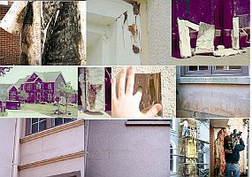 
The best & independent info source for history and damage of the EIFS-scam - **EIFSFACTS.ORG!!!**](http://www.hadd.com/eifs/index.htm)

[Ed McClure & Beau Brincefield: Time bomb EIFS/EWIS/ETICS - Homeowners with EIFS report serious problems with moisture penetrating and accumulating behind the EIFS](http://www.brincefield.com/publications/gr_eifs.php) 
[EIFS/ETICS/EWIS damage syndrome - Moisture Accumulation In The Wall Cavity, Wood Damage by Dry Rot, Pest Infestation, Carpenter Ants, Termites, Mold growth](http://www.njeifs.com/lawyer-attorney-1033443.html) 
[ EIFS Scam / Hoax / Fraud Backgrounder - A Look at Exterior Insulation and Finish Systems - Termites, dry rot, mold & pest infestation](http://www.usinspect.com/residential/resource-center-be-renamed/house-facts/hot-topics-inspection-and-real-estate-industrie-11) 
[Douglas Pencille: EIFS/ETICS/EWIS - The Facts](http://www.dspinspections.com/eifs_facts.htm) [American Institute of Architects (AIA) found high moisture levels in 90% EIFS houses tested](http://www.usinspect.com/resources-for-you/house-facts/basic-components-and-systems-home/synthetic-stucco-eifs/eifs-timeline) 

[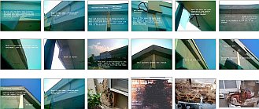 
EIFS/ETICS/EWIS-Damage Documentation in US](https://picasaweb.google.com/116782714729786277513/TheirWork?feat=flashslideshow##) by [Rob Santana](http://activerain.com/blogs/eifs101?page=2) 
[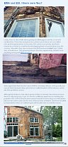 
US-EIFS Scam and horrible Damages](http://eifs.blogspot.com/2005/10/eima-and-edi-where-were-they.html) by [EIFS Blogspot](http://www.eifs.blogspot.com/)

 
This diagram points the consumption of energy to heating rooms with different constructions of their walls. The Rth-value (= k-value) without any sense as benchmark, gauge, norm, touchstone, scale or criterion for thermal barrier and effect I. Research from the Fraunhofer-Institut in the winter 1983. x-axis: k-value of the wall construction; y-axis: Consumed Watt of heat energy in the measured time. Purple and red: Thermal insulation with 23 and 10 cm polystyrene. Green: Only brick.

 And here an excerpt of an expert opinion /report / statement done for the owner of a residential apartment in a skyscraper in Southern Germany (Translation by Google, still in improvement): 

## The swindle with thermal insulation and energy saving

### An advisory opinion (excerpts)

Address Lawyer

Address Client, ./. condominium owners of residential apartments regarding the resolution contestation (Beschlussanfechtung)

**Short statement to the planned facade repair**

1. Client: 

2. Ground of the short statement

The statement is done as argumentation support for the resolution contestation against the planned facade repair in ... with an external thermal insulation composite system (ETICS)/exterior insulation finishing system (EIFS).

3. Building specification

The messuage in ... is a multistoried building with eight floors and 32 living apartments, built in reinforced concrete skeleton construction. It was established approx. 1965.

4. Building construction front

The reinforced concrete construction is up from the 2nd floor coated with asbestos cement panels (Eternit sheets) on thermo-insulating magnesite-bound woodwool boards (Heraklith).

5. “Thermal insulation” of the fronts

5.1 Planned measures

According to planning of architect ... after strapping off the Heraklith panels the fronts will be coated with 14 cm thick expanded polystyrene boards (fabricate ... on base of Neopor®, with graphite added) on adhesive mortar, whereupon a synthetic resin plaster is coated, reinforced by embedded synthetic netas armouring against temperature stresses (temperature extension of polystyrene: 8 mm/m x 100 K, reinforced concrete and cemtent plaster: 1,2 (!) mm/m x 100 K). As surface layer of the so-called extern thermal insulation composite system (ETICS)/External Wall Insulation System (EWIS)/Exterior Insulation Finishing System (EIFS) thereby a coating equipped with pesticides (algicides, fungicides).

The original wooden windows shall be exchanged against airtight and extremely dense plastic framed insulating glass windows.

To what extent the substantial shape change would be acceptable by the planned coating measures with adequate appreciation of the aesthetical interests, is not subject to the evaluation of the signer.

5.2 Evaluation of the polystyrene coating in build-constructional regard

The extern thermal insulation composite system (ETICS) with imbedded graphite powder in order to reduce the penetration of radiant heat through the facade is a lightweight construction system with very small heat storage capacity. In contrast to a solid wall surface the radiation exchange of a lightweight construction with the cold night sky leads to a short time lose of the heat taken up during the day by diffuse and direct solar radiation. While solid surfaces even at longer frost periods very seldom drop under the outside temperature, [on the very cooler surfaces of insulating layers condensation will wet up the surface nearly every night](2133bau.md) and will occasionally freeze and destroy the facade. You can proof this by yourself, only use a IR-Thermometer

 

_Illustration: Frozen and algae infestated / affected ETICS/EWIS/EIFS coating_

The temperature reduction of the surface under the temperature of cooling down night air favours the dampf condensing on and in the coating system. Air humidity penetrates behind the diffusion-open coating and condenses in the cooler internal area of the coating system.

A further humidification of the insulating material occurs in connection with the mentioned large temperature strain of the insulating material system. The substantial temperature strains of the system lead after some time despite the constructional counter measures (reinforcing) - according to experience - to cracks in the coating system. The cracks forming in the Coating work capillary-actively and aspirate rain water.

As the coating system does not permit considerable capillary drying process, a substantial risk of drenching and soaking of the system is connected by condensate admission and at longer term unalterable cracking at the surface.

In order to decrease the big risk of the fungi / mold and algae infestation, the synthetic and thus dry-blocking paint for the coating is equipped by added toxic algizides and fungicides (after manufacturer data: A compounded mixture from Carbendazim, Terbutryn and Octylisothiazolinon), which are out washable by spray irrigation after dismantling of the water-rejecting / hydrophobe substances first and so on longer sight their defense effect fades out.

The ETICS blocks substantial parts of the solar radiation into the solid construction behind. The graphite imbedding in the insulating material also increases the need of heat energy in the winter by decreasing the solar radiation into the front.

As result the whole facade system will suck up condensate and will be damped. This wetting effects are connected with more and more damage of the reinforced concrete by corrosion. As the ETICS/EWIS/EIFIS facade construction takes up less solar warmth, this cooling effect will lead to increased heating costs.

A gradual drenching of the entire facade system with the following mold fungus risk in the interiors probably is followed by the planned installation of the new air tight plastic windows.

Altogether in a long-term view the outside changes by coatings with insulants will cause unfavorable consequences not only for the facade system but also for the heating energy consumption and the healthy dwelling.

The inclination of dampness storage and formation of mould in insulating materials is shown also by old mineral wool insulations in roof structures. They show the black-grey discolorations typical for it which starts from the boundary region to the timber construction. Not only condensate from room air is stored, but also the self-dampness from the timber wood.

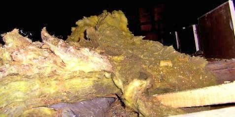

_Mouldy mineral wool in an attic_

5.3 Evaluation of the polystyrene coating in energetic regard

5.3.1 Preface

After usual viewpoint a thermal insulation system shall lead to smaller heating costs. This contradicts however the following specified facts.

5.3.2 The Rth-value/heat conduction / thermal conductivity term as hyperbolic function

The Rth-value is a hyperbolic function and is calculated: Rth = 1:1/a i \+ 1/L + 1/a A (W/m ² K)

From it results:

Thickness of insulating material and the improvement of Rth-value in (W/m²K) 

5 cm 0,8

10 cm 0.4 50%

20 cm 0.2 50%

A duplication of the expenditure halved therefore the effect, with rising insulating material thickness decreases the efficiency.

As diagram that shows up as follows, the indicated k-value is identical to the today valid Rth-value:

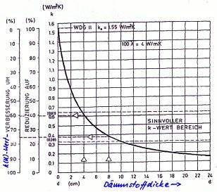

_The hyperbolic function of the R th-value. The efficiency border is with approx. 6-8 cm thickness of insulating material (source: Professor Dr.-Ing. Claus Meier, Richtig Bauen, 4. Edition, expert verlag 2007)._

As consequence higher thicknesses of insulating material cannot be realized as in the given case with 14 cm under economic criteria.

5.3.3 Relevance of the heat conduction /thermal conductivity

A substantial result of a critical view on insulating projects in the reality is that the typical insulating materials without heat storing capacity in opposite to the solid construction materials have not a remarkable insulating effect at the front. They shadow the solid wall behind and thus diminish the storing of sun energy by solar radiation.

This corresponds also with the results of measurement the Fraunhofer institute to comparative constructions of different k and/or Rth-values of the external walls (data source: Fraunhofer Institut for building physics, 1983).

The area with allegedly bad k-/Rth-value needs the smallest heating energy for the same ambient temperature according to the result of measurement:

The fact that the real thermal behavior of materials does not agree the calculation formulas on basis of the Rth-values, under the conditions of practice with, could be approved by a newer investigation of the federal research institute for agriculture FAL, institut for operating technology and building research under Professor Dr.-Ing. Franz Josef Bockisch over an entire yearly duration at an experimental construction.

Here a result of the measurement in August:

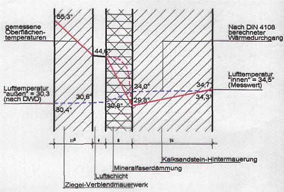

Red (line curve) the measured values, blue (broken) the standard arithmetic procedures (source: FAL, Dipl.-Ing. Karl William Haake)

The undercooling of the outside inner wall in relation to the external layers and condensation susceptibility by dampness admission from outside air is clearly shown here.

Likewise as result of the FAL research here an excerpt from the February curve with representation of the measured temperature gradients at the different front directions.

The substantial temperatures at the front surfaces (bricks) prevent by heat storing effects the cooling and condensing under the night air temperature (blue: air temperature in accordance withGerman weather service station on testing grounds) and thus the condensate admission :

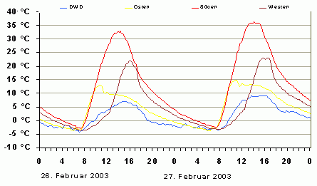

The futile insulating attempts at large buildings are shown by Professor Jens Fehrenberg, University Hildesheim, by comparing the energy consumption of neighbouring apartments with approx. 25 dwellings before and after insulating over many years.

In addition the external wall is involved only with 10 to 20% in the loss of energy of buildings, so that improvements made here can have only marginal effect on total energy consumption.

See for this the contribution of Professor Fehrenberg in: Deutsches Nationalkomitte Denkmalschutz (German national committee for monument protection) DNfD (Hrsg.): “Energieeinsparung bei Baudenkmälern (Energy saving at architectural monuments)”, documentation of the conference of the DNfD from 19.3.02 in Bonn, volume 67.

The first diagram which is based on it shows the heating costs of the three blocks of flats at Tollenbrink in Hanover, determined by Professor Fehrenberg. 

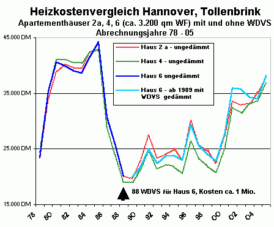

The actual heating costs of the house 6 before and after insulation by an ETICS remain in the same range as the not insulated apartment houses No. 2a and 4:

With the following diagram Professor Fehrenberg shows the influence of the energy consumption at three large's buildings in Hanover only by the average temperature of the heating season. The accomplished thermal insulating measures with ETICS (entry “San.”) have therefore no remarkable influence on heating consumption:

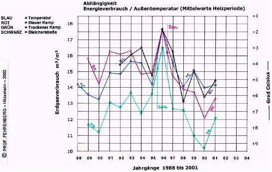

Also the investigations of the civil engineers Wichmann/Varsek at the Justus-Knecht-Gymnasium in Bruchsal prove the real conditions of heat consumption of a solid brick masonry wall in winter (February). Therefore temperatures up to 30 °C result in the case of an outside temperature of approx. 8 °C by consumpted solar radiation on the solid surface. By the nocturnal heat emission the temperature of the solid wall drops again, remains however always substantially over the outside temperature and remains condensate-free thereby.

The following illustration shows the result of measurement:

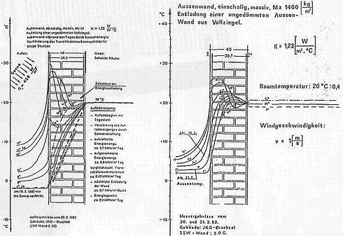

Source of picture: Rationeller Bauen, February 1983

5.3.4 Economy of an auxiliary insulation of the front

The last yearly consumption of the heating serves as basis of an economic evaluation of the planned energy saving measures by window exchange and auxiliary thermal insulation. Thus the future heating energy consumption of the building and the saving potential as return of investment (ROI) for the building costs can be estimated.

The average annual consumption (2003, 2005, 2006) of 14,03 litres oil/square meter and a fuel oil price of 0,4 EUR/liter will cause yearly costs of 16.524,22 EUR. Assumed a saving of (unrealistic) 40 per cent by the planned energy saving measures, this results in an annual saving of 6.609,69 EUR.

Thus the costs for energy saving measures are limited to maximally 79.316,26 EUR in the case of a usual MNV (Mehrkosten-Nutzen-Verältnis, extra costs/effects relation) of 12. The planned energy saving measures with total costs from far over 400.000 EUR are thereby extremely wasting invest capital.

Also if KfW credits / loans / subsidies for the front repair and the energy saving measures are given and the results for the total costs and energy savings are calculated correctly the whole calculation will never end in an economic solution.

Result: After the vouchers specified here it gives as well as no energy saving by Rth-optimized insulating coatings on solid fronts. Regarding the cost situation the planned energy savings investments will not give a good return and will never be profitable.

6. Fire protection

Despite the insulating materials coming to use are equipped by toxic flame retardants and of low flammability, with reaching of the ignition temperature by external influences they heavily increase the fire risk. An example of an explosive ETICS fire out “Schadensbilde Aktuell / fire damages up-to-date” of the Bavarian Fire insurance chamber may clarify that, also in Berlin in the meantime such cases of fire damage become known:

8. Further references

The references and evaluations given here are based on my practical project experiences in the building renovation since 1979 as well as on consulting of relevant project and research documentations. 

The references follow the proven methods and not necessarily the industriallaterally affected and not always DIN standards and other alleged rules of the technology applicable for the building renovation.

To the group of topics altogether I recommend supplementing my info pages on [www.konrad-fischer-info.de/213baust.htm](213baust.md), [... /7fehrtab.htm](7fehrtab.md), and [.../7waefe.htm](7waefe.md), in each case with following pages.

Dipl.-Ing. Konrad Fischer, Architect BYAK

responsible Expert in accordance with ZVEnEV/AVEn 

**The Thermography-Hoax**

 
Original text under the picture: _"A thermal imaging of the front proves large losses of the heat. Measurement at temperature outside 10 oC, still wind and unknown temperature in the room. A cause for the visible loss of the heat is that the window is implemented in solid masonry." From the Danish newspaper _Byg Tek (Building Technology) 25.10.04 of journalist Michael Rughede.

However, that's only advertisement of the international chemical industry and the manufacturers of non energy conserving but wasting insulating material for dummies. What you must konw: The producers 'can' be connected financially and by splendid gifts with 'some' engineers, architects, craftsmen, scientists, officials of the state, politicians and media. They all want to sell airtight houses and maximum thermal insulation to you to fill their purse with good percentages.

The picture shows only the radiation of the heat from the surface of the solid wall at 12 o'clock. The warmth comes here only from the sun. In the south the wall radiates much and red, in the west radiates the wall only little and blue - green cold.

 
Another crazy infrared scanning: Insulated wall blue (could not store the solar energy!), the wooden shutters before (!) are radiating heat instead - like the solid walls of the not insulated parts of the front (Image source: Insulation prop at "www.pr-nord.de/stoo_text155.html" - Notice: The profs use anglizationed terms to fake the huge mass of stupid Germans).

The infrared scanning to detect heating losses from houses and heat leaking is another bad hoax of the so called well, no, better super best reputated 'House Inspectors'. Naturally this famous and totally serious guys are creeping around your house just in the early morning, taking their scans when sundown has happened. Then the thermal insulation has cooled off quickly and the bricks and other solid materials will still radiate the huge amount of solar energy they stored during daylight the whole night. A silly fake and best junk science just for you and your purse. Throw away your money with such jokes, it's yours, not mine. More enlightenment! It's really necessary to conserve real energy ...

- [**The Room Envelope Heating System - Properly or Risky Heating** (in english)](heating.md) - Heated air or warm walls? 
 The usual convector heater: Hot air heats. Head hot - feet cold. 
A dusty typhoon in the room or zero wind? Predominantly heat distribution by desert storm air? Convective heat transfer or radiated heat? Much or little consumption of energy? Asthmatic children, flu in each winter by wrong heating? Condensate and mold fungus at the cold walls - or gentle heat radiation from the surfaces of the room? The energy saving heating with thermal radiation needs little technology. Always dry constructions and houses, healthy, cool and pure room air are the result. 
 Radiant warmth is heating by infrared thermal radiation. 
The room air is a little bit cooler than the surface of the room. No airtight hermetic isolation of the rooms, no senseless thermal insulation from expensively packed air in soaked building materials, no condensate into cold surfaces. Much information about the disadvantages of many kilometers of heating pipes in the floor and behind the plaster in the walls, the problems of baseboard heating, also about the better alternatives. Here one of many examples of the cheap and well preserving heating with radiant heat: [ Veitshoechheim Palace with thermal radiation heating (english version)](heating.md)

- Poisoned wood protection and innocuous natural [wood preservation](23bau16.md) against destructive mushrooms / fungi, dry rot (Meruliporia incrassata; Merulius domesticus Falck; Serpula lacrymans; house eating fungus) and insects (wood worm, termites, gnawing beetle like House Longhorn Beetle / Old house borer beetle (Hylotropes/Hylotrupes bajulus), Deathwatch beetle (Xestobium rufuvillosum), Furniture Beetle (Annobium punctatum) & Wharf borer, Weevils (wood boring weevil, Euophryum cofine), Powder Post Beetle (Lyctus brunneus), Millipedes (Diplopoda), Powder-post Beetles (Lyctidae), False Powder-post Beetles (Bostrichidae), Flathead Borers (Buprestidae) ...), also for the durable care of weathered wooden constructions outside as for example terraces, balconies, landing stages, bridges ... 

 
Weather and wood with poisonous protection.

- [Problems regarding the old and new windows and the coating](23bausto.md) - with manytechnical explanations. Old windows and new synthetic resin coating after one year.

 Electromagnetic waves and glass 
 A diagram of Professor Dr.-Ing. habil. Claus Meier: Window pane glass is not permeable for the wavelengths of the shortwave UV radiation (< 0.3 µm) and longwave electromagnetic IR radiation (infrared radiant heat > 2.7 µm). So the biggest heat transfer mechanism through windows is never (!) radiation Only the wavelengths of light can penetrate glass. Therefore you can get sunshine in the room and fire protection from fire resistant glass. The light of the fire is visible, the heat of the fire can not penetrate. Glass is opaque to IR-waves. Therefore lenses for IR-cameras must be made not by glass but by IR-permeable materials like zinc selenide or sapphire.

The electromagnetic waves of the light which come in your room through your windows will be absorbed by the inside materials and emitted in the infrared wavelength. Light can heat your room. X-axis: Wavelength and transparency of the window panes. Y-axis: Intensity of the radiation. The heat is transported predominantly in materials by radiant heat (phonons, migration of the electrons). Two window panes filter more free solar energy than one. Double glazed windows will force condensation in the wall. Sealed windows increase the dampness in the room air. This increases the energy consumption for the heating. Therefore modern windows will increase energy consumption and mold attack. Energy conserving must look to traditional building methods of the historic buildings. Look to your poor neighbour's hut and similiar original buildings in the open air house museum. They show intelligence of experienced craftsman instead of worst practise of nowadays modernists. Enlightenment! 

 
[The Neuenburg castle](http://www.schloss-neuenburg.de/) in Saxonia-Anhalt. 
Planning of the restoration (architecture, construction, civil engineering / technology: Water, waste water, heating, ventilation): 
Konrad Fischer and staff employees. 
([German information: Neuenburg Castle Museum](http://www.schloss-neuenburg.de) [English information of E. Kane: www.roadstoruins.com/neuenburg.html)](http://web.archive.org/web/20120220161824/http://www.roadstoruins.com/neuenburg.html)

- My english lecture in a RILEM seminar 'Characterisation of old mortars with respect to their repair - Historic Mortars - Characteristics and Tests', University of Paisley, Scotland, May 1999: 🇬🇧 **'Traditional Craftsmanship in Modern Mortars - Does it Work in Practice?'**](2rilem.md) (English🇬🇧) 
🇬🇧 My **[sketches](2rilskz.md)** of the RILEM excursion to Stirling Castle and the historic kilns in Charlestown Fife, to Glasgow and other places. 🇬🇧

 
Cistercians abbey [Waldsassen](http://www.waldsassen.de) 
The front we did repair with pure hydrated caustic (not hydraulic!!) lime mortar and lime-casein-wash. Cheaper and better than destroying methods based on cement, synthetics or soluble glass / potassium (potash) silicates.

- [Decay of concrete and cement](2beton.md) - Rusty corroded and decayed reinforced concrete - example from Bofill's 'Antigone', the socialists experimental suburb in Montpellier, France. Typical situationof synthetical joint fillers after few years of weathering. The disaster with the constructions and building materials of the modern architecture, which destroy themselves. Wrong and correct repair of rusty constructions of reinforced concrete.

-  **[The author / Reference](1refernz.md)** - my biography, references to some projects since 1979 (> 400), [official reference testimonials](1mader.md). Note: A click on my picture will download a 2,8MBwmv sample of playing me cello in the Christmas Oratory from J. S. Bach, conducted by Marius Popp 2005 in Kronach (the city of Lucas Cranach)

- **[Building materials](2baustof.md)** - The problems of the modern structural systems. They can damage the old house and its inhabitants. There are alternatives. 

 
['The experiment of Lichtenfels'](2139bau.md): Increase of the temperature under different building materials / insulating materials (4 cm) after 10 minutes of irradiation with a red light lamp. The materials from above: Mineral wool, polystyrene, foamed glass, clay brick, wood fiber, gypsum cardboard, pine wood. x-axis: Time of the irradiation. y-axis: Temperature in °Celsius.

Note: The Rth-values/U-values (= "U") are not common with the changes of the temperature and the practical effect of the thermal insulation. The crazy joke: The experts of R-values define their results without any regard of the time and amount of heating energy in the proof before they start measuring. Heavy materials suck up and store huge amounts of energy. Therefore they can lose much more energy than air filled insulation. Some experts neglect the free daily energy radiation outside the building from the sun and the surroundings in their dark laboratory and soul too. Think about it, then you will detect the reality even if you are no doctor and only a normal stupid guy.

Porous material like modern light bricks, aerated concrete, industrial or ecological thermal insulation are technically very problematic. Mostly they prevent the capillary drainage of the materials by totally or partly lack of capillary activity _and_ with synthetic coatings, what causes severe problems of wetness and moisture storing: The capillary pores of the materials are densed and sealed / 'insealated' by synthetic coatings. The transport of water in materials by capillarity and by diffusion relates 1000 : 1! So if the capillary activity is blocked, the materials will never get out the dampness and moisture. And in the case of front insulation this materials store every night much water in by condensate: The lightweight materials have not any sufficient storing / store capacity for the daily solar radiation and energy.So they are cooling very quickly by radiation change with the icy heaven after sundown. And start to suck condensate from the cooling air outside during the whole night. Many insulating materials are toxified and threaten the health with terrible poisons such as boron salt, fungicide, pesticide, insecticide, algicide. Mineral wool, PUR (Polyurethane), expanded or extruded polystyrene, poly-icynene (open-cell polyurethane) sprayed-in spongy foam, polyester, fibre glass / fiberglass, foamed glass or wood fiber, cementitious foams, perlite insulation, sheep wool, cotton or cellulose wool, hemp fiber or hemp wool, linen fiber, coco fiber, seaweed, sea-grass, light loam, vermiculite - a naturally occurring mineral that may contain asbestos fibres!, wood wool, newsprint recycling, cellulose flakes blown-in and sprayed cellulose are only some typical products for failed thermal insulation which must be wet after more or less time. They give no better thermal insulation than the traditional solid building materials like wood, brick and natural stone. An additional front insulation will increase the heat consumption: by shadowing the wall behind. And all the poisoning and sealing of the insulating materials will not help against humidity problems. This materials store humidity and condensate. That makes the mold fungi like black mold, dry rot, mildew and mites, also lice, ants and beetles, mice and rats very lucky. As soon as the cruel condensate has defeated the synthetic foils, the parasites will come! Besides fiberglass and similar insulation materials can cause severe itching, inflammation and other harms. The clever homeowner should not trust too much in all the computations of the theoretical thermal conduction / conductivity. Consider the sun power by solar radiation. Enlightenment!

Information to lime, brick, mortar and masonry: 
- [Mortar from lime and its improvement](2kalk.md) 
- [The restoration of plaster and painting on historic fronts - problems and solutions](22bausto.md) 
- [The most frequent errors with the use of mortar, plaster and paint of lime](2kalkfel.md) 
- [Renovation mortar systems according to WTA - a harmful and risky alternative for salty and damp walls](2sanipuz.md) (see image on the left, where this mortar system failed twice) 
- [ Lime mortar of lime](26bausto.md) 
- [Plaster and mortar from lime at the ancient building](2prokalk.md) 
- [Building materials for walls and masonry in the comparison - with many interesting and rare building material tables](29bau09.md) - Important information for building in warm, hot, cool and cold, dry and damp regions. Problems of modern building materials for restoration, which age by changing temperatures and dampness very fast and which thereby destroy historical substance. Notice: Cement mortar is not permeable for water, so water is trapped in the walls. Once saturated, the wall begins to erode.

 .  
Baroque half-timbered framework house before and after repair with traditional and economical technology, planning: Architect and engineer Konrad Fischer and employees

- **[Careful and tender restoration and preservation](11erhins.md)** - How to repair and restore the old buildings and constructions with traditional, innovative, sensitive, reversible and economical methods. In contrast to modern methods, which find the way to the old house by beautiful gifts of the industry to the staff for planning (professors, restorers, curators, architect, engineers) and damage it after some years. How were the historic buildings constructed, how the modern ones? In former times: Masonry and walls from stone (natural stone, break stone, brick and half-timbered framework). The plaster only with mortar of sand and lime. The coating a paint of lime and of natural oil. Everything to repair well. Today: Terrible brutalities from reinforced concrete, rusty iron, lime sand brick, plastics, porous bricks and insulation of foams and fibers. Everything badly to repair.

- **[Economy and restoration](5wiber.md)** and **[Financing](5finanz.md)** - Economic and financial questions concerning the repair of old buildings.

[Kloster Reichenstein](http://www.kloster-reichenstein.de) - Fundraising-Video 
[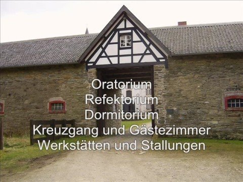](https://www.youtube.com/watch?v=f6dYKbW1VaA)

- If you need some more consultation: 250 EUR for the detailed answer to 1-3 questions by e-mail, 500 EUR for 4-10 questions, local consultation: 150 EUR for each hour of the consultation and the time of travel. Additional the costs of the travel. I will submit an offer if you want. [Payment (Bank Account)](11form.md#kto) in advance with the commissioning, for local consultations 70 %. You know why. Is this too much for saving a lot of money and misfortune during the restoration? You must decide. Please send me some pictures of the problems and the construction of your house with your questions and the voucher of payment, my answers will follow as soon as possible. More details in german language and my e-mail-adress here: [Consultation](2berat.md). There are pictures of references too. If you want to book me for a Restoration/Preservation/Conservation Lecture/Seminar ([example](12akt.md#sida))- contact me by e-mail or telephone. Examples: [Many Questions and Answers FAQ](2frag.md)

Naturally I know that you are very cautious by spending your money. Me too! Your alternatives: You get any advice everywhere. You know the forum intelligence in the InterNet. Please try it, I wish you much luck! Two consultants, three solutions, four disasters. Wisdom of the industry behind, experienced craftsmen, super intelligent experts, DO-IT-Yourself, pensioner, curious neighbours, unemployed technicians, academic theoreticians, physicists, beginners, the very clever uncle and aunt. Isn't it?

That was it for today, I wish you much success! Or save all your money, let your house age in dignity and enjoy more holidays and expensive red wines.

Good-bye and come back soon!!!

(Also keep in mind your friends, which don't know these information ...)

---

Here you'll find some of my (maybe) english answers in the US/UK-forums/boards: 
[Internal walls - solid granite - lime plastering ?](http://web.archive.org/web/20060816062527/http://www.newbuilder.co.uk/forum/index.php?DATEIN=tpc_kakurkhjj_1130348948) 
[Damp exterior wall](http://web.archive.org/web/20071107071153/http://www.newbuilder.co.uk/forum/index.php?DATEIN=tpc_otdqulojp_1131921006) 
[Internal walls - solid granite - lime plastering ?](http://web.archive.org/web/20071023082343/http://www.newbuilder.co.uk/forum/index.php?DATEIN=tpc_kakurkhjj_1130348948&showpage=2) 
[Insulation 1880's cavity wall](http://web.archive.org/web/20071023015037/http://www.newbuilder.co.uk/forum/index.php?DATEIN=tpc_togqvggyu_1132232512) 
[How to reduce Cold Bridging between timbers](http://web.archive.org/web/20071023081557/http://www.newbuilder.co.uk/forum/index.php?DATEIN=tpc_ejyzqalci_1133806010) 
[Damp Crisis](http://www.themovechannel.com/forum/fb.asp?m=2418) 
[Reflectix Radiant Barrier residential remodel - DoItYourself.com](http://forum.doityourself.com/showthread.php?t=242676) 
[Electro-osmosis to cure rising damp?](http://www.bricksandbrass.co.uk/phpbb2/viewtopic.php?t=485) 
[Damp Survey](http://www.bricksandbrass.co.uk/phpbb2/viewtopic.php?t=451) 
[Insulation v thermal mass same or different?](http://web.archive.org/web/20071107152355/http://www.newbuilder.co.uk/forum/index.php?DATEIN=tpc_vwtjabssg_1132570512) 
[Insulation](http://web.archive.org/web/20080531034153/http://www.newbuilder.co.uk/forum/index.php?DATEIN=tpc_foasiotbx_1115316673) 
[Do it yourself: Styrofoam blown-in insulation](http://forum.doityourself.com/showthread.php?s=92f7a5a413b67298812eeee3a34c827f&t=242255) 
[R-13 fiberglass in basement may have mold](http://forum.doityourself.com/showthread.php?s=92f7a5a413b67298812eeee3a34c827f&t=241879) 
[Black Insulation in Walls](http://forum.doityourself.com/showthread.php?s=92f7a5a413b67298812eeee3a34c827f&t=242103) 
[Insulating an existing ceiling](http://forum.doityourself.com/showthread.php?s=92f7a5a413b67298812eeee3a34c827f&t=241227) 
[Reflectix Radiant Barrier residential remodel](http://forum.doityourself.com/showthread.php?s=92f7a5a413b67298812eeee3a34c827f&t=242676) 
[Insulating my basement. Is my plan too simple?](http://forum.doityourself.com/showthread.php?t=241279) 
[Insulating my basement. Is my plan too simple?](http://forum.doityourself.com/showthread.php?t=241279) 
[No insulation at all](http://forum.doityourself.com/showthread.php?s=92f7a5a413b67298812eeee3a34c827f&t=241462) 
[Attic insulated on roof rafters](http://forum.doityourself.com/showthread.php?s=92f7a5a413b67298812eeee3a34c827f&t=242594) 
[Least expensive pole barn insulation](http://forum.doityourself.com/showthread.php?s=92f7a5a413b67298812eeee3a34c827f&t=237752) 
[Another basement insulation question](http://forum.doityourself.com/showthread.php?s=92f7a5a413b67298812eeee3a34c827f&t=241049) 
[Attic loose fill insulation and knob & tube wiring](http://forum.doityourself.com/showthread.php?s=92f7a5a413b67298812eeee3a34c827f&t=241068) 
[Basement Waterproofing-Foundation Failure etc](http://web.archive.org/web/20060303181327/http://boards.hgtvpro.com/groupee/forums/a/tpc/f/2891014781/m/1941093732/r/6731047842) 
[ROOF INSULATION](http://web.archive.org/web/20111005012919/http://boards.hgtvpro.com/eve/forums/a/tpc/f/9001020091/m/3511002542?r=9421024942#9421024942#9421024942) 
[Cellulose Insulation](http://web.archive.org/web/20111005012925/http://boards.hgtvpro.com/eve/forums/a/tpc/f/9001020091/m/8931026642?r=9751056842) 

---

Special hyperlinks: 

[Damp and Timber Problems - Independent Surveyor - www.pdoyle.net](http://www.pdoyle.net/) 
Independent surveyor's site for Damp and Timber problems in Yorkshire and surrounding counties

[Biff Vernon](http://www.biffvernon.freeserve.co.uk/) - Maker of traditional and double-glazed oak windows: 
[Tithe Farm Oak Works](http://www.biffvernon.freeserve.co.uk/oak_works.htm) [ Oak Windows at Tithe Farm](http://www.biffvernon.freeserve.co.uk/oak_windows.htm) [Oak and Stained Glass Doors](http://www.biffvernon.freeserve.co.uk/oak_and_stained_glass_doors.htm) 
[www.biffvernon.freeserve.co.uk](http://www.biffvernon.freeserve.co.uk/) - AI The Great North Road/Tithe Farm Bed & Breakfast/Dutch Bikes at Tithe Farm 
[www.biffvernon.freeserve.co.uk/lime.htm](http://www.biffvernon.freeserve.co.uk/lime.htm) - Lime: 
'This is another Great Conspiracy. 
Houses used to be built with lime mortar. 
This has been going on for a couple of thousand years at least. 
It works. 
Then, in the 20th century, builders stopped using it. 
They forgot how to use it, or died. 
Young builders never learnt. ...' [Read more](http://www.biffvernon.freeserve.co.uk/lime.htm)

---

[www.roadstoruins.com/](http://www.roadstoruins.com/) <> [Pool Pumps](http://www.1st-direct.com/pumps-filters.htm) 
Search:[Business-Inc.Net](http://www.business-inc.net/) - web directory 

---

Questions and Answers 

_Dear Konrad, 
I am a first time home buyer with a 1890 Colonial home. My first project will be to finish the attic into a master bedroom/bath with cathedral ceiling.I've been researching insulation online and found your comments very interesting. Right now my leading option is Icynene spray which is air sealed.What do you recommend? Pine boards with no insulation? 
Best, 
X.Y._ 

Dear X., 
Regarding the questions of insulation a lot of errors are widely spread. The common: lightweight 'insulation products' can insulate or reduce the transport of heat energy through materials. The truth: they can't. Energy transport is a flux of energy, nearly like water. Who would build dams with porous sponge? No one. So, why should we do this building dams against energy flux and losses? It makes no sense despite all the hoax of Rth-values. 
Our ancestors knew to build correct: lightweight tents (with perfect airation and drying) for mobile dwellings, stabile and solid buildings of wood, adobe, brick and stone for longer lasting ones. Why shall we look for other ways? Because the industrial lobbies of poorly built lightweight prefab-houses will enforce our administration and the building branche, to overwhelm the traditional building systems. The chemical industries, badly educated planners and craftsmen are their willing partners. That's the only reason. 
Back to your question: Yes, solid pine (also gypsum materials) works quite good as insulation against heat losses. But why? The heat will force the huge water content in the wood to transform into damp. This will induce a cooling effect on the heated surface. The amount of water is bigger in wood than in brick. So the cooling effect of damp out of materials is a little bit higher than otherwise the perfect insulating storing effect of the dry masonry. See the graphs of the "Lichtenfelser Experiment" above, more info you can find [here (in German)](2139bau.md). 
Insulating bath and bedrooms has two main problems - keeping the heat inside and transporting the damp outside. The second problem is a bigger one. Your construction must solve this. So no dampproof foils, no hermetic and air tight room construction, enough damp storing surfaces. Beneath, solid wood has a certain weight, your beams must stand this. To make a correct order of the construction layers is worth to think about in every case. It depends from statics, durable airing by the windows, vents, radiant and convective heating etc. 
If you have understood the complex, there's always a solution. If you'll need some more help, you can take advantage of my consult for a minimal fee (see below). In this case you can send me some pics of your building construction of the attic, and than we'll look for a good construction. 
Best regards 
Konrad 

[Other English FAQs](2frag20.md)
