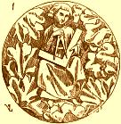
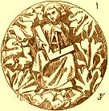
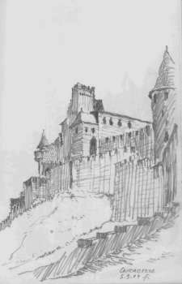
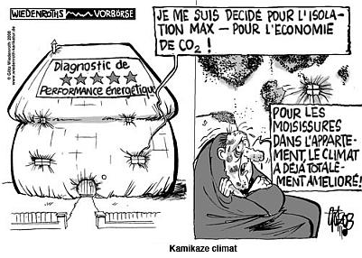

[🠔 Zur Übersicht: Roman & Balkan](roman.md)  
# Restauration de la Maison Ancienne + Conservation des Monuments 🇫🇷🇨🇦🇧🇪
**Conseils et aide pour les propriétaires d'anciens bâtiments et les mâitre d'œuvre de la rénovation et des maisons historiques**  
_von Konrad Fischer_

 Restauration de la Maison Ancienne + 
Conservation des Monuments 🇫🇷🇨🇦🇧🇪 

Le Journal d'Architecture et Construction historique et pratique

 **Conseils et aide pour les propriétaires d'anciens bâtiments et les mâitre d'œuvre de la rénovation et des maisons historiques** 

Pour ceux qui possedent ou envisage d'acheter un monument à caractère historique et d'y développer des activités privé ou publique, touristiques et culturelles 

Les erreurs habituelles + ce qui fonctionne vraiment 

 _"Le chapitre de Reims, après l'incendie qui, sous le règne de Louis XI, détruisit toutes les charpentes de la cathédrale et une partie des maçonneries supérieures, veut réparer le désastre; il fait comparaître devant lui chaque corps d'état: maçons, charpentiers, plombiers, serruriers, et il demande à chacun son avis, il adopte séparément chaque projet. Nous voyons aujourd'hui les résultats monstrueux de ce désordre. Ces restaurations, mal faites, sans liaison entre elles, hors de proportion avec les anciennes constructions, ces œuvres séparées, apportées les unes à côté des autres, ont détruit la belle harmonie de cette admirable église, et compromettent sa durée."_ 

[ Dictionnaire raisonné de l'architecture française du XIe au XVIe siècle - Tome 1, Architecte. Eugène Viollet-le-Duc, 1856](http://fr.wikisource.org/wiki/Dictionnaire_raisonné_de_l’architecture_française_du_XIe_au_XVIe_siècle) 
Dessin d'une des clefs de voûte du bas coté sud de l'église de Semur en Auxois représentant un architecte. 

---

Dipl.-Ing. Konrad Fischer, Architecte [BYAK](http://www.byak.de) \+ [Hauptstrasse 50](muehle.jpg) \+ 96272 [Hochstadt a. Main](http://www.hochstadt-main.de/) \+ Allemagne 
Tel.: +49 - *95 74 - 30 11 / Mob. +49 - *170 - 73 515 57 + Fax: +49 - *95 74 - 49 60 + [eMail](2berat.md#email) 
[Enquêtes](2berat.md) en française, allemande ou anglaise 

---

[ L'auteur dans la discussion en TV: l'effondrement des toits et des halls - CLIPwmv 3MB](mtvclip1.wmv) - Une [chronique scandaleuse](212bau2.md) \+ [Une critique ironique de la méthode de construction écologique et la maison bioclimatique](oekobau.md) (en allemand) 

Tu avais projeté l'achat d'une maison ancienne et envisagé sa rénovation ou son aménagement. Tes motivations profondes étaient évidemment et forcément d'ordre affectif. Et maintenant, qu'en est-il devenu de ton projet de restauration de cet antique bijou de pierre et de mortier? 

Où est-il resté, ton bel argent, investi dans l'oeuvre des grands maîtres de l'artisanat ou même vaillamment sacrifié sur l'autel du marronnage, du bricolage, de l'auto-éco-construction - la construction écolo-autonome - ou du travail au noir?

Aurais-tu peut-être dans ta baraque passive et écobioclimatique des problèmes de moisi? Redouterais-tu l'empoisonnement aux fongicides, aux alguicides, aux insecticides et au sel de bore? Les enfants toussent-ils? Souffrent-ils de dermatose, les yeux livides et lesdoigts bien bleus? 

Tout cela n'a pas lieu d'être, car l'alternative existe. Elle constitue même le thème principal du site que tu visites présentement.

Tu vas trouver sur les pages qui suivent des informations sur les questions et problèmes liés à la restauration, la réfection et l'isolation de vieux bâtiments ainsi que la protection et la conservation de monuments historiques. Quelques informations sont en allemand ainsi que dans d'autres langues (regarder aux [drapeaux](index.md)). 

Alors pourquoi présenter ce site en française? Étant de longue date vacancier habituel dans de nombreuses régions françaises, j'ai eu l'occasion d'y visiter d'intéressants projets de restauration du patrimoine culturel comme les forts, les châteaux, les églises et les anciens monastères, ainsi qu'un certain nombre de vieilles maisons tout à fait "ordinaires".

Ceci m'a permis d'élargir et d'approfondir mes vues dans le domaine de la conservation des monuments ainsi que sur les questions techniques et les méthodes habituelles de restauration de maisons ancestrales, le côté théorique et pratique de ce travail de récupération. Il en résulta le constat que - par delà les évidentes différences que l'on sait - de multiples problèmes se posent de la même manière qu'en Allemagne. Les fâcheuses conséquences d'un travail bâclé sont bien comparables partout. Que ce soit en Belgique ou même au Canada, les retombées désastreuses seront les mêmes pour les vieilles maisons, les bâtiments à valeur patrimoniale, les monuments historiques, autant que pour le bilan financier du maître d'ouvrage.

Des exemples? Cliquer les images pour d'édifiantes informations:

(1) +(2) +(3) +(4) +(5) +(6a) +(6b) +(7) +(8) +(9) +(10) +(11) +(12) +(13) +(14) +(15) +(16) +(17)

_**Explication d'image:** (1), (2), (3), (4): [Surfaces détruites et incrustation par un fixation silicatique et des peintures de la même façon](22bausto.md); (5) [Moisissure dans la salle de bains](moisissure.md) - [en anglais](7mould.md); (6a) [L'humidité ne s'élève pas](2aufstfe.md) - [en anglais](2auffen.md) (6b) [Efflorescence du sel après isolation horizontale et "l'assèchement" du vieux bâtiment historique" avec un injection salifère](2aufstfe.md); (7) [Algues sur une isolation thermique devant la façade](213baust.md), de: [Bautenschutz+Bausanierung, Zeitschrift für Bauinstandhaltung und Denkmalpflege](http://www.bautenschutz-bausanierung.de), Januar 2002, Photographe: Hochschule Wismar; (8) [Isolation thermique humide dans le préjardin](7wsvoant.md), de: "Bauhandwerk mit Bausanierung 2/01", Photographe: Helmut Pätzold; (9) [Isolation thermique humide dehors et moisissures à l'intérieur](7poly.md); (10) [Isolation thermique explosée et brûlée](6brand.md), de: "Schadensbilder aktuell", Bayerische Brandversicherung München; (11) [Mortier de ciment - de la maçonnerie et humidité](29bau09.md); (12) [Ciment et pierre naturelle - un melangé trés dangereux et une methode de restauration criminelle](29bausto.md); (13) [Efflorescence de mortier sur la façade nouvelle](29bau02.md); (14) [Peinture synthétique sur la façade historique](22bausto.md); (15) [Peinture synthétique sur une fenêtre](23bau08.md); (16) [Peinture synthétique sur une clôture](23bau08.md); (17) [Technique de fenêtre aujourd'hui](23bausto.md)_

Konrad Fischer: Fassaden energetisch richtig und kostensparend sanieren und trockenlegen 1 

[Teil 2](http://www.youtube.com/watch?v=Y1NSxAW15Cc) [Teil 3](http://www.youtube.com/watch?v=RAT7VzBo8k0) [Teil 4](http://www.youtube.com/watch?v=6TBII25iVQk) [Teil 5](http://www.youtube.com/watch?v=Kb0C4KiZvVA) 

Sur toutes mes pages, il y a beaucoup d'informations techniques, utiles et partiellement aussi de manière controversée pour la restauration et réhabilitation, pour la “maison écoclimatique„, “bioclimatique„ et sain sans les materiaux fongicides, alguecides et insecticides toxique comme le sel de bore, la perméthrine, l'hexaflumoron, la diflubenzuron et autres contre des parasites des bois, xylophages, moissisures, algues, etc.

 

Il y a les thèmes suivants en allemand: La restauration et la conservation, l'inspection et l'exploration du vieux bâtiment de manière technique et historique, l'archéologie, du matériau pour l'ancienne construction comme des briques, des pierres naturelle et la chaux, le traitement de chaux pour bâtir, le traitement et la recuperation des mortiers, les mortiers de jointure et d'enduit, de la maçonnerie et du [béton](2beton.md) (visitez [Montpellier - Antigone](2beton02.md)!), le potassium silicate (verre soluble), des [châteaux et forts](8reise.md), des [musées](8museum.md), du [rentabilité](5wiber.md) et [financement](5finanz.md), de la fraude et [corruption à la branche des bâtiments](4behoerd.md), orchestré par l'industrie des producteurs des materiaux pour bâtir et des autres entrepreneurs, e spécial: Une aventure: Le changement climatique - qu'est ce qui est vrai? Visitez p. ex.:

- Ma page “[Châteaux et forts](8reise.md)„ avec beaucoup d'informations et beaucoup de liens de châteaux d'autres pays.

**-** Gros problèmes d'humidité dont les remontées capillaires? Comment isoler un mur de facade humide, susceptibles d'absorber l'eau provenant du sol? Visitez ma page “[Humidité dans la maison](2aufstfe.md)„, svp. Ici, tu trouves, on peut tout rendre faux contre l'humidité pseudo-élevée / -ascensionnelle / -grimpante et autres dans la maçonnerie, dans la cave et la fondation, à la façade, comme beaucoup de charlatans recommendent d'une façon très chère. Voilà - la réparation et l'assèchement des murs par des techniques tels que l'injection de produits hydrofuges, l'insertion d'une membrane étanche dans la maçonnerie, le dégagement des murs enterrés (cimentation, pose d'un revêtement extérieur étanche et ventilé, drainage), le cuvelage, ...??? À vos marques, prêt, partez! - faire un traitement de l'humidité, du salpêtre sur les murs, une déshumidification avec une hydro-barrière? Assèchement des murs contre l'humidité ascensionnelle par une procédure de forage et d'injection? Liquide de métylsiliconate de potassium à injecter sous pression, destiné à stopper l'humidité ascensionnelle dans les murs par hydrofugation du réseau capillaire des matériaux de construction? Drainer la maison tout autour et laisser respirer les murs? Bonne aeration intérieure? Couche isolante? Sans fonction, tout devient encore plus mauvais! Si ta maison est posée sur une nappe phréatique, et qu'elle soit en pierres ou briques, est-il normal qu'il y ait de la remontée d'eau? Non, jamais.

   
Pas d'humiditée élevée, grimpante et ascensionnelle dans la maçonnerie ou les remontées d'eau par capillarité des murs dans le laboratoire et dans le mur dehors dans l'eau, parce qu'il n'y a pas de transport capillaire de matérieau microporeuse (brique, pierre naturel) à matérieau macroporeuse (mortier). Seulement les vagues d'eau rendent humides! En tout cas pas en Allemagne, peut-être toutefois qu'en France merveilleuse ...? Et que croyez vous en réalité? Injection de matériaux fous et produits idiots dans la maçonnerie contre la remontée capillaire de l'humidité? Sorcellerie? Réfléchir une fois!

Une humidité grimpante / élevée / ascensionnelle capillaire p.ex. des murs et des piles n'existe pas et jamais dans les parois et murs en maçonnieres - aussi en anglais: [Rising damp does not exist - What to do against damp walls](2auffen.md).

- Ma page en française “[Moisissure](moisissure.md)„ sur les résultats horribles des méthodes de construction moderne comme l'isolation thermique, l'isolation hermétique des maisons et la méthode du chauffage idiot - aussi en anglais: [How to get rid with mould attack](7mould.md). [Deutsche Version: Schimmelpilzbefall - Ein Leitfaden](7schim.md)

 

 
[Götz Wiedenroth: Kamikaze climat](http://GWiedenroth.googlepages.com/)

- **[La frénésie de l’écologie correct](7thuene1.md)** , les scénarios des catastrophistes, les peurs millénaristes, la lutte contre le réchauffement climatique, la décroissance économique - „ Le catastrophisme technophobe et son sous-produit le journalisme d’épouvante “ (Dominique Lecourt): Changement climatique humain ou naturelle - Le réchauffement et refroidissement planétaire:  Faits scientifiquement et  eco-horreur apocalyptique verte.

Le écologique folie en France: [„Grenelle de l’Environnement“](http://www.legrenelle-environnement.gouv.fr/) 

---

- Ma page “[L'escroquerie avec l'isolation thermique](213baust.md)„ agit du maître de l'œuvre, qui veut économiser l'energie et des règlements de pseudo-protection de l'environnement forcent à détruire sa maison, sa famille et/ou le locataire lui-même: Avec les isolants thermiques industrielles et ecologiques qui isolent l'energie solaire aussi et qui deviennent humide et qui sont dévorés par les algues, la mousse et de la moisissure toxique. On ne se fie pas sur chaque junk science à l'Allemand. Peut-être une vengeance pour Versailles? Il doit aussi y avoir ici des bouchers et boches. Pas des Science des Putains et collaboration de Pétains non plus!

 
Le R thermique / Rth (k-Wert) sans sense et effet I - dans une recherche pratique de l'Institute de Fraunhofer dans l'hiver 1983

 
Le R thermique / Rth sans sense et effet III - Texte d'image: “Un thermographie de la façade indique une grande perte de chaleur. ... La température extérieure à 10 oC, calme, la température intérieure est inconnue„. Une réclame brutal et primitive pour isolation maximale de maison du journal danois Byg-Tek (technique de la construction) 25.10.04 du journaliste Michael Rughede.

C'est cependant seulement propagande de l'industrie chimique internationale et des fabricants du matériel isolant pour l'isolation. Les producteurs peuvent être financièrement et par les cadeaux gentils connectés avec quelques ingénieurs, architects, artisans, scientifiques, fonctionnaires de l'état, politiciens et avec les médias. Ils veulent te vendre les maisons hermétiques et l'isolation thermique maximale. 

Comment les lecteurs danois sont-ils stupides, comment le journaliste est-il intelligent? L'image montre seulement le rayonnement de la chaleur de la surface du mur plein à 12 heures - la chaleur vient ici seulement du soleil. Dans le sud le mur rayonne beaucoup et rouge, dans l'ouest le mur rayonne seulement un peu et cyan froid. Ou les lecteurs croient-ils, la maison aurait un chauffage spécial pour le coin, qui chauffe seulement le mur méridional? Michael, Michael, pourquoi trompez-vous les propriétaires de maison danois? Peut-elle être cette stupidité peut-elle convaincre vos lecteurs eco-religieux - avec la superstition dogmatique de la protection de l'environnement? Mais personne d'autre ... Éclaircissement! [D'autres informations](7wdvs06.md#thermografie)?

 - Ma page “[Temperage / Chauffer la surface interieur des parois exterieurs avec rayonnement de chaleur (Temperierung)](temperage.md)„ agit de chauffer faux et correct: 

Réchauffement/Temperage de chambre avec convecteur et air brûlé plus pollution d'air, enfants asthmatique, vague de grippe pendant la période de chauffage, une accumulation de condensat et la moisissure aux parois externes refroidies à l'excès - 

ou 

le réchauffement doux avec des methodes et panneaux rayonnants infrarouge et un rayonnement calorifique économique, et peu de dépense de technique, toujours des chambres sèches, une température idéale, l'air sain, frais et pur. Sans isolation thermique et de poids léger sans sens. Beaucoup des information sur la réalité et le désavantage des chauffages avec serpentines d'eau chaude entre les sols ou les murs extérieurs. Les problèmes des maisons anciennes, humides et mal aérées, des résidences secondaires inoccupées - et les solutions.

 _Image à droit: La chaleur radiante chauffe_ 

L'air de la pièce est un peu plus frais que la surface de la salle. Aucun isolement hermétique hermétique des salles, aucune isolation thermique insensée de l'air coûteusement emballé en matériaux de construction imbibés, aucun condensat dans les surfaces froides. Beaucoup d'informations également sur les inconvénients d'une masse des pipes de chauffage dans le plancher et derrière le plâtre dans les murs, aussi au sujet des meilleures solutions de rechange. 

Ici un des nombreux d'exemples de chauffage de préservation, qui marche bien avec la chaleur radiante: 

 [Palais de Veitshoechheim](7temp17.md)

---

**Ondes électromagnétiques et verre** 

 _Un diagramme de Professeur Dr.-Ing. habil. Claus Meier_ 

Le verre de carreau de la fenêtre n'est pas perméable pour les longueurs d'onde du rayonnement UV (< 0.3 µm) et du rayonnement IR électromagnétique (la chaleur radiante infrarouge > µm 2.7). Seulement les longueurs d'onde de la lumière peuvent pénétrer le verre. 

Par conséquent vous pouvez obtenir le soleil dans la chambre et la protection contre les incendies par le verre résistant au feu. La lumière du feu est visible, la chaleur du feu ne peut pas pénétrer. 

Les ondes électromagnétiques de la lumière seront absorbées par les matériaux et émises dans la longueur d'onde infrarouge. La lumière peut chauffer votre pièce. 

Axe des abscisses: Longueur d'onde et transparent des vitres. Axe des ordonnées: Intensité du rayonnement. La chaleur est aussi transportée en matériaux par la chaleur radiante (phonons, migration des électrons). Deux vitres filtrent l'énergie solaire plus qu'une. Doubler les fenêtres glacées forcera la condensation dans le mur. Les fenêtres scellées augmentent l'humidité dans l'air de chambre. Ceci augmente la consommation d'énergie pour le chauffage. 

Par conséquent les fenêtres modernes augmenteront la consommation d'énergie et l'attaque du moisi et des champignons. Éclaircissement pour mieux connaître l’histoire, la construction et les détails techniques de ces „morceaux de notre/votre patrimoine“! 

**Protection de bois** 

 _Temps et bois avec la protection toxique_

Protection de bois empoisonnée et [conservation de bois naturelle et innofensive (cliquez pour information!)](23bau16.md) contre les mycètes destructifs (champignon des maisons: Mérule - Serpula / Merulius lacrymans / „lépre des maisons“; Coniophore des caves; Pourriture molle; Pourriture brune et blanche; Poria; Lenzites; Bleuissement), la putréfaction sèche et les insectes (ver de bois, les coléoptères de la famille des Scolytidae: Bostryche typographe (Ips typographus), Bostryche capucin (Bostrychus capucinus), Scolyte rugueux, petit scolyte des arbres fruitiers, Ruguloscolytus rugulosus), Scolyte de l'amandier (Ruguloscolytus amygdali), les coléoptères de la famille des Cerambycidae, Capricorne des maisons (Hylotrupes bajulus), Capricorne du chêne (Hesperophanes cinereus), Capricorne du noisetier (Oberea linearis); Abeille charpentière (Xylocopa violacea); Charançons du bois (Curculionade); Cossus gâte-bois (Trypanus cossus); Fourmis; Grosse vrillette (Xestobium rufovillosum); Lyctus (Lyctus brunneus, Lyctus linearis); Petite vrillette (Anobium punctatum); Sirex commun ou bouvillon (Sirex juvencus) (Siricidae); Sirex géant, ou grand sirex, ou guêpe du bois (Urocerus gigas) (Siricidae); Termites, fourmis blanches (Reticulitermes lucifigus, Reticulitermes santonensis); Vrillette molle (Ernobius mollis); Grosse vrillette; Clyte arque; Callidie de l'épicéa; Xylébore disparate (Xyleborus dispar); Zeuzère du poirier (Zeuzera pyrina); autres parasites du bois comme tiques et perce-bois), aussi pour le soin durable de le bois d'extérieur par exemple des terrasses, des balcons, des étapes de débarquement, des ponts… 

- [Problèmes concernant les vieilles et nouvelles fenêtres et le laque synthétique](23bausto.md) - avec beaucoup d'explications techniques.  Vieilles fenêtres et nouvelle couche de laque synthétique après un an.

 
Le [château de Neuenburg](http://www.schloss-neuenburg.de) dans Saxe-Anhalt. Projet complet (d'ingénieur et d'architecture) et surveillance de la restauration par mon bureau (24 sections depuis 1991). ([Info en anglais:](http://web.archive.org/web/20120220161824/http://www.roadstoruins.com/neuenburg.html) www.roadstoruins.com/neuenburg.html

- Mon exposé dans le RILEM séminaire “Les qualités du mortier historique tenues compte de leur réparation„, Paisly Universitet, Ecosse, en mai 1999: '[TRADITIONAL CRAFTMANSHIP IN MODERN MORTARS – DOES IT WORK IN PRACTICE?](2rilem.md)' (en anglais) et [mes croquis des RILEM excursion](2rilskz.md) à Château Stirling et aux fours de chaux historiques dans Charlestown Fife etc.

- Mes [croquis de Beaujolais](8beau.md).

 
Abbaye des Cisterciens [Waldsassen](http://www.waldsassen.de) 
Restauration de la façade avec la technique de la chaux pure (chaux aerienne mortier et technique de fresco). Meilleur marché et mieux qu'une violation de la façade avec le mortier ciment, des synthetique ou des revêtements avec le silicate de potassium / verre soluble - les façons les mieux aimées des charlatans de la restauration.

- [Affaiblissement de béton armé et de ciment](2beton.md) - Béton armé corrodé et délabré rouillé. Le désastre avec les constructions et les matériaux de construction de l'architecture moderne, qui se détruisent. Réparation fausse et correcte des constructions rouillées du béton armé.

-  Ma page avec mon [autobiographie](1refernz.md) et références à quelques projets depuis 1979 (> 400). Attention: Un clic sur mon image téléchargera un morceau de musique 2,8MBwmv que j'ai jouer au violoncelle dans L'oratorio de Noël de J.S. Bach, conduit par Marius Popp 2005 dans Kronach (la ville de Lucas Cranach).

Un petit choix de mes nombreux croquis (Orig. DIN A 3) des cathédrales admirables en France (liens aux bâtiments, appuie sur les images!): 

  
Les cathédrales de Reims, Treguier et 
 
le cathédrale de Evreux.

- Ma page de “[Matériau de construction](2baustof.md)„, j'expose ici des alternatives traditionelles et nouvelles techniques vers techniques modernes qui detruisent les constructions anciennes.

 „[L'Expérience de Lichtenfels - Divers type d'isolants / l'isolation par l'extérieure et intérieure et coefficient "d'isolation"](2139bau.md) “: 

L'augmentation de la température sous les différents matériaux d'isolation thermique après 10 minutes rayonnement avec une lumière rouge. Les matériaux isolants en haut: laine mineral, polystyrene, verre cellulaire, brique massive, fibre de bois, plaque de plâtre, bois de l'épicea massive. Quelqu'un pourait-il indiquer un lien sérieux ou trouver des comparatifs pour les qualités/défauts/propriétés isolantes des matériaux de finition extérieure? Ici!

Attention: Les valeurs de RTh(= “U„) ne correspondent pas avec le changement des températures et la efficacité de l'isolation!

Matériau poreux (comme brique creuse / alvéolaire / poreuse / poreux, béton poreux / cellulaire / alvéolaire, et isolation industrielle ou “écologique/écobiologique„ (mieux pseudoécologique pour les maisons pseudo-bioclimatique parce qu'ils sont peut-être empoisonnés avec des fungicides, pesticides et insecticides, sel de bore etc) comme laine de pierre / roche, mousse de PVC (polyvinylacetate), PUR (polyuréthane), polystirène / polystyrène expansé PSE, styrocell, styrofoam et extrudé, styrodur, polyesther, laine de verre, verre cellulaire ou fibre de bois, laine de mouton brute, panneaux et ouate de cellulose, fibres ou laine de chanvre, fibres de lin, joncs, coton, coco, cellulose de bois, des torchis légers, vermiculite, liège, fibres de bois compressée, bres ou laine de bois, perlitepapier, journal recyclé et paille) n'est pas une isolation mieux pour l'extérieur en comparaison du matériau de construction massif (et l'inertie thermique du bâtiment permet de stocker l'énergie dans la maçonnerie lourde!), ont le risque de mites et de moisissures malgré tout l'empoisonnement, parce que ils retenient l'humdité et condensation inévitable (!) trop longuement. Comment isoler des murs en moellons? Pas du tout? Peut-être ...

Il y a ici des informations sur la chaux, la brique, le mortier et la maçonnerie:

- [Mortiers de chaux aériens et sa pratique de perfectionnement actuelle](2kalk.md) 
- [Renovation ou conservation de enduit historique](22bausto.md) 
- [Les erreurs les plus fréquentes lors de l'application les materieau de chaux (mortier, peinture)](2kalkfel.md) 
- [Le enduit et le systèmes d'assainissement suivant WTA - une grande risque pour humide et salées murailles et des parois (cf ça photo à gauche)](2sanipuz.md) 
- [Le enduit et le mortier de chaux au monument historique](26bausto.md) 
- [Pourquoi le mortier de chaux? ](2prokalk.md) 
- [Materieau dans le construction ancien](29bau09.md) - Information important pour des pays très chaudes et froides, très humides et sèches comme la France et l'Allemagne. Sûrtout les matérieaux et constructions inaccomodants, qui se changent different dans l'influence de temparature et de humidité par rapport aux constructions historiques, qui stressent et laissent plus vite vieillir - ou mourir - les bâtiments anciens. Les fautes de restauration á la façade laissent exclater la surface aprés quelques années.

.  
Pan de bois traditionelle: Maison à pan de bois du XVIème siècle avant et après la restauration avec des méthodes de construction traditionnelles et économiques, planification: Bureau d'ingénieurs et d'architecture Konrad Fischer

- Ma page “[Restauration conservante](11erhins.md)„ montre avec le texte et l'image, comme les vieux bâtiments avec des méthodes traditionnelles, innovatrices, reversibles et économiques à la différence du travail bâclé moderne sont réparés. 

Que savons-nous de la méthode de construction historique et moderne? Comment les parois d'une vieille maison sont-elles construit ? Les murs sont en pierre de taille ou en pierre à mur (moellons ou taillées grossières ), enduits à la chaux. Il n'y a pas de ciment. Les murs d'habitation sont traditionnellement en moellon, de pierre de coupure ou à pan de bois. Tout doit être bien réparé! C'est juste pour des églises et pour la maison du ministre, pour la mosquée et la synagogue et les temples, pour les châteaux et hôtels de ville, les fermes et maisons des citoyens, artisans, commerçants, pour des domaines viticoles et les brasseries, pour les maisons des pauvres et pour les écuries des chevaux et des vaches. Et les maisons bioclimatiques? ... 

Et aujourd'hui? Bâtiments laids du béton, du fer rouillé, de la pierre artificielle, de la matière plastique et de la brique et isolation de la mousse. Tout doit être mal réparé!

- Mes pages “[Rentabilité/économie de restauration](5wiber.md)„ et “[financement](5finanz.md)„ traitent des questions économiques et financières de rehabilitation des maisons anciennes.

[Kloster Reichenstein](http://www.kloster-reichenstein.de) - Fundraising-Video 

- Je peux, si vous avez besoin de plus de renseignements, vous conseiller personnellement. Tarif de consultation: 200 EUR pour la réponse détaillée à 1-3 questions de courriel, 500 EUR pour 4-10 questions, consultation locale: 150 EUR pour chaque heure de consultation et de durée du déplacement, auxquels s´additionne les frais du voyage. Je peux vous faire une offre et vous envoyer un devis si vous le désirez. [Paiement](11form.md#kto) à l'avance, pour les consultations locales 70% de la commission. Vous savez certainement pourquoi. Est-ce que c´est trop pour peut-être un maximum d'économie et un minimum de malheur pendant (et peut être après) la restauration? Okay, à vous de savoir ce que vous voulez. 

En cas d'intérêt: vous pouvez m´écrire en français, anglais ou allemand. Pensez à m'envoyer quelques images sur les problèmes et la construction de votre bâtiment en même temps que vos questions. Plus d´informations se trouvent en allemand sur les liens suivants: “[Consultation](2berat.md)„. On y trouve aussi des exemples de références. Ici des exemples de [consultation écrite](2frag.md) ainsi que différents exemples de [questions et reponses](2frag.md). 

Naturellement je sais que vous êtes très prudent en dépensant votre argent. Moi aussi! 

Vos alternatives: Vous obtenez plein de conseils partout. Tirer profit de l'intelligence de forum sur l'Internet! Veuillez l'essayer, je vous souhaite beaucoup de chance! Deux conseillers, trois solutions, quatre désastres. Avis provenant de l'industrie, d´artisans expérimentés, d´experts très intelligents, de bricoleurs, de retraités, de voisins curieux, de techniciens sans emploi, de théoriciens d´université, de physiciens, de débutants, de l'oncle très rusé et de la tante. N'est-ce pas ainsi? 

Voulez vous acheter un château allemand? [Exemples des objets à vendre](8schloss.md).

(Penser svp aux besoins et aux intérêts de vos amis, qui ne connaissent peut être pas encore ces l'informations ...) 

---

Konrad Fischer dans les forums française: Les forums d'Eco Bio Info ->: [Problèmes D'humidité Dans La Maison](http://www.eco-bio.info/forum/upload/index.php?showtopic=573) [ Isolation En Laine Brute, bêêêêhhh, pourquoi pas?](http://www.eco-bio.info/forum/upload/index.php?showtopic=57) 
Forum Habitat bioclimatique, chauffage et isolation sur Futura-Sciences.com - A: [Construction d'une maison passive en Belgique](http://forums.futura-sciences.com/thread59643.html)

---

Email Enquêtes:

Bonjour, 

J'ai visité votre site web [www.konrad-fischer-info.de](index.md) et je vous félicite pour sa richesse en terme d'informations sur la rénovation. Je regrette seulement qu'il ne soit pas traduit complètement en français. 

J'ai besoin d'une information concernant l'isolation des bâtiments anciens. J'ai acheté depuis peu une ancienne ferme datant de 1780. Je dispose d'une très grande surface avec des grands volumes, c'est pourquoi la question sur l'isolation se pose. Les murs font approximativement 60 cm d'épaisseur. Ils sont en moellons (pierres dures de forme irrégulière en calcaire) assemblés avec un mélange chaux-terre-paille. Les enduits à la chaux sont d'époque. 

Initialement, je pensais recouvrir mes murs coté intérieur de plaque de polystyrène extrudé (Styrodur) en laissant une lame d'air de 2 cm entre le mur et les plaques. Puis ensuite, je pensais monter une double cloison en brique plâtrière à 2 cm des plaques. Puis j'enduirais les briques à la chaux aérienne. 

Je ne suis pas sur que cette solution soit idéal et je crains les problèmes de condensation par la suite malgré les lames d'air que je laisse pour aérer le mur. 

Certains me conseillent de ne pas rajouter d'isolation mais de seulement refaire les enduits intérieurs. 

La solution d'une isolation avec du chanvre a été aussi évoquée mais je ne connais pas du tout. 

Pouvez-vous me donner votre point de vue s'il vous plait? Quelle solution, à votre avis, dois choisir pour mon isolation? Les murs comme ils sont actuellement suffisent-ils? Connaissez-vous l'isolation par le chanvre? 

Vous remerciant par avance pour votre aide, cordialement 

X Y 

Réponse K.F.: 

Bonjour, Monsieur Y, 

et merci beaucoup pour votre demande. 

À votre question: Vous voulez épargner de l'énergie. Mais vous projetez une amélioration de votre construction avec des isolants. J'ai examiné l'effet des isolants à beaucoup de cas pratiques et aussi dans le laboratoire: [www.konrad-fischer-info.de/2139bau.htm](2139bau.md), .... 

Résultat: Des isolations endiguent différemment, que la Rth promet. La plupart des isolants causent de grands problèmes d'humidité. Aussi polystyrène ET chanvre. Par conséquent, j'ai remis la théorie en question et préfère d'autres solutions. 

À votre question: Chez les bâtiments, parois suffisamment épaisses une mesure de l'isolement supplémentaire n'est pas en réalité nécessaire. 60 cm sont plus qu'assez. Il n'y aura pas par conséquent d'économies, mais investissement coûteux et grands dommages. 

Pour épargner vraiment de l'énergie, cela dépend plus de la méthode chauffer. Ici, on perd beaucoup d'air chaud et de l'argent. Dans le toit aussi, d'autres solutions sont beaucoup mieux, que la théorie promet. 

Si vous souhaitez une consultation, vous pouvez prendre contact avec moi. Il y a pour cela beaucoup de possibilités, mais sans honoraires je ne peux pas effectuer cela. Vous y trouvez des détails: [www.konrad-fischer-info.de/2berat.htm](2berat.md). 

En cas de consultation, il serait intéressant de connaître la consommation annuelle de l'énergie de chauffage par surface. Vous obtenez peut-être des informations du dernier propriétaire. Quelques photos seraient aussi logiques. 

Peut-être aussi mes informations anglaises peuvent vous aider. Vous les trouvez ici: [www.konrad-fischer-info.de/english.htm](english.md). 

Avec une salutation amicale 

Konrad Fischer 

---

---

ICOMOS-DOCUMENTS 

Charte International sur la Conservation et la Restauration des Monuments et des Sites - Charte de Venise - 1964 

IIe Congrès international des architectes et des techniciens des monuments historiques, Venise, 1964 

Adoptée par ICOMOS en 1965. 

Chargées d'un message spirituel du passé, les œuvres monumentales des peuples demeurent dans la vie présente le témoignage vivant de leurs traditions séculaires. L'humanité, qui prend chaque jour conscience de l'unité des valeurs humaines, les considère comme un patrimoine commun, et, vis-à-vis des générations futures, se reconnaît solidairement responsable de leur sauvegarde. Elle se doit de les leur transmettre dans toute la richesse de leur authenticité. 

Il est dès lors essentiel que les principes qui doivent présider à la conservation et à la restauration des monuments soient dégagés en commun et formulés sur un plan international, tout en laissant à chaque nation le soin d'en assurer l'application dans le cadre de sa propre culture et de ses traditions. 

En donnant une première forme à ces principes fondamentaux, la Charte d'Athènes de 1931 a contribué au développement d'un vaste mouvement international, qui s'est notamment traduit dans des documents nationaux, dans l'activité de l'ICOM et de l'UNESCO, et dans la création par cette dernière du Centre international d'études pour la conservation et la restauration des biens culturels. La sensibilité et l'esprit critique se sont portés sur des problèmes toujours plus complexes et plus nuancés ; aussi l'heure semble venue de réexaminer les principes de la Charte afin de les approfondir et d'en élargir la portée dans un nouveau document. 

En conséquence, le IIe Congrès International des Architectes et des Techniciens des Monuments Historiques, réuni, à Venise du 25 au 31 mai 1964, a approuvé le texte suivant: 

DÉFINITIONS 

Article 1. 

La notion de monument historique comprend la création architecturale isolée aussi bien que le site urbain ou rural qui porte témoignage d'une civilisation particulière, d'une évolution significative ou d'un événement historique. Elle s'étend non seulement aux grandes créations mais aussi aux œuvres modestes qui ont acquis avec le temps une signification culturelle. 

Article 2. 

La conservation et la restauration des monuments constituent une discipline qui fait appel à toutes les sciences et à toutes les techniques qui peuvent contribuer à l'étude et à la sauvegarde du patrimoine monumental. 

Article 3. 

La conservation et la restauration des monuments visent à sauvegarder tout autant l'œuvre d'art que le témoin d'histoire. 

CONSERVATION 

Article 4. 

La conservation des monuments impose d'abord la permanence de leur entretien. 

Article 5. 

La conservation des monuments est toujours favorisée par l'affectation de ceux-ci à une fonction utile à la société ; une telle affectation est donc souhaitable mais elle ne peut altérer l'ordonnance ou le décor des édifices. C'est dans ces limites qu'il faut concevoir et que l'on peut autoriser les aménagements exigés par l'évolution des usages et des coutumes. 

Article 6. 

La conservation d'un monument implique celle d'un cadre à son échelle. Lorsque le cadre traditionnel subsiste, celui-ci sera conservé, et toute construction nouvelle, toute destruction et tout aménagement qui pourrait altérer les rapports de volumes et de couleurs seront proscrits. 

Article 7. 

Le monument est inséparable de l'histoire dont il est le témoin et du milieu où il se situe. En conséquence le déplacement de tout ou partie d'un monument ne peut être toléré que lorsque la sauvegarde du monument l'exige ou que des raisons d'un grand intérêt national ou international le justifient. 

Article 8. 

Les éléments de sculpture, de peinture ou de décoration qui font partie intégrante du monument ne peuvent en être séparés que lorsque cette mesure est la seule susceptible d'assurer leur conservation. 

RESTAURATION 

Article 9. 

La restauration est une opération qui doit garder un caractère exceptionnel. Elle a pour but de conserver et de révéler les valeurs esthétiques et historiques du monument et se fonde sur le respect de la substance ancienne et de documents authentiques. Elle s'arrête là où commence l'hypothèse, sur le plan des reconstitutions conjecturales, tout travail de complément reconnu indispensable pour raisons esthétiques ou techniques relève de la composition architecturale et portera la marque de notre temps. La restauration sera toujours précédée et accompagnée d'une étude archéologique et historique du monument. 

Article 10. 

Lorsque les techniques traditionnelles se révèlent inadéquates, la consolidation d'un monument peut être assurée en faisant appel à toutes les techniques modernes de conservation et de construction dont l'efficacité aura été démontrée par des données scientifiques et garantie par l'expérience. 

Article 11. 

Les apports valables de toutes les époques à l'édification d'un monument doivent être respectés, l'unité de style n'étant pas un but à atteindre au cours d'une restauration. Lorsqu'un édifice comporte plusieurs états superposés, le dégagement d'un état sous-jacent ne se justifie qu'exceptionnellement et à condition que les éléments enlevés ne présentent que peu d'intérêt, que la composition mise au jour constitue un témoignage de haute valeur historique, archéologique ou esthétique, et que son état de conservation soit jugé suffisant. Le jugement sur la valeur des éléments en question et la décision sur les éliminations à opérer ne peuvent dépendre du seul auteur du projet. 

Article 12. 

Les éléments destinés à remplacer les parties manquantes doivent s'intégrer harmonieusement à l'ensemble, tout en se distinguant des parties originales, afin que la restauration ne falsifie pas le document d'art et d'histoire. 

Article 13. 

Les adjonctions ne peuvent être tolérées que pour autant qu'elles respectent toutes les parties intéressantes de l'édifice, son cadre traditionnel, l'équilibre de sa composition et ses relations avec le milieu environnant. 

SITES MONUMENTAUX 

Article 14. 

Les sites monumentaux doivent faire l'objet de soins spéciaux afin de sauvegarder leur intégrité et d'assurer leur assainissement, leur aménagement et leur mise en valeur. Les travaux de conservation et de restauration qui y sont exécutés doivent s'inspirer des principes énoncés aux articles précédents. 

FOUILLES 

Article 15. 

Les travaux de fouilles doivent s'exécuter conformément à des normes scientifiques et à la " Recommandation définissant les principes internationaux à appliquer en matière de fouilles archéologiques " adoptée par l'UNESCO en 1956. 

L'aménagement des ruines et les mesures nécessaires à la conservation et à la protection permanente des éléments architecturaux et des objets découverts seront assurés. En outre, toutes initiatives seront prises en vue de faciliter la compréhension du monument mis au jour sans jamais en dénaturer la signification. 

Tout travail de reconstruction devra cependant être exclu à priori, seule l'anastylose peut être envisagée, c'est-à-dire la recomposition des parties existantes mais démembrées. Les éléments d'intégration seront toujours reconnaissables et représenteront le minimum nécessaire pour assurer les conditions de conservation du monument et rétablir la continuité de ses formes. 

DOCUMENTATION ET PUBLICATION 

Article 16. 

Les travaux de conservation, de restauration et de fouilles seront toujours accompagnés de la constitution d'une documentation précise sous forme de rapports analytiques et critiques illustrés de dessins et de photographies. Toutes les phases de travaux de dégagement, de consolidation, de recomposition et d'intégration, ainsi que les éléments techniques et formels identifiés au cours des travaux y seront consignés. Cette documentation sera déposée dans les archives d'un organisme public et mise à la disposition des chercheurs ; sa publication est recommandée. 

Ont participé à la commission pour la rédaction de la charte internationale pour la conservation et la restauration des monuments: 

- M. Piero Gazzola (Italie), président 
- M. Raymond Lemaire (Belgique), rapporteur 
- M. José Bassegoda-Nonell (Espagne) 
- M. Luis Benavente (Portugal) 
- M. Djurdje Boskovic (Yougoslavie) 
- M. Hiroshi Daifuku (UNESCO) 
- M. P.L. de Vrieze (Pays-Bas) 
- M. Harald Langberg (Danemark) 
- M. Mario Matteucci (Italie) 
- M. Jean Merlet (France) 
- M. Carlos Flores Marini (Mexique) 
- M. Roberto Pane (Italie) 
- M. S.C.J. Pavel (Tchécoslovaquie) 
- M. Paul Philippot (ICCROM) 
- M. Victor Pimentel (Pérou) 
- M. Harold Plenderleith (ICCROM) 
- M. Deoclecio Redig de Campos (Vatican) 
- M. Jean Sonnier (France) 
- M. François Sorlin (France) 
- M. Eustathios Stikas (Grèce) 
- Mme Gertrud Tripp (Autriche) 
- M. Jan Zachwatovicz (Pologne) 
- M. Mustafa S. Zbiss (Tunisie) 

---

Charte Internationale pour la Sauvegarde des Villes Historiques - Charte de Washington - 1987 

Adoptée par l'Assemblée Général de l'ICOMOS, à Washington D.C., octobre 1987 

PREAMBULE ET DEFINITIONS 

Résultant d'un développement plus ou moins spontané ou d'un projet délibéré, toutes les villes du monde sont les expressions matérielles de la diversité des sociétés à travers l'histoire et sont de ce fait toutes historiques. 

La présente charte concerne plus précisément les villes grandes ou petites et les centres ou quartiers historiques, avec leur environnement naturel ou bâti, qui, outre leur qualité de document historique, expriment les valeurs propres aux civilisations urbaines traditionnelles. Or, celles-ci sont menacées de dégradation, de déstructuration voire de destruction, sous l'effet d'un mode d'urbanisation né à l'ère industrielle et qui atteint aujourd'hui universellement toutes les sociétés. 

Face à cette situation souvent dramatique qui provoque des pertes irréversibles de caractère culturel et social et même économique, le Conseil International des Monuments et des Sites (ICOMOS) a estimé nécessaire de rédiger une "Charte internationale pour la sauvegarde des villes historiques". 

Complétant la "Charte internationale sur la conservation et la restauration des monuments et des sites" (Venise, 1964), ce nouveau texte définit les principes et les objectifs, les méthodes et les instruments de l'action propre à sauvegarder la qualité des villes historiques, à favoriser l'harmonie de la vie individuelle et sociale et à perpétuer l'ensemble des biens, même modestes, qui constituent la mémoire de l'humanité. 

Comme dans le texte de la Recommandation de l'UNESCO "concernant la sauvegarde des ensembles historiques ou traditionnels et leur rôle dans la vie contemporaine" (Varsovie-Nairobi, 1976), ainsi que dans différents autres instruments internationaux, on entend ici par "sauvegarde des villes historiques" les mesures nécessaires à leur protection, à leur conservation et à leur restauration ainsi qu'à leur développement cohérent et à leur adaptation harmonieuse à la vie contemporaine. 

PRINCIPES ET OBJECTIFS 

1. La sauvegarde des villes et quartiers historiques doit, pour être efficace, faire partie intégrante d'une politique cohérente de développement économique et social et être prise en compte dans les plans d'aménagement et d'urbanisme à tous les niveaux. 

2. Les valeurs à préserver sont le caractère historique de la ville et l'ensemble des éléments matériels et spirituels qui en exprime l'image, en particulier: 

a) la forme urbaine définie par la trame et le parcellaire, 

b) les relations entre les divers espaces urbains: espaces bâtis, espaces libres, espaces plantés, 

c) la forme et l'aspect des édifices (intérieur et extérieur), tels qu'ils sont définis par leur structure, volume, style, échelle, matériaux, couleur et décoration, 

d) les relations de la ville avec son environnement naturel ou créé par l'homme, 

e) les vocations diverses de la ville acquises au cours de son histoire. 

Toute atteinte à ces valeurs compromettrait l'authenticité de la ville historique. 

3. La participation et l'implication des habitants de toute la ville sont indispensables au succès de la sauvegarde. Elles doivent donc être recherchées en toutes circonstances et favorisées par la nécessaire prise de conscience de toutes les générations. Il ne faut jamais oublier que la sauvegarde des villes et quartiers historiques concerne en premier leurs habitants. 

4. Les interventions sur un quartier ou une ville historique doivent être menées avec prudence, méthode et rigueur, en évitant tout dogmatisme, mais en tenant compte des problèmes spécifiques à chaque cas particulier. 

METHODES ET INSTRUMENTS 

5. La planification de la sauvegarde des villes et quartiers historiques doit être précédée d'études pluridisciplinaires. Le plan de sauvegarde doit comprendre une analyse des données, notamment archéologiques, historiques, architecturales, techniques, sociologiques et économiques et doit définir les principales orientations et les modalités des actions à entreprendre au plan juridique, administratif et financier. Le plan de sauvegarde devra s'attacher à définir une articulation harmonieuse des quartiers historiques dans l'ensemble de la ville. Le plan de sauvegarde doit déterminer les bâtiments ou groupes de bâtiments à protéger particulièrement, à conserver dans certaines conditions et, dans des circonstances exceptionnelles à détruire. L'état des lieux avant toute intervention sera rigoureusement documenté. Le plan devrait bénéficier de l'adhésion des habitants. 

6. Dans l'attente de l'adoption d'un plan de sauvegarde les actions nécessaires à la conservation doivent être prises, comme bien entendu pour la suite, dans le respect des principes et méthodes de la présente Charte et de la Charte de Venise. 

7. La conservation des villes et des quartiers historiques implique un entretien permanent du bâti. 

8. Les fonctions nouvelles et les réseaux d'infrastructure exigés par la vie contemporaine doivent être adaptés aux spécificités des villes historiques. 

9. L'amélioration de l'habitat doit constituer un des objectifs fondamentaux de la sauvegarde. 

10. Au cas où il serait nécessaire d'effectuer des transformations d'immeubles ou d'en construire des nouveaux, toute adjonction devra respecter l'organisation spatiale existante, notamment son parcellaire et son échelle, ainsi que l'imposent la qualité et la valeur d'ensemble des constructions existantes. L'introduction d'éléments de caractère contemporain, sous réserve de ne pas nuire à l'harmonie de l'ensemble, peut contribuer à son enrichissement. 

11. Il importe de concourir à une meilleure connaissance du passé des villes historiques en favorisant les recherches de l'archéologie urbaine et la présentation appropriée de ses découvertes sans nuire à l'organisation générale du tissu urbain. 

12. La circulation des véhicules doit être strictement réglementée à l'intérieur des villes ou des quartiers historiques; les aires de stationnement devront être aménagées de manière à ne pas dégrader leur aspect ni celui de leur environnement. 

13. Les grands réseaux routiers, prévus dans le cadre de l'aménagement du territoire, ne doivent pas pénétrer dans les villes historiques mais seulement faciliter le trafic à l'approche de ces villes et en permettre un accès facile. 

14. Des mesures préventives contre les catastrophes naturelles et contre toutes les nuisances (notamment les pollutions et les vibrations) doivent être prises en faveur des villes historiques, tout aussi bien pour assurer la sauvegarde de leur patrimoine que la sécurité et le bien être de leurs habitants. Les moyens mis en oeuvre pour prévenir ou réparer les effets de toutes calamités doivent être adaptés au caractère spécifique des biens à sauvegarder. 

15. En vue d'assurer la participation et l'implication des habitants, une information générale commençant dès l'âge scolaire doit être mise en oeuvre. L'action des associations de sauvegarde doit être favorisée et des mesures financières de nature à faciliter la conservation et la restauration du bâti doivent être prises. 

16. La sauvegarde exige que soit organisée une formation spécialisée à l'intention de toutes les professions concernées. 

---

Principes a suivre pour la Conservation des Structures historiques en Bois (1999) 

Adoptés par ICOMOS à la 12e Assemblée Générale au Mexique, octobre 1999 

Le but du présent énoncé est de définir des principes et des pratiques fondamentales et universellement applicables pour la protection et la conservation des structures historiques en bois qui respectent leur signification culturelle. Par structures historiques en bois, on entend ici tous types de bâtiments ou de constructions faits entièrement ou partiellement en bois, et qui ont une signification culturelle ou font partie d'un site historique. 

Pour la conservation de ces monuments, les Principes: 

* reconnaissant l'importance des structures en bois de toutes les époques dans le patrimoine culturel mondial ; 

* considérant la grande variété des structures en bois dans le monde ; 

* considérant la diversité des essences et des qualités de bois utilisées pour les construire ; 

* reconnaissant la vulnérabilité des structures construites entièrement ou partiellement en bois, en raison de la détérioration et de la dégradation des matériaux exposés à des conditions environnementales ou climatiques variées, et due aux variations du degré d'humidité, à la lumière, aux champignons, aux insectes, à l'usure, aux incendies et autres sinistres ; 

* reconnaissant que la raréfaction des structures historiques en bois est due à leur vulnérabilité, à leur mauvais usage et à la disparition des savoir-faire reliés aux techniques de design et de construction traditionnelles ; 

* considérant la grande diversité des mesures et des traitements requis pour la préservation et la conservation de ces ressources historiques ; 

* prenant note des principes de la Charte de Venise et de la Charte de Burra ainsi que de la doctrine de l'UNESCO et de l'ICOMOS, et cherchant à appliquer ces principes généraux à la protection et à la préservation des structures en bois ; 

Énoncent les recommandations suivantes: 

INSPECTION, RELEVÉS ET DOCUMENTATION 

1. Avant toute intervention, l'état de la structure et de ses éléments devra être soigneusement documenté, de même que tous les matériaux utilisés pour les traitements, conformément à l'article 16 de la Charte de Venise et aux Principes de l'ICOMOS pour l'enregistrement documentaire des monuments, des ensembles architecturaux et des sites culturels. Toute documentation pertinente, y compris échantillons caractéristiques de matériaux superflus ou d'éléments enlevés à la structure, ainsi que toute information concernant les techniques et savoir-faire traditionnels, devront être collectées, cataloguées, déposées en lieu sûr et rendues accessibles au moment opportun. La documentation devra également inclure les raisons spécifiques du choix des matériaux et des méthodes utilisées pour les travaux de conservation. 

2. Un diagnostic exhaustif des conditions et des causes de détérioration et de défaillance des structures de bois devra précéder toute intervention. Ce diagnostic devra s'appuyer sur des preuves tangibles, sur une inspection et une analyse de l'état physique et, si nécessaire, sur des mesures et des tests non destructifs. Ceci ne devrait pas empêcher les interventions mineures nécessaires, ni les mesures d'urgence. 

SURVEILLANCE ET ENTRETIEN 

3. Une stratégie cohérente de surveillance continue et d'entretien régulier est d'importance cruciale pour la conservation des structures historiques de bois ainsi que pour la préservation de leur signification culturelle. 

INTERVENTIONS 

4. Le but premier de la préservation et de la conservation est de maintenir l'authenticité historique et l'intégrité du patrimoine culturel. Toute intervention devra donc être basée sur des études et des évaluations adéquates. Les problèmes devront être résolus en fonction des conditions et des besoins présents, tout en respectant les valeurs esthétique et historique ainsi que l'intégrité physique de la structure ou du site. 

5. Toute intervention proposée devra favoriser: 

a) l'utilisation de méthodes et de techniques traditionnelles ; 

b) être techniquement réversible, si possible ; ou, 

c) au moins, ne pas entraver ou empêcher d'effectuer des travaux de conservation s'ils s'avéraient nécessaires dans le futur ; et, 

d) ne pas empêcher l'accès futur aux informations incorporées dans la structure. 

6. On recherchera avant tout à toucher le moins possible au tissu historique des structures en bois. Dans certains cas, l'intervention minimum visant à assurer la préservation et conservation de ces structures en bois pourra signifier leur démontage, complet ou partiel, et leur remontage subséquent, afin de permettre d'effectuer les réparations qui s'imposent. 

7. Lors d'interventions, la structure historique de bois devra être considérée comme un tout; tous les matériaux, y compris pièces d'ossature, planchers, murs, cloisons, éléments de toiture, portes et fenêtres, etc., devront recevoir la même attention. En principe, il faudra conserver le maximum de matériaux existants. La préservation devra s'étendre aux plâtres, peintures, enduits, papiers peints, etc. S'il s'avérait nécessaire de rénover ou de remplacer les matériaux de finition, on devrait copier dans la mesure du possible les matériaux, techniques et textures d'origine. 

8. Le but de la restauration est de conserver la structure historique ainsi que sa fonction portante, et d'en révéler la valeur culturelle en améliorant la lisibilité de son intégrité historique, de ses stades antérieurs et de sa conception originale, dans les limites des preuves matérielles historiques existantes, tel qu'indiqué aux articles 9 à 13 de la Charte de Venise. Les pièces et autres éléments retirés d'une structure historique devront être catalogués et des échantillons caractéristiques devront être gardés dans une réserve permanente comme faisant partie de la documentation. 

RÉPARATION ET REMPLACEMENT 

9. Pour la réparation des structures historiques, on pourra utiliser des pièces de bois de remplacement qui respectent les valeurs historique et esthétique en présence, lorsque cela est nécessaire pour remplacer des éléments ou parties d'éléments détériorés ou endommagés, ou pour les besoins de la restauration. 

Les nouvelles pièces, ou parties de pièce, devront être des mêmes essences de bois et de même qualité, ou, si nécessaire, de meilleure qualité que les pièces qu'elles remplacent. Elles devront, si possible, avoir des caractéristiques naturelles similaires. Le taux d'humidité et les autres caractéristiques physiques du bois de remplacement devront être compatibles avec la structure existante. 

On devra utiliser des techniques artisanales et des modes de construction correspondant à ceux utilisés à l'origine, ainsi que le même type d'outils et de machines. Les clous et autres accessoires devront copier les matériaux d'origine. 

Pour remplacer une partie de pièce détériorée, on emploiera un assemblage traditionnel pour raccorder la pièce nouvelle à l'ancienne, si cette opération s'avère possible et compatible avec les caractéristiques de la structure à réparer. 

10. Il faudra faire en sorte que les nouvelles pièces, ou parties de pièce, se distinguent des anciennes. Il n'est pas souhaitable de copier l'usure ou la déformation des éléments enlevés. On pourra employer des méthodes traditionnelles appropriées ou des méthodes modernes éprouvées pour atténuer la différence de couleur entre parties anciennes et parties neuves, en veillant à ce que cela n'affecte ou n'endommage pas la surface de la pièce de bois. 

11. Les nouvelles pièces, ou parties de pièce, devront porter une marque discrète, gravée au ciseau ou au fer rouge, par exemple, de manière à ce qu'elles soient identifiables dans l'avenir. 

LES RÉSERVES DE FORÊTS HISTORIQUES 

12. On devra encourager la création et la protection de forêts ou de réserves forestières pouvant fournir les matériaux nécessaires à la conservation et à la réparation des structures historiques de bois. 

Les institutions responsables de la sauvegarde et de la conservation des bâtiments et des sites historiques devront établir ou encourager la création de commerces de bois où il sera possible de se procurer les matériaux appropriés pour intervenir sur ce type de structures. 

MATÉRIAUX ET TECHNIQUES DE CONSTRUCTION CONTEMPORAINS 

13. Les matériaux contemporains comme les résines époxydes, et les techniques modernes comme les renforts structurels en acier, devront être choisis et utilisés avec la plus grande prudence, et seulement dans les cas ou la durabilité et le comportement structurel des matériaux et des techniques de construction auront été prouvés satisfaisants sur une longue période de temps. Les services mécaniques, comme le chauffage et les systèmes de détection et de prévention des incendies, seront installés de manière à respecter la signification historique et esthétique de la structure ou du site. 

14. Il faudra limiter et contrôler l'usage des produits chimiques, qui ne seront utilisés que s'ils représentent un avantage certain, s'ils ne présentent aucun risque pour le public et l'environnement, et que si leur efficacité à long terme a été démontrée. 

FORMATION 

15. La régénération des valeurs relatives à la signification culturelle des structures historiques en bois par le biais de programmes de formation est une condition préalable à une politique de conservation et de développement durables. On encouragera donc la création et le développement de programmes de formation touchant à la protection, à la sauvegarde et à la conservation des structures historiques en bois. Cette formation devra être basée sur un plan stratégique qui intègre les besoins de production et de consommation durable, et comporter des programmes de niveaux local, régional, national et international. Ces programmes devront s'adresser à toutes les professions et secteurs d'activité engagés dans ce genre de travail, en particulier aux architectes, conservateurs, ingénieurs, artisans et gestionnaires de sites. 

---

Principes pour l'Analyse, la Conservation et la Restauration des Structures du Patrimoine Architectural (2003) 

Ratifiée par la 14è Assemblée Générale de ICOMOS, à Victoria Falls, Zimbabwe, Octobre 2003 

PRINCIPES GENERAUX 

BUT DU DOCUMENT 

Les édifices anciens par leur nature (matériaux et mises en œuvre) imposent des démarches particulières pour le diagnostic et la restauration qui limitent l'application des normes légales et de construction applicables 

Des recommandations ne sont pas seulement souhaitables, elles sont nécessaires afin de garantir que les procédures relatives à la restauration des structures soient adaptées au contexte rationnel, scientifique et culturel. 

Les "PRINCIPES" présentés dans ce document, qui seront suivis de directives, constituent la première étape vers la préparation des recommandations, instrument indispensable pour tous les intervenants de la conservation et de la restauration des structures. 

Les directives sont disponibles en anglais dans un document séparé 

1. CRITÈRES GÉNÉRAUX 

1.1. La conservation, le renforcement et la restauration des structures du patrimoine architectural requièrent une approche pluridisciplinaire. 

1.2. Par respect envers chaque culture; le patrimoine doit être étudié dans son contexte culturel, par conséquent la valeur et le niveau d'authenticité ne sont pas déterminés par des critères universels. 

1.3. La valeur d'un édifice historique n'est pas limitée à la perception que l'on a de celui-ci. Elle dépend de l'intégrité de toutes les parties qui le composent. Par conséquent la suppression de structures internes pour ne maintenir que les façades devra toujours être évitée. 

1.4. Si des changements d'usage ou de fonction sont garants d'une meilleure conservation et de l'entretien du patrimoine, les exigences de la conservation et les conditions de sécurité doivent être soigneusement prises en compte. 

1.5. La conservation ou la restauration des structures du patrimoine architectural n'est pas une fin en soi, c'est un moyen au service d'un objectif plus large: la pérennité de l'édifice dans sa globalité. 

1.6 Les structures historiques, en raison de leur histoire souvent complexe, nécessitent la mise en œuvre d'études et de projets suivant des phases précises, comme dans la médecine: l'anamnèse, la thérapie et le contrôle. A chaque phase correspond la recherche appropriée pour la collecte des données et des informations pour identifier les causes des désordres, pour déterminer le choix des mesures à prendre, et pour contrôler ensuite leur efficacité. Afin que l'impact sur le patrimoine soit minimal il faut employer les ressources disponibles d'une manière rationnelle. Il est généralement nécessaires que ces étapes se succèdent dans un processus itératif. 

1.7 Aucune action ne doit être entreprise sans avoir préalablement évalué les effets négatifs sur l'édifice historique, excepté dans le cas où des mesures urgentes de sauvegarde sont nécessaires pour empêcher un écroulement imminent de la structure (p.ex. après des dommages sismiques); néanmoins ces mesures ne doivent pas changer la structure d’une manière irréversible. 

2. RECHERCHE ET DIAGNOSTIC 

2.1 En général une équipe pluri-disciplinaire, composé selon le type et l'échelle du problème, devrait être constitué dès la première phase de l'étude - comme dans le relevé préalable du site et dans la préparation du programme d'investigations. 

2.2 Les données et les informations peuvent être étudiées une première fois d'une manière approximative afin d'établir un plan d'action approprié au problème réel de la structure. 

2.3 Une compréhension claire de la typologie, du comportement, des performances des structures et des caractéristiques des matériaux est nécessaire dans l'exercice de la conservation. La connaissance de la conception originelle des structures, des techniques employées lors de la construction, des transformations, des phénomènes vécus, et de leur état actuel est essentielle. 

2.4 Les structures des vestiges archéologiques posent des problèmes particuliers car elles nécessitent des interventions de stabilisation pendant les phases d'excavation quand la connaissance est encore incomplète. Le comportement structurel d'une construction en cours de fouille peut être complètement différent d'une construction exposée. Ainsi les projets d'interventions et les solutions adoptées peuvent être différents afin de ne pas compromettre l'aspect, l'apparence et l'usage de la construction. 

2.5 La conservation des structures du patrimoine bâti requiert simultanément des analyses qualitatives et quantitatives. Les premières sont fondées sur l'observation directe des désordres et de la dégradation des matériaux. Elles s'appuient sur les recherches historiques et archéologiques. Les secondes concernent essentiellement les tests spécifiques, le suivi des données et l'analyse des structures 

2.6 Avant de prendre une décision concernant une intervention sur des structures il est indispensable de déterminer les causes des désordres, et ensuite d'évaluer le niveau de sécurité de la structure. 

2.7 L'évaluation du niveau de sécurité (qui est la dernière étape dans le diagnostic ou le besoin de traitements est effectivement déterminé) doit tenir compte des analyses quantitatives et qualitatives et de l'observation directe, des recherches historiques, de la modélisation mathématique le cas échéant et, en tant que besoin des résultats expérimentaux. 

2.8. Le plus souvent l'application de coefficients de sécurité conçus pour les ouvrages neufs conduit à des mesures excessives, inapplicables pour les édifices anciens. Des analyses spécifiques devront alors justifier de la diminution des niveaux de sécurité. 

2.9 Toutes les informations sur la documentation réunie, sur le diagnostic, sur l'évaluation de la sécurité et sur les propositions d'intervention doivent être consignées dans un rapport de présentation explicite. 

3. LES REMÈDES ET LE CONTRÔLE 

3.1 La thérapie représente le champ des actions exercées sur les causes profondes des désordres, et non sur les symptômes. 

3.2 La meilleure thérapie pour la conservation est l'entretien préventif. 

3.3 La compréhension de la signification de la structure, et l'évaluation de son niveau de sécurité conditionnent les mesures de conservation et de renforcement. 

3.4. Aucune action de doit être entreprise sans que son caractère indispensable n'ait été démontré. 

3.5 Les interventions doivent être proportionnées aux objectifs de sécurité fixés et être maintenues au niveau minimal garantissant stabilité et durabilité avec le minimum d'effets négatifs sur la valeur du bien considéré. 

3.6 La conception du projet d'intervention sera toujours fondée sur une bonne connaissance des causes des désordres et de la dégradation. 

3.7 Le choix entre les techniques "traditionnelles" et les techniques "innovantes" doit être fait au cas par cas, en donnant la préférence aux techniques les moins envahissantes et les plus respectueuses des valeurs patrimoniales, tenant en compte les exigences de sécurité et de durabilité. 

3.8. Parfois les difficultés rencontrées pour le contrôle des véritables niveaux de sécurité et les résultats positifs de l'intervention peuvent conduire à recourir à une démarche progressive, en commençant à un niveau minimum, et en adoptant ultérieurement une série des mesures supplémentaires ou correctives. 

3.9 Les mesures choisies doivent être réversibles autant que possible, de telles sorte que, si de nouvelles connaissances le permettent, des mesures plus adéquates puissent être mises en oeuvre. Si les mesures ne peuvent être réversibles, on doit s'assurer que des interventions ultérieures puissent encore intervenir. 

3.10 Tous les matériaux utilisés pour les travaux de restauration, particulièrement les nouveaux matériaux, doivent être testés de manière approfondie et apporter les preuves non seulement de leurs caractéristiques mais également de leur compatibilité avec les matériaux d'origine, afin d'éviter les effets secondaires non souhaitables. 

3.11 Les qualités intrinsèques d'une structure et de son environnement, dans son état premier ou modifié à son avantage par l'histoire, doivent être conservées. 

3.12 Chaque intervention doit autant que possible respecter le concept originel, les techniques et la valeur historique des états précédents de la structure et en laisser des traces reconnaissables pour l’avenir. 

3.13 L'intervention doit être le résultat d'un projet d'ensemble intégré qui permettra de donner une échelle de valeurs aux éléments architecturaux, structuraux et fonctionnels. 

3.14 La dépose ou l’altération de matériaux historiques ou de caractéristiques de l'architecture doivent être évités autant que possible. 

3.15 On choisira toujours de réparer plutôt que de remplacer les parties détériorées des structures anciennes. 

3.16 Les imperfections et altérations non réversibles devenues parties intégrantes de l'histoire de la structure doivent être maintenues lorsqu'elles ne compromettent pas les exigences de sécurité. 

3.17 Le démontage et la reconstruction doivent être considérés comme des interventions exceptionnelles résultant de la nature des matériaux et de la structure, dans le cas où la conservation avec d'autre moyens est impossible ou nuisible. 

3.18 Les mesures de sécurité employées lors des interventions doivent clairement montrer leur objectif et leur fonction, sans causer de dommages à la valeur de l'objet traité. 

3.19 Chaque proposition d’intervention doit être accompagnée d’un programme de contrôle à mettre en œuvre, autant que possible, quand les travaux sont en cours d'exécution. 

3.20 Les interventions qui ne peuvent faire l'objet de contrôle pendant leur exécution sont interdites. 

3.21 Chaque intervention sur les structures doit être accompagnée de mesures de contrôle pendant sa mise en œuvre puis sur le long terme pour s'assurer de son efficacité. 

3.22 Toutes activités de contrôle et de suivi doivent être documentées comme faisant partie de l’histoire de la structure.
