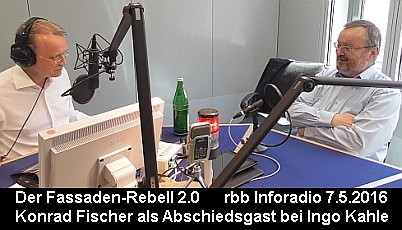

[🠔 Zur Übersicht: Gespräche & Dokus](gespraeche.md)
# rbb Inforadio Zwölfzweiundzwanzig: Der Fassaden-Rebell – Ein Update
**Warum das Dämmen von Häusern unwirtschaftlich und der ökologische Nutzen zweifelhaft ist.**  
_mit Ingo Kahle (Moderator), Konrad Fischer • 06.05.2016_

Inhalt:
- Energiesparen - was ist richtig, was ist falsch? 
- Einfluß der Baustoffproduzenten auf den Planer
- Konflikte mit der Dämmstoffindustrie
- Energiesparen - wie geht das wirklich?
- Energetische Modernisierung auf Kosten der Mieter.
- Der "Goldene-Nasen-Paragraph" im Mietrecht: Ewige Umlage der Modernisierungskosten auf die Miete.
- Staatliche Subventionen in die Instandsetzung von Mietwohnungen?
- Die Wirtschaftlichkeit und der Erfolg von Maßnahmen zur Erhöhung der Energieeffizienz von Gebäuden.
- Klimawandel, Klimaschwindel, Globale Erwärmung und CO2.

Eine der erfolgreichsten Ausgaben von 1222 war das Gespräch mit dem Architekten Konrad Fischer, über genau genommen gegen das Dämmen von Häusern. Ein Indiz für das mich überraschende, außerordentlich hohe Interesse an dem Thema war, dass die komplette Sendung über 3600 Mal aus dem Internet heruntergeladen wurde. Seit Januar gelten für den Neubau in der Energieeinsparverordnung, kurz EnEV, um 25% verschärfte Anforderungen, um den Energieverbrauch zu senken. Das, so dachte ich mir, verlangt nach einem Update, in dem es auch darum gehen soll, wie Industrie und Politik eine, manche sagen unheilige, manche sagen heilige Allianz unter dem Stichwort Klimaschutz eingegangen sind. Mein Gast ist derselbe wie vor zwei Jahren, Jahrgang 1955, Architekturstudium an der Universität München, seit 1979 in seinem Architektur- und Ingenieurbüro im fränkischen Hochstadt, vorwiegend im Bereich Bauwerksinstandsetzung und Denkmalpflege tätig. Als Referenzprojekte nennt er das Bremer Rathaus in Berlin, die Marienkirche und die Orangeriegebäude des Schlosses Niederschönhausen. In Bayern das Kloster Banz. Über 450 Baudenkmalprojekte hat er, wie Architekten sagen, kostensicher abgerechnet. Wiederum herzlich willkommen, Konrad Fischer. Vielen Dank.

## Fassadenrebell Konrad Fischer

Herr Fischer, ich nenne Sie ja gerne Fassadenrebell. Was ist Ihr Interesse an diesem Thema? Ja, ich habe eigentlich schon relativ schnell nach meinen ersten Jahren in der Praxis begonnen, Architektenfortbildungen zu machen für die Bayerische Architektenkammer, und dabei habe ich gemerkt, dass ja doch sehr viel Interesse in der Kollegenschaft besteht an Erfahrungswerten. Und aus diesem ja eigentlich erfreulichen Umsetzen meiner Erfahrungen zu meinen Kollegen ist dann auch mein Antrieb entstanden, da weiter zu machen und Erfahrungswerte weiterzugeben. Sind Sie in der Branche verhasst? Ich will mal sagen, es gibt bestimmt Kollegen, die voll auf Öko-Klimastuss abfahren, und denen ich dann nichts Erfreuliches mitzuteilen habe. Auf der anderen Seite habe ich doch sehr viel Kollegen, die sich sogar von mir beraten lassen, oder die in Projekt mit mir gemeinsam den Weg einschlagen. Der aber Sie gehen ja auch auf große Leute los, also ich meine, große Firmen los. Ja, die Firmen, da gibt's auch solche und solche. Die einen verkaufen Ziegelsteine und Massivholz, die anderen nur Leichtbaukonstruktionen. Da ist sicher auch ein gespaltenes Verhältnis. Also, ich weiß natürlich, es gibt Widerstände, es gibt Verdächtigungen, Verleumdungen, damit muss man aber leben, wenn man an der Öffentlichkeitsfront arbeitet.

## Industrie und Politik im Klimaschutz

Herr Fischer, kommen dann eigentlich bei dem Thema energetische Sanierung die hauptsächlichen Treiber wirklich aus der Industrie? Ist das ein industriedominiertes Thema? Das ist eine schwere Frage, wer sind die hauptsächlichen Treiber. Ich habe immer so dieses alte Sprichwort im Kopf: Geld regiert die Welt. Und je mehr umgesetzt wird, umso schöner ist für die Banken. Aber auf der anderen Seite stehen die Firmen, die daran an der Produktion, an der Verarbeitung Geld verdienen, die an der Planung auch verdienen. Gibt ja genug Planer, die eben auch dieses Geschäft betreiben. Also, ich glaube, es gibt viele Begünstigte und Profiteure von diesem ganzen Klimastuss. Das mag sein, aber die Frage ist für mich ja, gibt es wirklich ein ausgeklügeltes Netzwerk zwischen Industrie und Politik? Das ist natürlich klar, wir nennen das ja Lobbyismus. Das ist allgemein bekannt und wird auch immer wieder angegriffen. Es ist ja bekannt geworden, dass hier extrem intensive Kontakte vorhanden sind. Es geht auch einmal darum, dass aus den Ministerien die Spitzen in den Ausschüssen, die maßgeblich sind, besetzt werden. Das ist sicher auch nicht eine umsonste Arbeit. Und es gibt natürlich auch die, ja, sagen wir mal, Verdächtigungen, dass hier auch direkte Landschaftspflege getrieben wird, und diesbezügliche Hinweise sind ja inzwischen bekannt geworden. Das muss ja jedenfalls erfolgreich sein, denn über 900 Millionen Quadratmeter Hausfassaden sind ja schon in Styropor eingepackt. Die Branche setzt jährlich 6 bis 7 Millionen Kubikmeter Wärmedämmplatten um.

## Energieberater und Architekten

Ein Insider hat nun aber in einem Schreiben an den WDR behauptet, die Branche habe in den letzten Jahren ganze Horden ihrer Mitarbeiter als Energieberater ausbilden lassen. Wie erleben Sie diese Energieberater? Ja, meistens geht es so, dass irgendein Geschädigter von einer Energieberatung merkt, dass da hinten und vorne nichts stimmt, dass er unendlich Geld ausgeben muss wegen gar nichts, so auch von den vorgerechneten Effekten. Und die schicken mir dann die ihnen vorgelegten Energieberatungen, und wenn man da reinguckt, da graust es einer Sau, auf Deutsch gesagt. Das ist ein solcher hanebüchener Unsinn, zum Teil voller Rechenfehler, zum Teil wird behauptet, das ist empfehlenswert, das wäre günstig, und dann werden dargestellt irgendwelche Amortisationszeiten über 50 Jahre oder über 30 oder über 10. Alles ist nicht mehr wirtschaftlich, und die Energieberater glauben sich berufen, so was dem Kunden beizubringen und zu empfehlen. Weil die Architekten müssen doch auch mitspielen. Selbstverständlich. Auch die Architekten sind ja auch genug als Energieberater tätig. Auch da gibt es keinerlei Anzeichen, dass in großer Front der Begriff Wirtschaftlichkeit gepflegt wird. Na, für den Architekten schon, ja, ob das gut. Aber für den Bauherrn, wo wir sozusagen als Treuhänder auftreten müssen als Kammerberuf, da schulden wir eine wirtschaftliche Bauplanung und natürlich im Vorfeld auch eine Bauberatung. Das heißt, wir müssen jedem Kunden, wenn es um Investitionen ins Energiesparen geht und wir ihn da auch beplanen und beraten sollen, müssen wir über die Wirtschaftlichkeit der Maßnahme aufklären. Und da wird noch viel zu wenig gemacht. Ich habe immer wieder auch an meiner Bayerischen Architektenkammer darauf gedrungen, dass man hier mehr ausbilden muss. Es erfolgt aus meiner Sicht nichts oder sagen wir mal zu wenig. Das ist ein großes Minenfeld, weil ja am Ende, wenn die Planung tatsächlich nicht wirtschaftlich durchgeführt ist und sich am Bauwerk, man sagt, manifestiert hat, dann entsteht ein gigantischer Schadensersatzanspruch. Wenn der Bauherr drauf kommt, es war Mist, die ganze Planung eine Fehlplanung, dann entfällt der komplette Honoraranspruch, und am Ende gibt's den Schadensersatz für im Umfang der fehlerhaft getätigten Investition. Hat aber noch keiner bisher durchgesetzt. Oder es gibt Prozesse darüber. Ich habe das im Architektenblatt gelesen, der Architektenkammerpräsident aus Baden-Württemberg hat sich beklagt über solche Prozesse. Also, es gibt Bauherren, die sich ihre Haut wehren.

## Schornsteinfeger und die Deutsche Umwelthilfe

Wie ist das, machen die Schornsteinfegerinnungen auch mit? Ja, die sind natürlich sehr günstig mit Energieausweisen durch. Wenn ich Anrufe kriege von Kunden und sagen: Herr Fischer, Sie sind gut drauf, wollen Sie mir nicht einen Energieausweis machen? Dann sage ich: Das wäre viel zu teuer für Sie, gehen Sie zum Schornsteinfeger. Der hat ja auch schon alles gelernt, und der macht es für 1,25 € oder vielleicht irgendwie 30, 40 € oder irgendwas. Also, da können wir nicht mithalten. Aber die Energieberater im Schornsteinfeger-Unwesen, die sind Legion inzwischen. Es gibt auch einzelne Verbände, die eine interessante Tätigkeit ausüben, beispielsweise die Deutsche Umwelthilfe. Ja, das ist natürlich eine Pressure Group, sage ich mal, zu denen, die versuchen mit Abmahnungen am Markt wie der Teufel hinter der armen Seele herzujagen. Irgendein Hausbesitzer, irgendeinen armen Immobilienmakler, der vergessen hat, den Energieausweis zu signalisieren in seiner ja Verkaufsanzeige, die werden vor Gericht geschleppt, die werden bedroht mit Tausenden von Abmahnungen. Also, ganz üble Gruppe finde ich. Und diese Deutsche Umwelthilfe, die gefällt sich auch in ständigen Verschärfungsgejammer und schreit nach mehr Vollzug. Die erwarten, dass praktisch jede Dämmmaßnahme vom Landratsamt oder von der zuständigen unteren Baubehörde mit eigenem Inspektor und wahrscheinlich mit Rollkommando überprüft wird. Ja, in die Richtung arbeitet zum Beispiel auch das Freiburger Öko-Institut, die fordert auch immer stärkere rechtliche Regeln. Aber kommt man da inzwischen an rechtliche Grenzen?

## Rechtliche Grenzen und der Artikel 14

Na ja, wir haben ja hier auf jeden Fall erstmal den Artikel 14 im Grundgesetz, und der sagt letztlich, das Eigentum ist geschützt. Und wenn der Staat eingreift in das persönliche Eigentum – und es geschieht ja bei solchen Verpflichtungsgesetzen, wo eben Mehrkosten gefordert werden für zusätzliches Gedämme oder Gedichte oder frag mich was – dann kommt natürlich der Konflikt mit dem Artikel 14, weil der Staat darf zwar eingreifen in den Geldbeutel und enteignen, aber solange wir noch ein Rechtsstaat sind, nicht entschädigungslos. Und deswegen hat er in diesen ganzen verpflichtenden Gesetzen zwangsläufig, um sich vor Regress zu schützen, selber hat er Befreiungsparagraphen bei unbilligen Härten eingerichtet. Und diese Befreiungsparagraphen, die sind es, die genutzt werden können, und ich sag auch, müssen, um unwirtschaftliche Investitionen zu verhindern in diesem Klimaschutz. Aber Sie sagen unwirtschaftliche Investitionen, da komme ich dann auch noch mal drauf, wie Sie das berechnen.

## Einsparversprechen und Realität

Es wird doch aber versprochen, 70 bis 80% der Heizenergie kann eingespart werden. Es sei in den letzten Jahren der Bedarfswert, um also einen Quadratmeter zu heizen, um 15% gesunken. Was, was sind das für Zahlen? Die stimmen wirklich? Hier operiert man natürlich mit diesem sogenannten Bedarfswert. Und diese Bedarfsberechnung beruht auf einem vollkommen unsinnigen Rechenmodell, in dem gedanklich das Gebäude in ein, ich sag mal, in ein Tiefkühlhaus reingesetzt wird und das Licht ausgeschaltet, damit keine externe Energie auf die Fassade trifft. Und dann wird gewartet, bis alles gleichmäßig temperiert ist, der sogenannte stationäre Zustand. Und jetzt wird gemessen, was die Dämmung bringt. Das ist ein absoluter Krampf. Natürlich, draußen steht ein Gebäude, empfängt solare Energie direkt und auch diffus, auch auf der Nordseite empfängt Umgebungsenergie in reichem Maße. Wie viel ist denn das? Ich glaube, da macht man sich überhaupt gar kein Bild, da macht man sich kaum Gedanken drüber. Da dürfen Sie mich jetzt nicht unbedingt festnageln, aber es sind irgendwie allein auf der Nordseite im Winterhalbjahr können Sie, glaube ich, so um die 50 Watt pro Quadratmeter damit versorgen. Also, das ist jetzt, kann man genau nachgucken, wie die VDI Norm ist, wobei die nicht stimmt, weil sie nämlich nur die solare Komponente berücksichtigt und nicht die Umgebungswärme. Stellen wir uns eine Nordfassade vor, gegenüber steht eine Südfassade. Die Südfassade erwärmt sich viel stärker und strahlt dann aber ihre infrarote Wärmestrahlung auf die Nordfassade. Diese Komponenten werden überhaupt nicht berücksichtigt. Das, was ich, worauf ich hinaus will, ist, dieses komplette U-Wert, heißt das ja, U-Wert-Rechenmodell ist für die Katz. Alle wissenschaftlichen Forschungen zeigen, es hat mit der Realität wirklich nichts zu tun. Vielleicht mal ein Zufallstreffer, einer von 100 oder von 1000, aber ansonsten ist diese ganze Bedarfsberechnung vollkommen an den Realitäten vorbei. Das heißt, hier werden Dinge versprochen, zu denen man nur fauler Zauber sagen kann.

## Erfahrungen und Forschungsergebnisse

Aber jetzt will ich natürlich ein paar Belege haben, vielleicht können Sie ja Erfahrungen aus dem Ausland nennen. Ja, wir haben natürlich im In- und Ausland seit vielen Jahren Forschungen. Das sind Universitäten, das sind Institute, wie es auch Fraunhofer Institut. Es sind auch in der Schweiz zum Beispiel die Eidgenössische Materialprüfanstalt. Es ist die TU Innsbruck. Es gibt verschiedene auch wirtschaftsnahe. Teilweise sind die schon paar Jahre alt, aber die aus ist relativ neu. Was hat die ergeben? Ja, die haben dann 12 unterschiedliche Kisten beheizt, exponiert auf einem Dach in Maran, auf einer Schule, und haben dann verglichen, wie viel in 12 Monaten Energie da reinfließt, und wie viel hätte reinfließen sollen nach dem Bedarfsberechnungsmodell, also mit dem U-Wert. Und da gab's abenteuerlichste Abweichungen, natürlich fast bis zu 100% weichen dann diese Messergebnisse ab von den Rechenergebnissen. Und das Schönste war, man hat dann auch zwei gleiche Kisten mit unterschiedlichen Gläsern bestückt, mit Fenstern, zweifach und dreifach Glas. Und hätte man jetzt normalerweise erwartet, dass das Dreifachglas weniger Energie verbraucht, war aber überhaupt nicht so. Die haben beide exakt dasselbe verbraucht an Energiezufuhr. Ziel der ganzen Geschichte ist ja CO2 einzusparen. Nun ist es erstmal so, dass bei der Herstellung ja pro Quadratmeter – das hat die Deutsche Umwelthilfe übrigens gesagt – 29 Kilogramm CO2 ausgestoßen werden, also bei der Herstellung von Styropor. Und trotz des teuren Dämmens ist der CO2-Ausstoß ja in den letzten Jahren in Deutschland nicht gesunken. Und dann kommt das industrieeigene Institut, FW heißt es, Forschungsinstitut für Wärmeschutz, Forschungsinstitut, Forschungsinstitut für Wärmeschutz, und behauptet, das liege an den sogenannten Rebound Effekten. Was ist das denn?

## Rebound-Effekte und CO2-Ausstoß

Das ist aus meiner Sicht auch ein Riesenschwindel. Man hat ja festgestellt, und ich sag, weil das Rechenmodell nicht stimmt, dass die Massivbauten berechnet viel mehr verbrauchen, als sie tatsächlich jemals verbraucht haben pro Quadratmeter an Heizenergie. Das hat man erklärt mit dem sogenannten Prebound. Das heißt, die Objekte verbrauchen weniger als gerechnet, und dieser Prebound besagt ja, da sitzen jetzt die Leute in ihren ungedämmten Häusern und zittern sich zu Tode, verbrauchen also wenig Energie. Und jetzt wird gedämmt, und jetzt kommt der sogenannte Rebound Effekt, der also nach dem Dämmen einsetzen soll. Und dieser Rebound führt dazu, dass dann bis ins letzte Dachkämmerchen auf 35 Grad geheizt wird, angeblich. Ich übertreibe jetzt ein bisschen, aber um das zu überspitzen und klar zu machen. Die sagen einfach, danach wird wie verrückt geheizt, und deswegen brauchen dann die Objekte oft mehr als vor der Dämmung, oder die versprochenen Ersparnisse stellen sich in keiner Weise ein. Meiner Meinung nach liegen hier keine zuverlässigen Datenerfassungen vor, die diese Temperaturunterschiede in den Objekten tatsächlich belegen, sondern das ist ein reines, ja, ich sag mal, eine Finte, um zu erklären, warum überall die Rechnung nicht stimmt. Das heißt, ich habe hier die verschiedenen Studien mir angeguckt, die es gibt zu diesem vor. Die Cambridge Studie hat ja sich Tausende von Fällen namhaft gemacht, wo gar nichts stimmt in der Berechnung, und die haben dann diesen Prebound und Rebound versucht wissenschaftlich zu begründen, allerdings ohne Datenlage. Muss man mal überlegen, warum ist der CO2-Ausstoß nicht gesunken? Das kann daran liegen, dass da falsch gerechnet wird. Aber in seinem Buch "verbietet das Bauen" rechnet der Autor Daniel Fürhop vor, dass allein in den vergangenen 20 Jahren 7 Millionen Wohnungen gebaut wurden, obwohl die Einwohnerzahl bei 80 Millionen ja stagniert. Und die Erklärung dieses Architekturexperten ist, wir brauchen immer mehr Platz. Und in der Tat, also nach dem Krieg hat jeder Mensch 15 Quadratmeter zur Verfügung gehabt, inzwischen ist es fast das Dreifache. Kann man nachlesen im Armuts- und Reichtumsbericht der Bundesregierung, da steht drin, dass also die durchschnittliche Wohnfläche je Miethaushalt bei 69 Quadratmeter lag. Also, zunehmenden Wohlstand wird man leider nicht verbieten können, oder zum einen? Und selbstverständlich ist klar, das sind weniger Leute pro Quadratmeter und brauchen trotzdem eine warme Wohnung. Und auf der anderen Seite bin ich aber der Überzeugung, dass man diesen sogenannten menschlichen Einfluss auf die CO2-Situation überhaupt nicht messen kann, weil auch in der Literatur, die ich selbstverständlich studiere, ist zwischen 2 und 5% die Rede, der menschliche CO2-Ausstoß im Verhältnis zum natürlichen CO2-Aufkommen. Und wie man das wirklich jetzt rausmessen kann, dass in Hamburg oder dass in Deutschland eine Hamburg Stadtgröße mit Dämmplatten belegt ist, ich kann mir nicht vorstellen, wie das messtechnisch gehen soll.

## Schimmelbildung und Lüftungsverhalten

Herr Fischer, in gedämmten Häusern wird oft Schimmel festgestellt, und man erklärt das dann mit der Unzulänglichkeit des Menschen, weil er, auf Deutsch gesagt, zu blöd zu lüften. Was ist da dran? Ja, das, ja, das Modell des Stoßlüftens, das auch vom Bundesumweltministerium und von verschiedenen Institutionen immer propagiert wird. Man muss eben oft genug Stoßlüften, Stoßlüften. Aber die Wahrheit sieht ja so aus: Schon vor der Stoßlüftung gab es ja schon die hohe Feuchte, die dann ja eben eine Stoßlüftung auslösen sollte. Und diese Feuchte, die war natürlich schlau und hat sich schon im Bauwerk überall die entsprechenden Stellen gesucht, an denen der Taupunkt unterschritten ist, und ist da hineinkondensiert. Und jetzt kommt die Stoßlüftung. Das ist in der Regel kalte Luft, und diese kalte Luft, die kann mal dazu dienen, die überhitzte und überfeuchte Raumluft auszutauschen. Aber die ganze Feuchte, die ins Bauwerk schon eingedrungen ist, kann man ja mit Kälte gar nicht rausholen. Die müsste man verdunsten, und dazu braucht es Energie. Das heißt, das gesamte Denkmodell Stoßlüftung ist für mich Irrsinn. Das kann man vielleicht mal direkt nach dem Duschen machen, oder am besten währenddessen, aber im Nachhinein mit alle paar Stunden mal Stoßlüften ist überhaupt nichts zu wollen an der Feuchte. Diese stetige Überschussfeuchte, die in diesen dichtgedämmten Bauten vorherrscht, die muss man durch stetiges Lüften abführen. Und das ist dann wieder der Trick mit ja, die Industrie verkauft jetzt bestimmte Klapperatismen und Mechanismen und undichte Dichtungen an ihren Fenstern. Aber eigentlich heißt dann, lass doch die alten Fenster drin, die haben eine ausreichende Fugendurchlässigkeit, um stetig die Raumluft trocken zu halten und den Schimmel zu vermeiden. Also auch hier ist sehr viel Unsinn am Markt, sage ich mal. Also, was soll man machen? Also nicht Stoßlüften, sondern stetig. Man soll zum, wenn man jetzt schon diese dichten Fenster hat, sage ich immer, raus mit der obersten Gummilippe, und es ist dann alles viel besser. Zum anderen wäre es natürlich gut schon während des Duschens seine Feuchte abzuführen, da gibt's natürlich verschiedene Möglichkeiten dafür. Ja, Fenster ist überhaupt ein wichtiges Stichwort. Ganz modern und ganz schick sind ja Fensterfronten von oben bis unten mit Dreifachglas und so. Was hat es denn damit auf sich? Ja, da haben wir dann dahinter eine riesige, ja, Energiebelastung durch Hitze, die dann im Sommer mit Energieaufwand wieder weggelüftet werden muss und runtergekühlt. Diese ganze Glasarchitektur, gut, die ist für manche gewerblichen Gebäude und vielleicht auch im Wohnbereich auf der Südseite zum Garten sehr beliebt, ist aber bautechnisch ein Problem.

## Niedrig- und Null-Emissionshäuser

Natürlich 1222, zu Gast bei Inforadio, heute Konrad Fischer, Architekt aus Bayern. Es geht jetzt um Energiesparen. Herr Fischer, im Energiesparen das Bauen nach der Energieeinsparverordnung, und zwar nach der neuen. Ein Musterhaus der Internationalen Bauausstellung in Hamburg hat nach Herstellerworten folgende Ausstattung: exzellente Gebäudehülle, ich nehme mal an, die ist super mit Styropor eingepackt, eine moderne Wärmepumpentechnik, eine zentrale Be- und Entlüftung samt Wärmerückgewinnung und Fotovoltaikanlage. Quadratmeterpreis für das 150 Quadratmeter Gebäude: 2200 €. Und jetzt Sie, Herr Fischer, welche Erfahrungen macht man denn mit solchen Niedrig- oder gar Null-Emissionshäusern? Ja, das fängt ja schon eigentlich damit mit an, was ist in der Lüftung los? Und ich habe verschiedentlich in solchen Lüftungssystemen Untersuchungen angestellt. Es ist ja eigentlich ein Grauen, was sich da abspielt. Es ist eine Hölle an Verschmutzung da drin, es ist gefährdet, dass sich hier Keime ansetzen. Das heißt, man muss eigentlich ständig diese Lüftungsanlage warten. Und das muss man ja alles zu den Betriebskosten dann dazu führen. Dass das überall nicht gemacht wird, um Geld zu sparen, das steht auf einem anderen Blatt. Ich sag mal, ich persönlich halte diese gelüfteten Häuser für äußerst gesundheitsbedenklich, sagen wir mal so.

## Leichtbaukonstruktionen und Tauwassergefährdung

Und da können die freilich versprechen, dass sie mit Pollenfilter da die allerreinste Luft herbeiführen, aber in der Abluft ist ja das Problem, wo die ganzen Feinstäube sich dann festsetzen, wo an jeder Ecke und Kante sich ja das Wollmopsgeölle anreichert. Und von daher ist es eine sehr ungesunde Sache, sage ich, wenn man mal das genauer betrachtet. Das andere ist, diese Leichtbaukonstruktionen, die unterliegen ja extremen Temperaturschwankungen und sind sehr Tauwasser gefährdet.

Ich kenne so viele Niedrigenergiehäuser inzwischen, die nach wenigen Jahren aufgefeuchtet sind. Zigtausende stehen davon in Schweden, einer der größten Bauskandale, der immer noch nicht ausgestanden ist. Man repariert und repariert. Ich verfolge das, ich spreche auch Schwedisch und kann die dortigen Informationen, mit denen die Presse sehr offensiv umgeht, dort oben kann man verfolgen. Also, es ist landauf landab ein Problem mit diesen Niedrigenergiekonstruktionen. Selbst in Berlin dieses berühmte Nullenergiehaus, das war ja auch in Wahrheit der große Flop. Im Winter hat überhaupt nichts gereicht an Energieerzeugung, da muss man unbedingt wieder ans gewöhnliche Stromnetz, um überhaupt zu überleben. Und ja, natürlich, wenn man das vergesellschaftet mit einigen solaren Überschüssen im Sommer, dann kann man vielleicht auf dem Papier ein Nullenergiehaus da formulieren. Aber die Kosten waren ja weit über eine Million für das Einfamilienhaus. Das kann ja nicht die Zukunft des Bauens sein.

## Wirtschaftlichkeit von Energiesparmaßnahmen

Ja, wird da nur eingespart oder nicht, oder geht es darum, welchen Preis dieses Einsparen hat? Ja, also, die wirtschaftliche Komponente ist ja das Entscheidende. Und nachdem ich seit vielen Jahren diese Wirtschaftlichkeit berechne, kann ich nur sagen, ich habe noch niemals eine wirtschaftliche Energieeinspar-Investition gefunden, weder im Altbau noch im Neubau. Diese Sachen lohnen sich nicht. Sprich, die Investitionen, die man in diese Energiespar-Investitionen hineinsetzt, die sieht man zu spät oder nie mehr wieder.

## Vollkostenanalyse und Instandhaltungsaufwendungen

Ja, was geht denn da alles in Ihre Rechnung dann ein, wenn Sie zu diesem Ergebnis kommen? Das selbstverständlich muss man eine Vollkostenanalyse machen. Zum einen, die sowieso Kosten gehören selbstverständlich rausgerechnet. Ja, aber dann bleibt ja noch die sowieso Kosten wären jetzt die, die im Umfeld einer Energiespar-Investition sowieso anfallen würden. Nehmen wir an, der Putz wäre total kaputt an der Fassade, und dann kommt Dämmstoff plus Putz, dann wäre eben der Putz auf dem Dämmstoff eine sowieso ein sowieso Faktor. Und diese sowieso Kosten, die wollen wir natürlich nicht mitberechnen, weil das wäre ja nicht sachgerecht für eine faire Wirtschaftlichkeitsberechnung. Aber auf der anderen Seite müssen ja mit einberechnet werden die nach anerkannten Untersuchungen sich einstellenden Instandhaltungsaufwendungen, und die sind bei Dämmstofffassaden etwa neun Euro teurer als bei einer Putzfassade. Warum? Weil dieser Dämmstoff fast allnächtlich den Taupunkt unterschreitet, Wasser anreichert, dadurch die Putze geschädigt werden, und am Ende fliegt einem das ganze Nass von der Wand. Und solche Beispiele gibt's ja auch. Das letzte, das ich beobachtet habe, war in Jena, da ist eine mehrgeschossige Dämmstofffassade über Nacht dann runtergeklappt. Früh um sieben Uhr waren Gott sei Dank keine Leute auf dem Trottoir. Das ging damals auch nur regional in den Medien. Da ist meiner Meinung nach in den Medien noch viel aufzuholen, um wirklich die Realität abzubilden, die sich an den Dämm- und Niedrigenergiehaus-Versagern abspielt. Aber mich freut es ja, dass wir hier im RBB hier, sagen wir mal, auch mal ein paar kritische Worte in die Landschaft hinausbringen können.

## Baunebenkosten und die Honorarordnung

Zum anderen brauchen wir dann die Baunebenkosten, die werden ja auch fast grundsätzlich unterschlagen in diesen Rechenmodellen. Wir haben hier die HOAI, also die Honorarordnung für Architekten und Ingenieure. Und es fallen verschiedenste Gewerkplanungen auch Technikplanungen an, wenn ich an einer Fassade oder in einem Dach diese Dämmstoffe mache. Und diese Kosten sind nicht unerheblich. Ist klar, der Architekt will auch überleben und der Fachingenieur. Und diese Kosten müssen hinein in die Rechnung. Und das wird in der Regel wird es weggelassen und schaut die reinen Material- und Handwerkerkosten an. Und ja, dann muss die gesamte Baukonstruktion, die von der Dämmung betroffen ist, zum Beispiel Verlängerung der Dachüberstände, spezielle Ausbildungen an Fenster und Sockel und und und. Das alles muss rein. Und da, und ich kann es noch mal wiederholen, es gibt keine wirtschaftliche Maßnahme nach EnEV. Und deswegen gelingen diese Befreiungen.

## Durchgesetzte Befreiungen von der EnEV

Wie viel haben Sie denn schon durchgesetzt? Die kann ich jetzt nicht zählen. Es sind weit über 50 in allen deutschen Bundes, also nahezu allen deutschen Bundesländern. Ich bringe mal ein Beispiel: ein Neubau in, ja, wo war das, Schleswig-Holstein. Haben wir dann eingereicht EnEV und EE-wärmige Befreiung. Das hat eine Woche gedauert, und die Befreiung war da. Und was machen denn dann die Bauherren? Also, die müssen dort, die wollen doch irgendwie einsparen. Und interessanterweise tun sie das ja auch. Kommt das dann nur, weil in der Regel bei solchen Sanierungen dann eben auch die Heizung ausgetauscht wird? Nicht unbedingt.

## Erfahrungen mit Wärmedämmung

Ich hatte jetzt vor ein paar Tagen hatte ich in Panko einen Vortrag, und da ist eine Journalistin dann nach dem Vortrag aufgestanden, hat gesagt: Bei mir stimmen die Fischerschen Ideen überhaupt nicht. Ich habe Wärme gedämmt an der Fassade, und ja, für Jahr spare ich ein. Daraufhin habe ich sie gefragt, was haben Sie denn mit der Heizung gemacht? Hat sie gesagt: nichts. Und dann habe ich gefragt, und die Fenster? Sie gesagt: auch nichts. Dann habe ich gesagt: dann haben Sie bestimmt Ihr Dach gedämmt. Und das musste sie dann zugestehen. Und das ist ja klar, durch das Dach die Wärme geht nach oben, da fliegt natürlich einiges an Warmluft raus. Und wenn ich dort gegen einen schlechten Vorzustand den Deckel dicht mache, dann kann ich selbstverständlich einiges an sparen. Auf der anderen Seite ist die Frage, wo bleibt die Feuchte, die mit der Warmluft eingesperrt wird? Und diese Frage, die wird bei mir auch alle Woche etwa beantwortet durch Zusendung von Beratungskunden, die dann Ihr Dach geöffnet haben, ihre Dämmung in den Zwischensparren geöffnet haben und dort dann schwarzverpilzte Wolle und Schichten dann da rausbauen. Das ist also alles nicht ohne.

## Zielkonflikt zwischen Eigentümer und Mieter

Dem Eigentümer können Sie ja helfen, nutzt das was dem Mieter aber nicht. Also, bis zum Bundesgerichtshof hoch wurde dem Mieter aufgetragen, er hat das zu dulden. Haben wir hier einen Zielkonflikt zwischen Eigentümer und Mieter? Denn für den Mieter bedeutet das Beispiel Panko, da wurde dann plötzlich mal 200 € mehr verlangt für eine 85 Quadratmeter Wohnung. Ja, das spielt sich vor allem in den guten Lagen ab, wo man fast jeden Mietpreis realisieren kann. Dort gibt es riesige Verdrängungseffekte durch die Umsetzung der Modernisierungsumlage, wo eben der Hausbesitzer vor sich hin dämmt und modernisiert, und der Mieter kriegt dann zum Teil mehrere 100% Mieterhöhung. Eigentlich wäre es ja schön, wenn der Mieter und der Vermieter, die grundsätzlich in einem Boot sitzen, die sich gegenseitig bedingen und auch brauchen, wenn die in Frieden miteinander leben könnten. Aber dieses Modell, dass die deutsche, ich sag mal, Dämmstoffwirtschaft oder Branche als Ganzes in den Gesetzgeber hineinbuchiert hat, das bringt nun den Konflikt in dieser Szene. Der Vermieter hat das Pech, dass eine normale Fassadeninstandsetzung kann er nicht auf die Miete anrechnen, da behauptet man ja, das hättest du ja vorher schon verdienen können durch die normale Miete. Jetzt haben wir natürlich auch, bedingt durch Einigungsprozesse, durch die deutsche Einigung haben wir ja an vielen Stellen, an vielen Lagen sehr niedrige Mieten, und die sind auch sozial bedingt und sind auch notwendig. So an diesen Objekten kann man nahezu keine Instandsetzung rauswirtschaften. Und hier denke ich, müsste der Gesetzgeber ansetzen und sollte diesen Konflikt auflösen, indem man zum Beispiel sagt: Okay, der Vermieter kann seine Instandsetzung auch in die Miete in eine Mieterhöhung mit umsetzen. Aber dieses ganze Förderprimorium, das sinnloserweise in diesen Klimastuss hineingeht, das sollte man hier dann zur Lösung der sozialen Frage in die Mieter und oder eben auch in den Hausbesitzer reingeben, um ihm das zu ermöglichen, ohne gravierende Mieterhöhungen, ganz normal seinen Job zu machen und das Haus, die Mietwohnung in Ordnung zu halten. Hier denke ich, ist es im Moment ganz ungut, dass man praktisch den Mieter und den Vermieter aufeinanderhetzt und die kämpfen verbittert vor Gericht, machen die Rechtsanwälte reich. Es ist ein Trauerspiel.

## Lukrative Modernisierungen und der "goldene Nasenparagraf"

Aber es ist doch eben auch so, dass die Firmen inzwischen damit mehr verdienen können, also insbesondere so börsennotierte Wohnungseigentümer, mit solchen Modernisierungen mehr verdienen können, als würden sie jetzt zum Beispiel andere Wohnungsbaugesellschaften oder Bestände aus anderen Gesellschaften aufkaufen. Das heißt, die Frage ist, ob das, was Sie als Lösung vorschlagen, dann funktionieren würde, wenn das so lukrativ ist. Das stimmt. Aber diesen goldenen Nasenparagrafen im Mietrecht, der eben diese letztlich unendliche Umsetzung der Modernisierungskosten, jedes Jahr 11% der Modernisierung darf auf die Miete draufknallen, und zwar bis zum Sankt Nimmerleinstag. Nicht nur bis das mal zurückgezahlt ist, was er investiert hat, sondern auf immer und ewig. Und da frage ich Sie mal, 11% Rendite, wo gibt's denn so was? Und hier muss eigentlich auch, da wird ja auch jetzt geredet schon, ja, da will man was verbessern, 8% wäre auch schon schön. Aber auch das ist vollkommen asozial. Hier gehört dieses ganze Modell auf dem Prüfstand, um hier nicht eine direkt eine Explosion im Mietenbestand herbeizuführen, weil das ist natürlich so lukrativ, da gehen ja, man ist ja, man wäre ja als Vermieter gerade so, ja, wie sagt man, mit dem Klammerbeutel gepudert, wenn man nicht dieses Geschäft mitmachen würde, koste es, was es wolle. Da hängen ja auch viele dran, dann auch da werden Lüftungen eingebaut et cetera pp. Genau. Ja, also, ich denke, die deutsche Wirtschaft hätte genug zu tun am normalen Job, ihr Spiel zu spielen, und hier sozusagen den Mieter zu opfern auf den Profitinteressen dieser gesamten Baubranche. Ich gehöre ja auch dazu natürlich, aber ich finde, jedenfalls preußisch ist es nicht.

## Gebäudebestand und Einsparvolumen

Herr Fischer, 2015 wurden 270.000 Wohneinheiten neu gebaut. Deutschland hat einen Bestand von 18,6 Millionen Ein- und Mehrfamilienhäusern. Und deshalb gehen die Lobbyisten mit der Parole durch die Landschaft: ran an den Gebäudebestand. Begründung: je älter die Immobilie, desto höher ist in der Regel das Einsparvolumen. Stimmt das? Das stimmt schon mal aus zwei Gründen nicht. Erstens mal wird es ja immer an diesem ominösen Bedarfswert berechnet, der eben nicht stimmt. Ich habe ständig ja auch Baukunden und weiß von denen ihre durchschnittlichen Verbräuche. Die liegen bei 16, 18 Liter Öl vergleichsweise auf den Quadratmeter. Das heißt, die Objekte, die verbrauchen ja gar nicht so viel. Zum anderen sind die relativ gut in Schuss. Das heißt, die bedürfen ja nicht gigantischer sowieso Maßnahmen, die man dann wieder rausrechnen kann zu Gunsten dieser Dämmwirtschaftlichkeit. Die, wenn wir durch Deutschland fahren, jetzt, ich weiß jetzt gar nicht auswendig, 10 Jahre nach der Wende, wo finden wir denn noch diese Katastrophen alten Bauten? Da müssen wir ja schon ins Ausland gehen, sage ich, oder ganz wenige Stellen, wo vielleicht ein altes Fachwerkhaus nicht mehr bewohnt ist seit 20 Jahren. Aber sonst steht doch der deutsche Wohnbestand vergleichsweise gut da. Und diese Riesensparpotenziale, das ist auch wieder vollkommen aus der Luft gegriffen.

## Empfehlungen für Bauanträge und Energieeinsparung

Herr Fischer, was macht denn nun einer, der jetzt einen Bauantrag stellt und diese Energieeinsparverordnung erfüllen soll? Also, er kommt zu Ihnen oder anderen, die das dann machen, und lässt sich da befreien, aber er will ja auch bestimmte Effekte erzielen, er will ja auch weniger Öl verbrauchen, ja, oder Gas. Also, ich denke, man muss hier dort ansetzen, wo die Energie wirklich verbraucht wird. Es sprich am Heizsystem. Und wenn ich schon damit anfange, alle Heizleitungen Unterputz zu legen oder in den Estrich oder oder oder, da gehen dort schon unendlich viele Energien sinnlos verloren. Man nennt es die sogenannten Wärmetransportverluste, die auf dem Weg vom Heizkessel zum Heizkörper verbraucht werden, bis dann endlich die Wärme am Objekt, also am Körper in dem Raum selber, da steht. Hier wird sehr viel Energie vergeudet. Das kann man natürlich geschickter machen, indem man zum Beispiel offen geführte Heizrohre montiert und die zum Mitheizen verwendet, und die nicht nur als Verluststrecken sieht.

## Heizsysteme und Nachtabsenkung

Zum anderen könnte man auch Heizsysteme wie elektrische Heizsysteme verwenden, die ohne überhaupt irgendeinen Wärmetransportverlust die Kilowattstunde in dem Raum direkt anliefern. Das sind ja alle Elektrodirektheizgeräte und so weiter, gibt's ja verschiedenste Formen. Zum anderen ist natürlich auch die gern gepflegte Nachtabsenkung ein riesiger Umweg. Wenn wir von München nach Berlin fahren, ständig Stop and Go mit einer Handbremse, wenn es dann bergauf geht. Das entspricht ja dem Absenken der Temperatur in der Nacht, wenn es draußen kälter wird, geht mehr runter mit der Temperatur, wenn das Gebäude eigentlich mehr Wärme bräuchte. Wenn man also diese Nachtabsenkung rausnimmt, kann man ja locker bis zu 30% Energie auf einen Schlag einsparen, ohne irgendeinen Nachteil, mit sogar dann besserem Wohnkomfort und besserem Temperaturkomfort. Also, ich bin der Meinung, um wirklich Energie zu sparen, muss man zunächst mal an der Heizung ansetzen und die korrekt durchführen.

## Maßnahmen im Gebäudebestand

Und was macht man im Bestand? Im Bestand ist es dasselbe. Ich habe immer wieder Heizsysteme aus den 60er Jahren. Ich hatte mal, das ein besonders schöner Fall war, das Ferienhaus von Ludwig Erhard am Tegernsee. Der hatte 45 Liter Öl pro Quadratmeter. Da hatte damals berühmte Architekt Sebruf in den Stahlbeton sämtliche riesigen Heizrohre einbetoniert. Und ja, dann empfehle ich an solchen Stellen: wir kappen einfach an den Heizkörpern die Rohre, verlegen neu, sparsam auf der Wand, und kommen sofort runter Richtung 18, 16, 10 Liter pro Quadratmeter. Das sind eben sehr einfach zu verwirklichende und sich sehr schnell amortisierende Maßnahmen. Das kostet ja nicht so viel, ein paar Rohrstränge durch das Gebäude zu treiben.

## Historische Dämmmaßnahmen und Fazit

Auf der anderen Seite kann man natürlich an manchen Fakten am Altbau nichts machen. Nehmen wir an, wir haben ein Meter dickes Mauerwerk oder wir haben eine Stahlbeton-Innenoberfläche. Das sind natürlich beim Anheizen, wenn ich einen kühlen Raum habe und will den erwärmen, da brauche ich natürlich bei sehr massereicher Konstruktion sehr viel Energie, bis dass sich eine Temperatur nach Wohlbehagensgefühl einstellt. Und da sehen wir dann auf die historischen Dämmmaßnahmen, die waren ja niemals außen vor der Wand und hätten dort die Solarerträge minimiert, sondern die waren ja immer innen. Wir denken mal an die gotische Bohlenstube, wo man mit einer dünnen Bohlenlage diese Burgwände oder diese Altbauwände verkleidet hat, oder wir denken auch an die schönen Gobelins, das war ja auch an der Außenwand in großen Quadratmetern rumgehangen, um sehr schnell einen Wärmeeffekt an der Oberfläche zu bekommen beim Anheizen. Und da gibt's eben verschiedene Modelle, wie man wirklich energiesparend bauen kann, und wie man auch mit dem Altbau, der viel Energie verzehrt, verbessernd eingreifen kann. Aber man muss sich da nach den Tatsachen richten und nicht nach irgendwelchen fiktionären Bedarfsberechnungsmodellen mit dem U-Wert. Herr Fischer, ich danke Ihnen sehr für dieses Gespräch. Ich danke Ihnen auch.

## Abschiedsworte des Moderators

Liebe Hörerinnen und Hörer, diese Sendung mit dem bayerischen Architekten Konrad Fischer war die 381. Originalausgabe von 1222 zu Gast bei Inforadio in etwas mehr als 10 Jahren. Ich werde in Kürze nach fast 38 Jahren Tätigkeit für SFB und RBB in den Ruhestand treten, deshalb war dies meine letzte Sendung. Ich möchte mich sehr herzlich für Ihr außerordentlich hohes und auch intensives Interesse an 1222 bedanken. Ihre Mails und Briefe, aus denen ich Dankbarkeit für meine Tätigkeit herausgelesen habe, waren mir stets eine wichtige Motivation, so intensiv für Sie zu arbeiten. 1222 ist die erfolgreichste Einzelsendung des Inforadios, und die Neue Osnabrücker Zeitung schrieb sogar, es sei die beste Interviewsendung Deutschlands. Alles zusammen, was kann man Schöneres in seinem Berufsleben erreichen? Sehr herzlich bedanken möchte ich bei meiner Assistentin Gabriela Götze für die große Stützung, die mir ihre Arbeit in all diesen Jahren bedeutet hat, und bei allen meinen Technikerinnen und Technikern. Ich freue mich, dass es 1222 im Inforadio weitergeben wird. Meine Kollegin Sabine Mati übernimmt diese Sendung. Bitte bringen Sie ihr dasselbe hohe Interesse entgegen wie mir. Danke, dass Sie mir in all den Jahren zugehört haben.
