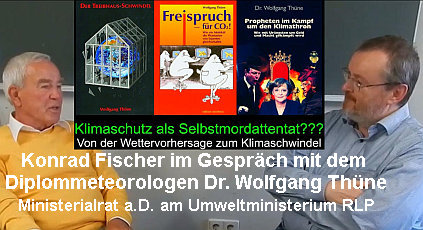

[🠔 Zur Übersicht: Gespräche & Dokus](gespraeche.md)
# Klimaschutz als Selbstmordattentat? Gespräch mit Dr. Wolfgang Thüne
**Von der Wettervorhersage zum Klimaschwindel Konrad Fischer im Gespräch mit dem Diplommeteorologen Dr. Wolfgang Thüne, Ministerialrat a.D. am Umweltministerium Rheinland-Pfalz.**   
_mit Konrad Fischer, Dr. Wolfgang Thüne, Meteorologe • 15.12.2015_

## Einleitung

Grüß Gott, liebe Zuschauer, zu einem neuen spannenden Ereignis im Internet auf meinem Portal bei YouTube. Wir haben heute ein ganz besonders heißes Eisen angepackt, das uns mehr und mehr bedrängt, nicht nur in Anbetracht des Klimagipfels in Paris, der im Dezember droht, sondern eigentlich fast zum Alltag schon geworden ist, ein ständiges Hinweisen auf die Probleme, die der Klimawandel für uns Menschen mit sich bringt und wie stark wir dafür auch verantwortlich sind.

Ich bringe ein Beispiel mit, ich habe hier die Neue Presse Coburg vom heutigen und schon die zweite Seite vom Hauptteil Klimaschutz auf Abwege. Bevor wir schon das erste Wort an der Klippe im Mund stecken geblieben ist, es geht hier zentrales Problem der Klimapolitik, der CO2-Ausstoß muss endlich sinken. Beim Pariser Gipfel sind verbindliche Zusagen nötig, mahnen Experten. Im Handel mit Verschmutzungsrechten hakt es jedoch gewaltig. Ein Herr Petermann und eine Frau Herzog bringen die ganze Seite voll. Es kommt auch noch der große Klimapoker, die Klimakonferenz in Zahlen und zum Emissionshandel. Wir sehen da unten auch die größten Klimakiller offensichtlich, dass eine Wasserdampf der von einem Kernkraftkühlturm abgegeben wird. Wir sehen auch irgendwelche sehr starke reinweiße Wolken, die von einem Kohlekraftwerk oder einem Kernkraftwerk abgegeben wird und natürlich ist auch der Hinweis auf die Lösung nicht weit. Wir sehen hier drei wunderschöne Nebel, so als Gespenster auftauchende Windräder.

Ja, wir kennen das Thema. Das ist für die Erwachsenen, die Wochenendausgabe meiner Neuen Presse Coburg, bringen die Kindernachrichten und wir sehen hier ein fürchterlich ausgetrocknetes Feld. Wir sehen hier das, ja, das ist in Afrika. Nein, am ausgetrockneten Rheinufer in Düsseldorf, Nordrhein-Westfalen, für den, der es genau wissen will, Erdkunde heißt Deutschland aber anders, bilden sich Risse in der Erde. An manchen Orten wird es durch die Klimaveränderung trockener. So ist dieses Rheinufer hier dargestellt und dann die Kinder müssen eingeschworen werden auf den kommenden Kampf oder auf den schon jetzt im Zeitpunkt stattfindenden Kampf gemeinsam. Die wird die Klimaveränderung, Klimaveränderung in Kackbraun geschrieben. Und was ist es da? Umweltschützer drücken die Daumen, wenn alles gut läuft, gibt es in Sachen Klimaveränderung bald einen wichtigen Fortschritt. Von der Klimaveränderung hast du vermutlich schon mal gehört, manche sagen auch Klimaerwärmung dazu. Und zum Schluss steht, für viele Experten ist der Klimagipfel in Paris also besonders entscheidend. Doch das mit dem Einigen ist nicht so einfach bei so vielen Ländern. Wir kommen darauf zurück.

Ja, diese Klimaveränderung scheint ein tolles Problem zu sein. Die heutige Zeitung Neue Presse nochmal bringt nun den schwedischen König. Der schwedische König schämt sich fürs Baden. Also allen Ernstes und zwar er gibt hier ein Interview in Svenska Nordbladet am Wochenende. Darin hat er zum Umweltschutz durch Duschen aufgerufen. Das greift natürlich zu kurz. Weil seine Vorfahren in der Barockzeit, die haben es ja natürlich noch viel umweltschönender hingekriegt, die haben auch auf Duschen, nicht nur aufs Baden, auch aufs Duschen verzichtet, die haben auch auf eigentlich die gesamte Körperhygiene verzichtet, haben sich dann aber sehr dick mit Pomaden aufgetragen und weil es da natürlich auch geruchsmäßig zu optimieren war, ist da praktisch das Kölnische Wasser erfunden worden für diese Zwecke. Und die haben auch übrigens auf die Klosppülung verzichtet und das hat uns unser Lehrer damals in Geschichte immer erzählt, wie es in Versailles so ging, wo man sich irgendwo ein vergnügtes Örtchen gesucht hat und dann unter seinen Röcken und Rockschößen dann einfach frei weg in die Landschaft oder in die Heiligen Hallen dann seine Exkremente hab, die geben man, das war super umweltschönend natürlich und war rein natürlich Bio-Höko.

Das ist der Schwedische König, wir haben aber auch Prinz Charles und der Prinz Charles hat uns nun genau auch am 23.11. Heute haben wir nach meiner Uhr den 24. November, also gestern, kommt Prinz Charles und sagt, der Klimawandel ist schuld an Migrationskrise, es geht scheinbar um Einwanderer auf Deutsch übersetzt oder Flüchtlinge oder egal wie. Und Terrorismus, da wird Bezug genommen auf den justament vor ein paar Tagen stattgefunden, der Pariser Anschlag auf diese Attentate. Also Prinz Charles hat, der Klimawandel ist sozusagen an allen Schulden, was uns heute Angst macht. Ja, Prinz Charles macht uns dann auch Angst damit und jetzt haben wir dann sogar in Bayreuth, wir sind ja hier in den Fränkischen, in meiner Geburtsstadt Würzburg, in der Universitätsbibliothek. Wir haben einen Forscher, auch in Bayreuth gibt es dazwischen eine Universität und ein Bayreuther Klimaforscher, Professor Thomas Focken, der wendet sich gegen die von mir geäußerte These, der Mensch habe das weltweite Klima nie beeinflusst und sagt in der Überschrift, Professor Focken, Mensch trägt Hauptschuld am Treibhausklima.

## Mediale Darstellung des Klimawandels

Ja, das zur Einleitung, warum wir uns heute mit diesem Thema Klima beschäftigen. Das Klimathema für mich als Architekt ist ja nicht nur, dass man mal raus zum Wetter guckt und sagt, was tut sich da? Nein, ich baue Häuser, ich renoviere Häuser und da drin wohnen Menschen und die benötigten dringend Klimaschutz, weil sonst wird es ihnen ja im Winter zu kalt und im Sommer zu warm und insofern ist Klima für jeden Architekt ein gottgegebenes Thema, um man interessiert sich dafür und lustigerweise müssen wir ja nur Klimaschutz nicht als Schutz vor dem Klima verstehen, sondern als Schutz gegen Klima ausgeschützt werden, nun eigentlich vor den Menschen, so wird es ja heutzutage verstanden und das bedrängt einen jeden Tag, wir müssen die Häuser nur mit dicken Dämmungen umgeben und sonst was für Klimmzüge, müssen irgendwelche Ökostrom einspeisen in das armselige Häuschen, egal was das kostet, kann man fast sagen und so war sehr früh mein Interesse für Klimaschutz als solches geweckt.

Der erste Anlass dieser Züge kam in einer Konferenz, in einem Seminar, das wir als Deutsche Wohnvereinigung in Bandai damals veranstaltet haben, Fenster und Türen in historischen Wehr- und Wohnbauten und da hat es uns interessiert, wie man es da früher so als Fürst und Fürstin, Prinz und Prinzessin in ihren schlechtsbeheizbaren Gemäuern herumgekommen sind, wie man es da mit den Fenstern und mit den Türen, was haben die für Vorkehrungen und wir haben dann, um das zu klären, sehr interessante Leute gefunden, die uns da drüber berichten und zwar war das Rüdiger Glaser und Winfried Schenk, die uns einen zentralen Vortrag gegönnt haben auf dieser guten Tagung, und zwar Grundzüge der Klimaentwicklung in Mitteleuropa seit dem Jahre 1000 und da haben sie uns über die Klima-Historie aufgeklärt mit fantastischem Ergebnis, ich habe gedacht, alles das, was ich bisher in den Zeitungen in den Medien über Klima gelernt habe, kein Wort wahr und wir haben das bewiesen mit wunderbaren Tabellen, wir werden auf dieses Thema noch drauf kommen, wie war das mit dem Klima früher, das war ein wissenschaftlicher Aufsatz und der hat mein Interesse geweckt und seitdem habe ich gesagt, ich muss mich besser aufklären, habe mir dann Fachzeitschriften zugelegt und bin dann schon im Jahre 98 auf einen fantastischen Aufsatz gestoßen, Gastkommentar in damals in dieser agrarwissenschaftlichen Zeitschrift Fusion im Böttiker Verlag, ein gewisser Dr. Wolfgang Thüne, wie sich dann halt ausstellt beim näheren Lesen, ein ehemaliger Deutscher Wetterdienst Mitarbeiter, der dann so 1997 den Deutschen Wetterdienst verlassen hat, ist 1999 mit 60 in Pension gegangen und hatte dann noch Zeit in seiner Fusion einen Gastkommentar über diese Klimaproblematik abzugeben und der hat mein Interesse dann schon vollends gefangen, weil er da drin geschrieben hat, dass die ganze Klimaproblematik rein menschlich sei. Also, nicht nur in dem Sinne, dass der Mensch das verursacht, sondern dass die Probleme, die da sind, vom Menschen gemacht seien. Und seitdem habe ich ihn immer mal wieder angerufen und habe ihn gefragt und habe ihn heute auch eingeladen, weil ich habe hier den Herrn Dr. Wolfgang Thüne bei mir in der Gesprächsrunde. Herzlich willkommen.

## Definitionen von Wetter, Witterung und Klima

Wolfgang Thüne: Ja, Herr Fischer, ich freue mich, dass ich heute hier sein kann, und ich muss sagen, ich teile ihre Ansicht, denn alles, was wir uns derzeit unter Klima vorstellen, ist ja eigentlich nur noch die Darstellung der Auswirkungen einer politisch gewollten Klimapolitik. Wir müssen von vorne herein wissen, dass wir in drei Bereiche gliedern. Und die drei Bereiche sind das Wetter, Klima und Witterung. Das sind drei Begriffe, die man nicht verwechseln sollte. Also, die Witterung ist der Charakter des Wetters über drei, vier, fünf Tage. Das Klima ist der Charakter des Wetters über 30 Jahre. Das Wetter ist eine Momentaufnahme. Die Witterung ist eine Abfolge von Momentaufnahmen und das Klima ist eine Abfolge von Witterungen. Wenn ich das noch mal so richtig auf den Punkt bringe.

Konrad Fischer: Genau. Und da gab es ja diesen schönen Ausspruch von Herrn Thüne, den habe ich auch, seitdem ich das weiß, immer wieder zitiert, der liebe Gott selber hat uns das Wetter gegeben, aber das Klima haben wir selber gemacht.

## Manipulation durch Klimapolitik und -wissenschaft

Wolfgang Thüne: Genau, und das ist eigentlich die Grundaussage. Und wir müssen jetzt mal im Kopf haben, wenn diese Klimapolitik, wie sie jetzt geschieht, von den Medien vor allen Dingen betrieben wird, wenn wir dann sehen, dass auch die sogenannten Klimawissenschaftler mit der Politik eng zusammenarbeiten und eigentlich nur die Daten liefern, die die Politik hören will, dann müssen wir auch wissen, dass dann das Wetter, was uns der liebe Gott gegeben hat, manipuliert wird und dass wir eigentlich eine Wetterbeeinflussung haben, aber keine Klimabeeinflussung. Das wäre nämlich die größte Waffe, die wir überhaupt hätten, wenn wir das Klima beeinflussen könnten, dann könnten wir ja ganze Landstriche auslöschen oder vernichten. Und das ist ja auch das Ansinnen. Und da muss man ja wirklich mit dem allergrößten Misstrauen dran gehen, denn wenn man sagt, man will das Klima schützen, dann will man etwas schützen, was gar nicht da ist. Klima ist ein statistisches Konstrukt, das überhaupt keine physikalische Größe ist. Es ist ja ein abstraktes Konstrukt.

## Energie und Fossile Brennstoffe: Ein kritischer Blick

Konrad Fischer: Wenn ich jetzt zum Beispiel die Kernfusion sehe, das ist die Kraft, die im Inneren der Sonne abläuft. Dann gibt es möglicherweise die Spaltung. Oder der umgekehrte Vorgang ist die Fusion. Spaltung war natürlich wesentlich leichter zu erringen als die Fusion. Die Fusion erfordert erstmal Energien zu stellen. Das merkt man ja beim Beschleuniger des CERN. Man muss erstmal die Photonen und die Teilchen auf Lichtgeschwindigkeit um die enorme Menge Energie reinstecken. Ja, da muss man dann künstliche Magnetfelder, wie man sonst die Energie halten, kein Behältnis macht. Das muss man also magnetische Felder rühren, wo die eingeschlossen ist und so weiter. Dann kann man vielleicht eventuell die Fusion auch irgendwann mal erschließen, aber zunächst erstmal sind wir auf herkömmliche Energieträger angewiesen.

Jetzt wird immer gesagt, die sind endlich und die fossilen Energien, die sind bald aus. Und ich habe mich natürlich auch mit diesem Thema beschäftigt, bin dann auf das Buch von Thomas Gold gestoßen, der dann sagt, die fossilen Energien, die sind überhaupt keine fossile Energie. Michael Lomonossow, der das entwickelt hat in Gedanken, der hat mal ein paar verkohlte Kreuzstrünke gefunden, in einem Kohle-Flöz und hat dann gedacht, die Kohle, die wäre dann da raus. Und schon Humboldt hat auf einer Südamerika-Reise, wo er da Öl-Seen besucht hat, wie die Terilaura, wo das war, hat er das schon widerlegt, diese Fossiltheorie. Und in den 50er Jahren haben da dann die Russen ja auch entdeckt, dass die fossilen Energien gar nicht fossil sind, sondern unerschöpflich. Unter der Erdkruste sich da bilden aus unerschöpflichen Erdgasen, die unter Druck und Hitze und bakterieller Einwirkungen sozusagen diese Energien dann hergeben. Und das war für mich unfassbar, weil ich ja in der Schule das noch gelernt. Ich wollte übrigens mal Chemie studieren, das hat mich immer interessiert, diese ganze organische Chemie. Ich hab also das nicht geglaubt und war geplättet von diesem Buch von Thomas Gold.

Und hab dann gesagt, wo mach ich die Gegenprüfung? So wie ich auch Sie dann damals angerufen hab, weil ich musste dann persönlich irgendwie einen Ansprechpartner finden, der solche neuen Weisheiten dann von der anderen Seite sieht. Und hab dann den Chef von Esso angerufen, den Pressesprecher, inzwischen Professor Schuldt-Bornemann. Und hab ihn dann gefragt, ob er das Buch denn kennt. Und man hatte mir gesagt, das hat er auch ständig liegen. "Die Atmosphäre der heißen Tiefe her" oder so ähnlich heißt das. Und ich hab ihn dann gefragt, wie sehen Sie denn das? Und er hat ja eigentlich recht. Und ich hab gesagt, was machen Sie? Überall hört man immer, wir haben bald kein Öl mehr und meine Bauern, die wollen ja gar nicht mehr mit Ölheizung in die Zukunft starten. Die wollen alle was anderes. Und Sie sagen, es gibt ja bald kein Öl mehr? Und er hat gesagt, ich geb jedes Jahr oder alle 2 Jahre diese Broschüre raus: "Ölorado". Und aus der ergeben sich Jahr für Jahr zunehmende Reserven. Das sind die Fakten. Und er zeigt nur die erschlossenen und auch prospektierten Energien. Und dann sieht man, wir haben einen Mikroverbrauch, der wird minimal größer jedes Jahr und gleichzeitig erschließen wir unendlich mehr Reserven. Und ich hab ihn dann gefragt, warum tun Sie das nicht offensiv in den Medien bringen, dass wir da keine Angst haben müssen und dass fossile Energien gar nicht fossil sind und unerschöpflich, müssen nur erschlossen werden. Und hat dann gesagt, die Kommunikationspolitik wird halt in Amerika gemacht. Und das Resümee war wie eine Preispolitik. So viel zu dieser Urangst.

## Klimapolitik und CO2-Besteuerung: Eine kritische Analyse

Und wenn wir jetzt mal das ein bisschen resümieren, dann ist ja dieser Autarkismus, der in jedem Einzelnen angelegt ist, weil die Leute sind ja alle dafür, dass man dem Öl-Scheiß kein Öl mehr abnimmt und dass man doch vor der eigenen Haustür oder wenigstens vor der des Nachbarn das Windrad mal aufstellen soll. Und dann ist ja alles fast kostenlos. Man nimmt ja auch so einige Unannehmlichkeiten in Kauf. Das ist ja eigentlich ein Kriegstrauma aus diesen Hungerperioden dort. Es hat ja zwei gegeben, auch im Zweiten Weltkrieg, auch seine Hungerblockaden. Und diese Kriegstrauma-Dramatisierung, wer kann die halten? Ja, aber das erklärt natürlich nicht das weltweite Phänomen. Ich meine, dass wir Deutsche irgendwie ein bisschen geschädigt sind mit Untergang und Hungersnöten, mit allem drum und dran. Aber macht das noch in Amerika, passiert doch eigentlich gar nichts? Ja doch, die fahren dicke Autos. Wie ist das denn trotzdem?

Die Klimapolitik wird ja von den Vereinten Nationen gemacht, und da sind 100, 95 Staaten, die das Rio-Protokoll unterschrieben haben, und das ist ja noch so abgefasst, das gesagt wird. Also, Rio hat man sich ja über das Klima nicht direkt, sondern nur indirekt geäußert und gesagt: „Wir müssen die Atmosphäre so schützen, dass nicht durch die Zunahme gewisser Gase irgendwie negative Folgen auftreten.“ So war das. Damals hätte man schon sagen können oder hätten vernünftig die Leute sagen müssen: „Hoppla, ihr geht auf den CO2-Gehalt der Atmosphäre hinaus. Wenn der jetzt über 10.000 Jahre konstant war, und in den 10.000 Jahren die Hurricane, die Typhoon, die eiskalten Winter, die heißen Sommer, die trockenen Dürresommer und so weiter und so fort – wenn es das alles schon gegeben hat und das Wetter völlig autonom sich verhalten hat, kann etwas in dieser Kausalbeziehung, die ihr hier konstruiert habt, nicht stimmen.“ Nicht von dem ab.

Und wenn ich das ganze CO2 ausnehme, diese 0,04%... Ja, wenn ich einem von 100 Euro 40 Cent wegnehme – das ist 0,04% – der merkt das nicht, im Grunde genommen. Und mit diesen 40 Cent kann ich gar nichts machen. Dann muss ich sagen: „Das ist alles vergebene Liebesmüh.“ Und dann muss ich fragen: „Was will man hier? Will man eine neue Währung schaffen?“ Gedankenspiele gibt es ja – eine CO2-Währung, wo man nur noch den Menschen... Bei den Autos macht man es ja jetzt schon. Jedes Auto wird nach den CO2-Emissionen. Da werden staatliche Grenzwerte festgesetzt. Man soll, man will jetzt auch die Häuser nach CO2 taxieren und den Hausbesitzern. Und auf andere überlegen wir ihn ja noch weiter. Die Atmosphäre kann nicht mehr in Zukunft von den jenen einzelnen kostenfrei genutzt werden. Das heißt: Wenn ich atme, kriege ich eine Sauerstoffsteuer, und wenn ich ausatme, kriege ich eine CO2-Steuerabgabe. Das heißt, man kann doppelt an den einzelnen Menschen verdienen, wenn man das jetzt mal weiter spinnt. Und dann ist diese ganze Idee infam bis doch hinaus. Denn hier geht es ja um die Existenz eines Menschen. Sauerstoff brauche ich zu existieren, und CO2 genauso. Ohne CO2 kriege ich keine Lebensenergie in meinen Körper hinein. Ja, und ich erinnere mich immer noch an das alte Rom, als es unterging, und dass Kriege geführt ohne Ende waren, verschuldet ohne Ende. Und Schulden haben die hartnäckige Eigenschaft, einen bis zum Ende zu verfolgen. Und da haben die Herrn Römer die Toilettensteuer eingeführt. Daher kommt: „Geld stinkt nicht.“ Da kommt der Ausdruck her, Herr Dr. Thüner.

## Wetterextreme und Klimazyklen: Eine meteorologische Perspektive

In all meinen Sendungen erzählt unsere Zeitung: Es gibt auch mehr Unwetter, auch uns wird es ja ständig erzählt. Mehr Tornados, mehr Blitze, mehr Dürren, mehr Feuchten. Wenn es kälter wird, ist es Klimaerwärmung, wenn es wärmer wird, ist es auch Klimaerwärmung. Egal was geschieht, man erzählt uns von galoppierenden, sich verschärfenden Wetterunglücken. Sie sind Meteorologe, Sie haben studiert. Können Sie das bestätigen? Gibt es dafür Anzeichen, dass wir immer mehr von diesen Wetterunglücken erfahren? Mehr Regen, mehr Sonne, mehr Wolken, mehr Blitze, mehr Dürren, mehr, was weiß ich.

Das ist heutzutage natürlich ein leichtes Problem, den Eindruck zu erzeugen, es wird alles extremer, es wird alles schlimmer, es wird alles häufiger. Der Deutsche Wetterdienst, muss ich sagen, hat dagegen versucht anzukämpfen, hat es nicht geschafft. Hat statistisch erarbeitet und so weiter. Es gibt in der Natur, und wie auch hier, die sagen, immer eine gewisse Zyklen. Warme Phasen, kalte Phasen. Es gibt ein paar aufeinanderfolgende strenge Winter, dann mal wieder zwei Jahrzehnte mit nur milden Wintern. Es gibt alle zehn Jahre mal wirklich ein Orkantief, was durchzieht. Anfang 90 waren drei Orkane hintereinander: Wiebke und und und. Da hat man Prognosen gemacht, also in Zukunft haben wir das praktisch jedes Jahr und noch häufiger. Dann war es zehn Jahre Ruhe, da kam man wieder, der Lothar als Orkan und so weiter. Es wird der Eindruck erzeugt, also man bauscht ein einzelnes Problem, man bauscht schon Probleme, und siehe da, schon wieder. Ja, und Hitzewellen, die Jahre wie 2002, wie 2003, hat es schon immer gegeben.

Ich habe mal schon die deutschen Sturmfluten, es gibt eine bis ins Mittelalter zurückgehende. Die größte Regenkatastrophe, die es je gab, war 1342, also vor Beginn der Industrialisierung, das ist die große Mandränke. Da stand ganz Norddeutschland praktisch unter Wasser, nur der Harz guckte natürlich raus. Da habe ich hier ein schönes Bild, da ist hier auf dieser Ebene – das ist in Kitzingen am Main um die Ecke – sind die Hochwassermarkierungen. Und da haben wir hier dann 1704 oder 1704, 1804. Und hier haben wir 1970 den Pegelstand. Gibt es auch in Mainz, also am Fischdorfplatz ist so hoch, so hoch über der Straße. Das heißt, wenn das Hochwasser wieder käme, da wäre der ganze Mainzer Dom unter Wasser. 1704, ach das war, und zwar war das noch vor der Rheinkorrektur. Heute wird hier gesagt, wir müssen Retentionsräume schaffen, um Hochwasser abzuleiten. Damals gab es keinen Hochwasserschutz, damals breitete der Rhein sich aus, wie er wollte. Er hatte Ausbreitungsfläche ohne Ende, trotzdem so ein gigantisches Hochwasser. Das sieht man in Zonsabreien, auch, wie gesagt, am Main, am Lecker, überall an der Mosel findet man diese Hochwassermarken. Und die höchsten Pegel waren alle vor der Industrialisierung.

Jetzt in den letzten Jahren, das heißt, die Bevölkerung läuft blind an ihren vor der Nase liegenden Fakten, beweisen, dieses Klima-Alarmismus vorbei. Lässt sich dumpf manipulieren, weil, mit wem auch spricht, daraus die glauben alle, dass es ein Klimaproblem gibt. Was schwarz auf weiß steht, das muss man glauben. Was bunt aus der Glotze kommt, ob das über die Fernsehmedien kommt, was wurde genommen? Sind das Informationen, die wir vorgesetzt bekommen? Und die Häufung der Informationen kann ich natürlich dosieren, wenn ich hinter dem Sender stehe, in der Zeitung. Ich kann sagen, nimmst du diese kleine Überschwemmung da, wenn mal irgendwo in Australien, in Alaska oder wo auch immer ein Fluss über die Ufer tritt. Nehme ich das jetzt. Dann gibt es natürlich da Leute, ich bringe die und die und Häuser. Diese Meldungen dann wird natürlich beim Zuhörer oder Zuschauer der Eindruck erweckt, es wird tatsächlich alles immer schlimmer und immer häufiger. Und das kann ich auswählen. Und da gibt es ja auch einen gewissen Zyklus. Immer vor großen Klimakonferenzen wird die öffentliche Stimmung angeheizt, und dann ist wieder Ruhe. Und zwei, drei Monate vor dem nächsten, da werden auch die Computer in Gang gesetzt, da kommen immer wieder neue Modelle, neue Prognosen, das und das, neue Bücher, Selbstverbrennung, Selbstverbrennung, neue Bücher. Da kommen neue Theorien, dass warmes Wasser plötzlich irgendwann mal in die Tiefe absinkt, dort auf unbegrenzte Zeit verharrt, und dann irgendwann mal wieder, wenn jetzt die Globaltemperatur nicht mehr steigt. Also, man kann sie nicht immer schönrechnen und hochrechnen. Ja, dann wird es gesagt, nicht an dem warmen Wasser, das ist verschwunden. Und irgendwann taucht es aus der Tiefe mal auf. Wie das in der Natur funktionieren soll, weiß kein Mensch. Warmes Wasser ist leicht und sinkt nie. Und das kalte Wasser. Warmes Wasser bleibt oben und kühlt sich oben ab. Und deswegen hat ja auch das Wasser ja die Eigenschaft, bei 4 Grad Celsius plus die höchste Dichte zu haben. Wenn ein Tümpel im Herbst auskühlt, kühlt ja von oben aus. Und oben habe ich Eis. Und das 4 Grad Wasser sammelt sich ganz unten, sinkt ab und sammelt sich unten.

## Klima als Abstraktum und NASA-Manipulation

Also, wir sind vollkommen denaturiert. Wir reden von Naturschutz, haben von Naturschutz keine Ahnung. Wir wollen von Naturwissenschaft, also einem Blödsinn, liegen. Wir können eigentlich den Zuschauern nur sagen: Glaubt den ganzen Schwindel nicht. Habt keine Angst. Lasst euch keine Angst machen. Ja, ja, das Entängstigen, das ist das A und O. Wir müssen nicht Angst haben wegen einiger NOx aus irgendeinem VW-Motor verbotenerweise entwichen. Wir müssen keine Angst haben vor dem nächsten Blitzschlag. Gut, persönlich kann es einen dann erwischen, aber deswegen will die Welt nicht untergehen. Nein, die Welt geht auf keinen Fall davon unter. Und das sind alles Ereignisse. Es gibt in der Natur nur Ereignisse. Der Naturkatastrophen zu unterstellen, ist ja schon einer Natur etwas Schlechtes, etwas Menschliches zu unterstellen. Denn nur Menschen können so etwas machen. Das heißt, ein Vulkan oder ein Erdbeben oder ein Sturm, Orkantief und so weiter, wird ja dann erst zur Katastrophe, wenn Menschen betroffen sind. Vorher ist es ein Ereignis. Und wir können an Ereignissen nichts ändern. Ich kann auch eine Milliarde Chinesen nehmen, jede Schippe, die haben, die sollen ein Hochdruckgebiet abschaufeln und ein Tiefdruckgebiet zuschaufeln mit der Schippe. Ich kann nichts ändern, ich kann die Höhenströmung nicht ändern. Mir gefällt der Nordwind, ich drehe die Höhenströmung auf Süd. Da kriege ich wenigstens von der Sahara bis in Warmluft, als jetzt beginnt der Winter. Als wenn die Luft aus Nordwesten kommt, dann kommt Schnee. Ich kann da nichts ändern im Winter. Wir können Klima nicht schützen, das muss man. Und wenn man weiß, wo man wohnt, weiß man auch, wie man sich zu schützen hat. Und wenn einer viel Geld hat, der sagt, den Winter will ich hier nicht mehr erleben, ich fahre im ersten Oktober fliege ich auf nach Mallorca, oder sonst wurde die Sonne. Und der soll fliegen, und doch wird er auch wieder Wetter erleben. Da wird er zwar hier kein, nicht die Kälte erleben, aber wird andere Wettererscheinungen, die ihm möglicherweise auch nicht passen. Aber er kann sich, er ist frei, er ist mobil, kann sich das auch suchen.

Aber ich, ist eine großräumige Wetterbeeinflussung ist absolut möglich, unabhängig davon, dass man mal versucht, eine Wolke zu impfen. Aber da ist ja nichts, da ist bisher nichts Substantielles ausgekommen. Es gibt keinen objektiven Beweis, dass wirklich die Impfung tatsächlich geholfen hat, oder der Hagel dadurch unterbunden worden ist. Das ist auch ein Geschäftsmodell wahrscheinlich für die Impfstoffverkäufe, alles mit der Angst, alles mit der Angst und den Problemen der Versicherung. Gibt mehr Geld und wenn dann Schäden kommen, aber die Prämien sind vorher so berechnet, dass man immer auf der Gewinnerseite ist. Also, wo der einzelne Hausbesitzer noch eine Chance hat, ist, dass er auch die Ausnahme- und Befreiungsmöglichkeiten in den Klimaschutzgesetzen schlicht für sich in Anspruch nimmt. Da gibt es ja nämlich diese Möglichkeiten, wenn es unwirtschaftlich ist, und es ist immer unwirtschaftlich, kann man ganz leicht ernst nehmen, dann kann er sich befreien lassen, soll seine Hütte in Ruhe lassen, und vor seinen Flugreisen oder vor dem Duschbad oder der Badewanne braucht er auch keine Angst zu haben. Er kann damit das Klima nicht verändern, er kann auch das Wetter nicht damit steuern. Er soll einfach normal vor sich hin leben und soll normalen Naturschutz pflegen und seine McDonalds-Tüten nicht in die Landschaft werfen.

Also schützen kann man ja Gegenstände, ich kann einen wunderschönen gewachsenen Baum unter Schutz, ich kann ein Naturschutzgebiet, ich kann ein Gebiet, eine Fläche sagen: „Okay, das ist ein wunderschönes Feuchtgebiet, das ist ein wunderschöner Trockenrasen und so weiter.“ Ich kann einzelne Elemente in der Natur, in der Landschaft, im Naturschutz stellen, aber wie will ich dieses Unterschutzstellen auf etwas ausdehnen, das ich noch nicht mal sehen kann? Ich kann die Luft ja gar nicht sehen, man kann sie spüren, wenn sie sich bewegt. Die Temperatur muss jetzt geschützt werden, die Weltmitteltemperatur, die wir nicht wissen, wo es sie gibt, die soll ja mit all den Billionen. Dabei belegt doch der Mensch selbst, dass er in der Lage ist, sich vor allen Temperaturen zu schützen. Die Eskimos wissen sich vor Erfrierung zu schützen, die Afrikaner oder die Südamerikaner, die Indios und so weiter. Der Mensch, wo auch immer er sich über die Welt ausgedehnt hat, hat sich als Erstes immer vor dem Wetter geschützt, das dort ist, hat die Vegetation, die Pflanzung, dem Wetter angepasst, der Vegetationsperiode. Und wenn irgendwann das Wetter nicht mitspielt, wie 1315 bis 1317 oder so um 1850, als diese nassen Sommer waren, die Getreideernte, später dann in Irland, 1850 Kartoffelernte, verfault ist auf den Feldern. Die Leute Hunger gelitten haben, dann ausgewandert sind die Iren, insbesondere nachdem auch die Engländer gesagt haben, die Iren sind uns unbequem, aber ein bisschen dann schlanker werden. Da haben die gesagt, bevor wir vom Gebel in Irland, nach Amerika.

Wenn sich mir das so anhört, würde ich fast das resümieren wollen: Wir brauchen vor dem Wetter oder vor der Klimaänderung keine Angst zu haben, obwohl wir eigentlich Angst haben müssten, sind die Klimawissenschaftler und die Klimapolitiker, die ein. Man braucht sowieso keine Angst zu haben. Wunderschönes Beispiel, wird mir auch bekannt. Klima ist ein Konstrukt, ist ein Abstraktum, es wird errechnet, weil es Klima nicht gibt. Und die Periode, man hat sich auf 30 Jahre hier geeinigt, man könnte 50 Jahre nehmen, man könnte auch 100 Jahre nehmen. 100 Jahre Wetter sind natürlich bei der Erdgeschichte von 4,5 Milliarden Jahren nichts, gar nichts. Und wenn ich sage, das ist mein Klima, werde ich es jetzt halten, und die Weltgeschichte geht über diesen hinweg, das ist Quatsch. Man muss einfach sehen, Klima ist ein Abstraktum, ein Abstraktum existiert nicht.

Wir haben ja auch von der Politik gesprochen und einer, der mit der Politik sehr eng zusammenhängt, ist der Friedrich Engels. Der Marx war ja der Marxist, der den Namen gegeben hat, er hat das wesentlich finanziert, aber er hat auch natürlich die Ideologie mit verfolgt. Er hat aber ein Buch geschrieben, 1878, Dialektik der Natur. Und da hat er etwas angesprochen, was ich auch bei Zufall vor einigen Jahren erst, nachdem ich das Buch irgendwo an der Variante gefunden habe, da hatte ich gedacht, das muss man lesen. Ich war erstaunt, der Engels war auf dem physikalischen Wissen seiner Zeit, also à la bonheur. Und der hat über eine Eigentümlichkeit des Menschen geschrieben, der Mensch hatte eine Tendenz zu abstrahieren. Unser Abstraktum, ist ja, Sprache ist ja sehr abstrakt. Stuhl ist ja nicht gleich Stuhl, ich muss ja jeden Stuhl beschreiben, weil alle anders sind. Aber wir haben da solche abstrakten Begriffe übernommen und in den Sprachgebrauch. Engels hat gesagt, nehmen Sie den Begriff Obst, ja, es hat noch nie ein Mensch Obst gegessen, obwohl wir jeden Tag von unserem Arzt hören oder in den Illustrierten lesen, Apotheken Rundschauen, und so weiter. Obst ist gesund, Obst enthält Vitamine und so weiter. Und Engels sagte, wir machen solche abstrakten Begriffe, das ist auch Wurst oder Getreide, Brot, ja, das sind auch abstrakte Begriffe. Es gibt ja Dutzende von verschiedenen Obstsorten und glauben dann, dass wir auch Obst essen. Aber er sagte, nein, wir essen kein Obst. Obst als solches existiert nicht, ich esse entweder einen Apfel oder eine Birne oder eine Pflaume oder eine Kirsche oder was auch immer. Und ich esse Hühnerfleisch und Schaffleisch und Rindfleisch, und ich esse kein Fleisch und kein Obst.

Und deswegen kann ich auch kein Klima schützen. Klima ist wiederum vom Wetter abgeleitet, ist zwar ein abstrakter Begriff, aber er hat keine eigene Existenz. Es gibt kein Klima, schon gar kein globales Klima. Wenn es ein globales Klima gäbe, wie würde sonst, wie würde dann die Biodiversität auf der Erde existieren können? Es gibt ja neben dem Klimaschutz, gibt es ja gleichzeitig Schutz der biologischen Vielfalt auf der Erde, und diese biologische Vielfalt ist immer ein Abbild des Wetters. Wetter ist ein perfekter Verbrecher, hinterlässt in der Atmosphäre keine Spuren. Ich habe heute Morgen einen blauen Himmel, und der blaue Himmel sagt mir nicht, dass gestern Hagel niedergeschlagen war. Das Wetter hinterlässt nur Spuren auf der Erde, wenn lange in eine Richtung das Wetter wirkt, ändert sich die Vegetation, die Spur ist eine andere. Und so kriege ich, und anhand dieser Spuren versuche ich, das Klima zurückzudrehen, aber im Grunde genommen kann ich nur das Wetter. Ich kann in der Eifel die Sedimentschichten untersuchen, bei den Eisbohrkernen natürlich auch, oder bei den Meeresablagerungen kann ich nur Schichten oder ich kann Versteinerungen untersuchen, wie bei der Grube Messel bei Darmstadt. In der Erdgeschichte lebten mal in der Grube Messel Pferdchen und Nilpferde, Haifische, muss es da mal im See gewesen sein, muss auch warm gewesen sein. So kann ich die Klimageschichte rekonstruieren anhand der Spuren, die das Wetter hinterlassen hat. Klima selbst kann ich nicht rekonstruieren und deswegen kann ich auch kein Klima ursächlich erklären. Alles, was ich hier zeige, und so fein die Kurven auch sind, auch die von in den Hirnen verbraten, in der Selbstverbrennung vom Potsdam-Institut, egal was ich auch rekonstruiere, wie will ich das erklären oder diese entzerrte Kurve, wie will ich das erklären? Ich kann zwar Peaks feststellen, aber an der Anordnung und an der Unregelmäßigkeit, da gibt es keine Gesetze für die Verzweiflung auch beim Klima.

Ich habe heute gelesen, das Klima ist ja erst als modern mit Hilfe des Computers aufgebaut worden. Die NASA wurde nun überführt von Prof. Ewert, dass sie so gut wie alle Wetterdaten gefälscht hat an den eigenen Daten. Das erste Ärgernis war diese Manipulation, wo er das Klimaoptimum des Hochmittelalters eliminiert hat. Und jetzt hat die NASA, ist erwischt worden. Die haben ja 2010 ihre ganze Klimadaten dokumentiert und archiviert. 2012 später haben sie, wenn man diese neuen Daten mit dem alten Vergleich mit der Dokumentation, plötzlich, dass da manipuliert worden ist, zehn Manipulationsmethoden. Wenn ich mich an den Computer begebe und den als Wahrheitsinstrument, als Finder nehme, da kann ich so viel manipulieren.

## Fazit: Klimaschutz als Selbstmordprojekt und Aufruf zum kritischen Denken

Also, bringt das auf den Punkt: Klimaschutz ist Wahnsinn, Klimaschutzpolitik ist ein Verbrechen. Also muss ja nichts Verbrechen sagen. Es will uns ja wer rauben. Es nimmt uns Geld, es nimmt uns Mobilität, es nimmt uns die Luft zum Atmen. Wir sollen dekarbonisiert werden. Auf Deutsch heißt es Ausmerzung der Menschheit. Vielleicht lassen wir noch ein paar Pflanzen übrig. Ich weiß nicht, wo das landen soll. Es ist doch, streng genommen, es ist doch ein Selbstmordprojekt. Es macht uns in dieser Art zu eliminieren, ist doch von der Idee – das habe ich ja x-mal gesagt – nämlich das CO2 aus der Atmosphäre. Wenn ich mich dekarbonisiere, aus ist es Schluss. Da kann man mich einsargen, möglichst tief in ein CO2-Depot weg. Das ist Dekarbonisieren.

Also, wir haben ein Verbrechen da oben namens Klimaschutzpolitik. Aber auch wenn ich mich verbrenne, dann vernichte ich nicht das CO2. Was ja als CO2 in die Pflanze kommt, kommt als über die Verbrennung wieder die Luft zurück. Es schließt ja einen Kreislauf, einen Lebenskreislauf auf dieser Erde. Das heißt, und das schrieb ja auch der James Lovelock, der Vater der Gaia Hypothese, hat gesagt, die Menschen können gar nicht so viele Stoffe verbrennen, wie die Natur an Kohlen – CO2-Kohlenstoffdioxid, das ist der exakte Name – wie die Natur braucht. Und deswegen hat die Natur den Vulkanismus. Und über den Vulkanismus, der immer noch sehr unregelmäßig ist, wird immer das Defizit aufgebraucht, wird neuer Wasserdampf in die Atmosphäre gegeben, der dann irgendwann als Regen rausfällt, und neues CO2, was dann sedimentiert und dann im Boden landet und auch als Pflanzenahrungsmittel zu dienen. Also insofern, der hat sich viel gedacht, der liebe Gott hat sich sein System wunderbar ausgedacht und versteht es nicht genau. Ja, der liebe Gott hat auch: Man muss schon die Genesis lesen. Da steht: Die Erde war öde und leer. Feierabend. Und dann kam der Befehl: Es werde Licht! Ja, und dann ist die nächste Schlussfolgerung: Die Erde muss eine Kugel gewesen sein. Sonst kann ich ja kein Tag und Nacht. Nur eine rotierende Kugel kann von einem externen Körper gleichmäßig bestrahlt werden. Nicht gleichmäßig, aber da gibt es dann Stellen, Nordpol, Südpol, die weniger kriegen. Und wenn die Achse noch geneigt ist, habe ich da ein halbes Jahr Sommer und halbes Jahr hell und halbes Jahr dunkel. Da gibt es die Übergangsjahrszeiten wie bei uns und so weiter. Da steht alles drin. Und dann als erstes werden die Pflanzen geschaffen. Und es steht ausdrücklich drin. Also die Leute, die die Genesis geschrieben haben, zwischen 9. und 5. Jahrhundert vor christlicher Geburt, die wussten, dass alles Leben mit den Pflanzen beginnt, den grünen Pflanzen. Der Begriff Fotosynthese ist völlig unbekannt, aber das ist die chemische Formel, die auf der letztendlich alles Leben beruht. Und dann noch wunderschön, dann kommen dann die Tiere. Später, als alles gut war, dann haben die Menschen geschaffen, wie auch immer das geschieht, das ist ja egal. Es geht um eins: der Mensch wollte vom Baum der Erkenntnis, wollte so schlau sein, aber er war relativ dumm. Als er nämlich aus dem Paradies vertrieben wurde, Adam und Eva, es steht ein Satz, und Gott sagte: "Adam und Eva, sie haben gesehen, wir sind nackt." Sie schämten sich nicht, aber was sie damals noch nicht wussten, aber der Gott schon wusste: "Wenn du die jetzt nackt als nackte Affen in die Welt loslässt, kommen die nicht weit. Die werden relativ entweder von der Sonne versengt oder im afrikanischen Hochland nachts erfrieren sie." Da halfen ja auch keine Feigenblätter nicht. Das hatten sie ja noch nicht mal. Keine Felle. Das heißt, nur das Fell schützt vor Unterkühlung oder zu starker Erwärmung. Mit dem Fell, da ist wahrscheinlich der Mensch draufgekommen. So viele Tiere gibt es gar nicht. Also muss ich jetzt anfangen zu gucken, wie ich mir Kleidung schaffe, wie ich mir ein Gehäuse schaffe, indem ich mich vor dem Wetter sicher fühlen kann. Und dem lieben Gott möglichst wenig ins Handwerk pfuschen.

Das Wetter mal so lassen wie es ist. Da habe ich gar keine Angst, dass wir das Wetter manipulieren können. Das wäre natürlich die größte Gefahr, die größte Waffe. Das Wetter wird geredet, dass man weiß, was man alles anstellen muss. Das ist für mich nach wie vor Schaumschlägerei, denn da fehlt dem Menschen die Energie. Die Energie, mit der das Wetter arbeitet, ist die eigentlich. Es geht ja um die allgemeine Zirkulation, die kann ich nicht verändern. Das ist mir schon klar, aber der Versuch ist schon ein Geschäft. Ja, da gibt es auch Forschungsgelder. Ja, ob das über die militärische Forschung finanziert wird, über zivile, das ist ja egal, aber es gibt Geld. Irgendwo ist immer der Antriebsfaktor das Geld, die Sucht nach dem Geld und natürlich auch Macht, das Wetter eng miteinander verknüpft.

Ja, kommen wir zum Abschluss. Klimaschutz ist ein unmögliches Unterfangen. Schutz ist global, Klima ist erst recht, es gibt doppelt nicht. Das Wetter macht, was es will. Auch das ist wichtig. Leider macht die Politik auch, was die Lobby will. Dafür bräuchten wir mehr Schutz, aber wie man den bewerkstelligt? Jeder Einzelne soll sich aus seiner Angst durch ein bisschen Nachdenken vielleicht und ein bisschen selber Forschen und verdächtigen, was die Medien hier bringen, sich selbst erlösen. Der möchte sich selbst befreien, vor allem die Jugend. Die Jugend, die ja nun im Wesentlichen betroffen ist, wir ja nicht mehr, wir sind Auslaufmodelle. Wir haben einfach mal gesehen, die paar Jahre, die sind noch. Was wollen Sie der Jugend raten? Die Jugend soll wieder anfangen, lesen zu lernen, soll versuchen, den eigenen Verstand wieder in Betrieb zu setzen, ganz zu setzen, soll nicht so leichtgläubig sein, soll anfangen, wenn sie liest, am besten ältere Bücher zur Hand zu nehmen. Bücher aus den 30er, 40er, 50er Jahren, auch die ersten Nachkriegsausgaben, die sind alle noch ideologiefrei. Ich habe ja den Preis für ideologiefreie Wissenschaft gekriegt, 1999. Ich habe das so unnötig erstmal gehalten und gedacht, was ist an Physik und an Meteorologie ideologisch belastet? Nein, es geht tiefer. Und der Physikprofessor und die Organisation, die mich damals für den Preis vorgeschlagen, die haben das schon gewusst. Wir leben in einer Zeit, wo man versuchen muss, die Ideologie erstmal zu ergründen. Was steckt dahinter? Cui bono, wem nützt etwas? Und dann hat man schon ganz schnell die Nutznießer eingekreist. Und dann sagen wir, was habe ich denn davon, wenn die anderen sich die Taschen vollstecken? Ich habe nichts davon, ich muss doch nur zahlen. Und dieses Bewusstsein, dieses Bewusstsein, dass der Bürger immer der Dumme ist, der alles bezahlt. Alle Schulden, auch insbesondere, wo kein Mensch redet, über die Schulden. Wir können die ganze Welt zu uns aufnehmen, glücklich machen, ohne über das Ganze. Ja, aber die Schulden steigen. Wir wissen ja nicht, wie wir mit der heutigen Verschuldung zurechtkommen sollen, nur bis zum Klisch. Ja, den kann man natürlich auch. Man kann das Geld weitererwerben, aber das können wir hier noch noch weniger rütteln als den Klimaschutz. Also, beim Klimaschutz hat man wenigstens die Ration, man kann den Verstand, die Vernunft appellieren. Denkt doch einfach mal nach. Das, das kannst du mit dem Wetter anfangen. Wie reagiert das Wetter? Ich denke immer, so wie das kleine Kind fragt: "Papa, warum ist die Banane krumm?" oder sowas. Wenn man mit dieser simplen Fragentechnik uns die Politiker konfrontiert und fragt, ja, wie genau soll denn jetzt das geschehen? Wie kann dann das CO2 so eine Wirkung haben? Wie viel CO2 gibt es denn überhaupt? Ich denke immer mit ganz simplen, kindlichen, einfachen Fragen muss man sich diesen Wahrheiten nähern. Und wenn man seine Neugier bewahrt.

Ja, gut, aber die Neugier, der hatte noch diese Neugier. Ja, die muss man entwickeln. Wir haben auch wie beim gesamten Konsum, wir haben ein Konsumdenken. Wir nehmen die Bücher, die Zeitung, verschlingen die und verdauen die beziehungsweise ja, unverdaut. Ja, man muss erstmal wieder und das kann ich überhaupt nicht. Man muss das Bildungssystem wieder reformieren. Aber das wird jede Generation gefordert. Ich denke mal, vielleicht, wenn die alten Klima-Experten ausgestorben sind, kommt die nächste Generation und findet ihre eigenen Lügen. Ja, aber wenn die jetzige Generation, das Kind von Kindesbeinen an vom Kindergarten schon an in dieser Ideologie erzogen wird, dann schiebt sich das mit der Ideologie, mit dem Aussterben. Das funktioniert? Schauen Sie mal, was aus den ganzen Nazis geworden ist. Kam der Krieg vorbei, schon waren sie alles Widerständler. Gut, das ist der Mensch. Der Mensch versucht immer, seine Haut zu retten, und der Mensch schlägt auch Haken wie ein Hase. Ich denke mal, wir sollen aufmerksam bleiben, wir sollen neugierig bleiben, wir sollen den Medien nicht nachlaufen unter aktueller Tagespolitik. Wir sollen selber zum Denken wiederfinden, und ich glaube, damit können wir das heutige Gespräch, für das ich Ihnen herzlich danke, abschließen. Es war eine lange Runde, wir haben viele Themen berührt. Wir können keine Probleme lösen, wir können aber unseren Zuschauern nur sagen: "Fangt an, wieder selber nachzudenken, fangt an, selber wieder auch zu forschen. Bleibt misstrauisch, bleibt neugierig und habt keine Angst." Wir brauchen wieder eine Aufklärung. Wir bräuchten eigentlich einen Menschen wie ihn, wir bräuchten mehr Ostpreußen. Und damit bedanke ich mich bei Ihnen, und ich denke, unsere Zuschauer, Zuhörer, haben sicher einige Anregungen bekommen, den Alltagsschwindel, um das in höheren Zeitungen ein bisschen mit anderen Augen anzuschauen. Wir sind damit gerne beschäftigt. SWR 2020.
