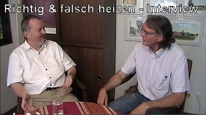

[🠔 Zur Übersicht: Gespräche & Dokus](gespraeche.md)
# Richtig und falsch heizen
**Worauf es wirklich ankommt, um Heizenergie zu sparen.**   
_mit Konrad Fischer, Dirk-Uwe Träger • 14.07.2013_

## Einleitung

Ja, liebe Zuschauer, nachdem Sie mich bisher vorzugsweise von Vortragsvideos kennengelernt haben, habe ich mich mal zu einem Novum entschlossen. Wir wollen heute sozusagen das Heizungs-TV begründen. Wir machen einen Film über richtig und falsch heizen, eines der zentralen Probleme, vor allem, wenn man über das Energiesparen nachdenkt, wenn man über seine vorhandene Heizung oder vielleicht über eine neue Heizung nachdenkt. Hier gibt es sehr viele Probleme zu lösen, und um hier mal den richtigen Einstieg zu finden, darf ich Ihnen den Dirk Uwe Träger vorstellen, ein Experte auf diesem Gebiet, den ich vor einigen Wochen kennengelernt habe. Wir haben inzwischen miteinander einen mehrtäglichen Workshop zum Thema durchgeführt. Wir haben dabei unsere unterschiedlichen Ansichten, kann man sagen, harmonisiert. Ich wünsche Ihnen viel Spaß bei einem bestimmt spannenden Thema, das für Sie auch im Geldbeutel zum Klingeln führen kann, so hoffen wir das jedenfalls.

## Werdegang von Dirk-Uwe Träger

Herr Träger, würden Sie unseren Zuschauern mal kurz erläutern, wie kommen Sie eigentlich zu Ihren Kenntnissen im Heizungsbau?

Also, meine, also schönen guten Tag erstmal. Meine Kenntnisse kommen daher, dass ich früher mal Maschinist für Wärmetechnik gelernt habe.

Wo kommen Sie denn eigentlich her?

Ja, aus Ostberlin. Jawohl, und habe dort Maschinist für Wärmetechnik gelernt, also Facharbeiter für Anlagen und Geräte.

War das für eine Firma?

Das war das Energiekombinat, also ehemals mal BKW, jetzt wieder BKW, und davor halt ja, Energiekombinat zu der Zeit, wo ich dort gelernt habe.

Was haben die gemacht? Haben die Gebäude mit Wärme versorgt?

Gebäude mit Wärme versorgt und aber auch Stromversorgung im Spitzenlastbereich, also ein Spitzenlastkraftwerk. Dort habe ich aber die Stromspitzen, die im Netz anfielen, wurden von diesem Kraftwerk gedeckt. Das heißt, die haben dem Kunden, dem Haus, letztlich Wärme geliefert, Energie geliefert in Form von Fernwärme, auch in Form von Strom.

Genau. Und dort haben Sie eine Lehre durchgeführt, oder was?

Genau, da habe ich eine Lehre durchgeführt und habe halt gelernt, wie man Anlagen wartet, aber eben hauptsächlich mit dem Zweck der Bedienung von großen Dampfkesselanlagen und ja, Öl- und Kohleversorgung von diesen Kraftwerken, wie sie damals in Ostberlin standen. Bin dann ja zu meiner, zur Armee gekommen. Bin dann aus diesem Arbeits-, aus dieser Tätigkeit ja weggegangen, weil dieses Schichtsystem hat mir nicht so gefallen. Kam die Wende, und nach der Wende, also sogenannte Wiedervereinigung, wurde ich dann ja arbeitslos. Habe dann über einen zweiten Bildungsweg meinen Zentralheizung und Lüftungsbau-Gesellen gemacht. Hab dann bei einer Westberliner Firma gearbeitet, habe dort ja meine Kenntnisse aufgefüllt. War eine sehr gute Firma, weil mein Chef war Gutachter für Heizungstechnik, und wir mussten immer sehr präzise arbeiten und ja, es hat sich eigentlich dann auf mein Leben so abgefärbt, dass ich...

Da wurden Sie dann Facharbeiter für, Facharbeiter, Geselle für, für Heizungstechnik?

Genau, genau. So, und dann bin ich ja aus familiären Gründen oder ja, familiären Gründen ins Ausland gegangen. Habe sechs Jahre in Spanien war ich da tätig gewesen. Habe dort als ganz normaler Geselle meinen, meinen, erst wurde ich da abgeworben nach Spanien. Habe dort angefangen zu arbeiten. Habe dann aber irgendwann gemerkt, dass da sehr viel gepfuscht wird und nicht mit der Arbeitsweise, sage ich mal, von meinem ehemaligen Chef zusammengepasst hat, und habe mich dann selbständig dort gemacht. Habe dann auch – das kann man als Geselle im Ausland – dort eine Zulassung gekriegt und habe dort gearbeitet und habe mir dort meinen Kundenkreis aufgebaut, und es lief auch sehr gut dort. Aber die, Ihre Situation durch Trennung und so weiter dort unten hat sich dann so ergeben, dass ich wieder nach Deutschland zurückgegangen bin, der Liebe wegen, und bin dann nach Deutschland, nach Norddeutschland gekommen, nach, in der Nähe von Oldenburg. Habe dort gelebt und wollte denn dort mein ja, Gewerbe anmelden. Da hat man gesagt, ja, tut uns leid, in der Handwerkskammer in Oldenburg, ich wäre nicht qualifiziert genug. Habe ich gefragt, ja, wie die letzten sechs Jahre denn wohl überlebt hätte, weil, wenn meine Qualifikation nicht ausreichte, um Heizung zu bauen, dann hätte ich verhungern müssen. Hat aber gereicht. Dann bin ich anschließend ja auf den Weg gekommen, dass ich gesagt habe, okay, dann muss ich mir eben eine Ausnahmeregelung, Altgesellenregelung gibt’s in Deutschland, dass man als Altgeselle dann halt trotzdem in dieser Tätigkeit kommt. Hab dann die Handwerkskammer dazu bekommen, dass ich zwei Kurse gemacht habe, einmal ein Wasserkurs, das bedeutet also, dass man die Konzession hat, dass man Wasserleitung verlegen darf. Auf gut Deutsch, man kann den Wasserzähler beantragen und einbauen, und eine Gaskonzession, dass man den Gaszähler installieren darf und eine Gasinstallation vornehmen kann. Sind jeweils Kurse. Na ja, ist man so rund 3000 Euro los. Also, aber damit haben Sie Ihre Kompetenz natürlich auch erweitert.

Genau, genau. Dadurch wurde dann eben doch klargestellt, dass... Dann kam aber ja ein körperlicher Schaden, ich hatte einen Bandscheibenvorfall, hatte dann noch eine OP, und bin somit ja, als Heizungsbauer, der nicht tragen kann, ist eine schlechte Karte. Bin dann rausgekommen aus diesem, aus dieser ja, aus diesem Plan, dort mich selbständig zu machen. Bin dann ja über Mundpropaganda an einen Heizungsgroßhandel gekommen. Dort war ich auch bis vor wenigen Wochen tätig, also sechs Jahre, und habe dort den Fachbereich übernommen, regenerative Energien im Außendienst für Technik. Das heißt, ich habe Heizungsbauer und, und Heizungsfirmen und ja, Ingenieurbüros, oder nicht Ingenieurbüros, aber Ingenieure und Heizungsbaumeister besucht und habe dort diese neuen erneuerbaren Energien oder regenerative Energien beraten: Solar, Wärmepumpentechnik, und bin dann eigentlich auf die, ja, dort in, in dieser Tätigkeit darauf gekommen, dass verdammt wenig gerechnet wird, so wie ich es mal gelernt habe in meiner zweiten Ausbildung, also auch schon zu Bundesrepublik-Zeiten. Und habe festgestellt, warum rechnet eigentlich gar keiner?

## Planungsmängel und Fachwissen

Haben Sie eigentlich Planungsmängel festgestellt da draußen, indem Sie Anlagen, die praktisch gelaufen sind, betreut haben, festgestellt haben, da stimmt was nicht, und dann sind Sie darauf gekommen, ja, hier wurde ja schon von der Planung her gepfuscht.

Genau, genau. Und haben Sie da noch Kontakt gehabt mit normalen Heizungen, oder war das dann alles nur mit regenerativer Energie verbunden? Also, ich kann es, kann es so beschreiben: ich war natürlich erst im, im Sinne der, der Firmenleitung dafür unterwegs, dass ich halt diese regenerativen Sachen begleiten sollte: Solar und, und Wärmepumpe und Holzfeuerung. Aber es hat sich dann irgendwie so rauskristallisiert, wenn die Leute natürlich draußen merken, oder die Kundschaft merkt, da ist jemand, der kennt sich mit Hydraulik aus, und der macht sich schon mal Gedanken und rechnet auch mal was nach, auch wenn es nicht im, im Sinne des, des Großhandels ist. Aber ich wurde dann halt öfters auch zu anderen Anlagen zitiert. Mensch, das ist eine große Anlage, die läuft nicht, da werden die Heizkörper nicht warm, woran kann das wohl liegen? So, dass das auch eine breitere, ein breiteres Tätigkeitsfeld dann war, was sich da erschlossen hat. Jetzt waren Sie bei diesem Großhändler. Wie kommen Sie dann an die einzelne Heizungsanlage ran? Also, das hat sich eigentlich so ergeben, dass wenn jetzt beispielsweise eine Heizungssanierung anstand, dass der Heizungsbauer mich mit angefordert hat. Da kommen wir damit hin, und das heißt, der Heizungsbauer hat seinen bevorzugten Großhändler und sagt, die Probleme, die ich nicht lösen kann, die muss dann der Händler lösen, sozusagen. Und wo kommt er dann zu dem? Und und Ihr Chef, der hat dann dafür ja einen Spezialisten dann anbieten können, und so kamen Sie zu dem Heizungsbauer, und der ist mit Ihnen dann in die Lande reingefahren, bis Sie vor der Heizanlage standen. So ist der normale Werdegang da draußen, weil man muss so sehen, der Heizungsbauer an sich, der ist ja auch bestrebt, dass er das vernünftig macht, aber er steht auch doch ziemlich unter Termindruck, und er muss Umsatz schaffen und, und ja, muss seine Abgaben alle bezahlen. Und Sie haben also die Aussage da draußen ist, wir haben ja keine Zeit, so, also, man hat Sie als Expertise da rausgeholt, und Sie haben den unterstützt, um fachlich korrekte Anlagen dann in Griff zu kriegen.

Genau. Oder auch Problemlösung, wenn was nicht funktionierte. Also, war auch öfters mal das, wenn es tropft, wenn es zu kalt ist, wenn es zu... ja, dann hat er angerufen, weil er gewusst hat, da habe ich in meinem Großhandel habe ich einen Spezialisten.

Genau, rufe ich den Post an, und der schickt mir den.

Genau. In der Regel so, dass mich direkt angerufen. Bezahlt wurden Sie jetzt nicht vom Endkunden oder vom Heizungsbauer, sondern das war eben Ihr Job. Das war eine Art von ja, bildende Maßnahme, auch aus Sicht des Groß, Kundenbindung. Und so konnten Sie da recht frei agieren da draußen. War nicht so direkt abhängig, dass Sie da draußen einer bezahlt, konnten sich auch die notwendige Zeit nehmen, dann, um sich in ein Problem einzuarbeiten, und so kam ihnen dann letztlich ein, ein ständiger Zuwachs von Kompetenzen.

Genau, genau. Und jetzt haben Sie da aufgehört und sind nun als freier Heizungsberater sozusagen unterwegs. Wir haben ja schon darüber gesprochen, dass steht erstmal im Raum für eine gute Kooperation miteinander, vielleicht uns mal ausdenken.

Genau. Ja, und jetzt sind Sie da. Wir haben uns vor ein paar Wochen kennengelernt. Wie sind Sie denn auf mich gestoßen überhaupt?

## Kritik an Dämmung und Fensterindustrie

Ja, das ging eigentlich über diesen ersten Bürgerschutztag, der im Internet da war, YouTube lief, und Nürnberger Aktion, Nürnberger Aktion vom 12.05. gewesen, und ja, da habe ich halt diese, diese Ausführungen von Ihnen über Dämmung und Fenster, habe gedacht, Donnerwetter, der Mann spricht, was ich schon lange denke. Das war hier gut, schön. Ja, wir reden mit diesen ganzen Äußerungen von der Industrie, die uns hier Dämmung und Fenster anpreist, und wie viel Energieersparung. Dazu muss ich ausführen, ich habe mich sehr oft privat, also nicht über die Firma, wo ich tätig war, weitergebildet, habe da auch Urlaub für genommen und habe Schulungen absolviert. Habe da zu einem Softwarehaus gute Kontakte aufgebaut und habe sehr viel selber nachgerechnet, weil ich immer so ein Mensch bin, immer sehr kritisch. Glaub nicht, wenn jemand sagt, sind so und so viel. Sie sind schon hinter einige Reklamelügen gekommen.

Genau, genau, genau, genau. Und habe dann festgestellt, es stimmt doch gar nicht, wenn ich die Fenster tausche, sind es eben nicht so, so viel sparen ist, kann man nicht rechnerisch darstellen. Also, Sie haben schon einen kritischen Standpunkt zu diesen Werbeversprechungen verschiedenster Branchen, wie viel man da gigantisch sparen kann. Man liest ja 80, 85 Prozent, und die Politiker rennen rum auf irgendwelchen Veranstaltungen und sagen, so, Eröffnung, ja, da kannst du vielleicht 80 oder 90 Prozent dann einsparen, wenn du das und jenes machst. Bei meinen, den Kunden ist es ja sehr auffällig. Viele glauben zunächst, wenn sie mit ihrer alten Heizungsanlage ja konfrontiert sind und mit den Verbräuchen, das sehen die ja zunächst nur mal, ich habe hohe Heizkosten. Das ist so das Zentrale, was der Kunde da draußen, der Endverbraucher, der Hausbesitzer, merkt. Er sieht eine Rechnung, und die steigt von Jahr zu Jahr, und das hat natürlich verschiedene Sachen. Aber der Kunde, der ist eigentlich fixiert gar nicht jetzt auf den Verbrauch als solchen, sondern der ist kostenorientiert. Der sagt, ich habe hohe Heizkosten. Und in den meisten Fällen muss ich ihn erstmal fragen, ja, wie viel verbrauchst du denn? Und dann bitteschön auch pro Quadratmeter und im Jahr, um damit überhaupt eine Vorstellung zu bekommen, wie bei einem Auto, der hat einen 100 km-Schnitt in der Stadt, auf dem Land und auf der Autobahn und was weiß ich. Damit kann man ja ein Auto ungefähr einschätzen, auch mit diesen offiziellen Werten, egal, ob die nun genau stimmen oder nicht. Aber da kriegt man erstmal eine Vorstellung, dass man eben eine Benzinschleuder hat oder ein wirkliches Sparmodell. Der übliche Hausbesitzer, der hat diesen Maßstab überhaupt nicht. Der weiß zum Beispiel gar nicht, dass der deutsche Durchschnittsverbrauch in einem Einfamilienhaus, egal ob saniert, ob mit Dämmung und ohne, der liegt eben bei circa 18 Liter auf den Quadratmeter im Jahr oder 18 Kubikmeter für die Leute, ja, oder 18 Kubikmeter Gas. Also, ich spreche gern in so Heizölequivalenten, weil man das sich sehr gut vorstellen kann, so ein Liter in einem Makro drin sozusagen. Ja, das sind so einige Vereinfachungen. Ich liebe das eigentlich, weil man dann eben plastisch eine Vorstellung hat, ja, und ein Bild sagt mehr als 1000 Worte. Also, wir stellen uns mal diesen Literheizöl, und mit dem kann man ja auch Äquivalente in Strom oder diese Kilowattstunde oder eben im Gas auch. Jedenfalls, der Kunde, der weiß zunächst mal gar nicht, wie und was, sondern der weiß, ah, ich brauche dann im Jahr 4000, 5000, 8000 Euro, oder 3000 irgendetwas. Und dann muss man ihm erstmal klarmachen, wir brauchen einen Vergleichswert: Wie viel Fläche heizt du und was verbrauchst du dann pro Flächenquadratmeter? Und dann ist natürlich die Frage, ist der Keller warm? Ist im Dachgeschoss auch irgendwie noch mit überschlagen? Dann hat er ja in der Regel verschiedene Temperaturzonen und, und, und. Das kann man dann eigentlich verallgemeinern, kann sagen, gut, das ist irgendwas zwischen 16 und 22 Grad, und diese Fläche, die zählt. Kannst es auch noch alles wesentlich exakter machen, aber um so eine erste Problemanalyse, Einstieg zu finden, ist es ja genug, wenn er in etwa einen Flächenverbrauch sozusagen.

Genau. Ja, und bei diesen ersten Diskussionen ist dann auch für mich immer wieder interessant zu sehen, der Kunde, der verdächtigt ja überhaupt nicht sein Heizsystem, dass da irgendetwas sein könnte, weil da hat er ja seinen guten Heizer und seine schöne alte Maschine, und in den Räumen ist ja alles prima, und da kann er dran drehen an irgendwelchen Rädern oder Thermostaten, vielleicht, ja, das Wort, damit kennt er sich aus. Ja, mach auf, mach zu, mach warm, mach kalt. Und schon, wenn es an die Regelung geht, da muss dann eigentlich schon sein Geliebter kommen, und der muss da irgendwas einstellen, und er stellt es dann so nach bestem Wissen und Gewissen, irgendwie wird’s schon stimmen. Erstmal warm wird’s schon stimmen, denkt er sich. Und jetzt will er Energie sparen, und wie soll das gehen? Und ich habe noch keinen Kunden hier gefunden, der sagt, Mensch, ich muss jetzt aber nicht meine Heizung optimieren, sondern die sagen, ach, es zieht, und diese fürchterlichen Zugerscheinungen, da ist ja wohl mit den alten Fenstern was nicht in Ordnung. Da müssen jetzt neue Fenster rein, und die Fensterbranche, die erzählt ihm Wunder, was er alles sparen kann, und da müssen es dreifach oder zehnfach Scheiben sein und mit irgendwelchen Edelgasen gefüllt, und sagenhafte Konstruktionen sind da am Markt. Niemand verrät ihm, dass in der Regel sein Zug, unter dem er leidet, ein von der Heizung produzierter Zug ist, der eben durch hohe Temperaturen am Heizkörper setzt. Da sich ein Luftkonvektion, eine Heizluftwalze, oder wir sagen auch Zimmertiefun dazu, setzt sich nun in Gang, ja, und staubt seine Atemwege dann ein mit dem Feinstaub, der vom Boden weggerissen wird, und der eben in seine Organe reingepulvert wird. Da zieht es wie Hechtsuppe, die Fenster sind alle dicht, an denen liegt’s nicht. Nur dieser übermäßig warme Heizbrummi transportiert ihm einen Zimmertaifun in sein Bronchialsystem. Da hustet er sich einen Tod, ja, kriegt dann auch, ja, entsprechend Hautreizungen, Krankheiten und was weiß ich, und jammert rum, und die Kinder liegen in der Intensivstation wegen Asthmaschock und so. Es gibt ein ganz tolles Buch, weiß nicht, ob Sie es kennen, 1974, glaube ich, Alfred Eisenschink, ein Großmeister der Strahlungsheizung für die Heiztechnik, hat einen ganz tollen Titel gebracht: Falsch geheizt ist halb gestorben. Den Titel kenne ich. War ein Buch, das mich damals unheimlich bewegt hat und ein komplettes Umdenken heiztechnisch herbeigeführt. Sie wissen, wir machen seit vielen Jahren ja, planen wir Heizungen vorzugsweise im historischen Bestand, vorzugsweise mit der Absicht einer Hüllflächentemperierung, und mache ich große Schlossanlagen und Klöster und auch normale Heizungen in Wohnhäusern. Von daher ist in meinem Büro schon seit der Wende etwa, habe ich ja hier mit dem Mitarbeiter, dem Peter Göring, haben wir hier eine Art von heiztechnischem Ingenieurbüro auch entwickelt, neben der Statik, und von, von daher stecke ich da etwas mehr im Thema drin als der übliche Architekt, sagen wir mal, der so irgendwelche schönen Kuben gestalten will und alten Dessauer Schachtelkäse da als quadratisch, praktisch, gut da draußen gut verkaufen kann. Also zu dieser Sortierung gehöre ich eher. Sage jetzt mal kätzisch Architektenbau, Sockelkasten aus Beton, zu der gehöre ich eher weniger. Ich sehe das immer sehr konkret, und von daher ist auch mein großes Interesse auch mit Ihnen zusammen, mal diese ganzen Fragestellungen rund um die heizungstechnische Problematik ja heute mal anzusprechen und auch sicher weiter zu begleiten. Also, ich kündige schon vielleicht auch einen zweiten Film mal an, wenn alles gut läuft, wenn gute Nachfrage ist nach diesem Film, wenn die Klicks stimmen, da machen wir vielleicht auch noch mal eine Fortsetzung und gehen dann noch weiter ins Eingemachte. Aber jetzt sind wir erstmal bei unserem Hauptthema: Was kann der Kunde machen, um eine Heizung zu verbessern? Und allein diese Fragestellung steht schon überhaupt nicht im Raum bei den meisten Kunden, sondern die fragen, Herr Fischer, ich will Energie sparen, meine Heizkosten sind viel zu hoch. Wie dick soll ich dämmen? Und ich habe ja bei Ihnen schon gesehen, da gibt’s Probleme, mit welchem Dämmstoff soll ich rangehen? Und dann, wenn ich schon die Frage stelle, ja, was verbrauchen Sie denn pro Quadratmeter? kommt schon keine Antwort mehr, oder die Antwort heißt dann, das weiß ich nicht. Und dann legen wir erstmal los, und der Kunde ist so fanatisiert auf diesen Dämmwahn. Das ist natürlich auch ein Ergebnis der Medien und der entsprechenden Reklame, die von der Dämmbranche hier jeden Tag durch die Medien schwappt. Jeder glaubt, er muss am Fenster und an, also, du kannst dich an der Fassade etwas tun, vielleicht auch der Dachdämmer an der Hülle. Und das Naheliegendste, Sie, das Gute ist so nah. Ja, warum in die Ferne schweifen, Sie, das Gute ist so nah. Oder noch anders gesagt: Er sieht ja den Wald vor lauter Bäumen nicht, und jetzt wird er nun motiviert, so in die Kiste zu langen.

## Kritik an Dämmung und Fensterindustrie

Da ist natürlich nicht genug drin. Das heißt, er muss auch noch auf die Bank, da lockt man ihn dann mit irgendwelchen tollen Förderkrediten und Zeug, und dann soll er sein ganzes Haus anpacken und vier Tausende von Euro, eine Schandtat nach der anderen, gechshus bauen. Ja, und es ist also die Perspektive des üblichen Hausbesitzers: Wenn es mir zu kalt ist und wenn ich zu hohe Heizkosten habe, muss ich an meiner Gebäudehülle eingreifen. Manche gehen soweit, dass sie bis, was weiß ich, ihren Keller, den Boden rausreißen und bis Australien Dämmstoff drunter stopfen und glauben, damit ist irgendwas zu wollen. Also, ist für mich ganz fantastisch. Ich habe ja sehr viele Kontakte durch mein Auftritt im Internet, kommt es natürlich immer wieder zu solchen Bauberatungen bundesweit und auch drüber raus, und ich kann das also fast generell sagen, die erste Frage ist immer nach der Hülle.

Ja, und wenn ich dann sage, ja, schau mal her, was sagen denn die Studien, die überhaupt eine Bewertung dieser Maßnahmen an der Hülle zulassen, was sagen die dann? Kennt er die schon gar nicht. Aber dann kennt er ja die schon gar nicht. Ich will das heute jetzt nicht in unserem Gespräch vertiefen, ich will das nur mal generell sagen, alle diese Studien zeigen, das Fenster bringt gar nichts, und die Wärmedämmung außen auf der Fassade erhöht den Heizenergieverbrauch. Logisch, weil die Solarenergie nicht mehr zur Verfügung steht in gewohntem Maße, und entsprechend muss ich dann die Heizung länger, oft einen Monat länger und auch einen Monat eher betreiben, um akzeptable Raumtemperaturen in dem Gebäude herzukriegen. Und je mehr und je mit, je dicker ich meine Fenster mache, auch umso weniger kostenlose Solarenergie kommt rein.

Also, es ist für mich gerade so abenteuerlich Absurdistan, wie gegen den Heizenergieverbrauch gekämpft wird an einer vollkommen falschen Front mit auch lauter Schüssen in den Ofen. Man trifft keinen Feind, sondern man schießt sich selbst ins Knie. Ja, ja, oder können wir auch jetzt heiztechnisch sagen, ein Schuss in den Ofen. Schuss in den Ofen, genau. Was ist denn Ihre Meinung mal so generell? Es wird ja, Sie haben ja in den regenerativen Energien sich viel bewegt. Aus meiner Sicht, ich bin ja auch befreundet mit dem berühmten Solarkritiker, der, der sich jetzt im Ausland befindet auf der Flucht vor der Polizei und der erneuten Einbuchtung. Ich glaube, zweimal war er schon im Gefängnis, weil er sich hier gewehrt hat gegen ungenügende Solarheiztechnik. Aus Ihrer Sicht, Sie stecken ja tief im Thema drin und sind ja auch, sagen wir mal, breit informiert. Sehen Sie ein Problem in der künftigen Versorgung unserer Heizanlagen mit Öl, mit Gas, mit den sogenannten fossilen Stoffen? Ja, sehen Sie persönlich da ein Problem? Glauben Sie, das geht mal aus, und in ein paar Jahren gibt’s da nichts mehr?

## Die Ölkrise und die Theorie der Endlichkeit

Also, die Ölkrise 79, oder wann die war, in den 70ern, die habe ich in der DDR nur nicht so erlebt, da war ich auch noch viel zu jung. Aber tja, eigentlich war es schon 2000 am Ende, und sind 2013 eigentlich mehr. Muss man dazu nicht sagen. Wenn man diese Ölkrise genau betrachtet, dann weiß man, die wurde ja in Salzburg in Schweden organisiert. Man hat das Öl nicht mehr abgeholt. Die Tanker waren voll geladen in den Häfen, in den Häfen da in Kuwait und Saudi-Arabien, Salzburg gelegen. Man hat die organisiert, um endlich mal einen Preisschock auszulösen, also eine Verknappung. Und also, aus meiner Sicht der Dinge ist diese gesamte Endlichkeit, diese ganze Theorie, ist eigentlich ein Verknappungshype, der zu einer vernünftigen Preisgestaltung führt.

So aus meinen Kenntnissen ist, ich habe mich ja dann mit diesem Buch von Thomas Gold stark beschäftigt und habe auch dann weiter Literaturen zu mir genommen, weil man hat ja dann, wenn man mal Blut geleckt, ja, wenn man mal einen kritischen Gedanken gefasst hat, und es hat sich viel bestätigt von den Dingen, macht man weiter. Und aus der Sicht ist ja Erdöl und Erdgas und auch Kohle in sozusagen unerschöpflicher Art und Weise zur Verfügung. Und alles, was wir dazu hier Richtung Endlichkeit hören, sind gesteuerte, ich sage mal, Reklamelügen, die den Preis beeinflussen sollen.

Natürlich ist ja nicht abzustreiten, dass selbst wenn es es ewig gibt, aufgrund der Marktbeherrschungstechniken der Teilnehmer, da wird der Preis nicht in den Keller gehen. Also, damit ist nicht zu lächeln. Das heißt, wir haben ein stetiges Anwachsen des Preisgefüges. Damit drückt sich ja auch ein Geldwertverfall natürlich aus. Ja, ich sag mal, wenn wir den Erdölpreis parallel schalten zum Brotpreis oder zum Liter Bier, wenn wir feststellen, dass da eine Parallelität da ist, die letztlich eine Inflationsrate zum Ausdruck bringt. Hängt ja auch mit dem 15.08.1971 zusammen, wo diese Goldpreisbindung vom Dollar gefallen ist. Ja, jeder, der sich damit beschäftigt.

## Konsequenzen und Empfehlungen für Hausbesitzer

Also, am Preis tut sich was. Das heißt, wir können hier natürlich keine Botschaft lassen, Erdöl gibt’s ewig, und es wird immer billiger. Das wird nicht so sein. Der Geldwertverfall ist zu sehen. Es macht auf jeden Fall Sinn, Heizenergie zu sparen. Das heißt, wir können jetzt, wenn wir jetzt hier zum Beispiel Zuschauer haben, die zu Hause eine Öl- oder eine Gasheizung haben, oder auch eine Kohleheizung, die Botschaft ist, sie muss nicht rausgeschmissen werden, weil in ein paar Jahren alles vorbei ist. Die Botschaft kann nur sein, wir optimieren, um einen möglichst niedrigen Heizenergieverbrauch dann zu haben, und das lohnt sich ja immer, egal jetzt, welche Heizenergie wird zur Verfügung.

Ob wir es elektrisch anmachen, es gibt ja da auch elektrische Direktheizgeräte, es gibt die alten, ja, wie, wie sagt man, Nachtspeichergeräte, die sollten erstmal verboten worden. Dann im Zug dieser Energiewende hat man gemerkt, das ist gar nicht so schlecht, wenn man sowas hat, wo auch in der Nacht, im Nachtbetrieb noch ein Abnehmer ist für diesen Puffer, wird die Energie von Fotovoltaikanlagen werden da reinfahren und ist also einfach ein Puffereffekt, der ist auch günstig für diese verrückte Wende, und schon ist das Verbot gekippt. Habe ich mir ja, das ist die Erwartungshaltung in der neuen EnEV, es soll es zu einem ja, Wiederbeleben dieser Nachtspeichertechnik sein. Aber auch die Direktheizung. Wir wissen von Frankreich, etwa 80 Prozent der französischen Heizungen sind elektrische Direktheizgeräte und eben auch Nachtspeichergeräte. Das ist der Strom ist dort auf einem ganz anderen Stellenwert als in Deutschland, ist auch günstiger und gut. Aber das ist heute nicht unser Thema. Wir wollen also über diese strombetriebenen Dinge, mal abgesehen von der Wärmepumpe, etwas weniger reden. Uns interessiert heute die Warmwasser geführte Heizung, wo man einfach sagt, das ist eine Zentralheizung, so ungefähr Zentralheizung.

Ja, und um hier den Einstieg zu finden, wir haben jetzt schon gesagt, wir brauchen die alte Warmwasserheizung, seitens ihrer Kesseltechnik, seitens ihrer Brennertechnik, nicht rauszuschmeißen. Wir können sicher davon ausgehen, es wird auch weiterhin eine Versorgung dieser Brennergeräte geben. Wir denken, ich denke dran, wir sollten mal vielleicht mit dem Problem des Heizkessels selber mal den Einstieg in die technische Diskussion hier starten. Sind die Heizkessel, die in Deutschlands Häusern stehen, eigentlich korrekt bemessen? Funktionieren die so, wie sie funktionieren sollen? Gibt’s dann Bedarf? Was ist da Ihre Meinung?

## Überdimensionierte Heizkessel

Also, meine Meinung ist erstmal, um Ihre eingestellte Frage noch mal zu beantworten: Die Leute wollen Energie sparen, fangen bei Fenster und bei Dämmung an, aber das Naheliegendste, mal meinen Heizungsbauer anrufen, kann ich an meiner Heizungsanlage was tun? Auch nach durchgeführten Dämmmaßnahmen kann man ja an der Heizungsanlage was tun, aber da kommen wir vielleicht später noch mal zu. Es geht’s dazu, und ich sage, die, die Heizkessel sind also, wollen wir mal sagen, zu 90 Prozent überdimensioniert. Also, wir haben zu große Heizkessel drin. Bringen wir mal Beispiele, die ich selber nachgerechnet habe. 12 Familienhaus, stand 210 kW drin, wir brauchen 70. Wie kommt es zu dieser Überdimensionierung? Wer hat die zu vertreten?

War da der Architekt dran schuld? Der Architekt? Nee, eigentlich ist es ja immer die Werkleistung von dem, von dem Heizungsbauer oder von dem Planungsbüro, die man die Ausschreibung gerechnet hat. Oder Architekt ist doch der Generalist, der muss doch von allem und jedem Bescheid wissen. Hat er Schuld oder hat er keine Schuld, wenn hier viel zu großer Heizkessel angeliefert wird? Was hätte der für Möglichkeiten gehabt, um in Richtung einer korrekten Heizkesselbemessung zu wirken? Was hätte er machen sollen? Ja, hätte sich, ich interessiere mich ja, deswegen ich sage zum Spaß, ein dummer Architekt. Ich bin dann konfrontiert mit irgendwelchen Aussagen dieser Experten, der Fachingenieure, und man vertraut. Ich vertraue doch meinem Heizer. Ja, der sitzt dann so da mit seinen wasserhellen Augen und sagt, Herr Fischer, da brauchen wir 97.000 Kubik irgendwas und Kilowatt, und ich verstehe kein Wort von all dem und sag, der wird schon recht haben, aus dem hat beschmutzte Hände. Den Leuten vertraut man.

Ja, also, woher kommt diese Überdimensionierung? Die Überdimensionierung kommt daher, wie gesagt, die Installateure stehen ziemlich unter Druck, dass sie ja ihre Aufträge kriegen. 60er Jahren auch schon, hat doch alles wunderbar geboomt. Wenn wir mal über die älteren Geräte reden, die sind also, also meistens extrem überdimensioniert. Woher kommt das? Vielleicht aus dem falschen Berechnungsverfahren. Der hörte eben doch Berechnungsmodelle. Der hatte Berechnungsmodelle, aber die wurden dann halt immer noch mit Angstzuschlägen beaufschlagt. Also, ich sag mal, ein klassischer Angstzuschlag einer falsch dimensionierten Heizung ist, den Heizkörper so breit zu wählen, wie das Fenster, was da drüber liegt. Man muss den meisten gar nicht, aber wenn man es berechnet, dann kann man es halt so dimensionieren, indem man beispielsweise einen flacheren Heizkörper nimmt, der dann die Breite hat, damit optische Gründe auf diese ästhetischen Gründe, die die Frauen so gerne haben. So, jetzt sind wir schon am Heizkörper, und von dort leitet sich dann der Kessel.

## Falsche Berechnungsverfahren und Konsequenzen

Also, ich fange mal von vorne an, um ordnungsgemäß zu planen, muss man wissen, welche Gebäudehülle haben wir dort. Wenn wir diese, diese, dieses Haus haben, dann wird dort auch mal eine Baubeschreibung gegeben. Da sind Sie wieder als Architekt gefragt, wobei da gibt’s echt Engpässe, wenn man da nachfragt, also, ich habe diese Sachen schon öfters mal nachgefragt beim Träger oder äh beim Häuselbauer nachgefragt und sagen, wie ist denn das Haus gebaut? Gerade in der heutigen Zeit mit riesigen Energiesparzwängen werden ja da riesen Dämmung und so weiter montiert. Ja, wie ist denn die Hülle aufgebaut? Wie sind die Fenster? Welche Wärmedurchgänge sind da? Welche Wärmedurchgänge sind diese, diese die Hülle, also die Außenwand, Fußboden, Dach und diese Sachen, die werden schon äh erstmal in so einem ja, Wärmeschutznachweis gerechnet, damit der überhaupt eine Baugenehmigung bekommt. Und dann wird fälschlicherweise dieser Energiepass oder dieser Wärmeschutznachweis dafür genutzt, um eine Heizungsanlage auszulegen. Daraus kommt in der heutigen Zeit, weil wenn man diese, diese Energiepässe sieht, die sind nach Klimareferenzort Würzburg hier unten errechnet: -14 oder -16 Grad, die kommen aus der nördlichen Region da oben. Dort haben wir -10 Grad als Norm-Außentemperatur laut der Heizungsnorm, aber alle mit 19 Grad. So, und das wird dann dafür genommen, um den Heizkessel zu bestimmen, also schon mal völlig daneben.

Jetzt wissen wir ja, dass diese gesamte U-Wert oder früher K-Wert-Berechnung reine Fiktion ist. Die kennt keine Speicherfähigkeit, die kennt keine Sonne. Das heißt, die findet irgendwie im, im Labor unter Normbedingung statt, im abgedunkelten Labor statt. Es gibt keinen Wärmeeinfluss der Sonne auf die Wand. Es gibt ein bisschen was, was durchs Fenster gehen soll. Auch hier wird nicht unbedingt alles korrekt dargelegt. Sobald ich den Wert nehme, kommen abenteuerliche Irrtümer raus. Das zeigen ja alle Untersuchungen der Praxis, wo man dann vergleicht, hier ist gerechnet und hier ist tatsächlich verbraucht. Und da gibt’s so gut wie keine Koinzidenzen, sondern wir haben Abweichungen von über 90 Prozent in diesen wissenschaftlichen Untersuchungen, und mit diesem Modell will man nun nicht nur das Wärmeverhalten eines Hauses, sondern damit organisiert man nun auch die Kesselgröße. So sieht’s aus. Das heißt, das kann ja überhaupt nicht passen. Also, weil an dieser Stelle muss eigentlich Professor Mayer erwähnen, weil der hat halt maßgeblich mein Denken verändert, nachdem ich in zwei Ausbildungen über Wärmelehre gelernt habe, weil in den Schulbüchern halt so steht. Habe ich dann halt mal ein Buch in die Hände bekommen: Phänomen Strahlungsheizung von Professor Mayer. Das darf ich kurz vielleicht mal vorführen. So, wir sind wieder zurück und und präsentieren hier mal das Phänomen Strahlungswärme, Strahlungsheizung. Ein ja, ein Klassiker inzwischen der korrekten Betrachtung, wie geht’s zu mit der Energie, mit der Wärme im Haus? Genau. Und dieses Buch sucht seinesgleichen. Ja, sind wir uns einig. Sind wir uns einig, gibt inzwischen schon, was weiß ich, die x-te Auflage. Sie haben die zweite, glaub ich, schon vier Jahre alt. Ja, ich glaube, es gibt schon vier oder fünf. Ein Renner und ein Klassiker für alle Leute, die wissen wollen, wie geht’s eigentlich wirklich zu. Mit der wirklich sagen, besser sind immer. Das stimmt. Ja, also, die Modelle, die Hypothesen dieser Strahlungsphysik treffen die Realität etwas genauer als, als ohne diese.

## Buchempfehlungen von Konrad Fischer

Ja, ich stelle dann auch gleich hier noch mal ein paar weitere Klassiker vor. Energiesparen am Gebäude, auch eine sehr schöne Einführung für den Laien, auch gut geschrieben. Dann ein weiterer Klassiker, Mythos Bauphysik. Hier wird sozusagen alles zerlegt und zersägt, was die Branche entwickelt hat, um ihre Umsätze über bauphysikalische Berechnungen und Anschauungsmodelle ja zu verbessern. Eines der letzten Werke heißt Verwildertes Bauen. Da wird natürlich ja, wird sehr viel Kritik geübt und wird auch präzise benannt, was falsch läuft im Bauen. Auch ein interessantes Thema, das betrifft nicht nur die Heizungstechnik, sondern betrifft eben ganz viele Phänomene, die in der Baubranche zu bemängeln sind, sagen wir mal so. Und dann der ursprüngliche Hammer, das war so, hat das mal angefangen, Richtig Bauen war dritte Auflage, schon die vierte, völlig neu bearbeitet. Inzwischen bin ich immer bei sechs oder sieben, wurde also immer voluminöser. Richtig Bauen, da ist dann auch die komplette Baubranche angesprochen, wie geht es richtig und was läuft falsch. Das sind die interessanten Bücher von Professor Mayer, und über die wurden Sie nun auch, also speziell über dieses Phänomen, über dieses Phänomen, das sind, Sie, sind Sie zum Umdenken gekommen. Genau, genau. Also, diese, dass diese U-Wert-Berechnung halt ja. Nun, wir sind wieder an der Dimensionierung des.

## Rückkehr zur Dimensionierung des Heizkessels

Genau. Also, um, um Gebäude zu beheizen, muss man ja eigentlich sagen, wir wollen einfach bloß die Wärme wieder herstellen, die irgendwo verschwindet über Transmissionswärmestrom, freie Lüftung, also durch Fugen und durch ein offenes Fenster. Diese Wärme müssen wir irgendwie wieder bereitstellen, damit wir da drin Behaglichkeit haben. Oft würde es auch an der Temperatur gemessen. Wenn man Professor Mayer gelesen hat, dann ist die Temperatur gar nicht maßgeblich, sondern es ist auch die Hülle des Raums, also die Lufttemperatur ist, sondern eigentlich müsste man sagen, die Behaglichkeit. Wir wollen da drin Behagen haben. Ist egal, wenn, wenn bei 10 Grad schon Behaglichkeit haben, sollte uns das genügen. Genau. Das hat jetzt nicht mit der Temperatur zu tun. Die Temperatur wird aber hoffnungslos überbewertet. Man sieht, da gibt’s dieses von Bedford und Liese erstelltes Behaglichkeitsdiagramm, aus dem sich dann ableitet, wie die Wandtemperatur mit der Lufttemperatur korrespondiert. Vereinfacht gesagt, kalte Wand braucht heiße Luft, und warme Wand kann mit kühler Luft gut funktionieren. Und daraus leitet sich nun ab: Wenn es uns gelingt, eine schöne warme Wand oder eine schöne warme Gebäudehülle zu präsentieren, heiztechnisch eine schöne warme Hülle zu haben, können wir uns leisten, mit sehr gesunder, kühler Luft, mit geringen Heizluftverlusten, auch energiesparend und gesund die Häuser zu beheizen. Genau, das ist eigentlich die zentrale Botschaft aus diesem Ganzen, und deswegen müssen wir uns mit dem Phänomen der Strahlung viel mehr beschäftigen, als das üblicherweise stattfindet. Konventionelle Heizung wird favorisiert. Genau.

Aber darauf zurückzukommen, also, als Erstes, wir haben ein Haus, wir wollen die Bauteilhülle haben, und damit wir diese nach U-Wert-Berechnung, wie es heute noch nach 12831 Euronormen gefordert wird, Heizlastberechnung, die wird oftmals gar nicht erstellt oder wird eben geschätzt über den Energiepass, den der, oder Wärmeschutznachweis, den jeder für den Bauantrag braucht. Also, man wendet das System Pi mal Daumen an. Genau. Ist das nicht ebenso genau wie eine falsche U-Wert-Berechnung? Genau. Also, die, die man liegt also damit so falsch, dass wenn man im Nachhinein die Verbräuche der Häuser zurückrechnet, dann merkt man, dass das überhaupt gar nicht passen kann, weil die Prognosen, die auch von vielen Energieberatern, Prognosen werden, die sollten die Leute doch mal, ja doch im Nachhinein einfach mal überprüfen. Ja, das sind ja so, kenne ich das auch, ich habe sehr viele Energieberater-Geschädigte Kunden. Man macht ungeheuerliche Versprechungen, das löst dann den Investitionsreiz aus auf der Kundenseite, der sagt, ab, wenn ich so viel sparen kann, dann ist es ja ein Leichtes, diese Investition, die ich über die Bank machen muss, weil ein großes Volumen ansteht, das spare ich dann später wieder ein. Da gibt’s richtig tragische Fälle. Ich habe gerade hier einen aus Trier, dem wurde versprochen, er könnte mit diesen Ersparnissen könnte er locker die 100.000, die er einsetzen muss, refinanzieren in 10 Jahren, und hätte monatlich sogar noch über 100 Euro über. Dann kam die erste Abrechnung, und das Ergebnis war, er war schon vorher verzweifelt, weil er hat plötzlich mit der neuen Heiztechnik seine Wohnungen, die er mit geheizt hat, nicht mehr warm gekriegt, und hat rausgekriegt, er braucht jetzt plötzlich 30, also 3000 Liter Öl-Äquivalent, sagen wir mal so, mehr als vorher. Ja, und das sind natürlich Katastrophen, und das ist das Ergebnis, das ein Energieberater hinterlassen hat, weil der hat dieses ganze Ding bis zur Bauleitung durchgezogen, und mit diesen faulen Versprechungen den Kunden in eine Katastrophe, finanztechnisch, aber auch dann technisch von der Heizung her. Er kriegt die Buden nicht mehr warm und zahlt 3000 Liter Öl, er hat kein Behagen, er hat die Geldausgabe, er hat eine Firma, die mit auf den Leim gegangen ist, die natürlich jetzt Probleme hat, ja, weil wer hat jetzt den Mangel zu vertreten? Aber ich sag mal, hier sind die Energieberater vorzugsweise in der Pflicht, die sind ja auch in der gesamtschuldnerischen Haftung, die einzigen, die einen Puschen versichert haben, hoffe ich mal, Werkvertrag.

## Heizenergetischer Verbrauch vs. Bedarfsberechnung

Ja, und äh, damit ist, sag mal, der Energieberater im Fokus. Und viele andere Fälle zeigen mir, was Sie eben gesagt haben. Wir haben ein generelles Auseinanderklaffen des heizenergetischen Verbrauchs mit dieser Bedarfsberechnung, die auf Basis der U-Werte erstellt wurde. Das jüngste in dem Bereich war eine Untersuchung der, war das Techem oder ist da jedenfalls von diesen Heizenergieablesern. Die haben an über 300.000 Fällen dargelegt, dass generell bei den alten Gebäuden, ungedämmt, die Verbräuche wesentlich unter den Bedarfsberechnungen liegen. Dafür dann bei den modernen Dämmoden entsprechend umgekehrt liegen die Verbräuche wesentlich über der Bedarften. Ja, dann gibt’s dann Ausreden dafür in reicher Menge.

Aber auch in der berühmten Cambridge Studie. Man hat an der Universität Cambridge auch mal diese ganzen Daten, die zur Verfügung waren, aus Deutschland, aus Belgien, also international recherchiert und kam hier auch zu einer generellen, zu einem generellen Auseinanderklaffen zwischen Theorie und Praxis oder zwischen Berechnung und Wirklichkeit. Das heißt nun, wieder zurück auf den Heizkessel, wir können doch weder vom Pi mal Daumen noch von dem Rechenmodell mit vollkommen irrealen Verhältnissen ohne Sonne, ohne diesen Tag- und Nachtrhythmus, ohne eine klimagenaue Betrachtung des Standorts. Wir kommen doch zu gar keinem verlässlichen Ergebnis. Bauteil in Behaglichkeit. Behaglichkeit heißt, stellt sie nach 24 bis 48 Stunden ein. Zeigen Sie mir mal den Ort in Deutschland, wo ihre Außenwand 48 Stunden innen wie außen die Temperatur hat. Haben wir nie, gibt’s nicht.

## Verantwortlichkeit und Haftung des Heizungsbauers

Kann man jetzt dann eigentlich dem Heizer einen Vorwurf machen? Kann man sagen, du, was hast Du hier falsch? Pi mal Daumen rausgekriegt? Oder wenn du dich noch sogar mehr angestrengt hast, hast du genauso einen Blödsinn gemacht, hast da irgendwas gerechnet mit damals K-Werte, heute U-Werte? Dann kam was raus, und das hast du dann geliefert und hast dann so nach freiem Ermessen noch einen Angstzuschlag drauf gesetzt, weil nichts schlimmer als ein Kunde, der friert. Lieber soll zehnmal mehr Heizenergie verpuffen, aber frieren darf er nicht. Warum nicht? Weil ja eigentlich wir beide wissen das, wir sind Praktiker. Wenn die Frau friert, dann ist das Familienleben am gestört. Ja, sehr gestört. Ja, und das darf nicht passieren, weil zum Schluss wäre ja dann der Heizer dran schuld. Das heißt, wahrscheinlich auch der Großhandel, wenn er mitgewirkt hat, hat er ja auch gedacht, na, lieber noch einen kleinen Zuschlag drauf. Ja, da muss man aber die gesetzliche Lage sehen. Der Heizungsbauer ist ja auch, wenn er von seinem Zweistufen-, Dreistufen-Vertrieb so in Deutschland gibt sein Produkt ja, ich sag mal, vorgekaut präsentiert bekommt, da muss er trotzdem alle Komponenten selber noch mal nachrechnen. Wenn er nicht tut und blind vertraut, er ist derjenige, der dafür, er hat die Haftung. Ja, nun gut, es gibt natürlich auch die Beratungshaftung seitens der Lieferstrecke, da sind schon durchaus Pflichten da. Allerdings ist rechtlich gesehen nicht üblich, dann den letztlichen Zugriff auf den zu finden, der das alles verursacht hat. Man hält sich, den, altes Motto, den letzten beißen die Hunde.

## Spielräume im Großhandel und Folgen für den Endkunden

Ja, da ist immer noch so die Sache, komme ja nun aus dem Großhandel, wenn ein guter Kunde ist, dann sind natürlich auch die Sachen so, ja, da sind die, die Spielräume da. Man will den Kunden nicht verlieren, teilen uns den Braten oder solche Sachen werden dann schon gemacht. Ja, aber rein aus Sicht des Endkunden, der jetzt gelackmeiert ist, falsche Heizung, sagen wir mal ganz allgemein, der wird sich natürlich logischerweise nach dem Motto, den letzten beißt unten, an den Heizungsbauer wenden. Richtig, richtig. Wobei wir, wenn wir das mal ganz nüchtern betrachten, objektiv, der Heizungsbauer hat nicht unbedingt das Regulatorium, das heißt, die Möglichkeiten, um tatsächlich eine korrekte Heizung abzuliefern. Das ist ja jetzt das, was ich ein bisschen so rauslese: Die Rechenmodelle stimmen nicht. Genau. Und das Pi mal Daumen stimmt auch nicht. Es ist von Angst geprägt, wie dann eine Bemessung zustande kommt, überdimensioniert. Ob dann es klappt, ist ein bisschen Zufall, aber tendenziell entsteht grundsätzlich eine Heizungsanlage, die zu viel verschluckt. Ja, das heißt also, der Kunde ist da mit seinem Trabant unterwegs, hat aber Mercedes-Motor drin. Richtig. Ja, und der tuckert natürlich schrecklich vor sich hin, weil nichts passt.

## Analogie zur Überdimensionierung

Ja, können wir das mal so? Ja, oder, oder die, also, man kann es mal gerne so beschreiben: Die, die Überdimensionierung findet also so statt, Ziel ist die Behaglichkeit, Wärme, also Wohlbehagen in unserem, die Frau soll nicht jammern. Die Frau soll nicht jammern. Bei uns im Haus soll alles schön sein, und eine Analogie dazu ist beispielsweise, meine Heizung macht das, was sie machen soll. Ich habe mein Wohlbehagen. Wenn man jetzt ein Auto beispielsweise nimmt, man nimmt einen Tieflader und holt damit seine Brötchen, dann verbrauchen wir ein bisschen mehr, als wenn wir mit einem kleinen Pkw wieder rüberfahren. Das Ziel war gewesen als Analogie, wir holen unsere Brötchen, wir haben das erreicht, aber zu welchem Aufwand? Und so funktioniert der, zu gelaufen, zum Bäcker, haben uns ein Mantel oder Pulli angezogen. Ja, aber heute sind wir im T-Shirt und barfuß, und die Frau soll nicht frieren. Genau, muss alles glühen. Ja, also, noch mal, es sind also viele Phänomene, die dann doch zum ungünstigen Heizkessel führen.

## Die Theorie vom falsch bemessenen Heizkessel

Richtig. Aber, und jetzt möchte ich fast die Theorie wagen, in jedem deutschen Haus steht ein falsch bemessener Heizkessel. Kann man das so sagen? Ja, großer Teil, ja. Wir haben jetzt in unserem Workshop hier, wir haben hier meine Büroheizung, die ich als Mieter hier, so wie sie ist, übernommen habe, mal ein bisschen näher untersucht. Wir haben auch meine neu konzipierte Heizung in meinem Wohnhaus, eine Nachrüstung in einem 60er-Jahre-Haus, haben wir auch angeguckt. Wir haben einmal einen alten Buderus Gusskessel herumstehen. Wir haben in meinem Wohnhaus haben wir Viessmann-Gerät stehen, auch in, in Guss, aber also schon Bauqualität, ja, noch nicht Brennwert und so. Aber wir haben auch da festgestellt, dass wir durchaus Störungen im Betrieb haben, die mir persönlich jetzt in dieser, dass man sie in dieser Präzision detektieren kann, wie das jetzt in unserem Workshop doch dargelegt wurde, das war mir überhaupt nicht bewusst. Ja, wie genau man heiztechnisch ankommt. Ich muss ja zugeben, ich bin ja selbst doch nur ein Architekt, und ich bin kein Heizungsbauer. Das heißt, meine Erkenntnisfähigkeit, die ist dann so im letzten Heizkörperventil nicht so vorhanden, wie bei Ihnen, wo Sie wissen, wie montiere ich das, wie dimensioniere ich, was geht kaputt und so. Also, da bin ich nicht so tief drin. Und deswegen ist es ja so eine interessante Korrespondenz, so, unser beider Zusammenschau. Wir sind in dieser Theorie mit der Berechnung und auch den Anschauungen dieser Strahlungsphysik, da sind wir vielleicht ein bisschen breiter aufgestellt als Sie jetzt mit nach einem Buch. Ich habe viele, viele Jahre mit Mayer schon seit 96 kennen wir uns sehr gut und haben also zig Seminare in ganz Deutschland gemeinsam durchgeführt, gemeinsam vorbereitet, ausgewertet. Ich habe, ich kenne seine Bücher, zum Teil habe ich ja so kleine Vorwörtchen dazu geschrieben und also, ich habe einen sehr intensiven Kontakt zu Professor Mayer. Und wenn wir auf, sage ich mal, technische Fragen stoßen, die in seiner Kompetenz sind, da ist ein Anruf natürlich das einfachste Mittel. Ist ganz klar, und wir kooperieren da eigentlich sehr gut. Aber bei Ihnen ist eben diese praktische Anschauung voll da, und insofern war das für mich eine riesen Verblüffung, was alles schieflaufen kann an einer Heizung, wenn man schon nur den Kessel anguckt, und auf die anderen Themen kommen wir ja noch.

## Tipps für den Heizkesselbesitzer

Genau, genau. Jetzt bei diesem Kessel, wo kann denn, was soll denn der Heizkesselbesitzer nun mal achten, um vielleicht mal einen kleinen Funken des Misstrauens dann seinem Kessel gegenüber zukommen, worauf soll er denn mal so gucken bei seinem Kessel? Das ist ja oft ein Buch mit sieben Siegeln, gerade die moderneren mit ihrer Regeltechnik und so weiter. Gibt es irgendwas, was der Kesselbesitzer selber mal angucken kann und zu sagen, läuft oder läuft nicht? Also, ganz einfaches Hilfsmittel ist Typenschild gucken, wie viel kW da drauf stehen. Und das schafft er noch, der Hausbesitzer, wenn er das Typenschild findet. Wir reden also über ein kleines Metallschild, steht Bau, ja, auch eine Leistung drauf. Die modernen Kessel sind alle bunt, aber da gibt’s ein kleines silbernes Schild, irgendwo vorne, hinten, unten, oben oder vielleicht auch in der Bedienungsanleitung, was welcher Kessel ist da. Und dann findet er ja, mein Kessel hat XY. Also, der, der sicherste Weg, fällt mir gerade ein, ist der Kaminkehrer, weil der macht ja seine Abgasmessung. Der ist ja nicht immer da. Noch nicht, noch nicht. Immer öfter, aber er hat ja ein Abgasprotokoll, und in diesem Abgasprotokoll stehen eigentlich die Details zum Kessel, wie viel Leistung hat der. Das klebt oft so am Kessel dran. Klebt am Kessel dran, aber man kriegt eine Rechnung, da steht auch drauf, soweit mir bekannt. Ich habe keins, weiß nicht. Da muss also noch nicht mal mehr in den Raum gehen, schau doch mal auf die Rechnung. Genau. Und da kann man diesen, diese Kesselleistung ja ablesen, und dann hat man Zahl, nehmen wir 20 kW.

## Analyse der Kaminkehrerrechnung

Und das machen wir jetzt mal ganz praktisch. Ich hole mal jetzt meine letzte Kaminkehrerrechnung. Jetzt präsentiere ich Ihnen meine letzte Kaminkehrerrechnung, auf die wir jetzt gekommen sind als Thema. Mein Kaminkehrer schickt hier also eine Rechnung über 38,82. Und diese Rechnung liegt bei eine Bescheinigung, aus der nun Verschiedenes hervorgeht. Ich gebe das jetzt mal Ihnen, und da können Sie jetzt mal so präsentieren, was wir da alles haben. Vielleicht kann ich das dann auch einblenden im Film. Genau, genau. Also, wir haben jetzt hier zum Beispiel eine Nennleistung von 78 kW hat der Kessel. Und worauf ich hinaus wollte, hier sind noch die Abgasverluste, wie viel feuerungstechnische Verluste da halt auftreten und so weiter. Da wollen wir ja nicht weiter drauf eingehen, wie die Messbedingungen waren, welche Raumtemperatur, welcher Kessel, Kesselmediumtemperatur war, so wie war die Warmwassertemperatur im Kessel, ist die Wärmeträgerflüssigkeit sozusagen. Aber für mich ist die Aussage, der Kessel hat hier 78 kW, das ist also erstmal die Grundvoraussetzung. Wie alt ist der Kessel? Steht da auch drauf? Der ist, oh, der ist sehr alt, der ist von 1965. Und der Brenner, antikes Stück, 1978. Ja, schon ein bisschen weniger antik. Schon nur historisch. Ist ist historisch gut. Ja, so ist man halt als Mieter, ist man an das gebunden, was sich der Vermieter leisten will, und haben einfach ein sehr robustes Gerät, ist noch nicht zusammengefallen, ohne große Regelung. Also, wir haben einen Workshop da unten schon statt, und haben uns das alles angeguckt. Ja, der Abgasverlust liegt bei 10 Prozent, also im Prinzip können 10 Prozent von meinem Heizöl genutzt werden, sagt diese Zahl aus. Aber das sind ja auch die Kaminabgase, muss auch ein bisschen Wärme da sein, sonst wird ja alles nass, ne? Genau.

## Einfache Berechnung zur Überprüfung der Kesselleistung

Also, jetzt ist aber der entscheidende Faktor, wohin wollte, diese 78 kW. Also, wir haben dort einen Kessel, der ja, kann 78 kW Wärmeleistung, und eine einfache Zahl für jeden nachvollziehbar ist, wir nehmen die Kubikmeter oder die Liter Öl. Maß hier unten in Bayern und sagen, wir haben, nehmen wir 3500 Liter Öl im Jahr verbraucht oder Kubikmeter und teilen die einfach mal durch 250. Ist eine empirisch ermittelte Zahl, und dann kommen wir auf 14 kW, die wir bräuchten. Und dann sehen wir eigentlich schon, wir driften auseinander, was braucht mein Kessel. Also, in meinem Fall sind, glaube ich, so um die 5000 Liter. Ja, also, bin nicht der Kopfrechner, aber wir können 250 Zack. Kopf, 20 kW. Ja, 20 kW bräuchten wir hier. Wir bräuchten 20 kW, haben aber einen Apparat von 78. Das ist natürlich hoch. So, also, das ist jetzt die, die Zahl, wie gesagt, empirisch ermittelte Zahl ist immer so der Schnellschuss, einfach mal machen kann, passt das. Dann geht’s natürlich, also, wir merken uns diese 250. Ja, wir nehmen unseren Heizölverbrauch oder unseren Kubikmeter Gasverbrauch, teilen durch 250, empirische Zahl, und dann sehen wir ja, den Regulärverbrauch. Das ist jetzt nicht errechnet, sondern aus der Praxis zurückgerechnet, anhand der Betriebsstunden und so weiter. Egal, wie günstig nun die Heizung läuft, ob sie mehr verbraucht oder weniger, Wurst, egal. Mein Nutzerverhalten ist mit drin, geteilt durch 250, das wäre die Kilowatt. So groß müsste der Wärmeerzeuger sein. Also, ganz einfachste Lösung für jeden Endkunden nachvollziehbar. Sehr gut. Und dann kann man ja schon mal sehen, ach, da so.

## Optionen für Mieter bei überdimensionierten Heizkesseln

Und jetzt, jetzt stehe ich da mit dem, als Mieter, mit einem krass überdimensionierten Kessel, dessen Unwirtschaftlichkeit ich ja finanzieren muss durch die Heizkostenabrechnung. Muss ich den jetzt rausschmeißen auf meine Kosten? Muss ich jetzt meinem Vermieter böse Briefe schreiben und die Miete kürzen? Das führt ja alles in eine Konfliktlage. Richtig. Uns hat ja interessiert, wie kann ich denn selber vielleicht durch ein paar Optimierungen, die ich mir als Mieter leisten möchte, weil sie mir sofort zugute kommen. Welche Chancen habe ich an diesem Kessel überhaupt was Positives zu erreichen? Also, die erste Chance an dem Kessel sind, wenn dort eine Regelung dran ist, dass man die Vorlauftemperatur korrigiert, also, dass man die Temperatur, die ins Heiz, geht, runter nimmt. Dann können wir schon mal zu anderen Schaltzeiten von dem Kessel kommen. Führt es dann auch zu einem Versottungsproblem dann im Kamin? Genau. Man kann nur bestimmte Grenzen runterfahren. Beim Ölkessel ist noch so, dass wir die neueren Kessel sind halt so gebaut, dass die korrosionsbeständig sind. Da kann ruhig der Taupunkt liegt bei 47, 46 Grad bei Heizöl und bei Gas bei 55 Grad bei Gasgebläsebrennern. Die, die können wir dann an der Stelle ruhig äh äh, da muss man halt das unser, unsere untere Messlatte.

## Drosselung der Kesselleistung und ihre Auswirkungen

Jetzt mal Klartext, wenn ich die Kesselleistung drossle, sagen wir mal das so, dann entstehen ja geringere Temperaturen, sind auch gewünscht in meinem Heizverteilungssystem. Das ist ja üppig bemessen, zu üppig. Aber es entstehen auch geringere Temperaturen im Kesselbrennraum selber, und es entstehen geringere Temperaturen auch in dem Kamin, also im Abgassystem. Diese Sachen müssen wir natürlich beachten, und da kommen natürlich dann auch ungünstige Versottungsgefahr vom Schornstein, Betriebszustände, die eben zu Schäden führen. Auch ein Kessel. Hab mir ein Kaminkehrer jüngst erzählt, da gibt’s eine ganz einfache Lösung, um zum Beispiel Versottungsgefahr im Kamin sozusagen zu vermeiden: Man macht einfach das untere Kamintürchen an Spalt auf, so dass da immer eine schöne trockene Frischluft mit hineingesogen wird, und schon ist vorbei mit dem Versotten. Haben Sie damit Erfahrung? Es gibt ja sogenannte Nebenlufteinrichtungen. Genau. Das ist natürlich die Kosten-Variante. Ja, das, Nebenluftklappe, glaub ich, genau, genau. Und Zugbegrenzer kosten ein paar hundert Euro, habe ich mir sagen lassen. Ja, der Einbau mit allem drum. Wir denken einfach mal an einen Handwerker, der muss kommen und soll nicht muss Schmutz auch wieder wegräumen, eingeputzt werden. Wenn man also, das sind paar hundert Euro fällig, dann habe ich eine Nebenluftklappe, und kann mir dadurch eine geringere Kesselbrennertemperatur leisten. Ist, ist richtig. Ja, richtig. Aber, und das könnte ich auch ohne Geld schaffen. Wie gesagt, wir sind ja Schotten und von Geiz geprägt, ja, oder Schwaben oder eben ganz normale Menschen, die sagen, wir haben nichts zu verschenken. Wir sparen uns die Nebenluftklappe, da fängt ja schon mal sparen an, und wir machen einfach unten unsere Heißtür, Kamintürchen klein bald offen. Das war der Tipp vom Kaminkehrer selbst. Er sagt, es ist nicht gern gesehen, aber was nun mein Heizungsbezirkskaminkehrer gerne sieht und nicht so gerne sieht, das ist ja vielleicht nicht ganz der Maßstab. Also, ich will mal so bezeichnen, wenn wir die Abgas-Klappe einbauen oder Nebenlufteinrichtung, dann kühlen wir nur den Schornstein. Ja, wenn wir aber die am Kesselkörper oder am Kessel unten die Klappe aufmachen, dann kühlen wir den ganzen, den ganzen Kessel aus. Das heißt, wir hängen einen Heizkörper in den Wind, so würde ich es mal bezeichnen, weil wir werden natürlich den Kessel dadurch auskühlen. Ich rede jetzt ja nicht von dem, von einem Heizkessel befindliche Klappe. Ach so, okay. Ich rede von der Kaminklappe, wo dann der Kaminkehrer seinen Ruß rausholt. Ach so, okay, das war der Tipp. Ach so, dann, dann haben wir uns da, aber das sollte funktionieren. Kommt die Nebenluft rein, die ist trocken, zieht den Schornstein trocken. Ja, aber eben, man muss dann mit bestimmten Gegebenheiten arbeiten. Also, man darf eben den Taupunkt nicht unterschreiten. Die Mündungstemperatur sollte nicht unter 100 Grad sinken am Ende vom Schornstein, praktisch oben auf dem Dach, am, am, am ja, Kamin Ausgang, Austritt an die Luft, weil sonst könnten wir halt die Taupunktunterschreitung haben und diese Versottung haben. Aber wir könnten, um den Kessel zu reduzieren, natürlich unter den Gegebenheiten, dass wir die Abgastemperatur oder Rauchgastemperatur bei Öl im Blick haben, mit dem Messgerät kann man es gut ausmessen.

## Versottung im Kamin und Kessel

Noch mal vielleicht kurz unterbrochen, das eine Phänomen ist die Versottung im Kamin, das heißt, die Ablagerung von Kondensateffektenwasser in der Kaminhülle selber mit nachfolgenden Schäden. Genau. Ja, das muss vermieden werden. Das heißt, eine gewisse Trockenheit der Abgase oder eine gewisse Temperatur muss da, da sein. Das zusammen, wenn ich nun eine frische, trockene Luft mit zuführe durch Nebenluftklappe oder durch ein bisschen ja, geöffnetes Kamintürchen, das hilft dann schon ziemlich gut, um eine trockenere Luft dazu haben und auch geringere Temperaturen sich da leisten zu können. Das nächste Problem ist natürlich der Kessel selber. Wenn der nun zu kalt wird, schwitzt, schwitzt, dann will er auch verrotten. Genau. Dann kann schnell passieren. Was muss dann gemacht werden, um das zu vermeiden? Ja, also, wenn es, wir haben immer von, von, von unserem Brenner, der dort vorhängt, ein Öl- oder Gasbrenner, haben wir immer die Möglichkeit, der hat einen von bis-Bereich. Ja, also, wir können dann den, den Kessel, die Ölleistung oder den Öldruck runternehmen, andere Öldüse rein, und unter der, unter Berücksichtigung der Abgastemperatur natürlich den Kessel von der Leistung runterfahren. Hat zur Folge, dass wenn wir jetzt, sagen wir mal, einen Kessel haben, wo wir eine Wärmelast vom, vom Haus von 70 kW haben und, und, und, da ist ein 100 kW-Brenner dran, dann kann man den vielleicht so auf 80 runterkriegen.

## Kesseloptimierung und Brennereinstellung

Ist natürlich Brennerhersteller-abhängig, dass man den dann runterfährt und dann eben dementsprechend die Öldüse so einbaut und den Öldruck so einstellt, dass CO2 und, und eine optimale Verbrennung da drin stattfindet, und die Abgastemperatur, Hochgastemperatur nicht so weit runter sind, dann können wir den Kessel halt schon mal minimieren. Hat zur Folge, dass der Kessel natürlich auch dementsprechend länger Schaltzeiten kriegt. Der geht nicht an und aus, sondern wir sehen, wir haben ein Auto, Stadtverkehr braucht mehr wie Autobahn, gleichmäßig durchlaufen.

Es ist eigentlich das Ziel, dass die Anlage durchläuft. Jetzt sind wir aber wieder an dem Punkt der Auslegung. Wir rechnen unsere Auslegung von unseren Heizungsanlagen alle bei Norm-Außentemperatur nach 12831, ist die Euronorm dafür. Haben wir überall sogenannte Normtemperaturen: Berlin -14, Bremen -12, hier sind minus ja auch -14, -16 gibt’s so. Und dafür ist mein Kessel ausgelegt. Also, er brennt am optimalsten, wenn es draußen lausekalt ist. Ist aber nicht gerade die, nicht so häufig. Nicht so häufig, sind zwei Wochen im Jahr oder so, wo mal wirklich knackig kalt ist, und dann meistens auch in der Nacht. Genau, paar Stunden, wo wir sowieso meist im Bett liegen und schlafen. Also, da braucht mein Gebäude eigentlich gar nicht so viel.

Und diese Sache, ja, da sollte man halt sehen, dass der, wenn der Kessel wirklich so dimensioniert ist, oftmals ist er trotzdem noch zu groß. Und da führt eben diese Zahl, gerade in einem speicherfähigen Haus, wo ich also auch mal eine nächtliche Tieftemperatur schlichtweg durch den Speichereffekt meiner Baukonstruktion gut überstehen kann, ohne zu erfrieren. Ja, ja. Also, das heißt, der Kessel ist dann, selbst wenn man ihn ja Richtung diese Faustformel bringt, gegebenenfalls immer noch zu groß. Ja, zu, und damit schlecht. Genau, weil er ist am Takten. Mhm.

## Rußbildung im Ölkessel

Beim Ölkessel halt bei jedem Start entsteht Ruß. Ja, so, man dann auch bei der Verrußung. Wir haben dann bei uns auch festgestellt, es ist eine gewisse Rußschicht da drin, hat sich abgelagert. Wie geht man damit um? Ja, also, den Heizungsbauer anrufen, er soll den Kessel reinigen. Was verursacht diese Rußschicht? Ja, Isolierung oder eine Dämmung der Kesseloberfläche, der Wärmeübertragungsfläche. Und damit steigt die Rauchgastemperatur beim Ölkessel, sonst die Abgastemperatur.

Und ja, man, der Kessel ist ja so, wir haben einen Brennraum, in dem dann diese, also, die Verbrennung stattfindet, lagert sich dann gegebenenfalls der Ruß auch an und bildet eine Dämmschicht gegenüber der Wandung dieses Brennraums und außerhalb dieser Wandung, also eine Art von ja, weiterem Hohlraum, in dem fließt nur das, das Heizungswasser, also, und nimmt die Wärme auf an dieser Brennerwand. Und wenn nun die Brennerwand gedämmt ist durch Ruß, brauche ich mehr Energie, um dieselbe Temperatur abzuliefern. Das nur mal, dass wir es ein bisschen technisch verstehen. Ja, also, man kann da auch so eine, so eine Faustformel: 1 mm Ruß auf dieser Absorptionsfläche, circa 3 Prozent mehr Öl. Und ja, es geht halt nicht linear nach oben, sondern es, es sind so bei 3 mm spricht man so von 13 Prozent mehr Öl. Exponentialle ja, Kurve, genau. Geht stark an.

## Kesselreinigung: Do-it-yourself oder Fachmann?

Wie reinige ich das? Brauche ich da spezielle Ausrüstung? Brauche ich spezielle Reinigungsmittel? Oder wie geht man praktisch vor? Kann ich selber machen? Ja, man kann es selber machen, wenn man natürlich ein bisschen technisches Verständnis hat. Man könnte ja den, den Kessel öffnen. Natürlich, wie gesagt, außer Betrieb setzen, nicht, dass der Brenner aus Versehen angeht und solche Sachen. Aber die meisten Kesselhersteller sind so gebaut, dass wenn man den Brenner abnimmt, sowieso man den Brennerstecker abziehen muss und somit ist da die Stromverbindung sowieso unterbrochen. Also, ist ja nicht da kellerum los. Man könnte selber auch seinen Kessel einfach mal aufmachen, geschieht nichts, geht nichts kaputt. Richtig.

Ja, ich will dem Heizungsgewerbe jetzt nicht in, nein, wir wollen das ganz praktisch sind. Wir haben ja so viele Leute, die haben einfach nicht genug Geld für alles und jedes. Einen Apotheker zu holen. Die nehmen auch gern mal selber eine Pille oder trinken einen Blütentee, und schon geht’s ihnen wieder besser. Und die gehen vielleicht auch mal in ihren Heizungskeller und sagen, schauen wir doch mal, was da geschieht. Und machen den Kessel mal auf und stellen fest, oh je, das sieht aber aus wie dicker Ruß drauf. Ja, ja.

Dann kann man natürlich mechanische Reinigung machen. Oft ist es so, dass sie, wie sitzt denn der da dran? Klebt der dran? Ist der angekrostet? Oder wie, wie, was ist Ihre Erfahrung da? Also, beim tackenden Kessel ist oft ein Flugruß, also, der ziemlich leicht sitzt. Aber wenn, wenn wir puderig da drauf sitzt, puderig drauf sitzt, und also, man sollte doch schon Schutz tragen, also, er ist sehr lungengängig, sag ich, verstehe. Könnte man mit einem vernünftigen Staubsauger da rein und den wegsaugen? Genau. Staubsauger und Besen. Mit einem vernünftigen Staubsauger, da wird’s dann schon eng. Man, also, ich habe eine schöne Düse drauf und dann abgef, abgesaugt, abfegen, und bringt schon was. Das bringt schon was, definitiv. Und das macht dann auch der Heizungsbauer auch nicht viel anders, oder? Nein, nein.

Also, es gibt den, die Möglichkeit, wenn der Kessel halt mehr ja, Zunder gebildet hat, weil eben durch bestimmte Betriebszustände, weder er ist wirklich mal so ausgelegt, dass er am Limit arbeitet, dann kann schon ja mal ein bisschen festbrennen. Dann gibt’s halt aus der chemischen Industrie Hilfsmittel, die man mit einer, sag mal, mit einer Baumsprize aufbringen kann, so, Lösemittel, quasi Lösungsmittel. Dann lässt man die einwirken, oder macht den Kessel an, da gibt’s verschiedene Hersteller. Dann wird praktisch der Kessel noch mal wieder angeheizt, nachdem man ihn eingesprüht hat, dass er auf Betriebstemperatur kommt. Dann öffnet man den Kessel, und dann rieselt das Zeug schon fast von alleine ab. Das bedeutet für den Hauseigentümer, der gern auch mal wissen, was tut am Haus, er kann ja erstmal seinen Kessel öffnen, sich über die Beschaffenheit dieser Rußablagerungen, wenn überhaupt, erstmal selbst in Kenntnis setzen. Genau. Geht mal mit dem Finger drüber, sagt, das geht ja ganz leicht runter. Und dann könnte er mit seinem Equipment, das er ganz normal in seinem Haushalt hat, könnte auch eine Reinigung durchführen. Wenn er aber feststellt, hier ist die Sache anders beschaffen, es ist verkrostet, angebacken, es sind also nicht leicht zu entfernende Ablagerungen, wie eine Staubschicht sozusagen, dann muss er doch den Fachmann holen. Richtig. Ja, und da hat er jetzt eine Entscheidungshilfe. Ich denke, damit ist dieses Thema erledigt.

Was wichtig ist zu wissen, jeder Millimeter Ruß bringt eine fantastische Wirkungsgradverminderung der Energieausbeute. Das heißt, kostet bares Geld. Ja, ja. Und hier kann er selber eingreifen, wenn er will, kann aber auch den Fachmann holen.

## Die Rolle des Schornsteinfegers

Warum macht denn nicht der schöne Bezirkskaminkehrermeister, oder eben der, der Schornsteinfeger? Warum sagt er nicht, ja, ich bin doch dafür da, dass die Sache gut brennt und raucht und alles gut. Warum macht denn der das nicht mit? Der kriegt doch sowieso sein Geld und, und guckt da unten rum. Ich weiß ja nicht genau, was er tut, aber er kommt da immer schmutzig wieder raus. Ja, also, soweit wie die, wie ich die gesetzlichen Bedingungen im Augenblick kenne, darf ja den, oder kann er es ja schon. Er muss dann halt noch mal eine Weiterbildung machen. So, wenn ich ihm mal Leberkäse gebe und sag, pass mal auf, mach mir doch da auch ein bisschen sauber. Darf er das, oder darf er es nicht? Wenn er die Zulassung dafür hat, dann darf er es. Wenn ich sag, mir ist doch deine Zulassung wurscht, wenn du das nur ordentlich machst. Also, vielleicht zwei Liter würde, würde, würde keine Aussage drüber machen, hängt natürlich von jedem einzelnen Kaminkehrer ab. Also, aber er wird dann auch mehr Geld dafür verlangen, nicht, dass er eine Leistung bringt, die er nicht bezahlt. Es kostet sowieso Geld, klar, klar.

Gut, also, wie auch immer, da kann man, man kann selber machen, vielleicht findet man einen Leberkäse-hungrigen Kaminfeger, oder man holt sich eben den Heizungsfachmann und sagt, du, pass mal auf, schau dir das mal an und liefer mir das in dem vernünftigen Betriebszustand wieder ab. Richtig. Und da muss man den eben auch mal eine Lanze brechen, über, über die Heizungsbauer, die haben halt Equipment, die Messgeräte, eine Temperatur messen, CO2 messen. Also, da dürfen wir einfach drauf vertrauen, die können das sicher am besten, oder? Richtig, richtig. Die müssen das ja auch, weil wenn man den Kessel ein, ich sag ihn mal meine Erfahrung, also, bei weitem nicht jeder Heizungsbauer, der in meine Heizung da reingeguckt hat, hat dann gesagt, oh, da müssen wir was tun dagegen. Der Kaminkehrer, ich kann das nur aus meiner Erfahrung, der hat gesagt, Herr Fischer, Sie haben eine erhebliche Verrußung, da müssen Sie mal was tun, ne? Und dann rufe ich natürlich den Heizer an, und dann tut das. Aber das so selber aus, so seiner Wartung sagt jetzt wieder dran. Ja, gut, da gibt’s bestimmt, also nicht bestimmt, da gibt’s Firmen, die haben da ihre Software, da klingelt im Kalender, und dann gehen die. Ich so sagen, wenn der Hausbesitzer jetzt ein bisschen mehr Bescheid weiß von dem Verrußungsproblem, das tut ihm gut. Also, Sie haben jetzt gehört, Ruß im Kessel. Prüfen Sie, was los ist, und dann können Sie danach handeln. Genau. Gut. Thema Ruß erledigt. Erstmal Kessel brennt wieder überdimensioniert oder nicht mehr überdimensioniert.
