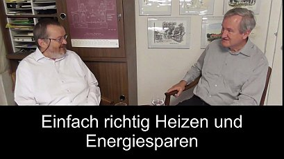

[🠔 Zur Übersicht: Gespräche & Dokus](gespraeche.md)
# Einfach und Richtig Heizen und Energiesparen
**Ein Zwiegespräch zu Fragen, Problemen und Lösungen zum Heizen, Energiesparen, Sanieren und Bauen.**   
_mit Konrad Fischer, Volker Burghardt • 18.01.2018_

Glücklich, dass ich heute wieder einmal an der Zeit das Thema Heizung, Energiesparen, einfach Bauen genauer zu betrachten. Heute ist genau einen Tag, nachdem Helmut Kohl, der große Meister der der SF Freundschaft und Wärmedämmung, verstorben ist. Seine Nachfolgerin war unter ihm Umweltministerin Wind und Angela Merkel, Doktor Fußangel, abmeldet oder Dr. B hat hat und den Kyoto-Vertrag spendiert und die Welt so zu garten mitunter ein Klimaschutzregime gestellt. Vor wenigen Tage, heute Samstag, am Donnerstag, kam es zu diesem katastrophalen Brandereignis in London, als ein ganzes Hochhaus dank Wärmedämmung abgefackelt ist mit vielen, vielen Toten. Man redet heute von über 100 Toten, die man noch auffinden wird. Holte verbrannte Leichen in einem wärmegedämmt vorbildlichen Hochhaus, da wurde natürlich Energie gespart wie verrückt. Und auch in Deutschland, unserem schönen Vaterland, wird Energie gespart wie verrückt.

Leider, wie man das einschlägigen Statistiken erkennen kann, mehr und mehr Wärmedämmung führt leider auch zu mehr und mehr Energieverbrauch. Das bedeutet, in der Statistik haben wir nicht den geringsten Nachweis irgendeine Wirkung von diesen angeblich energiesparenden Wirkungen, die an der Fassade, am Dach und vorreiter mit großen Anstrengungen und mit großen Nachteilen dem deutschen Hausgeräte und dem IDE aufgezwungen werden. Wir wollen heute arbeiten, weniger das Thema Verfahren, Dämmung und den Stoff zu beleuchten. Ich habe ihn heute einen Gast mitgebracht, der Inspektion 3 für eine politische Heiztechnik. Sie steht der im Bereich der Wärmestrahlung. Seine Erfahrungen hat der als Hersteller und auch konzeptionell als Planer von solchen der einfachen als technischen Anlagen sozusagen den Stab übernommen hat von dem großen Altmeister Alfred Eisenschink, auf den wir auch noch ein bisschen zu sprechen kommen. Ich darf Ihnen heute vorstellen, Holger Burkhard, ein Diplom-Ingenieur seines Zeichens. Ich darf Sie herzlich begrüßen.

## Gespräch über Heizen mit Holger Burkhard

Wir wollen uns heute dem Thema Heizen, einfach Heizen, Wichtigkeiten, besser Heizen widmen und wollen in einem lockeren Gespräch seit dem Interview Fragen stellen, als auch im Dialog, ohne uns gegenseitig an den Themen entlang arbeiten. Wenn wir versuchen, das Thema Geschehen zu durchleuchten und so einzukreisen, eine möglichst allgemein verständlichen Sprache, damit Sie da draußen auch beim Eindruck bekommen, was sie sonst noch gibt, außerdem, was ihnen jeder, jeder Politiker und jeder Energieberater erzählt. Der Witz ist, Herr Burkhard, Sie sind auch ein Energieberater, ein offizieller, aber Sie haben doch ein bisschen andere Positionen geklickt. Sie sind ja eigentlich ein gelernter Elektroingenieur, habe ich das bisher erfahren. Und ich würde mich freuen, wenn Sie unseren Zuschauern ein bisschen von ihrem Leben erzählen. Einmal, was Sie von beruflichen Hintergrund haben und wie es kam, dass Sie nun als Elektroingenieur nicht in Elektrotechnik gelandet sind alleine, sondern sich auch ins technische mitgegeben haben. Was Sie bewogen hat, eigentlich der Nachfolger von unserem Alfred Eisenschink zu werden, der ja die ganze Zeit technische Szene schon in den frühen siebziger Jahren aufgerüttelt hat mit seinem Buch "Falsch geheizt ist halb gestorben". Es gibt immer noch bei Amazon in manchmal günstig, manchmal teureren angeboten. Können Sie in Amazon alle suchen und verizon schink falsch geheizt ist abgestorben. Doch jetzt so in Hamburg hat erzählen Sie mal ein bisschen von sich, damit wir uns vorstellen können, was ihr beruflicher und meinetwegen auch privater Hintergrund ist, damit sich in der Heiztechnik gelandet sind. Sie haben das Wort, ja, ich bin so aufgewachsen in Eschwege in Nordhessen an der syrischen Grenze zur Zeit der deutschen Teilung. Über den Bergen war sie zum ganz früh in die Fremde gezogen, damals zur Post Telekom. Früher war das noch alles die Post. Wir haben ein normales Abitur gemacht, Fachhochschule Abitur, Hochschule und in die Richtung Elektro oder ja, ja, ja. Das war so meine Vorstellung, geht weit über den Ingenieur werden musste Zahlen noch nicht, wie ich das anstellen soll, aber das hat sich dann alles so ergeben, war fällt ehrlich vorgeprägt. Überhaupt nicht, das war gar nicht folglich vorgeprägt. Ich war immer neugierig, nicht wollte immer wissen, wie die Dinge funktionieren und gut, so hat sich das dann eher jeden. Bei der Post Nachrichtentechnik studiert, dann Beamter gewesen, dann viele Jahre international in der Telekommunikation unterwegs gewesen, führt immer glücklich werden können. Die Autos waren schöne Zeiten als andere und da hat sich auch vieles geändert in den Bereich und irgendwann vom paar Jahren bin ich dann wieder die gute alte Heimat zurück und habe mich mit der Energietechnik beschäftigt, hat dann auch mich noch mal auf die Bank gesetzt.

Was war da der Anstoß? Der Anstoß war, ich hab', ich weiß gar nicht, wie ich drauf gekommen bin. Schon Anfang der neunziger Jahre Zugang zu sein Teil gehabt. Man hat mich für Heizleisten interessiert, für das Thema. Gerne war damals die Firma vom alltäglichen Fink den meisten Dingen. Richtig, richtig, damals natürlich einzige Firma, die so etwas angeboten hat und 97 habe ich dann auch eine Neuwahl meine eigene Anlage selbst gebaut. Also mittlerweile vor 20 Jahren als Pionier. Jeder hat gesagt, das funktioniert nicht, aber im Sand Karl Anlage, ein Unfallanlage, original von einer eisernen konzipiert und selbst installiert und natürlich funktioniert das. Das heißt, über ein eigenes Projekt in ihrem Eigenheim haben Sie den ersten Kontakt in diese Szene bekommen. Ganz genau, wie Sie überlegt haben, wie soll ich denn mal geht so als Ingenieur mein Kreuzchen heizen, um die angefangen zu recherchieren und finden dann nach einiger Zeit auf Sand kann gestoßen. Ja, die Neugierde und der Mut etwas Neues habe ich das angehen lassen, obwohl man kennt das alle sagen, das funktioniert ja gar nicht, aber es hat wunderbar funktioniert. Die wollen experimentierfreudig. Natürlich, natürlich. Habe das immer an Wochenenden besuchen da in der freien Zeit die Rohre zusammen gelötet. Jetzt alle Melanoma, die man auch noch machen kann, man sich zurück Stelle gibt es auch mal all diese Dinge und hat funktioniert. Und dann habe ich das immer im Auge behalten, dass ich immer noch international unterwegs und dann habe ich die Gelegenheit bekommen, 2013 die Landteil zu übernehmen. Der andere Geschäftsführer des Kranken worden und die Umstände ergaben sich, dass irgendwann mal übernehmen konnte mit Unterstützung von Eisen Zink. Er hat mich eingeführt, bevor man schon in der nächsten Generation gelandet wären, Kantone der Herr Thoma und die Umstände haben das dann ergeben, dass ich übernehmen konnte und als Kind hat nicht überall eingeführt und dann habe ich natürlich die Ärmel hochgekrempelt und mich da eingelesen und wenn dann zu dem Schluss gekommen, das macht Spaß, das ist eine gute Geschäftsidee und ich fand das von zu Hause aus betreiben und muss nicht mehr auf Flughäfen umsetzen, die Welt fahren. Ja, so ist das willkommen und ich habe mich mehr und mehr mit der Thematik beschäftigt und habe jetzt mittlerweile schon viele Anlagen erfolgreich installiert, konzipiert, geplant und es funktioniert. Sagte Eisenschink, ein unwahrscheinliches publizistisches Werk in die Welt hinaus gebracht.

Sie kennen das ja natürlich, das waren Designfehler reiche Ansammlung von Fachwissen, vor allem auch von Erfahrung, weil wir wissen ja, dass in der Heiztechnik gibt es so einiges an Rechenmethoden, aber den wichtigen Treffer kann man nur schwer landen, weil eben in den Berechnungsmodellen jedoch gewisse Einschränkungen sind, um dieses dynamische Geschehen, Heizung, Temperatur, Energieverbrauch über stationäre Modelle überhaupt in ein Rechenmodell hineinzubringen, Wind in ihre Erfahrungen, so dass Sie sagen kann, der hat das Wort, der Eisenschink dazu geäußert, hat dazu geschrieben, durch auch so nach ihrer Erfahrung zur alten Schenk, hat das ja nicht auf der grünen Wiese entwickelt, er ist ja empirisch rangegangen. Er hat ja schon in den 60er Jahren sich damit beschäftigt. Er musste Häuser umrüsten und und hat amerikanische Baseball, wie die Geräte damals hießen, mit recht Verkleidung eingesetzt. Opel leisten Sockel live an Heizung, die verschiedenen Namen zu jagen. Er hat es von Heizleistung genannt und war erstaunt über über die Rückmeldung der Kunden. Angenehme Wärme, keiner wusste so richtig, was was ist denn das und das hat einen alten Ski dann auch neugierig gemacht und er hat sich ganz konkret damit beschäftigt, Messungen gemacht und ist dann darauf gekommen, dass die eigentliche Reizwirkung von der Wand oberhalb der Heizleistung kommt. Den Strahlungswerten damals gar keine Infrarotmessgeräte, wo man das messen konnte. Er ist also ein Bearish daran gegangen und hat das verfeinert. Wir kennen ja den Professor Doktor in Klaus Meier, der sich doch sehr viele Verdienste erworben hat, dass er versucht hat, zum einen die gängigen Rechenmodellen in Frage zu stellen, ihre Irrtümer auch herauszuarbeiten und aber auch für die Praktiker mit Rechenmodellen aufgewartet hat, die sich in vielleicht in ein Wort auf die Effektivwert stützen. Sie haben sich ja auch damit beschäftigt, wie stehen Sie zu diesen Berechnungen mit dem Effektivwert? Naja, ich habe während meiner Zeit in einer vierwöchigen Ausbildung zum Energieberater einige Grundlagen gelernt. Architektur war mir fremd. Die gängige Umwelt dbu mit einer langen Kurs Force ist der U-Wert und das ist der U-Effektivwert. Der U-Wert, das ist ein Wert, der in Wärmedurchgang durch einen Baustoff resigniert mit der Heizung ist zu tun. Richtig, richtig. Das ist einfach und und man hat vieles vereinfacht. Man hat gesagt, man nimmt eine Durchschnittstemperatur oder eine Minimaltemperatur in dieser Gegend des Hauses, unterhalb außerhalb und und jeder davon aus, dass dieser Wert immer immer das gleiche. Man hier eine innere Temperatur an Roman, da kann ein entsprechendes Temperaturgefälle. Richtig. Und das wird dann sozusagen als Maßstab aller Dinge für den Heizenergieverbrauch inzwischen recht ausgelegt. Richtig, man geht davon aus, dass das die Temperaturen immer konstant sind, das ist keine Schwankungen gibt, keine Sonneneinstrahlung von außen, dass Sie die Außenwand Oberfläche durchaus 30, 40 Grad vielleicht sein kann, gerade im Herbst und im Winter. Dies haben wir viele Zitate von früheren Forschungsarbeiten, unter anderem von dem Professor Hause, inzwischen verstorben an der Gesamthochschule Kassel, die Bauphysik gelehrt hat, später dann an die TU München auch gekommen ist, der auch im Fraunhofer Institut tätig war. Und wir haben aber auch von Professor Karl Gertis Aussagen, dass der U-Wert in stationären Verhältnissen Gültigkeit beanspruchen darf und in dynamischen, in stationären Verhältnissen ist in der tägliche Temperaturwechsel der Jahreszeitenwechsel mit sich bringt überhaupt nicht anzuwenden. Ist warum sind die dann später davon abgewichen und haben gesagt, ja, du plötzlich der Maßstab aller Dinge? Ja, um Dinge einfach zu machen und um natürlich auch hinzuleiten, zudem um die Dämmung, das wissen wir ja, die ist ja die Wirkungen der Solarstrahlung aus. Sie rechnet nur fröhlich vor sich hin, nimmt das dann den Wärmebedarf, richtig wilder Bedarf Ausweise erstellen und und da möchte ich gerne Bogen schlagen zu meiner Erfahrung als Energieberater.

## Erfahrungen als Energieberater

Ja, ich hab' dann also vor Ort Beratung gemacht, wie das so schön heißt, Bafa gefördert und gesamte Ausfuhr dort werden solche brach die Aufwendungen für diese Beratung zum Teil erstattet für den zu den Gründervätern. Also, ich bin hin und mit der entsprechenden zugelassenen Software dann Gebäude durchgerechnet mit dem Pass Basis des statischen Huberts ist hier um den zu Zahlen bekommen. Dann habe ich natürlich die Kunden gefragt, so was hier, wohnt ja jetzt schon viele Jahre hier, was hat er denn so viel Verbräuche? Und die waren in der Regel, also übrigens ein Altbauer, die waren in der Regel niedriger als das, was da ausgerechnet wurde. Und als ich das bei mehreren Gebäuden festgestellt hat, wesentlich wieder, ja, ja, da bin ich neugierig geworden und hat nicht mehr mitgemacht mit Materie beschäftigen. Bin dann auch auf Professor Meyer gestoßen. Naja, und habe dann das erste Mal den Begriff Effektivwert gelesen, dann dachte ich mir, die Software ermöglicht ja, dass ich auch die Bauwerte überschreiben kanten und habe dann also die Effektivwerte, die nicht den linearen Verlauf berücksichtigen, sondern auch Wärmespeicherfähigkeit, Wärmeeindringtiefe und so weiter. Also, im Klartext, plötzlich wurde die Sonne als ein maßgeblicher Faktor, dass der Energiebilanz eines Hauses entdeckt. Die Sonne mit ihren wärmenden Strahlen wurde in die Formel mit integriert. Das war eine Leistung, die eigentlich auch schon vorbei Gerd Gies am Fraunhofer Institut so konzipiert wurde, ob es da schon auch Vorgänger war, weiß ich selber damit. Aber die den Begriff Effektivwert habe ich zunächst mal kennengelernt in der berühmten Studie von 1983 und bis 85, in dem das Fraunhofer Institut für Bauphysik in Holzkirchen den Wärmebedarf von oder den Wärmeverbrauch, da muss man so von gedämmten und ungedämmten Mustergebäuden geprüft hat. Und siehe da, auch dort hat sich dann herausgestellt, dass die Wärmedämmung zu einem höheren Verbrauch führt und dass nur eine Berechnung mit dem damals angewendeten Effektivwert annähernd den tatsächlichen Verbrauch der Gebäude vorhersagen kann. Das war für mich der erste Beleg, wo man den User benötigt hat, um tatsächliche Ergebnisse korrekt zu beschreiben. Ja, und ich bin da natürlich neugierig geworden. Danach das produziert mal aus. Ich habe hier einige Gebäude in einer Datenbank gehabt und habe die statischen U-Werte, die vom Programm ermittelt wurden, aufgrund der höflichen des höflichen Materials habe ich überschrieben. Das kann man machen mit effektiv und Knopf gedrückt und zugeguckt, was könnte jetzt raus für einen Verbrauch? Und siehe da, sehr nah am tatsächlichen Verkauf. Und da, das war natürlich, das war für mich die Rakete. Jetzt dachte ich, was da musst du macht weiter einsteigen. Warum, warum ist das so? Das Elektro Ingenieur haben wir auch ein gewisses theoretisches Akkurat und auch Erfahrungswerte, ja, dass sie solche energetischen Formeln und eignete auch mal etwas kritisch und auch etwas genauer betrachten können, weil wir in ihrem beruflichen Reparatur entsprechend die Grundlage da ist ja, das Umgehen mit Formeln und Zahlen. Das hat man natürlich lernt. Und dann habe ich mich hereingelesen und dann immer weitere Projekte auch so angegangen und letztes Jahr Projekte als bei Ihnen, wo die Kunden letztlich Heizungen konzipieren und auch verkaufen und dann dafür verantwortlich sind, dass ihre Empfehlungen in ihrem Angebot mit den Ertrag um vor Ort zusammengehen und keine Enttäuschung auf der Kundenseite groß wird, weil die Heizung gleich nicht Ausland wurde das überdimensionierte. Richtig, dass ich habe Bilder, natürlich, habe die auch diese sind zugelassene und genehmigte Energieberater so viel man kritisch beleuchtet. Man kann ja da leicht mit Zahlenspielen, dass Eingaben und schaut mal, was kommt raus, wenn ich diesen Parameter verändere, wie ändert sich das Ergebnis? Und musste dann feststellen, dass es gerade auch bei dieser Software viele Voreinstellungen gibt, zum Beispiel Nachtabsenkung, die in der Regel eine eine zwei- bis dreifache Überdimensionierung des Kessels erfordert. Wohin weiß und stark reingehalten.

## Nachtabsenkung

Ja, man die Software nimmt an, dass in der das über die Nacht die Heizung abgeschaltet wird und am Morgen eine Temperatur vorliegt in den Räumen von circa 15 Grad und innerhalb von zwei Stunden, man kann das auch einstellen, aber die Voreinstellung ist innerhalb von zwei Stunden, wo sich das ganze Gebäude von 15 auf 20 Grad heißt, dass er ein fantastischer Beschleunigungseffekt. Wir können jetzt auch vom Auto. Jeder, der sonst so nett sind, wenn die Verbrauchsanzeige da digital drin hat, der weiß, wenn er auf dem Standstreifen bei der Autobahn beschleunigt, dann geht der aktuelle Energieverbrauch hoch wie die Rakete. Und diesen Effekt, den wir vielleicht auch beim Stop-and-go kennen, wo wir immer wieder beschleunigen, abgrenzen, beschleunigen, abbremsen, der ist offensichtlich gar nicht so besonders energiesparend und vor allem beim Auto kennt es jeder. Allerdings die meisten Menschen denken doch die Nachtabsenkung, das ist der beste Energiespar Trick. Ist wohl gar nicht so. Ja, nun, ich hatte ich ein paar Experimente gemacht. Man kann das hier sehr schön letzten, immer das mit einer elektrischen Heizung macht diesen Katalog in einem klassischen Altbau der 50er Jahre, ungedämmt, einfach verglaste Fenster, einen extra mit Holzleisten ausgestattet, die über einheitsstaat muss warme Wasser simuliert, also einfach einheitsstaat eingesteckt und gemessen. Und hab' dann auch mit Spannung aus dem Winter gewartet, das ist es ist kalt war und haben natürlich die Kilowattstunde gemessen über zwei Tage. Einmal mit Nachtabsenkung, einmal ohne. Und dass er sich da in der Nacht eingespart hatte, wenn ich morgens aufgeschaut hat, ist dann in der Aufheizphase trat wieder. Das war das waren zum Spiel. Ganz genau, wobei ich ja von Eisenschink die Aussage kenne, dass man bis zu 30 Prozent an Sparpotenzial hat, wenn man die Nachtabsenkung einfach raus nimmt. Haben Sie dazu auch Erfahrungswerte? Oder ja, das war jetzt das weißt du uns einen kurzzeitigen und das kommt zusätzlich konnten natürlich noch, wenn ich in die Strahlungswärme einsetzen. Ich habe jetzt nicht begleichen können mit Konvektion, der heizten Raum, wo eben wesentlich mehr als Luftkonvektion beteiligt ist oder durch als Verstärker für ordentliche Aufheizen, auch eine hohe als Lufttemperatur natürlich angeboten werden muss mit erhöhten Luftdruck mit erhöhten als Luftverlusten, die undichten Partien des 1, wo man obendrein noch berücksichtigen muss, durch die Nachtabsenkung kühlt die Luft ab, dadurch bekommt sie eine höhere relative Feuchte. Gleichzeitig viel Heizenergie, um die Wand auf Temperatur zu halten, dass die Wand gerade im August galt er genau mit kalt wird. Beim Autofahren wir gleich ist immer das ist ja wie Stop-and-go plus bei jedem Berg er kommt noch die Handbremse Nation einlegen und dadurch entstehen wir durch die Senkung Konsultationen in den Außenwänden wieder in Führung, bevor es überhaupt waren wir, dass man wieder aufgeheizt werden müssen. So habe ich mir das bisher erklärt, dass häufig und diese Bestätigung kriege ich auch von mit Kunden und Leuten, die mir Bestätigungse-Mails zu meinen Thesen schreiben, dass eben ein einsparpotenzial mit herausnehmen der Nachtabsenkung gegeben. Ja, natürlich und unter sich aber schon gleich mit Strahlungswärme halte man das heutzutage sehr schön essen und man hat ihre um Ecken mal messen und stellt fest, dass da überall im ganzen Raum sich eine Oberflächentemperatur von 19, 20 Grad einstellen mit geringem Energieaufwand. Ich habe auch die die Zahlen und ich war eigentlich erstaunt, wie wenig ich gebraucht für die elektrische elektrisch, der Energieträger ist natürlich teuer, aber das Experiment es war einfach zu messen, wenige Kilowattstunden. Und wenige Kilowattstunden, wenn man das pro Quadratmeter runter rechnet und bedenkt, was das für ein Haus war, fünfziger Jahre, die sich vom Häuschen herren, einfach fix noch hinzu, also Steuerkraft oben Schlafräume und Wohnräume der sogenannten der Wüstenrot Bau, einfach und zweckmäßig und also hunderte Häuser immer einige gar nicht so schlecht werden, natürliche Familie auf vollkommen ausreichen.

So und der Wandaufbau doppelte Mauer, also Abstand, also 1, 1 ein Schuh sagt man, er 36, 5. Da war noch eine Luftschicht mit lustig, war noch mit luftig und lustig, lustig, dann kommen wir nicht um gleich. Ich bin ja so muss er ja und das waren uns einfach verglaste Fenster. Gut, ja, das war so meinen meinen Einstieg, wo ich dann neugierig wurde. Und ich hab' dann letztes Jahr den Auftrag Zukunft von einem Bauunternehmer, der auch von der Idee begeistert ist, was ich zu bauen Herzen Büro ausgebaut mit 49 Land, hohe Dichte ohne Dämmung. Und hat mich gebeten, doch die Heizanlage auszulegen, dafür.

Ich habe dann angefangen und hat den ganzen Bau aufgrund der U-Effektivwerte gerechnet und bin schon zu niedrigen Leistungsbedarf gekommen. Das ist ein Gebäude, das rund 650 Quadratmeter sie mit zweieinhalbtausend Kubikmeter ziemlich als Würfel gebaut, also günstige Außenflächen Verhältnis zum Volumen. Und im letzten Winter hat sich rausgestellt, dass sich der Verbrauch, obwohl das der erste Winter war, also noch sehr viel Feuchtigkeit in den Wänden und Decken enthalten ist, dass sich der Verbrauch genauso eingestellt hat, wird es definiert und ausgerechnet hatte auf Basis der Effektivwerte.

Wobei wir zu den Effektivwert vielleicht noch ausführen können, das hier nicht einheitlich die Wandstärke durchgerechnet wird mit einem Effektivwert, sondern das Himmelsrichtung abhängig, dass Dollar Bestrahlungsangebot berücksichtigt wird. Das ist eben im Norden, wo auf die diffuse Strahlung, die aber auch eine Wirkung hat, selbstverständlich beschränkt. Im Süden ist dann entsprechend ein wesentlich günstigere Wert und Ost und West. Die Werte sind, soweit ich mich erinnern, gleich.

Richtig, damit wird nun das Haut er genau durchgerechnet, wie sich die Sonne zeigt. Was der U-Effektivwert nicht berücksichtigt oder vielleicht in einen Rechenansätzen in gewisser Weise integriert, das ist die Umgebungsstrahlung, dir auch Angebote für den Energiehaushalt spielt. Die Umgebungsdarum, die dadurch entsteht, dass dieser auf die Umgebung auch trifft. Das heißt, eine Notfallphase kann ja eine Südfassade gegenüber stehen, die dann wärmer wird und auch mit ihrer Wärmestrahlung wiederum die Nordfassade versorgt. Ebenso Bodenflächen. Nehmen wir ein aufgeheizten Asphalt mal so als Vorstellung, dann wissen wir, wie heißt er werden kann. Selbstverständlich geht auch von da die Wärme in die wir nach Baden Wände mit verein.

Also, der Effektivwert will die Himmelsrichtung je nach Sonneneinstrahlung angeboten werden. Kündigen und durch die Erfahrungen, die wir ja beide haben, weil ich habe immer an Architektur und Ingenieurbüro mache ich seit über 20 Jahren auf Heizungsplanungen und wir verwenden auch den Effektivwert. Und nach dem ersten Großprojekt waren wir also sehr gespannt und haben dieselbe Erfahrung gemacht. Der tatsächliche Heizenergieverbrauch wird sehr nah an unseren welchen Wert landen und genau das Gegenteil ist der Fall, wenn man die normalen Werten im Frühjahr Werte.

Und ein weiterer Beleg für mich ist, ich habe für eine Holztafel Hersteller man Effektivwert Tabellen erstellt, mit denen dann Holztafel Häuser aus Holz gebaut wurden. Und auch die hatten überraschend genaue Volltreffer, der mit den USA aktiv berechneten Wärmebedarf und das ist eben unsere sich auch gemeinsame Erfahrung. Mit Effektivwerten rechnet man besser. Ja, weil in der gängigen U-Wert Berechnung wird die Strahlung vollkommen runter gerechnet. Gibt sich bei dieser Software gibt zwar auch so ein Kästchen, wo man sagen kann, Strahlungs Einfluss aufs Parkett Bauteile Arbeit, aber das macht nicht viel auszusetzen Kupfer rauskommt und nimmt das Geld das Häkchen raus und der Wiederaufbau Materie marginal. Also, na gut so.

### Erfahrungen mit Effektivwerten in der Praxis

Also, für das große Gebäude habe ich ausgerechnet, rund 20 Kilowatt Leistung. Jeder, als auch der Architekt, es kann nicht sein, dass du nicht ab sofort auch in den Maßen. Wir setzen einen Fehler ein, ein Kessel und die kleinen Verein Stellung des Planers 227 Kilowatt. Der Techniker, der dann kam und den auf die Kammer zwischen 27 und 34 einstellen. Das ist viel zu wenig, wollen wir nicht lieber 34 schnell machen. Sie das 27 Kilowatt einstellen und zum Winter bei Temperaturen weit unter minus 10. Aber dann natürlich, das ist eine Gasheizung Gaskessel, kann man jetzt schon absehen, dass man so braucht, um 24 Stunden. Und dann lagen wir verbrauchen rund 50 Kubikmeter als 24 Stunden sind Größenordnung 20 Kilowatt Leistung. Hat gestimmt und der Kessel hat ist fast durch gelaufen, hat aber außen gehabt. Klar, hat der 27 Kilowatt Leistung und es bedeutet im Klartext, er hat einen sehr günstigen Wirkungsgrad. Natürlich, natürlich, weil er nicht ständig rauf und runter sozusagen wieder Stop-and-go arbeiten muss.

Richtig, möchte ich. Man sieht das ja, denn in der Stadt, da kommt und die Abgaswerte überprüft. Was macht er? Es steckt eine Messsonde in das Abgasrohr, schaltet um auf Dauerausschaltung. Das heißt, also, das kann euch durch, wenn er braucht ist, man gedacht mal raus und raucht eine Zigarette. Damit die Anlage erst ein paar Minuten läuft und dann legt er seinen es werden, weil in den kurzen Brennerzeiten sind die Abgaswerte viel zu ungünstig.

Das heißt, wenn man mit einer entsprechend an die Effektivwerte, er ist mit seiner Technik wurde auch Kesseltechnik herangeht, hat man von vornherein eigentlich kleinere Aggregate, die dann auch ein wesentlich umweltfreundlicher als Ergebnis bringen. Ja, natürlich und natürlich verständlich auch dann energiesparender, weil eben diese ungünstigen Betriebsverhältnisse des An- und Abfahren, die Technik viel weniger werden kann. Manchmal so ganz ehrlich, man sich weg. Ja, also, der Kessel, es ist ja gar nicht mehr vorgesehen, dass man ein großer Kessel einsetzt. Uns beide locker überlebt hier. Ich habe vor allem im Keller 1960 und der Brenner ist natürlich neueste Technik. Die Abgaswerte stimmt, dass zum einen und natürlich das Haus wird natürlich ein Strahlungswärme beheizt. Das heißt, mit Stahlplatten Heizleisten, strahlt Osten vor der großen Fensterfront, die Entwicklung von verizon trinke. Ja, und diese Strahlpfosten 40, also, dass Übertragungstechnik, das war die Grundlage für die Heizung, dass er sich auch Auswirkungen auf den Verbraucher.

Also beides, also betreten könnten sein. Mit dem Effektivwert gelingt es, die Heizungsanlage wesentlich präziser auszulegen mit dem Meer auf Überdimensionierung und auf dem Stockerl Lastigkeit geboten, um wer mit meiner Berechnungssoftware, wenn ich die Berechnung nach Normalwert zum statischen Uhrwerk eingestellt hat und nach der Senkung angeklickt wird, dann wäre ein Kessel von über 90 Kilowatt erforderlich. Die Vision, dass man sich mal vor, wenn ich jetzt 90 Prozent der Halbzeit im einstelligen Plusbereich liegen und die vielleicht eine Leistung benötigen, vielleicht 12 Kilowatt, dann wäre der Kessel achtfach überdimensioniert, weil sie 90 Prozent der Zeit läuft, der 90 Kilo Äpfel, springt kurz an und die hat was davon und das gleich wieder den Kessel. Industrie kann die teureren Geräte verkaufen, überdimensionierte Geräte, die auch von Ella wieder kaputt gehen. Es ist auch schön für den Heizungsbauer. Natürlich und Wartung empfehle ich, natürlich durch die ungünstige Betriebsweise, erheblich höheren Verschleiß und die Kessel selbst haben einen geringem Wasser Inhalt und der Schüler für das Heizwasser besitzt im Vorlauf. Was heißt, in der Klasse sogar überdimensioniertes schaltet er an und nach vielleicht eine Minute ist er wieder ausziehen, weil ich ja im Vorlauf abflüge und ist hier gleich gleich wieder Rahmen und unsere Anlagen, die greifen den Rücklauf ab, nutzen also das Rohrsystem im Haus als Puffer. Somit läuft auch länger durch und hat das längere Pausen, das kommt auch noch dazu.

Und auch ein Blick in der Regeltechnik, dass man sich verabschiedet von dem Hersteller, sei die vorgegebenen Regeln Modell, sondern sie stellen das Unglück, geht es praktisch von sich, der Wärmezähler, der ist im Rücklauf. Den bauen die dann von vornherein an der anderen Stelle ein. Richtig und die Wahrheit zu trauen. Er versteht das gar nicht, dass und bei den Neukirchenern, das Video bei den neuen Kessel, ist das ja schon so, dass das schon fest verdrahtete genommen Kessel selbst. Genau. Und wenn man das separat haben will, Lehrbücher, der Kurs vielleicht 8 Euro, da muss man ein Gerät kaufen, was 250 Euro kostet, wenn ich am Rücklauf erfüllen kann, sondern um nicht die 250 auszugeben, sondern eine viel einfachere Richtung einzusetzen, aber normal sind ihr diese Geräte fix und fertig kollabieren. Wie geht es dann zum Umstellen in Richtung der Rücklauf Temperaturregelung? Dass man die Regeln kennt. Man muss diesen in diesem zusätzlichen Aufwand treiben oder man hat in das der Heizungsbauer kann all das umsetzen des Handels mit Aufwand umsetzen. Dann natürlich, der macht das, aber das versteht. Ich weiß es nicht mehr, dass wenn ich ihnen das erklären, dass vielleicht nach Erfahrungen, ein harmloses Ereignis oder Bedarf des erheblichen Druck, wenn ich wenigstens erläuterte, dann das verstehen die Großmeister, das sind schon. Ach ja, macht, macht sich darin keine unüberwindbare und das ist eben jetzt zeigt auch mal für den Zuschauer interessant, gehen Sie weg von der vorgegebenen Regeltechnik und probieren Sie es einfach mal aus. Man kann dafür auch wieder zurück umstellen. Gehen Sie in die Rücklauftemperatur rein und das ist der Maßstab, wie ihre technische Anlage Team funktioniert. Das ist ja auch für dann überlegt, wenn alle Ventile oben zu sind, oben, also, in den super heizen den Räumen, weil genügsame da ist, dann kommt das Wasser auch warm wieder zurückgenommen und dementsprechend springt jetzt endlich an. Es dauert also länger Spreizung, also, gering. Richtig, wichtig, Vorlauftemperatur und Rücklauftemperatur. Ja, während er nicht, wenn ich im Vorlauf abtastet, dann weiß ich ja gar nicht, dass es oben los in den Räumen. Ja, es gibt keine richtige Rückkopplung und dann viel gebraucht wird oben, dann ist das Wasser auch kommt abgefüllter zurück, wohl Spreizung und je nachdem, wie groß das Rohrnetz ist, könnte er gleich der Kessel entsprechend länger auch ist das warme Wasser zurückkommt, ist also oben alles versorgt ist und es kommt warmes Wasser wieder zurück.

### Wirkung der Glasscheibe und Strahlungswärme

Was mich auch damals bei unseren Großprojekt in einem Schloss fasziniert hat, ist die Wirkung der einfach Glasscheibe, weil die einfach Glasscheibe, wenn ich die mit dem Effektivwert berechne, habe ich ja da auch beim einfach klar auf der Südseite leuchtete für ganz allein ein wesentlich höherer, denn so leid war, den ich halt technisch verwerten kann, gerade der Übergangszeit noch im Herbst und Frühjahr, der Fall, die schlechten Voraussetzungen, die die üblichen Berechnung dem einfach Fenster zuordnet und damit auch den aus gesichter motiviertes rauszuschmeißen und irgendwelche den Wärmeschutz Gläser hier einzusetzen, die sind eigentlich auch nur auf der Grundlage des falschen Rechenmodell gültig. Genau betrachtet, kommt ja durch eine einfache Scheibe wesentlich mehr solare Energie zusätzlich ins Haus als bei einer doppelt oder dreifach Scheibe, weil jede Scheibe fehlte da von dort aus auch. Hier muss man sagen, hat Effektivwert auch für Fenster nicht natürlich warnt das wesentlich bessere Ergebnisse auf einer Seite, weil ist der Realität mehr entspricht. Man muss die Gesamtbilanz des Fensters, bin ich jetzt ein doppelt oder dreifach verglaste Fenster setzte und die Zwischenräume noch mit irgendwelchen Edelgasen ausfüllen, dann sperre ich ja gerade das Lichtspektrum der Sonne in der Übergangszeit aus. Also drückt das mit dem G-Wert Aussagen, er wird dann sehr klein. G-Wert von 0 4 heißt also nur 40 Solarenergie kommt kontrollen. Die Solarenergie trägt sich ja in dem Fall wollte ihnen beleuchtet Lichtwellenlängen Spektrums, weil die Wärmestrahlung geht ja durch das Glas nicht. Jeder mit hat Mayer ja immer viel Aufsehen erregt, mir geht inzwischen auch schon so und auch unter Violett geht ja im Wesentlichen Teilen auch nicht durch. Das ist vorzugsweise um das nicht geht da jeder jeder in das Gewächshaus, ja. Also, das kommt das volle Spektrum fast das volle Spektrum der Sonne kommt rein Juli im Bereich des Licht. Richtig wäre ja wandelt sich und welches Glas einscheint auf den auf die auf die Mauer auf dem Blumentopf Fringshaus erwärmten lernen Strahlung wird erzeugt, kann aber durch das Glas nicht raus im Gewächshaus mit diesen Effekt. Habe ich mit dem Fenster. Man kann das ja heute auch wieder mit Infrarot messen. Und es erstaunlich, dass die Oberfläche eines solchen Fenster von innen so trotzdem 16, 17 und 18 Grad nach hat auch das einfach schön. Es ist einfach sehr auch bei minus geraten nämlich. Und das ist ganz erstaunlich und natürlich man sagt, sommerlicher Wärmeschutz ist ein großes Thema.

Und deswegen müssen die Fenster ausgestattet werden mit reflektierenden Folien oder Gasen und so weiter. Für die historische Methode war einfach der Fensterladen, der die ganz genau, wo im 19. Jahrhundert weiterentwickelt hat zum Rolladen aus bequem Kals Gründen in gewisser Weise. Und das ist auch unsere Erfahrung, wenn man eben Nacht den Daten zu mache. Ich habe das am eigenen Haus experimentell gemacht. Ich hab' auch Verbundfenster, wo ich eine Scheibe einfach wegklappen kann unter Messungen machen. Und das war für mich auskommen zu erfahren, wir haben überhaupt kein kaltes Glas in dem Moment, wo ich den Laden in der Nacht zu machen, bleibt alles wunderschön. War vom keine Wärmeverlust gegen den Nachthimmel, der Hardware - 50 - 100 Grad. Das wird ja auch vollkommen unterschlagen auch wieder in dem Hubert Modell, weil wir hier immer nur abgekühlt wird gegen die Außenluft. Aber der wesentliche Faktor ist Erde nach Himmel oder den genauen Themen, wenn wir da mit dem Infrarot rein messen, dann kommen wir auf abscheuliche tiefe Minusgrade. Jeder weiß im August Feier zum Klose Taube neue große als Brocken von da oben und das wird vollkommen unterschlagen in den gängigen. Man braucht er nur, dass unser Festival zu nehmen und gegen Gen Himmel malt man staune locker - 18, -20 Mittelmann, da wird auch wesentlich tiefer der Temperatur. Auch vom Flieger weiß man, dass wir noch ein paar Minuten ist man oben in der Flughöhe, was sagt der Pilot? Jetzt haben wir minus 50 Grad. Blick nach Japan geflogen, da war - Wechsel 80 Grad, war Schluss. Die Flughöhe fliegen wahrscheinlich in einer eine ist nicht immer so über ihn, aber das hängt von der Höhe ab. Und das sieht man eigentlich, welche extreme Kälte der oben zur Verfügung steht und die wird er nun in der gegen Strahlung die Gebäudehülle ein und dagegen wird abgekühlt. Wenn man sieht, dass wir ganz einfach dein Auto, das Auto steht vor einer Hauswand im Winter, im Herbst schon los. Und alles, was nach oben ist, das Dach, die Windschutzscheibe sind vereist und die Seitenscheibe, die übrigens gegen gelogen, das Haus ein Strahlungsaustausch hat, nicht vereist. Da mal wieder auch sehen, wie die gängigen Modelle komplett ohne einen der wesentlichen und maßgeblichen Faktoren versuchen auszukommen. Die Strahlung und Strahlungsausgleich und das sind ja die Ideen oder Geheimnisse für die offizielle Bauphysik, die mit der Strahlung eigentlich nichts anfangen kann.

Komme ich wieder zurück auf Professor Meier, der seine letzten Jahre diesem Thema Wärmestrahlung gewidmet hat, auch entsprechende die Fachliteratur im Expert produziert hat, damit auch mal eine breite Öffentlichkeit sich mit diesem Thema auch von der theoretischen Fall Debatte auseinandersetzen können. Wir machen da die über 20 Jahren diese Modelle, haben es auch nur ein bisschen verfallen hat, weil wir auch dann durch die Praxis Erfahrungswerte haben und wenden aber im Wesentlichen diese Effektiv Modell so geht man ja dann entwickelt hat, an mit geringfügigen gar nicht Einschränkungen, sondern gleich noch Erweiterungen und Silbermedaille zufrieden.

### Kritik an gängigen Rechenmodellen und Bauphysik

Ja, als Kind war ja auch glücklich, also auch für ein neuer gestoßen, Jahres die ihm natürlich ist ihre Freunde, dann muss es dieses Phänomen, was Ereignisse aus der Praxis erfahren hat, wird der Strahlungswärme und sie nicht erklären konnte. Es gab noch eine Infrarotmessgeräte. Hatten versuchen gemacht und habe festgestellt, dass die warme Luft der Heizleistung sich an die Wand anlehnt und die Wand erwärmt und dann die Wand wirkt dann als Strahlfläche. Konnte es aber nicht rechnerisch nachvollziehen und Herr Meyer hat ihm da geholfen und ist das von der theoretischen Seite angegangen und so hat sich ein Modell entwickelt, das ebenso von der N-Serie, als auch von der Theorie nachweist, Strahlungswärme funktioniert, die Feier für mich damals auch 1996, als ich das erste Mal auf meiner gestoßen bin, das war sozusagen eine Offenbarung. Ich war vorher schon sehr unzufrieden mit diesem ganzen Modellen dieser gab, weil man hat es schon von innen heraus gespürt, dass man da auf irgendwelchen Holz liegen könnte, dass das zwar wunderschöne Nachkommastellen Ereignisse produziert im Rechenmodell, das aber schon auf dem vorliegenden Verbrauchswerten deutlich wird, das hat mit der Realität nichts zu tun. Das heißt, die etablierte braucht so nennt wird es die oder ich sage auch wir eine Politik dazu. Und das Fahrzeug ist ja auch da drin so quilling Landgericht und Praktiker eigentlich im Stich. Favorisiert die gängigen Verkaufsmodell der Industrie, die Verkaufsmodelle der Dämmstoffindustrie, aber der Praktiker ist damit auf sehr schlüssigen Gelände der abschüssigen, weil man entwickelt damit Konstruktionen, Anlagentechnik, die mit der Realität viel zu wenig übereinstimmen. Wenn wir so an die statischen Berechnungen herangehen, die er dann auf Festigkeitsprüfungen, Funktionsprüfungen zurückgehen, die ganzen sprechen bei Werte, Baukonstruktionen, wenn wir in diesem Maß und verfehlen würden wir die Heiztechnik und die Technik macht. Ich glaube, werden wir als Bauingenieurin ganz schnell im Gefängnis. Welcher Kunde würde sich das bieten lassen? Wir rechneten fabelhafte Werte hinunter und verdienen wurde dann ein bei den Berichten Energieberater Berichten stehen hier auch drin, ja, das sind nur an Währungs Werte. Verabschiedete sich aus jeder Verantwortung, ja, Sie die die Streubreite kann plus minus 43 Prozent sagen. Diese verrückte Zeit als als Ingenieur, da dreht sich mir mein Herz Raum, denn ich will nicht so kleine Berechnung ab 50 Prozent kam kann beim nächsten Winter Schwingung, der sich aus Thyrnau Ideen oder nur den Nutzerverhalten, das übrigens bisher noch nie gemessen wurde. Es gibt derzeit in Berlin an der Aktion gibt es ein Projekt, wo man endlich mal das tatsächliche Nutzerverhalten messtechnisch überprüfen will, weil bisher wurde ja häufig behauptet von der Branche, diese große Abweichung von den berechneten Energiewert und den von der Bauphysik unabhängigen tatsächlich gebraucht wird, erklärt sich zwanglos vielleicht durch Fehler beim Bau, abermals durch das Netz. Also Herrenwitz, ja, also, ich glaube ich nicht, da bin ich drauf gestoßen Vereinen konnten, da habe ich gebeten, ein Energieausweis zu erstellen, ein großes Mietshaus mit vier Stockwerken, eine Südfassade mit Alkoholen Fans, sondern zu gelangen, das 60 Meter lang und drei Stockwerke hoch.

Es ist saniert wurden einige Jahre vorher und es liegt mir seine Verbrauchsgruppe vor mir, sagte Herr Burkhard, das ist die Verbrauchskurve, die fängt an dem unsanierten Bereich und endet jetzt letztes Jahr, der Verbrauch vom letzten Jahr. Jetzt sagen Sie mir mal, war saniert und die Kurve Slavia zu Schwingungen geblieben, aber versucht sich hier nicht aus der Kurve. Man konnte das nicht erkennen. Es hätte ja eigentlich nach der Theorie Sanierung Verbrauch geht unter. Konnte man nicht erkennen und er sagt, ich habe darüber eine halbe Million investiert, um das Haus zu sanieren. Ich habe keine Ersparnis. Verklagen zu den Architekten.

Das ist zum Beispiel war gerade ein paar Tage bei uns in der Zeitung, eine Grundschule ihr im Coburger Land wurde für vier Millionen saniert und da hätten sie sehr wohl ablesen können, wo die Sanierung kam, weil inzwischen Patrick Überprüfung übergemeindlichen Rechnungsprüfung herausgestellt und das ging dann ganz scharf durch die Zeitungen, dass nach der Sanierung der Energieverbrauch deutlich gestiegen, darüber, wo man versprochen hat, man wird so und so viel Prozent, 25 noch unter den ELF Anforderungswert landen, ist die Tatsache, das genaue Gegenteil. Die Energiekosten sind explodiert und so vermutlich sich bei vielen solchen Fällen, wenn man den Mann nach geht, wenn ich mich erinnert, dieses berühmte Konjunkturpaket des bayerischen Staates, wo man überall die energetische Sanierung in Anführungszeichen an öffentlichen Bauwerken und vor allem auch Schulen vorangetrieben hat mit unfassbar großen Fördermitteln, erzwungen hat. Man hört keine Sparergebnis. Also, wir haben bei uns in Eschwege ein Gebäude ist jetzt die Polizei in meine Mutter ist da ein 20 ist früher zur Schule gegangen, ist war ein Hauswirtschaftsschule dazu, was noch und ein massiver dicke Wände, darf man den Kurs abgeschlagen letztes Jahr und hat angefangen zu dem dicke Dämmung. Also, ich hab' mir das mal genauer an, so Klapproth Fotos gemacht, Holz und die Fenster sind die haben so Klaus Schirmer, die schon, also, auch erneuerbarer Wärmeschutzglas. Und ich werde mal versuchen, da an Zahlen zu kommen als die vorherigen Verbrauch und vielleicht manchmal verraten und den neuen Verbrauch.

## Die Guinness Untersuchung

Ja, wir haben dann auch als Bestätigung unserer Kritik von diesen ganzen Rechenmodellen ist er in den 90er Jahren die berühmte Guinness Untersuchung erschienen, die für Gesellschaft für Wohnungs- und Siedlungswesen in Hamburg, heute in denen die sich Institut für Stadt-, Regional- und Wohnungsforschung. Die haben anhand von 47 großen Wohngebäuden mit vielen Wohnungen ab Meisterring überprüft, wie sich denn der Energieverbrauch pro Quadratmeter in gedämmten und im Vergleich dazu in den Wohnanlagen zeigt. Und das massive Gebäude, ja, massiv gebaut und ja, das sind sie wichtiger, 70, 50er Jahre Wohnungsgebäude, die aber dann auch so eingedämmt wurden oder vielleicht auch schon als gedämmt gebaut wurden, aber die übliche Wohnen Bude, die Story Massivbau, egal Waxweiler, Betonskelett oder werden sowas und dann darauf eine Wärmedämmung und die haben dann auch gekriegt, dass der Massivbau mit ca. 13 Liter pro Quadratmeter zu heizen ist im Durchschnitt, der ungedämmte, der ungedämmte und der gedämmte, der liegt also bei 15. Das sind 2 Plus oder Minus Liter Unterschied. Das bedeutet, die Kinos hat an einer Massen Untersuchung festgestellt, dass im Durchschnitt wärmegedämmte Gebäude mehr Energie verbrauchen. Und das zeigt ja auch wieder den die Nachteiligkeit der äußeren Hülle, wie eben die Solarkomponente aus Sport und dafür entsprechend mehr Heizung benötigt. Das heißt, auch hier wieder zeigt sich, dass der klassische U-Wert und überhaupt als Konstruktions bei Wert unglaublich ist. Er führt nicht zu energiesparenden Gebäuden, sondern auch bei größeren statistischen Auswertungen zeigt sich, funktioniert nicht.

## Umwelt, Effektivität und Gesetzgebung

Ja, das ist jetzt noch mal das Thema Umwelt und Effektiv fährt. Jetzt haben wir ja bereits Technik nicht nur die strahlungsintensive Heiztechnik. Wir haben ja nun den Gesetzgeber, der sich ausdenkt, er mutiert bestimmte Vorgaben machen. Und der möchte nun den Kunden aufzwingen durch Gesetzesvorgabe. Man nennt es das erneuerbare Energien Wärmegesetz, EEWärmeG. Man will ihm auch zwingend einen Neubau mit bestimmten Wärmeenergie zu versorgen. Ein bestimmten Anteil in Baden-Württemberg den Grünen Musterländle geht man so weit, auch den Altbau Besitzer im Fall des Fonds Austausch oder als Erneuerung zu zwingen, hier sogenannte alternative als Energien mit einzuspeisen. Vielleicht wollen Sie dazu auch was irgendwie, wie wird das bewerten? Wir haben wir verschiedene Alternativen in diesem Gesetz. Zum einen geht es um die Frage, mit welcher Energie wird eingespeist, diese sogenannten Öko- oder Bio- oder Alternativen Energien. Zum anderen geht es aber auch um die Technik der Wärmeerzeugung, wie zum Beispiel bei einer Gewinnung oder auch dann die Wärmepumpentechnik. Vielleicht fahren wir uns mal, wie ist ihre Position dazu? Günstige Werte sozusagen vorprogrammiert, lohnt es für den Kunden, die Kostenseite ausgespart. Erstmal wichtig, deswegen gibt ja auch im EEG einen Paragraphen, wo man sich befreien kann.

## Wirtschaftlichkeit und Befreiungsanträge

Und wir rechnen ständig diese Modelle durch und stellen fest, da lohnt sich gar nichts. Das heißt, die Mehraufwendungen, die werden gar nicht durch Energie Kostenersparnisse entsprechend amortisiert in einem Fünf- und Zeitraum. Und entsprechend machen wir Befreiungsanträge. Zum Teil stellen wir selber auch die Befreiungen aus, wendet mit der Behörde so geregelt ist. Jedenfalls die Rechenmodelle, wie denen wir dann einsteigen und zwar mit den offiziellen, nicht mit Effektivwerte, nicht nur mit den offiziellen Rechenmodellen, können wir zeigen, die kompletten EEG, die Anforderungen sind so gut wie grundsätzlich unwirtschaftlich und der Bürger hat einen Anspruch auf die Befreiung von diesen Aufschlagen. Ja, ein gutes Beispiel des Solarthermie für die Warmwasserbereitung. Wenn man sechs Monate im Jahr an Hände, ich kann mein Warmwasser damit bereit und ich brauche ich dann, wenn man das nachrechnet auf die Kilowattstunde und auf Energieträger Öl oder Gas rechnet, also in und die Annahme, dass ich meine Heizung durchlaufen lassen im Vergleich zu einer Solarthermieanlage, dann stelle ich fest, dass das Wasser, was ich brauche, vier Personen Haushalt, vielleicht im Monat an Öl oder Gas 20 Euro kosten, sagen wir mal 200 Euro im Jahr, die ich an Öl oder Gas einsparen, um während der Sommermonate in meinen Warmwasser zu bereiten, da springt der Kessel einmal am Tag für eine halbe Stunde an zu 200 im Jahr.

Was kostet so eine Solaranlage auf dem Dach? Es geht bei 4000 Euro los mit Installation und wenn man die Wartungskosten noch dazu rechnet, Sie brauchen einen Pufferspeicher, Sie brauchen extra Pumpe, Sie brauchen und ein Landrat von Ettlingen ist eine Solaranlage, einem thermischen Solarkollektoren Anlage, dann der Urlaub dann hoch gezündet und hat das ganze neu Bauhäuslern weggebrannt. Und welchen Fälle gibt es inzwischen große Vertrauen macht? Nein, das ist die Solarkollektoranlage. Das muss man sich so vorstellen, die wird ja in die Dachkonstruktion eingebaut. Die hat ja auch dann Kontakt mit Conti hat zum Teil auch selber Rahmen aus Holz. Und durch die über die in einer solchen Anlage entsteht, kommt es zur Krise des Holzes. Erteilt das Holz gast aus durch die starke Erhitzung, die im Umfeld dieser Solaranlage stattfindet, weil im Sommer geht ja nicht die ganze Hitze weg. Ich also irgendwelcher der US-Version der Ta, hat dann kommt Ihnen da oben die Anlage lustig vor sich hin entwickelt, ändern mit dem Partner weit über 100 Grad, damit wird nun die Entzündungstemperaturen, die Pyrolyse des Holzes dramatisch abgesenkt. Und es kommt der Punkt, wo die Hits da oben Land und es umgebende Holz, das ordentlich ein paar Jahre realisiert wurde von Landrat von erlebt man viele Jahre relativ frische Anlage. Und dann geht Ihnen bis hoch und die Bude fackelt ab. Inzwischen schon wieder neue Forschungsaufträge in dem Bereich, kann man im Internet alles finden und gibt alles und Fachleute, die sich genau dieses Phänomen dann kümmern müssten, zusätzliche Risiken und den man bei der wirtschaftlich zu bleiben 200 Album sagen wir 6000 Euro kostet die Anlage 6000 durch 230 Jahre. Und in der Tat ist die würde abgefackelt oder ich muss schon wieder Pumpen erneuern oder die Flüssigkeit.

Also allem sagt der BGH in seiner bisherigen Rechtsprechung zehn Jahre ist die zulässige Amortisationszeit für Investitionen in Energiesparmaßnahmen Mietwohnungsbau, Umlagen nach einer Lösung im Moment, die geht ja vorzugsweise im Bereich der WEG, also der Wohnungseigentümergemeinschaft, muss ich dann manche benachteiligten durch Maßnahmen und hier wird schlichtweg der Situation viele Jahre so der BGH sagt so, wie alle anderen Obergerichte unter ihm, also Oberlandesgerichte, weiter alle zur Sicherheitslage gibt. Sie sagen immer, zehn Jahre ist der Maßstab. Natürlich Industrie zehn Jahre schon keine akzeptable Amortisation, da würden die gar nicht anfangen. Die wollen schneller zu einem Gewinn Ergebnis kommen und wir haben ja auch die Heizkostenverordnung oder Gesetzgeber selber in Paragraph 11 die Amortisationsdauer, die maximal zulässige festgelegt hat und welche Zahl steht zehn Jahre. Das heißt, wenn sich die Auflagen der Heizkostenverordnung nicht innerhalb von zehn Jahren amortisieren, hat der Heizkostenverordnung selbst festgelegt, zehn Jahre die Grenze. Wenn die Amortisation mehr als zehn Jahre benötigt, ist die Auflage von vornherein hinfällig und das ist der Maßstab.

## Eigentumsrecht und politische Zusammenhänge

In Hessen gibt es einen ein Rundschreiben von der Landesregierung, das kenne ich total ab, der sich um geschickte abenteuerlich und da wird von vornherein die Bauämter sagen, Neubau befreien, gibt es nicht. Nein, das ist nicht ganz so der Fall, aber ich kenne diese Vorlage. Hier wird man danach in der ministeriellen Verwaltung vollkommen am Grundgesetz vorbei gehandelt. Das ist ein Weg, würde sie mir ausgebrochen in diesem Bereich Klimaschutz, schlimmer geht es nicht. Wir müssen ja mal die Frage stellen, warum kommt es denn überhaupt Befreiung? Wir können uns ja bei diesem Kauf lagen Verordnungen namens Energieeinsparverordnung und Energie erneuerbare Energie Wärme geht können wir uns ja grundsätzlich aus wirtschaftlichen Gründen. Man hätte es da um billige Erde befreien lassen. Woher kommt es? Zum einen haben wir in der Ermächtigungsgrundlage der Heizkostenverordnung und auch der Energieeinsparverordnung eingesetzt. Die mächtigen Verordnung endlich Energieeinsparung, selekt abgekürzt und da kann man Paragraph 5 und dass die sinngemäß darin ein Wirtschaftlichkeitsgebot. Sprich, Investitionen in Energiesparmaßnahmen müssen sich amortisiert, müssen wirtschaftlichen oder die Frage, in welchem Zeitraum das Wiener Graben, da haben wir dann eben die Heizkosten Verhandlungen oder Gesetzgeber, der das 18 Jahre. Und wir haben die gefestigte Rechtsprechung, die niemals von diesem Thema durch die Piste abgewichen ist.

Das ist die eine Sache, warum kann denn der Bürger sich überhaupt befreien lassen? Das Besucher auf dem Artikel 14 Grundgesetz. Eigentum. Und in Deutschland nach unserem Grundgesetz sind das einzige Land, wo in der Brut erweitere das Eigentum so zusammen verfassungsmäßig geschützt ist. Das sieht wohl eine Erfahrung aus dem Dritten Reich, als man von manchen Bevölkerungsgruppen das Eigentum verwendet hat, wie man lustig war. Und das Prinzip des Eigentums im Grundgesetz, er folgendes. Der Stadtkanton, wenn er denke, sie ist nötig, alles enteignen. Unter dem Vorbehalt einer angemessenen Entschädigung und angemessen heißt man letztlich vom Marktwert abhängig. Da kann ich einfach sagen, ja, als nehmen wir das weg geklickt 1 Euro 50 und April unter Druck, sondern er ist verpflichtet, angemessene Entschädigung zu leisten. Das ist ja dann der Fall, wenn das Bäuerlein nicht unbesiegbar im Grundstück hergeben will und die Autobahn will gebaut werden, dann kann der Staat das ihm wegnehmen und muss ihn entsprechend entschädigen. Auch diese Öko Klimaschutzgesetze namens E-Mail von T, Wärme von die Welt, ihr Leben sind ja belastende Gesetze. Das heißt, die Türen zum eigentlich ins Eigentum. Der Betroffene wird gezwungen, Mehraufwendungen zu treiben und mit abenteuerliche Effekten Wirtschaftlichkeitsberechnungen ist es der Ministerialbürokratie in Deutschland gelungen, die Politiker, die die EU weiter nichts kümmern, zu überzeugen, es wäre ja im Grunde alles wirtschaftlich. Meiner Meinung nach ist es kein Bobfahrer. Bringt die Dinge, die als Wirtschaftlichkeit Belege hier von ihrem Wesen Instituten angefertigt wurden, die wurden ja schon auch vom deutschen Ingenieur Platz entlarvt, demaskiert. Das sind ganz wesentliche Punkte, die zur Wirtschaftlichkeitsbetrachtung gehören, weggelassen. Zum Beispiel, die ganzen Ingenieure und Architekten und Fachingenieure Honorare, die locker 20, 30 Prozent der Baukosten erfassen nach dem Honorar gesetzt. Die wurden überhaupt nie betrachtet. Die ganze Planungsaufwand, der hinter einer Bauleistung steht, wird weggelassen von vornherein und das ist und dann wird weggelassen der ganze Aufwand für die Instandhaltung oder wissen wir von den Untersuchungen inspirieren Trip Institut für Bauforschung Anrufe, dass eine Wärmedämmfassade zum Beispiel etwa 10 Euro mehr pro Quadratmeter Instandhaltungsaufwand pro Jahr hat. Das wurde alles weggelassen, um den Bundestag und den sogenannten Abgeordneten vorzuspiegeln, ja, die Ene, das EEG, das sind ja im Grunde genommen sehr wirtschaftliche Sachen, da ist kein Problem damit verbunden. Die können wir so erlassen.

In Wirklichkeit ist es aber so, wenn wir das genau rechnen, wird sich, weiß nicht, herausstellen, das rechnet sich auf keinen Fall in zehn Jahren und bei diesen einfachen, also da gibt kann man fast jede beliebige Amortisationszeit ansetzen. Allein der erhöhte Mehr Aufwand für die Instandhaltung, für alles auf, was an theoretischen Ersparnissen. Und das ist auch bei dem EEWärmeG ISO. Diese Mehrkosten, die man da hinein spendieren muss in die Technik, werden nicht durch akzeptable Energie Ersparnisse wieder refinanziert, Interesse unter den Konditionen der üblichen Energiepreise, wie sie sich nun bei uns teilen und insofern hat nun der Gesetzgeber mit zogen auf diesen Artikel 14 in diese Belastungsgesetze die Befreiung mit integriert. Er muss etwas tun, weil sonst wäre der Gesetzgeber, spricht der Staat, verpflichtet, einen wirtschaftlich übermäßig belasteten Betroffenen ihrer Gesetzgebung sein Schaden an Eigentum angemessen zu ersetzen. Da müssten die wie dumm und kapitalen, weil ja nie was rauskommt. Und das wollen die verhinderten, dann klappt mehr, befreit euch. Heute gebe ich die Möglichkeit, bei diesen unbilligen Härten eine Befreiung zu beanspruchen. Und versteht es eben auch wortwörtlich in der Energieeinsparungsverordnung, Paragraph 25 z.B. drin, die Behörden raten zu befreien. Und damit kann sich der Staat entlasten von eigentumsrechtlichen Ansprüchen, die eben aus dem Enteignung gleichen Charakter dieser Belastungsgesetze entspringen. Das ist so ein bisschen der politische Zusammenhang.

## Was tun bei Ablehnung des Befreiungsantrags?

Jetzt pragmatisch, was macht jemanden, der in Hessen zum Beispiel neu bauen will und geliebtes versagt und der Baubehörde, ja, nur die Betreuung? Ja, da, was macht er? Sucht sich einen vernünftigen Verfassungs- und Verwaltungsrechtler. Vergiftet. Ich habe einen auf meiner Webseite, der dann zum Beispiel einen fantastischen Partikel gebracht hat, die ähnlich verfassungswidrig, weil ihm genau in diese grundgesetzlich geschützten Bereiche in unangemessener und gewillt wird weise eingreift, ohne die Interessen der würde und ihn auch der Grundgesetzes, heißt unseres Rechtssystems, angemessen zu berücksichtigen. Und natürlich die Behörden, das sind ja, ich sag' mal so, das sind Fanatiker, die denken, wir setzen uns über jedes Recht hinweg. Der Bürger ist unser Knecht und dann erlassen wir hier eine Regelung, Richtlinien, Aufführungshinweise, hätten so Watts und Lilien in die Ecke und welchen in Soland, wie wir lustig sind. Diese Willkürherrschaft, der kann man ja in unserem Staat, der in Resten wohl noch ein Rechtsstaat sein könnte, immerhin mal gerichtlich entgegentreten. Man braucht einen vernünftigen Fachanwalt, das sich mit der Materie auskennt, solche die Plätze. Da geht man auf Verwaltungsgericht und schaut mal, was der Richter. Wir haben hier überhaupt noch keine Rechtsprechung, noch keiner traut sich. Es gibt ein paar Gerichtskonzerte, das weiß ich auch aus anderen Kammern, Blatt steckten bleibt, wo sich dann bestimmt eine Band wird zu sagen gegen ihre Planer, wie er und sagen, du hast mich da unwirtschaftlich geplant. Erst vorgeführt und mussten entwickelt wurde irgendwas und hast du gar nicht geprüft, ob wirtschaftlich angemessen ist. Hast meine Interessen in der Planung berücksichtigt und Bitkom ist lange her. Und zwar klar und wirtschaftliche Planung ist eine Fehlplanung. Sie hat sich am Gebäude manifestiert. Der Scheibe nicht entstanden. Also, Teil 1 Monat zurück, weil du hast geliefert. Das ist die Türkei. Noch dazu durch die BGH-Rechtsprechung gibt's ja, wenn der Planer unwirtschaftlich plant, dort verliert, wenn er mit geliefert sie auf jeden biologisch. Und nachdem sich der Schaden am Gebäude manifestiert hat, das Geld ist ausgegeben, sinnlos Wirtschaft, ein wenig eher zum Nachteil des Kunden. Da entsteht ja in die Ernte Schadensersatz wegen und Fachartikel mit dem Juristen zusammen geschrieben in diesem Thema ziemlich Punkt drin, wo wir eben zeigen, das ist eine Haftungsfalle ist für die Planer, wenn sie einfach so sagen, die Paulianer musst du irgendwas machen und prüfen das nicht vollständig ab oder lassen ist, wird es gar nicht können irgendwie Wirtschaftlichkeitsprüfung durch und es kann vielleicht kann jeder, dann müssen sie sich eben dafür ein Fachmann holen, der die Wirtschaftlichkeit der vorgeschlagenen Energiesparplanung, die ja auf Einsparung fehlt, überprüft. Hier geht es ums Geld.

Also, das heißt, dann konkret, in dem Fall, ich habe diesen Kunden, der Neubau muss vollkommen frustriert und wie das, wie das der Macht, dann geht das Pfand an ihn behandelt und macht einen Befreiungsantrag. Der wird gegeben hat, zurückgewiesen, wird zurückgewiesen aufgrund dieses Erlasses von Diaz de. Und schon wittert eine Befreiung, ja, oder muss Atomrechts erreicht und muss sich helfen lassen. Und die Faxwahl so, die Verwaltung möge in Deutschland, dass sie nicht die teure Prozesse der Rechtsanwalt, aber generell müssen wir stehen ja schon in ihren Stundenhonorar ziemlich gut da im Vergleich zum einfachen Handwerker oder zum Hartz 4 1 Euro Jobs. Aber die Gerichtsbarkeit selber ist nicht teuer und da kann man die gleichen Optionen, zweite Instanz zu gehen. Das ist meine Empfehlung dazu, wenn ein die Behörde herumgeht wird, weil er die Botschaft am Rechtssystem nicht orientierte Befehlsempfänger und Radfahrer drücken und Öko-Fanatiker dem Bürger glauben, quälen zu müssen. Das wollen wir uns nicht gefallen lassen. Wofür haben wir uns für den Text so geblutet und halten den Kopf hin? Ich sage, wir als Steuerzahler, wir als Bürger eines Rechtsstaats unter dem Schutz unter der Obhut eines sehr guten Grundgesetzes, wir müssen natürlich auch in der Lage sein, unser Recht in Anspruch zu nehmen. Und da fängt dann an, weil viele habe eine unglaubliche Angst vor der Totalität. Diese Staaten haben einen Stempel mit Milliarden draußen. Sie haben Angst, die Männer lebenslänglich geschnitten, verfolgt und vielleicht noch ein Kavalier die Stars immer wieder auf Menschen, die äußerste Panikattacken dann kriegen und sich nicht zu den Unrechtsstaat in seiner Werkstattlichkeit mit Rechtsmitteln entgegenzutreten. Die glauben gerade, damit ich mein Leben erledigt, ich hab' selbst solche Kunden, die waren nachher dabei, muss ich weiter anliegen, dann kriege ich ja nie mehr im öffentlichen Auftrag.

Also, die Leute haben sehr stark Angst vor diesem Staat, sicher auch berechtigt, weil wenn man sie mit welchen Gesetzen hier die Lobby befriedigt wird auf Kosten der Bürger, denn wir denken, wie hier alles mit brennbarem Material zugepflastert wird zugunsten welche staatlichen Geräte und ihre Lobbyisten, da kommen kann nur schlecht werden. So, jetzt geht das Baugebiet, Passivhäuser zu Land werden zwingend, dass wir dort bauen. Ich habe Grundstück da, ich möchte jetzt bauen wir und ich muss Passivhaus war. Ja, auch dagegen könnte man sich wohl rechtlich verwehren, weil hier auch wieder ein unangemessener, unerträgliche Eingriffen zeigen können. Dann ist das Bauprojekt dieser Baugebiet Erlass oder Verordnung der Gemeinde, das rechtlich auch hier Galli Mosandl wird herumgewühlt, kühlt und inwieweit in Ermessen liegt, kann ich mich beurteilen hier. Auch wieder, man muss sich auch mal ab und zu meine Beratung können, nicht nur von guten Architekten, von einem guten Energieberater, von am guten Experten. Man muss auch mal vielleicht zu einem guten Rechtsanwalt und schauen, wie weit kann die Bieber Herrschaft des Staates hier auf Basis des Grundgesetzes überhaupt gehen. Ich kann das nicht beurteilen, aber ich würde nur den Verdacht hier äußern, das ist eine rechtliche Prüfung zugänglich. Und dann schauen wir mal, was rauskommt. Ich habe ein großes Vertrauen auch weniger vielleicht in die Justiz, aber doch in die Rechtspflege kann manchmal so gibt ja immer wieder erstaunliche Vorteile, wo man sagt, da endlich hier in diesem Bereich 30 noch keine Urteile darin wollten. Wir sind keine bekannt geworden, dass man so.

## Mieterrechte und Wirtschaftlichkeit

Ja, also, das sind die Möglichkeiten des normalen Ausbaus nicht zu wählen. Ein anderer Fall ist in Niedrig. Niedrig ist es tatsächlich so, dass der BGH sich zunächst mal mit einem Urteil vor ein paar Jahren vollkommen auf die bewährte Energieersparnis Absicht des Vermieters gestellt hat und dem Mieter das Anrecht auf Wirtschaftlichkeit der Maßnahme sozusagen abgesprochen hat. Das kann man auch im Detail noch mal auftreten, weil da meiner Meinung nach ein paar Mängel im Recht Vortrag der betroffenen Seite vorliegen, die dann sich auch im Ort wiederfinden, so dass ich denk, da wäre so noch ein anderes da diese Sache noch mal neu zu prüfen bisschen umfassende. Aber im Moment jedenfalls wird die Rechtslage so verstanden, dass der Mieter muss sich jede und Wirtschaftlichkeit gefallen dürfen mit der Begründung fest, wenn nur ein kleines bisschen Energie gespart würde, das wäre schon genug, um den Vermieter zu ermächtigen, den Mieter auch die ungeheuerlichsten Unwirtschaftlichkeit aufzudrücken. Spricht, er hat danach einen errechneten Energieersparnis Effekt von, dass es mal einen Euro pro Quadratmeter seien, aber dafür muss er vielleicht 150 Euro pro Quadratmeter mehr Miete hin liegen, weil diese in Anführungszeichen Modernisierungsmaßnahme Wärmedämmung zu ungefähr Kosten geführt hat, die nun der Vermieter nicht nur komplett umlegen, wie sie abgezinst sind sozusagen, sondern auf alle Ewigkeit, darf der Vermieter 11 Prozent im Moment und 65, 5 oder 7 oder darüber diskutiert. Man darf es jedenfalls unbegrenzt in einer Mieterhöhung umlegen und wir sind nicht nur ein Umlegung von es ist einfach ein Impuls zur Mieterhöhung, der auf ewige Zeiten gültig ist. Und das ist attraktiv wird. Internet ist auf der einen Seite bietet man den Mietpreis Bremse das Land auf der anderen Seite ist das ein Widerspruch der Schaufensterpolitik oder auch sich zwischen zu Hause gekommen, dass die meisten vegan extreme wirkt, aber die Schaufensterpolitik der sind alle fertig Ende vor den Wahlen kommen wir noch ein bisschen weiter in die Alternativen im Senat, die uns darauf gezwungen werden mit dem erneuerbare Energien Wärmegesetz.

## Bewertung einzelner Methoden zur Erfüllung des EEG

Wie sind die einzelnen Methoden zu bewerten? Macht euch mal mit den Energieträgern jetzt wie fangen? Könnte auch genauer das angucken beim Holz. Inzwischen gehört es Holz hatte auch Probleme, wachsen von uns für zu Feinstaub belassen. Jetzt stellt ja nun des EEG an die verschiedenen Möglichkeiten es zu erfüllen, unterschiedliche Anforderungen. Einmal an die technischen Voraussetzungen, nicht mit jedem Ofen kann man da eben das jeweilige erfüllen. Zum anderen auch an den prozentualen Anteil am Gesamt Wärmeverbrauch. Das ist geregelt und das ist so komplex, da muss man sich in jedem Einzelfall damit auseinandersetzen. Wir machen das wir dann bei den Befreiungsantrag so, dass wir dann diese verschiedene zur Verfügung stehenden Möglichkeiten belegen, berechnen und die Kosten dazu betrachten, entsprechend auch die Einsparungsmöglichkeiten. Und dann kommt's drauf, lohnt sich so gut wie nie. Diese erhöhte Aufwand im Vergleich zu einer preisgünstigen Öl- oder Gasheizung, das ist ja wirklich der Standard und an den halte ich an meinen Projekten Anblick fest.

## Wärmepumpen und Rückgewinnungsanlagen

Natürlich, man könnte auch über Elektroenergie Gespräch zum Thema der Wärmeversorgung und auch des Energieträgers. Jetzt gibt fördern, aber noch diese von vielen Kunden betrachteten und auch gewünschten Wärmepumpen und deine Rückgewinnungsanlage. Was ist da ihre Meinung dazu? Jeder Kritik zu üben, wurde kann man sagen, ja, so wie das von der Reklame in die Welt gesetzt wird, da kann man schon graf vertrauen. Es ist nicht so bei den Wärmepumpen unterscheidet man ja Name Punkten, die die Umweltenergie aus der Luft oder aber aus dem Grundwasser und die lernen kann dann einen hohen Wirkungsgrad, wenn die Luft oder das Wasser, also der Energieträger der Zukunft gelegt für möglichst warm ist, dann habe ich ein gutes Verhältnis. So jetzt, wenn ich jetzt mal bei einer Luft-Wasser-Wärmepumpe bleiben möchte, also es wird die Umgebungsluft wird der in dem Umgebungsluft wird die Energie entzogen. Wir haben dem Wasser zugeführt Luft, Wasser, Luft, Luft, Wasser, Wasser, Wasser, Luft, ja, es gibt ja die gängigsten Luft. Was man kann ihn bei Tiefenbohrungen machen, man kann ich überall das Grundstück auch Buddeln und Rohre in Oberflächen hat verlegen. Bei den beiden Luft-Wasser-Wärmepumpe gibt es Erfahrungswerte. Rechte zu Untersuchungen, dass man sagt, ich habe einen einen Faktor von 3. Das heißt, also, wenn ich ein Kilowattstunden elektrische Energie reinstecken, das System in den Apparat in den Apparat, einander immer Elektroenergie, um diese betreiben, ja, dann kann ich 3 Kilowattstunden über das Jahr gemittelt herausholen. So, dann gibt es noch den sogenannten Viva Lenburg. Das heißt, also, unterhalb von einer bestimmten Lufttemperatur funktioniert dieses Prinzip nicht mehr, dann läuft die Pumpe wie eine Elektroheizung. Zu davon wird man die Rede. Ja, und selbstständig jetzt in den Faktor 3 mal annehmen, das funktioniert im ganzen Jahr, also den Übergangszeiten gleich den Faktor 4 oder noch höher und wenn's Märkte kalt ist, dann habe ich eine Elektroheizung. Damit kann ich aus der Luft gar nichts mehr aus dem Faktor 3. Jetzt kommt die Kilowattstunde, was man wahrnehmen 27 Cent oder sagen wir mal 30. Damit kann man gleich 30 oder, wenn es besonders gut, Archivmaterial verriet, wenn es eine Spezialversicherung als Stuttgart 21 oder 18, 20, 21 gut durch drei Tagen gut 21 Tage für den für den Strom für die Kilowattstunde. Faktor 3, das heißt, ich teile das durch den durch durch drei, dann bin ich bei einem ein Kostüm Energie 7 Cent pro Kilowattstunde. Was kostet der Kubikmeter oder was kostet die Kilowattstunde Gas gehen etwa ob Auto oder die Träger sind da? Ja, vielleicht auch 87, je nachdem. So, das heißt, also, was gewinne ich denn da? Endet auch unser Ergebnis sorgen. Wirtschaftlich und und eine Dame wurde eine Wärmepumpe viel Technik, viel kaputt und viel teuer. Und gegenüber einem einem einfachen an einfachen Bild herr, da sterben ist wesentlich ganz genau. Details noch nicht mal in Folge, wählten Betriebszustand sind hier Gewinne zu erzielen. Das heißt, ich hätte ich hätte gleiche Kosten, wenn die Wärmepumpe in der Anschaffung zu teuer wäre wie ein Öl- oder Gaskessel, immer dann reiner Maria. Da kann man darüber reden, weil das der gleiche Freiheit, bin ich nicht der Meinung weiter. Da muss ich ja so viel Prozent sich bringen, so rechnen wir. Und es ist ja nur ein bestimmter Anteil, der notwendig. Ich brauche ja dann auch immer ein Parallelsystem, wenn die Wärmepumpe kaputt ist, Musiker und wenn die Bude war kriegen und in dem Modell nämlich tatsächlich die Vorschrift auf und die sagten Prozent muss durch einspeisen und den Rest mache ich anders. Wer vielleicht, ich hab' immer neue Kosten - zwei Systeme vorhalten und da kann ich natürlich mit diesen lächerlichen Ereignissen, die dann da rauskommen, kann ich das nicht gegen welche so. Und dann bin ich bei der Wärmepumpe aus technischen Gründen macht es nur Sinn, wenn ich relativ niedrige Vorlauftemperaturen fahre. Also, umso mehr als Technik im Aus. Richtig, bewusst Fläche haben, Fußbodenheizung viele hundert Meter Rohre im Boden oder in der Wand mit all den Bewegungsraum fällig, mit alte Nachteilen, Havarie gefährde, Investitionen, Kosten. Ja, ganz genau. Und das kommt noch dazu, die Regelgenauigkeit ist natürlich schlechter, als wenn ich ein System hat, bei dem ich mit der Temperatur nach oben gehen kann. Also, wenn ich wenig außen eine Temperaturschwankungen hat von, sagen wir mal, 30 Grad, also bis 20 innen - 10 außen. Wenn ich aber bei einer Fußbodenheizung nur maximal, sagen wir mal, 35 Grad Wassertemperatur habe, dann habe ich dann pro Grad Außentemperatur einen kleinen Regel, der aufgrund der Trägheit der Fußbodenheizung und gar nicht sauber umzusetzen ist. Wenn ich aber jetzt mit der Vorlauftemperatur höher gehen kann, dann habe ich pro Grad Außentemperatur Änderungen eine höhere Bank Regelbreite zu die Vorlauftemperatur und ich bekomme Simmerath. Und es ist einfacher zu regeln. Also, von daher sind diese auf Niedrigtemperatur angelegten System ist schon mal nachteilig. Ja, und das Wetter so gewährt, dass geringere Vorlauftemperatur eine geringere Energieverbrauch. Der Energieverbrauch ist der Volumenstrom, also wie viel Wasser pro Zeit fließt durch das System mal der mit der Vorlauf - Rücklauf, sprich Spreizung hier. Und das macht keinen Unterschied, ob ich jetzt zum Vorjahr von 50 Rücklaufs 40 hat oder ob ich Vorlauf von 35 und Rücklauf weiß ich, hab' nur auf die Differenz an der darin genannten Kilowatt Leistung seiner Physik und mal einen Faktor noch, aber ist immer gleich. Ich frag' mal, wenn ich mit höheren Raumtemperaturen rechnen und da sind wir wieder beim Thema Sparen, was man dann auch mit geringeren Temperaturen wohl zurecht kommt, dann habe ich einen höheren Luftdruck und höhere Druckluftverluste. Haben wir mal, da gehe ich mit, dass die Temperatur ein wichtiger Faktor ist, aber eben im Heizsystem selber kommt nur auf die Differenzen ganz genau. Und natürlich den Kunden, der draußen nicht so bekannt, gibt Begriffe wie Niedrigenergieheizung. Soll das suggerieren, soll ich jetzt, will ich ein Haus 20 Grad warm machen, wenn das Wasser 10 Grad ist. Nicht wäre ich schon einige wirkliche Geheimnis in der Werbung und die derbe Sprache verboten.

## Wärmerückgewinnung und hygienische Aspekte

Wie sehen wir das dann mit Wärmerückgewinnung, wo man geht so eigentlich über die Luft sehr viel, aber ja, dann ich nutze im Haus Konfektion durch die Luft, dann heizt die Luft primär, die ich dann, wenn ich raus Punkte und frische Luft 1 bekommen, die Wärme entziehen. Ich habe dem NDR so ein Wärmerückgewinnung aus genauer durchleuchtet, wird sind in die Luftkanäle und Luftkanäle eingestiegen, das können sich nicht vorstellen, dass einer der Vorhof der Hölle ist ein reinlich gepflegter Vorgarten deutliches. Ja, es ist unfassbar, wie das verstaubt, verschmutzt, verschleiert ist. Küchen abläuft, wie gut ausgesehen hat im Bad. Ein junger, jungen um die Luft ist ein Lebensmittel, das wichtigste Lebensmittel und das muss sauber sein. Und ich darf mich Heiztechnik doch wurscht, ich das nicht missbrauchen, indem ich mit mit mit Bakterien ist über die Rohre der Lüftungsanlage oder mich glaub an reiche und es gibt wirklich, es gibt wirklich kommt es ja mit. Ich bekomme Anrufe von Kunden, die seit vielen Jahren die Anlagen von Eisenschink haben und die Ursachen dafür haben einen eine Gründen, sagt, wir haben einen Sohn, damals der hat Asthma gehabt und wir haben gar nicht gefragt, ob Strahlungswärme funktioniert oder nicht. Das war uns vor letzte Rettung und wir haben es einfach gemacht. Und er hat wesentlich geringerer Asthma Beschwerden bekommen nach ein paar Monaten guter kommenden Tagen Einzelfall. Und ja, aber was wir generell natürlich fragen wollen ist, der hygienische Faktor ist er nicht zu unterschätzen und ist gerade ein Heizsystem wichtig, da bleibt noch mal in der Verallgemeinerung. Ja, natürlich gibt solche und solche Fälle, da möchte ich auch mit Ihnen noch ein bisschen drauf kommen. Diese wären Rückgewinnung jedenfalls ist durchaus kritisch zu betrachten. Ich habe auch an verschiedenen Schulen Wärmerückgewinnungsanlagen inspiriert, wie entsprechenden Luftkanäle dazu. Also, was da in der Abluft sich gut ist, fürchterlich auf Deutsch gesagt, das heißt, man hätte ständig einen enormen Bedarf an Reinigungsaufwendungen. Und ich hab' auch dann Kontakt aufgenommen mit entsprechenden Spezialisten ist gekommen, die sich auf die Reinigung von Lüftungsanlagen Themen spezialisiert haben und von da hat sich dann Bilder bekommen von ihren normalen und vertraulichen spektakulären Fällen, wie in so einem Lüftungssystem aussieht. Nach einiger Zeit spottet jeder Beschreibung. Die Propagandisten war dann immer, ja, wir haben durch dann alle Laien für schöne Filter für die Zuluft. Das stimmt, kann man die Pollen raus fehlte mit entsprechenden Filter Qualitäten. Aber was in der Abluft Kanälen, die sich Kilometer weit durch die Bude ziehen, was da passiert, wird nicht berücksichtigt und dort wird ja dann eine warme Luft durch kritischen kühlere Kanäle geführt. Konnte ich habe an einem Hotel in Leipzig habe ich dann gesehen, wie auch die Gestaltung Verkleidung mit der schwarzen Hose, die dann sich abgeschieden hat in diese Richtung Kanalisation, wie die dann durch Schmutz wurden und dann Flecken bekommen hat und dann die sind alle dann die Wand runter im Umfeld von den Star sei. Aber in welcher Form, das ist ja nicht ums auch das Wasser, wie man sich Kondenswasser vorstellen, sondern das nimmt ja den ganzen klein und Geld und Ablagerung Feinstaub direkt an. Alles mitunter ist schwarz. Und das ist eigentlich das, was zu bedenken gebe an all diesen wunderbaren geschluckt Konzepten. Ja, wunderbar kann man mit der Maschinentechnik alles mögliche erreichen, aber von der Hygiene zeige ich, es ist unglaublich problematisch. Und schon in den siebziger Jahren hat man ja dieses jene Thema angepackt und hat vorzugsweise in Amerika und die Lüftung Klimatechnik sehr weiter vorangestellten war in dem großen Gebäuden Hochhäusern und so wenig anders geht, ist man schon darauf gekommen auf der Sick Building Syndrom und das will nun unser Gesetzgeber offensichtlich mit aller Macht auch in die deutschen Mode niemand zwingen und ich denke, das ist informiert heute einfach mal Bewusstsein dafür machen können. Die hygienische Komponente, die Gesundheit spielt eigentlich ganz wichtige Rolle, wenn wir über unser Heizsysteme und dem Stück so viel Feinstaub. An jeder Straßenecke wird der Feinstaub gemessen, aber zu Hause, wenn wir den Staubsauger die Luft ungehört, da fragt keiner nach, war, musste die Wohnung versiegelt, wenn man sprechen wir noch ein paar Worte über den Fan Kurven den Holzofen. Ich habe ein zu Hause Finger sich der Erfahrungswerte. Also, ich bekomme ich Anrufe von von Gründen, die seit über 30 Jahren den Ofen einsetzen, jeden Winter permanent heizen, damit und Diesel zufrieden. Die backen auch, das sind. Ich gehöre auch dazu, wir haben nur alle paar Wochen ein bisschen Applaus zu holen. Ja, fantastische Verbrennung wieder, bringt ja das geniale an konstruiert. Selbstverständlich müssen wir Druck mit Holzfassade, natürlich selbstverständlichkeit, glanzloser und und logisch und er hat auch eine Strahlungswärme durch die Oberfläche. Naja, das kann man so etwas Konfektion gibt immer, welche hat auch etwas konfektionierte Finger von der über dem wird.

## Konvektions- und Strahlungswärme

Richtig und wichtig, da können wir hier mal jetzt ein bisschen des Konzeptions- und Tagungsthema an der Heiztechnik besprechen. Viele Kunden, den wird ja auch von der Elektroheizungsindustrie suggeriert, hier kaufen wir ein Spannungsheizungsofen. Also, dass die Reisen an Infrarot Geräte oder Wärme Strahlen oder Wärme Wellenheizung, dass wir immer eigentlich suggerieren, hier wird nur mit vermischt Warnung geheizt. Tatsache ist doch aber, dass die Konvektion in dem Moment beginnt, wo der wärmende Körper eine Übertemperatur gegenüber der Raumluft hat. Und wenn ich nun mit diesen typischen Heizplatten elektrisch betrieben, die Beginn ist ja eigentlich bei 90 Grad und haben bei 120 Grad Oberflächen den Bürger noch kein Ende in Frage, im Vergleich zur Warmwasserheizung, die bei 50, 55 Grad dann endet in der Oberflächentemperatur. Der Konfektion geht ja gar nicht. Das heißt 100 prozentige Wärmestrahler in einem Raum wäre ich nicht weg, eine Fläche, die hat 20 Grad im 20-tägigen Raum, nur dann haben wir um etwa sind Wärmestrahlung und 21 Grad haben wir die Luft erwärmt. Die Luft expandiert beim Lernen, über die Moleküle sich schneller bewegen und die expandierte Luft mit leichter als die Umgebungsluft drumherum und da steigt die nach oben und macht eben Konvektion. Und die Phänomen hat sich Eisen Zink oder hat sich auch das Baseboard zunutze gemacht und erzeugt ja nun in dem sie überwiegend Konvektion Luft in der Kiste, also in der Sache halte, die dann aus der Anlage heraus strömt aus einer Art von Ventil von unten kommt die kühle Raumluft rein und wenn sie warm erwärmte Luft abgegeben. Und was geschieht jetzt und hier möchte ich bitte auch von Ihnen wissen, wir beobachten bei manchem solchen Holzleisten auch eine erhebliche Verschmutzung über dem Sockel Leisten System. Das heißt, die Fläche über der Sockelleiste kann auch dann in kurzer Zeit grau grau und schwarz werden. Hab' ich jetzt gesehen? Ja, ich auch nicht das zu beurteilen. Vielleicht erklären Sie uns ein bisschen genauer, wie funktioniert das heißt, wenn sie eine Sockelleiste und wieso kann solche Nachteile geben mit zum Teil Verschmutzungen und wie ist es bei ihrer Bürger eigentlich? Also, Herr Eisenschink beschäftigt sich damit seinen sechziger Jahren, er hat genaue Messungen unternommen. Er hat die Luftgeschwindigkeit gemessen, er hat die Temperatur Gradienten der einzelnen Aluminium Lamellen gemessen und hat einige Feststellungen gemacht, sondern sie dazu geführt haben, dass die Abmessung der Verkleidung so sind, wie sie sind. Dass die Luft nach vorne raus muss, das eben den Raum hinein nicht oben. Ja, und nein, also erstmal aus dem aus dem Luftschiff nach vorne raus und die Lebenssicht ganz bin nur ein paar Millimeter nur um das deckt retro strömt an die Wand und wir ja an die Wand zurück.

Ja, das habe ich in einem in einem in einem Aufsatz, den kann man auf der Webseite herunterladen und Könige dieses Bild zur Verfügung stellt Anzeigen wird hier dann eigentlich jetzt, sondern das blende ich dann in den Februar ein zu dem Buch. Ja, dann wohl über das Buch mal zeigen, was haben Sie da für ein Buch, nehmt es mal einen Moment, das man schlagen den bis man einer der Klassiker von einen alten Trick Textauszüge kann man auf der Webseite melden, Wichtigkeiten wird der Wohnen Eisenschink. So, etwas war zeigen, da man für diesen auch als strebt und erklärt sich an die Austria ist er unten und die ausströmende Luft wird durch einen Lebensraum visualisiert. So nach dem warum genau gesehen, dass sich das ist die Luft gleichmäßig verteilt über den Luftaustritt und dass die Luft Ticket von dieser Luft walze, wenn das mal so ganz lange ist, also ganz dünn, dass nur ein paar Millimeter an der Bettkante, die nennt sich an die Wand an und gibt die Energie an die Wand ab. Und der Auftrieb endet vielleicht in einem Meter Höhe. Das hat man auch mit auch versuchen festgestellt, was passiert dann mit der Luft? Die geht wagt in den Raum rein und sinkt nach unterkühlt und wieder ab. Ist lange nicht so stark, dass sie an diesen Raum im Raum, wer die Pumpe ist, Thema treu. Man kennt das, zum Beispiel, früher als man in Restaurants unterhalten noch rauchen durfte, er war der der der Rauch hat eine Oberkante gehabt und stand im Raum. Da war nämlich Teile auf Luft, keinen Auftrieb mehr dafür und ist dann wieder nach unten gesunken und das Phänomen hat man auch bei der Heizleistung.

## Konvektionsheizung vs. Strahlungsheizung
Wenn die Heizleistung allerdings kleiner ist, schneller ist, also, in ihrer Bauart reduziert, ja, in schicker aussieht, ja, wenn also weniger klobig, wenn also die Funktion den Design folgt. Dann hat man Effekte, dass man durch Filme Röhrchen kleinere Abmessungen mit heißer Luft ran muss und hören auf zu hören Auftrieb erzeugt und man hat dann zwar eine zwei Zentimeter kannte nach gemacht, aber nicht richtig nach gemacht und diese warme Luft strömt auch an die Außenwand, ist aber noch so heiß, dass sie Verschwinden erzeugt und das passiert mit der Sandbahn Heizleistung nicht. Die hat ein Wegpreis von circa 7 Zentimeter Preise und der Effekt ist, ich war selbst erstaunt damals bei meiner eigenen Heizung vor 20 Jahren. Man hält die Hand tragen und man denkt, sind die halt so aus. Man spielt kaum, dass das das ist nicht so, dass ich jetzt eine warmen Luftstrom fühle, man fühlt man kein Zug, der Mann fühlt kaum was, aber und das ist das Phänomen bei dieser Konstruktion, da steckt sehr viel Erfahrung und Verbesserungen. Und wenn jemand sagt, ach, das kann ich alles besser machen, dass kleinere so und so und schicker, das funktioniert. Ich habe so einfach dürfte auch im Internet in Foren Diskussionen mit anderen Herstellern geführt, die dann zum Schluss doch zugeben mussten, dass bei Ihnen diese Verschmutzungen sind. Auf der anderen Seite habe ich immer wieder auch von Bankenkunden gehört, wir haben solche Verschmutzungen. Ich war dann erstaunt, was ich an Ideen zusammen haben, nicht so konkret selber gewusst habe. Deswegen bin ich jetzt dankbar, dass sieht jetzt mal ein bisschen aus deutschen wurde auch da wirklich an konnten. Ja, ich habe eine Absuche alten Schien, die schicke ich auch immer den Kunden mitunter muss ich die Arbeit machen, dass man zu lesen, aber er wird genau erklärt seine Erfahrung war unglücklich Drehung Verhältnisse, die Temperaturverhältnisse, wissen, das heißt, da steckt unheimlich Know-how drin in eine Auslegung dieses kleine Stückchen Technik. Richtig. Und dann hat man eben unterschiedliche und Wort eigentlich dramatisch unterschiedliche Effekte.

Ja, und das Erstaunliche ist, wenn ich jetzt mehr Heizleistung brauche, natürlich die Wassertemperatur führt aber nicht dazu, dass die Wand Temperatur vielleicht zu einem halben Meter oberhalb der Leiste wesentlich wärmer gehört. Das führt dazu, dass diese Luft etwas höher steigt und die Wand ist weniger als 30 Grad waren an der Wand. Nur wenn ich jetzt mehr Leistung braucht, dann habe ich diese 30 oder 25, 28 Grad waren Rand, diese Fläche auf einer größeren Fläche. Das ist der Effekt. Das heißt, also, ich erhöhe die Wärme abgeben, die Fläche, ich erhöhe die Oberfläche und zukünftig auch mehr Energie in den Raum, die ich das genau. Und zwar dort, unsere Anlagen sind so konstruiert, dass ich in der Regel mit den Außenwänden auskommen, nämlich dort, wo der Wärmeverlust ist, da führe ich auch Energie zu. Ich trockne die Wand. Die Register haben kein Blech dahinter, wie das viele machen aus konstruktionsbedingten Gründen, sondern wir haben nur Holzklötzchen, also 70 Zentimeter ungefähr und das Aluminium beliebte Rohr strahlt in die Bankreihen, trocknet die Wand und verringert den U-Wert. Und da weder direkt noch Norbert, damit er für die Trocknung mit der Wasser entzogen. Normal hat jeder Baustein für eine sogenannte Ausgleichsfeuchte und kann ich dadurch reduzieren. Und in der Folge ist die Rohdichte natürlich auch der Wand geringer. Gefällt die Masse dieser Form nicht pro Volumen Einheit wird wenig, aber das Wasser entzogen wird. Und damit kann ich auch diesen etwas Schütter werden Baustoff mit geringe Zuführung oder als Energiequellen schneller auf eine gewünschte Temperatur an der Oberfläche hochreißen. Das heißt, daraus entsteht dann der energetische Vorteile eines trockenen Baustoff. Ich habe eine geringere Dichte dieser Stoff kann mit weniger Energie erwartet werden. Sowie bin ich das Deckchen hiermit meinen 35 Grad Hand Oberfläche Behörde, wird es wenige Schütterer Stoffstücke ganz schnell warm. Und ich empfinde das als wahr. Wenn ich allein schon auf der Holzkette höhere Dichte, dann habe ich natürlich ein Kühler den Effekt. Und wenn ich an die Metall Bühne gehen würde, ist es noch kühler, wo ja erstmal alle dieselben 20 Grad Raumtemperatur hat, aber bei der Anhaltung mit meinen 35 klar, damit reagieren die Stoffe dann höchst unterschiedlich. Und das ist es, was ich auch gerne immer erklären. So funktioniert Wärmedämmung.

## Wärmedämmung und Energieverbrauch
Das heißt, wenn ich von innen hier die Situation so verändert, dass ich mit weniger Energie die schöne Temperatur bekomme, dann spart Energie, aber doch nicht, in dem ich meine solare Energie da draußen vorder Wand entsprechend vermindert, den Energiekosten auch. Und dann sind unsere Anlagen so ausgelegt, dass sie meine maximale Spreizung von fünf Berlin haben, zuvor laufendes Rücklauf. Einem Einfamilienhaus lang nicht einmal aus dem Fahrer. Und seinem Einfamilienhaus, wenn ich circa 100 Meter Kupferrohr mit 22 Millimeter Durchmesser und hat und für einen Liter Inhalt brauche ich etwas mehr als 3 Meter. Das heißt 100 dividiert durch 30, habe 33, 35 Liter Wasser in einem Einfamilienhaus. Und das ist natürlich schnell erlernt, Bayern Volumenstrom von 1 bis anderthalb Kubikmeter pro Stunde. Eine kleine Pumpe dann die Pumpe, die muss eingestellt hat, dass man ja natürlich es ist gering. Und ich muss jetzt nicht so große Mengen durch mächtige Heizkörper durch. Richtig unterschritten. Reaktionsschnell. Ich habe das Wasser erst im Frühjahr wieder schnell in den Raum und und die Wandoberfläche Strahlungs die Temperatur der Oberfläche entscheiden. Ja, ich die Wandoberfläche habe ich schnell erlernt, ihr ab sofort in Strahlungsakt die mögliche Geschwindigkeit im Raum, das macht die Heizung reaktionsschnell in und Ausland.

Auch Möbel stehen gerade gerade, dann muss interessant, auch trocken halten. Wenn ich einen Kleiderschrank an die Außenstelle und ich hab's gesehen, wo Leute gerade ausgezogen sind, wo der Küche, ich kenne ich schwarz dahinter findet aus meiner Haut Kaufberatung, etwas man dort stößt bei ausgewählten oder die vierte Mal die Clubs in der Auslage, gerade da muss ich die Wärme hinbringen und die 7 Zentimeter sind nicht hinderlich, wenn ich einen schreiben, wenn ich sowieso, wenn ich eine Couch oder Lampen Tischchen vor die Außenwand stelle, das macht überhaupt nicht. Und als technischen Wirkung ist nicht dieser Wandbereich abgeschottet von der Erwärmung des Raumes. Wenn sie sagen, Geld genügt noch mal, nur mal die Außenwand rumzufahren durch die. Nehmen wir mal an, die aus bis zu 30 Prozent mit Möbeln verstellt wird es dann immer noch der. Natürlich weiß, die Außenwand ist ja meine Energie, denke, da geht dir die Energie aus nicht. Aber die Außenwand wahr mache, dann habe ich auch weiter keinen Verlust aus dem Raum und eine Außenwand ist ja in der Regel, ich habe der Fenster ist unterteilt. Da steht also nicht eine Schrankwand komplett vor der Außenwand und selbst wenn ich ein Bücherregal oberhalb der Alp Leiste installieren, zumindest sollte man fingerbreit hinter der hinter dem Regal eine Luftschlitze lassen, dass ich eine ganz leichte Erwärmung hat und ansonsten die Bücher rannten die Wärme auf und strahlt. Immerhin der Rahmen ist, wieso soll die Wand auskühlen? Okay, also funktioniert ja, natürlich zu den Infrarot Bildern oder Flächen, da habe ich auch wieder, wenn ich die Leistung bringen will, Fläche mal Oberflächentemperatur. Wenn ich eine kleine Fläche hat, muss ich eine hohe Oberflächentemperatur haben, da habe ich einen punktuellen Strahler, der kommt ihr gar nicht an die Außenwand in den Ecken, wo es kritisch wird, unten hinter dem Kleiderschrank in der Sitzecke. Da kommt die Wärmestrahlung nur durch Reflektion hin bei einer Infrarot halt so. Sie reden jetzt über die Einfachheit. Wir sollen nicht über Infrarot Elektronen direkt Heizungen. Richtig, richtig, weil man hat dort gekauft in dem Brief ist Infrarotheizung, besteht sehr gut eingeschränkt oder oder eingegrenzt als jeder redet Infrarot Heizung. Achten sind diese Festplatten anderen, wird alles was warm ist Nullpunkt, richtig auf 273 Grad Millions Mieter auch dann genau.

## Infrarot-Heizungen
Also, Infrarot ist eigentlich alles alles strahlt, wär's. Es gibt unbedingt gar keine absoluten Nullpunkt, weil im Universum alle Moleküle, alle Atome, die bewegen sich und jedes Moleküle, wie bewegt gibt im Protonen Bereich Infrarote Strahlung ab in diesen Wellenlängen Spektrum der. Das ist vielen nicht bekannt, weil hier denken, wenn es darum, das muss ich dann auch für mich warm anfühlen, aber wir leben in ein Universum so von -20, -40 bis +100 sein oder irgendwas. Und es ist nur ein ganz kleiner Ausschnitt des Wärme wenn Spektrum der Infrarotstrahlung. Bleibt auch ein Eisblock, kann ich ja mit dem Infrarot Gerät messen, weil ich Wärmestrahlung empfangen und das ist vielen Menschen nicht so klar, was ist denn die Wärmestrahlung überhaupt? Sie beginnt also praktisch knapp über den nicht vor an den absoluten Nullpunkt und geht und wir sind fast unendliche Taja und unsozial empfinden oder Wärmeempfinden, bis eben passiert auf dem Strahlungsaustritt in meine Arme Hautoberfläche. Gegenüber einer einer kalten Fläche ist angeblich mehr Wärme ab. Wenn ich aber vor einer warmen Oberfläche sitze, dann nimmt Wärme aus und das ist das angenehme Wärmegefühl zu der Elektroheizung. Da wird argumentiert, dass er so und so viele Stunden pro Tag ist die ja nur eingeschaltet, also brauche ich nur so viel. Wenn ein Haus zu und so viele Kilowattstunden Energie benötigt oder einen Raum, dann muss ich das zu führen. Und wenn ich jetzt nehme, meine braucht 2 Kilowatt Leistung und die Temperatur zu halten und ich füge 4 Kilowatt zu, das ist die 50 Prozent ausgeschaltet die Heizung als ich mehr zu führen als ich benötige. Und deswegen der Energieverbrauch richtet sich nach dem, was ich in den Raum reinbringen. Das ist klar. Allerdings, ich kann mir auch vorstellen, dass man einfach kaputt. Ich habe hier eine sehr schnelle funktionierende Heizung Firma mal zum Spaten Heizlüfter und ich bin ja nur aufgrund meiner Nutzungsbedingungen blieb nur eine Stunde offenbar eine halbe Stunde, bin ich da rein, dann schmeiße ich mir den Apparat an, der macht mir doch vertrauen. Genießt die Wärme noch wieder aus. In so einem Fall stimmt es, dass, wenn ich wirklich auf eine Stop-and-go Technik krätze und Bayernpartei Stifter z.B. ja, sehr positiv, wenn der Ball mit hilft, die Überschuss feuchte Luft aus dem Fenster aus zu transportieren, da macht es hin. Richtig schöne Wohnraumheizung, da sieht er wieder anders aus. Und auch bei den Bad, wenn ich von den 24.000 zweimal eine halbe Stunde, da muss ich aber die anderen 20 Stunden muss ich auch eine gewisse Temperatur halten, muss ja irgendwo herkommen. Das macht man dann mit der Post Schaltung. Gut, also darüber kann man noch ein bisschen philosophieren und ich bin der Meinung, wenn man ins extrem sparsame Heizung geht und ich hab' auch solche Fälle, Leute, die wirklich überhaupt kein Geld haben und doch wohnen wollen. Und dann sage ich, ja, dann müssen uns bequemen und mit simpelsten billigsten Elektro Heizgeräten als lokal damals war machen, damit man ist es überlebt, aber das ist nicht unbedingt Standard geeignet. Ja, in Eltern kann man da das immer so und so sehen, was wir hier verstanden haben, was optimale Team, eine Wärmestrahlung optimierte Heizung, wie sie eine gut gebaute Sockelleisten Aktion auch bringen kann. Ja, das ist richtig so. Und und vor allen Dingen, das komme wieder zu dem Thema gleichmäßig durchheizen, die Thermostate auf 5 genug und die Anpassung an das Gebäude mit der Wassertemperatur am Gipfel. Das gilt ja eigentlich für alle Heizsysteme, das jetzt nicht auf die Socken Haltung beschränkt, dass ich dann bei eine Funkboten Wandheizung, Konrektorin, Radiatorenleistung dieses Jahr dasselbe Prinzip, dass sich ja universellen, denn wenn ich nämlich einen Thermostat auf 3 einstelle und wenn man kurzfristig aufdrehen will, da muss ich ja die Leistung bereitstellen, sonst funktioniert das ja nicht. Wenn ich mit dem Auto gleichmäßig fahren und das möchte ich mal zu überholen, brauche ich mehr Leistung auch spät ist ja irgendwo die modischen Design. Und und so ist das bei der Heizung auch. Also, macht mehr Sinn, die Heizkörper alle auf lassen. Natürlich muss die Wärmequelle im Raum so verteilt sein im Haus, wie auch die Wärme, wie auch der Wärmebedarf verteilt ist. Also, ist ein Verteilerschlüssel sozusagen.

## Heizsysteme und Wärmebedarf
Ja, wenn ich hier meinen alten Radiator sechziger Jahre hochdrehen, dann dauert und der halbe Stunde weiß unerträglich waren. Ja, da waren sich die Wassertemperatur. Und wenn das wenn die Wärmeabgabe hier die sagen, einfach, wir müssen an der Vorlauftemperatur im Kette Bereich, da muss man Regeln und ansonsten lassen wir alles auf 5. Moment Publikum, wenn die Heizkörper im Haus der auf die Räume so verteilt sind, wie der Wärmebedarf der Räume zueinander China hält, also Verteilerschlüssel sozusagen. Denn funktionieren, dann brauche ich den ersten Winter, um einzustellen oder ich helfe selber nach an der Heizung nicht. Wenn ich keine automatische Heizung hat, eine automatische Regelung 1000 Temperatur gesteuert und das ist dann das Ideal. Und das bekomme ich hin, indem ich die Heizleistung, den ich erstmal eine Wärmebedarfsberechnung machen, damit ich nicht Verteilung im Haus auf die Räume Wald und so verteidigt da auch meine Wärmewister, der Heim Geist, so dass bei aufgetreten und Kantinen und angepasster Wassertemperatur das Haus das ganze Jahr über gleichmäßig temperiert nur Räume, wo es viele haben wir da reduziere ich mit dem Verdienen zum Abschluss, man so auch die wesentlichen Konfliktpunkte oder auch Fragestellungen, auf die Sie so in Ihrem Alltag bei den Kunden stoßen. Können Sie da Biste was erzählen, man jetzt aus energetischer Sicht oder Heizungs Theorien oder welche Fragen stellt in der Kunde bewusst ihr am meisten aufgeklärt werden? Die Kunden, die die nicht kontaktieren, Sie sind schon irgendwie vorbereitet in dem Sinne, dazu sagen, ich möchte aber nicht, denn ich hab' ein meistens Altbau und wird das denn wahr mit dem System wirklich gegangen? Und dann geht's los. Ja, ich will auch eine Wärmepumpe einsetzt. Und warum uns in den Armen von bei Einsätzen haben, egal in der Straße liegen, nehmen Sie doch nicht ganz einfach ein Gas bei Nacht. Und dann sind die Leute meistens verdutzt, umfragen, ja, aber fossile Energie und so weiter. Meinen Sie, es gibt morgen kein Gas mehr hingelegt Wirtschaft von Aprilia Thomas Konietzko oder von US Gold auch Öl und Gas, wenn man erschöpft. Ich unterschätzt sind mit sieben regeneriert sich neulich, dass wir noch anderes Thema. Ja, also, diese Angst ist aber den Leuten so eingetrichtert, dass unsere klar, ich will von den fossilen Energieträgern. Wer hat die Bundesregierung betrügt die ganze Bevölkerung, indem sie ständig von fossilen Energien auf der eigenen Webseite des Bundesbauministeriums steht da, was auch kommt vom Förderhöhen Punkte, da wird gelogen, dass die Balken biegen. Also, wenn Kunden, die vertrauen, dann diesen Märkten Mysterium und wenn ein normaler Heizungsbauer insoweit bar im Keller kommt und sie da eine Heizung, die ein paar Jahre alt ist, das muss als erstes getauscht werden. Meine Heizungsbauer sagt, ich soll den Kessel auswerten ihrem Bereich, was sagt deine Fans Anträge? Alles in Ordnung, dann lassen wir den Leuten gut geht. Ich war gestern genauer vom Fall sehr gute Abgaswerte, alles hat gepasst. Also, du Real 0 oder jede Arbeit der Heizungsbauer, der hat schon die ersten 20.000 im Angebot verpackt mit nach oben offene Charakter. Der Kessel Lizenz bald 30 Jahre Ideen austauschen. Ich habe ständig Fälle, wo diese Nachweispflicht ja auch in der Ene perfiderweise verankert ist. Die kann man auch über die Wirtschaftlichkeit der Rechnung natürlich Fall bringen. Deutlich rechner einfach auf werbliche Kosten, ließen sich an einem Haltungs Austausch mit den Kamin betrachten. Und geht er dann alles nicht nur so und dann baut sich ein Kostenvolumen ohne Hände auf und geben stehen theoretisch viel zu geringe Einspareffekte entgegen. Und die Frau übrigens meine erste Befreiung, das Wort gemacht habe, wo ich dann den Nachweis geführt hat, rechnet sich auf keinen Fall und dann gab's dann praktisch die Befreiung von diesen Auflagen, die die Version fähiger ins Haus geflattert sind. Ja, selbst wenn man einen alten Niedertemperaturkessel hat, ja, ein Lärm erzeugt oder einen Kessel Wärmeerzeugung aus zwei Elementen, der Brenner und der Kessel. Ja, der Kessel in der Regel hatten Edelstahl Wärmetauscher oder Gus Wärmetauscher. Das hilft sehr lang. Eventuell versagt der Brenner, dann kann ich immer noch den alten Kessel drin lassen, wenn ich den Renner auf genügt die Böse in Ordnung zu kriegen oder ausgetauscht oder einen neuen Verein.

Ich habe hier ein Brenner von rund 70 und 1 Kittel von Ton. Richtig. Rund wird das war zwar weniger zufrieden ist und so wird da nichts getauscht hatten auch dann kann ich immer noch einen alten Kuss Kessel ein wieder Temperatur Kessel einbau. Allerdings bekomme ich die nur noch aus Lagerbeständen. In Europa dürfen nicht gebaut werden. Kein Kommentar. Ich wollte mal eBay und es gibt noch einige Lagerbestände. Natürlich findet man die nicht direkt auf der Webseite von Heizungsbau uns klar, dass ich eben auch interessant, wieso der übliche Kunde schon vorprogrammiert ist. Ja, und da würde ich gern vom Inneren, ich jemals erfahren, so, das weiß der eine Punkt vor viel stimmt gar nicht. Diese Angst, dass er das irgendwann mal ausgeben, vollkommen unbegründet. Darüber wird seit etwa 100 Jahren wird es erzeugt auch von der Ölwirtschaft, die das immer sagen, ja, so die derzeit sichtbaren ersten 20, die 50 Jahre, das bitte schön ausschauen. Aber immer dieselbe Zeit, egal wann man jetzt guckt in die Verlautbarungen von diesem großen Prinzen, seit 20 Jahren ist das belegt, kommen die mit diesen knapp ein Syndrom, um den Preis zu stabilisieren. So stabil, wie eine 10 Prozent Steigerung pro Jahr muss ihnen die nächsten vorbereitet auf diese stoßen, da zum Aufwand.

Also, wenn zum Beispiel Kunden, die haben irgendwas ein altes Haus, irgendeine Heizungskessel, Ofenheizung, Elektrospeicherheizungen und dann sage ich ihnen immer, also, die einfachste Art einer Heizung zu installieren, ist eine Halbzeit, das gerade im Altbau. Ich brauche nur einmal außen rum gehen zwischen den Enten, habe ich 30 Millimeter Loch und das war's. Und natürlich irgendwo im Keller oder ins Nebengebäude zum Kessel, einfachste Aufwand.

## Strahlungswärme vs. Konvektion

Und ja, ich will aber erstmal nur mit einem Raum. Der positiven traurig, das ist eine ganz andere Hydraulik, die bei einer Heizkörper Heizung zu 1 zum anderen haben sie ein anderes Klima im Raum. Also, macht wenn die ja sagen, gut, ich habe einen Raum, den will ich erstmal testen. Kann man ja nur zum Testen eine elektrische Heizung einbauen und dann wird man feststellen, dass sie ein bestimmtes Raumklima hat, nämlich, wenn ich in den Raum reinkomme, im ersten Augenblick denken, hieß aber kühl, aber nachdem Augenblick, nach ein paar Minuten, stellt man fest, aber das ist ganz angenehm, dass ein Thermometer sind vielleicht nur 18, 19 Grad nehmen. So, jetzt gehe ich von dem Raum in den Nachbarraum, der mit Konventionen geheizt wird, ein Heizkörper Raum, dann stelle ich fest, dass aber warm hier und das wird ein lästiger jetzt eine Weile drin bin. Irgendwann hat man sich angepasst. Also, innerhalb einer Wohnung oder eines Stockwerks ist es nicht ratsam, Strahlungswärme Raum und Konvektion zwar immer noch nie so einfach, lässt sich das ist das ist unangenehm, weil man ja auch dann berücksichtigen muss. Sich auch hier mit meiner Webseite bis 18 Grad Lufttemperatur hat der menschliche Organismus eine stetige Feuchte Abgabe zum Austausch und ab 18 Grad geht das exponentielle hoch und man beginnt zu schwitzen, weil man die Körpertemperatur muss man ja im Austausch mit dem via Regeln und und euch ab 18 Grad wird dann sehr unangenehm und man läuft dann herum noch sehr viel mehr Feuchte abgeben, schafft es über die Abluft nicht mehr, dass unser Hauptorgan zum der Natur regeln unter 37 Grad ihren Körper kennen. Und dann muss geschützt werden und dann kommt der Zug und dann kommt die Grippe und die Krankheit und die Anfälligkeit der Wärme hier die Lüfte sind mit dem unseren Organismus, dann jetzt nicht belasten. Gesundheitlich nachteiliger ist es, insofern ist diese gewisse Strahlungs bedingte Umgebungswärme mit gleichzeitig kühlere Luft ist durchaus positiv zu sehen.

Also, welchen Effekt, dass man Israel bzw. es ist gesund, das ist ein angenehmer ein typischer Wintertag mit France Temperatur. Wenn ich spazieren gehe, das ist so befreiend zu atmen, weil die Luftfeuchtigkeit ab - 5 ist dieses trocken, da ist nichts mehr drin, weil das würde das das kompliziert oder im Sommer von einem schweren Gewitter, wenn sehr viel, wenn der Feuchte in der Luft, speziell das Atmen schwer, aber nicht genug, weil ich die Feuchte aus der Lunge nicht mehr weg bekommen und läuft der Schweiß Richtung. Also, insofern ist es hier ihren Vorteil als Nachteil, dass man nicht unbedingt man könnte ja natürlich mehr Vorlauf bringen und dann geht man auch da heißen Knick. Wenn Sie bei einer Strahlungsheizung die Lufttemperatur auf über wissen über 20 Grad hoch, das ist ferner, das ist das ist so unangenehm auf einmal nicht nötig.

## Fenster und Innendämmung im Altbau

Gut, das war dieses Thema die Temperaturempfinden mit was kommen die Kunden noch. Ja, soll ich denn meine alten Fenster drin lassen? Soll ich denn eine Innendämmung machen? Das überhaupt und mit Wert und eingespart werden ohne Ende. Man dieses Opfer der Propaganda der ganzen Welt Propaganda eigentlich etwas anderes, eine Wende Aufgabe besteht, Riminie entwickelt die Effektiv Aufklärung zu machen. Ja, natürlich sollte man nicht im ersten Satz mit dem Begriff Crossover Geiger, dann auch wieder in Frage, ihre Fenster, was haben Sie denn für Fenster? Ja, das du noch so Verbundfenster mit zwei Flügeln oder vielleicht auch selten war ein Kastenfenster oder alte dadurch vergaß. Und dann frage jemand, dies sind der Rahmen ist er noch in Ordnung oder ist das Verbot oder ist dennoch gut? Ja, der ist noch einwandfrei zu lassen ist ein Haus mit Aluminium Fenster, ganz perfekt. Es war damals in der Mitte ein bestimmtes Tor. Jetzt die Dramen, die schützen durch Fleiß, aber die waren perfekt. Und wir endlich gelöst jetzt, damit ist und die haben auch soll Entlüftung, die sind schon, also, nicht das erste, sondern hat auch an den Spuren die sehen, ja hier und da gab es dann Probleme, Bad Umfeld Modifikations waren die einwandfrei. Ach ja, und jetzt kommt dann der Verbrauch. Und Sie entsprechen nicht mehr. Also, mein Rat an die 50.000 für Fensteraustausch jeden gleich aus. Sie sparen wir uns drin und dann geht es dann sogar manche durch die hohe feuchte Fracht in manchen nur ganz uns einige wenige Räume waren dann auch einige Scheiben klingt geworden oder gibt es aber natürlich Techniken über ein Mikro Löchlein die Isolierte aufzubohren, den ganzen Salzbelag sind ja die Salze, die aus dem Rahmen Profil kommen, um Feuchte zu flocken. Glück ist also, wenn das und wenn das zum feucht wird, was sind die dann die Scheibe runter? Die kann man der quasi sind wasserlöslich und man die super klar wieder machen. Und kann mit ganz wenig Aufwand kann man die alte Scheibe wieder in Ordnung bringen und kommt ein kleiner Silikon Stopfen auf das Loch und und ist das Wasser rein gespielt, wird es wird dann geeinigt. Die Profis Isolierglas Reinigung oder so ähnlich heißt an der Bibel ist wunderschön und damit spart man der Nation. Es ist ja auch über mein Anliegen, dass ich dem Kunden klar mache, sich auf jedem klar mit auf einfallen und sich über die Ängste dafür nicht mehr warm klickt und das ohne fossile Energie mehr gibt und so prügeln lassen, wo der Verkäuferin haben will. Wir müssen einfach diesen mehr, ja, das ist mein Prinzip mit Aufklärung mit Informationen gegenhalten und sagen, denk doch mal selber nach, informiert sich mal in die andere Richtung, nimmt doch das, was da die Herrschaften der Regierung unter weismachen wollen, die Top-Verkäufer, nimmt es nicht als bare Münze, sondern stelle mir die Frage, wo ist immer denn eigentlich so, wie vor erklärt hat? Schau doch mal das Grundgesetz auch noch mal für die Rechtslage, interessiert nicht mal für die Fakten, interessiert ich mal für die Hintergrundbedienung in dieser dem wäre dieser Umwerte von engagiert sich informiert. Dann wird er plötzlich ganz anderes entscheidungsfähig und kann wirklich seine eigenen Interessen verfolgen und das ist ja nun das Anliegen hier auch unser Gespräch, dass wir über informelle Herangehensweise den Zuschauer ermöglichen, dass er eigentlich kein Schicksal mehr selber in die Hand nehmen kann.

## Aufsteigende Feuchte und Ursachenforschung

Ja, und dann alle reden von von Nachhaltigkeit, sparsamen Umgang mit Ressourcen. Auch ein Wort zu dieser aufsteigende Feuchte. Da wird ja auch immer behauptet, ja, aufsteigende Feuchte, da müssen wir dann unten den Sockel durchheizen und dann ist das Problem gebannt. Kriegen, weil sie auch damit konfrontiert mit solchen Dingen. Deshalb einbau gesehen, da konnte man direkt sehen, wohin Heizkörper wann und wo nicht. Der Oberflächen oder und war danach wasserdichte Farbe drüber sie zum abgeblättert, aber nicht davon ist unter dem Fenster, wo, wo früher der Heizkörper warten. Und wenn ich mir jetzt vorstelle, ich habe überall Heizleistung, dass die Wand überall trocken ist, dann passiert sowas nicht. Also, die Wand durchtrocknen lassen und die Feuchte rauszubekommen.

Der Kunde redet davon aufsteigende Feuchte, Reutlingen oder ist ja, ich habe dich, ich habe ich, ich habe gerade jetzt letzte Woche war ich bei all der Bauernhof, dass das Wohnhaus massiv gemauert, schöne dicke Wände, das sieht man auch, dass da feuchte Flecken sind. Und ich sagte, ja, und kein Keller drohen, daher, also, irgendwie Betonmauern und und dann aufgebaut, sagt er der Architekt und und die Handwerker, ja, die wollen einen Blick rein schlagen. Nachträgliche Isolierung der Marseille und so. Ja, ja, sowas Kino war sehr, dass Herr lassen sie das dafür, dass die Mauer und Rocken gleich mit einer heiligen Leisten. Da hatten Vorbehalte diese Strategie, weil die Frage ist, was ist die wahre Ursache der Feuchte? Die wir die daran außen eingetragen oder nein, die wird ja vollkommen viel bewertet als aufsteigende Feuchte, weil aufsteigende Feuchte in Mauerwerk Systemen gibt gar nicht so kalt meldete man ihnen die Kapitalität und das kapillare transportieren setzt ja ein bestimmte Kohle Geometrie voraus und auf keinen Fall kann eine grobe oder eine größere Pore eine kleineren Bodenfeuchtigkeit kapillare aus Augen. Dann geht nur umgekehrt. Nur kleinere Boden können große den Boden etwas raus Augen, einen ganz simplen, nicht ganz zutreffend Analogie diesem Strohhalm, kann ich vom Glas mehr sagen, aber wenn ich ein Rohr über den Strohhalm, wo der ist gefüllt mit Wasser, da kann ich unendlich saugt Druck ansetzen, die keinen Tropfen aus. Und so verhält sich das im Auge zwischen dem Markt um dem Mauerwerk oder dem Stein. Da gibt es eine kapillare Feuchtesituation, kann der Stein kann aus einem feuchten Merkel und auch Wasser kann der Feuchtigkeit entnehmen Capella und transportieren, aber schon an der ersten Kugel aus einem Nagel, der grundsätzlich immer wesentlich größer Politik ist als ein Stein, da gibt es null Kapital über. Wir kennen das ja an allen Wasser Bauwerk an einen klaren, dass man läuft, ist, dass man an der ersten Google stoppt die Kapitalität. Uns, insofern sind all diese Haus aufsteigenden Feuchten, die ja nun genutzt werden von den Propagandisten irgendwelche nachträglichen Horizontal so die Argumente mit vielen Beurteilung und in Wirklichkeit geht es in aller Regel entweder um eine drückende Feuchte, weil da draußen liegen irgendwelche Leckagen vor in den Wasser führenden Leitungen in den Kanälen, meistens Regenwasser. Man kann das natürlich anschauen und drückt am Rhein, das ist der Feuchte und ich Kapital und was sie erzählt haben, wenn sowieso nicht unterkellert ist, dann würde ich fragen, gebe ich meinen Kopf lauf, da haben die eine Mauer, weil Peter Belastung aus für den Fäkalien Ereignissen. Völlig der Bauer immer mit dem Umland und jedenfalls kann man das danach weisen. Wir haben dann die so genannten baulichen, gleichen Zeit später drin Mauerfall. Der in aller Regel, das ist Kalk Nitrat und es entsteht lässt sich aus den Fäkalien dieser eingeteilt und die Stallungen hat im Frühjahr, das ist Rudi Nachtrag nicht was und diese Sachen, die kann man mein Mann hat mich sinnvoll durchaus heizen verhindern, dass diese Salze die 50 Prozent Luftfeuchte so viel Feuchte aus der Luft an sich anlagen, dass sie in 0 und gehen und unter 50 Prozent kristallisieren sie aus und die Kristalline Volumenvergrößerung und führen dann zum Abplatzen von Warben und Muss und so weiter. Und diese Sache, die willig zum Stillstand bringen, indem ich einfach die Sache ins alte fertigt, dann ist das Problem gelöst und dann kann ich mit der Heizung heizen, aber nicht, indem sie trocken liegen. Natürlich hat eine kontrollierte gute Leistung, den vorhin zum beschrieben Effekt. Ich reduziere etwas die Masse und dadurch wird es schneller warm. Er hat also eine Art von Wärmedämm Effekt. Ich ganz genau, aber es wird eben schneller warm und trocken ist aber gegen diese Salz bedingten feuchten Herr anzuhalten. Altig gefehlt. Die Ursache muss man Bescheid über muss jetzt übel an der Wurzel packen und nicht nur an Symptomen herum, ob manche, die verkaufen dann ein Technikum, aufsteigende Feuchte zu bekämpfen. Das halte ich eigentlich für verfehlt, weil liebe Salz raus und gut ist Moderatio Sache ist.

## Fazit

Und insofern denke ich mir jetzt völlig ad, wo am Ende unserer heutigen informellen Diskussion unseren Dialog in unserem Interview mit angekommen, verbunkert. Ich bedanke mich herzlich auch im Namen aller Zuschauer. Ich hoffe, dass viele da draußen einige Aha-Erlebnisse haben können, den sie den Dingen weiter nach. Sie können gerne selbstverständlich kommentiert. Ich habe dann in den informellen Bereich unter dem Video habe ich dann auch die Adresse von Hamburg hat dann drinnen, können Sie Kontakt aufnehmen. In gewissem Umfang ist sind Sie sicher gerne bereit, auch mal ein paar Fragen beantworten. Ansonsten wünsche ich Ihnen zunächst mal, bedanke ich mich für ihre Zeit, die sie hier rentiert haben und wünsche Ihnen guten weiteren befriedigenden beruflichen und auch Lebensweg. War sehr nett, dass sie und ihre Erfahrungswerte hier mal zur Verfügung gestellt haben. Ich hoffe, dass die Zuschauer viele daraus mitnehmen können und die Leute zu einem nächsten Mal. Ja, hat sich vielen Dank für die Gelegenheit, dass wir unsere alten dürften. Hat mir Spaß gemacht. Hat Spaß gemacht. Ich habe wieder viel gelernt. Und wenn Sie den Zuschauern auch das ist Ziel daraus lernen konnten und gewinnen konnten. Ich gehe ja zur Verfügung, herzlicher hat er seine Seite meine Kontaktdaten und schreiben die Autoren.
