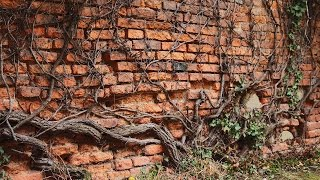

[🠔 Zur Übersicht: Gespräche & Dokus](gespraeche.md)
# Aus der Baugeschichte Lernen – Kalkbauweise
**In diesem Beitrag teilt Konrad Fischer seine Erfahrung und sein Wissen über die Baugeschichte.**   
_mit Konrad Fischer • 16.03.2016_

## Einleitung

Für mich ist Architektur, egal ob am Altbau oder am Neubau, nicht nur ein Gestaltungseffekt, wo man also den großen Wurf wagen muss und vielleicht Architektur neu erfinden. Ich glaube, das ist so schwer, allein gutes Bauen herauszukriegen und die Frage zu beantworten, wie klappt es, dass wir 1000 Jahre alte Dome herumstehen haben oder 500 Jahre alte Fachwerkhäuser? Die zwar gewisse Alterungserscheinungen haben, die aber im großen und Ganzen gut dastehen, gut instand zu halten sind, gut zu bewohnen sind und in keiner Weise irgendwelchen Normen entsprechen.

## Faszination historische Bausubstanz und Ausbildung im Denkmalamt

Das hat mich immer fasziniert. Bin nach meinem Studium dann nach einiger Zeit noch mal zu einem Volontariat im bayerischen Denkmalamt gekommen. Ab parallel zu meiner Büroführung von Montag bis Donnerstag, manchmal auch Freitag, dieses Volontariat abgedient und habe endlich mal die richtige Ausbildung bekommen, die ich brauchte. War erstaunt, welche Experten ich vorgefunden habe in so einem bayerischen Denkmalamt: Gefügeforscher, Archäologen, Restauratoren, Leute, die ein Haus in einer halben Stunde komplett in seiner Baugeschichte überblicken konnten und die mir dann sehr viel gebracht haben an Einblick in die historische Bausubstanz.

## Materialkenntnisse und Bauschäden

Und was gleichzeitig natürlich immer interessant war, dass man an den alten Gebäuden die Bauschäden beobachten konnte und sich Gedanken drüber machen konnte, wo kommen die her oder wie funktionieren verschiedene Sanierungsmöglichkeiten? Und dadurch, dass die Materialfachleute im Denkmalamt, also in der Restaurierungsabteilung, aber auch was ansonsten an Referenten in diese Richtung gebildet war, da war eine starke Neutralität zu spüren, weil man hat ja keine Produkte verkauft, man hat sie auch in der Regel nicht selbst verarbeitet. Und dadurch war eigentlich eine ganz gute Basis, um auch Materialkenntnisse unbeeinflusst von Marketing, sage ich mal, zu erwerben.

## Lernen aus der Baugeschichte: Physik der Baustoffe

Ja, ich glaube, wir können aus der Geschichte und vor allem aus der Baugeschichte für unsere künftige Bauweise sehr viel lernen. Wenn wir jetzt zum Beispiel Mauerwerkskörper anschauen oder auch die berühmten Mauerwerksbauten, die uns die Römer allein hinterlassen haben oder unser europäisches Mittelalter, dann können wir sehr schnell feststellen: Die sind in einer komplett anderen Weise errichtet, als wir das heute uns vorstellen, wenn wir Mauerwerksbau machen. Heute haben wir Mauerwerksnormen, wir haben Mörtelnormen, wir haben allerlei.

Aber die Dauerhaftigkeit dieser historischen Bauten, die beruhen natürlich auf einer perfekten Beherrschung der Baumaterialien. Und da ist zum Beispiel zu berücksichtigen, wie funktioniert denn ein Mörtel als Bindemittel für die Steine mit den Steinen selber? Und das ist eigentlich eine ganz logische Sache: Die Physik muss zusammenpassen. Das heißt, wenn die Physik der verschiedenen Baustoffe zu stark auseinanderdriftet in ihren reinen materiellen physikalischen Verhältnissen wie Temperaturdehnung, Feuchteaufnahme, Abtrocknungsvermögen, Feuchtequellen, Schrumpfen – wenn hier riesige Widersprüche sind zwischen miteinander verbundenen Baustoffen, dann ist das für die Dauerhaftigkeit sehr schädlich.

## Probleme moderner Bauweise im Vergleich zur Tradition

Und so sehen wir heute, wenn wir zum Beispiel mal ein zweischaliges Mauerwerk moderner Bauweise angucken: Da haben wir vor eine dünne Klinkerschale. Die ist verfugt mit einem Mörtel, der etwa das dreifache an Bewegungsvermögen hat. Das heißt, der ist verurteilt dazu, schon nach der ersten Bewitterungsperiode leichte Risse, Flankenabrisse zu bekommen. Die Klinkersteine nehmen den Mörtel gar nicht gut auf. Ihr Saugvermögen ist sehr schlecht, so dass auch viel zu glatte Fugen entstehen, die dann auch sehr schnell abreißen und die gehen dazu über, nun bei Beregnung Wasser reinzusaugen und kriegen dadurch Frosteffekte.

## Vorteile des Kalkmörtels und homogene Baukörper

Und früher hat man eben mit einem ganz einfachen Kalkmörtel gearbeitet. Man hat Sand mit Kalk gemischt. Kalk ist viel weniger energiereich herzustellen als ein Zement. Ein hochoffen Zement braucht ganz andere Brenntemperaturen. Das heißt, auch früher mit den früher den Techniken haben die ohne weiteres Kalk vernünftig brennen können und haben dann den Kalk als Bindemittel gehabt. Der hat zwar nicht so extreme Festigkeiten hervorrufen können wie der Zement, aber er war eben von seiner Physik viel näher dran, also fast identisch mit dem Ziegelstein, so dass sehr homogene Baukörper entstanden sind. Und die konnten dann ja, Jahr ein, Winter, Sommer, Frühling, Herbst, Sommer, Sonne und Mond und Sterne und Frost und Hitze konnten die miteinander aushalten, ohne sich voneinander zu verabschieden.

## Herausforderungen moderner Schichtkonstruktionen

Und das ist oft das Problem moderner Schichtbaustoffe oder Schichtkonstruktionen, dass sich die einzelnen Schichten komplett anders verhalten, wie wir das bei Wärmedämmverbundsystemen wissen, wie wir das aber auch schon bei modernem Mauerwerk kennen, wie wir das bei der Betonbauweise kennen, wo wir in ungeahnter Weise Fugen einbringen müssen, um diese hohen thermischen Dehnungen aufzufangen. Und das ist also eine relativ komplizierte Angelegenheit. Und deswegen auch, weil ich diese Kompliziertheit scheue und weiß, wie schwer Bauen ist überhaupt, versuche ich mit möglichst einfachen und gutmütigen und gut verträglichen Baukonstruktionen, auch im Neubau sowieso auch im Altbau, eben die Bauwerke zu errichten oder zu sanieren.

## Qualität und Physik statt Nostalgie

Es sind also physikalische Gegebenheiten und es wird Kalkfreunden auch oft vorgeworfen: „Ja, das ist so eine Art von Nostalgie, dass man, sage ich mal, aus irgendwelchem Traditionalismus oder falscher Nostalgie oder romantischen Gefühlen mit diesen historisch verbürgten Werkstoffen, Alter Väter, sage ich mal, arbeitet.“ Aber für mich stimmt es nicht. Es ist Qualität und es ist Physik und es ist auch Chemie. Und das ist schon, glaube ich, wenn man die historische Bauweise in ihrer Qualität verstehen will, gehört es unbedingt dazu, auch auf dieser Ebene nicht nur vor schönen Bauwerken zu staunen und sich zu freuen oder sie abzulehnen.

## Ästhetik versus technische Funktionsweise

Viele sagen: „Mir gefällt kein Barock, ich bin für die Romanik, die einfache, schlichte Form.“ Das sind oft Missverständnisse natürlich, aber das ist eigentlich nicht der Zugriff für den Bauingenieur, für den Architekten, für den fürs Handwerk. Die müssen schauen, wie funktioniert der Laden, und Ästhetik ist eine andere Ebene, ist auch wichtig, aber eben ist nicht so zentral, würde ich sagen. Ah.
