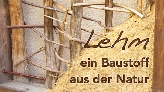

[🠔 Zur Übersicht: Gespräche & Dokus](gespraeche.md)
# Bauen mit Lehm - Doku
**In dieser Dokumentation teilen Konrad Fischer, Hans Georg Unterrainer und Franz Luderscher ihr Wissen und ihre Erfahrung auf dem Gebiet Lehmbau.**   
_mit Konrad Fischer, Hans Georg Unterrainer • 12.02.2016_

<center markdown>

[](https://youtu.be/a42XBuTm4D8)

</center>

## Beginn des Transkripts: Lehm als Baustoff

Ja, leicht verfügbarer Baustoff und äh dadurch auch traditionell fast in allen Kulturen beliebt. Gut, wir lassen mal die Eskimos jetzt auch vor, aber ansonsten finden wir die Lehmbautradition eigentlich in allen Kulturen. Und richtig gemacht kann man auch aus dem Lehm bare Häuser errichten, da gibt’s ja auch keine Debatte drüber. Ich habe auch die ganze Fachliteratur des Lehmbaus habe ich natürlich verschlungen. Der Lehmbau hatte auch eine gute Tradition nach dem Krieg sogar, oder auch schon im Krieg, wie normale Baustoffe, die mit Energiereichtum nur herzustellen waren, wie die immer knapper wurden, äh hat man sich besonnen schon im Dritten Reich, aber auch in der Wiederaufbauzeit auf die Qualitäten von Lehmbauten. Es ging dann aber ganz schnell weg, weil dann eben dieser industrielle Zuwachs dann da war und die industriellen Baustoffe die Überhand bekommen haben.

## Herausforderungen des Lehmbaus in modernen Kontexten

Allein mit dem Lehm, sage ich mal, kann man die deutschen Wohnprobleme nicht lösen. Äh, viele schätzen natürlich die Oberflächeneigenschaften, aber was nützt es alles, wenn ich zu dichte Fenster habe, wie sie auch überall sind, und die ganze Sache nicht systematisch verstanden wird, wenn falsch geheizt wird, falsch gelüftet, falsch befenstert, die Wand auch falsch ist und dann will man mit dem Innenputz Lehm, der nebenbei viel teurer ist als ein Kalkmörtel als Putz, äh, weil das ist sehr aufwendig, trotzdem handwerklich herzustellen, ähm damit kann man es nicht lösen. Und die Hoffnung besteht aber, und in diesen Markt oder in diese Hoffnung hinein kommt nur das Lehm-Marketing. Und da muss man eben auch genug, sag mal, die Sache in ihrer Komplexität erfassen.

Wenn man, ich in jeder Fachwerkreparatur, wo ich noch Lehmgefache habe oder auch wo ich äh Lehmschüttungen oder Lehmpackungen in meinen Decken oder in den Fußböden habe, ja, da bin ich natürlich der Erste, der auch mit Lehm die Tradition weiterführt in der Sanierung. Aber dass ich jetzt aber mal funktionierende alte Konstruktionen rausreiße, um die gegen Lehmbauweise zu ersetzen, wenn ich in Fachwerkefachen eben schon vorfinde, dass sie ausgemauert sind mit Mauersteinen, die reiße ich doch nicht raus, um da wieder mit Lehm und Flechtwerk da einen großen Sport zu entfalten. Das schließt nicht aus, dass ich ein neues Fachwerk auch wieder mit Lehmgeflecht fülle. Habe ich auch gemacht. Muss das eben differenzieren.

## Monolithisches Bauen vs. Schichtsysteme

Solange keine Folien verwende, solange einen durchgehend gleichmäßigen Baustoff habe, wie zum Beispiel Lehm, Lehm und dazwischen Stroh, ist das perfekt. Ja, also wenn ich, wenn ich die Luftdichtheit, die die Winddichtheit mit dem Stroh herstellen kann im Lehm, dann ist es perfekt. Ja, dann habe ich genau dieses System, ich habe einfach eine durchgehende Schicht. Sobald die verschiedene Materialien hab, ja, die vom vom vom Durchgangswert her, von der Feuchtigkeit her verschieden sind, habe ich immer ein Kondensatauswurf, egal wie das berechnet wird. Also die ganze Berechnung von diesem Kondensatauswurf und dass das im Sommer dann eh wieder austrocknet, ist ein kompletter Schwachsinn, weil die Dämmung dann nass ist, wenn sie dämmen soll, nämlich im Winter, und im das nutzt mir nichts, dass das im im Sommer wieder austrocknet, wenn es den ganzen Winter nass ist. Ja, wenn du nasse Socken anziehst und in die Kälte rausgehst, dann, was, wie viel hält der warm? Gar nichts. Und drum ist es wichtig, monolithisch zu bauen. Das heißt, nur einen durchgehenden Baustoff verwenden. Sobald ich andere Folie hab, Dichtbahn oder irgendwas, ist die Wirkung weg.

## Stroh als Baustoff – Feuchtigkeitsproblematik

Und das habe ich bei Lehmbauten eben. Der Lehm ist extrem offen, die Stroh selber auch. Ja, beim Stroh habe ich immer, dass ich dafür sorgen muss, dass ins Stroh keine Feuchtigkeit reinkommt. Ja, jetzt muss ich Ihnen das irgendwie dichter machen, dass eben die Feuchtigkeit nicht ins Stroh reingibt, weil das mockt mal weg, wenn da Feuchtigkeit reinkommt, obwohl es eh recht resistent ist auch gegen Feuchtigkeit, aber zu viel vertrocknet einfach nicht. Und wenn ich im Winter in einer Wohnung wohne, dann ist draußen trocken. Herinnen ist es feucht, weil ich lebe ja da, ich habe Feuchtigkeiten, ich koch da, ich habe selber Ausdünstungen, ich heiz, es ist warm. Das ist wie Kelomat, das ist wie wie Druckkochtopf. Ja. Und irgendwo findet die Feuchtigkeit dann ein Loch, wo sie rauskommt und reinkommt in die Stroh oder in die Dämmung und dann den ganzen Winter und im Frühjahr sieht man dann außen schon die ersten Schimmelpilze und die Ding und so weiter und in dem lebt man ja drinnen, ne? Das ist der Blödsinn. Ja, das ist der Lebensraum. Ja, von dem her ist für mich Stroh nicht so sympathisch, weil weil das Wasser nicht aushält.

## Holz und Lehm-Stroh-Gemisch

Diese Elemente, das Holz, das da Bau-Swimmingpools damit Gartenteiche, das kann ich unter Wasser geben, das Holz und danach wieder ganz normal aufstellen, ohne dass das Schaden nimmt davon, ne? Das Holz einfach genial ist, so wie es ist. Wenn es Stroh-Lehm, wir uns das wieder mischt, das ist wieder was anderes, weil dann hast du wieder den durchgehenden Baustoff. Ja, aber die Strohballenhäuser, die jetzt gebaut werden, ja, als alternative Bauweise, die so, dass die Ballen noch außen und innen mit einer mit einer Holzschicht sozusagen vertäfelt werden, um das Stroh zu schützen. Und da hab ich jetzt wieder diese verschiedenen Schichten und das ist das Problem, nicht außen Breischbaumplatte innen MDF Platte oder OSB Platte wird genommen. Theoretisch ist es natürlich so, dass die Feuchtigkeit dort durchgeht durch die erste Platte und dann durch das Stroh und dann nach außen abgegeben wird. Aber das ist nur Theorie, wenn ich das natürlich mischt, wenn ich sag in dem Lehm her und Stroh hächseln dazu und mache Gemisch raus, dass das wieder homogen ist, das ganze durchgehend gleiche Eigenschaften, dann bin ich wieder bei dem Baustoff, nämlich bei monolithischen Baustoff, wo ich durchgehend die gleiche die gleichen Eigenschaften im Material drinnen hab und dann habe ich diese, habe ich das wieder, die Feuchtigkeit wird ganz regelmäßig durchaus abgegeben. Das Stroh sorgt dafür, dass ich einen Faktor hab und der der Lehm sorgt dafür, dass die Feuchtigkeit abgeführt wird oder in den Raum abgegeben wird, wenn es drinnen zu trocken ist, wie es im Sommer ja meistens ist, ne? Also das ist dann wieder ideal.

## Lehm-Holzhackschnitzel-Stampfbauweise

Ist aber da wieder aufwendiger in der Herstellung, weil die Strohballen, die habe ich nur hingeschlichtet, ja, und dann angeschmiert, ja, aber wenn du dieses Gemisch selber machen musst, dann musst du das irgendwie in Form bringen, musst es schalen, musst es aufbappen. Solche Spannweiten, wie man da sieben Meter oder so ist unmöglich mit so einem Gefüge, da brauchst keine Trägerkonstruktion dazu und so, aber vom Material her selber ist das super, alles was monolithisch ist. Das ist Holzhackschnitzel äh mit Lehm vermengt in Kletter, Stampf, Bauweise. Es wird dann eingestampft und diese Holzhackschnitzel, die verkeilen sich und deswegen gibt’s dann auch die Stabilität, also da. Ja, also die, also die Lehmbau-Stampfweise hier mit den Holzhaltschüsseln, die ist eigentlich äh kinderleicht. Kann eigentlich jeder, wenn man bisschen handwerklich ja äh begabt ist. So, es werden einfach Schaltafeln äh ein an ein an in die Balken geschraubt und wird das Material einfach eingefüllt und gestampft. Dann wird kann austrocknen und so und dann kann man die die Tafel einfach mit wieder lösen mit dem Akkuschrauber und ein eine Stufe höher setzen und dann stampfen wieder ein. Äh problematisch wird’s halt im oberen Bereich so, weil man da nicht mehr hinterfüllen kann. Ja, da muss man dann quasi mit einer Harke dann von oben reinstampfen. So.

## Lehmputz und Fachwerkbau

Beim Lehmputz gibt’s ja verschiedene. Es gibt ein Grobputz und Feinputz. Ja, und das ist Grobputz und äh man sieht einfach noch hier äh die Materialien, die im Lehm drinnen sind. Ja, so handbeschäbig noch drin und es gibt einfach so eine, also eine wunderbare Stabilität irgendwie so und äh kratzfest. Ja. Und ich bin also total begeistert von dieser äh Konstruktion. Ich sag mal so, wenn der frühere Handwerker die Chance gehabt hat, Ziegelstein zu bekommen, hat er lieber den Ziegelstein da reingebaut als mit Lehm und mit den damit verbundenen Komplikationen Richtung Bautrocknen, Schwund, alles was da eine Rolle spielt, mühsames Beschichten, äh war alles nicht so einfach und wenn er da eine Packung Packste Steine reingeschmissen hat in sein Gefache, da ist er dann doch auch äh sag mal bequemer fertig geworden ohne Qualitätsnachteile. Und von der Wärmehaltung, gut, das deutsche Fachwerk ist im Durchschnitt zwischen 13 und 15 Zentimeter stark. Ob ich da jetzt ein Lehm im Gefach habe oder ein Backstein, das ist in der Massivität kein großer Unterschied, sage ich mal. Gut, den Lehm, den kann man abmagern, hat ein bisschen mehr Dämmwirkung. Ist vielleicht auch Holzgeflecht da noch mit drin. Da gibt’s schon Unterschiede, aber ob die dann äh sich in der Beheizung des ganzen Hauses so stark ausgewirkt haben, weiß ich nicht. Also, glaube ich, kann man nicht so jetzt richtig greifbar machen.

## Materialdichte und Wärmeleitfähigkeit

Ja, das Problem ist ja folgendes. Wenn ich äh die Materialdichte als Ausgang nehme, äh die in auch in Korrespondenz steht mit der Wärmeleitfähigkeit, dann kann man sagen, eine massive Außenwand, also mit möglichst hoher Materialdichte oder Rohdichte des Baustoffs, kann am meisten Solarenergie aufnehmen und reinsaugen. Falle für Sonnenenergie funktioniert natürlich ein massives Mauerwerk am besten. Wenn wir aber bis zur Innenoberfläche uns das fortsetzen, diesen Gedanken einer möglichst hohen Massivität, dann nimmt ein massiver Baustoff auch aus einer erwärmten Luft oder aus einer Wärmestrahlungsquelle viel mehr Energie raus, bis er auf Temperatur kommt, auf eine Oberflächentemperatur, die ich als Mensch in diesem Wohnraum haben will. Das heißt, was innen gut ist, muss nicht außen gut sein und umgekehrt.

Und deswegen, sage ich mal, ist auch der historische Fachwerkbau, der hat nicht unbedingt eine Lehmoberfläche, sondern hat auch da schon einen wesentlichen porigeren äh Baustoff gehabt und zwar dann eben ein Kalkmörtel, ja, oder hat auch Wandbespannungen gekannt oder Holzverkleidungen in Wohnräumen. Also, da hat man schon Wandteppiche, hat verschiedene Strategien gehabt, um die Wärmeaufnahme der Innenseite der Gebäudehülle zu vermindern. Wenn das nicht mit so großen Feuchteproblemen verbunden wäre, wäre es heute auch noch die ideale Sache, außen massiv, um möglichst viel Solarenergie einzutanken, auch in im Winter, in der Heizperiode und innen möglichst geringe Wärmeaufnahme. Das bedeutet, dass eben sehr schnell durch Heizung auch eine Oberflächentemperatur zu bekommen ist, die uns Menschen dann angenehm ist.```
## Beginn des Transkripts: Lehm als Baustoff

Ja, leicht verfügbarer Baustoff und äh dadurch auch traditionell fast in allen Kulturen beliebt. Gut, wir lassen mal die Eskimos jetzt auch vor, aber ansonsten finden wir die Lehmbautradition eigentlich in allen Kulturen. Und richtig gemacht kann man auch aus dem Lehm bare Häuser errichten, da gibt’s ja auch keine Debatte drüber. Ich habe auch die ganze Fachliteratur des Lehmbaus habe ich natürlich verschlungen. Der Lehmbau hatte auch eine gute Tradition nach dem Krieg sogar, oder auch schon im Krieg, wie normale Baustoffe, die mit Energiereichtum nur herzustellen waren, wie die immer knapper wurden, äh hat man sich besonnen schon im Dritten Reich, aber auch in der Wiederaufbauzeit auf die Qualitäten von Lehmbauten. Es ging dann aber ganz schnell weg, weil dann eben dieser industrielle Zuwachs dann da war und die industriellen Baustoffe die Überhand bekommen haben.

## Herausforderungen des Lehmbaus in modernen Kontexten

Allein mit dem Lehm, sage ich mal, kann man die deutschen Wohnprobleme nicht lösen. Äh, viele schätzen natürlich die Oberflächeneigenschaften, aber was nützt es alles, wenn ich zu dichte Fenster habe, wie sie auch überall sind, und die ganze Sache nicht systematisch verstanden wird, wenn falsch geheizt wird, falsch gelüftet, falsch befenstert, die Wand auch falsch ist und dann will man mit dem Innenputz Lehm, der nebenbei viel teurer ist als ein Kalkmörtel als Putz, äh, weil das ist sehr aufwendig, trotzdem handwerklich herzustellen, ähm damit kann man es nicht lösen. Und die Hoffnung besteht aber, und in diesen Markt oder in diese Hoffnung hinein kommt nur das Lehm-Marketing. Und da muss man eben auch genug, sag mal, die Sache in ihrer Komplexität erfassen.

Wenn man, ich in jeder Fachwerkreparatur, wo ich noch Lehmgefache habe oder auch wo ich äh Lehmschüttungen oder Lehmpackungen in meinen Decken oder in den Fußböden habe, ja, da bin ich natürlich der Erste, der auch mit Lehm die Tradition weiterführt in der Sanierung. Aber dass ich jetzt aber mal funktionierende alte Konstruktionen rausreiße, um die gegen Lehmbauweise zu ersetzen, wenn ich in Fachwerkefachen eben schon vorfinde, dass sie ausgemauert sind mit Mauersteinen, die reiße ich doch nicht raus, um da wieder mit Lehm und Flechtwerk da einen großen Sport zu entfalten. Das schließt nicht aus, dass ich ein neues Fachwerk auch wieder mit Lehmgeflecht fülle. Habe ich auch gemacht. Muss das eben differenzieren.

## Monolithisches Bauen vs. Schichtsysteme

Solange keine Folien verwende, solange einen durchgehend gleichmäßigen Baustoff habe, wie zum Beispiel Lehm, Lehm und dazwischen Stroh, ist das perfekt. Ja, also wenn ich, wenn ich die Luftdichtheit, die die Winddichtheit mit dem Stroh herstellen kann im Lehm, dann ist es perfekt. Ja, dann habe ich genau dieses System, ich habe einfach eine durchgehende Schicht. Sobald die verschiedene Materialien hab, ja, die vom vom vom Durchgangswert her, von der Feuchtigkeit her verschieden sind, habe ich immer ein Kondensatauswurf, egal wie das berechnet wird. Also die ganze Berechnung von diesem Kondensatauswurf und dass das im Sommer dann eh wieder austrocknet, ist ein kompletter Schwachsinn, weil die Dämmung dann nass ist, wenn sie dämmen soll, nämlich im Winter, und im das nutzt mir nichts, dass das im im Sommer wieder austrocknet, wenn es den ganzen Winter nass ist. Ja, wenn du nasse Socken anziehst und in die Kälte rausgehst, dann, was, wie viel hält der warm? Gar nichts. Und drum ist es wichtig, monolithisch zu bauen. Das heißt, nur einen durchgehenden Baustoff verwenden. Sobald ich andere Folie hab, Dichtbahn oder irgendwas, ist die Wirkung weg.

## Stroh als Baustoff – Feuchtigkeitsproblematik

Und das habe ich bei Lehmbauten eben. Der Lehm ist extrem offen, die Stroh selber auch. Ja, beim Stroh habe ich immer, dass ich dafür sorgen muss, dass ins Stroh keine Feuchtigkeit reinkommt. Ja, jetzt muss ich Ihnen das irgendwie dichter machen, dass eben die Feuchtigkeit nicht ins Stroh reingibt, weil das mockt mal weg, wenn da Feuchtigkeit reinkommt, obwohl es eh recht resistent ist auch gegen Feuchtigkeit, aber zu viel vertrocknet einfach nicht. Und wenn ich im Winter in einer Wohnung wohne, dann ist draußen trocken. Herinnen ist es feucht, weil ich lebe ja da, ich habe Feuchtigkeiten, ich koch da, ich habe selber Ausdünstungen, ich heiz, es ist warm. Das ist wie Kelomat, das ist wie wie Druckkochtopf. Ja. Und irgendwo findet die Feuchtigkeit dann ein Loch, wo sie rauskommt und reinkommt in die Stroh oder in die Dämmung und dann den ganzen Winter und im Frühjahr sieht man dann außen schon die ersten Schimmelpilze und die Ding und so weiter und in dem lebt man ja drinnen, ne? Das ist der Blödsinn. Ja, das ist der Lebensraum. Ja, von dem her ist für mich Stroh nicht so sympathisch, weil weil das Wasser nicht aushält.

## Holz und Lehm-Stroh-Gemisch

Diese Elemente, das Holz, das da Bau-Swimmingpools damit Gartenteiche, das kann ich unter Wasser geben, das Holz und danach wieder ganz normal aufstellen, ohne dass das Schaden nimmt davon, ne? Das Holz einfach genial ist, so wie es ist. Wenn es Stroh-Lehm, wir uns das wieder mischt, das ist wieder was anderes, weil dann hast du wieder den durchgehenden Baustoff. Ja, aber die Strohballenhäuser, die jetzt gebaut werden, ja, als alternative Bauweise, die so, dass die Ballen noch außen und innen mit einer mit einer Holzschicht sozusagen vertäfelt werden, um das Stroh zu schützen. Und da hab ich jetzt wieder diese verschiedenen Schichten und das ist das Problem, nicht außen Breischbaumplatte innen MDF Platte oder OSB Platte wird genommen. Theoretisch ist es natürlich so, dass die Feuchtigkeit dort durchgeht durch die erste Platte und dann durch das Stroh und dann nach außen abgegeben wird. Aber das ist nur Theorie, wenn ich das natürlich mischt, wenn ich sag in dem Lehm her und Stroh hächseln dazu und mache Gemisch raus, dass das wieder homogen ist, das ganze durchgehend gleiche Eigenschaften, dann bin ich wieder bei dem Baustoff, nämlich bei monolithischen Baustoff, wo ich durchgehend die gleiche die gleichen Eigenschaften im Material drinnen hab und dann habe ich diese, habe ich das wieder, die Feuchtigkeit wird ganz regelmäßig durchaus abgegeben. Das Stroh sorgt dafür, dass ich einen Faktor hab und der der Lehm sorgt dafür, dass die Feuchtigkeit abgeführt wird oder in den Raum abgegeben wird, wenn es drinnen zu trocken ist, wie es im Sommer ja meistens ist, ne? Also das ist dann wieder ideal.

## Lehm-Holzhackschnitzel-Stampfbauweise

Ist aber da wieder aufwendiger in der Herstellung, weil die Strohballen, die habe ich nur hingeschlichtet, ja, und dann angeschmiert, ja, aber wenn du dieses Gemisch selber machen musst, dann musst du das irgendwie in Form bringen, musst es schalen, musst es aufbappen. Solche Spannweiten, wie man da sieben Meter oder so ist unmöglich mit so einem Gefüge, da brauchst keine Trägerkonstruktion dazu und so, aber vom Material her selber ist das super, alles was monolithisch ist. Das ist Holzhackschnitzel äh mit Lehm vermengt in Kletter, Stampf, Bauweise. Es wird dann eingestampft und diese Holzhackschnitzel, die verkeilen sich und deswegen gibt’s dann auch die Stabilität, also da. Ja, also die, also die Lehmbau-Stampfweise hier mit den Holzhaltschüsseln, die ist eigentlich äh kinderleicht. Kann eigentlich jeder, wenn man bisschen handwerklich ja äh begabt ist. So, es werden einfach Schaltafeln äh ein an ein an in die Balken geschraubt und wird das Material einfach eingefüllt und gestampft. Dann wird kann austrocknen und so und dann kann man die die Tafel einfach mit wieder lösen mit dem Akkuschrauber und ein eine Stufe höher setzen und dann stampfen wieder ein. Äh problematisch wird’s halt im oberen Bereich so, weil man da nicht mehr hinterfüllen kann. Ja, da muss man dann quasi mit einer Harke dann von oben reinstampfen. So.

## Lehmputz und Fachwerkbau

Beim Lehmputz gibt’s ja verschiedene. Es gibt ein Grobputz und Feinputz. Ja, und das ist Grobputz und äh man sieht einfach noch hier äh die Materialien, die im Lehm drinnen sind. Ja, so handbeschäbig noch drin und es gibt einfach so eine, also eine wunderbare Stabilität irgendwie so und äh kratzfest. Ja. Und ich bin also total begeistert von dieser äh Konstruktion. Ich sag mal so, wenn der frühere Handwerker die Chance gehabt hat, Ziegelstein zu bekommen, hat er lieber den Ziegelstein da reingebaut als mit Lehm und mit den damit verbundenen Komplikationen Richtung Bautrocknen, Schwund, alles was da eine Rolle spielt, mühsames Beschichten, äh war alles nicht so einfach und wenn er da eine Packung Packste Steine reingeschmissen hat in sein Gefache, da ist er dann doch auch äh sag mal bequemer fertig geworden ohne Qualitätsnachteile. Und von der Wärmehaltung, gut, das deutsche Fachwerk ist im Durchschnitt zwischen 13 und 15 Zentimeter stark. Ob ich da jetzt ein Lehm im Gefach habe oder ein Backstein, das ist in der Massivität kein großer Unterschied, sage ich mal. Gut, den Lehm, den kann man abmagern, hat ein bisschen mehr Dämmwirkung. Ist vielleicht auch Holzgeflecht da noch mit drin. Da gibt’s schon Unterschiede, aber ob die dann äh sich in der Beheizung des ganzen Hauses so stark ausgewirkt haben, weiß ich nicht. Also, glaube ich, kann man nicht so jetzt richtig greifbar machen.

## Materialdichte und Wärmeleitfähigkeit

Ja, das Problem ist ja folgendes. Wenn ich äh die Materialdichte als Ausgang nehme, äh die in auch in Korrespondenz steht mit der Wärmeleitfähigkeit, dann kann man sagen, eine massive Außenwand, also mit möglichst hoher Materialdichte oder Rohdichte des Baustoffs, kann am meisten Solarenergie aufnehmen und reinsaugen. Falle für Sonnenenergie funktioniert natürlich ein massives Mauerwerk am besten. Wenn wir aber bis zur Innenoberfläche uns das fortsetzen, diesen Gedanken einer möglichst hohen Massivität, dann nimmt ein massiver Baustoff auch aus einer erwärmten Luft oder aus einer Wärmestrahlungsquelle viel mehr Energie raus, bis er auf Temperatur kommt, auf eine Oberflächentemperatur, die ich als Mensch in diesem Wohnraum haben will. Das heißt, was innen gut ist, muss nicht außen gut sein und umgekehrt.

Und deswegen, sage ich mal, ist auch der historische Fachwerkbau, der hat nicht unbedingt eine Lehmoberfläche, sondern hat auch da schon einen wesentlichen porigeren äh Baustoff gehabt und zwar dann eben ein Kalkmörtel, ja, oder hat auch Wandbespannungen gekannt oder Holzverkleidungen in Wohnräumen. Also, da hat man schon Wandteppiche, hat verschiedene Strategien gehabt, um die Wärmeaufnahme der Innenseite der Gebäudehülle zu vermindern. Wenn das nicht mit so großen Feuchteproblemen verbunden wäre, wäre es heute auch noch die ideale Sache, außen massiv, um möglichst viel Solarenergie einzutanken, auch in im Winter, in der Heizperiode und innen möglichst geringe Wärmeaufnahme. Das bedeutet, dass eben sehr schnell durch Heizung auch eine Oberflächentemperatur zu bekommen ist, die uns Menschen dann angenehm ist.
